# 第四章：自定义帖子类型的强大之处

本章通过以下主题涵盖了 WordPress 最强大的功能之一：自定义帖子类型：

+   创建自定义帖子类型

+   向自定义帖子类型编辑器添加新部分

+   使用自定义布局显示单个自定义帖子类型项

+   在短代码中显示自定义帖子类型数据

+   为自定义帖子类型添加自定义分类

+   向分类添加自定义字段

+   从自定义帖子类型编辑器中隐藏分类编辑器

+   在自定义帖子列表页面显示额外列

+   在自定义帖子列表页面添加自定义分类过滤器

+   为自定义分类添加快速编辑字段

+   使用插件过滤器更新页面标题以包含自定义帖子数据

# 简介

建立在开放性和易用性的历史基础上，WordPress 在引入自定义帖子类型时达到了定制的新的高度。

自定义帖子类型是通过使用 WordPress API 创建的新类别项目，它们在 WordPress 管理界面中作为全新的部分出现，位于默认的帖子（Posts）和页面（Pages）部分旁边。这些自定义项目可以用来存储任何类型的信息，包括事件、错误报告、食谱、电影评论等等。

当使用自定义帖子类型来实现此类功能时，开发者可以利用 WordPress 内部内容编辑功能，包括其强大的文本编辑器和用户友好的媒体上传器。自定义帖子类型还简化了开发者的数据管理，因为这些新条目相关的所有信息都使用现有的表结构存储在网站数据库中。最后，自定义帖子类型可以利用已建立的主题和模板系统来显示网站管理员存储在这些新内容类型中的信息。

如果你曾经窥视过 WordPress 网站背后的 MySQL 数据库，你就会知道帖子（posts）、页面（pages）、附件（attachments）、修订（revisions）和导航菜单项共享相同的表。本质上，所有这些数据元素都是自定义帖子类型，其中一些使用标准文本编辑器，而其他，如导航菜单，则有一个自定义管理界面。这些项目类型中的每一个也有不同的机制在网站上显示。

使用自定义帖子类型可以打开无限的可能性来定制 WordPress 安装的功能，并为最终用户提供定制解决方案，而无需投入大量时间重新发明轮子。本章通过创建一个书评系统，涵盖了创建自定义帖子类型的所有方面，包括创建新类型的元素，在网站上显示新存储的信息，以及定制环境以创建具有独特功能的编辑器。

# 创建自定义帖子类型

自定义文章类型的初始创建非常简单。它只需要从动作钩子回调中调用一个函数。一旦设置好，许多功能立即对管理员和网站访客可用。本菜谱展示了如何创建一个新自定义文章类型，该类型将用于存储书籍评论。

# 准备工作

您应该能够访问一个 WordPress 开发环境，无论是在您的本地计算机上还是在远程服务器上，您将能够加载您的新插件文件。

# 如何实现...

1.  导航到您的开发安装的 WordPress 插件目录。

1.  创建一个名为`ch4-book-reviews`的新目录。

1.  导航到该目录并创建一个名为`ch4-book-reviews.php`的新文本文件。

1.  在代码编辑器中打开新文件，并在插件文件顶部添加一个适当的标题，命名为`第四章 - 书籍评论`。

1.  添加以下代码行以注册一个函数，该函数将在 WordPress 生成页面时的初始化阶段执行：

```php
add_action( 'init', 'ch4_br_create_book_post_type' ); 
```

1.  添加以下代码块以提供`ch4_br_create_book_post_type`函数的实现：

```php
function ch4_br_create_book_post_type() { 
    register_post_type( 'book_reviews', 
        array( 
            'labels' => array( 
                'name' => 'Book Reviews', 
                'singular_name' => 'Book Review', 
                'add_new' => 'Add New', 
                'add_new_item' => 'Add New Book Review', 
                'edit' => 'Edit', 
                'edit_item' => 'Edit Book Review', 
                'new_item' => 'New Book Review', 
                'view' => 'View', 
                'view_item' => 'View Book Review', 
                'search_items' => 'Search Book Reviews', 
                'not_found' => 'No Book Reviews found', 
                'not_found_in_trash' =>  
                    'No Book Reviews found in Trash', 
                'parent' => 'Parent Book Review'                     
            ), 
            'public' => true, 
            'menu_position' => 20, 
            'supports' =>  
                array( 'title', 'editor', 'comments', 
                       'thumbnail', 'custom-fields' ), 
            'taxonomies' => array( '' ), 
            'menu_icon' =>  
                plugins_url( 'book-reviews.png', __FILE__ ), 
            'has_archive' => true,
            'exclude_from_search' => true 
        ) 
    ); 
} 
```

1.  保存并关闭插件文件。

1.  从网站，例如 IconArchive ([`www.iconarchive.com`](http://www.iconarchive.com))，找到并下载一个 24 x 24 像素的 PNG 格式书籍图标，将其调整大小为 20 x 20 像素，并将其保存为`book-reviews.png`到插件目录中。

1.  导航到插件管理页面并激活`第四章 - 书籍评论`插件。

1.  点击新出现的“书籍评论”菜单项，位于页面部分下，以查看书籍评论创建和管理界面。

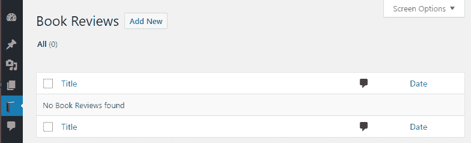

1.  点击标题旁边的“添加新内容”按钮，以显示具有完整 WordPress 文本编辑器、自定义字段编辑器、评论控制、发布控制和特色图片部分的书籍评论编辑器。

1.  通过指定书籍评论标题（例如，`WordPress 插件开发秘籍`）和简短描述来填写新条目。

1.  滚动到“自定义字段”部分，将字段的名称输入为`book_author`，其值为`Yannick Lefebvre`。点击“添加自定义字段”以创建第二个字段。

如果您的 WordPress 安装中已经存在一些自定义字段（来自其他插件的数据输入），您需要点击“输入新内容”才能将名称设置为`book_author`。

1.  将第二个字段的名称设置为`book_rating`，其值为`5`。

1.  从网站，例如 Google 图片 ([`images.google.com`](https://images.google.com)) 或 Packt ([`www.packtpub.com`](https://www.packtpub.com))，找到并下载书籍封面图片。

1.  点击编辑界面右侧侧边栏中的“设置特色图片”链接。

1.  点击“选择文件”以选择您下载到计算机上的图片，并让 WordPress 将其上传到您网站的`wp-content/uploads`文件夹。

1.  一旦文件上传并且 WordPress 显示其信息，请查看媒体上传对话框的底部并点击“设置特色图片”链接，将其与您正在创建的图书评论关联。

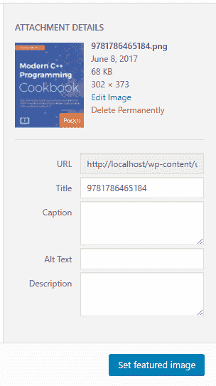

1.  点击“发布”按钮以保存第一个图书评论。

1.  访问设置菜单中的“永久链接”部分，并点击“保存更改”按钮（不更改您的永久链接设置）。

1.  返回您创建的图书评论，并点击“查看图书评论”按钮，在您的网页浏览器中查看新创建的内容。

# 它是如何工作的...

通过调用`register_post_type`函数，整个 WordPress 环境都会意识到这个新帖子类型的存在。这种意识包括创建一个专门的区域来创建和编辑此类型的帖子，以及处理图书评论的网页请求的能力。

如本食谱开头所述，该函数非常简单易用，只需两个参数：

```php
register_post_type( $post_type, $args ); 
```

第一个参数是一个表示帖子类型的文本字符串。请注意，在选择此名称时，它将用作所有使用新类型的项目的默认永久链接值，并且它应该足够独特，以避免与其他插件发生潜在冲突。

第二个参数是一个属性数组，它指定了新帖子类型的特点并决定了如何编辑此类型。

在这个特定示例中，属性数组的第一个元素实际上是一个数组，它包含了一些标签。这些标签指示在管理在新帖子类型下创建的项目时应显示的文本字符串。例如，如果我们查看步骤 11 之前的截图，消息“未找到图书评论”直接来自此数组中`not_found`标签的定义。

第二个参数名为`public`，它决定了帖子类型的行政界面是否应该显示以管理它，以及访客是否能够查看单个项目。接下来是配置数组中的`menu_position`成员，它表示新元素在行政菜单中的期望位置。在这个例子中，值 20 表示它应该显示在“页面”菜单项之后。访问 WordPress Codex（[`codex.wordpress.org/Function_Reference/register_post_type`](https://codex.wordpress.org/Function_Reference/register_post_type)）以获取此参数所有潜在值及其相关位置的完整列表。

`supports`参数是另一个数组，它指示对于使用自定义帖子类型的项，内容编辑器应显示哪些部分。在这种情况下，我们省略了一些部分，如“作者”、“摘要”、“引用”、“修订”、“页面属性”和“帖子格式”，因为它们对于图书评论来说不是必需的。

配置数组中的下几个参数表示我们目前不想定义自定义分类法，并指定在管理菜单中显示在帖子类型名称旁边的图像文件的路径和名称。最后，最后两个参数确定当用户访问网站的 `/book_reviews` 页面时，WordPress 是否应该为新的类型提供一个存档列表页面，以及书籍评论是否应该从搜索结果中排除。

实际上，还有许多其他参数可以包含在配置数组中，以更精确地控制新自定义帖子类型的一些方面。请访问 WordPress Codex ([`codex.wordpress.org/Function_Reference/register_post_type`](https://codex.wordpress.org/Function_Reference/register_post_type)) 了解更多相关信息。

# 还有更多...

虽然默认情况下使用内部帖子类型名称来生成帖子永久链接，但实际上可以覆盖它以创建更美观的 URL。

# 修改自定义帖子类型永久链接的别名

自定义帖子类型配置的可选成员是 `rewrite` 参数。它可以定义如下：

```php
'rewrite' => array( 'slug' => 'awesome-book-reviews' ) 
```

虽然这看起来可能非常简单，但只有在您进入“永久链接”部分并保存更改后，永久链接才会更改，就像我们在食谱中所做的那样。或者，您可以从 WordPress 重写模块中调用程序来请求重新构建永久链接配置。由于这不是每次 WordPress 显示页面时都应该做的事情，而且在插件初始化或升级时做这件事可能太早了，所以一个好的调用这些函数的地方是在插件选项存储函数中。您甚至可以决定在插件配置页面上允许管理员指定他们自己的别名。重置永久链接规则的代码如下：

```php
global $wp_rewrite; 
$wp_rewrite->flush_rules(); 
```

# 在自定义帖子类型编辑器中添加新部分

虽然到目前为止已经实施的自定义帖子编辑器是功能性的，但它并不是最友好的用户界面，尤其是在自定义字段部分，用户在创建新项目时需要输入或选择每个字段的名称。一种更干净的方法是使用我们在上一章中看到的元框机制创建一个自定义界面，以显示与书籍评论相关联的所有数据。

这个食谱展示了如何创建一个与自定义帖子类型相关联的元框，以及如何保存在新界面中输入的信息。

# 准备工作

您应该已经遵循了 *创建自定义文章类型* 的配方，以便为本配方提供一个起点，并且生成的插件仍然在您的开发站点中处于活动状态。或者，您可以从 Packt 网站下载的代码包（[`www.packtpub.com/support`](https://www.packtpub.com/support)）中获取生成的代码（`Chapter 4/ch4-book-reviews/ch4-book-reviews-v1.php`），并将文件重命名为 `ch4-book-reviews.php`。

# 如何做到这一点...

1.  导航到开发安装的 WordPress 插件目录中的 `ch4-book-reviews` 文件夹。

1.  在代码编辑器中打开 `ch4-book-reviews.php` 文件。

1.  在现有函数之后添加以下代码行以注册一个在访问管理界面时调用的函数：

```php
add_action( 'admin_init', 'ch4_br_admin_init' ); 
```

1.  将以下代码段添加以提供 `ch4_br_admin_init` 函数的实现并注册一个与 `book_reviews` 文章类型关联的元框：

```php
function ch4_br_admin_init() { 
    add_meta_box( 'ch4_br_review_details_meta_box',  
                  'Book Review Details', 
                  'ch4_br_display_review_details_meta_box', 
                  'book_reviews', 'normal', 'high' ); 
} 
```

1.  插入此函数以实现 `ch4_br_display_review_details_meta_box` 函数并渲染元框内容：

```php
function ch4_br_display_review_details_meta_box( $book_review ) {  
    // Retrieve current author and rating based on review ID 
    $book_author = 
          esc_html( get_post_meta( $book_review->ID, 
                                   'book_author', true ) ); 
    $book_rating = 
          intval( get_post_meta( $book_review->ID,
                                 'book_rating', true ) ); 
    ?> 
    <table> 
        <tr> 
            <td style="width: 100%">Book Author</td> 
            <td><input type="text" size="80" 
                       name="book_review_author_name" 
                       value="<?php echo $book_author; ?>" /></td> 
        </tr> 
        <tr> 
            <td style="width: 150px">Book Rating</td> 
            <td> 
                <select style="width: 100px" 
                        name="book_review_rating"> 
                <!-- Loop to generate items in dropdown list -->
                <?php
                for ( $rating = 5; $rating >= 1; $rating -- ) { ?> 
                <option value="<?php echo $rating; ?>"
                <?php echo selected( $rating, $book_rating ); ?>>
                <?php echo $rating; ?> stars 
                <?php } ?> 
                </select> 
            </td> 
        </tr> 
    </table> 
 <?php } 
```

1.  添加以下代码段以注册一个在将帖子保存到数据库时调用的函数：

```php
add_action( 'save_post', 'ch4_br_add_book_review_fields', 10, 2 ); 
```

1.  为之前 `add_action` 调用中定义的 `ch4_br_add_book_review_fields` 函数添加实现：

```php
function ch4_br_add_book_review_fields( $book_review_id,
                                        $book_review ) { 
    // Check post type for book reviews 
    if ( 'book_reviews' == $book_review->post_type ) { 
        // Store data in post meta table if present in post data 
        if ( isset( $_POST['book_review_author_name'] ) ) {
            update_post_meta( $book_review_id, 'book_author', 
                sanitize_text_field( 
                    $_POST['book_review_author_name'] ) ); 
        } 

        if ( isset( $_POST['book_review_rating'] ) && 
             !empty( $_POST['book_review_rating'] ) ) {            
            update_post_meta( $book_review_id, 'book_rating', 
                intval( $_POST['book_review_rating'] ) ); 
        } 
    } 
} 
```

1.  在开发安装的 WordPress 插件目录的 `ch4-book-reviews` 文件夹中找到 `ch4_br_create_book_post_type` 函数，其中最初创建了新的书籍类型，并从 `supports` 数组中删除 `custom-fields` 元素：

```php
   'supports' => array( 'title', 'editor', 'comments', 'thumbnail' ), 
```

1.  保存并关闭插件文件。

1.  打开之前创建的图书评论，查看新的图书评论详情元框，其中包含一个文本字段用于指定作者和一个下拉列表用于评分：

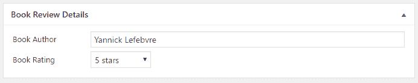

# 它是如何工作的...

此配方使用 WordPress 内置的元框系统创建一个干净的界面，允许用户管理特定于自定义文章类型的字段，而无需使用繁琐的默认自定义字段编辑器。正如我们在第三章，“用户设置和管理页面”中看到的，可以使用 `add_meta_box` 函数创建自定义元框。除了声明元框并将其与自定义文章类型关联外，`add_meta_box` 还定义了一个回调，负责渲染框的内容。

配方的下一部分实现了渲染元框内容的函数。正如我们所见，这个框接收一个包含正在显示在文章编辑器中的书评信息的对象变量。使用这个对象，我们的代码检索文章 ID，并使用它来查询网站数据库以获取与条目关联的书籍作者和评分。一旦从数据库中检索到自定义字段数据，就可以用于在屏幕上渲染作者和评分字段。当创建新的书评时，对 `get_post_meta` 的两次调用都将返回空字符串，导致显示一个空文本字段和下拉列表中的最后一个条目。

`get_post_meta` 函数用于检索存储在文章编辑器自定义字段部分的已存储数据，并具有三个参数：

```php
get_post_meta( $post_id, $field_name, $single ); 
```

第一个参数是文章 ID，这个 ID 可以通过使用 `get_the_ID()` 模板函数轻松获取。这个 ID 用于识别与自定义信息关联的文章。第二个参数是自定义字段名称，它应该与在文章编辑器中创建时指定的名称相匹配。第三个和最后一个参数表示返回值应该是单个值还是值的数组。如果设置为 `false`，即使自定义字段只包含单个值，它也会生成包含单个元素的数组。在大多数情况下，应该将其设置为 `true` 以接收可以直接访问的单个值。

此配方的最后几个步骤负责注册一个函数，当网站管理员保存或删除所有类型的文章时，该函数将被调用。由于它将处理所有类型的数据，保存回调必须首先检查接收到的文章数据的类型。如果是书评，代码将接着检查接收到的数据是否有效，并将信息存储在文章元数据表中。在此配方中，`update_post_meta` 函数的参数与 `get_post_meta` 函数类似，除了第三个参数，它用于指定要存储的数据。

关于此配方需要提到的最后一个细节是，在将回调关联到 `save_post` 动作钩子时使用 `add_action` 函数的第四个参数。此参数表示注册的回调将接收两个参数。如果此参数未设置，回调函数将永远不会收到那第二份数据。

# 参见

+   *创建自定义文章类型* 的配方

+   在第三章 *用户设置和管理页面* 中的 *使用元框格式化管理页面* 配方 [0346c3c6-27ee-45fb-bfd6-df398e04b2b4.xhtml]

# 使用自定义布局显示单个自定义文章类型项

当显示我们在新自定义帖子类型中创建的条目时，我们当前网站主题提供的默认布局可能无法始终愉快地显示其中包含的信息。在大多数情况下，您将能够看到主要帖子内容，但看不到与帖子关联的任何自定义字段数据。

本配方展示了如何创建一个自定义布局来显示我们在上一个配方中创建的书籍评论中存储的所有元素。

# 准备工作

您应该已经遵循了*向自定义帖子类型编辑器添加新部分*的配方，以便为本配方提供一个起点，并且生成的插件仍然在您的开发站点中处于活动状态。或者，您可以从下载的代码包中获取生成的代码（`Chapter 4/ch4-book-reviews/ch4-book-reviews-v2.php`），并将文件重命名为`ch4-book-reviews.php`。

# 如何操作...

1.  导航到您的开发安装的 WordPress 插件目录中的`ch4-book-reviews`文件夹。

1.  在代码编辑器中打开`ch4-book-reviews.php`文件。

1.  在注册一个函数以在 WordPress 决定使用哪个主题模板来渲染内容时，在现有函数之后添加以下代码行：

```php
add_filter( 'template_include', 'ch4_br_template_include', 1 ); 
```

1.  将以下代码部分添加到为`ch4_br_template_include`函数提供一个实现的代码部分：

```php
function ch4_br_template_include( $template_path ) {      
    if ( 'book_reviews' == get_post_type() ) { 
        if ( is_single() ) { 
            // checks if the file exists in the theme first, 
            // otherwise install content filter 
            if ( $theme_file = locate_template( array
                 ( 'single-book_reviews.php' ) ) ) { 
                $template_path = $theme_file; 
            } else { 
                add_filter( 'the_content',
                            'ch4_br_display_single_book_review',
                            20 ); 
            } 
        } 
    } 
    return $template_path; 
} 
```

1.  将以下代码部分添加到实现`ch4_br_display_single_book_review`函数以显示书籍评论，包括它们的自定义字段：

```php
function ch4_br_display_single_book_review( $content ) {
    if ( !empty( get_the_ID() ) ) {
        // Display featured image in right-aligned floating div
        $content = '<div style="float: right; margin: 10px">';
        $content .= get_the_post_thumbnail( get_the_ID(),
                                            'medium' );
        $content .= '</div>';

        $content .= '<div class="entry-content">'; 

        // Display Author Name
        $content .= '<strong>Author: </strong>';
        $content .= esc_html( get_post_meta( get_the_ID(),
                                             'book_author', 
                                             true ) );
        $content .= '<br />';

        // Display yellow stars based on rating -->
        $content .= '<strong>Rating: </strong>';

        $nb_stars = intval( get_post_meta( get_the_ID(),
                                           'book_rating', 
                                           true ) );

        for ( $star_counter = 1; $star_counter <= 5; 
                  $star_counter++ ) {
            if ( $star_counter <= $nb_stars ) {
                $content .= '                                         __FILE__ ) . '" 
                            />';
            } else {
                $content .= '                            . '" />';
            }
        }

        // Display book review contents
        $content .= '<br /><br />';
        $content .= get_the_content( get_the_ID() );
        $content .= '</div>';

        return $content;
    }
} 
```

1.  保存并关闭插件文件。

1.  从像 IconArchive([`www.iconarchive.com`](http://www.iconarchive.com))这样的网站找到一个 32 x 32 像素的 PNG 格式像素星形图标，并将其保存为`star-icon.png`在插件目录中。

1.  使用任何图形处理工具（例如，位于[`www.xnview.com/en/`](http://www.xnview.com/en/)的免费多平台 XnViewMP 工具）创建星形图标的灰度版本，并将其保存为`star-icon-grey.png`。

1.  前往书籍评论管理页面，并点击之前配方中创建的现有条目下的查看链接，以查看使用新模板渲染的内容。

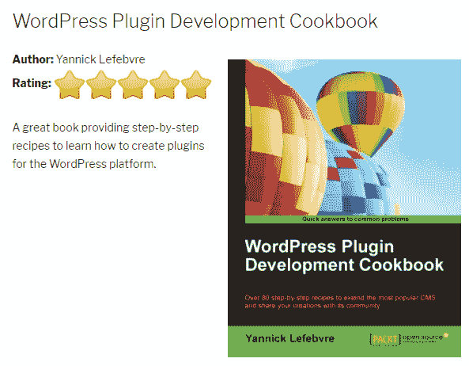

# 它是如何工作的...

在渲染任何网页时，WordPress 的默认功能是在当前主题目录中搜索适用于当前内容的适用模板。在单个自定义帖子类型项的情况下，例如书籍评论，它首先寻找一个名为`single-<post-type-name>.php`的单个项模板，其中后一部分是实际的帖子类型名称。如果找不到此文件，它将默认使用通用单个项模板。在本章的第一个配方中，用于显示书籍评论的模板是默认的单个项模板，简单地命名为`single.php`。

为了更好地支持我们新的文章类型，此配方将一个函数与`template_include`过滤器钩子关联起来，以改变该行为。更具体地说，我们使用`locate_template`函数来检查用户是否在主题目录中为`book_reviews`文章类型提供了一个模板。如果没有找到模板，我们将注册一个过滤器来用我们自己的布局覆盖页面内容。这使用户能够灵活地使用我们预定义的布局或提供他们自己的。

配方的其余部分实现了我们的 Book Review 内容的后备过滤器函数。此代码使用了多个 WordPress 模板函数，如`get_the_ID()`和`get_the_content()`，以及`get_post_meta`函数，以显示当前项目的各种元素，包括书籍作者和其评分，以及主要文章内容和特色图像。

为了帮助用户为您的自定义文章类型构建自己的主题模板，您应该在插件文档中提供代码片段，展示如何检索您的自定义文章类型的自定义字段。

# 参见

+   **创建自定义文章类型**的配方

# 在短代码中显示自定义文章类型数据

为了帮助访客通过我们使用的新自定义文章类型添加的项目进行导航，我们需要显示网站上所有书评的列表，以及导航元素以便处理大量项目。虽然 WordPress 提供了一个内置机制以存档页的形式列出文章项目，但插件很难以一致的方式修改所有可能的用户主题中结果页面的布局。更好的解决方案是创建一个短代码，该短代码可以在用户选择的任何位置显示一个或多个文章，包括页面、文章，甚至网站的前页。

此配方展示了如何创建一个短代码，该短代码可以一次检索并显示五个书评，并附带导航链接。

# 准备工作

您应该已经遵循了**使用自定义布局显示单个自定义文章类型项目**的配方，以便为此配方提供一个起点，并且生成的插件仍然在您的开发站点中处于活动状态。或者，您可以从下载的代码包中获取生成的代码（`Chapter 4/ch4-book-reviews/ch4-book-reviews-v3.php`）并将文件重命名为`ch4-book-reviews.php`。

# 如何操作...

1.  导航到您开发安装的 WordPress 插件目录中的`ch4-book-reviews`文件夹。

1.  在代码编辑器中打开`ch4-book-reviews.php`文件。

1.  在现有函数之后添加以下代码行，以注册一个声明新短代码的函数：

```php
add_shortcode( 'book-review-list', 'ch4_br_book_review_list' ); 
```

1.  将以下代码部分添加到为`ch4_br_book_review_list`函数提供实现的代码：

```php
function ch4_br_book_review_list() { 
    // Preparation of query array to retrieve 5 book reviews 
    $query_params = array( 'post_type' => 'book_reviews', 
                           'post_status' => 'publish', 
                           'posts_per_page' => 5 );

    // Execution of post query 
    $book_review_query = new WP_Query; 
    $book_review_query->query( $query_params );

    // Check if any posts were returned by the query 
    if ( $book_review_query->have_posts() ) { 
        // Display posts in table layout 
        $output = '<table>';

        $output .= '<tr><th style="width: 350px"><strong>'; 
        $output .= 'Title</strong></th>'; 
        $output .= '<th><strong>Author</strong></th></tr>';

        // Cycle through all items retrieved 
        while ( $book_review_query->have_posts() ) { 
            $book_review_query->the_post();

            $output .= '<tr><td><a href="' . get_permalink(); 
            $output .= '">'; 
            $output .= get_the_title( get_the_ID() ) . '</a></td>'; 
            $output .= '<td>'; 
            $output .= esc_html( get_post_meta( get_the_ID(), 
                                                'book_author',
                                                true ) ); 
            $output .= '</td></tr>'; 
        }

        $output .= '</table>'; 

        // Display page navigation links 
        if ( $book_review_query->max_num_pages > 1 ) { 
            $output .= '<nav id="nav-below">'; 
            $output .= '<div class="nav-previous">'; 
            $output .= get_next_posts_link ( 
                '<span class="meta-nav">&larr;</span>' .
                ' Older reviews',
                $book_review_query->max_num_pages ); 
            $output .= '</div>'; 
            $output .= '<div class="nav-next">'; 
            $output .= get_previous_posts_link( 
                  'Newer reviews ' .
                  '<span class="meta-nav">&rarr;</span>', 
                  $book_review_query->max_num_pages ); 
            $output .= '</div>'; 
            $output .= '</nav>'; 
        }

        // Reset post data query 
        wp_reset_postdata(); 
    }

    return $output; 
} 
```

1.  保存插件文件。

1.  创建一个新页面并插入短代码`[book-review-list]`。

1.  发布并查看页面，以查看书评列表将显示在短代码的位置。

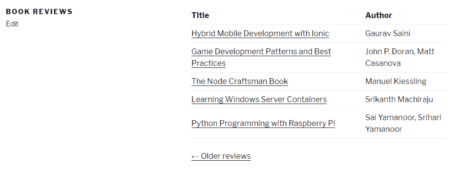

1.  如果系统中存在超过五个书评，请点击显示的导航链接。您会看到浏览器地址栏中的 URL 发生了变化，但条目列表显示的仍然是之前的前五个项目。

1.  回到`ch4-book-reviews.php`文件，在`ch4_br_book_review_list`的顶部附近添加以下突出显示的代码，在初始化`$query_params`变量值的行之后：

```php
// Preparation of query string to retrieve 5 book reviews 
$query_params = array( 'post_type' => 'book_reviews', 
                       'post_status' => 'publish', 
                       'posts_per_page' => 5 ); 

// Retrieve page query variable, if present 
$page_num = ( get_query_var( 'paged' ) ? 
              get_query_var( 'paged' ) : 1 ); 

// If page number is higher than 1, add to query array 
if ( $page_num != 1 ) {
 $query_params['paged'] = $page_num; 
}
```

1.  保存并关闭插件文件。刷新包含我们新短语的页面，并使用导航链接查看项目列表是否已正确更改。

# 它是如何工作的...

如我们在第三章“用户设置和管理页面”中看到的，短代码是可以插入任何页面和文章中的文本元素，当它们被找到时，将被插件生成的内容所替换。注册的回调函数必须在执行结束时准备输出并将其作为返回值发送回去。

`ch4_br_book_review_list`函数的第一部分负责准备一个查询数组，以便传递给`WP_Query`类的新实例。这个类允许开发者轻松地从网站数据库的文章表中提取信息。在这个例子中，正在设置的查询参数包括内部文章类型名称（`post_type`）、我们想要显示的项目状态（`post_status`）以及每次应该检索的项目数量（`posts_per_page`）。

一旦查询字符串就绪，我们创建一个名为`book_review_query`的全局变量，并将其分配给一个`WP_Query`对象的新实例。一旦创建，我们使用刚刚组装的查询字符串初始化它。如果对象找到了文章，我们输出 HTML 代码来创建一个表格，并使用`while`循环遍历找到的所有项目，并使用类似于前两个菜谱的代码显示它们的标题和作者。

作为这个菜谱的一部分，我们看到了如果自定义文章类型的条目数量超过了`posts_per_page`查询参数指定的值，会在条目表下方添加导航控件，但由于我们手动创建了查询字符串，所以它们将不会正确工作。为了纠正这种情况，我们使用`get_query_var`函数来查看是否请求了页码。如果是这种情况，并且页码不是`1`，我们将该数字添加到我们的查询参数中。

# 还有更多...

如本菜谱开头所述，可能存在需要将自定义文章类型的项目列表作为主题模板的一部分显示的情况。以下部分展示了如何将短代码内容作为模板文件的一部分显示。

# do_shortcode 函数

`do_shortcode`函数可以从任何主题模板文件中调用，用于主页或网站的任何其他部分，以渲染与短代码相关的内容。它接受一个参数，即包含任何参数的短代码字符串。要显示本食谱中创建的内容，我们只需调用以下代码：

```php
<?php echo do_shortcode( '[book-review-list]' ); ?> 
```

# 为自定义帖子类型添加自定义分类

为了在网站上保持项目组织，管理员通常会使用内置的 WordPress 分类和术语来识别类似的项目。回顾一下我们在本章中迄今为止设置的图书评论系统，一种有用的分类类型是图书类型（例如，科幻小说、纪录片、小说、诗歌等）。

本食谱展示了如何创建一个新的分类（在 WordPress 后端中称为**分类法**）并将其与图书评论自定义帖子类型关联。

# 准备工作

您应该已经遵循了*在短代码中显示自定义帖子类型数据*的食谱，以为本食谱提供一个起点，并且生成的插件仍然在您的开发站点中处于活动状态。或者，您可以从下载的代码包中获取生成的代码（`Chapter 4/ch4-book-reviews/ch4-book-reviews-v4.php`），并将文件重命名为`ch4-book-reviews.php`。

# 如何操作...

1.  导航到您开发安装中 WordPress 插件目录的`ch4-book-reviews`文件夹。

1.  在代码编辑器中打开`ch4-book-reviews.php`文件。

1.  找到`ch4_br_create_book_post_type`函数，并在现有`register_post_type`调用之后添加以下代码以创建新的分类法：

```php
register_taxonomy( 
    'book_reviews_book_type',       
    'book_reviews',                  
    array( 
        'labels' => array( 
            'name' => 'Book Type', 
            'add_new_item' => 'Add New Book Type', 
            'new_item_name' => 'New Book Type Name'
        ), 
        'show_ui' => true, 
        'show_tagcloud' => false, 
        'hierarchical' => true 
    )
); 
```

1.  保存并关闭插件文件。

1.  打开之前创建的图书评论，查看在帖子编辑器右侧新添加的图书类型元框。

1.  点击+添加新图书类型链接创建一个新项目并将其指定为当前项目的类型。点击帖子编辑器右上角的更新按钮以保存评论：

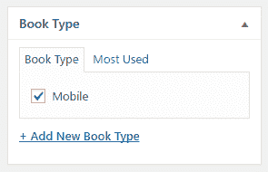

1.  查看左侧管理菜单，您会看到添加了一个新的菜单项来管理图书类型，链接到一个类似于帖子和页面分类编辑器的编辑器：

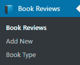

1.  在插件文件中，在显示评分的部分之后添加以下代码到`ch4_br_display_single_book_review`函数中，以显示图书类型：

```php
$book_types = wp_get_post_terms( get_the_ID(), 
                                'book_reviews_book_type' ); 

$content .= '<br /><strong>Type: </strong>';

if ( $book_types ) { 
    $first_entry = true; 
    for ( $i = 0; $i < count( $book_types ); $i++ ) { 
        if ( !$first_entry ) {
            $content .= ', ';
        }
        $content .= $book_types[$i]->name; 
        $first_entry = false; 
    } 
} else {
    $content .= 'None Assigned';
}
```

1.  保存并关闭模板文件。

1.  访问图书评论页面，查看在评分下方显示的图书类型。

# 它是如何工作的...

`register_taxonomy`函数用于在 WordPress 中创建新的分类类型并将其关联到帖子类型。它有三个参数：

```php
register_taxonomy( $taxonomy_name, $post_type, $options );  
```

第一个参数是分类法的唯一标识符。第二个参数是它应该关联的帖子类型，这应该与`register_post_type`函数中声明的类型相匹配。第三个参数是一个参数数组，它决定了新分类法将如何表现。

在本例中，我们设置了一些分类选项，包括一个名为 **labels** 的第一个项目，它包含一个将用于界面中引用新分类的文本字符串数组。我们还指定了第二个元素，名为 `show_ui`，它控制分类元框在帖子编辑器中的显示以及访问分类编辑器在管理菜单中的链接的存在。接下来是一个名为 `show_tagcloud` 的选项，我们将其设置为 `false` 以避免显示所有分类值的标签云。最后，选项数组中的最后一个项目名为 `hierarchical`。当设置为 `true` 时，分类项将能够有父子关系，并且可以在帖子编辑器中以复选框列表的形式访问。如果设置为 `false`，所有分类都将组织成平面列表，并且可以使用类似于帖子编辑器和页面编辑器中标签窗口的界面进行选择。

`register_taxonomy` 函数有更多可用的选项，如访问 WordPress Codex 网站（[`codex.wordpress.org/Function_Reference/register_taxonomy`](https://codex.wordpress.org/Function_Reference/register_taxonomy)）所示，但这里列出的都是定义基本分类法所必需的。

# 参见

+   *创建自定义帖子类型* 的食谱

# 添加自定义字段到分类

除了指定分类的名称外，将附加额外信息到在 WordPress 插件中创建的自定义分类可能很有用。例如，我们可能想要为在显示时使用的分类分配自定义颜色，或者我们可能想要识别只有付费会员才能访问的内容分类。

本食谱展示了如何在分类编辑器中显示额外字段，以及如何将额外数据存储在网站的数据库中。

# 准备工作

你应该已经遵循了 *添加自定义分类以用于自定义帖子类型* 的食谱，以便为本食谱提供一个起点，并且生成的插件仍然在你的开发网站上处于激活状态。或者，你可以从下载的代码包中获取生成的代码（`Chapter 4/ch4-book-reviews/ch4-book-reviews-v5.php`），并将文件重命名为 `ch4-book-reviews.php`。

# 如何操作...

1.  导航到你的开发安装的 WordPress 插件目录中的 `ch4-book-reviews` 文件夹。

1.  在代码编辑器中打开 `ch4-book-reviews.php` 文件。

1.  在现有函数之后添加以下代码行，以将函数分配给两个将在用户创建或编辑分类项时被调用的动作钩子：

```php
add_action( 'book_reviews_book_type_edit_form_fields', 
            'ch4_br_book_type_new_fields', 10, 2 );
add_action( 'book_reviews_book_type_add_form_fields',
            'ch4_br_book_type_new_fields', 10, 2 );
```

1.  将以下代码段添加到提供 `ch4_br_book_type_new_fields` 函数实现的区域：

```php
function ch4_br_book_type_new_fields( $tag ) {
    $mode = 'new';

    if ( is_object( $tag ) ) {
        $mode = 'edit';
        $book_cat_color = get_term_meta( $tag->term_id, 
                                         'book_type_color',
                                         true );
    }
    $book_cat_color = empty( $book_cat_color ) ? 
                          '#' : $book_cat_color;

    if ( 'edit' == $mode ) {
        echo '<tr class="form-field">';
        echo '<th scope="row" valign="top">';
    } elseif ( 'new' == $mode ) {
        echo '<div class="form-field">';
    } ?>

    <label for="tag-category-url">Color</label>
    <?php if ( 'edit' == $mode ) {
        echo '</th><td>';
    } ?>

    <input type="text" id="book_type_color" 
           name="book_type_color"
           value="<?php echo $book_cat_color; ?>" />
    <p class="description">Color associated with book type 
                           (e.g. #199C27 or #CCC)</p>

    <?php if ( 'edit' == $mode ) {
        echo '</td></tr>'; 
    } elseif ( 'new' == $mode ) {
        echo '</div>';
    }
}
```

1.  在文件末尾添加以下代码行，以分配一个在用户创建或更新分类项时将被调用的函数：

```php
add_action( 'edited_book_reviews_book_type',
            'ch4_br_save_book_type_new_fields', 10, 2 );
add_action( 'created_book_reviews_book_type',
            'ch4_br_save_book_type_new_fields', 10, 2 );
```

1.  将以下代码段添加到提供 `ch4_br_save_book_type_new_fields` 函数实现的区域：

```php
function ch4_br_save_book_type_new_fields( $term_id, $tt_id ) {
    if ( !$term_id ) {
        return;
    }

    if ( isset( $_POST['book_type_color'] ) 
             && ( '#' == $_POST['book_type_color'] 
         || preg_match( '/#([a-f0-9]{3}){1,2}\b/i', 
                        $_POST['book_type_color'] ) ) ) {
        $returnvalue = update_term_meta( $term_id, 
                           'book_type_color', 
                           $_POST['book_type_color'] );
    }
}
```

1.  保存并关闭插件文件。

1.  编辑先前的食谱中创建的其中一个书籍类型条目以查看新添加的颜色字段。输入一个颜色代码并更新条目以查看保存的数据：

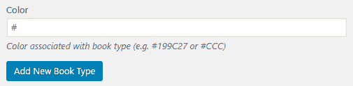

# 它是如何工作的...

此食谱使用许多变量名动作钩子来注册在分类编辑器中创建或修改书籍类型时要调用的函数。前两个对 `add_action` 的调用分别指的是 `<taxonomy>_edit_forms_fields` 和 `<taxonomy>_add_form_fields` 钩子。虽然您可能期望看到与每个动作钩子相关联的两个不同的函数，但实际上我们在两种情况下都注册了相同的函数，因为渲染额外字段在这两种情况下是相似的。话虽如此，我们注册的函数的一部分会检查它是否接收一个有效的对象作为参数，以便知道它应该如何渲染新字段，以便如果用户正在创建新类别或编辑现有类别，它能够适合页面。

我们使用与 `edited_<taxonomy>` 和 `created_<taxonomy>` 动作钩子类似的技术，这些钩子分别在您首次保存新的分类或更新现有分类时被调用。在这种情况下，代码在动作方面没有显著差异，因为我们只需要验证并保存新字段的传入值。

# 参见

+   *为自定义文章类型添加自定义分类* 的食谱

# 从自定义文章类型编辑器中隐藏分类编辑器

正如我们在先前的食谱中看到的，当我们将新的分类与书籍评论自定义文章类型相关联时，`show_ui` 选项控制分类分配元框和到分类编辑器的管理员菜单链接的可见性。在某些情况下，我们希望用户能够访问完整的分类编辑器，但在自定义文章类型编辑器中创建新条目时，只让编辑器从受控的下拉列表中选择。

此食谱展示了如何隐藏分类界面从文章编辑器中，以及如何更新在先前的食谱中创建的自定义文章类型元框以分配类型给新的书籍评论并保存此信息到网站的数据库中。

# 准备工作

您应该已经遵循了 *为分类添加自定义字段* 的食谱，以便为此食谱提供一个起点，并且生成的插件仍然在您的开发站点中处于活动状态。或者，您可以从下载的代码包中获取生成的代码（`Chapter 4/ch4-book-reviews/ch4-book-reviews-v6.php`）并将文件重命名为 `ch4-book-reviews.php`。

# 如何操作...

1.  导航到您的开发安装的 WordPress 插件目录中的 `ch4-book-reviews` 文件夹。

1.  打开代码编辑器中的 `ch4-book-reviews.php` 文件。

1.  在 `ch4_br_create_book_post_type` 函数中找到对 `register_taxonomy` 函数的调用，并添加一个名为 `meta_box_cb` 的新成员到配置数组中，其值设置为 `false`，如下所示（加粗）：

```php
   'show_tagcloud' => false, 
   'meta_box_cb' => false,
   'hierarchical' => true
```

1.  保存插件并编辑一个书评，以查看书评类型分类框不再显示。

1.  在代码中找到`ch4_br_display_review_details_meta_box`函数，并在现有的表格渲染代码内添加以下代码，以添加一个包含书籍类型下拉选择框的新行：

```php
<tr> 
    <td>Book Type</td> 
    <td> 
    <?php 
        // Retrieve array of types assigned to post 
        $assigned_types = wp_get_post_terms( $book_review->ID, 
                              'book_reviews_book_type' ); 

        // Retrieve array of all book types in system 
        $book_types = get_terms( 'book_reviews_book_type', 
                                 array( 'orderby' => 'name',
                                        'hide_empty' => 0) ); 

        if ( $book_types ) { 
            echo '<select name="book_review_book_type"'; 
            echo ' style="width: 400px">'; 

            foreach ( $book_types as $book_type ) {                 
                echo '<option value="' . $book_type->term_id;
                echo '" '; 
                if ( !empty( $assigned_types ) ) {            
                    selected( $assigned_types[0]->term_id, 
                              $book_type->term_id );
                }
                echo '>' . esc_html( $book_type->name ); 
                echo '</option>'; 
            }         

            echo '</select>'; 
        } ?> 
    </td> 
</tr> 
```

1.  找到`ch4_br_add_book_review_fields`函数，并在 if 语句内添加以下代码段，检查帖子类型是否为书评，以便在提交帖子时将选定的书籍类型保存到网站的数据库中：

```php
if ( isset( $_POST['book_review_book_type'] ) 
     && !empty( $_POST['book_review_book_type'] ) ) { 
    wp_set_post_terms( $book_review->ID, 
                       intval( $_POST['book_review_book_type'] ), 
                       'book_reviews_book_type' ); 
} 
```

1.  保存并关闭插件文件。

1.  打开一个之前创建的书评，以查看包含一个新下拉列表以指定书籍类型的更新后的书评详细信息元框：

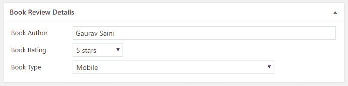

# 它是如何工作的...

这个食谱使用`register_taxonomy`函数的许多参数之一来移除书评创建者和编辑创建新书籍类型的能力，并创建一个下拉列表，以便能够将单个书籍类型分配给书评。

在这个过程中，食谱使用了与存储和检索与帖子相关的分类条目相关的三个函数。第一个，`wp_get_post_terms`，根据帖子的 ID 和分类名称检索与帖子相关的一组术语。第二个，`wp_set_post_terms`，根据帖子的 ID 和分类名称分配一个术语给帖子。最后，`get_terms`检索分类中所有术语的数组，根据查询字符串按第二个参数中的顺序排列。

# 参见

+   *为自定义帖子类型添加自定义分类* 食谱

# 在自定义帖子列表页面显示额外的列

在定制帖子编辑器以给内容创作者一个定制的环境来创建和编辑自定义帖子类型条目之后，这个食谱将注意力转向书评管理页面，其中列出了此类型的所有条目。默认情况下，自定义帖子类型列表相当简单，仅显示每个项目的标题、发布日期和评论数量。为了使在此管理页面中识别、排序和查找数据更容易，WordPress 提供了一系列定制功能，首先是更改显示列的能力。

这个食谱展示了如何在帖子管理页面中添加和删除列，以及在新列中进行排序。

# 准备工作

你应该已经遵循了*从自定义帖子类型编辑器中隐藏分类编辑器*食谱，以便为这个食谱提供一个起点，并且生成的插件应该仍然在你的开发站点中处于活动状态。或者，你可以从下载的代码包中获取生成的代码（`Chapter 4/ch4-book-reviews/ch4-book-reviews-v7.php`），并将文件重命名为`ch4-book-reviews.php`。

# 如何去做...

1.  导航到你的开发安装的 WordPress 插件目录中的`ch4-book-reviews`文件夹。

1.  在代码编辑器中打开`ch4-book-reviews.php`文件。

1.  在现有函数之后添加以下代码行，以注册一个在准备书籍评论列表页面时将被调用的函数：

```php
add_filter( 'manage_edit-book_reviews_columns',
            'ch4_br_add_columns' ); 
```

1.  添加以下代码段以提供`ch4_br_add_columns`函数的实现：

```php
function ch4_br_add_columns( $columns ) { 
    $columns['book_reviews_author'] = 'Author'; 
    $columns['book_reviews_rating'] = 'Rating'; 
    $columns['book_reviews_type'] = 'Type'; 

    unset( $columns['comments'] ); 

    return $columns; 
} 
```

1.  添加以下代码行以分配一个函数，当检索帖子列表中每行的列数据时将被调用：

```php
add_action( 'manage_posts_custom_column', 
            'ch4_br_populate_columns' ); 
```

1.  插入以下代码段以提供`ch4_br_populate_columns`函数的实现：

```php
function ch4_br_populate_columns( $column ) { 
    if ( 'book_reviews_author' == $column ) { 
        $book_author = esc_html( get_post_meta( get_the_ID(), 
                                                'book_author', 
                                                true ) ); 
        echo $book_author; 
    } elseif ( 'book_reviews_rating' == $column ) { 
        $book_rating = get_post_meta( get_the_ID(), 'book_rating', 
                                      true ); 
        echo $book_rating . ' stars'; 
    } elseif ( 'book_reviews_type' == $column ) {
        $book_types = wp_get_post_terms( get_the_ID(), 
                          'book_reviews_book_type' );                 
        if ( $book_types ) {
            $book_cat_color = get_term_meta( 
                                  $book_types[0]->term_id,
                                  'book_type_color', true );

            if ( '#' != $book_cat_color ) {
                echo '<span style="background-color: ';
                echo $book_cat_color . '; ';
                echo 'color: #fff; padding: 6px;">';
                echo $book_types[0]->name . '</span>';
            } else {
                echo $book_types[0]->name;
            }
        } else {
            echo 'None Assigned'; 
        }
    } 
} 
```

1.  保存插件文件并导航到书籍评论列表页面，以查看列列表已被更改，并且存储在帖子自定义字段中的数据现在显示在列表中的每个条目上。

1.  在代码编辑器中，添加以下代码到插件文件的末尾，以注册一个在 WordPress 识别书籍评论自定义帖子类型可排序列时将被调用的函数：

```php
add_filter( 'manage_edit-book_reviews_sortable_columns', 
            'ch4_br_author_column_sortable' ); 
```

1.  添加以下代码以提供`ch4_br_author_column_sortable`函数的实现：

```php
function ch4_br_author_column_sortable( $columns ) { 
    $columns['book_reviews_author'] = 'book_reviews_author'; 
    $columns['book_reviews_rating'] = 'book_reviews_rating'; 

    return $columns; 
} 
```

1.  添加以下代码块以注册一个函数，当请求显示帖子列表的数据时将被调用：

```php
add_filter( 'request', 'ch4_br_column_ordering' ); 
```

1.  插入以下代码段以实现`ch4_br_column_ordering`函数：

```php
function ch4_br_column_ordering( $vars ) { 
    if ( !is_admin() ) {
        return $vars;
    }

    if ( isset( $vars['orderby'] ) &&  
         'book_reviews_author' == $vars['orderby'] ) { 
        $vars = array_merge( $vars, array( 
            'meta_key' => 'book_author', 
            'orderby' => 'meta_value' ) ); 
    } elseif ( isset( $vars['orderby'] ) &&  
               'book_reviews_rating' == $vars['orderby'] ) { 
        $vars = array_merge( $vars, array( 
                                 'meta_key' => 'book_rating', 
                                 'orderby' => 'meta_value_num' ) ); 
    } 
    return $vars; 
} 
```

1.  保存并关闭插件文件。

1.  刷新书籍评论列表以查看作者和评分列标题是可点击的链接，可以点击以对这些列进行排序：

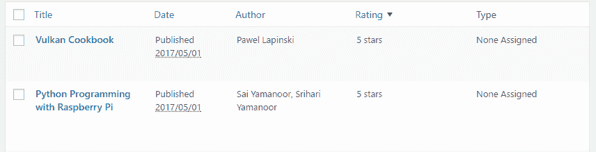

# 它是如何工作的...

定制帖子列表页面需要精心混合动作和过滤器钩子以实现最终目标。我们注册的第一个函数与变量过滤器名称`manage_edit-<post_type>_columns`相关联，其中`<post_type>`被替换为内部帖子类型名称。当注册的函数被调用时，它接收将作为参数显示在列出书籍评论条目时的默认列列表。使用这些数据，它继续添加`author`、`rating`和`type`三个列，并从数组中删除`comments`列。一旦完成，它返回修改后的数组。

菜谱的第二部分注册了负责填充新列的函数。由于此函数在渲染任何自定义帖子类型列时被调用，代码在将请求的数据回显到浏览器之前检查当前请求的是哪个列。该函数调用`get_the_ID()`以获取当前显示行的索引，并使用`get_post_meta`和`wp_get_post_terms`找到其关联数据。

在本配方的这个阶段，新列在书籍评论管理页面中可见，并且每个列都显示数据。本配方剩余部分的目的是将`author`（作者）和`rating`（评分）列设置为可排序。这是通过首先注册一个名为`manage_edit-<post_type>_sortable_columns`的变量函数来完成的，其中`<post_type>`被帖子类型名称替换。当函数执行时，它向将要排序的列数组中添加两个项目。这处理了使列标题链接（可以点击进行排序）与适当的 URL 相关联。

最后注册的函数与请求过滤器相关联，负责根据查询 URL 中传入的变量向查询数组添加元素。

最终结果允许管理员根据这两个可排序的列轻松重新排列书籍评论，同时还可以查看每个条目的类型信息。

# 参见

+   *为自定义帖子类型添加自定义类别* 的配方

# 将自定义类别筛选器添加到自定义帖子列表页面

对于自定义帖子列表的第二个自定义方法是创建一个下拉框，允许管理员一次只显示属于单个类别的项目。这可以显著减少显示的条目数量，从而快速找到所需的条目。

本配方展示了如何将基于书籍评论类型的筛选机制添加到列表页面。

# 准备工作

您应该已经遵循了 *在自定义帖子列表页面显示额外列* 的配方，以便为本配方提供一个起点，并且生成的插件仍然在您的开发站点中激活。或者，您可以从下载的代码包中获取生成的代码（`Chapter 4/ch4-book-reviews/ch4-book-reviews-v8.php`），并将文件重命名为`ch4-book-reviews.php`。

# 如何操作...

1.  导航到您开发安装的 WordPress 插件目录中的`ch4-book-reviews`文件夹。

1.  在代码编辑器中打开`ch4-book-reviews.php`文件。

1.  在现有函数之后添加以下代码行，以注册一个在 WordPress 准备帖子列表的筛选下拉框时调用的函数：

```php
add_action( 'restrict_manage_posts',
            'ch4_br_book_type_filter_list' ); 
```

1.  添加以下代码段以提供`ch4_br_book_type_filter_list`函数的实现：

```php
function ch4_br_book_type_filter_list() { 
    $screen = get_current_screen(); 
    global $wp_query; 
    if ( 'book_reviews' == $screen->post_type ) { 
        wp_dropdown_categories( array( 
            'show_option_all' =>  'Show All Book Types', 
            'taxonomy'        =>  'book_reviews_book_type', 
            'name'            =>  'book_reviews_book_type', 
            'orderby'         =>  'name', 
            'selected'        =>  
            ( isset( $wp_query->query['book_reviews_book_type'] )         
              ? $wp_query->query['book_reviews_book_type'] : '' ), 
            'hierarchical'    =>  false, 
            'depth'           =>  3, 
            'show_count'      =>  false, 
            'hide_empty'      =>  true, 
            ) ); 
    } 
} 
```

1.  在准备帖子显示查询时调用函数的注册中插入以下代码行：

```php
add_filter( 'parse_query', 'ch4_br_perform_book_type_filtering' );
```

1.  使用以下代码段实现`ch4_br_perform_book_type_filtering`函数：

```php
function ch4_br_perform_book_type_filtering( $query ) {
    $qv = &$query->query_vars; 

    if ( isset( $qv['book_reviews_book_type'] ) &&
         !empty( $qv['book_reviews_book_type'] ) && 
         is_numeric( $qv['book_reviews_book_type'] ) ) { 
        $term = get_term_by( 'id', 
                             $qv['book_reviews_book_type'], 
                             'book_reviews_book_type' );     
        $qv['book_reviews_book_type'] = $term->slug; 
    } 
} 
```

1.  保存并关闭插件文件。

1.  访问书籍评论列表，查看新的下拉框以限制显示的书籍类型：

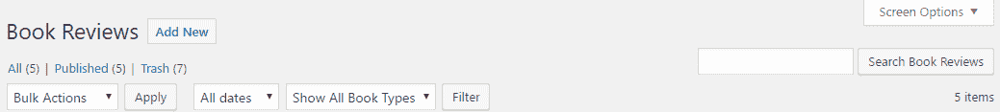

# 工作原理...

本食谱首先注册一个动作回调，该回调将在 WordPress 渲染每个帖子类型列表可用的各种过滤器控件时执行。当函数被调用时，它检索一个全局变量以了解当前显示的帖子类型，并确定是否应该显示书籍类型过滤器列表。它还访问全局帖子查询变量，查看是否已经放置了书籍类型过滤器，并在有可用的条目时设置正确的下拉列表条目为选中状态。

回调随后继续使用`wp_dropdown_categories`函数来显示为书籍类型注册的所有分类法项的列表。这个实用函数期望接收一个参数数组，该数组确定要显示哪个分类法列表，下拉列表字段的名称，以及显示所有类型的标签。此数组还应包含一些参数，以确定项目应显示的顺序，指定要设置为选中的项目，指示显示分层分类法的最大深度，并确定是否显示项目计数和空项目。

一旦新的书籍类型选择列表就位，选择一个条目并点击过滤器按钮将触发网页刷新，并导致执行后放置的第二注册回调。过滤器函数接收当前的 WordPress 帖子查询对象，首先获取存储在查询对象内部的查询变量的指针。有了这个，它继续验证书籍类型是否是查询变量的一部分，并且它是数字的。如果结果是正的，它将数字值替换为所选书籍类型的文本名称，以便查询可以进行。

一旦执行所有这些代码，用户就可以快速过滤在书评管理页面上应显示哪些书籍类型。他们仍然可以使用之前食谱中实现的列排序机制。

# 参见

+   *为自定义帖子类型添加自定义分类* 的食谱

# 为自定义分类添加快速编辑字段

WordPress 的一个伟大功能是网站编辑员可以通过点击与任何显示的项目关联的快速编辑链接来快速更改管理部分中的任何帖子。虽然我们的自定义帖子类型分类法出现在快速编辑部分，但它不是一个选择列表，就像我们在书评编辑器中有的那样。此外，作者和评分字段在快速编辑部分中根本不显示。

本食谱展示了如何在快速编辑书评时添加自定义字段。当你执行以下步骤时，你会发现我们放置的一些代码不如之前食谱中的代码整洁，因为 WordPress 快速编辑自定义基础设施不如平台的其他区域结构良好。

# 准备工作

您应该已经遵循了*为自定义分类添加过滤器到自定义帖子列表页面*的配方，以获得此配方的起点，并且生成的插件仍然在您的开发站点中处于活动状态。或者，您可以从下载的代码包中获取生成的代码（`Chapter 4/ch4-book-reviews/ch4-book-reviews-v9.php`）并将文件重命名为`ch4-book-reviews.php`。

# 如何做到这一点...

1.  导航到您开发安装的 WordPress 插件目录中的`ch4-book-reviews`文件夹。

1.  在代码编辑器中打开`ch4-book-reviews.php`文件。

1.  在`ch4_br_create_book_post_type`函数中找到对`register_taxonomy`函数的调用，并在配置数组中添加一个名为`show_in_quick_edit`的新成员，其值设置为`false`，并用粗体突出显示：

```php
'show_tagcloud' => false, 
'meta_box_cb' => false,
'show_in_quick_edit' => false,
'hierarchical' => true,
```

1.  在现有函数之后添加以下代码行以注册一个在 WordPress 准备渲染快速编辑部分内容时要调用的函数：

```php
add_action( 'quick_edit_custom_box',
            'ch4_br_display_custom_quickedit_link', 10, 2 );
```

1.  将以下代码段添加到为`ch4_br_display_custom_quickedit_link`函数提供实现的代码：

```php
function ch4_br_display_custom_quickedit_link( $column_name, 
                                               $post_type ) {
    if ( 'book_reviews' == $post_type ) {
        switch ( $column_name ) {
            case 'book_reviews_author': ?>
                <fieldset class="inline-edit-col-right">
                <div class="inline-edit-col">
                   <label><span class="title">Author</span></label>
                   <input type="text"       
                          name='book_reviews_author_input'
                          id='book_reviews_author_input' value="">
                </div>
                <?php break;
            case 'book_reviews_rating': ?>
                <div class="inline-edit-col">
                    <label>
                        <span class="title">Rating</span>
                    </label>
                    <select name='book_reviews_rating_input'
                            id='book_reviews_rating_input'>
                    <?php // Generate all items of drop-down list 
                    for ( $rating = 5; $rating >= 1; $rating -- ) {
                    ?>  <option value="<?php echo $rating; ?>">
                        <?php echo $rating; ?> stars 
                    <?php } ?> 
                    </select>
                </div>
                <?php break;
            case 'book_reviews_type': ?>
                <div class="inline-edit-col">
                    <label><span class="title">Type</span></label>
                    <?php
                    $terms = get_terms( array( 'taxonomy' => 
                                        'book_reviews_book_type',
                                        'hide_empty' => false ) );
                    ?>
                    <select name='book_reviews_type_input'
                            id='book_reviews_type_input'>
                    <?php foreach ($terms as $index => $term) {
                        echo '<option ';
                        echo 'class="book_reviews_type-option"';
                        echo 'value="' . $term->term_id . '"';
                        selected( 0, $index );
                        echo '>' . $term->name. '</option>';
                    } ?>
                    </select>
                </div>
            <?php break;
        } 
    } 
}
```

1.  添加以下代码行以注册一个在 WordPress 渲染管理页面页脚时要调用的函数：

```php
add_action( 'admin_footer', 'ch4_br_quick_edit_js' );
```

1.  使用以下代码片段实现`ch4_br_quick_edit_js`函数：

```php
function ch4_br_quick_edit_js() {
    global $current_screen;
    if ( ( 'edit-book_reviews' !== $current_screen->id ) ||
         ( 'book_reviews' !== $current_screen->post_type ) ) {
        return;
    } ?>

    <script type="text/javascript">
    function set_inline_book_reviews( reviewArray ) {
        // revert Quick Edit menu so that it refreshes properly
        inlineEditPost.revert();
        var inputBookAuthor = 
            document.getElementById('book_reviews_author_input');
        inputBookAuthor.value = reviewArray[0];

        var inputRating =
            document.getElementById('book_reviews_rating_input');
        for (i = 0; i < inputRating.options.length; i++) {
            if ( inputRating.options[i].value == reviewArray[1] ) {
                inputRating.options[i].setAttribute( 'selected',
                                                     'selected' );
            } else {
                inputRating.options[i].removeAttribute( 
                    'selected' );
            }
        } 

        var inputBookType =
            document.getElementById('book_reviews_type_input');
        for (i = 0; i < inputBookType.options.length; i++) {
            if ( inputBookType.options[i].value == 
                     reviewArray[2] ) {
                inputBookType.options[i].setAttribute( 'selected',
                    'selected' );
            } else {
                inputBookType.options[i].removeAttribute( 
                    'selected' );
            }
        } 
    }
</script>
<?php }
```

1.  将以下代码添加到注册一个函数以替换为每个帖子在书评页面生成的原始快速编辑代码：

```php
add_filter( 'post_row_actions', 'ch4_br_quick_edit_link', 10, 2 );
```

1.  添加以下代码块以提供`ch4_br_quick_edit_link`函数的实现：

```php
function ch4_br_quick_edit_link( $act, $post ) {
    global $current_screen;
    $post_id = '';

    if ( ( isset( $current_screen ) && 
           $current_screen->id != 'edit-book_reviews' &&
           $current_screen->post_type != 'book_reviews' ) 
         || ( isset( $_POST['screen'] ) &&
              $_POST['screen'] != 'edit-book_reviews' ) ) {
        return $act;
    }

    if ( !empty( $post->ID ) ) {
        $post_id = $post->ID;
    } elseif ( isset( $_POST['post_ID'] ) ) {
        $post_id = intval( $_POST['post_ID'] );
    }

    if ( !empty( $post_id ) ) {
        $book_author = esc_html( get_post_meta( $post_id, 
                                     'book_author', true ) ); 
        $book_rating = esc_html( get_post_meta( $post_id, 
                                     'book_rating', true ) );
        $book_reviews_types = wp_get_post_terms( $post_id, 
                                     'book_reviews_book_type',
                                     array( 'fields' => 'all' ) );
        if ( empty( $book_reviews_types ) ) {
            $book_reviews_types[0] = 
                (object) array( 'term_id' => 0 );
        }

        $idx = 'inline hide-if-no-js';
        $act[$idx] = '<a href="#" class="editinline"  ';
        $act[$idx] .= " onclick=\"var reviewArray = new Array('";
        $act[$idx] .= "{$book_author}', '{$book_rating}', ";
        $act[$idx] .= "'{$book_reviews_types[0]->term_id}');";
        $act[$idx] .= "set_inline_book_reviews( reviewArray )\">";
        $act[$idx] .= __( 'Quick&nbsp;Edit' );
        $act[$idx] .= '</a>';
    }
    return $act;
}
```

1.  添加以下函数调用以注册一个在从快速编辑部分更新帖子数据时将执行的函数：

```php
add_action( 'save_post', 'ch4_br_save_quick_edit_data', 10, 2 );
```

1.  使用以下代码块为`ch4_br_save_quick_edit_data`函数提供实现：

```php
function ch4_br_save_quick_edit_data( $ID = false, 
                                      $post = false ) {
    // Do not save if auto-saving, not book reviews, no permissions
    if ( ( defined( 'DOING_AUTOSAVE' ) && DOING_AUTOSAVE ) ||
         ( isset( $_POST['post_type'] ) 
           && 'book_reviews' != $_POST['post_type'] ) ||
         !current_user_can( 'edit_page', $ID ) ) {
        return $ID;
    }

    $post = get_post( $ID );
    if ( !empty( $post ) && 'revision' != $post->post_type ) {
        if ( isset( $_POST['book_reviews_author_input'] ) ) {
            update_post_meta( $ID, 'book_author', 
                sanitize_text_field( 
                    $_POST['book_reviews_author_input'] ) ); 
        }

        if ( isset( $_POST['book_reviews_rating_input'] ) ) {
            update_post_meta( $ID, 'book_rating', 
                intval( $_POST['book_reviews_rating_input'] ) ); 
        }

        if ( isset( $_POST['book_reviews_type_input'] ) ) {
            $term = term_exists( 
                intval( $_POST['book_reviews_type_input'] ),
                        'book_reviews_book_type' );
            if ( !empty( $term ) ) {
                wp_set_object_terms( $ID, 
                    intval( $_POST['book_reviews_type_input'] ), 
                            'book_reviews_book_type' );
            }
        }
    } 
}
```

1.  保存并关闭插件文件。

1.  访问书评列表页面并点击快速编辑以查看新添加的作者、评分和类型字段。

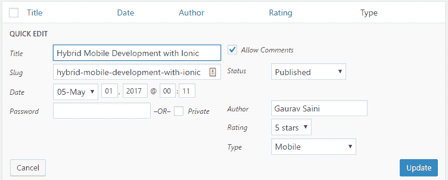

1.  更改这些字段中的值，并使用更新按钮保存它们。您将看到相应的值在书评列表中更新。

# 它是如何工作的...

虽然快速编辑框是一个 WordPress 用户非常欣赏的强大工具，但在当前版本的 WordPress 中对其进行自定义有点棘手。虽然我们可以轻松地向每个部分中的每个单独的项目添加数据，例如帖子编辑器，但为了我们新的自定义帖子类型，快速编辑部分需要更多的工作来添加自定义字段。问题的根源在于，实际上只有一个快速编辑部分的实例被渲染为编辑页面的部分。该部分最初是隐藏的，然后在用户点击快速编辑链接时出现，并移动到正确的位置。考虑到这一点，我们无法在快速编辑框中为自定义字段分配适当的值，因此需要将隐藏信息存储在每个项目被列出时，以便能够根据正在编辑的项目适当更新每个字段。

我们食谱代码的第一部分从渲染快速编辑部分中的文本输入字段和两个下拉列表开始。你会注意到我们没有设置文本字段的值，也没有设置选择列表中的选项。这个回调的另一个有趣之处在于，它发送给我们与我们在*在自定义帖子列表页面中显示额外列*食谱中使用的相同列列表。这意味着如果我们想添加除了我们已添加到帖子表中的字段之外的其他字段，我们仍然需要将这些字段名称放入列列表中，然后使用一些技巧来隐藏它们从表中。

一旦这些额外字段就位，我们将在书评编辑器的管理页面页脚中添加代码，创建一个当需要更新快速编辑部分中的新自定义字段时我们将调用的 JavaScript 函数。该函数接收一个数据数组，然后使用`document.getElementById`函数在页面上定位自定义字段，并根据传入的数据数组更新它们的值。

我们添加的下一块代码创建了一个新的快速编辑链接，用于替换每个书评项目的原始链接。新的链接不仅允许用户显示快速编辑部分，还将在`onclick` JavaScript 代码中嵌入每个项目的值，以及调用我们添加到页脚的函数，以便当用户决定快速编辑书评时，为每个字段分配一组新的值。

最后，当用户点击更新按钮时，我们存储来自自定义字段的数据。有趣的是，我们通过为`save_post`动作注册第二个回调来实现这一点。这意味着当帖子被保存时，我们的两个函数都会被调用。然而，这个第二个保存函数在实际上保存值之前会检查多个条件是否为真，并且它保存的字段名称与我们为帖子编辑器放置的保存函数不同。

# 使用插件过滤器更新页面标题以包含自定义帖子数据

为了支持我们的书评自定义帖子类型，可以添加到标题栏中的自定义信息作为最后的定制触摸。例如，我们可以在书名旁边添加作者的名字。

这个配方展示了如何使用`document_title_parts`过滤器来更改书评的帖子标题。

# 准备工作

你应该已经遵循了*为自定义分类添加快速编辑字段*的配方，以便为这个配方提供一个起点，并且生成的插件应该仍然在你的开发站点中处于活动状态。或者，你可以从下载的代码包中获取生成的代码（`Chapter 4/ch4-book-reviews/ch4-book-reviews-v10.php`），并将文件重命名为`ch4-book-reviews.php`。

# 如何操作...

1.  导航到你的开发安装的 WordPress 插件目录中的`ch4-book-reviews`文件夹。

1.  在代码编辑器中打开`ch4-book-reviews.php`文件。

1.  在现有函数之后添加以下代码行，以注册一个在 WordPress 准备在浏览器标题栏中显示的文本时要调用的函数：

```php
add_filter( 'document_title_parts', 
            'ch4_br_format_book_review_title' ); 
```

1.  添加以下代码段以提供`ch4_br_format_book_review_title`函数的实现：

```php
function ch4_br_format_book_review_title( $the_title ) { 
    if ( 'book_reviews' == get_post_type() && is_single() ) { 
        $book_author = esc_html( get_post_meta( get_the_ID(),  
                                   'book_author', true ) );
        if ( !empty( $book_author ) ) {
            $the_title['title'] .= ' by ' . $book_author;
        }
    } 

    return $the_title; 
} 
```

1.  保存并关闭插件文件。

1.  访问一个书评页面。你会看到书的作者现在显示在标题中的名字之后：

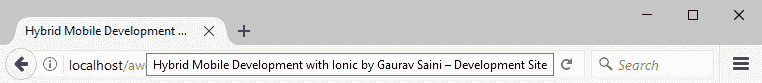

# 工作原理...

`document_title_parts` 过滤器允许插件修改或完全替换页面标题内容。在这种情况下，我们与过滤器钩子关联的函数的代码接收 WordPress 打算显示为数组的标题。然后它继续检查正在准备显示的项目是否为书评，以及它是否是一个单独的项目。虽然第一个条件是显而易见需要检查的，但`is_single`验证是为了确保代码不会尝试将书作者添加到书评存档列表页面。
