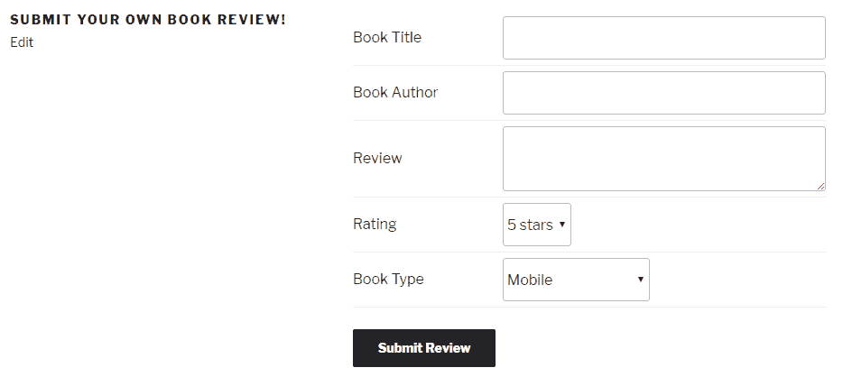
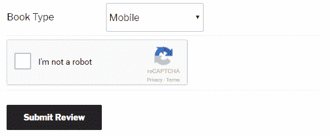
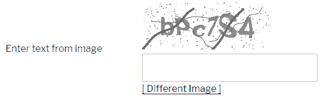

# 接受用户内容提交

在本章中，我们将专注于向访客提供向网站提交内容的能力。我们将涵盖以下食谱：

+   创建客户端内容提交表单

+   在自定义帖子类型中保存用户提交的内容

+   在新提交后发送电子邮件通知

+   使用在线服务在用户表单上实现 CAPTCHA

+   使用本地库在用户表单上实现 CAPTCHA

# 简介

给用户提供在网站上贡献内容的能力是吸引社区和保持网站内容新鲜的好方法。回到在第四章中实施的书籍评论系统，《自定义帖子类型的威力》，本章解释了如何允许访客向网站添加自己的书评。

# 创建客户端内容提交表单

向访客提供在网站上贡献内容的能力的第一步是展示一个他们可以使用来提交新内容的表单。本食谱展示了如何创建一个可以轻松插入任何 WordPress 页面以渲染简单表单的短代码。

# 准备工作

你应该运行在第四章中创建的 Book Reviews 插件的最终版本，即《自定义帖子类型的威力》，或者使用下载的代码包中的最终结果代码（`Chapter 4/ch4-book-reviews/ch4-book-reviews-v11.php`）。

# 如何操作...

1.  导航到你的开发安装的 WordPress 插件目录。

1.  创建一个名为`ch6-book-review-user-submission`的新目录并打开它。

1.  创建一个名为`ch6-book-review-user-submission.php`的文本文件。

1.  在代码编辑器中打开新文件，并在插件文件顶部添加一个适当的标题，将插件命名为“第六章 - 书评用户提交”。

1.  添加以下代码行以声明一个新的短代码及其相关函数：

```php
add_shortcode( 'submit-book-review', 'ch6_brus_book_review_form' ); 
```

1.  向`ch6_brus_book_review_form`函数提供以下代码段：

```php
function ch6_brus_book_review_form() { 
    // make sure user is logged in 
    if ( !is_user_logged_in() ) { 
        echo '<p>You need to be a website member to be able to '; 
        echo 'submit book reviews. Sign up to gain access!</p>'; 
        return; 
    } 
    ?> 

    <form method="post" id="add_book_review" action=""> 

    <!-- Nonce fields to verify visitor provenance --> 
    <?php wp_nonce_field( 'add_review_form', 'br_user_form' ); ?>

    <table> 
        <tr> 
            <td>Book Title</td> 
            <td><input type="text" name="book_title" /></td> 
        </tr> 
        <tr> 
            <td>Book Author</td> 
            <td><input type="text" name="book_author" /></td> 
        </tr> 
        <tr> 
            <td>Review</td> 
            <td><textarea name="book_review_text"></textarea></td> 
        </tr> 
        <tr> 
          <td>Rating</td> 
            <td><select name="book_review_rating"> 
            <?php 
            // Generate all rating items in drop-down list 
            for ( $rating = 5; $rating >= 1; $rating-- ) { ?> 
                <option value="<?php echo $rating; ?>"> 
                               <?php echo $rating; ?> stars 
            <?php } ?> 
            </select> 
            </td> 
        </tr> 
        <tr> 
            <td>Book Type</td> 
            <td> 
            <?php  
            // Retrieve array of all book types in system 
            $book_types = get_terms( 'book_reviews_book_type', 
                                 array( 'orderby' => 'name', 
                                        'hide_empty' => 0 ) ); 

            // Check if book types were found 
            if ( !is_wp_error( $book_types ) && 
                 !empty( $book_types ) ) { 

                echo '<select name="book_review_book_type">'; 

                // Display all book types 
                foreach ( $book_types as $book_type ) { 
                     echo '<option value="' . $book_type->term_id; 
                     echo '">' . $book_type->name . '</option>'; 
               }     

               echo '</select>'; 
            } ?> 
            </td> 
        </tr> 
    </table> 

    <input type="submit" name="submit" value="Submit Review" /> 
    </form> 
<?php } 
```

1.  保存并关闭插件文件。

1.  激活“第六章 - 书评用户提交”插件。

1.  创建一个新页面，并在项目内容中插入新创建的`[submit-book-review]`短代码。

1.  发布并查看页面以查看表单。如果你提交表单，目前不会有任何动作，因为我们还没有实现一个处理函数来解析和保存提交的数据：



# 它是如何工作的...

如前几章所见，短代码是可以在任何帖子或页面中轻松添加的特殊文本块，当它们出现在用户访问的页面中时，会被内容替换。本食谱使用`add_shortcode`函数声明一个新的短代码，该短代码会被替换为评论提交表单。

该表单本身使用标准 HTML 创建，并显示多个文本字段。它还使用一些 PHP 代码来动态构建系统中定义的评分和书籍类型列表。表单还包括对`wp_nonce_field`函数的 PHP 调用，该函数在创建插件配置面板时已见过，用于添加将作为关联数据处理函数中的安全措施使用的隐藏字段。最后，代码检查访问该页面的用户是否已登录到网站，并在检查结果为否定时显示一条简短的消息而不是提交表单。

提交时，表单操作将发送访客内容到显示书籍评论表单的页面。此新内容将被拦截并在下一个配方中添加的代码中进行处理。

# 相关内容

+   在第二章的*插件框架基础*中，创建一个新的简单短代码配方。

# 在自定义帖子类型中保存用户提交的内容

当访客点击上一个配方中创建的表单上的提交按钮时，表单的目标被设置为托管提交表单的同一页面。由于该页面无法处理表单数据，我们必须实现一个动作钩子来拦截这些帖子数据并将其发送到我们将定义的处理函数。本配方展示了如何实现一个负责处理用户输入的函数。

# 准备工作

您应该运行第四章中创建的最终版本的书籍评论插件，并且应该已经遵循了*创建客户端内容提交表单*的配方。或者，您可以从代码包中获取文件（`Chapter 4/ch4-book-reviews/ch4-book-reviews-v11.php`和`Chapter 6/ch6-book-review-user-submission/ch6-book-review-user-submission-v1.php`），并将`ch6-book-review-user-submission-v1.php`重命名为`ch6-book-review-user-submission.php`。

# 如何操作...

1.  导航到您开发安装中 WordPress 插件文件夹的`ch6-book-review-user-submission`目录。

1.  在文本编辑器中打开文件`ch6-book-review-user-submission.php`。

1.  将以下代码行添加以注册一个将拦截用户提交的书籍评论的函数：

```php
add_action( 'template_redirect', 
            'ch6_brus_match_new_book_reviews' ); 
```

1.  将以下代码块添加以实现`ch6_brus_match_new_book_reviews`函数：

```php
function ch6_brus_match_new_book_reviews( $template ) { 
    if ( !empty( $_POST['ch6_brus_user_book_review'] ) ) { 
        ch6_brus_process_user_book_reviews(); 
    } else { 
        return $template; 
    } 
} 
```

1.  插入以下代码以提供`ch6_brus_process_user_book_reviews`的实现：

```php
function ch6_brus_process_user_book_reviews() { 
    // Check that all required fields are present and non-empty 
    if ( wp_verify_nonce( $_POST['br_user_form'], 
                          'add_review_form' ) && 
         !empty( $_POST['book_title'] ) && 
         !empty( $_POST['book_author'] ) && 
         !empty( $_POST['book_review_text'] ) &&  
         !empty( $_POST['book_review_book_type'] ) && 
         !empty( $_POST['book_review_rating'] ) ) { 
        // Create array with received data 
        $new_book_review_data = array( 
            'post_status' => 'publish',  
            'post_title' => $_POST['book_title'], 
            'post_type' => 'book_reviews', 
            'post_content' => $_POST['book_review_text'] ); 

        // Insert new post in website database 
        // Store new post ID from return value in variable 
        $new_book_review_id =  
                         wp_insert_post( $new_book_review_data ); 

        // Store book author and rating 
        add_post_meta( $new_book_review_id, 'book_author', 
                     wp_kses( $_POST['book_author'], array() ) ); 
        add_post_meta( $new_book_review_id, 'book_rating', 
                       (int) $_POST['book_review_rating'] ); 

        // Set book type on post 
        if ( term_exists( $_POST['book_review_book_type'], 
                          'book_reviews_book_type' ) ) { 
            wp_set_post_terms( $new_book_review_id, 
                               $_POST['book_review_book_type'], 
                               'book_reviews_book_type' );  
        } 
        // Redirect browser to book review submission page 
        $redirect_address = 
             ( empty( $_POST['_wp_http_referer'] ) ? site_url() : 
                                    $_POST['_wp_http_referer'] ); 
        wp_redirect( add_query_arg( 'add_review_message', '1', 
                     $redirect_address ) ); 
        exit; 
    } else { 
        // Display message if any required fields are missing 
        $abort_message = 'Some fields were left empty. Please '; 
        $abort_message .= 'go back and complete the form.'; 
        wp_die( $abort_message ); 
        exit; 
    } 
} 
```

1.  在原始的`ch6_brus_book_review_form`函数中，在`wp_nonce_field`函数调用之后添加以下代码：

```php
<?php if ( isset( $_GET['add_review_message'] ) 
            && $_GET['add_review_message'] == 1 ) { ?> 

    <div style="margin: 8px;border: 1px solid #ddd; 
        background-color: #ff0;"> 
    Thank for your submission! 
    </div> 

<?php } ?> 

<!-- Post variable to indicate user-submitted items --> 
<input type="hidden" name="ch6_brus_user_book_review" value="1" /> 
```

1.  保存并关闭插件文件。

1.  返回书籍评论提交表单并提交一条评论以将所有字段发送到新创建的处理函数。处理新内容后，脚本将返回到表单，显示一条确认消息。

# 工作原理...

在将书评表单数据提交到包含上一食谱中书评提交表单的页面后，这个食谱的前几个步骤将是将一个函数分配给`template_redirect`动作钩子，以便我们能够捕获新的书评内容。此钩子函数在 WordPress 处理序列的早期执行。如果找到，我们将调用在食谱其余部分定义的处理函数。

在我们的处理函数中，首先要做的是检查是否找到了作为帖子数据一部分的正确隐藏数据字段，使用`wp_verify_nonce`函数。如果不存在，表明有人可能试图在没有访问前端表单的情况下向网站发布数据，它将显示一个错误消息。

当我们确信我们的数据存储脚本是合法调用的，我们将继续通过首先检查所有字段是否存在且不为空来处理实际数据。如果不是这样，我们将显示一个错误消息，要求用户使用`wp_die`函数返回并完成表单。

如果所有字段都已正确接收，食谱将继续通过准备一个包含新提交的标题和评论文本、帖子状态以及`book_reviews`帖子类型名称的信息数组来处理传入的数据。生成的数组被发送到`wp_insert_post`函数以存储信息。正如我们所见，`wp_insert_post`只需要一个参数，该参数使用我们刚刚创建的数组来满足。虽然我们只定义了该数组的四个元素，但还有更多可用，这可以通过查阅 WordPress Codex（[`developer.wordpress.org/reference/functions/wp_insert_post/`](https://developer.wordpress.org/reference/functions/wp_insert_post/))来了解。

现在，调用`wp_insert_post`仅负责存储属于帖子数据的一些关键数据元素。我们必须随后调用`update_post_meta`和`wp_set_post_terms`来将剩余的用户信息存储到网站数据库中。

一旦所有信息都存储完毕，我们使用`wp_redirect`和`add_query_arg`函数的组合将用户送回到他提交书评的页面，同时确保目标地址中只有一个`add_review_message`变量的实例。

最后但同样重要的是，这个食谱对渲染书评表单的代码进行了微小修改，以添加一个确认消息，当插件接受信息时，该消息会显示给访客。

# 还有更多...

在一个充斥着垃圾邮件机器人和决心在任何网站上创建虚假内容的真实人的世界中，将新书评论立即显示在网站上可能不是明智之举。

# 审核用户提交的内容

与将新帖子条目的状态设置为发布相比，我们可以使用草稿值使新条目仅在后台管理区域可见。为了给插件用户提供更多灵活性，您还可以在配置面板中给他们提供选择他们偏好的方法的方式。

# 参见

+   *创建客户端内容提交表单*配方

+   在第三章，“用户设置和管理页面”中的*处理和存储插件配置数据*配方

+   在第四章，“自定义文章类型的威力”中的*向自定义文章类型编辑器添加新部分*配方

# 在新提交时发送电子邮件通知

就像 WordPress 在发布新评论时向管理员发送电子邮件通知一样，当访客发布新书评时发送电子邮件，允许网站管理员在内容到来时进行审查，并决定是否批准将其发布到网上。

这个配方展示了如何准备电子邮件数据并使用`wp_mail`函数发送它。

# 准备工作

您应该运行在第四章，“自定义文章类型的威力”中创建的 Book Reviews 插件的最终版本，并且应该已经遵循了*在自定义文章类型中保存用户提交的数据*的配方（包括根据*更多内容*部分中的指示更改文章状态为草稿）。或者，您可以从代码包中获取结果文件（`Chapter 4/ch4-book-reviews/ch4-book-reviews-v11.php`和`Chapter 6/ch6-book-review-user-submission/ch6-book-review-user-submission-v2.php`），并将`ch6-book-review-user-submission-v2.php`重命名为`ch6-book-review-user-submission.php`。最后，您应该能够访问托管在 Web 服务器上的 WordPress 安装，因为当在本地安装上运行时，通常不会发送电子邮件。确保您有权访问与网站管理员关联的电子邮件账户，以查看生成的电子邮件。

# 如何做到这一点...

1.  导航到您的开发安装中 WordPress 插件文件夹的`ch6-book-review-user-submission`目录。

1.  在文本编辑器中打开`ch6-book-review-user-submission.php`文件。

1.  插入以下代码行以注册一个在提交新帖子时被调用的函数：

```php
add_action( 'wp_insert_post', 'ch6_brus_send_email', 10, 2 ); 
```

1.  插入以下代码块以实现`ch6_brus_send_email`函数：

```php
function ch6_brus_send_email( $post_id, $post ) { 

    // Only send emails for user-submitted book reviews 
    if ( isset( $_POST['ch6_brus_user_book_review'] ) && 
         'book_reviews' == $post->post_type ) { 

        $admin_mail = get_option( 'admin_email' ); 
        $headers = 'Content-type: text/html'; 
        $message = 'A user submitted a new book review to your '; 
        $message .= 'WordPress website database.<br /><br />'; 
        $message .= 'Book Title: ' . $post->post_title ; 
        $message .= '<br /><a href="'; 
        $message .= add_query_arg( array( 
                                   'post_status' => 'draft', 
                                  'post_type' => 'book_reviews' ), 
                                   admin_url( 'edit.php' ) ); 
        $message .= '">Moderate new book reviews</a>'; 
        $email_title = htmlspecialchars_decode( get_bloginfo(), 
             ENT_QUOTES ) . " - New Book Review Added: " . 
             htmlspecialchars( $_POST['book_title'] ); 
        // Send email 
        wp_mail( $admin_mail, $email_title, $message, $headers ); 
    } 
} 
```

1.  保存并关闭插件文件。

1.  返回书评提交表单并提交书评。将向与网站管理员关联的地址发送一封电子邮件，其中包含新评论的一些信息：


# 它是如何工作的...

`wp_mail`函数可以被任何插件用来发送电子邮件消息。它需要五个参数来定义出站消息的所有元素：

```php
wp_mail( $destination, $subject, $message, [$headers], 
         [$attachments] ); 
```

前三个参数是必需的，分别定义了预期收件人的电子邮件地址、消息标题和内容。正如我们在本配方中看到的，内容主要使用标准 HTML 语法指定，而目标电子邮件地址是通过`get_option`函数从选项表中检索的。至于标题，它是由多个文本元素（如博客标题和书评标题）构建的，以创建最终结果。

下一个参数是可选的，为电子邮件提供标题信息，其中该部分最重要的信息是字符集。最后一个参数可以可选地用来指定一个或多个文件的路径，这些文件将被作为电子邮件附件发送。

为了使网站管理员更容易管理新条目，消息正文的一部分包含一个链接到 WordPress 网站管理区域的自定义帖子管理页面，以便快速显示所有未批准的条目（设置为草稿项目）。

# 参考内容

+   *创建客户端内容提交表单*配方

# 在用户表单上使用在线服务实现 CAPTCHA

网站表单上的一种常见安全措施是使用 CAPTCHA 代码，其中显示扭曲的字母或其他形式的测试，以检查提交数据的个人不是垃圾邮件机器人。我们一直在构建的接受访客提交的书评表单可以从这种技术中受益，以避免筛选不想要的条目。

这个配方展示了如何将 Google 的 reCAPTCHA 服务集成到我们的书评提交表单中。如果您更喜欢使用本地 CAPTCHA 脚本以避免依赖在线服务或确保您的表单可以在所有国家使用，请跳转到下一个配方，标题为*使用本地库在用户表单上实现 CAPTCHA*。

# 准备工作

您应该运行在第四章中创建的最终版本的“书评插件”，*自定义帖子类型的力量*，并且应该已经遵循了*在新的提交后发送电子邮件通知*的配方。或者，您可以从代码包中获取结果文件（`Chapter 4/ch4-book-reviews/ch4-book-reviews-v11.php`和`Chapter 6/ch6-book-review-user-submission/ch6-book-review-user-submission-v3.php`），并在开始配方之前将`ch6-book-review-user-submission-v3.php`重命名为`ch6-book-review-user-submission.php`。

这个配方需要有一个 Google 账户才能注册 reCAPTCHA 服务。

# 如何操作...

1.  访问 Google reCAPTCHA 管理员网站([`www.google.com/recaptcha/admin`](https://www.google.com/recaptcha/admin))，如果您尚未连接到 Google 服务，请登录。

1.  通过指定标签（例如，`开发网站`）并使用单选选择器设置 reCAPTCHA 类型为 reCAPTCHA V2 来注册一个新的网站。

1.  在域名字段中输入您将用于测试代码的 Web 服务器的域名。如果您正在运行本地开发服务器，它可能是`localhost`。

1.  打开复选框以接受服务条款，然后点击注册以完成新网站创建过程。

1.  在生成的页面中，注意服务分配给您的测试网站的网络和密钥。

1.  导航到您的插件文件夹中的`ch6-book-review-user-submission`目录，并在代码编辑器中打开名为`ch6-book-review-user-submission.php`的文件。

1.  在文件末尾插入以下代码行以注册一个函数，该函数将在 WordPress 准备在网站上加载的脚本列表时被调用：

```php
add_action( 'wp_enqueue_scripts', 'ch6_brus_recaptcha_script' );
```

1.  添加以下代码块以提供`ch6_brus_recaptcha_script`函数的实现：

```php
function ch6_brus_recaptcha_script() {
    wp_enqueue_script( 'google_recaptcha', 
                       'https://www.google.com/recaptcha/api.js',
                       array(), false, true );
}
```

1.  在您的代码中找到`ch6_brus_book_review_form`函数，并在表单表中添加一行额外的行以显示 CAPTCHA，将`**[my-website-key]**`替换为从 reCAPTCHA 服务中较早获得的网站密钥：

```php
<tr>
    <td colspan="2">
        <div class="g-recaptcha" 
             data-sitekey="[my-website-key]"></div>
    </td>
</tr>
```

1.  保存您的插件并访问您的书评提交页面。现在你应该在表单中看到 Google reCAPTCHA 框出现了。



1.  访问 Google reCAPTCHA GitHub 页面([`github.com/google/recaptcha`](https://github.com/google/recaptcha))并将存储库的最新版本下载到您的计算机上。

1.  提取存储库内容并将生成的`src`文件夹复制到`ch6-book-review-user-submission`目录。

1.  将`src`文件夹重命名为`recaptcha`。

1.  在您的代码中找到`ch6_brus_process_user_book_reviews`函数，并在函数实现的顶部添加以下代码行，将`[my-secret-key]`替换为从 reCAPTCHA 服务中较早获得的密钥：

```php
require_once plugin_dir_path( __FILE__ ) .
             '/recaptcha/autoload.php';

$recaptcha = new \ReCaptcha\ReCaptcha( '[my-secret-key]' ); 
$resp = $recaptcha->verify( $_POST['g-recaptcha-response'],
                            $_SERVER['REMOTE_ADDR'] );

if ( ! $resp->isSuccess() ) {
    // Display message if any required fields are missing 
    $abort_message = 'Missing or incorrect captcha.<br />'; 
    $abort_message .= 'Please go back and try again.'; 
    wp_die( $abort_message ); 
    exit; 
} else {
```

1.  在`ch6_brus_process_user_book_reviews`函数的末尾之前添加一个额外的闭合括号（`}`），以关闭上一步插入的代码的`else`部分。

1.  保存并关闭代码文件。

1.  提交一个新的书评而不检查 reCAPTCHA 复选框，以查看它将不会被处理函数接受。

# 它是如何工作的...

Google 的 reCAPTCHA 服务是一项免费服务，可以在您的表单中生成和显示 CAPTCHA 框。随着时间的推移，它已经从要求用户在图像中解读乱码信息发展到显示地址和其他街道标志，并要求用户输入他们所看到的。在其最新版本中，reCAPTCHA 仅要求用户勾选一个框以表明他们不是机器人，并且只有在怀疑访客是自动化系统时才会提出更高级的问题。当访客勾选框时，一个隐藏字段会被填充一个验证码，该验证码会与表单数据的其余部分一起发送到我们的数据处理函数。

将 reCAPTCHA 添加到我们的表单实际上非常简单，只需要我们加载一个 JavaScript 脚本并在我们的表单中添加一行代码，该代码会被转换成服务的商标复选框。一旦表单数据提交，验证它比我们之前使用的非 ces 更复杂，因为我们的插件需要与 Google 的服务器通信以检查验证码。幸运的是，Google 提供了一个易于使用的库来隐藏许多操作复杂性。如果收到的 reCAPTCHA 代码有效，之前创建的数据处理和存储代码将按之前的方式执行。否则，将向用户显示错误消息。除了易于集成之外，使用第三方服务的另一个好处是大多数代码更新都是由服务提供商完成的。你仍然需要检查 PHP 验证库的偶尔更新，但这只是该服务功能的一小部分。

如果你计划分发一个用于多人或客户的 reCAPTCHA 服务的插件，那么在最终的插件代码中留下你自己的网站和密钥是没有意义的，就像我们在这里所做的那样。相反，你应该创建一个管理面板，就像你在第三章*用户设置和管理页面*中学到的那样，以便用户可以输入他们自己的密钥，并在网站上使用它们。

应该注意的是，虽然 Google reCAPTCHA 是最受欢迎的 CAPTCHA 生成服务之一，但在撰写本文时，它对中国访客不起作用，并且已经有一段时间没有工作了。如果你正在为广泛的受众开发插件，你可能需要考虑支持多个 CAPTCHA 服务或库，以确保用户无论身在何处都有选择。阅读下一个配方，了解使用本地库生成 CAPTCHA 的示例。

# 参见

+   *在新提交时发送电子邮件通知* 的配方

+   *在设置菜单中创建管理页面菜单项* 的配方

+   *使用 HTML 渲染管理页面内容* 的配方

+   *处理和存储插件配置数据* 的配方

+   *在保存选项时显示确认消息* 的配方

# 在用户表单上使用本地库实现 CAPTCHA

如前一个配方中所述，*使用在线服务在用户表单上实现 CAPTCHA*，向面向访客的表单添加 CAPTCHA 有助于减少对网站的恶意提交。在了解了如何集成在线第三方服务后，这个配方展示了如何下载并集成一个本地 PHP 脚本来本地生成和验证 CAPTCHA 图像。

# 准备工作

你应该运行在第四章中创建的最终版本的“图书评论”插件，即《自定义文章类型的威力》，并且应该已经遵循了“在新提交时发送电子邮件通知”的步骤。或者，你也可以从代码包中获取结果文件（`Chapter 4/ch4-book-reviews/ch4-book-reviews-v11.php` 和 `Chapter 6/ch6-book-review-user-submission/ch6-book-review-user-submission-v3.php`），在开始步骤之前将 `ch6-book-review-user-submission-v3.php` 重命名为 `ch6-book-review-user-submission.php`。

为了能够生成 CAPTCHA 图像，需要在你的开发网络服务器的 PHP 安装中安装并激活 GD 和 FreeType 库。大多数在第一章《准备本地开发环境》中提到的预包装本地网络服务器都带有这些库的激活。它们也通常在大多数托管网络服务器上启用，但在分发包含以下代码的插件给更广泛的受众时，还应提及这些库是必需的。

# 如何操作...

1.  访问 Securimage 网站 ([`www.phpcaptcha.org/download/`](https://www.phpcaptcha.org/download/)) 下载他们 CAPTCHA 库的最新版本。

1.  打开生成的存档，并将整个 `securimage` 目录提取到你的插件目录的 `ch6-book-review-user-submission` 文件夹中。

1.  在插件目录中，使用代码编辑器打开名为 `ch6-book-review-user-submission.php` 的文件。

1.  在你的代码中定位到 `ch6_brus_book_review_form` 函数，并在表单中添加一行以显示 CAPTCHA：

```php
<tr>
    <td>Enter text from image</td>
    <td>
                                    __FILE__ ); ?>"
             alt="CAPTCHA Image" />
        <input type="text" name="captcha_code"
               size="10" maxlength="6" />
        <a href="#" 
           onclick="document.getElementById( 'captcha' ).src = 
           '<?php echo plugins_url(
                       '/securimage/securimage_show.php', 
                       __FILE__ ); ?>?'
           + Math.random(); return false">[ Different Image ]</a>
    </td>
</tr> 
```

1.  保存你的插件并访问你的图书评论提交页面。你现在应该会在表单中看到 CAPTCHA 图像：



1.  在你的代码中定位到 `ch6_brus_process_user_book_reviews` 函数，并在函数实现的顶部添加以下代码行：

```php
if ( PHP_SESSION_NONE == session_status() ) {
    session_start();
}

include_once plugin_dir_path( __FILE__ ) .
             '/securimage/securimage.php';
$securimage = new Securimage();

if ( false == $securimage->check( $_POST['captcha_code'] ) ) {
    // Display message if any required fields are missing 
    $abort_message = 'Missing or incorrect captcha.<br />'; 
    $abort_message .= 'Please go back and try again.'; 
    wp_die( $abort_message ); 
    exit; 
} else {
```

1.  在 `ch6_brus_process_user_book_reviews` 函数的末尾之前添加一个额外的闭合括号（`}`），以关闭之前步骤中插入的代码的 `else` 部分。

1.  保存并关闭代码文件。

1.  提交一个新的图书评论而不输入 CAPTCHA 代码，以查看它将不会被处理函数接受。

# 工作原理...

`Securimage` 脚本是一个简单的工具，可以生成和显示 CAPTCHA 图像，以及使用会话数据存储它生成的字符串。

该配方的代码通过使用标准 HTML `img` 标签来显示 CAPTCHA 图像，该标签使用 `securimage` 目录中的某个脚本作为图像路径。在数据处理方面，我们的代码首先通过调用 `session_start` 来重新连接到由图像生成器启动的会话，以存储 CAPTCHA 代码。然后，它继续检查用户输入的 CAPTCHA 文本是否与显示的图像匹配，这是通过 `securimage` 类的 `check` 方法实现的。根据这个结果，我们显示错误消息或继续验证其他所需数据字段是否已正确提交。

虽然有许多 PHP 脚本可用于生成 CAPTCHA 图像，但这个特定的配方选择了它，因为它是一个开源脚本，使用的是 BSD 许可证，这与 WordPress 许可证兼容。这意味着你将能够将此脚本与你的插件一起在官方 WordPress 插件仓库中分发。

当你在插件中使用第三方库时，你应该定期检查该库是否已被其作者更新，并尽快将新版本纳入你的工作中，以确保你的插件不会暴露于安全漏洞。

对于更高级的内容过滤方法，请查阅 Akismet API ([`akismet.com/development/api/`](https://akismet.com/development/api/))。

# 参见

+   *使用在线服务在用户表单上实现 CAPTCHA 的配方*
