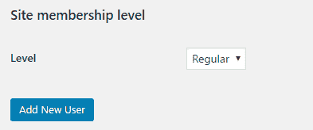
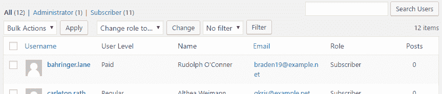
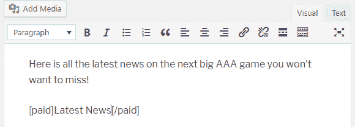

# 自定义用户数据

本章将向我们展示如何增强 WordPress 用户编辑器，并通过以下主题使用与用户关联的附加数据：

+   向用户编辑器添加自定义字段

+   处理和存储用户自定义数据

+   在用户列表页面显示新用户数据

+   在包含短代码中使用自定义用户数据

# 简介

在学习了如何使用自定义数据字段自定义帖子编辑器和分类之后，我们将要添加的下一个区域是用户创建和编辑工具。这种添加可以用于许多不同的目的，包括跟踪用户最后一次访问网站的时间或存储他们对感兴趣的服务类型的额外数据。本章在第二章*插件框架基础*和第三章*用户设置和管理页面*中，通过添加一个二级内容保护层来扩展我们在第二章开始的私有内容插件，该保护层将限制一些帖子或页面，使其仅对付费用户可用。

# 向用户编辑器添加自定义字段

与分类编辑器类似，用户编辑器允许开发者通过动作钩子添加额外字段，并通过使用相同的 HTML 结构来简化这一任务，无论是创建新用户还是修改现有用户。本配方展示了如何将回调函数分配给用户编辑器以添加新部分。

# 准备工作

要创建一个包含样式表和管理面板的完整插件，您应该已经遵循了第三章中的*将样式表数据存储在用户设置*配方，以获得本配方的起点。或者，您可以从下载的代码包中获取结果代码（`Chapter 3/ch2-private-item-text-edit-stylesheet/ch2-private-item-text.php`），并将`ch2-private-item-text-edit-stylesheet`重命名为`ch2-private-item-text`。

也可能只是创建一个新的空插件文件，通过在您的插件目录中创建一个名为`ch2-private-item-text`的文件夹，并在其中添加一个名为`ch2-private-item-text.php`的文本文件，只添加一个标准的插件头部来遵循本章的配方。

# 如何操作...

1.  导航到您开发安装的 WordPress 插件目录中的`ch2-private-item-text`文件夹。

1.  在文本编辑器中打开`ch2-private-item-text.php`文件。

1.  在文件末尾添加以下代码片段以声明一个全局变量并初始化变量的内容：

```php
global $user_levels;
$user_levels = array( 'regular' => 'Regular', 'paid' => 'Paid' );
```

1.  将以下代码行添加到注册一个函数，当通过管理界面添加新用户或编辑用户时调用：

```php
add_action( 'user_new_form', 'ch2pit_show_user_profile' );
add_action( 'edit_user_profile', 'ch2pit_show_user_profile' );
```

1.  将以下代码块添加以提供`ch2pit_show_user_profile`函数的实现：

```php
function ch2pit_show_user_profile( $user ) {
    global $user_levels;
    if ( 'add-new-user' == $user ) {
        $current_user_level = '';
    } elseif ( !empty( $user ) && isset( $user->data->ID ) ) {
        $user_id = $user->data->ID;
        $current_user_level =
            get_user_meta( $user_id, 'user_level', true );
    } ?> 

    <h3>Site membership level</h3>
    <table class="form-table">
        <tr>
            <th>Level</th>
            <td><select name="user_level" id="user_level">
            <?php foreach( $user_levels as 
                           $user_level_index => $user_level ) { ?>
            <option value="<?php echo $user_level_index; ?>"
            <?php selected( $current_user_level,
                            $user_level_index ); ?>>
            <?php echo $user_level; ?></option>
            <?php } ?>
            </select></td>
        </tr>
    </table> 
<?php }
```

1.  保存并关闭插件文件。

1.  前往管理界面的插件部分，并确保已激活 `第二章 - 私人物品文本` 插件。

1.  在用户部分下选择“添加新用户”菜单项，查看用户创建页面，并查看表单底部的新的网站会员级别部分：



1.  编辑网站上的现有用户之一，以查看附加部分也会显示。如果您在任一情况下尝试保存用户，新添加的字段将不会保存，直到您执行下一个配方中的步骤。

# 工作原理...

`user_new_form` 和 `edit_user_profile` 动作钩子允许开发者在向网站添加新用户和编辑用户时向用户编辑器添加内容。

WordPress 提供了第三个动作钩子，称为 `show_user_profile`。与该钩子关联的函数在用户查看自己的个人资料时会被调用。您应仔细考虑是否根据您插件的本性和要存储的附加信息，注册一个与该动作钩子关联的函数。换句话说，如果您不注册任何函数与该钩子，就像我们在本配方中所做的那样，您将不会在查看网站上的个人资料时看到创建的附加字段，即使您是管理员。您仍然能够看到付费内容，因为我们将会向具有管理员权限的用户显示它。

我们的回调函数首先检查是否通过 `$user` 参数接收到了有效的用户，或者是否正在创建新用户。根据结果，它通过调用 `get_user_meta` 函数检索相关的用户级别数据，或者初始化一个空变量。`get_user_meta` 的语法与 `get_post_meta` 和 `get_term_meta` 函数的语法相同，第一个参数用于指定用户 ID，其余字段表示要检索的字段名称以及数据是否应作为单个变量或数组返回：

```php
get_user_meta( $user_id, $field_name, $single );
```

我们的其他回调函数负责渲染一个基本的 HTML 选择列表，并根据当前用户的会员级别选择列表中的一个项目。

在本配方中，我们唯一添加的额外元素是将用户会员级别数组声明为一个 `全局` 变量，我们将在本章的多个函数中引用它。

# 参见

+   *将样式表数据存储在用户设置中* 的配方

# 处理和存储用户自定义数据

当用户资料被创建或更新时，WordPress 提供了一种简单的方法来注册一个回调函数，以便在网站的数据库中保存自定义用户数据。本配方展示了如何使用这个动作钩子。

# 准备工作

您应该已经遵循了 *向用户编辑器添加自定义字段* 的配方，以便为本配方和结果插件提供一个起点，并且结果插件仍然在您的开发站点中处于活动状态。或者，您可以从下载的代码包中获取结果代码（`Chapter 7/ch2-private-item-text/ch2-private-item-text-v3.php`），将其重命名为 `ch2-private-item-text.php`。

# 如何操作...

1.  导航到您开发安装的 WordPress 插件目录中的 `ch2-private-item-text` 文件夹。

1.  在文本编辑器中打开 `ch2-private-item-text.php` 文件。

1.  在文件末尾添加以下代码行以注册在用户数据在初始创建时或用户更新时被调用的函数：

```php
add_action( 'user_register', 'ch2pit_save_user_data' );
add_action( 'profile_update', 'ch2pit_save_user_data' );
```

1.  将以下代码块添加到提供 `ch2pit_save_user_data` 函数实现的代码中：

```php
function ch2pit_save_user_data( $user_id ) {
    global $user_levels;
    if ( isset( $_POST['user_level'] ) &&
         !empty( $_POST['user_level'] ) &&
         array_key_exists( $_POST['user_level'], 
                           $user_levels ) ) {
        update_user_meta( $user_id, 'user_level',
                          $_POST['user_level'] );
    } else {
        update_user_meta( $user_id, 'user_level', 'regular' );
    }
}
```

1.  保存并关闭插件文件。

1.  编辑网站上现有的用户或创建一个新用户，以查看用户级别值是否已保存。

# 工作原理...

类似于向用户编辑器添加字段，WordPress 提供了两个不同的动作钩子来注册在用户最初注册时（`user_register`）和用户资料更新时（`profile_update`）被调用的函数。如您所见，我们在两种情况下都注册了相同的回调函数，其中我们检查是否收到了表示所需用户级别的值，并使用 `update_user_meta` 函数来保存它。类似于文章和术语元更新函数，此函数有三个参数，用于指示应将信息关联到的用户 ID、自定义数据字段的名称以及要存储的值：

```php
update_user_meta( $user_id, $field_name, $single );
```

作为额外的预防措施，我们使用 PHP 的 `array_key_exists` 函数检查我们收到的值是否存在于我们的全局用户级别数组中。

`if` 语句的 `else` 分支被放置在那里，以在字段不存在时设置默认用户级别，这可能发生在网站允许访客自行注册账户的情况下。

当然，将用户分类为普通用户或付费用户的当前过程非常手动，需要网站管理员登录到网站的仪表板并逐个更新他们的状态。一个更完善的解决方案可能是根据通过在线支付服务向网站支付的费用来设置此字段的值。

# 参见

+   *向用户编辑器添加自定义字段* 的配方

# 在用户列表页面显示新用户数据

随着新字段添加到用户资料中，对于网站管理员来说，在网站用户列表中查看这些数据并且能够过滤用户以仅显示被分配了特定值的用户非常有用。本配方展示了如何向 WordPress 管理区域的用户列表添加额外列，以及如何添加一个筛选函数以减少显示的记录数。

# 准备工作

你应该已经遵循了*处理和存储用户自定义数据*的配方，以便为这个配方提供一个起点，并且生成的插件仍然在你的开发网站上处于活动状态。或者，你可以从下载的代码包中获取生成的代码（`第七章/ch2-private-item-text/ch2-private-item-text-v4.php`），并将其重命名为`ch2-private-item-text.php`。

# 如何操作...

1.  导航到你的开发安装的 WordPress 插件目录中的`ch2-private-item-text`文件夹。

1.  在文本编辑器中打开`ch2-private-item-text.php`文件。

1.  添加以下代码行以注册一个在 WordPress 准备在用户列表页面上显示的列列表时被调用的函数：

```php
add_filter( 'manage_users_columns', 'ch2pit_add_user_columns' );
```

1.  使用以下代码块为`ch2pit_add_user_columns`函数添加一个实现：

```php
function ch2pit_add_user_columns( $columns ) {
    $new_columns = array_slice( $columns, 0, 2, true ) +
                   array( 'level' => 'User Level' ) +
                   array_slice( $columns, 2, NULL, true );
    return $new_columns;
}
```

1.  添加以下代码行以分配一个在 WordPress 准备显示所有用户列表的每个列的内容时被调用的函数：

```php
add_filter( 'manage_users_custom_column', 
            'ch2pit_display_user_columns_data', 10, 3 );
```

1.  通过插入以下代码段为`ch2pit_display_user_columns_data`函数提供一个实现：

```php
function ch2pit_display_user_columns_data( $val, $column_name,
                                           $user_id ) {
    global $user_levels;
    if ( 'level' == $column_name ) {
        $current_user_level = get_user_meta( $user_id, 
                                             'user_level', true );
        if ( !empty( $current_user_level ) ) {
            $val = $user_levels[$current_user_level];
        }
    }
    return $val;
}
```

1.  添加以下代码片段以注册一个在 WordPress 准备管理员可以在用户列表页面上执行的操作列表时被调用的函数：

```php
add_action( 'restrict_manage_users', 'ch2pit_add_user_filter' );
```

1.  将此代码段添加到为`ch2pit_add_user_filter`函数提供一个主体的代码：

```php
function ch2pit_add_user_filter() {
    global $user_levels;
    $filter_value = '';
    if ( isset( $_GET['user_level'] ) ) {
        $filter_value = $_GET['user_level'];
    } ?>

    <select name="user_level" class="user_level" 
            style="float:none;">
    <option value="">No filter</option>
    <?php foreach( $user_levels as
                       $user_level_index => $user_level ) { ?>
        <option value="<?php echo $user_level_index; ?>" 
        <?php selected( $filter_value, $user_level_index ); ?>>
        <?php echo $user_level; ?></option>
    <?php } ?>
    <input type="submit" class="button" value="Filter">
<?php }
```

1.  添加以下代码行以注册一个在 WordPress 渲染管理页面页脚时被调用的函数：

```php
add_action( 'admin_footer', 'ch2pit_user_filter_js' );
```

1.  通过添加以下代码段为`ch2pit_user_filter_js`函数提供一个实现：

```php
function ch2pit_user_filter_js() {
    global $current_screen;
    if ( 'users' != $current_screen->id ) {
        return;
    } ?>

    <script type="text/javascript">
        jQuery( document ).ready( function() {
            jQuery( '.user_level' ).first().change( function() {
                jQuery( '.user_level' ).
                    last().val( jQuery( this ).val() );
            });

            jQuery( '.user_level' ).last().change( function() {
                jQuery( '.user_level' ).
                    first().val( jQuery( this ).val() );
            });
        });
    </script>
<?php }
```

1.  添加此代码行以注册一个在 WordPress 准备从数据库检索用户列表的查询时将被执行的函数：

```php
add_filter( 'pre_get_users', 'ch2pit_filter_users' );
```

1.  插入以下代码块以定义`ch2pit_filter_users`函数：

```php
function ch2pit_filter_users( $query ) {
    global $pagenow;
    global $user_levels;

    if ( is_admin() && 'users.php' == $pagenow && 
         isset( $_GET['user_level'] ) ) {
        $filter_value = $_GET['user_level'];
        if ( !empty( $filter_value ) && 
             array_key_exists( $_GET['user_level'], 
                               $user_levels ) ) {
            $query->set( 'meta_key', 'user_level' );
            $query->set( 'meta_query', array(
                         array( 'key' => 'user_level',
                                'value' => $filter_value ) ) );
        } 
    }
}
```

1.  保存并关闭插件文件。

1.  访问管理界面的用户部分以查看新的用户级别列。



1.  使用过滤器下拉列表并点击“过滤”以限制显示的记录数。

# 它是如何工作的...

本配方中的第一个代码段是一个过滤器函数，它获取系统打算在管理界面用户部分显示的所有列的列表。虽然我们可以在数组的末尾添加我们的新条目，就像我们在第四章的*在自定义帖子列表页面中显示额外列*配方中所做的那样，*自定义帖子类型的威力*，但我们在这个配方中采用了一种更高级的方法；我们使用 PHP 的`array_slice`函数将列数组分成两部分，并在现有项目之间插入我们的新列名。

我们通过提供一个显示分配给每个用户的用户级别的函数来继续这个配方。这是通过简单地根据当前用户 ID 检索信息并将要显示的数据返回来完成的。需要注意的是，用户管理页面采取的方法与文章和页面自定义列内容略有不同，因为它使用了一个过滤器函数，我们在其中返回数据而不是使用直接将内容发送到浏览器的动作钩子。

下一个代码段负责渲染一个用户级别的下拉列表，可以用来过滤用户列表；这是通过使用标准的 HTML 和代码遍历用户级别列表并显示它们来完成的。不幸的是，WordPress 通过在列出用户之前和之后调用我们的函数两次来使事情复杂化，导致同一页面上出现两个下拉列表，无法区分它们。为了避免两个下拉列表设置不同的值并将这些冲突的值发送到我们的过滤代码中，下一个函数将 JavaScript 代码放置在所有用户列表页面的页面页脚中。这允许我们在用户与之交互时同步任一下拉列表的值。

我们的最后一步是在显示用户列表时，如果我们在页面 URL 中找到一个过滤参数，就修改用户查询。如果找到参数并且页面是正确的，我们将检查该值是否是我们用户级别数组的一部分，然后将其添加到系统的当前查询变量中。

# 参见

+   *处理和存储用户自定义数据*配方

# 在包含短代码中使用自定义用户数据

现在我们已经在用户配置文件中存储了额外的数据，并简化了在管理页面中查看这些信息，要实现将一些网站内容限制为付费用户的目标，唯一缺少的组件是引入一个新的包围短代码，该短代码在显示内容之前将检查用户的级别。配方将展示如何创建这个新的短代码。

# 准备工作

你应该已经遵循了*在用户列表页面显示新用户数据*的配方，以便为这个配方提供一个起点，并且生成的插件仍然在你的开发站点中处于活动状态。或者，你可以从第七章的下载代码包中获取生成的代码（`Chapter 7/ch2-private-item-text/ch2-private-item-text-v5.php`），将其重命名为`ch2-private-item-text.php`。

# 如何做到这一点...

1.  导航到你的开发安装的 WordPress 插件目录中的`ch2-private-item-text`文件夹。

1.  在文本编辑器中打开`ch2-private-item-text.php`文件。

1.  在定义一个新的短代码并定义当使用它时调用的函数时，添加以下代码行：

```php
add_shortcode( 'paid', 'ch2pit_paid_shortcode' );
```

1.  提供以下代码段的`ch2pit_paid_shortcode`实现：

```php
function ch2pit_paid_shortcode( $atts, $content = null ) {
    if ( is_user_logged_in() ) {
        $current_user = wp_get_current_user();
        $current_user_level = get_user_meta( $current_user->ID, 
                                             'user_level', true );
        if ( 'paid' == $current_user_level ||  
             current_user_can( 'activate_plugins' ) ) {
            return '<div class="paid">' . $content . '</div>';
        }
    }
    $output = '<div class="register">';
    $output .= 'You need to be a paid member to access ';
    $output .= 'this content.</div>';
    return $output; 
}
```

1.  保存并关闭插件文件。

1.  创建一个新的帖子，并用 `[paid]` 和 `[/paid]` 标签包裹部分或全部内容。以管理员、未登录的访问者、注册的普通用户和注册的付费用户身份查看页面，以验证内容仅在第一种和最后一种情况下显示。



# 它是如何工作的...

与我们在第二章中创建的 *创建新的封装短代码* 菜单中的 `[private]` 短代码类似，这个菜谱中设置的新的 `[paid]` 短代码可以让内容创建者识别一篇文章或页面中的一或多个只能由设置为付费会员的用户查看的部分。

要做到这一点，我们的短代码实现首先检查访问者是否已登录。如果是这样，它将进一步通过请求 WordPress 提供当前用户的数据来验证用户，然后使用用户 ID 检索我们在本章前面的菜谱中存储的 `user_level` 元数据。或者，它使用 `current_user_can` WordPress 函数并指定 `'activate_plugins'` 作为参数来检查用户是否是网站管理员，因为只有管理员才能执行此操作。如果所有这些条件都满足，则将显示封装的帖子内容。否则，将显示一条消息，表明用户必须是付费会员才能查看此内容。

# 参见

+   *在用户列表页面显示新用户数据* 菜单
