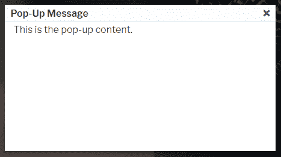
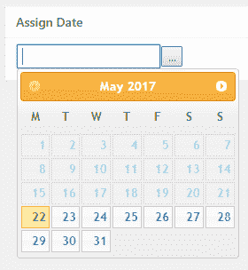
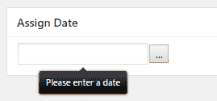
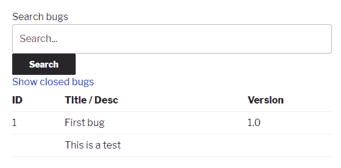

# 利用 JavaScript、jQuery 和 AJAX 脚本

本章通过探讨以下主题来专注于在插件中集成 JavaScript：

+   在 WordPress 网页上安全加载 jQuery

+   使用内置的 ThickBox 插件显示弹出对话框

+   使用短代码控制弹出对话框显示

+   使用 Datepicker 插件显示日历日选择器

+   使用 TipTip 插件为管理页面表单字段添加工具提示

+   使用 AJAX 动态更新页面部分内容

# 简介

JavaScript 库，特别是非常流行的 jQuery 库及其众多插件，可以通过流畅的动画、动态数据查询和高级视觉功能使网站焕发生机。不幸的是，尽管它们有诸多好处，但这些脚本也可能很难处理。例如，加载多个 jQuery 副本可能会破坏其他实例所做的所有设置，并且一个脚本中的错误通常会导致其他脚本无法正确运行。

WordPress 对这种复杂架构的回答有两个方面。首先，它预包装了 jQuery 和其他许多流行的 JavaScript 库的副本，插件开发者可以使用这些库而无需加载自己的版本。然后，为了防止在页面上加载多个副本，它提供了易于使用的函数，这些函数在渲染页面之前排队脚本和样式以识别重复项。

本章展示了如何安全地加载与 WordPress 一起提供的或来自外部来源的 JavaScript 和 jQuery 文件，以便为前端页面和插件配置面板添加强大的新功能。它还解释了如何安全地运行 AJAX 查询以刷新页面部分内容。

# 在 WordPress 网页上安全加载 jQuery

虽然可能很诱人，但作为使用流行 JavaScript 库的新插件的一部分提供自己的 jQuery 副本，或者从 Google API 网站获取副本，但实际上 WordPress 在其安装中提供了一个 jQuery 副本，并使其加载变得非常简单。

通过使用适当的实用函数来加载 jQuery，开发者向 WordPress 请求加载此库而不是自己加载。一旦收到所有请求，它们将被分析以查找重复项，并加载每个脚本的单一实例以减少同一库多个副本之间的冲突机会。

本食谱展示了如何加载 jQuery 脚本以用于前端网站页面。

# 准备工作

您应该能够访问 WordPress 开发环境。

# 如何做到...

1.  导航到您的开发安装的 WordPress 插件目录。

1.  创建一个名为`ch9-load-jquery`的新目录。

1.  导航到目录并创建一个名为`ch9-load-jquery.php`的文本文件。

1.  在代码编辑器中打开新文件，并在插件文件顶部添加一个适当的标题，将插件命名为“第九章 - 加载 jQuery”。

1.  添加以下代码行以注册在处理脚本加载请求时将被调用的函数：

```php
add_action( 'wp_enqueue_scripts', 'ch9lj_front_facing_pages' ); 
```

1.  将以下代码段添加到提供`ch9lj_front_facing_pages`函数实现的代码中：

```php
function ch9lj_front_facing_pages() { 
    wp_enqueue_script( 'jquery' ); 
} 
```

1.  保存并关闭插件文件。

1.  前往 WordPress 管理界面中的“外观”下的“主题”菜单部分。

1.  点击“添加新主题”并搜索名为`Twenty Eleven`的主题。

1.  在你的网站上安装该主题并激活它。

1.  访问你的网站并查看页面源代码，搜索`jquery.js`库的实例。除非你已激活要求加载 jQuery 的其他插件，否则你的搜索结果应该是空的。

1.  导航到插件管理页面并激活`第九章 - 加载 jQuery`插件。

1.  返回到你的网站上的任何页面并查看页面源代码。

1.  搜索关键字`jquery`以查看脚本现在是从 WordPress 的`wp-includes`文件夹加载的，包括用于向后兼容的`jquery-migrate`脚本：

```php
<script type='text/javascript' src='http://localhost/
    wp-includes/js/jquery/jquery.js?ver=1.12.4'></script>
<script type='text/javascript' src='http://localhost/
    wp-includes/js/jquery/jquery-migrate.min.js?ver=1.4.1'></script>
```

# 它是如何工作的...

本菜谱的关键组件是`wp_enqueue_script`函数，它允许开发者加载他们自己的 JavaScript 文件或请求 WordPress 加载它附带的一个脚本。虽然加载自己的脚本时该函数需要许多参数，我们将在后面的菜谱中介绍，但它只需要一个参数来加载内置脚本。在这个例子中，该参数是`jquery`。要获取 WordPress 附带的所有默认脚本的完整列表，请查看该函数的代码参考页面（[`developer.wordpress.org/reference/functions/wp_enqueue_script/`](https://developer.wordpress.org/reference/functions/wp_enqueue_script/))）。

一旦你知道要加载哪个脚本，就应该从以下三个动作钩子之一调用`wp_enqueue_script`，具体取决于脚本应该加载的目标页面。这些是用于前端页面的`wp_enqueue_scripts`，用于管理页面的`admin_enqueue_scripts`，以及用于登录页面的`login_enqueue_scripts`，其中第一个满足本菜谱的要求。

我们不得不退回去安装一个较旧的主题，以便在激活我们的插件后看到变化。许多现代主题已经请求加载 jQuery，因为它是用于动画菜单或提供许多其他常见功能。话虽如此，如果我们计划将我们的作品分发给更广泛的受众，我们不能假设这一点。

# 还有更多...

经验丰富的 jQuery 开发者应该知道 WordPress 附带的内容有一个小瑕疵。

# jQuery noconflict 模式

为了避免与其他 JavaScript 和 jQuery 库发生内部冲突，WordPress 捆绑的 jQuery 版本被配置在`noconflict`模式下。这意味着通常可以用来访问 jQuery 的`$`快捷键将不可用。因此，本章中找到的所有示例都明确指出了 jQuery 关键字。

要重新获取此快捷方式的访问权限，你可以在代码中使用以下语法：

```php
jQuery( document ).ready( function($) { 
    // $ shortcut is now available for this function 
} ); 
```

# 使用内置的 ThickBox 插件显示弹出对话框

尽管弹出对话框可能会让访客感到烦恼，但许多网站管理员都在使用这一功能来帮助他们推广特别优惠或让读者订阅他们的内容。由于它在其管理页面中使用了弹出对话框，WordPress 预装了一个名为 ThickBox 的 jQuery 脚本，可用于显示这些类型的对话框。

本食谱展示了如何加载 ThickBox 脚本并使用它来渲染弹出对话框。

# 准备工作

你应该能够访问 WordPress 开发环境。

# 如何做到这一点...

1.  导航到你的开发安装的 WordPress 插件目录。

1.  创建一个名为 `ch9-pop-up-dialog` 的新目录。

1.  导航到目录并创建一个名为 `ch9-pop-up-dialog.php` 的文本文件。

1.  在代码编辑器中打开新文件，并在插件文件顶部添加一个适当的标题，将插件命名为 `第九章 - 弹出对话框`。

1.  将以下代码行添加到注册一个在脚本加载请求时被调用的函数：

```php
add_action( 'wp_enqueue_scripts', 'ch9pud_load_scripts' ); 
```

1.  添加以下代码段以提供 `ch9pud_load_scripts` 函数的实现：

```php
function ch9pud_load_scripts() { 
    wp_enqueue_script( 'jquery' ); 
    add_thickbox(); 
} 
```

1.  插入以下代码行以注册一个在页面页脚显示内容的函数：

```php
add_action( 'wp_footer', 'ch9pud_footer_code' ); 
```

1.  添加以下代码块以提供 `ch9pud_footer_code` 函数的实现：

```php
function ch9pud_footer_code() { ?> 
    <script type="text/javascript"> 
    jQuery( document ).ready(function() { 
        setTimeout( function() { 
            tb_show( 'Pop-Up Message', '<?php echo plugins_url( 
                      'content.html?width=420&height=220', 
                      __FILE__ ); ?>', null ); 
        }, 2000 ); 
    } ); 

</script> 
<?php 
} 
```

1.  保存并关闭插件文件。

1.  创建一个名为 `content.html` 的新 HTML 文件，并在代码编辑器中打开它。

1.  将以下 HTML 代码作为文件内容插入：

```php
<!DOCTYPE html> 
<html> 
    <body> 
        <div>This is the pop-up content.</div> 
    </body> 
</html> 
```

1.  保存并关闭 HTML 文件。

1.  导航到插件管理页面并激活 `第九章 - 弹出对话框` 插件。

1.  访问网站的任何页面，以查看新弹出对话框在整页显示两秒后出现：



# 它是如何工作的...

与前面的食谱类似，我们首先将一个函数分配给 `wp_enqueue_scripts` 动作钩子。当执行时，回调函数调用 `wp_enqueue_script` 以请求从 WordPress 的本地副本加载 jQuery。下一行调用 `add_thickbox` 函数，这是一个实用函数，它会对 `wp_enqueue_script` 和 `wp_enqueue_style` 进行多次调用，以在页面页眉中加载适当的 JavaScript 和样式表。

一旦所有必需的元素都加载完毕，菜谱的下一部分将输出一段 JavaScript 代码到页面页脚，该代码使用 jQuery 注册一个函数，该函数将在整个页面加载时被调用。当发生这种情况时，`setTimeout` JavaScript 函数用于注册一个将在 2000 毫秒后调用的函数，并负责调用 `tb_show` 来显示弹出对话框。`tb_show` 有三个参数，第一个参数指示对话框标题，第二个包含要在框内渲染的内容的地址，第三个期望一个要显示的图像组的路径。在我们的情况下，最后一个参数留为空。请注意，对话框的宽度和高度（以像素为单位）作为要显示的内容页面地址的一部分给出。

# 还有更多...

虽然菜谱显示了一个有效的对话框，但开发者可能希望对如何关闭对话框以及何时显示它有更多的控制。

# 移除对话框关闭按钮

默认情况下，ThickBox 脚本在弹出对话框的右上角提供了一个关闭按钮，可以随时使用它来关闭对话框。如果您期望访客在关闭对话框之前提供反馈或执行特定操作，这可能不是您想要的。通过将 `modal` 关键字添加到内容 URL（设置为 `true` 的值），ThickBox 将移除对话框标题栏，包括关闭按钮：

```php
tb_show( 'Pop-Up Message', '<?php echo plugins_url( 
     'content.html?width=420&height=220&modal=true', __FILE__ ); ?>', 
     null );
```

一旦关闭按钮消失，我们可以调用 `tb_remove` JavaScript 函数来关闭对话框。以下是在 `content.html` 中可以添加的简单链接示例，它将关闭对话框：

```php
<div><a href="#" onclick="tb_remove();">Close Dialog</a></div> 
```

# 在选定页面上显示弹出对话框

虽然菜谱的原始代码在网站的每个页面上都显示弹出对话框，但最好只在前页等特定页面上显示，以避免过度展示。为了实现这一点，我们可以将两个 `add_action` 调用移动到动作钩子回调内部，并在加载我们的脚本之前检查访客是否正在请求查看前页：

```php
add_action( 'template_redirect', 'ch9pud_template_redirect' );

function ch9pud_template_redirect() {
    if ( is_front_page() ) { 
        add_action( 'wp_enqueue_scripts', 'ch9pud_load_scripts' ); 
        add_action( 'wp_footer', 'ch9pud_footer_code' ); 
    }
}
```

可以使用类似的技术，通过将 `is_front_page` 函数替换为 `is_page( 'id_title_or_slug' )` 函数，该函数检查当前页面的数字 ID、标题或文章缩略语是否与它接收的参数值匹配。在这种情况下，插件配置页面可以允许用户轻松选择一个或多个应显示对话框的页面。

# 使用短代码控制弹出对话框显示

如您所知，在不必要使用的情况下在页面上加载脚本和样式会减慢该页面的渲染时间，因为浏览器仍然需要下载和验证这些外部文件的内容。虽然先前的菜谱 *还有更多...* 部分提供了一种选择应加载脚本和样式的特定页面的方法，但另一种方法是通过分析页面内容以查找特殊代码来做出这个决定。

这个菜谱展示了如何向之前的菜谱添加一个过滤器，以在帖子页面中搜索短代码，以决定何时显示弹出对话框。

# 准备工作

您应该已经遵循了*使用内置的 ThickBox 插件显示弹出对话框*的菜谱，以便为本菜谱提供一个起点。或者，您可以从代码包中获取结果代码（`第九章/ch9-pop-up-dialog/ch9-pop-up-dialog-v1.php`），并将文件重命名为`ch9-pop-up-dialog.php`。

# 如何操作...

1.  导航到您的开发安装的 WordPress 插件目录。

1.  导航到`ch9-pop-up-dialog`目录，然后编辑`ch9-pop-up-dialog.php`。

1.  找到`ch9pud_load_scripts`函数，并添加以下突出显示的代码行：

```php
function ch9pud_load_scripts() { 
    // Only load scripts if variable is set to true
 global $load_scripts;

 if ( $load_scripts ) {
        wp_enqueue_script( 'jquery' );
        add_thickbox()
    }
} 
```

1.  定位到`ch9pud_footer_code`函数，并修改代码，将以下突出显示的代码行添加到函数体中：

```php
function ch9pud_footer_code() {
    // Only load scripts if keyword is found on page
 global $load_scripts;
 if ( $load_scripts ) { ?>

    <script type="text/javascript"> 
        jQuery( document ).ready( function() { 
            setTimeout( 
                function(){ 
                    tb_show( 'Pop-Up Message', 
                        '<?php echo plugins_url( 
                        'content.html?width=420&height=220', 
                        __FILE__ ); ?>', null ); 
                }, 2000 ); 
        }); 
    </script> 

<?php }  
} 
```

1.  添加以下行代码以注册一个函数，该函数将在任何其他解析和格式化之前过滤帖子页面内容：

```php
add_filter( 'the_posts',
            'ch9pud_conditionally_add_scripts_and_styles' ); 
```

1.  添加以下代码块以提供对`ch9pud_popup_shortcode`函数的实现：

    `ch9pud_conditionally_add_scripts_and_styles`函数：

```php
function ch9pud_conditionally_add_scripts_and_styles( $posts ) { 
    // Exit function immediately if no posts are present 
    if ( empty( $posts ) ) {
        return $posts;
    }

    // Global variable to indicate if scripts should be loaded 
    global $load_scripts; 
    $load_scripts = false; 

    // Cycle through posts and set flag true if 
    // keyword is found 
    foreach ( $posts as $post ) {         
        $shortcode_pos = stripos( $post->post_content, 
                                  '[popup]', 0 ); 
        if ( $shortcode_pos !== false ) { 
            $load_scripts = true; 
            return $posts; 
        } 
    } 

    // Return posts array unchanged 
    return $posts;     
} 
```

1.  插入以下函数调用以声明一个新的短代码以及一个负责将其替换为内容的函数：

```php
add_shortcode( 'popup', 'ch9pud_popup_shortcode' ); 
```

1.  将以下代码块添加到为`ch9pud_popup_shortcode`函数提供一个简单实现的代码块：

```php
function ch9pud_popup_shortcode() { 
    return;     
} 
```

1.  保存并关闭插件文件。

1.  访问网站的前页，您会注意到弹出对话框不再显示。

1.  创建一个新页面，并在页面内容中插入`[popup]`短代码。

1.  查看新页面，以查看新的弹出对话框出现，而`[popup]`短代码没有显示。

# 它是如何工作的...

虽然现有的动作钩子首先被修改以创建和查询一个全局变量，以确定是否应该加载脚本并将代码输出到页面页脚，但实际上大部分工作是由与`the_posts`钩子相关联的过滤器函数完成的。这个函数接收一个数组，包含所有预定要显示的帖子页面，并必须确定是否存在特殊关键字，以适当地设置`load_scripts`变量。

如您从菜谱的代码中看到的，我们选择查找的文本`[popup]`是一个短代码。虽然我们可以选择任何文本作为触发显示弹出对话框的触发器，但我们选择了一个短代码，因为它可以通过提供一个简单的渲染函数来轻松消失，该函数返回无内容。

# 参考以下内容

+   *使用内置的 ThickBox 插件显示弹出对话框*的菜谱

# 使用 Datepicker 插件显示日历日选择器

尽管 WordPress 拥有众多优秀的行政控制面板和用户界面元素，但在日期选择方面仍然采用了一种简单的方法，即让用户通过下拉框和文本字段来选择月份、日期、年份和时间，以指示发布帖子或页面。一种更有趣的方法是使用弹出日历，允许用户通过每个月份的视觉表示进行导航并选择所需的日期。

本食谱展示了如何使用 WordPress 默认提供的 jQuery Datepicker 脚本显示弹出日历，以提供一种轻松选择日期的方法。

# 准备工作

您应该能够访问 WordPress 开发环境。

# 如何实现...

1.  导航到您的开发安装的 WordPress 插件目录。

1.  创建一个名为`ch9-calendar-picker`的新目录，以及一个名为`css`的子目录。

1.  访问[https://](https://www.jqueryui.com/download)[www.jqueryui.com/download](http://www.jqueryui.com/download)，取消选中所有组件，仅选择日期选择器。然后，选择 UI lightness 作为要包含的主题，并下载 jQuery UI 包的最新版本。

1.  使用归档管理工具打开生成的文件，并将文件`jquery-ui.min.css`提取到新创建的插件目录的`css`文件夹中。

1.  将整个`images`目录从归档中提取到`css`文件夹中。

1.  在插件目录中创建一个名为`ch9-calendar-picker.php`的文本文件。

1.  在代码编辑器中打开新文件，并在插件文件顶部添加一个合适的标题，将插件命名为“第九章 - 日历选择器”。

1.  添加以下代码行以注册在脚本加载请求时被调用的函数：

```php
add_action( 'admin_enqueue_scripts', 'ch9cp_admin_scripts' ); 
```

1.  添加以下代码段以提供`ch9cp_admin_scripts`函数的实现：

```php
function ch9cp_admin_scripts() {
    $screen = get_current_screen();
    if ( 'post' == $screen->base && 
         'post' == $screen->post_type ) {
        wp_enqueue_script( 'jquery' ); 
        wp_enqueue_script( 'jquery-ui-core' ); 
        wp_enqueue_script( 'jquery-ui-datepicker' ); 
        wp_enqueue_style( 'datepickercss',  
            plugins_url( 'css/jquery-ui.min.css', 
                   __FILE__ ), array(), '1.12.1' );
    }
} 
```

1.  插入以下代码行以注册一个在创建元框时被调用的函数：

```php
add_action( 'add_meta_boxes', 'ch9cp_register_meta_box' ); 
```

1.  将以下代码块添加到提供`ch9cp_register_meta_box`函数实现的代码中：

```php
function ch9cp_register_meta_box() {     
    add_meta_box( 'ch9cp_datepicker_box', 'Assign Date', 
                  'ch9cp_date_meta_box', 'post', 'normal'); 
} 
```

1.  插入以下代码块以实现`add_meta_box`调用中声明的`ch9cp_date_meta_box`函数：

```php
function ch9cp_date_meta_box( $post ) { ?> 
    <input type="text" id="ch9cp_date" name="ch9cp_date" /> 

    <!-- JavaScript function to display calendar button --> 
    <!-- and associate date selection with field --> 
    <script type='text/javascript'> 
        jQuery( document ).ready( function() { 
        jQuery( '#ch9cp_date' ).datepicker( { minDate: '+0', 
            dateFormat: 'yy-mm-dd', showOn: 'both', 
            constrainInput: true} );  
        } ); 
    </script> 
<?php } 
```

1.  保存并关闭插件文件。

1.  导航到插件管理页面并激活“第九章 - 日历选择器插件”。

1.  在“帖子管理”部分选择任何项目并编辑它，以查看新的日期分配元框。

1.  点击...按钮或点击“分配日期”文本框以显示弹出日历并选择一个日期：



# 工作原理...

就像我们在前面的菜谱中看到的那样，WordPress 附带了许多 jQuery 库。其中两个库，jQuery UI 和 jQuery UI Datepicker，可以用来显示弹出日历并将其与表单上的文本字段关联。话虽如此，这些脚本的分发缺少显示完整渲染日历所需的关联样式表和图像。

这个菜谱首先访问 jQuery UI 网站并下载完整库的副本，其中包括所有必需的布局文件。下载完成后，我们只对获取样式数据的副本感兴趣，因为所有其他必要的脚本都由 WordPress 提供。在通过`admin_enqueue_scripts`注册函数后，我们在管理页面头部调用三个函数来加载所需的 JavaScript 文件。我们还调用了一个函数来加载我们刚刚下载的样式表。在从下载的存档中复制文件时，我们选择了 CSS 文件的压缩版本，以获得最小的版本。

`wp_enqueue_style`函数有很多参数。在这个例子中，我们为前四个参数提供了值，以指示样式的名称、样式的路径、一个空的依赖项列表和一个版本号。此函数还有一个第五个参数，我们在这里没有使用，用于指示脚本是否应在头部或页脚加载，默认为头部。

一旦所有必需的脚本都已就绪，代码的其余部分在帖子编辑器中创建一个元数据框，在该框中显示一个文本字段，并输出当页面完全渲染时将被调用的 JavaScript 代码，以将弹出日历与文本字段关联。作为日历选项的一部分，我们指定用户只能通过`minDate`参数以及所需的日期格式选择未来的日期。

# 使用 TipTip 插件向管理页面表单字段添加工具提示

文档是插件开发的重要步骤，因为它使用户能够理解如何配置你创建的插件。换句话说，用户通常不会走得太远去寻找他们需要的信息，这导致在讨论论坛或电子邮件中有很多不必要的提问。

如第三章“用户设置和管理页面”中所述，提供文档的一种方法是在插件配置面板的右上角创建一个帮助标签。虽然这种方法对于用户来说比找到 Readme 文件或返回官方 WordPress 插件仓库要容易得多，但它仍然要求他们主动寻找并点击链接来打开该部分。

这就是工具提示发挥作用的地方。使用 jQuery 插件来渲染干净、美观的工具提示，我们可以向插件添加文档，这些文档将根据用户当前交互的配置字段上下文显示。

本食谱展示了如何下载和集成 TipTip jQuery 库，以便在配置字段使用时显示工具提示。

# 准备工作

您应该已经遵循了 *使用 Datepicker 插件显示日历日选择器* 的食谱，以便为本食谱提供一个起点。或者，您可以从代码包中获取结果代码（`第九章/ch9-calendar-picker/ch9-calendar-picker-v1.php`），并将文件重命名为 `ch9-calendar-picker.php`。

# 如何操作...

1.  导航到您开发安装的 WordPress 插件目录。

1.  导航到 `ch9-calendar-picker` 目录。

1.  创建一个名为 `tiptip` 的新子目录。

1.  访问 TipTip jQuery 主页，网址为 [`drew.tenderapp.com/kb/tiptip-jquery-plugin/tiptip-downloads`](https://drew.tenderapp.com/kb/tiptip-jquery-plugin/tiptip-downloads)。

1.  下载插件源代码的版本 1.3 到您的本地计算机。

1.  使用归档管理工具打开生成的文件，并将 `jquery.tipTip.minified.js` 和 `tipTip.css` 文件提取到 `tiptip` 目录。

1.  在代码编辑器中打开主插件文件 `ch9-calendar-picker.php`。

1.  找到 `ch9cp_admin_scripts` 函数，并在 `if` 条件语句的末尾添加以下代码行，以便新脚本仅在页面和帖子编辑器上加载，就像其他脚本一样：

```php
wp_enqueue_script( 'tiptipjs',
                   plugins_url( 'tiptip/jquery.tipTip.minified.js', 
                                __FILE__ ), 
                   array(), '1.3' ); 
wp_enqueue_style( 'tiptip',
                  plugins_url( 'tiptip/tipTip.css', __FILE__ ),
                               array(), '1.3' );
```

1.  定位到 `ch9cp_date_meta_box` 函数，并修改渲染文本框的行，如下所示突出显示的代码：

```php
<input type="text" class="ch9cp_tooltip" 
 id="ch9cp_date" 
       name="ch9cp_date" /> 
```

1.  再次，在 `ch9cp_date_meta_box` 函数中，将以下突出显示的代码块添加到现有的 JavaScript 代码块中：

```php
<script type='text/javascript'> 
    jQuery( document ).ready( function() { 
        jQuery( '#ch9cp_date' ).datepicker( { minDate: '+0', 
                dateFormat: 'yy-mm-dd', showOn: 'both', 
                constrainInput: true } ); 

        jQuery( '.ch9cp_tooltip' ).each( function() { 
 jQuery( this ).tipTip(); 
 } 
 ); 
    }); 
</script> 
```

1.  保存并关闭插件文件。

1.  在帖子管理部分选择任何项目并编辑它。

1.  将鼠标移至日期字段上，以查看新工具提示的出现：



# 工作原理...

TipTip 库将常规的 HTML `title` 标签转换为当用户将鼠标悬停在项目上或选择它时出现的漂亮工具提示。

本食谱首先从插件作者的网站上下载 TipTip 脚本。下载后，我们只提取归档中包含的三个文件中的两个。第三个文件不需要，因为它是一个非压缩版本的脚本。

一旦我们有了所需的文件，我们就在与`admin_enqueue_script`动作钩子已关联的回调函数中添加对`wp_enqueue_script`和`wp_enqueue_style`函数的调用，将它们加载到管理页面标题中。与`wp_enqueue_style`类似，`wp_enqueue_script`函数有五个参数，分别表示脚本的名称、脚本文件的存储位置、脚本的依赖项列表、版本号以及一个选项，用于指示脚本是否应加载到网站标题或页脚中。

一旦库被加载，激活工具提示就相当简单。首先，我们为我们的项目选择一个类名，并将其添加到所有预定与它们关联帮助文本的项目中。然后，我们在每个项目的`title`标签中添加帮助文本。请注意，相关项目可以是 div、表单输入组件或表格行等任何内容。最后，我们调用一个 jQuery 函数来查找所有具有正确类名的项目，并在它们上执行 TipTip 函数。执行后，所有选定的项目都将显示其标题文本作为工具提示。

# 参见

+   使用 Datepicker 插件显示日历日选择器的配方

# 使用 AJAX 动态更新部分页面内容

当用户创建具有大量动态内容（如 Twitter 小部件或其他获取外部数据的组件）的复杂网站时，每次用户与网站交互时刷新整个页面可能会迅速变成对访客来说令人疲惫不堪的经历。

在这种情况下，使用**异步 JavaScript 和 XML**（**AJAX**）可以通过仅在访客页面显示数据子集并动态检索独立部分的更新来大大加快用户导航。更具体地说，AJAX 允许浏览器向 Web 服务器发送请求，包括数据参数，并将它接收到的数据插入到网页中，替换或增强原始内容。

本配方展示了如何将 AJAX 支持添加到第八章中创建的 bug 跟踪系统，*创建自定义 MySQL 数据库表*。

# 准备工作

你应该已经遵循了第八章，*创建自定义 MySQL 数据库表*中的*从用户文件导入数据到自定义表*配方，以便为本配方提供一个起点。或者，你也可以从代码包中获取生成的代码（`Chapter 8/ch8-bug-tracker/ch8-bug-tracker-v8.php`），并将文件重命名为`ch8-bug-tracker.php`。

# 如何做到这一点...

1.  导航到您的开发安装的 WordPress 插件目录。

1.  导航到`ch8-bug-tracker`目录并编辑`ch8-bug-tracker.php`。

1.  定位到`ch8bt_shortcode_list`函数，并找到准备 SQL 查询的部分。

1.  在查询中添加额外的行（以下代码块中高亮的代码行）以仅显示打开的 bug（`bug_status`字段设置为`0`的 bug）：

```php
$bug_query = 'select * from ' . $wpdb->get_blog_prefix(); 
$bug_query .= 'ch8_bug_data '; 
$bug_query .= 'where bug_status = 0 '; 
```

1.  将以下代码中突出显示的部分更改到构建搜索查询的代码中：

```php
if ( $search_mode ) { 
    $search_term = '%' . $search_string . '%'; 
    $bug_query .= "and ( bug_title like '%s' "; 
    $bug_query .= "or bug_description like '%s' ) "; 
} 
```

1.  找到负责绘制搜索表单的代码，并在其后添加以下突出显示的代码块以显示一个可点击的链接来显示已关闭的错误：

```php
$output .= '</form></div>';

$output .= '<div class="show_closed_bugs">'; 
$output .= 'Show closed bugs'; 
$output .= '</div>';  

$output .= '<div class="bug-tracker-list"><table>'; 
```

1.  在错误显示表单之后插入此代码段，以添加提供基于 AJAX 的数据替换功能的 JavaScript：

```php
$output .= "<script type='text/javascript'>"; 
$nonce = wp_create_nonce( 'ch8bt_ajax' );  
$output .= "function replacecontent( bug_status )" . 
           "{ jQuery.ajax( {" . 
           "    type: 'POST', url: ajax_url," . 
           "    data: { action: 'ch8bt_buglist_ajax'," . 
           "            _ajax_nonce: '" . $nonce . "'," . 
           "            bug_status: bug_status }," . 
           "    success: function( data ) {" . 
           "            jQuery('.bug-tracker-list').html( data );" . 
           "            }" . 
           "    });" . 
           "};"; 

$output .= "jQuery( document ).ready( function() {"; 
$output .= "jQuery('.show_closed_bugs').click( function() 
                                    { replacecontent( 1 ); } "; 
$output .= ")});"; 
$output .= "</script>"; 
```

1.  在插件文件末尾添加以下代码行以注册一个函数，用于向页面标题添加内容：

```php
add_action( 'wp_head', 'ch8bt_declare_ajaxurl' ); 
```

1.  将以下代码块添加到提供`ch8bt_declare_ajaxurl`函数实现的代码中：

```php
function ch8bt_declare_ajaxurl() { ?> 
    <script type="text/javascript"> 
        var ajax_url = 
            '<?php echo admin_url( 'admin-ajax.php' ); ?>'; 
    </script> 
<?php } 
```

1.  插入以下代码行以注册在接收到来自公共用户或已登录用户且操作变量设置为`ch8bt_buglist_ajax`的 AJAX 请求时将调用的函数：

```php
add_action( 'wp_ajax_ch8bt_buglist_ajax', 'ch8bt_buglist_ajax' ); 
add_action( 'wp_ajax_nopriv_ch8bt_buglist_ajax', 
            'ch8bt_buglist_ajax' ); 
```

1.  将以下代码块添加到提供`ch8bt_buglist_ajax`函数实现的代码中：

```php
function ch8bt_buglist_ajax() { 
    check_ajax_referer( 'ch8bt_ajax' ); 

    if ( isset( $_POST['bug_status'] ) &&
         is_numeric( $_POST['bug_status'] ) ) { 
        global $wpdb; 

        // Prepare query to retrieve bugs from database 
        $bug_query = 'select * from ' . $wpdb->get_blog_prefix(); 
        $bug_query .= 'ch8_bug_data where bug_status = '; 
        $bug_query .= intval( $_POST['bug_status'] ); 
        $bug_query .= ' ORDER by bug_id DESC'; 

        $bug_items = $wpdb->get_results(  
            $wpdb->prepare( $bug_query ), ARRAY_A ); 

        // Prepare output to be returned to AJAX requestor 
        $output = '<div class="bug-tracker-list"><table>'; 

        // Check if any bugs were found 
        if ( $bug_items ) {         
            $output .= '<tr><th style="width: 80px">ID</th>'; 
            $output .= '<th style="width: 300px">'; 
            $output .= 'Title / Desc</th><th>Version</th></tr>'; 

            // Create row in table for each bug 
            foreach ( $bug_items as $bug_item ) { 
                $output .= '<tr style="background: #FFF">'; 
                $output .= '<td>' . $bug_item['bug_id'] . '</td>'; 
                $output .= '<td>' . $bug_item['bug_title']; 
                $output .= '</td><td>' . $bug_item['bug_version']; 
                $output .= '</td></tr>'; 
                $output .= '<tr><td></td><td colspan="2">'; 
                $output .= $bug_item['bug_description']; 
                $output .= '</td></tr>'; 
            } 
        } else { 
            // Message displayed if no bugs are found 
            $output .= '<tr style="background: #FFF">'; 
            $output .= '<td colspan="3">No Bugs to Display</td>'; 
        } 
        $output .= '</table></div><br />';         
        echo $output; 
    }     
    die(); 
} 
```

1.  添加以下代码行以注册一个在脚本排队时调用的函数：

```php
add_action( 'wp_enqueue_scripts', 'ch8bt_load_jquery' ); 
```

1.  插入以下代码块以提供`ch8bt_load_query`函数的实现：

```php
function ch8bt_load_jquery() { 
    wp_enqueue_script( 'jquery' );
    wp_enqueue_style( 'bug_tracker_css',
                      plugins_url( 'stylesheet.css', __FILE__ ),
                      array(), '1.0' );
} 
```

1.  保存并关闭插件文件。

1.  在插件目录中创建一个名为`stylesheet.css`的新文本文件，并在文件中插入以下内容：

```php
.show_closed_bugs {
    cursor: pointer;
    color: #00c;
}
```

1.  访问之前创建的错误列表页面，以查看仅显示已打开的错误。

1.  点击显示已关闭错误的链接，以查看列表如何快速替换为已关闭的问题：



# 工作原理...

AJAX 页面交互由 JavaScript 代码提供支持，并允许用户创建内容动态更新的页面。为了将此功能添加到我们的错误跟踪系统中，我们首先通过修改现有的短代码错误查询，仅检索具有打开状态（值为`0`）的条目来开始这个菜谱。

完成此操作后，我们继续添加两个新的元素到初始短代码输出中，一个是显示已关闭错误的链接，另一个是 JavaScript 代码块。链接本身相当简单，包含一个类名和一个文本标签，访客可以点击。JavaScript 代码稍微复杂一些。基本上，脚本会在访客点击`show_closed_bugs`链接时请求调用`replacecontent`函数。反过来，`replacecontent`函数包含对 jQuery `ajax`函数的单次调用。此函数接受多个参数，从操作类型开始，设置为`POST`。这表示请求 URL 中发送的所有变量都将存储在标准的`$_POST`变量数组中。

第二个参数是要发送请求的 URL。这里使用的变量在`ch8bt_declare_ajaxurl`函数生成的标题代码中定义，指向 WordPress 的`admin-ajax.php`脚本 URL。虽然此脚本的名称以单词`admin`开头，但它也可以用于处理访客页面上的 AJAX 请求。

在这两个初始参数之后是一个包含多个数据元素的 `data` 数组，例如动作名称、用于保护请求的 nonce 字段以及应检索的错误状态。最后，`success` 参数表示从 AJAX 请求返回的数据应用于替换现有页面中 `bug-tracker-list` div 部分的 HTML 内容。

为了处理这个请求，我们的插件继续注册 `ch8bt_buglist_ajax` 函数，以便在匹配以下两个变量名操作之一时被调用：`wp_ajax_<actionname>` 或 `wp_ajax_nopriv_<actionname>`。在两种情况下，`<actionname>` 是作为 AJAX 请求中的数据参数发送的字符串。在收到请求后，回调函数生成一个更新的错误表，回显生成的 HTML 代码，并调用标准的 PHP `die()` 函数。虽然这一步可能看起来有些奇怪，但它是为了避免在新的 HTML 末尾出现尾随的 `1`，这表明 WordPress 成功执行了 AJAX 处理。

虽然 `ch8bt_buglist_ajax` 函数与现有的 `ch8bt_shortcode_list` 函数共享大量代码，但创建一个只包含此示例所需元素的独立代码块会更简单。话虽如此，合并这两个函数将使未来更新表格布局更容易维护。

# 参见

+   在第八章 *创建自定义 MySQL 数据库表* 中的 *从用户文件导入到自定义表* 菜单
