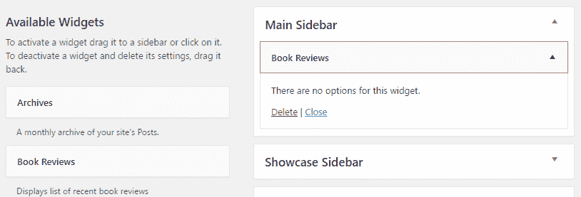
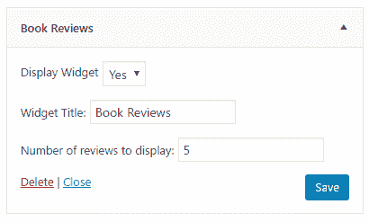
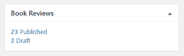
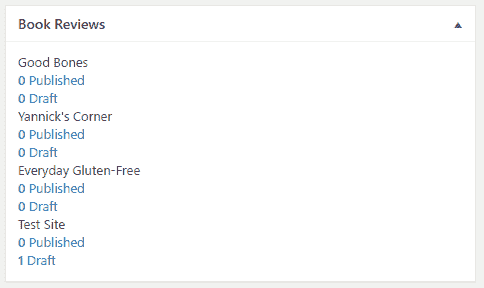

# 将新小部件添加到 WordPress 库

在本章中，您将通过以下主题了解如何创建自己的小部件：

+   在 WordPress 中创建新小部件

+   显示配置选项

+   验证配置选项

+   实现小部件显示函数

+   添加自定义仪表板小部件

+   将自定义小部件添加到网络仪表板

# 简介

小部件自 WordPress 平台早期以来就存在。它们允许用户轻松地将由 WordPress 本身（帖子或页面数据）或已安装的任何插件（例如，错误跟踪系统信息）提供的内容块填充到他们的网站主题的侧边栏或其他区域。查看 WordPress 安装，默认的小部件集包括存档小部件，它列出月度帖子存档，以及最近评论小部件，它提供了一个简单的方式来显示存储在您的 WordPress 网站上的访客评论。

遵循其开放设计，WordPress 提供了允许插件开发者创建新小部件的函数，用户可以将这些小部件添加到他们的页面设计中。本章展示了如何使用小部件类创建自定义小部件。它还涵盖了第二种类型的小部件，仪表板小部件，可以用于在管理区域的前页上显示插件特定的信息。

# 在 WordPress 中创建新小部件

创建自定义小部件的第一步是定义其名称，并指出哪个类包含所有实现函数。一旦新元素在系统中注册，它将立即出现在小部件列表中，用户可以将其拖放到侧边栏。

此配方定义了一个新小部件，用于显示来自第四章，“自定义帖子类型的威力”中创建的自定义帖子类型分类的最新书评。

# 准备工作

您应该已经遵循了第四章，“自定义帖子类型的威力”中的*使用插件过滤器更新页面标题以包含自定义帖子数据*配方，以便为本配方提供一个起点。或者，您可以从代码包中获取结果代码（`Chapter 4/ch4-book-reviews/ch4-book-reviews-v11.php`）并激活`第四章 - 书评`插件。

# 如何操作...

1.  导航到您的开发安装的 WordPress 插件目录。

1.  创建一个名为`ch10-book-review-widget`的新目录。

1.  导航到目录并创建一个名为`ch10-book-review-widget.php`的文本文件。

1.  在代码编辑器中打开新文件，并在插件文件顶部添加一个适当的标题，命名为“第十章 - 书评小部件”。

1.  添加以下代码行以注册一个在初始化小部件时被调用的函数：

```php
add_action( 'widgets_init', 'ch10brw_create_widgets' ); 
```

1.  添加以下代码段以提供`ch10brw_create_widgets`函数的实现：

```php
function ch10brw_create_widgets() { 
    register_widget( 'Book_Reviews' ); 
} 
```

1.  插入以下代码块以声明`Book_Reviews`类及其构造函数：

```php
class Book_Reviews extends WP_Widget { 
    // Construction function 
    function __construct () { 
        parent::__construct( 'book_reviews', 'Book Reviews',
            array( 'description' =>                                     
                   'Displays list of recent book reviews' ) ); 
    } 
} 
```

1.  保存并关闭插件文件。

1.  导航到插件管理页面并激活`第十章 - 图书评论小工具`插件。

1.  访问外观管理页面的小工具部分，以查看新创建的图书评论小工具作为可用小工具列表的一部分出现。

1.  将新小工具拖放到右侧列出的可用侧边栏之一以创建小工具实例，并查看当前小工具没有可配置的选项：



# 它是如何工作的...

`widgets_init`动作钩子用于注册一个在 WordPress 创建小工具时要执行的功能。当回调发生时，我们通过调用简单的`register_widget`函数创建一个新的小工具。如菜谱所示，此函数需要一个参数，表示包含小工具定义的类的名称。

菜谱的其余部分声明了小工具实现类，该类扩展了 WordPress 的`WP_Widget`类。虽然该类有许多潜在的成员方法，但本菜谱仅定义了类构造函数，该构造函数通过指定一个唯一标识符、一个标题以及嵌入在可选参数数组中的描述来初始化对象实例。与插件中声明的任何其他函数一样，为小工具类和小工具标识符提供唯一名称以避免与其他插件冲突是很重要的。

当插件激活时，用户可以立即看到新小工具，并且能够将新元素的一个或多个实例作为侧边栏内容的一部分添加。然而，直到本章稍后的菜谱中实现了其`widget`方法，新小工具在网站页面上除了错误消息之外不会渲染任何内容。

# 更多内容...

如您所注意到的，这个菜谱创建了一个与在第四章中创建的主要图书评论插件分开的插件文件和目录，*自定义文章类型的威力*。

# 扩展其他插件的插件

虽然我们可以将小工具创建代码放在与图书评论插件相同的文件中，但将其放在单独的文件中同样有效。实际上，官方[wordpress.org](http://wordpress.org)仓库中的一些插件确实使用这种技术将它们的功能分解成更易管理的代码段。使用这种技术时，需要注意确保在回调函数中引用它们之前，所有次要插件所依赖的元素都已加载。

在这种情况下，由于小工具是在 WordPress 初始化过程的后期创建的，因此小工具将需要的自定义文章类型将可用。

# 参见

+   第四章，*自定义文章类型的威力*中的*使用插件过滤器更新页面标题以包含自定义文章数据*菜谱

# 显示配置选项

与插件配置页面类似，小部件可以有一个或多个选项，允许用户指定组件的一些方面应该如何表现。这些选项可以为添加到网站布局的每个小部件实例单独配置。为了处理所有关于多个可能的小部件实例的物流，WordPress 实际上负责大多数数据处理和存储任务。

本食谱展示了如何向书评小部件类添加新方法以显示配置选项。

# 准备工作

您应该已经遵循了*在 WordPress 中创建新小部件*的食谱，以便为本食谱提供一个起点。或者，您可以从代码包中获取结果代码（`第十章/ch10-book-review-widget/ch10-book-review-widget-v1.php`），并将文件重命名为`ch10-book-review-widget.php`。

# 如何操作...

1.  导航到您的开发安装的 WordPress 插件目录。

1.  导航到`ch10-book-review-widget`目录并编辑`ch10-book-review-widget.php`。

1.  在`Book_Reviews`类中找到并添加以下代码块以定义`form`方法：

```php
function form( $instance ) { 
    // Retrieve previous values from instance 
    // or set default values if not present 
    $render_widget = ( !empty( $instance['render_widget'] ) ? 
                       $instance['render_widget'] : 'true' ); 

    $nb_book_reviews = ( !empty( $instance['nb_book_reviews'] ) ? 
                         $instance['nb_book_reviews'] : 5 ); 

    $widget_title = ( !empty( $instance['widget_title'] ) ?  
                      esc_attr( $instance['widget_title'] ) : 
                      'Book Reviews' );            
    ?>

    <!-- Display fields to specify title and item count --> 
    <p> 
        <label for="<?php echo  
                    $this->get_field_id( 'render_widget' ); ?>"> 
        <?php echo 'Display Widget'; ?>             
        <select id="<?php echo 
                     $this->get_field_id( 'render_widget' ); ?>"
                name="<?php echo 
                $this->get_field_name( 'render_widget' ); ?>"> 
            <option value="true" 
                <?php selected( $render_widget, 'true' ); ?>> 
            Yes</option> 
            <option value="false" 
                <?php selected( $render_widget, 'false' ); ?>> 
            No</option> 
        </select>                     
        </label> 
    </p> 
    <p> 
        <label for="<?php echo  
                    $this->get_field_id( 'widget_title' ); ?>"> 
        <?php echo 'Widget Title:'; ?>             
        <input type="text"  
               id="<?php echo 
                    $this->get_field_id( 'widget_title' );?>"
               name="<?php
               echo $this->get_field_name( 'widget_title' ); ?>" 
               value="<?php echo $widget_title; ?>" />             
        </label> 
    </p>  
    <p> 
        <label for="<?php echo  
                    $this->get_field_id( 'nb_book_reviews' ); ?>"> 
        <?php echo 'Number of reviews to display:'; ?>             
        <input type="text"  
               id="<?php echo 
                   $this->get_field_id( 'nb_book_reviews' ); ?>"
               name="<?php echo 
               $this->get_field_name( 'nb_book_reviews' ); ?>" 
               value="<?php echo $nb_book_reviews; ?>" />             
        </label> 
    </p> 
<?php } 
```

1.  保存并关闭插件文件。

1.  刷新外观 | 小部件管理页面，并展开书评小部件实例以查看新创建的选项。

1.  修改小部件选项并点击保存以更新其配置：



# 它是如何工作的...

当用户创建一个新的小部件实例时，WordPress 会自动管理该元素的配置选项，使用一个数组变量。如果存在，它还会调用小部件类的`form`方法，以在配置面板中渲染小部件实例的选项。

`form`方法中的前几行代码验证`instance`数组是否包含适当的值，指定小部件是否应该显示，要显示的书籍评论数量，以及小部件开始时应显示的标题。如果这些选项中的任何一个缺失，我们使用 PHP 三元条件运算符（`?:`）为`render_widget`、`nb_book_reviews`和`widget_title`函数分配默认值。此运算符期望三个表达式，顺序如下：（expr1）?（expr2）:（expr3）。如果`expr1`为真，则返回`expr2`；如果为假，则返回`expr3`。

在这些变量就绪后，`form`方法的其余代码使用 HTML 和 PHP 代码的混合来渲染在小部件编辑器中显示的配置字段。在整个代码中看到的`get_field_id`和`get_field_name`方法用于生成唯一的标识符，这将帮助 WordPress 为所有小部件实例分别存储数据。

如本菜谱所示，部件类能够自动处理和保存部件配置参数。然而，需要注意的是，允许 WordPress 自行处理此任务意味着不会对输入的数据进行验证。如果用户输入文本而不是要显示的评论数量，这可能会导致问题。下一个菜谱将展示如何处理数据验证。

# 另请参阅

+   *在 WordPress 中创建新部件*菜谱

# 验证配置选项

在前一个菜谱中放置的部件配置面板是功能性的，允许用户更改选项并在网站数据库中保存更新后的值。话虽如此，WordPress 默认情况下在用户保存部件时所做的只是直接将值存储到网站数据库中。由于盲目接受用户数据可能会导致功能问题和安全风险，如果输入了错误或恶意值，因此最好通过创建一个能够验证配置数据在保存之前的`update`方法来添加数据验证规则。本菜谱展示了如何实现部件的`update`方法。

# 准备工作

您应该已经遵循了*显示配置选项*菜谱，以便为本菜谱提供一个起点。或者，您可以从代码包中获取结果代码（`第十章/ch10-book-review-widget/ch10-book-review-widget-v2.php`）并将文件重命名为`ch10-book-review-widget.php`。

# 如何操作...

1.  导航到您的开发安装的 WordPress 插件目录。

1.  导航到`ch10-book-review-widget`目录并编辑`ch10-book-review-widget.php`。

1.  找到`Book_Reviews`类，并在类内添加以下代码块以定义`update`方法：

```php
function update( $new_instance, $instance ) { 
    // Only allow numeric values 
    if ( is_numeric ( $new_instance['nb_book_reviews'] ) ) {
        $instance['nb_book_reviews'] =
            intval( $new_instance['nb_book_reviews'] );
    } else {
        $instance['nb_book_reviews'] =
            $instance['nb_book_reviews'];
    }

    $instance['widget_title'] =
        sanitize_text_field( $new_instance['widget_title'] ); 

    $instance['render_widget'] = 
        sanitize_text_field( $new_instance['render_widget'] );      

    return $instance; 
}    
```

1.  保存并关闭插件文件。

1.  访问外观管理页面的部件部分并展开书评部件实例。

1.  在要显示的评论数量字段中输入文本值并保存部件。您会看到该字段的值会恢复为该字段保存的最后一个有效数字。

# 它是如何工作的...

`update`方法接收两个数据数组，并必须返回一个数组以保存到网站数据库中。这两个传入的数组分别包含用户输入的新选项值和部件之前存储的值。

要从已知值开始，方法实现首先将旧值复制到一个名为`$instance`的新变量中。然后通过调用`sanitize_text_field`函数来初始化，该函数从文本字段中移除可能有害的 HTML 或 PHP 标签，并将返回值保存到`$instance`数组中。它还在进入时调用 PHP 的`is_numeric`和`intval`函数，以指示要显示的评论数量，确保它是一个数值。如果输入的不是数字，则将保存并显示之前的字段值给用户。不幸的是，当执行此类小部件选项验证时，无法显示错误消息。

# 相关阅读

+   *显示配置选项*配方

# 实现小部件显示函数

对于我们迄今为止所做的所有小部件创建工作，我们的新创建在网站上还没有显示任何内容。当显示包含小部件的区域时，WordPress 会尝试为每个用户选择的每个小部件调用名为`widget`的方法，以便将所需的内容输出到浏览器。

这个配方展示了如何在侧边栏中实例化小部件时，如何实现一个`widget`方法来显示最近的书评列表。

# 准备工作

您应该已经遵循了*验证配置选项*配方，以便为本配方提供一个起点。或者，您可以从代码包中获取结果代码（`第十章/ch10-book-review-widget/ch10-book-review-widget-v3.php`），并将文件重命名为`ch10-book-review-widget.php`。

# 如何做...

1.  导航到您的开发安装的 WordPress 插件目录。

1.  导航到`ch10-book-review-widget`目录并编辑`ch10-book-review-widget.php`。

1.  在类`Book_Reviews`中找到并添加以下代码块以定义`widget`方法：

```php
function widget( $args, $instance ) { 
    if ( 'true' == $instance['render_widget'] ) { 
        // Extract members of args array as individual variables 
        extract( $args );

        // Retrieve widget configuration options 
        $nb_book_reviews = 
             ( !empty( $instance['nb_book_reviews'] ) ? 
                       $instance['nb_book_reviews'] : 5 ); 

        $widget_title = ( !empty( $instance['widget_title'] ) ?  
                          esc_attr( $instance['widget_title'] ) : 
                          'Book Reviews' ); 

        // Preparation of query string to retrieve book reviews 
        $query_array = array( 'post_type' => 'book_reviews', 
                              'post_status' => 'publish', 
                              'posts_per_page' => 
                                  $nb_book_reviews ); 

        // Execution of post query 
        $book_review_query = new WP_Query(); 
        $book_review_query->query( $query_array );  

        // Display widget title 
        echo $before_widget . $before_title; 
        echo apply_filters( 'widget_title', $widget_title ); 
        echo $after_title;  

        // Check if any posts were returned by query 
        if ( $book_review_query->have_posts() ) {             
            // Display posts in unordered list layout 
            echo '<ul>'; 

            // Cycle through all items retrieved 
            while ( $book_review_query->have_posts() ) { 
                $book_review_query->the_post(); 
                echo '<li><a href="' . get_permalink() . '">'; 
                echo get_the_title( get_the_ID() ) . '</a></li>'; 
            } 
            echo '</ul>';  
        } 
        wp_reset_query(); 
        echo $after_widget; 
    } 
} 
```

1.  保存并关闭插件文件。

1.  访问网站的前页以查看新添加的小部件内容在侧边栏中显示：


# 它是如何工作的...

与我们在早期章节中看到的动作钩子类似，`widget`方法旨在直接输出 HTML 代码到浏览器，当在侧边栏中创建新小部件的实例时，这些代码将在浏览器中显示。

`widget`方法首先检查小部件是否应该显示。如果应该显示，它将继续通过在接收到的第一个参数上调用标准的 PHP `extract`函数，即名为`$args`的数组，来继续操作。调用此函数解析数组并为每个找到的元素创建变量，这使得后续代码更容易访问应该放置在标题和小部件内容之前和之后的元素。

在这个初始声明之后，配方继续通过从`$instance`数组中检索要显示的项目数量和小工具标题，该数组作为第二个方法参数使用与实现`form`方法时相同的技巧接收，来继续。

其余的代码与在*第四章*，*自定义帖子类型的威力*（在短代码中显示自定义帖子类型数据）中创建的书评短代码非常相似，在那里我们组装一个查询字符串，指示从数据库中检索的数据类型和最大数量。通过创建 WordPress `WP_Query`对象的新实例来执行生成的查询。如果找到结果，以下配方代码将遍历所有条目并输出代码以渲染找到的所有项目的无序列表。最后，但同样重要的是，配方通过输出`$before_widget`、`$after_widget`、`$before_title`和`$after_title`小工具类变量以及用户指定的正确位置的小工具标题来格式化小工具内容。

# 相关内容

+   *在 WordPress 中创建新小工具的配方*

# 添加自定义仪表板小工具

虽然小工具主要用于网站管理员轻松地将内容添加到他们的前端网站，但 WordPress 还包含另一种插件开发者可以使用以增强用户体验的小工具。仪表板插件是出现在网站管理区域首页的板块。这些板块可以提供任何类型的功能，从简单显示存储在插件中的数据量到允许网站管理员快速执行配置任务表单。

本配方展示了如何添加一个新仪表板小工具，该小工具指示系统中存储了多少书评，并提供快速访问它们的链接。

# 准备工作

你应该已经遵循了来自第四章，*自定义帖子类型的威力*中的*使用插件过滤器更新页面标题以包含自定义帖子数据*配方，以便为本配方提供一个起点。或者，你可以从代码包中获取结果代码（`第四章/ch4-book-reviews/ch4-book-reviews-v11.php`），并激活`第四章 - 书评`插件。

# 如何操作...

1.  导航到你的开发安装的 WordPress 插件目录。

1.  创建一个名为`ch10-book-review-dashboard-widget`的新目录。

1.  导航到该目录，创建一个名为`ch10-book-review-dashboard-widget.php`的文本文件。

1.  在代码编辑器中打开新文件，并在插件文件顶部添加一个适当的标题，将插件命名为`第十章 - 书评仪表板小工具`。

1.  添加以下代码行以注册在准备仪表板内容时调用的函数：

```php
add_action( 'wp_dashboard_setup', 
            'ch10brdw_add_dashboard_widget' ); 
```

1.  添加以下代码段以提供`ch10brdw_add_dashboard_widget`函数的实现：

```php
function ch10brdw_add_dashboard_widget() { 
    wp_add_dashboard_widget( 'book_reviews_dashboard_widget', 
                             'Book Reviews', 
                             'ch10brdw_dashboard_widget' ); 
} 
```

1.  插入以下代码块以实现之前步骤中声明的`ch10brdw_dashboard_widget`函数：

```php
function ch10brdw_dashboard_widget() {  
    $book_review_count = wp_count_posts( 'book_reviews' ); 
    if ( !empty( (array) $book_review_count ) ) {
    ?> 
    <a href="<?php echo add_query_arg( array(  
                                  'post_status' => 'publish', 
                                  'post_type' => 'book_reviews' ), 
                                  admin_url( 'edit.php' ) ); ?>"> 
    <strong> 
          <?php echo $book_review_count->publish; ?> 
    </strong> Published 
    </a> 
    <br /> 
    <a href="<?php echo add_query_arg( array(  
                                  'post_status' => 'draft', 
                                  'post_type' => 'book_reviews' ),  
                                  admin_url( 'edit.php' ) ); ?>"> 
    <strong> 
        <?php echo $book_review_count->draft; ?> 
    </strong> Draft 
    </a> 
<?php }
}
```

1.  保存并关闭插件文件。

1.  导航到插件管理页面并激活`第十章 - 书评仪表板小部件`插件。

1.  导航到网站的仪表板，查看页面底部的新的书评小部件，如下一个屏幕截图所示：



# 它是如何工作的...

任何插件都可以在 WordPress 组合此管理登录页面内容时注册自己的仪表板小部件。在注册一个在仪表板设置阶段被调用的函数后，我们的配方会调用`wp_add_dashboard_widget`函数，在回调执行时将我们的元素添加到网站上。`wp_add_dashboard_widget`函数需要三个参数，这些参数需要为新项目提供一个唯一的标识符，一个要在小部件顶部显示的标题，以及一个将负责生成小部件内容的函数。`wp_add_dashboard_widget`函数还有一个可选的第四个参数，可以在小部件需要作为仪表板小部件内容的一部分处理表单数据时使用。

如前一个屏幕截图所示，仪表板小部件是通过 WordPress 元框显示的，其中内容显示函数直接回显的任何 HTML 代码都直接出现在框中。

虽然显示函数主要由 HTML 代码组成，但我们还调用了`wp_count_posts`实用函数，该函数可以轻松返回给定文章类型的帖子数量。

新小部件可以被隐藏并移动到仪表板上的新位置，就像任何其他内置小部件一样。就像本章早期创建的前端小部件插件一样，需要注意的是，此插件中的所有代码都位于一个单独的文件中，与在第四章，*自定义文章类型的威力*中创建的原始书评插件文件分开，以将代码单独组织在原始插件文件之外。

# 参见

+   在第四章，*自定义文章类型的威力*中，查看*使用插件过滤器更新页面标题以包含自定义文章数据*的配方。

# 向网络仪表板添加自定义小部件

如同在标题为*创建网络级别管理页面*的菜谱中讨论的那样，该菜谱位于*第三章*，*用户设置和管理页面*，WordPress 提供了一个非常强大的模式，称为网络模式，它允许从单个平台安装中为多个网站提供服务。当创建插件时，开发者需要考虑他们的插件是否应该提供一个仪表板小部件，该小部件仅在网络管理员的仪表板中可见，而不是在单个网站仪表板中可见，或者他们的插件的范围是否真的更相关于每个网站的级别。以下菜谱展示了如何修改之前定义的仪表板小部件，以便在网络安装上出现在网络管理面板中，同时在单个站点安装的行政仪表板中仍然可见。

# 准备工作

您应该已经遵循了*添加自定义仪表板小部件*菜谱，以便为本菜谱提供一个起点。或者，您可以从代码包中获取结果代码（`Chapter 10/ch10-book-review-dashboard-widget/ch10-book-review-dashboard-widget-v1.php`），并将文件重命名为`ch10-book-review-dashboard-widget.php`。您还应该能够访问一个配置为网络的网络站点，以测试此插件的所有功能。

# 如何操作...

1.  导航到您的开发安装的 WordPress 插件目录。

1.  创建一个名为`ch10-book-review-dashboard-widget`的新目录，并编辑`ch10-book-review-dashboard-widget.php`。

1.  定位到最初在插件顶部添加的`add_action`调用，并在现有函数调用周围添加以下突出显示的代码行：

```php
if ( is_multisite() ) {
 add_action( 'wp_network_dashboard_setup',
                'ch10brdw_add_dashboard_widget' );
} else {
    add_action( 'wp_dashboard_setup', 
                'ch10brdw_add_dashboard_widget' );
}
```

1.  定位到`ch10brdw_dashboard_widget`函数，并在函数的现有实现周围添加以下代码。新的代码行以粗体显示：

```php
function ch10brdw_dashboard_widget() { 
    if ( is_multisite() ) {
 $sites_list = get_sites();
 } else {
 $sites_list = array( 'blog_id' => 1 );
 }

 foreach( $sites_list as $site ) {
 if ( is_multisite() ) {
 switch_to_blog( $site->blog_id );
 }
 $site_name = get_bloginfo( 'name' );
 echo '<div>' . $site_name . '</div>';  
        $book_review_count = wp_count_posts( 'book_reviews' ); 
        ?> 
        // REST OF PREVIOUS CODE GOES HERE
        <?php }
    }
 if ( is_multisite() ) {
 restore_current_blog();
 }
} 
```

1.  保存并关闭插件文件。

1.  导航到网站仪表板（在单个站点安装上）或网络级别仪表板（在网络安装上），以查看之前相同的仪表板或分别查看网络级别仪表板：



# 它是如何工作的...

在这个菜谱中进行的初始更改是检查插件是否运行在单个站点的 WordPress 安装或网络安装上，并根据结果将回调函数与适当的行为钩子关联。正如您所看到的，我们在两种情况下都使用了相同的回调函数，因为无论在哪种情况下，小部件注册函数都应该调用`wp_add_dashboard_widget`来注册一个与系统相关联的小部件。

小工具渲染函数在两种模式下也是共享的。在网络安装上运行时，渲染代码首先通过`get_sites`函数获取所有站点的列表，然后遍历站点列表，并使用`switch_to_blog`函数访问每个站点的数据库表中的数据。一旦处理完所有博客，我们使用`restore_current_blog`函数回到配置为网络顶级站点的原始站点。

恢复当前博客非常重要，以避免留下一些内部变量指向错误的站点。

当在单个站点的 WordPress 安装上运行时，我们创建一个包含单个条目的虚拟站点列表，以便我们能够使用相同的`foreach`循环控制结构。然后，当 WordPress 未配置为多站点模式时，我们避免调用与网络站点操作相关的函数。否则，查询有多少书评存在并显示它们的实际代码在两个版本的插件中是相同的。

# 参见

+   *添加自定义仪表板小工具* 菜谱
