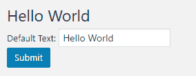
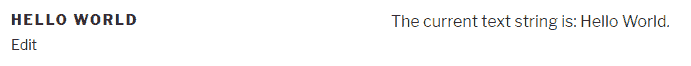
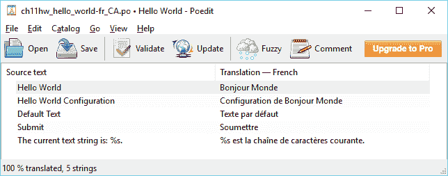
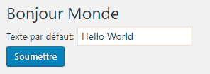

# 启用插件国际化

在本章中，您将通过以下主题了解插件本地化：

+   修改 WordPress 语言配置

+   适配默认用户设置以进行翻译

+   使管理页面代码准备好翻译

+   修改短代码输出以进行翻译

+   使用 Poedit 翻译文本字符串

+   在插件初始化中加载语言文件

# 简介

WordPress 是一个全球现象，用户遍布全球。为了为不同地区的用户提供更具体的使用体验，WordPress 提供了翻译所有面向用户和访客内容的能力，从而使得众多本地化版本可供在线下载。像平台上的大多数其他功能一样，国际化也通过一系列易于使用的函数提供给插件开发者——主要区别在于，插件翻译通常包含在扩展中，而不是像 WordPress 那样单独下载。

为了使他们的插件能够本地化，开发者在处理文本元素时必须使用特殊的国际化函数。一旦这种结构建立，任何用户都可以为自己所知的语言创建本地化版本，并将它们提交给插件作者，以便在未来的扩展更新中包含在内。WordPress.org 还提供了一个在线界面，让用户能够在不使用离线工具的情况下贡献翻译。

本章解释了如何准备插件以进行翻译，并展示了如何使用 Poedit 工具为简单插件创建新的语言文件。

# 修改 WordPress 语言配置

翻译插件的第一步是将 WordPress 配置为非英语的语言设置。这将自动触发平台中的机制，以寻找任何国际化字符串的替代语言内容。

在这个菜谱中，我们将设置网站为法语。

# 准备工作

您应该能够访问 WordPress 开发环境。

# 如何操作...

1.  打开您的网站仪表板，并导航到设置菜单的常规部分。

1.  将网站语言设置为加拿大法语并点击保存更改。

# 它是如何工作的...

WordPress 的“站点语言”配置选项允许您选择访客访问您的网站时将看到的语言。如语言下拉列表所示，WordPress 默认安装了单一语言，显示在列表顶部。列表的其余部分表示可以添加到您网站的语言。当您设置新语言时，将自动下载所选语言的翻译文件，并且新选择成为访客的默认语言。如果您查看 WordPress 安装的`wp-content/languages`目录，您将看到为所选语言下载了多个具有`.po`和`.mo`扩展名的文件。便携对象（`.po`）文件是包含 WordPress 源代码中所有原始英文文本的 ASCII 文本文件，而机器对象（`.mo`）文件是编译成二进制版本的翻译表，以便在网站渲染时由 PHP 高效加载。

如果在仪表板的“常规”部分没有提供要自动安装的语言列表，请访问[`codex.wordpress.org/Installing_WordPress_in_Your_Language`](https://codex.wordpress.org/Installing_WordPress_in_Your_Language)了解如何手动下载和安装 WordPress 的翻译文件。

# 适配默认用户设置以进行翻译

在我们能够为我们的插件创建翻译文件之前，它们的代码需要特别编写，以便允许文本项进行翻译。这项工作从插件的激活例程开始，在那里设置默认插件选项值，以便在网站配置文件中指定了除英语以外的语言时找到替代值。

这个配方展示了如何在初始化时将翻译字符串分配给插件默认选项数组。

# 准备工作

您应该已经遵循了“更改 WordPress 语言配置”配方，以便为网站指定翻译语言。

# 如何做到这一点...

1.  导航到您的开发安装的 WordPress 插件目录。

1.  创建一个名为`ch11-hello-world`的新目录。

1.  导航到该目录并创建一个名为`ch11-hello-world.php`的文本文件。

1.  在代码编辑器中打开新文件，并在插件文件顶部添加一个适当的标题，命名为“第十一章 - Hello World”。

1.  添加以下代码行以注册在插件激活时调用的函数：

```php
register_activation_hook( __FILE__, 
                         'ch11hw_set_default_options_array' ); 
```

1.  插入以下代码块以提供`ch11hw_set_default_options_array`函数的实现：

```php
function ch11hw_set_default_options_array() { 
    if ( false === get_option( 'ch11hw_options' ) ) { 
        $new_options = array(); 
        $new_options['default_text'] = __( 'Hello World',
                                           'ch11hw_hello_world' ); 
        add_option( 'ch11hw_options', $new_options ); 
    }  
} 
```

1.  保存并关闭插件文件。

1.  导航到扩展（法语中的插件）管理页面，并点击`Chapter 11 - Hello World`插件的“激活”（法语中的“激活”）链接。

1.  使用 phpMyAdmin，找到`options`表条目，其中`option_name`字段的值为`ch11hw_options`以查看新创建的选项：


# 它是如何工作的...

`__`函数（即两个下划线）是一个 WordPress 实用函数，它试图在其第二个参数指定的文本域中找到其第一个参数接收到的文本的翻译。文本域基本上是由 WordPress 管理的全局翻译表的一个子部分。在这个例子中，要翻译的文本是字符串`Hello World`，系统试图在该`ch11hw_hello_world`域中找到其翻译。由于该域目前不可用，该函数返回其第一个参数接收到的原始字符串。插件代码将该值分配给默认配置数组。

应当注意，`__`函数实际上是对`translate`函数的一个别名。虽然这两个函数具有相同的功能，但当代码中包含大量需要翻译的文本元素时，使用`__`可以使代码更短。

虽然开发者可能会倾向于在`__`函数的第一个参数中使用变量或常量来显示相同的文本多次，但这不应该这样做，因为这会导致翻译查找机制出现问题。

# 参见

+   *更改 WordPress 语言配置*配方

# 准备管理页面代码以供翻译

虽然前面的配方展示了如何在插件代码中查找文本项的翻译并返回其值以供进一步处理，但在许多情况下，立即显示翻译内容更为实用。

这个配方展示了如何翻译简单管理页面的内容以供立即显示。

# 准备工作

您应该已经遵循了*调整默认用户设置以进行翻译*配方，以便为本配方提供一个起点。或者，您可以从代码包中获取该配方的结果代码（`第十一章/ch11-hello-world/ch11-hello-world-v1.php`）。在开始之前，您应该将文件重命名为`ch11-hello-world.php`。

# 如何做到...

1.  导航到您开发安装中 WordPress 插件目录的`ch11-hello-world`文件夹。

1.  在文本编辑器中打开`ch11-hello-world.php`文件。

1.  在文件末尾添加以下行代码以注册一个在 WordPress 构建管理页面菜单时被调用的函数：

```php
add_action( 'admin_menu', 'ch11hw_settings_menu' ); 
```

1.  添加以下代码部分以提供`ch11hw_settings_menu`函数的实现：

```php
function ch11hw_settings_menu() { 
    add_options_page( 
        __( 'Hello World Configuration', 'ch11hw_hello_world' ), 
        __( 'Hello World', 'ch11hw_hello_world' ), 
       'manage_options', 
       'ch11hw-hello-world', 'ch11hw_config_page' ); 
} 
```

1.  插入以下代码块以创建在`add_options_page`调用中声明的`ch11hw_config_page`函数：

```php
function ch11hw_config_page() { 
    $options = get_option( 'ch11hw_options' ); 
    ?> 

    <div id="ch11hw-general" class="wrap"> 
    <!-- Echo translation for "Hello World" to the browser --> 
    <h2><?php _e( 'Hello World', 'ch11hw_hello_world' ); ?></h2> 

    <form method="post" action="admin-post.php"> 
    <input type="hidden" name="action" 
           value="save_ch11hw_options" /> 
    <?php wp_nonce_field( 'ch11hw' ); ?> 

    <!-- Echo translation for "Hello World" to the browser --> 
    <?php _e( 'Default Text', 'ch11hw_hello_world' ); ?>: 
    <input type="text" name="default_text" 
           value="<?php echo 
                   esc_html( $options['default_text'] ); ?>"/> 
    <br /> 
    <input type="submit" value="<?php _e( 'Submit', 
        'ch11hw_hello_world' ); ?>" class="button-primary"/> 
    </form> 
    </div> 
<?php } 
```

1.  添加以下行代码以注册一个在准备显示管理面板时执行的函数：

```php
add_action( 'admin_init', 'ch11hw_admin_init' ); 
```

1.  将以下代码段附加到提供`ch11hw_admin_init`函数实现的代码：

```php
function ch11hw_admin_init() { 
     add_action( 'admin_post_save_ch11hw_options',
                 'process_ch11hw_options' ); 
} 
```

1.  提供在上一步骤中声明的`process_ch11hw_options`函数的代码，通过插入以下代码：

```php
function process_ch11hw_options() { 
    if ( !current_user_can( 'manage_options' ) ) {
          wp_die( 'Not allowed' );
    }

    check_admin_referer( 'ch11hw' );

    $options = get_option( 'ch11hw_options' );     
    $options['default_text'] = $_POST['default_text']; 

    update_option( 'ch11hw_options', $options ); 
    wp_redirect( add_query_arg( 'page', 'ch11hw-hello-world', 
                     admin_url( 'options-general.php' ) ) );
    exit; 
} 
```

1.  保存并关闭插件文件。

1.  导航到您开发 WordPress 安装的管理页面。

1.  点击左侧导航菜单中的“设置”（法语中的“Reglages”）部分以展开它。您将在树中看到一个名为“Hello World”的新菜单项。选择新条目将显示插件简单的配置表单，如下面的截图所示：



# 它是如何工作的...

本食谱使用了之前食谱中提到的`__`函数，以及`_e`函数。第二个函数的目的是与`__`类似，但它会立即将翻译查找的结果输出到浏览器。它应该用于所有之前只是简单文本的 HTML 代码中的文本元素。当然，调用此函数需要标准打开和关闭 PHP 标签（`<?`和`?>`）在周围的 HTML 中执行。

本插件代码的其余部分负责将用户更新存储在网站数据库中，如之前在第三章，*用户设置和管理页面*中所述。

# 参见

+   *为翻译调整默认用户设置*的食谱

# 修改短代码输出以进行翻译

正如我们在众多食谱中看到的，短代码是强大的工具，为用户提供了一种简单的方法，将内容添加到他们的网站帖子中。由于这些内容是展示给用户的，因此它们可以从翻译中受益，就像网站的管理页面一样。

这个食谱展示了如何在显示之前翻译短代码输出。它还解释了如何处理在不同语言中可以放置在不同位置的可变数据元素。

# 准备工作

您应该已经遵循了*制作管理页面代码准备翻译*的食谱，以便为本食谱提供一个起点。或者，您可以从代码包中获取该食谱的结果代码（`第十一章/ch11-hello-world/ch11-hello-world-v2.php`）。在开始之前，您应该将文件重命名为`ch11-hello-world.php`。

# 如何操作...

1.  导航到您开发安装的 WordPress 插件目录中的`ch11-hello-world`文件夹。

1.  在文本编辑器中打开`ch11-hello-world.php`文件。

1.  在文件末尾添加以下代码行以声明一个新短代码，该短代码将可供内容作者使用：

```php
add_shortcode( 'hello-world', 'ch11hw_hello_world_shortcode' ); 
```

1.  添加以下代码部分以提供`ch11hw_hello_world_shortcode`函数的实现：

```php
function ch11hw_hello_world_shortcode() { 
    $options = get_option( 'ch11hw_options' ); 

    $output = sprintf( __( 'The current text string is: %s.', 
                           'ch11hw_hello_world' ),
                           $options['default_text'] ); 
    return $output; 
} 
```

1.  保存并关闭插件文件。

1.  创建一个新页面（使用页面菜单的“添加项目”），在内容中插入新的短代码`[hello-world]`，然后发布页面（发布）。

1.  查看页面（查看页面）以查看短代码的输出：



# 它是如何工作的...

本菜谱展示的内容比前两个菜谱稍微复杂一些，因为我们希望短代码输出是静态文本与动态元素的组合，并且我们希望该元素根据目标语言的语法结构出现在不同的位置。实现此功能的方法是将`__`国际化函数与`sprintf`标准 PHP 函数相结合。

`sprintf`函数的目的是在字符串中插入一个变量。它通过在第一个参数中发送的目标字符串中查找占位符来完成此任务，并用它收到的第二个参数中的变量替换它。一些占位符的例子是`%s`用于字符串和`%d`用于整数。考虑到这种功能，我们使用占位符作为要翻译的字符串的一部分，以便创建本地化文件的用户可以选择值在句子结构中的位置。一旦通过`__`函数获得翻译，我们就可以立即将替代语言字符串发送到`sprintf`以创建最终文本。

# 参见

+   *调整默认用户设置以进行翻译* 菜单

# 使用 Poedit 翻译文本字符串

在插入所有必要的代码以查找文本元素的翻译后，我们需要创建实际的翻译文件。虽然有多种工具可用于执行此任务，但我们将集中精力在最受欢迎的一个上，即免费的跨平台 Poedit。

本菜谱展示了如何使用 Poedit 从插件代码中提取所有要翻译的字符串，翻译它们，并将生成的语言文件保存到插件目录下。

# 准备工作

您应该已经遵循了*修改短代码输出以进行翻译*菜谱，以便为本菜谱提供一个起点。或者，您可以从代码包中获取该菜谱的结果代码（`Chapter 11/ch11-hello-world/ch11-hello-world-v3.php`）。在开始之前，您应该将文件重命名为`ch11-hello-world.php`。

# 如何操作...

1.  导航到您开发安装的 WordPress 插件目录中的`ch11-hello-world`文件夹。

1.  创建一个名为`languages`的新子目录。

1.  导航到 Poedit 下载页面，下载适合您计算机的相应版本的工具（[`www.poedit.net/download`](https://www.poedit.net/download)）。

1.  安装并启动 Poedit 应用程序。

1.  在应用程序的文件菜单下选择“新建”菜单项。

虽然 Poedit 提供了一种自动创建 WordPress 主题或插件翻译的方法，但我们将专注于 Poedit 的免费版本，并突出创建翻译所需的所有步骤。

1.  选择翻译的语言为法语（加拿大）。

1.  点击工具栏中的“保存”按钮，导航到本菜谱中先前创建的`languages`文件夹，并将文件名设置为`ch11hw_hello_world-fr_CA.po`。

1.  在主界面窗口中点击“从源提取”按钮，打开目录属性窗口，它将默认显示为源路径选项卡。

如果 Poedit 窗口太小，它将不会显示主界面部分。只需将窗口放大，即可看到从源提取按钮。

1.  通过点击“新建项目”按钮在路径列表中创建一个新的条目。

1.  将新路径条目的值设置为 `..`（两个点字符）。

1.  切换到源关键词选项卡，并在附加关键词列表中添加两个新项目，并将它们的值设置为 `__` 和 `_e`。

1.  切换到翻译属性选项卡，并将项目名称和版本字段设置为 `Hello World`。

1.  点击“确定”按钮关闭目录属性对话框，然后从工具栏点击“保存”，以便能够开始编辑文件中的条目。

1.  逐个选择项目，以便在窗口的下方部分显示它们。

1.  在下方的对话框中为每个文本元素输入翻译。以下截图显示了每个项目的法语翻译：



1.  完成翻译后，保存翻译文件。

# 它是如何工作的...

Poedit 工具会搜索 PHP 文件，寻找在关键词配置部分中指定的具有特定名称的函数。它会在与目录本身相同的目录以及目录设置部分中指定的任何附加文件夹中查找所有文件。通过指定 `..` 作为附加路径，我们告诉 Poedit 在 `languages` 文件夹（插件文件所在位置）的上一个目录中查找。

根据我们指定的配置，Poedit 能够找到插件代码中所有 `__` 和 `_e` 函数的实例，并检索这些函数的第一个参数中设置的文本字符串。一旦找到所有字符串，Poedit 提供一个简单的界面来为每个字符串提供翻译，并保存生成的翻译文件。保存时，Poedit 实际上创建了两个文件，可移植对象文件和机器对象文件。

语言文件的名称由两部分组成：文本域的名称 `ch11hw_hello_world`，这是我们之前所有对 `__` 和 `_e` 函数的调用中使用的，以及目标语言代码 `fr_CA`，以匹配我们在本章中之前设置的配置。为了支持 WordPress 支持的所有法语变体，你可以复制翻译文件，每次在 Poedit 目录配置以及文件名（`ch11hw_hello_world-fr_CA.po` 和 `ch11hw_hello_world-fr_BE.po`）中更改语言代码。

# 还有更多...

如果你只熟悉英语，创建一个模板文件，用户可以导入以开始他们的翻译。

# 翻译模板文件

当你只熟悉英语时，你可以创建一个只包含要翻译的文本的翻译模板，通过将目录保存为`.pot`文件而不是`.po`/`.mo`组合来实现。除了特殊的扩展名外，文件名不应包含语言标签（例如，`ch11hw_hello_world.pot`）。

# 参见

+   *调整默认用户设置以进行翻译*食谱

# 在插件初始化时加载语言文件

插件翻译的最终步骤是将代码放入加载翻译文件的代码。这是通过注册一个动作钩子回调并在执行时调用一个单一函数来完成的。

本食谱展示了如何加载在先前的食谱中创建的翻译文件。

# 准备工作

你应该已经遵循了*为管理页面代码准备翻译*和*使用 Poedit 翻译文本字符串*的食谱，以获得本食谱所需的正确文件。或者，你可以从代码包中获取这些食谱的结果代码（`Chapter 11/ch11-hello-world/ch11-hello-world-v3.php`和`Chapter 11/ch11-hello-world/languages`文件夹）。你应该将文件`ch11-hello-world-v3.php`重命名为`ch11-hello-world.php`，并在开始食谱之前将`languages`文件夹复制到重命名文件旁边。

# 如何操作...

1.  导航到你的开发安装的 WordPress 插件目录中的`ch11-hello-world`文件夹。

1.  在文本编辑器中打开`ch11-hello-world.php`文件。

1.  在文件末尾添加以下代码行以注册一个在插件初始化时被调用的函数：

```php
add_action( 'init', 'ch11hw_plugin_init' ); 
```

1.  添加以下代码段以提供`ch11hw_plugin_init`函数的实现：

```php
function ch11hw_plugin_init() { 
    load_plugin_textdomain( 'ch11hw_hello_world', false, 
                            dirname( plugin_basename( __FILE__ ) ) 
                            . '/languages' );  
} 
```

1.  定位到`ch11hw_set_default_options_array`函数，并在`if`语句之前添加相同的`load_plugin_textdomain`调用：

```php
load_plugin_textdomain( 'ch11hw_hello_world', false, 
                        dirname( plugin_basename( __FILE__ ) ) 
                        . '/languages' ); 
```

1.  保存并关闭插件文件。

1.  导航到“设置”菜单，查看插件菜单项是否已更改。

1.  选择“Bonjour Monde”项以查看翻译后的配置页面：



# 它是如何工作的...

`load_plugin_textdomain`函数有三个参数。当被调用时，它会在最后一个参数指定的文件夹中查找以第一个参数指定的文本域开头的`.mo`文件，后跟 WordPress 配置文件中设置的当前语言。如果找到，翻译文件将被加载到内存中，并在执行过程中每次遇到`__`或`_e`函数时用于搜索翻译。中间参数设置为`false`值，已过时但仍然需要向后兼容。

一旦在插件代码中设置了所有钩子，并且提供了一个带有插件的第一个翻译文件（或模板），用户就可以轻松地将文本元素修改为其他语言，他们可以立即使用这些语言。他们还可以将这些新翻译提供给插件作者，以便包含在未来的更新中。我们在激活钩子中添加了对 `load_plugin_textdomain` 的第二次调用，因为当激活钩子执行时，`init` 动作钩子不会执行。

# 还有更多...

随着插件随时间发展，可能需要翻译新的文本项。也可能需要使用更高级的翻译函数并翻译 JavaScript 代码。

# 更新翻译文件

当在插件中调用 `__` 或 `_e` 函数时，需要更新翻译文件以考虑新的文本元素。为此，启动 Poedit 工具并打开现有目录。然后，从工具栏中选择更新。这将提取所有文本项并识别新条目。一旦完成，新项目就可以翻译并保存回目录文件。

# 高级翻译功能

虽然我们在本章中使用了最常见的国际化函数，但还有一些更高级的函数可能在您的努力中很有用：

+   `_n( $singular, $plural, $number, $domain )`: 此函数将根据数字是一还是更多来查找接收到的前两个字符串之一。

+   `_x( $text, $context, $domain )`: 向本地化查找添加一个参数以添加上下文参数。当处理拼写相同但含义不同的单词时，这很有用。

+   `_ex( $text, $context, $domain )`: 与 `_x` 相同，但会回显查找的结果。

+   `_nx( $singular, $plural, $number, $context, $domain)`: 与 `_n` 相同，但增加了 `_x` 的附加上下文参数。

还有许多函数会立即执行本地化查找，然后转义结果字符串。这些函数包括 `esc_attr__()`, `esc_attr_e()`, `esc_html__()`, `esc_html_x()` 以及更多。有关国际化函数的完整列表，请访问 [`codex.wordpress.org/L10n`](https://codex.wordpress.org/L10n)。

# 本地化 JavaScript 文件

JavaScript 文件翻译起来有点棘手，因为它们通常是从不能包含任何 PHP 代码的外部文件中读取的。这个解决方案是 `wp_localize_script` 函数。当调用时，此函数在已经排队等待加载的脚本中声明新变量，并用本地化字符串填充这些变量。在执行时，代码将能够访问和显示屏幕上的正确文本。以下代码片段是一个示例，展示了如何使用此函数：

```php
wp_enqueue_script( 'script_handle' );
$translation_vars = array( 'string_val' => 
                           __( 'Text to be translated' ) );
wp_localize_script( 'script_handle', 'javascript_object',   
                    $translation_vars );  
```

在前面的代码示例中，将在 `script_handle` 脚本内部创建一个名为 `javascript_object` 的新对象，该对象包含一个名为 `string_val` 的数据成员，其中包含当前 WordPress 语言中目标文本的翻译（如果可用）。

# 参见

+   使用 Poedit 翻译文本字符串的配方
