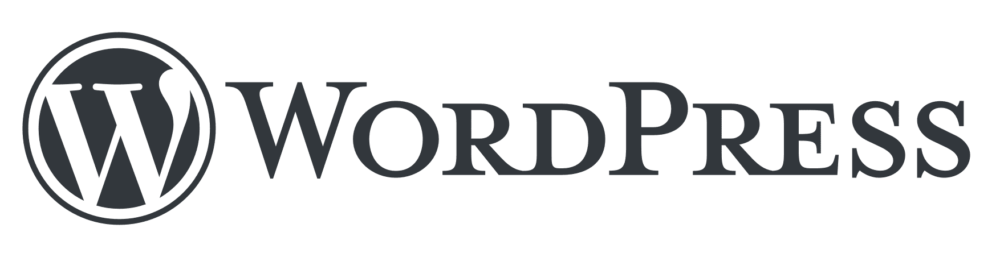
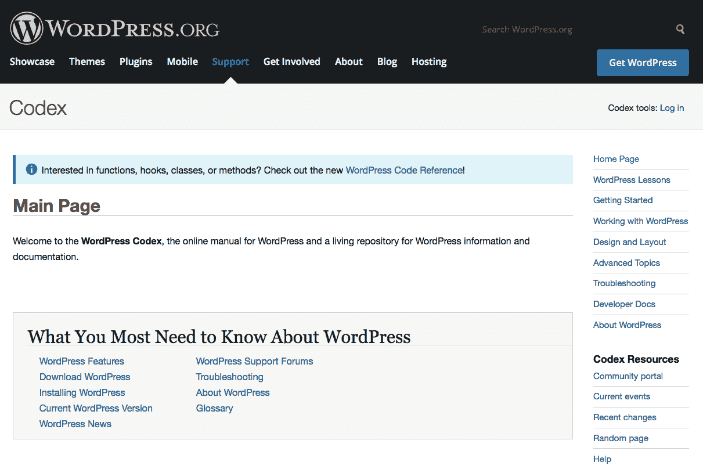
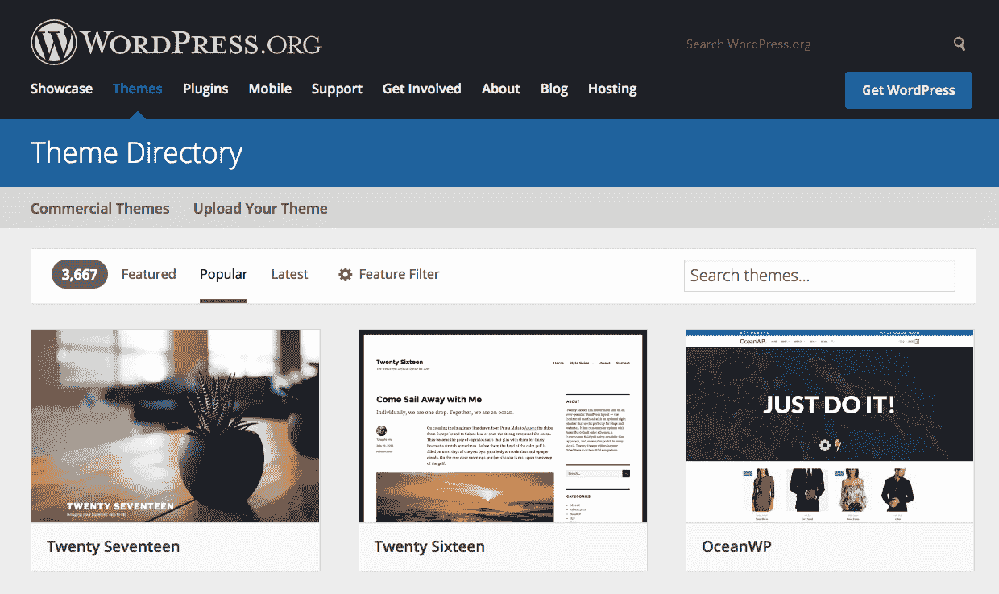

# 第一章：介绍 WordPress

**“我该如何制作一个网站？”**是现在很多人都会问的问题。实际上，如果你是 21 世纪的商业主，这可能是你问的**主要问题**之一。但**制作网站**不仅仅是关于商业。

这些天，我敢说，**每个人**至少都应该**考虑**拥有自己的网站。在过去，这是一个令人畏惧的概念。你唯一能拥有网站的方法是雇佣一个专业人士为你搭建，或者自学网络技术和开发，然后自己搭建。如今，有**更多**的选择，尤其是如果你想在确保网站**高质量**的同时，**快速**搭建一个网站的话。

其中最好的选择是 WordPress——这正是本书的主题。在底层，WordPress 是一个开源的网页软件应用，你可以用它来创建和维护一个现代网站。在撰写本文时，超过 30%的所有网站都在使用 WordPress，而且这个数字预计在未来几年只会增加。简单来说，使用 WordPress，任何人都可以以最小的努力创建一个美丽的网站，并且很快就能将其展示给全世界。让我们来看看使用 WordPress 的一些好处：

+   你不需要雇佣一个开发团队和/或设计师

+   你不需要学习高级 PHP

+   你不需要成为计算机专家

+   然而，你仍然可以拥有一个高质量的网站，几乎具有无限的扩展可能性

现在，每个人都有拥有网站的好理由。这不仅仅是大型公司。个人、家庭、自由职业者或小型/独立企业都可以从网站中受益。然而，与此同时，大多数人没有足够的资金雇佣一个网络开发公司或自由职业的网络开发者来为他们创建网站。这就是 WordPress 发挥作用的地方。WordPress 是免费的，易于使用，并集成了许多优秀功能。由于 WordPress 是一个网络应用，它不需要安装在你的家用 PC 或 Mac 上，或任何其他你控制的机器上。它可以存在于一个属于网站托管公司的服务器（类似于计算机）上。最初，WordPress 是一个旨在运行博客网站的应用。然而，它已经发展成为一个功能齐全的**内容管理系统**（**CMS**）。如果你不知道什么是博客，不用担心，我们将在本章后面解释一切。

在这本书中，我们将逐步介绍你理解 WordPress 如何工作以及可以用它做什么的重要步骤。我们将学习 WordPress 的基本使用、配置、通过主题和插件扩展你的网站，以及更多。但在我们能够达到所有这些之前，我们需要从零开始！在本章中，我们将探讨：

+   会使你选择 WordPress 来运行你的网站的原因

+   WordPress 的最大优势

+   WordPress 的在线资源

+   WordPress 最新版本中最有用的功能之一

# 进入 WordPress

WordPress 是一个开源内容管理系统。**开源**意味着系统的源代码以许可证的形式公开，版权所有者提供权利，允许任何人出于任何目的研究、更改和分发软件（如维基百科所定义）。CMS 意味着一个可以运行网站（例如，博客）的软件应用程序，并允许你发布、编辑和修改内容。它是一段位于网络服务器上的软件（稍后会更详细地介绍什么是网络服务器），并使你轻松添加和编辑帖子、主题、评论以及所有其他内容。以下是 WordPress 的标志：

尽管 WordPress 最初是一个博客引擎——主要用于运行博客——但现在它已成为网络中一些最大品牌的热门解决方案，并运行它们的整个网站。例如，《纽约时报》、《华尔街日报》、福布斯、路透社、[WIRED.com](http://wired.com)、索尼、丰田，以及一些最杰出的艺术家（如碧昂丝或滚石乐队）都使用 WordPress 作为其网络平台和发布渠道的基础。

毫无疑问，WordPress 在多年中发展了很多，尽管引入了大量新功能，但 WordPress 仍然是使用最简便的网页发布平台之一。最初，它是一个名为**b2/cafelog**的旧软件分支。

WordPress 是由马特·穆伦韦格和迈克·利特尔开发的，但现在由包括穆伦韦格在内的一支开发者团队维护和开发。

# WordPress 的优势是什么

WordPress 通常适用于以下三种流行的网站类型：

+   一个具有相对静态内容、页面、子页面等的典型网站

+   一个按时间顺序组织、经常更新、分类、标记和归档的博客网站

+   电子商务网站：一个功能齐全的在线商店，允许人们购买商品或服务，并允许网站所有者管理订单并完成它们

然而，正如经验所证明的那样，WordPress 也成功地用于运行各种其他网站，例如：

+   企业商务网站

+   单页个人资料网站

+   作品集网站

+   会员网站

+   视频博客

+   照片博客

+   产品网站

+   教育网站（在线课程）等

对于那些对博客网站和博客术语不熟悉的人，让我们来看看基础知识。

# 开始旅程——什么是博客？

最初，“博客”是“weblog”的简称。根据维基百科，这个术语“weblog”首次在 1997 年使用，人们从 1999 年开始在全球范围内使用博客。术语“weblog”、“web blogging”和“weblogger”于 2003 年被添加到《牛津高阶英汉双解大词典》中，尽管现在大多数人省略了“we”部分。

为了给您一个更简单的英文解释，博客是一个通常包含作者定期发布的条目的网站。这些条目可以是各种类型，如评论、事件描述、照片、视频、个人评论、教程、案例研究、长篇评论、政治观点，或您能想到的任何其他内容。它们通常按倒序时间顺序显示，最新添加的内容位于顶部。这些条目可以按日期、主题、主题等方式进行组织。

博客的一个主要特征是它旨在定期更新。与内容静态的网站不同，博客更像是一个在线日记，博主会定期发布更新。因此，博客是动态的，内容不断变化。博客可以随时更新新内容，旧内容也可以随时更改或删除（尽管删除内容并不是常见的做法）。

大多数博客都将内容集中在特定的主题上，例如，时事、爱好、细分话题和技术专长。这并不意味着博客只能由分享特定问题个人观点的人来发布。相反，如今，博客已成为许多企业和甚至大公司在线存在的重要组成部分。现代的*内容营销*实践现在已成为最广泛接受的网络营销方法之一，其核心是基于发布高质量的内容，通常以博客的形式。

# 理解常用术语

如果您是博客世界的新手（有时被称为*博客圈*，这是当今相当流行的表达），您可能想熟悉以下常用术语。

# 文章

博客中的每一篇条目都称为**文章**。每篇文章通常包含多个不同的部分。当然，最明显的两个部分是标题和内容。**内容**是文本、图片、链接等。文章甚至可以包含多媒体内容（例如，视频和音频文件）。每篇文章还有一个发布时间戳，大多数文章都有一个或多个分类和标签。这些文章，或条目，通常按倒序时间顺序显示在博客的主页上。默认情况下，最新的文章首先显示，以便给观众提供最新的主题新闻。

# 分类和标签

**分类**和**标签**是组织和在博客内以及跨博客中查找文章的方式。分类就像主题，而标签更像是关键词。例如，对于一个关于食物和烹饪的博客，可能会有一个名为**食谱**的分类，但该分类中的每篇文章可能都有不同的标签（例如，*汤*、*烘焙*、*素食*和*无乳制品*）。

标签和分类的目的和正确使用是博客作者之间广泛讨论的话题之一。尽管有基本指南，如这里所展示的，但每个博客作者在一段时间后会发展出自己的方法，而且没有**不可更改**的规则。

# 评论

大多数博客允许访客在帖子下发表评论。这为读者提供了与博客作者的互动机会，从而使整个体验变得互动。通常，博客作者会通过点击回复按钮一键发表额外的评论来回应评论，这形成了一种持续的公开在线对话或对话。

人们常说，评论是博客最重要的资产之一。大量评论的存在显示了博客的受欢迎程度和权威性。

# 主题

**主题**是你可以为你的博客选择的设计和布局包。在大多数博客上，内容（例如，帖子）与视觉外观是分开的。这意味着你可以在任何时候更改博客的视觉外观，而不用担心内容受到影响。主题的最好之处之一是安装并开始使用新主题只需几分钟。此外，网上有许多非常好的免费或低成本主题可供选择。

话虽如此，你在使用不确定的开发者的免费主题时需要小心。通常，它们包含可能损害你的网站及其在 Google 上的存在性的加密部分和代码。在选择主题之前，总是寻找用户评价。最重要的是，最安全的做法是从官方 WordPress 目录[`wordpress.org/themes/`](https://wordpress.org/themes/)获取你的免费主题。那里的主题已经过测试和检查，以确保没有可疑的代码。

你可以在[`newinternetorder.com/free-wordpress-themes-are-evil/`](http://newinternetorder.com/free-wordpress-themes-are-evil/)了解更多关于这个问题的信息。

# 插件

WordPress 插件是相对较小的网络软件组件，可以安装在任何 WordPress 网站上。它们扩展了原生功能，几乎可以做今天技术允许的任何事情。就像 WordPress 本身一样，插件内的代码是开源的，这意味着任何拥有所需技能集的人都可以构建一个新的插件。每个 WordPress 网站或博客都可以与无限数量的插件一起工作（尽管这不是推荐的方法）。通过插件引入的最受欢迎的功能包括垃圾邮件防护、**搜索引擎优化**（**SEO**）、缓存、社交媒体集成、交互式联系表单和备份。

# 小工具

**小工具** 是插件的一个简化版本。小工具最常见的用法是在你网站的侧边栏中展示。通常，你的当前主题会为你提供多个小工具区域，你可以在这些区域显示小工具（如前所述，其中许多位于侧边栏）。小工具的一些常见用途是显示内容，如分类和标签、最新文章、热门文章、最新评论、指向存档文章、页面、链接、搜索字段或标准非格式化文本。

# 菜单

我们需要回顾一些历史来解释 WordPress 中菜单的含义。在早期，WordPress 并不允许对导航菜单进行太多定制，也无法挑选我们想要显示的链接。这种状况在 3.0 版本中发生了改变，那时引入了新的 *自定义菜单* 功能。简单来说，它允许你创建完全定制的菜单（包括你选择的任何链接），然后在你网站的特定区域显示它们。说实话，尽管这个功能听起来很基础，但它却是将 WordPress 转变为一个完整网络出版平台的主要功能之一。我保证在接下来的章节中，这会变得更加清晰。

# 页面

重要的是要理解页面和文章之间的区别。与文章不同，页面不依赖于时间戳，也不会按时间顺序反向显示。此外，它们没有分类或标签。页面是一篇只有标题和内容（例如 *关于我* 或 *联系我们*——这两者几乎是任何博客上最受欢迎的页面）的内容。在你的博客上，页面的数量可能相对稳定，而新的文章几乎每天都会增加。

# 首页

**首页** 简单来说就是访客通过输入你的域名或 URL 地址访问你的网站时看到的首页。在 WordPress 存在的早期，首页并不是我们单独讨论的一种页面。最初，首页是自动从最新文章中生成的——它是以反向时间顺序列出这些文章的列表。然而，现在，WordPress 允许我们构建一个完全定制的首页，并在其上显示我们希望展示的任何内容。

# 用户

如前所述，WordPress 现在是一个完整的网络出版平台。其特点之一是能够与多个用户账户一起工作，而不仅仅是属于网站所有者（管理员/主要作者）的单个账户。有不同类型的用户账户可供选择，它们有不同的凭证和访问权限。

WordPress 显然试图模仿一个传统的出版社，其中存在 *作者*、*编辑* 和其他 *贡献者*，他们共同协作。尽管为个人管理网站的人提供无限数量的用户账户选项可能不会给人留下深刻印象，但它对于大型、类似杂志的网站来说，无疑是一个至关重要的功能。

# 为什么选择 WordPress？

WordPress 不是唯一的发布平台，但它提供了很多功能。在接下来的章节中，我特别强调了 WordPress 最突出的特性。

WordPress 的主要好处总结如下：

+   WordPress *让你完全控制自己的网站*。你可以改变/调整/修改/定制网站上的每一件事，我的意思是每一件事。

+   有 *成千上万的主题和插件* 可以选择，让你能够按照自己的意愿打造网站的外观和功能。WordPress 非常易于扩展。基本上，任何你能想到的额外功能都可以通过插件来实现，这些插件可以由你或你的程序员朋友编写。

+   在 *该平台上日常操作非常容易上手*。诸如编辑内容、发布新文章/帖子或通过评论与观众互动等任务都没有学习曲线。

+   *WordPress 是开源的*。这个平台没有价格标签；你可以免费获取。这也意味着，了解平台的工作原理以及如何进一步扩展它，不需要任何人的许可。

# 谁应该使用 WordPress？

基本上，如果你需要建立一个网站，并且想要自己动手搭建，那么 WordPress 就是实现这一目标的平台。

WordPress 是一个完美的工具，无论是刚开始接触网站建设的初学者，还是专业从事客户网站开发的开发者。

WordPress 已经存在很长时间了，并且一直在开发中。开发者们一直在努力工作，以确保 WordPress 能够领先于垃圾邮件发送者和黑客，并根据用户 *不断变化的需求* 来 *进化* 应用程序。

WordPress 的第一个版本，0.70 版，于 2003 年 5 月发布。从那时起，它已经发布了二十多个主要版本，中间还穿插着一些小版本。每个版本都带来了更多功能和更好的安全性。每个主要版本都有一个以杰出爵士乐手命名的代号，这已经成为 WordPress 世界的传统。

顺便说一下，WordPress 不是由一个孤独的程序员在黑暗的地下室里开发的。相反，有一个庞大的社区正在通过开发、故障排除、提供建议和测试应用程序来共同合作。由于有这么多人参与，应用程序很可能会继续不断进化和改进。

# 了解 WordPress 生态系统

作为平台和用户社区，WordPress 在两个主要领域取得了增长：

+   第一个围绕 WordPress.org ([`wordpress.org/`](https://wordpress.org/)) 展开，这是 WordPress 项目的原生、主要网站。

+   另一个是 WordPress.com ([`wordpress.com/`](https://wordpress.com/))，一个商业平台，为用户提供免费和付费的博客服务。

实际上，[WordPress.org](http://wordpress.org)是关于开发平台本身，分享新插件，讨论 WordPress 的技术方面，并且在一般意义上都是所有*技术爱好者*。[WordPress.com](http://wordpress.com)是一个商业网站，博客作者可以在那里见面并发布他们的博客内容在[wordpress.com](http://wordpress.com)子域下（例如，像`paleorecipeslog.wordpress.com`这样的子域）。

在第二章“WordPress 入门”，我们将讨论在[WordPress.com](http://WordPress.com)托管博客与从[WordPress.org](http://WordPress.com)获取软件之间的区别。

# 深入了解 WordPress – 功能

以下是 WordPress 提供的一些功能列表（不分先后）：

+   通过 WordPress 主题交换设计，这些主题也可以通过*WordPress 自定义工具*进一步自定义

+   通过 WordPress 插件扩展

+   无限的文章和页面

+   无限的分类和子分类

+   无限标签

+   适用于所有设备和屏幕尺寸的移动友好性和优化

+   灵活——创建您想要的任何类型的网站

+   可扩展的——可以处理任何规模的网站

+   能够通过电子邮件和移动设备发布（所有主要移动平台都有应用程序，包括 iOS 和 Android）

+   符合**万维网联盟**（**W3C**）标准，尽管这取决于您使用的主题

+   从其他博客导入数据（Moveable Type、b2evolution、Blogger 等）

+   即使没有先前的经验也容易管理和博客

+   方便，功能齐全，内置搜索

+   多语言，良好的国际化，并且也支持表情符号（包括所有最新的 Unicode 9.0 表情符号字符）

+   安全的代码

+   能够设置密码保护内容

+   评论管理器和垃圾邮件保护

+   内置的工作流程（撰写、草稿、审查和发布）

+   通过名为 Gutenberg 的可视编辑器进行智能文本和内容编辑

+   多用户和多作者对用户账户的支持

+   功能丰富的*媒体库*，通过直观且易于使用的界面管理照片和其他非文本内容

+   社交媒体集成功能

+   具有帖子（编辑）锁定功能的动态和可扩展的修订功能

+   通过短代码内置嵌入功能（兼容 YouTube、Vimeo、Flickr、SoundCloud 等服务）

+   可通过所有现代设备、操作系统和网页浏览器访问的行政面板

+   网站前端元素的完全可访问性

+   用户友好的图像编辑，以及拖放式图像导入功能

+   通过插件和主题的高级 SEO 功能

+   集成的 REST API 基础设施

# 学习更多

如果你想查看 WordPress 新增的所有功能的详细列表，只需查看 Codex。你可以轻松找到每个版本的子页面。只需将以下网址中的`X`和`Y`替换为你想要查找的版本号。

`https://codex.wordpress.org/Version_X.Y`

例如，如果你想了解 WordPress 5.0，请访问：

[`codex.wordpress.org/Version_5.0`](https://codex.wordpress.org/Version_5.0)

此外，你还可以在[`wordpress.org/about/features/`](https://wordpress.org/about/features/)上阅读完整的特性列表。

# 通过在线 WordPress 资源学习更多

WordPress 的一个非常实用的特性是它拥有一个庞大、活跃的在线社区。你为 WordPress 网站所需的一切很可能都能在网上找到，而且很可能是免费的。除此之外，如今我们还可以找到许多付费资源和培训项目，它们提供专家建议和培训，围绕 WordPress 网站的各种可能用途：

+   [`codex.wordpress.org/`](https://codex.wordpress.org/): 这里你可以找到 WordPress 的官方文档——我们将在本章后面更多地讨论 Codex。

+   [`themeisle.com/blog/`](https://themeisle.com/blog/)：提供关于使用 WordPress 执行常见任务的免费指导

+   [`www.wpbeginner.com/`](https://www.wpbeginner.com/)：提供关于 WordPress 的教程和资源

# 关注 WordPress 新闻更新

由于 WordPress 一直在不断发展，因此了解软件社区的最新活动非常重要。

如果你经常访问自己的 WordPress 网站的仪表板，你将能够了解 WordPress 新闻和软件发布情况。仪表板上有显示最新新闻和公告的小工具，当有新的 WordPress 版本可供下载和安装时，总会出现警报。

如果你更喜欢访问网站，那么最重要的访问或订阅位置是 WordPress 发布。无论是有重大发布，还是临时错误修复，或者升级，都会在[`wordpress.org/news/category/releases/`](https://wordpress.org/news/category/releases/)上。

此外，务必关注[`wordpress.org/news/`](https://wordpress.org/news/)上的主要 WordPress 博客。

一些值得提及的额外资源如下：

+   [`wordpress.org/`](https://wordpress.org/): WordPress 的绝对主要枢纽。

+   [`wordpress.com/`](https://wordpress.com/): 用于创建博客和网站的商业服务。

+   [`jobs.wordpress.net/`](http://jobs.wordpress.net/)：为寻找与 WordPress 相关领域就业机会的人提供职位列表（或为寻找 WordPress 帮助的人）。

+   [`wordpress.tv/`](https://wordpress.tv/): 一个优秀的 WordPress 教程、如何操作建议、案例研究、产品演示以及与 WordPress 相关的会议演讲记录的来源。

+   [`central.wordcamp.org/`](https://central.wordcamp.org/): WordCamp 是一个专注于 WordPress 的会议；它一年中在世界各地的不同地点举办多次，这个网站是会议的中央点。

# 理解 Codex

WordPress **Codex** 是官方 WordPress 团队发布所有信息的中央存储库，旨在帮助人们使用 WordPress。

Codex 提供了一些基本的 WordPress 入门教程，例如详细的安装步骤讨论，以及每个模板标签和钩子的列表。在这本书中，我将提供指向 Codex 中特定页面的链接，这些链接将提供关于本书主题的更多或更高级的信息。

Codex 可以在[`codex.wordpress.org/Main_Page`](https://codex.wordpress.org/Main_Page)找到。请参考以下截图：

除了 Codex 之外，还有一个对新手和经验丰富的开发者都很有用的资源。它被称为 WordPress *代码参考*，可以在[`developer.wordpress.org/reference/`](https://developer.wordpress.org/reference/)找到。它提供了大量关于 WordPress 的功能、类、方法和钩子的文档。

# 从其他用户那里获得支持

在线 WordPress 社区在[`wordpress.org/support/`](https://wordpress.org/support/)的 WordPress 论坛上提问并回答解决方案。如果你在 Codex 中找不到问题的答案，这是一个很好的去处。如果你有问题，那么可能其他人也有过同样的疑问，WordPress 专家会在论坛上回答这些问题并提供解决方案。

# 使用主题和插件目录

在[WordPress.org](http://WordPress.org)上有官方的主题和插件目录。尽管不是每个主题和插件都可用，但那些可用的主题和插件都经过了社区和审查团队的审核。从这些目录中下载的任何内容可能相对较少错误。从其他来源获得的插件和主题可能包含恶意代码，所以请小心。你还可以通过查看评分、评论和流行度指标来了解社区对这些下载的看法：

+   你可以在[`wordpress.org/themes/`](https://wordpress.org/themes/)找到主题目录

+   插件目录位于[`wordpress.org/plugins/`](https://wordpress.org/plugins/)

下面是 WordPress 主题目录的截图：

# 摘要

在当今时代，拥有自己的网站至关重要，无论您是个人还是小型企业，无论您是定期博客还是只想在网上发布一些准确静态内容。在本章中，我们回顾了有关 WordPress、博客和常见博客术语的基本信息，供那些对这一概念新的人参考。

WordPress 是一个出色的平台，可以运行您的网站（无论是博客还是其他类型）。它集成了最先进的功能，非常灵活，几乎可以做您想要做的任何事情，并且拥有丰富的在线资源。此外，它易于使用，您无需特殊技能或先前的经验即可与之合作。最后但同样重要的是，它是 100%免费的！

在下一章中，我们将探讨安装 WordPress 以及开始使用时涉及的选择和步骤。我们将介绍如何以多种方式安装 WordPress，如何熟悉 WordPress 管理面板，以及如何配置您网站的基本细节。
