# 创建博客内容

现在您的 WordPress 安装已经启动并运行，您准备好开始创建内容了。学习如何有效地做这件事将帮助您更好地与您的受众产生共鸣，并为他们提供优化且易于消费的内容。在本章中，您将学习以下主题：

+   WordPress 管理仪表板（也常称为`wp-admin`）的工作原理以及如何在其中找到你的路径

+   如何撰写新的博客文章

+   如何控制与博客文章相关的所有信息，不仅仅是标题和内容，还包括图片和媒体

+   如何处理评论——它们的作用以及如何管理它们

+   如何使用标签和分类来保持内容组织良好且易于搜索

# WordPress 管理约定

在`wp-admin`中，您有权管理多种不同类型的内容和排序内容的方式，包括文章、分类、页面、链接、媒体上传等。WordPress 为各种屏幕使用类似的格式。让我们在这里探索它们。

# 项目列表

在 WordPress 中可以管理的每种内容类型都有一个独立的专用屏幕，列出了所有单个内容项。由于本章是关于创建文章的，让我们看看文章列表的例子：

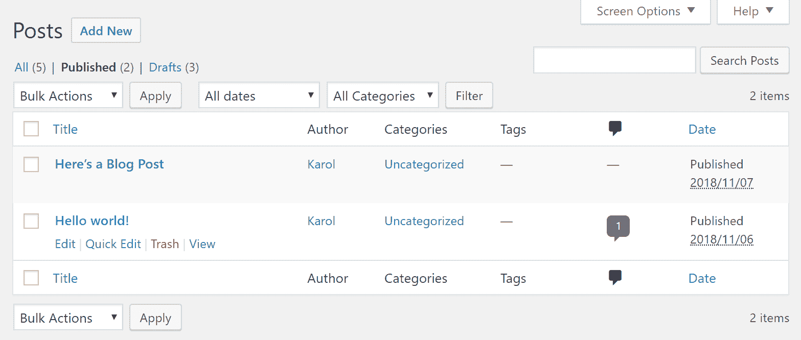

如您所见，内容类型的名称位于顶部（在这种情况下，它是文章）。项目列表也有包含各种其他信息的列：

+   列表中的每个项目都显示了其标题。您始终可以点击项目标题来编辑它。

+   如果你将鼠标悬停在特定的行上，就像我在前面的屏幕截图中将鼠标悬停在“Hello world!”上一样，你会看到四个额外的链接。前三个始终相同（编辑、快速编辑和回收站），而第四个则根据我们处理的是已发布的文章还是待发布文章而变化。编辑、回收站和查看/预览链接相当直观，但快速编辑链接需要额外说明。当你点击它时，你会看到一个面板，允许你执行一些简化的编辑（只是基本细节和参数，没有实际内容编辑）：

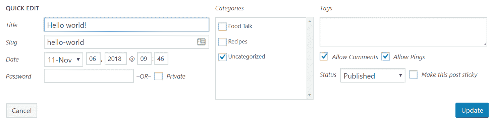

+   您可以做出更改，然后点击更新，或者如果您改变了主意，可以点击取消。

+   在文章列表上方区域，您可以选择查看所有（文章）、已发布（文章），以及草稿、待审和回收站。目前，我的列表上只有所有、草稿和已发布的文章。然而，随着时间的推移，列表肯定会变得更加丰富，因为我们将继续撰写新的文章（这同样适用于您的网站）。

+   在这些链接下方是批量操作菜单及其相应的应用按钮。通过点击它们的复选框（或勾选顶部的复选框以选择所有项目）选择一个或多个帖子。然后，从批量操作菜单中选择编辑或移动到回收站，并在点击应用后，您将能够批量删除或批量编辑这些帖子。此外，从某种意义上说，在您安装一些第三方插件后，您会注意到这个批量操作菜单可能包含标准两个选项（编辑和删除）之上的更多选项。

+   *过滤器*菜单允许您从日期和分类下拉列表中选择选项，然后点击过滤器按钮，仅显示符合这些标准的条目。

+   搜索字段以及搜索帖子按钮提供了另一种过滤您帖子的方式，以找到您正在寻找的具体帖子。一开始这可能看起来不是一个特别有用的功能，但一旦您在网站上发布了超过，比如说，200 篇帖子，找到单个条目就变得相当具有挑战性。

+   在顶部是屏幕选项下拉菜单。这个标签页，它出现在 WordPress 仪表板的每个屏幕上，将允许您隐藏或显示特定的列，并选择每页显示的项目数量。

现在，让我们继续本章的主要话题——发布内容。

# 在博客上发布帖子

您将在博客中执行的主要活动是添加帖子。一篇帖子就像杂志中的一篇文章；它需要一个标题、正文内容和作者（在这种情况下，WordPress 允许多个作者为博客做出贡献）。博客帖子还附有许多其他信息，例如日期、摘要、标签和分类。在本节中，您将学习如何创建新帖子以及将其附加的信息类型。

# 添加简单帖子

无论何时您想要添加内容或对您的 WordPress 网站进行维护，您都必须先登录到您网站的**WordPress 管理面板**（`wp-admin`）。要进入管理面板，请在您的网络浏览器中打开`https://yoursite.com/wp-admin`。

请记住，如果您在子目录（例如，`blog`）中安装了 WordPress，那么您的 URL 必须包含该子目录（例如，`https://yoursite.com/blog/wp-admin`）。

从这里，有两种方法可以进入允许您添加新帖子的屏幕：

+   从 WordPress 仪表板的主侧边栏菜单转到帖子 | 添加新帖子

+   点击 WordPress 仪表板顶部栏的+ 新建按钮，然后点击帖子（参见图示）：

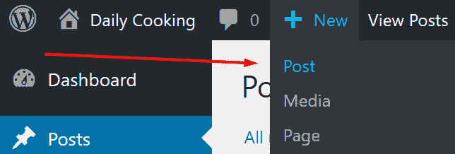

一旦您到达帖子创建面板，您将看到主要内容编辑器。下一节将解释如何使用它。

# 在基于块的编辑器中工作

基于块的编辑器是 WordPress 的最新、最强大的功能。该项目最初以**Gutenberg**的名字开始，在经过大约两年的开发后，最终作为 WordPress 5 的主要内容编辑工具被包含在内：

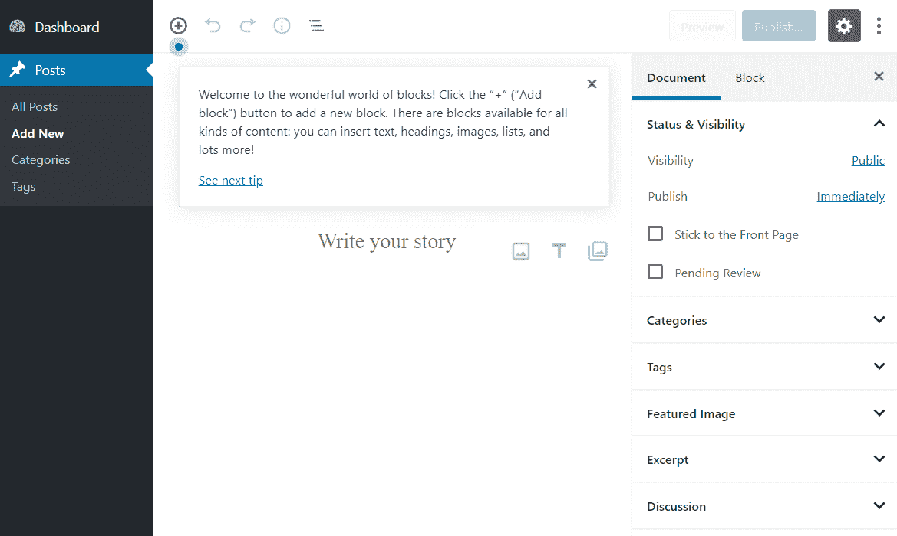

在前面的屏幕截图中，您可以看到基于块的编辑器的主视图。同时请注意，提供帮助的入门提示，在您首次接触新编辑器时提供协助。

那为什么它被称为“基于块的”编辑器呢？因为编辑器处理内容和管理其结构的方式。您在帖子或页面中的内容被划分为一个个单独的块，一个接一个，整齐地排列在一个（数字）画布上。

在基于块的编辑之前，WordPress 使用了一个传统的所见即所得编辑器。它使用经典的段落结构——这种方法与构建 Google 或 Word 文档的方式非常相似。然而，这种传统的结构并不总是适合处理现代网络的内容需求。换句话说，它使得构建复杂、视觉上令人愉悦的博客文章或页面，并在不同设备上有效地展示它们变得困难。

基于块的编辑更有意义，因为每个内容块都可以单独处理，并根据查看内容的设备以不同的方式处理。此外，比段落更容易重新排列块。

那么，一个“块”实际上可以是什么？想想看可以放在网页上的所有东西。这包括以下内容：

+   文本块

+   图片

+   视频

+   引用

+   标题

+   表格

+   按钮

+   来自第三方网站（如 YouTube 或 Facebook）的嵌入

+   以及更多

本章的下一段描述了如何使用基于块的编辑器来创建您的第一篇博客文章。

# 理解编辑器界面

编辑器（帖子 | 添加新帖子）由三个主要部分组成，如下面的屏幕截图所示：

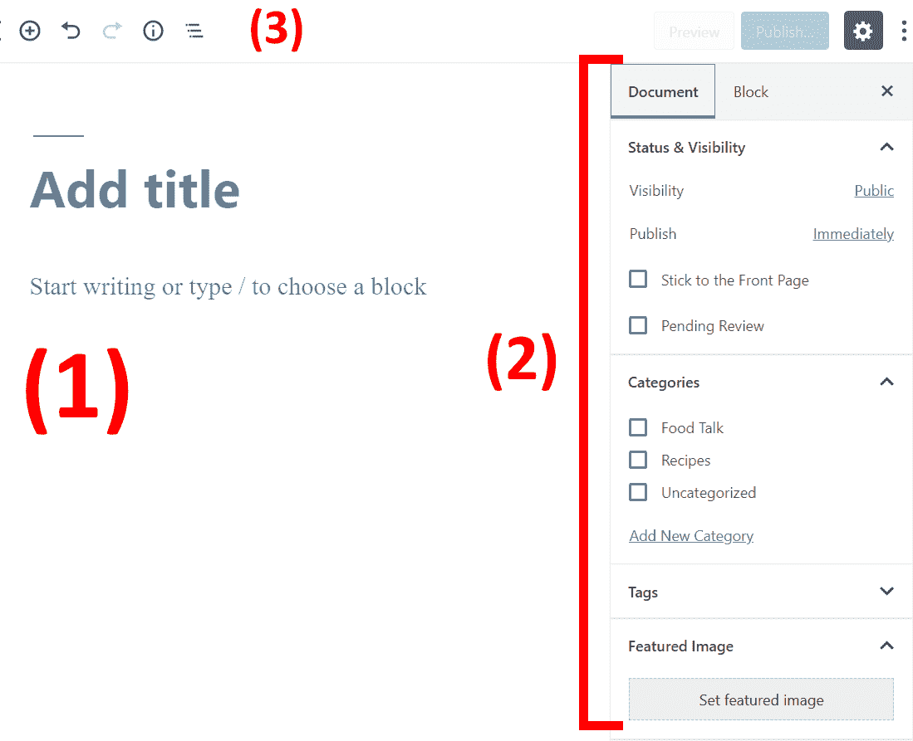

1.  **主要画布**：这是主要的内容编辑区域，您将在其中完成大部分工作

1.  **设置侧边栏**：这允许您更深入和细致地调整整个文档以及单个内容块

1.  **顶部菜单栏**：这是您处理各种管理任务的地方

这里是顶部栏中可用的更近视图：

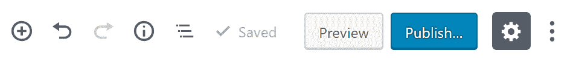

我们将审查从左边开始的符号：

+   +图标允许您向文档中添加一个新的块。

+   下两个是撤销和重做按钮。

+   i 图标为您提供有关文档内容结构的一些信息（包括单词数、标题、段落和块的数量）。

+   带有三个水平条的图标允许您在编辑内容时在页面上已存在的块之间导航；它提供了快捷链接。

+   然后，在右侧，您有预览和发布按钮。

+   旁边是 *齿轮* 图标——这个图标可以切换设置侧边栏的开启和关闭。

+   最后，有一个带有三个垂直点的图标。这个图标可以让您启用额外的屏幕元素，使您在文档中的工作更加直接（例如，您可以进入无干扰模式，一次关注一个块，查看键盘快捷键等）。

我鼓励您自己尝试这里可用的功能。

# 创建您的第一篇博客文章

现在我们已经了解了基于块的编辑器界面的情况，是时候开始着手我们的第一篇博客文章了！

1.  首先，在“添加标题”处输入您的博客文章标题：

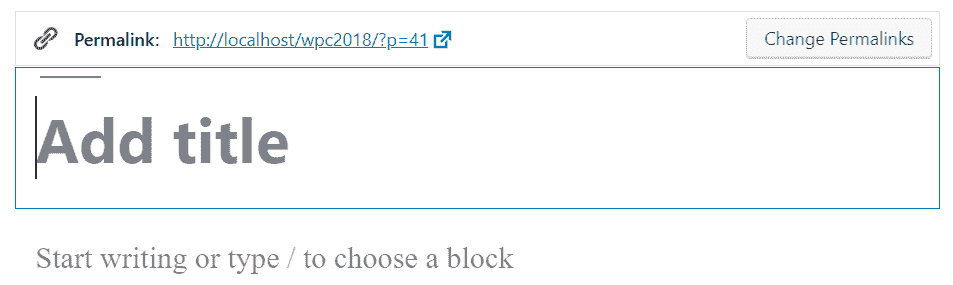

1.  完成后，将鼠标光标移到下一行并开始键入您的文章：

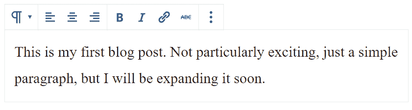

当您开始键入时，您会立即看到现在有各种编辑工具可供使用。您可以调整文本到左对齐、右对齐和居中对齐。您可以使用粗体或斜体，甚至为您的内容添加链接。要添加项目符号列表，只需按下键盘上的*Enter*键，然后从下一行开始使用连字符(*-*)。它将自动转换为列表项。

1.  要删除一个块或对其执行其他操作，您可以点击格式选项旁边的三个点：

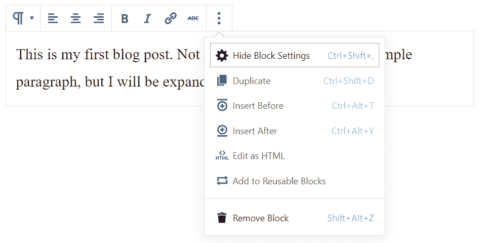

1.  除了这些，当您编辑任何块时，您可以在右侧的设置侧边栏中看到该块的具体选项。例如，对于段落块，您可以调整字体，添加首字下沉，更改文本颜色，并进行一些高级修改，所有这些都可以在以下屏幕截图中看到：

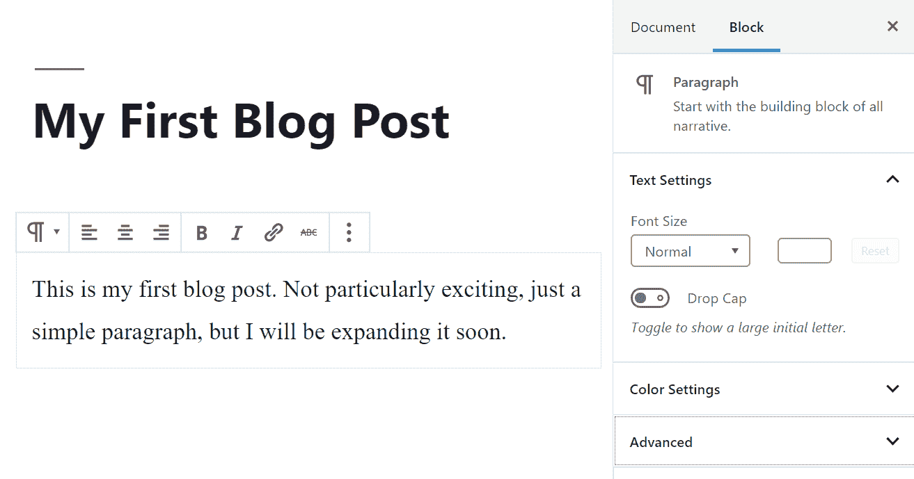

在页面上添加我们的第一段文本后，现在让我们添加一张图片。

1.  要做到这一点，请点击屏幕左上角的 + 图标。从下拉菜单中选择图片：

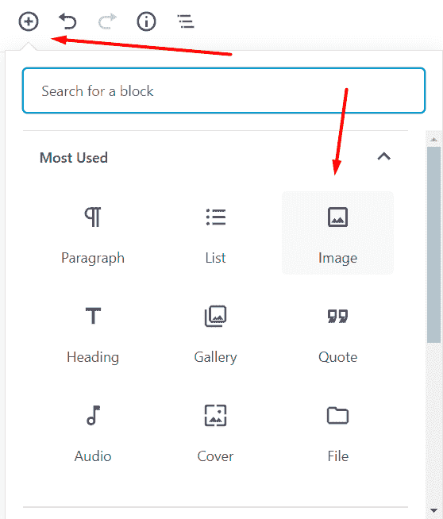

1.  您将看到一个新的图片块被添加到页面上：

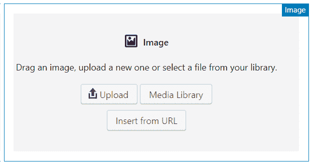

1.  该图片块允许您上传新的图片，从媒体库中选择它，或从 URL 插入。最常见的方法是从您的电脑上传新的图片。完成此操作后，您将看到一些针对图片的非常有用的选项。在其他事情中，您可以更改图片的对齐方式，更改其大小，添加标题，在图片上添加链接等。请参考以下屏幕截图：

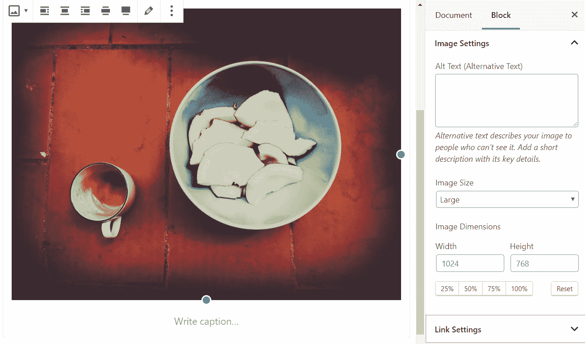

1.  继续使用相同的方法，我们可以在画布上添加各种其他块，从而最终得到一篇相当吸引人的博客文章。例如，作为一个实验，我创建了以下博客文章：

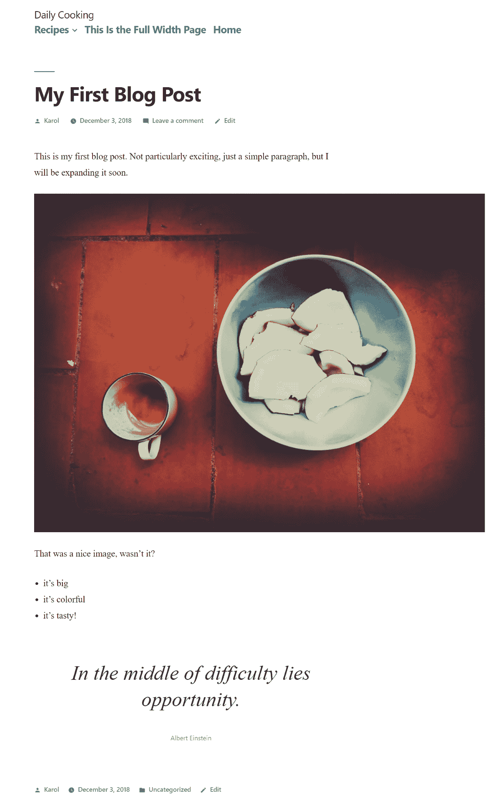

它包括以下内容：

+   一个标准的文本段落

+   一张设置为宽的图片

+   另一段文本

+   一个项目符号列表

+   一个引用

现在我们已经建立了一些“构建块”，我们将看看如何使用它们来完善我们的帖子。

# 对齐块和构建帖子布局

基于块的编辑器最出色的特点之一是其多功能性和功能性。移动东西和微调你的博客帖子直到它看起来完美无缺是非常容易的。

将内容块一个接一个地添加——就像我们在上一步中所做的那样——只是硬币的一面。同样令人印象深刻的是，你可以拖放块来重新排列它们，或者使用箭头按钮将给定块向上或向下移动：

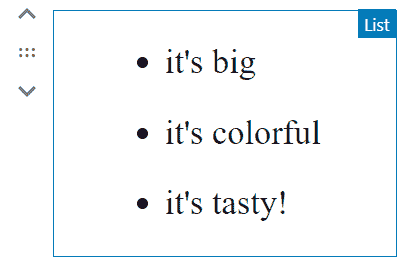

在前面的屏幕截图中，你可以看到三个图标。当你将光标悬停在块上时，它们会出现：

+   上箭头和下箭头可以将当前块向上或向下移动一个位置——这为切换文本和图片或对帖子布局进行任何其他简单调整提供了一个很好的方法。

+   中间的那个按钮——六个点的网格——允许你使用拖放；只需用鼠标抓住那个图标，并将其拖到帖子当前块序列中的任何位置。

你还可以直接在画布上已经存在的块下方或上方添加新的块。要做到这一点，将光标悬停在给定块的顶部或底部边界附近。会出现一个新的+图标，如以下屏幕截图所示。点击该+图标，就可以在所需位置添加一个新的块：

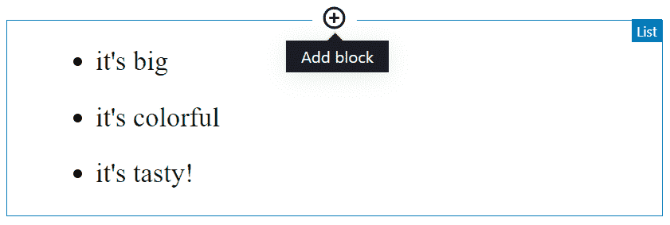

当你准备好并且喜欢你的帖子外观时，是时候发布它了。要做到这一点，点击右上角的蓝色“发布”按钮。当你这样做时，你会看到一个最终的确认屏幕（我们将在下一节中回顾该屏幕上的其他选项）。再次点击发布按钮，你的帖子就会上线：

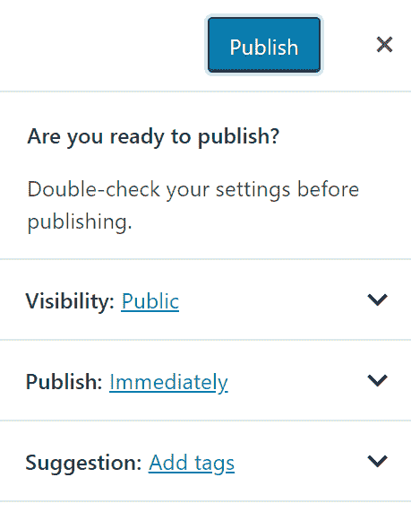

当过程完成后，你仍然会看到自己还在同一个屏幕上，但现在，以下消息将会出现，告诉你你的帖子已经发布，并且你可以通过点击“查看帖子”链接来查看：

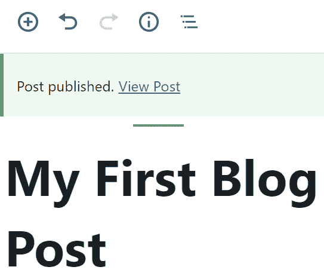

如果你查看网站的首页，你会看到你的新帖子已经被添加到顶部。

# 常见帖子选项

现在我们已经回顾了创建帖子的基础知识，让我们看看在添加新帖子或编辑现有帖子时可用的一些其他选项。在本节中，我们将查看最常用的选项，在下一节中，我们将查看更高级的选项。

# 分类和标签

分类和标签是你可以添加到博客帖子中的两种信息类型。我们使用它们通过主题和内容（而不仅仅是日期）来组织你的博客中的信息，并帮助访客在你的博客中找到他们想要的内容：

+   分类主要用于结构化组织。它们可以是分层的，这意味着一个分类可以是另一个分类的父分类。一个相对繁忙的博客可能至少有 10 个分类，但可能不会超过 15 或 20 个。在这样的博客中，每篇文章可能被分配一到四个分类。当然，提到的数字只是建议；你可以创建和分配你喜欢的任意数量的分类。例如，一个关于美食和烹饪的博客可能有以下这些分类：食谱、美食讨论、媒体报道、食材和餐厅。你如何组织分类完全取决于你。在 WordPress 世界中，这方面没有真正的规则，只有像这样的指南。

+   标签主要用于简短描述特定博客文章中涵盖的主题。一个相对繁忙的博客可能会有 15 个甚至 100 个标签在使用中。在该博客中，每篇文章可能被分配三到 10 个标签。例如，一篇关于南瓜汤食谱的美食博客文章可能有以下这些标签：*汤*、*素食*、*秋季*、*热*和*简单*。同样，你可以创建和分配你喜欢的任意数量的标签。

为了演示这一切是如何工作的，让我们向博客添加一篇新文章。在给它一个标题和一些内容后，让我们继续分配一些新标签。要添加标签，查看基于块的编辑器中的设置侧边栏，切换到“文档”选项卡。从那里，点击“标签”切换以启用它，就像以下截图所示：

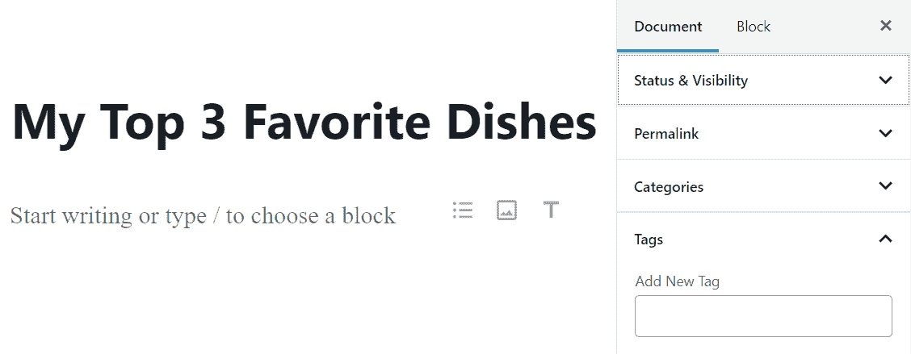

添加标签非常简单；只需将你的标签列表输入到空白框中。用逗号分隔它们以定义一个标签的结束和另一个标签的开始。当你输入时，标签将自动分配。如果你想删除一个标签，点击它旁边的 x 图标，就像以下截图所示：

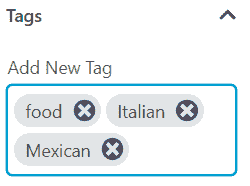

使用这种方法分配的每个标签都将添加到你的博客标签目录中。下次你开始输入相同的标签时，WordPress 会自动建议。

分类与标签的工作方式略有不同。一旦你的博客开始运营，你通常只需在设置侧边栏的分类部分勾选现有分类的复选框。然而，当你刚开始创建第一个分类时，你需要手动创建它们。要添加新分类，查看基于块的编辑器中的相同设置侧边栏，切换到“文档”选项卡，然后点击“分类”切换以启用它：

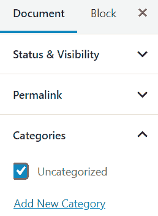

点击“添加新分类”链接。将你的分类输入到文本框中，然后点击“添加新分类”按钮。你的新分类将显示在列表中，已经勾选，就像以下截图所示：

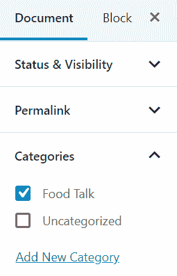

分类和标签不仅有助于组织你博客上的帖子。它们还承担着另一个重要的功能：搜索引擎优化。为了增加你的帖子在相关在线搜索中显示的可能性，从而增加网站访问量和观看次数，选择正确的分类和标签将大有裨益。

# 帖子中的图片

WordPress 使添加图片到你的帖子变得容易，控制默认图片大小，对图片进行一些编辑，并为你的帖子指定一个*特色*图片。

# 在帖子中添加图片

在本章的早期部分，我们学习了如何将简单的图片添加到博客帖子中。现在让我们在此基础上再深入一些。

添加图片到博客帖子的主要有两种方法（其中我们已经知道了第一种）：

+   要么点击基于块的编辑器顶部的+按钮，

+   或者点击画布上最后一个空内容块右侧的图片图标，如下面的截图所示：

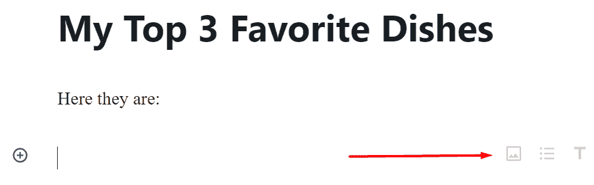

到目前为止，你为了将图片添加到帖子中需要做的只是从媒体库中选择它、从你的电脑上传，或从 URL 插入。每种方法都有相应的按钮。此外，你还可以直接从你的桌面拖放图片。

一旦你的图片上传完成，你会在帖子的画布上看到它被添加。在这个阶段，你可以通过利用图片弹出菜单中的选项来进一步自定义它，如下面的截图所示：

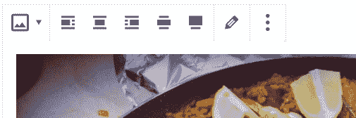

从左侧开始，我们有以下几种：

+   更改块类型。此按钮允许你将图片块转换为画廊块、封面块、文件块或媒体和文本块。本质上，这个功能是为了展示其他可能更适合你想要添加的内容类型的类似块类型。我鼓励你尝试这些选项，看看可能实现什么。

+   下一个部分包含五个图标，用于调整图片的对齐方式。可用的选项有左对齐、居中、右对齐、全宽和全屏宽度。虽然左对齐、右对齐和居中对齐相对直观，但“全宽”和“全屏宽度”的显示效果取决于你当前使用的主题。不妨尝试这些选项，看看效果如何。

+   笔记图标允许对图片进行更深入的编辑。点击它后，你会看到以下屏幕：

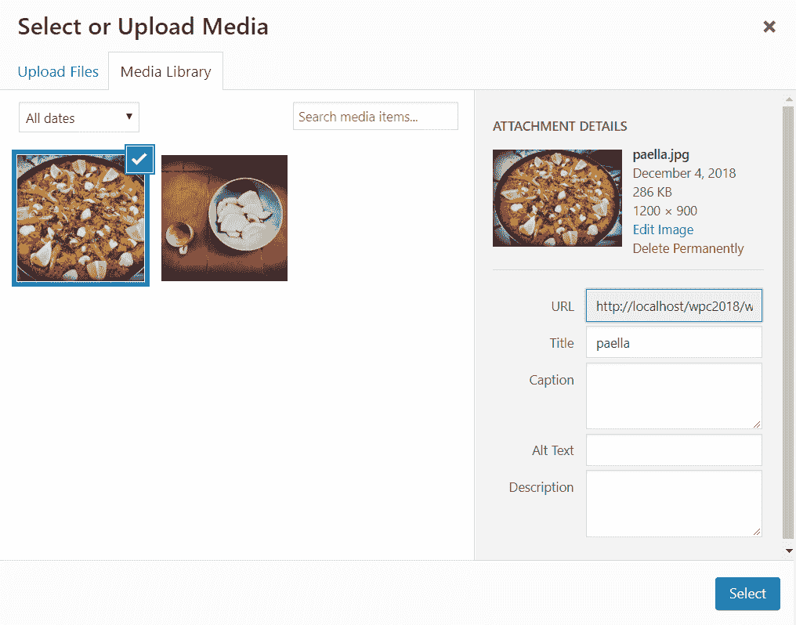

这里更重要的字段是标题、替代文本和说明。替代文本是在文件丢失或出现其他问题时将显示在图片位置的短语。说明是你想要显示在图片本身的下方的一段简短描述。

+   最后一个图标——三个垂直点——是一个出现在所有其他内容块中的图标，它并不特属于图片块。它为你提供了额外的选项，关于你可以对这个块做什么：

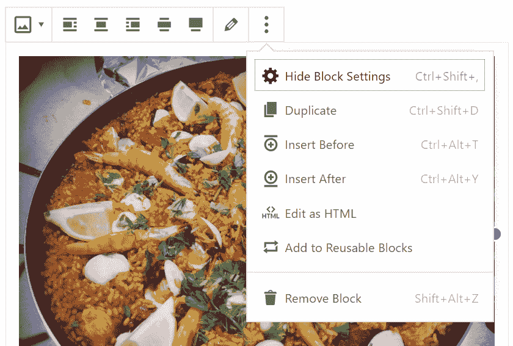

此外，如果你愿意，你还可以通过标准输入框在你的图片下方为图片本身添加标题：

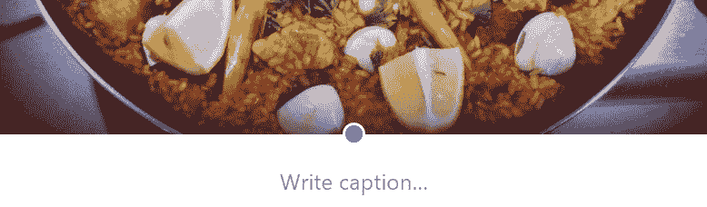

记住，为了保存所有更改，你必须保存帖子本身，要么通过点击主“发布...”按钮（但这意味着更改将被保存并发布），要么点击旁边的“保存草稿”链接。

# 指定特色图片

WordPress 的另一个酷特性——如果我们已经有很多这样的特性了——是你可以为特定的博客帖子选择任何单张图片作为特色图片。为此，你想要选择一张能很好地代表帖子的图片。

一些主题会使用特色图片并将其突出显示，而有些则不会。默认主题，我们一直在使用的 Twenty Nineteen，使用特色图片在帖子主要内容上方创建一个看起来很棒的满屏条。根据你使用的主题，它与特色图片的行为可能会有所不同；但总的来说，每个现代主题都以某种方式支持它们。

为了设置特色图片，再次查看基于块的编辑器的设置侧边栏中可用的选项。切换到文档选项卡后，滚动到特色图片部分。那里有一个标有“设置特色图片”的单个按钮：

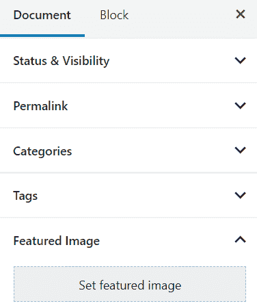

当你点击它时，你会看到一个弹出窗口，非常类似于我们在添加博客帖子图片时使用的窗口。在这里，你可以通过点击上传一张全新的图片，或者选择一张现有的图片。你现在需要做的就是点击右下角的“选择”按钮。完成这个步骤后，你会在设置侧边栏的特色图片部分看到这张图片。然而，看到它在那里只是为了确认图片确实被适当地分配了。

为了看到它的完整效果，你需要导航到你的网站前端，并以读者的视角查看相关的帖子。看看下面的截图：

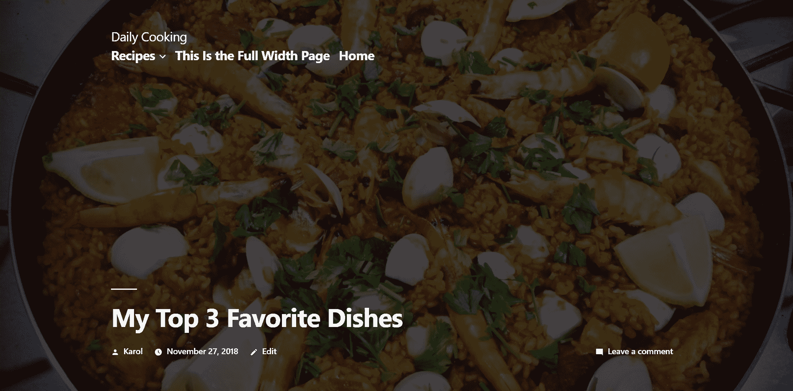

这是一个在实时帖子中使用特色图片的绝佳例子。记住，特色图片的影响将由你博客的主题决定。

# 控制默认图片大小

每次上传图片时，WordPress 都提供了三种图片缩放选项（除了保留原始大小）：缩略图大小、中等大小和大型大小。你可以通过进入 WordPress 仪表板主侧边栏菜单的设置 | 媒体来设置这些选项的像素尺寸。这将带你到媒体设置页面：

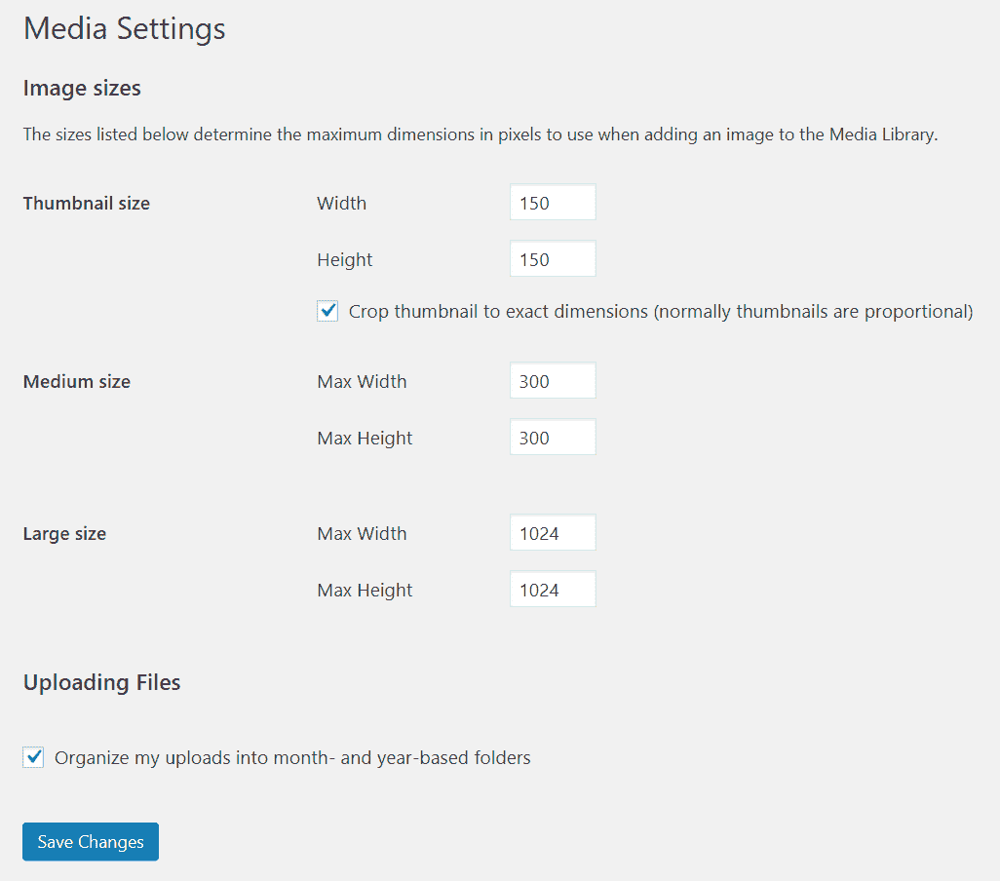

在这里，你可以指定我们刚才讨论过的三种缩放选项中上传图片的大小。

如果你更改了这个页面的尺寸并点击“保存更改”按钮，只有你未来上传的图片会受到影響。你已上传到网站的图片将保持其原始/之前的缩略图、中图和大图版本。

在你的网站生命周期早期就决定你想要的三种媒体大小是个好主意，这样你就可以设置它们，并从一开始就将它们应用到所有图片上。

# 编辑上传的图片

已上传到 WordPress 的每一张图片都可以进行编辑。为了做到这一点，点击主侧边栏中的“媒体”按钮进入媒体库。你会看到一个新类型的列表，这是在 WordPress 的最新版本中引入的。

与传统的列表不同，你现在可以操作的是一个基于网格的存档，它为每件媒体提供了更好的可见性。目前，我们的图书馆中只有一张图片（见截图）；但随着你继续使用你的网站，这个列表将变得更加引人注目。

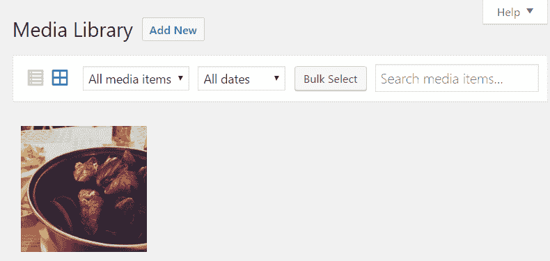

当你点击任何图片，然后点击弹出窗口底部的“编辑图片”按钮时，你将进入附件详情屏幕。在这里，你可以执行多项操作，让你的图片变得完美无瑕。

事实上，WordPress 在简单的图片调整方面做得足够好，以至于你实际上并不需要像 Adobe Photoshop 这样的昂贵软件。在所有可能性中，你会发现裁剪、旋转、缩放以及垂直和水平翻转（如图所示）的选项：

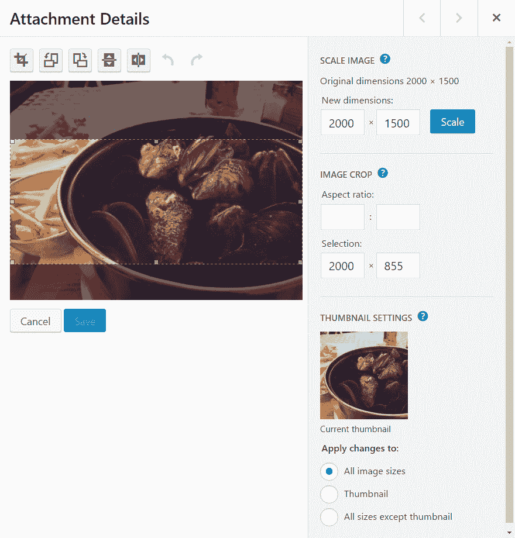

例如，你可以使用鼠标画一个框，就像我在前面的截图中所做的那样。在右侧，在标记为“图片裁剪”的框中，你会看到你选择像素的尺寸。点击裁剪图标（左上角），然后点击右侧的“缩略图”单选按钮，然后保存（就在你的照片之后）。你现在有一个新的缩略图了！

当然，你可以在点击“保存”按钮之前进行不同的选择来调整你图像的任何其他版本。稍微尝试一下，直到你熟悉了细节。

# 文章中的视频和其他媒体

现在，WordPress 的最新版本不仅能够将图片包含在我们的博客文章中，还能包含其他类型的媒体，例如音频文件和视频。

# 将视频添加到博客文章

幸运的是，将视频添加到标准博客文章或页面上的过程已经变得比以往任何时候都要简单。让我们一步步来讨论这个问题。

我们将为此创建一篇全新的文章。让我们使用标题“伟大的婴儿排骨食谱”。创建文章本身相当基础。

1. 导航到“文章”|“新建文章”。你会看到一个我们在本章前面已经讨论过的屏幕。

2. 让我们在内容中放置一些示例内容，并立即尝试添加一个视频。我们只需要复制并粘贴我们想要包含在内容中的视频 URL；只是一个标准的复制粘贴操作，没有其他。

在复制视频 URL 时，确保链接以纯文本形式复制（不要在任何地方超链接：也就是说，不可点击）。

我将要使用的示例是[`www.youtube.com/watch?v=hDyHbTxTL-A`](http://www.youtube.com/watch?v=hDyHbTxTL-A)上的视频。正如你所猜到的，这是一段关于一些婴儿排骨的精彩视频食谱！因此，为了在博客帖子中包含这个视频，我只需要获取它的 URL 并将其粘贴进去。以下是我在现在正在工作的新帖子的原始文本内容：

```php
Here's a great video recipe for some killer baby back ribs: http://www.youtube.com/watch?v=hDyHbTxTL-A
```

然而，当你添加视频 URL 时，你会立即注意到它会自动转换为实时视频块。这将在网站的前页以及编辑帖子屏幕本身发生。请参考以下截图：

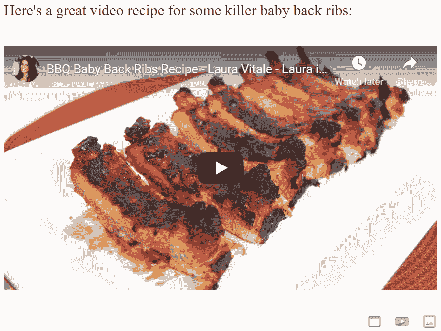

3. 为了让帖子有更多的独特存在感，让我们添加一个新的类别，*食谱*，并分配一个新的标签，*视频*。之后，我们只需要正常发布帖子即可。

这里描述的过程解释了如何嵌入 YouTube 视频并将它们作为博客帖子的一部分，但这也适用于其他流行的平台，例如 Vimeo、TED、Hulu 和 WordPress.tv。要获取支持平台的全名单，请访问[`codex.wordpress.org/Embeds`](https://codex.wordpress.org/Embeds)。

添加视频到博客帖子的另一种方法是手动上传原始视频文件（而不是使用像 YouTube 这样的第三方平台）。尽管在 WordPress 中这是可能的，但这不是一个推荐解决方案。视频文件通常非常大，如果视频变得流行并最终被数千人观看，托管在标准 Web 服务器上可能会变得非常昂贵（带宽成本）。直接将视频上传到 YouTube 或类似平台，然后将其嵌入到我们的网站上，就像我们刚才做的那样，要高效得多，用户友好性也更强。

# 在博客帖子中添加音频

WordPress 还使添加音频到你的博客帖子与添加视频一样简单。为了演示这一点，我将创建一个全新的帖子，并将其命名为“Risotto 播客”。在其中，我将分享一个流行的烹饪相关播客的一期。我有两种方法可以做到这一点：

+   与视频类似，如果我有音频文件的直接 URL，我可以直接将其复制粘贴到帖子中。

+   如果我在桌面上有实际的音频文件，我可以使用基于块的编辑器的音频块上传它。以下是添加到帖子后的该块的外观：

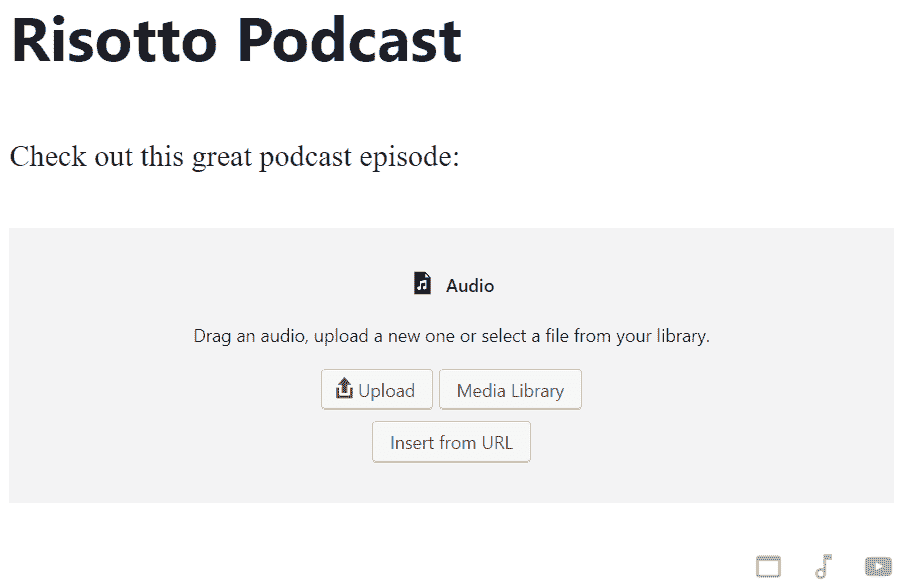

我现在需要做的就是从我的桌面选择音频文件。一旦上传完成，WordPress 就会在画布上显示一个实时音频播放器：

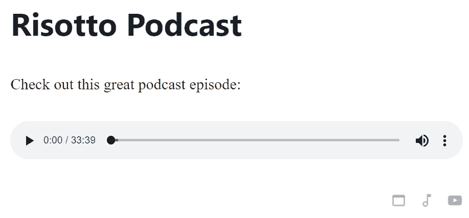

除了直接上传音频文件外，你还可以从第三方平台嵌入它们。WordPress 支持从 SoundCloud、Spotify、Rdio 和其他许多服务中嵌入。同样，要获取支持平台的全名单，请随时访问[`codex.wordpress.org/Embeds`](https://codex.wordpress.org/Embeds)。

# 有限的编辑可能性

与图片不同，WordPress 在音频和视频方面并没有给我们提供太多的编辑可能性。图像可以通过多种方式进行处理，例如旋转、裁剪和缩放。然而，在 WordPress 中处理视频却没有这样的可能性。一旦上传了视频文件或音频文件，我们就无法以任何方式修改它。我们只能将其原样显示在我们的网站上。

# 使用基于块的编辑器与代码编辑器

正如我们讨论的那样，WordPress 附带了一个新的基于块的编辑器，旨在让大多数用户更容易创建网页，即使他们没有网站管理的先验经验。然而，如果你对编码和 HTML 感到舒适，你可能还想看看 WordPress 中可用的代码编辑器。如果你想要添加使用基于块的编辑器无法实现的特殊内容或样式，这可能会特别有用。

要从视觉编辑器切换到代码编辑器，请在编辑帖子时点击屏幕右上角的三点，然后点击代码编辑器。请参考以下截图：

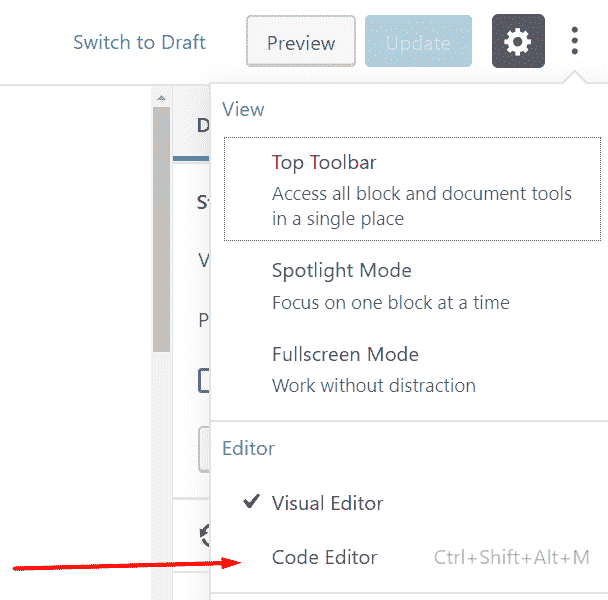

你将看到你目前正在编辑的帖子及其原始 HTML 的完整面貌。仅举一个例子，以下是这本书最初创建的帖子在代码编辑器中查看时的样子：

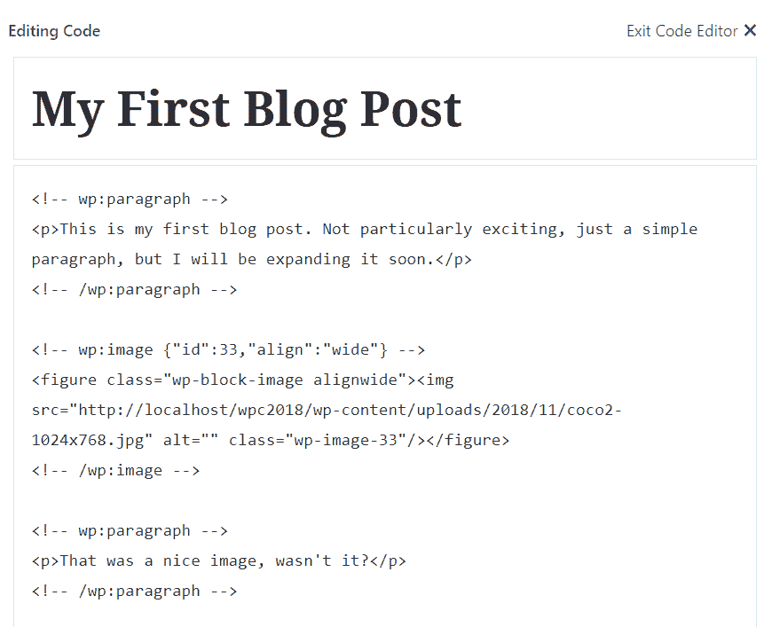

虽然这个面板允许你做任何你想做的事情，但你也需要小心不要破坏文档的 HTML 结构。因此，在你对 HTML 文档的结构有基本了解之前，可能不是进行这类修改的好主意。

# 标题和正文

WordPress 提供的许多有趣发布功能之一是帖子的标题和正文的概念。这听起来可能有些奇怪，但实际上非常简单。

当你发布一篇新帖子时，你并不一定想立即在首页上显示其全部内容。一个更用户友好的方法是只显示*标题*，然后在各自的 URL 下显示完整的帖子。

在 WordPress 中实现这一点非常简单。你只需要使用基于块的编辑器中可用的“更多”块。只需将其添加到画布上，然后将其拖放到文章顶部附近的位置——最好是第一段之后。请参考以下截图：

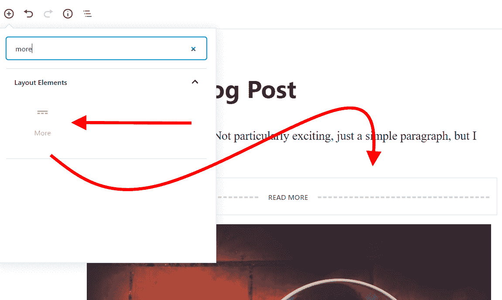

在主页面上，大多数 WordPress 主题通过展示摘要和继续阅读链接来显示这样的文章，然后整个文章（摘要和文章的其余部分）在文章的单独 URL 下显示。

# 草稿、待审文章和时间戳

在本节中，我想再介绍三个额外的项目：草稿、待审文章和时间戳。

# 草稿

WordPress 为你提供了保存文章草稿的选项。这个术语相当直白。这意味着你不必立即发布你的文章，但你仍然可以保留你的进度，并从你离开的地方继续。

如果你正在撰写一篇新文章，好消息是 WordPress 会自动保存你的进度。一般来说，如果你在编辑面板的右上角看到“已保存”徽章（见下一张截图），那么这意味着你到目前为止的所有进度都已保存：

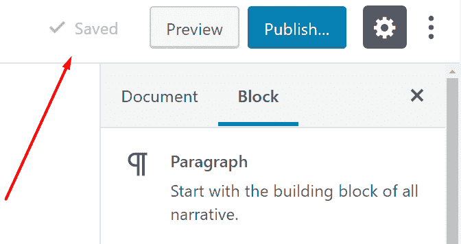

你可以安全地离开页面，不用担心任何东西会丢失。如果没有“已保存”徽章，那么将有一个标记为“保存草稿”的链接。你可以点击它来手动保存你的进度。

# 待审文章

待审文章是一个将大大有助于多作者博客用户的特性。在一个更大的出版结构中，有多个个人负责出版过程中的不同领域。作为一个优质的工具，WordPress 通过提供将文章保存为待审审核的方式，支持这样的结构。在编辑-作者关系中，如果编辑看到标记为“待审审核”的文章，他们会知道应该查看并准备发布。

在撰写文章时，切换到设置侧边栏中的“文档”标签，然后勾选“待审审核”复选框。接下来，点击预览按钮旁边的“保存为待审”链接。请参考以下截图：

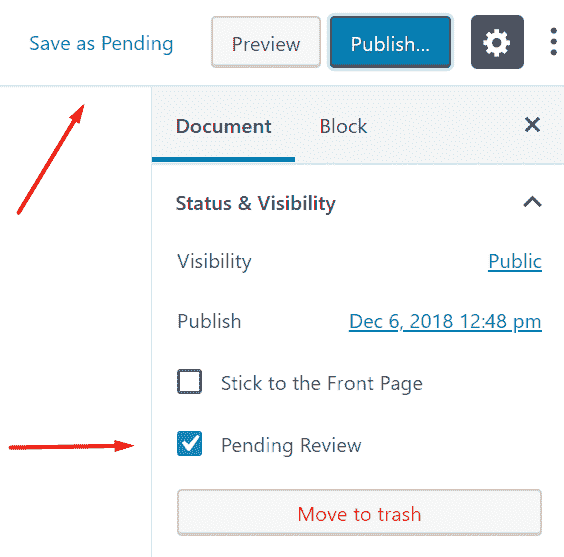

完成这些后，你将拥有一篇崭新的文章，现在正等待审核。

# 时间戳

WordPress 还允许你更改任何给定文章的时间戳。如果你今天写了一篇文章，希望它能像昨天一样发布，或者如果你提前写了一篇文章，不希望它在正确的那天显示，这会很有用。

默认情况下，时间戳将设置为当前时间。要更改它，请点击主“发布”按钮，然后在负责处理发布日期的框中进行必要的更改。请参考以下截图：

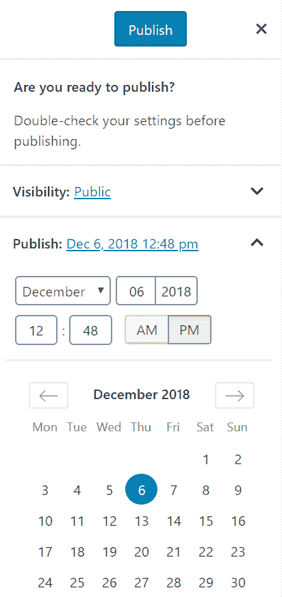

一旦您设置了想要的时间，主要的发布按钮可能会将其标签更改为“计划”（如果您正在安排在稍后日期发布文章）。点击该按钮以保存您的更改。

# 高级文章选项

到现在为止，您已经掌握了文章最常见和简单的选项，您可能想知道在撰写博客文章时还应该做的一些其他事情。我们将在本章的这一部分中涵盖所有这些内容。

# 摘要

摘要可以在您网站上的多个位置显示。它们的确切使用方式取决于您在网站上激活的主题。最常见的情况是，主题会在引言（在本章前面已描述）的位置显示文章的摘要，该引言是从文章的主体中提取的。实际上，摘要为您提供了另一种总结文章内容的方法，并使用该文本而不是从文章主体自动提取的文本。

要编辑文章的摘要，切换到设置侧边栏的文档选项卡，并滚动到摘要部分（如下面的截图所示）。在那里，您可以写一个简短的摘要，通常最好保持为一到三行的一段文字：

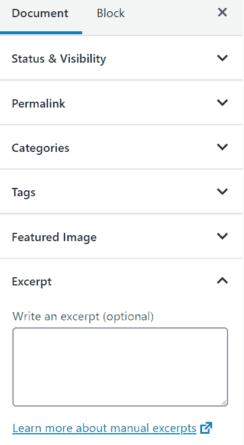

话虽如此，但值得一提的是，输入摘要是可选的。然而，建议您还是利用这个可能性。摘要可以显著提高您网站的阅读性，并使读者更容易理解您的内容——前提是您当前的主题以某种方式使用了摘要。在某些情况下，摘要还可以为您的网站带来额外的 SEO 优势——前提是您的主题在谷歌和其他搜索引擎可以看到的地方显示了它们。

# 讨论

在设置侧边栏的文档选项卡中，您还可以找到一个有用的部分，即“讨论”。这是您可以设置如何处理您正在工作的文章的社区互动的地方。

可用的复选框有两个：一个用于允许评论，另一个用于跟踪回调和 pingback。这两个复选框可能默认都是勾选的。如果您想关闭文章的评论或跟踪回调和 pingback，您必须取消勾选它们：

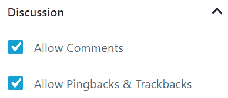

如果您取消勾选“允许评论”框，访客将无法对那个特定的博客文章进行评论。如果您取消勾选“允许 pingback & trackback”框，会发生一些更复杂的事情，您不会立即看到其效果。如果该框未勾选，当其他人从他们的网站上提及并链接到您的博客文章时，您的博客不会识别这一事实。如果该框保持勾选，其他人的 pingback（提及）将与其他评论一起显示在您的文章下方。

如果您想默认不勾选这两个框中的任何一个或两个，请转到设置，然后从 WordPress 仪表板的左侧主侧边栏中选择“讨论”。您可以取消勾选标记为“允许来自其他博客的链接通知（pingback 和 trackback）”的新文章，或者允许人们在新文章上发表评论的框。

最初，跟踪回和 pingback 功能是为了提供一种与其它网站沟通的方式——让他们知道您已经发布了一篇提及他们的帖子，或者反过来，以某种方式（通常是通过链接）进行。然而，如今，跟踪回和 pingback 正变得有些过时，大多数博客作者甚至懒得检查他们收到的跟踪回/ pingback。就其价值而言，您可能可以安全地完全忽略跟踪回和 pingback。是否在您的网站上支持它们完全取决于您自己。

如果您想了解更多关于跟踪回和 pingback 的信息，您可以访问[`codex.wordpress.org/Introduction_to_Blogging#Trackbacks`](https://codex.wordpress.org/Introduction_to_Blogging#Trackbacks)和[`codex.wordpress.org/Introduction_to_Blogging#Pingbacks`](https://codex.wordpress.org/Introduction_to_Blogging#Pingbacks)。

# 使用帖子修订版本

除了许多内容格式化功能外，WordPress 还允许对您的帖子进行一些基本的版本控制。这意味着 WordPress 保存了您所有帖子的每一个子版本。或者用简单的话说，每次您按下更新按钮时，WordPress 不会覆盖帖子的上一个版本，而是创建一个全新的版本，并将旧版本安全地存储在数据库中。

虽然这个功能一开始看起来并不是最有用的一个，但实际上对于由多个人管理内容的网站来说非常重要。在这种情况下，很容易将帖子的最新版本混淆，所以总是有回到之前版本的可能性是很好的。

再次强调，我们将通过查看设置侧边栏的文档标签来查找修订版本。那里有一个名为“修订”的部分，以及一个与您当前编辑的帖子实际修订版本数量相对应的数字：

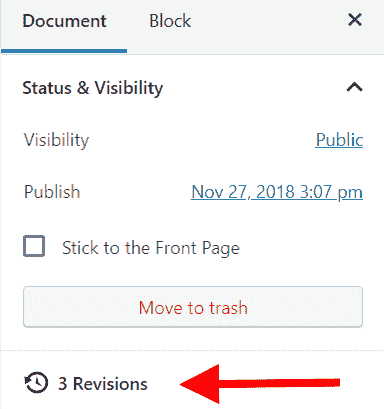

如果您点击这个标签，您将被带到一页，您可以比较单个修订版本，然后从现在开始恢复您想要工作的那个版本。界面提供了一个主要的滑块，可以用来选择帖子的单个修订版本。这可以在以下屏幕截图中看到：

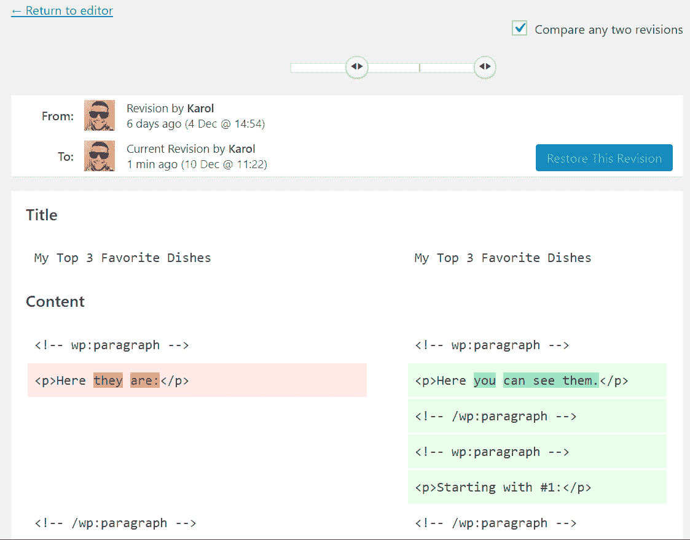

修订功能有两个主要版本：

+   第一种情况是当“比较任何两个修订版本”的框未勾选时，它允许您比较当前选中的修订版本（在滑块上）和直接 preceding 它的修订版本。

+   第二种情况是勾选了比较任何两个修订版框。在这种情况下，您可以单独选择您想要比较的修订版，这实际上允许您像框中建议的那样比较任何两个修订版。左侧的修订版总是*上一个*修订版，而右侧的是下一个或*当前*修订版（如前一张截图所示）。每个建立差异的段落将以红色和绿色突出显示，每个单独的差异都将有额外的突出显示。点击“恢复此修订版”按钮将恢复右侧的修订版，您将自动返回到帖子编辑屏幕。

如果您认为修订版对您的网站没有任何特别的作用，那么您可以选择简单地忽略修订版框。当您正常处理内容时，不必担心修订版，WordPress 默认会显示您帖子的最新版本。

# 更改帖子的作者

这是在 WordPress 中一个非常基本但有用的功能。WordPress 中的每个帖子和页面都有一个作者，这本身就很明显。然而，如果您愿意，您可以更改任何给定条目的指定作者。为了做到这一点，请查看设置侧边栏的文档标签页，并找到作者标签。旁边有一个下拉菜单，列出了您网站上每个用户账户。只需选择一个新作者，然后点击主更新按钮以保存更改：

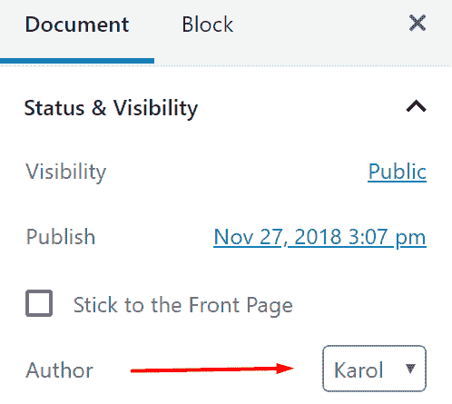

注意：如果您网站上只有一个用户，那么该框甚至不会可见。

# 保护内容

WordPress 允许您隐藏帖子。您可以通过标记为私有来隐藏帖子，这样除了您自己之外，其他人看不到（尽管管理员和编辑的用户角色仍然可以看到），或者您可以通过标记为密码保护来隐藏它，这样除了与您共享密码的人之外，其他人看不到。

要实现这一点，请查看设置侧边栏的文档标签页，并找到可见性标签。旁边有一个链接，上面写着公共。一旦您点击它，您将看到可用的选项：

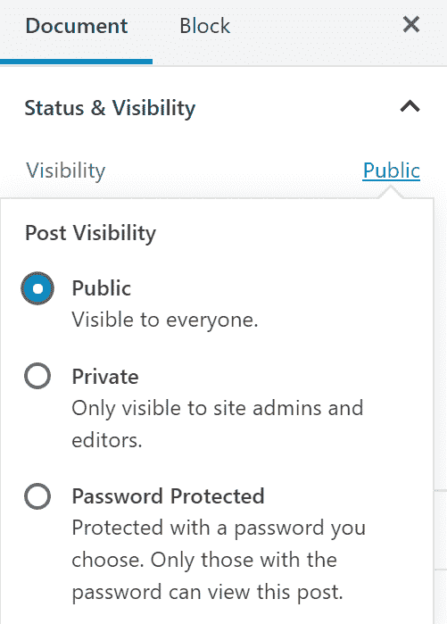

如果您点击“私有”单选按钮，该帖子将不会在博客上显示，除非由具有管理员或编辑角色的某人查看。如果您点击“密码保护”单选按钮，您将看到一个可以输入密码的框。您的博客访客将看到帖子标题以及一个提示，说明他们必须输入密码才能阅读帖子的其余部分。

# 美观的永久链接

我们已经在第二章*WordPress 入门*中讨论了调整您网站的永久链接设置。现在是时候扩展这一知识，并讨论一下所谓的*帖子永久链接*或*短网址*。

关于什么是“文章别名”的最准确定义之一来自 WordPress Codex 本身。在[`codex.wordpress.org/Glossary#Post_Slug`](https://codex.wordpress.org/Glossary#Post_Slug)提供的资源中，我们了解到文章别名是由几个由破折号分隔的小写单词组成，描述了一篇文章，通常是从文章标题中提取出来以创建一个用户友好的永久链接。

换句话说，文章别名就是位于文章 URL 中的域名之后的部分。例如，我关于我最喜欢的三个菜品的文章使用了这个 URL：`http://localhost/my-top-3-favorite-dishes/`，其中最后一部分——`my-top-3-favorite-dishes`就是别名。正如官方定义所说，WordPress 通过将我的文章标题全部转换为小写，删除所有标点符号，并用破折号替换空格来选择别名。如果我希望它变成其他什么样子，比如`3-favorite-dishes`，我可以通过访问设置侧边栏的文档标签并查找标记为“永久链接”的部分来更改它：

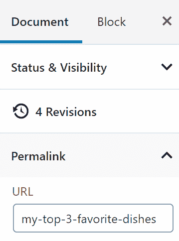

可读的 URL 是谷歌搜索引擎所喜爱的，因此使用它们有助于为搜索引擎优化你的网站。这也有助于用户在点击 URL 之前了解文章的内容。

# 博客上的讨论 – 评论

评论是大多数博客的重要元素。虽然只有你和你的作者可以为你的博客写新文章，但你的访客可以在那些文章下添加评论。这可以在博客中培养一种社区感，让人们可以对你的写作给出反馈，并为你的访客提供帮助或与其他访客交谈的方式。

# 添加评论

如果你查看你博客的首页，你会注意到每个文章都有一个写着“留下评论”的链接（前提是你没有完全禁用评论）。点击这个链接会带你到文章页面的底部，这是添加评论的地方。

如果你已登录 WordPress 仪表板，你会看到你的名字和一个可以写评论的空间。如果你没有登录，你会看到一个任何其他访客都会看到的评论表单。这个表单包括填写姓名、电子邮件、网站和当然，一个用于评论本身的大框：

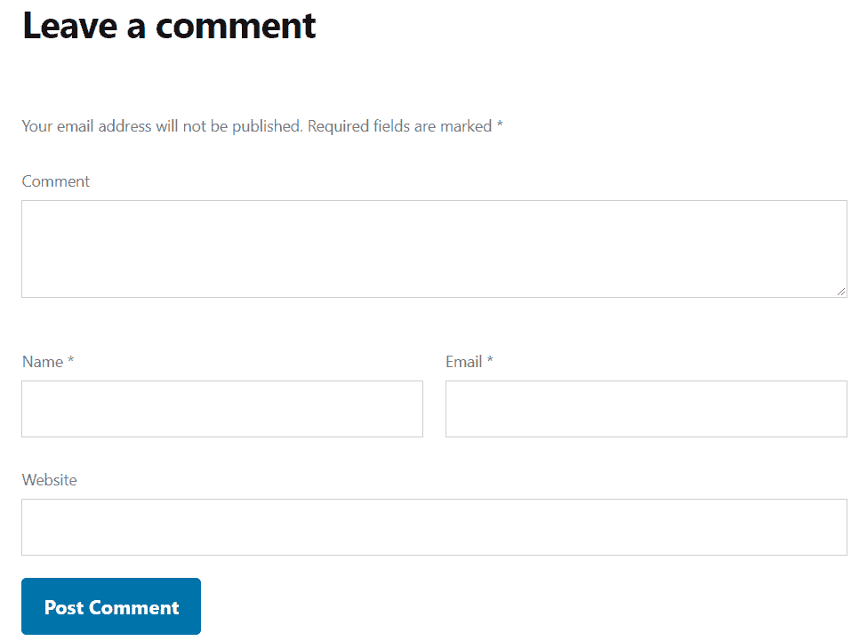

一旦你输入了所需的信息并点击“发表评论”按钮，评论就会被输入到 WordPress 数据库中。它何时出现在网站上取决于你的讨论设置。

# 讨论设置

在前面的截图上，请注意，名称*和电子邮件*字段都被标记为必填(*)。作为博客/网站的拥有者，你可以更改评论的要求。这可以在你访问 WordPress 仪表板中的设置 | 讨论时完成。

# 提交、通知和审核设置

让我们专注于“设置 | 讨论”页面上的复选框，这些复选框与提交、通知和审核相关。在此页面上勾选的框将决定评论在博客上发布之前需要经过多少审核和检查。

首先，让我们看看在“评论出现之前”可见的与审核相关的设置。这两个选项与允许评论出现在网站上的条件有关：

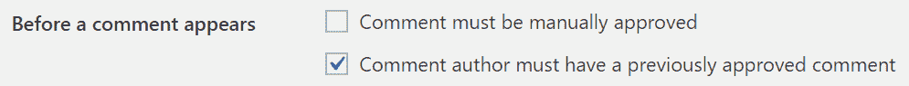

+   必须手动批准评论：如果勾选此框，则每个评论在出现在网站上之前都必须由您手动批准。

+   评论作者必须有一个之前批准的评论：如果您取消勾选上面的框，但勾选这个框，那么您已经稍微放宽了设置。这意味着如果评论者之前发表过评论并且其评论已被批准，那么该评论者的未来评论就不需要您验证——它们将立即出现在网站上。该评论者只需输入之前批准评论中相同的姓名和电子邮件即可。

接下来，让我们看看在“其他评论设置”下可见的评论提交设置：

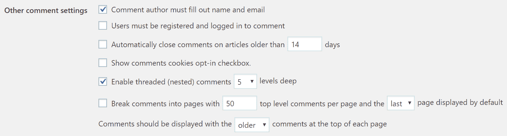

前两个选项控制用户在能够输入评论之前必须做什么：

+   评论作者必须填写姓名和电子邮件：如果您保留此勾选，那么任何尝试留下任一字段为空的评论者都会遇到错误。这并不增加很大的安全性，因为机器人知道如何填写姓名和电子邮件，而且任何人都可以在那里填写虚假信息。然而，如果长时间讨论发展起来，这有助于博客读者追踪谁是谁，并且可以稍微阻止冲动评论。此外，拥有 Gravatar 账户的访客很乐意提供他们的电子邮件地址。这是因为使用与 Gravatar 关联的电子邮件地址将导致他们的个人资料图片（头像）与评论一起显示，使其在所有其他评论中显得更加个性化和显眼。

+   用户必须注册并登录才能发表评论：大多数博客作者不会勾选此框，因为这意味着只有注册博客的访客才能发表评论。大多数博客作者不希望有随机的人注册，而且大多数访客也不希望被迫在您的博客上注册。如果您勾选此框，您可能根本收不到任何评论。或者，如果您正在为某个封闭的社区设置博客，这个设置可能是有用的。

+   自动关闭 X 天前的文章评论：在这里，您可以设置任何数量的天数，在此之后您的内容上的评论将被关闭。尽管这个功能一开始可能看起来不是一个有用的功能，但它实际上对各种类型的新闻网站或其他在线出版物来说可能非常有价值，在这些网站上，允许对旧事件的评论几乎没有意义。

+   显示评论 cookies 同意复选框：当选中时，用户将在评论表单下方看到另一个复选框，上面写着：“下次评论时，在此浏览器中保存我的姓名、电子邮件和网站。”

+   启用嵌套评论 X 层深：此选项默认启用，这是使您的网站更具可读性和用户友好性的另一种方式。有时，评论者希望能够对其他人的评论做出回应，仅仅作为持续讨论的一部分。这就是允许他们这样做的功能。此外，它还为您，作为作者，提供了一个与观众互动的绝佳方式，通过直接回复他们的每一条评论。

+   将评论分成页面 [...]: 如果您每篇文章的评论超过 200 条，这个功能对您才有价值。所以您可以放心地不选中它。

最后，让我们看看与通知有关的设置。这两个选项位于“随时通过电子邮件通知我”标题下。这些选项与收到有关评论活动的电子邮件通知的情况有关：

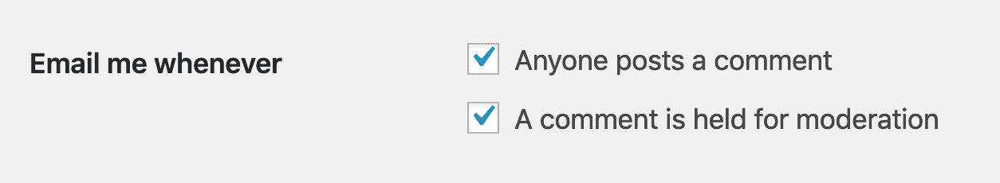

+   任何人发表评论：这通常是一个需要保留的设置。无论是否需要审核，每当有人发表评论时，您都会收到电子邮件。这将使您更容易跟踪博客上的讨论，并意识到需要快速删除的未经审核的评论。

+   评论被保留以供审核：如果您对跟踪您博客上的每一条评论不感兴趣，您可以取消选中“任何人发表评论”复选框，并只保留此复选框选中。您只会收到关于看起来合法但需要审核和/或您批准的评论的电子邮件。

# 何时审核或黑名单评论

如果您将页面向下滚动一点，您将看到评论审核区域：

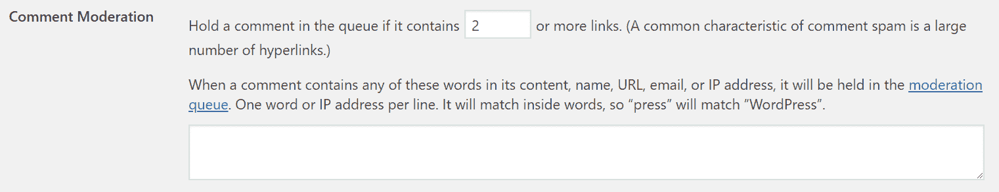

这是页面顶部审核设置的扩展。请注意，如果您已选中“评论必须手动审核”复选框，您可以安全地忽略此评论审核框。否则，您可以使用此框帮助 WordPress 确定哪些评论可能没问题，哪些可能是垃圾邮件或不适合您的博客。您可以让 WordPress 怀疑一个评论，如果它包含超过一定数量的链接，因为垃圾邮件评论通常只是一串 URL。

较大的框用于您输入可疑词汇和 IP 地址：

+   在这里，您可以输入常见于垃圾邮件中的单词（您可以通过查看垃圾邮件来找出这些单词），或者只是一般的不雅词汇。

+   这些 IP 地址将包括过去那些发表不当评论或添加实际垃圾邮件的人的评论。每当 WordPress 收到您博客上的评论时，它会为您捕获 IP 地址，这样您就可以随时使用它们。

再向下滚动一点，您会看到“评论黑名单”框：

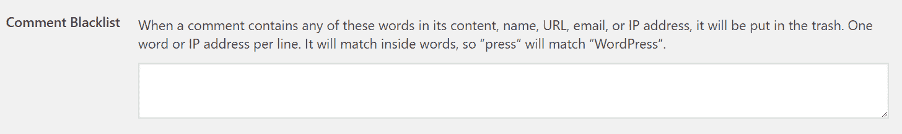

与我们刚才看到的“评论审核”框不同，后者告诉 WordPress 如何识别可疑评论，而“评论黑名单”框告诉 WordPress 如何识别几乎肯定是不好的评论。这些评论不会被添加到审核队列中，您也不会收到关于它们的电子邮件；它们会被立即标记为垃圾邮件。

# 头像显示设置

页面上的最后一个部分被标记为“头像”。正如我在第二章“WordPress 入门”中提到的，头像是一个代表个人形象的图片。WordPress 中的头像通过 Gravatar 提供，这是一个可在[`gravatar.com/`](https://gravatar.com/)找到的服务，它允许您创建个人在线资料，该资料将在整个网络上的其他网站上一致使用。默认情况下，如果勾选了“头像显示”框，头像就会出现在您的博客上，这个框位于讨论设置页面的底部附近。

第二个框“最大评分”会告诉 WordPress 何时不应显示被评为过于露骨的头像。还记得我们上传新图片到 Gravatar 时设置的评分吗？这里的设置就是您可以选择在网站上允许哪些图片的地方（建议选择 G 级评分）。

第三个框“默认头像”告诉 WordPress 为没有携带自己图像的访客使用哪个头像。

# 审核评论

现在我们已经彻底探讨了需要审核的评论设置，让我们来讨论一下您实际上需要做什么来审核评论。*审核*意味着您会查看处于悬而未决状态的评论，并决定它是否足够有洞察力，可以在您的博客上发布。如果评论好，它就会出现在您网站的首页上；如果不好，它会被标记为垃圾邮件，或者被删除，除了您和撰写评论的人之外，没有人会看到。

要查看等待审核的评论，请从 WordPress 仪表板的侧边栏导航到“评论”。如果您有任何等待审核的评论，主菜单中会有一个小数字告诉您有多少评论等待审核：

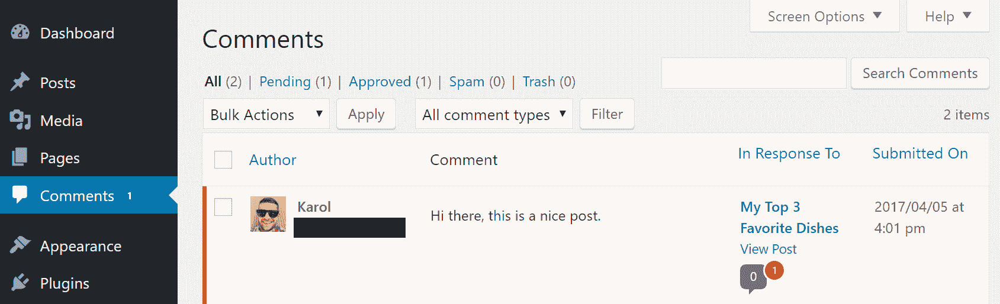

这个主要的评论页面功能齐全，就像帖子页面一样。对于每条评论，您从左到右可以看到以下信息：

+   评论者头像、姓名、网站地址（如果有提供）、电子邮件地址（如果有提供）和 IP 地址

+   评论文本，以及用于批准它的链接，以便它在网站上显示（当你在评论上悬停鼠标时，这些链接会出现）；你也可以将其标记为垃圾邮件、删除它、编辑它、快速编辑它或回复它

+   评论提交的时间和日期

+   发表评论的帖子的标题（这也是编辑该帖子的链接），括号中的数字表示该帖子已有多少条已批准的评论（这也是一个链接，可以过滤评论列表，只显示该帖子的评论），以及指向该帖子的链接（标记为查看帖子）

等待审核的评论具有红色背景，就像前面截图中的第一个评论一样。

你可以点击任何评论下的快速编辑链接来打开其快速访问选项。这将允许你编辑评论的文本和评论者的姓名、电子邮件和 URL。

你可以使用顶部的链接——所有、待审、批准、垃圾邮件和回收站，根据这些状态过滤列表。你还可以使用所有评论类型下拉筛选菜单过滤 ping 或评论。你可以选择一个或多个评论，在列表顶部和底部的批量操作菜单中应用任何可用的批量操作。

另一种快速访问此页面或对评论执行操作的方法是使用 WordPress 在评论被保留以供审核时发送给你的电子邮件中的链接（前提是你已在设置 | 讨论面板中选择了该选项）。

此外，这个列表显示了所有需要审核的 pingback。从博客主的角度来看，pingback 看起来就像任何其他评论一样，这意味着你可以编辑它们，将它们标记为垃圾邮件，或者像处理标准评论那样删除它们。

# 添加和管理分类

在本章的早期，你学习了如何在添加帖子时快速添加分类。现在，让我们谈谈如何以更大的方式管理你的分类。首先，导航到帖子 | 分类。你会看到分类页面，如下所示：

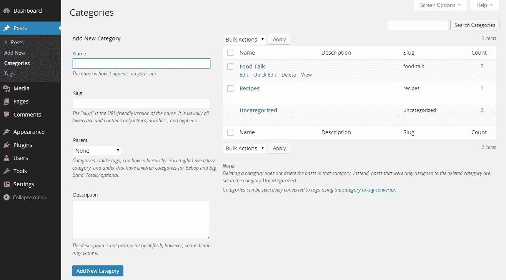

这是一个有用的页面，它结合了添加、编辑和审查所有分类的能力。正如你所看到的，当你撰写博客文章时添加的任何分类都会在这里列出。你可以通过点击列表中的相应链接来编辑、快速编辑或删除任何分类。

如果你在这个页面上添加一个分类，你还可以选择它的别名。别名是显示在你网站 URL 中的简短文本。如果你没有选择别名，WordPress 会为你创建一个，通过将分类名称转换为全部小写，用短横线替换空格，并删除任何其他标点符号（类似于对帖子别名的处理）。

你还可以在这个页面上做的一件事是为任何分类选择一个父分类。一些主题支持以层次结构显示分类，但并非所有主题都支持。在一个优秀的现代主题中，如果你为分类创建一个自定义菜单，所有子分类都将显示为子菜单。

能够创建分类层次结构实际上是区分分类和标签的主要技术特点。除此之外，这两个分类体系在结构上相当相似，尽管它们仍然有不同的用途。

# 摘要

在本章中，你学习了添加和管理博客内容所需的所有知识。你了解了帖子、分类和评论。你发现了标签和摘录。你还学习了添加和编辑图片、处理视频和音频内容、使用新的区块编辑器、更改时间戳、自定义摘录以及不同的发布方式。

你对博客内容的控制已经完整，你已准备好让你的博客焕发活力！

在下一章中，你将学习如何使用 WordPress 管理所有其他类型的内容。
