# 页面、媒体和导入/导出内容

到目前为止，您已经完全控制了您网站上的博客部分。然而，您可能已经注意到 WordPress 提供了比仅仅帖子、评论、标签和分类多得多的功能。

在本章中，我们将探索并学习如何控制 WordPress 允许您使用的所有其他类型的内容。您将能够创建不属于您持续博客的静态页面，向您的帖子添加各种类型的媒体，并创建吸引人的图片库来展示照片和其他图像。

本章将涵盖以下主题：

+   创建和管理您的页面

+   浏览您的媒体库

+   导入/导出内容

# 页面

初看之下，页面看起来与帖子非常相似。页面和帖子都有一个标题和一个内容区域，我们可以在这里写入扩展文本，添加图片等。然而，页面与帖子的处理方式截然不同。首先，页面没有分类或标签（页面不需要分类，因为在大多数网站上，页面的数量远少于帖子）。此外，帖子属于您的博客，旨在成为围绕特定主题的持续、扩展发布的组成部分。帖子会定期添加，而页面则更加静态，通常不会期望有太多变化。

简而言之，我建议您将页面视为静态内容的片段，将帖子视为一系列按时间顺序发布的文章。换句话说，页面旨在包含无论何时阅读都同样更新的内容。例如，人们通过 WordPress 页面发布的内容通常是关于他们公司或业务、团队以及其他相关且永恒的细节的详细信息。帖子通常非常具有时效性，并呈现今天/现在重要的建议/新闻。对于大多数博客来说，帖子是内容的基础，占整个内容目录的 90%以上。

当您首次安装 WordPress 时，会自动为您创建一个页面（连同第一个帖子第一个评论）。您可以通过访问`http://YOURSITE.com/sample-page/`来查看该页面。

# 添加页面

要添加新页面，请访问您的`wp-admin`并导航到页面 | 添加新页面，或者通过点击顶部菜单中的“新建”然后选择“页面”使用下拉菜单。这将带您到基于块的编辑器。正如您将注意到的，这与我们处理博客帖子时使用的编辑器相同。块编辑器非常通用，WordPress 将其用于帖子页面。

创建新页面所需的最少操作是输入标题和一些内容。然后，点击蓝色“发布”按钮，就像您为帖子做的那样。您的新页面将可在其唯一的 URL 下访问。

您将在基于块的编辑器的设置侧边栏中认出大部分部分。它们对页面和帖子的工作方式相同。让我们谈谈一个新部分——称为“页面属性”的部分，它包括父页面和顺序等元素：

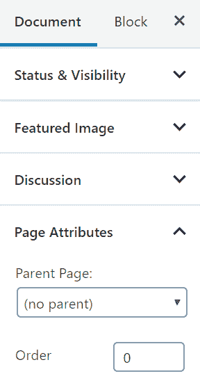

# 父级

WordPress 允许您以分层结构组织您的页面。这样，您可以把所有内容组织成*主页面*和*子页面*，如果您网站上页面的数量较多，这很有用。例如，如果我要和另外三位作者一起写博客，我们每个人都会在网站上有一个关于我们的页面，但那些将是主*关于*页面的子页面。如果我添加其中一个页面，我会首先创建一个新的*关于*页面（主页面），然后创建一个仅为我自己的页面，称为*关于 Karol*，最后选择那个主*关于*页面作为新页面的父页面。

# 顺序

默认情况下，您创建的所有页面将按页面标题的字母顺序排列。如果您想按其他顺序排列，可以在每个页面的“顺序”框中输入数字来指定。编号较低的页面（例如，0）将排在编号较高的页面（例如，5）之前。您可以通过编辑一些页面并给它们分配不同的数字来轻松测试这一点。

诚然，这不是一个很清晰的重新排列页面的方法，尤其是如果您想将它们显示在菜单中。您可以通过直接操作菜单（如第八章所述，*自定义您的网站外观/设计*）来更容易地做到这一点。最后，我建议您根本不要麻烦自己设置顺序属性。

# 管理页面

要在`wp-admin`中查看网站上所有页面的列表，请从主菜单导航到“页面”。您将看到以下截图所示的内容：

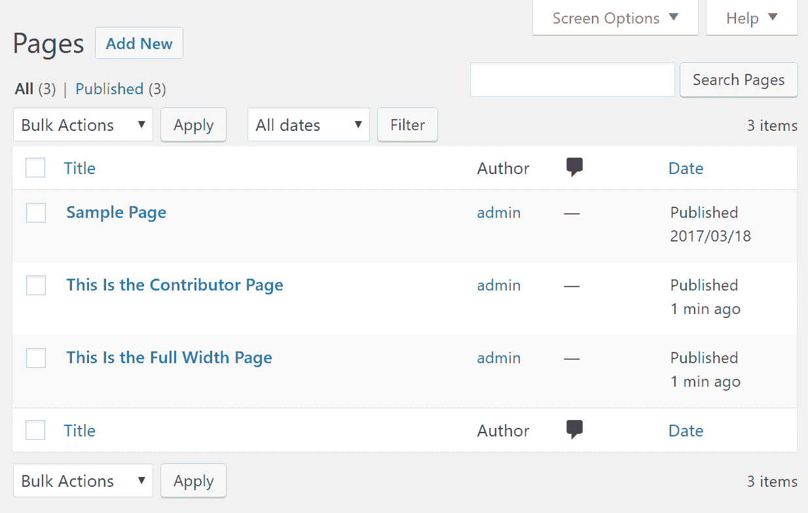

到现在为止，这种列表格式应该开始变得熟悉了。您有您的页面列表，并且在每个行中，都有一些有用的链接，允许您编辑、快速编辑、删除或查看页面。您可以通过点击作者的名字来按该作者过滤列表。您可以使用顶部两个链接，全部和已发布，来按状态过滤页面（如果您有保存为草稿或待审阅的页面，它们也将出现在这里）。还有通过位于页面列表上方的下拉菜单按日期过滤。此外，您还可以通过列表顶部和底部的批量操作菜单检查某些框并批量编辑页面。最后，您可以通过顶部的搜索框搜索您的页面。

# 设置主页

在你可以在网站上创建的所有页面中，有一个页面非常特别。那就是*首页*，也称为*主页*。简单来说，首页就是访客访问你的主要网站地址时看到的页面——通常像`YOURSITE.com`这样的东西。

默认情况下，WordPress 会在首页上显示你最近发布的博客文章列表——按时间顺序倒序排列。虽然对于某些类型的网站来说，在首页上显示最新的博客文章是可以的，但并不是对所有人来说都是最佳选择。通常，你最好探索一下设置一个完全定制的首页，并手动选择你想要显示的内容。

从现在开始，我们将假设你正在使用默认的 WordPress 主题——Twenty Nineteen。如果你使用的是不同的主题，本章本节中描述的过程的部分可能有所不同。

# 创建一个占位符首页

我们需要做的第一件事可能看起来有些不合常理，但很快就会明白。让我们先创建两个空白页面。你可以用正常的方式来做这件事；只需前往“页面”|“添加新页面”：

+   将第一个页面的标题命名为“首页”，保存并发布它。现在不要添加任何其他内容，只需标题即可。

+   将第二个页面的标题命名为“博客”；也保存并发布它。

# 启用自定义首页

我们需要指示 WordPress 在确定你的首页内容时开始使用这两个页面。

前往设置 | 阅读设置。一旦进入，将页面上的第一个设置从“你的最新文章”切换到“一个静态页面”。从下拉菜单中，将你的新页面“首页”指定为“主页”，将页面“博客”指定为“文章页面”，如下所示：

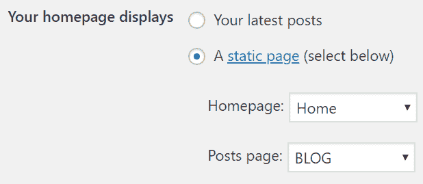

点击“保存更改”。

有了这个，你新创建的一个页面——首页——已经成为了你整个网站的首页。然而，目前那里没有什么内容，因为页面是空的。

另一个页面——“博客”——被分配了列出你的最新博客文章的任务，按时间顺序倒序排列。换句话说，博客页面现在做了之前默认首页所做的工作。如果你访问`YOURSITE.com/blog`，你可以看到博客页面。

# 定制你的首页

一个空白的首页肯定不是你想要的，所以让我们稍微定制一下：

1.  前往“页面”并点击“首页”页面开始编辑。首先给页面起一个标题——当访客到达你的网站时，你希望他们首先看到的内容。我不会在这里发挥创意，只是简单地输入“欢迎来到我的网站！”

1.  接下来，添加你认为应该在首页上出现的内容。如果你正在建立一个商业网站，你可能需要提及你的业务做什么以及它如何服务客户。再次强调，我不会在这里发挥创意，只是简单地添加几句话。到目前为止，我有的内容如下：

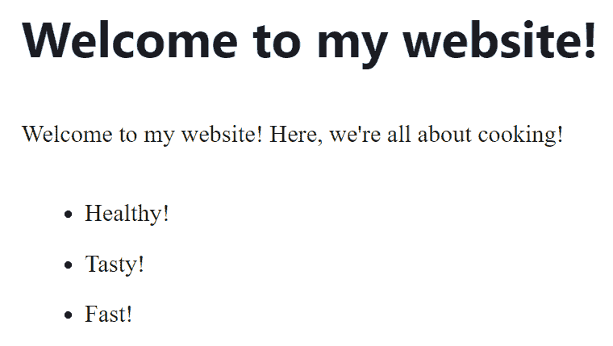

1.  在下一步中，让我们展示一些博客上最新的帖子，这样人们就可以了解他们可以从你这里期待什么样的内容。首先，你可以输入一条简单的邀请人们查看你最新帖子的信息。

1.  之后，让我们添加一个我们尚未使用过的新的块。这个块叫做最新帖子，你可以在小部件部分找到它。请参考以下截图：

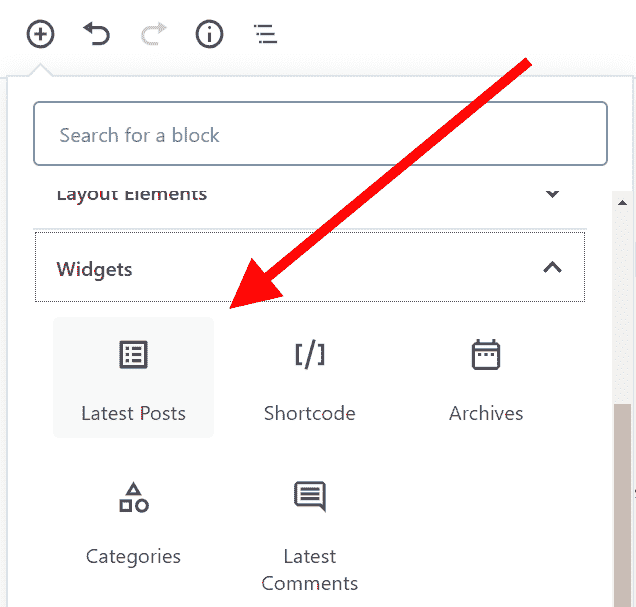

1.  一旦添加此块，它将自动填充你最新的博客帖子。我将稍微自定义该块。首先，我会通过点击以下按钮将视图从*列表*更改为*网格*：

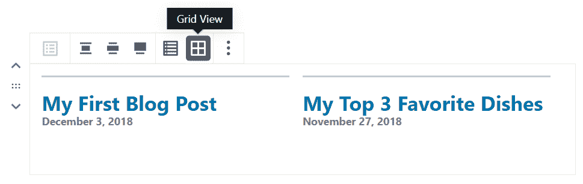

1.  接下来，我将通过设置侧边栏调整一些其他设置，如下所示：

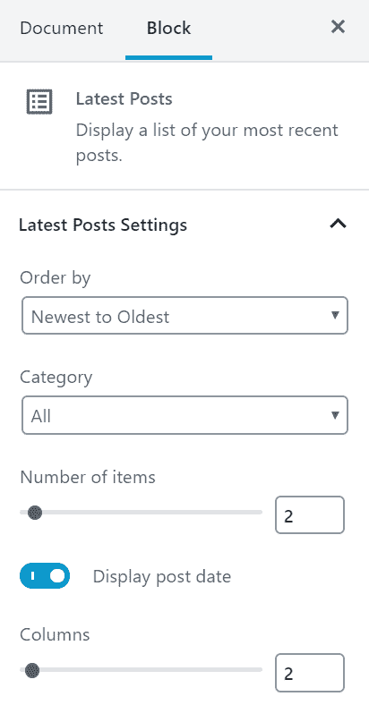

我所做的更改如下：

+   列数：设置为 2

+   项目数量：设置为 2

+   显示帖子日期：设置为是

如你所见，这些设置相当直观，所以你可以根据你特定的网站需求进行调整。

当我此时点击预览按钮，我会在页面上看到我的两篇最新帖子并排显示：

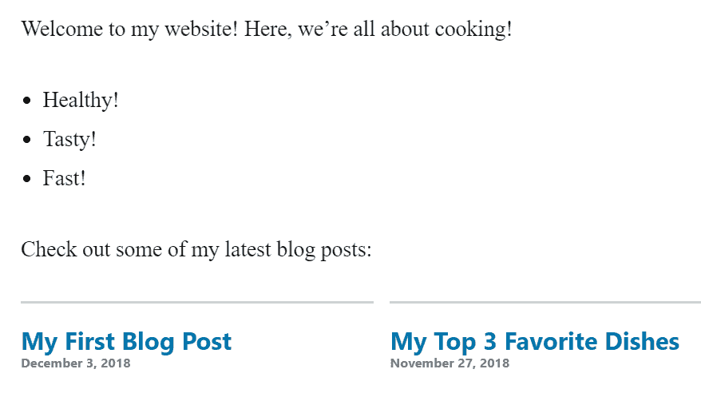

最后，让我们为首页设置一个特色图片。这张图片将在整个网站的页眉部分显示，所以最好选择一个能让你引以为豪的代表性图片。

为特色图片分配操作与博客帖子相同。

1.  从设置侧边栏切换到文档选项卡，然后向下滚动到标有特色图片的章节。选择你想要设置的图片，并保存设置。完成后，你将看到你的图片已被分配：

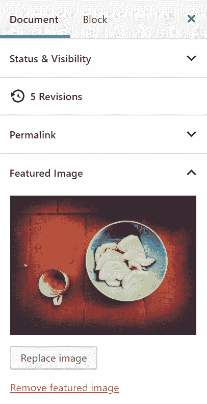

在这个阶段，我们已经完成了自定义首页的工作。当然，首页可以包含更多内容，这完全取决于你想要首页代表什么。这就是 WordPress 的全部魔力——你不必满足于现状，而是可以打造一个真正属于你自己的网站。

1.  要查看你当前首页的全貌，只需导航到你的主要网站地址。这是我首页上的内容：

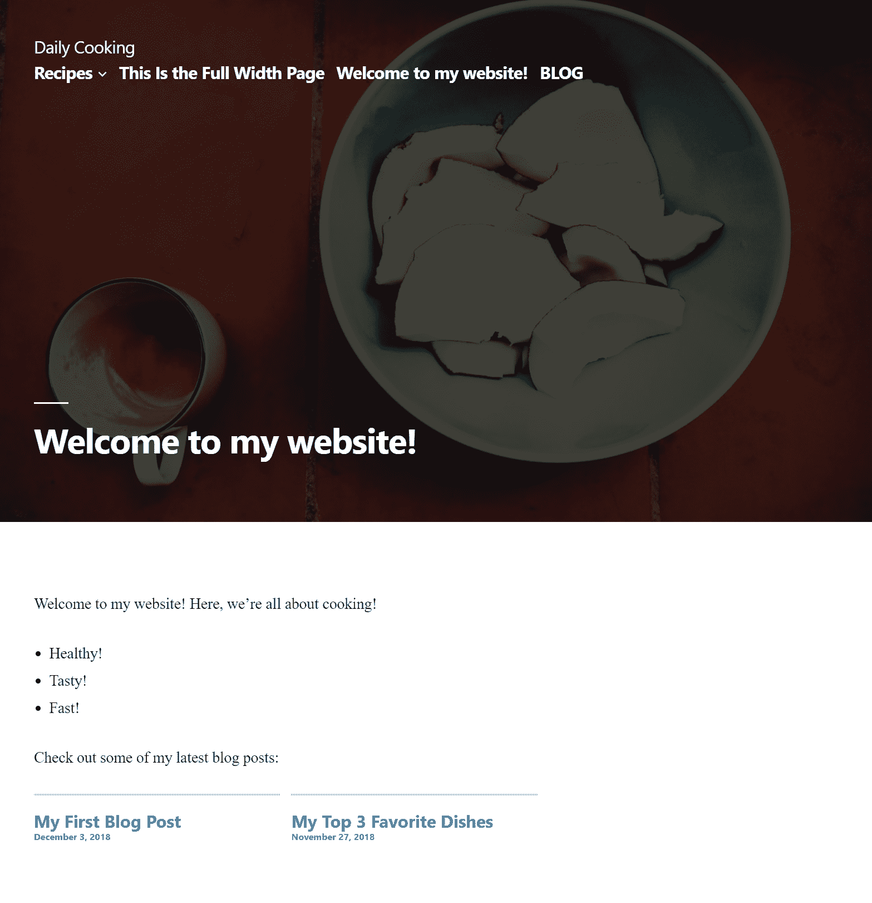

# 媒体库

媒体库是 WordPress 存储所有上传文件的地方，例如图片、PDF 文件、音乐和视频。要查看你的媒体库，请导航到主菜单中的媒体（目前可能没有很多媒体）：

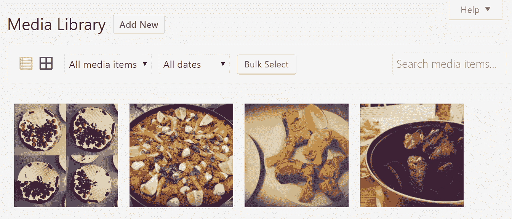

您现在看到的是一个漂亮的网格布局，使得浏览媒体变得非常用户友好。我的媒体库目前有四张照片。一旦我点击其中任何一张，我就会看到我们之前在第三章*创建博客内容*中讨论的附件详情屏幕。在这个屏幕上，有许多选项可以修改所选的文件。

我们可以编辑细节，例如标题、说明、替代文本和描述，还可以永久删除文件或在前端查看它：

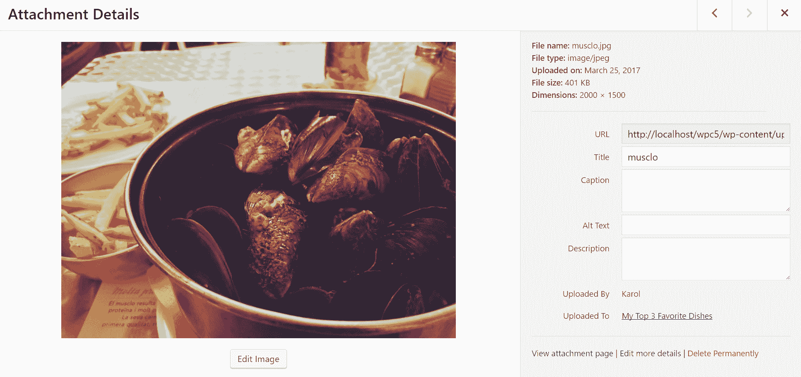

您还可以将新文件添加到媒体库中。转到媒体 | 添加新文件以访问一个页面，类似于上传文件时获得的上传媒体页面。当您点击“选择文件”按钮并选择要上传的文件，或直接从桌面拖放它时，WordPress 会上传文件，然后将其与其他媒体文件一起显示在库中。此时，您的新的项目将未与任何帖子或页面关联。

要将其包含在某个地方（帖子或页面中），请转到帖子或页面，并编辑其中一个帖子/页面。点击左上角的+按钮，并选择图片块。现在，您不需要上传新文件，只需从媒体库中选择它。我们已经在上一章中更详细地介绍了整个过程：

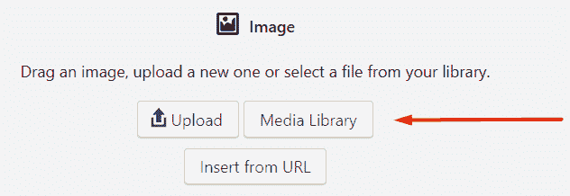

# 创建图片画廊

WordPress 不仅允许您将单个图片添加到您的帖子或页面中，还允许您创建由多张图片组成的精美画廊。以下是创建新的图片画廊并在帖子或页面中显示它的步骤：

# 选择帖子或页面

您可以为任何新页面或现有页面或帖子添加一个画廊（或多个画廊）。例如，我选择了我的一篇现有帖子，您可以在下面的屏幕截图中看到：

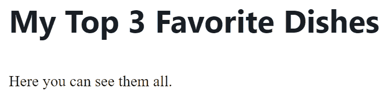

将画廊添加到这篇帖子的第一步是在页面的左上角点击+按钮，并选择画廊块：

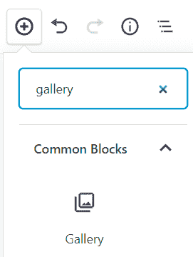

# 将图片添加到画廊

这个新的画廊块看起来与标准的图片块非常相似，并提供了几个主要选项：

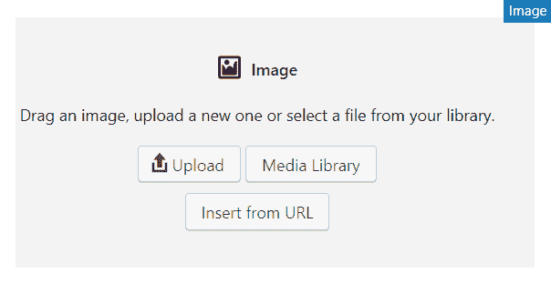

此外，除了上传图片或从媒体库中选择图片之外，您还可以直接从您的桌面拖放多个图片。WordPress 会立即开始将它们转换成画廊。对于这个例子，如果您想从媒体库中选择图片，只需点击“媒体库”按钮。您会看到一个您此时应该很熟悉的面板。在那里，只需点击您想要包含在画廊中的图片。例如，我已选择了三张图片（见右上角的小方框）：

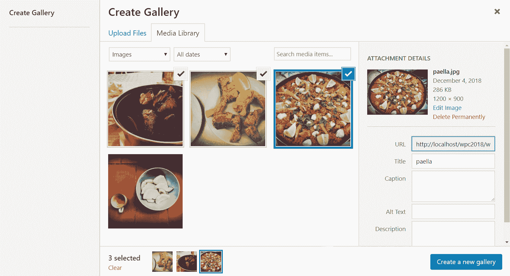

在这个阶段，如果你想调整图片的标题和描述，可以点击创建新相册按钮。在下一步中，你可以通过拖动图片到显示区域来重新排列你的图片。你还可以调整标题（标题将被保存，以便在稍后使用相同图片创建相册时重用）。完成之后，只需点击插入相册按钮：

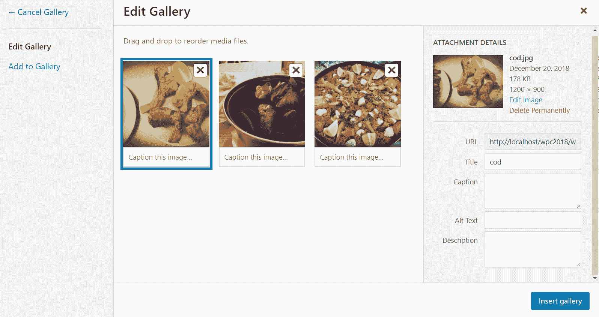

您将在您的帖子画布上直接看到相册的预览。通过点击相册块，您还可以看到一些额外的选项。例如，您可以更改相册中的列数，设置是否要将图片链接到任何地方，以及裁剪它们以适应块中的空间。您还可以上传额外的图片并将它们添加到相册中。您可以在以下截图中看到这些选项：

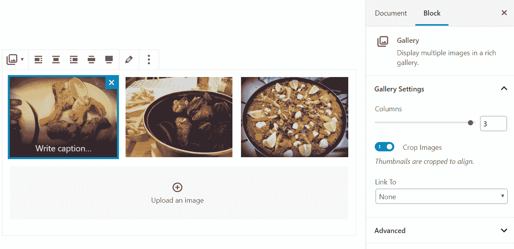

例如，如果您决定将列数更改为 2，WordPress 将尽其所能使您的相册看起来仍然很棒。以下是我这样做时我的相册发生的情况：

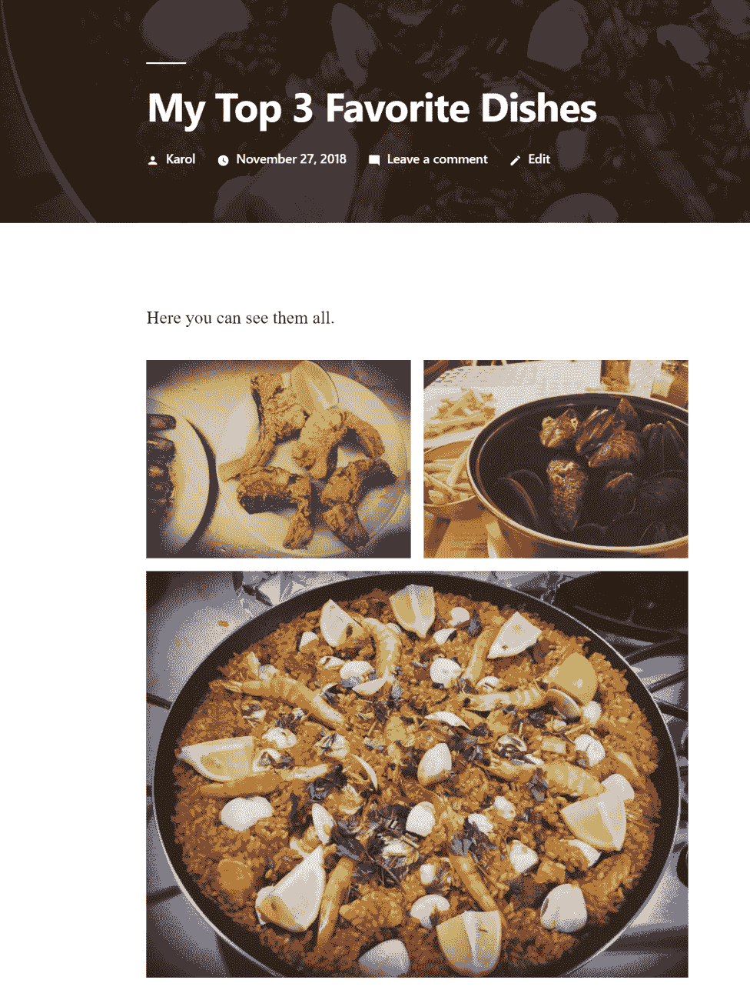

如您所见，WordPress 使每张图片完美地适应页面，尽管这种完美的程度取决于您使用的主题。

# 导入/导出内容

本章我们将讨论的最后一件事是导入和导出您的内容的功能。默认情况下，WordPress 允许您从其他地方获取内容并在您的网站上发布。但请注意，这不会自动发生。WordPress 只会帮助您导入内容，然后您可以决定接下来如何处理它。

支持的平台有很多，包括 Blogger、LiveJournal、Tumblr 博客等。您可以通过导航到工具 | 导入（导入内容时的起点）来查看完整列表：

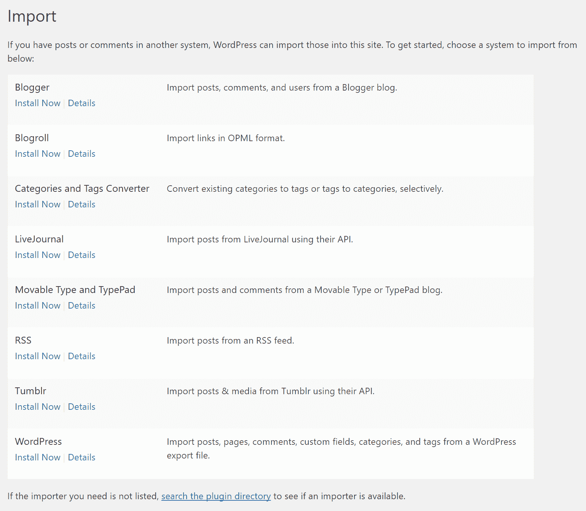

# 导入内容

如果您想从任何来源导入内容，首先需要点击可用的平台下方的“立即安装”链接之一（在前面截图中可见）。WordPress 使用额外的插件来处理导入，并且首先需要安装它们才能执行此程序。

从每个可用的平台导入内容的方式略有不同，但总体过程看起来相似，所以我们将以另一个 WordPress 网站为例——也就是说，我们将从另一个 WordPress 网站导入内容。为了实现这一点，我们只需点击 WordPress 部分中的“立即安装”链接（在前面截图中的最后一个），然后，当安装完成后，点击刚刚出现的“运行导入器”链接。请参考以下截图：

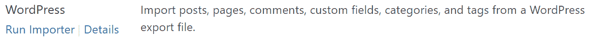

这将直接带你去导入面板：

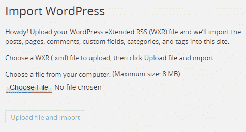

这是一个非常简单的界面，你所要做的就是取一个 WordPress 导出文件并将其上传到你的网站。平台将负责提取存档并将内容导入其中。因此，你的网站将会充满新的文章、页面、自定义字段、导航菜单，甚至是评论。

这个功能的主要目的是帮助那些从 Blogger 或 LiveJournal 等平台迁移网站的用户。想象一下，如果有人有一个包含一百多篇博客文章的 Blogger 博客。逐个处理并将它们手动输入 WordPress 将会非常耗时。有了这个功能，可以在一分钟内完成。

# 导出内容

导出内容甚至比导入更简单。首先，导航到工具 | 导出：

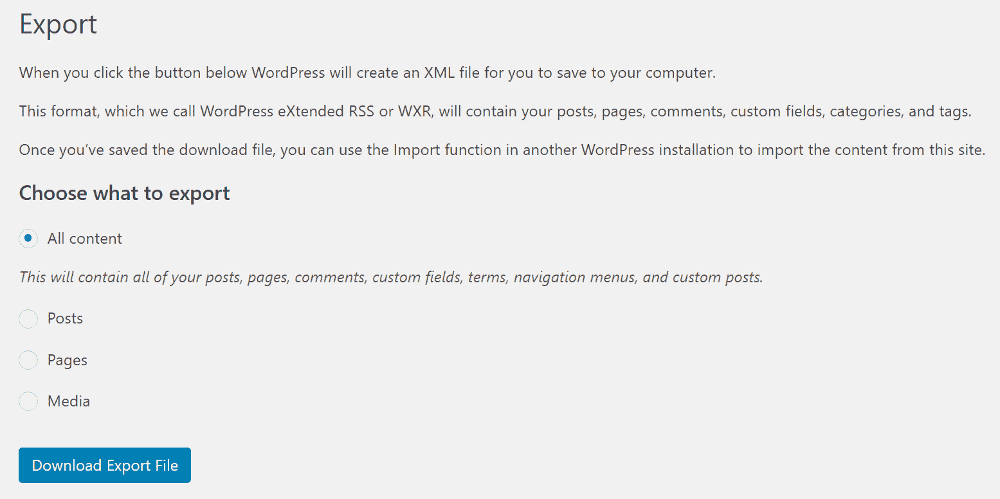

在这里，你除了选择要导出的内容然后点击大按钮下载你的 WordPress 导出文件外，没有太多可以做的：

+   选择所有内容将导出你的文章、页面、评论、自定义字段、术语、导航菜单和自定义文章

+   只选择文章、页面或媒体是非常直观的

当你点击下载导出文件按钮时，你将得到一个与我们在导入时使用的文件一样的文件。这意味着你可以将这个文件拿去，在另一个域名上创建你网站的镜像副本。

# 摘要

在这一章中，我们探讨了 WordPress 可以处理的内容，这些内容并非直接关于博客。你学习了静态页面、主页、媒体库、图片画廊以及内容的导入/导出。

现在，你已经完全准备好使用 WordPress 管理面板来控制你网站的所有内容。接下来，你将学习如何通过安装新的插件来扩展你网站的功能，我们将在下一章中讨论这一点。
