# 第六章：保护你的 WordPress 网站

网站安全的话题可能令人畏惧。一方面，我们都希望我们的网站是安全的，但另一方面，我们担心我们没有足够的技能来对抗试图入侵我们网站的黑客。但先别急着想这个；为什么有人会首先攻击你的网站呢？！你不是金融机构或流行的在线出版物，所以为什么有人会花时间试图损害你的网站呢？

嗯，在这种情况下，现实可能很残酷。大多数黑客攻击并不是为了窃取你的收入或完全控制你的网站。通常，它们是在你的网站上包含一小段代码，该代码链接到其他外部网站（大多数情况下，要么是欺诈网站，要么是*不良*内容）。黑客从中得到了什么？这因人而异，但通常，这类攻击是为了利用你的网站作为实现特定目标网络的一部分。实际上，你的网站变成了僵尸——它做黑客让它做的事情，并成为更大规模类似*僵尸网站*网络的一部分。

那么，我们如何防止你的网站发生这种*僵尸化*呢？这正是本章的主题。让我们从基础开始。

让我们看看本章将涵盖的主题：

+   WordPress 安全原则

+   WordPress 安全最佳实践

+   安装 SSL

+   安全插件以及哪些插件需要获取

+   设置安全用户账户

+   用户角色和能力

+   管理用户

+   用户管理插件

# WordPress 安全原则

在我们深入探讨 WordPress 安全的任何具体技巧和技术之前，让我们先打下一些基础。你的首要目标是设置最基本元素，以便你可以避免 99%的攻击。记住，黑客并不是针对你的网站进行单独攻击。相反，他们针对的是一系列网站，并试图利用已知的漏洞。因此，如果你从你的网站上消除那个特定的漏洞，那么你实际上就是在防止攻击发生。

再次强调，我们的首要目标是：通过实施最佳实践进行预防。或者换句话说，让我们做 20%的工作，以获得 80%的结果。为了实现这一点，让我们从一些网站安全总体最佳实践开始。

# WordPress 安全最佳实践

WordPress 网站安全最基本最佳实践的优点在于它们都非常简单易行。让我们从基础开始。

# 使用强密码

这听起来非常简单，但强大密码的价值不容小觑。许多黑客攻击试图利用用户拥有简单密码的情况，这些密码要么是字典中的单词，要么是最常用的密码之一。换句话说，如果你的 WordPress 密码在以下列表中，那么你就是在做错了：

|

+   123456

+   密码

+   12345678

+   qwerty

+   12345

+   123456789

+   letmein

+   1234567

+   football

+   iloveyou

|

+   admin

+   welcome

+   monkey

+   login

+   abc123

+   starwars

+   123123

+   dragon

+   password

+   master

+   hello

|

要查看最常用密码的更完整列表，请访问此页面：[`en.wikipedia.org/wiki/List_of_the_most_common_passwords`](https://en.wikipedia.org/wiki/List_of_the_most_common_passwords)。

那么，如何设置一个强大的密码？有两种方法：

+   或者使用一组随机字符，包括小写和大写字母、数字和特殊符号（如连字符）；例如：`noUYhf56%%6fJJJ-Njh`

+   想出一个实际的句子，然后使用连字符将其组合成一个密码；例如：`我-喜欢-披萨-但-蛋糕-也很好`

要更改密码，请转到用户 | 您的配置文件。一旦到达那里，点击生成密码按钮（参考以下截图）。WordPress 将建议一个密码，但您也可以输入自己的密码。完成后，点击更新配置文件：

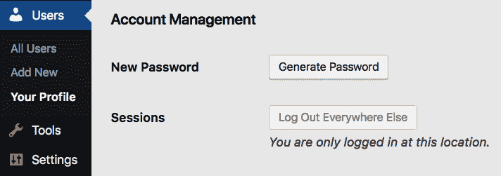

# 保持 WordPress 更新

随着 WordPress 软件的每一次新版本发布，您都会得到一系列的改进和升级。其中一些是完全新的功能，一些是对旧功能的改进，还有一些是在安全领域内的改进。因此，保持 WordPress 更新是避免麻烦并确保您的 WordPress 网站与网站安全领域的最新发展保持同步的最佳方式。

每当有新的 WordPress 版本可用时，您将在`wp-admin`中看到一个更新提示。请确保注意这些提示。它们的重要性怎么强调都不过分。

# 保持主题和插件更新

保持更新这个想法，就像 WordPress 核心会更新一样，主题和插件也会更新。您应该一有可用就安装它们，原因和您想要安装 WordPress 更新的原因相同。

要查看您网站一般可用的更新，请转到仪表板 | 更新。您将在这里看到一个摘要，以及允许您安装更新的链接，如下面的截图所示：

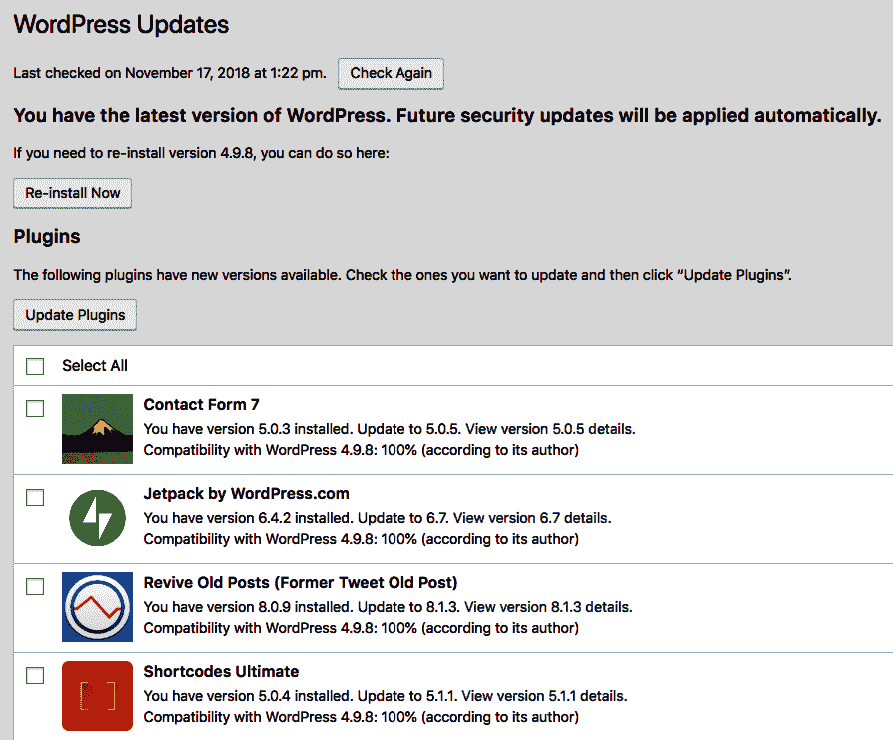

# 避免安装不必要的插件

网上可用的 WordPress 插件有成千上万种。尽管其中一些可能看起来很吸引人，但在安装一些不太受欢迎的插件或未经用户测试的插件之前，您应该三思而后行。

一般而言，首先，您不应该安装任何不是为网站高效工作所必需的东西。如果一个插件只是个有趣的东西，但不是必需的，您可能应该跳过它。

除此之外，还要注意你考虑的插件的评价、兼容性信息和流行度数字。例如，以下是从 Jetpack 插件官方页面[`wordpress.org/plugins/jetpack/`](https://wordpress.org/plugins/jetpack/)的一些相关字段：

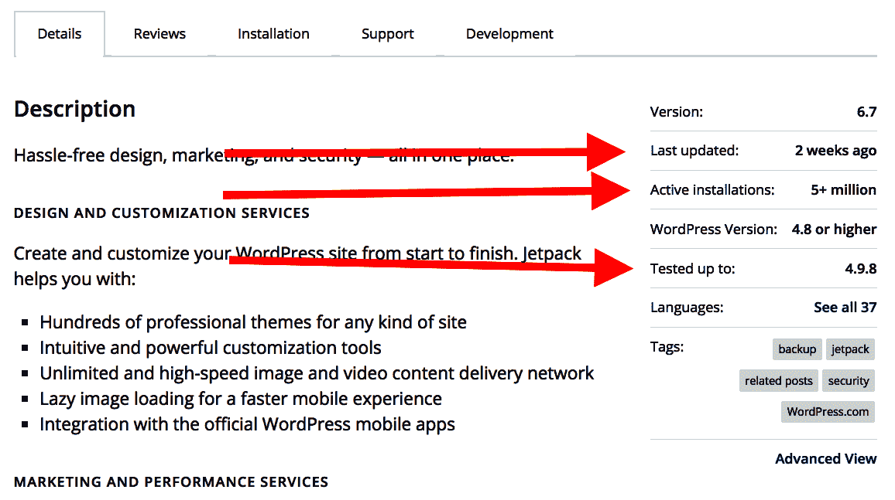

当安装新的插件时，尽量不选择评分低、安装数量少或未与当前 WordPress 版本测试过的插件。

关于 WordPress 安全最佳实践的讨论就到这里。现在，让我们做一些额外的工作。

# 安装 SSL

**安全套接字层**（**SSL**）是一种创建于加密网站服务器（网站）与客户端浏览器（阅读网站的人）之间连接的网页技术。

在加密连接下，基本上不可能拦截来回传输的数据，因此进行某些操作时非常安全，甚至包括处理银行转账等最敏感的任务。

简而言之，一旦您在网站上启用 SSL，您将使黑客更难入侵和/或扭曲您网站与访客之间的连接。

幸运的是，如今安装 SSL 证书是一件简单的事情。大多数流行的网络托管商都将免费 SSL 证书作为您主要托管计划的一部分提供。您需要做的只是检查用户面板中的几个复选框来启用它。

不幸的是，具体步骤因托管服务而异。以下是如何使用一些流行的提供商来完成此操作的方法：

+   **Bluehost**：[`my.bluehost.com/hosting/help/free-ssl`](https://my.bluehost.com/hosting/help/free-ssl)

+   **SiteGround**：[`www.siteground.com/tutorials/getting-started/configure-ssl-with-one-click/`](https://www.siteground.com/tutorials/getting-started/configure-ssl-with-one-click/)

+   **GoDaddy**：[`www.godaddy.com/garage/enable-https-server/`](https://www.godaddy.com/garage/enable-https-server/)

+   **HostGator**：[`support.hostgator.com/categories/ssl-certificates/ssl-setup-use/`](https://support.hostgator.com/categories/ssl-certificates/ssl-setup-use/)

如果您在其他地方托管网站，您可能会在他们的文档中找到类似的指南。

然而，即使您已经通过了您托管商用户面板中的步骤，您的 WordPress 网站上的 SSL 仍然只**部分**启用。这引出了安全插件的话题。

# 安全插件和哪些插件需要获取

网上有很多不同的安全插件，都承诺为您的 WordPress 网站处理一件事或另一件事。然而，并非所有这些插件都是必需的，或者说，很少是必需的。因此，让我们花一分钟时间讨论一下那些真正有用的插件。我们之所以在上一章中没有具体列出它们，是为了在这里更深入地探讨。

# SSL 插件

在您的托管商端启用 SSL 后，是时候准备您的 WordPress 网站来接收它了：

1.  这可以通过一个名为**Really Simple SSL**的插件来完成，该插件可在[`wordpress.org/plugins/really-simple-ssl/`](https://wordpress.org/plugins/really-simple-ssl/)找到：

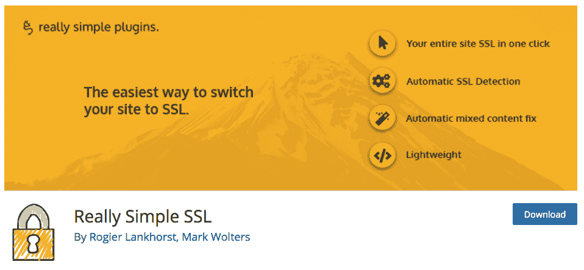

1.  激活插件后，你会看到如下消息：

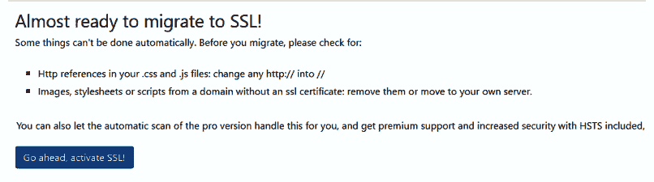

1.  点击`继续，激活 SSL！`按钮。完成此操作后，你将立即从 WordPress 仪表板注销，但不用担心，这只是过程的一部分。当你再次登录时，你会看到仪表板现在在`https`下而不是标准的`http`下可用。

1.  为了确保一切按预期工作，正常访问你的网站，并寻找网站地址旁边的特征性锁头：

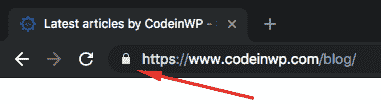

# 通用安全插件

除了 SSL 之外，你还应该安装一个通用的安全插件来处理网站安全中的一些其他常见漏洞。我们将使用的插件名为**Wordfence Security**，可在[`wordpress.org/plugins/wordfence/`](https://wordpress.org/plugins/wordfence/)找到：

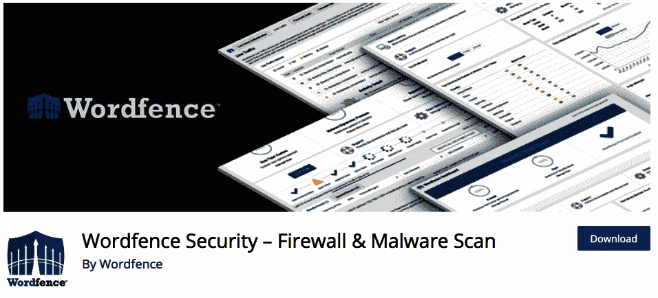

开始使用此插件只需要基本的设置。安装并激活后，你会看到邀请你进行浏览并输入管理员电子邮件以接收有关网站安全通知的邀请，如以下截图所示：

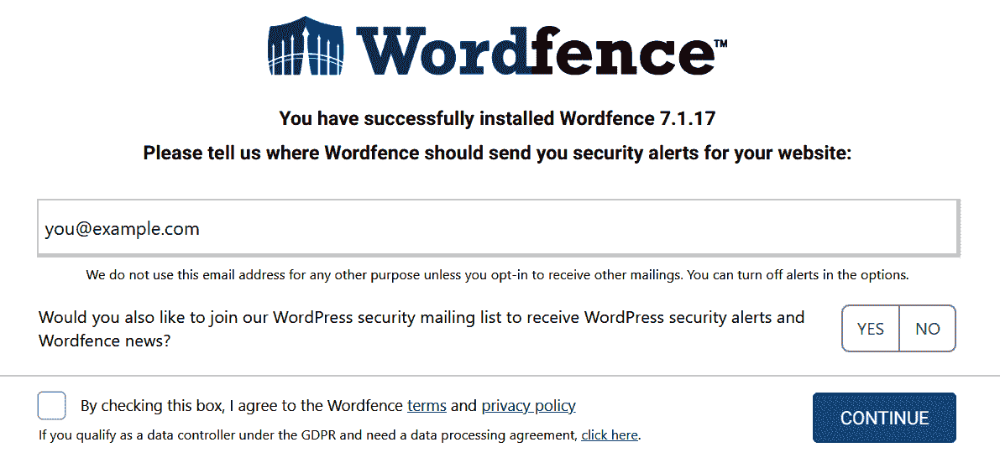

虽然这个浏览很短，但它会向你展示所有最重要的功能，并告诉你如何有效地使用插件。大多数情况下，插件不需要任何监督，而且多亏了通知电子邮件，你只需坐下来放松，等待插件联系你，换句话说：

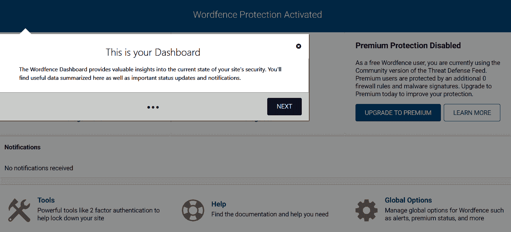

开始使用此插件的最佳方式是前往`wp-admin`中的 Wordfence | 扫描，然后点击下面的截图所示的大号`开始新扫描`按钮：

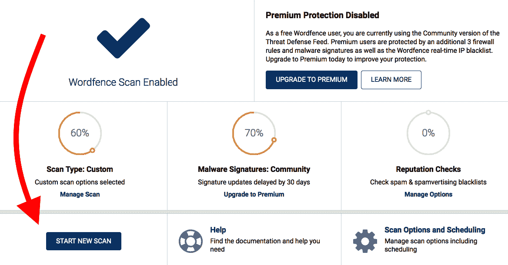

完成此操作后，你会看到正在运行的扫描。当扫描完成且一切正常时，你会看到一行勾选标记，确认扫描成功：

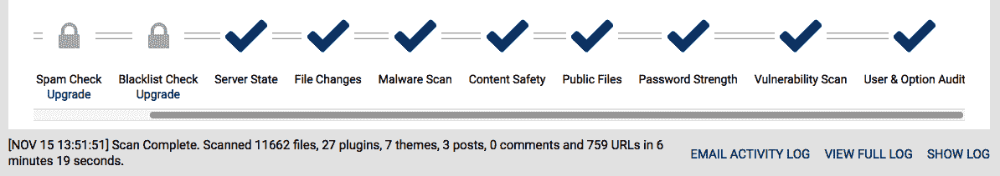

如果有任何问题，Wordfence 将在页面下方显示它们，并也会给你提供解决问题的提示。在任何情况下，你都可以通过点击标有`查看完整日志`或`显示日志`（如前一个截图所示）的链接来查看扫描的完整日志。

除了基本的扫描功能外，此插件还允许你阻止个别 IP 地址访问你的网站，通过缓存提高你网站的性能，甚至使你的网站对整个国家不可用（以防某些地理区域给你带来严重问题）。

然而，在这方面最重要的方面是，从现在开始，Wordfence 保护将自动运行，你不需要主动做任何事情来保持你的网站安全。每当需要你的注意时，Wordfence 将通过电子邮件发送通知，并告诉你应该做什么。这在很大程度上是一种设置后即可忽略的解决方案。

# 其他可以考虑的插件

在 SSL 和 Wordfence 问题解决之后，现在让我们快速浏览一下其他流行的安全插件。安装它们是可选的，具体取决于你认为在网站安全方面应该遵循的良好方向：

+   **Google 身份验证器** ([`wordpress.org/plugins/miniorange-2-factor-authentication/`](https://wordpress.org/plugins/miniorange-2-factor-authentication/))：使用它来启用双因素认证

+   **强制使用强密码** ([`wordpress.org/plugins/force-strong-passwords/`](https://wordpress.org/plugins/force-strong-passwords/))：提供密码强度指示器，并禁止使用弱密码

+   **WP 安全审计日志** ([`wordpress.org/plugins/wp-security-audit-log/`](https://wordpress.org/plugins/wp-security-audit-log/))：记录你网站管理区域中所有活动的日志

+   **登录锁定** ([`wordpress.org/plugins/login-lockdown/`](https://wordpress.org/plugins/login-lockdown/))：通过记录每次失败的登录尝试的 IP 地址和时间戳来保护你的登录页面，然后根据失败的登录尝试锁定特定的 IP 地址

+   **Sucuri 安全** ([`wordpress.org/plugins/sucuri-scanner/`](https://wordpress.org/plugins/sucuri-scanner/))：Wordfence 的替代品，另一个出色的安全扫描插件

**了解更多信息**：如果你想了解更多关于网站安全和 WordPress 安全的信息，你应该订阅 Sucuri 博客（在[`blog.sucuri.net/`](https://blog.sucuri.net/)）。Sucuri 是一家备受尊敬的公司，在网站和 WordPress 安全方面处于领先地位。每当在 WordPress 领域发现新的漏洞时，通常都是 Sucuri 首先发布消息。

# 设置安全用户账户

到目前为止，在这本书中，我们专注于与个人网站一起工作——一个属于并仅由一个人使用和拥有的网站。然而，许多博客的使用方式不同——可能有一个博客或网站有各种作者、编辑和管理员。这使得网站更像是一个社区项目或甚至是一个在线杂志。此外，大型在线出版商使用 WordPress 作为其网站的基础也绝非罕见，在这种情况下，网站有多个作者、编辑、审稿人和总体贡献者，他们有不同的责任，更不用说技术团队或设计师了。所有这些人在与网站互动时都应该有自己的用户账户。

此外，即使只是你管理自己的个人 WordPress 网站，你也应该确保自己的账户尽可能安全。在本节中，你将了解如何使用户账户安全以及如何从头开始创建它们的所有细节。

在创建新用户账户时，你应该牢记以下三条主要规则：

+   每个新用户账户都应该有足够的权限来完成他们的工作，但不要更多

+   不要使用明显的用户名，例如`admin`或`user`；相反，使事情稍微复杂一点，例如使用`firstname.lastname`

+   使用强密码——这一点你已经知道了

让我们更详细地探讨第一个方面——账户权限。根据你为谁创建用户账户，这个人可能不需要对你的网站拥有完整的管理员级别访问权限。在大多数情况下，人们只想能够撰写和发布新的帖子或页面，而他们不需要管理员凭证来做这件事。以下是对 WordPress 中所有可用用户账户类型的概述，以及它们的目的。

# 用户角色和能力

WordPress 允许你在网站上使用无限数量的用户账户。每个用户都可以被分配五个不同角色中的一个。让我们逐一查看这些角色，从最强大的角色开始。

# 管理员

当你安装 WordPress 时，它会自动为你创建一个具有管理权限的用户。这个角色被称为*管理员*，每个 WordPress 网站都必须至少有一个管理员账户（你将无法删除所有账户）。正如你在前面的章节中已经看到的，管理员可以做任何事情。

管理员的主要目的是管理网站的所有事务。

通常，你不想在单个博客或网站上拥有很多管理员。对于有 10 到 20 个作者和编辑的博客，最好只保留一个管理员账户，或者对于有数十个用户的博客，可能最多只有三个管理员。

只有具有管理员角色的用户才能执行的一些操作示例如下：

+   切换博客主题

+   添加、编辑、激活或停用插件

+   添加、编辑或删除用户

+   管理一般博客选项和设置

当创建更多管理员账户（或管理主要账户）时，请确保只使用难以通过任何暴力破解方法破解的复杂密码。正如我们之前提到的，许多黑客攻击都围绕密码猜测展开，所以你的密码越复杂，破解它就越困难。

# 编辑

在管理员之后，*编辑*拥有最强大的角色。这个角色是为那些需要管理网站内容的所有方面，但不需要能够改变网站基本结构、设计或功能本身（这由管理员负责）的用户而设。

编辑的主要目的是管理网站的内容。

为了了解用户以编辑身份登录时的屏幕看起来像什么，让我们比较一下编辑菜单（在右侧）与管理员菜单（在左侧）：

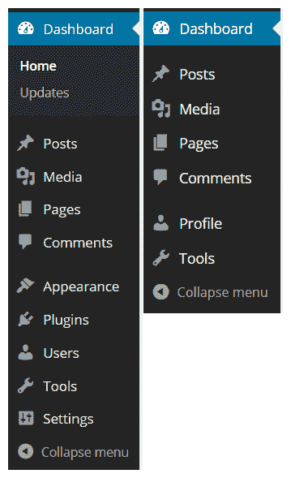

如您所见，顶部部分没有变化（除了“更新”链接）。然而，几乎整个底部菜单，包括“外观”、“插件”、“用户”（替换为“个人资料”）和“设置”，都已经消失。我们可以看到，编辑只剩下编辑自己的个人资料和访问“工具”部分的能力，该部分包括任何允许编辑级别用户访问的插件页面。

具有编辑角色的用户可以执行以下操作示例：

+   管理所有帖子

+   创建和编辑页面

+   管理评论

+   管理分类、标签和链接

+   编辑其他用户的帖子

编辑角色的一个有利方面是，如果你仔细看，你会发现它拥有在特定 WordPress 网站上发布任何内容所需的所有凭证。这使得它非常适合日常使用，即使是单作者博客/网站。因此，我实际上鼓励你为自己设置一个单独的编辑账户，然后用它来发布和编辑内容，而不是使用默认的管理员账户。这种设置要安全得多，尤其是如果有人试图窃取你的密码，或者在你账户发生任何其他意外的情况下，网站本身也不会受到损害（因为编辑不能安装新的插件或删除任何现有的插件）。

对于多作者博客/网站，编辑角色旨在分配给负责在网站上发布内容的用户。正如其名所示，*编辑*角色非常适合编辑。

# 作者

作者的访问权限比编辑少得多。作者可以添加和编辑他们自己的帖子，并管理他们下属发布的帖子。然而，他们不能编辑其他作者发布的帖子，也不能管理不属于他们的帖子的评论。

作者的主要目的是管理他们自己的内容。

为了了解具有*作者*角色的用户体验，让我们比较一下作者菜单（在右侧）与编辑菜单（在左侧）：

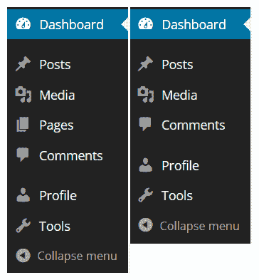

如您在前面的屏幕截图中所见，“页面”部分已经消失。此外，如果作者查看完整的帖子列表，他们只能查看，但不能编辑、快速编辑或删除他们未创建的帖子（突出显示）：

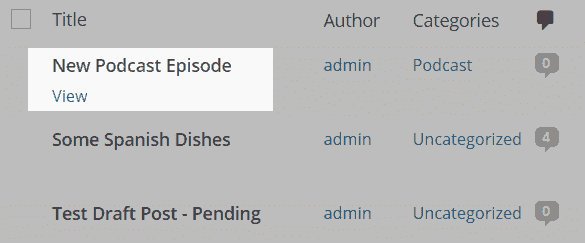

如您所想象，作者角色非常适合，嗯，作者——那些积极参与为您网站创建内容的用户。例如，作者可以执行以下操作：

+   提交和发布他们的帖子

+   发布后管理他们的帖子

+   在他们的帖子下管理评论

# 贡献者

贡献者只能撰写帖子并提交给编辑审核。这些帖子将处于“待审核”状态，直到编辑或管理员同意发布它们。贡献者不能上传图片或其他文件，查看媒体库，添加分类，编辑评论，或执行其他更多权限用户可进行的任务。

贡献者的主要目的是提交内容供考虑。

值得注意的是，尽管贡献者可以创建和提交他们的作品供审核，但一旦文章发布，他们就无法以任何方式编辑它。然而，他们可以访问评论部分（进行管理）。

在这个角色的实际应用中，它最常用于与客座博主或任何其他非内部团队常规贡献者合作时。客座博主现在非常流行，通过贡献者账户处理它比通过电子邮件接收文章然后复制粘贴到 WordPress 上要省力得多。

# 订阅者

订阅者几乎什么都不能做，听起来可能很奇怪。他们只能登录并编辑他们的个人资料（调整他们的名字、姓氏、密码、个人简介等信息），仅此而已。根据“设置 | 讨论”中设置的权限，博客访客可能需要注册为订阅者才能发表评论。此外，还有一些插件处理向订阅者发送信息更新，例如时事通讯或新帖子的电子邮件通知。

订阅者对网站没有编辑权限。

大多数时候，这个角色被用作占位符。例如，一个特定的作者过去一直定期为您的网站做出贡献，但几个月内没有提交任何内容。您不必完全删除他们的账户，只需将角色更改为**订阅者**即可。

# 管理用户

要管理用户，请登录（当然是以管理员身份）并导航到“用户”。您将看到现有用户列表，如下面的截图所示：

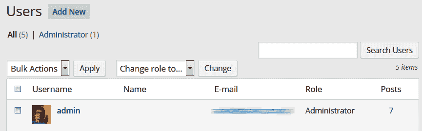

当我们安装 WordPress 时，它只是创建了我们第一个用户（这就是我们一直登录的方式）。所以让我们创建一个新用户，并分配给该用户下一个最强大的角色——**编辑**。

1.  要这样做，请导航到“用户 | 添加新用户”。您将看到“添加新用户”表单，如下面的截图所示：

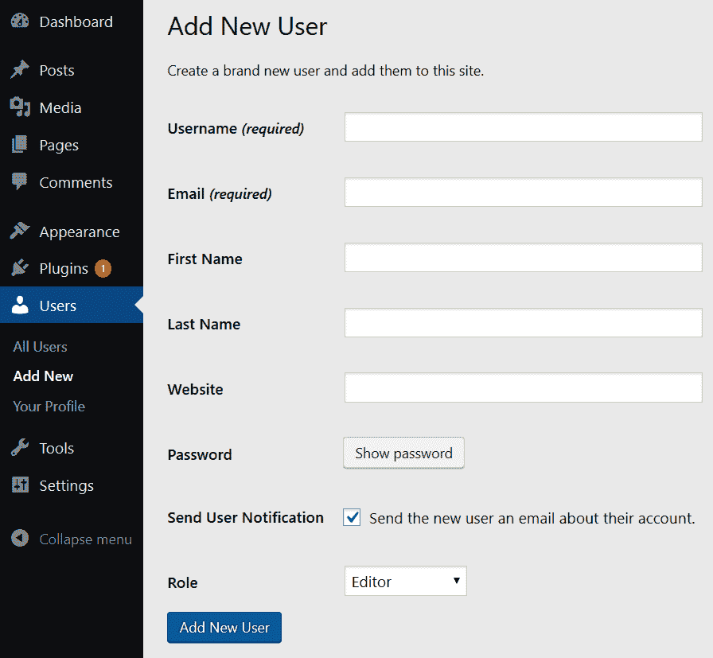

在此表单中，仅需要填写“用户名”和“电子邮件”字段。密码将自动处理。WordPress 将自动生成一个安全的密码，并在完成后发送给新用户。您还可以将“角色”从默认的（订阅者）更改为其他角色。在这种情况下，我选择了“编辑”。

1.  然后，单击“添加新用户”按钮。除了必填字段外，填写“名字”和“姓氏”也是良好的实践。这可以使进一步管理用户账户的任务更加清晰。

1.  在此示例中，我将重复此过程以添加一个作者、一个贡献者和一个订阅者。当我完成时，“用户”页面（用户可以在此管理）将如以下截图所示：

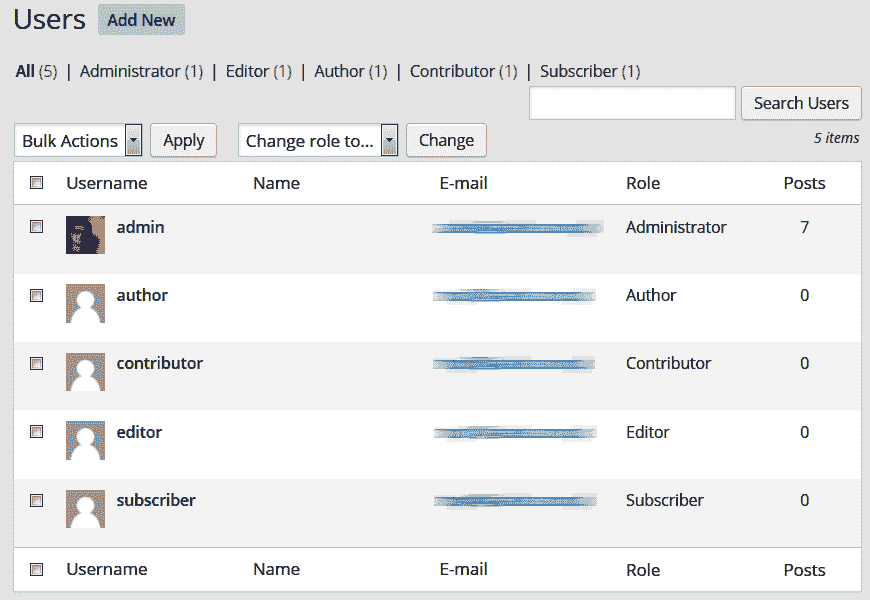

要查看您可以在每个新用户账户上执行的操作，只需将鼠标光标悬停在任意一行上。在这种情况下，您可以编辑或删除用户。您可以使用复选框和批量操作菜单，或者使用筛选链接仅查看具有特定角色的用户。您可以通过勾选框（或多个框）并使用“更改角色为...”下拉菜单来更改此页面上一个或多个用户的角色。

# 启用用户自助注册

通过自己添加用户不是向您的 WordPress 网站添加用户的唯一方法。您还可以让您的用户能够自行注册。

1.  首先，转到“设置 | 一般”并确保您已检查“会员”旁边的“任何人都可以注册”。

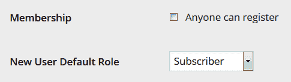

1.  我强烈建议选择**订阅者**作为新用户的默认角色，尽管如果您的博客需要，**贡献者**也会很好。然而，自动允许新用户分配具有更多权限的角色只会带来麻烦。

1.  接下来，在您的博客上某个位置添加一个链接，指向登录和注册页面。最简单的方法是使用名为“元数据”的小工具，它随您的 WordPress 安装一起提供。它将在您的侧边栏中添加一个带有几个有用链接的框，包括“登录”和“注册”。

1.  点击“注册”的用户将被带到以下基本注册页面，该页面只要求他们的用户名和电子邮件，如以下截图所示：

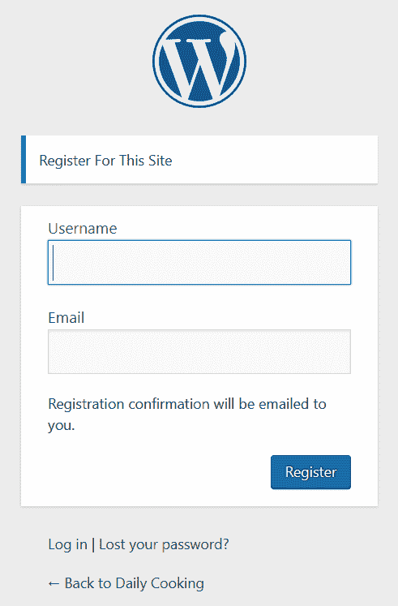

提交此表单后，用户将收到密码电子邮件，主要网站管理员将收到有关新注册的电子邮件通知。现在用户可以登录并编辑他们的个人资料，或者如果管理员更改了他们的角色，还可以做更多的事情。

您可以在[`codex.wordpress.org/Roles_and_Capabilities`](https://codex.wordpress.org/Roles_and_Capabilities)了解更多关于内置 WordPress 角色和功能的信息。

# 用户管理插件

在撰写本文时，WordPress 插件目录中有数百个带有*用户*标签的插件（[`wordpress.org/plugins/tags/users`](https://wordpress.org/plugins/tags/users)）。我们可以将这些插件分为许多组，因为它们提供的功能非常广泛。例如，有以下插件：

+   处理各种作者账户、共同撰写帖子和多作者网站

+   在 WordPress 周围构建会员网站，会员可以根据他们的订阅模式访问内容的高级包

+   构建一个经典的电子商务商店，让每个人都可以从可用的*商品*目录中进行购买

+   基于 WordPress 创建一个在线论坛

+   从 WordPress 直接向特定网站的用户发送电子邮件通讯，而不是使用外部服务

+   在 WordPress 上启动一个社交网络

+   管理注册用户的个人资料

如您所见，可能性是惊人的。如果我们愿意，我们可以用 WordPress 网站及其用户做几乎任何事情。只有我们的想象力限制了我们的行动。话虽如此，在考虑任何此类插件时，您应该始终考虑网站的安全性。

# 摘要

在本章中，您了解了 WordPress 安全性的原则以及如何确保您的网站不会成为黑客或恶意脚本/软件的受害者。您还学习了如何管理在一个网站或博客上工作的用户组。

现在已经解决了这些问题，是时候我们学习一些关于如何控制您网站设计的方法了。在下一章中，我们将讨论主题，以及为什么它们是 WordPress 最激动人心的部分。
