# 选择和安装主题

使用内容管理系统（**CMS**）为您网站带来的最大优势之一是，您可以在不了解 HTML 和 CSS 的情况下更改您网站的外观和感觉。几乎每个 CMS 都允许用户自定义他们网站的外观，而无需担心内容被更改。这些管理外观被称为主题。在其他平台（例如 Blogger、Joomla 和 Drupal）上，主题有时被称为**模板**或**布局**。

数千个 WordPress 主题可以免费下载，还有数千个以相当低的价格提供。其中一些免费主题是由 WordPress 社区的成员开发的，并在 WordPress 的主网站上列出[`wordpress.org/themes/`](https://wordpress.org/themes/)，而其他则可以在网络上的独立网站上找到。

在您准备好开始更改您网站的主题之前，您需要了解以下内容：

+   关于您考虑的主题的一些基本因素

+   如何找到高质量的主题

+   如何选择最适合您的内容和受众的主题

+   如何安装主题

在本章中，我们将讨论所有这些主题。本章是使用主题的入门指南。在接下来的章节中，我们将讨论开发您自己的主题的高级主题。

# 寻找主题

有数十个网站提供 WordPress 主题供您下载并安装到自己的网站上。许多主题开发者提供免费的主题，而有些则收取少量费用。当然，如果您找不到符合您需求的免费主题，您始终可以雇佣一个主题开发者为您创建定制的主题，或者您可以自己成为主题开发者（参见第九章 Developing Your Own Theme*，开发您自己的主题*）。

# WordPress 主题目录

在寻找主题时，您应该首先访问位于[`wordpress.org/themes/`](https://wordpress.org/themes/)的官方 WordPress **主题目录**。这是 WordPress 社区中每个人上传他们的免费主题并使用关键词对其进行标记的地方，这些关键词描述了他们主题的基本外观、布局和功能，如下面的截图所示：

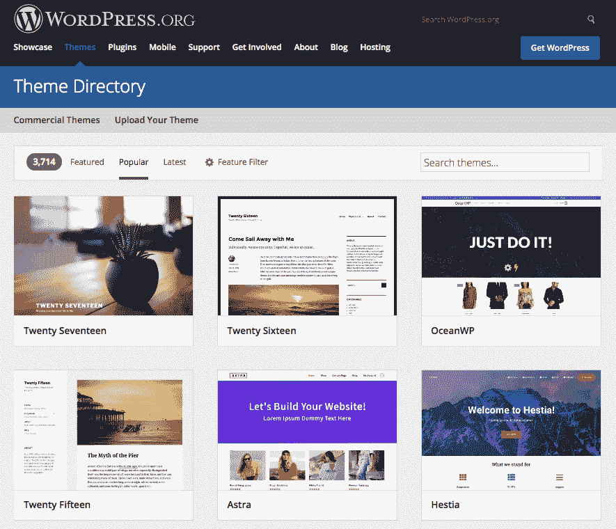

要更好地了解主题的外观，除了缩略图提供的内容外，只需点击主题的标题（以我的情况为例，Hestia，在[`wordpress.org/themes/hestia/`](https://wordpress.org/themes/hestia/)）。您将被带到主题的详细信息页面，如下面的截图所示：

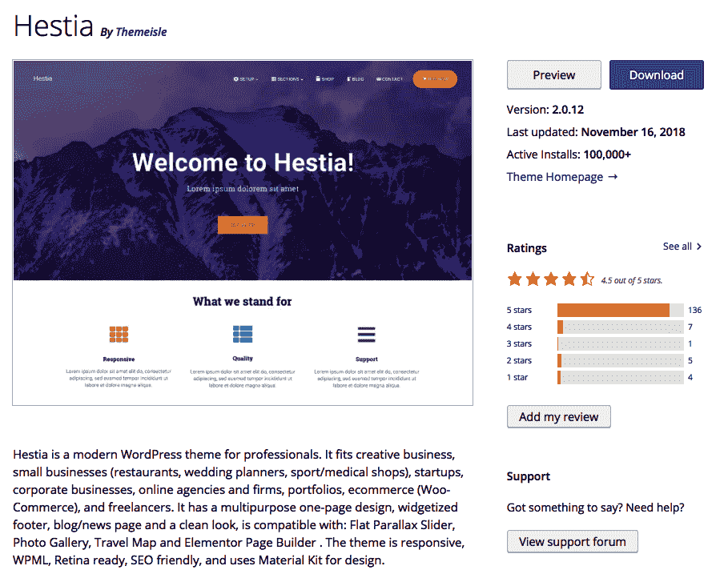

前一页向您展示了主题的描述、所有适用于它的标签、其他用户给予它的平均评分以及一些关于主题的评论。如果您点击“预览”按钮，您将能够看到主题的实际应用效果，如下面的截图所示：

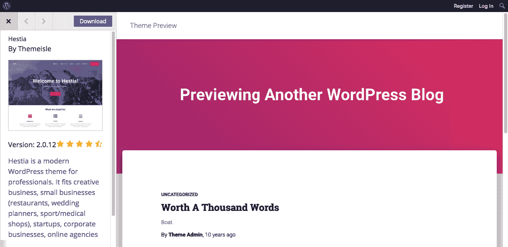

当您浏览主题目录时，请务必注意您喜欢的任何主题；我们将在本章后面讨论如何将其添加到您的 WordPress 网站中。

值得指出的是，官方目录中的每个主题都附带其自己的支持部分和用户评价部分。您可以通过点击右侧边栏中的链接来查看它们，如下面的截图所示：

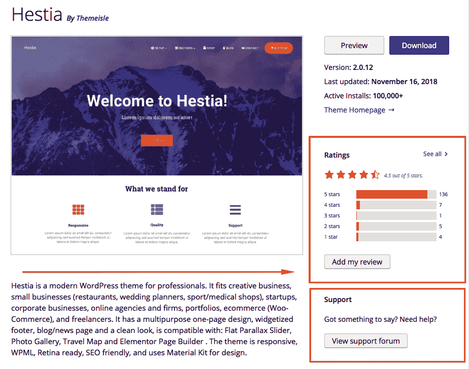

# 主题的主要类型

如前所述，主题主要有两种类型——**免费主题**和**付费主题**。此外，如果您不认为价格是一个因素，我们还可以将主题分为其他四个组——**标准主题**、**子主题**、**起始主题**和**主题框架**：

+   **子主题**：我们将在下一章中详细讨论这个问题，所以现在让我们说，子主题是一个继承另一个主题（父主题）功能性的主题。

+   **标准主题**：这些主题旨在以原始形式工作，同时允许一些基本的定制和调整（就像默认主题 Twenty Nineteen 一样）。

+   **起始主题**：在 WordPress 世界中，这是一个相对较新的概念。简而言之，当使用它们时，您被鼓励直接修改主题文件，并有效地使它们成为您目前正在构建的主题的基础。正如其名所示，它们为您的主题提供了一个很好的起点。这对于开发者来说是一个很好的解决方案，但对于只想下载一个很好的主题并立即使用它的普通用户来说，则不是那么理想。

+   **主题框架**：这些与起始主题有些相似（它们旨在用作自定义主题开发的基座），但它们通常提供更广泛的各种内置功能，并且可以直接作为独立主题使用（至少在一定程度上）。

在某种程度上，起始主题和主题框架之间的主要区别在于，当您获得一个起始主题时，您必须事先投入工作来使主题功能化。使用框架时，您会立即获得一个功能化的主题，但随后您需要花费时间调整其各种元素，使其与您的网站完美匹配。关于主题框架和起始主题的共同之处在于，它们通常是高度依赖代码的产品，这意味着如果您没有编程技能或者没有雇佣任何具备这些技能的人，您就无法充分利用它们。现在这可能听起来不是很清楚，没关系。我们将在下一章中进一步解释这个概念。

最后，标准主题是大多数博客作者和网站所有者在 WordPress 之旅中使用的主题，尤其是如果他们不需要任何高级定制或运营特定目的的网站（例如动画网站和交互式网站）。

# 寻找更多主题

如果你无法在官方目录中找到你想要的主题，你还有其他选择。有一些第三方网站提供免费主题，还有一些网站以价格出售主题。大多数商业主题提供两个或三个价格点：

+   第一个价格是购买主题供自己使用的成本，价格从 20 美元到 100 美元不等。这样的许可证允许你在单个网站上使用该主题。

+   第二个价格是如果你想在多个网站（域名）上使用该主题，或者当你需要项目图形（例如，Photoshop 文档）和其他开发文件时，你需要支付的价格。在这种情况下，通常价格在 60 美元到 200 美元之间。

+   最后一个价格点，尽管现在不太流行，是**独家许可证**。如果你想成为该主题的唯一用户，你可以获得它。价格可以从 500 美元到 1500 美元，甚至更多。

让我们专注于免费主题和付费主题的区别。虽然官方目录中的每个主题都是免费的，但互联网上的其他部分在这个问题上被一分为二。一些网站只提供免费主题，而另一些则只提供付费主题。还有一些分销商介于两者之间。我个人不推荐从官方目录或受尊敬的主题商店（通过促销提供一些免费主题）之外的其他地方获取任何免费主题。

原因很简单。只有高质量的主题才能进入官方目录，我不仅仅是在谈论外观或设计。除了设计之外，重要的是代码结构和代码质量。没有任何一个主题包含任何神秘的代码块（例如加密代码或可疑的外部链接），这些代码块会进入官方目录。这正是官方目录成为网上最好的免费 WordPress 主题来源之一的原因。

当谈到主题商店中发布的各种免费主题时，故事相当相似。可以说，WordPress 主题的**第一梯队**由受尊敬的、严肃的公司组成。因此，即使它们发布免费主题，也无法承受其质量低劣或存在其他任何问题。因此，在大多数情况下，它们也是可以安全使用的。

我们在网上能看到的最后一件事是，有成百上千个免费主题在随机网站上发布，通过付费广告、*顶级主题*列表、广告文章等方式推广。让我再说一遍：我不建议你们获取任何这些主题，即使设计很吸引人。事实上，你们永远不知道里面有什么，以及哪些安全漏洞可以被利用来黑客攻击这样的主题。它们几乎也从未得到其创作者的支持，并且没有主题文档或更新。简而言之，这样做不值得。

最后，如果你有一些钱想投资到你的网站和其质量上，考虑购买一个完整的付费主题，或者甚至是一个付费主题框架。如我之前提到的，价格范围大约在 20 到 100 美元之间，具体取决于制造商和主题附带的功能。

你可以查看任何你想要的主题提供商。但为了使事情更快，以下是我首选的第一批高质量主题商店列表：

+   **ThemeIsle**: [`themeisle.com/`](https://themeisle.com/)

+   **Elegant Themes**: [`www.elegantthemes.com/`](https://www.elegantthemes.com/)

+   **ThemeForest**: [`themeforest.net/category/wordpress`](https://themeforest.net/category/wordpress)

此外，这里还有一个基于销售和产品质量的顶级 WordPress 主题商店列表：[`www.codeinwp.com/blog/wordpress-theme-shop-directory-2016/`](https://www.codeinwp.com/blog/wordpress-theme-shop-directory-2016/)。

通常，大多数好的商业主题网站都允许你在购买之前预览主题的实际效果。一些网站甚至允许你在下载之前自定义主题。就像任何其他在线购物体验一样，在购买之前做一些研究，以确保你将获得一个质量好、支持良好的主题。市面上有很多编码不良的主题，甚至有恶意代码的主题。在购买主题之前，请验证主题的来源，并查看你是否能找到其他购买者的反馈或评论。

要找到更多提供主题的网站，只需在 Google 上搜索`WordPress themes`或`premium WordPress themes`，你将得到超过 1 亿个搜索结果。此外，请记住，选择主题不是最终的。你总是可以在以后审查你的决定，并在几个点击中更改主题。

# 选择主题时需要考虑的因素

让我们快速看一下在选择和安装主题时需要考虑的一些因素，这样你就能更好地了解情况。

# 主题的结构

WordPress 主题实际上是一个目录中的文件集合。没有特殊或异常的格式，只需对主题目录中的文件有一些基本要求。一个目录要成为有效的 WordPress 主题，必须满足以下条件：

+   它应该有一个`style.css`文件和一个`index.php`文件

+   `style.css`文件必须在它的初始行中包含基本主题信息

在大多数主题中，你都会发现一些额外的文件。它们如下：

+   一个`screenshot.png`文件，这是显示主题外观的小缩略图。

+   一个`images`目录，其中包含与主题相关的所有图像。

+   不同的文件用于不同的目的（例如，`functions.php`、`header.php`、`footer.php`、`page.php`、`single.php` 和 `archive.php`）。阅读以下文章了解最常用的文件：[`codex.wordpress.org/Theme_Development#Template_Files`](https://codex.wordpress.org/Theme_Development#Template_Files)。

想了解更多关于各种主题文件的结构及其层次关系，请随意阅读以下文章：[`developer.wordpress.org/themes/basics/organizing-theme-files/`](https://developer.wordpress.org/themes/basics/organizing-theme-files/) 和 [`developer.wordpress.org/themes/basics/template-hierarchy/`](https://developer.wordpress.org/themes/basics/template-hierarchy/)。

你现在不必担心这些细节，但了解它们将帮助你识别下载的主题内部发生的事情。这也会在接下来的章节中很有用，我们将讨论从头开始制作自己的主题。

此外，如果你下载的主题和其目录结构看起来与这里描述的非常不同，也无需担心。一些主题开发者决定采用自己的结构以提供一些额外功能和更可定制的环境。这种情况通常适用于各种主题框架和带有预制作子主题的大规模付费主题。

# 选择主题时需要考虑的因素

当你浏览可用的主题时，你会看到在外观、感觉和布局选项方面有很多不同的选择。说实话，选择一个完美的主题需要努力和思考。几年前，只有少数几个高质量的网站和商店可以让你接触到一些主题。现在，有成百上千个。所有这些导致了一个情况，即在选择主题时需要考虑多个因素。最好从以下方面开始。

# 主题的目的

正如我在本章和前几章中多次提到的，如今，WordPress 完全能够运行任何类型的网站，这一点也反映在可用的主题数量上。因此，首先要回答的问题是：*你需要这个主题做什么？*

根据你计划推出的网站类型，你应该关注不同类型的主题。以下是一些流行的可能性：

+   **传统博客**：这些博客的内容以倒序排列，只有几页静态内容。

+   **照片博客**：在内容组织方面，这些与传统的博客非常相似，但在这个案例中，内容主要由照片组成。这是摄影师和其他创意人士中流行的一种博客类型。

+   **视频博客**：这些与照片博客非常相似，但现在我们处理的是视频。

+   **小型企业网站和公司网站**：大多数小型企业网站不像传统博客那样有很多*帖子*。它们通常专注于静态页面，以提供关于业务最重要的信息（如联系数据和优惠）。这种类型最常用于像餐厅、咖啡馆、酒店和其他类似业务的地方企业。公司网站在本质上非常相似，但规模更大，内容也更多。

+   **单页微型网站**：有些人非常清楚他们只需要一个最小的在线存在，实际上将他们的新网站视为一张现代名片。在这种情况下，一个单页网站解决方案对他们来说非常合适。简而言之，单页网站就是听起来那样；它们只包含一个页面。然而，由于该页面的巧妙设计和结构，访客仍然可以在浏览时获得丰富的体验。

+   **在线杂志**：传统博客和在线杂志之间的主要区别在于后者包含的内容更多，通常每天发布多达十个或更多的帖子。这需要良好的内容布局和清晰的展示。

+   **电子商务商店**：传统上被称为在线商店或商店，电子商务商店是任何提供购物车功能并允许访客购买产品的网站，就像他们在传统商店或超市做的那样。

+   **软件/应用程序网站**：这些是致力于推广/销售特定产品的网站。如今，这通常是某种应用程序或其他移动软件。

选择网站主题的技巧在于理解其目的，并不仅仅基于主题的外观，还要考虑你需要这个主题的原因，比如它的功能以及进一步定制的选项。最简单的方法是关注你寻找主题的网站上主题的分类。例如，如果你访问了像[`themeisle.com/wordpress-themes/`](https://themeisle.com/wordpress-themes/)或[`themeforest.net/category/wordpress`](https://themeforest.net/category/wordpress)这样的流行主题商店，你会看到它们提供了按目的过滤主题的机制。以下是 ThemeForest 是如何做到这一点的：

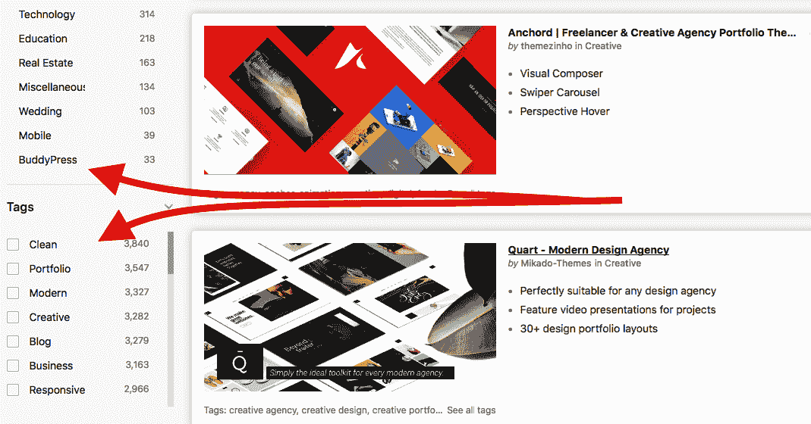

您也可以在网上做一些研究，了解您所在领域和您网站类型所使用的主题的标准。例如，如果您正在考虑创建一个照片博客，找出其他照片博客使用的是什么类型的主题——它们是否有很多侧边栏？它们发布的照片有多大？是否有许多静态页面？等等。想法是这样的：不要重新发明轮子。如果您计划推出的站点与您计划推出的站点有显著数量的相似站点，那么您应该始终尝试从它们那里学习，然后在选择主题时做出明智的决定。

# 主题许可

如果您从官方目录获取主题，那么这部分与您无关。

然而，当从专业主题商店获取主题时，您通常有两个或更多关于许可证的选择。如我之前提到的，价格范围通常在 20 到 100 美元之间。现在，有许多许可模式，但以下两个示例是网络中最受欢迎的：

+   **标准单站点许可证**：这允许您使用该主题创建一个站点。如果您只是想为自己寻找一个主题，并且不打算在其他人的站点上使用它，那么这是推荐的选择。这是最便宜的许可证类型。

+   **开发者许可证**：此许可证针对开发人员和希望使用主题创建多个站点的人。此外，该套餐通常包括 PSD 项目文件和其他中期开发文件（请注意，一些单站点许可证也包括这些）。开发者许可证的价格可能是标准单站点许可证的两倍。

# 仅提供最新主题

这可能是这里最重要的参数。您的主题必须是最新的，否则将无法利用 WordPress 的最新功能。唯一的坏消息是，您无法确定一个主题是否是现代的。您只能依赖主题卖家提供的信息。但尽管听起来很糟糕，这实际上并不是一个大问题，因为严肃的主题商店无法承担在营销材料中撒谎的代价。所以，每当您看到一条消息说主题与 WordPress 版本 X.X 兼容时，它很可能是真的。此外，随着 WordPress 5 的发布，以及它带来的所有重大变化（与之前的版本相比），使用经过验证与 WordPress 5 兼容的主题非常重要。

此外，一个很好的经验法则是检查最后更新时间。根据您从哪个主题商店获取主题，这些信息可以在各种地方显示，因此我无法给您提供任何具体的建议在哪里寻找它。尽管如此，如果您从[`wordpress.org/themes/`](https://wordpress.org/themes/)的官方目录获取主题，那么您可以在每个主题页面的右侧边栏中找到这个细节（标记为“最后更新”）。

# 可定制的主题

在考虑主题时，确保找到以下问题的答案：

+   侧边栏是否灵活？我能选择显示多少个侧边栏？

+   这个小部件准备好了吗？

+   它支持自定义菜单吗？

+   它是否与 WordPress 5.0 中引入的新 WordPress 块编辑器兼容？

+   主题是复杂的还是简单的？我更喜欢哪一个？

+   它是否支持自定义设置面板？或者它是否提供了一个*主题设置*页面，我可以在这里自定义布局、分类显示、主页和其他选项？

在 WordPress 发展的这个阶段，我建议拒绝任何不支持小部件、自定义菜单、没有提供良好的自定义功能或似乎与新 WordPress 块编辑器不兼容的主题。所有这一切背后的理念是，如今，可以直接使用主题的情况很少见，所以至少有几种自定义可能性会非常有益。

# 响应式结构的主题

这是在现代主题中的一项新参数。在过去，如果你想使你的网站适合移动设备，你需要安装一些插件和额外的移动主题，然后同时启用它们来工作。现在，有了 HTML5 和 CSS3，你只需使用一个主题，就可以确信它将在所有可能的设备上看起来都很棒（从台式电脑到笔记本电脑，再到移动设备）。所有这一切的关键词是*响应式设计/结构*。

每当主题开发者表明他们的主题是响应式的，这意味着它与人们现在用来上网的所有设备兼容。简而言之，每当一个主题是响应式的，这个事实肯定会在官方销售/下载页面上提到。

# 支持、评论和文档

这尤其重要，如果你正在购买付费的付费主题。简单地说，因为你正在花钱，你自然想确保你得到的产品是一个质量好、提供良好客户服务和精心设计的功能的优质产品，因此文档、评论和客户支持的重要性不言而喻。就是这样简单。

我必须承认，选择一个主题可能需要一些时间，尤其是如果你必须记住我们刚刚提到的所有内容，但这项工作肯定会物有所值。让我们不要忘记，你可能会至少使用这个主题一年或两年（这是一个常见的场景），所以你当然不希望把钱花在低质量的产品上。

# 安装和更换主题

现在你已经选择了想要使用的主题，你需要将其安装到你的 WordPress 网站上。你将有以下两种选择，就像添加新插件时一样：

+   如果你想要的主题在 WordPress 主题目录中，你可以直接从`wp-admin`中添加主题

+   否则，你将不得不下载主题的 ZIP 存档，然后手动将其上传到你的网站

# 从 wp-admin 中添加主题

如前所述，如果你从 WordPress 主题目录中选择了一个主题，你可以在`wp-admin`内部直接添加主题：

1.  首先，导航到“外观”，然后点击顶部的“添加新主题”按钮（如以下截图所示）：

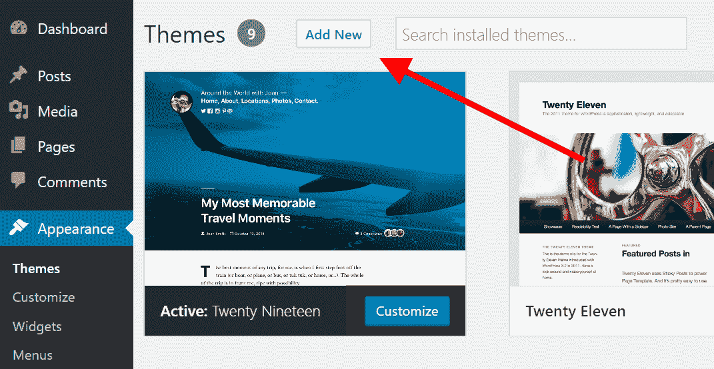

将出现的屏幕将与“添加新插件”屏幕非常相似。在顶部，你会看到一些熟悉元素，例如各种子导航链接（特色、热门、最新、收藏夹、功能筛选器），以及右侧的搜索框。你可以点击网格上显示的任何主题来查看其详细信息，以及一个漂亮的预览。

1.  使用“功能筛选器”（如下面的截图所示），你可以根据主题具有或不具有的功能来筛选一些主题。功能筛选器是找到提供所需特定功能范围的主题的绝佳方式。例如，你可以选择只显示具有响应式布局的主题。这将确保你的网站在所有设备上看起来都很棒，包括所有台式电脑、以及手机和平板电脑：

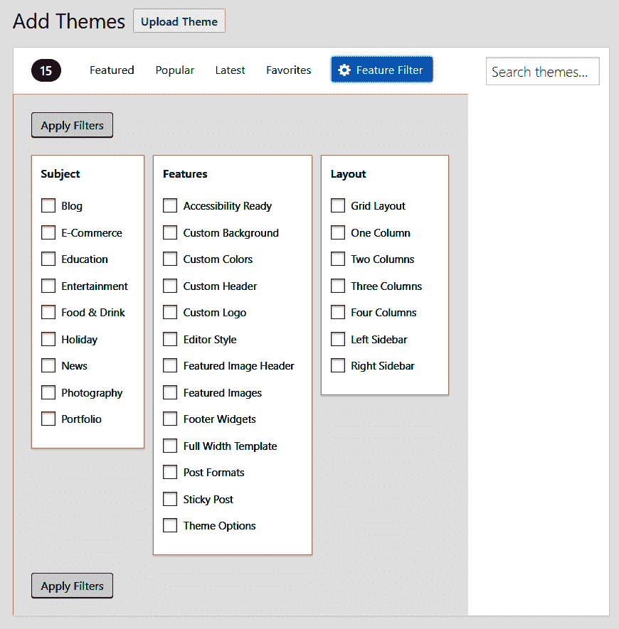

1.  现在，我已经找到了一个喜欢的主题，所以我不需要过滤，只需在搜索框中输入主题名称，如下面的截图所示：

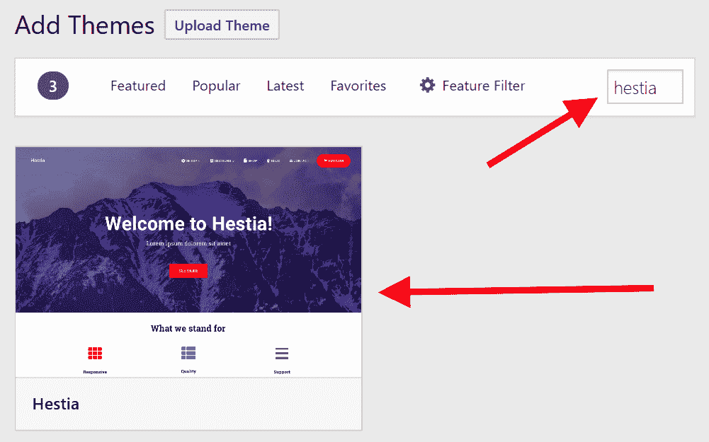

1.  当我悬停在主题块上时，我会看到额外的链接，用于查看详细信息、预览和安装。点击“预览”是一个很好的方式来查看主题在实际应用中的样子。当我点击“安装”时，主题将被自动下载并添加到我的主题收藏夹中（在`wp-admin`的“外观”部分可见），如下面的截图所示：

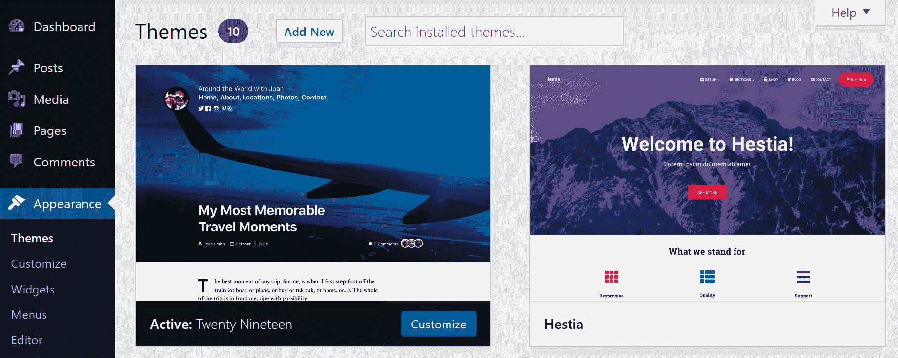

1.  点击主题后，我会看到一个包含所有详细信息的更大块，以及两个额外的链接来激活并查看主题的实时预览，如下面的截图所示：

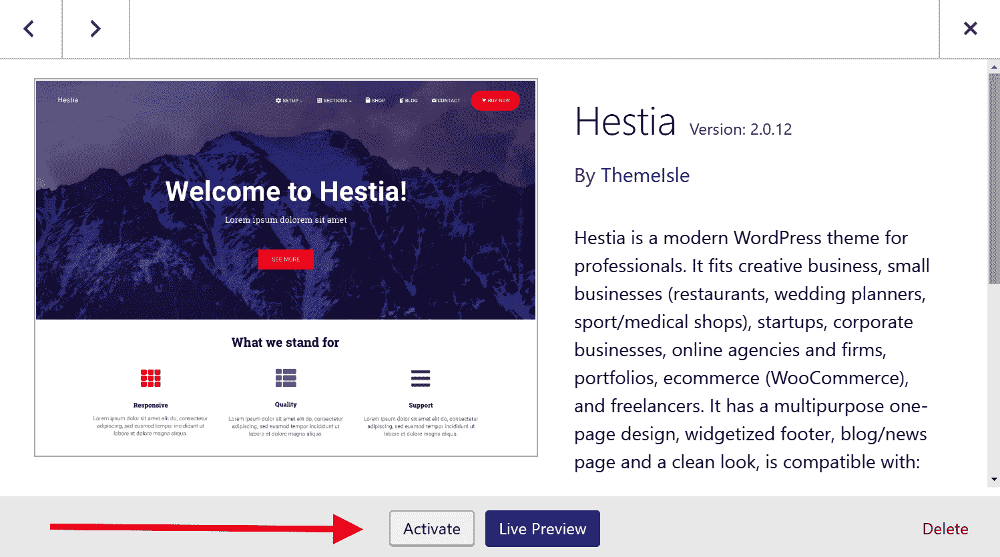

此时，点击“激活”按钮将导致主题被启用，并将其设置为网站上的新设计——而不是默认的“Twenty Nineteen”（当你首次安装 WordPress 时的默认主题）。

# 下载、解压和上传

如果由于任何原因你无法在`wp-admin`内部安装主题，你将不得不使用以下程序。

此外，由于外部主题来源（如各种主题商店和独立开发者）的日益流行，手动下载和安装主题已成为处理事务的默认方式，并逐渐取代了从官方目录获取主题的传统方法。

因此，为了在解释手动安装时提供一个好的例子，我将获取一个主题（一个免费的）并指导您完成安装过程：

1.  要开始，您需要下载您想要的主题并将其 ZIP 存档保存在您的桌面上的某个位置。不要解压存档。我想尝试的主题叫做*Underscores*，这是一个免费的起始主题，可在[`underscores.me/`](https://underscores.me/)找到。

1.  根据您主题的来源，为了真正获取它，您可能需要创建用户账户、进行购买或注册时事通讯等。当然，有时可能只有一个直接下载链接。Underscores 使用一个非常简单的模式。您需要做的只是输入您想在[`underscores.me/`](https://underscores.me/)字段中使用的主题名称（可以是您想要的任何名称）。然后，点击生成后，您将获得 ZIP 下载：

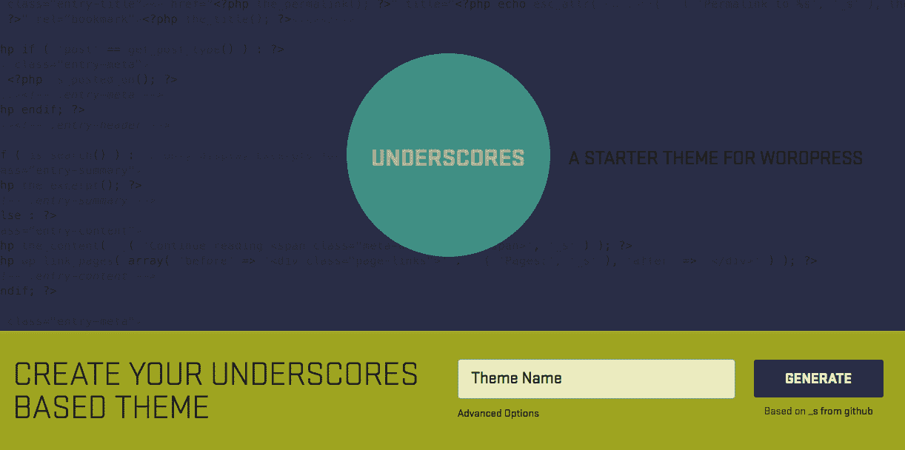

1.  在这个阶段，您可以通过`wp-admin`导航到外观 | 主题并点击添加新按钮来上传那个 ZIP 文件。在那里，点击上传主题按钮，这将带您到可以最终执行手动安装的地方，如下面的截图所示：

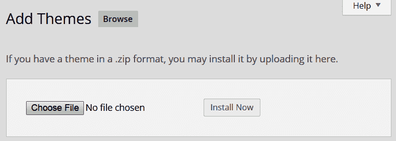

1.  您在那里需要做的只是从您的桌面上选择 ZIP 文件，然后点击安装现在按钮。片刻之后，您将被重定向到成功页面，在那里您将能够激活您的新主题。

如果这个方法不起作用，请继续以下步骤手动提取和上传主题文件。

1.  如果您使用的是 Mac，ZIP 文件可能已经自动解压，在这种情况下，您会在桌面上看到一个目录而不是 ZIP 文件，或者除了 ZIP 文件外还有目录。如果没有，那么请手动解压/解压，以便您在桌面上有主题目录。

1.  以下截图显示了下载的 Underscores 主题的文件内容。除了必需的`style.css`文件和`index.php`文件外，它还有许多其他文件，用于处理不同的任务并处理主题的显示和功能各个方面：

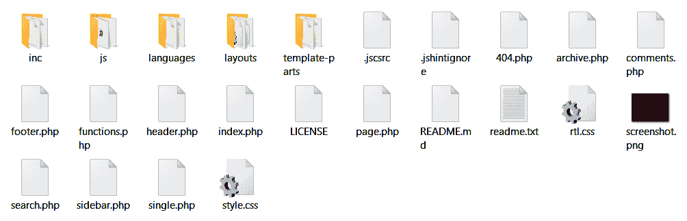

1.  您需要将主题目录上传到您的 WordPress 网站。正如您在第二章“WordPress 入门”中所做的那样，您需要与您的服务器建立 FTP 连接。一旦连接，导航到您的 WordPress 网站安装目录。

1.  接下来，进入`wp-content`目录，然后进入`themes`目录。你将在这里看到已经有一个名为`twentynineteen`的主题目录（可能还有其他一些）。这些是随 WordPress 预先安装的主题。你在这里需要做的唯一一件事就是上传你刚刚解压的目录，让它与默认的`twentynineteen`目录并排放置。就这样了！

到目前为止，当你回到`wp-admin`中的“外观”时，你将看到等待在那里的新主题。现在剩下的唯一一件事就是激活它，并使用它作为你网站的主要设计。

# 摘要

本章介绍了如何管理 WordPress 网站的基本外观。你学习了在哪里可以找到主题，为什么它们是有用的，各种主题之间基本区别是什么，如何为你的网站选择一个完美的主题，以及如何手动通过`wp-admin`安装主题。

在下一章中，你将学习如何自定义现有的 WordPress 主题，从而使你的网站呈现出你想要的样子。
