# 第八章：定制您的网站外观/设计

在这个阶段，您已经知道 WordPress 在您网站上可以拥有多少种设计——这都归功于主题。然而，仅仅获取一个主题并直接使用它并不一定是最佳优化方法。因此，在本章中，我们将更进一步——您将学习如何定制您的主题，使您的网站看起来完全符合您的期望。

我们将首先讨论如何管理导航菜单以及如何使用基本的布局定制功能来进一步增强您整个网站的功能。然后，我们将讨论小工具及其如何使用来使您的侧边栏更加实用和读者友好。我们将涵盖 WordPress 定制器的话题，以及它能为您的整体网站展示带来什么。最后，我们将讨论 Google AMP 以及如何确保您的网站在移动设备上的显示不仅仅是优化过的。

让我们看看本章我们将探讨的主题：

+   菜单

+   小工具

+   WordPress 定制器

+   优化移动设备和使用 AMP

# 菜单

菜单对于任何网站的导航便捷性和帮助读者找到东西起着非常重要的作用。一个经典的网站菜单是显示在页面顶部附近，列出作为网站一部分的各个子页面。这些通常包括*关于*和*联系*等页面。在幕后，菜单只是指向您网站内不同区域的简单链接列表。

恰好，WordPress 以非常用户友好的方式处理菜单。您可以轻松创建包含指向页面、文章、分类存档甚至任意 URL 的链接的菜单。当您完成配置菜单本身后，您可以将其添加到设计中以显示。

# 添加菜单

让我们看看菜单管理屏幕。

1.  要到达那里，只需导航到“外观 | 菜单”：

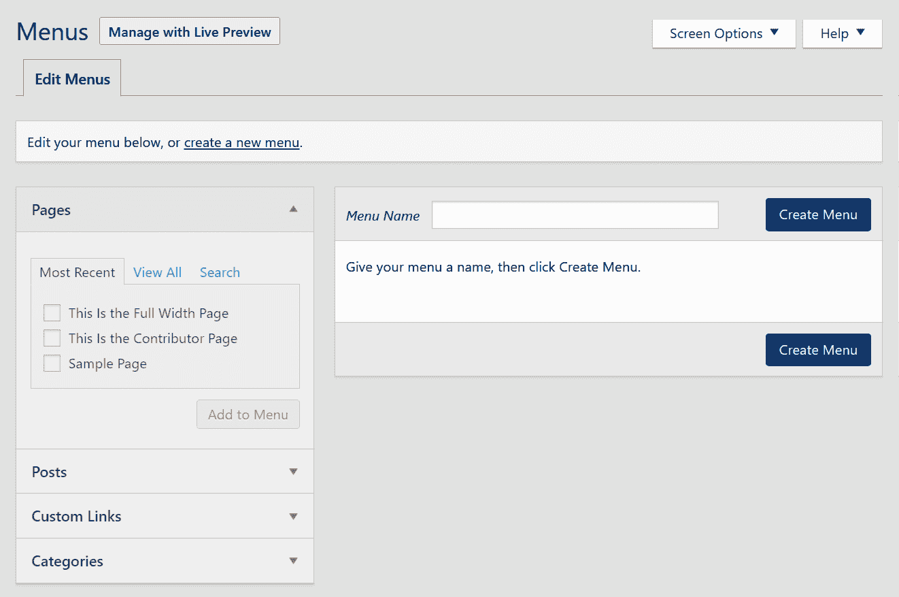

1.  要创建您的第一个菜单，在“菜单名称”处输入一个标题（例如，*主菜单*），然后点击“创建菜单”。

1.  在这样做之后，您可以从左侧的面板中选择单个*页面*并点击“添加到菜单”按钮以确认：

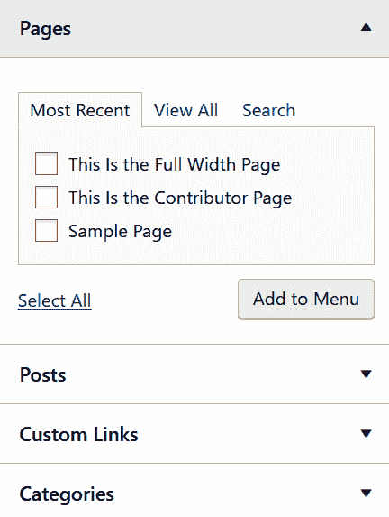

1.  如果您想将特定的博客文章添加到菜单中，您也可以这样做。只需点击面板中的“文章”标题，然后选择您想要链接的确切文章。为了确认，点击“添加到菜单”：

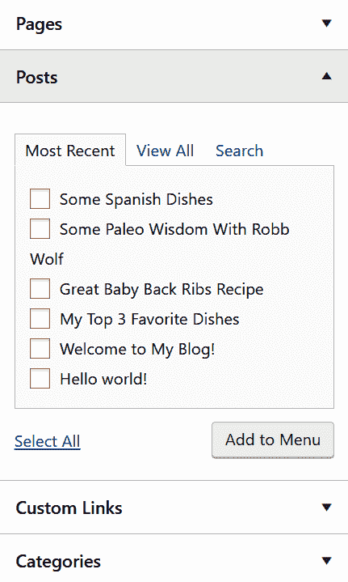

1.  您还可以在菜单中添加一些自定义链接。这可以通过点击左侧的“自定义链接”标题并填写所需的链接信息来完成。为了确认，点击“添加到菜单”：

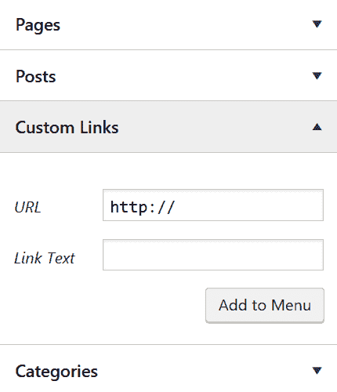

1.  接下来，您可以添加一些分类链接。点击左侧的“分类”标题，然后点击您想要包含的分类旁边的复选框。点击“添加到菜单”以确认：

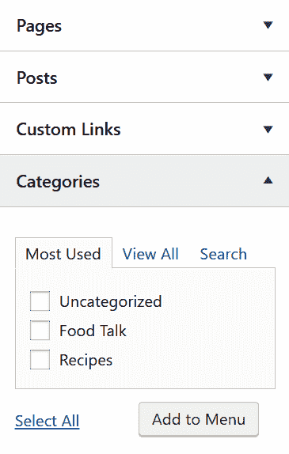

1.  最后，请确保点击右上角的“保存菜单”。以下是我新菜单现在的样子：

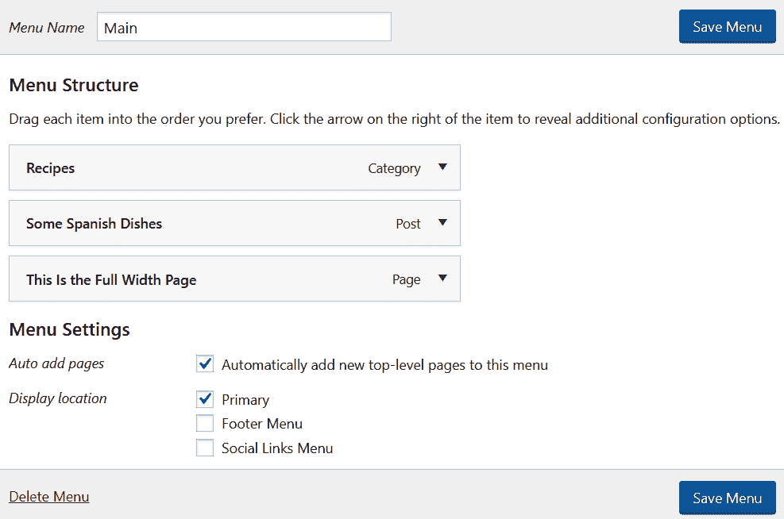

1.  您还可以将项目拖到右侧，使其成为上方项目的子项。例如，我将我的一个帖子作为子项拖到“食谱”分类下。现在，我的菜单看起来如下截图所示：

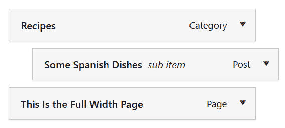

您可以通过点击顶部的“创建新菜单”链接并重复此过程来创建更多菜单。

现在，您可能会问：*我创建了新的菜单，但如何让它在我的网站上显示出来？*

# 显示菜单

如果您有一个启用了菜单的主题（您可能已经有了），那么，一旦您有一个菜单，在“菜单”页面上就会出现一个新的框，显示菜单位置。Twenty Nineteen 有三个菜单位置，它们分别命名为“主要”、“页脚菜单”和“社交链接菜单”：

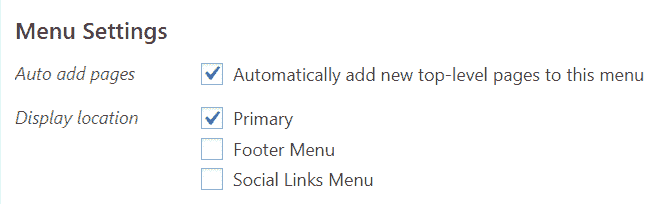

将您新创建的菜单分配到 Twenty Nineteen 预设菜单区域，您只需勾选一个复选框，如图所示的前一个屏幕截图。目前，我网站上的主要导航看起来如下截图所示：

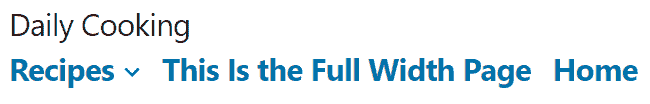

当我点击“食谱”旁边的向下箭头时，我还会看到我保存为子项的其他帖子，如图所示的下个屏幕截图。Twenty Nineteen 在悬停菜单中显示子项：

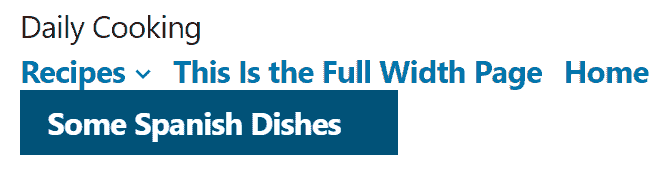

# 小部件

小部件是 WordPress 中的一种原生机制。它们的主要目的是为我们提供一个简单易用的方式来自定义网站的侧边栏、页脚和页眉，并添加额外内容。尽管小部件最常见的位置确实是侧边栏，但唯一实际的规则是，小部件必须显示在*小部件区域*内，并且小部件区域可以位于主题开发者希望它所在的位置。常见的小部件包括以下内容：

+   博客文章的月度存档

+   一个可点击的页面列表

+   一个可点击的最新帖子列表

+   一个包含登录/登出链接、RSS 订阅链接和其他 WordPress 链接的元数据框

+   在博客上发布的最新评论

+   一个可点击的分类列表

+   一个标签云

+   一个文本和 HTML 的块

+   一个搜索框

这些天，几乎所有主题都启用了小部件功能，并提供一个或多个可用的小部件区域。如果我要简化一下，我会说小部件区域的行为就像菜单的位置。

要控制您新网站上的小部件，请执行以下操作：

1.  导航到外观 | 小部件。Twenty Nineteen 只包含一个小部件区域，如图所示，称为页脚：

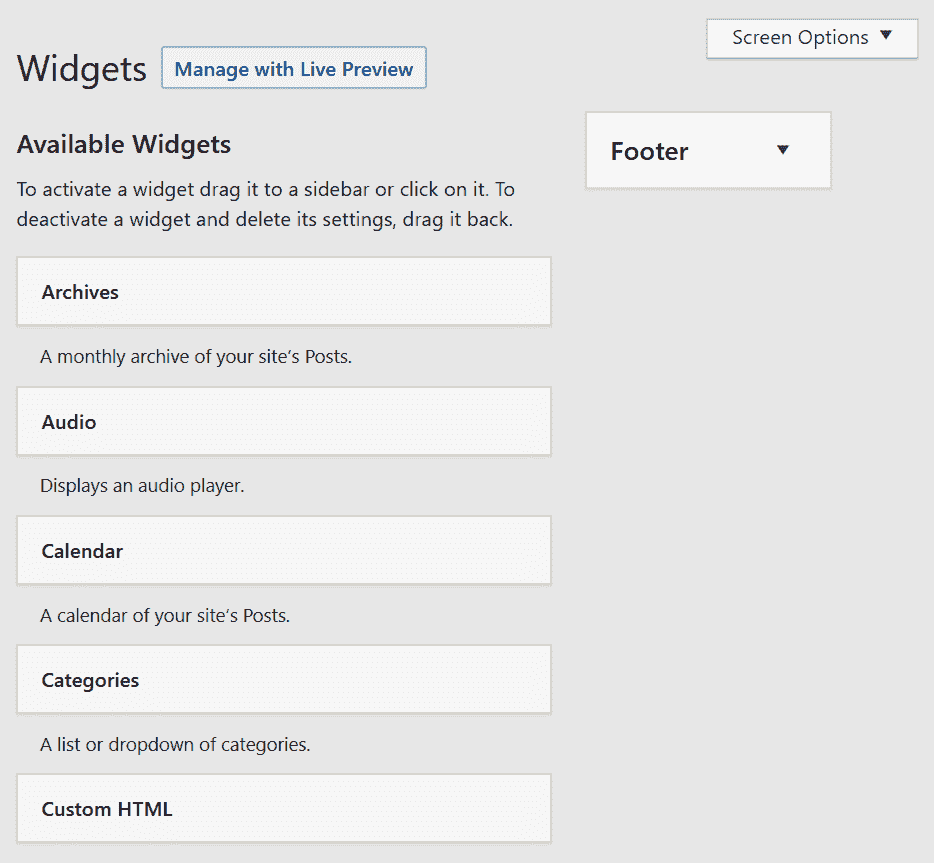

1.  正如名称所示，这个部件区域出现在网站的页脚。你与部件的交互方式非常简单。你唯一需要做的就是从左侧可见的任何部件中选取一个，并将其拖放到任何可用部件区域下的右侧区域。例如，让我们以导航菜单块为例，将其拖动到页脚。结果如下面的截图所示：

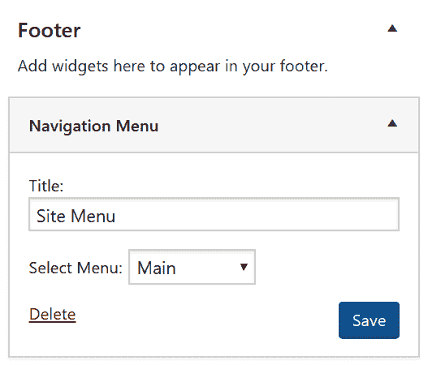

1.  现在，我们可以给这个块添加一个标题，并使用下拉菜单选择我们想要包含在这个部件中的自定义菜单。目前只有一个菜单，是我们之前创建的，名为“主菜单”。一旦我们点击“保存”按钮（如前面的截图所示），我们的菜单就会被添加到适当的位置。

1.  到目前为止，我们在网站上显示了主菜单两次。一个在顶部区域，另一个在页脚内。正如你所见，如果你想在网站上某个位置放置菜单，你有两种方式可以实现。你可以在“外观 | 菜单”部分分配它，或者将其作为导航菜单部件，并将其放置在你主题支持的任何部件区域中。

1.  启用任何其他类型的部件与刚才描述的过程非常相似。你只需要拖动你喜欢的部件，并将其放置到你希望显示它的区域。然后，一旦部件放置好，你可以调整其设置和内容。

1.  当你在“外观 | 部件”部分工作时，你可以点击任何部件右侧的小向下箭头以展开详细信息并查看选项。你可以从左侧的可用部件集合中拖动一个新的部件，你可以上下拖动现有的部件以改变它们的顺序，并且你可以通过展开它然后点击“删除”来删除一个部件。

1.  尝试将部件放入不同的部件区域，然后刷新你的博客以查看它们的样式。如果你对任何部件进行了更改，请务必点击“保存”。

1.  此外，在屏幕底部，还有一个名为“无效部件”的额外部分，如下面的截图所示。许多部件都有它们的设置和参数。因此，即使你现在不想在网站上显示特定的部件，但又不想丢失其设置（以防将来你想再次使用该部件），这个部分就是放置它的位置。正如标签所说，这是你可以拖动你的部件以将其从显示中移除但保留其设置的地方。这也是你将找到任何之前激活但现在在切换到不使用相同部件区域命名约定的主题后自动停用的部件的地方：

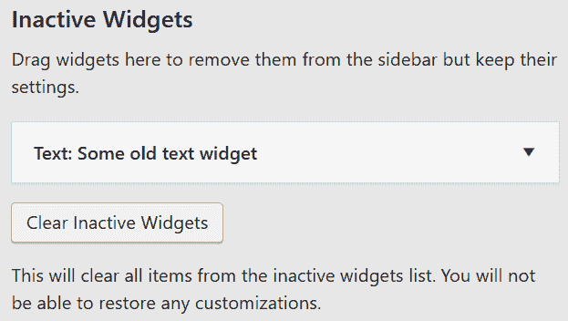

# WordPress 自定义器

WordPress 中另一个高度依赖于您主题的功能是自定义器模块。如果您在仪表板的屏幕设置中仍然启用了欢迎框，您可以通过单击下面的截图所示的 自定义您的网站 按钮来访问此模块：

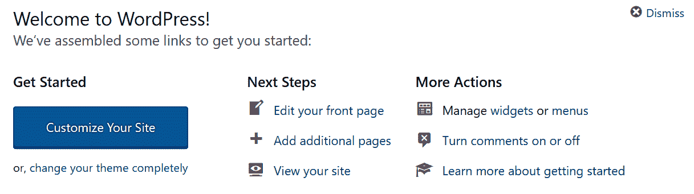

访问此模块的另一种方式是通过访问 `http://yoursite.com/wp-admin /customize.php`。这是您将看到的内容（假设您正在使用默认主题）：

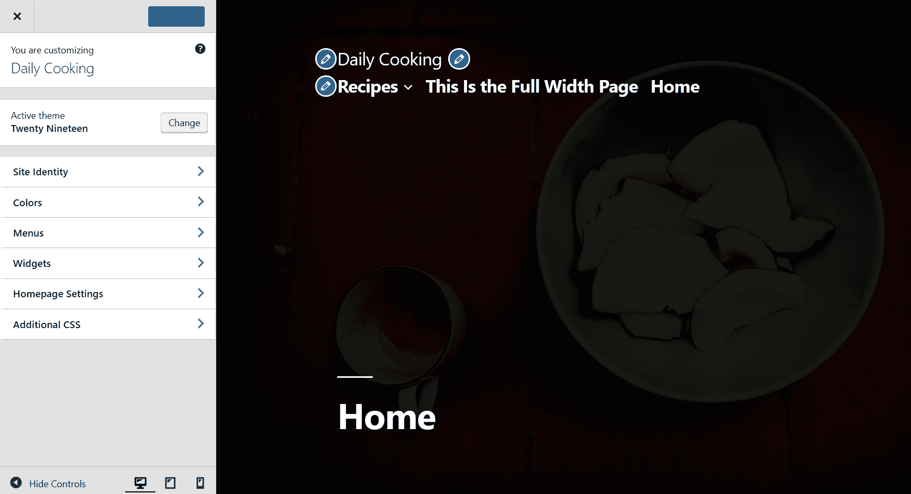

通过浏览左侧的各个选项卡，您可以调整您网站的各种方面——一些我们在本章中已经讨论过，还有一些是完全新的。我们将在这里查看它们。大多数主题中可用的自定义化如下：

+   网站标识

+   颜色

+   标题媒体

+   菜单

+   小部件

+   首页设置 / 静态首页

+   额外的 CSS

这个模块最好的地方是它提供了一个实时预览，这使得编辑设计的基本方面变得更快。完成编辑后，您可以在左上角可见的 X 按钮或 保存并发布 按钮上单击。

在我们深入了解自定义器的各个部分之前，让我们先看看界面各个部分那些好奇的铅笔图标。您可以在下面的截图中看到一个示例：

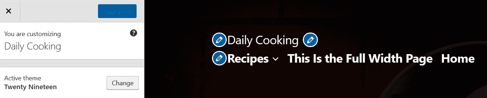

简而言之，这些是快捷图标。这意味着它们会显示在可以自定义编辑的特定界面元素旁边。因此，您无需在左侧边栏中搜索特定的自定义设置，只需单击相应的快捷图标，您就会立即跳转到正确的选项面板。例如，如果您单击网站的标题，您将跳转到可以编辑它的确切部分，如下面的截图所示：

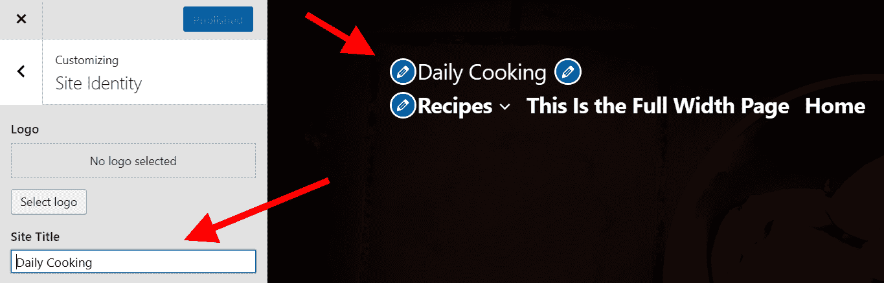

我们将在浏览自定义器时逐一探索这些选项。

# 网站标识

网站标识 是自定义边栏中第一个可用的区块：

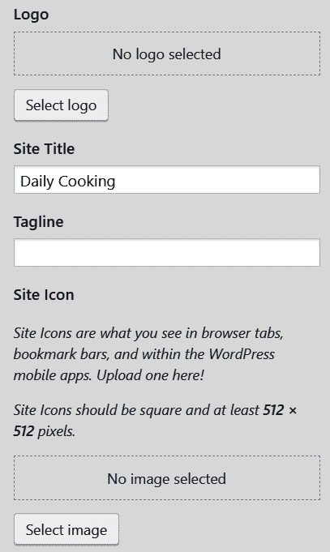

当您单击它时，您将能够调整诸如网站的 Logo、网站标题、标语和网站图标等设置。然而，这里需要说明的是，所有这些选项对您网站的影响在很大程度上取决于您当前的主题。例如，一个主题将显示的标志位置与另一个主题完全不同，网站标题也是如此，等等。因此，始终尝试那里的设置，并亲自了解它们的效果是个好主意。在幕后，我们正在处理的选项只是标准的输入字段和图像/媒体选择面板。这正是我们在本书的前几章中已经涵盖的内容

对于大多数 WordPress 主题来说，通常有一个元素是相同的，那就是“网站图标”设置。网站图标是可见于您网络浏览器窗口角落的小图标。例如，如果您访问这个图书出版商的网站[`www.packtpub.com/`](https://www.packtpub.com/)，您将看到以下截图所示的网站图标：

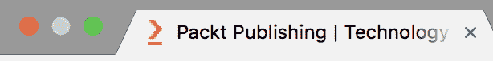

总体来说，网站图标是给您的网站在访问者的网络浏览器中提供一些视觉表示的好方法，这样他们就可以在同时打开多个浏览器标签时更容易地识别它。您可以通过自定义选择器轻松选择您的网站图标。目前推荐的图标图像尺寸至少为宽 512 像素，高 512 像素。

# 颜色

自定义选择器侧边栏的第二部分被标记为“颜色”。在这里，您可以选择当前主题为网站预定义的配色方案之一。Twenty Nineteen 主题在那里有两个选项，如下面的截图所示。此外，还有一个额外的设置来定义主颜色是否会影响您页面或文章的特色图像（自己尝试一下看看效果）：

从“默认”切换到“自定义”会将网站设计从白色背景颜色切换到您想要的任何颜色。如果您点击“自定义”，您就可以使用颜色选择器以更自由的方式调整设计中使用的某些颜色。

# 页眉媒体

页眉媒体是自定义选择器侧边栏中的另一个流行部分。尽管如此，这并不是当前默认主题 Twenty Nineteen 中可用的部分。然而，我在这里描述它，因为您很可能在其他许多主题中找到它。为了演示这一点，我将切换到 WordPress 的先前默认主题 Twenty Seventeen。这是使用该主题时的“页眉媒体”部分的外观。请参考以下截图：

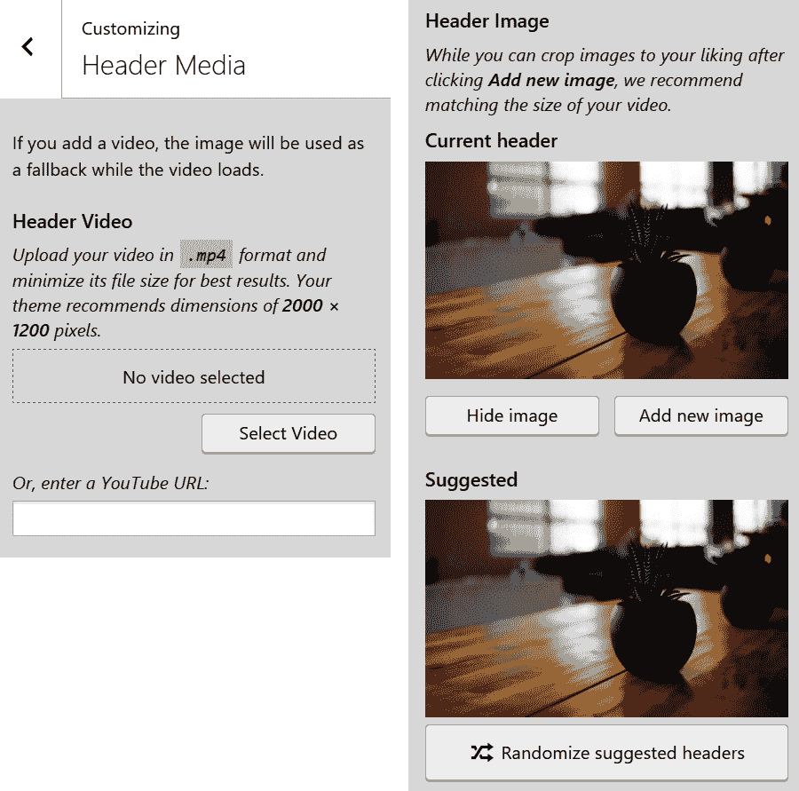

大多数主题将允许您选择任何图像放置在页眉中，有时甚至是一个视频，就像 Twenty Seventeen 一样。Twenty Seventeen 对页眉图像也有一些具体要求（实际上，大多数主题都有，Twenty Seventeen 只是其中的一个例子）。建议的尺寸是宽 2000 像素，高 1200 像素，但您不必过于担心这一点，因为 WordPress 也提供了一些方便的图像编辑工具。您在这里需要做的就是使用“选择图像”或“添加新图像”按钮，从您的“媒体库”中选择一张图片，或者上传一张新图片。WordPress 会立即将您重定向到上述图像编辑工具，在那里您可以调整和裁剪您的图像，如下面的截图所示：

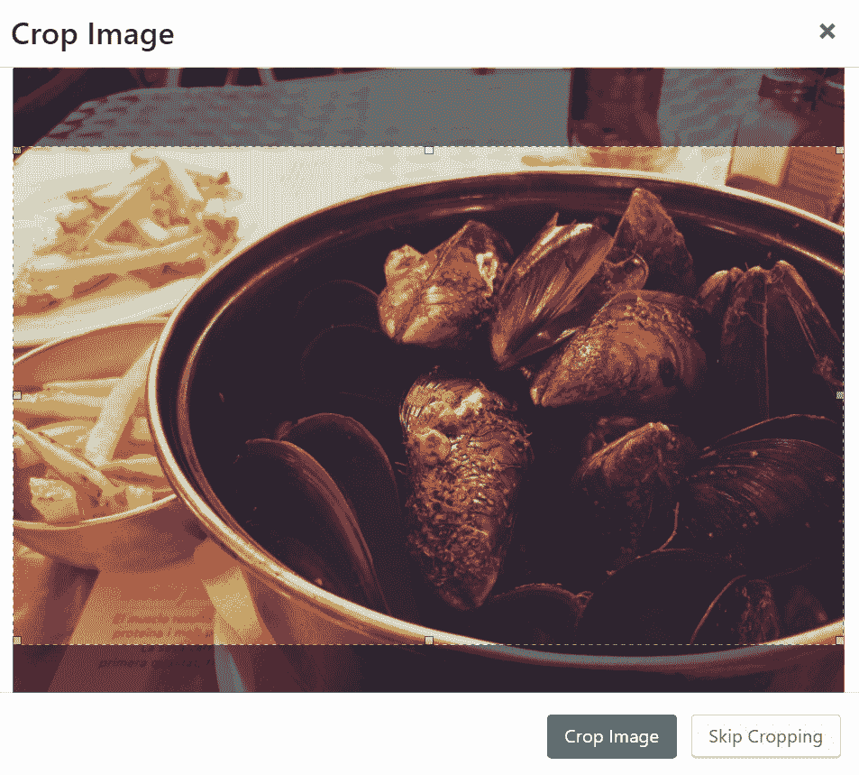

在点击“裁剪图片”按钮然后“保存并发布”后，我们就完成了设置标题图片。以下是网站可能的样子：

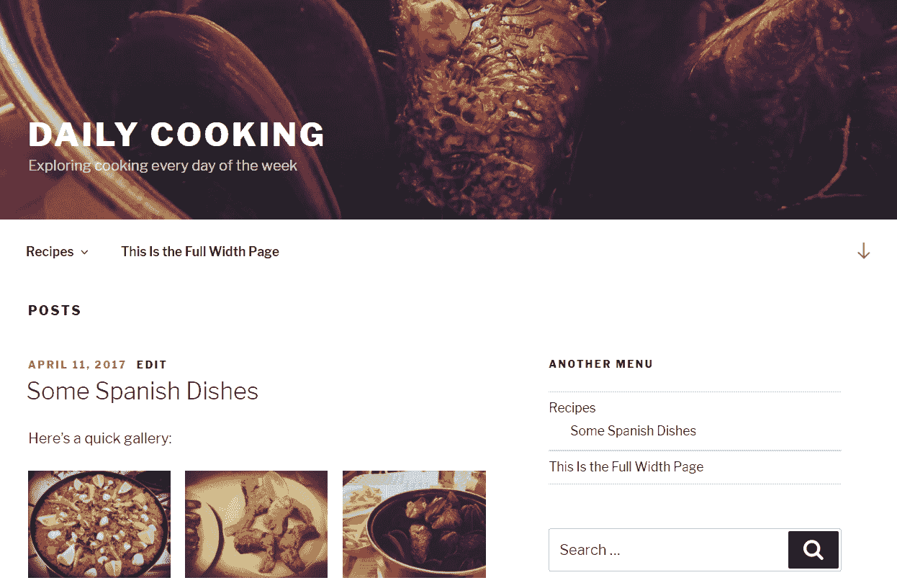

# 背景

一些 WordPress 主题还允许您调整不仅标题，还有整个网站的背景，这意味着您可以将任何图片放置在整个网站的背景中，并使其始终保持在那里。这与桌面壁纸类似，但适用于您的 WordPress 网站。尽管当前默认主题“二十九”不提供此功能，但这在其他主题中仍然是一个非常常见的功能，所以让我们使用另一个前默认主题“二十十五”来讨论它。

如果您使用该主题，并进入自定义器，您将在侧边栏中看到一个名为“背景图片”的新部分，如以下屏幕截图所示：

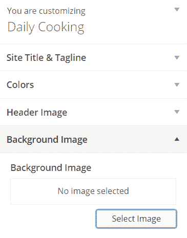

我们必须做的第一件事是选择我们想要放置在我们整个网站背景中的图片。让我再说一遍：我们的整个网站。在选择图片后（只需点击前一个屏幕截图中可见的“选择图片”按钮），预览块将被刷新，您将能够看到您的背景在当前时刻的样子。立即，在选项块底部出现了一些新的选项：

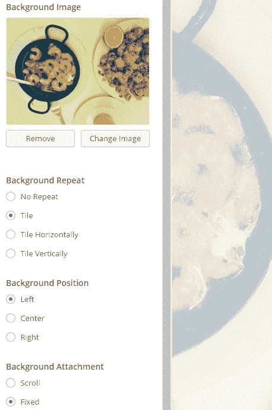

各种选项如下：

+   背景重复：这可以是无重复、平铺、水平平铺或垂直平铺：

    +   无重复：这意味着您的背景图片只会显示一次，当访客向下滚动时，背景图片将简单地*耗尽*。

    +   平铺：这是最受欢迎的设置，实际上也是默认设置。这意味着 WordPress 将在两个维度（宽度和高度）上重复您的图片。无论访客浏览您网站的哪个部分，背景图片始终可见。

    +   水平平铺：这将在水平方向上平铺您的图片。

    +   垂直平铺：这将在垂直方向上平铺您的图片。

+   背景位置：这可以是左、中或右。这决定了背景图片是否应该对齐到左、中或右。

+   背景附件：这可以是滚动或固定：

    +   滚动：您的图片会随着内容滚动。

    +   固定：您的图片保持在固定位置。换句话说，它始终静止在背景中。

我鼓励您在调整网站时尝试这些设置一段时间。

# 小工具

尽管我们在本章前面讨论了小工具，但自定义器为您提供了另一种使用它们的方式。您可以在名为“小工具”的部分中这样做。

一旦点击它，你将看到当前主题中所有可用的“小工具区域”。然后，当你点击任何一个区域时，你将看到分配给该特定区域的“单个小工具”。所有这些小工具都可以像我们在本章前面所做的那样轻松编辑；方法是一样的。

# 主页设置或静态前端页面

在自定义设置中，这个下一部分通常被称为“主页设置”或“静态前端页面”，具体取决于你使用的特定主题。一旦你导航到那里，你将能够更改当访客访问你的主页时显示的页面的主要设置——你网站的地址。你可以在以下设置中进行一些设置：

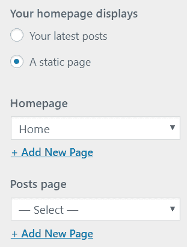

一旦进入那里，你将能够在“您的最新文章”的默认设置（在这个模式下，主页只是您最新博客文章的经典列表；这可能是你习惯的默认设置）和新的设置“静态页面”之间进行选择。第二个选项允许你将任何你希望的页面设置为网站的首页。你可以从“主页”下的下拉列表中选择一个现有的页面，或者通过点击“+添加新页面”链接创建一个新页面。

如你从“*第四章，页面、媒体和导入/导出内容*”中可能记得的那样，我们在那里所做的就是创建一个新页面并将其设置为网站的定制主页。我们将其命名为“主页”——非常合适。重要的是要记住，你分配为主页的任何页面仍然是一个正常的页面，这意味着你可以通过`wp-admin`的“页面”部分像编辑其他页面一样编辑它。

除了主页之外，这里还有一个名为“文章页面”的另一个区块。如果你将主页改为静态页面，那么分配一个新的“文章页面”总是一个好主意。由于最新的文章列表将不再显示在主页上，新的“文章页面”将从现在开始处理这项任务。与主页一样，你可以选择一个现有的页面作为新的文章页面，或者创建一个新的页面。

然而，在这种情况下，实际上创建一个全新的页面比选择一个现有的页面要方便得多。你可以将其命名为 BLOG 或另一个类似的名称，以传达页面的目的。这个页面的有趣之处在于，你不需要手动编辑它或在其上放置任何内容。WordPress 会自动填充这个页面，所以你唯一需要做的就是创建它，仅此而已。

如果你创建了新的“文章页面”，别忘了从你的主菜单中链接它。否则，当你的观众访问你的网站时，他们将无法找到它。我们在本章前面讨论了菜单。

# 额外 CSS

额外 CSS 是自定义设置的最后一块。如果你想在当前主题中包含一些自定义更改，而这些更改无法通过其他方式实现，这将很有用。一旦你点击“额外 CSS”，你将看到一个文本输入块，你可以在这里输入任何你想要的 CSS 代码。不过，请注意。如果你不确定自己在做什么，处理原始 CSS 代码可能会迅速引起问题。总的来说，这个部分是为高级主题自定义而设计的：

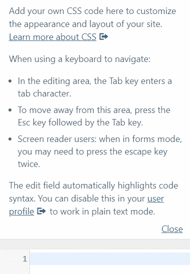

# 安排你的设计更改

在 WordPress 自定义设置中，你还可以做的一件有趣的事情是安排你的更改在指定日期公开，而不是立即推出。

默认情况下，当你点击主“发布”按钮时，你对网站所做的任何更改将立即公开。为了安排更改，请点击 WordPress 自定义设置中主“发布”按钮旁边的*齿轮图标*。然后，从出现的部分中选择“安排”，然后选择你希望更改公开的确切日期和时间。参考以下截图：

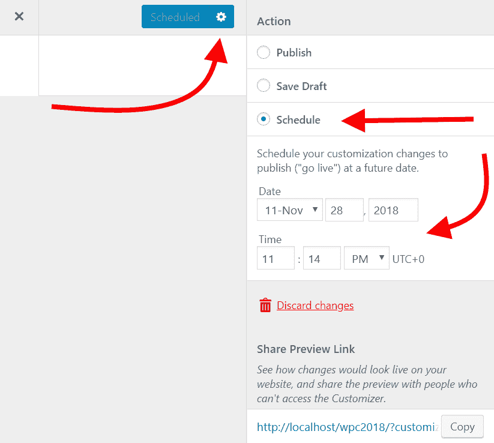

除了这些，你可能还在前面的截图中发现了一个可用的*预览链接*。你可以用它来与他人分享你的更改，或者稍后自己回顾。

在实际的真实场景中，当你在实时网站上工作时，这个整个功能可能会很有用。你并不总是希望你的更改在你完成工作后立即上线。为计划发布做准备通常是一个更有吸引力的视角。此外，多亏了这个功能，你可以在网站流量高峰时段避免推出更改。

# 自定义预览

最后但同样重要的是，在自定义设置窗口的左下角有四个有趣的图标，如下面的截图所示：

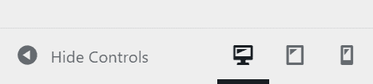

从左到右，它们是“隐藏控件”按钮（这个按钮会隐藏整个自定义设置侧边栏，以便你在调整网站时有一个更大的画布），*桌面视图*图标，*平板视图*图标，和*移动视图*图标。最后这三个图标尤为重要。如今，越来越多的人倾向于在移动设备上浏览网页，而不是在经典的桌面电脑上。因此，确保你的网站在这些设备上正确显示至关重要。这三个图标——桌面视图图标、平板视图图标和移动视图图标，允许你做到这一点。当你点击任何一个图标时，整个自定义设置窗口的大小将改变，以模拟平板和移动设备上的显示模式。在模式之间切换，你可以确保你的网站在所有设备上看起来都很棒。我们将在本章的下一部分详细讨论移动优化。

# 优化移动设备和与 AMP 协同工作

**加速移动页面**（**AMP**）是由谷歌推出的一项开源项目，旨在使无论用户使用什么设备，移动设备上的内容查看更加流畅和用户友好。

几年前，移动网络的概念才刚刚开始，许多网站在移动查看方面的优化非常糟糕。在那些日子里，由于技术不允许在手机上有效消费媒体，移动设备并不那么重要。然而，随着智能手机的引入，这一切都发生了变化。如今，使用移动设备上网的人数比使用桌面电脑和笔记本电脑的人数还要多。

显然，网站需要适应并为其默认的桌面视图提供优化的移动查看界面。

这就是 AMP 发挥作用的地方。在许多情况下，使现有网站对移动设备友好并不是一件容易的事情。如果你的主题/设计不是出厂时就进行了移动优化，那么在它上面添加移动功能可能会很困难。AMP 提供了一个更简单的解决方案。你不需要手动重建网站的部分，而是可以安装一个 AMP 模块插件，并自动完成。作为结果，你将得到一个网站的 AMP 版本。这个新版本将只对您的移动访客显示。以下是 AMP 成为好主意的原因：

+   它针对高性能进行了优化——AMP 页面几乎瞬间加载完成，这对于移动用户来说是一个更理想的场景，比等待几秒钟才开始在页面上看到任何内容要好——这是未针对移动查看优化的页面的常见情况

+   谷歌在显示移动搜索结果时更喜欢 AMP 页面

+   AMP 的设计简化了，将内容放在首位，因此让您的访客能够快速到达他们感兴趣的部分

让我们再加上这样一个事实：AMP 正迅速变得流行。据数据表明（[`theblog.adobe.com/google-amp-one-year-later`](https://theblog.adobe.com/google-amp-one-year-later)），到 2017 年 2 月，美国顶级出版商的 AMP 页面占所有网络流量的惊人 7%。

# 如何在 WordPress 中启用 AMP

毫不奇怪，有一个插件可以为你处理集成。它简单地被称为“WordPress 的 AMP”，你可以从[`wordpress.org/plugins/amp/`](https://wordpress.org/plugins/amp/)获取：

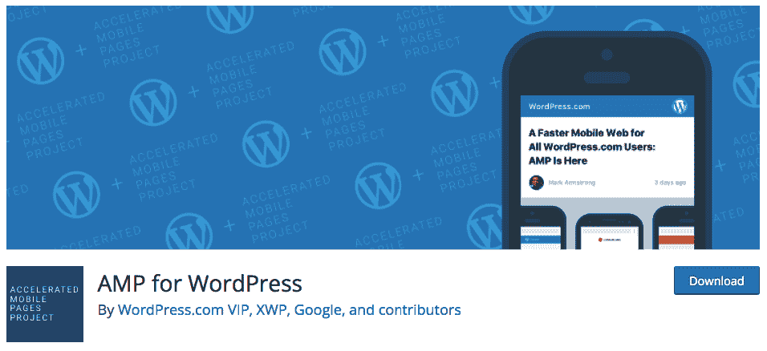

这个插件的使用简直不能再简单了。你唯一需要做的就是安装并激活它。之后，它会自动运行，无需人工干预。只有少数几个可选设置你可以调整。第一个可以在“AMP | 通用”中找到。默认情况下，WordPress 的 AMP 仅对博客文章启用。你可以通过开启它来为你的页面也启用：

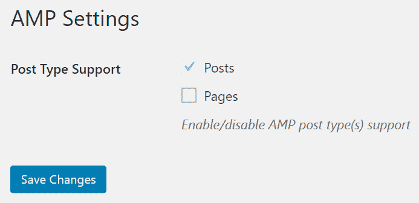

在这个阶段，你的网站已经完全集成了 AMP。每当有人尝试在移动设备上访问你的文章或页面时，他们将被重定向到其 AMP 版本。如果你在你的标准文章 URL 末尾附加`/amp/`，你就可以找到这些版本，例如：

+   **文章的标准版本**：`yoursite.com/some-post/`

+   **文章的 AMP 版本**：`yoursite.com/some-post/amp/`

你可以定制的第二件事是 AMP 主题的颜色方案。为此，转到外观 | AMP。你将能够更改颜色和颜色方案的整体氛围：

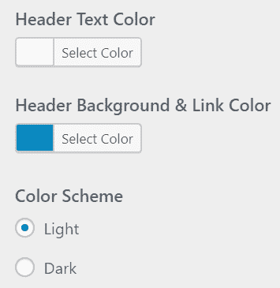

这就是一篇示例文章在转换为 AMP 并在移动设备上查看时的样子：

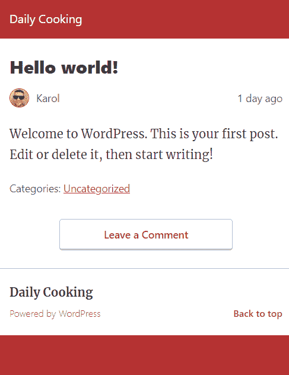

**了解更多：**

+   如果你想了解更多关于 AMP 项目的信息，官方网站是一个好的起点：[`www.ampproject.org/`](https://www.ampproject.org/)

+   这是一份针对开发者的*AMP 快速入门指南*：[`www.ampproject.org/docs/getting_started/quickstart`](https://www.ampproject.org/docs/getting_started/quickstart)

+   这是一份针对 AMP 页面的在线验证器：[`validator.ampproject.org/`](https://validator.ampproject.org/)

# 摘要

在本章中，你学习了主题定制的基础知识。你现在了解了菜单、小工具、页眉和背景设置，如何使用 WordPress 定制器，如何使你的网站准备好使用 AMP，以及更多。在这个阶段，你知道如何为你的网站挑选一个优秀的 WordPress 主题，然后如何精确地定制它以满足你的需求。

在下一章中，你将逐步学习如何从头开始构建自己的主题。
