# 第九章：开发你自己的主题

到目前为止，你知道如何在网络上找到主题并将它们安装到你的 WordPress 网站上使用。但是，WordPress 还有更多要提供，尤其是在主题开发方面。在本章中，你将学习如何将你自己的设计转换成一个完全功能性的 WordPress 主题，然后你可以在你的网站上使用它。你还将学习如何与其他网络用户分享你的 WordPress 主题。

在我们开始之前，你需要以下内容：

+   你自己的网站设计

+   将你的设计切割成 HTML 结构的能力

我们将从切割和切割的建议开始，以确保你的 HTML 和 CSS 文件尽可能符合 WordPress 的要求，然后介绍将 HTML 构建转换为完全功能性的主题的步骤。

注意，我假设你已经熟悉编写和使用 HTML 和 CSS。

本章我们将涵盖以下主题：

+   设置你的设计

+   将你的构建转换为主题

+   在你的主题中创建模板文件

+   使你的主题对小工具友好

+   在你的主题中启用菜单

+   使你的主题在 WordPress 自定义器中可编辑

+   创建子主题

+   分享你的主题

本章仅涵盖主题创建的非常基础的部分。实际上，这个主题值得有一整本书，而且确实有一本！我强烈推荐《WordPress 主题开发：入门指南》，作者 Rachel McCollin 和 Tessa Blakeley Silver，Packt Publishing。这本书详细介绍了你如何创建自己的主题，包括选择配色方案、考虑字体、编写最佳 CSS 以及使用快速设计合成来布局 HTML 等细节。如果这一章让你还想了解更多，就去那里看看吧！

# 设置你的设计

几乎世界上任何设计都可以变成 WordPress 主题。然而，你应该遵循一些关于你主题设计和 HTML/CSS 构建的一般指南。

# 设计你的主题以符合 WordPress 的要求

虽然你可以以任何你想要的方式设计你的博客，但一个好的起点是使用以下截图所示的标准博客布局：

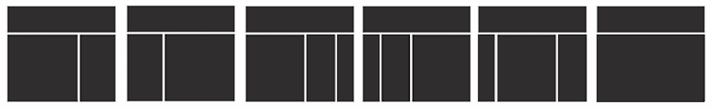

注意，虽然这些标准布局的列数不同，但它们大多数都有以下基本部分：

+   标题

+   主要列

+   侧边栏（s）

+   页脚

WordPress 期望你的主题大部分遵循这个模式。虽然你可以发挥创意，不在你的设计中包含一个或多个这些模块，但如果你不跳过任何内容，你将能从这次体验中获得最多的教育价值。WordPress 将为你提供使你的工作更轻松的功能。此外，一个保持与 WordPress 主题相同的一般设计模式的构建将很容易适应现有的插件和小工具。

话虽如此，在 WordPress 世界中，一个常见的情况是构建定制的首页或着陆页（即特定目的的页面，大多是商业用途），这些页面具有完全不同的设计。因此，你可能会遇到一眼看上去不像是用 WordPress 构建的网站。此外，许多现代主题框架也提供了创建此类自定义首页以及其他自定义页面模板的可能性。这都属于使 WordPress 能够运行任何类型网站的趋势的一部分。

在本章中，你将学习如何构建一个提供经典博客布局的基本 WordPress 主题。以下截图展示了最终产品的样子：

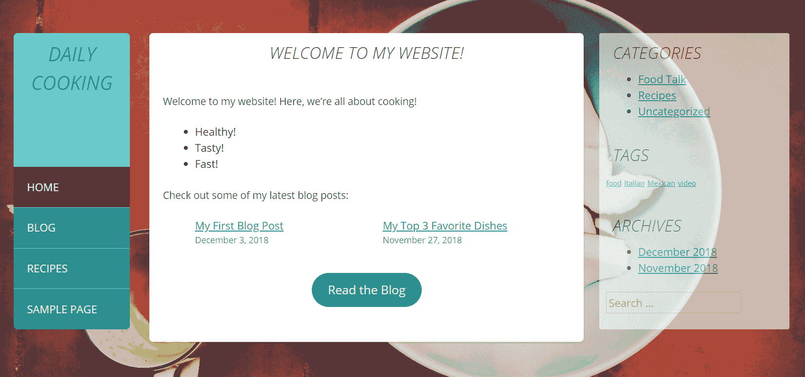

设计的 HTML 结构建立在 _S 启动主题之上（你可以在[`underscores.me/`](https://underscores.me/)上了解更多关于下划线的信息）上，视觉元素全部通过 CSS 完成，对原始 HTML 结构只做了最小程度的修改。

# 主题开发的三个路径

实际上，在开发你的新主题时，你可以遵循三条路径：

+   你可以选择从头开始，通过手动构建主题的 HTML 结构和功能结构

+   你可以在现有的主题框架之上进行工作，你只需要将你的设计适应框架本身提供的结构

+   你可以选择一个介于两者之间的解决方案

所有这些路径都有其优缺点。

# 从零开始构建主题

从零开始构建主题的主要优势是获得巨大的教育价值。当你从头开始开发主题时，你会学习到主题构建和功能的基础知识。这种知识对你的 WordPress 未来项目将大有裨益。

另一方面，这也是三条路径中最耗时的。在专业的生产环境中（在以设计和发展主题为职业的人中间），从头开始创建主题是一种耗时很高的方法，使其相当无效。这不仅仅关于适应设计（在主题框架中也必须这样做）；更多的是关于构建主题的核心功能。

# 使用框架构建主题

这种方法的主要优点是它的时效性和最终结果的质量。例如，如果你是从头开始构建主题，你必须确保在开发过程完成后很长时间内保持你的主题更新。问题是，WordPress 更新非常频繁（大约每 50-90 天更新一次），许多功能的目的随着时间的推移而改变——它们甚至可能被完全删除或被新的功能所取代。在这种情况下，只有保持更新的现代主题才能充分利用这些功能。显然，更新你的主题将需要大量的工作。这就是主题框架发挥作用的地方。本质上，主题框架是设计非常简约且没有视觉复杂性的主题。

框架的目的是通过充当父主题来成为任何未来主题的基础。框架本身没有设计的事实使得每个创作者几乎可以引入任何可想象的设计，同时充分利用框架提供的功能和结构。现在，优质框架的强大之处在于它们几乎与 WordPress 插件一样频繁地更新。简而言之，如果你使用框架，你不必担心你的主题过时。每当有更新可用时，你只需简单地执行它，然后忘记这一切。

这让我想到了使用主题框架的主要缺点。大多数情况下，主题框架都是庞大的、复杂的网络软件（超文本预处理器，或 PHP 脚本）。因此，如果你想有效地使用它们，你必须花大量的时间学习框架本身。除此之外，如果你决定以后切换到不同的框架，你将不得不重新学习（框架通常彼此非常不同）。正如你所看到的，使用框架带来的好处是有代价的。

下面是一些流行的主题框架（包括付费和免费的），如下所示：

+   **Gantry** (免费): [`gantry.org/`](http://gantry.org/)

+   **樱桃框架** (免费): [`www.cherryframework.com/`](http://www.cherryframework.com/)

+   **混合核心** (免费): [`themehybrid.com/hybrid-core`](https://themehybrid.com/hybrid-core)

+   **Unyson 框架** (免费): [`unyson.io/`](http://unyson.io/)

+   **创世纪** (付费): [`my.studiopress.com/themes/genesis/`](https://my.studiopress.com/themes/genesis/)

+   一些框架列在官方 WordPress 网站上：

    [`codex.wordpress.org/Theme_Frameworks`](https://codex.wordpress.org/Theme_Frameworks)

# 使用起始主题构建主题

最后，还有一个第三种解决方案，它介于从头开始构建主题和使用框架之间——使用起始主题。

启动主题，就像我们将在本章中使用的主题一样，是一个很好的解决方案，以确保你构建的主题具有正确的框架，与现代化实践保持一致，并且优化用于 WordPress 网站。除此之外，启动主题还让你有充分的自由来调整你的创作（你几乎有从头开始构建主题时相同的自由）。

换句话说，启动主题为你提供了两全其美的解决方案；也就是说，从头开始和使用框架。你可以通过这种方式学习 WordPress 主题的基本结构，同时，你不必担心犯任何愚蠢的错误，因为任务的核心是由启动主题本身处理的。

下面的主要目的是学习这门手艺，了解 WordPress 内部的所有基本结构和机制。你的主题开发之旅从你在 Photoshop 或其他类似工具中准备好图形设计开始。你也可以使用本章的代码包并从那里开始与设计一起工作。无论如何，下一步是将它转换成一些 HTML 代码。

# 将你的设计转换为代码

对于本章的目的，我假设你已经知道如何将图形网站设计转换为 HTML 和 CSS 结构。有了这个，我们将在本章中介绍一些关于如何进行切片和切块的要点。

让我们开始工作，看看为构建的当前主题生成的 HTML 结构（由 _S 启动主题生成）。只是为了提醒你，启动主题可以在[`underscores.me/`](https://underscores.me/)生成。

# 检查 HTML 结构

下面的是我食品博客设计的 HTML 文件的基本布局；我在这里展示它只是为了给你一个我们将要工作的总体概念：

```php
<!DOCTYPE html>
<html lang="en-US">
<head>
<meta charset="UTF-8">
<meta name="viewport" content="width=device-width, initial-
scale=1">
<link rel="profile" href="http://gmpg.org/xfn/11">
<link rel="stylesheet" id="open-sans-css"
  href="//fonts.googleapis.com/css?family=Open+Sans%3A300italic
  %2C400italic%2C600italic%2C300%2C400%2C600&subset=latin%2
  Clatin-ext&ver=4.0.1" type="text/css" media="all" /> 
<! -  embedding Google Fonts  - >
<link rel="stylesheet" id="daily-cooking-custom-style-css"
  href="style.css" type="text/css" media="all" /> 
<! -  embedding the style sheet for the design  - >
<title>Daily Cooking</title>
</head>

<body>
<div id="page">
  <header id="masthead" class="site-header" role="banner">
    <div class="site-branding">
      <h1 class="site-title">Daily Cooking</h1>
    </div>
    <nav id="site-navigation" class="main-navigation"
    role="navigation">
      <! -  placeholder for site navigation  - >
    </nav>
  </header>

  <div id="content" class="site-content">
    <div id="primary" class="content-area">
    <main id="main"  class="site-main" role="main">
    <article>
      <header class="entry-header">
        <h1 class="entry-title">Hello world!</h1>
      </header>

      <div class="entry-content">
        <p>Welcome!</p>
        <! -  main content block  - >
      </div>

      <footer class="entry-footer">
        <! -  footer of the content block  - >
      </footer>
    </article>
    </main></div>

    <div id="secondary" role="complementary">
      <! -  sidebar  - >
    </div>
  </div>

  <footer class="site-footer" role="contentinfo">
    <! -  main footer of the page  - >
  </footer>
</div>
</body>
</html>
```

这个 HTML 结构可以在本章的官方代码包中找到——称为`阶段 1`。

你可以看到我已经将主要部分分离出来，如下所示：

+   标题位于 HTML5 `<header>` 标签中。

+   作为其中的一部分，有主要网站导航，也在 HTML5 `<nav>` 标签中。

+   接下来，我们有主要内容块，`<div id="content" class="site-content">;`；每个单独的文章将显示在独立的 HTML5 `<article>` 标签内。

+   之后，我们有一个处理侧边栏的部分，`<div id="secondary" role="complementary">`。侧边栏设置了`role="complementary"`属性。本质上，角色属性描述了元素在文档上下文中的作用。在这种情况下，侧边栏是对主要内容（如果你仔细观察，你会发现内容部分确实设置为`role="main"`）的补充。一般来说，这样的属性旨在解释 HTML 结构中元素的目的。

+   最后，是页脚部分，使用`<footer>`标签。请注意，这是 HTML5，可能在旧版网页浏览器上无法正常工作。

现在我已经有了基本布局，我将添加一些更多的 HTML 元素来使其更加丰满，包括在`<head>`中添加更多信息，以及在主要内容框中添加一些额外的 CSS。然后，我将填充侧边栏、页眉、内容和页脚。

# 检查 CSS

通常，在网页开发中，一个好的实践是从重置各种网页浏览器使用的默认样式开始你的 CSS 设计。主要问题，以及为什么这是一个重要步骤的原因，是大多数流行的网页浏览器（或者说，我应该说，每一个）都有自己的默认 CSS 样式集。如果你想让你的主题在每一个浏览器中看起来完全一样，你必须从重置这些样式开始，无论它们实际上可能是什么。好事是，你不必手动做这件事。你只需使用互联网上可用的重置脚本之一。请记住，本章中列出的每一块代码也都在你书的官方代码包中可用。所以，我们首先要做的是在新的`style.css`文件开头添加以下 CSS：

```php
/* setting up the basic elements - starter setup */
html, body, div, span, applet, object, iframe,
h1, h2, h3, h4, h5, h6, p, blockquote, pre,
a, abbr, acronym, address, big, cite, code,
del, dfn, em, font, ins, kbd, q, s, samp,
small, strike, strong, sub, sup, tt, var,
dl, dt, dd, ol, ul, li,
fieldset, form, label, legend,
table, caption, tbody, tfoot, thead, tr, th, td {
  border: 0;
  font-family: inherit;
  font-size: 100%;
  font-style: inherit;
  font-weight: inherit;
  margin: 0;
  outline: 0;
  padding: 0;
  vertical-align: baseline;
}

html {
  font-size: 62.5%;
  overflow-y: scroll;
  -webkit-text-size-adjust: 100%;
  -ms-text-size-adjust: 100%;
  box-sizing: border-box;
}
*, *:before, *:after {
  box-sizing: inherit;
}

body {
  background: #fff;
}

/* resetting the basic content blocks */
article, aside, details, figcaption, figure, footer, header, main,
  nav, section {
  display: block;
}

/* resetting the lists */
ol, ul {
  list-style: none;
}

table {
  border-collapse: separate;
  border-spacing: 0;
}
caption, th, td {
  font-weight: normal;
  text-align: left;
}

blockquote:before, blockquote:after, q:before, q:after {
  content: "";
}
blockquote, q {
  quotes: " "";
}

a:focus {
  outline: thin dotted;
}
a:hover, a:active {
  outline: 0;
}
a img {
  border: 0;
}
```

现在，让我们看看实际的 CSS——构建我们设计的东西，而不仅仅是重置它。首先，我们将回顾显示设计中的所有内容的 CSS。请注意，我为所有关键元素都设置了样式，例如页眉、侧边栏、主要内容区域和页脚。

此外，请注意，这只是一个框架；它只表示最终 CSS 样式表的各个区域。关于 CSS 的讨论并不是本书关注的重点。因此，我包括了上述代码包的完整版本，现在，我只展示 CSS 的各个区域。这是为了在你查看完整的样式表时使整个事情更容易理解。说实话，从 CSS 设计角度来看，最终的 CSS 并不复杂，但它相当长。以下是简化版本：

1.  让我们从字体设置和各种标准内容元素开始。在这里我不展示单个样式，因为它们相当基础，在我们 WordPress 网站结构中不起很大作用：

```php
      /* -  -  -  - -
      Typography
       -  -  -  -  - -*/

      body, button, input, select, textarea {}
      h1, h2, h3, h4, h5, h6 {}
      h1 a, h2 a, h3 a, h4 a, h5 a, h6 a {}
      p {}
      b, strong {}
      dfn, cite, em, i {}
      blockquote {}
      address {}
      pre {}
      code, kbd, tt, var {}
      abbr, acronym {}
      mark, ins {}
      sup, sub {}
      small {}
      big {}

      /* -  -  -  - 
      Elements
       -  -  -  - -*/

      hr {}
      ul, ol {}
      dt {}
      dd {}
      img {}
      figure {}
      table {}
      button, input, select, textarea {}
```

1.  接下来是一组规则，将负责对齐、总体设计结构、标题和其他典型 HTML 元素的处理：

```php
      .site-header {
        width: 15%;
        float: left;
        height: auto;
        background: #279090;
        margin-right: 2.5%;
        border-radius: 6px;
      }

      #page {
        width: 1160px;
        margin: 0 auto;
        margin-top: 50px;
        position: relative;
        overflow: auto;
      }

      #primary {
        width: 56%;
        float: left;
      }

      /* Navigation */
      .main-navigation {
        clear: both;
        display: block
        float: left;
        width: 100%;
      }

      /* Alignments */
      .alignleft {
        display: inline;
        float: left;
        margin-right: 1.5em;
      }
      .alignright {
        display: inline;
        float: right;
        margin-left: 1.5em;
      }
      .aligncenter {
        clear: both;
        display: block;
        margin: 0 auto;
      }
```

1.  网站结构的中心部分是显示文章和页面的地方。其代码如下：

```php
      .site-content .page, .site-content .post {
        margin-bottom: 40px;
        background-color: white;
        border-radius: 6px;
      }

      .entry-header h1.entry-title {
        text-align: center;
      }

      .site-content .entry-content {
        padding: 10px 20px;
      }
```

1.  主要侧边栏的代码如下所示：

```php
      #secondary {
        width: 24.5%;
        float: left;
        height: auto;
        margin-left: 2%;
        opacity: 0.6;
        background-color: white;
        border-radius: 3px;
        padding: 0 10px;
      }
```

1.  最后，页脚的代码如下：

```php
      .site-footer {
        float: right;
        padding: 20px;
      }
```

在这个样式表中，你会发现许多特定的类，这些类不仅仅是我的创作，而是来自 WordPress 本身。我的意思是：当 WordPress 创建所有项目时，包括页面列表、分类列表、存档列表、图片和画廊，它会给许多这些项目一个特定的类名。如果你知道这些类名，你可以准备你的样式表来利用它们。这也是我们在这里使用起始主题的另一个原因。有了它，我们不必担心任何这些问题。

例如，当你向帖子或页面添加图片时，WordPress 会给你选择将其放在右侧、左侧或文本中心的选项。根据你的选择，WordPress 将分配以下任一类给图片：`alignleft`、`alignright`或`aligncenter`。这些特定的类在 CSS 样式表的*对齐*部分中处理。另一件事是，当你添加带有标题的图片时，WordPress 会给它分配`wp-caption`类。这个特定的事情在样式表的*标题*部分中处理。WordPress 使用许多其他你可以利用的类，当你在构建样式表时。我在[第十三章](https://cdp.packtpub.com/wordpress_complete___7th_edition/wp-admin/post.php?post=32&action=edit#post_36)中列出了一些，*创建非博客网站第二部分 – 电子商务网站和自定义内容元素*。

现在你已经将 HTML 和 CSS 整理好了，你准备好进行下一步了——将你的 HTML 构建转换为 WordPress 主题。

# 将你的构建转换为主题

你将把你的 HTML 构建转换为主题，它由多个模板文件和其他脚本组成。我们将首先深入了解主题的内部工作原理，以便熟悉它是如何组合在一起的。然后，我们将实际将我们的 HTML 构建转换为 WordPress 可以使用的主题目录。最后，我们将包含 WordPress 函数，以填充主题内容。正如我在前面的章节中提到的，在本地环境中为你的 WordPress 网站进行开发可以使整个过程更加顺畅。考虑在你的家用电脑上使用 WAMP、MAMP 或其他方式来安装 Apache 和 MySQL 以启动服务器。

# 创建主题目录

将你的 HTML 构建转换为主题的第一步是创建你的主题目录，并给它提供所有使其被 WordPress 识别为主题所需的东西。让我们先概述一下步骤，然后一步一步地进行，如下所示：

1.  命名你的目录并创建构建文件的备份副本

1.  准备必要的文件

1.  添加你的主题截图，命名为`screenshot.png`

1.  上传你的主题目录

1.  激活你的主题

现在我们一步一步地来做这些。

# 命名你的目录并创建构建文件的备份副本

你可能希望给你的构建目录一个有意义的名称。我给我的主题命名为**Daily Cooking Custom**。我将目录命名为`daily-cooking-custom`。现在，我建议创建 HTML 和 CSS 文件的备份副本。因为你最终会将构建拆分成模板文件，你可能会轻易地失去追踪你的代码来源。通过保留原始构建的副本，你将能够回到它以供参考。

# 准备必要的文件

WordPress 只有以下两个要求才能识别你的目录为主题：

+   一个名为`index.php`的文件

+   一个名为`style.css`的文件

只需将你的主要设计 HTML 文件重命名为`index.php`——这满足了第一个要求。为了满足第二个要求，你的样式表需要有一个介绍性注释，描述整个主题的基本信息：标题、作者等等。同时，它必须位于样式表的最顶部。我已经在我的`style.css`文件中添加了这个注释，如下所示：

```php
/*
Theme Name: Daily Cooking Custom
Theme URI: http://nio.tips/
Author: Karol K
Author URI: http://karol.cc/
Description: Daily Cooking Custom is a custom theme created for the buyers of "WordPress Complete"
Version: 1.0
License: GNU General Public License v2 or later
License URI: http://www.gnu.org/licenses/gpl-2.0.html
Text Domain: daily-cooking-custom
Tags: brown, orange, tan, white, yellow, two-columns, right-sidebar, flexible-width, custom-header, custom-menu, translation-ready
*/
```

上述结构是在基于[`codex.wordpress.org/Theme_Development#Theme_Stylesheet`](https://codex.wordpress.org/Theme_Development#Theme_Stylesheet)提供的模板的基础上创建的。每次创建新主题时，事先检查当前推荐的模板总是好的。当你将这个注释部分添加到你的样式表中时，只需将所有细节替换为你主题相关的信息。

# 添加屏幕截图

记得你第一次学习如何激活新主题时，你的外观选项卡中有主题的缩略图版本？你需要你自己的设计的缩略图。它应该是一个名为`screenshot.png`的 PNG 文件。只需按照以下步骤操作：

1.  使用 Photoshop 或类似工具将你的设计扁平化

1.  将图片宽度更改为 1200 像素，高度更改为 900 像素

1.  以 PNG-8 文件格式保存它用于网页

上述要求（1200 像素 x 900 像素）是撰写时的当前要求。要获取任何时间点的最新指南，请重新访问官方 Codex[`codex.wordpress.org/Theme_Development#Screenshot`](https://codex.wordpress.org/Theme_Development#Screenshot)。

# 创建屏幕截图

将你的文件命名为`screenshot.png`并保存在你的构建目录中。这就是启用屏幕截图并允许 WordPress 在加载你的主题时识别它的全部内容。

# 上传你的目录

使用 FTP 软件，将你的模板目录上传到 WordPress 构建中的`wp-content/themes/`。它将与`twentynineteen`和其他你在安装 WordPress 时添加的主题共享主题目录。在下面的屏幕截图中，你可以看到我的`daily-cooking-custom`主题位于`themes`目录中：

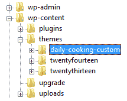

# 激活你的主题

现在你已经有了绝对的基本需求，所以你可以激活你的主题（尽管，它现在看起来可能并不多）。登录到你的 `wp-admin`，然后导航到外观。在那里，你会看到你的主题正在等待你。正如你所看到的，我为我的主题创建了一个漂亮的截图，上面有主题的名称，以便更容易识别：

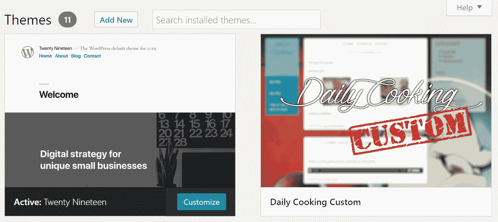

到目前为止，你可以激活你的新主题并继续工作，以包含 WordPress 生成的内容，并将其变成一个完整的 WordPress 主题。不过，激活后主题可能看起来并不完美，这并不奇怪。还有一些工作要做。这也是拥有开发服务器的另一个好理由。你不想在后台完成最终部分的同时，让这个不完整的主题在实时网站上激活。

注意，并非每个主题安装都会如预期进行。有时，你可能需要处理错误。在大多数情况下，WordPress 会通过通知告诉你出了什么问题。然而，偶尔激活可能会导致严重错误，整个网站可能会变空白。如果发生这种情况，只需将新主题的目录重命名，或者完全删除它。这将迫使 WordPress 切换到默认主题，一切应该会恢复正常。从那时起，你可以开始寻找最初导致崩溃的问题。

说到最终部分，你的主题现在准备好添加所有 WordPress 内容了，所以让我们就这样做吧！

# 如何创建基本的 WordPress 内容

目前，你的 `index.php` 文件是唯一的主题文件。我们稍后会将其拆分为模板文件。首先，我们需要包含 WordPress 函数，这些函数会将你的内容输出到你的主题中。

# `functions.php` 文件

简而言之，`functions.php` 文件旨在设置你的主题并提供一些辅助函数和设置，以便更容易地使用主题。除了这个之外，函数文件还有许多其他应用，我们在这里不讨论，因为它们超出了本书的范围。本质上，`functions.php` 是一个允许你执行非常广泛修改的文件。尽管在处理函数文件时应该始终注意一些标准事项，但这并不限制你做任何你希望做的事情。例如，你可以创建一个经典的 PHP 函数，如 `my_function_name()`，然后通过 `<?php my_function_name(); ?>` 在你的模板文件（如 `index.php`）中调用它，但这只是可能的情况之一。

虽然这不是必需的，但始终以以下代码行开始你的函数文件是一个很好的参考点：

```php
<?php
/**
* Daily Cooking Custom functions and definitions.
*
* @package Daily Cooking Custom
*/
```

上述代码行提供了关于主题的基本信息。

下一个部分是设置主题将要启用的默认功能，如下所示：

```php
if(!function_exists('daily_cooking_custom_setup')) :
function daily_cooking_custom_setup() {

  //Make theme available for translation.
  //Translations can be filed in the /languages/ folder.
  load_theme_textdomain('daily-cooking-custom',   
  get_template_directory().'/languages');

  //Adds RSS feed links to <head> for posts and comments.
  add_theme_support('automatic-feed-links');

  //Let WordPress manage the document title.
  add_theme_support('title-tag');

  //This theme uses wp_nav_menu() in one location.
  register_nav_menus(array(
    'primary' => __('Primary Menu', 'daily-cooking-custom'),
  ));

  //Switch default core markup for search form, comment form, 
  //and comments to output valid HTML5.
  add_theme_support('html5', array(
    'search-form', 'comment-form', 'comment-list', 'gallery', 'caption',
  ));

  //Set up the WordPress core custom background feature.
  add_theme_support('custom-background', apply_filters(
    'daily_cooking_custom_custom_background_args', array(
    'default-color' => 'ffffff',
    'default-image' => '',
  )));

}
endif; //daily_cooking_custom_setup
add_action('after_setup_theme', 'daily_cooking_custom_setup');
```

上述函数`daily_cooking_custom_setup()`将在正确的时间执行，由在最后调用的`after_setup_theme`动作触发，以正确设置我们主题的基本功能。由于有注释，大部分代码都很直观，但我想单独提到一点，那就是以下内容（注册菜单）：

```php
register_nav_menus(array(
  'primary' => __('Primary Menu', 'daily-cooking-custom'),
));
```

这是一小段代码，将允许我们在稍后将其作为主菜单显示。它也是我们将用来设置新主题的方法。此外，前面的函数还允许您注册更多的菜单区域，如果您愿意的话——您只需添加`'secondary' => 'Secondary Menu'`即可。

接下来，让我们启用我们的样式表 CSS 文件，使其与主题一起加载，或者更准确地说，是在精确的时刻加载。以下是实现方法：

```php
function daily_cooking_custom_scripts() {
  wp_enqueue_style('daily-cooking-custom-style', get_stylesheet_uri());
}
add_action('wp_enqueue_scripts', 'daily_cooking_custom_scripts');
```

如您所见，这里只有一个样式表。它是由函数中的第一行启用的。

上述代码关闭了我们的第一个类似模板的`functions.php`文件。稍后，我们将向其中添加新行以使其功能更强大。现在，有趣的部分是函数文件中没有关闭的 PHP 标签（没有`?>`）。这不是一个错误；这是故意的。由于文件的大部分是纯 PHP 代码，我们不需要这个标签。完整的文件如下：

```php
<?php
/**
 * Daily Cooking Custom functions and definitions
 *
 * @package Daily Cooking Custom
 */

if(!function_exists('daily_cooking_custom_setup')) :
function daily_cooking_custom_setup() {

  //Make theme available for translation.
  //Translations can be filed in the /languages/ folder.
  load_theme_textdomain('daily-cooking-custom', 
  get_template_directory().'/languages');

  //Adds RSS feed links to <head> for posts and comments.
  add_theme_support('automatic-feed-links');

  //Let WordPress manage the document title.
  add_theme_support('title-tag');

  //This theme uses wp_nav_menu() in one location.
  register_nav_menus(array(
    'primary' => __('Primary Menu', 'daily-cooking-custom'),
  ));

  //Switch default core markup for search form, comment form,
  //and comments to output valid HTML5.
  add_theme_support('html5', array(
    'search-form', 'comment-form', 'comment-list', 'gallery', 'caption',
  ));

  //Set up the WordPress core custom background feature.
  add_theme_support('custom-background', apply_filters(
    'daily_cooking_custom_custom_background_args', array(
    'default-color' => 'ffffff',
    'default-image' => '',
  )));

}
endif; //daily_cooking_custom_setup
add_action('after_setup_theme', 'daily_cooking_custom_setup');

function daily_cooking_custom_scripts() {
  wp_enqueue_style('daily-cooking-custom-style', get_stylesheet_uri());
}
add_action('wp_enqueue_scripts', 'daily_cooking_custom_scripts');
```

# `<head>`标签

好的，让我们继续到`index.php`文件，以及我们可以在其中执行的事情。在本章的下一节中，我们将修改原始 HTML 结构中的特定代码行。让我们看看如何做到这一点：

1.  设置 HTML 文件的`<head></head>`部分。让我们从`charset`和`device-width`参数开始。以下是紧随`<head>`标签开启后的两行：

```php
      <meta charset="<?php bloginfo('charset'); ?>">
      <meta name="viewport" content="width=device-width, initial-scale=1">
```

第一个定义了您的博客使用的字符集。另一个定义了使用的`viewport`宽度。在这里，它被设置为正在使用的设备的宽度（这允许每个人都能正确查看网站，包括桌面电脑用户、iPad 用户和安卓手机用户）。

1.  您需要添加另一段重要的代码块——首先，将标题标签放入您的主题中以便于 pingback URL；其次，其他一些 WordPress 相关内容。请在您的`<head>`部分添加以下行：

```php
      <link rel="profile" href="http://gmpg.org/xfn/11">
      <link rel="pingback" href="<?php bloginfo('pingback_url'); ?>">
```

1.  在关闭`</head>`标签之前添加以下行（它负责显示您的网站标题并启用许多 WordPress 特定的功能）：

```php
      <?php wp_head(); ?>
```

1.  现在，将`body_class()`函数添加到 body 标签中，使其看起来如下：

```php
      <body <?php body_class() ?>>
```

1.  您的标题现在看起来如下：

```php
      <!DOCTYPE html>
      <html <?php language_attributes(); ?>>
      <head>
      <meta charset="<?php bloginfo('charset'); ?>">
      <meta name="viewport" content="width=device-width, initial-scale=1">
      <link rel="profile" href="http://gmpg.org/xfn/11">
      <link rel="pingback" href="<?php bloginfo('pingback_url'); ?>">
      <?php wp_head(); ?>
      </head>

      <body <?php body_class(); ?>>
```

# 标题和页脚

是时候开始添加一些内容了。在这里，我们将处理诸如显示博客主页链接、显示博客标题、显示标语和显示主要导航等事项。所有这些操作都非常简单，所以让我们看看处理它们的代码行。然后，我们将把这些代码行放在我们的 HTML 结构中的正确位置。

首先，我们有显示网站主要 URL 的代码，如下所示：

```php
<?php echo esc_url(home_url('/')); ?>
```

接下来，显示网站标题的代码如下：

```php
<?php bloginfo('name'); ?>
```

下面的代码用于显示标语：

```php
<?php bloginfo('description'); ?>
```

前两行从你在 `wp-admin` 中设置的博客名称和描述处提取信息，你可以简单地从设置 | 通用页面更改它们。

最后，使用以下代码显示主要导航：

```php
<?php wp_nav_menu(array('theme_location' => 'primary')); ?>
```

`wp_nav_menu()` 函数是显示导航菜单的内置方式。它负责菜单及其所有元素的适当 HTML 结构。换句话说，你不必担心其他任何事情，只需使用这一行代码即可。

现在，你的 HTML 中描述标题的部分看起来类似于以下列表。此外，正如你所见，我们正在将标志链接到主页，这是一个标准做法：

```php
<div id="page" class="hfeed site">
  <a class="skip-link screen-reader-text" href="#content">
  <?php _e( 'Skip to content', 'daily-cooking-custom' ); ?></a>

  <header id="masthead" class="site-header" role="banner">

    <div class="site-branding">
      <h1 class="site-title"><a href="<?php echo 
        esc_url(home_url('/')); ?>" 
        rel="home"><?php bloginfo('name');?></a></h1>
      <h2 class="site-description"><?php bloginfo('description');?>
      </h2>
    </div><! -  .site-branding  - >

    <nav id="site-navigation" class="main-navigation" 
      role="navigation">
      <button class="menu-toggle" aria-controls="menu" 
        aria-expanded="false">
      <?php _e( 'Primary Menu', 'daily-cooking-custom' ); ?></button>
      <?php wp_nav_menu(array('theme_location' => 'primary')); ?>
    </nav><! -  #site-navigation  - >

  </header><! -  #masthead  - >

<div id="content" class="site-content">
```

你在想知道为什么你应该费心做这些，而不是直接输入你的博客标题、URL 和主题描述？一个原因是，如果你以后想更改你的博客标题，你可以在 `wp-admin` 中简单地进行一步操作，它将在整个网站上更改。另一个原因是，如果你想与他人分享你的主题，你需要给他们提供通过他们自己的 `wp-admin` 面板轻松更改名称的能力。记住，任何（任何）基于网站目的和内容而变化的（任何）内容都不应硬编码到主题中，而应该是动态生成的。

现在，当我刷新网站时，标题中显示了实际的博客标题，如下面的截图所示：

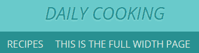

标题中可见的两个链接是从我的自定义菜单中的一个活动链接。为了使事情完整，我将在我的页脚中添加一些代码来显示“自豪地由 WordPress 提供动力”的消息，并包含 `wp_footer()` 函数/钩子，许多插件以某种方式使用它，因此每个主题都应该包含它。我的页脚部分的代码现在看起来如下：

```php
  </div><! -  #content  - >

  <footer id="colophon" class="site-footer" role="contentinfo">
    <div class="site-info">
      <a href="<?php echo esc_url( __( 'http://wordpress.org/', 
       'daily-cooking-custom' ) ); ?>">
      <?php printf( __( 'Proudly powered by %s', 'daily-cooking-custom' ),   
        'WordPress' );?></a>
      <span class="sep"> | </span>
      <?php printf( __( 'Theme: %1$s by %2$s.', 'daily-cooking-custom' ),
       'Daily Cooking Custom', '<a href="http://karol.cc/" rel="designer">
       Karol K.</a>, and 
       <a href="http://underscores.me/" rel="designer">_S</a>' ); ?>
    </div><! -  .site-info  - >
  </footer><! -  #colophon  - >

</div><! -  #page  - >

<?php wp_footer(); ?>

</body>
</html>
```

你可能已经注意到了上一个列表中的神秘 `__()` 函数。这是一个 WordPress 的本地函数，用于检索与函数中给出的参数相对应的翻译字符串。这是一个旨在为你的网站实现国际化的功能。有关该函数的更多详细信息，请参阅[`codex.wordpress.org/Function_Reference/_2`](https://codex.wordpress.org/Function_Reference/_2)。

# 侧边栏

现在，我们可以继续添加 WordPress 生成的侧边栏内容。本质上，这部分工作相当简单。我们只需要包含一些 WordPress 函数，这些函数将处理显示各种动态内容。在这种情况下，是分类、标签和存档。

从顶部开始，在侧边栏区域包含以下代码：

```php
<div id="secondary" class="widget-area" role="complementary">
  <?php if(is_active_sidebar('sidebar-1')) dynamic_sidebar('sidebar-1' ); ?>
</div><! -  #secondary  - >
```

这段代码负责显示分配给该特定小工具区域的任何小工具。在 HTML 结构的侧边栏中放置小工具是最简单、最实用的方法之一。此外，WordPress 将负责正确显示所有内容，因此你不必担心网站上出现任何奇怪的外观元素。例如，每个菜单都显示为一个`<ul>`列表，每个菜单元素都在`<li>`内部。这尽可能地符合标准。

# 主要列 – 循环

这是我们的 WordPress 代码中最重要的一部分。它被称为循环，并且是您新主题的一个基本部分。循环的职责是按倒序显示您的帖子，仅选择适当的帖子。您需要将所有其他帖子标签放在循环内。围绕帖子信息的基本循环文本使用以下代码显示：

```php
<?php if (have_posts()) : ?>
<?php while (have_posts()) : the_post(); ?>
  <?php get_template_part('content', get_post_format()); ?>
<?php endwhile; else: ?>
  <?php get_template_part('content', 'none'); ?>
<?php endif; ?>
```

正中间的`get_template_part()`函数调用获取另一个包含循环其余部分的文件；但就现在而言，让我们只关注这里的主体部分。

循环有两个基本部分，如下所示：

+   单个帖子信息

+   如果没有合适的帖子怎么办

第一部分由一个标准的 PHP `while`循环处理，该循环遍历每个帖子，并对每个元素调用适当的`content-[TYPE].php`文件。第二部分类似，因为它在无法显示帖子时调用`content-none.php`文件。这些`content-[TYPE].php`文件的使用是目前处理 WordPress 显示的不同类型内容的标准。它比使用单个`if`或`switch`语句更有效、更清晰。

因此，为了开始这个，让我们创建一个基本的`content.php`文件，它将作为默认内容类型的占位符。在这个文件中，让我们放置以下代码，它处理循环：

```php
<article id="post-<?php the_ID(); ?>" <?php post_class(); ?>>

<header class="entry-header">
  <?php the_title(sprintf('<h1 class="entry-title">
  <a href="%s" rel="bookmark">', esc_url(get_permalink())), '</a></h1>');
  ?>

  <?php if('post' == get_post_type()) : ?>
  <div class="entry-meta">
    <?php daily_cooking_custom_posted_on(); ?>
  </div>
  <?php endif; ?>
</header>

<div class="entry-content">
  <?php
  the_content(sprintf(__('Continue reading %s <span class="meta-nav">&rarr; 
  </span>', 'daily-cooking-custom'), the_title('<span class="screen-reader-
  text">"', '"</span>', false)));

  wp_link_pages(array('before' => '<div class="page-links">' . __('Pages:',  
  'daily-cooking-custom'), 'after'  => '</div>'));
  ?>
</div>

<footer class="entry-footer">
  <?php daily_cooking_custom_entry_footer(); ?>
</footer>

</article><! -  #post-##  - >
```

如果您仔细观察，会发现它与本章前面分享的静态 HTML 版本非常相似。唯一的区别是，它不是占位文本，而是调用特定的 WordPress 函数和我们将很快讨论的自定义函数。

让我们从顶部开始；文件从这两行开始：

```php
<article id="post-<?php the_ID(); ?>" <?php post_class(); ?>>
  <header class="entry-header">
```

这只是一些标准的 HTML 和基本的 WordPress 函数调用，用于显示适当的元素 ID 和 CSS 类。例如，`the_ID()`函数显示帖子的 ID。接下来，我们有以下一行：

```php
<?php the_title(sprintf('<h1 class="entry-title"><a href="%s" rel="bookmark">', esc_url(get_permalink())), '</a></h1>'); ?>
```

这将显示当前内容元素（通常是帖子）的链接和标题，而不是使用占位文本。`the_title()`函数接受三个参数（都是可选的）。在这里，我们只使用了两个。第一个定义了放置在标题之前的文本（在这种情况下，我们正在调用`sprintf()`函数），第二个定义了放置在标题之后的文本。以下是一段显示当前内容元素各种元信息的代码：

```php
<?php if('post' == get_post_type()) : ?>
<div class="entry-meta">
  <?php daily_cooking_custom_posted_on(); ?>
</div>
<?php endif; ?>
```

如果我们处理的是标准帖子，则会调用一个自定义函数来显示详细信息。通过额外的函数来处理事情——与直接放置代码相比，这种方式使一切更加清晰。以下是函数的样式（我们可以将其放置在主`functions.php`文件中，或者在一个名为`inc`的单独子目录中的新文件中，表示它包含额外的函数；在我们的情况下，这个函数定义可以在`inc\template-tags.php`中找到）：

```php
function daily_cooking_custom_posted_on() {
  $time_string = '<time class="entry-date published updated" 
  datetime="%1$s">%2$s</time>';
  if ( get_the_time( 'U' ) !== get_the_modified_time( 'U' ) ) {
    $time_string = '<time class="entry-date published" 
    datetime="%1$s">%2$s</time><time class="updated" 
    datetime="%3$s">%4$s</time>';
  }

  $time_string = sprintf( $time_string,
    esc_attr( get_the_date( 'c' ) ),
    esc_html( get_the_date() ),
    esc_attr( get_the_modified_date( 'c' ) ),
    esc_html( get_the_modified_date() )
  );

  $posted_on = sprintf(
    _x( 'Posted on %s', 'post date', 'daily-cooking-custom' ),
    '<a href="' . esc_url( get_permalink() ) . '" rel="bookmark">'
    . $time_string . '</a>'
  );

  $byline = sprintf(
    _x( 'by %s', 'post author', 'daily-cooking-custom' ),
    '<span class="author vcard"><a class="url fn n" href="' .
    esc_url( get_author_posts_url( get_the_author_meta( 'ID' ) )
    ) . '">' . esc_html( get_the_author() ) . '</a></span>'
  );

  echo '<span class="posted-on">' . $posted_on . '</span><span
  class="byline"> ' . $byline . '</span>';
}
```

如你所见，这是一个相当长的函数，但需要记住的是，它只是用来显示帖子发布的日期和作者的署名。此外，这里还使用了语言函数（`_e()`和`_x()`）从数据库中获取翻译数据。你可以在[`codex.wordpress.org/Function_Reference/_e`](https://codex.wordpress.org/Function_Reference/_e)和[`codex.wordpress.org/Function_Reference/_x`](https://codex.wordpress.org/Function_Reference/_x)了解更多关于这些函数的信息。

回到我们的`content.php`文件，我们有以下内容：

```php
<div class="entry-content">
  <?php
  the_content(sprintf(
    __('Continue reading %s <span class="meta-nav">&rarr;</span>', 
     'daily-cooking-custom'),
    the_title('<span class="screen-reader-text">"', '"</span>', false)
  ));

  wp_link_pages(array(
    'before' => '<div class="page-links">' . __('Pages:', 'daily-
    cooking-custom'),
    'after'  => '</div>',
  ));
  ?>
</div>
```

第一部分（`the_content()`）负责显示当前帖子的内容，以及一个“继续阅读”链接。这实际上是整个文件中最重要的部分。接下来，第二部分（`wp_link_pages()`）旨在显示分页帖子的页面链接（WordPress 允许你将内容分成单独的子页面；当处理过长的文本时，这可能很有用）。最后，我们有条目页脚部分的代码，如下所示：

```php
<footer class="entry-footer">
  <?php daily_cooking_custom_entry_footer(); ?>
</footer>
```

在这里，还有一个对自定义函数的调用。以下是函数的样式：

```php
function daily_cooking_custom_entry_footer() {
  // Hide category and tag text for pages.
  if ( 'post' == get_post_type() ) {
    $categories_list = get_the_category_list( __( ', ', 
     'daily-cooking-custom' ) );
    if ( $categories_list && daily_cooking_custom_categorized_blog() ) {
      printf( '<span class="cat-links">' . __( 'Posted in %1$s', 
       'daily-cooking-custom' ) . '</span>', $categories_list );
    }

    $tags_list = get_the_tag_list( '', __( ', ', 'daily-cooking-custom' 
      ) );
    if ( $tags_list ) {
      printf( '<span class="tags-links">' . __( 'Tagged %1$s', 
        'daily-cooking-custom' ) . '</span>', $tags_list );
    }
  }

  if ( ! is_single() && ! post_password_required() && 
  (comments_open() || get_comments_number() ) ) {
    echo '<span class="comments-link">';
    comments_popup_link(__('Leave a comment', 'daily-cooking-custom'),
     __('1 Comment', 'daily-cooking-custom'), __('% Comments', 
    'daily-cooking-custom'));
    echo '</span>';
  }

  edit_post_link( __( 'Edit', 'daily-cooking-custom' ), 
  '<span class="edit-link">', '</span>' );
}
```

所有这些代码处理帖子细节，如分类、标签和评论链接（其他访客可以点击以提交对帖子的意见）。我想在这里指出一个有趣的事情，即对`comments_popup_link()`函数的调用，如下所示：

```php
comments_popup_link(__('Leave a comment', 'daily-cooking-custom'), __('1 Comment', 'daily-cooking-custom'), __('% Comments', 'daily-cooking-custom'));
```

在这里，你可以看到有三个参数通过逗号分隔传递：

+   第一个选项告诉 WordPress 在没有任何评论时需要显示的文本。

+   第二个选项告诉 WordPress 在只有一个评论时显示的文本。

+   第三个选项告诉 WordPress 在有多于一个评论时需要显示的文本。百分号（`%`）将被实际存在的评论数量替换。

这就是关于循环的基本理解。当然，它的结构允许你做更多的事情，并包含许多自定义功能。然而，现在我们对我们所拥有的内容感到满意。一旦你保存了你的`index.php`并重新加载你的网站，你将看到你的新主题正在发挥作用。

这个版本的`index.php`文件可以在本章的代码包中找到，位于一个名为`phase 2`的子目录中。在我们的主题文件最终版本出来之前，它们将经历几个阶段。

在本章的后面部分，我将向你展示如何创建自定义页面模板，它将利用循环并用于稍微不同的目的。

# 在你的主题中创建模板文件

现在，你已经拥有了一个功能性的、基本的模板。它在主博客页面上运行得很好，并且能够成功加载你网站上可以点击的任何内容。然而，我们希望为网站上其他类型的内容使用略有不同的模板。例如，单个帖子页面需要有一个评论表单，访客可以在其中发表评论；页面不需要显示日期、分类或标签；分类页面应该显示分类名称。

在我们能够创建其他模板之前，我们需要将主`index.php`文件拆分成几个部分，这样不同的模板就可以共享公共元素。我已经多次提到头部、侧边栏和页脚的重要性。现在，我们将它们拆分。首先，让我们快速看一下它是如何工作的。

# 理解 WordPress 主题结构

通常，WordPress 主题由多个模板文件组成。这使得网站的各个部分（如前端、博客存档、页面、单个帖子以及搜索结果）具有不同的目的。将`index.php`文件拆分成模板文件不仅允许我们共享设计的一些公共部分，而且还可以在不同部分使用不同的代码。正如我之前提到的，我们很快将拆分设计的四个主要部分（头部、侧边栏、主要内容栏和页脚），以便 WordPress 能够充分利用它们。虽然头部和页脚可能被所有页面共享，但主要内容栏的内容将是不同的。此外，你可能希望在某些页面上有侧边栏，而在其他页面上没有。我们首先创建这些模板文件，然后继续创建其他更可选的模板文件。

# 拆分它

我们将通过将一些代码移除到三个新的文件中来拆分`index.php`文件，如下所示：

+   `header.php`

+   `footer.php`

+   `sidebar.php`

# header.php 文件

首先，我们将创建一个头部文件。你可以按照以下步骤进行：

1.  从`index.php`文件的整个顶部开始剪切。这意味着剪切`doctype`声明、`<head>`标签、任何杂项打开标签以及`<header>`标签。在我的情况下，我是从这一行开始剪切的：

```php
      <!DOCTYPE html>
```

1.  我将跳过并包括以下这些行：

```php
      </header><! -  #masthead  - >
      <div id="content" class="site-content">
```

1.  将所有这些行粘贴到一个名为`header.php`的新文件中，该文件位于你的主题目录内。

1.  现在，在`index.php`文件的顶部（即你刚刚剪切页眉文本的地方），输入以下 WordPress PHP 代码行：

```php
      <?php get_header(); ?>
```

1.  这是一个包含你刚刚创建的`header.php`文件的 WordPress 函数。

如果你现在保存所有内容并重新加载你的网站，不应该有任何变化。这里的重要部分是确保对前面的 PHP 函数的调用正好位于你的`index.php`文件的顶部。

# `footer.php`文件

接下来，我们将创建页脚文件。你可以按照以下步骤进行：

1.  从以下代码中剪切`index.php`文件底部的所有内容：

```php
      </div><! -  #content  - >
      <footer id="colophon" class="site-footer" role="contentinfo">
```

1.  剪切到`</html>`标签。将你刚刚剪切的文本粘贴到一个新的`footer.php`文件中。将其保存在你的主题目录中。

1.  现在，在`index.php`文件的底部（即你刚刚剪切页脚文本的地方），输入以下 WordPress PHP 代码行：

```php
      <?php get_footer(); ?>
```

1.  这是一个特殊的 WordPress 函数，用于包含你刚刚创建的`footer.php`文件。再次提醒，你应该保存所有内容并重新加载你的网站，以确保没有发生变化。

# `sidebar.php`文件

现在还需要创建一个关键的模板文件。对于这个文件，执行以下步骤：

1.  剪切包含你的侧边栏的整个`div`元素。在我的例子中，是以下这一行：

```php
      <div id="secondary" class="widget-area" role="complementary">
        <?php if(is_active_sidebar('sidebar-1')) dynamic_sidebar('sidebar-1' ); ?>
      </div>
```

1.  将此行粘贴到你的主题目录中的一个新文件中，并将其保存为`sidebar.php`。

1.  现在，在`index.php`中，将此函数调用替换你刚刚剪切的行，如下所示：

```php
      <?php get_sidebar(); ?>
```

这将包含侧边栏。

# 您的四个模板文件

你现在在你的主题目录中有四个模板文件，分别是`header.php`、`footer.php`、`sidebar.php`以及现在变得短得多的`index.php`。顺便说一句，我的`index.php`文件现在只有少数几个 WordPress 函数和主循环。以下代码显示了整个文件：

```php
<?php get_header(); ?>

  <div id="primary" class="content-area">
    <main id="main" class="site-main" role="main">

    <?php if (have_posts()) : ?>

      <?php /* Start the Loop */ ?>
      <?php while (have_posts()) : the_post(); ?>

        <?php
        get_template_part('content', get_post_format());
        ?>

      <?php endwhile; ?>

      <?php daily_cooking_custom_paging_nav(); ?>

    <?php else : ?>

      <?php get_template_part('content', 'none'); ?>

    <?php endif; ?>

    </main><! -  #main  - >
  </div><! -  #primary  - >

<?php get_sidebar(); ?>
<?php get_footer(); ?>
```

创建这四个文件的全部剪切和粘贴过程只是为了为制作替代模板文件的实际目标做铺垫。

本章节的代码包中提供了这个版本的`index.php`文件，以及`header.php`、`footer.php`和`sidebar.php`，它们位于一个名为`phase 3`的子目录中。

# 归档模板

WordPress 现在正在使用`index.php`模板文件来显示你网站中的所有类型的网页。让我们创建一个新文件——一个在查看月度存档、分类存档和标签存档时将使用的文件。

想了解更多关于 WordPress 如何利用不同文件来显示内容的信息，请自由阅读[`www.codeinwp.com/blog/wordpress-theme-heirarchy/`](https://www.codeinwp.com/blog/wordpress-theme-heirarchy/)上的指南。

要创建你的存档模板，复制 `index.php` 并将其重命名为 `archive.php`。现在，通过点击侧边栏中的任意月份，导航到网站上查看你的月度存档。此时，你将看到的页面应该与主列表完全相同——由 `index.php` 处理的那个。

让我们对存档模板进行一个修改。我想让它显示一个消息，让用户知道他们正在哪个类型的存档页面上。目前，存档看起来与主索引列表相同，这不是最优化的情况。为了解决这个问题，只需在 `<?php if (have_posts()) : ?>` 行中添加以下代码：

```php
<header class="page-header">
  <?php
  the_archive_title('<h1 class="page-title">', '</h1>');
  the_archive_description('<div class="taxonomy-description">', '</div>');
  ?>
</header>
```

如果我现在去看我的月度存档——或者分类/标签存档——我会在页面顶部看到一个新标题，它会告诉我我在哪里，如下面的截图所示：

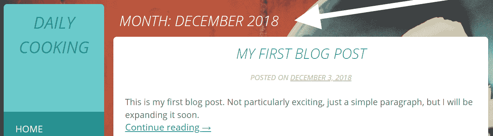

这个版本的 `archive.php` 文件可以在本章的代码包中找到，位于名为 `phase 4` 的子目录内。

# 单个模板

我们接下来需要创建的模板是单篇文章视图。目前，单篇文章看起来就像网站的首页（因为它使用了 `index.php`）——除了它只填充了一个文章的内容。

要开始，再复制一次 `index.php`，并将其命名为 `single.php`。这是 WordPress 在服务单个文章时将查找的模板。如果找不到 `single.php`，它将使用 `index.php`。

不再拖延，这是我的 `single.php` 文件。你应该注意到这个文件几乎与 `index.php` 具有完全相同的元素。唯一的区别是 `get_template_part()` 函数调用获取了一个不同的元素。在这种情况下，它是 `single`，如下面的代码所示：

```php
<?php get_header(); ?>

  <div id="primary" class="content-area">
    <main id="main" class="site-main" role="main">

    <?php while (have_posts()) : the_post(); ?>

      <?php get_template_part('content', 'single'); ?>

      <?php daily_cooking_custom_post_nav(); ?>

      <?php
      if (comments_open() || get_comments_number())
        comments_template();
      ?>

    <?php endwhile; // end of the loop. ?>

    </main><! -  #main  - >
  </div><! -  #primary  - >

<?php get_sidebar(); ?>
<?php get_footer(); ?>
```

之前提到的 `get_template_part('content', 'single')` 调用将获取 `content-single.php` 文件。下面是这个文件的样子：

```php
<article id="post-<?php the_ID(); ?>" <?php post_class(); ?>>
  <header class="entry-header">
    <?php the_title('<h1 class="entry-title">', '</h1>'); ?>

    <div class="entry-meta">
      <?php daily_cooking_custom_posted_on(); ?>
    </div>
  </header>

  <div class="entry-content">
    <?php the_content(); ?>
    <?php
      wp_link_pages( array(
        'before' => '<div class="page-links">' . __( 'Pages:',
        'daily-cooking-custom' ),
        'after'  => '</div>',
      ) );
    ?>
  </div>

  <footer class="entry-footer">
    <?php daily_cooking_custom_entry_footer(); ?>
  </footer>
</article><! -  #post-##  - >
```

这个文件的结构与我们在几页前讨论的那个——`content.php`——几乎完全相同。以下有三件具体的事情值得指出：

+   `<article>` 标签的存在。单个文章的内容显示在这个标签内。

+   对 `the_content()` 函数的调用。这次，我们显示的是文章的全部内容，而不仅仅是摘录。

+   在 `single.php` 中的 `comments_template()` 函数调用。这显示了评论表单和为这篇文章提交的个别评论。

这些版本的 `single.php` 文件和 `content-single.php` 文件可以在本章的代码包中找到，位于名为 `phase 4` 的子目录内。

# 页面模板

我们将要创建的最后一个模板是为静态页面视图设计的。在我的食品博客网站上，这将是示例页面，例如。这次最简单的方法是从`single.php`文件开始。所以，只需复制该文件并将其重命名为`page.php`。现在，我们将简化文件，以便只显示给定页面的基本信息。最终，我的`page.php`文件将如下所示：

```php
<?php get_header(); ?>

  <div id="primary" class="content-area">
  <main id="main" class="site-main" role="main">

    <?php while (have_posts()) : the_post(); ?>

      <?php get_template_part('content', 'page'); ?>

    <?php endwhile; // end of the loop. ?>

  </main><! -  #main  - >
  </div><! -  #primary  - >

<?php get_sidebar(); ?>
<?php get_footer(); ?>
```

我在这里只做了一些小的修改。具体如下：

+   我将`get_template_part()`函数的最后一个参数从`single`改为了`page`。

+   我删除了调用`daily_cooking_custom_post_nav()`的代码，该代码负责显示文章导航。

+   我删除了处理评论的整个代码块。我们不需要在页面上使用这些。

接下来，我们需要一个自定义的`content-page.php`文件。最简单的方法是复制`content-single.php`文件并稍作调整。以下是最终的`content-page.php`文件：

```php
<article id="post-<?php the_ID(); ?>" <?php post_class(); ?>>
  <header class="entry-header">
    <?php the_title('<h1 class="entry-title">', '</h1>'); ?>
  </header>

  <div class="entry-content">
    <?php the_content(); ?>
    <?php
      wp_link_pages(array(
        'before' => '<div class="page-links">' . __( 'Pages:',
        'daily-cooking-custom' ),
        'after'  => '</div>',
      ));
    ?>
  </div>

  <footer class="entry-footer">
  </footer>
</article><! -  #post-##  - >
```

在简化文件方面，我做了以下操作：

+   我删除了整个显示元数据的代码。

+   我删除了显示分类和标签的入口页脚。我们不需要在 WordPress 页面中使用这些。

现在，我的示例页面看起来更加简洁，如下面的截图所示：

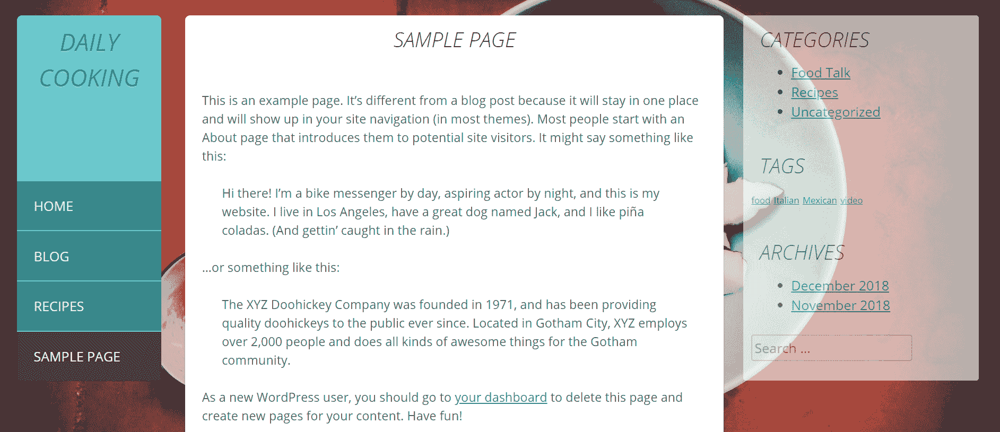

这些版本的`page.php`文件和`content-page.php`文件可以在本章的代码包中找到，位于名为`phase 4`的子目录中。

# 生成的 body 和 post 类

当你修改主题以适应不同类型的页面时，你也应该了解 WordPress 将放入你主题中的 CSS 类。如果你仔细查看我们一直在使用的代码，你会看到这两个函数：

+   `body_class()`: 例如，在`header.php`文件中，具体的行是`<body <?php body_class(); ?>>`

+   `post_class()`: 例如，在`content-page.php`文件中，具体的行是`<article id="post-<?php the_ID(); ?>" <?php post_class(); ?>>`。

`body_class()`函数会根据你查看的页面添加一大堆类到 body 标签上。例如，我网站的主页在 body 中具有以下类：

```php
<body class=" home blog custom-background">
```

我的“一些西班牙菜肴”单篇文章页面的主体标签如下所示：

```php
<body class=" single single-post postid-41 single-format-standard custom-background">
```

如果我想对我的任何页面进行不同的样式设计，我可以主要通过 CSS 来实现，而不需要创建另一个模板。

`post_class()`函数会对单个文章的`div`元素做类似处理，根据文章本身的特性赋予不同的类。例如，我关于“一些西班牙菜肴”的文章标签具有以下类：

```php
<article id="post-41" class="post-41 post type-post status-publish
format-standard hentry category-uncategorized">
```

此外，我的示例页面文章标签具有以下类：

```php
<article id="post-2" class="post-2 page type-page status-publish hentry">
```

在我的样式表中使用这些类，我可以根据文章的分类、标签、文章类型等不同来分别设置每个文章的样式。在设计主题时请记住这一点。当进一步使用主题框架工作时，这一点变得极其重要。尽管允许在 PHP 文件中进行修改，但大多数时候，您只需在 CSS 中工作并调整各种类（WordPress 中的原生类以及框架使用的新类）就可以自定义整个站点的样式。完全在 CSS 文件中构建一个基于主题框架的新网站的情况并不少见。

# 其他 WordPress 模板

除了`archive.php`、`single.php`和`page.php`之外，WordPress 在特定视图使用`index.php`之前还会查找许多其他标准模板文件。我们在这里不会创建这些文件，但您可以在自己的 WordPress 安装上自由实验。要了解 WordPress 主题的完整文件层次结构，请自由访问[`www.codeinwp.com/blog/wordpress-theme-heirarchy/`](https://www.codeinwp.com/blog/wordpress-theme-heirarchy/)。那里有一个很好的图表，可以直观地展示层次结构。它非常容易理解，比只用文字在这里解释要好得多。此外，当您浏览本章的官方代码包时，您会看到已经创建了并实际上在包内可用的许多其他文件。我们在这里也介绍了它们，因为现在可能信息过多。

学习更多

您还可以在[`developer.wordpress.org/themes/basics/template-hierarchy/`](https://developer.wordpress.org/themes/basics/template-hierarchy/)找到模板层级的详细流程图。

在本章中，我们尝试了相当多的 WordPress 模板标签的使用。在第十三章“创建非博客网站第二部分 – 电子商务网站和自定义内容元素”中，我列出了更多最有用的模板标签。

接下来，我们将探讨为页面创建自定义模板。

# 创建和使用自定义页面模板

WordPress 允许您创建自定义模板。这些模板只能用于页面（不能用于文章）。自定义模板允许您以不同的方式显示内容，并能够轻松地在模板中使用内置的 WordPress 函数。

为了给您一个自定义页面模板是什么以及它们如何使您的网站受益（无论您使用什么主题）的好例子，让我们创建一个存档模板的自定义版本。这也就是我们将用来创建一个比标准版本更有用的自定义存档页面的方法。以下截图显示了目前我的博客上的存档页面看起来是什么样子：

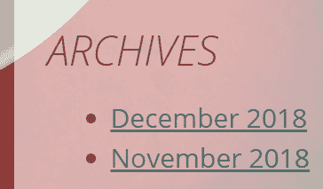

侧边栏中只有几个小链接，用于将访客重定向到标准月度存档。当然，当你的网站上发布更多帖子时，将显示更多链接（每个月份一个链接）。

就存档的想法而言，我必须承认，多少有些不情愿地承认，WordPress 从未擅长于此。作为网络发布解决方案，该平台的一个问题就是帖子通常寿命很短。无论何时发布帖子，它都会在前页上停留一段时间，然后消失在存档中，无论它是否仍然相关，都再也不会被看到。最终，对于新访客来说，在网站上找到这些旧帖子非常困难。

在恢复那些旧帖子为数不多的机会中，掌握 SEO 艺术，仅通过 SEO 努力将一些新流量引导到你的旧帖子（这是最受欢迎的解决方案）。但幸运的是，这并非唯一的方法。再次强调，自定义页面模板在这里也是一种有趣的补救措施。

在前面的屏幕截图中，你可以看到默认的存档版本只是一个侧边栏小部件，包含指向个别月份的一些链接。这种内容组织的问题在于，它提供了一个相当糟糕的用户体验。一般来说，存档并不是关于在一个地方列出所有内容；它们是关于提供一个中心，访客可以前往并找到特定的内容。例如，想想你当地图书馆的存档是如何工作的。这就是你最终希望在网站上实现的目标。因此，我们在这里要做的就是说“不”使用 WordPress 的传统存档模板，并创建一个自定义页面模板来手动处理存档。然后，我们将从菜单中的一个链接到这个存档。以下是操作步骤。

在我们新的存档页面上，我们希望实现以下目标：

+   **显示自定义文本**：例如，作为一种介绍或通知消息，解释存档中包含的内容。

+   **显示分类存档**：这是网站上所有使用分类的列表。

+   **显示标签云**：这是一种标签存档形式，其中网站上使用的所有标签依次显示（内联，而不是列表格式），并且使用频率较高的标签的字体大小会增大。

+   显示 15 篇最新帖子的列表，或者你希望显示的其他数量。

+   **显示月度存档块**：它位于底部并非偶然，因为这个块对于普通访客来说并不特别有用。

要做到这一点，我们需要创建一个模板。以下展示了我们将采取的步骤：

1.  创建模板文件。复制 `page.php` 并给它一个新的名字。我喜欢在我的所有自定义模板文件前加上 `tmpl_`，这样它们就可以与我将要创建的所有 WordPress 模板文件分开排序。我将这个文件命名为 `tmpl_archives.php`。为了让 WordPress 能够识别这个文件为模板文件，我们需要在页面顶部添加一个特殊样式的注释（就像我们在 `style.css` 中做的那样）。注释需要按照以下格式进行格式化：

```php
      <?php
      /* Template Name: Blog Archives Custom */
      ?>
```

在 `wp-admin` 面板中，模板将通过这个模板名称来识别，所以请确保名称能够向你传达模板的用途。

1.  添加 WordPress 函数。这是过程中的一个关键部分，但幸运的是，在这个阶段并不复杂。查看你的新模板文件，找到以下行的出现：

```php
      <?php get_template_part('content', 'page'); ?>
```

1.  现在，将其擦除，并替换以下代码：

```php
      <?php get_template_part('content', 'tmpl_archives'); ?>
```

这是我们想要的结果；你的 `tmpl_archives.php` 文件中间部分现在应该看起来像以下这样：

```php
      <?php while (have_posts()) : the_post(); ?>
      <?php get_template_part( 'content', 'tmpl_archives' ); ?>
      <?php endwhile; // end of the loop. ?>
```

1.  接下来，创建一个全新的文件，命名为 `content-tmpl_archives.php`，并添加以下代码：

```php
      <article id="post-<?php the_ID(); ?>" <?php post_class(); ?>>
        <header class="entry-header">
          <?php the_title('<h1 class="entry-title">', '</h1>'); ?>
        </header>

        <div class="entry-content">
          <?php the_content(); ?>

          <div style="float: left; width: 50%;">
            <h2>Categories</h2>
            <ul>
            <?php wp_list_categories('orderby=name&title_li='); ?>
            </ul>
          </div>
          <div style="float: left; width: 50%;">
            <h2>Tags</h2>
            <?php wp_tag_cloud('smallest=8&largest=20'); ?>
          </div>
          <div style="clear: both;"></div><! -  clears float  - >

          <?php
          $how_many_last_posts = 15;
          echo '<h2>Last '.$how_many_last_posts.' Posts</h2>';
          $my_query = new WP_Query('post_type=post&nopaging=1');
          if($my_query->have_posts()) {
            echo '<ul>';
            $counter = 1;
            while($my_query->have_posts() && 
              $counter<=$how_many_last_posts) 
            {
              $my_query->the_post();?>
              <li><a href="<?php the_permalink() ?>"
                rel="bookmark" title="Permanent Link to <?php
                the_title_attribute(); ?>"><?php the_title();
                ?></a></li>
              <?php
              $counter++;
            }
            echo '</ul>';
            wp_reset_postdata();
          }
          ?>

          <h2>By Month</h2>
            <p><?php wp_get_archives('type=monthly&
              format=custom&after= |'); 
            ?></p>
        </div>

        <footer class="entry-footer">
        </footer>
      </article><! -  #post-##  - >
```

代码为我们的新存档模板包含了一些额外的功能。实际上，因为我们正在创建一个自定义模板，所以我们可以添加我们在本章中发现的任何 WordPress 函数，以及任何存在的其他 WordPress 函数（参见[第十三章](https://cdp.packtpub.com/wordpress_complete___7th_edition/wp-admin/post.php?post=32&action=edit#post_36)，*创建非博客网站第二部分 – 电子商务网站和自定义内容元素*）。

下面是代码中一些更有趣的部分，从以下内容开始：

```php
<div style="float: left; width: 50%;">
  <h2>Categories</h2>
  <ul>
  <?php wp_list_categories('orderby=name'); ?>
  </ul>
</div>
```

这涉及到在网站上添加一个完整的分类列表。`div` 元素负责在左侧显示这个区块，并允许下一个区块（标签）紧挨着它放置（这比使用 HTML 表格更有效，因为它是一个更跨设备友好的方法）。

代码的下一部分如下：

```php
<div style="float: left; width: 50%;">
  <h2>Tags</h2>
  <?php wp_tag_cloud('smallest=8&largest=20'); ?>
</div>
<div style="clear: both;"></div><! -  clears float  - >
```

它具有非常相似的目的，只是这次我们显示的是前面提到的标签云。这里最后一个可见的 `div` 元素是用来清除前面 `div` 元素中使用的 `float` 参数的。

接下来，我们有负责显示最新帖子的部分，如下所示：

```php
<?php
$how_many_last_posts = 15;
echo '<h2>Last '.$how_many_last_posts.' Posts</h2>'; 
$my_query = new WP_Query('post_type=post&nopaging=1');
if($my_query->have_posts()) {
  echo '<ul>';
  $counter = 1;
  while($my_query->have_posts() && $counter<=$how_many_last_posts) {
    $my_query->the_post();
    ?>
    <li><a href="<?php the_permalink() ?>" rel="bookmark"
      title="Permanent Link to <?php the_title_attribute();
      ?>"><?php the_title(); ?></a></li>
    <?php
    $counter++;
  }
  echo '</ul>';
  wp_reset_postdata();
}
?>
```

目前，代码显示的是最新的 15 篇帖子，但如果你只是更改 `$how_many_last_posts` 变量的值，这可以进行调整。

最后，有一个显示传统月度存档的区块，其中每个月都表示为一个标准链接，如下所示：

```php
<h2>By Month</h2>
<p><?php wp_get_archives('type=monthly&format=custom&after=
  |'); ?></p>
```

到目前为止，你可以保存文件并继续下一步，即将模板应用于一个页面。

离开你的 HTML 编辑器，登录到你的`wp-admin`。你需要创建一个页面，你想要在这个页面中使用这个模板。在我的例子中，我会把我的新页面命名为“存档”，以便清楚地表明其目的。在处理页面时，切换到文档选项卡，并滚动到页面属性部分。这就是你将找到模板设置的地方，如下面的截图所示：

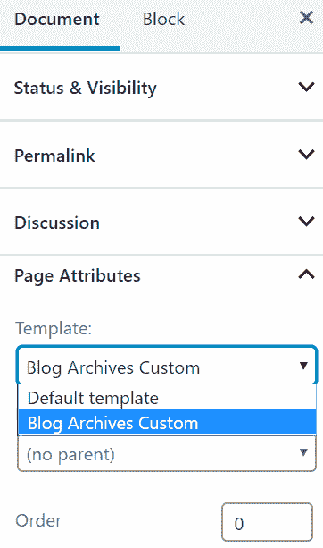

将它从默认模板更改为博客存档自定义模板，并保存草稿或立即发布。现在，为了在某个地方看到这个页面，你必须将它添加到其中一个菜单中。我们已经在第四章中介绍了菜单，*页面、媒体和导入/导出内容*，所以我相信你可以快速完成。一旦你处理好了这个问题，你就可以回到你网站的首页，点击存档页面。然而，因为你的网站在这个阶段内容并不丰富，所以你不会得到惊人的效果，但仍然会有一个很好的最新帖子展示，如下面的截图所示：

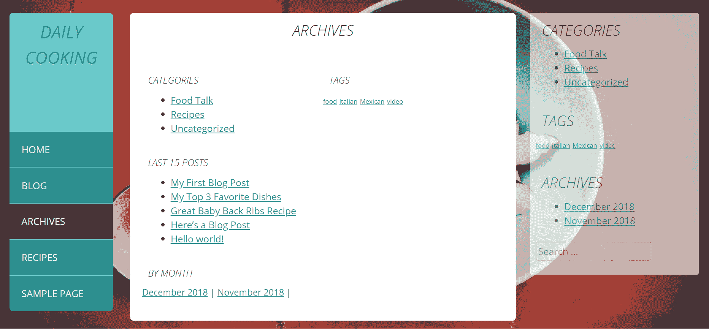

你可以为你的 WordPress 主题制作任意数量的自定义模板。

这些`tmpl_archives.php`文件和`content-tmpl_archives.php`文件的版本可以在本章的代码包中找到，位于名为`phase 5`的子目录中。

# 使你的主题小部件友好

如果你想在主题中使用小部件，你需要让你的主题变得小部件友好（也称为*小部件化*你的主题）。小部件化实际上非常简单，而且说实话，我们在构建侧边栏时已经处理了这一点。现在让我们回到这个话题，解释一下小部件化是如何工作的。

# 回到我们的侧边栏

在过去，WordPress 网站在侧边栏中使用静态放置的内容块是非常常见的。换句话说，在我们网站的侧边栏中放置动态内容的唯一方法就是使用手工编写的代码，它会获取我们想要的数据，然后显示它。这个解决方案对于可能不熟悉 PHP 源代码的日常用户来说并不实用。需要找到一个更好的解决方案。因此，小部件应运而生。

小部件让我们能够以某种方式设置侧边栏，以便它们获取在“外观 | 小部件”中设置的数据。因此，用户唯一需要做的就是前往“外观 | 小部件”，选择他们想要在侧边栏（或任何其他小部件区域；这也可以在页脚中）中展示的内容。

为了给你一个新旧对比的例子，以下是一个标准代码片段的示例，它以旧的方式处理显示博客存档（这个可以放在`sidebar.php`中）：

```php
<div id="secondary" class="widget-area" role="complementary">
  <aside>
    <h1>Archives</h1>
    <ul>
      <?php wp_get_archives(); ?>
    </ul>
  </aside>
</div><! -  #secondary  - >
```

然而，这段代码在任何方面都是不可定制的，所以一个更好的显示存档的解决方案是使用我们已经在`sidebar.php`中拥有的代码，如下所示：

```php
<div id="secondary" class="widget-area" role="complementary">
  <?php if(is_active_sidebar('sidebar-1')) dynamic_sidebar( 
    'sidebar-1' ); ?>
</div><! -  #secondary  - >
```

然后，只需在`wp-admin`的“外观”|“小工具”部分将一个新的存档小工具分配给这个侧边栏。

# 与`functions.php`文件一起工作

让我们来看看这一切是如何实际工作的。正如我之前说的，`functions.php`文件可以包含许多不同的元素，所以现在是时候关注如何启用动态侧边栏，也就是小工具。在`functions.php`文件中，我们可以放置以下代码：

```php
function daily_cooking_custom_widgets_init() {
  register_sidebar(array(
    'name'          => __('Sidebar', 'daily-cooking-custom'),
    'id'            => 'sidebar-1',
    'description'   => '',
    'before_widget' => '<aside id="%1$s" class="widget %2$s">',
    'after_widget'  => '</aside>',
    'before_title'  => '<h1 class="widget-title">',
    'after_title'   => '</h1>',
  ));
}
add_action('widgets_init', 'daily_cooking_custom_widgets_init');
```

在此代码中，我使用了一个新函数来注册一个新的小工具区域。正如你所见，小工具区域简单地被称为`Sidebar`（`name`参数）。

现在，最后的`add_action('widgets_init', 'daily_cooking_custom_widgets_init')`

函数调用实际上是注册小工具区域（这是这里最重要的代码行；它让 WordPress 知道何时启用小工具区域）。

# 添加一些小工具

到目前为止，你的主题已经准备好小工具了！你现在可以前往`wp-admin`，导航到“外观”|“小工具”，并添加小工具。例如，如以下截图所示，我已经向一个小工具区域添加了四个小工具：

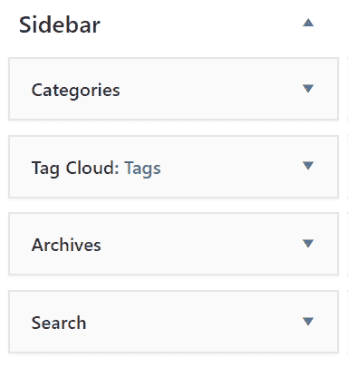

一定要点击保存，然后返回你的网站并重新加载页面。你放在侧边栏中的默认项目将被小工具替换，如下面的截图所示：

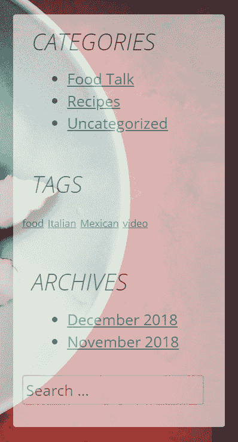

# 其他小工具化选项

我们刚刚介绍的是将主题小工具化的最简单方法。实际上，还有很多其他可能性，你可以在将代码添加到`sidebar.php`和`functions.php`文件时利用它们。例如，有一些选项允许你执行以下操作：

+   小工具化多个侧边栏，并为每个命名

+   小工具化侧边栏的一部分，但保留一些默认项目

+   小工具化页脚

+   自定义搜索表单小工具，等等

学习更多

要了解可用的各种选项以及如何利用它们，请查看 Codex 中的以下资源：[`codex.wordpress.org/Widgetizing_Themes`](https://codex.wordpress.org/Widgetizing_Themes)。

# 在你的主题中启用菜单

我现在要告诉你的好消息是，菜单已经在我们创建的主题结构中启用。因为我们使用了`wp_nav_menu()`函数在网站头部（在`header.php`文件中），如果用户在“外观”|“菜单”中创建了一个菜单，并将其分配给标记为“主菜单”的区域，它将显示在网站上，如下面的截图所示：

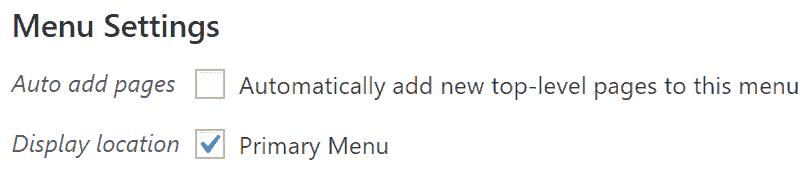

如果你想在你的主题中拥有多个导航菜单，你可以注册多个导航菜单位置，让用户创建多个菜单，并选择哪个菜单放在哪个位置。要了解更多信息，请查看[`codex.wordpress.org/Navigation_Menus`](https://codex.wordpress.org/Navigation_Menus)的 Codex。

学习更多

`wp_nav_menu()`函数非常强大，可以接受多个参数，这些参数将允许你控制类和 ID、菜单名称等。请看这里：[`developer.wordpress.org/reference/functions/wp_nav_menu/`](https://developer.wordpress.org/reference/functions/wp_nav_menu/)。

# 在 WordPress 自定义化器中使你的主题可编辑

WordPress 自定义化器是 WordPress 生态系统中的相对较新的功能。简而言之，它是一个框架，旨在实时预览用户对其网站所做的任何更改。自定义化器的界面允许修改主题和网站外观的各个方面，从网站的名称、标语，到使用的颜色、布局、小工具、菜单等等。我们曾在第八章中从用户的角度讨论了自定义化器，*自定义你的网站外观/设计*。

现在，从开发者的角度来看，当你构建你的 WordPress 主题时，有一些事情你应该做，以便使其与自定义化器兼容。幸运的是，我们在本章中作为主题基础的起始主题，即 _S 主题，已经包含了一些基本的自定义化器集成。让我们逐一了解它们，同时看看我们如何进一步扩展主题的功能。

首先，让我们看看以下代码行。它应该放在你的`functions.php`文件末尾：

```php
require get_template_directory() . '/inc/customizer.php';
```

这个定义简单地包括了一个额外的文件，该文件负责自定义化器的集成本身。尽管我们可以在`functions.php`文件中做到一切正确，但将自定义化器处理在单独的文件中可以使主题结构更容易理解。

那个新的`customizer.php`文件是我们将要添加所有新代码的地方。自定义化器集成的核心是通过`customize_register`钩子完成的。它允许我们定义新的自定义化器面板、部分（自定义化器内部导航的主要元素）、设置（我们的主题可以接受的数据）和控制（允许我们调整设置的视觉 UI 元素）。

为了注册我们所有的自定义化器新元素，我们可以使用以下函数：

```php
function daily_cooking_custom_customize_register( $wp_customize )
 { /* */ }
add_action( 'customize_register', 'daily_cooking_custom_customize_register' );
```

在这个函数内部，我们创建新的部分、设置和控制。然而，正如你所注意到的，我们已经在`customizer.php`文件中创建了此函数。这又是我们在 _S 起始主题之上构建主题的结果。我们选择这种方法，因为它允许我们比从头开始构建更快地开始主题开发。

我们当前的`daily_cooking_custom_customize_register()`函数已经包含了以下行：

```php
$wp_customize->get_setting( 'blogname' )->transport = 'postMessage';
$wp_customize->get_setting( 'blogdescription' )->transport = 'postMessage';
```

这段代码利用了 WordPress 主题默认可用的某些自定义化器能力。具体来说，这两个功能使我们能够修改标题和博客描述。

现在是时候向自定义设置添加一些新内容了。首先，添加一个新的部分非常简单。让我们首先在我们的主 `daily_cooking_custom_customize_register()` 函数中包含以下函数调用：

```php
$wp_customize->add_section();
```

函数可以接受两个参数——第一个是您新部分的标识符，另一个是附加选项的数组。以下是我们将要做什么：

```php
$wp_customize->add_section( 'menu_bar_colors' , array(
  'title' => 'Menu Bar Colors', 
  'priority' => 30) );
```

这创建了一个新的部分，标题为 `菜单栏颜色`，标识为 `menu_bar_colors`。现在，让我们添加一个新的设置。设置提供了一种与 WordPress 通信的方式，并让它知道我们正在使用用户可以修改的值。可以通过 `$wp_customize->add_setting()` 函数调用添加新设置。我们可以这样处理（正如你所见，我添加的不是一个新的，而是两个新的 *设置*）：

```php
$wp_customize->add_setting( 'menu_bar_color1' , array(
  'default' => '#69CACA') );
$wp_customize->add_setting( 'menu_bar_color2' , array(
  'default' => '#279090') );
```

一旦设置到位，拼图的最后部分是一些新的控件。控件将两者联系起来；它们让 WordPress 知道哪些部分与哪些设置一起工作。这是通过 `$wp_customize->add_control()` 函数调用完成的，如下所示：

```php
$wp_customize->add_control( new WP_Customize_Color_Control( $wp_customize, 'menu_bar_color1', array(
  'label' => 'Menu Bar Color 1', 
  'section' => 'menu_bar_colors', 
  'settings' => 'menu_bar_color1') ) );
$wp_customize->add_control( new WP_Customize_Color_Control( $wp_customize, 'menu_bar_color2', array(
  'label' => 'Menu Bar Color 2', 
  'section' => 'menu_bar_colors', 
  'settings' => 'menu_bar_color2') ) );
```

如你所见，我们的每个设置都得到了自己的 *控件*。在这个阶段，当你保存文件并从 WordPress 控制面板（外观 | 自定义）转到自定义设置时，你会在侧边栏中看到新的部分。在里面，你也会看到所有元素都是可操作的。尽管，它们对主题的外观影响不大。我们将在下一部分处理这个问题。请看以下截图：

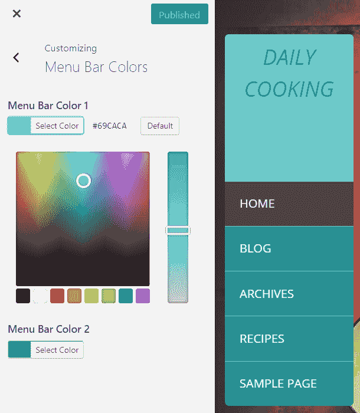

我们现在需要做的第一件事是根据用户在自定义设置中设置的值来修改主题的 CSS。为了实现这一点，让我们在 `customizer.php` 文件的末尾添加以下代码：

```php
function daily_cooking_customizer_menu_css()
{
  ?>
  <style type="text/css">
  .site-header .site-branding { background: <?php echo  
    get_theme_mod('menu_bar_color1', '#69CACA'); ?>; }
  .main-navigation ul li { border-bottom: 1px solid <?php echo 
    get_theme_mod('menu_bar_color1', '#69CACA'); ?>; }
  .site-header { background: <?php echo 
    get_theme_mod('menu_bar_color2', 
    '#279090'); ?>; }
  </style>
  <?php
}
add_action( 'wp_head', 'daily_cooking_customizer_menu_css');
```

这个新功能连接到 `wp_head` 并修改网站的 CSS。其中最重要的指令是那三个内联 PHP echo 块。以下是一个例子：

```php
echo get_theme_mod('menu_bar_color1', '#69CACA');
```

`get_theme_mod()` 函数允许你获取当前主题的设置，并在第一个参数（第二个是默认值）中指定你需要的特定设置的名称。当你现在保存文件时，新的颜色选择选项应该完全启用。参考以下截图：

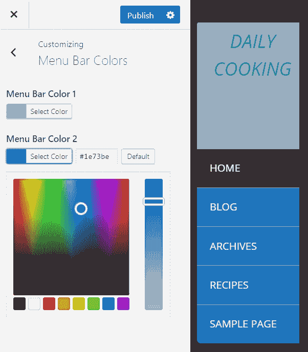

在这里，我们只是触及了自定义设置中可能性的表面，但它仍然给了你一个很好的概述，并且也证明了自定义设置实际上是一个非常适合开发者工作的环境。始终尝试尽可能多地将您主题的设置放入自定义设置模块；最终用户会为此感谢你！

如果你想了解更多关于如何使用自定义设置以及发现其其他功能（例如，例如，使用 JS 文件进行动态实时预览），那么不要犹豫，访问以下资源之一：

[`codex.wordpress.org/Theme_Customization_API`](https://codex.wordpress.org/Theme_Customization_API) 和 [`developer.wordpress.org/themes/customize-api/`](https://developer.wordpress.org/themes/customize-api/).

# 创建子主题

如果你已经找到了一个你喜欢的现有主题或主题框架，并且只想对其进行一些调整以完美地满足你的需求，你可以在其基础上创建一个子主题。子主题以父主题为起点，不改变主题本身，只更改你想要更改的部分。

实际上，使用子主题是修改任何主题的推荐方式。基本原则很简单——如果你想要更改任何关于库存主题（无论是源代码、图形还是模板文件）的内容，请通过一个新的子主题进行更改。

用简单的话来说，子主题继承了父主题的功能和特性。创建子主题的最大价值在于，你可以引入你想要的任何功能，而不会改变父主题的结构。我知道这听起来像是一些额外的工作，因为如果你只想更改几行代码，那么直接在主题内进行更改总是更快。然而，采取更长的子主题路径有其好处，例如以下这些：

+   主要好处是，如果你直接修改原始主题，所有修改都会在更新主题的瞬间消失。然而，如果你使用子主题，你可以充分利用原始主题作者发布的任何更新。让我再次强调：除非你使用子主题，否则在执行主题更新后保留你的修改是不可能的。

+   你可以清楚地看到你对主题所做的修改。基本上，通过子主题实施的所有新内容都必须放置在一个新文件中，所以即使你在一段时间后回来审查你的子主题，你仍然可以轻松地识别出你的每一项工作。

+   最后的益处——实际上，可能还有很多——就是通过子主题引入的任何修改都非常容易恢复。简而言之，如果有什么严重的问题导致你必须快速修复你的网站，那么你可以简单地删除负责的文件。如果你直接修改原始主题，逐个文件进行修改无疑会花费更多时间，并且会使任何快速恢复变得非常困难。

让我们快速了解一下如何创建一个子主题。

# 创建新的主题目录

为了使事情更容易理解，我们将以本章中创建的主题为基础，为其构建一个子主题。起点非常简单。在 `wp-content/themes/` 中创建一个新的目录，并将其命名为 `daily-cooking-child`。

# 创建样式表

在这个目录中，你需要从样式表（`style.css`）开始。样式表需要通常的标题，以及以下新行：

```php
/*
Theme Name: Daily Cooking Child Theme
Description: Child theme for the Daily Cooking Custom theme.
Theme URI: http://nio.tips/
Author: Karol K
Author URI: http://karol.cc/
Template: daily-cooking-custom
*/
```

上述代码中的关键行是`Template: daily-cooking-custom`。这告诉 WordPress，你的新主题是`daily-cooking-custom`的子主题。只是为了强调，这一行确实非常重要。然后，为了使你的子主题从父主题的 CSS 开始，在注释之后添加以下代码：

```php
@import url("../daily-cooking-custom/style.css");
```

如果你不用上一行，你的子主题将从一个空样式表开始其存在。在大多数情况下，这不是一个理想的情况。

# 使用你的子主题

就这样！你的新主题现在出现在外观页面，如下面的截图所示：

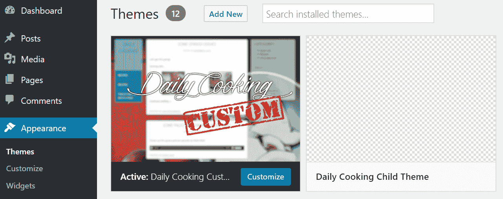

当然，这个主题在这个阶段可能并不是非常有用，但它确实存在，你可以将其用作进一步修改的基础。默认情况下，它将使用主主题的所有样式、模板文件、函数以及所有其他内容。如果你激活它，它将使你的网站看起来就像你正在使用主主题一样。

如果你想要更改任何内容，请在你的子主题目录中进行更改。如果你创建一个新的模板文件（例如，`single.php`、`index.php`和`archive.php`），你将覆盖主主题的原始模板文件。然而，`functions.php`文件的工作方式略有不同。如果你创建一个新的`functions.php`文件，它将在主主题的原始`functions.php`文件之前执行。实际上，你的新文件将在原始文件之前加载。如果你想要覆盖原始`functions.php`文件中的特定函数，只需创建一个具有相同名称的函数。你还可以创建在父主题中不存在的完全新的函数。

就像我说的一样，你在子主题内部创建的每个其他模板文件（例如，`page.php`和`single.php`）都将覆盖其同名文件，所以这是包含一个新设计或一些新功能的完美方法。除了替换现有的模板文件外，你还可以添加父主题中不存在的新的模板文件（包括自定义页面模板）。

最后，一旦你花点时间尝试不同的事情，检查你的网站对你包含在子主题中的元素的反应，整个子主题的话题其实非常容易掌握。

学习更多

WordPress Codex 有一个页面专门介绍子主题，请参阅[`codex.wordpress.org/Child_Themes`](https://codex.wordpress.org/Child_Themes)。

# 分享你的主题

如果你想要将你的模板变成其他人可以使用的产品，你只需要采取以下步骤：

1.  确保你有权重新分发你包含在主题中的图像、图标、照片等等。

1.  从你的主题目录中删除所有不必要的文件。确保你没有备份版本或任何文件的旧副本。如果你删除了任何文件，请务必测试你的主题以确保你没有意外删除重要的内容。

1.  确保在`style.css`文件顶部的注释完整且准确。

1.  创建一个`Readme.txt`文件。这是一个很好的地方，让未来的用户知道你的主题与哪个版本的 WordPress 兼容，以及它是否有任何特殊功能或要求。

1.  将目录压缩并发布你的主题 ZIP 文件到你的网站上供人们下载，或者直接提交到 WordPress 主题目录[`wordpress.org/themes/`](https://wordpress.org/themes/)。但请记住，那里的审查过程可能需要一段时间。所以，在你看到你的主题上线之前，要做好 3-6 个月的等待准备。

尽管前面的步骤看起来像是一个标准的逐步过程，但实际上并非如此。说实话，如果你的主题想要被允许进入目录，它必须是非常高质量的。每个主题都会经过人工审查，这通常会导致一些主题未能通过。在这种情况下，你只需要按照要求进行修改，重新提交你的作品，并继续尝试，直到你成功进入。

然后，还有关于许可的问题。默认情况下，WordPress 遵循**GNU 通用公共许可证**（**GPL**）。简单来说，这意味着 WordPress（平台）是免费的，并且在其之上构建的任何衍生作品都必须在 GPL 下注册——这包括主题。简而言之，你可以在 WordPress、各种主题或插件中找到的每一行 PHP 代码都是 GPL（这包括付费主题和插件）。当涉及到艺术作品和 CSS 时，GPL 可能不适用。如果你想了解更多关于 GPL 许可的信息，最好的办法是直接访问官方文档[`wordpress.org/news/2009/07/themes-are-gpl-too/`](https://wordpress.org/news/2009/07/themes-are-gpl-too/)。

现在，除了官方目录外，你还可以通过其他渠道分享你的主题。首先，你必须决定你是否想让你的主题免费提供。如果是这样的话，你可以联系一些关于 WordPress 和 WordPress 设计的流行博客，并简单地告诉他们你有一个想要分享的主题。大多数时候（如果主题看起来吸引人），他们不会有问题通知他们的社区，有一个酷炫的新免费主题。

如果你想让你的主题成为付费主题，你可以前往 ThemeForest（[`themeforest.net/`](https://themeforest.net/)）并尝试提交你的主题。唯一的挑战是，你的主题必须真的是高质量的。

我不会强迫你立即与社区分享你的主题，但一旦你积累了一些专业知识，并且构建出真正酷炫和有用的主题，你真的应该与人沟通并分享你的作品。最后，如果你对在社区中产生影响感兴趣，考虑启动一个专门针对此目的的网站。这个网站将成为你可以发布演示版本、提供一些文档、提供支持论坛以及其他事项以提供优质用户体验的地方。

所有主题文件（包括子主题）的最终版本都包含在本章的代码包中，位于名为`final`的子目录内。

# 摘要

你现在已经跨越到了 WordPress 主题世界的另一边——你已经学会了如何制作自己的主题。只需基本的 HTML 和 CSS 代码，你就可以创建一个设计并将其转变为一个完全功能的 WordPress 主题。

在本章中，我们探讨了如何将你的 HTML 构建转换为基本主题，创建 WordPress 模板以影响你网站上各种视图的显示，创建应用于你网站内页面的自定义模板，使你的新主题具备小工具兼容性，创建子主题，使主题与 WordPress 自定义设置兼容，以及与 WordPress 社区中的每个人分享你的主题。

在下一章中，我们将讨论社交媒体集成、播客和 HTTPS（安全超文本传输协议）。这些信息将使你能够扩展你的博客习惯，让你的作品在网络上更加多样化并且更加引人注目。
