# 社交媒体整合、播客和 HTTPS

在过去的几年里，社交媒体的重要性有了很大的增长。基本上，如果你至少没有在几个最受欢迎的社交网络上建立你的个人资料，那么你几乎可以认为你根本不存在，对吧？好吧，无论你是否同意这一点，这对你网站来说确实是真的。换句话说，如果你希望吸引任何类型的观众，并设法让他们继续回到你的网站，你绝对必须（必须！）将其与社交媒体整合。

幸运的是，WordPress 允许你以相对容易理解的方式做到这一点。尽管社交媒体整合本身并不是一个内置功能，但它仍然可以通过不同的插件或其他机制来实现。在本章中，你将了解所有这些功能。我们将涵盖如何在你的网站上启用简单的社交媒体分享按钮，如何与社交媒体 API 和整合工作，以及如何自动将你的博客内容发布到社交媒体。

但是等等，这还不是全部！我们还将涵盖播客（对于一些网站所有者来说，这是他们在线存在的重要元素），以及 WordPress 领域的一个相对较新的话题——**HTTPS**（**安全超文本传输协议**），它主要是通过在浏览器-网站通信中增加一个额外的加密层来使你的网站更加安全。在这里值得指出的一点是，现在谷歌期望所有网站都启用 HTTPS 加密。如果你的网站未能遵守这一规定，谷歌可能会决定降低你的搜索引擎排名，从而使你的网站相对于竞争对手来说更不显眼。

简而言之，本章我们将探讨以下主题：

+   整合社交媒体

+   播客

+   HTTPS——是什么，为什么，以及如何？

# 整合社交媒体

我们在第五章中简要提到了社交媒体整合的话题，即“插件——它们是什么以及为什么你需要它们”，当时我们讨论了值得在你的 WordPress 网站上拥有的插件。现在，让我们花点时间来扩展这一点，并列出更多你可以使你的网站变得社交媒体友好以及你为什么要这样做的原因。

让我们从“为什么”开始。在这个时代，社交媒体是许多网站流量增长的主要驱动力之一。即使你只想与朋友和家人分享你的内容，或者你有关于你网站的严肃商业计划，你也至少需要有一定程度的社交媒体整合。

即使你只安装了简单的社交媒体分享按钮，你实际上是在鼓励你的访客将你的内容传递给他们的追随者，从而扩大你的影响力，使你的内容更加流行。

# 使你的博客变得社交媒体友好

有几种方法可以使你的网站变得社交媒体友好。最常见的方法如下：

+   设置社交媒体分享按钮，允许您的访客将您的内容分享给他们的朋友和关注者

+   设置社交媒体 API 集成，使您的内容在社交媒体上（从设计角度）看起来更好

+   设置自动内容分发到社交媒体

+   设置社交媒体指标跟踪

让我们逐一讨论这些。

# 设置社交媒体分享按钮

这是我们讨论插件时在[第五章](https://cdp.packtpub.com/wordpress_complete___7th_edition/wp-admin/post.php?post=33&action=edit#post_28)，*插件 – 它们是什么以及为什么您需要它们*中提到的事情。现在市面上有数百种社交媒体插件可供选择，允许您在网站上显示一组基本的社交媒体按钮。我们建议您使用的插件名为**简单社交媒体分享按钮**（这个插件可在[`wordpress.org/plugins/simple-social-buttons/`](https://wordpress.org/plugins/simple-social-buttons/)找到）。它的主要优势是允许您显示所有最受欢迎的社交媒体网络的按钮，您还可以选择您希望这些按钮显示的位置和方式。

您可以在[第五章](https://cdp.packtpub.com/wordpress_complete___7th_edition/wp-admin/post.php?post=33&action=edit#post_28)，*插件 – 它们是什么以及为什么您需要它们*中找到完整的描述，以及如何设置一切的教程。

# 设置社交媒体 API 集成

要使您的内容在社交媒体上看起来更有吸引力，下一步值得采取的是将其与多个社交媒体 API 集成；特别是 Twitter 的 API。Twitter 的 API 究竟是什么以及它是如何工作的，对我们在这里讨论的 WordPress 并不非常相关。所以，让我们只关注将您的网站与这个 API 集成的结果。

以下截图展示了提及网站的常规推文通常的样子（请注意整体设计，而不是文本内容本身）：

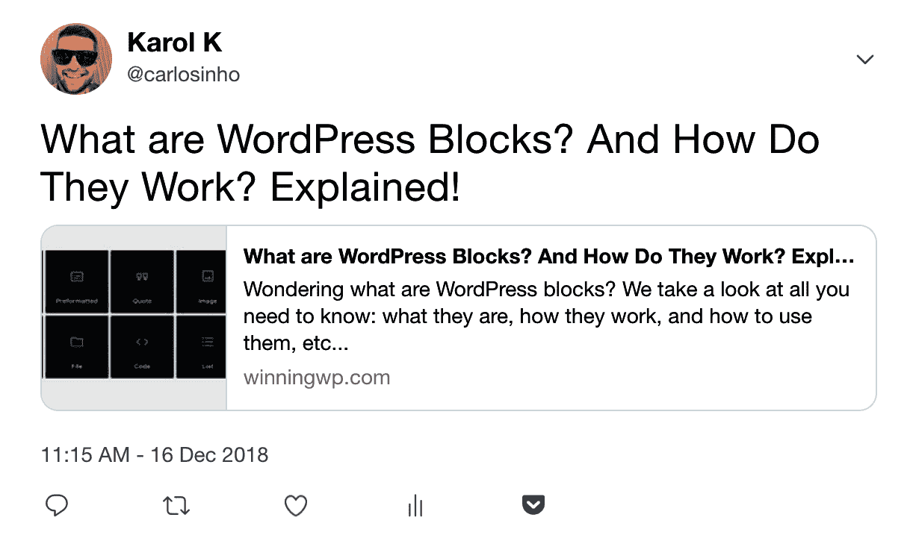

这里是一条不同的推文，提到了一个启用了 Twitter（Twitter Cards）API 的网站的文章：

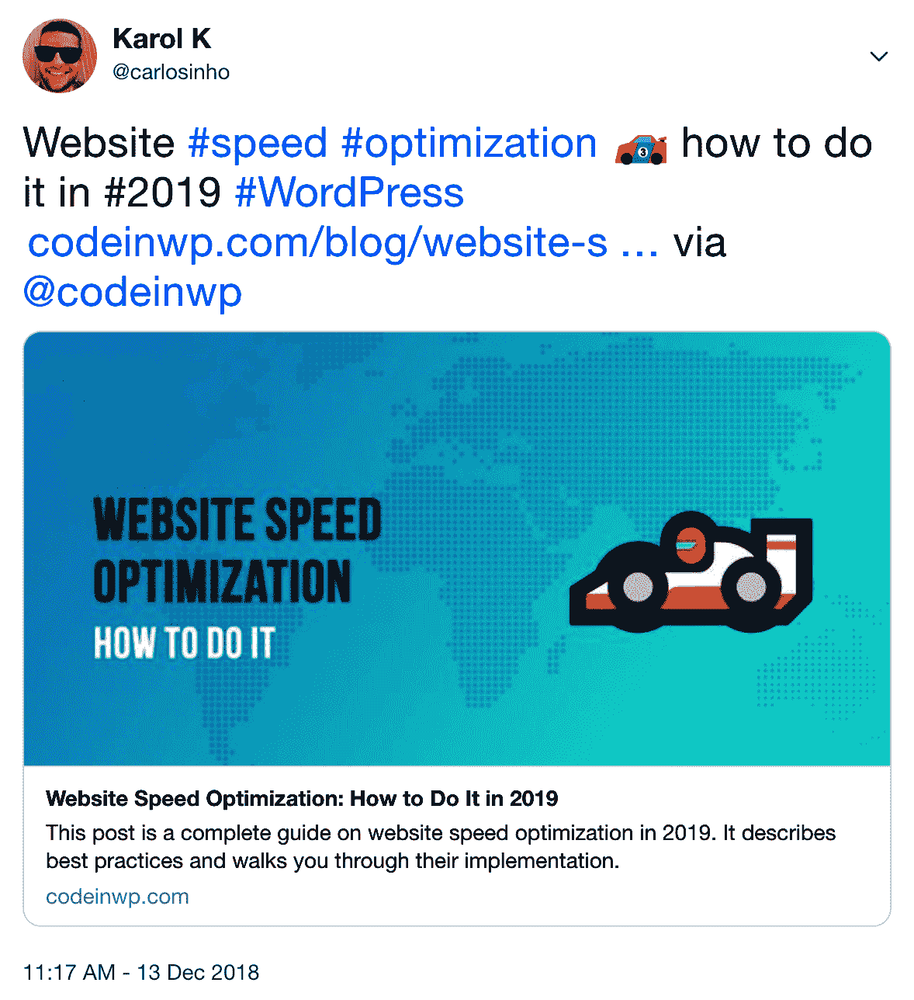

这看起来好多了。幸运的是，拥有这种级别的 Twitter 集成相当简单。您需要的只是一个名为 JM Twitter Cards 的插件（这个插件可在[`wordpress.org/plugins/jm-twitter-cards/`](https://wordpress.org/plugins/jm-twitter-cards/)找到）。安装并激活它后，您将指导完成设置一切并批准您的网站与 Twitter（这是一个强制步骤）的过程。

# 设置自动内容分发到社交媒体

自动在社交媒体上分发您的内容背后的想法是，您不必每次发布新帖子时都手动记住这样做。您不必手动复制粘贴新帖子的 URL 地址到每个社交媒体平台，而是可以自动完成。

这可以通过多种方式完成，但让我们讨论两种最实用的方式：*Jetpack* 和 *Revive Old Posts* 插件。

# Jetpack 插件

Jetpack 插件可在 [`wordpress.org/plugins/jetpack/`](https://wordpress.org/plugins/jetpack/) 获取。我们在第五章 [Plugins – What They Are and Why You Need Them](https://cdp.packtpub.com/wordpress_complete___7th_edition/wp-admin/post.php?post=33&action=edit#post_28) 中讨论了 Jetpack 插件及其许多模块。您可以通过导航到 `wp-admin` 中的 Jetpack | 设置部分，然后转到共享标签来找到这些模块之一：

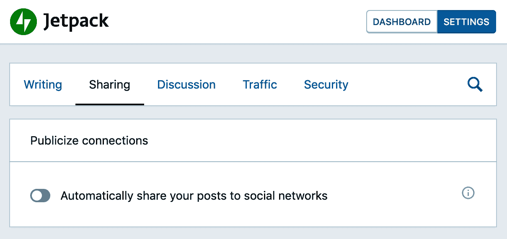

在这里，您将能够启用名为“自动将您的帖子分享到社交网络”的功能（这在先前的截图中可见）。

在完成上述操作后，点击出现的新的链接，标签为“连接您的社交媒体账户”。这将允许您与可用的社交媒体平台集成，如下面的截图所示：

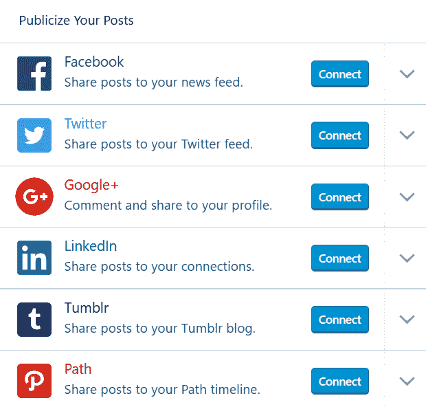

在通过每个服务授权插件后，您的网站将能够自动将每篇新帖子发布到社交媒体。

# Revive Old Posts 插件

Revive Old Posts 插件可在 [`wordpress.org/plugins/tweet-old-post/`](https://wordpress.org/plugins/tweet-old-post/) 获取。虽然 Jetpack 插件会将您网站上的最新帖子分发到您的各种社交媒体账户，但 Revive Old Posts 插件会以相同的方式处理您的存档帖子，最终赋予它们新的生命——因此得名，Revive Old Posts。

在下载并激活此插件后，转到 `wp-admin` 中的 Revive Old Posts 部分。然后，切换到账户标签。在这里，您可以通过添加您的社交媒体账户并授权它们来启用插件。插件将引导您完成启用所有功能的步骤。这些单独的步骤取决于您想要启用的社交媒体平台，并且随着时间的推移会频繁更改，但您始终可以依赖 Revive Old Posts 与最新的要求保持一致：

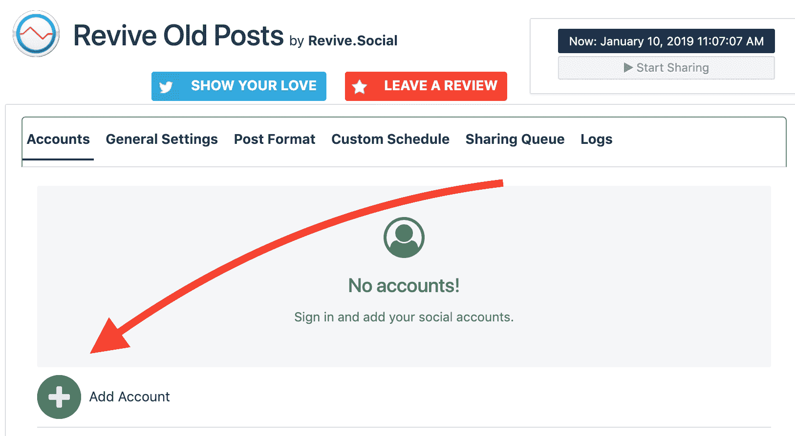

接下来，转到常规设置标签，处理您希望插件如何与您的社交媒体账户一起工作的间隔时间和其他细节，如下面的截图所示。完成设置后，只需点击保存按钮即可：

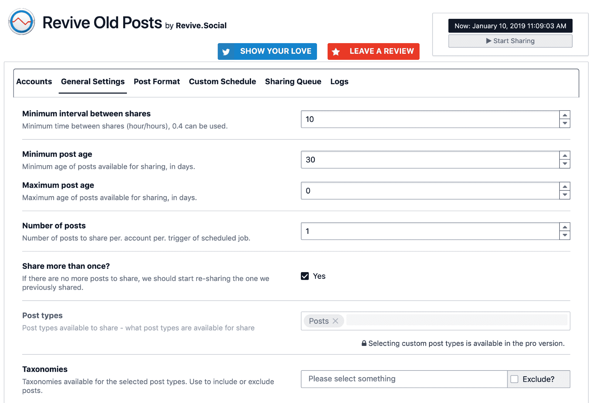

到此为止，该插件将自动运行并将随机存档帖子分发到您的社交媒体账户。

注意，如果你不想激怒你的追随者并让他们取消关注你，最好不要过于频繁地分享东西。出于这个原因，我建议每天不要发帖超过一次。

# 设置社交媒体指标跟踪

我们社交媒体整合谜题的最后一个要素是设置某种跟踪机制，它会告诉我们我们的内容在社交媒体上的受欢迎程度（以分享次数来衡量）。

当然，你可以通过访问每篇帖子并单独检查它们的分享次数来手动完成这项工作。然而，有一个更快的方法，它涉及到另一个插件。这个插件叫做 Social Metrics Tracker，你可以在[`wordpress.org/plugins/social-metrics-tracker/`](https://wordpress.org/plugins/social-metrics-tracker/)下载它。

简而言之，这个插件从多个平台收集社交媒体分享数据，并以一个可读的仪表板视图显示给你。安装并激活插件后，你需要给它几分钟时间爬取你的社交媒体账户并获取数据。在那之后不久，你将能够通过访问`wp-admin`中的社交媒体指标部分来访问插件的仪表板：

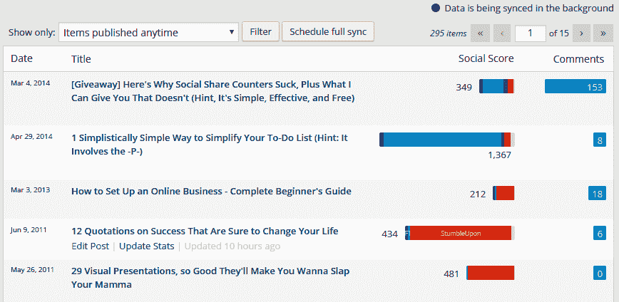

对于某些网络主机和配置，这个插件可能会消耗服务器资源过多。如果发生这种情况，考虑只在偶尔检查结果时激活它，然后再将其停用。即使每周只这样做一次，也能很好地了解你的内容在社交媒体上的表现。

这就结束了我们关于如何将你的 WordPress 网站与社交媒体整合的简要指南。我必须承认，我们只是触及了表面，还有更多的事情可以做。几乎每周都有新的社交媒体插件发布，描述每一个都可能填满一本书。话虽如此，这里描述的方法已经足够让你的 WordPress 网站变得适合社交媒体，并能够有效地与你的朋友、家人和观众分享你的内容。

# 播客

在过去几年中，播客变得非常流行。目前，网络上已有成千上万的播客可供选择，涉及任何可以想象的主题或细分市场。基本上，播客就像一个广播节目或节目，但完全在互联网上运行。然而，在幕后，播客仅仅是一个音频录音。它可以按集数或系列进行，这取决于你的偏好和你想要的方式。播客的主要思想是人们可以订阅它们，每当有新剧集可用时，他们都会收到通知。基本上，你的订阅者，而不是在他们的电脑上阅读你的帖子，可以在任何时间通过耳机收听你的内容。

将播客添加到您的 WordPress 博客中相当简单。从技术角度来看，播客的*订阅*机制由**真正简单的聚合**（**RSS**）源处理。RSS 是一种网络技术，允许您以 XML 格式结构化地交付（或消费）内容。RSS 源通常按最新信息排序。WordPress 默认处理 RSS 源的方式是启用您最新帖子的源，以及最新评论的源。任何想保持您内容更新的人都可以使用流行的源聚合器并连接到您网站的 RSS 源。例如，**Feedly** ([`feedly.com`](https://feedly.com))是一个流行的解决方案。

在 WordPress 中处理播客分发也是通过使用 RSS 源来实现的。当生成您博客的 RSS 源时，WordPress 会自动添加所有必要的标签，如果该帖子中链接了音频文件。这些标签会被播客客户端/工具（如 iTunes）读取。因此，您只需要创建一个帖子，WordPress 就会为您处理其余的事情。

# 创建播客

对于基本的播客制作，您只需要采取以下两个步骤：

+   录制自己

+   制作帖子

让我们详细看看这些步骤。

# 录制自己

通过使用任何商业或免费软件，您可以录制您的声音、对话、音乐或任何您想播客的内容，然后将其保存为 MP3 文件。您也可能发现您需要稍后进行一些编辑。

考虑使用的一些优秀软件的例子如下：

+   我推荐使用**Audacity**，这是一个免费、跨平台的音频录制和编辑器。您可以从[`sourceforge.net/projects/audacity/`](https://sourceforge.net/projects/audacity/)下载 Audacity。您可能需要做一些额外的调整才能让 MP3 部分工作，所以请注意该点的附加说明。如果您不想学习音频压缩和均衡的基本知识，您也可以使用均衡工具，例如**Levelator**，您可以在[`www.conversationsnetwork.org/levelator/`](http://www.conversationsnetwork.org/levelator/)找到它。尽管它自 2012 年底以来没有更新，但如果您想简单调整音频文件的音量，它仍然可以很好地工作。

+   或者，您可以使用**OBS Studio**，您可以在[`obsproject.com/download`](https://obsproject.com/download)找到它。这是另一个跨平台解决方案，它是开源的，一些用户认为它在市场上优于其他工具。

+   如果您正在使用 macOS 并且想要一些免费软件，请看看*Garage Band*。它随操作系统一起提供，所以它已经安装在了您的电脑上。

+   如果您想检查一些称为**数字音频工作站**（**DAWs**）的先进音频软件，这些软件由专业播客制作者和音乐家使用，那么请考虑**Sonar X2**、**Studio One**、**Logic**或**ProTools**。

要了解更多关于音频录制和制作的基础知识，以及如何让你的播客听起来更专业，请自由查看[`www.hongkiat.com/blog/audio-production-for-podcasters/`](https://www.hongkiat.com/blog/audio-production-for-podcasters/)的深入教程。

# 发布帖子

现在你已经创建了一个 MP3 文件，并且它已经存放在你的电脑上，你可以准备创建一个 WordPress 帖子，这个帖子将成为你播客第一集的归宿。请查看以下步骤：

1.  在`wp-admin`中，像平常一样导航到帖子 | 添加新帖子。如果你想为这一集提供描述，可以在帖子中输入一些初始文本。此外，在此阶段，将一个新的类别“播客”添加到你的博客中。

1.  为了让你了解如何包括媒体文件的基本知识，让我们将你的媒体文件上传到 WordPress 媒体库。在本章的后面部分，我会解释为什么这并不总是最有效的方法。然而，现在我们的目的是学习。首先，在页面上添加一个名为“音频”的新块。然后，从你的桌面选择一个音频文件并上传，如图所示：

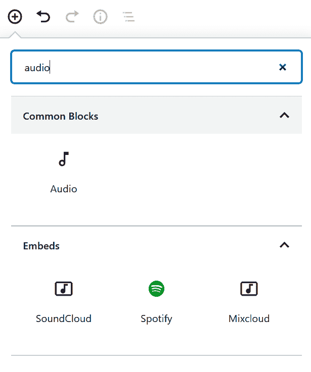

1.  上传完成后，你将在帖子本身中看到你的音频文件（记住，音频文件比图像大，所以上传总是需要更长的时间），如图所示：

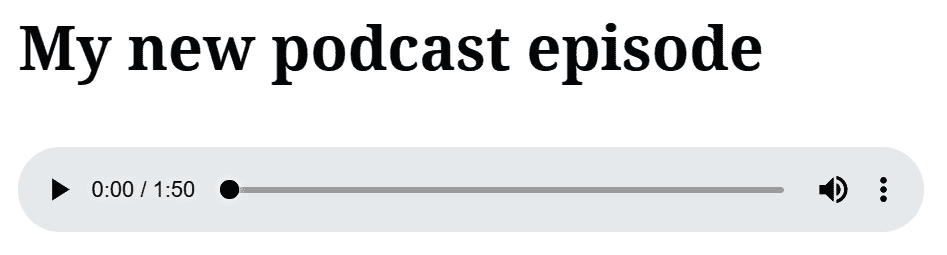

1.  进行任何其他更改或添加，然后发布帖子。

就这样！现在你的网站 RSS 订阅源可以被播客客户端用来获取你的播客。你可以立即使用自己的播客客户端进行订阅。如果你使用的是 iTunes，请导航到高级 | 订阅播客，并将你刚刚设置的新播客类别的 RSS 订阅源 URL 粘贴进去（例如，`http://yoursite.com/category/podcast/feed/`）。此时，你（以及你的访客）可以享受你刚刚创建的新播客了。

这就是你可以将播客添加到自己的 iTunes 中的方法。如果你想使播客通过 iTunes 对公众可搜索，你需要通过提交流程，如[`itunespartner.apple.com/en/podcasts/overview`](https://itunespartner.apple.com/en/podcasts/overview)中所述。

# 播客插件

你刚刚了解到，将播客添加到 WordPress 网站是非常简单的。然而，如果你想添加更多功能，你可能需要使用播客插件。一些额外的功能可能包括以下内容：

+   自动生成订阅源和可配置的 RSS 订阅源，以进一步优化播客客户端，如 iTunes、Google Play 或 Stitcher

+   你播客在 iTunes 中的预览

+   下载统计数据和跟踪你获得的听众数量

+   新的自定义帖子类型，以更专业的方式处理你的播客

+   从同一网站运行多个播客

+   用于显示您的播客剧集列表、单集和播放列表的短代码

+   简单的设置，以便在另一台服务器上托管您的剧集

在 WordPress 插件库中，有相当多的播客相关插件。以下是最受欢迎的三个：

+   **Blubrry 的 PowerPress 播客插件** ([`wordpress.org/plugins/powerpress/`](https://wordpress.org/plugins/powerpress/))

+   **Seriously Simple Podcasting** ([`wordpress.org/plugins/seriously-simple-podcasting/`](https://wordpress.org/plugins/seriously-simple-podcasting/))

+   **Podlove Podcast Publisher** ([`wordpress.org/plugins/podlove-podcasting-plugin-for-wordpress/`](https://wordpress.org/plugins/podlove-podcasting-plugin-for-wordpress/))

要深入了解如何使用 PowerPress 插件（这是前面列表中我最喜欢的一个）以及如何正确配置它，请观看 Pat Flynn 在[`www.youtube.com/watch?v=Ei67QMWD4MA#!`](https://www.youtube.com/watch?v=Ei67QMWD4MA#!)提供的 30 分钟视频教程。在这个教程中，您将学习如何优化您的播客并正确设置它，以便它能够被 iTunes 收录并与社区分享。

有数百个类似的插件可供选择。您可以通过查看 WordPress.org 官方插件目录中所有标记为`podcasting`的插件（[`wordpress.org/plugins/tags/podcasting`](https://wordpress.org/plugins/tags/podcasting)）来找到它们。别忘了阅读插件描述和用户评价，以决定哪一个可能最适合您。

# 使用免费服务托管音频文件

如我之前提到的，直接将播客上传到博客的旧式方法有其缺陷，这并不使其成为当今处理事务的最有效方式。首先，如果您想在主服务器（即您的网站托管的服务器）上托管媒体文件，您可能会迅速遇到严重的带宽问题，尤其是如果您的播客变得流行。此外，WordPress 中存在最大上传大小的问题。根据您的网络托管商，您可能无法上传大于 2 MB、8 MB 或 16 MB 的文件（您可以联系您的网络托管商的支持以澄清这一点）。这就是上传器中问题的样子：

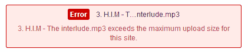

因此，如果您预计会有大量订阅者，或者您计划生产如此大量的内容以至于您的服务器空间不足，您可以使用外部托管服务来托管您的音频文件，无论是付费还是免费。以下是一些可以考虑的选项：

+   **Libsyn**：这家公司提供有效且价格合理的播客托管服务。请访问[`www.libsyn.com/`](https://www.libsyn.com/)。

+   **Blubrry**: 这是一款出色的播客托管平台。他们提供的特别之处在于与 WordPress 的完美集成。他们甚至有自己的插件，我在本章前面提到过。请访问[`create.blubrry.com/resources/podcast-media-hosting/`](https://create.blubrry.com/resources/podcast-media-hosting/)。

+   **PodBean**：这家公司提供一定期限内的免费播客托管服务。请访问[`podbean.com/`](https://podbean.com/)。

与提到的每家公司合作都有所不同。然而，你始终需要做的主要事情是将你的媒体文件上传到所选公司的服务器，而不是上传到 WordPress 的媒体库中。作为回报，你将获得一个直接指向你的播客文件的 URL，你可以根据需要使用它。例如，你可以使用前面提到的插件之一将 URL 插入到 WordPress 帖子中。

# HTTPS – 它是什么，为什么，以及如何？

意想不到的是，HTTPS 的故事始于别处——它始于**HTTP**（**超文本传输协议**）。HTTP 是一种网络协议，通过它用户网络浏览器与试图访问的网站之间在线发送信息。HTTP 定义了这些数据的结构和发送方式。这个话题非常技术性，我们当然不需要为了本章讨论的目的而完全理解它。

总体来说，目前 HTTP 的实现方式并不允许非常安全的连接。大部分情况下，使用 HTTP，数据以纯文本形式传输，这意味着如果有人拦截通信，他们将能够看到所有传输的内容。现在，这可能在最初看起来不是什么大问题，但想象一下处理敏感信息时会发生什么。例如，当你在在线结账时提交信用卡信息，你真的不希望它被任何人拦截。不幸的是，HTTP 在这方面并没有提供任何保护。这就是 HTTPS 发挥作用的地方。

# HTTPS 是什么？

**HTTPS**，代表**超文本传输协议安全**，基本上是 HTTP 的升级版。在底层，使其工作的主要机制大致相同；但与使用自己的层协议发送数据不同，HTTPS 使用额外的协议，称为**安全套接字层**（**SSL**）和**传输层安全性**（**TLS**）。SSL 加密正在发送的信息，这意味着即使有人拦截它，他们也无法解码它。没有加密/解密密钥，数据的真正含义是不可见的。

那么，您如何知道一个网站是否具有 HTTPS？找出这一点非常简单。基本上，您的网络浏览器会告诉您。当您访问一个已启用 HTTPS（并且正确集成）的网站时，您会在网站地址旁边看到一个绿色的锁形图标。此外，您还应该在地址栏中看到`https://`。以下截图显示了 PayPal 的一个示例：

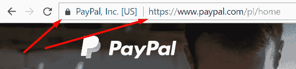

# HTTPS 为何对现代 WordPress 站点很重要

虽然 HTTPS 本身不是必需的，但它仍然是迈向更安全网络的一大步。支持 HTTPS 的每个网站都更加安全，尤其是在处理任何形式的用户输入时。很自然地，人们对于提交他们的个人信息并不高兴，尤其是如果他们不确定这些信息是否会被妥善处理。如今，我们不断听到有关黑客攻击和安全漏洞的消息，甚至在一些最受尊敬的网站上也如此。考虑到这一点，公众每年对数据安全和隐私的关注都在增加。

话虽如此，现代 WordPress 站点需要完全接受这一理念。在您的网站上启用 HTTPS 实际上没有任何缺点，而且实现这个过程也不太困难。此外，2014 年，谷歌宣布 HTTPS 正式成为谷歌搜索的排名因素。这意味着，如果您将 HTTPS 集成到网站中，您有更好的机会让您的网站获得排名，从而被潜在访客发现。

# 如何设置 HTTPS

在 WordPress 上设置 HTTPS 是一个两步的过程，如下所示：

+   首先，您需要获得分配给您的 SSL 证书，然后您可以在网站上使用它

+   其次，您需要将此 SSL 与您的 WordPress 站点集成

让我们从获取 SSL 证书本身开始。问题是，这些证书通常带有价格标签。一个好的证书可能每年花费您几美元到 600 美元不等。这可能听起来不太吸引人，但幸运的是，对于每个人来说，也有好的免费 SSL 选项。特别是有一个叫做**Let's Encrypt** ([`letsencrypt.org/`](https://letsencrypt.org/))的选项。Let's Encrypt 是一个免费、自动化和开放的**证书颁发机构**（**CA**）。它被发现普及了 SSL 证书，并使它们对所有网站都变得可负担，从而增加了全球拥有加密连接的网站数量。

您如何开始使用 Let's Encrypt 取决于您的 WordPress 网站托管的主机。通常，至少对于大多数主机来说，您可以直接从您的托管控制面板启用 Let's Encrypt 证书。展示如何完成的精确步骤会很困难，因为每个主机都有自己的控制面板，以及他们自己的方式来让您启用 Let's Encrypt 证书。因此，第一步是实际上联系您的托管服务提供商，并请他们帮助您启用证书。

在此之前，您可以查阅 Let's Encrypt 的官方文档，并确保您的托管服务提供商确实支持 Let's Encrypt 证书。这些文档可以在[`community.letsencrypt.org/t/web-hosting-who-support-lets-encrypt/6920`](https://community.letsencrypt.org/t/web-hosting-who-support-lets-encrypt/6920)找到。

在您完成主机流程后，这个过程不应该太复杂，您就可以在 WordPress 仪表板中完成集成。为了使您的网站完全集成，您将需要一个额外的插件。这个插件叫做 Really Simple SSL ([`wordpress.org/plugins/really-simple-ssl/`](https://wordpress.org/plugins/really-simple-ssl/))，它将为您做两件主要事情：

+   它将更新您网站的 URL 为 HTTPS，并覆盖 WordPress 数据库中的先前设置

+   它将在您的非 HTTPS URL 上添加一个永久的 301 重定向，以便所有访问者以及搜索引擎都将被转发到您内容的新 HTTPS 版本（如帖子页面）

插件非常简单易用。您需要做的只是安装并激活它，然后您可以在设置 | SSL 中进入插件的设置。一旦进入，只需点击主页面上的“继续，激活 SSL！”按钮，如下面的截图所示：

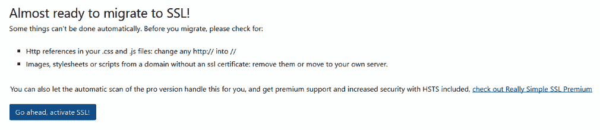

插件将在后台施展其魔法，一旦完成，它将使您从管理面板注销。这是正常的，所以您不需要担心。当您尝试重新登录时，您会注意到您已被重定向到 HTTPS 版本的管理面板。为了确保一切正常工作，您可以尝试访问您的网站`http://YOURSITE.com`，看看是否自动重定向到`https://YOURSITE.com`。在这个阶段，您的 WordPress 网站已经完全集成了 HTTPS！

# 摘要

本章有很多内容。首先，我们专注于社交媒体集成——这是所有现代网站的核心。接下来，是播客主题，以及如何开始的简要指南（如何配置您的源，使用哪些插件等等）。最后，我们讨论了 HTTPS 和 SSL 证书——它们是什么，它们对您网站安全（以及您的访客个人信息的保护）的重要性，以及如何启用它们。

在下一章中，我们将讨论开发您自己的插件和小部件的主题，包括基础知识以及如何掌握它们。我们还将向您介绍 RESTful API。
