# 第十一章：开发插件、小工具以及 REST API 简介

插件是添加或扩展 WordPress 内置功能的一种方式。在第五章*插件——它们是什么以及为什么你需要它们*中，你学习了如何安装它们。来自在线 WordPress 社区的插件有成千上万的有用插件（截至写作时，[`wordpress.org/plugins/`](https://wordpress.org/plugins/)上的官方计数器显示超过 55,000 个插件），它们都执行不同种类的功能。在早期章节中，我们安装了拦截垃圾邮件、备份你的网站以及提供基本 SEO 功能的插件。你还可以获取管理你的播客、跟踪你的统计数据、将你的内容翻译成其他语言的插件等等。

然而，有时你会发现你所需要的插件根本不存在。幸运的是，为 WordPress 编写一个你可以在自己的网站上使用并愿意与更大社区分享的插件相当简单。你所需要的只是一些基本的**超文本预处理器**（**PHP**）知识，你就可以编写任何你想要的插件。

本章分为四个主要部分，如下所示：

+   在第一部分，我们将通过一个易于遵循的、分步的过程创建两个插件。

+   在第二部分，我们将使用内置的 WordPress 小工具类创建一个小工具。

+   在第三部分，你将学习什么是短代码以及如何使用它们。

+   在第四部分，我们将讨论 REST API 的主题。

# 插件

在本节中，我们将通过一个简单的分步过程创建一个插件。我们首先将看到基本要求是什么，然后尝试并测试插件，然后简要讨论涉及的 PHP 代码。话虽如此，在进入本章之前，你应该已经具备基本的 PHP 背景知识。

# 从零开始构建插件

首先，我们在这里是为了学习 WordPress，所以在这个特定的情况下，我们确实会从头开始构建。这始终是深入了解特定技术工作原理的最佳方法。

然而，一旦你开始定期使用 WordPress，并管理自己的或他人的网站，我建议你在决定自己编写新插件之前，总是先寻找已经存在的插件。如我之前提到的，仅官方目录中就有大约 55,000 个插件，更不用说网上所有可用的付费插件了。简而言之，如果你需要某种功能，很可能已经有一个插件可以满足你的需求，所以你可以直接出去获取它。

为什么这是推荐的方法？如果我是对的，你选择使用 WordPress 是因为你想要尽可能少地付出努力，使你的网站尽可能功能强大。沿着这条思路，使用现有的插件比构建一个插件需要付出更少的努力。此外，许多现有的插件已经被成千上万的其他人使用，并且有庞大的社区支持它们。因此，选择高质量的插件是一条更安全的道路。

我觉得我应该清楚地强调这一点，因为经验告诉我，许多年轻的 WordPress 开发者倾向于强迫他们的同伴从头开始创建东西，尽管有其他更好的解决方案可用。

此外，请记住，所有基于 WordPress 的衍生作品都可在**GNU 通用公共许可证（GPL）**下获得。因此，没有任何阻止你从现有的插件开始，在此基础上进行改进，使其变得更好，然后将你的版本重新分享给世界的事情。这样，我们都能赢，而且没有重复的工作。

然而，在我们能够做到这一点之前，我们确实必须通过从头到尾构建我们自己的东西来学习这门手艺。那么，继续前进吧！

# 插件代码要求

正如对主题有要求一样，对插件也有要求。至少，你的插件必须满足以下条件：

+   它必须放在`wp-content/plugins`目录中（在 WordPress 根目录内）

+   它必须有一个具有独特名称的 PHP 文件（即，一个在主`wp-content/plugins`目录中未被任何其他插件使用的名称）

+   文件顶部必须有一个特殊结构的注释

    （有关更多信息，请参阅[`codex.wordpress.org/File_Header`](https://codex.wordpress.org/File_Header)）

然后，当然，你必须有一些函数或处理代码；但 WordPress 会识别任何满足这些要求的文件作为插件。

如果你的插件很简单，那么你只需将一个独特的 PHP 文件直接放在你的`wp-content/plugins`目录中，这样它就可以紧挨着 WordPress 自带默认的 Hello Dolly 插件。然而，一个更好的做法是创建一个子目录（再次，使用一个独特的名称）并将你的 PHP 文件放在那里。这使得`wp-content/plugins`目录看起来更有组织。此外，你永远不知道你的插件何时会需要一些额外的文件（与从头开始重新结构插件相比，简单地向现有的`plugin`目录添加新文件总是更容易）。

# 基本插件 – 添加链接图标

作为演示，我们将创建一个简单的插件，该插件可以向 WordPress 中的文档链接添加图标。例如，如果你创建一篇新文章并在其中添加一个指向 MP3 文件的链接，它看起来就像以下截图所示：

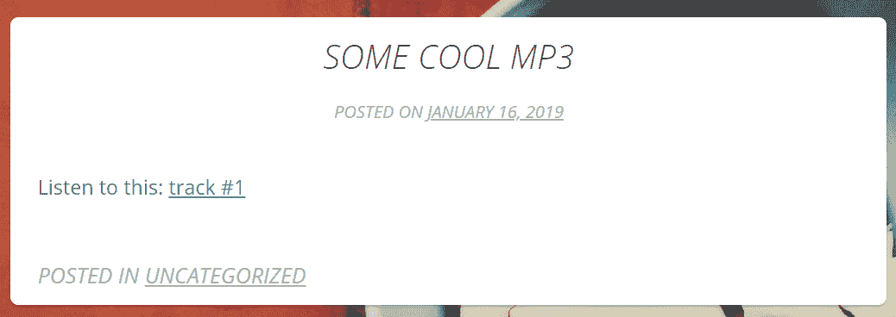

一旦这个插件完成，链接看起来就像以下截图所示：


为了完成这个任务，我们必须做以下几步：

1.  提供将使用的图标的图片

1.  有一个 PHP 函数可以识别文档链接并为它们添加一个特殊的 CSS 类

1.  有一个样式表可以创建用于显示图标的 CSS 类

1.  告诉 WordPress，每次它打印帖子的内容（即使用`the_content()`函数）时，它必须首先运行 PHP 函数

1.  告诉 WordPress 在`<head>`标签中包含新的样式

随着我们继续前进，请记住这个清单。一旦所有这五个要求都得到满足，插件就会完成。那么，让我们开始吧！

# 插件文件的命名和组织

每个插件都应该有一个独特的名称，这样它就不会与 WordPress 宇宙中的任何其他插件冲突。在为你的插件和 PHP 文件选择名称时，请确保选择一个独特的名称。你甚至可能想要在 Google 上搜索你选择的名称，以确保没有人已经在使用它。

除了主要的插件文件本身之外，你的插件可以包含任何数量的其他文件和子目录。如果情况需要，你甚至可以使用媒体文件，如音频和视频，与你的插件一起使用。当然，额外的 CSS 或 JS 文件（甚至完整的库）也是允许的。

在这种情况下，由于我的插件将由多个文件组成（一个 PHP 文件、一个样式表和一些图像文件），我将创建一个目录来存放我的插件。我将把插件命名为“添加文档类型样式新”，并将其放置在名为`add_doctype_styles_new`的目录中。PHP 文件`doctype_styles_new.php`将存放在这个目录中。我还收集了一些文档类型图标（由[`www.freepik.com/`](https://www.freepik.com/)通过[`www.flaticon.com/`](https://www.flaticon.com/)提供）。

我为插件创建的目录现在看起来如下所示：

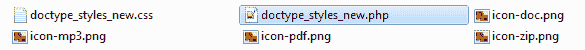

如果你构建的内容将包含更多文件，最好在插件目录内创建目录，如`images`、`css`和`js`。

现在我已经把图片放在了我的目录里，我已经处理了插件必须满足的要求清单中的*第一个*要求。

如果你的插件有任何不寻常的安装或配置选项，你可能还希望在目录中包含一个`readme.txt`文件来解释这些内容。这个`README`文件将对你自己来说是一个提醒，同时也是对将来可能使用你的插件的其他人的指导性文件。如果你计划将你的插件提交到 WordPress 插件目录，你将需要创建一个`README`文件。要获取此类文件的模板，请访问[`wordpress.org/plugins/developers/`](https://wordpress.org/plugins/developers/)。

如前所述，您的插件必须以一个特殊的注释开始，告诉 WordPress 如何在插件页面上向用户描述插件。现在我已经创建了我的目录和一个空的 PHP 文件，我将插入这个特殊的注释。它必须按照以下结构（这确实是基础，并在[`codex.wordpress.org/File_Header`](https://codex.wordpress.org/File_Header)中更详细地解释）：

```php
<?php 
/* 
Plugin Name: Add Document Type Styles New 
Plugin URI: http://nio.tips/
Description: Detects URLs in your posts and pages and displays nice document type icons next to them. Includes support for PDF, DOC, MP3, and ZIP. 
Version: 1.1 
Author: Karol K 
Author URI: http://karol.cc/ 
Text Domain: add_doctype_styles_new 
License: GNU General Public License v2 or later 
*/
```

在您的插件中包含关于许可的信息也是一个很好的信息。大多数插件使用 GPL。这个许可本质上意味着任何人都可以使用、复制和增强您的代码，并且他们不允许阻止其他人重新分发它。我还在我的插件 PHP 文件中添加了关于 GPL 的注释。请记住，您在任何 WordPress 插件中遇到的 PHP 代码默认都是 GPL。然而，图形文件、CSS、JavaScript 和其他元素可能有不同的许可，所以在复制他人的作品并将其作为您自己的作品的一部分时要小心。您可以在[`www.gnu.org/copyleft/gpl.html`](https://www.gnu.org/copyleft/gpl.html)上了解更多关于许可的信息。

这就是关于介绍性代码的所有内容。现在，我们可以添加*实质内容*了！

# 编写插件的核心功能

任何插件的精髓都是你带来的独特 PHP 代码。这是使插件成为其自身的部分。由于这个插件非常简单，它中间只有几行代码。

插件必须满足的第二个要求是拥有一个 PHP 函数，用于识别文档链接并为它们添加一个特殊类。以下函数正是这样做的。请注意，为了确保我的代码是独特的，我在两个函数前都加上了`doctype_styles_new`前缀：

```php
function doctype_styles_new_regex($text) { 
  $text = preg_replace('/href=([\'|"][[:alnum:]|
     [:punct:]]*)\.(pdf|doc|mp3|zip)([\'|"])/', 'href=\\1.\\2\\3 
     class="link \\2"', $text); 
  return $text; 
}
```

当函数接收到一些`$text`时，它将搜索任何链接到 PDF、DOC、MP3 或 ZIP 文件的 HTML 锚标签，并将其替换为该锚点的类。然后，函数返回修改后的`$text`。

插件必须满足的第三个要求是拥有一个创建显示图标类的样式表。以下函数获取我们的样式表：

```php
function doctype_styles_new_styles() { 
  wp_register_style('doctypes_styles', plugins_url
     ('doctype_styles_new.css', __FILE__)); 
  wp_enqueue_style('doctypes_styles'); 
}
```

如您所见，这个函数使用了我们在第九章*开发您自己的主题*中注册自定义主题样式表时使用的相同的队列机制。以下是前一个函数获取的 CSS 文件（在`doctype_styles_new.css`内部）：

```php
.link { 
  background-repeat: no-repeat; 
  background-position: left center;  
  padding: 0 0 0 18px; 
} 
.pdf { background-image: url(icon-pdf.png); } 
.doc { background-image: url(icon-doc.png); } 
.mp3 { background-image: url(icon-mp3.png); } 
.zip { background-image: url(icon-zip.png); }
```

的确，一个非常简单的文件，只包含一些样式和图标，用于区分我们的文档链接！

# 向插件添加钩子

我们通过使用 WordPress **钩子**来确保代码在应该运行时实际运行。插件钩子的工作方式如下：在 WordPress 运行的过程中，它们会检查是否有插件注册了在该时间运行的函数。如果有，这些函数就会被执行。这些函数修改了 WordPress 的默认行为。

有两种类型的钩子，如下所示：

+   **动作**：动作是 WordPress 在执行过程中或在特定事件发生时触发的钩子。您的插件可以指定在此时执行一个或多个 PHP 函数，使用的是`Action` API。

+   **过滤器**：过滤器是 WordPress 在将文本添加到数据库或发送到浏览器屏幕之前修改各种类型文本时触发的钩子。您的插件可以指定在此时执行一个或多个 PHP 函数来修改特定类型的文本，使用的是`Filter` API。

这意味着您可以告诉 WordPress 在它运行任何内置函数的同时运行您的插件函数。在我们的例子中，我们希望我们的插件第一个函数`doctype_styles_new_regex()`作为一个过滤器与 WordPress 的`the_content()`函数（这是插件必须满足的第四个要求）一起运行。

现在，将以下代码添加到插件的底部：

```php
add_filter('the_content', 'doctype_styles_new_regex');
```

这使用了`add_filter`钩子，告诉 WordPress 在运行`the_content()`函数时注册一个名为`doctype_styles_new_regex()`的函数。顺便说一句，如果您想将多个函数添加为内容的过滤器，可以向`add_filter()`函数添加一个第三个参数。这个第三个参数将是一个表示加载优先级的数字（默认值是 10，最高优先级是 1，最低优先级没有特定的限制——您甚至可以分配值如 100 或 999），WordPress 将按升序顺序运行您的函数。

我们插件必须满足的要求列表中剩下的就是第五个要求——即告诉 WordPress 在`<head>`标签中包含新的样式。这实际上是通过以下钩子完成的，使用`add_action()`与`wp_enqueue_scripts`处理程序：

```php
add_action('wp_enqueue_scripts', 'doctype_styles_new_styles');
```

这是完整的插件 PHP 文件：

```php
<?php 
/* 
Plugin Name: Add Document Type Styles New 
Plugin URI: http://nio.tips/
Description: Detects URLs in your posts and pages 
and displays nice document type icons next to them. 
Includes support for PDF, DOC, MP3 and ZIP. 
Version: 1.1 
Author: Karol K 
Author URI: http://karol.cc/ 
Text Domain: add_doctype_styles_new 
License: GNU General Public License v2 or later
*/ 

// this function does the magic 
function doctype_styles_new_regex($text) { 
  $text = preg_replace('/href=([\'|"][[:alnum:]|
     [:punct:]]*)\.(pdf|doc|mp3|zip)([\'|"])/', 
     'href=\\1.\\2\\3 class="link \\2"', $text); 
  return $text; 
} 

// this functions adds the stylesheet to the head 
function doctype_styles_new_styles() { 
    wp_register_style('doctypes_styles',      
    plugins_url('doctype_styles_new.css', __FILE__)); 
    wp_enqueue_style('doctypes_styles'); 
} 

// HOOKS ============= 

add_filter('the_content', 'doctype_styles_new_regex', 9); 
add_action('wp_enqueue_scripts', 'doctype_styles_new_styles');
```

确保在`<?php`之前没有空白空间。如果有任何空格，PHP 代码将会出错，并抱怨已经发送了头部信息。这是开发者在使用 WordPress 插件初期经常会犯的一个常见错误。同时，不使用 PHP 文件末尾的关闭标签(`?>`)也是一个一般的好主意。这样可以避免一些不幸的执行错误。

确保您保存并关闭此 PHP 文件。现在您可以按照以下两种方式之一操作：

+   使用您的 FTP 客户端，将`add_doctype_styles_new/`上传到您的

    `wp-content/plugins/`目录

+   将您的目录压缩成`add_doctype_styles_new.zip`，并使用`wp-admin`中的插件上传器将此插件添加到您的 WordPress 安装中

本版本的插件包含在本章的代码包中，位于名为`phase 1`的子目录内。我们的插件文件在最终版本完成之前将经历几个阶段。

插件安装后，它将出现在插件页面上，如下截图所示：

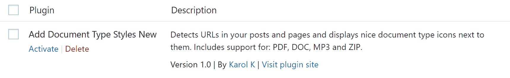

现在，您可以激活它并尝试使用它。

# 尝试插件

如果您查看本章开头创建的相同帖子，您将看到插件在起作用。这是相同的截图：

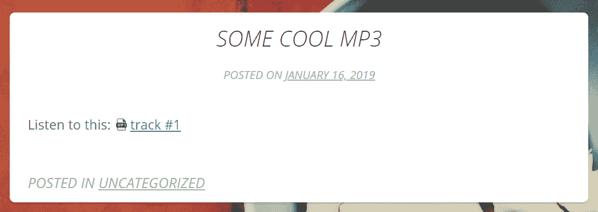

您还可以尝试添加一个包含指向 PDF、ZIP 或 DOC 文件链接的新帖子。然后，当您查看帖子时，您会看到我们的插件添加了更多图标。

现在您已经了解了一个使用钩子来利用现有 WordPress 功能的基本插件，让我们通过给用户一些控制权来增强这个插件。

# 添加管理页面函数的钩子

一些插件会在 `wp-admin` 中添加一个页面，您或用户可以在此编辑插件选项。我们已经在 W3 Total Cache、Yoast SEO 等插件中看到过这种情况。现在，让我们修改我们的插件，让用户能够控制哪些文档类型被支持。以下截图显示了完成后的新管理页面：

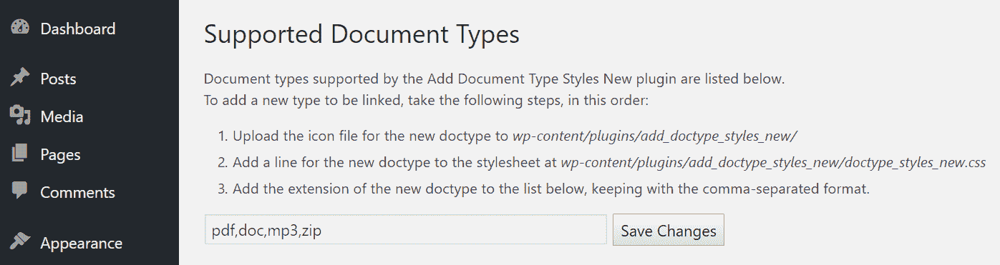

首先，停用我们刚刚编写的插件。我们将对其进行修改，然后重新激活它。以下列表详细说明了我们将执行以修改插件以实现新页面可能的步骤：

1.  添加创建管理页面并保存用户输入的新选项的函数

1.  修改 `doctype_styles_new_regex()` 函数，使其检索用户的输入

1.  添加管理页面函数

让我们开始吧！

# 添加管理页面函数

我们将要创建的管理页面将向 `wp-admin` 添加一个选项。这使用数据库中 WordPress `options` 表的现有空间，因此不需要进行数据库修改。这个新选项的名称必须是唯一的。我将把这个新选项命名为 `doctype_styles_new_supportedtypes`。

我们需要向插件中添加六个函数，以便在 `wp-admin` 中添加一个管理页面。让我们逐一查看这些函数：

1.  第一个函数在插件激活时添加新的 `doctype_styles_new_supportedtypes` 选项，并设置默认值如下：

```php
      function set_supportedtypes_options() { 
          add_option("doctype_styles_new_supportedtypes",
             "pdf,doc,mp3,zip"); 
      }
```

1.  第二个函数在插件停用时移除新的选项，如下所示：

```php
      function unset_supportedtypes_options () { 
        delete_option("doctype_styles_new_supportedtypes"); 
      }
```

1.  让我们看看新的第三个函数，如下所示：

```php
      function modify_menu_for_supportedtypes() { 
        add_submenu_page( 
        'options-general.php',    //The new options page will be added as 
                                  //a submenu to the Settings menu.  
        'Document Type Styles',   //Page <title> 
        'Document Type Styles',   //Menu title 
        'manage_options',         //Capability 
        'add_doctype_styles_new', //Slug 
        'supportedtypes_options'  //Function to call 
        );   
      }
```

此函数使用 `add_submenu_page()` 函数调用在 `wp-admin` 的设置菜单中添加一个新项目。这需要六个参数，分别是：选项页面应放置的位置、页面标题、菜单链接文本、可以访问链接的最高级别用户、要打开的文件（在本例中为无），以及要调用的函数，`supportedtypes_options()`。

1.  `supportedtypes_options()` 函数实际上是我们要添加的第四个新函数：

```php
      function supportedtypes_options() { 
        echo '<div class="wrap"><h2>Supported Document 
           Types</h2>'; 
        if (isset($_POST['submit'])) { 
          update_supportedtypes_options(); 
        } 
        print_supportedtypes_form(); 
        echo '</div>'; 
      }
```

这个函数实际上显示了我们的新页面。它打印一个标题并检查是否有人点击了`submit`按钮；如果点击了`submit`按钮，`supportedtypes_options()`函数将更新选项然后打印表单。

1.  我们必须添加的新的*第五*个函数负责在点击`submit`按钮时更新选项，如下所示：

```php
      function update_supportedtypes_options() { 
        $updated = false; 
        if ($_POST['doctype_styles_new_supportedtypes']) {  
          $safe_val = addslashes(strip_tags($_POST
             ['doctype_styles_new_supportedtypes']));     
             update_option('doctype_styles_new_supportedtypes', 
             $safe_val);  
          $updated = true; 
        } 

        if ($updated) { 
          echo '<div id="message" class="updated fade">'; 
          echo '<p>Supported types successfully updated!</p>'; 
          echo '</div>'; 
        } else { 
          echo '<div id="message" class="error fade">'; 
          echo '<p>Unable to update supported types!</p>'; 
          echo '</div>'; 
        } 
      }
```

1.  我们需要添加的最后一个函数，即新的*第六*个函数，打印用户将看到的表单。确保在关闭标签（`EOF;`）前后没有空格，如下所示：

```php
      function print_supportedtypes_form() { 
        $val_doctype_styles_new_supportedtypes = 
           stripslashes(get_option('
           doctype_styles_new_supportedtypes')); 
        echo <<<EOF 
      <p>Document types supported by the Add Document Type Styles New plugin are listed       as follows.<br />To add a new type to be linked, take the following steps, in this order: 
      <ol> 
        <li>Upload the icon file for the new doctype to <i>wp-
           content/plugins/add_doctype_styles_new/</i></li>  
        <li>Add a line for the new doctype to the stylesheet at 
           <i>wp-content/plugins/add_doctype_styles_new/
           doctype_styles_new.css</i></li>  
        <li>Add the extension of the new doctype to the following list, keeping with the comma-separated format.</li> 
      </ol> 
      </p> 
      <form method="post"> 
        <input type="text" name=
           "doctype_styles_new_supportedtypes" size="50" 
           value="$val_doctype_styles_new_supportedtypes" />  
           <input type="submit" name="submit" value="Save Changes" 
           /> 
      </form> 
      EOF; 
      }
```

这六个函数一起负责在菜单中添加链接，添加此链接的管理页面，并更新新的选项。

# 修改`doctype_styles_new_regex()`函数

现在用户能够通过添加他们想要的文档类型来编辑支持的文档类型列表，我们应该有一种方法告诉`doctype_styles_new_regex()`函数使用用户的列表而不是内置列表。要做到这一点，我们需要在我们的`doctype_styles_new_regex()`函数中使用`get_option('doctype_styles_new_supportedtypes')`。`get_option()`函数将检索用户在我们刚刚创建的新选项中保存的值。修改您的`doctype_styles_new_regex()`函数，使其看起来如下所示：

```php
function ahs_doctypes_regex($text) { 
  $types = get_option('doctype_styles_new_supportedtypes'); 
  $types = preg_replace('/,\s*/', '|', $types); 

  $text = preg_replace('/href=([\'|"][[:alnum:]|
     [:punct:]]*)\.('.$types.')([\'|"])/i', 'href=\\1.\\2\\3 
     class="link \\2"', $text); 

  return $text; 
}
```

# 添加钩子

我们已经添加了我们的管理页面函数，但现在我们必须告诉 WordPress 使用它们。要做到这一点，我们只需要添加以下三个新钩子：

```php
add_action('admin_menu', 'modify_menu_for_supportedtypes'); 
register_activation_hook(__FILE__, "set_supportedtypes_options"); 
register_deactivation_hook(__FILE__, 
   "unset_supportedtypes_options");
```

第一个钩子告诉 WordPress 在创建`admin_menu()`菜单时添加我们的链接。接下来的两个钩子告诉 WordPress 在插件激活或停用时调用激活和停用函数。

这个插件的版本可以在本章的代码包中找到，位于名为`final`的子目录中。这是我们插件的最终版本。

# 尝试插件

我们已经添加了所有的新功能。现在是时候保存文件并看看会发生什么了。您可以继续并重新激活插件。现在，当您查看设置菜单时，您将看到已添加了一个新的链接，如下面的截图所示：

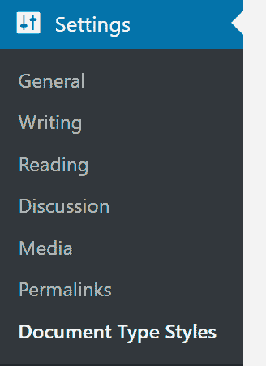

点击新的链接查看管理页面，如下面的截图所示：


如果您遵循管理页面上的前三个步骤（上传文件图标，将新样式添加到样式表中，并将扩展名添加到选项中），则新的文档类型将被支持。

已经有几种方法可以改进这个插件。以下是一些方法：

+   而不是强迫用户使用 FTP 上传他们新的图标，插件可以允许用户通过设置页面直接上传图标。

+   插件可以在设置页面上显示支持的文档类型的图标，这样用户就可以看到它们的外观。

+   插件可以检查确保在选项字段中的每个文档类型都有一个现有的图标，否则，它将显示错误。

也许你想亲自尝试这些更改！

# 测试你的插件

我们已经测试了我们新的插件，所以现在可能是时候说一两句关于测试你的插件并确保它们不会给普通用户带来任何问题的了。

我们的插件非常简单；它所做的唯一一件事是处理任何帖子或页面内容中找到的每个链接，并在其旁边添加一个自定义图标。然而，即使这样的简单插件也可能成为潜在的安全漏洞点。例如，用户唯一可以输入的地方是`wp-admin`（处理支持文件类型的字段）中的插件部分。现在，有人可能会使用这个字段输入一段特定的 PHP 代码而不是标准的文件类型；例如，旨在服务器端执行特定操作的代码，这可能导致严重的安全漏洞。这就是为什么我们的`update_supportedtypes_options()`函数有以下两行：

```php
$safe_val = addslashes(strip_tags($_POST
   ['doctype_styles_new_supportedtypes'])); 
update_option('doctype_styles_new_supportedtypes', $safe_val);
```

多亏了它们，用户输入的所有内容都将通过`strip_tags()`移除所有的 PHP 和 HTML 标签，然后需要引号的所有字符将由`addslashes()`处理。使用这样的函数是一种以防万一的做法，但它往往最终会得到回报。

除了将我们的工作与一些常见的黑客攻击手段进行对比测试，如代码注入或 SQL 注入，我们还需要处理我们所能想到的所有非传统用途。例如，如果有人输入了一个非标准文件类型的值会发生什么？或者，如果 CSS 文件突然丢失会发生什么？这些问题只是良好测试会回答的一些问题。

测试插件的另一种好方法是将其交给几位可信赖的用户，并征求他们的反馈。对于完全不了解你插件的人来说，他们通常会比你，即插件的作者，做得更好。

当然，这里简短的章节只是触及了插件测试和代码测试的一般表面，所以我鼓励你自己更仔细地研究。网上和在你最近的书店里有很多很好的资源。

# 具有数据库访问权限的插件——捕获搜索词

现在，我们将把文档类型插件放在一边，创建一个新的，它将使用数据库的活跃功能。让我们创建一个简单的插件，用于存储访客搜索的所有单词（当使用博客的搜索功能时）。

总体来说，这个插件非常基础，不需要像我们之前工作的插件那样拥有自己的目录。这就是为什么整个插件都将在一个文件中完成：`capture_searches_new.php`。我将这个插件命名为“捕获搜索词新”。

此插件的数据库表结构如下。表名为 `wp_searchedwords`：

| **Field** | **Type** | **Null** | **Key** | **Default** | **Extra** |
| --- | --- | --- | --- | --- | --- |
| `Id` | `INT` | NOT NULL | PRI | - | `auto_increment` |
| `Word` | `VARCHAR(255)` | - | - | NULL | - |
| `created` | `DATETIME` | NOT NULL | - | Today 00:00:01 | - |

现在，让我们编写插件代码。

尽管我说表名为 `wp_searchedwords`，但这并不总是如此。这完全取决于为你的网站设置的表前缀（默认前缀确实是 `wp_`）。在这里，为了方便，我仍然将表称为 `wp_searchedwords`。

# 使插件能够与数据库通信

此插件的第一部分应该在插件激活时运行。这将是一个初始化函数。其任务之一是创建或更新数据库表（如果之前尚未创建，则将创建表）：

```php
function searchedwords_init($content) { 
  global $wpdb; 
  $sw_table_name = $wpdb->prefix.'searchedwords'; 

  //creating the table (if it doesn't exist) or updating it if 
  // necessary 
  if(isset($_GET['activate']) && 'true' == $_GET['activate']) { 
    $sql = 'CREATE TABLE `'.$sw_table_name.'` ( 
      id INT NOT NULL AUTO_INCREMENT,  
      word VARCHAR(255),  
      created DATETIME NOT NULL DEFAULT \''.date('Y-m-d').' 
         00:00:01\',  
      PRIMARY KEY  (id) 
    )'; 

    require_once(ABSPATH.'wp-admin/includes/upgrade.php'); 
    dbDelta($sql); 
  } 

  // in case a search has just been performed, store the searched 
  // word 
  if (!empty($_GET['s'])) { 
    $current_searched_words = explode(" ",urldecode($_GET['s'])); 
    foreach ($current_searched_words as $word) { 
      $wpdb->query($wpdb->prepare("INSERT into `$sw_table_name` 
         VALUES(null,'%s','".date('Y-m-d H:i:s')."')", $word)); 
    } 
  } 
}
```

此函数通过各种函数调用连接到数据库，例如 `dbDelta()`、`$wpdb->query()` 和 `$wpdb->prepare()`。`dbDelta()` 函数负责创建表或更新它（在需要的时候做任何需要的事情；你可以在 [`codex.wordpress.org/Creating_Tables_with_Plugins`](https://codex.wordpress.org/Creating_Tables_with_Plugins) 上了解更多）。除此之外，当处理 WordPress 数据库时，你可以利用任何存在的数据库相关 PHP 函数。或者，你可以使用 WordPress 的类成员函数：`$wpdb->get_results()`。我们在这里使用的函数还会在搜索刚刚执行后，将搜索词存储在数据库表中。这是通过 `$wpdb->query()` 和 `$wpdb->prepare()` 函数完成的。

# 添加管理页面函数

我们现在需要一个看起来熟悉的函数，该函数将管理页面添加到 `wp-admin` 中。在这种情况下，我们使用 `add_management_page()` 而不是 `add_submenu_page()`，因为这个插件更像是一个工具，而不是需要设置的东西：

```php
function modify_menu_for_searchedwords() { 
  $page = add_management_page( 
    "Capture Searched Words",  
    "Capture Searched Words",  
    'manage_options',  
    'capture_searches_new',  
    'searchedwords_page' 
  ); 
}
```

对于此插件，我们不会加载任何自定义样式或 CSS 文件。这里的目的是仅仅展示如何进行数据库连接，所以我们将保持其他一切超简单和最小化。因此，我们现在需要做的只是编写一个函数，该函数从数据库检索信息并在新管理页面上显示（同样，一切通过 `$wpdb` 对象完成——它是由 WordPress 定义的一个类，其中包含一组你可以用来与数据库交互的函数）：

```php
function searchedwords_page() { 
  global $wpdb; 
  $sw_table_name = $wpdb->prefix.'searchedwords'; 

$searched_words = $wpdb->get_results("SELECT COUNT(word) AS 
   occurrence, word FROM `$sw_table_name` GROUP BY word ORDER BY 
   occurrence DESC"); 
  ?> 
<div class="wrap" style="max-width: 600px;"> 
<h2>Searched Words</h2> 
<table class="wp-list-table widefat"> 
<thead> 
  <tr> 
    <th scope="col">Search Words</th> 
    <th scope="col"># of Searches</th> 
  </tr> 
</thead> 
<tbody> 
  <?php 
  if($searched_words !== NULL) { 
    foreach($searched_words as $searched_word) { 
      echo '<tr valign="top"><td>'.$searched_word-
         >word.'</td><td>'.$searched_word->occurrence.'</td></tr>'; 
    } 
    $searched_perfomed = true; 
  } 
  else { 
    echo '<tr valign="top"><td colspan="2"><strong>No searches 
       have been performed yet</strong></td></tr>'; 
  } 
  ?> 
</tbody> 
</table> 
</div> 
  <?php 
}
```

就这样。之前的插件有更多功能，因为数据是从用户那里捕获并保存的。这里则不需要。

最后，我们只需要添加两个钩子，如下所示：

```php
add_filter('init', 'searchedwords_init'); 
add_action('admin_menu', 'modify_menu_for_searchedwords');
```

第一个钩子告诉 WordPress 在插件激活时或执行搜索时运行初始化函数。第二个钩子修改 `admin_menu` 以添加到新管理页面的链接。

本章节的代码包中提供了这个插件的这个版本，位于名为`final`的子目录中。这是插件的第一版也是最终版。

# 尝试插件

与上一个插件一样，你现在可以通过 FTP 将插件上传到`wp-content/plugins`，或者将其转换为 ZIP 文件，然后使用上传器添加到`wp-admin`。

安装后，激活它。然后，查看工具下的菜单，你会看到一个指向新管理页面的链接，如下面的截图所示：

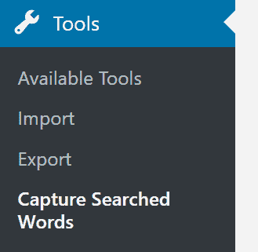

当你点击“捕获搜索词”时，你会看到一个新页面，这是插件创建的，如下面的截图所示：

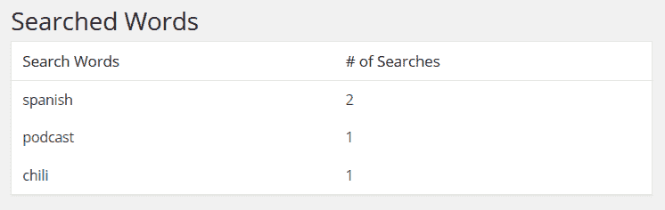

正如你所见，我事先进行了一些搜索，以便在这个新页面上展示一些内容。你可以通过在你的侧边栏中放置搜索字段小部件（如下面的截图所示）并尝试不同的搜索词和短语来做到这一点。插件将收集所有这些内容，并在`wp-admin`中的其部分显示搜索次数最多的内容：

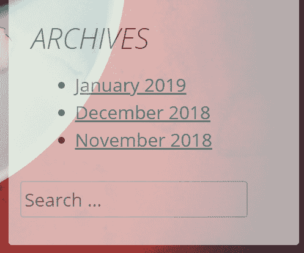

# 为基于块的编辑器构建插件

如你所知，WordPress 中有一个新的内容编辑器，这是在平台 5.0 版本中引入的。本质上，它废除了之前的单一编辑窗口，相反，允许用户使用单个内容块，一个接一个地放置。当所有这些块组合在一起时，就构成了最终的博客文章。这对用户来说很好，但对于插件开发者来说意味着什么呢？一些事情！

首先，为基于块的编辑器构建插件与我们在本章中构建的标准插件非常不同。虽然你可以仅凭对 PHP 和 HTML 的基本知识构建那些经典插件，但为基于块的编辑器构建则要复杂得多。这涉及到设置和掌握额外的网络技术。你需要像**npm**、**Node.js**和**webpack**这样的东西，更不用说你还必须熟悉 JavaScript。教所有这些内容足以写一本书。所以，而不是这样做，我将向你指出一些外部资源，你可以从这里开始你的基于块的编辑器冒险。然而，在我这样做之前，让我们简要总结一下为编辑器构建的一般想法和可能实现的内容。

新编辑器接受两种主要类型的元素，如下所示：

+   块状元素

+   侧边栏部分

换句话说，作为一个插件开发者，你可以创建新的块以包含在编辑器中，或者创建新的侧边栏条目以自定义插件功能的相关细节，或者两者都做。

我相信你现在一定知道什么是块了，让我给你展示一个在新编辑器中良好侧边栏使用的例子。它来自 Yoast SEO 插件([`wordpress.org/plugins/wordpress-seo/`](https://wordpress.org/plugins/wordpress-seo/);我们已在第五章中讨论过)，如果用户在他们的网站上启用了这个插件，并且他们继续撰写一篇新的博客文章，他们将在编辑器的右上角看到这个新的侧边栏部分，如下面的截图所示：

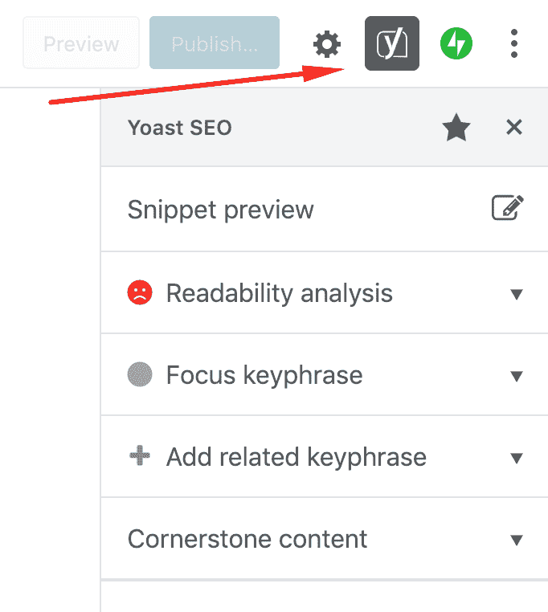

它允许用户调整他们文章的 SEO 参数。值得注意的一点是插件块如何与编辑器用户界面的其余部分良好集成。这种无缝集成是构建基于块的编辑器插件的整体目标。

如果你想要构建一个启用新块的插件，它们也需要使用与 WordPress 内置的默认块相同的界面约定。以下是一个做这件事的插件示例。它被称为 Otter blocks([`wordpress.org/plugins/otter-blocks/`](https://wordpress.org/plugins/otter-blocks/))。

当你安装并激活它时，你会获得一套全新的块，最好的部分是它们与默认块完美融合。例如，包含的一个块是**共享图标**块。以下截图显示了它的样子：

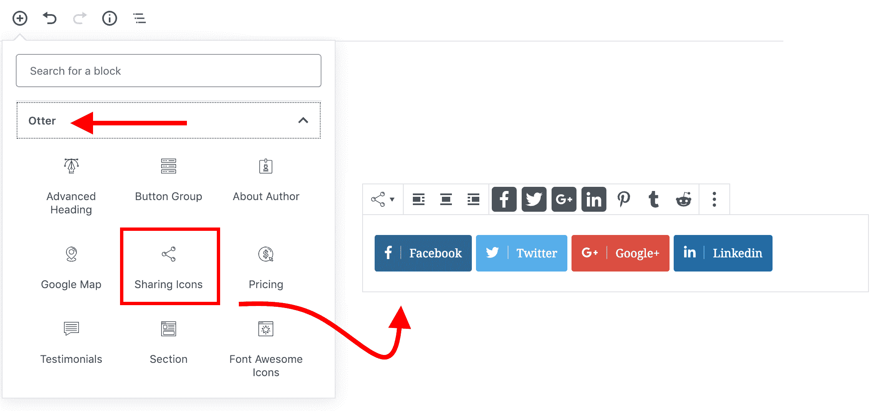

如你所见，它具有与其他所有块相同的控件和类似选项。当然，这个插件是一个相当复杂的创作，由一个开发团队构建，你当然不必让你的第一个块插件有同样令人印象深刻。

话虽如此，你可能特别注意到与基于块的编辑器相关的一点；那就是，如果你的插件不需要创建任何新的块或侧边栏元素呢？在这种情况下，你根本不需要麻烦自己使用编辑器。我们在这章中迄今为止创建的两个插件根本不使用编辑器，所以让你的插件与编辑器兼容绝对不是必须的。

要开始使用基于块的编辑器的冒险，请阅读这篇两部分的指南，了解如何为块编辑器适配你的插件：第一部分可以在[`www.codeinwp.com/blog/adapt-your-plugin-for-gutenberg-block-api/`](https://www.codeinwp.com/blog/adapt-your-plugin-for-gutenberg-block-api/)找到，第二部分可在[`www.codeinwp.com/blog/make-plugin-compatible-with-gutenberg-sidebar-api/`](https://www.codeinwp.com/blog/make-plugin-compatible-with-gutenberg-sidebar-api/)找到。

此外，你可以尝试免费的 Gutenberg 模板插件([`github.com/HardeepAsrani/gutenberg-boilerplate`](https://github.com/HardeepAsrani/gutenberg-boilerplate))，它提供了一个最小化的块编辑器开发设置和示例，全部包含在一个包中。包含一个示例块和一个示例侧边栏。你可以在创建自己的块准备插件时基于这些元素进行构建。

# 学习更多

WordPress 中有数百个钩子可用——本书中难以全部涵盖。你可以通过上网了解更多关于它们的信息。从这些在线参考网站开始：

+   **插件 API**文章包含了关于编写插件和使用钩子的非常详细的信息，网址为[`codex.wordpress.org/Plugin_API`](https://codex.wordpress.org/Plugin_API)。

+   要查看完整的动作钩子列表，请访问[`codex.wordpress.org/Plugin_API/Action_Reference`](https://codex.wordpress.org/Plugin_API/Action_Reference)。

+   要查看完整的过滤器钩子列表，请访问[`codex.wordpress.org/Plugin_API/Filter_Reference`](https://codex.wordpress.org/Plugin_API/Filter_Reference)。

+   你可能还想退一步查看 WordPress Codex 中的通用**插件资源**页面，网址为[`codex.wordpress.org/Plugin_Resources`](https://codex.wordpress.org/Plugin_Resources)。

+   另一个你可能觉得非常有用的页面是针对开发者的新**代码参考**：[`developer.wordpress.org/reference/`](https://developer.wordpress.org/reference/)。

+   如果你想要为新的基于块的编辑器构建插件，一个关键的资源是**Gutenberg 手册**，可在[`wordpress.org/gutenberg/handbook/`](https://wordpress.org/gutenberg/handbook/)找到。

+   如果你想要将你的插件提交到 WordPress 插件仓库，你需要采取与准备主题时类似的步骤，并且你还需要连接到 WordPress SVN 仓库。有关如何将插件提交到 WordPress 插件仓库的更多信息，请参阅[`developer.wordpress.org/plugins/wordpress-org/`](https://developer.wordpress.org/plugins/wordpress-org/)。

# 小工具

编写小工具与编写插件有一些相似之处。在某些方面，它甚至更容易，因为你可以利用小工具类来实现一些功能。在其他方面，它也可能更耗时，因为每个小工具都必须包含大量的强制代码。

# 自定义标签云小工具

在本节中，我们将看到如何编写一个显示自定义标签云的小工具，然后我们可以将其放置在侧边栏中。还将有可能更改小工具的标题，尽管这是一个标签云小工具，我们仍然能够将标签切换为类别，并以类似标签云的风格显示它们。最终形式的小工具将类似于以下截图：

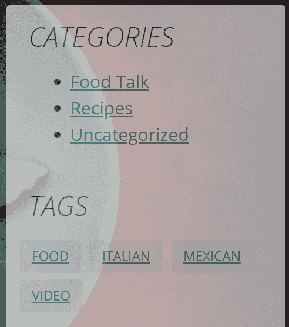

为了比较，这里展示的是标准标签云小部件（WordPress 中的原生小部件）的样子：


让我们开始吧！

# 为我们的小部件命名

在这种情况下，我们将创建一个独立的小部件插件。所以，就像任何其他插件一样，它需要一个独特的名称，并在 `wp-content/plugins` 目录中有一个独特的出现。

我鼓励你在创建新的小部件或插件时，随时在网络上搜索，以确保没有其他东西使用相同的名称。除此之外，使用命名空间作为每个文件名（和函数名）的前缀。例如，我的命名空间是 `kk_`。

我将命名新的插件文件（包含小部件）为 `kk_tag_cloud_widget.php`，并将其放入 `wp-content/plugins` 目录下的 `kk_tag_cloud_widget` 目录中。

这个主要的 PHP 文件开始就像任何其他插件一样，以下是一个声明：

```php
<?php 
/* 
Plugin Name: Karol K's Tag Cloud Widget 
Description: Displays a nice tag cloud. 
Plugin URI: http://nio.tips/ 
Version: 1.1 
Author: Karol K 
Author URI: http://karol.cc/ 
License: GNU General Public License v2 or later 
*/
```

# 小部件结构

当你使用小部件类构建小部件时，你的小部件需要以下结构：

```php
class UNIQUE_WIDGET_NAME extends WP_Widget { 

  public function __construct() { 
    $widget_ops = array(); 
    $control_ops = array(); 
    parent::__construct('base id', 'name', $widget_ops, 
       $control_ops); 
  } 

  public function widget($args, $instance) { 
    // used when the sidebar calls the widget 
  } 

  public function form($instance) { 
    // prints the form on the widgets page 
  } 

  public function update($new_instance, $old_instance) { 
    // used when the user saves his/her widget options 
  } 
} 

// initiate the widget 

// register the widget
```

我为这个项目创建的唯一小部件名称是 `KK_Widget_Tag_Cloud`。现在，让我们逐个回顾前面的函数，并了解它们的作用。

# 小部件初始化函数

让我们从小部件初始化函数开始。在我们添加任何内容之前，它看起来如下所示：

```php
public function __construct() { 
  $widget_ops = array(); 
  $control_ops = array(); 
  parent::__construct('base-id', 'name', $widget_ops, 
     $control_ops); 
}
```

在这个函数中，它是类的构造函数，我们初始化 `WP_Widget` 类期望的各种东西。前两个变量，你可以给它们任何你想要的名称，只是设置两个数组变量的便捷方式，这是第三行代码期望的。

让我们来看看这三行代码，如下所示：

+   `$widget_ops` 变量是你可以设置类名的地方，这个类名是给 `div` 小部件本身的，还有描述，这个描述在 `wp-admin` 的小部件页面上显示。

+   `$control_ops` 变量是你可以设置 `wp-admin` 的小部件页面上控制框的选项的地方，例如小部件的宽度和高度，以及用于内部项目和名称及 ID 的前缀。对于我的基本小部件，我不会使用这个变量（因为它不是必需的）。

+   当你调用父类的构造函数 `WP_Widget()` 时，你需要告诉它小部件的唯一 ID、小部件的显示标题，并传递你创建的两个数组。

对于这个小部件，我的代码现在看起来如下所示：

```php
public function __construct() { 
  parent::__construct( 
    'kk-tag-cloud', 
    'KK Tag Cloud', 
    array( 
      'description' => 'Your most used tags in cloud format; same 
         height; custom background' 
    ) 
  ); 
}
```

# 小部件表单函数

小部件表单函数必须命名为 `form()`。如果你想让小部件类知道它的目的，你不得重命名它。你还需要有一个参数，我称之为 `$instance`，这个类也期望它。这是当前小部件设置存储的地方。这个函数需要包含创建用户在添加小部件到侧边栏时将看到的表单的所有功能。让我们看看一些简化的代码，然后探索它在做什么，如下所示：

```php
public function form($instance) { 
  $instance = wp_parse_args((array) $instance, 
  array('template' => '')); 
  $current_taxonomy = $this->_get_current_taxonomy($instance); 
  ?> 
  <p> 
    <label for="<?php echo $this->get_field_id('title'); 
       ?>">Title</label>    
    <input type="text" class="widefat" id="<?php echo $this-
       >get_field_id('title'); ?>" name="<?php echo $this-
       >get_field_name('title'); ?>" value="<?php if  
       (isset($instance['title'])) 
       {echo esc_attr($instance['title']);} 
   ?>" /> 
  </p> 
  <p> 
    <label for="<?php echo $this->get_field_id('taxonomy'); 
       ?>">Taxonomy</label>   
    <select class="widefat" id="<?php echo $this-
       >get_field_id('taxonomy'); ?>" name="<?php echo $this-
       >get_field_name('taxonomy'); ?>"> 
    <?php foreach(get_object_taxonomies('post') as $taxonomy) : 
      $tax = get_taxonomy($taxonomy); 
      if(!$tax->show_tagcloud || empty($tax->labels->name)) 
        continue; 
      ?> 
      <option value="<?php echo esc_attr($taxonomy) ?>"
      <?php selected($taxonomy, $current_taxonomy); ?>>
      <?php echo $tax->labels->name; ?></option> 
    <?php endforeach; ?> 
    </select> 
  </p> 
  <?php 
}
```

首先，你使用一个名为 `wp_parse_args()` 的 WordPress 函数，该函数创建一个 `$instance` 数组，你的表单将使用它。里面的内容取决于你设置的默认值和用户已经保存的设置。然后，你创建表单字段。注意，对于每个表单字段，我使用了内置的函数，这些函数将创建唯一的名称和 ID，并输入现有值，如下所示：

+   `$this->get-field_id()` 根据小部件实例创建一个唯一的 ID（记住，你可以创建这个小部件的多个实例）。

+   `$this->get_field_name()` 根据小部件实例创建一个唯一的名称。

+   `$instance` 数组是找到小部件当前值的地方，无论它们是默认值还是用户保存的数据。

里面的所有其他代码都是常规的 PHP 和 HTML。注意，如果你允许用户设置标题，请将此字段命名为 `title`，WordPress 将在最小化时在表单上显示它。这个表单将创建如下所示：

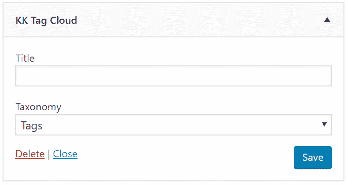

# 小部件保存函数

当用户点击小部件表单上的保存按钮时，WordPress 会使用 AJAX 来运行你的保存函数。你需要确保保存用户输入的所有内容，在这个例子中，我们就是这样做的，但如果你觉得适合你的小部件（例如，数据库交互、转换、计算等），你可以在这里添加其他功能。这个函数的最终代码如下：

```php
public function update($new_instance, $old_instance) { 
  $instance['title'] = $new_instance['title']; 
  $instance['taxonomy'] = stripslashes($new_instance['taxonomy']); 
  return $instance; 
}
```

确保这个函数名为 `update()`，并准备好接受两个实例，一个包含旧数据，一个包含刚刚提交的数据。你可以编写代码来检查 `$new_instance` 是否有问题，因此，如果新的实例无效，则返回 `$old_instance`。你返回的 `$instance` 数据将显示在更新小部件表单中。

# 小部件打印函数

在你的小部件类中，第三个主要函数是在侧边栏需要实际向访问网站的人展示小部件时被调用的。它需要检索任何相关的已保存用户数据，并向网站访客打印信息。在这种情况下，我们的最终打印函数如下所示：

```php
public function widget($args, $instance) { 
  extract($args); 
  $current_taxonomy = $this->_get_current_taxonomy($instance); 
  if(!empty($instance['title'])) { 
    $title = $instance['title']; 
  } 
  else { 
    if('post_tag' == $current_taxonomy) { 
      $title = 'Tags'; 
    } 
    else { 
      $tax = get_taxonomy($current_taxonomy); 
      $title = $tax->labels->name; 
    } 
  } 
  $title = apply_filters('widget_title', $title, $instance, $this-
     >id_base); 
  $before_widget = '<div class="widget-container kk_widget_tag_cloud">'; 
  $after_widget = '</div>'; 
  $before_title = '<h1 class="widget-title">'; 
  $after_title = '</h1>'; 

  echo $before_widget; 
  if ( $title )  echo $before_title . $title . $after_title;  
  echo '<div class="kk_tagcloud">'; 
  wp_tag_cloud(apply_filters('widget_tag_cloud_args', 
     array('taxonomy' => $current_taxonomy))); 
  echo "</div>\n"; 
  echo $after_widget; 
}
```

前面的函数调用了一个额外的辅助函数，该函数负责获取当前分类法。虽然它非常简单，代码如下：

```php
function _get_current_taxonomy($instance) { 
  if ( !empty($instance['taxonomy']) && 
     taxonomy_exists($instance['taxonomy']) ) 
    return $instance['taxonomy']; 
  return 'post_tag'; 
}
```

在主函数中，我首先提取实例中的数据，这些数据包含网站管理员在填写小部件表单时保存的信息。然后，小部件查看所选的分类法（标签或类别），并以简单的单行列表显示所有单个项目。

# 自定义小部件样式

我们的小部件有自己的样式表，需要包含在当前主题的`head`部分，就像任何其他样式表一样。

文件名为 `kk_tag_cloud_widget.css`，包含以下内容：

```php
.kk_widget_tag_cloud .kk_tagcloud { 
    line-height: 1.5em; 
} 

.kk_widget_tag_cloud .kk_tagcloud a { 
    display: inline-block; 
    margin: 3px 2px; 
    padding: 0 11px; 
    border-radius: 3px; 
    -webkit-border-radius: 3px; 
    background: #eee; 
    color: #279090; 
    font-size: 12px !important; 
    line-height: 30px; 
    text-transform: uppercase; 
} 

.kk_widget_tag_cloud .kk_tagcloud a:hover { 
    color: #f2f2f2; 
    background: #404040; 
}
```

没有什么花哨的，只是一组确保小工具看起来很棒的类。我们唯一需要对这个样式表做的事情是通过标准的 WordPress 钩子将其排队。在你的插件主文件中放置以下代码：

```php
function kk_tag_cloud_widget_styles_load() { 
  wp_register_style('kk_tag_cloud_widget_styles', 
     plugins_url('kk_tag_cloud_widget.css', __FILE__)); 
  wp_enqueue_style('kk_tag_cloud_widget_styles'); 
} 
add_action('wp_enqueue_scripts', 
   'kk_tag_cloud_widget_styles_load');
```

# 启动和连接小工具

小工具功能到此结束！现在，你只需要添加一小段代码，将小工具与 WordPress 的其他部分连接起来，如下所示：

```php
function KK_Widget_Tag_Cloud_Reg() { 
  register_widget('KK_Widget_Tag_Cloud'); 
} 
add_action('widgets_init', 'KK_Widget_Tag_Cloud_Reg');
```

这告诉 WordPress，当它启动小工具时，必须确保注册我们新的小工具。

此版本的小工具包含在本章的代码包中，位于名为`phase 1`的子目录内。在我们将其称为最终版本之前，我们还会添加一个新功能。

# 尝试使用小工具

你的小工具已经准备好了！现在让我们尝试一下我们创建的这个小工具：

1.  保存所有更改，并将你的小工具上传到`wp-content/plugins`目录。

1.  前往插件部分，你会看到你的小工具正等待被激活，就像往常一样。

1.  点击激活按钮后，你可以导航到外观 | 小工具。你会看到小工具等待被添加到侧边栏，如下面的截图所示：

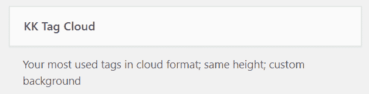

1.  将小工具拖到侧边栏，然后点击小箭头进行编辑。你会看到选项滑下来，如下面的截图所示：

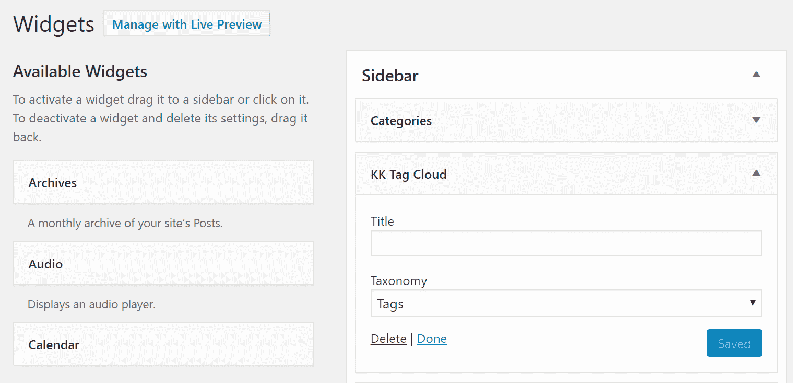

1.  你可以输入一个标题或留空使用默认标题，并选择你想要显示的分类。

1.  然后，就像处理任何小工具一样，点击保存。

1.  当你回到网站的首页并重新加载时，新的标签云将立即显示，如下面的截图所示：


# 学习更多

你可以通过以下在线参考网站了解更多关于小工具的信息：

+   WordPress 的*小工具 API*位于[`codex.wordpress.org/Widgets_API`](https://codex.wordpress.org/Widgets_API)。

+   WordPress 在[`codex.wordpress.org/WordPress_Widgets`](https://codex.wordpress.org/WordPress_Widgets)列出了许多小工具。

+   如果你想要在你的网站上安装更多的小工具，请访问插件仓库的小工具部分[`wordpress.org/plugins/tags/widget`](https://wordpress.org/plugins/tags/widget)。

# 将小工具捆绑到现有插件中

如果你正在编写插件并且想要与插件一起提供小工具，你不需要创建一个单独的小工具插件。只需将所有的小工具代码——类似于我们在前面的部分中创建的——包含到你的插件 PHP 文件中。当用户激活插件时，小工具将自动显示在`wp-admin`的小工具页面上。不需要单独的文件！

# 短代码

短代码是一种方便的方式，可以让非技术人士，例如网站编辑，在页面和帖子中包含动态内容，而无需实际使用任何 PHP、复杂的 HTML 结构或自定义 JavaScript。换句话说，短代码是方便的可重用代码片段，但它们不需要任何实际的编码经验或知识。

# 短代码及其工作方式

短代码的工作方式是告诉 WordPress 查看方括号`[]`内的文本，并通过运行 PHP 函数来评估它。这个 PHP 函数可以存在于主题的`functions.php`文件中，或插件文件中，或小工具文件中。让我们创建一个简单的短代码并将其包含在我们的最新小工具插件中。

# 短代码的类型

根据定义，短代码是一个相当简单的概念，但我们仍然可以区分三种主要类型，如下所示：

+   **单标签短代码**：这些短代码只需要一个标签即可执行，例如，`[my_first_shortcode/]`。

+   **双标签短代码**：这些短代码通过打开和关闭标签来执行，例如，`[my_2nd_shortcode]some text here[/my_2nd_shortcode]`（注意关闭标签有一个额外的`/`）。如你所见，标签内也有一些内容。这些内容可以通过短代码函数进行处理。

+   **带属性的短代码**：这些短代码可以有一个或两个标签，还可以使用一些属性来自定义输出，例如，`[my_3rd_shortcode name="Karol" twitter="carlosinho"]some text here[/my_3rd_shortcode]`。

# 创建一个简单的短代码

让我们创建一个简单的短代码，这样我们就可以在任何给定帖子或页面中使用我们的小工具输出。这将是一个带有额外属性的标签短代码，我们将使用它来指示输出是否应该使用我们的自定义 CSS 或 WordPress 的本地样式进行格式化：

1.  让我们从在`kk_tag_cloud_widget.php`文件的底部创建一个新函数开始，然后我们将逐行进行操作，如下所示：

```php
function kk_tag_cloud_handler($atts, $content=null) { 
  extract(shortcode_atts(array( 
    'use_css' => '1', 
    'taxonomy' => 'post_tag' 
    ), $atts)); 

  $tax = 'post_tag'; 
  if(taxonomy_exists($taxonomy)) $tax = $taxonomy; 

  $result = ''; 

  if ('0' != $use_css) { 
    $result .= '<div class="kk_widget_tag_cloud"><div 
       class="kk_tagcloud">'; 
  } 
  if (null != $content) { 
    $result .= addslashes(strip_tags($content)).' '; 
  } 
  $result .= wp_tag_cloud(apply_filters( 
    'widget_tag_cloud_args',  
    array('taxonomy' => $tax, 'echo' => false) 
    )); 
  if ('0' != $use_css) { 
    $result .= '</div></div>'; 
  } 

  return $result; 
}
```

首先，请注意，这个函数不*echo*或*print*任何内容。它只是返回一个字符串。如果你让你的函数打印，它将不会在网站上看起来正确。

在我们的函数中，第一行处理短代码接收的自定义属性（在这种情况下，只是`use_css`参数，用于指示是否应该使用样式，以及`taxonomy`参数，用于指示短代码中应显示的分类法）。WordPress 会自动传递`$atts`参数，我们只需要使用`extract()`函数将用户提交的属性转换为函数中可用的变量。传递给`extract()`函数的数组中的值设置了默认值，以防用户没有选择任何选项。一般来说，你可以为短代码用户提供无限多的选项。

下一行提取分类标识符并尝试将其转换为有效的分类。如果用户的输入无效，将使用默认的`post_tag`分类。函数的最后部分根据`use_css`属性的当前状态处理显示。目前来说这相当基础！还有可能包含自定义文本作为短代码的主要内容。在某些情况下这可能很有用。

1.  我们现在需要告诉 WordPress 这个功能是一个短代码，我们通过钩子来实现。务必选择一个独特的名称。我已选择`kk_tag_cloud`作为这个短代码的名称，所以钩子看起来如下所示：

```php
add_shortcode('kk_tag_cloud', 'kk_tag_cloud_handler');
```

1.  要在我们的内容中使用这个短代码，我们只需编辑任何给定的帖子或页面，并插入如下所示的行：

```php
[kk_tag_cloud taxonomy="category"] Select the category you'd like 
   to read next:[/kk_tag_cloud]
```

1.  这种使用方式会产生以下效果：

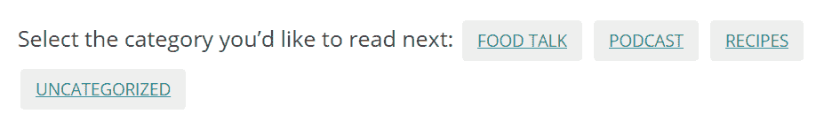

1.  我们还可以使用如下所示的短代码：

```php
[kk_tag_cloud use_css="0" taxonomy="category"]Select the category 
   you'd like to read next:[/kk_tag_cloud]
```

1.  这将禁用自定义样式并产生以下效果：

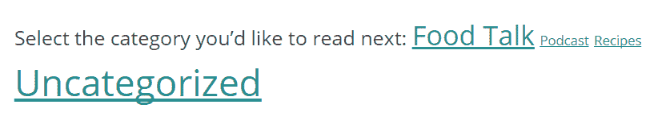

1.  要显示默认格式的标签云（显示标签并使用自定义样式表），我们只需执行以下短代码即可：

```php
[kk_tag_cloud][/kk_tag_cloud]
```

效果如下所示截图：

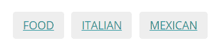

关于短代码可以做什么和不能做什么的限制非常少。

这个小部件的版本可以在本章的代码包中找到，位于名为`final`的子目录中。这是我们小部件的最终版本。

# WordPress REST API

WordPress REST API 是 WordPress 平台上的一个相对较新的功能。在它被添加到核心之前，REST API 作为一个独立的机制通过一个单独的插件提供。你可以获取所有内容，也可以从项目的官方网站[`v2.wp-api.org/`](http://v2.wp-api.org/)学习如何与之交互。

然而，REST API 在 WordPress 4.7 版本中被包含在了 WordPress 核心包中。这意味着你不再需要任何额外的插件或工具来使其工作。基本上，只要你在 WordPress 的最新版本上，REST API 就已经默认安装并启用。这是一个好消息！但让我们更深入地了解一下。

# 什么是 REST API？

在底层，REST API——官方称为 WordPress REST API——只是另一层技术，允许你与你的 WordPress 站点以及其他人的站点进行交互。主要来说，REST API 允许你将 WordPress 站点的表示层与其在后台运行机制分开。换句话说，通过特定的 REST API 调用，你可以在不进入站点的`wp-admin`或甚至通过网页浏览器访问它的情况下，对 WordPress 站点的内容执行操作。

# 为什么使用 WordPress REST API？

REST API 的引入为使用 WordPress 网站提供了许多新的可能性，包括*你可以做什么*以及*你可以用它做什么*。例如，通过 REST API，你可以远程与 WordPress 内容进行交互，添加新内容，删除内容，或执行任何其他操作。仅举一个主要可能性，这使得为你的网站创建移动应用变得容易，并且应用可以通过 REST API 与网站进行通信。换句话说，如果你想通过除了直接访问网站之外的其他方式与 WordPress 网站进行通信，那么你可以使用 REST API 来实现这一点。

# 如何开始使用 REST API

我们在这里只是触及了表面，本章中提供的描述绝对不是详尽的。REST API 是一项相当先进的技术，它让你可以做很多事情——有时是通过相当复杂的代码结构。因此，我们在这里想要实现的唯一目标是帮助你入门，通过提供一个基础，你可以在此基础上进一步探索，当你学习 REST API 的其他地方时。如果你真正想精通 REST API，一个很好的起点是官方开发者手册[`developer.wordpress.org/rest-api/`](https://developer.wordpress.org/rest-api/)。话虽如此，以下是如何开始使用 REST API 的基础知识。

REST API 允许你通过发送*请求*和通过 WordPress HTTP API 接收*响应*的方式与任何 WordPress 网站进行交互。为了发出一个有效的请求，你需要引用以下内容：REST API 的*基本 URL 路径*、*路由*和*端点*。

所有 WordPress 网站的基本 URL 路径都是类似的：`http://YOURWEBSITE.com /wp-json/wp/v2/`。

路径定义了你想要与之通信的网站内容的精确部分。例如，你可以使用`posts/`来与网站的帖子进行通信。在这种情况下，完整的 URL 将是`http://YOURWEBSITE.com/wp-json/wp/v2/posts/`。

端点是 REST API 中可用的特定功能。例如，如果你将路由扩展到通过 ID 定位特定帖子，例如`http://YOURWEBSITE.com /wp-json/wp/v2/posts/123`，那么这允许你调用以下三个端点之一：

+   `GET` 返回帖子数据

+   `PUT` 更新帖子数据并返回更新后的帖子数据

+   `DELETE` 删除帖子并返回已删除的帖子数据

除了默认的端点之外，你还可以根据自己的需求创建自己的端点，以便通过 REST API 对你的内容进行操作。然而，这可能是一个更深入的 REST API 手册的主题。为了本书的目的，我们只进行一个简单的演示，并创建一个插件，该插件将通过 REST API 与外部 WordPress 网站进行通信。

# 创建使用 REST API 的插件

你已经在本章中学习了如何创建基本的 WordPress 插件，所以现在，让我们将这个知识与 REST API 的新增功能结合起来。我们正在构建的插件将简单地根据短代码显示另一博客的帖子列表。

让我们来看看这个插件的完整代码——所有这些都包含在一个名为`kk_rest_demo.php`的单个文件中，如下所示：

```php
function kk_rest_handler($atts, $content=null) {
  extract(shortcode_atts(array( 
    'website_domain' => 'newinternetorder.com', 
    'how_many' => '3' 
  ), $atts)); 

  $response = wp_remote_get( 'http://' . $website_domain . '/wp-
  json/wp/v2/posts/' );

  if( is_wp_error( $response ) ) { 
    $error_string = $response->get_error_message(); 
    return 'Error occurred: <em>' . $error_string . '</em>'; 
  }

  $posts = json_decode( wp_remote_retrieve_body( $response ) );

  if( empty( $posts ) ) { return 'No posts found'; } 
  else { 
    $result = '<ul>'; 
    $post_count = 0; 
    foreach( $posts as $post ) { 
      $post_count++; 
      if ($post_count <= $how_many) { 
        $result .= '<li><a href="' . $post->link. '">'
        . $post->title->rendered . '</a></li>'; 
      } 
    } 
    $result .= '</ul>'; 
    return $result; 
  }
}
add_shortcode('kk_rest', 'kk_rest_handler');
```

第一个函数调用`extract()`是我们从之前的短代码插件/小部件中了解到的。它提取了分配给短代码的属性。在我们的情况下，短代码与两个可选属性一起工作，如下所示：

+   `website_domain`：这表示插件应该与之通信的 WordPress 网站的域名（默认为`newinternetorder.com`）。

+   `how_many`：这表示应该检索多少篇帖子（默认为`3`）。

下一个函数调用是主要 REST API 通信发生的地方。这个调用引用了一个给定的路由，并使用 GET 端点（默认）检索博客帖子，如下所示：

```php
$response = wp_remote_get( 'http://' . $website_domain . '/wp-json/wp/v2/posts/' );
```

之后，我们只需检查是否有错误，如果有，就停止函数。下一个函数调用解码响应，并允许我们稍后逐个引用单个帖子，如下所示：

```php
$posts = json_decode( wp_remote_retrieve_body( $response ) );
```

最后的`foreach`循环和`if`语句遍历每一篇帖子并检索它们的标题和 URL，这些信息随后被添加到一个标准的 HTML 无序列表，并通过短代码返回。在这个时候，一旦我在我的测试网站上激活了这个插件，我就可以创建一篇新帖子，并将以下短代码添加到其中：

```php
[kk_rest website_domain="newinternetorder.com" how_many="2"]
[/kk_rest]
```

这告诉插件与`newinternetorder.com`通信并检索最新的两篇帖子。以下截图显示了前端上这个结果：

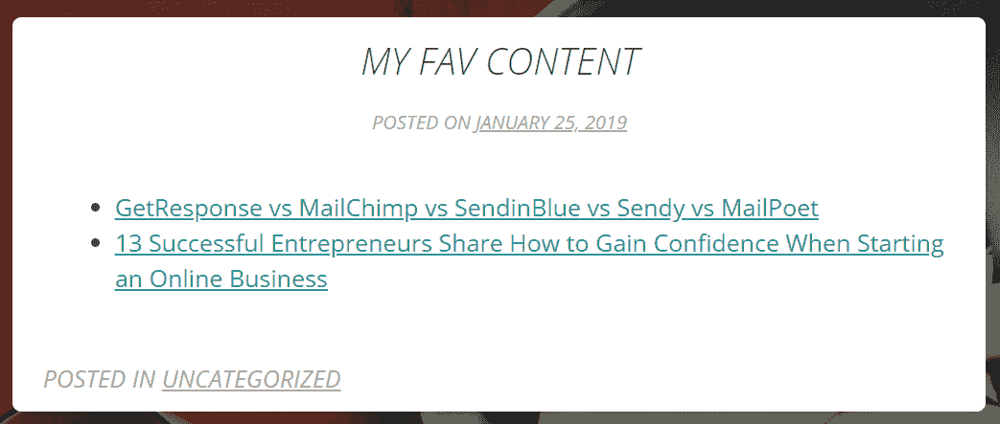

当然，我们在这里构建的插件非常简单，它并没有确保提供的域名有效或任何其他安全相关的事情。然而，这个演示的目的只是为了向你展示与 REST API 一起工作的最简单方法，没有其他。再次强烈建议你查看一些官方资源，例如[`developer.wordpress.org/rest-api/`](https://developer.wordpress.org/rest-api/)上的*REST API 手册*。

这个版本的插件包含在本章的代码包中，位于名为`final`的子目录内。

# 摘要

在本章中，你学习了创建基本插件和小部件所需的所有知识。现在你知道了如何构建插件的 PHP 文件结构，在哪里放置你的函数，以及如何使用钩子。你还学习了如何添加管理页面，使插件和小部件能够访问数据库，以及如何创建短代码。

在所有这些之上，你还学习了如何使用 REST API 并与其他 WordPress 网站进行基本通信。凭借你现有的 PHP 和 HTML 知识，你有了开始编写任何你想要的插件和/或小部件的工具。

在下一章中，我们将带你从头开始创建一个完整的非博客网站的过程。
