# 第十三章：创建非博客网站第二部分 - 电子商务网站和自定义内容元素

在上一章中，你看到了不同类型的非博客网站。本章是这一主题的延续，所以让我们做两件事。首先，让我们回顾一些 WordPress 的更时尚用途，并关注达到出色最终结果的逐步过程。然后，让我们讨论一些你可以在 WordPress 中创建的自定义内容元素，例如自定义文章类型、自定义分类和稍微自定义管理显示的过程。在本章中，我们将研究以下主题：

+   电子商务商店

+   视频博客和照片博客

+   社交网络

+   介绍自定义文章类型

# 电子商务商店

通常，电子商务商店是任何人都可以浏览多种产品，然后使用购物车进行购买的网站。此外，大多数电子商务商店提供某种在线支付集成，这使得每个访客都可以快速地进行和完成购买。此外，有时甚至还有一个后端库存管理系统（一种在线仓库），这使得后端业务管理更加容易，并与网站集成。

# WordPress 是否是电子商务商店的好平台？

电子商务的最好之处在于，你实际上可以使用 WordPress 启动一个功能齐全的在线商店。在我看来，这简直令人难以置信！作为一名前网站开发者，我实际上记得从头开始构建这样一个商店是多么昂贵和耗时。而现在，你只需安装 WordPress，获取合适的主题，下载专门的电子商务插件，就可以开始了！这是一个如何利用技术以现代方式经营业务的绝佳例子。

好的，介绍就到这里。让我们专注于构建一个优质电子商务商店的实际过程。首先，WordPress 上的电子商务商店的特点是它们极其依赖于插件，换句话说。我的意思是，如果你想启动这样一个网站，你需要获取一个主要的电子商务插件，这个插件将负责你在商店中可用的所有操作集合。简而言之，这个插件将运行你的商店。因此，选择正确的插件非常重要，我相信你明白这一点。

# 获取一个好的电子商务插件

市面上有大量的付费插件。它们提供了大量的功能，并与几乎任何在线支付处理方法集成。但，实际上相当令人惊讶的是，最受欢迎的插件 100%免费。它被称为**WooCommerce**，并已成为在 WordPress 上运行电子商务商店的*事实上的*标准。

WooCommerce（可在 [`woocommerce.com/`](https://woocommerce.com/) 或 [`wordpress.org/plugins/woocommerce/`](https://wordpress.org/plugins/woocommerce/) 获取）设计精美，并提供真正卓越的功能范围，我将在稍后详细介绍。我喜欢 WooCommerce 插件的主要原因之一是它可以与任何主题集成。我确实是指任何主题。然而，对于现实生活中的商业网站（而不仅仅是即将构建的测试网站），我仍然认为你应该使用一个针对电子商务优化的主题。再次提醒，你可以自由访问流行的主题商店，以获取高质量的产品。我在 第七章，*选择和安装主题*中列出了一些。

简而言之，一个好的电子商务主题应该实现以下目标：

+   设计清晰

+   以引人注目的方式展示中心内容块（这是产品将要展示的地方）

+   允许你调整你想要显示的侧边栏数量

+   响应式设计（即在任何设备上均可查看）

+   拥有一个良好的导航结构，可以容纳数百甚至数千个子页面（通常是产品页面）

+   处理多语言内容

+   提供一定程度的社交媒体集成（允许用户在 Twitter 或 Facebook 上分享产品链接）

简要总结一下这个介绍，为了在 WordPress 上运行电子商务商店，你需要将 WooCommerce 插件与一个外观漂亮的、针对电子商务网站优化的 WordPress 主题搭配使用。

# 插件安装和初始设置

现在我们已经选择了插件，请按照以下步骤进行安装和设置：

1.  要获取 WooCommerce，你可以访问 [`wordpress.org/plugins/woocommerce/`](https://wordpress.org/plugins/woocommerce/)，或者在你访问“插件”|“添加新插件”时直接从 `wp-admin` 面板安装它。

1.  只需在主搜索框中输入 `WooCommerce`。很可能是列表中的第一个插件就是你想要的。

1.  点击“立即安装”，当过程完成后，激活插件。以下截图显示了之后你会看到的内容：

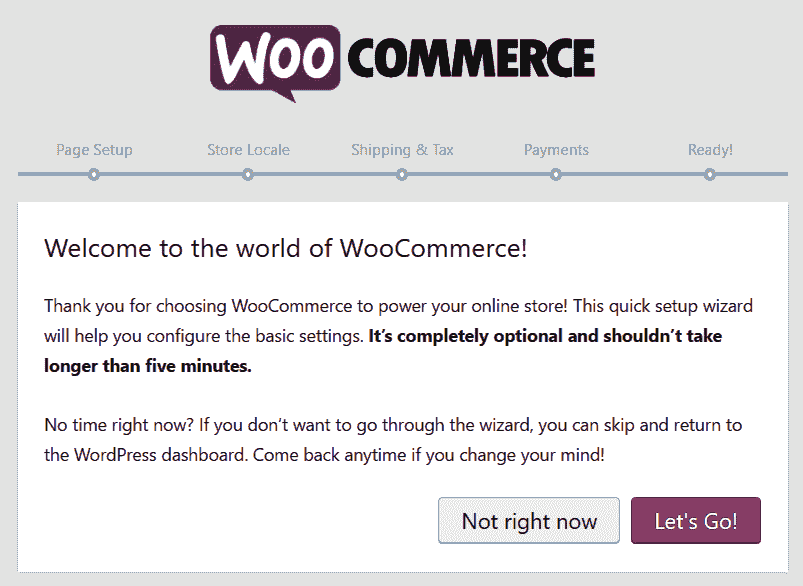

1.  WooCommerce 会展示屏幕设置向导的主页面。它最棒的地方在于，整个过程都是一步一步引导你的。

# 设置主要商店页面

在你需要做的第一件事中，是创建一些必要的页面，使你的网站能够转变为一个完整的电子商务商店。幸运的是，WooCommerce 会为你处理这些——你只需要点击继续按钮。你将获得以下页面：

+   商店：你的主要商店页面——这是你的产品将要出现的地方

+   购物车：商店的购物车区域

+   结账：顾客可以最终确定订单的区域

+   我的账户：注册顾客的资料页面

# 你的商店位置

下一步是设置您的商店位置。这相当简单，因为你只需要选择您的商店所在地以及它将使用的货币。此外，如果您将要收取销售税，您也可以在那里设置，如下面的截图所示：

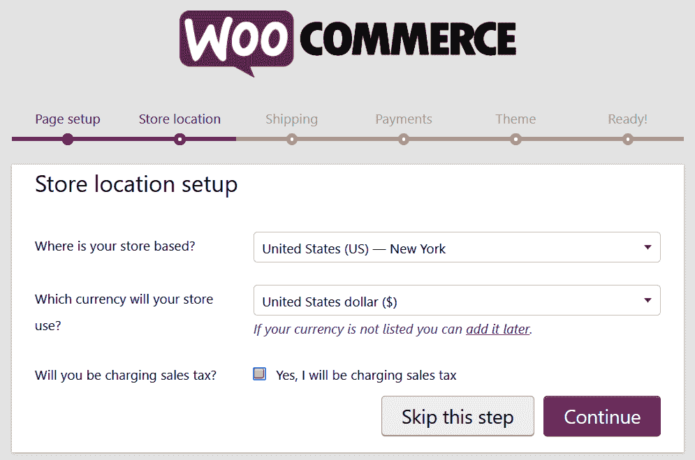

# 运输和支付

WooCommerce 向导中的下一个屏幕是设置您的运输细节，包括重量和尺寸单位。之后，您可以设置商店将使用的支付方式。您在那里选择的内容取决于您的商店类型和您打算销售的商品类型。以下截图显示了可用的选项：

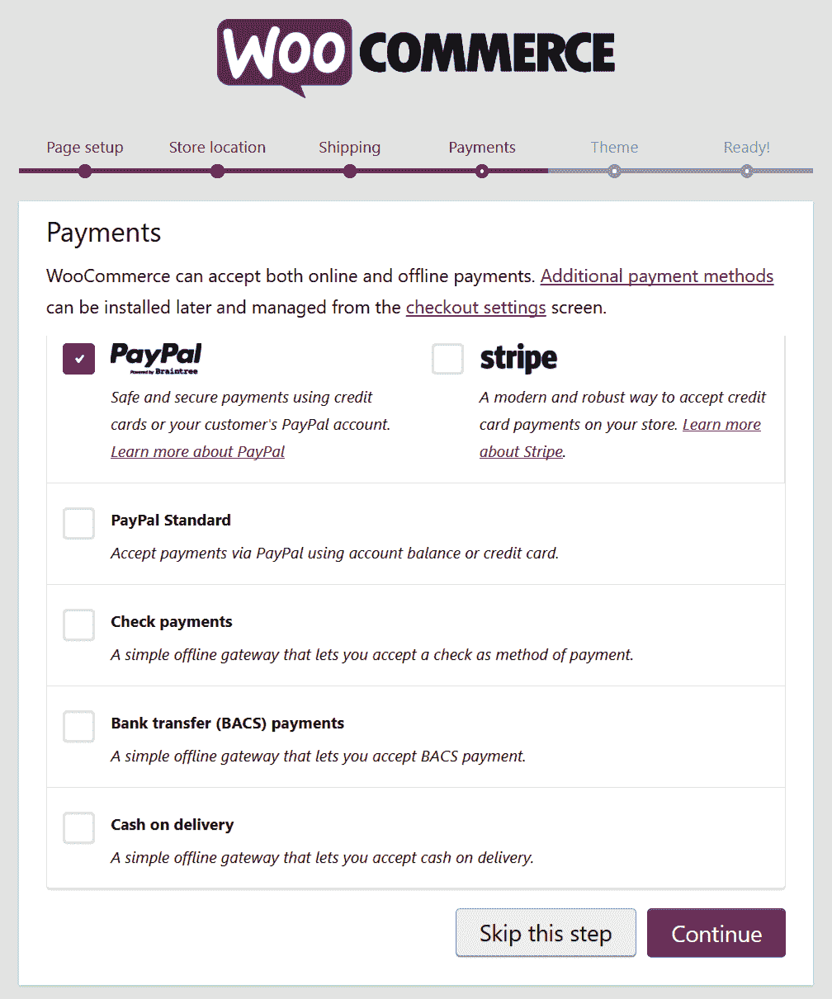

通常，您至少会想启用 PayPal。

# 调整您的商店设计

在此过程中的下一步，一个非常重要的步骤，是选择您商店的设计。在这里开始的最佳方式之一是选择官方的 WooCommerce 主题，称为 Storefront。此主题可以通过在 WooCommerce 向导中点击右侧进行安装，如下面的截图所示：

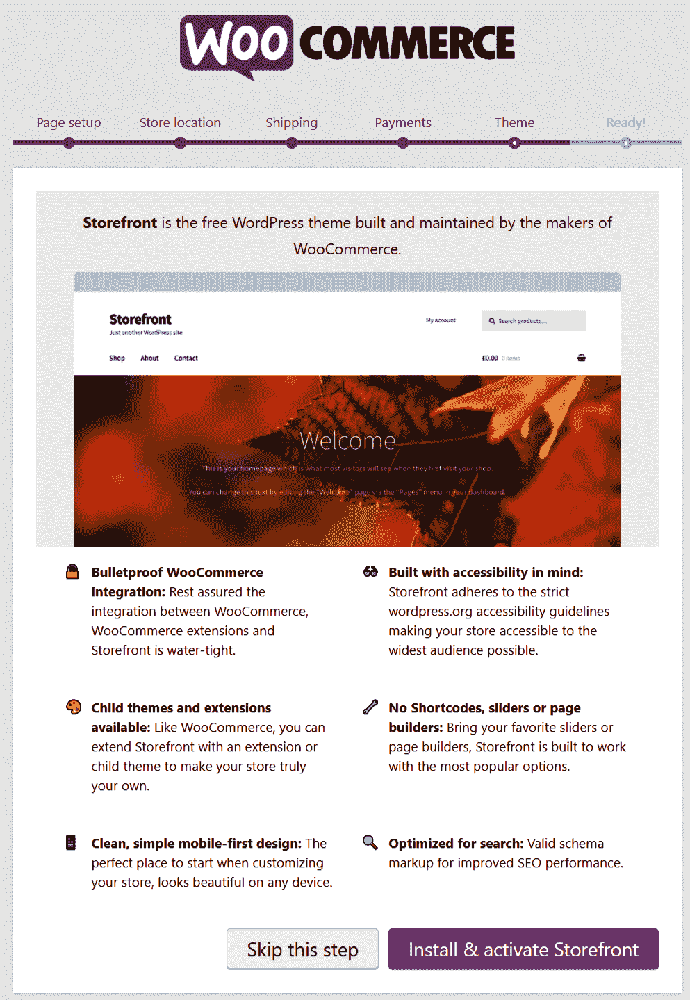

一旦安装了 Storefront，设置过程就完成了，商店完全可用，也就是说，您可以开始添加您的第一个产品。

# 添加产品

当涉及到产品时，WooCommerce 遵循 WordPress 标准的内容组织方法。这意味着您可以像管理任何其他内容（页面或帖子）一样管理产品。您只需执行以下步骤：

1.  前往“产品”|“添加新商品”并填写商品字段。请注意，商品也有它们自己的类别和标签，如下面的截图所示：

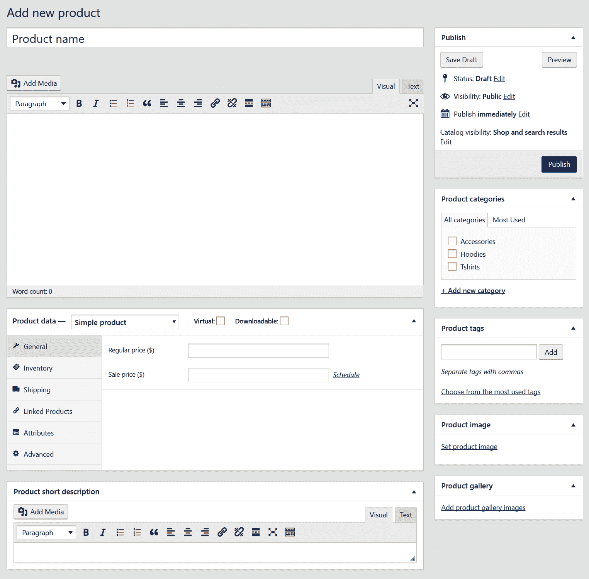

1.  一旦添加了一些产品，下面的截图显示了您的`wp-admin`面板中的“产品”|“所有产品”部分将看起来是什么样子：

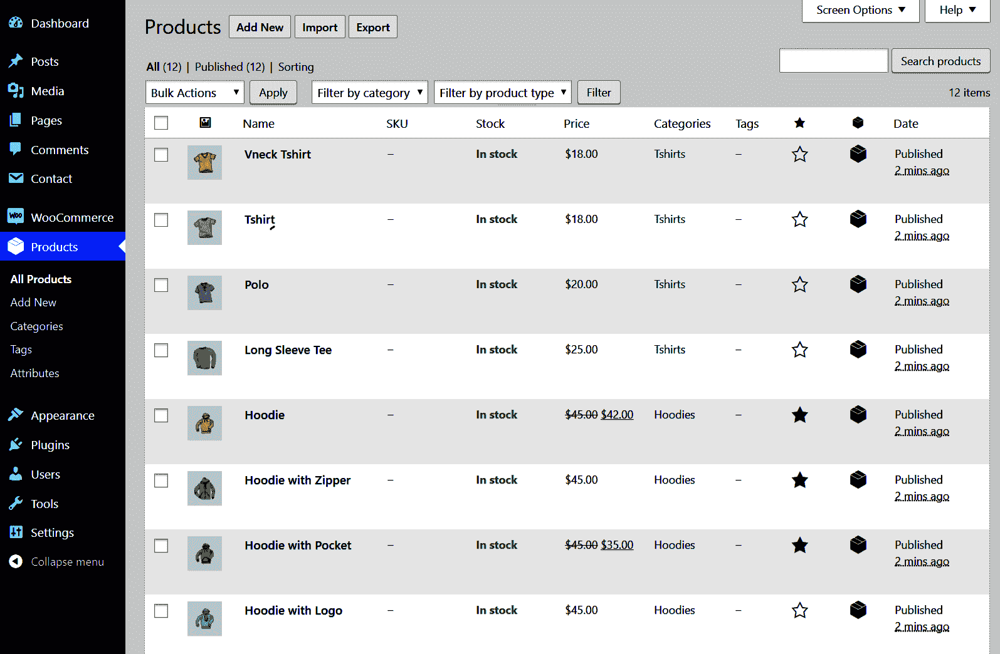

1.  下面的截图显示了商店的主页，展示了所有可供客户购买的产品：

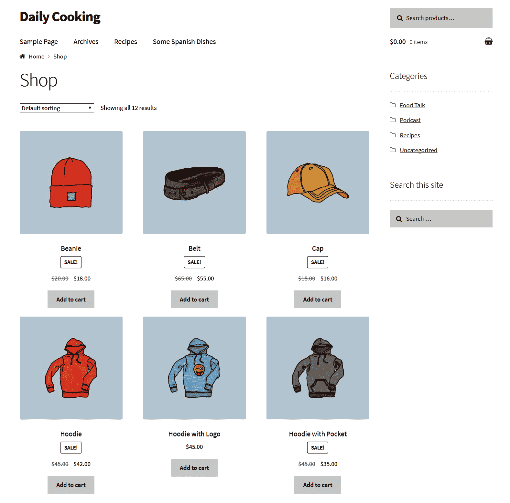

1.  当您查看单个产品时，它们看起来也非常不错。以下截图是一个示例：

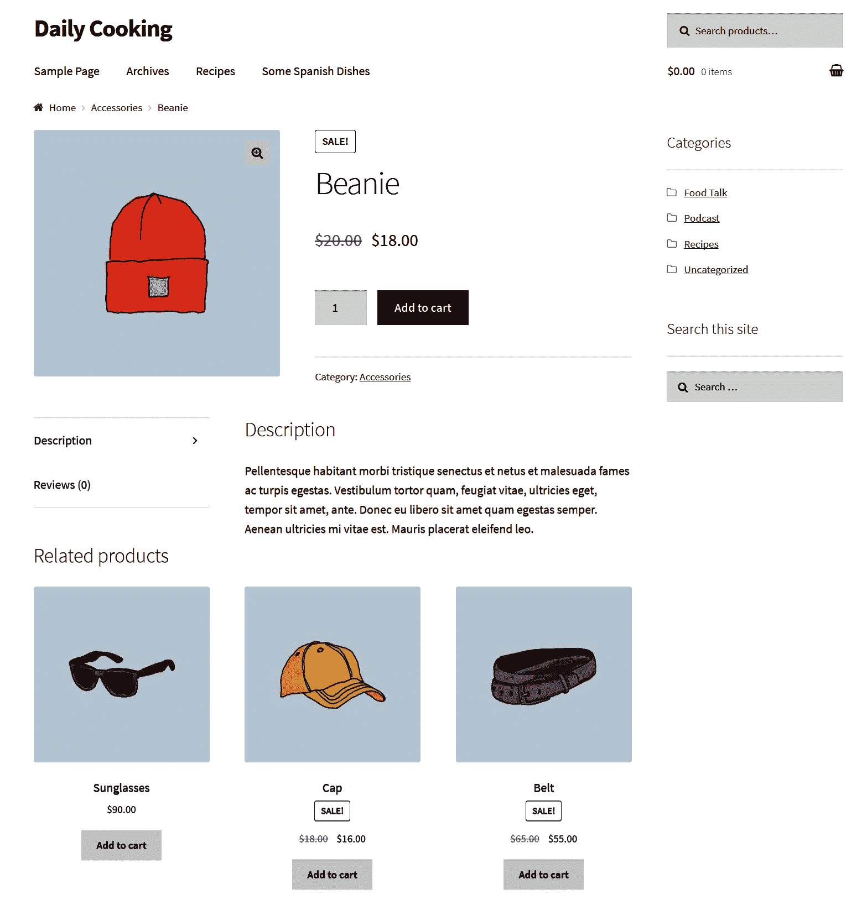

# 统计 – 订单、优惠券和报告

在这里讨论插件最后的一个元素是管理后端 – 订单、优惠券和报告。

订单可以在 WooCommerce | 订单中找到。您可以像管理任何其他 WordPress 内容一样管理它们。不过，有一些额外的字段和参数，所以可能会有一个轻微的学习曲线。但仍然是一个非常友好且易于使用的环境。以下截图显示了订单的示例：

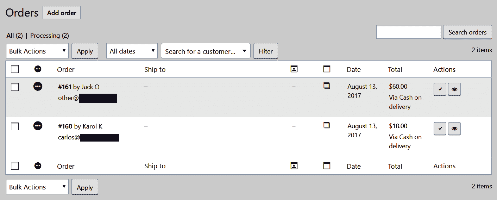

要查看和创建新的优惠券代码，请导航到 WooCommerce | 优惠券。优惠券是吸引新顾客到您商店的好方法。每个人都喜欢便宜货，不是吗？或者，您可以将优惠券代码作为促销手段公开在互联网上。

最后，要查看报告，请导航到 WooCommerce | 报告。这里有一个很好的图形表示您商店发生的情况。您可以查看销售额、使用的优惠券、客户活动和当前库存。目前，我的商店没有太多活动，所以图表看起来如下：

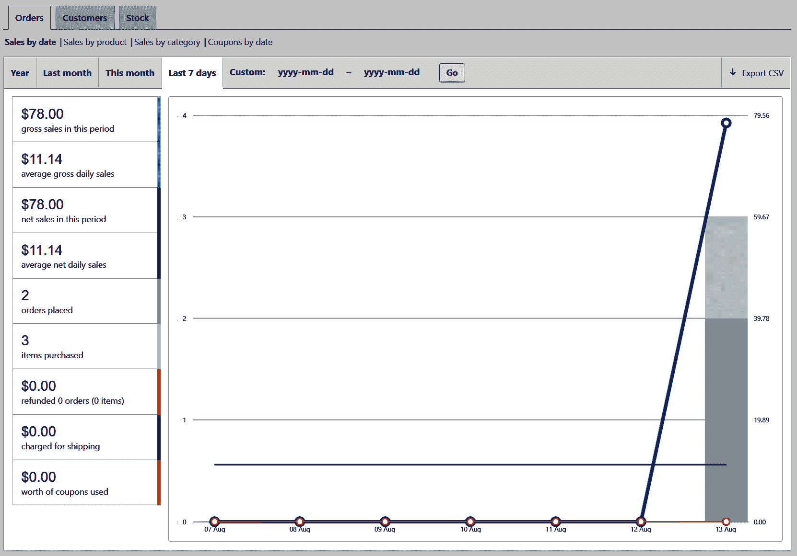

要了解更多关于管理订单和优惠券的信息，请查看 WooCommerce 文档中的这些官方页面：

+   [`docs.woocommerce.com/document/managing-orders/`](https://docs.woocommerce.com/document/managing-orders/)

+   [`docs.woocommerce.com/document/coupon-management/`](https://docs.woocommerce.com/document/coupon-management/)

关于使用 WooCommerce 在 WordPress 上启动一个漂亮的电子商务商店的话题就到这里。最引人注目的是，实际上做起来有多容易。想象一下，从头开始创建具有类似功能的东西需要多少时间。或者，更好的是，设置它所需的成本。如今，WordPress 和各种插件提供的可能性真的是令人难以置信。我相信，在几年前，没有人会相信启动一个高质量的电子商务商店可以这么容易。

最后一点，WooCommerce 并非总是完全免费。如果您想安装附加功能，官方扩展的价格在 29 美元到 99 美元之间。因此，对于一些特定的实际应用，可能需要投资。

我们在这里只是触及了表面，WooCommerce 还有很多功能。这是一款真正令人印象深刻的软件，在提供可靠的电子商务功能方面绝对出色，可以将您原本标准的 WordPress 网站转变为专业的电子商务商店。如果您想了解如何从头开始使用 WooCommerce 建立商店，获取信息的最佳地方可能是[`docs.woocommerce.com/documentation/plugins/woocommerce/getting-started/`](https://docs.woocommerce.com/documentation/plugins/woocommerce/getting-started/)的官方文档部分。

# 视频博客和照片博客

一起探讨这两种 WordPress 网站类型，因为它们各自的目标通常非常相似（尽管它们的设计可能仍然略有不同）。简而言之，视频博客是一种作者主要发布视频，而不是传统基于文本的帖子。另一方面，照片博客基本上是同一件事，唯一的区别在于它围绕照片展开。

现在，当你可以使用标准的 WordPress 安装和传统的博客优化主题时，为什么还要麻烦自己为视频博客或照片博客进行定制设置呢？说实话，你确实可以选择标准设置，你的视频/照片博客将大致上*相当不错*。但是，如果你投入一些额外的工作（不多）来构建专门针对多媒体博客的东西，你的网站可以在可用性和内容展示方面相对于竞争对手获得很大的优势。

例如，让我们关注以下可以添加到视频博客中的有趣功能：

+   建立在网格布局上的博客主页，具有大缩略图，这样每个访客都可以立即看到视频的快照

+   在主列表中以简洁的块形式展示的视频，包含缩略图和少量文本，以说服人们点击视频

+   宽的主博客列表，左侧（或右侧）仅有一个窄侧边栏

+   集成的社交媒体功能（包括 YouTube 订阅按钮）

+   从视频最初托管平台获取的社交媒体评论

+   在博客（或外部服务器）上托管视频的自定义后端

+   可分享的嵌入代码，这样你的访客可以轻松嵌入视频

+   用于替换原生 YouTube 或 Vimeo 播放器的自定义播放器

在照片博客上，您可以拥有以下有趣的功能：

+   特色的主页，展示一张主要照片（*每日一图*）

+   主页上的自动照片滑块

+   用于查看全尺寸照片的灯箱功能

+   宽的主博客列表，集成了社交媒体功能

+   社交媒体评论

+   用于托管照片的自定义后端

+   可分享的嵌入代码

+   自定义照片控制（如*保存*、*查看全尺寸*、*分享*等）

如您所见，这些功能中的大多数都可以在视频博客和照片博客上同样良好地工作。像往常一样，您可以通过获取高质量的主题或使用一些第三方插件来获得其中大部分。让我们来探讨这两种方法。

# 探索视频和照片网站的模板

作为非常受欢迎的博客类型，视频博客和照片博客在互联网上都有非常广泛的主题可供选择。但是，要小心！在 Google 上搜索主题可能会让你陷入麻烦。好吧，也许不是真正的*麻烦*，但如果最终从某个随机网站下载了一个主题，你无法保证它是一个安全的解决方案，也没有恶意或加密代码。一个更好的方法要么是访问官方目录，要么是访问一些认可的主题商店。

首先，以下主题可供选择：

+   **Shapely**，可在[`wordpress.org/themes/shapely/`](https://wordpress.org/themes/shapely/)找到

+   **TheMotion Lite**，可在[`wordpress.org/themes/themotion-lite/`](https://wordpress.org/themes/themotion-lite/)找到

+   **RokoPhoto Lite**，可在[`wordpress.org/themes/rokophoto-lite/`](https://wordpress.org/themes/rokophoto-lite/)找到

+   **Activello**，可在[`wordpress.org/themes/activello/`](https://wordpress.org/themes/activello/)找到

这些都是免费的，但你也可以获得一个高级主题。然而，这需要投资，所以只有在你致力于创建一个真正高质量的多媒体博客时才这样做。

# 获取视频和照片博客插件

正如我所说，除了视频和照片优化的主题外，你还可以获得许多使你的网站更具功能的插件。好消息是我们将只关注免费插件：

+   **Optimole** ([`wordpress.org/plugins/optimole-wp/`](https://wordpress.org/plugins/optimole-wp/))：这个插件在网站的前端不显示任何特定的输出，因为它实际上在后台自动优化你的图片。这是一个节省带宽的好插件，尤其是如果你发布了很多图片。安装过程相当标准。一旦插件被激活，并且你提供了免费的 API 密钥，它就会在后台自动工作，无需监督。

+   **Simple Lightbox** ([`wordpress.org/plugins/simple-lightbox/`](https://wordpress.org/plugins/simple-lightbox/))：这个插件提供了非常漂亮的灯箱功能。这个插件最好的地方是它极其容易使用。你只需要激活它，它就会立即开始处理你在博客上显示的图片。插件会拦截图片点击，并在一个漂亮的灯箱中显示图片文件，而不是单独加载它们（在空白页上）。

+   **Envira Gallery** ([`wordpress.org/plugins/envira-gallery-lite/`](https://wordpress.org/plugins/envira-gallery-lite/))：这是 WordPress 最受欢迎的画廊插件之一。它允许你创建响应式（针对桌面和移动设备优化）的图片和视频画廊。它的好处是你可以通过拖放来构建你的画廊。

+   **10Web Instagram Feed** ([`wordpress.org/plugins/wd-instagram-feed/`](https://wordpress.org/plugins/wd-instagram-feed/))：Instagram 现在是任何摄影师或视频制作者在网上的重要组成部分。这个插件为你提供了快速集成到大家最喜欢的照片平台。使用它来展示你的 Instagram 动态作为小工具。

总结一下多媒体博客的主题，我必须指出，在主题和插件开发者中，这是一个非常拥挤的领域。这里提到的插件将为您提供一个良好的起点，但保持对市场新动态的关注（即，酷炫的新插件和主题），实际上是将您的照片或视频博客保持在竞争前沿的最佳方式。话虽如此，测试每一个新插件并不是推荐的方法。然而，时不时地，您可能会发现一个真正的宝藏，这将帮助您将博客提升到新的水平。

# 社交网络

最后，是时候讨论与使用 WordPress 构建各种类型网站相关的一个最令人惊讶的话题了。事实证明，该平台非常适合运行一个功能齐全的社交网络。换句话说，如果您想拥有自己的 Facebook，至少在功能上是可以的。

说到功能，简而言之，使用 WordPress 构建的社交网络可以提供以下功能：

+   支持任意数量的用户账户

+   为用户提供类似 Facebook 的发布方法（一个*墙*或活动流）

+   论坛

+   博客和微型博客

+   朋友

+   群组

+   私信

+   评论

+   照片和视频内容

话虽如此，构建并运行一个结构良好的社交网络，利用所有可用功能，将需要一些严肃的工作。这超出了本书的范围。因此，在这里，我们只关注基本设置过程和入门。如果您计划推出一个真正的社交网络并将其推向世界，您可能需要获取更多信息，无论是通过访问官方在线文档，还是获取更多关于该主题的出版物。

实际上，在 WordPress 上进行的社交网络是通过一个特定的插件——**BuddyPress**来实现的，尽管仅仅称它为一个插件是极大的低估。BuddyPress 是一个独立的在线发布环境，它与 WordPress 集成。与其他插件不同，它不仅仅在这里和那里显示一些自定义内容。它实际上改变了您 WordPress 站点的整体外观（结构），使其看起来和运行起来就像一个社交网络。

让我们一步一步来，从安装开始。

# 安装社交网络

这里没有太多花哨的东西，要安装一个社交网络，您只需执行以下步骤：

1.  前往[`buddypress.org/`](https://buddypress.org/)，下载主插件并将其上传到您的 WordPress 站点，或者从`wp-admin`面板（插件 | 添加新插件）中搜索名为`BuddyPress`的插件。

1.  插件的安装过程本身相当标准，这意味着在您的服务器上安装后，您只需点击激活按钮。

1.  当过程完成后，访问设置部分下的“设置 | BuddyPress”。首先，选择您想在新的社交网络中使用的组件。出于测试目的，我只启用了所有组件，如下面的截图所示：

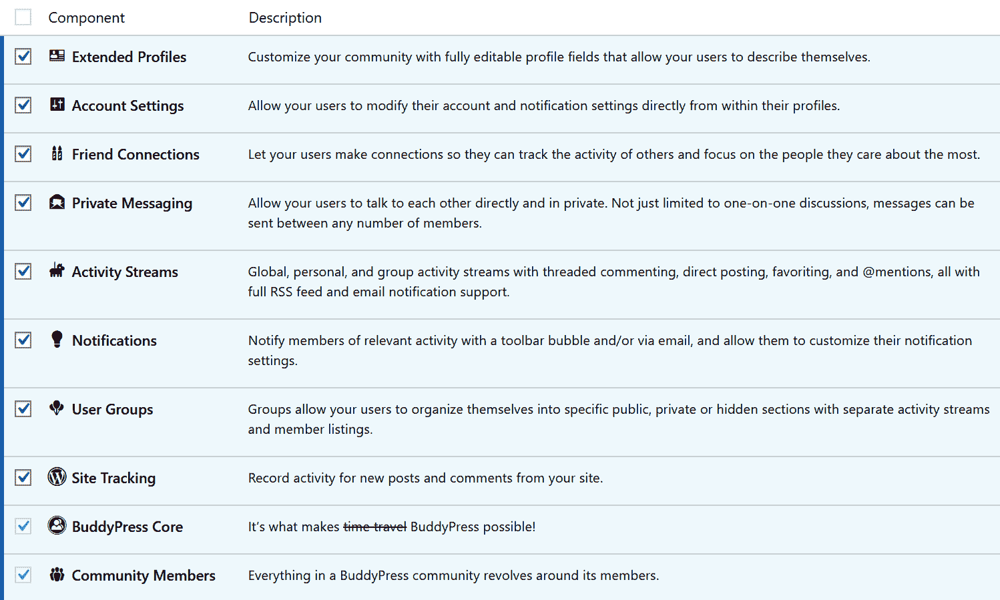

1.  在此设置页面的第二个标签页，标题为“选项”，您可以在其中调整一些其他标准设置，例如顶部工具栏的存在、各种配置文件设置和分组设置。

1.  最后，第三个标签页“页面”，让您可以分配将容纳您社交网络一些标准区域的页面，例如活动流、用户组和成员资料。

您可以在此处创建新页面或使用 BuddyPress 在安装期间已创建的页面。

# 设计您的社交网络

在当前形式下，BuddyPress 可以与任何 WordPress 主题一起使用。没错，如果您不想有优化的社交网络设计，您不必这么做。BuddyPress 将设法在其当前主题的主要内容块或您可用的小工具区域中显示其内容。

然而，像往常一样，如果您想使您的社交网络看起来更专业，那么您可能需要四处寻找专门针对社交网络优化的东西。在我看来，当您在寻找这样的主题时，最好的经验法则是将它们与最大的社交网络——Facebook 进行比较。尽管有些人不喜欢 Facebook 提供的设计，但它仍然是周围最成功的社交网络，所以他们显然做对了某件事。因此，将其作为某种基准是非常好的主意。

如果您想找到一个不错的 BuddyPress 兼容主题列表，WordPress 目录再次伸出援手。当您访问[`wordpress.org/themes/search/buddypress/`](https://wordpress.org/themes/search/buddypress/)时，您将找到一个经过 BuddyPress 测试并优化为社交网络的主题过滤列表。

一旦您找到了一个看起来不错的主题，您可以直接开始使用您的新社交网络，而无需再关注设置。然而，如果您真的想了解这个平台及其构建方式，我建议您查看官方文档，这是最好的 BuddyPress 资源之一（[`codex.buddypress.org/`](https://codex.buddypress.org/)）。这也是您可以学习所有关于 BuddyPress 开发、创建自己的主题或甚至 BuddyPress 扩展插件的所有细节的地方。

# 扩展功能

BuddyPress 是以一种提供基本社交网络功能和网站组织方式的方式构建的。如果你想扩展你的社交媒体网站并添加一些新功能，你可以安装多个 BuddyPress 插件。你可以在[`wordpress.org/plugins/search/buddypress/`](https://wordpress.org/plugins/search/buddypress/)找到它们。基本上，它们就像其他 WordPress 插件一样（安装过程相同），但它们不像其他 WordPress 插件那样向 WordPress 本身提供新功能，而是更多地关注 BuddyPress。

BuddyPress 中还有更多等待你去探索，我实际上鼓励你自己进行一些研究和学习，尤其是如果你计划在某个时候推出一个社交网络的话。但就目前而言，我认为我们已经涵盖了这个话题，至少当我们谈到用 WordPress 介绍社交网络并开始使用最好的社交网络插件时。

# 介绍自定义文章类型

在构建当前章节和上一章节中描述的一些网站时，你可能会遇到所谓的自定义文章类型。或者，你甚至可能决定为了你个人的项目而自己创建它们。但让我们从头开始。在 WordPress 中最常见的两种内容类型是 *文章* 和 *页面*。然而，如果我们觉得情况/项目需要的话，我们可以利用自定义文章类型的功能和其广泛的通用性来创建任意数量的新文章类型。

自定义文章类型的需求可能出现在许多场景中。例如，当一位作家正在构建个人作品集网站时，他们可能需要一个名为 `book` 的自定义文章类型来以吸引人的方式展示他们的出版物，而不是仅仅使用标准文章。这正是我们将在本章的这一部分所做的事情。所以，准备好学习如何通过构建一个新的自定义文章类型来了解自定义文章类型的工作原理。

为了这个目的，我们将回到我们的主要烹饪博客主题——*Daily Cooking Custom*。在其默认形式中，它没有特色任何自定义文章类型，这是一个好事，因为我们有一个空白画布可以工作。要指定你希望在主题中有一个自定义文章类型，你可以在主题的 `functions.php` 文件中添加一些代码。这就是我们将要做的。然而，请记住，如果你不想将自定义文章类型与特定主题绑定，你也可以将其附加到插件或小工具上。

# 注册一个新的文章类型

要注册一个新的文章类型，你只需要在你的主题的 `functions.php` 文件中添加一些简单的代码。将新类型的创建与主题的 `init` 函数关联起来是一个好的实践，这样它就会在启动过程中在正确的时刻被调用。以下是一个初始的、空的、自定义文章类型的代码：

```php
function book_init() { 
  register_post_type('book'); 
} 
add_action('init', 'book_init');
```

`register_post_type()`函数将其第二个参数接受为一个数组，在该数组中，您可以指定对象是否公开或应该参与 URL 重写，它在其编辑页面上支持哪些元素，等等。让我们设置一个包含所有参数的数组，然后将它传递给函数，如下面的代码所示：

```php
function book_init() { 
  $args = array( 
    'description' => 'A custom post type that holds my books', 
    'public' => true, 
    'rewrite' => array('slug' => 'books'), 
    'has_archive' => true, 
    'supports' => array('title', 'editor', 'author', 'excerpt', 
    'custom-fields', 'thumbnail'),
    'show_in_rest' => true  
  );
  register_post_type('book', $args);  
  flush_rewrite_rules(); 
} 
add_action('init', 'book_init');
```

我选择了以下每个参数，因为它们对于`book`自定义帖子类型是有意义的：

+   `description`：这个参数相当直观。

+   `public`：这意味着帖子类型是公开的，就像帖子页面一样——而不是在幕后隐藏。它将获得用户界面，可以在导航菜单中显示，等等。

+   `rewrite`：这指定了帖子类型可以在漂亮的永久链接的重写规则中使用。

+   `has_archive`：这启用了帖子类型存档（一个经典的索引页面，就像我们为标准帖子所拥有的那样）。

+   `supports`：这是一个数组，当用户创建或编辑项目时，他们会看到这些功能。对于书籍，我们包括六个项目。

+   `show_in_rest`：这使我们的新自定义帖子类型能够与 WordPress 5 中引入的块编辑器一起工作。

最后一个函数调用`flush_rewrite_rules()`将允许我们在稍后显示书籍的标准存档列表（就像标准帖子列表一样，但针对我们的自定义帖子类型）。

这些只是您可以传递的一些参数。关于其他参数的详细信息，请参阅 codex 中的[`codex.wordpress.org/Function_Reference/register_post_type`](https://codex.wordpress.org/Function_Reference/register_post_type)。

现在我们已经设置了基本帖子类型，让我们添加一些标签。

# 添加标签

您可以为您的自定义帖子类型添加标签，这样 WordPress 在谈论它时就会知道说什么。首先，让我们简单地创建一个包含所有标签的数组。将此作为`book_init()`函数中的第一件事，如下面的代码所示：

```php
$labels = array( 
  'name' => 'Books', 
  'singular_name' => 'Book', 
  'add_new' => 'Add New', 
  'add_new_item' => 'Add New Book', 
  'edit_item' => 'Edit Book', 
  'new_item' => 'New Book', 
  'view_item' => 'View Book', 
  'search_items' => 'Search Books', 
  'not_found' =>  'No books found', 
  'not_found_in_trash' => 'No books found in Trash' 
);
```

然后，在`$args`数组中添加一行代码，告诉它使用标签，如下面的代码片段所示：

```php
$args = array( 
  'labels' => $labels, 
  'description' => 'A custom post type that holds my books', 
/* the rest of the function remains the same */
```

下一步是添加消息，这是 WordPress 在用户使用书籍功能时告诉用户的内容。

# 添加消息

当用户更新、预览或对书籍进行任何操作时，您希望他们看到准确的消息。我们只需要创建一个消息数组并将它们钩接到 WordPress 上，如下面的代码所示：

```php
function book_updated_messages( $messages ) { 
  $messages['book'] = array( 
    '', /* Unused. Messages start at index 1\. */  
    sprintf('Book updated. <a href="%s">View book</a>', 
    esc_url(get_permalink($post_ID))),  
    'Custom field updated.',  
    'Custom field deleted.',  
    'Book updated.',  
    (isset($_GET['revision']) ? 
    sprintf('Book restored to revision from %s', 
    wp_post_revision_title((int)$_GET['revision'], false)) : false), 
    print('Book published. <a href="%s">View book</a>', 
    esc_url(get_permalink($post_ID))),  
    'Book saved.',  
    sprintf('Book submitted. <a target="_blank" href="%s">
    Preview book</a>', 
    esc_url(add_query_arg('preview', 'true', 
    get_permalink($post_ID)))), 
    sprintf('Book scheduled for: <strong>%1$s</strong>. 
    <a target="_blank" 
    href="%2$s">Preview book</a>', 
    date_i18n('M j, Y @ G:i', strtotime($post-
    >post_date)), esc_url(get_permalink($post_ID))), 
    sprintf('Book draft updated. <a target="_blank" href="%s">
    Preview book</a>', 
    esc_url(add_query_arg('preview', 'true', get_permalink($post_ID))))
  ); 
  return $messages; 
} 
add_filter('post_updated_messages', 'book_updated_messages');
```

此代码创建了一个名为`book_updated_messages()`的函数，它设置了一个消息数组并返回它。我们通过`post_updated_messages`过滤器调用它。

现在，我们的自定义帖子类型已经准备好使用了！前往你的`wp-admin`面板并重新加载它。你会看到在评论下出现了一个新的菜单。它被称为书籍。让我们添加一本书，如下面的截图所示：

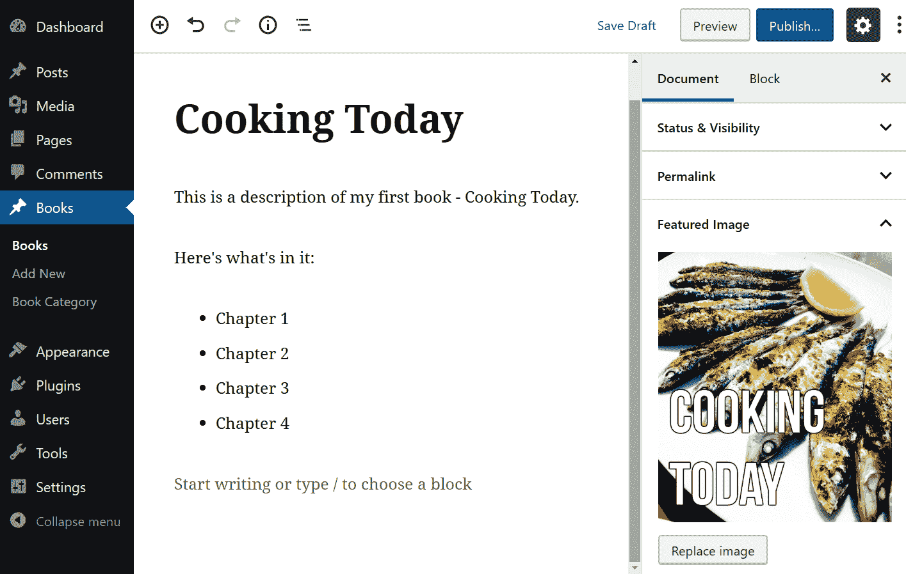

注意，我给它添加了一个名为`book_author`的自定义字段，我还上传了书籍封面作为特色图片。现在，当你访问主书籍页面时，你会看到书籍被列出。如果你点击书籍标题下的“查看”链接，你会看到书籍使用`single.php`主题模板显示，这不会是最适合读者的体验。因此，让我们创建一些新的模板文件来展示我们的书籍。

# 创建书籍模板文件

WordPress 需要知道如何显示你的新帖子类型。你必须为单个书籍创建一个模板，并为书籍列表创建一个模板。执行以下步骤来完成此操作：

1.  首先，我们将创建一个`single.php`的书籍版本。它必须命名为`single-POST_TYPE_NAME.php`，在我们的例子中是`single-book.php`。

1.  以`page.php`作为起点（因为它已经是最接近我们想要的书籍页面外观的），我们将添加自定义字段`book_author`和特色图片的显示。

1.  因此，让我们首先复制我们的`page.php`文件，将其重命名为`single-book.php`。同时，让我们复制`content-page.php`并将其命名为`content-book.php`。

1.  接下来，是包含所有元素的时候了。以下是这两个文件的外观。首先，`single-book.php`看起来如下：

```php
<?php 
/** 
 * The template for displaying a single book. 
 * 
 * @package Daily Cooking Custom 
 */ 
?><?php get_header(); ?> 

<div id="primary" class="content-area"> 
  <main id="main" class="site-main" role="main"> 
    <?php while (have_posts()) : the_post(); ?> 

      <?php get_template_part('content', 'book'); ?> 

    <?php endwhile; // end of the loop. ?> 

  </main><!-- #main --> 
</div><!-- #primary --> 

<?php get_sidebar(); ?> 
<?php get_footer(); ?>
```

对此文件所做的唯一更改是`get_template_part()`函数调用。

1.  接下来，`content-book.php`文件看起来如下：

```php
<?php 
/** 
 * The template used for displaying book content 
 * 
 * @package Daily Cooking Custom 
 */ 
?> 

<article id="post-<?php the_ID(); ?>" <?php post_class(); ?>> 
  <header class="entry-header"> 
    <?php the_title('<h1 class="entry-title">', '</h1>'); ?> 
  </header> 

  <div class="entry-content"> 
    <?php if(has_post_thumbnail()) : ?> 
      <div class="post-image alignleft">
      <?php echo get_the_post_thumbnail($post->ID, 'medium', 
      array('style' => 'border: 1px solid black;')); ?></div> 
    <?php endif; ?> 
    <?php the_content(); ?> 
  </div> 

  <footer class="entry-footer"> 
  </footer> 
</article><!-- #post-## -->
```

1.  现在，让我们将我们的自定义字段`book_author`显示在特色图片下方。我们可以通过在特色图片代码和主要内容代码之间添加一行新代码来实现，如下面的代码片段所示：

```php
<?php if(has_post_thumbnail()) : ?> 
  <div class="post-image alignleft">
  <?php echo get_the_post_thumbnail($post->ID, 'medium', 
  array('style' => 'border: 1px solid black;')); ?></div> 
<?php endif; ?> 
<?php echo '<p><em>by '.get_post_meta($post->ID, 'book_author', true).
'</em></p>'; ?> 
<?php the_content(); ?>
```

1.  在这一点上，当你访问单个书籍页面时，会显示作者的名字，并且书籍封面会自动显示，如下面的截图所示：

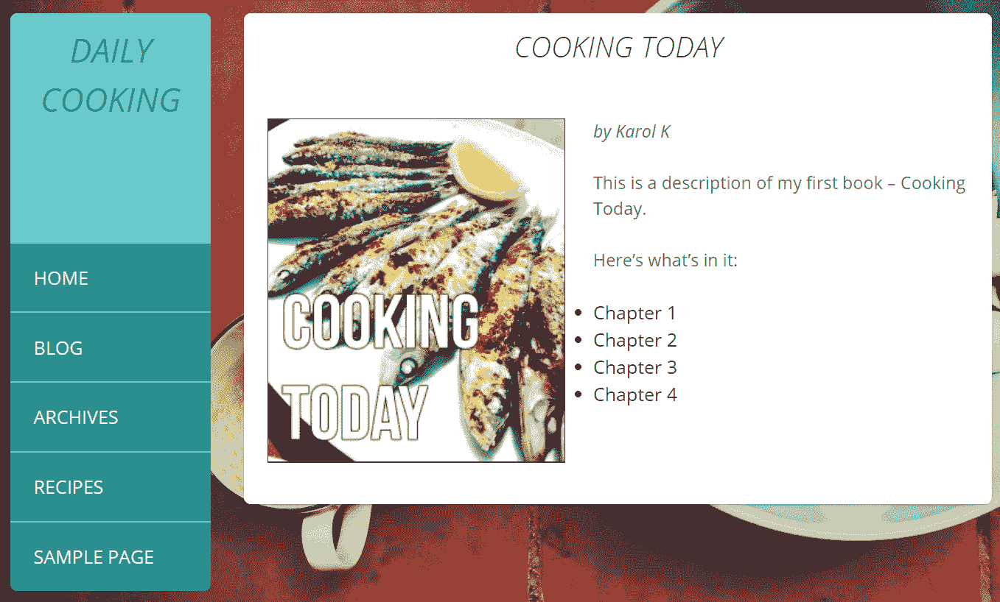

1.  我们接下来的任务是创建一个页面，用于展示书籍列表，就像`index.php`对帖子所做的处理一样。默认情况下，WordPress 使用`archive.php`文件来展示每个新自定义帖子类型的列表。

我们可以通过创建一个新的模板文件并将其命名为`archive-book.php`来自定义它。更准确地说，每个控制任何新自定义帖子类型存档的模板文件都必须命名为`archive-POST_TYPE.php`。创建此类文件的最简单方法是将标准的`archive.php`文件或`index.php`文件复制一份，并将其重命名为`archive-book.php`。然后，我们可以从那里开始修改文件以符合我们的要求。所以，我打算在这里使用我的`index.php`作为模板，并对其进行一些调整。

1.  目前，我的新`archive-book.php`文件没有提供任何自定义显示书籍的方式。它的样子如下所示：

```php
<?php 
/** 
 * The listing of books. 
 * 
 * @package Daily Cooking Custom 
 */ 
?><?php get_header(); ?> 

  <div id="primary" class="content-area"> 
    <main id="main" class="site-main" role="main"> 

    <?php if (have_posts()) : ?> 

      <?php /* Start the Loop */ ?> 
      <?php while (have_posts()) : the_post(); ?> 
      <?php get_template_part('listing', 'book'); ?> 
      <?php endwhile; ?> 

      <?php daily_cooking_custom_paging_nav(); ?> 

    <?php else : ?> 

      <?php get_template_part('content', 'none'); ?> 

    <?php endif; ?> 

    </main><!-- #main --> 
  </div><!-- #primary --> 

<?php get_sidebar(); ?> 
<?php get_footer(); ?>
```

1.  如您所见，实际的显示是通过`get_template_part('listing', 'book')`函数调用完成的。为了使这一行工作，我们必须创建实际的列表文件。最简单的方法是复制`content.php`并稍作修改。首先，将其重命名为`listing-book.php`。

1.  立即删除不必要的部分，只留下那些可以使我们的书籍列表看起来很棒的部分。

1.  接下来，我还会包括缩略图显示。坦白说，我并不需要这样做，但我相信带有较小缩略图的书籍列表会看起来更好。

1.  最后，我还会显示每本书的作者。以下代码显示了完成后的文件将如何显示：

```php
<?php 
/** 
 * @package Daily Cooking Custom 
 */ 
?> 
<article id="post-<?php the_ID(); ?>" <?php post_class(); ?>> 
  <header class="entry-header"> 
    <?php the_title(sprintf('<h1 class="entry-title">"<a href="%s"  
    rel="bookmark">', esc_url(get_permalink())), '</a>"</h1>'); ?> 
  </header> 

  <div class="entry-content"> 
    <?php if(has_post_thumbnail()) : ?> 
      <div class="post-image alignleft"> 
        <?php echo '<a href="'.esc_url(get_permalink()).'" 
        >'.get_the_post_thumbnail($post->ID, 'thumbnail').'</a>'; ?> 
      </div> 
    <?php endif; ?> 

    <div class="entry clearfix"> 
      <p><em>by <?php echo get_post_meta($post->ID,
      'book_author', true); ?>
      </em></p> 
      <?php the_content(sprintf(__('Continue reading %s 
      <span class="meta-nav">&rarr;</span>', 'daily-cooking-custom'), 
      the_title('<span class="screen-reader-text">"', 
      '"</span>', false))); 
      ?> 
    </div> 
  </div> 

  <footer class="entry-footer"> 
  </footer> 
</article><!-- #post-## -->
```

1.  以下截图显示了最终效果（我添加了一本书只是为了演示目的）：

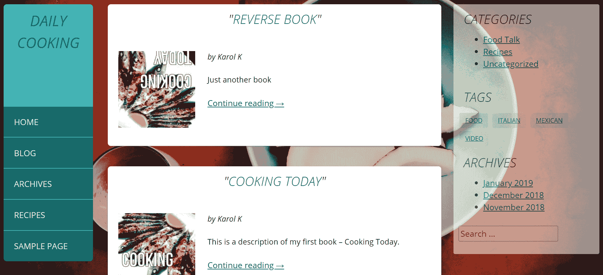

# 注册和使用自定义分类法

只是为了跟随之前给出的关于我们书籍自定义帖子类型的示例，现在让我们创建一个自定义分类法。为什么？您可能只是不想混合书籍类别和帖子类别，因此我们将创建一个名为“书籍类别”的自定义分类法。将以下代码添加到您的`functions.php`文件中：

```php
function build_taxonomies() { 
  register_taxonomy( 
    'book_category', 
    'book', 
    array( 
      'hierarchical' => true, 
      'public' => true, 
      'show_in_rest' => true, 
      'label' => 'Book Category', 
      'query_var' => true, 
      'rewrite' => array('slug' => 'available-books') 
    ) 
  ); 
} 
add_action('init', 'build_taxonomies', 0);
```

与`register_post_type()`函数类似，`register_taxonomy()`函数允许您在 WordPress 中注册一个新的分类法。您可以在 codex 中查看您可以添加的所有参数的详细信息（[`codex.wordpress.org/Function_Reference/register_taxonomy`](https://codex.wordpress.org/Function_Reference/register_taxonomy)）。现在，您可以看到我们将其称为`book_category`；它属于`book`对象类型，是分层的，您也可以查询它。它需要在带有自定义短语的 URL 重写中包含，即`available-books`。

接下来，我们需要使这个分类法对书籍可用。只需找到我们在注册书籍帖子类型时使用的`$args`数组（`book_init()`函数），并将`taxonomies`项添加到数组中，如下面的代码所示：

```php
$args = array( 
  'labels' => $labels, 
  'description' => 'A custom post type that holds my books', 
  'public' => true, 
  'rewrite' => array('slug' => 'books'), 
  'has_archive' => true, 
  'taxonomies' => array('book_category'), 
  'supports' => array('title', 'editor', 'author', 'excerpt', 
  'custom-fields', 'thumbnail') 
);
```

当您返回到`wp-admin`面板并编辑一本书时，您会看到书籍类别已出现在右侧，如下面的截图所示：

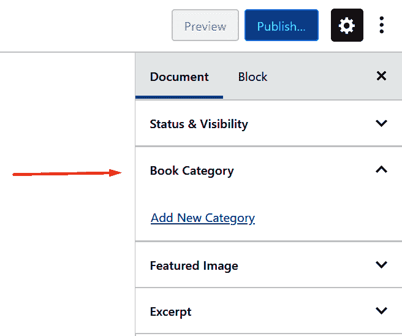

在您添加了一些类别并将它们分配给书籍之后，让我们来看看如何在网站首页显示这些类别。首先，我们将它们添加到单本书籍的显示中。打开`content-book.php`文件，在循环中的适当位置添加以下代码（例如，您可以在`the_content()`函数调用之后添加）：

```php
<div class="entry-content"> 
  <?php if(has_post_thumbnail()) : ?> 
    <div class="post-image alignleft">
    <?php echo get_the_post_thumbnail($post->ID, 'medium', 
    array('style' => 'border: 1px solid black;')); ?></div> 
  <?php endif; ?> 
  <?php echo '<p><em>by '.get_post_meta($post->ID, 
  'book_author', true).
  '</em></p>'; ?> 
  <?php the_content(); ?> 
  <?php echo get_the_term_list($post->ID, 'book_category', 
  '<em>Categories: ', ', ', '</em>'); ?> 
</div>
```

您正在使用`get_the_term_list()`函数，它接受以下参数：

+   帖子的 ID（`$post->ID`）

+   分类法的名称（`book_category`）

+   在列表之前打印（`<em>类别：`）

+   在列表中使用（`,`）分隔项目

+   在列表之后打印（`</em>`）

此外，现在您有了分类，您可以去“外观”|“菜单”，将那些分类链接添加到您的页眉菜单中，您还可以创建一个包含所有分类的自定义菜单并将其添加到侧边栏之一。

如果在创建自定义文章类型和自定义分类法的过程中，您认为不应该出现 404 错误，那么请转到“设置”|“永久链接”，只需保存更改而不实际更改任何内容。有时，WordPress 需要刷新永久链接才能使新链接正确工作。

# 自定义管理显示

要完全实现您的新书自定义文章类型，您可以在`wp-admin`面板中更改其显示方式。您不需要知道创建特定书籍的 WordPress 用户，但您希望看到书籍分类和缩略图。让我们回到`functions.php`。首先，我们将更改显示的列，如下面的代码所示：

```php
function ahskk_custom_columns($defaults) { 
  global $wp_query, $pagenow; 
  if ($pagenow == 'edit.php') { 
    unset($defaults['author']); 
    unset($defaults['categories']); 
    unset($defaults['date']); 
    $defaults['book_category'] = 'Categories'; 
    $defaults['thumbnail'] = 'Image'; 
  } 
  return $defaults; 
} 
add_filter('manage_book_posts_columns', 'ahskk_custom_columns'); 
function ahskk_show_columns($name) { 
  global $post; 
  switch ($name) { 
    case 'book_category': 
      echo get_the_term_list($post->ID, 'book_category', '', ', ', ''); 
      break; 
    case 'thumbnail': 
      if (has_post_thumbnail($post->ID)) 
        echo get_the_post_thumbnail($post->ID, array('40', '40')); 
      break; 
  } 
} 
add_action('manage_book_posts_custom_column', 'ahskk_show_columns');
```

第一个函数表示“不显示作者、日期和分类，但显示书籍分类和缩略图”，第二个函数表示“对于书籍分类列，打印分类列表，对于缩略图列，打印`get_post_thumbnail()`函数。”

再次查看`wp-admin`面板中的“书籍”页面，现在看起来如下截图所示：

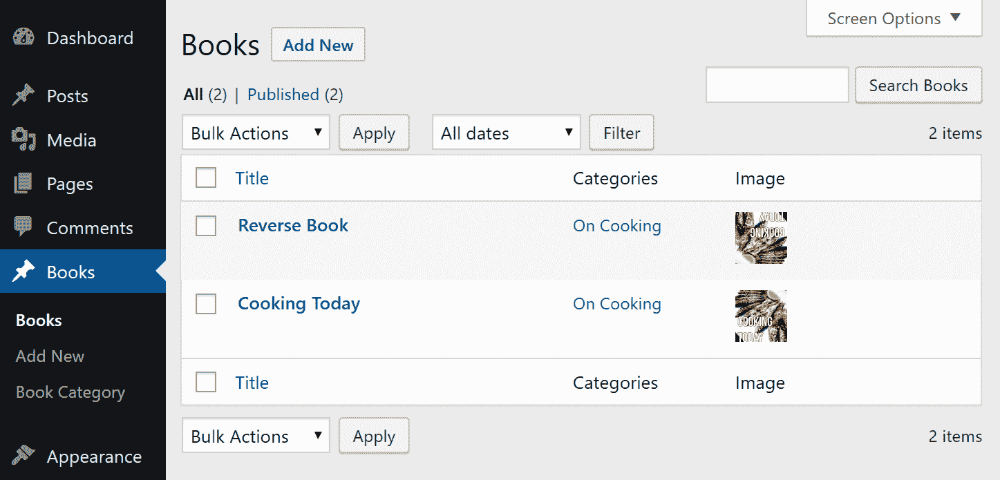

# 摘要

本章是我们使用 WordPress 的非博客网站之旅的第二部分。希望您喜欢这些材料。我们经历了设置电子商务网站、视频博客、照片博客和社交网络的全过程。在这个过程中，我们仔细研究了几个有趣的插件及其功能，以便让 WordPress 开发者们的生活更加轻松。最后，我们创建了一个自定义文章类型及其相应的自定义分类法。

我相信，到这一点，您已经具备了使用 WordPress 并用它来构建您下一个伟大网站的能力！WordPress 是一个顶级的内容管理系统（CMS），在过去的几年里已经得到了极大的成熟。WordPress 的管理面板设计得非常用户友好，并且一直在不断改进。WordPress 背后的代码非常健壮，是由一群热心的开发者共同创作的。此外，WordPress 的功能可以通过插件和主题的扩展来增强。

我希望您喜欢这本书中的信息，并且您已经开始着手构建您下一个（或者可能是第一个）WordPress 网站。请确保与 WordPress 开源社区保持联系！感谢您的阅读；您太棒了！
