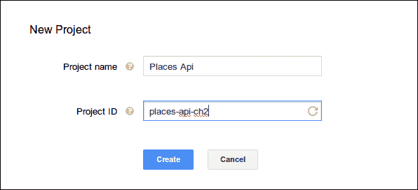
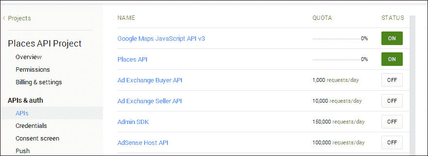
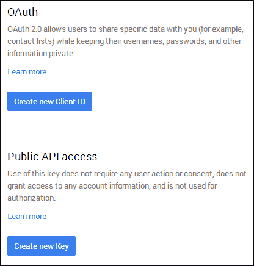
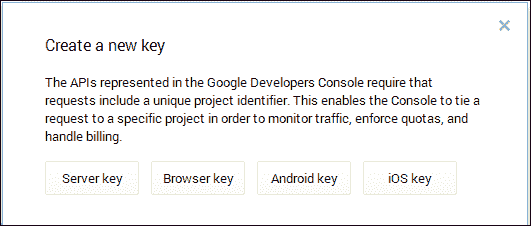
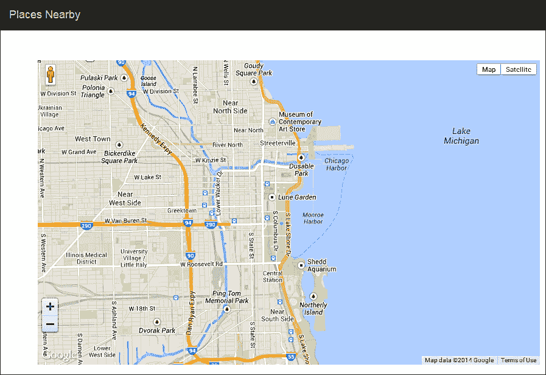
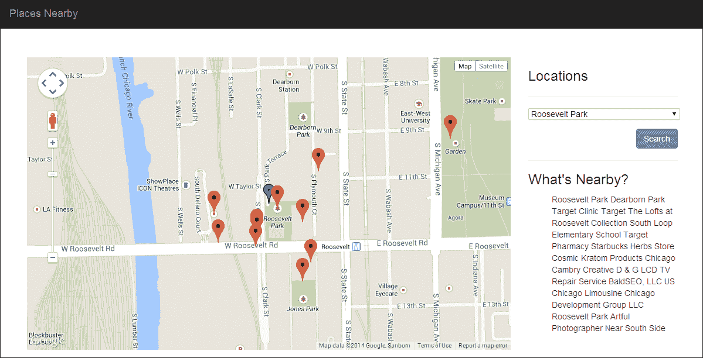

# 第二章。探索附近有什么

在开发应用时，我们经常遇到特定兴趣点的地理位置数据。无论是商业位置还是最终用户申请的工作，了解该特定位置周围的情况可以在用户做出关于该位置的决定时提供即时价值。例如，用户可能想知道特定位置附近的餐馆或公共设施或公共交通选项。借助第三方位置 API，我们可以告知用户给定兴趣点附近的情况。对于我们的第二个应用，我们开发了一个 Web 应用，使用 Google Places API 的信息向用户展示特定兴趣点附近的情况。在本章中，我们还介绍了如何将第三方库集成到我们的应用中以及如何通过缓存来提高我们应用的性能。

# 描述项目

正如我们在第一章中概述的任务应用一样，即*任务管理应用*，我们首先通过获取项目将做什么以及我们的应用将如何表现的高级概述来开始开发。

## 搜索附近位置

该应用的核心组件是其查找现有位置附近其他位置的能力。获取此类信息的最简单方法是利用第三方 API。对于此应用，我们将使用 Google Places API，这是一个可以提供给定纬度和经度坐标附近位置的 Web API。

## 展示位置

而不是仅仅告诉用户给定兴趣点附近的位置，我们可以通过在地图上展示兴趣点和附近位置来增强用户体验。存在许多不同的地图源可以显示地图。对于此应用，我们将利用另一个 Google API，即 Google Maps API。

## 存储位置

为了向用户展示他们可以搜索的可用位置，我们首先需要存储这些位置。为了存储这些位置，我们需要一个可以存储导入位置的数据库。就像我们在第一章中开发的任务应用一样，我们将再次使用 SQLite 作为我们的主要数据库。

## 导入位置

最后，我们需要一个命令行工具从数据源导入位置。为了完成这项任务，我们将创建一个可以从命令行运行的控制台任务。此任务将从提供的 JSON 源获取信息并将其导入我们的数据库。通过将其作为命令行任务，我们可以通过 Windows 上的计划任务或 Unix 的 crontab 来自动化和安排导入。

# 设计数据库

在确定了应用程序的核心组件后，我们现在可以开始开发数据库了。让我们从创建我们的 `locations` 表开始。

## 位置

在开发从外部源导入数据的应用程序时，您通常可以利用外部源的结构来确定自己的数据库表应该是什么样子。在 `protected/data/` 的章节资源中提供了一个名为 `parks.json` 的文件，作为我们的外部数据源。由于该源中的数据是一致的，让我们看一下源中的一个条目：

```php
{
   "name" : "Cancer Survivors' Garden",
   "lat" : "41.884242",
   "long" : "-87.617404",
   "city" : "Chicago",
   "state" : "IL"
}
```

我们数据源中的单个元素由位置的名称、纬度和经度坐标以及该位置的市和州组成。为了简化，我们可以将这些属性表示为表中每个的 `TEXT` 属性。一旦我们添加了 `ID` 列和 `created` 以及 `updated` 列，我们的 `locations` 表将如下所示：

```php
ID INTEGER PRIMARY KEY
name TEXT
lat TEXT
long TEXT
city TEXT
state TEXT
created INTEGER
updated INTEGER
```

# 初始化项目

正如我们在任务项目中做的那样，我们在应用程序的 web 根目录下创建了一些文件夹以开始开发：

```php
nearby/
   assets/
   js/
   protected/
      commands/
      config/
      controllers/
      data/
      extensions/
      migrations/
      models/
      runtime/
      views/
```

在这个应用程序中，我们添加了两个新的文件夹，`commands` 和 `extensions`。`commands` 文件夹是 Yii 中的一个特殊文件夹，当运行命令行命令时，`yiic` 将引用它。`extensions` 文件夹是 Yii 中的一个特殊文件夹，其中可以放置 Yii 扩展或第三方类。

接下来，让我们将我们的 Yii 启动文件 `index.php` 添加到应用程序的根目录。我们需要确保将 Yii 路径更改为系统上的位置：

```php
<?php

// change the following paths if necessary
$yii='/path/to/yii/framework/yii.php';
$config=dirname(__FILE__).'/protected/config/main.php';

error_reporting(E_ALL);
ini_set('display_errors', '1');
// remove the following lines when in production mode
defined('YII_DEBUG') or define('YII_DEBUG',true);
// specify how many levels of call stack should be shown in each log message
defined('YII_TRACE_LEVEL') or define('YII_TRACE_LEVEL',3);

require_once($yii);
Yii::createWebApplication($config)->run();
```

现在，让我们在 `protected` 文件夹中创建我们的 `yiic.php` 文件，该文件将运行我们的迁移和命令行命令。我们再次需要确保在 `require` 语句中调整到 Yii 框架的路径：

```php
<?php

// change the following paths if necessary
$config=dirname(__FILE__).'/config/main.php';

$config = require($config);

require_once('/path/to//yii/framework/yiic.php');
```

## 创建配置文件

接下来，我们需要创建我们的 Yii 应用程序将使用的配置文件。让我们将以下内容添加到 `protected/config/main.php`：

```php
<?php
return array(
   'basePath'=>dirname(__FILE__).DIRECTORY_SEPARATOR.'..',
   'name'=>'Places Nearby',
   'import'=>array(
        'application.models.*',
   ),
   'components'=>array(
        'db'=>array(
            'connectionString' => 'sqlite:'.dirname(__FILE__).'/../data/locations.db',
      ),
        'urlManager'=>array(
            'urlFormat'=>'path',
            'showScriptName'=>false,
            'rules'=>array(
            '<controller:\w+>/<id:\d+>'=>'<controller>/view', '<controller:\w+>/<action:\w+>/<id:\d+>'=>'<controller>/<action>','<controller:\w+>/<action:\w+>'=>'<controller>/<action>',
            ),
        )
    )
);
```

与我们在 第一章 中制作的配置文件相比，*任务管理应用程序*，文件中唯一改变的部分是 SQLite 数据库文件的存储位置以及应用程序的名称。

## 获取示例数据

在 `protected/data` 文件夹内的章节资源中有一个名为 `parks.json` 的文件；它包含我们将用于应用程序的示例数据。让我们从项目资源中获取这个文件并将其添加到 `protected/data` 文件夹中。

# 创建数据库

为了创建数据库，我们再次使用迁移。现在，让我们从命令行导航到项目根目录并使用 `yiic` 创建迁移：

```php
$ php protected/yiic.php migrate create locations
```

确认创建后，我们在 `protected/migrations` 中打开新的迁移文件，并将 `contents up()` 方法替换为以下内容：

```php
return $this->createTable('locations', array(
   'id' => 'INTEGER PRIMARY KEY',
   'name' => 'TEXT',
   'lat' => 'TEXT',
   'long' => 'TEXT',
   'city' => 'TEXT',
   'state' => 'TEXT',
   'created' => 'INTEGER',
   'updated' => 'INTEGER'
));
```

然后，我们将 `down()` 方法的内文替换为以下内容：

```php
return $this->dropTable('locations');
```

现在，我们从命令行应用新的迁移：

```php
$ php protected/yiic.php migrate up

```

# 创建位置模型

为了与我们的数据交互，我们需要创建一个模型，该模型再次引用我们新的数据库表。使用第一章中概述的说明，“任务管理应用程序”，我们启用`Gii`模块并创建一个名为 Location 的新模型，以与数据库中的`locations`表交互。

创建完成后，我们在生成的文件（`protected/modules/Location.php`）中添加一个`beforeSave()`方法来自动设置创建和更新时间：

```php
public function beforeSave()
{
   if ($this->isNewRecord)
      $this->created = time();

   $this->updated = time();

   return parent::beforeSave();
}
```

然后，我们修改`rules()`方法：

```php
public function rules()
{
    return array(
        array('created, updated', 'numerical', 'integerOnly'=>true),
        array('name, lat, long, city, state', 'required'),
        array('title, data', 'safe'),
        array('name, lat, long, city, state, created, updated', 'safe', 'on'=>'search'),
    );
}
```

# 导入数据源

在创建前端控制器以显示我们的数据之前，我们需要创建一个工具来导入我们的数据源。为了创建这个工具，我们在命令目录中创建了一个继承自`CConsoleCommand`的类；这将使我们能够从命令行导入数据，并选择自动化它。

首先，我们需要在`/protected`目录下的`commands`目录中创建一个名为`ImportLocationsCommand`的新类，该类继承自`CConsoleCommand`。在命令目录中的文件名应该是`ImportLocationscommand.php`：

```php
<?php
class ImportLocationsCommand extends CConsoleCommand {}
```

接下来，我们添加一个方法来处理我们想要导入的数据的检索。为了提供最大的灵活性，我们创建了两个方法：第一个将从我们的外部数据源获取数据，第二个实际上将数据导入我们的数据库。

在实际应用中，我们构建的第一个方法可能会通过 CURL 从网络资源获取数据。或者，数据可能通过 FTP 上传并供我们使用。然而，由于我们的数据是本地存储的，因此我们的方法将简单地获取文件的全部内容：

```php
private function getData()
{
   $file = __DIR__ . '/../data/parks.json';
   return CJSON::decode(file_get_contents($file));
}
```

通过将此功能移动到自己的方法中，我们可以轻松地在未来更改此方法，以从另一个位置获取数据，而无需更改代码的其他部分。

接下来，我们创建一个名为`actionImportLocations()`的新方法来执行导入：

```php
public function actionImportLocations() {}
```

为了简单起见，我们假设`getData()`方法将始终返回有效数据给此方法。在方法内部，我们添加以下内容：

```php
echo "Loading Data...\n";
$data = $this->getData();
```

在导入数据时，一个重要的考虑因素是确保我们不会意外地在应用程序中创建重复数据。有几种处理方法。

处理这种边缘情况的最简单方法就是简单地截断数据库表并执行全新的导入。虽然这种类型的导入非常简单，但在处理更大的数据集时，它可能会在导入过程中导致我们的应用程序无法正常工作。

一种更可靠的方法是将这些数据导入到一个临时数据库表中，然后删除活动表并将临时表重命名为活动表的名字。除了确保我们没有重复数据外，这种方法还可以确保如果我们导入数据时出现问题，我们可以简单地通过错误中断导入，而不必担心数据库被损坏。此外，这种方法还应减少与导入原始数据相关的停机时间。

导入数据最复杂的方法是将现有的数据库与数据源中的数据进行比较，只导入两者之间的差异。虽然这种方法更复杂，但它可以减少检索数据所需的开销，并且与之前的方法结合使用时，应几乎减少所有与导入相关的停机时间。

为了保持简单，我们将选择第一种方法，这很容易实现。首先，我们将截断数据库中的现有数据：

```php
echo "Truncating old data...\n";
Location::model()->deleteAll();
```

由于我们的数据库与我们的数据源匹配，我们将简单地遍历结果并逐行导入：

```php
echo "Importing Data...\n";
foreach($data as $id=>$content)
{
   $model = new Location;
   $model->attributes = $content;
   $model->save();
}
```

从命令行，我们现在可以通过运行我们刚刚创建的`importlocations`命令来导入我们的数据。运行命令行任务的格式如下：

```php
$ php protected/yiic.php <command_name> <action_name>

```

在我们这个例子中，完整的命令如下所示：

```php
$ php protected/yiic.php importlocations importlocations

```

如果导入顺利，我们将看到我们添加到命令中的调试输出，没有任何错误：

```php
$ php protected/yiic.php importlocations importlocations
Loading Data...
Truncating old data...
Importing Data...

```

### 注意

您可以从官方指南[`www.yiiframework.com/doc/guide/1.1/en/topics.console`](http://www.yiiframework.com/doc/guide/1.1/en/topics.console)或从 Yii 类参考[`www.yiiframework.com/doc/api/1.1/CConsoleCommand`](http://www.yiiframework.com/doc/api/1.1/CConsoleCommand)中了解更多关于`CConsoleCommand`的信息。

# Google API

在我们开始应用前端工作之前，我们需要创建一个 API 密钥以与 Google Maps 和 Google Places API 交互。

## 启用 Google API

要启用我们项目使用的 Google API，请打开一个网络浏览器并导航到位于[`console.developers.google.com/project`](https://console.developers.google.com/project)的 Google API 控制台。一旦我们登录到 Google 账户，我们点击**创建项目**按钮，并填写具有唯一项目名称和项目 ID 的表单，如下面的截图所示：



一旦创建项目，我们将导航到新创建的项目，并在侧边栏中点击**APIs & auth**链接。从 API 列表中，我们将**Google Maps JavaScript API v3**和**Places API**切换到**开启**，如下面的截图所示：



## 生成 API 密钥

在项目启用了这两个 API 之后，我们点击侧边栏中的**凭证**链接。从这个菜单，我们可以为我们的应用程序创建一个新的 API 密钥。一旦进入这个页面，我们将有两个选项，即 OAuth 客户端 ID 或公共 API 密钥。点击**公共 API 访问**下的**创建新密钥**，如以下截图所示：



然后，从下一个菜单选择**服务器密钥**，这将为我们生成一个新的客户端 API 密钥，以便在我们的应用程序中使用：



页面重新加载后，我们将完整的 API 密钥复制到我们的剪贴板。

## 存储 API 密钥

接下来，我们需要在我们的应用程序中存储我们的 API，以便我们可以使用它。幸运的是，Yii 在`protected/config/main.php`中提供了一个用于静态参数的设置，称为`params`，我们可以在这里存储我们的 API 密钥。让我们将以下内容作为配置文件的根元素添加，并用实际的 API 密钥替换`<your_api_key_here>`：

```php
'params' => array(
   'PlacesApi' => array(
        'apiKey' => '<your_api_key_here>'
   )
)
```

然后，这些数据可以通过`Yii::app()->params`作为一个数组来访问，我们可以按照以下方式查询：

```php
$apiKey = Yii::app()->params['PlacesApi']['apiKey'];
```

# 创建表示层

现在，我们已经准备好开始显示内容。为了开始，我们在`protected/controllers`目录中创建一个新的控制器，命名为`SiteController.php`，它包含以下内容：

```php
<?php
class SiteController extends CController
{
   public function actionIndex()
   {
        $this->render('index');
   }
}
```

接下来，让我们在`protected/views/layouts/main.php`中创建我们的主要布局。为了简单起见，我们再次将使用从公开可用的 CDNs 获取的 jQuery 和 Twitter Bootstrap 样式，如下所示：

```php
<!DOCTYPE html>
<html>
   <head>
        <title><?php echo CHtml::encode(Yii::app()->name); ?></title>

        <?php Yii::app()->clientScript
                   ->registerMetaTag('text/html; charset=UTF-8', 'Content-Type')
                   ->registerCssFile( '//netdna.bootstrapcdn.com/bootstrap/3.0.3/css/bootstrap.min.css' )
                   ->registerScriptFile( 'https://code.jquery.com/jquery.js' )
                   ->registerScriptFile( '//netdna.bootstrapcdn.com/bootstrap/3.0.3/js/bootstrap.min.js')
                   ->registerScriptFile( 'https://maps.googleapis.com/maps/api/js?sensor=false&key=' . Yii::app()->params['PlacesApi']['apiKey']);
        ?>
   </head>
   <body>
        <div class="row">
            <div class="container">
                <nav class="navbar navbar-default navbar-fixed-top navbar-inverse" role="navigation">
                    <div class="navbar-header">
                         <a class="navbar-brand" href="/"><?php echo CHtml::encode(Yii::app()->name); ?></a>
                    </div>
                </nav>
            </div>
        </div>
        <div class="row" style="margin-top: 100px;">
             <div class="container">
                <?php echo $content; ?>
            </div>
        </div>
    </body>
</html>
```

由于我们的应用程序将只有一个页面，我们将直接在我们的布局中注册 Google Maps JavaScript API，如前述代码所示。请注意，当我们注册此 JavaScript 文件时，我们包括了我们的 Google API 密钥，该密钥已添加到配置文件的`params`部分：

```php
->registerScriptFile( 'https://maps.googleapis.com/maps/api/js?sensor=false&key=' . Yii::app()->params['PlacesApi']['apiKey']);
```

接下来，让我们为我们的`site/index`动作在`protected/views/sites/index.php`中创建一个简单的视图文件，以保存我们的地图容器：

```php
<div class="col-xs-12 col-sm-9">
   <div id="map-canvas" style="width: 100%; min-height: 500px"></div>
</div>
```

## 与 Google Maps JavaScript API 交互

由于 Google Maps 是一个 JavaScript API，我们需要编写一些 JavaScript 代码来与之交互。

首先，在`/js`目录中创建一个新的文件，命名为`Main.js`。此 JavaScript 文件将存储我们创建和与 Google Maps 交互的所有 JavaScript 方法。我们在这里创建的实用函数将使稍后与地图交互更容易。

在我们开始编写任何 JavaScript 之前，我们需要从我们的布局中加载我们的 JavaScript 文件。为此，我们可以在`protected/views/layouts`目录下的`main.php`文件中通过添加以下内容来注册一个新的脚本`CClientScript`：

```php
->registerScriptFile(Yii::app()->baseUrl .'/js/Main.js');
```

现在 JavaScript 文件将被加载，我们打开`Main.js`文件并创建一个新的 JavaScript 对象，命名为`Main`：

```php
var Main = {}
```

在此对象中，我们需要创建三个属性：一个用于存储 Google Maps 对象，一个用于存储 Google Maps 可能需要的任何选项，以及一个用于存储我们添加到地图上的任何标记：

```php
map : null,
mapOptions : {},
markers : [],
```

接下来，我们创建一个函数来实际加载谷歌地图对象。这个函数需要处理两个不同的加载情况。

这个函数需要处理的第一个情况是加载没有地图标记的谷歌地图。在这种情况下，我们假设用户第一次到达该页面，并且尚未选择他们想要查看附近位置的感兴趣点。这个函数需要处理的第二个情况是使用给定的感兴趣点初始化地图，并聚焦在该点上。

为了处理这两种情况，我们的函数将接受一个纬度和经度位置。如果提供了纬度和经度位置，我们将地图中心定位在那个位置。如果没有提供，我们将地图中心定位在我们数据通常所在的位置的缩放视图，在这个例子中是芝加哥市中心地区：

```php
loadMap : function(lat, lng) {
zoom = 16;
    if (lat == undefined && lng == undefined)
    {
        // Lat long of downtown Chicago area
        lat = "41.878114";
        lng = "-87.629798";
        zoom = 13;
    }
}
```

然后，在同一个函数中，我们将设置我们的地图选项并在我们的`index.php`文件中的`protected/views/site`占位符中加载地图：

```php
Main.mapOptions = {
   zoom: zoom,
   center: new google.maps.LatLng(lat, lng),
};

Main.map = new google.maps.Map(document.getElementById("map-canvas"), Main.mapOptions);
```

为了让我们看到地图的实际效果，我们在`index.php`文件中的`protected/views/site`添加以下内容并刷新页面：

```php
<?php $cs->registerScript('loadMap', "Main.loadMap();"); ?>
```

页面加载后，我们应该看到谷歌地图对象显示，如下面的截图所示：



在验证我们的地图已加载后，让我们回到我们的`Main.js`文件并添加一些额外的实用函数。

首先，让我们添加一个简单的包装器来创建谷歌地图的纬度和经度坐标。这种方法将帮助我们确保当我们要与之交互时，我们的谷歌地图对象能够加载：

```php
createLocation : function(lat,lng) {
   return new google.maps.LatLng(lat,lng);
},
```

其次，让我们创建一个函数来添加地图标记。这个函数需要显示两种类型的标记，第一种是选定的感兴趣点，第二种是附近的感兴趣点：

```php
addMarker : function(position, title, icon) {
   if (icon == true)
   {
        var pinColor = "2F76EE"; // a random blue color that i picked
        var icon = new google.maps.MarkerImage("http://chart.apis.google.com/chart?chst=d_map_pin_letter&chld=%E2%80%A2|" + pinColor,
                     new google.maps.Size(21, 34),
                     new google.maps.Point(0,0),
                     new google.maps.Point(10, 34));
    }
}
```

在函数内部，我们创建一个新的`marker`对象：

```php
var marker = new google.maps.Marker({
position: position,
   title: title,
   icon: icon
});
```

然后，我们将这个`marker`对象推送到地图上：

```php
Main.markers.push(marker);
```

然后，我们将`marker`对象添加到我们之前定义的`markers`变量中。这允许我们在想要使我们的应用程序更动态时清除地图：

```php
marker.setMap(Main.map);
```

最后，让我们创建一个函数来清除地图。这个函数将遍历我们在之前定义的`markers`变量中的所有标记，并移除我们使用`addMarker()`设置的地图标记：

```php
clearMarkers : function() {
   $(Main.markers).each(function() {
        this.setMap(null);
   });

   Main.markers = [];
}
```

### 注意

关于如何与谷歌地图 JavaScript API v3 交互的更多信息，请参阅[`developers.google.com/maps/documentation/javascript/tutorial`](https://developers.google.com/maps/documentation/javascript/tutorial)。

## 搜索附近位置

为了搜索附近的地点，我们将利用 Google Places API。我们不会自己实现 API 文档，如[`developers.google.com/places/documentation/`](https://developers.google.com/places/documentation/)中所述，而是将利用位于[`github.com/joshtronic/php-googleplaces`](https://github.com/joshtronic/php-googleplaces)的开源 API 包装器。

为了利用这个包装器，我们将仓库下载到我们的`extensions`文件夹中，下载完成后应该如下所示：

```php
protected/
   extensions/
        GooglePlaces.php
```

下载完包装器后，我们重新打开`SiteController.php`并创建一个新的私有方法`getPlaces()`，它接受我们的数据库中的一个地点作为参数：

```php
private function getPlaces($location) {}
```

为了让 Yii 知道`ext.GooglePlaces`代表`protected/extensions/GooglePlaces.php`，我们首先使用`Yii::import()`导入它。这个方法比`require`或`include`语句更受欢迎，因为它既将类注册到 Yii 的自动加载器中，又在我们多次使用时只加载类一次。由于这个类在我们的配置文件中没有自动加载，我们需要在这里手动导入它：

```php
Yii::import('ext.GooglePlaces');
```

### 注意

Yii 是如何知道`ext.GooglePlaces`代表`protected/extensions/GooglePlaces.php`的呢？Yii 使用路径别名来轻松识别文件和文件夹在我们应用程序根目录中的位置。这使得我们可以轻松地引用这些文件和文件夹，而无需指定绝对路径。您可以在[`www.yiiframework.com/doc/guide/1.1/en/basics.namespace`](http://www.yiiframework.com/doc/guide/1.1/en/basics.namespace)上了解更多关于路径别名的信息。

接下来，我们使用我们之前创建的 API 密钥实例化这个类：

```php
$places = new GooglePlaces(Yii::app()->params['PlacesApi']['apiKey']);
```

然后，我们指定我们想要搜索的半径和地点：

```php
$places->radius = 200;
$places->location = array($location->lat, $location->long);
```

### 注意

在一个人口密集、商店众多的地区，我们可以合理地假设在 200 米半径内我们会找到几个结果。在一个人口较少的地区，调整我们的半径到一个更大的值以更好地找到附近的搜索结果会更明智。

然后，我们搜索附近的地点：

```php
return $places->search();
```

在有了执行搜索的方法后，我们现在需要更新我们的`index`操作来调用我们的新方法。为此，我们假设客户端将通过从下拉列表中选择一个地点并发送我们创建的唯一 ID 来指定他们想要搜索的地点。在`SiteController.php`中，我们添加以下操作：

```php
public function actionIndex()
{
   $location = $places = array();

   if (isset($_GET['id']))
   {
        $location = Location::model()->findByPk($_GET['id']);
        $places = $this->getPlaces($location);
   }

   $this->render('index', array('location' => $location, 'places' => $places));
}
```

## 选择地点

现在我们控制器可以搜索附近的地点了，我们需要更新我们的视图，`protected/views/site/index.php`，添加一个表单，允许用户选择他们想要插入的地点：

```php
<div class="col-xs-6 col-sm-3 sidebar-offcanvas">
   <h3>Locations</h3>
   <hr />
   <form role="form">
        <div class="form-group">
            <?php $selected = array('options' => array(isset($_GET['id']) ? $_GET['id'] : NULL => array('selected' => true))); ?>
            <?php echo CHtml::dropDownList('id', array(), CHtml::listData(Location::model()->findAll(),'id','name'), CMap::mergeArray($selected, array('empty' => 'Select a Location'))); ?>
        </div>
        <button type="submit" class="pull-right btn btn-primary">Search</button>
    </form>
    <div class="clearfix"></div>
</div>
```

在前面的代码示例中，我们使用了`CHtml::listData()`来同时从我们的数据库中检索地点列表，并用适当的 ID 名称对填充下拉菜单以显示。使用`CHtml::listData()`，我们可以确保我们的数据是根据数据库中的内容动态获取和显示的。

## 在地图上显示位置

虽然我们的表单功能正常，但我们仍然需要更新我们的视图来实际显示地图上的位置。这就是我们使用之前创建的 JavaScript 代码的地方。在我们的侧边栏的`</div>`标签之前，让我们加载`CClientScript`以动态地将 JavaScript 与 Yii 注册：

```php
<?php $cs = Yii::app()->getClientScript(); ?>
```

现在，我们需要处理两种情况。在第一种情况下，用户第一次到达我们的网站，只需要显示地图。在第二种情况下，我们需要显示一个以我们的兴趣点为中心的地图。由于在第一种情况下，我们的`$places['results']`数组将是空的，我们可以这样表示：

```php
<?php 
if (!empty($places['results']))
{
$cs->registerScript('loadMap', "Main.loadMap({$location->lat}, {$location->long});");

   // Center the map with the origin marker
   $lat = $location->lat;
   $long = $location->long;
   $name = $location->name;
   $cs->registerScript('origin', "
        Main.addMarker(
            Main.createLocation('{$lat}', '{$long}'),
            \"{$name}\",
            true
        );
    ");
}
else
{
$cs->registerScript('loadMap', "Main.loadMap();");
}
```

让我们重新加载页面并尝试一下。如果选择了位置，地图上会显示一个蓝色标记。否则，不会显示任何标记。

接下来，我们需要将附近的地点添加到地图上。为此，我们只需遍历`$places['results']`数组，并注册一个唯一的脚本，该脚本将在地图上放置一个标记。为了提高最终用户的清晰度，我们还在侧边栏中添加了文本条目：

```php
<hr />
<h3>What's Nearby?</h3>
<ul>
   <?php foreach ($places['results'] as $place): ?>
        <li><?php echo $place['name']; ?></li>
        <?php
            // Add the nearby POI's
            $lat = $place['geometry']['location']['lat'];
            $long = $place['geometry']['location']['lng'];
            $name = $place['name'];
            $icon = $place['icon'];
            $cs->registerScript('loadMarker-' . $place['id'], "
                Main.addMarker(
                    Main.createLocation('{$lat}', '{$long}'),
                  \"{$name}\"
                     );
            ");
            ?>
        <?php endforeach; ?>
</ul>
```

一切准备就绪后，我们现在可以搜索我们的`locations`数据库，并在地图上显示附近的地点：



## 使用缓存优化性能

正如第三方 API 通常的情况一样，Google Places API 是一个付费资源，它附带每日的礼貌限制（目前为每天 1,000 次请求），这意味着每次用户向我们的应用程序发出请求时，我们都在为其付费。

然而，由于在接下来的几个小时、几天甚至几周内创建一个新的兴趣点的可能性相当小，我们可以在本地缓存这些数据，而不是每次请求页面时都向谷歌发送请求。这样做不仅可以节省我们的费用，而且还可以加快我们的应用程序的速度，因为可以从本地资源而不是第三方资源检索这些数据。

要做到这一点，我们首先需要在配置文件中启用缓存。Yii 中有几种不同的缓存可供使用，包括基于文件的缓存、基于 memcache 的缓存和 Redis 缓存。对于这个应用程序，我们将保持简单，并使用基于文件的缓存。要启用缓存，我们在配置文件的组件部分添加以下内容：

```php
'cache' => array(
   'class' => 'CFileCache'
),
```

启用缓存后，我们开始在应用程序中使用它。让我们打开`SiteController.php`文件，并将`getPlaces()`方法替换为以下内容：

```php
private function getPlaces(&$location)
{
   // Generate a hash
   $hash = md5($location->lat . '-' . $location->long);

   // Retrieve data from the cache
   $cache = Yii::app()->cache->get($hash);

   // If we don't have any cached data, perform a search
   // against the API
   if ($cache === false)
   {
        Yii::import('ext.GooglePlaces');
        $places = new GooglePlaces(Yii::app()->params['PlacesApi']['apiKey']);
        $places->radius = 200;
        $places->location = array($location->lat, $location->long);
        $cache = $places->search();
        // And store the result in the cache
Yii::app()->cache->set($hash, $cache);
    }

    return $cache;
}
```

让我们回顾一下我们刚才做了什么。首先，我们将生成一个唯一的哈希值，我们将使用这个哈希值存储我们的哈希值。为此，我们将任何给定位置的纬度和经度存储为一个`md5`哈希值，这应该为我们提供足够的空间来存储我们的结果：

```php
$hash = md5($location->lat . '-' . $location->long);
```

接下来，我们将从缓存中检索缓存结果。如果数据未返回，此方法将返回 false：

```php
$cache = Yii::app()->cache->get($hash);
```

如果当前缓存中没有存储任何值，我们将对 API 进行搜索：

```php
if ($cache === false) {}
```

从 API 检索结果后，我们将其存储在之前生成的`md5`哈希值中：

```php
$cache = $places->search();
Yii::app()->cache->set($hash, $cache);
```

最后，我们返回数据：

```php
return $cache;
```

通过添加这个缓存，当多个用户同时搜索时，我们的应用程序应该会表现得更好，并且我们降低了触碰到每日 API 限制的风险。如果我们确实需要升级我们的应用程序到一个需要更多请求的应用程序，我们可以确信我们只为我们绝对需要的部分付费，而不是为每个请求付费。

# 摘要

在本章中，我们覆盖了很多内容。我们讨论了如何使用`CConsoleCommand`将控制台命令集成到我们的应用程序中，以及如何从外部源将数据导入我们的数据库。我们还讨论了如何集成两个流行的 Google API：Google Maps 和 Google Places API。此外，我们还讨论了这些 API 响应的缓存。最后，我们讨论了将第三方代码导入我们的应用程序。

在本章和第一章《任务管理应用程序》中，我们讨论了构建 Yii 应用程序的大部分基本组件。在下一章中，我们将创建一个调度应用程序，该应用程序将在事件发生之前自动提醒用户。我们还将扩展我们迄今为止讨论的所有主题，以构建和操作更复杂的话题。在继续之前，请务必查看本章中引用的所有类，在官方 Yii 文档中，以便更好地理解它们。
