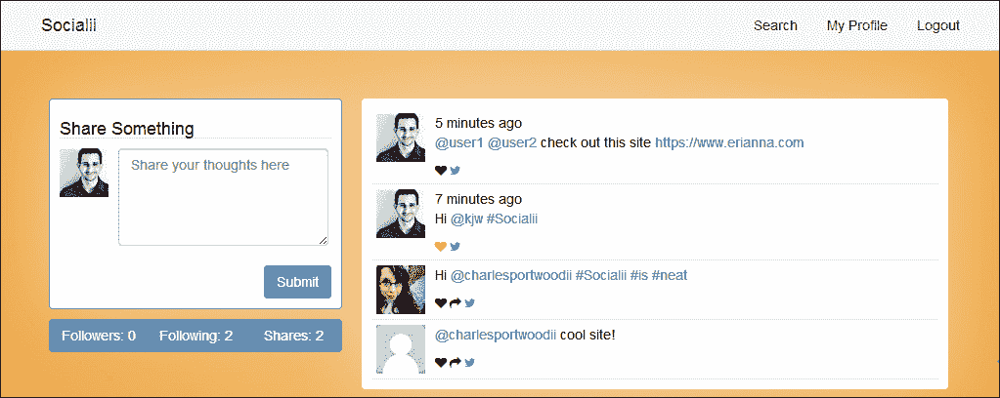
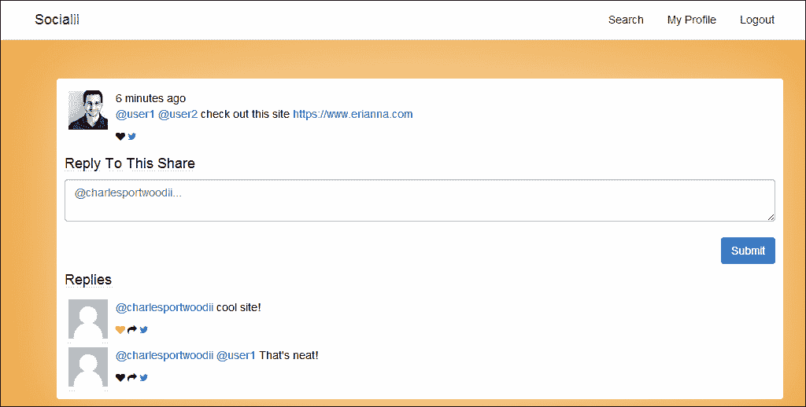
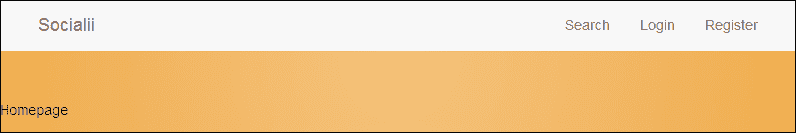
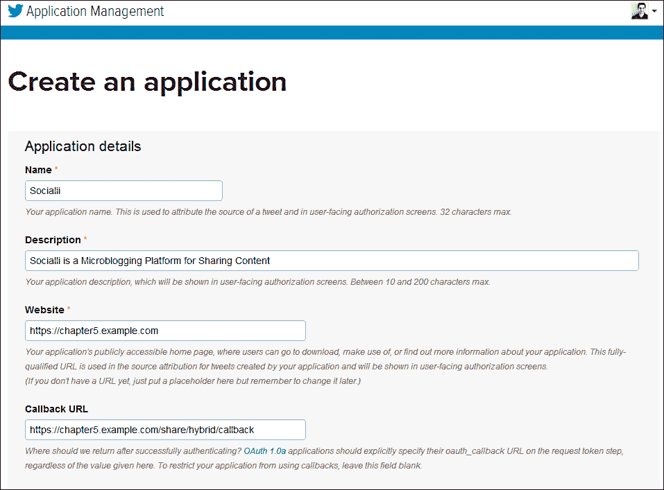
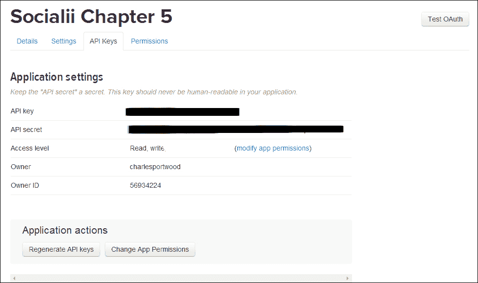
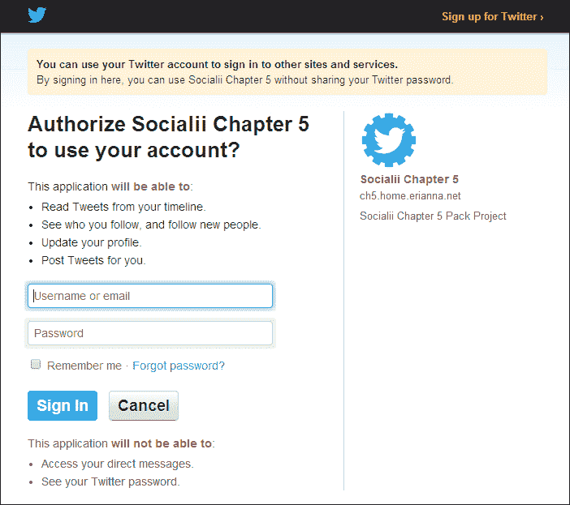
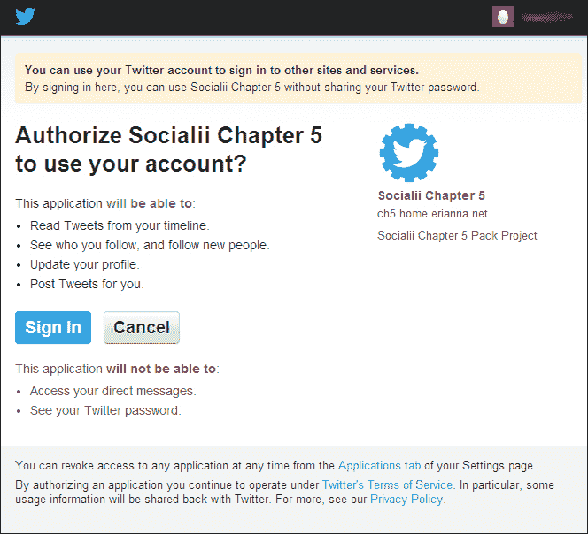

# 第五章。创建一个微博平台

对于我们的下一个项目，我们将开发一个类似于 Twitter 的可扩展微博平台。这个平台将允许用户与他人分享内容，在他们的分享中提及其他用户，并查看他们分享的时间线。此外，用户将能够注册、管理和更改某些账户详情，例如他们的电子邮件地址和密码。最后，我们的平台将允许用户与其他外部社交网络，如 Twitter，分享内容。

到本章结束时，我们将拥有一个社交网络，允许我们分享内容并管理我们的账户，如下面的截图所示：



我们的用户还将能够直接回复和分享他们发布的单个帖子，如下面的截图所示：



# 前提条件

在我们开始之前，有一些事情我们需要设置并确保它们能正常工作：

+   由于我们将从我们的应用程序发送和接收电子邮件，我们需要一个注册并活跃的域名。如果您还没有一个正在工作的域名，您可以从域名注册商那里购买一个，例如 [`www.namecheap.com`](https://www.namecheap.com)，[www.name.com](http://www.name.com)，或 [www.gandi.net](http://www.gandi.net)。

+   接下来，您需要一个具有公开 IP 地址的 Web 服务器。这将允许将电子邮件发送到我们的应用程序。许多云**虚拟专用服务器**（**VPS**）提供商以低月费或时费提供此类服务。这些服务包括 [`www.digitalocean.com`](https://www.digitalocean.com)，[`www.linode.com`](https://www.linode.com)，和 [www.rackspace.com/cloud/servers](http://www.rackspace.com/cloud/servers)。

+   为了在我们的应用程序中发送电子邮件，我们还将利用免费的 SendGrid 开发者账户，该账户可以在 [`www.sendgrid.com/developers`](https://www.sendgrid.com/developers) 上设置。

+   在本章中，我们还将再次使用 MySQL 的最新版本（在撰写本文时，它是 MySQL 5.6）。请确保您的 MySQL 服务器已在您的服务器上设置并运行。

+   对于这个项目，我们还将通过 Composer 管理我们的依赖项，您可以从 [`getcomposer.org/`](https://getcomposer.org/) 下载并安装它。

+   最后，您需要一个 Twitter 开发者账户，您可以从 [`dev.twitter.com/`](https://dev.twitter.com/) 获取。这个账户将允许我们通过 Twitter 的 OAuth API 以登录用户身份分享我们的内容。

一旦您获得了列出的项目，在您使用的域名上创建一个子域名并将其指向您的服务器。在本章中，我将使用 `chapter5.example.com` 来指代这个子域名。一旦一切设置完毕，并且您的服务器对该域名做出响应，我们就可以开始了。

# 描述项目

我们的微博平台可以分为两个主要组件：

+   将关注其他用户并创建、分享和点赞内容的用户

+   用户创建的基于文本的分享

## 用户

我们应用程序的第一个组件是执行我们应用程序中所有任务的用户集。对于这个应用程序，我们将主要重用我们在第四章中扩展的用户数据库和身份验证系统，即*开发问题跟踪应用程序*。在本章中，我们将扩展`users`数据库表，并添加几个新的关系，如粉丝和点赞。

### 粉丝

在这个应用程序中，用户将能够关注其他用户并被其他用户关注。这种关系将使用户能够通过显示其他用户最近创建的内容来保持与其他用户的同步。此外，它将使用户知道有多少人关注他们，并了解他们对网络的影响程度。对于这个应用程序，我们的`followers`表将只包含那些正在关注或被其他用户关注的用户的键。我们的数据库表将如下所示：

```php
ID INTEGER PRIMARY KEY
follower_id INTEGER
followee_id INTEGER
created INTEGER
updated INTEGER
```

### 点赞

在这个应用程序中，用户还可以表示他们喜欢某个特定的分享。类似于我们的`followers`表，`likes`表将只包含`users`和`shares`表的键。我们的数据库表将如下所示：

```php
ID INTEGER PRIMARY KEY
user_id INTEGER
share_id INTEGER
created INTEGER
updated INTEGER
```

## 分享

我们应用程序的第二个组件将是用户创建的分享。为了我们的目的，我们将定义分享为可以包含独特标记的文本片段，例如用于提及其他用户的`@`符号，以及用于标记分享的`#`字符。分享也可以是对另一个分享的回复，这将允许它们在分享的查看页面上查看。最后，分享可以被重新分享，用户可以将其他用户的分享分享给他们的网络。我们的数据库表将如下所示：

```php
ID INTEGER PRIMARY KEY
text STRING
author_id INTEGER
reshare_id INTEGER
reply_id INTEGER
created INTEGER
updated INTEGER
```

# 初始化项目

到现在为止，您应该已经熟悉了从头创建项目。为了提供一个共同的起点，本章的项目资源中包含了一个骨架项目。这个骨架项目包括我们开始所需的必要迁移、数据文件、控制器和视图。我们将在本章中使用该登录系统进行身份验证。将骨架项目从项目资源文件夹复制到您的 Web 服务器，并按照本章开头概述的配置，使其响应`chapter5.example.com`，然后执行以下步骤以确保一切设置正确：

1.  调整`assets`和`protected/runtime`文件夹的权限，以便您的 Web 服务器可以写入。

1.  接下来，创建我们的应用程序将使用的 MySQL 用户和数据库表。如果你不想修改提供的主配置文件，以下 MySQL 命令将为你创建数据库和用户：

    ```php
    CREATE USER 'ch5_socialii'@'localhost' IDENTIFIED BY ''ch5_socialii'';
    CREATE DATABASE IF NOT EXISTS  `'ch5_socialii'` ;
    GRANT ALL PRIVILEGES ON  `'ch5\_socialii'` . * TO  ''ch5_socialii''@'localhost';
    FLUSH PRIVILEGES;
    ```

1.  接下来，我们需要运行初始迁移，然后导入位于`protected/data`文件夹中的示例数据。这些示例数据将使我们能够在应用程序运行后立即登录并开始使用它。导航到项目根目录，然后运行以下命令：

    ```php
    php protected/yiic.php migrate up --interactive=0
    mysql –u ch5_socialii –pch5_socialii ch5_socialii < protected/data/combined.sql

    ```

1.  然后，我们需要更新位于`protected/config/`的`params.php`文件，并添加我们的 SendGrid 信息。你的用户名和密码将与你的 SendGrid 用户名和密码相对应。按照我们的示例域名，将`from`地址设置为`socialii@chapter5.example.com`。

1.  最后，我们需要安装必要的 Composer 依赖项：

    ```php
    composer install

    ```

到目前为止，你应该能够在浏览器中打开`http://chapter5.example.com`并看到以下页面：



## 制作更好的 Yii 引导文件

你可能注意到的一件事是，我们不必声明 Yii 框架的位置，我们的网站才能工作。这是因为我们在`composer.json`文件中将 Yii 框架作为依赖项包含在内，如下所示：

```php
"yiisoft/yii": "1.1.14"
```

将 Yii 作为依赖项包含在我们的项目中而不是在引导程序中硬编码，有以下几个好处：

+   将其作为 Composer 依赖项包含在我们的引导程序中意味着我们不必在将代码推送到服务器之前在服务器上安装 Yii 框架

+   我们现在可以自动化我们的部署流程，并确保我们的开发环境中的依赖项与生产环境中的依赖项相匹配

+   本项目使用的代码现在与其他可能也使用 Yii 框架的项目分开

+   最后，这种分离使我们能够在不担心如何将 Yii 框架部署到我们的服务器的情况下升级 Yii 或使用 Yii 的不同分支

我们还对 Bootstrap 文件进行了一些改进和更改，以便于我们开发和调试。让我们看看`index.php`文件中的更改：

1.  首先，我们包含我们的配置文件：

    ```php
    $config=require dirname(__FILE__).'/protected/config/main.php';
    defined('DS') or define('DS', DIRECTORY_SEPARATOR);
    ```

1.  接下来，我们将把`YII_DEBUG`和`YII_TRACE`设置为在`protected/config/main.php`文件中定义的变量。这将允许我们切换调试模式和跟踪级别，而无需修改`index.php`中的代码：

    ```php
    defined('YII_DEBUG') or define('YII_DEBUG',isset($config['params']['debug']) ? $config['params']['debug'] : false);
    defined('YII_TRACE_LEVEL') or define('YII_TRACE_LEVEL',isset($config['params']['trace']) ? $config['params']['trace'] : 0);
    ```

1.  在`protected/config/main.php`文件中，我们可以通过设置`params[debug]`和`params[trace]`来切换这些变量：

    ```php
    'params' => array(
       'includes' => require __DIR__ . '/params.php',
       'debug' => true,
       'trace' => 3
    )
    ```

1.  然后，我们将加载我们的 Composer 依赖项。根据`YII_DEBUG`是否设置，加载`yii.php`或`yiilite.php`。对于大多数配置，以及与 APC Cache 或 Zend OPcache 结合使用时，`yiilite.php`应该可以提高你应用程序的性能：

    ```php
    require_once(__DIR__ . '/vendor/autoload.php');
    require(__DIR__.DS.'vendor'.DS.'yiisoft'.DS.'yii'.DS.'framework'.DS.(YII_DEBUG ? 'yii.php' : 'yiilite.php'));
    ```

    ### 注意

    如果您想了解更多关于 yiilite 的信息，请查看官方 Yii 文档[`www.yiiframework.com/doc/guide/1.1/en/topics.performance#using-x-9x`](http://www.yiiframework.com/doc/guide/1.1/en/topics.performance#using-x-9x)。

1.  接下来，我们将自动启用日志记录，并在调试模式下将错误报告设置为最大值。这将使我们能够轻松地查看错误发生时的完整堆栈跟踪，并获得有关应用程序中发生情况的详细日志消息。此选项将有助于开发，而不会在生产环境中加载：

    ```php
    if (YII_DEBUG && YII_TRACE_LEVEL == 3)
    {
       error_reporting(-1);
       ini_set('display_errors', 'true');

       // Enable WebLogRouteLogging
       $config['preload'][] = 'log';
       $config['components']['log']['routes'][0]['enabled'] = true;
    }
    ```

1.  为了使前面的步骤生效，我们需要定义一个我们想要使用的日志记录方法。在我们的开发环境中，使用 `CWebLogRoute` 是合理的，这样我们就可以在我们的浏览器中看到我们的日志消息。为了启用此路由，我们将在位于 `protected/config/` 的 `main.php` 文件中的组件部分添加以下内容：

    ```php
    'log' => array(
       'class' => 'CLogRouter',
          'routes' => array(
          array(
             'class' => 'CWebLogRoute',
             'levels' => 'error, warning, trace, info',
             'enabled' => false
          )
       )
    )
    ```

    ### 注意

    Yii 提供了多种不同的日志记录方法，您可以在生产环境和开发环境中使用。要了解更多关于日志记录的信息，请查看官方 Yii 文档[`www.yiiframework.com/doc/guide/1.1/en/topics.logging`](http://www.yiiframework.com/doc/guide/1.1/en/topics.logging)。

1.  最后，我们将引导我们的应用程序：

    ```php
    Yii::createWebApplication($config)->run();
    ```

# 允许用户管理他们的信息

在前面的章节中，我们的用户除了与内容互动之外，几乎无法做任何事情。在本章中，我们将扩展基础用户模型，使他们能够注册我们的应用程序，安全地激活他们的账户，如果他们忘记密码，可以重置密码，以及更改他们的电子邮件地址。

## 升级我们的 UserIdentity 类

在实现之前提到的功能之前，我们需要确保我们能够适当地处理我们的用户，而无需向我们的数据库请求有关当前登录用户的一些基本信息。为此，我们将在位于 `protected/components/` 的 `UserIdentity.php` 文件中添加一些信息，如下所示，在 `authenticate()` 方法的突出部分中：

```php
public function authenticate()
{
   $record = User::model()->findByAttributes(array('email'=>$this->username));

   if ($record == NULL)
      $this->errorCode = YII_DEBUG ? this->errorCode=self::ERROR_USERNAME_INVALID : self::ERROR_UNKNOWN_IDENTITY;
   else if (password_verify($this->password, $record->password))
   {
      $this->errorCode = self::ERROR_NONE;
      $this->_id        = $record->id;
      $this->setState('email', $record->email);
      $this->setState('role', $record->role_id);
      $this->setState('username', $record->username);
      $this->setState('name', $record->name);
   }
   else
      $this->errorCode = YII_DEBUG ? self::ERROR_PASSWORD_INVALID : self::ERROR_UNKNOWN_IDENTITY;

   return !$this->errorCode;
}
```

## 定义用户关系

接下来，我们想要确保我们的关系设置正确，以便我们可以知道哪些数据与我们的用户相关联。这包括分享、关注者和被关注者。在我们的 `protected/models/User.php` 文件中，确保以下内容设置到我们的 `relations()` 方法中：

```php
return array(
   'followees' => array(self::HAS_MANY, 'Follower', 'followee_id'),
   'followers' => array(self::HAS_MANY, 'Follower', 'follower_id'),
   'shares' => array(self::HAS_MANY, 'Share', 'author_id'),
   'role' => array(self::BELONGS_TO, 'Role', 'role_id'),
);
```

我们还将在 `relations()` 方法中添加一个新的关系类型，以便我们可以快速检索用户拥有的分享数、关注者和被关注者的数量。这种关系类型称为 `STAT`，其行为与 `HAS_MANY` 关系相同，但它在数据库级别执行计数并返回一个数字，而不是返回对象数组：

```php
'followeesCount' => array(self::STAT, 'Follower', 'followee_id'),
'followersCount' => array(self::STAT, 'Follower', 'follower_id'),
'sharesCount' => array(self::STAT, 'Share', 'author_id')
```

通过使用`STAT`关系，当我们想知道一个用户有多少关注者时，可以减少对数据库的压力。在一个用户数量较少的小型数据库中，`HAS_MANY`关系并不十分显著；然而，当处理数千个用户时，反复执行`HAS_MANY`查询会导致返回大量结果，这可能导致我们的应用程序耗尽内存并崩溃。

### 确定一个用户是否关注另一个用户

我们需要对模型中的关系进行的最后一个更改是添加一个快速方法，以便我们能够确定当前登录的用户是否关注另一个用户。我们将在稍后使用此信息来调整视图中的显示内容。将以下方法添加到位于`protected/models/`的`User.php`文件中：

```php
public static function isFollowing($id=NULL)
{
   if ($id == NULL || Yii::app()->user->isGuest)
      return false;

   $following = Follower::model()->findByAttributes(array('follower_id' => Yii::app()->user->id, 'followee_id' => $id));

   return $following != NULL;
}
```

## 实现安全的注册过程

创建安全 Web 应用的一个更困难的部分是确保在我们网站上注册的用户确实是他们声称的用户。通常，这是通过向用户发送包含唯一一次性令牌的电子邮件来完成的。如果用户能够使用这个安全令牌访问我们的网站，我们可以假设他们是真实的用户，并且他们有权访问电子邮件地址。通过采用这种验证方法，我们可以确保在我们网站上注册的用户是他们所声称的用户，并且他们选择与我们应用程序互动。

尽管我们可以在控制器中直接处理大部分此功能，并使用户模型因不必要的函数而膨胀，但我们将选择`CFormModel`作为此任务的工具。在这本书中，我们只使用了`CFormModel`来处理`LoginForm`模型，这是我们用来登录用户的。在继续前进之前，让我们深入了解`CFormModel`是什么，并探讨我们如何使用它。

`CFormModel`与`CActiveRecord`非常相似，因为它扩展了`CModel`并继承了`CActiveRecord`的许多方法，如`attributeLabels`、`attributes`和`rules`。`CFormModel`与`CActiveRecord`的主要区别在于`CFormModel`用于从 HTML 表单收集信息，提交给`CFormModel`的数据是被处理的，而不是存储和操纵在数据库中。通过利用从`CModel`继承的方法，我们可以干净且容易地使用`CFormModel`来验证输入，并减少控制器和模型中的代码杂乱。

### 注意

要了解更多关于`CFormModel`的信息，请查看官方 Yii 文档[`www.yiiframework.com/doc/api/1.1/CFormModel`](http://www.yiiframework.com/doc/api/1.1/CFormModel)。

要开始，在`protected/models/RegistrationForm.php`中创建一个新文件，并将其添加以下内容：

```php
<?php class RegistrationForm extends CFormModel {}
```

下一步如下：

1.  我们将在类中放置的第一个项目是我们的属性。这些模型属性是公开的，可以从我们的控制器中设置：

    ```php
    public $email;
    public $name;
    public $password;
    public $username;
    ```

1.  接下来，我们将定义这些属性的标签：

    ```php
    public function attributeLabels()
    {
       return array(
          'email' => 'Your Email Address',
          'name' => 'Your Full Name',
          'password' => 'Your Password',
          'username' => 'Your Username'
       );
    }
    ```

1.  然后，我们需要设置我们的验证规则。对于新用户，我们希望验证所有属性都已设置，电子邮件地址是有效的，密码至少有 `8` 个字符长，并且用户尝试注册的用户名尚未被占用：

    ```php
    public function rules()
    {
       return array(
          array('email, username, name, password', 'required'),
          array('password', 'length', 'min'=>8),
          array('email', 'email'),
          array('username', 'validateUsername') ,
          array('email', 'verifyEmailIsUnique')
       );
    }
    ```

1.  由于 Yii 没有提供原生的用户名验证器，因此我们需要定义自己的 `validateUsername()` 方法，该方法将对我们的数据库进行简单的存在性检查：

    ```php
    public function validateUsername($attributes, $params)
    {
       $user = User::model()->findByAttributes(array('username' => $this->username));

       if ($user === NULL)
          return true;
       else
       {
          $this->addError('username', 'That username has already been registered');
          return false;
       }
    }
    ```

1.  我们还希望定义一个验证器来确保我们的电子邮件地址尚未被占用：

    ```php
    public function verifyEmailIsUnique($attributes, $params)
    {
       $user = User::model()->findByAttributes(array('email' => $this->email));

       if ($user === NULL)
          return true;
       else
       {
          $this->addError('email', 'That email address has already been registered');
          return false;
       }
    }
    ```

    ### 注意

    注意到当验证失败时，我们不仅返回了 false，还向我们的模型添加了一个错误。我们这样做有三个原因：为了增强用户体验并确保用户知道出了什么问题，为了确保当抛出错误时 `CModel` 的 `validate()` 方法失败（除非调用 `$this->addError()`，否则它将返回 true），以及为了确保我们可以独立于表单运行这些验证器。

1.  根据优先级，我们将创建的最后一个方法是 `save()` 方法，它将执行验证，向用户发送验证电子邮件，并将新记录插入到我们的数据库中。为了实现这一点，首先创建一个名为 `save()` 的新方法：

    ```php
    public function save()
    ```

    然后，在方法内部，首先执行验证：

    ```php
    if (!$this->validate())
    return false;
    ```

    然后，创建一个新的 `User` 对象：

    ```php
    $user = new User;
    $user->attributes = array(
       'email' => $this->email,
       'name' => $this->name,
       'password' => $this->password,
       'username' => str_replace(' ', '',$this->username),
       'activated' => 0
    );
    ```

    然后，尝试保存用户并发送包含激活详情的电子邮件地址给该用户：

    ```php
    if ($user->save())
    {
       // Send an email to the user
       $sendgrid = new SendGrid(Yii::app()->params['includes']['sendgrid']['username'], Yii::app()->params['includes']['sendgrid']['password']);
       $email    = new SendGrid\Email();

       $email->setFrom(Yii::app()->params['includes']['sendgrid']['from'])
          ->addTo($user->email)
          ->setSubject("Activate Your Socialii Account")
          ->setText('Activate Your Socialii Account')
          ->setHtml(Yii::app()->controller->renderPartial('//email/activate', array('user' => $user), true));

       // Send the email
       $sendgrid->send($email);

       // Return true if we get to this point
       return true;
    }
    ```

1.  接下来，我们需要更新我们的用户模型，以便在用户首次创建时设置激活密钥。为了生成激活密钥，我们将使用包含在我们的 `composer.json` 文件中的库，该库可以安全地生成字符串：

    ```php
    public function beforeSave()
    {
       if ($this->isNewRecord)
       {
          $this->generateActivationKey();
          $this->role_id = 1;
       }

       return parent::beforeSave();
    }

    public function generateActivationKey()
    {
       $factory = new CryptLib\Random\Factory;
       $this->activation_key = $factory->getHighStrengthGenerator()->generateString(16);
       return $this->activation_key;
    }
    ```

1.  现在，我们可以在 `protected/controllers/` 目录下的 `UserController.php` 文件中添加一个注册动作，允许用户使用我们的网站注册。由于大部分工作已经在我们的表单中完成，我们只需要从 `$_POST` 请求中收集数据，将其应用于模型，并在模型上调用 `save()` 方法。为了提供更好的用户体验，我们还可以尝试使用用户的新凭据自动登录：

    ```php
    public function actionRegister()
    {
       // Authenticated users shouldn't be able to register
       if (!Yii::app()->user->isGuest)
       $this->redirect($this->createUrl('timeline/index'));

       $form = new RegistrationForm;
       if (isset($_POST['RegistrationForm']))
       {
          $form->attributes = $_POST['RegistrationForm'];

          // Attempt to save the user's information
          if ($form->save())
          {
             // Try to automagically log the user in, if we fail though just redirect them to the login page
             $model = new LoginForm;
             $model->attributes = array(
                'username' => $form->email,
                'password' => $form->password
             );

             if ($model->login())
             {
                // Set a flash message associated to the new Yii::app()->user
                Yii::app()->user->setFlash('sucess', 'You successfully registred an account!');

                // Then redirect to their timeline
                $this->redirect($this->createUrl('timeline/index'));
             }
             else
                $this->redirect($this->createUrl('site/login'));
          }
       }

       $this->render('register', array('user' => $form));
    }
    ```

1.  然后，从项目资源文件夹中，将以下视图文件复制到您的项目中：`protected/views/user/register.php`、`protected/views/email/activate.php` 和 `protected/views/site/index.php`。现在，您可以从 `site/index` 或 `user/register` 路由注册一个新的账户到您的网站。

1.  最后，在 `protected/controllers/` 目录下的 `UserController.php` 文件中创建一个新的方法 `actionActivate()`，该方法将实际激活我们的用户。为此，我们将简单地验证发送给我们的路由中的 ID 参数是否与文件中记录的用户匹配：

    ```php
    public function actionActivate($id=NULL)
    {
       if ($id == NULL)
          throw new CHttpException(400, 'Activation ID is missing');

       $user = User::model()->findByAttributes(array('activation_key' => $id));

       if ($user == NULL)
          throw new CHttpException(400, 'The activation ID you supplied is invalid');

       // Don't allow activations of users who have a password reset request OR have a change email request in
       // Email Change Requests and Password Reset Requests require an activated account
       if ($user->activated == -1 || $user->activated == -2)
          throw new CHttpException(400, 'There was an error fulfilling your request');

       $user->activated = 1;
       $user->password = NULL;           // Don't reset the password
       $user->activation_key = NULL;     // Prevent reuse of their activation key

       if ($user->save())
       {
          $this->render('activate');
          Yii::app()->end();
       }

       throw new CHttpException(500, 'An error occurring activating your account. Please try again later');
    }
    ```

我们还可以在我们的主页上重用我们刚刚创建的表单，允许用户从那里登录或注册新账户。由于我们已经复制了视图，我们只需要调整`SiteController`的`actionIndex()`方法：

```php
public function actionIndex()
{
   if (!Yii::app()->user->isGuest)
      $this->redirect($this->createUrl('timeline/index'));

   $this->layout = 'main';
   $this->render('index', array('loginform' => new LoginForm, 'user' => new RegistrationForm));
}
```

## 处理忘记密码的情况

如前所示，使用`CFormModel`处理来自 HTML 表单的输入使得验证提交的信息并采取行动变得非常容易，同时保持我们的模型和控制器非常清晰。我们还可以再次使用`CFormModel`来处理用户的忘记密码请求。

为了处理忘记密码的情况，我们将要求用户提供他们用于注册账户的电子邮件地址。接下来，我们将验证我们是否有存档的电子邮件地址，然后发送一个包含一次性令牌的电子邮件给用户，该令牌将允许他们安全地重置密码。首先，在`protected/models`中创建一个名为`ForgotForm.php`的新文件，并将其添加以下内容：

```php
<?php class ForgotForm extends CFormModel {}
```

下一步如下：

1.  首先，声明我们表单的公共属性：

    ```php
    public $email;
    public function attributeLabels()
    {
       return array(
          'email' => 'Your Email Address'
       );
    }
    ```

1.  我们还将为我们的用户模型声明一个私有属性，我们将在整个模型中重用它：

    ```php
    private $_user;
    ```

1.  接下来，我们将声明我们的验证规则和自定义验证器：

    ```php
    public function rules()
    {
       return array(
          array('email', 'required'),
          array('email', 'email'),
          array('email', 'checkUser'),
       );
    }

    public function checkUser($attribute,$params)
    {
       $this->_user = User::model()->findByAttributes(array('email' => $this->email));

       if ($this->_user == NULL)
       {
          $this->addError('email', 'There is no user in our system with that email address.');
          return false;
       }

       return true;
    }
    ```

1.  然后，我们将声明我们的`save()`方法，该方法将向用户发送电子邮件并指示他们已请求重置密码：

    ```php
    public function save()
    {
       if (!$this->validate())
          return false;

       // Set the activation details
       $this->_user->generateActivationKey();
       $this->_user->activated = -1;

       if ($this->_user->save())
       {
          $sendgrid = new SendGrid(Yii::app()->params['includes']['sendgrid']['username'], Yii::app()->params['includes']['sendgrid']['password']);
          $email    = new SendGrid\Email();

          $email->setFrom(Yii::app()->params['includes']['sendgrid']['from'])
             ->addTo($this->_user->email)
             ->setSubject('Reset Your Socialii Password')
             ->setText('Reset Your Socialii Password')
             ->setHtml(Yii::app()->controller->renderPartial('//email/forgot', array('user' => $this->_user), true));

          // Send the email
          $sendgrid->send($email);

          return true;
       }
       else
          $this->addError('email', 'Unable to send reset link. This is likely a temporary error. Please try again in a few minutes.');

       return false;
    }
    ```

1.  然后，在`protected/controllers/UserController.php`中创建一个操作来处理表单提交：

    ```php
    public function actionForgot()
    {
       $form = new ForgotForm;

       if (isset($_POST['ForgotForm']))
       {
          $form->attributes = $_POST['ForgotForm'];

          if ($form->save())
          {
             $this->render('forgot_success');
             Yii::app()->end();
          }
       }

       $this->render('forgot', array('forgotform' => $form));
    }
    ```

1.  最后，从项目资源文件夹中复制`protected/views/user/forgot.php`、`protected/views/user/forgot_success.php`和`protected/views/email/forgot.php`到您的应用程序中。

## 重置忘记的密码

一旦用户获得了我们发送给他们的一次性令牌，我们就可以允许用户安全地将他们的密码更改为他们想要的任何内容。首先，在`protected/models`中创建一个名为`PasswordResetform.php`的新文件，并添加以下内容：

```php
<?php class PasswordResetForm extends CFormModel {}
```

下一步如下：

1.  首先，声明此表单的公共属性：

    ```php
    public $password;
    public $pasword_repeat;
    public $user;
    ```

1.  然后，添加验证规则。用户的新密码应该与注册时相同的要求。由于我们要求输入两次密码，我们将使用比较验证器来比较这两个密码。此验证器将第一个属性与`attribute_repeat`属性进行比较：

    ```php
    public function rules()
    {
       return array(
          array('password', 'length', 'min' => 8),
          array('password, password_repeat, user', 'required'),
          array('password', 'compare', 'compareAttribute' => 'password_repeat'),
       );
    }
    ```

1.  然后，添加用于重置用户密码的`save()`方法：

    ```php
    public function save()
    {
       if (!$this->validate())
          return false;

       $this->user->password = $this->password;

       // Verify that this activation key can't be used again
       $this->user->activated = 1;
       $this->user->activation_key = NULL;

       if ($this->user->save())
          return true;

       return false;
    }
    ```

1.  然后，创建我们的控制器操作：

    ```php
    public function actionResetPassword($id = NULL)
    {
       if ($id == NULL)
          throw new CHttpException(400, 'Missing Password Reset ID');

       $user = User::model()->findByAttributes(array('activation_key' => $id));

       if ($user == NULL)
          throw new CHttpException(400, 'The password reset id you supplied is invalid');

       $form = new PasswordResetForm;

       if (isset($_POST['PasswordResetForm']))
       {
          $form->attributes = array(
             'user' => $user,
             'password' => $_POST['PasswordResetForm']['password'],
             'password_repeat' => $_POST['PasswordResetForm']['password_repeat']
          );

          if ($form->save())
          {
             $this->render('resetpasswordsuccess');
             Yii::app()->end();
          }
       }

       $this->render('resetpassword', array(
          'passwordresetform' => $form,
          'id' => $id
       ));
    }
    ```

1.  最后，从项目资源文件夹中复制`protected/views/user/resetpassword.php`和`protected/views/user/resetpassword_success.php`到您的应用程序中。

## 允许用户管理他们的详细信息

到目前为止，我们现在可以登录，注册账户，如果我们忘记了密码，还可以重置密码。现在，让我们着手允许用户管理他们自己的详细信息。这包括允许他们更改密码、电子邮件地址以及我们在注册过程中收集的其他信息。步骤如下：

1.  我们将首先在 `protected/models` 中再次创建一个新的 `CFormModel`，名为 `ProfileForm.php`：

    ```php
    <?php class ProfileForm extends CFormModel {}
    ```

1.  然后，我们将添加我们的属性和标签：

    ```php
    public $email;
    public $password;
    public $name;
    public $newpassword = NULL;
    public $newpassword_repeat = NULL;
    private $_user;
    public function attributeLabels()
     {
        return array(
           'email'               => 'Your New Email Address',
           'password'            => 'Your Current Password',
           'name'                => 'Your Name',
           'newpassword'         => 'Your NEW password',
           'newpassword_repeat'  => 'Your NEW password (again)'
        );
     }
    ```

1.  然后，我们将添加我们的基本验证规则：

    ```php
    public function rules()
    {
       return array(
          array('email, name, password', 'required'),
          array('newpassword', 'length', 'min' => 8),
          array('email', 'email'),
          array('password', 'verifyPassword'),
          array('newpassword', 'compare', 'compareAttribute' => 'newpassword_repeat')
       );
    }
    ```

1.  在允许用户更改任何信息（包括他们的密码和电子邮件地址）之前，我们将要求他们输入他们的当前密码。这将验证他们是否控制着账户：

    ```php
    public function verifyPassword($attribute,$params)
    {
       // Only allow change requests from the currently logged inuser
       $this->_user = User::model()->findByPk(Yii::app()->user->id);

       // User doesn't exist. Something bad has happened
       if ($this->_user == NULL)
          return false;

       // NULL the new password if it isn't set
       if ($this->newpassword == '' || $this->newpassword == NULL)
          $this->newpassword == NULL;

       // Validate the password
       if (!password_verify($this->password, $this->_user->password))
       {
          $this->addError('password', 'The password you entered is invalid');
          return false;
       }
       return true;
    }
    ```

1.  然后，我们将添加我们的 `save()` 方法，该方法将更新用户的信息：

    ```php
    public function save()
    {
       if (!$this->validate())
          return false;

       // Set the user attributes
       $this->_user->attributes = array(
          // If the email submitted is different than the current email, change the new_email field
          'new_email' => $this->email == $this->_user->email ? NULL : $this->email,

          // Set the new password if validation passes
          'password' => $this->newpassword == NULL ? NULL : $this->newpassword,
          'name' => $this->name
       );

       // Save the user's information
       if ($this->_user->save())
       {
          // If the user's password has changed, send the user an email so that they can be aware of it
          if ($this->newpassword != NULL && $this->password != $this->newpassword)
             $this->sendPasswordChangeNotification();

          // If the user entered a NEW email address, and we haven't already sent them a change email notification
          // Send them a change email notification
          if ($this->email != $this->_user->_oldAttributes['email'] && $this->_user->activated != -2)
             $this->sendEmailChangeNotification();

          return true;
       }

       return false;
    }
    ```

1.  在 `save()` 方法中，我们声明了两个新方法：`sendPasswordChangeNotification()` 和 `sendEmailChangeNotification()`。这两个方法将在事件发生时向用户发送电子邮件：

    ```php
    private function sendPasswordChangeNotification()
    {
       $sendgrid = new SendGrid(Yii::app()->params['includes']['sendgrid']['username'], Yii::app()->params['includes']['sendgrid']['password']);
       $email    = new SendGrid\Email();

       $email->setFrom(Yii::app()->params['includes']['sendgrid']['from'])
          ->addTo($this->_user->email)
          ->setSubject("Your Socialii Password Has Been Changed")
          ->setText('Your Socialii Password Has Been Changed')
          ->setHtml(Yii::app()->controller->renderPartial('//email/passwordchange', array('user' => $this->_user), true));

       // Send the email
       return $sendgrid->send($email);
    }
    ```

1.  第二种方法，`sendEmailChangeNotification()` 当用户的电子邮件地址发生变化时向用户发送电子邮件。这允许我们在开始在我们的应用程序中使用它之前验证他们的新电子邮件地址：

    ```php
    private function sendEmailChangeNotification()
    {
       // Change the user's activation status for the verification link
       $this->_user->activated = -2;
       $this->_user->activation_key = $this->_user->generateActivationKey();

       // Save the user's information
       if ($this->_user->save())
       {
          $sendgrid = new SendGrid(Yii::app()->params['includes']['sendgrid']['username'], Yii::app()->params['includes']['sendgrid']['password']);
          $email    = new SendGrid\Email();

          $email->setFrom(Yii::app()->params['includes']['sendgrid']['from'])
             ->addTo($this->_user->new_email)
             ->setSubject("Verify Your New Email Address")
             ->setText('Verify Your New Email Address')
             ->setHtml(Yii::app()->controller->renderPartial('//email/verify', array('user' => $this->_user), true));

          // Send the email
          return $sendgrid->send($email);
       }

       return false;
    }
    ```

1.  然后，在我们的 `UserController` 中，我们将定义我们的 `actionIndex()` 方法，该方法将收集这些信息：

    ```php
    public function actionIndex()
    {
       $user = User::model()->findByPk(Yii::app()->user->id);
       $form = new ProfileForm;
       if (isset($_POST['ProfileForm']))
       {
          $form->attributes = $_POST['ProfileForm'];
          $form->newpassword_repeat = $_POST['ProfileForm']['newpassword_repeat'];

          if ($form->save())
             Yii::app()->user->setFlash('success', 'Your information has been successfully changed');
          else
             Yii::app()->user->setFlash('danger', 'There was an error updating your information');
       }

       $this->render('index', array(
          'user' => $user,
          'profileform' => $form
       ));
    }
    ```

1.  最后，我们需要将 `protected/views/user/index.php`、`protected/view/email/passwordchange.php` 和 `protected/views/email/verify.php` 从我们的项目资源文件夹复制到我们的项目中。

## 验证新的电子邮件地址

现在，我们的用户可以更改自己的信息，而无需通过我们。在我们关闭 `UserController` 之前，还有一些其他方法需要实现。

更改用户电子邮件地址的一种安全方式是将新电子邮件地址存储在我们的数据库中的一个临时表或列中，然后向该电子邮件地址发送一个验证电子邮件（这是我们已经在 `ProfileForm` 类中实现的）。这允许我们表明我们知道用户想要更改密码，但我们要求他们证明他们可以访问新的电子邮件地址。我们发送给他们的电子邮件包含一个安全的激活令牌和一个链接到 `actionVerify()` 方法，该方法将验证令牌是否属于用户，然后将新的电子邮件地址移动到我们数据库中的主要电子邮件地址字段。我们可以按照以下方式实现 `actionVerify()` 方法：

```php
public function actionVerify($id=NULL)
{
   if ($id == NULL)
      throw new CHttpException(400, 'Activation ID is missing');

   $user = User::model()->findByAttributes(array('activation_key' => $id));

   if ($user == NULL)
   throw new CHttpException(400, 'The verification ID you supplied is invalid');

   $user->attributes = array(
      'email' => $user->new_email,
      'new_email' => NULL,
      'activated' => 1,
      'activation_key' => NULL
   );

   // Save the information
   if ($user->save())
   {
      $this->render('verify');
      Yii::app()->end();
   }

   throw new CHttpException(500, 'There was an error processing your request. Please try again later');
}
```

我们将为这个控制器实现的最后操作将允许用户关注和取消关注另一个用户。我们将在本章后面的视图中使用这些操作。现在，按照以下方式实现这些操作：

```php
public function actionFollow($id=NULL)
{
   if ($id == NULL)
      throw new CHttpException(400, 'You must specify the user you wish to follow');

   if ($id == Yii::app()->user->id)
      throw new CHttpException(400, 'You cannot follow yourself');

   $follower = new Follower;
   $follower->attributes = array(
      'follower_id' => Yii::app()->user->id,
      'followee_id' => $id
   );

   if ($follower->save())
      Yii::app()->user->setFlash('success', 'You are now  following ' . User::model()->findByPk($id)->name);

   // Redirect back to where they were before
   $this->redirect(Yii::app()->request->urlReferrer);
}

public function actionUnFollow($id=NULL)
{
   if ($id == NULL)
   throw new CHttpException(400, 'You must specify the user you wish to unfollow');

   if ($id == Yii::app()->user->id)
      throw new CHttpException(400, 'You cannot unfollow yourself');

   $follower = Follower::model()->findByAttributes(array('follower_id' => Yii::app()->user->id, 'followee_id' => $id));

   if ($follower != NULL)
   {
      if ($follower->delete())
         Yii::app()->user->setFlash('success', 'You are no longer following ' . User::model()->findByPk($id)->name);
   }

   // Redirect back to where they were before
   $this->redirect(Yii::app()->request->urlReferrer);
}
```

在关闭此控制器之前，请确保 `accessRules()` 方法设置正确：

```php
public function accessRules()
{
   return array(
   array('allow',
      'actions' => array('register', 'forgot', 'verify', 'activate', 'resetpassword'),
      'users' => array('*')
      ),
      array('allow',
         'actions' => array('index', 'follow', 'unfollow'),
         'users'=>array('@'),
      ),
      array('deny',  // deny all users
         'users'=>array('*'),
      ),
   );
}
```

# 查看分享的时间线

显示新内容最简单的方法就是简单地列出它，以便显示最新的项目。在我们的时间线页面上，我们希望为用户提供分享东西、查看他们正在查看的用户的信息（例如共享数量、关注者和被关注者）以及查看用户最近分享的内容的能力。为此，我们将利用从我们的主时间线视图异步加载的`CListView`。这将允许我们稍后通过简单地向我们将要创建的端点发出`GET`请求来重用此视图。在我们的`TimelineController.php`文件中，位于`protected/controllers/`，实现`actionIndex()`方法：

```php
public function actionIndex($id = NULL)
{
   // If the ID is not set, set this to the currently logged in user.
   if ($id == NULL)
   {
      if (Yii::app()->user->isGuest)
         $this->redirect($this->createUrl('site/login'));

      $id = Yii::app()->user->username;
   }

   // Get the user's information
   $user = User::model()->findByAttributes(array('username' => $id));
   if ($user == NULL)
      throw new CHttpException(400, 'Unable to find a user with that ID');

   $this->render('index', array(
      'user' => $user,
      'share' => new Share,
      'id' => $user->id
   ));
}
```

在这个动作中，我们所做的一切就是从路由中检索用户 ID（在这种情况下，用户的用户名），然后将一些信息传递到我们的视图中。从项目资源文件夹中，将位于`protected/views/timeline/`的`index.php`文件复制到您的项目中。让我们看看这个文件中一些更有趣的部分。

在这个文件中，首先要注意的是我们只是简单地使用`CActiveForm`来显示新的共享容器。此外，在这个文件的底部，我们实现了一些 JavaScript 来进行一些基本的表单验证检查，以便在异步提交时清除文本字段，调整我们拥有的共享数量，最后将新的共享添加到我们的共享列表顶部。

第二个要注意的是，我们实现了条件关注和取消关注按钮链接，允许我们的用户简单地点击一个链接来关注或取消关注特定用户：

```php
<?php if (Yii::app()->user->isGuest): ?>
   <?php echo CHtml::link('Login to follow ' . $user->name, $this->createUrl('site/login'), array('class' => 'btn btn-primary')); ?>
      <br /><br />
   <?php else: ?>
      <?php if (!User::isFollowing($id)): ?>
         <?php echo CHtml::link('Follow This User', $this->createUrl('user/follow/', array('id' => $id)), array('class' => 'btn btn-success')); ?>
      <?php else: ?>
         <?php echo CHtml::link('Stop Following This User', $this->createUrl('user/unfollow/', array('id' => $id)), array('class' => 'btn btn-danger')); ?>
   <?php endif; ?>
<?php endif; ?>
```

在这个文件中最后要注意的是我们使用我们在用户模型中之前设置的计数关系：

```php
<a type="button" class="btn btn-primary" disabled>Followers: <?php echo $user->followeesCount; ?></a>
<a type="button" class="btn btn-primary" disabled>Following: <?php echo $user->followersCount; ?></a>
<a type="button" class="btn btn-primary" disabled>Shares: <span class="share-count"><?php echo $user->sharesCount; ?></span></a>
```

最后，我们通过注册一个异步回调来获取适当的共享来加载此用户的共享，无论我们正在查看哪个用户的共享：

```php
<?php Yii::app()->clientScript->registerScript('loadshares', '$.get("' . $this->createUrl('share/getshares', array('id' => $id)) . '", function(data) { $(".shares").html(data); }); '); ?>
```

## 获取共享

现在，让我们实现我们的动作，该动作将显示我们的共享。这个动作的行为将根据我们是在查看我们的时间线还是另一个用户的时间线而略有不同。在我们的`ShareController.php`文件中，位于`protected/controllers/`，实现`actionGetShares`，如下所示：

```php
public function actionGetShares($id=NULL) {}
```

下一步如下：

1.  由于这是一个异步回调，我们不希望从我们的布局中渲染任何内容：

    ```php
       $this->layout = false;
    ```

1.  接下来，我们将抛出一个错误，如果未提供用户并且我们没有登录，或者如果我们登录并且有人给了我们一个 ID，我们将用户设置为 ourselves：

    ```php
       if ($id == NULL)
       {
          if (Yii::app()->user->isGuest)
             throw new CHttpException(400, 'Cannot retrieve shares for that user');

          $id = Yii::app()->user->id;
       }
    ```

1.  然后，我们将实现`CListView`，它将从我们的`GET`参数中检索数据：

    ```php
       $myFollowers = array();

       // CListView for showing shares
       $shares = new Share('search');
       $shares->unsetAttributes();

       if(isset($_GET['Share']))
          $shares->attributes=$_GET['Share'];
    ```

1.  当查看另一个用户的时间线时，我们只关心他们与世界共享的共享。然而，当我们查看我们的时间线时，我们希望查看我们的共享以及我们正在关注的用户的共享。我们可以这样实现控制器部分：

    ```php
       // If this is NOT the current user, then only show stuff that belongs to this user
       if ($id != Yii::app()->user->id)
          $shares->author_id = $id;
       else
       {
          // Alter the criteria to do a search of everyone the current user is following
          $myFollowers[] = Yii::app()->user->id;

          $followers = Follower::model()->findAllByAttributes(array('follower_id' => Yii::app()->user->id));
          if ($followers != NULL)
          {
             foreach ($followers as $follower)
             $myFollowers[] = $follower->followee_id;
          }
       }

       $this->render('getshares', array('shares' => $shares, 'myFollowers' => $myFollowers));
    }
    ```

1.  然后，我们需要在`protected/views/shares/`中实现我们的`getshares.php`视图文件，作为`CListView`。注意，我们正在将`$myFollowers`作为自定义参数传递给 Share 模型的`search()`方法：

    ```php
    <?php $this->widget('zii.widgets.CListView', array(
        'dataProvider'=>$shares->search($myFollowers),
        'itemView'=>'share',
        'emptyText' => '<div class="center">This user hasn\'t shared anything yet!</div>',
        'template' => '{items}{pager}',
        'afterAjaxUpdate' => 'js:function() { init(); }
        ',
        'pager' => array(
            'header' => ' ',
            'selectedPageCssClass' => 'active',
            'htmlOptions' => array('class' => 'pagination')
        )
    ));

    Yii::app()->clientScript->registerScript('init', '
    function init() {
        $(".fa-heart").click(function() {
            var id = $(this).parent().parent().parent().attr("data-attr-id");
            var self = this;
            $.post("' . $this->createUrl('share/like') . '/" + id, function(data) {
                $(self).toggleClass("liked");
            });
        });

        $(".fa-mail-forward").click(function() {
            var id = $(this).parent().parent().parent().attr("data-attr-id");
            var self = this;
            $.post("' . $this->createUrl('share/re-share') . '/" + id, function(data) {
                $(self).toggleClass("liked");
            });
        });
    }

    init();
    ');
    ```

1.  然后，在我们的模型中，我们将调整我们的`search()`方法，以便它有条件地加载适当的数据：

    ```php
    public function search($items = array())
    {
       $criteria=new CDbCriteria;

       $criteria->compare('id',$this->id);
       $criteria->compare('text',$this->text,true);
       $criteria->compare('reply_id',$this->reply_id);
       $criteria->compare('created',$this->created);

       if (empty($items))
     $criteria->compare('author_id',$this->author_id);
     else
     $criteria->addInCondition('author_id', $items);

       $criteria->order = 'created DESC';
       return new CActiveDataProvider($this, array(
          'criteria' => $criteria,
       ));
    }
    ```

1.  最后，我们可以通过将项目资源文件夹中的`protected/views/share/share.php`复制到我们的项目中来实现我们的单个分享视图。

在这个文件中，我们将实现一些自定义逻辑，以便将哈希标签（#）和@提及显示为链接。这将使我们能够在数据库中存储未格式化的文本，这意味着我们可以调整视图的工作方式，而无需修改我们的数据。我们还将以 Markdown 格式渲染我们的文本，以便我们的用户可以添加链接或其他自定义格式，但防止他们尝试 XSS 注入：

```php
<?php
   $data->text = preg_replace("/#([A-Za-z0-9\/\.]*)/", "<a target=\"_new\" href=\"" . Yii::app()->controller->createAbsoluteUrl('timeline/search') ."?q=$1\">#$1</a>", $data->text);
   $data->text = preg_replace("/@([A-Za-z0-9\/\.]*)/", "<a href=\"" . Yii::app()->controller->createAbsoluteUrl('timeline/index'). "/$1\">@$1</a>", $data->text);
   $md = new CMarkdownParser;
   echo $md->safeTransform($data->text);
```

# 分享新内容

到目前为止，如果我们数据库中有分享，我们就能看到它们。所以让我们专注于分享新内容！从我们的控制器中，处理分享的动作只是简单地加载一个新的 Share 模型并填充它。看看以下代码：

```php
public function actionCreate()
{
   $share = new Share;

   if (isset($_POST['Share']))
   {
      $share->attributes = array(
         'text' => $_POST['Share']['text'],
         'reply_id' => isset($_POST['Share']['reply_id']) ? $_POST['Share']['reply_id'] : NULL,
         'author_id' => Yii::app()->user->id
      );

      // Share the content
      if ($share->save())
      {
         $this->renderPartial('share', array('data' => $share));
         Yii::app()->end();
      }
   }

   throw new CHttpException(500, 'There was an error sharing your content');
}
```

然而，分享内容的真正力量在于我们的 Share 模型中的`beforeSave()`方法。从这里，我们处理模型中可能发生的所有提及，并向所有在分享中被提及的人发送电子邮件。代码如下：

```php
public function afterSave()
{
   preg_match_all('/@([A-Za-z0-9\/\.]*)/', $this->text, $matches);
   $mentions = implode(',', $matches[1]);

   if (!empty($matches[1]))
   {
      $criteria = new CDbCriteria;
      $criteria->addInCondition('username', $matches[1]);
      $users = User::model()->findAll($criteria);

      foreach ($users as $user)
      {
         $sendgrid = new SendGrid(Yii::app()->params['includes']['sendgrid']['username'], Yii::app()->params['includes']['sendgrid']['password']);
         $email    = new SendGrid\Email();

         $email->setFrom(Yii::app()->params['includes']['sendgrid']['from'])
            ->addTo($user->email)
            ->setSubject("You've Been @mentioned!")
            ->setText("You've Been @mentioned!")
            ->setHtml(Yii::app()->controller->renderPartial('//email/mention', array('share' => $this, 'user' => $user), true));

         // Send the email
         $sendgrid->send($email);
      }
   }

   return parent::afterSave();
}
```

## 重新分享

由于我们的模型中已经实现了所有内容，我们可以轻松地现在作为一个新的控制器行为在`protected/controllers/ShareController.php`中实现重新分享。重新分享允许用户分享另一个用户分享的内容，同时仍然给予原始分享的用户应有的信用。在我们的控制器中，我们将加载我们想要重新分享的分享，将其作者更改为我们，然后指出这是另一个分享的重新分享。

首先，让我们创建一个`loadModel()`实用方法：

```php
private function loadModel($id=NULL)
{
    if ($id == NULL)
        throw new CHttpException(400, 'Missing Share ID');

    return Share::model()->findByPk($id);
}
```

然后，我们将实现如*描述项目*部分所述的重新分享功能：

```php
public function actionReshare($id=NULL)
{
   // Load the share model
   $share = $this->loadModel($id);

   // You can't reshare your own stuff
   if ($share->author_id == Yii::app()->user->id)
   return false;

   // You can't reshare stuff you've already reshared
   $reshare = Share::model()->findByAttributes(array(
      'author_id' => Yii::app()->user->id,
      'reshare_id' => $id
   ));

   if ($reshare !== NULL)
   return false;

   // Create a new Share as a reshare
   $model = new Share;

   // Assign the shared attributes
   $model->attributes = $share->attributes;

   // Set the reshare other to the current user
   $model->author_id = Yii::app()->user->id;

   // Propogate the reshare if this isn't original
   if ($model->reshare_id == 0 || $model->reshare_id == NULL)
   $model->reshare_id = $share->id;

   // Then save the reshare, return the response. Yii will set a 200 or 500 response code automagically if false
   return $model->save();
}
```

## 点赞和取消点赞分享

接下来，我们将实现用户对特定分享进行点赞和取消点赞所需的行为和方法。点赞的唯一限制是用户不能对同一个分享点赞超过一次。

我们可以在`ShareController`中实现点赞的动作如下：

```php
public function actionLike($id=NULL)
{
   $share = $this->loadModel($id);
   if ($share->isLiked())
      return $share->unlike();

   return $share->like();
}
```

然后，在我们的 Share 模型中，我们将实现检查用户是否已经点赞某个行为的方法：

```php
public function isLiked()
{
   $like = Like::model()->findByAttributes(array(
      'user_id' => Yii::app()->user->id,
      'share_id' => $this->id
   ));

   return $like != NULL;
}
```

然后，我们将实现`like()`方法：

```php
public function like()
{
   $like = Like::model()->findByAttributes(array(
      'user_id' => Yii::app()->user->id,
      'share_id' => $this->id
   ));

   // Share is already liked, return true
   if ($like != NULL)
      return true;

   $like = new Like;
   $like->attributes = array(
      'share_id' => $this->id,
      'user_id' => Yii::app()->user->id
   );

   // Save the like
   return $like->save();
}
```

最后，我们将实现`unlike()`方法：

```php
public function unlike()
{
   $like = Like::model()->findByAttributes(array(
      'user_id' => Yii::app()->user->id,
      'share_id' => $this->id
   ));

   // Item is not already liked, return true
   if ($like == NULL)
      return true;

   // Delete the Like
   return $like->delete();
}
```

## 查看分享

到目前为止，我们可以对分享做任何事情，除了深入查看一个分享并查看分享的所有回复。让我们实现`actionView()`方法，以便我们的用户可以查看特定的分享。在`ShareController`中，我们将实现如下：

```php
public function actionView($id=NULL)
{
   $share = $this->loadModel($id);

   if ($share == NULL)
      throw new CHttpException(400, 'No share with that ID was found');

   $this->render('view', array(
      'share' => $share,
      'replies' => Share::model()->findAllByAttributes(array('reply_id' => $id), array('order' => 'created DESC')),
      'reply' => new Share
   ));
}
```

然后，我们将从我们的项目资源文件夹中复制 `protected/views/share/view.php` 到项目中。在我们的视图中，我们现在可以分享一些内容并点击分享上的眼睛图标以查看更多详细信息。

# 搜索分享

任何应用程序最重要的部分之一是能够搜索和发现新的内容。对于这个应用程序，我们将实现一个搜索方法，允许用户搜索内容和用户。为此，我们将检查我们的搜索方法中的查询字符串是否包含 `@` 字符。如果包含，我们将对该用户执行第二次搜索，并在视图中显示该用户的信息。我们将按以下方式实现该方法：

1.  我们将首先实现 `actionSearch()` 如下：

    ```php
    public function actionSearch() {}
    ```

1.  然后，我们将从我们的 `$_GET` 参数中检索查询字符串并定义我们模型的作用域：

    ```php
    $query = isset($_GET['q']) ? $_GET['q'] : NULL;
    $users = $shares = NULL;
    ```

1.  然后，只要存在要运行的查询，我们将创建两个 `CDbCriteria` 对象；一个用于用户，另一个用于分享：

    ```php
    if ($query != NULL)
    {
       $userCriteria = new CDbCriteria;
       $searchCriteria = new CDbCriteria;
    }
    ```

1.  在这个 `if` 括号内，我们将首先检查查询字符串中是否有任何提及，通过使用 `preg_match_all`：

    ```php
       preg_match_all('/@([A-Za-z0-9\/\.]*)/', $query, $matches);
       $mentions = implode(',', $matches[1]);
    ```

1.  如果有任何结果，我们将构建一个查询以找到查询中提到的所有用户，然后，我们将从我们的查询字符串中删除该标准：

    ```php
       if (!empty($matches[1]))
       {
          $userCriteria->addInCondition('username', $matches[1]);
          $users = User::model()->findAll($userCriteria);
          foreach ($matches[1] as $u)
             $query = str_replace('@'.$u,'',$query);
       }
    ```

1.  然后，我们将对 Share 模型的 `text` 字段执行 `LIKE` 查询：

    ```php
    $searchCriteria->addSearchCondition('text', $query);
    $searchCriteria->limit = 30;
    $shares = Share::model()->findAll($searchCriteria);
    ```

1.  然后，我们将渲染我们的视图：

    ```php
    $this->render('search', array(
       'users' => $users,
       'shares' => $shares
    ));
    ```

1.  最后，我们需要将我们的视图文件从 `protected/views/timeline/search.php` 复制到我们的项目文件夹中。

# 使用 HybridAuth 在 Twitter 上分享

由于我们的应用程序还没有大量的追随者，因此允许我们的用户在他们网站上生成的内容分享到其他地方是很重要的。传播特定网站或服务的一个好方法是利用 Twitter。与 Twitter 集成的一种方法是通过利用他们的 OAuth API。这将允许我们以特定用户身份进行身份验证并在点击按钮时代表他们发布内容。

为了做到这一点，我们将利用 **HybridAuth**。HybridAuth 是一个开源库，允许开发者与多个第三方社交网络集成，并使开发者能够使他们的应用程序更加社交。就我们的目的而言，我们将利用 HybridAuth 来代表一个特定的用户（当然是在他们的许可下）并在他们请求时代表他们提交内容。

### 注意

如果你想了解更多关于 HybridAuth 的信息，请查看官方文档：[`hybridauth.sourceforge.net/`](http://hybridauth.sourceforge.net/)。

## 设置 Twitter 应用程序

在我们开始使用 HybridAuth 之前，我们首先需要设置一个 Twitter 应用程序并获取我们的 OAuth 凭证。这些凭证将允许我们的应用程序安全地与 Twitter 通信，并使我们能够登录并代表我们的用户进行发布。步骤如下：

### 注意

什么是 OAuth？OAuth 是一个开放标准，用于身份验证，并为客户端应用程序（例如我们在本应用程序中构建的应用程序）提供对服务器资源的安全委托访问，代表该所有者，在这种情况下，是 Twitter。通过使用 OAuth，我们可以安全地与服务器通信，而无需将我们的用户凭据传输到我们的应用程序。在我们的应用程序中，我们将使用 HybridAuth 来处理与 Twitter OAuth 端点交互的大部分工作。有关 OAuth 是什么以及它是如何工作的更多信息，请查看[`oauth.net/about/`](http://oauth.net/about/)。

1.  首先，打开您的网络浏览器，导航到[`apps.twitter.com/`](https://apps.twitter.com/)，并使用您的 Twitter 凭据登录。

1.  一旦完成认证，点击页面右上角的**创建新应用**按钮。

1.  在此页面上，填写下一张截图所示的字段。调整网站 URL 和**回调 URL**以匹配您在应用程序中使用的设置。请注意，您提供给 Twitter 的端点必须是公开可访问的。

1.  在下一页上，点击**设置**选项卡，勾选**允许此应用程序用于登录 Twitter**复选框，然后点击页面底部的**更新设置**按钮。

1.  然后，点击**权限**选项卡，将访问级别更改为**读取和写入**并保存表单。

## 配置 HybridAuth

配置好我们的 Twitter 应用程序后，我们现在需要安装和配置 HybridAuth。幸运的是，HybridAuth 可以作为 Composer 依赖项使用，因此我们可以通过将以下内容添加到`composer.json`文件的 require 部分来将它的源代码包含到我们的项目中：

```php
"hybridauth/hybridauth": "2.2.0.*@dev"
```

下一步如下：

1.  从您的命令行运行`composer update`命令：

    ```php
    composer update

    ```

1.  您应该看到以下类似的输出：

    ```php
    Loading composer repositories with package information
    Updating dependencies (including require-dev)
     - Installing hybridauth/hybridauth (2.2.0.x-dev 5774600)
     Cloning 57746000e5b2f96469b229b366e56eb70ab7bf20

    Writing lock file
    Generating autoload files

    ```

1.  接下来，我们将配置 HybridAuth，使其知道使用哪些信息。打开`protected/config/params.php`，并在我们的 SendGrid 信息之后添加以下内容：

    ```php
    'hybridauth' => array(
       'baseUrl' => '',
       'base_url' => '',
       'providers' => array(
          'Twitter' => array(
             'enabled' => true,
             'keys' => array(
                'key' => '<twiter_key>',
                'secret' => '<twitter_secret>'
             )
          )
       )
    )
    ```

1.  然后，从我们的 Twitter 应用程序的**API 密钥**选项卡中检索您的 Twitter API 密钥和 Twitter 密钥，如下一张截图所示，并在您的配置文件中将`<twitter_key>`和`<twitter_secret>`替换为它们：

    ### 注意

    您的 Twitter OAuth 密钥和密钥是机密信息，应将其从您的 DCVS 提供者中移除。如果您怀疑您的 OAuth 凭据已被泄露，应立即重新生成您的 API 密钥。这将防止潜在的攻击者获得登录和代表您的用户发推的能力。



### 注意

HybridAuth 可以使用几个不同的选项进行配置。如果您对在[`hybridauth.sourceforge.net/userguide/Configuration.html`](http://hybridauth.sourceforge.net/userguide/Configuration.html)实现其他提供者的社交分享感兴趣，请务必查看一些示例。

## 实现 HybridAuth 社交登录和分享

现在我们应用程序已经有了 Twitter 的 OAuth 凭证，我们可以实现社交登录和分享功能：

1.  首先，调整我们的`accessRules()`方法，仅允许经过身份验证的用户在 Twitter 上分享内容：

    ```php
    array('allow',
       'actions' => array('create', 'reshare', 'like', 'delete', 'hybrid'),
       'users' => array('@')
    ),
    ```

1.  然后，实现`actionHybrid()`方法：

    ```php
    public function actionHybrid($id=NULL) {}
    ```

1.  我们将首先查找一些特定的 HybridAuth `$_GET`参数，并在检测到这两个参数中的任何一个时调用`Hybrid_Endpoint::process()`：

    ```php
    if (isset($_GET['hauth_start']) || isset($_GET['hauth_done']))
        Hybrid_Endpoint::process();
    ```

1.  然后，我们将下一部分包裹在一个`try`/`catch`块中，以捕获 HybridAuth 在遇到错误时可能抛出的任何错误：

    ```php
    try {
    } catch (Exception $e) {
        $this->redirect($this->createUrl('timeline/index'));
    }
    ```

1.  在我们的`try`/`catch`块中，我们将加载我们在`params.php`文件中设置的配置，并设置 HybridAuth 在我们应用程序内部使用的基 URL。这个基 URL 应该对应于 HybridAuth 将被调用的位置：

    ```php
    $config = Yii::app()->params['includes']['hybridauth'];
    $config['baseUrl'] = $config['base_url'] = $this->createAbsoluteUrl('share/hybrid');
    ```

1.  我们将使用我们的配置初始化 HybridAuth：

    ```php
    $hybridauth = new Hybrid_Auth($config, array());
    ```

1.  然后，我们将创建一个 HybridAuth 适配器，以便我们与 Twitter 进行通信：

    ```php
    $adapter = $hybridauth->authenticate('Twitter');
    ```

1.  接下来，我们应该检查`adapter`是否已连接到 Twitter：

    ```php
    if ($adapter->isUserConnected()) {}
    ```

1.  在这个`if`块中，我们应该加载我们想要在 Twitter 上分享的分享内容：

    ```php
    $share = $this->loadModel($id);
    ```

1.  然后，在 Twitter 上分享我们的内容：

    ```php
    $response = $adapter->setUserStatus($share->text . ' | #Socialii ' . $this->createAbsoluteUrl('share/view', array('id' => $id)));
    Yii::app()->user->setFlash('success', 'Your status has been shared to Twitter');
    $this->redirect(Yii::app()->user->returnUrl);
    ```

现在，如果您在我们的网站上分享某些内容，然后点击该分享的 Twitter 图标；您将被重定向到 Twitter 进行登录，如下面的截图所示：



登录后，您需要授权我们的应用程序更新我们的 Twitter 个人资料，如下面的截图所示：



然后，我们的内容将代表我们在 Twitter 上分享，如下一个截图所示。此外，如果我们再次在我们的应用程序中点击 Twitter 按钮，我们的内容将自动为我们分享到 Twitter，而无需我们再次对 Twitter 进行身份验证。


# 摘要

哇，我们在本章中涵盖了相当多的内容！我们扩展了用户身份验证和管理，包括如果用户忘记密码时的安全激活和密码重置，并允许我们的用户通过适当的验证和通知安全地更改他们的电子邮件地址和密码。此外，我们使用`CFormModel`实现了所有这些操作，这使得我们能够干净地将处理这些操作的逻辑隔离在表单中而不是控制器中。最后，我们实现了异步的`CListViews`，并利用 HybridAuth 使用我们的 OAuth 凭证在 Twitter 上分享。

本章中我们开发的用户组件可以轻松用于和适应几乎任何需要用户认证和管理的应用。在下一章中，我们将利用这些组件构建一个全规模的内容管理系统，这将使我们能够上传内容和照片，并允许我们与他人共享这些内容。我们将构建的 CMS 也将是 SEO 优化的，并包括可以提交给搜索引擎的动态内容别名和网站地图功能。在进入下一章之前，请务必查阅[`www.yiiframework.com/doc/api/`](http://www.yiiframework.com/doc/api/)上的 Yii 类参考，并回顾本章中我们使用的所有类。然后，当你准备好时，前往下一章，在那里你将构建一个 CMS！
