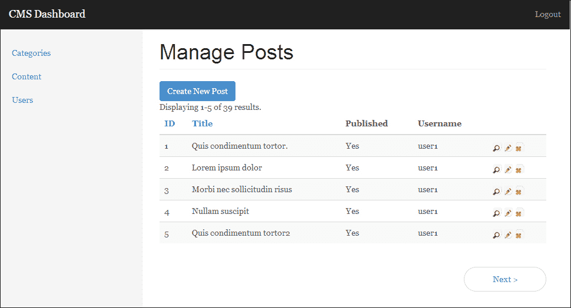
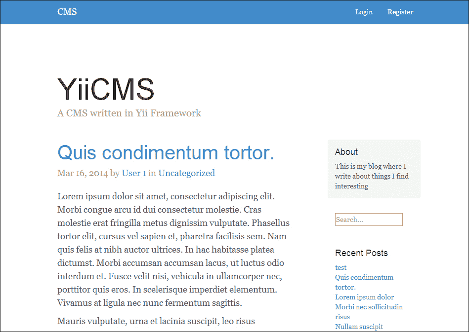
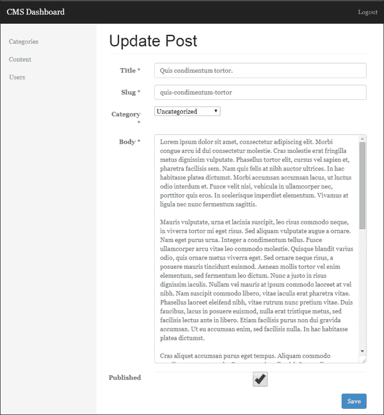
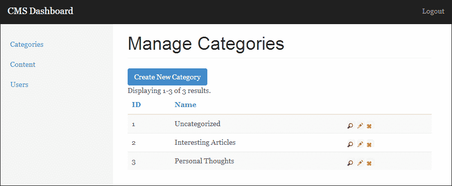
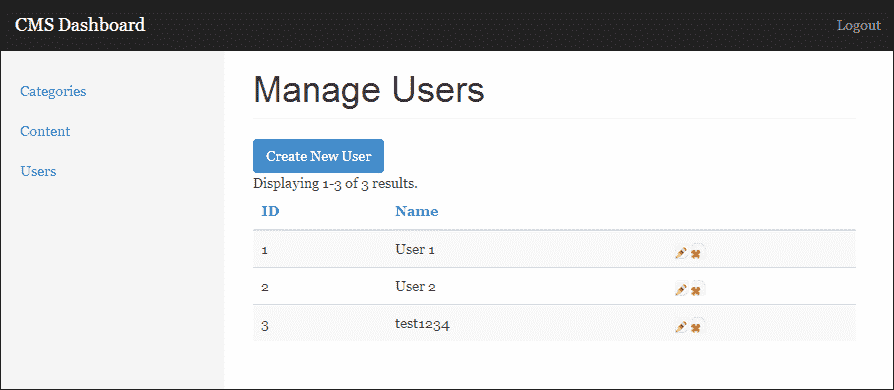
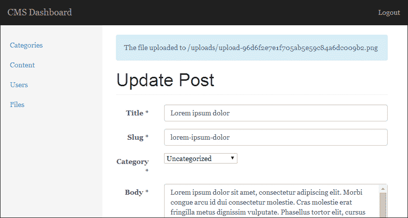
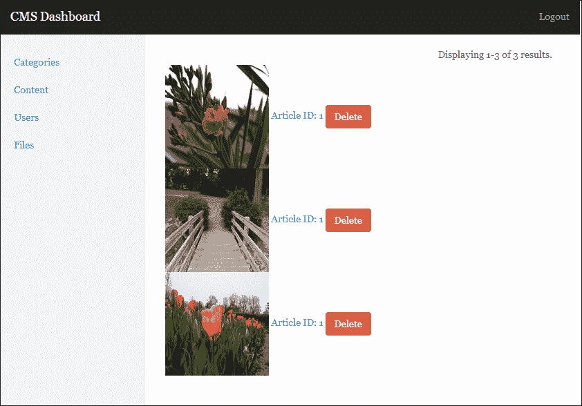

# 第七章 创建 CMS 的管理模块

对于我们的下一个项目，我们将基于我们在第六章中构建的内容管理系统进行扩展，*构建内容管理系统*，通过将管理功能迁移到模块中。将此功能迁移到模块中将使管理行为与应用程序的表示层解耦。此更改还将使我们能够在不修改主应用程序的情况下开发和部署管理更改。

我们完成的项目将如下所示：



# 先决条件

由于我们将扩展我们在第六章中完成的工作，*构建内容管理系统*，本章的唯一先决条件是前一章的完成源代码。您可以自己构建项目，或者可以使用前一章项目资源文件夹中提供的完成源代码。

# 什么是模块？

在 Yii 中，模块是独立的包，它们独立于 Yii 应用程序运行，但必须位于现有应用程序或模块中。模块还可以根据我们的需求与核心应用程序进行不同程度的集成。在许多方面，模块与 Yii 应用程序相同，因为它们都有控制器、模型、视图、配置和组件。这种功能使我们能够独立于主应用程序部署和管理代码。如果我们在多个项目中重用模块，这也为我们提供了更高的可用性。对于我们的应用程序，我们将使用模块仅将应用程序的管理与表示层分离，并独立部署我们的应用程序，而无需修改主应用程序代码。

### 注意

更多关于 Yii 模块的信息可以在官方 Yii 指南中找到，位于[`www.yiiframework.com/doc/guide/1.1/en/basics.module`](http://www.yiiframework.com/doc/guide/1.1/en/basics.module)。

# 描述项目

我们的仪表板模块可以分解为几个组件：

+   初始化和配置仪表板模块

+   启用模块的自定义路由

+   将管理功能从我们的应用程序移出并放入模块中

+   添加文件上传功能

+   模块部署

## 初始化模块

本项目的第一个组件将是创建和配置我们的模块，使其与我们的主要应用程序集成。我们将通过修改主配置文件以及创建我们将使用的模块的基本结构来实现这一点。我们还将介绍如何独立于主应用程序管理我们的模块资源。

## 使用模块进行路由

在 Yii 框架中，默认路由是通过模块名称与在 `CUrlManager` 中指定的默认路由组合来定义的。不幸的是，Yii 并没有提供原生功能来定义我们自己的自定义路由，而无需修改 `CUrlManager` 中指定的路由。为了绕过这个限制，我们将修改我们定义在 第六章，*构建内容管理系统*，中的 `CMSURLManager`，以便我们可以独立于我们的主应用程序存储和配置路由。完成之后，我们将在 `protected/modules/<module>/config/` 文件中有一个 `routes.php` 文件；这将包含我们模块的所有自定义路由，并且将与我们的主应用程序集成，而不会改变应用程序的行为。

## 将管理功能移入模块

本项目的第三个组成部分将涉及将管理功能从我们的控件移动到模块的控制器中。这还将包括将上一章创建的主题中的表示层移动到模块本身中。为了增加安全性和用户体验，我们还将修改我们的模块如何处理未认证用户和未经授权用户的错误。

## 添加文件上传功能

为了使我们的内容管理系统更加灵活，我们还将添加一个文件上传功能，这将允许我们从内容页面上传文件并将它们存储在我们的数据库中。我们还将实现必要的功能，以便在文件管理器中查看这些文件，以及删除它们。

## 模块部署

最后，我们将介绍不同的部署选项，我们可以使用这些选项轻松独立于主应用程序部署我们的模块。通过结合使用 Git 和 Composer，我们可以以对我们所使用的项目类型最有意义的方式部署我们的模块。

# 初始化项目

对于这个项目，我们将从上一章，第六章，*构建内容管理系统*，结束的地方开始。为了您的方便，本章的项目资源文件夹中包含了一个骨架项目，其中包含我们将开始的基础。首先，将源代码复制到一个新文件夹中，并确保它可以在不同的 URL 上访问。在本章中，我将使用 `http://chapter7.example.com` 作为我们的示例 URL。按照上一章提供的说明导入数据库并更新数据库配置后，您应该能看到我们博客的首页：



# 创建模块

现在我们已经设置了应用程序，我们可以开始创建我们的模块。我们将从在 `protected/modules` 目录中创建基本文件夹结构开始：

```php
protected/
   [...]
   modules/
      /dashboard
         assets/
         components/
         config/
         controllers/
         views/
            layouts/
            user/
            category/
            filemanager/
            default/
```

如您所见，我们模块的基本结构与我们的主应用程序相同。有了我们的文件夹结构，我们现在需要创建`DashboardModule`类，这样我们就可以告诉 Yii 它需要加载什么。步骤如下：

1.  首先，在`protected/modules/dashboard`目录下创建一个名为`DashboardModule.php`的新文件，并包含以下定义：

    ```php
    <?php class DashboardModule extends CWebModule {}
    ```

1.  然后，为模块创建一个`init()`方法：

    ```php
    public function init() {}
    ```

1.  在模块中，我们希望设置`layoutPath`，这样我们的模块就知道为我们的视图提供什么布局：

    ```php
    $this->layoutPath = Yii::getPathOfAlias('dashboard.views.layouts');
    ```

1.  我们还希望告诉我们的模块自动导入我们将存储类的`components`目录的内容：

    ```php
    $this->setImport(array(
       'dashboard.components.*',
    ));
    ```

    这将告诉 Yii 的自动加载器自动加载`components`文件夹中的类。这是 Yii 在加载`protected/config/main.php`文件导入部分注册的类时所使用的相同行为。

1.  最后，我们希望为我们的模块设置一些自定义组件——主要是错误处理器——这样我们就可以以不同于主应用程序中发生错误的方式处理模块内的错误：

    ```php
    Yii::app()->setComponents(array(
       'errorHandler' => array(
           'errorAction'  => 'dashboard/default/error',
       )
    ));
    ```

我们接下来需要创建两个新的类；第一个将是一个控制器组件，我们模块中的所有控制器都将从这个组件扩展，第二个将是一个默认控制器，当没有指定路由时将会被访问。在`protected/modules/dashboard/components/`目录下，创建一个名为`DashboardController.php`的新文件，并包含以下定义。一旦我们将模块注册到 Yii 中，我们将会向这个组件添加更多信息：

```php
<?php class DashboardController extends CMSController {}
```

然后，在`protected/modules/dashboard/controllers`目录下创建`DefaultController.php`。我们还将指定我们的`actionIndex()`方法，这样一旦我们将模块注册到 Yii 中，我们就可以看到一些内容：

```php
<?php class DefaultController extends DashboardController
{
   public function actionIndex()
   {
      echo "Hello World!";
   }
}
```

## 在 Yii 中注册模块

在我们能在我们的模块中看到任何内容之前，我们首先需要告诉 Yii 我们的模块。为此，我们只需在`protected/config/main.php`文件中的模块部分指定模块名称：

```php
<?php return array(
   [...]
'modules' => array(
      'dashboard'
),
[...]
);
```

现在，如果您导航到`http://chapter7.example.com/dashboard`，您应该看到显示的文本**Hello World**。这是在 Yii 中注册模块的最简单方法。不幸的是，这种方法要求我们每次想要使用新模块时都要更改我们的配置文件，这意味着每次我们使用新模块时都必须更改应用程序代码。另一种加载我们的模块的方法是创建一个`protected/config/modules.php`文件，并在模块部分注册它。这允许我们简单地更改应用程序外部的缓存设置，而无需修改配置文件中的代码。

为了做到这一点，首先更改`protected/config/`目录下的`main.php`文件中的模块部分，使其看起来如下：

```php
<?php return array(
[...]
'modules' => require_once __DIR__ . DIRECTORY_SEPARATOR . 'modules.php',
[...]
);
```

然后，在 `protected/config/` 中创建一个 `modules.php` 文件。我们将首先声明 `modules` 目录的位置，以及我们的生成配置文件应该缓存的地点：

```php
<?php

// Set the scan directory
$directory = __DIR__ . DIRECTORY_SEPARATOR . '..' . DIRECTORY_SEPARATOR . 'modules';
$cachedConfig = __DIR__.DIRECTORY_SEPARATOR.'..'.DIRECTORY_SEPARATOR.'runtime'.DIRECTORY_SEPARATOR.'modules.config.php';
```

然后，我们将检查是否已存在缓存文件。如果存在，我们将直接返回它：

```php
// Attempt to load the cached file if it exists
if (file_exists($cachedConfig))
    return require_once($cachedConfig);
```

如果缓存文件不存在，我们将遍历 `protected/modules` 目录中的所有文件夹，以检索所有模块名称并将它们推送到一个数组中。由于一些 Yii 模块需要额外的配置，我们将告诉我们的加载器将 `protected/modules/<module>/config/` 中的 `main.php` 中的任何内容注入为模块使用的选项。当我们已经编译出所有要加载的模块列表时，我们将将其作为序列化数组写入我们 `protected/runtime` 目录中的一个文件：

```php
else
{
    // Otherwise generate one, and return it
    $response = array();

    // Find all the modules currently installed, and preload them
    foreach (new IteratorIterator(new DirectoryIterator($directory)) as $filename)
    {
        // Don't import dot files
        if (!$filename->isDot())
        {
            $path = $filename->getPathname();

            if (file_exists($path.DIRECTORY_SEPARATOR.'config'.DIRECTORY_SEPARATOR.'main.php'))
                $response[$filename->getFilename()] = require($path.DIRECTORY_SEPARATOR.'config'.DIRECTORY_SEPARATOR.'main.php');
            else
                array_push($response, $filename->getFilename());
        }
    }

    $encoded = serialize($response);
    file_put_contents($cachedConfig, '<?php return unserialize(\''.$encoded.'\');');

    // return the response
    return $response;
}
```

生成的文件如下所示，并返回到我们的 `protected/config/main.php` 文件：

```php
<?php return unserialize('a:1:{i:0;s:9:"dashboard";}');
```

如果我们想添加一个新模块，我们只需删除 `protected/runtime/` 中的 `module.config.php` 文件。第一次请求系统时，将立即重新生成更新后的文件。

虽然在磁盘操作方面稍微昂贵一些，但这种方法加载模块使我们能够通过将它们添加到 `modules` 目录中，仅通过添加到 `modules` 目录来动态加载 Yii 的模块。它还消除了我们需要对应用程序进行的任何更改，以便添加新模块，这意味着在添加新模块时，我们不太可能向主应用程序引入新的行为或错误。

# 向模块添加自定义路由

虽然 Yii 会免费执行很多模块路由，但我们必须将我们的路由添加到 `protected/config/main.php` 中的 `CUrlManager` 配置中，以便我们的模块有任何自定义路由。虽然执行起来很容易，但这种方法并没有充分地将模块和应用程序配置分离。为了克服 Yii 中的这个限制，我们需要修改我们在上一章中创建的 `CMSUrlManager` 类，以检索我们定义的自定义模块路由。这使得我们可以将路由作为模块的一部分而不是作为应用程序的一部分来编写。步骤如下：

1.  首先在 `protected/modules/dashboard/config/` 中创建一个新的文件，名为 `routes.php`，其中包含以下内容。对于此模块，我们将定义一个自定义路由，以便我们的保存操作可以从以下位置加载：

    ```php
    <?php return array(
       '/dashboard/<controller:\w+>/save' => '/dashboard/<controller>/save',
    );
    ```

    ### 注意

    这个例子纯粹是为了说明如何向模块添加自定义路由，因为 Yii 本身不支持它。

1.  在定义了自定义路由后，我们将更新 `CMSUrlManager` 以自动导入这些规则。打开 `CMSUrlManager.php` 文件，位于 `protected/components/`，并将以下内容添加到 `processRules()` 方法的 `if` 块中：

    ```php
    $this->rules = CMap::mergearray($this->addModuleRules(), $this->rules);
    ```

1.  我们最终将定义一个 `addModuleRules()` 方法，它将在所有已安装的模块中搜索 `config/` 下的 `routes.php` 文件，并将它们注册到 Yii 中：

    ```php
    private function addModuleRules()
    {
        // Load the routes from cache
        $moduleRoutes = array();
        $directories = glob(Yii::getPathOfAlias('application.modules') . '/*' , GLOB_ONLYDIR);

        foreach ($directories as $dir)
        {
            $routePath = $dir .DS. 'config' .DS. 'routes.php';
            if (file_exists($routePath))
            {
                $routes = require_once($routePath);
                foreach ($routes as $k=>$v)
                    $moduleRoutes[$k] = $v;
            }
        }

        return $moduleRoutes;
    }
    ```

现在，我们的仪表板模块将能够处理非标准路由，而无需更新主应用程序内的配置文件。

# 创建控制器

现在我们已经将应用程序注册到 Yii 并定义了自定义路由，我们可以开始处理控制器。首先，我们应该处理 `DashboardController` 组件，以便我们的控制器自动继承一些常见的行为。步骤如下：

1.  在我们的 `DashboardController.php` 组件中，我们首先应该定义我们的 `accessRules()` 方法。这将确保只有管理员可以访问仪表板：

    ```php
    public function filters()
    {
       return array(
          'accessControl'
       );
    }

    public function accessRules()
    {
       return array(
          array('allow',  // allow authenticated admins to perform any action
             'users'=>array('@'),
          ),
          array('deny',  // deny all users
             'users'=>array('*'),
             'deniedCallback' => array($this, 'actionError')
          ),
       );
    }
    ```

1.  接下来，我们将定义我们将在整个模块中使用的 `default` 布局：

    ```php
    public $layout='default';
    ```

1.  然后，我们将创建一个自定义错误操作，这将阻止未经认证的用户和未经授权的用户访问我们的模块。默认情况下，如果 Yii 遇到未经授权的错误，它将简单地返回一个 403 错误。我们的错误操作将通过将未经认证的用户重定向到登录页面（带有下一个 `$_GET` 参数，以便他们在认证后可以返回他们想要去的确切页面）来提高用户体验。另一方面，如果用户只是未经授权，它将显示适当的错误并拒绝他们访问：

    ```php
    public function actionError()
    {
        if (Yii::app()->user->isGuest)
           return $this->redirect($this->createUrl('/site/login?next=' . Yii::app()->request->requestUri));

        if($error=Yii::app()->errorHandler->error)
        {
            if(Yii::app()->request->isAjaxRequest)
                echo $error['message'];
            else
                $this->render('error', array('error' => $error));
        }
    }
    ```

1.  要完成这个任务，请重定向 `$_GET` 参数。我们还需要修改位于 `protected/controllers/` 的 `SiteController.php` 文件，以便它知道如何处理该参数。只需将重定向替换为以下内容：

    ```php
    $this->redirect(Yii::app()->request->getParam('next', $this->createAbsoluteUrl('content/index')));
    ```

1.  最后，我们需要实现一种独立于主应用程序管理我们资产的方法。许多模块实现简单地将资产添加到全局可用的 `assets` 文件夹中。这种实现方式使得确保所有模块痕迹都被移除变得非常困难。管理模块资产的一个更简单的方法是为所有我们的模块特定资产创建一个文件夹，然后，使用 `CAssetManager` 独立于我们的应用程序发布该文件夹。这样，如果我们对模块资产进行任何更改，它们都不会影响我们的主应用程序。在我们的 `SiteController` 中，我们应该定义以下方法：

    ```php
    public function getAsset()
    {
       return Yii::app()->assetManager->publish(YiiBase::getPathOfAlias('application.modules.dashboard.assets'), true, -1, YII_DEBUG);
    }
    ```

    由于此方法是一个获取器，并且它返回资产发布的路径，因此我们可以从布局文件中调用它，如下所示（使用应从项目资源文件夹复制到模块 `assets` 文件夹的 `dashboard.css` 文件）：

    ```php
    Yii::app()->clientScript->registerCssFile($this->getAsset().'/dashboard.css');
    ```

# 将功能迁移到模块

现在我们已经设置了模块，我们可以开始将应用程序控制器和主题中的功能移动到仪表板模块中。我们将讨论每个模型所需的所有内容：分类、内容和用户。

## 迁移内容管理

在下一节中，我们将把上一章中构建的所有管理功能迁移到我们的新模块中：

1.  从我们的`ContentController`开始，我们首先希望从`protected/controllers/`中的`ContentController.php`文件中删除`actionAdmin()`、`actionSave()`和`actionDelete()`方法。

1.  接下来，我们应该从我们的`ContentController`中删除我们刚刚删除的操作的访问控制属性。恢复的`accessRules()`方法应如下所示：

    ```php
    public function accessRules()
    {
       return array(
          array('allow',
             'actions' => array('index', 'view', 'search'),
             'users' => array('*')
          ),
          array('deny',  // deny all users
             'users'=>array('*'),
          ),
       );
    }
    ```

1.  在我们的`ContentController`去除了管理行为之后，我们可以开始将功能移动到`protected/modules/dashboard/controllers/`中的`DefaultController.php`文件，我们将使用它作为我们的`ContentController`。我们将首先将我们的`accessRules()`方法添加到`DefaultController`中。由于我们希望继承在`components/`中定义的`DashboardController.php`中的规则，我们将使用`CMap::mergeArray()`来合并父规则与我们的新定义的规则：

    ### 注意

    命名约定让你感到困惑吗？如果你不想在`DefaultController`中存储与内容相关的功能，你可以在`DashboardModule`中设置`$defaultController`属性为`content`。这将覆盖 Yii 的默认行为。

    ```php
    public function accessRules()
    {
       return CMap::mergeArray(parent::accessRules(), array(
          array('allow',
             'actions' => array('index', 'save', 'delete'),
             'users'=>array('@'),
             'expression' => 'Yii::app()->user->role==2'
          ),
          array('deny',  // deny all users
             'users'=>array('*'),
          )
       ));
    }
    ```

1.  然后，我们将重新定义我们的`loadModel()`方法：

    ```php
    private function loadModel($id=NULL)
    {
       if ($id == NULL)
          throw new CHttpException(404, 'No category with that ID exists');

       $model = Content::model()->findByPk($id);

       if ($model == NULL)
          throw new CHttpException(404, 'No category with that ID exists');

       return $model;
    }
    ```

1.  然后，我们将定义我们的`actionDelete()`方法：

    ```php
    public function actionDelete($id)
    {
       $this->loadModel($id)->delete();

       $this->redirect($this->createUrl('/dashboard'));
    }
    ```

1.  然后，我们将编写一个索引方法来显示数据库中的所有内容条目：

    ```php
    public function actionIndex()
    {
       $model = new Content('search');
       $model->unsetAttributes();

       if (isset($_GET['Content']))
          $model->attributes = $_GET;

       $this->render('index', array(
          'model' => $model
       ));
    }
    ```

1.  最后，我们将编写一个方法来创建新的内容条目和编辑现有内容条目：

    ```php
    public function actionSave($id=NULL)
    {
       if ($id == NULL)
          $model = new Content;
       else
          $model = $this->loadModel($id);

       if (isset($_POST['Content']))
       {
          $model->attributes = $_POST['Content'];
          $model->author_id = Yii::app()->user->id;

          if ($model->save())
          {
             Yii::app()->user->setFlash('info', 'The articles was saved');
             $this->redirect($this->createUrl('/dashboard'));
          }
       }

       $this->render('save', array(
          'model' => $model
       ));
    }
    ```

1.  接下来，我们应该将位于`protected/modules/dashboard/views/default/`的`save.php`文件从我们的项目资源文件夹复制到我们的模块中。如果你还没有这样做，请将位于`protected/modules/dashboard/views/layouts/`的`default.php`布局文件复制到你的项目中。

1.  最后，我们需要确保我们的`index`视图文件已正确更新，以便它链接到适当的控制器操作。如果你只是简单地从主题文件中复制视图，你会注意到没有任何链接是有效的。为了纠正这些链接，我们需要更新我们的`createUrl`调用，使其指向我们模块的`DefaultController`中的`save()`方法，并更新`CButtonColumn`链接，使其指向我们的模块：

    ```php
    <?php echo CHtml::link('Create New Post', $this->createUrl('/dashboard/default/save'), array('class' => 'btn btn-primary')); ?>
    <?php $this->widget('zii.widgets.grid.CGridView', array(
        'dataProvider'=>$model->search(),
        'htmlOptions' => array(
            'class' => 'table-responsive'
        ),
        'itemsCssClass' => 'table table-striped',
        'columns' => array(
           'id',
           'title',
           'published' => array(
              'name' => 'Published',
              'value' => '$data->published==1?"Yes":"No"'
           ),
           'author.username',
           array(
                'class'=>'CButtonColumn',
                'viewButtonUrl'=>'Yii::app()->createUrl("/".$data["slug"])',
                'deleteButtonUrl'=>'Yii::app()->createUrl("/dashboard/default/delete", array("id" =>  $data["id"]))',
                'updateButtonUrl'=>'Yii::app()->createUrl("/dashboard/default/save", array("id" =>  $data["id"]))',
            ),
        ),
        'pager' => array(
           'htmlOptions' => array(
              'class' => 'pager'
           ),
           'header' => '',
           'firstPageCssClass'=>'hide',
           'lastPageCssClass'=>'hide',
           'maxButtonCount' => 0
        )
    ));
    ```

现在我们已经完成，我们将能够从单个界面查看我们 CMS 中的所有文章，删除它们，编辑它们，并导航到前端视图，如下面的截图所示：



## 分类迁移

我们的用户和分类控制器的更改将非常相似——让我们逐一处理。步骤如下：

1.  从我们的`CategoryController`开始，我们首先希望从`protected/controllers/`中的`CategoryController.php`文件中删除`actionAdmin()`、`actionSave()`和`actionDelete()`方法。

1.  接下来，我们应该从我们的`CategoryController`中删除我们刚刚删除的操作的访问控制属性。恢复的`accessRules()`方法应如下所示：

    ```php
    public function accessRules()
    {
       return array(
          array('allow',
             'actions' => array('index', 'view', 'search'),
             'users' => array('*')
          ),
          array('deny',  // deny all users
             'users'=>array('*'),
          ),
       );
    }
    ```

1.  我们在`protected/modules/dashboard/controllers/`目录下的`CategoryController.php`文件中的新`accessRules()`方法将如下所示：

    ```php
    public function accessRules()
    {
       return CMap::mergeArray(parent::accessRules(), array(
          array('allow',
             'actions' => array('index', 'save', 'delete'),
             'users'=>array('@'),
             'expression' => 'Yii::app()->user->role==2'
          ),
          array('deny',  // deny all users
             'users'=>array('*'),
          )
       ));
    }
    ```

1.  接下来，我们将使用更新的重定向重新实现所有管理操作，从我们的`actionIndex()`方法开始：

    ```php
    public function actionIndex()
    {
       $model = new Category('search');
       $model->unsetAttributes();

       if (isset($_GET['Category']))
          $model->attributes = $_GET;

       $this->render('index', array(
          'model' => $model
       ));
    }
    ```

1.  然后，我们将重新实现保存方法并修改它以在我们的模块中工作：

    ```php
    public function actionSave($id=NULL)
    {
       if ($id == NULL)
          $model = new Category;
       else
          $model = $this->loadModel($id);

       if (isset($_POST['Category']))
       {
          $model->attributes = $_POST['Category'];

          if ($model->save())
          {
             Yii::app()->user->setFlash('info', 'The category was saved');
             $this->redirect($this->createUrl('/dashboard/category'));
          }
       }

       $this->render('save', array(
          'model' => $model
       ));
    }
    ```

1.  然后，我们在我们的模块中重新实现删除方法并更新重定向：

    ```php
    public function actionDelete($id)
    {
       $this->loadModel($id)->delete();

       $this->redirect($this->createUrl('/dashboard/category'));
    }
    ```

1.  最后，我们将更新`loadModel()`方法，使其在没有我们的模块的情况下也能工作：

    ```php
    private function loadModel($id=NULL)
    {
       if ($id == NULL)
          throw new CHttpException(404, 'No category with that ID exists');

       $model = Category::model()->findByPk($id);

       if ($model == NULL)
          throw new CHttpException(404, 'No category with that ID exists');

       return $model;
    }
    ```

1.  然后，将位于`protected/modules/dashboard/views/category/`的`index.php`视图文件和位于`protected/modules/dashboard/views/category/`的`save.php`视图文件从项目资源文件夹复制到我们的模块中。

1.  注意，我们再次更新了我们的`CButtonColumn`链接，使其指向我们的模块而不是之前定义的首页路由：

    ```php
    array(
        'class'=>'CButtonColumn',
        'viewButtonUrl'=>'Yii::app()->createUrl("/".$data["slug"])',
       'deleteButtonUrl'=>'Yii::app()->createUrl("/dashboard/category/delete", array("id" =>  $data["id"]))',
       'updateButtonUrl'=>'Yii::app()->createUrl("/dashboard/category/save", array("id" =>  $data["id"]))',
    ),
    ```

我们最终的分类管理界面将如下所示，并且其行为将与我们的内容管理界面完全相同：



## 实现用户管理

在上一章中，我们没有实现用户管理的 UI；现在让我们继续实现这个功能，以便我们的仪表板模块完全包含所有管理功能。步骤如下：

1.  首先，在`protected/modules/dashboard/controllers`中创建一个新的控制器`UserController.php`，其定义如下：

    ```php
    <?php class UserController extends DashboardController {}
    ```

1.  接下来，我们将为这个控制器定义我们的`accessRules()`方法：

    ```php
    public function accessRules()
    {
       return CMap::mergeArray(parent::accessRules(), array(
          array('allow',
             'actions' => array('index', 'save', 'delete'),
             'users'=>array('@'),
             'expression' => 'Yii::app()->user->role==2'
          ),
          array('deny',  // deny all users
             'users'=>array('*'),
          )
       ));
    }
    ```

1.  然后，我们将实现一个`loadModel()`实用方法：

    ```php
    private function loadModel($id=NULL)
    {
       if ($id == NULL)
          throw new CHttpException(404, 'No category with that ID exists');

       $model = User::model()->findByPk($id);

       if ($model == NULL)
          throw new CHttpException(404, 'No category with that ID exists');

       return $model;
    }
    ```

1.  接下来，我们将更新我们的删除操作，使其在我们的模块内正确重定向：

    ```php
    public function actionDelete($id)
    {
       $this->loadModel($id)->delete();

       $this->redirect($this->createUrl('/dashboard/user'));
    }
    ```

1.  然后，我们将重新实现索引操作，以显示所有用户的列表：

    ```php
    public function actionIndex()
    {
       $model = new User('search');
       $model->unsetAttributes();

       if (isset($_GET['User']))
          $model->attributes = $_GET;

       $this->render('index', array(
          'model' => $model
       ));
    }
    ```

1.  最后，我们将我们的保存方法迁移到我们的模块中。由于我们已经将用户行为的核心功能实现到了我们的`User`模型类中，因此我们的`actionSave()`方法的实现非常直接：

    ```php
    public function actionSave($id=NULL)
    {
       if ($id == NULL)
          $model = new User;
       else
          $model = $this->loadModel($id);

       if (isset($_POST['User']))
       {
          $model->attributes = $_POST['User'];

          if ($model->save())
          {
             Yii::app()->user->setFlash('info', 'The user was saved');
             $this->redirect($this->createUrl('/dashboard/user'));
          }
       }

       $this->render('save', array(
          'model' => $model
       ));
    }
    ```

1.  最后，将位于`protected/modules/dashboard/views/user/`的`index.php`视图文件和位于`protected/modules/dashboard/views/user/`的`save.php`视图文件从项目资源文件夹复制到您的应用程序中。再次强调，我们得到的界面与我们的内容和分类管理界面完全相同：

# 上传文件

我们将向我们的模块添加的最后一个组件是一个具有文件上传功能的文件管理器。对于这个组件，我们将创建一个专门的控制器来以分页格式查看所有上传的文件，创建几个新类来处理实际的文件上传，并对内容保存视图进行一些修改，以便我们可以将文件与特定的文章关联起来。

我们不会将所有这些功能打包到我们将要构建的 `FileController` 中，而是先构建三个不同的组件来处理上传文件的不同方面。第一个类 `File` 将代表 `$_FILES['file']` 对象，并提供保存文件的函数。第二个类 `FileUpload` 将是我们上传文件的调用点，并将适当的数据库返回给我们。最后一个类 `FileUploader` 将处理 `File` 和 `FileUpload` 类之间的交互。这三个类将确保我们的 `FileController` 类保持简洁，并将使文件上传变得极其容易。

## 创建 File 类

我们将首先创建 `File` 类，这是一个简单的对象，代表 `$_FILES['file']`，我们将通过 `POST` 请求发送它。在 `protected/modules/dashboard/components/` 中创建 `File.php` 文件：

```php
<?php

class File {
    public function save($path)
    {
        if (!move_uploaded_file($_FILES['file']['tmp_name'], $path))
            return false;

        return true;
    }

    public function __get($name)
    {
        if (isset($_FILES['file'][$name]))
            return $_FILES['file'][$name];

        return NULL;
    }
}
```

为了简化，我们将把所有文件存储在我们的主应用程序根目录下的 `/uploads` 目录中。现在就创建这个文件夹，并确保您的 web 服务器有写入权限。

## 创建 FileUploader 类

我们接下来要构建的类是 `FileUploader` 类。这个类将处理验证，并调用我们刚刚创建的 `File` 类，以便将文件保存到上传目录。步骤如下：

1.  从 `FileUploader.php` 文件开始，该文件位于 `protected/modules/dashboard/components/`：

    ```php
    <?php class FileUploader {}
    ```

1.  然后，定义一些私有属性作为验证器使用：

    ```php
    private $allowedExtensions = array(
        'png',
        'jpeg',
        'jpg',
        'gif',
        'bmp'
    );

    private $sizeLimit = 10485760;

    private $file;
    ```

1.  接下来，我们将为这个新对象创建一个构造函数，该构造函数将为验证器设置一些基本变量，并使用 `$_FILES['file']` 数组创建 `File` 对象：

    ```php
    function __construct(array $allowedExtensions = array(), $sizeLimit = 10485760)
    {
        $allowedExtensions = array_map("strtolower", $allowedExtensions);

        If (!empty($allowedExtensions))
            $this->allowedExtensions = $allowedExtensions;
        $this->sizeLimit = $sizeLimit;

        $this->checkServerSettings();

        $this->file = false;
        if (isset($_FILES['file']))
           $this->file = new File();
    }
    ```

1.  接下来，我们将创建之前定义的 `checkServerSettings()` 方法。这将确保我们不会尝试上传大于我们 `php.ini` 文件中定义的文件：

    ```php
    private function checkServerSettings()
    {
        $postSize = $this->toBytes(ini_get('post_max_size'));
        $uploadSize = $this->toBytes(ini_get('upload_max_filesize'));

        if ($postSize < $this->sizeLimit || $uploadSize < $this->sizeLimit){
            $size = max(1, $this->sizeLimit / 1024 / 1024) . 'M';
            $json = CJSON::encode(array(
                'error' => 'increase post_max_size and upload_max_filesize'
            ));
            die($json);
        }
    }
    ```

1.  最后，我们将创建验证器，以确保文件符合我们之前设置的限制。这个类最终将返回一个数组到我们即将创建的 `FileUpload` 类：

    ```php
    private function toBytes($str)
    {
        $val = trim($str);
        $last = strtolower($str[strlen($str)-1]);
        switch($last)
        {
            case 'g': $val *= 1024;
            case 'm': $val *= 1024;
            case 'k': $val *= 1024;
        }
        return $val;
    }

    public function handleUpload($uploadDirectory, $replaceOldFile = FALSE)
    {
        if (!is_writable($uploadDirectory))
            return array('error' => "Server error. Upload directory isn't writable.");

        if (!$this->file)
            return array('error' => 'No files were uploaded.');

        $size = $this->file->size;

        if ($size == 0)
            return array('error' => 'File is empty');

        $pathinfo = pathinfo($this->file->name);
        $filename = $pathinfo['filename'];

        //$filename = md5(uniqid());
        $ext = $pathinfo['extension'];

        if(!in_array(strtolower($ext), $this->allowedExtensions))
        {
            $these = implode(', ', $this->allowedExtensions);
            return array('error' =>"File has an invalid extension");
        }

        $filename = 'upload-'.md5($filename);

       if(!$replaceOldFile)
        {
            /// don't overwrite previous files that were uploaded
            while (file_exists($uploadDirectory . $filename . '.' . $ext))
                $filename .= rand(10, 99);
        }

        if ($this->file->save($uploadDirectory . $filename . '.' . $ext))
            return array('success'=>true,'filename'=>$filename.'.'.$ext);
        else
            return array('error'=> 'Could not save uploaded file. The upload was cancelled, or server error encountered');
    }
    ```

## 创建 FileUpload 类

我们将要创建的最后一个组件是 `FileUpload` 类，它将在我们的 `FileUploader` 类和 `FileController` 类之间充当中间件：

1.  开始创建 `FileUpload.php` 文件，位于 `protected/modules/dashboard/components/`，以下定义：

    ```php
    <?php class FileUpload {}
    ```

1.  然后，声明一些属性和构造函数：

    ```php
    private $_id = NULL;

    private $_response = NULL;

    public $_result = array();

    public function __construct($id)
    {
       $this->_id = $id;
        $this->_uploadFile();
    }
    ```

1.  然后，我们将创建我们构造函数中调用过的 `_uploadFile()` 方法。这个方法将实例化一个 `FileUploader` 对象，并在将其传递给我们的 `ContentMetadata` 对象（我们将在此对象中存储文件的引用）之前执行上传操作：

    ```php
    private function _uploadFile()
    {
        $path = '/';
        $folder = Yii::app()->getBasePath() .'/../uploads' . $path;

        $sizeLimit = Yii::app()->params['max_fileupload_size'];
        $allowedExtensions = array('jpg', 'jpeg', 'png', 'gif', 'bmp');
        $uploader = new FileUploader($allowedExtensions, $sizeLimit);

        $this->_result = $uploader->handleUpload($folder);

        if (isset($this->_result['error']))
            throw new CHttpException(500, $this->_result['error']);
        return $this->_handleResourceUpload('/uploads/' . $this->_result['filename']);
    }
    ```

1.  最后，我们将创建 `_handleResourceUpload()` 方法。此方法将接收 `FileUploader` 对象返回的响应对象，如果文件成功上传，将上传文件的文件名存储到我们的数据库中，以便我们轻松管理。它还将特定文件链接到给定文章：

    ```php
    private function _handleResourceUpload($value)
    {
      if ($this->_result['success'] == true)
        {
            $meta = ContentMetadata::model()->findbyAttributes(array('content_id' => $this->_id, 'key' => $this->_result['filename']));

            if ($meta == NULL)
                $meta = new ContentMetadata;

            $meta->content_id = $this->_id;
            $meta->key = $this->_result['filename'];
            $meta->value = $value;
            if ($meta->save())
            {
                $this->_result['filepath'] = $value;
                return $this->_result;
            }
            else
                throw new CHttpException(400,  'Unable to save uploaded image.');
        }
        else
        {
            return htmlspecialchars(CJSON::encode($this->_result), ENT_NOQUOTES);
            throw new CHttpException(400, $this->_result['error']);
        }
    }
    ```

## 创建文件管理器的控制器

现在我们已经实现了上传文件的功能，我们需要创建管理它的控制器动作。我们将创建三个单独的动作：一个 `index` 动作，其中可以查看所有文件及其关联；一个 `delete` 动作；以及一个 `upload` 动作。步骤如下：

1.  首先，在 `protected/modules/dashboard/controllers` 中创建名为 `FileController` 的类，其定义如下：

    ```php
    <?php class FileController extends DashboardController {}
    ```

1.  然后，我们将定义 `accessRules()` 方法：

    ```php
    public function accessRules()
    {
       return CMap::mergeArray(parent::accessRules(), array(
          array('allow',
             'actions' => array('index', 'upload', 'delete'),
             'users'=>array('@'),
             'expression' => 'Yii::app()->user->role==2'
          ),
          array('deny',  // deny all users
             'users'=>array('*'),
          )
       ));
    }
    ```

1.  接下来，我们将定义我们的 `index` 动作，这将允许我们查看上传到我们 CMS 的所有文件。由于我们的 `ContentMetadata` 表可能包含其他属性，我们只会在具有上传键的项上进行搜索：

    ```php
    public function actionIndex()
    {
       $model = new ContentMetadata('search');
       $model->unsetAttributes();
       $model->key = 'upload';

       if (isset($_GET['ContentMetadata']))
          $model->attributes = $_GET;

       $this->render('index', array(
          'model' => $model
       ));
    }
    ```

1.  然后，我们将创建一个 `upload` 动作，该动作将调用我们的 `FileUpload` 类。在上传文件或出现错误后，该动作将使用相对 URI 或来自我们的 `FileUploader` 类的实用错误消息将用户重定向到他们原来的位置：

    ```php
    public function actionUpload($id = NULL)
    {
       if ($id == NULL)
          throw new CHttpException(400, 'Missing ID');

       if (isset($_FILES['file']))
       {
          $file = new FileUpload($id);

          if ($file->_result['success'])
             Yii::app()->user->setFlash('info', 'The file uploaded to ' . $file->_result['filepath']);
          elseif ($file->_result['error'])
             Yii::app()->user->setFlash('error', 'Error: ' . $file->_result['error']);

       }
       else
          Yii::app()->user->setFlash('error', 'No file detected');

       $this->redirect($this->createUrl('/dashboard/default/save?id='.$id));
    }
    ```

1.  然后，我们将创建一个 `loadModel()` 方法和删除动作来从我们的数据库中删除文件：

    ```php
    public function actionDelete($id)
    {
       if ($this->loadModel($id)->delete())
       {
          Yii::app()->user->setFlash('info', 'File has been deleted');
          $this->redirect($this->createUrl('/dashboard/file/index'));
       }

       throw new CHttpException(500, 'The server failed to delete the requested file from the database. Please retry');
    }

    private function loadModel($id=NULL)
    {
       if ($id == NULL)
          throw new CHttpException(400, 'Missing ID');

       $model = ContentMetadata::model()->findByAttributes(array('id' => $id));
       if ($model == NULL)
          throw new CHttpException(400, 'Object not found');

       return $model;
    }
    ```

1.  然后，我们将继续创建文件管理器的视图。我们将首先创建一个索引视图，它将包含一个 `CListView` 容器，使我们能够轻松浏览我们的图片。将以下内容添加到位于 `protected/modules/dashboard/views/file/` 的 `index.php`：

    ```php
    <?php $this->widget('zii.widgets.CListView', array(
        'dataProvider'=>$model->search(),
        'itemView'=>'_file',
    ));
    ```

1.  我们还将创建位于 `protected/modules/dashboard/views/file/` 的相应 `itemView` 文件，名为 `_file.php`：

    ```php
    <div class="file">
       <a href="<?php echo $data->value; ?>">value; ?>" style="width: 150px; height: 150px;"/></a>
       <?php echo CHtml::link('Article ID: '. $data->content_id, $this->createUrl('/dashboard/default/save', array('id' => $data->content_id))); ?>
       <?php echo CHtml::link('Delete', $this->createUrl('/dashboard/file/delete', array('id' => $data->id)), array('class' => 'btn btn-danger')); ?>
    </div>
    ```

1.  最后，我们需要更新 `protected/modules/dashboard/views/default/` 中的 `save.php`，以便添加文件上传表单，以便上传文件：

    ```php
    <?php if (!$model->isNewRecord): ?>
        <hr />
        <?php $form=$this->beginWidget('CActiveForm', array(
            'id'=>'file-upload-form',
            'action' => $this->createUrl('/dashboard/file/upload', array('id' => $model->id)),
            'htmlOptions' => array(
                'class' => 'form-horizontal',
                'role' => 'form',
                'enctype'=>'multipart/form-data'

            )
        )); ?>
            <div class="form-group">
                <div class="col-sm-10">
                    <input type="file" name="file" />
                </div>
            </div>

            <div class="row buttons">
                <?php echo CHtml::submitButton('Upload file', array('class' => 'btn btn-primary pull-right col-md-offset-1')); ?>
            </div>

        <?php $this->endWidget(); ?>
    <?php endif; ?>
    ```

现在，如果您从内容保存屏幕上传文件，文件 URL 将返回给您，以便您将其添加到您的文章中：



此外，如果您想查看上传到 CMS 的所有文件，或者您想删除一个文件，您可以在您的网页浏览器中导航到 `http://chapter7.example.com/dashboard/files`，或者在 `protected/modules/dashboard/views/layouts/` 中的 `default.php` 文件侧边栏中添加一个链接，如下面的截图所示：



# 部署我们应用程序的策略

我们应该讨论的最后一个话题是我们希望如何将我们的新模块与应用程序一起部署。我们可以使用几种不同的部署策略，每种策略都有其自身的优缺点。在下一节中，我们将讨论几种不同策略的利弊。当您准备将模块与应用程序一起部署时，请务必仔细考虑您希望模块和应用程序如何集成。

## 作为应用程序部署

我们可以使用的最简单的部署策略是将我们的模块源代码直接提交到我们的主应用程序。当部署应用程序的时间到来时，我们的模块会自动包含在内。虽然这种方法非常简单和基本，但它有几个缺点。

首先也是最重要的，它将我们的模块状态与应用程序的状态绑定在一起，这使得我们在部署应用程序时无意中引入错误或不完整的特性的可能性更大。第二个缺点是它将我们的模块在任何给定时间的状态紧密耦合到我们的应用程序上。最后一个缺点是它使得独立于我们的应用程序部署模块更新变得非常困难。

## 作为子模块部署

第二种部署策略是将我们的模块代码提交到一个完全独立的仓库，并将其作为子模块包含到我们的项目中。这种方法不仅确保我们的项目获取到最新的代码，而且还确保我们的模块代码和应用代码得到适当的分离。使用子模块的替代方案是，每次我们想要运行部署时，简单地将模块仓库克隆到`protected/modules`目录。虽然这种方法很简单，但它确实增加了我们应用程序的复杂性，并要求我们深入了解 Git 子模块。此外，在确保部署不会导致停机的情况下，自动化此过程比较困难。

## 作为 Composer 依赖项部署

第三个策略是为我们的模块创建一个完全独立的仓库，将其作为 Composer 依赖项包含到我们的项目中，并使用`composer/installers`包确保模块被放置在正确的目录。虽然这种方法比其他策略复杂得多，但它确保我们的模块和应用代码保持分离。它还有将部署相关任务移回应用程序而不是模块的优点。

# 摘要

我们讨论了大量关于模块操作和克服它们的一些限制的信息。我们讨论了如何创建模块，如何将其与我们的应用程序集成，如何处理模块的自定义路由，如何将管理功能从常规的 Yii 应用程序迁移到我们的模块，我们还向我们的 CMS 添加了文件管理和上传功能。此外，我们还讨论了将我们的模块与应用程序一起部署的不同策略。

在下一章中，我们将为我们的应用程序创建一个 API 模块，该模块将允许网络服务和本地应用程序连接到我们的 CMS。我们将扩展本章所涵盖的主题，同时也会介绍如何覆盖几个核心 Yii 组件，使我们的 API 更加灵活且易于开发。

在继续下一章之前，请务必查阅[`www.yiiframework.com/doc/api/`](http://www.yiiframework.com/doc/api/)上的 Yii 类参考，并回顾本章中我们使用到的所有类。
