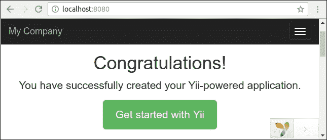
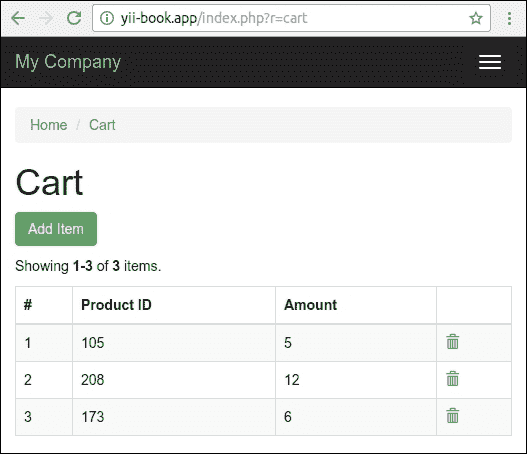
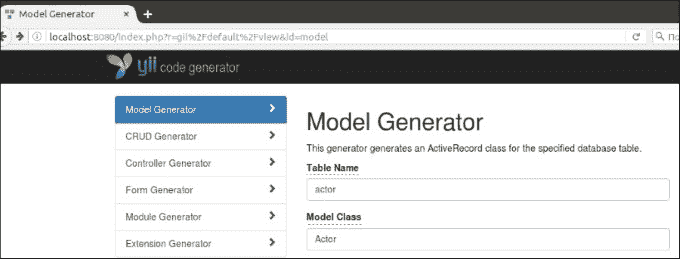
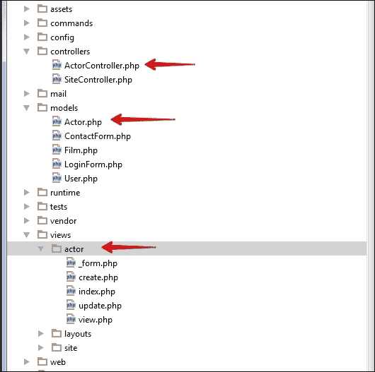
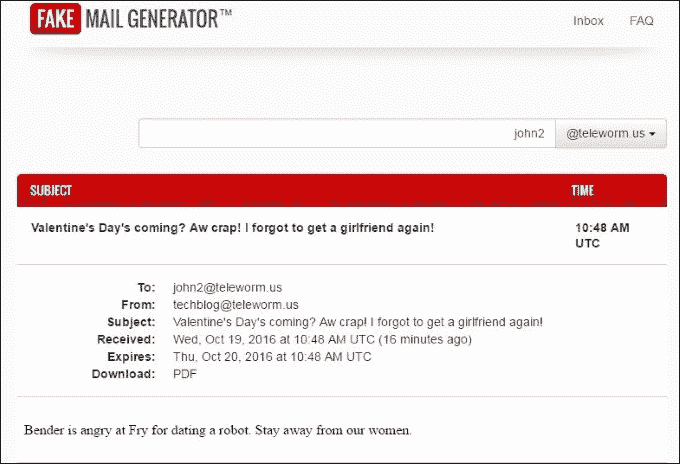
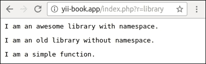

# 第一章. 基础知识

在本章中，我们将涵盖以下主题：

+   安装框架

+   应用模板

+   依赖注入容器

+   服务定位器

+   代码生成

+   配置组件

+   处理事件

+   使用外部代码

# 简介

在本章中，我们将介绍如何安装 Yii 框架以及可能的安装技术。我们将向您介绍应用模板：基本和高级模板及其之间的区别。然后您将了解依赖注入容器。本章包含有关模型事件的信息，这些事件在执行某些操作（如模型保存、更新等）后触发。我们将学习如何使用外部代码，包括 ZendFramework、Laravel 或 Symfony。我们还将学习如何逐步将基于 `yii-1.x.x` 的应用程序更新到 `yii2`。

# 安装框架

Yii2 是一个现代的 PHP 框架，以 Composer 包的形式提供。在本教程中，我们将通过 Composer 包管理器安装该框架，并配置应用程序的数据库连接。

## 准备工作

首先，在您的系统上安装 Composer 包管理器。

### 注意

**注意**：如果您在 Windows 上使用 OpenServer 应用程序，那么 `composer` 命令已经在 OpenServer 终端中存在。

在 Mac 或 Linux 系统中，从 [`getcomposer.org/download/`](https://getcomposer.org/download/) 下载安装程序，并使用以下命令全局安装：

```php
sudo php composer-setup.php --install-dir=/usr/local/bin --filename=composer

```

在 Windows 系统中，从 [`getcomposer.org/doc/00-intro.md`](https://getcomposer.org/doc/00-intro.md) 页面下载并运行 `Composer-Setup.exe`。

如果您没有系统管理员权限，那么作为替代方案，您可以只下载 [`getcomposer.org/composer.phar`](https://getcomposer.org/composer.phar) 原始文件，并使用 `php composer.phar` 调用代替单个的 `composer` 命令。

安装完成后，在您的终端中运行：

```php
composer

```

或者（如果您只是下载了存档），其替代方案：

```php
php composer.phar

```

当安装成功时，您将看到以下响应：

```php
   ______
  / ____/___  ____ ___  ____  ____  ________  _____
 / /   / __ \/ __ '__ \/ __ \/ __ \/ ___/ _ \/ ___/
/ /___/ /_/ / / / / / / /_/ / /_/ (__  )  __/ /
\____/\____/_/ /_/ /_/ .___/\____/____/\___/_/
                    /_/
Composer version 1.2.0 2016-07-18 11:27:19
```

目前您可以从 [`packagist.org`](https://packagist.org) 仓库安装任何包。

## 如何操作…

您可以安装基本或高级应用模板。为了了解模板之间的区别，请参阅 *应用模板* 部分的说明。

### 注意

注意，在安装过程中，Composer 包管理器从 GitHub 网站获取大量信息。GitHub 可能会限制匿名用户的请求。在这种情况下，Composer 会要求您输入您的访问令牌。您只需注册 [`github.com`](https://github.com) 网站，并通过 [`github.com/blog/1509-personal-api-tokens`](https://github.com/blog/1509-personal-api-tokens) 指南生成新的令牌即可。

### 安装基本项目模板

执行以下步骤以安装基本项目模板：

1.  作为第一步，打开您的终端并安装 **Bower-to-Composer** 适配器：

    ```php
    composer global require "fxp/composer-asset-plugin:¹.2.0"

    ```

    它提供了一种简单的方法，可以从 Bower 仓库加载相关的非 PHP 包（JavaScript 和 CSS）。

1.  在新的 `basic` 目录中创建一个新的应用程序：

    ```php
    composer create-project --prefer-dist yiisoft/yii2-app-basic basic

    ```

1.  检查您的 PHP 是否包含所需的扩展：

    ```php
    cd basic
    php requirements.php

    ```

    ### 注意

    **注意**：命令行模式下的 PHP 和网页界面模式下的 PHP 可以使用不同的 `php.ini` 文件，具有不同的配置和不同的扩展。

1.  创建一个新的数据库（如果您的项目需要），并在 `config/db.php` 文件中进行配置。

1.  尝试通过以下控制台命令运行应用程序：

    ```php
    php yii serve

    ```

1.  通过 `http://localhost:8080` 地址检查浏览器中应用程序是否工作：

为了永久工作，在您的服务器（Apache、Nginx 等）上创建一个新的主机，并将 `web` 目录设置为该主机的文档根。

### 安装高级项目模板

执行以下步骤以安装高级项目模板：

1.  作为第一步，在终端中安装 Bower-to-Composer 适配器：

    ```php
    composer global require "fxp/composer-asset-plugin:¹.2.0"

    ```

    它提供了一种简单的方法，可以从 Bower 仓库加载相关的非 PHP 包（JavaScript 和 CSS）。

1.  在新的 `basic` 目录中创建一个新的应用程序：

    ```php
    composer create-project --prefer-dist yiisoft/yii2-app-advanced advanced

    ```

1.  新应用程序尚未包含本地配置文件和 `index.php` 入口脚本。要生成这些文件，只需 `init` 一个工作环境：

    ```php
    cd advanced
    php init

    ```

    在初始化过程中选择 **开发** 环境。

1.  检查您的 PHP 是否包含所需的扩展：

    ```php
    php requirements.php

    ```

    ### 注意

    **注意**：命令行模式下的 PHP 和网页界面模式下的 PHP 可以使用不同的 `php.ini` 文件，具有不同的配置和不同的扩展。

1.  创建一个新的数据库，并在生成的 `common/config/main-local.php` 文件中进行配置。

1.  应用应用程序迁移：

    ```php
    php yii migrate

    ```

    此命令将在您的数据库中自动创建一个 `user` 表。

1.  尝试通过以下控制台命令运行前端应用程序：

    ```php
    php yii serve --docroot=@frontend/web --port=8080

    ```

    然后，在另一个终端窗口中运行后端：

    ```php
    php yii serve --docroot=@backend/web --port=8090

    ```

1.  在浏览器中检查应用程序是否通过 `http://localhost:8080` 和 `http://localhost:8090` 地址工作：

在您的服务器（Apache、Nginx 等）上创建两个新的主机用于后端和前端应用程序，并将 `backend/web` 和 `frontend/web` 目录设置为这些主机的文档根。

## 它是如何工作的…

首先，我们安装了 Composer 包管理器和 Bower 资产插件。

通过 `composer create-project` 命令安装应用程序后，该命令会自动创建一个新的空目录，克隆应用程序模板的源代码，并将所有内部依赖（框架和其他组件）加载到 `vendor` 子目录中。

如果需要，我们将初始化应用程序配置并设置一个新的数据库。

我们可以通过在控制台或浏览器模式下运行 `requirements.php` 脚本来检查系统要求。

在代码克隆之后，我们可以配置自己的 PHP 服务器，使其与 `web` 目录作为服务器的文档根一起工作。

## 参见

+   关于安装`yii2-app-basic`的更多信息，请参考[`www.yiiframework.com/doc-2.0/guide-start-installation.html`](http://www.yiiframework.com/doc-2.0/guide-start-installation.html)。

+   请参考[`github.com/yiisoft/yii2-app-advanced/blob/master/docs/guide/start-installation.md`](https://github.com/yiisoft/yii2-app-advanced/blob/master/docs/guide/start-installation.md)以了解`yii2-app-advanced`。

+   请参考[`getcomposer.org`](https://getcomposer.org)以获取 Composer 包管理器。

+   关于为 Composer 创建 GitHub 访问令牌，请参考[`github.com/blog/1509-personal-api-tokens`](https://github.com/blog/1509-personal-api-tokens)。

# 应用程序模板

Yii2 为开发提供了两个应用程序模板：基本和高级。基本和高级模板之间有什么区别？

名称令人困惑。有些人最终选择基本，因为高级可能听起来令人反感。在本章中，我们将探讨这些区别。

## 如何做到这一点...

请参考*安装框架*菜谱的*如何做...*部分，以了解和学习如何安装不同的模板。

## 它是如何工作的...

高级模板有一个自定义的配置系统。它是为了使团队能够共同工作在一个项目上，但每个开发者都可以为开发、测试和其他环境定制自己的配置。

配置环境可能很复杂，通常在单独开发时不会使用。

高级模板为 Web 应用程序的前端和后端部分分别提供了前端和后端文件夹。因此，你可以为每个文件夹配置一个单独的主机，从而隔离前端和后端部分。

这是一种将文件组织到目录中并配置 Web 服务器的简单方法。你可以在基本模板中轻松完成相同的事情。

前端/后端分离或用户管理本身并不是选择高级模板的好理由。更好的做法是将这些功能适应到你的应用程序中——你会学到更多，而且不会遇到困难的配置问题。

如果你将与团队一起在项目上工作，并且可能需要配置灵活性，请使用不同的环境进行开发，在这种情况下，更好的选择是使用高级应用程序模板。如果你将单独工作，并且你的项目很简单，你应该选择基本应用程序模板。

# 依赖注入容器

**依赖倒置原则**（**DIP**）建议我们通过提取清晰的抽象子系统来创建模块化低耦合代码。

例如，如果你想简化一个大类，你可以将其拆分为许多常规代码块，并将每个块提取到一个新的简单分离的类中。

原则指出，你的低级块应该实现一个全面且清晰的抽象，而高级代码应该只与此抽象一起工作，而不是与低级实现一起工作。

当我们将一个大型的多任务类分割成小的专业类时，我们面临创建依赖对象并将它们注入到彼此中的问题。

如果我们之前能创建一个实例：

```php
$service = new MyGiantSuperService();
```

在分割之后，我们将创建或获取所有依赖项并构建我们的服务：

```php
$service = new MyService(
    new Repository(new PDO('dsn', 'username', 'password')),
    new Session(),
    new Mailer(new SmtpMailerTransport('username', 'password', host')),
    new Cache(new FileSystem('/tmp/cache')),
);
```

依赖注入容器是一个工厂，它允许我们不必关心构建我们的对象。在 Yii2 中，我们可以配置容器一次，并像这样使用它来检索我们的服务：

```php
$service = Yii::$container->get('app\services\MyService')
```

我们也可以使用这个：

```php
$service = Yii::createObject('app\services\MyService')
```

或者我们要求容器将其作为依赖项注入到其他服务的构造函数中：

```php
use app\services\MyService;
class OtherService
{
    public function __construct(MyService $myService) { … }
}
```

当我们将获取`OtherService`实例时：

```php
$otherService = Yii::createObject('app\services\OtherService')
```

在所有情况下，容器将解决所有依赖项，并在彼此之间注入依赖对象。

在配方中，我们创建带有存储子系统的购物车，并自动将购物车注入到控制器中。

## 准备工作

使用官方指南中描述的 Composer 包管理器创建新应用程序，官方指南链接为[`www.yiiframework.com/doc-2.0/guide-startinstallation.html`](http://www.yiiframework.com/doc-2.0/guide-startinstallation.html)。

## 如何操作…

执行以下步骤：

1.  创建购物车类：

    ```php
    <?php
    namespace app\cart;

    use app\cart\storage\StorageInterface;

    class ShoppingCart
    {
        private $storage;

        private $_items = [];

        public function __construct(StorageInterface $storage)
        {
            $this->storage = $storage;
        }

        public function add($id, $amount)
        {
            $this->loadItems();
            if (array_key_exists($id, $this->_items)) {
                $this->_items[$id]['amount'] += $amount;
            } else {
                $this->_items[$id] = [
                    'id' => $id,
                    'amount' => $amount,
                ];
            }
            $this->saveItems();
        }

        public function remove($id)
        {
            $this->loadItems();
            $this->_items = array_diff_key($this->_items, [$id => []]);
            $this->saveItems();
        }

        public function clear()
        {
            $this->_items = [];
            $this->saveItems();
        }

        public function getItems()
        {
            $this->loadItems();
            return $this->_items;
        }

        private function loadItems()
        {
            $this->_items = $this->storage->load();
        }

        private function saveItems()
        {
            $this->storage->save($this->_items);
        }
    }
    ```

1.  它只适用于自己的项目。它不会将内置存储项目到会话中，而是将这项责任委托给任何实现`StorageInterface`接口的外部存储类。

1.  购物车类在其自己的构造函数中获取存储对象，将其实例保存到私有`$storage`字段中，并调用其`load()`和`save()`方法。

1.  定义一个具有所需方法的通用购物车存储接口：

    ```php
    <?php
    namespace app\cart\storage;

    interface StorageInterface
    {
        /**
        * @return array of cart items
        */
        public function load();

        /**
        * @param array $items from cart
        */
        public function save(array $items);
    }
    ```

1.  创建一个简单的存储实现。它将在服务器会话中存储所选项目：

    ```php
    <?php
    namespace app\cart\storage;

    use yii\web\Session;

    class SessionStorage implements StorageInterface
    {
        private $session;
        private $key;

        public function __construct(Session $session, $key)
        {
            $this->key = $key;
            $this->session = $session;
        }

        public function load()
        {
            return $this->session->get($this->key, []);
        }

        public function save(array $items)
        {
            $this->session->set($this->key, $items);
        }
    }
    ```

1.  存储在构造函数中获取任何框架会话实例，并在稍后用于检索和存储项目。

1.  在`config/web.php`文件中配置`ShoppingCart`类及其依赖项：

    ```php
    <?php
    use app\cart\storage\SessionStorage;

    Yii::$container->setSingleton('app\cart\ShoppingCart');

    Yii::$container->set('app\cart\storage\StorageInterface', function() {
        return new SessionStorage(Yii::$app->session, 'primary-cart');
    });

    $params = require(__DIR__ . '/params.php');

    //…
    ```

1.  使用扩展构造函数创建购物车控制器：

    ```php
    <?php
    namespace app\controllers;

    use app\cart\ShoppingCart;
    use app\models\CartAddForm;
    use Yii;
    use yii\data\ArrayDataProvider;
    use yii\filters\VerbFilter;
    use yii\web\Controller;

    class CartController extends Controller
    {
        private $cart;

        public function __construct($id, $module, ShoppingCart $cart, $config = [])
        {
            $this->cart = $cart;
            parent::__construct($id, $module, $config);
        }

        public function behaviors()
        {
            return [
                'verbs' => [
                    'class' => VerbFilter::className(),
                    'actions' => [
                        'delete' => ['post'],
                    ],
                ],
            ];
        }

        public function actionIndex()
        {
            $dataProvider = new ArrayDataProvider([
                'allModels' => $this->cart->getItems(),
            ]);

            return $this->render('index', [
                'dataProvider' => $dataProvider,
            ]);
        }

        public function actionAdd()
        {
            $form = new CartAddForm();

            if ($form->load(Yii::$app->request->post()) && $form->validate()) {
                $this->cart->add($form->productId, $form->amount);
                return $this->redirect(['index']);
            }

            return $this->render('add', [
                'model' => $form,
            ]);
        }

        public function actionDelete($id)
        {
            $this->cart->remove($id);

            return $this->redirect(['index']);
        }
    }
    ```

1.  创建一个表单：

    ```php
    <?php
    namespace app\models;

    use yii\base\Model;

    class CartAddForm extends Model
    {
        public $productId;
        public $amount;

        public function rules()
        {
            return [
                [['productId', 'amount'], 'required'],
                [['amount'], 'integer', 'min' => 1],
            ];
        }
    }
    ```

1.  创建`views/cart/index.php`视图：

    ```php
    <?php
    use yii\grid\ActionColumn;
    use yii\grid\GridView;
    use yii\grid\SerialColumn;
    use yii\helpers\Html;

    /* @var $this yii\web\View */
    /* @var $dataProvider yii\data\ArrayDataProvider */

    $this->title = 'Cart';
    $this->params['breadcrumbs'][] = $this->title;
    ?>
    <div class="cart-index">
        <h1><?= Html::encode($this->title) ?></h1>

        <p><?= Html::a('Add Item', ['add'], ['class' => 'btn btn-success']) ?></p>

        <?= GridView::widget([
            'dataProvider' => $dataProvider,
            'columns' => [
                ['class' => SerialColumn::className()],

                'id:text:Product ID',
                'amount:text:Amount',

                [
                    'class' => ActionColumn::className(),
                    'template' => '{delete}',
                ]
            ],
        ]) ?>
    </div>
    ```

1.  创建`views/cart/add.php`视图：

    ```php
    <?php
    use yii\helpers\Html;
    use yii\bootstrap\ActiveForm;

    /* @var $this yii\web\View */
    /* @var $form yii\bootstrap\ActiveForm */
    /* @var $model app\models\CartAddForm */

    $this->title = 'Add item';
    $this->params['breadcrumbs'][] = ['label' => 'Cart', 'url' => ['index']];
    $this->params['breadcrumbs'][] = $this->title;
    ?>
    <div class="cart-add">
        <h1><?= Html::encode($this->title) ?></h1>

        <?php $form = ActiveForm::begin(['id' => 'contact-form']); ?>
            <?= $form->field($model, 'productId') ?>
            <?= $form->field($model, 'amount') ?>
            <div class="form-group">
                <?= Html::submitButton('Add', ['class' => 'btn btn-primary']) ?>
            </div>
        <?php ActiveForm::end(); ?>
    </div>
    ```

1.  将链接项目添加到主菜单中：

    ```php
    ['label' => 'Home', 'url' => ['/site/index']],
    ['label' => 'Cart', 'url' => ['/cart/index']],
    ['label' => 'About', 'url' => ['/site/about']],
    // …
    ```

1.  打开购物车页面并尝试添加行：

## 它是如何工作的…

在这种情况下，我们有一个主要的`ShoppingCart`类，它具有低级依赖项，由抽象接口定义：

```php
class ShoppingCart
{
    public function __construct(StorageInterface $storage) { … }
}

interface StorageInterface
{
   public function load();
   public function save(array $items);
}
```

并且我们有一些抽象的实现：

```php
class SessionStorage implements StorageInterface
{
    public function __construct(Session $session, $key) { … }
}
```

目前，我们可以像这样手动创建购物车实例：

```php
$storage = new SessionStorage(Yii::$app->session, 'primary-cart');
$cart = new ShoppingCart($storage)
```

它允许我们创建许多不同的实现，例如`SessionStorage`、`CookieStorage`或`DbStorage`。我们可以在不同的项目和不同的框架中使用框架无关的`ShoppingCart`类和`StorageInterface`接口。我们只需为所需的框架实现具有接口方法的存储类即可。

但是，我们不必手动创建具有所有依赖项的实例，我们可以使用依赖注入容器。

默认情况下，容器解析所有类的构造函数，并递归地创建所有所需的实例。例如，如果我们有四个类：

```php
class A {
     public function __construct(B $b, C $c) { … }
}

class B {
    ...
}

class C {
    public function __construct(D $d) { … }
}

class D {
    ...
}
```

我们可以通过两种方式检索类`A`的实例：

```php
$a = Yii::$container->get('app\services\A')
// or
$a = Yii::createObject('app\services\A')
```

容器自动创建`B`、`D`、`C`和`A`类的实例，并将它们相互注入。

在我们的案例中，我们将购物车实例标记为单例：

```php
Yii::$container->setSingleton('app\cart\ShoppingCart');
```

这意味着容器将为每个重复的调用返回单个实例，而不是反复创建购物车。

此外，我们的`ShoppingCart`在其构造函数中具有`StorageInterface`类型，容器知道必须为该类型实例化哪个类。我们必须像这样手动将类绑定到接口：

```php
Yii::$container->set('app\cart\storage\StorageInterface', 'app\cart\storage\CustomStorage',);
```

但我们的`SessionStorage`类具有非标准构造函数：

```php
class SessionStorage implements StorageInterface
{
    public function __construct(Session $session, $key) { … }
}
```

因此我们使用匿名函数手动创建实例：

```php
Yii::$container->set('app\cart\storage\StorageInterface', function() {
    return new SessionStorage(Yii::$app->session, 'primary-cart');
});
```

在所有这些之后，我们可以在自己的控制器、小部件和其他地方手动从容器中检索购物车对象：

```php
$cart = Yii::createObject('app\cart\ShoppingCart')
```

但每个控制器和其他对象将通过框架内部的`createObject`方法创建。并且我们可以通过控制器构造函数注入购物车：

```php
class CartController extends Controller
{
    private $cart;

    public function __construct($id, $module, ShoppingCart $cart, $config = [])
    {
        $this->cart = $cart;
        parent::__construct($id, $module, $config);
    }

    // ...
}
```

使用这个注入的购物车对象：

```php
public function actionDelete($id)
{
    $this->cart->remove($id);
    return $this->redirect(['index']);
}
```

## 参见

+   有关 DIP 的更多信息，请参阅[`en.wikipedia.org/wiki/Dependency_inversion_principle`](https://en.wikipedia.org/wiki/Dependency_inversion_principle)

+   为了了解更多关于依赖注入容器的信息，请参阅[`www.yiiframework.com/doc-2.0/guide-concept-di-container.html`](http://www.yiiframework.com/doc-2.0/guide-concept-di-container.html)

# 服务定位器

我们不是手动创建不同共享服务（应用程序组件）的实例，而是可以从一个特殊的全局对象中获取它们，该对象包含所有组件的配置和实例。

服务定位器是一个全局对象，其中包含一个组件或定义的列表，每个组件或定义都有一个唯一的 ID，并允许我们通过其 ID 检索任何所需的实例。定位器在第一次调用时即时创建组件的单个实例，并在后续调用中返回之前创建的实例。

在这个菜谱中，我们将创建一个购物车组件，并将编写一个用于处理它的购物车控制器。

## 准备工作

使用 Composer 包管理器创建一个新的应用程序，如官方指南中所述[`www.yiiframework.com/doc-2.0/guide-start-installation.html`](http://www.yiiframework.com/doc-2.0/guide-start-installation.html)。

## 如何操作…

执行以下步骤以创建购物车组件：

1.  创建一个购物车组件。它将在用户会话中存储所选项目：

    ```php
    <?php
    namespace app\components;

    use Yii;
    use yii\base\Component;

    class ShoppingCart extends Component
    {
        public $sessionKey = 'cart';

        private $_items = [];

        public function add($id, $amount)
        {
            $this->loadItems();
            if (array_key_exists($id, $this->_items)) {
                $this->_items[$id]['amount'] += $amount;
            } else {
                $this->_items[$id] = [
                    'id' => $id,
                    'amount' => $amount,
                ];
            }
           $this->saveItems();
        }

        public function remove($id)
        {
            $this->loadItems();
            $this->_items = array_diff_key($this->_items, [$id => []]);
            $this->saveItems();
        }

        public function clear()
        {
            $this->_items = [];
            $this->saveItems();
        }

        public function getItems()
        {
            $this->loadItems();
            return $this->_items;
        }

        private function loadItems()
        {
            $this->_items = Yii::$app->session->get($this->sessionKey, []);
        }

        private function saveItems()
        {
            Yii::$app->session->set($this->sessionKey, $this->_items);
        }
    }
    ```

1.  在`config/web.php`文件中将`ShoppingCart`注册到服务定位器中，作为应用程序组件：

    ```php
    'components' => [
        …
        'cart => [
            'class' => 'app\components\ShoppingCart',
            'sessionKey' => 'primary-cart',
        ],
    ]
    ```

1.  创建购物车控制器：

    ```php
    <?php
    namespace app\controllers;

    use app\models\CartAddForm;
    use Yii;
    use yii\data\ArrayDataProvider;
    use yii\filters\VerbFilter;
    use yii\web\Controller;

    class CartController extends Controller
    {
        public function behaviors()
        {
            return [
                'verbs' => [
                    'class' => VerbFilter::className(),
                    'actions' => [
                        'delete' => ['post'],
                    ],
                ],
            ];
        }

        public function actionIndex()
        {
            $dataProvider = new ArrayDataProvider([
                'allModels' => Yii::$app->cart->getItems(),
            ]);

            return $this->render('index', [
                'dataProvider' => $dataProvider,
            ]);
        }

        public function actionAdd()
        {
            $form = new CartAddForm();

            if ($form->load(Yii::$app->request->post()) && $form->validate()) {
                Yii::$app->cart->add($form->productId, $form->amount);
                return $this->redirect(['index']);
            }

            return $this->render('add', [
                'model' => $form,
            ]);
        }

        public function actionDelete($id)
        {
            Yii::$app->cart->remove($id);

            return $this->redirect(['index']);
        }
    }
    ```

1.  创建一个表单：

    ```php
    <?php
    namespace app\models;

    use yii\base\Model;

    class CartAddForm extends Model
    {
        public $productId;
        public $amount;

        public function rules()
        {
            return [
                [['productId', 'amount'], 'required'],
                [['amount'], 'integer', 'min' => 1],
            ];
        }
    }
    ```

1.  创建`views`/`cart`/`index.php`视图：

    ```php
    <?php
    use yii\grid\ActionColumn;
    use yii\grid\GridView;
    use yii\grid\SerialColumn;
    use yii\helpers\Html;

    /* @var $this yii\web\View */
    /* @var $dataProvider yii\data\ArrayDataProvider */

    $this->title = 'Cart';
    $this->params['breadcrumbs'][] = $this->title;
    ?>
    <div class="site-contact">
        <h1><?= Html::encode($this->title) ?></h1>

        <p><?= Html::a('Add Item', ['add'], ['class' => 'btn btn-success']) ?></p>

        <?= GridView::widget([
            'dataProvider' => $dataProvider,
            'columns' => [
                ['class' => SerialColumn::className()],

                'id:text:Product ID',
                'amount:text:Amount',

                [
                   'class' => ActionColumn::className(),
                   'template' => '{delete}',
                ]
            ],
        ]) ?>
    </div>
    ```

1.  创建`views`/`cart`/`add.php`视图：

    ```php
    <?php
    use yii\helpers\Html;
    use yii\bootstrap\ActiveForm;

    /* @var $this yii\web\View */
    /* @var $form yii\bootstrap\ActiveForm */
    /* @var $model app\models\CartAddForm */

    $this->title = 'Add item';
    $this->params['breadcrumbs'][] = ['label' => 'Cart', 'url' => ['index']];
    $this->params['breadcrumbs'][] = $this->title;
    ?>
    <div class="site-contact">
        <h1><?= Html::encode($this->title) ?></h1>

        <?php $form = ActiveForm::begin(['id' => 'contact-form']); ?>
            <?= $form->field($model, 'productId') ?>
            <?= $form->field($model, 'amount') ?>
            <div class="form-group">
                <?= Html::submitButton('Add', ['class' => 'btn btn-primary']) ?>
            </div>
        <?php ActiveForm::end(); ?>
    </div>
    ```

1.  在主菜单中添加一个链接项：

    ```php
    ['label' => 'Home', 'url' => ['/site/index']],
    ['label' => 'Cart', 'url' => ['/cart/index']],
    ['label' => 'About', 'url' => ['/site/about']],
    // …
    ```

1.  打开购物车页面并尝试添加行：

## 它是如何工作的…

首先，我们创建了自己的类，并公开了 `sessionKey` 选项：

```php
<?php
namespace app\components;
use yii\base\Component;

class ShoppingCart extends Component
{
    public $sessionKey = 'cart';

    // …
}
```

其次，我们将组件定义添加到配置文件的 `components` 部分：

```php
'components' => [
    …
    'cart => [
        'class' => 'app\components\ShoppingCart',
        'sessionKey' => 'primary-cart',
    ],
]
```

目前我们可以通过两种方式检索组件实例：

```php
$cart = Yii::$app->cart;
$cart = Yii::$app->get('cart');
```

我们可以使用这个对象在我们的控制器、小部件和其他地方。

当我们调用任何组件，如 `cart`：

```php
Yii::$app->cart
```

我们在 `Yii::$app` 静态变量中调用 `Application` 类实例的虚拟属性。但是，`yii\base\Application` 类扩展了 `yii\base\Module` 类，该类通过 `__get` 魔法方法扩展了 `yii\di\ServiceLocator` 类。这个魔法方法只是调用 `yii\di\ServiceLocator` 类的 `get()` 方法：

```php
namespace yii\di;

class ServiceLocator extends Component
{
    private $_components = [];
    private $_definitions = [];

    public function __get($name)
    {
        if ($this->has($name)) {
            return $this->get($name);
        } else {
            return parent::__get($name);
        }
    }
    // …
}
```

因此，它是直接通过 `get` 方法调用服务的一个替代方案：

```php
Yii::$app->get('cart);
```

当我们从服务定位器的 `get` 方法获取组件时，定位器在其 `_definitions` 列表中查找所需定义，如果成功，它将根据定义动态创建一个新对象，将其注册在其自己的完整实例列表 `_components` 中，并返回该对象。

如果我们获取某个组件，通过定位器乘以定位器将始终返回之前保存的实例：

```php
$cart1 = Yii::$app->cart;
$cart2 = Yii::$app->cart;
var_dump($cart1 === $cart2); // bool(true)
```

它允许我们使用共享的单个购物车实例 `Yii::$app->cart` 或单个数据库连接 `Yii::$app->db`，而不是每次都从头开始创建一个大型集合。

## 参见

+   更多关于服务定位器和核心框架组件的信息，请参阅 [`www.yiiframework.com/doc-2.0/guide-concept-service-locator.html`](http://www.yiiframework.com/doc-2.0/guide-concept-service-locator.html)

+   *配置组件* 的配方

+   在 第八章 的 *创建组件* 配方中，*扩展 Yii*

# 代码生成

Yii2 提供了强大的模块 Gii，用于生成模型、控制器和视图，你可以轻松地进行修改和定制。这是一个真正有助于快速开发的工具。

在本节中，我们将探讨如何使用 Gii 生成代码。例如，你有一个名为 `film` 的数据库表，你希望为这个表创建一个具有 CRUD 操作的应用程序。这很简单。

## 准备工作

1.  按照官方指南使用 composer 创建一个新的应用程序 [`www.yiiframework.com/doc-2.0/guide-start-installation.html`](http://www.yiiframework.com/doc-2.0/guide-start-installation.html)。

1.  从 [`dev.mysql.com/doc/index-other.html`](http://dev.mysql.com/doc/index-other.html) 下载 Sakila 数据库。

1.  执行下载的 SQL 文件：首先执行模式，然后执行数据。

1.  在 `config/main.php` 中配置数据库连接以使用 Sakila 数据库。

1.  通过 `./yii serve` 运行你的 web 服务器。

## 如何做…

1.  访问 `http://localhost:8080/index.php?r=gii` 并选择 **模型生成器**。

1.  将 **表名** 填写为 `actor`，将 **模型类** 填写为 `Actor`，然后在页面底部点击 **生成** 按钮。

1.  通过点击页眉上的 **yii 代码生成器** 标志返回主 Gii 菜单，并选择 **CRUD 生成器**。

1.  在 **模型类** 字段中填写 `app\models\Actor`，在 **控制器类** 中填写 `app\controllers\ActorController`。![如何操作…]

1.  在页面底部点击 **预览** 按钮，然后点击绿色按钮 **生成**。

1.  通过 `http://localhost:8080/index.php?actor/create` 检查结果。![如何操作…]

## 如何工作…

如果你检查你的项目结构，你会看到自动生成的代码：



首先，我们创建了一个 `Actor` 模型。Gii 会自动创建所有模型规则，这些规则依赖于 `mysql` 字段类型。例如，如果你的 MySQL `actor` 表的字段 `first_name` 和 `last_name` 有 `IS NOT NULL` 标志，那么 Yii 会自动创建一个 `required` 规则，并设置最大长度为 `45` 个符号，因为在我们数据库中，这个字段的长度设置为 `45`。

```php
public function rules()
{
    return [
        [['first_name', 'last_name'], 'required'],
        [['last_update'], 'safe'],
        [['first_name', 'last_name'], 'string', 'max' => 45],
    ];
}
```

此外，Yii 会根据你添加到数据库的外键自动创建模型之间的关系。在我们的例子中，创建了两个自动关系。

```php
public function getFilmActors()
{
    return $this->hasMany(FilmActor::className(), ['actor_id' => 'actor_id']);
}

public function getFilms()
{
    return $this->hasMany(Film::className(), ['film_id' => 'film_id'])->viaTable('film_actor', ['actor_id' => 'actor_id']);
}
```

由于我们的数据库中有两个外键，因此创建了这种关系。`film_actor` 表有外键 `fk_film_actor_actor`，它指向 `actor` 表的字段 `actor_id`，以及 `fk_film_actor_film`，它指向 `film` 表的字段 `film_id`。

注意，你还没有生成 `FilmActor` 模型。所以如果你要开发全功能应用而不是演示，你必须生成 `Film`、`FilmActor` 模型。对于其他部分，请参阅 [`www.yiiframework.com/doc-2.0/guide-start-gii.html`](http://www.yiiframework.com/doc-2.0/guide-start-gii.html)。

# 配置组件

Yii 是一个非常可定制的框架。此外，正如所有可定制代码一样，应该有一个方便的方式来设置不同的应用程序部分。在 Yii 中，这是通过位于 `config` 的配置文件来提供的。

## 准备工作

通过官方指南中描述的 Composer 包管理器创建一个新的应用程序，请参阅 [`www.yiiframework.com/doc-2.0/guide-startinstallation.html`](http://www.yiiframework.com/doc-2.0/guide-startinstallation.html)。

## 如何操作…

如果你之前使用过 Yii，那么你可能已经配置了一个数据库连接：

```php
return [
    …
    'components' => [
        'db' => [
            'class' => 'system.db.CDbConnection',
            'dsn' => 'mysql:host=localhost;dbname=database_name',
            'username' => 'root',
            'password' => '',
            'charset' => 'utf8',
        ],
        …
    ],
    …
];
```

当你想要在应用程序的所有部分使用一个组件时，会使用这种方式来配置组件。使用前面的配置，你可以通过其名称访问一个组件，例如 `Yii::$app->db`。

## 如何工作…

当你第一次直接使用或通过 Active Record 模型使用 `Yii::$app->db` 组件时，Yii 会创建一个组件，并使用应用程序配置文件 `components` 部分下 `db` 数组中提供的对应值初始化其公共属性。在上面的代码中，`dsn` 值将被分配给 `yii\db\Connection::dsn`，`username` 将被分配给 `Connection::username`，依此类推。

如果您想了解`charset`的含义或想知道您可以在`db`组件中配置什么，那么您需要知道它的类。在`db`组件的情况下，类是`yii\db\Connection`。您可以打开这个类并查找其公共属性，您可以从配置中设置这些属性。

在前面的代码中，`class`属性有点特殊，因为它用于指定组件类名。它不存在于`yii\db\Connection`类中。因此，它可以用来覆盖类，如下所示：

```php
return [
    …
    'components' => [
        'db' => [
            'class' => app\components\MyConnection',
            …
        ],
        …
    ],
     …
);
```

这样，您可以覆盖每个应用程序组件；当标准组件不适合您的应用程序时，这非常有用。

### 内置组件

现在，让我们找出您可以配置哪些标准的 Yii 应用程序组件。Yii 捆绑了两种应用程序类型：

+   Web 应用程序（`yii\webApplication`）

+   控制台应用程序（`yii\console\Application`）

两者都扩展自`yii\base\Application`，因此控制台和 Web 应用程序共享其组件。

您可以从`coreComponents()`应用程序方法的源代码中获取组件名称。

您可以通过添加新的配置项并将它们的类属性指向您的自定义类来简单地添加您自己的应用程序组件（从`yii\base\Component`扩展的类）。

## 参见

+   控制台和 Web 应用程序组件列在[`www.yiiframework.com/doc-2.0/guide-structure-application-components.html`](http://www.yiiframework.com/doc-2.0/guide-structure-application-components.html)的列表中

+   有关创建您自己的组件的更多信息，请参阅：

    +   *服务定位器*配方

    +   在第八章的*创建组件*配方中，*扩展 Yii*，*Creating components*

# 与事件一起工作

Yii 的事件提供了一个简单的实现，它允许您监听和订阅在您的 Web 应用程序中发生的各种事件。例如，您可能希望在发布新材料时向每位读者发送有关新文章的通知。

## 准备工作

1.  按照官方指南在[`www.yiiframework.com/doc-2.0/guide-start-installation.html`](http://www.yiiframework.com/doc-2.0/guide-start-installation.html)中使用 Composer 包管理器创建一个新的应用程序。

1.  在您的服务器上执行以下 SQL 代码以创建`article`表：

    ```php
    CREATE TABLE 'article' (
        'id' int(11) NOT NULL AUTO_INCREMENT,
        'name' varchar(255) DEFAULT NULL,
        'description' text,
        PRIMARY KEY ('id')
    ) ENGINE=InnoDB AUTO_INCREMENT=29 DEFAULT CHARSET=utf8;
    ```

1.  使用 Gii 生成`Article`模型。

1.  使用`./yii serve`命令运行您的 Web 服务器。

## 如何做…

1.  在`\controllers\SiteController`中添加一个测试操作：

    ```php
    public function actionTest()
    {
        $article = new Article();
        $article->name = 'Valentine\'s Day\'s coming? Aw crap! I forgot to get a girlfriend again!';
        $article->description = 'Bender is angry at Fry for dating a robot. Stay away from our women.
        You've got metal fever, boy. Metal fever';

        // $event is an object of yii\base\Event or a child class
        $article->on(ActiveRecord::EVENT_AFTER_INSERT, function($event) {
            $followers = ['john2@teleworm.us', 'shivawhite@cuvox.de', 'kate@dayrep.com' ];
            foreach($followers as $follower) {
                Yii::$app->mailer->compose()
                    ->setFrom('techblog@teleworm.us')
                    ->setTo($follower)
                    ->setSubject($event->sender->name)
                    ->setTextBody($event->sender->description)
                    ->send();
            }
            echo 'Emails has been sent';
        });

        if (!$article->save()) {
            echo VarDumper::dumpAsString($article->getErrors());
        };
    }
    ```

1.  使用以下代码更新`config/web.php`组件`mailer`。

    ```php
    'mailer' => [
        'class' => 'yii\swiftmailer\Mailer',
        'useFileTransport' => false,
    ],
    ```

1.  在您的浏览器中运行此 URL：`http://localhost:8080/index.php?r=site/test`。

1.  也请检查`http://www.fakemailgenerator.com/inbox/teleworm.u``s/john2/`。

## 它是如何工作的…

我们已经创建了一个`Article`模型，并为`Article`模型添加了一个处理`ActiveRecord::EVENT_AFTER_INSERT`事件的处理器。这意味着每次我们保存一篇新文章时，都会触发一个事件，并且我们的附加处理器将被调用。

在现实世界中，我们希望在每次发布新文章时通知我们的博客关注者。在一个真实的应用程序中，我们会有一个`follower`或`user`表，以及不同的博客部分，而不仅仅是单个博客。在这个例子中，在保存我们的模型后，我们通知我们的关注者`john2@teleworm.us`、`shivawhite@cuvox.de`和`kate@dayrep.com`。在最后一步中，我们只是证明用户已经收到了我们的通知，特别是`john2`。你可以用任何名字创建自己的事件。在这个例子中，我们使用了一个内置的事件，称为`ActiveRecord::EVENT_AFTER_INSERT`，它在每次向数据库插入后都会被调用。

例如，我们可以创建自己的事件。只需添加一个新的`actionTestNew`，代码如下：

```php
public function actionTestNew()
{
    $article = new Article();
    $article->name = 'Valentine\'s Day\'s coming? Aw crap! I forgot to get a girlfriend again!';
    $article->description = 'Bender is angry at Fry for dating a robot. Stay away from our women.
    You've got metal fever, boy. Metal fever';

    // $event is an object of yii\base\Event or a child class
    $article->on(Article::EVENT_OUR_CUSTOM_EVENT, function($event) {
        $followers = ['john2@teleworm.us', 'shivawhite@cuvox.de', 'kate@dayrep.com' ];
        foreach($followers as $follower) {
            Yii::$app->mailer->compose()
                ->setFrom('techblog@teleworm.us')
                ->setTo($follower)
                ->setSubject($event->sender->name)
                ->setTextBody($event->sender->description)
                ->send();
        }
        echo 'Emails have been sent';
    });

    if ($article->save()) {
        $article->trigger(Article::EVENT_OUR_CUSTOM_EVENT);
    }
}
```

还要将`EVENT_OUR_CUSTOM_EVENT`常量添加到`models/Article`中，如下所示：

```php
class Article extends \yii\db\ActiveRecord
{
    CONST EVENT_OUR_CUSTOM_EVENT = 'eventOurCustomEvent';
…
}
```

运行`http://localhost:8080/index.php?r=site/test-new`。

你应该看到相同的结果，并且所有通知都会再次发送给关注者。主要区别是我们使用了自定义的事件名称。

保存后，我们已经触发了我们的事件。事件可以通过调用`yii\base\Component::trigger()`方法来触发。该方法需要一个事件名称，以及可选的事件对象，该对象描述了要传递给事件处理器的参数。

## 参见

更多关于事件的信息，请参阅[`www.yiiframework.com/doc-2.0/guide-concept-events.html`](http://www.yiiframework.com/doc-2.0/guide-concept-events.html)

# 使用外部代码

软件包仓库、PSR 标准和社会编码为我们提供了大量高质量的可重用库和其他免费许可的组件。我们只需在项目中安装任何外部组件，而不是从头开始重新设计它们。这提高了开发性能，并使代码质量更高。

## 准备工作

按照官方指南使用 Composer 包管理器创建一个新应用程序，如[`www.yiiframework.com/doc-2.0/guide-start-installation.html`](http://www.yiiframework.com/doc-2.0/guide-start-installation.html)中所述。

## 如何做到这一点…

在这个菜谱中，我们将尝试手动和通过 Composer 安装一些库。

### 通过 Composer 安装库

当你使用没有自增主键的 NoSQL 或其他数据库时，你必须手动生成唯一的标识符。例如，你可以使用**通用唯一标识符**（**UUID**）而不是数字标识符。让我们来做这件事：

1.  通过 Composer 安装[`github.com/ramsey/uuid`](https://github.com/ramsey/uuid)组件：

    ```php
    composer require ramsey/uuid

    ```

1.  创建一个演示控制台控制器：

    ```php
    <?php
    namespace app\commands;

    use Ramsey\Uuid\Uuid;
    use yii\console\Controller;

    class UuidController extends Controller
    {
        public function actionGenerate()
        {
            $this->stdout(Uuid::uuid4()->toString() . PHP_EOL);
            $this->stdout(Uuid::uuid4()->toString() . PHP_EOL);
            $this->stdout(Uuid::uuid4()->toString() . PHP_EOL);
            $this->stdout(Uuid::uuid4()->toString() . PHP_EOL);
            $this->stdout(Uuid::uuid4()->toString() . PHP_EOL);
        }
    }
    ```

1.  然后运行它：

    ```php
    ./yii uuid/generate
    ```

1.  如果成功，你将看到以下输出：

    ```php
    25841e6c-6060-4a81-8368-4d99aa3617dd
    fcac910a-a9dc-4760-8528-491c17591a26
    4d745da3-0a6c-47df-aee7-993a42ed915c
    0f3e6da5-88f1-4385-9334-b47d1801ca0f
    21a28940-c749-430d-908e-1893c52f1fe0
    ```

1.  就这样！现在你可以在你的项目中使用`Ramsey\Uuid\Uuid`类。

### 手动安装库

当一个库以 Composer 包的形式提供时，我们可以自动安装它。在其他情况下，我们必须手动安装。

例如，创建一些库示例：

1.  使用以下代码创建`awesome/namespaced/Library.php`文件：

    ```php
    <?php
    namespace awesome\namespaced;

    class Library
    {
        public function method()
        {
            return 'I am an awesome library with namespace.';
        }
    }
    ```

1.  创建`old/OldLibrary.php`文件：

    ```php
    <?php
    class OldLibrary
    {
        function method()
        {
            return 'I am an old library without namespace.';
        }
    }
    ```

1.  将一组函数作为一个`old/functions.php`文件创建：

    ```php
    <?php
    function simpleFunction()
    {
        return 'I am a simple function.';
    }
    ```

    现在在我们的应用程序中设置此文件：

1.  在`config/web.php`文件中的`aliases`部分定义`awesome`库命名空间根的新别名：

    ```php
    $config = [
        'id' => 'basic',
        'basePath' => dirname(__DIR__),
        'bootstrap' => ['log'],
        'aliases' => [
            '@awesome' => '@app/awesome',
        ],
        'components' => [
            // …
        ],
        'params' => // …
    ];
    ```

    或者通过`setAlias`方法：

    ```php
    Yii::setAlias('@awesome', '@app/awesome');
    ```

1.  在`config/web.php`文件的顶部定义一个简单的类文件路径：

    ```php
    Yii::$classMap['OldLibrary'] = '@old/OldLibrary.php';
    ```

1.  在`composer.json`中配置`functions.php`文件的自动加载：

    ```php
    "require-dev": {
        ...
    },
    "autoload": {
        "files": ["old/functions.php"]
    },
    "config": {
        ...
    },
    ```

    并应用更改：

    ```php
    composer update

    ```

1.  现在创建一个示例控制器：

    ```php
    <?php
    namespace app\controllers;

    use yii\base\Controller;

    class LibraryController extends Controller
    {
        public function actionIndex()
        {
            $awesome = new \awesome\namespaced\Library();
            echo '<pre>' . $awesome->method() . '</pre>';

            $old = new \OldLibrary();
            echo '<pre>' . $old->method() . '</pre>';

            echo '<pre>' . simpleFunction() . '</pre>';
        }
    }
    ```

    并打开页面：

    

### 在其他框架中使用 Yii2 代码

如果你想在其他框架中使用 Yii2 框架的代码，只需在`composer.json`中添加 Yii2 特定的参数：

```php
{
    ...
    "extra": {
        "asset-installer-paths": {
            "npm-asset-library": "vendor/npm",
            "bower-asset-library": "vendor/bower"
        }
    }
}
```

并安装框架：

```php
composer require yiisoft/yii2

```

现在打开你应用程序的入口脚本（在 ZendFramework、Laravel、Symfony 等），引入 Yii2 自动加载器，并创建 Yii 应用程序实例：

```php
require(__DIR__ . '/../vendor/autoload.php');
require(__DIR__ . '/../vendor/yiisoft/yii2/Yii.php');
$config = require(__DIR__ . '/../config/yii/web.php');
new yii\web\Application($config);
```

就这样！现在你可以使用 Yii::$app 实例、模型、小部件和其他从 Yii2 来的组件。

## 如何工作…

在第一种情况下，我们只需在我们的项目中安装一个新的 Composer 包并使用它，因为它的`composer.json`文件定义了所有关于`autoloading`库文件的方面。

但在第二种情况下，我们没有 Composer 包，而是手动在自动加载机制中注册了文件。在 Yii2 中，我们可以使用别名和`Yii::$classMap`来注册 PSR-4 命名空间根和单个文件。

但作为替代，我们可以为所有情况使用 Composer 自动加载器。只需在`composer.json`文件中定义一个扩展的`autoload`部分，如下所示：

```php
"autoload": {
    "psr-0": { "": "old/" },
    "psr-4": {"awesome\\": "awesome/"},
    "files": ["old/functions.php"]
}
```

使用以下命令应用更改：

```php
composer update

```

目前你可以从你的配置文件中移除别名和`$classMap`定义，并确保示例页面仍然可以正确工作：


此示例完全使用 Composer 的自动加载器而不是框架的自动加载器。

## 参见

+   更多关于在 Yii2 中集成外部代码以及将框架代码集成到我们的项目中的信息，请参阅指南[`www.yiiframework.com/doc-2.0/guide-tutorial-yii-integration.html`](http://www.yiiframework.com/doc-2.0/guide-tutorial-yii-integration.html)

+   更多关于别名的信息，请参阅[`www.yiiframework.com/doc-2.0/guide-concept-aliases.html`](http://www.yiiframework.com/doc-2.0/guide-concept-aliases.html)

+   关于`composer.json`中的`autoload`部分，请参阅[`getcomposer.org/doc/01-basic-usage.md#autoloading`](https://getcomposer.org/doc/01-basic-usage.md#autoloading)

+   你还可以在[`packagist.org`](https://packagist.org)上浏览或搜索任何 Composer 包
