# 第二章：路由、控制器和视图

在本章中，我们将介绍以下主题：

+   配置 URL 规则

+   生成 URL

+   在 URL 规则中使用正则表达式

+   使用基本控制器

+   使用独立动作

+   创建自定义过滤器

+   显示静态页面

+   使用闪存消息

+   在视图中使用控制器上下文

+   使用部分重用视图

+   使用块

+   使用装饰器

+   定义多个布局

+   分页和排序数据

# 简介

本章将帮助你了解一些关于 Yii URL 路由器、控制器和视图的实用技巧。你将能够使你的控制器和视图更加灵活。

# 配置 URL 规则

在这个菜谱中，我们将学习如何配置 URL 规则。在我们开始之前，让我们设置一个应用程序。

## 准备工作

1.  使用 Composer 包管理器创建一个新的应用程序，如官方指南[`www.yiiframework.com/doc-2.0/guide-start-installation.html`](http://www.yiiframework.com/doc-2.0/guide-start-installation.html)中所述。

1.  创建包含以下代码的`@app/controllers/TestController.php`控制器：

    ```php
    <?php

    namespace app\controllers;

    use yii\helpers\Html;
    use yii\web\Controller;

    class TestController extends Controller
    {
        public function actionIndex()
        {
            return $this->renderContent(Html::tag('h2',
                'Index action'
            ));
        }

        public function actionPage($alias)
        {
            return $this->renderContent(Html::tag('h2',
                'Page is '. Html::encode($alias)
            ));
        }
    }
    ```

    这是我们要自定义 URL 的应用程序控制器。

1.  配置你的应用程序服务器以使用干净的 URL。如果你使用 Apache 并开启了`mod_rewrite`和`AllowOverride`，那么你应该在你的`@web`目录下的`.htaccess`文件中添加以下行：

    ```php
    Options +FollowSymLinks
    IndexIgnore */*
    RewriteEngine on
    # if a directory or a file exists, use it directly
    RewriteCond %{REQUEST_FILENAME} !-f
    RewriteCond %{REQUEST_FILENAME} !-d
    # otherwise forward it to index.php
    RewriteRule . index.php
    ```

## 如何做到这一点…

我们的网站应该在`/home`显示首页，在其他所有页面显示为`/page/<alias_ here>`。此外，`/about`应指向一个带有别名 about 的页面：

1.  在`@app/config/web.php`中添加以下`urlManager`组件的配置：

    ```php
    'components' => [
        // ..
        'urlManager' => [
            'enablePrettyUrl' => true,
            'rules' => [
                'home' => 'test/index',
                '<alias:about>' => 'test/page',
                'page/<alias>' => 'test/page',
            ]
        ],
        // ..
    ],
    ```

    保存你的更改后，你应该能够浏览以下 URL：

    ```php
    ‰/home
    ‰/about
    ‰/page/about 
    /page/test
    ```

1.  尝试运行`/home` URL，你将得到以下结果：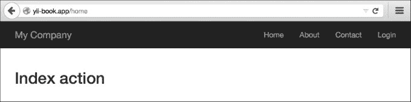

1.  然后尝试运行`/about`页面：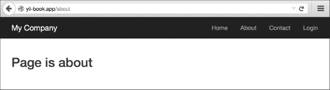

## 它是如何工作的…

让我们回顾一下已经做了什么以及为什么它有效。我们将从第一条规则的最右边开始：

```php
  'home' => 'test/index',
```

`test/index`究竟是什么？在 Yii 应用中，每个控制器及其动作都有对应的内部路由。内部路由的格式为`moduleID/controllerID/actionID`。例如，`TestController`的`actionPage`方法对应于`test/page`路由。因此，为了获取控制器 ID，你应该去掉 Controller 后缀，并将首字母小写。为了获取动作 ID，你应该去掉动作方法名的前缀，同样，首字母也要小写。

现在，什么是首页？为了更好地理解它，我们需要至少表面地了解当我们使用不同的 URL 访问我们的应用程序时发生了什么。

当我们使用`/home`时，URL 路由器会从顶部开始逐个检查我们的规则，尝试将输入的 URL 与规则匹配。如果找到匹配项，则路由器从分配给该规则的内部分配中获取控制器及其动作并执行它。因此，`/home`是定义哪些 URL 将由其所属规则处理的 URL 模式。

## 还有更多...

您还可以使用特殊语法创建参数化规则。让我们回顾第三条规则：

```php
'page/<alias>' => test/page',
```

在这里，我们定义了一个别名参数，该参数应在`/page/`之后指定在 URL 中。它可以几乎是任何东西，并且将作为`$alias`参数传递给以下：

```php
TestController::actionPage($alias).
```

您可以为这样的参数定义一个模式。我们为第二个规则做了如下操作：

```php
'<alias:about>' => test/page',
```

此处的别名应匹配`about`，否则规则将不会应用。

## 参见

参考以下链接以获取更多阅读材料：

+   [`www.yiiframework.com/doc-2.0/guide-runtime-routing.html`](http://www.yiiframework.com/doc-2.0/guide-runtime-routing.html)

+   [`www.yiiframework.com/doc-2.0/guide-runtime-url-handling.html`](http://www.yiiframework.com/doc-2.0/guide-runtime-url-handling.html)

+   [`www.yiiframework.com/doc-2.0/yii-web-urlmanager.html`](http://www.yiiframework.com/doc-2.0/yii-web-urlmanager.html)

+   *在 URL 规则中使用正则表达式*的配方

# 生成 URL

Yii 不仅允许您将 URL 路由到不同的控制器动作，还可以通过指定适当的内部路由及其参数来生成 URL。这非常有用，因为在开发应用程序时，您可以专注于内部路由，而在上线前只需关注真实 URL。永远不要直接指定 URL，并确保您使用 Yii URL 工具集。它将允许您在不重写大量应用程序代码的情况下更改 URL。

## 准备工作

1.  按照官方指南中的说明，使用 Composer 包管理器创建一个新的应用程序：[`www.yiiframework.com/doc-2.0/guide-start-installation.html`](http://www.yiiframework.com/doc-2.0/guide-start-installation.html)。

1.  找到您的`@app/config/web.php`文件，并按以下方式替换规则数组：

    ```php
    'urlManager' => array(
        'enablePrettyUrl' => true,
        'showScriptName' => false,
    ),
    ```

1.  配置您的应用程序服务器以使用干净的 URL。如果您正在使用启用了`mod_rewrite`和`AllowOverride`的 Apache，那么您应该在`@app/web`文件夹下的`.htaccess`文件中添加以下行：

    ```php
    Options +FollowSymLinks
    IndexIgnore */*
    RewriteEngine on
    # if a directory or a file exists, use it directly
    RewriteCond %{REQUEST_FILENAME} !-f
    RewriteCond %{REQUEST_FILENAME} !-d
    # otherwise forward it to index.php
    RewriteRule . index.php
    ```

## 如何做到这一点...

1.  在您的`@app/controllers`目录下，创建`BlogController`，并在其中放置以下代码：

    ```php
    <?php

    namespace app\controllers;
    use yii\web\Controller;

    class BlogController extends Controller
    {

        public function actionIndex()
        {
            return $this->render('index');
        }

        public function actionRssFeed($param)
        {
            return $this->renderContent('This is RSS feed for our blog and ' . $param);
        }

        public function actionArticle($alias)
        {
            return $this->renderContent('This is an article with alias ' . $alias);
        }

        public function actionList()
        {
            return $this->renderContent('Blog\'s articles here');
        }

        public function actionHiTech()
        {
            return $this->renderContent('Just a test of action which contains more than one words in the name') ;
        }
    }
    ```

    这是我们将要为它生成自定义 URL 的博客控制器。

1.  在您的`@app/controllers`目录下，创建`TestController`，并在其中放置以下代码：

    ```php
    <?php

    namespace app\controllers;
    use Yii;
    use yii\web\Controller;

    class TestController extends Controller
    {

        public function actionUrls()
        {
            return $this->render('urls');
        }

    }
    ```

1.  在`@app/views`目录下，创建`test`目录和`urls.php`视图文件，并在其中放置以下代码：

    ```php
    <?php
        use yii\helpers\Url;
        use yii\helpers\Html;
    ?>
    <h1>Generating URLs</h1>

    <h3>Generating a link with URL to <i>blog</i> controller and <i>article</i> action with alias as param</h3>
    <?= Html::a('Link Name', ['blog/article', 'alias' => 'someAlias']); ?>

    <h3>Current url</h3>
    <?=Url::to('')?>

    <h3>Current Controller, but you can specify an action</h3>
    <?=Url::toRoute(['view', 'id' => 'contact']);?>

    <h3>Current module, but you can specify controller and action</h3>
    <?= Url::toRoute('blog/article')?>

    <h3>An absolute route to blog/list </h3>
    <?= Url::toRoute('/blog/list')?>

    <h3> URL for <i>blog</i> controller and action <i>HiTech</i> </h3>
    <?= Url::toRoute('blog/hi-tech')?>

    <h3>Canonical URL for current page</h3>
    <?= Url::canonical()?>

    <h3>Getting a home URL</h3>
    <?= Url::home()?>

    <h3>Saving a URL of the current page and getting it for re-use</h3>
    <?php Url::remember()?>
    <?=Url::previous()?>

    <h3>Creating URL to <i>blog</i> controller and <i>rss-feed</i> action while URL helper isn't available</h3>
    <?=Yii::$app->urlManager->createUrl(['blog/rss-feed', 'param' => 'someParam'])?>

    <h3>Creating an absolute URL to <i>blog</i> controller and <i>rss-feed</i></h3>
    <p>It's very useful for emails and console applications</p>

    <?=Yii::$app->urlManager->createAbsoluteUrl(['blog/rss-feed', 'param' => 'someParam'])?>
    ```

1.  前往 URL `http://yii-book.app/test/urls`，您将看到输出。（参考前面代码中的完整方法列表。）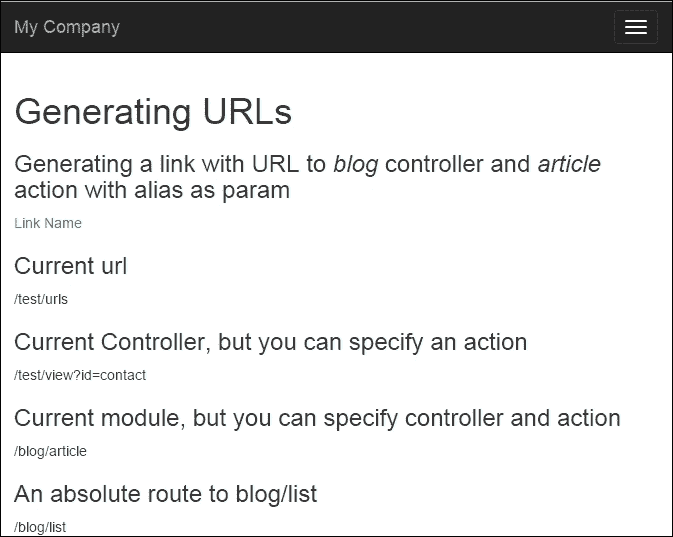

## 它是如何工作的...

我们需要生成指向 `BlogController` 控制器动作（RssFeed、Article、List、HiTech）的 URL。

根据我们的需求，有不同的实现方式，但基本原理是相同的。让我们列出一些生成 URL 的方法。

内部路由是什么？每个控制器及其动作都有相应的路由。路由的格式是 `moduleID/controllerID/actionID`。例如，`BlogController` 的 `actionHiTech` 方法对应于 `blog/hi-tech` 路由。

要获取控制器 ID，你应该去掉 Controller 后缀，并将首字母转换为小写。要获取动作 ID，你应该去掉动作前缀，并将每个单词的首字母转换为小写，并用连字符（-）分隔（例如，`actionHiTech` 将是 `hi-tech`）。

`$_GET` 变量是将传递给指定内部路由的动作的参数。例如，如果我们想创建一个指向 `BlogController::action` 文章的 URL，并将 `$_GET['name']` 参数传递给它，可以这样做：

```php
<?= Html::a('Link Name', ['blog/article', 'alias' => 'someAlias']); ?>
```

相对 URL 可以在你的应用程序中使用，而绝对 URL 应该用于指向网站外部的位置（例如其他网站）或用于链接到外部可访问的资源（如 RSS 源、电子邮件等）。

你可以使用 URL 管理器轻松实现。URL 管理器是一个名为 `urlManager` 的内置应用程序组件。你必须使用这个组件，它可以通过 `Yii::$app->urlManager` 从 Web 和控制台应用程序访问。

当你无法获取控制器实例时，例如，当你实现控制台应用程序时，你可以使用以下两种 `urlManager` 创建方法：

```php
<?=Yii::$app->urlManager->createUrl(['blog/rss-feed', 'param' => 'someParam'])?>
<?=Yii::$app->urlManager->createAbsoluteUrl(['blog/rss-feed', 'param' => 'someParam'])?>
```

## 还有更多...

有关更多信息，请参阅以下 URL：

+   [`en.wikipedia.org/wiki/Canonical_link_element`](https://en.wikipedia.org/wiki/Canonical_link_element)

+   [`www.yiiframework.com/doc-2.0/guide-structure-controllers.html`](http://www.yiiframework.com/doc-2.0/guide-structure-controllers.html)

+   [`www.yiiframework.com/doc-2.0/guide-runtime-routing.html`](http://www.yiiframework.com/doc-2.0/guide-runtime-routing.html)

+   [`www.yiiframework.com/doc-2.0/guide-helper-url.html`](http://www.yiiframework.com/doc-2.0/guide-helper-url.html)

+   [`www.yiiframework.com/doc-2.0/yii-web-urlmanager.html`](http://www.yiiframework.com/doc-2.0/yii-web-urlmanager.html)

## 相关内容

+   *配置 URL 规则* 菜谱

# 在 URL 规则中使用正则表达式

Yii URL 路由器的隐藏特性之一是你可以使用相当强大的正则表达式来处理字符串。

## 准备工作

1.  使用 Composer 包管理器创建新应用程序，如官方指南中所述，请参阅 [`www.yiiframework.com/doc-2.0/guide-start-installation.html`](http://www.yiiframework.com/doc-2.0/guide-start-installation.html)。

1.  在你的 `@app/controllers` 目录中，使用以下内容创建 `PostController.php`：

    ```php
    <?php

    namespace app\controllers;

    use yii\helpers\Html;
    use yii\web\Controller;

    class PostController extends Controller
    {
        public function actionView($alias)
        {
            return $this->renderContent(Html::tag('h2',
                'Showing post with alias ' . Html::encode($alias)
            ));
        }

        public function actionIndex($type = 'posts', $order = 'DESC')
       {
            return $this->renderContent(Html::tag('h2',
               'Showing ' . Html::encode($type) . ' ordered ' . Html::encode($order)
            ));
        }

        public function actionHello($name)
        {
            return $this->renderContent(Html::tag('h2',
                'Hello, ' . Html::encode($name) . '!'
            ));
        }
    }
    ```

    这是我们的应用程序控制器，我们将通过自定义 URL 来访问它。

1.  配置您的应用程序服务器以使用干净的 URL。如果您使用 Apache 并开启了`mod_rewrite`和`AllowOverride`，那么您应该在`@web`文件夹下的`.htaccess`文件中添加以下行：

    ```php
    Options +FollowSymLinks
    IndexIgnore */*
    RewriteEngine on
    # if a directory or a file exists, use it directly
    RewriteCond %{REQUEST_FILENAME} !-f
    RewriteCond %{REQUEST_FILENAME} !-d
    # otherwise forward it to index.php
    RewriteRule . index.php
    ```

## 如何操作…

我们希望我们的`PostController`操作能够根据某些指定的规则接受参数，并为所有不匹配的参数给出`404 not found` HTTP 响应。此外，`post/index`应该有一个别名 URL 为 archive。

将以下`urlManager`组件的配置添加到`@app/config/web.php`：

```php
'components' => [
    // ..
    'urlManager' => [
        'enablePrettyUrl' => true,
        'rules' => [
            'post/<alias:[-a-z]+>' => 'post/view',
            '<type:(archive|posts)>' => 'post/index',
            '<type:(archive|posts)>/<order:(DESC|ASC)>' => 'post/index',
            'sayhello/<name>' => 'post/hello',
        ]
    ],
    // ..
],
```

以下 URL 将成功：

+   `http://yii-book.app/post/test`

+   `http://yii-book.app/posts`

+   `http://yii-book.app/archive`

+   `http://yii-book.app/posts/ASC`

+   `http://yii-book.app/sayhello`

以下 URL 将失败：

+   `http://yii-book.app/archive/test`

+   `http://yii-book.app/post/another_post`

以下截图显示，URL `http://yii-book.app/post/test` 已成功运行：

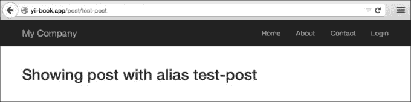

以下截图显示，URL `http://yii-book.app/archive` 也已成功运行：

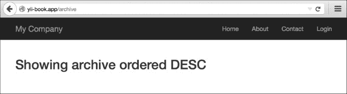

以下截图显示，URL `http://yii-book.app/archive/test` 没有成功运行并遇到了错误：

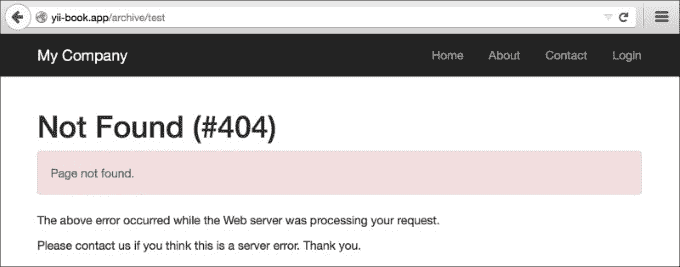

## 它是如何工作的…

您可以在参数定义和规则的其他部分使用正则表达式。让我们逐条阅读我们的规则：

```php
'post/<alias:[-a-z]+>' => 'post/view',
```

别名参数应包含一个或多个英文字母或破折号。不允许使用其他符号。

```php
'(posts|archive)' => 'post/index', 
'(posts|archive)/<order:(DESC|ASC)>' => 'post/index',
```

`posts`和`archive`都指向`post/index`。`order`参数只能接受两个值——`DESC`和`ASC`：

```php
'sayhello/<name>' => 'post/hello',
```

您应该指定名称部分，但对允许使用的字符没有限制。请注意，无论使用哪种规则，开发者都不应假设输入数据是安全的。

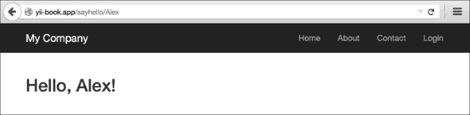

## 还有更多…

要了解更多关于正则表达式的信息，您可以使用以下资源：

+   [`www.php.net/manual/en/reference.pcre.pattern.syntax.php`](http://www.php.net/manual/en/reference.pcre.pattern.syntax.php)

+   *精通正则表达式*，*Jeffrey Friedl* 可在 [`regex.info/`](http://regex.info/) 获取。

## 参见

+   *配置 URL 规则*配方

# 使用基控制器

在许多框架中，被其他控制器扩展的基控制器的概念在指南中就有描述。在 Yii 中，指南中没有提及，因为您可以通过许多其他方式实现灵活性。尽管如此，使用基控制器是可能的，并且可能是有用的。

假设我们想要添加一些只有当用户登录时才能访问的控制器。我们当然可以为每个控制器单独设置这个约束，但我们会以更好的方式来做。

## 准备工作

使用 Composer 包管理器创建一个新的应用程序，具体操作请参考官方指南中的[`www.yiiframework.com/doc-2.0/guide-startinstallation.html`](http://www.yiiframework.com/doc-2.0/guide-startinstallation.html)。

## 如何操作…

1.  首先，我们需要一个基础控制器，我们的用户控制器将使用它。让我们创建`@app/components/BaseController.php`，代码如下：

    ```php
    <?php

    namespace app\components;

    use Yii;
    use yii\web\Controller;
    use yii\filters\AccessControl;

    class BaseController extends Controller
    {
        public function actions()
        {
            return [
                'error' => ['class' => 'yii\web\ErrorAction'],
            ];
        }

        public function behaviors()
        {
            return [
                'access' => [
                    'class' => AccessControl::className(),
                    'rules' => [
                        [
                            'allow' => true,
                            'actions' => 'error'
                        ],
                        [
                            'allow' => true,
                            'roles' => ['@'],
                        ],
                    ],
                ]
            ];
        }
    }
    ```

    此控制器有一个包含错误操作的 action 映射。

1.  现在通过 Gii 创建`TestController`，但将基类字段的值设置为`app/components/BaseController`：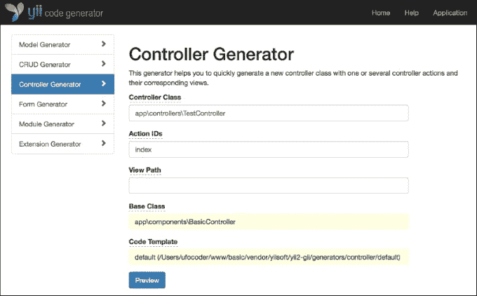

    您将得到以下类似的结果：

    ```php
    <?php
    namespace app\controllers;
    class TestController extends \app\components\BaseController
    {
        public function actionIndex()
        {
            return $this->render('index');
        }
    }
    ```

1.  现在，您的`TestController`只有在用户登录时才能访问，尽管我们没有在`TestController`类中明确声明。您可以通过在注销状态下访问`http://yii-book.app/index.php?r=test/index`来检查它。

## 它是如何工作的…

这个技巧不过是一个基本的类继承。如果`TestController`中没有找到过滤器或访问控制规则，那么它们将从`SecureController`中调用。

## 还有更多…

如果您需要扩展基础控制器的方法，请记住它不能被覆盖。例如，我们需要向控制器动作映射中添加一个页面操作：

```php
<?php

namespace app\controllers;

use yii\helpers\ArrayHelper;
use app\components\BaseController;

class TestController extends BaseController
{
    public function actions()
    {
        return ArrayHelper::merge(parent::actions(), [
            'page' => [
                'class' => 'yii\web\ViewAction',
            ],
        ]);
    }

    public function behaviors()
    {
        $behaviors = parent::behaviors();

        $rules = $behaviors['access']['rules'];

        $rules = ArrayHelper::merge(
            $rules,
            [
                [
                    'allow' => true,
                    'actions' => ['page']
                ]
            ]
        );

        $behaviors['access']['rules'] = $rules;

        return $behaviors;
    }

    public function actionIndex()
    {
        return $this->render('index');
    }
}
```

如需更多信息，请参阅[`www.yiiframework.com/doc-2.0/yii-base-controller.html`](http://www.yiiframework.com/doc-2.0/yii-base-controller.html)。

# 使用独立操作

在 Yii 中，您可以定义控制器操作为单独的类，然后将它们连接到您的控制器。这将帮助您重用一些常用功能。

例如，您可以将自动完成字段的后端移动到操作中，并通过不必重复编写来节省时间。

另一个例子是，我们可以创建所有 CRUD 操作作为独立的独立操作。我们将编写、创建、查看和删除模型操作，以及查看模型列表操作。

## 准备工作

1.  使用 Composer 包管理器创建一个新的应用程序，具体操作请参考官方指南中的[`www.yiiframework.com/doc-2.0/guide-start-installation.html`](http://www.yiiframework.com/doc-2.0/guide-start-installation.html)。

1.  让我们创建`post`表。使用以下命令创建迁移：

    ```php
    ./yii migrate/create create_post_table
    ```

1.  按照以下方式更新刚刚创建的迁移的方法和导入的类列表：

    ```php
    <?php

    use yii\db\Schema;
    use yii\db\Migration;

    class m150719_152435_create_post_table extends Migration
    {
        const TABLE_NAME = '{{%post}}';

        public function up()
        {
            $tableOptions = null;
            if ($this->db->driverName === 'mysql') {
                $tableOptions = 'CHARACTER SET utf8 COLLATE utf8_general_ci ENGINE=InnoDB';
            }

            $this->createTable(self::TABLE_NAME, [
                'id' => Schema::TYPE_PK,
                'title' => Schema::TYPE_STRING.'(255) NOT NULL',
                'content' => Schema::TYPE_TEXT.' NOT NULL',
            ], $tableOptions);

            for ($i = 1; $i < 7; $i++) {
                $this->insert(self::TABLE_NAME, [
                    'title' => 'Test article #'.$i,
                    'content' => 'Lorem ipsum dolor sit amet, consectetur adipiscing elit. '
                     .'Sed sit amet mauris est. Sed at dignissim dui. '
                     .'Phasellus arcu massa, facilisis a fringilla sit amet, '
                     .'rhoncus ut enim.',
                ]);
            }
        }

        public function down()
        {
            $this->dropTable(self::TABLE_NAME);
        }
    }
    ```

1.  使用以下命令安装所有迁移：

    ```php
    ./yii migrate up
    ```

1.  使用 Gii 创建`Post`模型。

## 如何操作…

1.  创建独立的操作`@app/actions/CreateAction.php`，代码如下：

    ```php
    <?php

    namespace app\actions;

    use Yii;
    use yii\base\Action;

    class CreateAction extends Action
    {
        public $modelClass;

        public function run()
        {
            $model = new $this->modelClass();

            if ($model->load(Yii::$app->request->post()) && $model->save()) {
                $this->controller->redirect(['view', 'id' => $model->getPrimaryKey()]);
            } else {
                return $this->controller->render('//crud/create', [
                    'model' => $model
                ]);
            }
        }
    }
    ```

1.  创建独立的操作`@app/actions/DeleteAction.php`，代码如下：

    ```php
    <?php

    namespace app\actions;

    use yii\base\Action;
    use yii\web\NotFoundHttpException;

    class DeleteAction extends Action
    {
        public $modelClass;

        public function run($id)
        {
            $class = $this->modelClass;

            if (($model = $class::findOne($id)) === null) {
                throw new NotFoundHttpException('The requested page does not exist.');
            }

            $model->delete();

            return $this->controller->redirect(['index']);
        }
    }
    ```

1.  创建独立的操作`@app/actions/IndexAction.php`，代码如下：

    ```php
    <?php

    namespace app\actions;

    use yii\base\Action;
    use yii\data\Pagination;

    class IndexAction extends Action
    {
        public $modelClass;
        public $pageSize = 3;

        public function run()
        {
            $class = $this->modelClass;
            $query = $class::find();
            $countQuery = clone $query;

            $pages = new Pagination([
                'totalCount' => $countQuery->count(),
            ]);
            $pages->setPageSize($this->pageSize);

            $models = $query->offset($pages->offset)
                               ->limit($pages->limit)
                               ->all();

            return $this->controller->render('//crud/index', [
                'pages' => $pages,
                'models' => $models
            ]);
        }
    }
    ```

1.  创建独立的操作`@app/actions/ViewAction.php`，代码如下：

    ```php
    <?php

    namespace app\actions;

    use yii\base\Action;
    use yii\web\NotFoundHttpException;

    class ViewAction extends Action
    {
        public $modelClass;

        public function run($id)
        {
            $class = $this->modelClass;

            if (($model = $class::findOne($id)) === null) {
                 throw new NotFoundHttpException('The requested page does not exist.');
            }

             return $this->controller->render('//crud/view', [
                'model' => $model
             ]);
        }
    }
    ```

1.  创建视图文件`@app/views/crud/create.php`，代码如下：

    ```php
    <?php

    use yii\helpers\Html;
    use yii\widgets\ActiveForm;

    /*
    * @var yii\web\View $this
    */

    ?>
    <h1><?= Yii::t('app', 'Create post'); ?></h1>
    <?php $form = ActiveForm::begin();?>
    <?php $form->errorSummary($model); ?>

    <?= $form->field($model, 'title')->textInput() ?>
    <?= $form->field($model, 'content')->textarea() ?>

    <?= Html::submitButton(Yii::t('app', 'Create'), ['class' => 'btn btn-primary']) ?>

    <?php ActiveForm::end(); ?>
    ```

1.  创建视图文件`@app/views/crud/index.php`，代码如下：

    ```php
    <?php

    use yii\widgets\LinkPager;
    use yii\helpers\Html;
    use yii\helpers\Url;

    /*
    * @var yii\web\View $this
    * @var yii\data\Pagination $pages
    * @var array $models
    */

    ?>
    <h1>Posts</h1>
    <?= Html::a('+ Create a post', Url::toRoute('post/create')); ?>

    <?php foreach ($models as $model):?>
        <h3><?= Html::encode($model->title);?></h3>
        <p><?= Html::encode($model->content);?></p>

        <p>
            <?= Html::a('view', Url::toRoute(['post/view', 'id' => $model->id]));?> |
            <?= Html::a('delete', Url::toRoute(['post/delete', 'id' => $model->id]));?>
        </p>
    <?php endforeach; ?>

    <?= LinkPager::widget([
        'pagination' => $pages,
    ]); ?>
    ```

1.  创建视图文件`@app/views/crud/view.php`，代码如下：

    ```php
    <?php

    use yii\helpers\Html;
    use yii\helpers\Url;

    /*
    * @var yii\web\View $this
    * @var app\models\Post $model
    */

    ?>
    <p><?= Html::a('< back to posts', Url::toRoute('post/index')); ?></p>

    <h2><?= Html::encode($model->title);?></h2>
    <p><?= Html::encode($model->content);?></p>
    ```

    要使用独立动作，我们在动作映射中通过重写`actions`方法来声明它。

1.  运行`post`/`index`：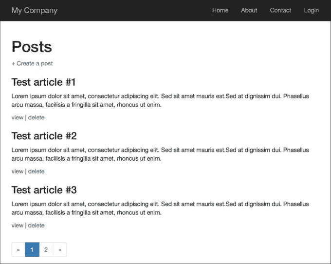

## 它是如何工作的…

每个控制器都可以由独立动作构建，就像拼图一样。不同之处在于你可以使独立动作非常灵活，并在许多地方重用它们。

在我们的动作中，我们定义了`modelClass`公共属性，这有助于在`PostController`的`actions`方法中设置特定的模型类。

## 参见

对于更多信息，请参阅[`www.yiiframework.com/doc-2.0/guide-structure-controllers.html#standalone-actions`](http://www.yiiframework.com/doc-2.0/guide-structure-controllers.html#standalone-actions)。

# 创建自定义过滤器

过滤器是在控制器动作之前和/或之后运行的对象。例如，一个访问控制过滤器可能在动作之前运行，以确保特定的最终用户可以访问它们；一个内容压缩过滤器可能在动作之后运行，在将响应内容发送给最终用户之前压缩它们。

过滤器可能由一个预过滤器（在动作之前应用的过滤逻辑）和一个/或后过滤器（在动作之后应用的逻辑）组成。过滤器本质上是一种特殊的行为。因此，使用过滤器与使用行为相同。

假设我们有一个网络应用程序，它只为指定的小时提供用户界面，例如，从上午 10 点到下午 6 点。

## 准备工作

使用 Composer 包管理器创建一个新的应用程序，如官方指南中所述，[`www.yiiframework.com/doc-2.0/guide-start-installation.html`](http://www.yiiframework.com/doc-2.0/guide-start-installation.html)。

## 如何做…

1.  创建一个控制器，`@app/controllers/TestController.php`，如下所示：

    ```php
    <?php

    namespace app\controllers;

    use app\components\CustomFilter;
    use yii\helpers\Html;
    use yii\web\Controller;

    class TestController extends Controller
    {
        public function behaviors()
        {
            return [
                'access' => [
                    'class' => CustomFilter::className(),
                ],
            ];
        }

        public function actionIndex()
        {
            return $this->renderContent(Html::tag('h1',
                'This is a test content'
            ));
        }
    }
    ```

1.  创建一个新的过滤器，`@app/components/CustomFilter.php`，如下所示：

    ```php
    <?php
    namespace app\components;

    use Yii;
    use yii\base\ActionFilter;
    use yii\web\HttpException;

    class CustomFilter extends ActionFilter
    {
        const WORK_TIME_BEGIN = 10;
        const WORK_TIME_END = 18;

        protected function canBeDisplayed()
        {
            $hours = date('G');

            return $hours >= self::WORK_TIME_BEGIN && $hours <= self::WORK_TIME_END;
        }

        public function beforeAction($action)
        {
            if (!$this->canBeDisplayed())
            {
                $error = 'This part of website works from '
                        . self::WORK_TIME_BEGIN . ' to '
                        . self::WORK_TIME_END . ' hours.';

                throw new HttpException(403, $error);
            }

            return parent::beforeAction($action);
        }

        public function afterAction($action, $result)
        {
            if (Yii::$app->request->url == '/test/index') {
                Yii::trace("This is the index action");
            }

            return parent::afterAction($action, $result);
        }
    }
    ```

1.  如果你在这个指定的时间段外访问了这个页面，你会得到以下内容：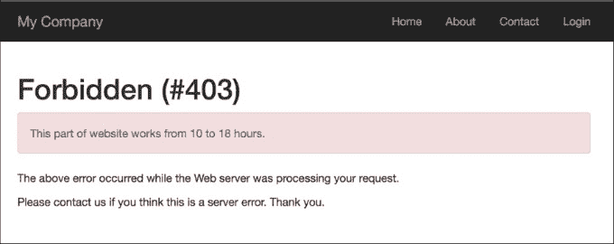

## 它是如何工作的…

首先，我们在控制器中添加了一段代码，实现了我们的自定义过滤器：

```php
public function behaviors()
{
    return [
        'access' => [
            'class' => CustomFilter::className(),
           ],
        ];
}
```

默认情况下，过滤器应用于控制器的所有动作，但我们可以指定要应用过滤器的动作，甚至可以排除过滤器中的动作。

在其中有两个动作——`beforeAction`和`afterActions`。第一个在控制器动作之前运行，下一个在之后运行。

在我们的简单示例中，我们定义了一个条件，如果时间早于上午 10 点，则不允许访问网站，在`after`方法中，如果当前路径是`test/index`，我们只是运行一个跟踪方法。

你可以在调试器的`log`部分看到结果：

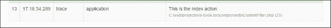

在实际应用中，过滤器更复杂，而且 Yii2 提供了许多内置过滤器，例如核心、认证、内容协商、HTTP 缓存端等。

## 参见

对于更多信息，请参阅[`www.yiiframework.com/doc-2.0/guidestructure-filters.html`](http://www.yiiframework.com/doc-2.0/guidestructure-filters.html)。

# 显示静态页面

如果你只有几个静态页面，并且不太经常更改它们，那么查询数据库和为它们实现页面管理就没什么必要了。

## 准备工作

使用 Composer 包管理器创建一个新的应用程序，如官方指南中所述[`www.yiiframework.com/doc-2.0/guide-startinstallation.html`](http://www.yiiframework.com/doc-2.0/guide-startinstallation.html)。

## 如何操作…

1.  创建测试控制器文件，`@app/controllers/TestController.php`，如下所示：

    ```php
    <?php

    namespace app\controllers;

    use yii\web\Controller;

    class TestController extends Controller
    {
        public function actions()
        {
            return [
                'page' => [
                    'class' => 'yii\web\ViewAction',
                ]
            ];
        }
    }
    ```

1.  现在，将你的页面放入`views/test/pages`，并命名为`index.php`和`contact.php`。`index.php`的内容如下：

    ```php
    <h1>Index</h1>
    content of index file

    Contact.php content is:

    <h2>Contacts</h2>
    <p>Our contact: contact@localhost</p>
    ```

1.  现在，你可以通过输入 URL 来检查你的页面，

1.  `http://yii-book.app/index.php?r=test/page&view=contact`: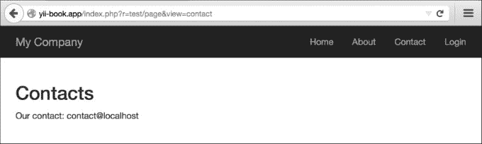

1.  或者，如果你已经配置了路径格式的干净 URL，你可以输入 URL `http://yii-book.app/test/page/view/about`。

## 它是如何工作的…

我们连接名为`\yii\web\ViewAction`的外部操作，它只是尝试找到与提供的`$_GET`参数相同的视图名称。如果存在，则显示它。如果不存在，则将显示一个`404 not found`页面。如果未设置`viewParam`，则使用`defaultView`值。

## 还有更多…

### 关于 ViewAction

有一些有用的`\yii\web\ViewAction`参数我们可以使用。这些列在下表中：

| 参数名称 | 描述 |
| --- | --- |
| `defaultView` | 当用户未提供`yii\web\ViewAction::$viewParam` GET 参数时使用的默认视图名称。默认为`'index'`。这应该采用与`GET`参数中给出的类似的`path/to/view`格式。 |
| `layout` | 要应用于请求视图的布局名称。在渲染视图之前，这将分配给`yii\base\Controller::$layout`。默认为 null，表示将使用控制器的布局。如果为 false，则不应用布局。 |
| `viewParam` | 包含请求视图名称的`GET`参数的名称。 |
| `viewPrefix` | 一个字符串，用于添加到用户指定的视图名称之前，以形成一个完整的视图名称。例如，如果用户请求`tutorial/chap1`，相应的视图名称将是`pages/tutorial/chap1`，假设前缀是 pages。实际的视图文件由`yii\base\View::findViewFile()`确定。 |

### 配置 URL 规则

`ViewAction`操作提供了一个最小化你的控制器的方法，但 URL 看起来像`http://yii-book.app/index.php?r=test/page&page=about`。为了使 URL 更短、更易读，请向`urlManager`组件添加 URL 规则：

```php
'<view:about>' => 'test/page'
```

如果`urlManager`组件配置正确，你将得到以下结果：

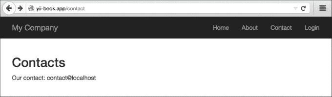

要配置`urlManager`组件，请参考*配置 URL 规则*配方。

## 相关内容

更多信息，请参考以下 URL：

+   [`www.yiiframework.com/doc-2.0/yii-web-viewaction.html`](http://www.yiiframework.com/doc-2.0/yii-web-viewaction.html)

+   [`www.yiiframework.com/doc-2.0/guide-structure-views.html#rendering-static-pages`](http://www.yiiframework.com/doc-2.0/guide-structure-views.html#rendering-static-pages)

+   *配置 URL 规则* 菜谱

# 使用闪存消息

当你正在使用表单编辑模型、删除模型或执行任何其他操作时，告诉用户操作是否成功或出现错误是很好的。通常，在编辑表单等某种操作之后，将发生重定向，我们需要在想要跳转的页面上显示一条消息。然而，我们如何从当前页面传递到重定向目标并之后清理它？Flash 消息将帮助我们完成这项任务。

## 准备工作

使用 Composer 包管理器创建一个新的应用程序，如官方指南中所述，[`www.yiiframework.com/doc-2.0/guide-start-installation.html`](http://www.yiiframework.com/doc-2.0/guide-start-installation.html)。

## 如何操作…

1.  让我们创建一个 `@app/controllers/TestController.php` 控制器，如下所示：

    ```php
    <?php

    namespace app\controllers;

    use Yii;
    use yii\web\Controller;
    use yii\filters\AccessControl;

    class TestController extends Controller
    {
        public function behaviors()
        {
            return [
                'access' => [
                    'class' => AccessControl::className(),
                    'rules' => [
                        [
                            'allow' => true,
                            'roles' => ['@'],
                            'actions' => ['user']
                        ],
                        [
                            'allow' => true,
                            'roles' => ['?'],
                            'actions' => ['index', 'success', 'error']
                        ],
                    ],
                    'denyCallback' => function ($rule, $action) {
                        Yii::$app->session->setFlash('error', 
                        'This section is only for registered users.');
                        $this->redirect(['index']);
                    },
                ],
            ];
        }

        public function actionUser()
        {
            return $this->renderContent('user');
        }

        public function actionSuccess()
        {
            Yii::$app->session->setFlash('success', 'Everything went fine!');
            $this->redirect(['index']);
        }

        public function actionError()
        {
            Yii::$app->session->setFlash('error', 'Everything went wrong!');
            $this->redirect(['index']);
        }

        public function actionIndex()
        {
            return $this->render('index');
        }
    }
    ```

1.  此外，创建 `@app/views/common/alert.php` 视图，如下所示：

    ```php
    <?php
        use yii\bootstrap\Alert;
    ?>
    <?php if (Yii::$app->session->hasFlash('success')):?>
        <?= Alert::widget([
            'options' => ['class' => 'alert-success'],
            'body' => Yii::$app->session->getFlash('success'),
        ]);?>
    <?php endif ?>

    <?php if (Yii::$app->session->hasFlash('error')) :?>
        <?= Alert::widget([
            'options' => ['class' => 'alert-danger'],
            'body' => Yii::$app->session->getFlash('error'),
        ]);?>
    <?php endif; ?>
    ```

1.  创建 `@app/views/test/index.php` 文件视图，如下所示：

    ```php
    <?php

    /* @var $this yii\web\View */

    ?>

    <?= $this->render('//common/alert') ?>

    <h2>Guest page</h2>
    <p>There's a content of guest page</p>
    ```

1.  创建 `@app/views/test/user.php` 文件视图，如下所示：

    ```php
    <?php

    /* @var $this yii\web\View */

    ?>

    <?= $this->render('//common/alert') ?>

    <h2>User page</h2>
    <p>There's a content of user page</p>
    ```

1.  现在，如果你访问 `http://yii-book.app/index.php?r=test/success`，你将被重定向到 `http://yii-book.app/index.php?r=test/index`，并显示一条成功消息如下：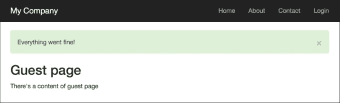

1.  此外，如果你访问 `http://yii-book.app/index.php?r=test/error`，你将被重定向到相同的页面，但会显示一个错误消息。刷新 `index` 页面将隐藏该消息：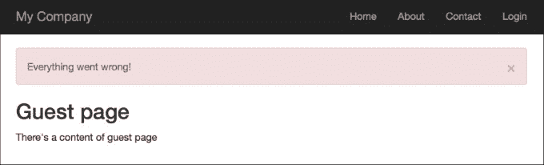

1.  然后尝试运行 `http://yii-book.app/index.php?r=test/user`。你将被重定向到 `http://yii-book.app/index.php?r=test/index`，并在 `denyCallback` 函数中显示一个错误信息：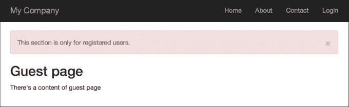

## 工作原理…

我们使用 `Yii::$app->session->('success', 'Everything went fine!')` 设置闪存消息。内部，它将消息保存到会话状态中，因此在最底层，我们的消息被保存在 `$_SESSION` 中，直到调用 `Yii::$app->session->getFlash('success')` 并删除 `$_SESSION` 键。

闪存消息在请求访问后将被自动删除。

## 更多内容…

### `getAllFlashes()` 方法

有时你需要处理所有闪存。你可以简单地这样做，如下所示：

```php
$flashes = Yii::$app->session->getAllFlashes();

<?php foreach ($flashes as $key => $message): ?>
    <?= Alert::widget([
        'options' => ['class' => 'alert-info'],
        'body' => $message,
    ]);
    ?>
<?php endforeach; ?>
```

### `removeAllFlashes()` 方法

当你需要清除所有闪存时，使用以下方法：

```php
Yii::$app->session->removeAllFlashes();
```

### `removeFlash()` 方法

当你需要使用指定键移除 `flash` 方法时，使用以下方法：

```php
Yii::$app->session->removeFlash('success');
```

在这个例子中，我们添加了一个非常有用的回调函数，它设置了一个错误消息并将重定向到 `test/ind` `ex` 页面。

## 相关内容

更多信息，请参考：

+   [`www.yiiframework.com/doc-2.0/yii-web-session.html`](http://www.yiiframework.com/doc-2.0/yii-web-session.html)

+   [`www.yiiframework.com/doc-2.0/yii-bootstrap-alert.html`](http://www.yiiframework.com/doc-2.0/yii-bootstrap-alert.html)

# 在视图中使用控制器上下文

Yii 视图非常强大，具有许多功能。其中之一是您可以在视图中使用控制器上下文。所以，让我们试试。

## 准备工作

使用 Composer 包管理器创建一个新的应用程序，如官方指南中所述 [`www.yiiframework.com/doc-2.0/guide-start-installation.html`](http://www.yiiframework.com/doc-2.0/guide-start-installation.html)。

## 如何操作...

1.  创建一个 `controllers/ViewController.php` 文件，如下所示：

    ```php
    <?php

    namespace app\controllers;

    use yii\web\Controller;

    class ViewController extends Controller
    {
        public $pageTitle;

        public function actionIndex()
        {
            $this->pageTitle = 'Controller context test';

            return $this->render('index');
        }

        public function hello()
        {
            if (!empty($_GET['name'])) {
                echo 'Hello, '  . $_GET['name'] . '!';
            }
        }
    }
    ```

1.  现在，我们将创建一个 `views/view.php` 来展示我们可以做什么：

    ```php
    <h1><?= $this->context->pageTitle ?></h1>
    <p>Hello call. <?php $this->context->hello() ?></p>
    ```

1.  为了测试它，你可以按照 `/index.php?r=view/index&name=Alex`: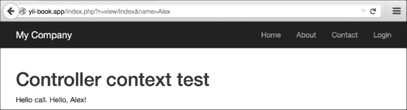

## 它是如何工作的...

我们在视图中使用 `$this` 来引用当前正在运行的控制器。当这样做时，我们可以调用控制器方法并访问其属性。最有用的属性是 `pageTitle`，它指向当前页面的标题。在视图中有许多非常有用的内置方法，例如 `renderPartials` 和小部件。

## 还有更多...

[`www.yiiframework.com/doc-2.0/guide-structure-views.html#accessing-data-in-views`](http://www.yiiframework.com/doc-2.0/guide-structure-views.html#accessing-data-in-views) URL 包含 `CController` 的 API 文档，您可以在其中找到您可以在视图中使用的良好方法列表。

# 使用部分重用视图

Yii 支持部分，所以如果您有一个逻辑不多的块想要重用或者想要实现电子邮件模板，部分是处理这个问题的正确方式。

假设我们有两个 Twitter 账户，一个用于我们的博客，另一个用于公司活动，我们的目标是输出指定页面上的 Twitter 时间线。

## 准备工作

1.  使用 Composer 包管理器创建一个新的应用程序，如官方指南中所述 [`www.yiiframework.com/doc-2.0/guide-start-installation.html`](http://www.yiiframework.com/doc-2.0/guide-start-installation.html)。

1.  在 [`twitter.com/settings/widgets/`](https://twitter.com/settings/widgets/) 为 `php_net` 和 `yiiframework` 用户创建 Twitter 小部件，并为每个创建的小部件找到一个 `data-widget-id` 值。

## 如何操作...

1.  创建一个控制器，`@app/controllers/BlogController.php`，如下所示：

    ```php
    <?php

    namespace app\controllers;

    use yii\web\Controller;

    class BlogController extends Controller
    {
        public function actionIndex()
        {
            $posts = [
                [
                    'title' => 'First post',
                    'content' => 'There\'s an example of reusing views with partials.',
                ],
                [
                    'title' => 'Second post',
                    'content' => 'We use twitter widget.'
                ],
            ];

            return $this->render('index', [
                'posts' => $posts
            ]);
        }
    }
    ```

1.  创建一个名为 `@app/views/common/twitter.php` 的视图文件，并粘贴来自 Twitter 的嵌入代码。你将得到以下类似的内容：

    ```php
    <?php

    /* @var $this \yii\web\View */
    /* @var $widget_id integer */
    /* @var $screen_name string */

    ?>
    <script>!function(d,s,id){var js,fjs=d.getElementsByTagName(s)[0],p=/^http:/.test(d.location)?'http':'https';if(!d.getElementById(id)){js=d.createElement(s);js.id=id;js.src=p+"://platform.twitter.com/widgets.js";fjs.parentNode.insertBefore(js,fjs);}}(document,"script","twitter-wjs");</script>

    <?php if ($widget_id && $screen_name): ?>
    <a class="twitter-timeline"
        data-widget-id="<?= $widget_id?>"
        href="https://twitter.com/<?= $screen_name?>"
        height="300">
        Tweets by @<?= $screen_name?>
    </a>
    <?php endif;?>
    ```

1.  创建一个视图文件 `@app/views/blog/index.php`，如下所示：

    ```php
    <?php

    /* @var $category string */
    /* @var $posts array */
    /* @var $this \yii\web\View */

    ?>

    <div class="row">
        <div class="col-xs-7">
            <h1>Posts</h1>
            <hr>
            <?php foreach ($posts as $post): ?>
                <h3><?= $post['title']?></h3>
                <p><?= $post['content']?></p>
            <?php endforeach;?>
        </div>
        <div class="col-xs-5">
            <?= $this->render('//common/twitter', [
                'widget_id' => '620531418213576704',
                'screen_name' => 'php_net',
            ]);?>
        </div>
    </div>
    ```

1.  将 `@app/views/site/about.php` 文件的内容替换为以下内容：

    ```php
    <?php

    use yii\helpers\Html;
    /* @var $this yii\web\View */
    $this->title = 'About';
    ?>

    <div class="col-xs-7">
        <h1><?= Html::encode($this->title) ?></h1>
        <p>
            This is the About page. You may modify this page.
        </p>
    </div>
    <div class="col-xs-5">
        <?= $this->render('//common/twitter', [
            'widget_id' => '620526086343012352',
            'screen_name' => 'yiiframework'
        ]);?>
    </div>
    ```

1.  尝试运行 `index.php?r=blog/index`: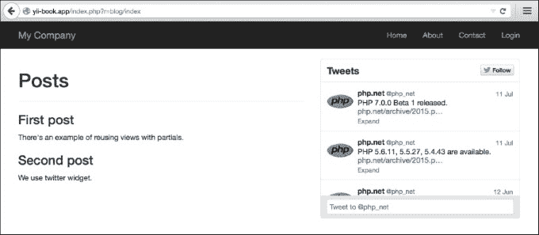

1.  尝试运行 `index.php?r=site/about`: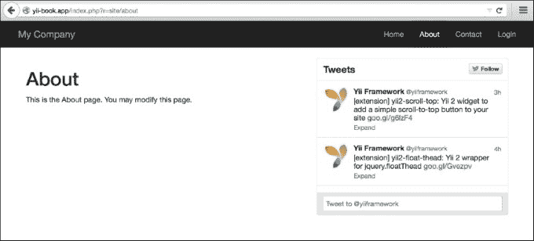

## 它是如何工作的...

在当前示例中，两个视图使用额外的参数渲染`@app/views/common/twitter.php`，以在自身内部形成 Twitter 小部件。请注意，视图可以在控制器、小部件或任何其他地方通过调用视图渲染方法进行渲染。例如，`\yii\base\Controller::render`与`\yii\base\View::render`执行相同的模板处理，但前者不使用布局。

在每个视图文件中，我们可以使用`$this`访问两个 View 类的实例，因此任何视图文件都可以通过调用`render`方法在其他视图中渲染。

## 还有更多…

如需更多信息，请参阅[`www.yiiframework.com/doc-2.0/guidestructure-views.html#rendering-views`](http://www.yiiframework.com/doc-2.0/guidestructure-views.html#rendering-views)。

# 使用块

你可以在视图中使用的一个 Yii 特性是块。基本思想是你可以记录一些输出，然后稍后在视图中重用它。一个很好的例子是为你的布局定义额外的内容区域，并在其他地方填充它们。

在之前的版本中，Yii 1.1，块被称为剪辑。

## 准备工作

使用 Composer 包管理器创建一个新的应用程序，如官方指南中所述[`www.yiiframework.com/doc-2.0/guide-start-installation.html`](http://www.yiiframework.com/doc-2.0/guide-start-installation.html)。

## 如何做到这一点…

1.  对于我们的示例，我们需要在布局中定义两个区域——`beforeContent`和`footer`。

1.  打开`@app/views/layouts/main.php`并在内容输出之前插入以下代码行：

    ```php
    <?php if(!empty($this->blocks['beforeContent'])) echo $this->blocks['beforeContent']; ?>
    ```

1.  然后，将页脚代码替换为以下代码：

    ```php
    <footer class="footer">
        <div class="container">
            <?php if (!empty($this->blocks['footer'])):
                echo $this->blocks['footer'] ?>
            <?php else: ?>
               <p class="pull-left">&copy; My Company <?= date('Y') ?></p>
               <p class="pull-right"><?= Yii::powered() ?></p>
            <?php endif; ?>
        </div>
    </footer>
    ```

1.  就这样！然后，向`controllers/SiteController.php`中添加一个新的操作，命名为`blocks`：

    ```php
    public function actionBlocks()
    {
        return $this->render('blocks');
    }
    ```

1.  现在，创建一个视图文件，`views/site/blocks.php`，内容如下：

    ```php
    <?php

    use \yii\Helpers\Html;

    /* @var $this \yii\web\View */
    ?>

    <?php $this->beginBlock('beforeContent');
        echo Html::tag('pre', 'Your IP is ' . Yii::$app->request->userIP);
    $this->endBlock(); ?>

    <?php $this->beginBlock('footer');
        echo Html::tag('h3', 'My custom footer block');
    $this->endBlock(); ?>

    <h1>Blocks usage example</h1>
    ```

1.  现在，当你打开`/index.php?r=site/blocks`页面时，你应该在页面内容之前看到你的 IP 地址，以及在页脚的构建注释：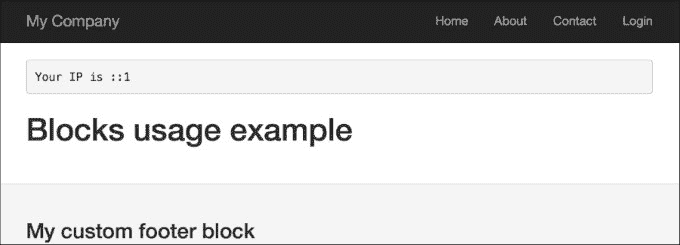

## 它是如何工作的…

我们使用代码标记区域，该代码仅检查特定块的存在，如果块存在，则输出它。然后，我们使用名为`beginBlock`和`endBlock`的特殊控制器方法记录我们定义的块的内容。

从控制器中，你可以轻松通过`$this->view->blocks['blockID']`访问我们的块变量。

## 还有更多…

+   *在视图中使用控制器上下文*的食谱

+   [`www.yiiframework.com/doc-2.0/guide-structure-views.html#using-blocks`](http://www.yiiframework.com/doc-2.0/guide-structure-views.html#using-blocks)

# 使用装饰器

在 Yii 中，我们可以将内容包围在装饰器中。装饰器的常见用法是布局。当你使用控制器中的`render`方法渲染视图时，Yii 会自动使用主布局装饰它。让我们创建一个简单的装饰器，它可以正确地格式化引号。

## 准备工作

使用官方指南中描述的 Composer 包管理器创建一个新的应用程序，指南链接为 [`www.yiiframework.com/doc-2.0/guide-start-installation.html`](http://www.yiiframework.com/doc-2.0/guide-start-installation.html)。

## 如何做…

1.  首先，我们将创建一个装饰器文件，`@app/views/decorators/quote.php`:

    ```php
    <div class="quote">
        <h2>&ldquo;<?= $content?>&rdquo;, <?= $author?></h2>
    </div>
    ```

1.  现在，将 `@app/views/site/index.php` 的内容替换为以下代码：

    ```php
    <?php

    use yii\widgets\ContentDecorator;

    /* @var */
    ?>

    <?php ContentDecorator::begin([
            'viewFile' => '@app/views/decorators/quote.php',
            'view' => $this,
            'params' => ['author' => 'S. Freud']
        ]
    );?>
    Time spent with cats is never wasted.
    <?php ContentDecorator::end();?>
    ```

1.  现在，你的 **主页** 应该看起来像以下这样：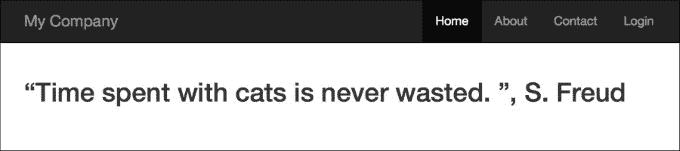

## 它是如何工作的…

装饰器相当简单。在 `ContentDecorator::begin()` 和 `ContentDecorator::end()` 之间的所有内容都会渲染到 `$content` 变量中，并传递到装饰器模板中。然后，装饰器模板被渲染并插入到调用 `ContentDecorator::end()` 的位置。

我们可以使用 `ContentDecorator::begin()` 的第二个参数将额外的变量传递到装饰器模板中，例如我们为作者所做的。

注意，我们已经使用了 `@app/views/decorators/quot` `e.php` 作为视图路径。

## 参见

+   [`www.yiiframework.com/doc-2.0/yii-widgets-contentdecorator.html`](http://www.yiiframework.com/doc-2.0/yii-widgets-contentdecorator.html) URL 提供了更多关于装饰器的详细信息：

+   在视图中使用控制器上下文配方

# 定义多个布局

大多数应用程序使用单个布局来展示所有视图。然而，在某些情况下，需要多个布局。例如，一个应用程序可以在不同的页面上使用不同的布局：博客使用两个额外的列，文章使用一个额外的列，而投资组合则没有额外的列。

## 准备工作

使用官方指南中描述的 Composer 包管理器创建一个新的应用程序，指南链接为 [`www.yiiframework.com/doc-2.0/guide-startinstallation.html`](http://www.yiiframework.com/doc-2.0/guide-startinstallation.html)。

## 如何做…

1.  在 views/layouts 中创建两个布局：`blog` 和 `articles`。博客将包含以下代码：

    ```php
    <?php $this->beginContent('//layouts/main')?>
        <div>
            <?= $content ?>
        </div>
        <div class="sidebar tags">
            <ul>
                <li><a href="#php">PHP</a></li>
                <li><a href="#yii">Yii</a></li>
            </ul>
        </div>
        <div class="sidebar links">
            <ul>
                <li><a href="http://yiiframework.com/">
                    Yiiframework</a></li>
                <li><a href="http://php.net/">PHP</a></li>
            </ul>
        </div>
    <?php $this->endContent()?>
    ```

1.  文章将包含以下代码：

    ```php
    <?php

        /* @var $this yii\web\View */
    ?>

    <?php $this->beginContent('@app/views/layouts/main.php'); ?>
        <div class="container">
            <div class="col-xs-8">
                <?= $content ?>
            </div>
            <div class="col-xs-4">
                <h4>Table of contents</h4>
                <ol>
                    <li><a href="#intro">Introduction</a></li>
                    <li><a href="#quick-start">Quick start</a></li>
                    <li>..</li>
                </ol>
            </div>
        </div>
    <?php $this->endContent() ?>
    ```

1.  创建一个视图文件，`views/site/content.php`，内容如下：

    ```php
    <h1>Title</h1>
    <p>Lorem ipsum dolor sit amet, consectetur adipisicing elit, sed do eiusmod tempor incididunt ut labore et dolore magna aliqua. Ut enim ad minim veniam, quis nostrud exercitation ullamco laboris nisi ut aliquip ex ea commodo consequat. Duis aute irure dolor in reprehenderit in voluptate velit esse cillum dolore eu fugiat nulla pariatur.</p>
    ```

1.  创建三个控制器，分别命名为 `BlogController`、`ArticleController` 和 `PortfolioController`，所有三个控制器都包含索引操作。`controllers/BlogController.php` 文件的内容如下：

    ```php
    <?php

    namespace app\controllers;

    use yii\web\Controller;

    class BlogController extends Controller
    {
        public $layout = 'blog';

        public function actionIndex()
        {
            return $this->render('//site/content');
        }
    }
    ```

1.  `controllers/ArticleController.php` 文件的内容如下：

    ```php
    <?php

    namespace app\controllers;

    use yii\web\Controller;

    class ArticleController extends Controller
    {
        public $layout = 'articles';

        public function actionIndex()
        {
            return $this->render('//site/content');
        }
    }
    ```

1.  `controllers/PortfolioController.php` 文件的内容如下：

    ```php
    <?php

    namespace app\controllers;

    use yii\web\Controller;

    class PortfolioController extends Controller
    {
        public function actionIndex()
        {
            return $this->render('//site/content');
        }
    }
    ```

1.  现在尝试运行 `http://yii-book.app/?r=blog/index`: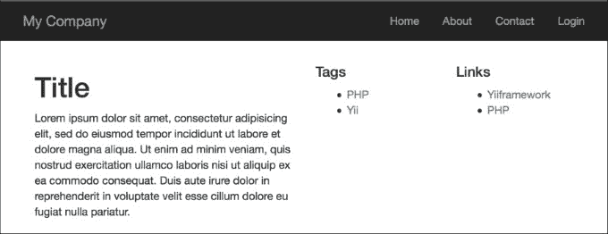

1.  然后尝试运行 `http://yii-book.app/?r=article/index`: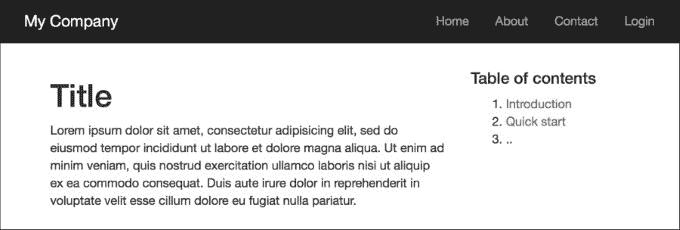

1.  最后，尝试运行 `http://yii-book.app/?r=portfolio/index`: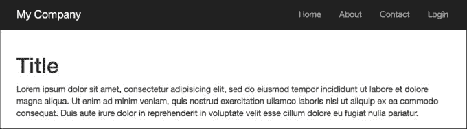

## 它是如何工作的…

我们为博客和文章定义了两个额外的布局。因为我们不想从主布局中复制和粘贴公共部分，所以我们使用 `$this->beginContent` 和 `$this->endContent` 应用额外的布局装饰器。

因此，我们使用在文章布局内部渲染的视图作为主布局的`$content`。

## 参见

+   [`www.yiiframework.com/doc-2.0/guide-structure-views.html#nested-layouts`](http://www.yiiframework.com/doc-2.0/guide-structure-views.html#nested-layouts) URL 提供了有关布局的更多详细信息。

+   *在视图中使用控制器上下文*的配方

+   *使用装饰器*的配方

# 分页和排序数据

在最新的 Yii 版本中，焦点从直接使用 Active Record 转移到了网格、列表和数据提供者。尽管如此，有时直接使用 Active Record 会更好。让我们看看如何列出带有排序能力的分页 AR 记录。在本节中，我们希望创建一个电影列表，并按数据库中的某些属性对其进行排序。在我们的例子中，我们将按电影标题和租金属性对电影进行排序。

## 准备工作

1.  使用官方指南中描述的 Composer 包管理器创建一个新的应用程序[`www.yiiframework.com/doc-2.0/guide-start-installation.html`](http://www.yiiframework.com/doc-2.0/guide-start-installation.html)。

1.  从[`dev.mysql.com/doc/index-other.html`](http://dev.mysql.com/doc/index-other.html)下载 Sakila 数据库。

1.  执行下载的 SQL 文件；首先执行模式，然后执行数据。

1.  在`config/main.php`中配置数据库连接以使用 Sakila 数据库。

1.  使用 Gii 创建`Film`模型。

## 如何做到这一点…

1.  首先，你需要创建`@app/controllers/FilmController.php`：

    ```php
    <?php

    namespace app\controllers;

    use app\models\Film;
    use yii\web\Controller;
    use yii\data\Pagination;
    use yii\data\Sort;

    class FilmController extends Controller
    {
        public function actionIndex()
        {
            $query = Film::find();
            $countQuery = clone $query;
            $pages = new Pagination(['totalCount' => $countQuery->count()]);
            $pages->pageSize = 5;

            $sort = new Sort([
                'attributes' => [
                    'title',
                    'rental_rate'
                ]
            ]);

            $models = $query->offset($pages->offset)
                ->limit($pages->limit)
                ->orderBy($sort->orders)
                ->all();

            return $this->render('index', [
                'models' => $models,
                'sort' => $sort,
                'pages' => $pages
            ]);
        }
    }
    ```

1.  现在，让我们实现`@app/views/film/index.php`，如下所示：

    ```php
    <?php

    use yii\widgets\LinkPager;

    /**
     * @var \app\models\Film $models
     * @var \yii\web\View $this
     * @var \yii\data\Pagination $pages
     * @var \yii\data\Sort $sort
     */

    ?>

    <h1>Films List</h1>

    <p><?=$sort->link('title')?> | <?=$sort->link('rental_rate')?></p>

    <?php foreach ($models as $model): ?>
        <div class="list-group">
            <h4 class="list-group-item-heading"> <?=$model->title ?>
                <label class="label label-default"> <?=$model->rental_rate ?>
                </label>
            </h4>
            <p class="list-group-item-text"><?=$model->description ?></p>
        </div>
    <?php endforeach ?>

    <?=LinkPager::widget([
        'pagination' => $pages
    ]); ?>
    ```

1.  尝试加载`http://yii-book.app/index.php?r=film/index`。你应该得到一个带有允许按电影标题或租金排序的列表的分页和链接：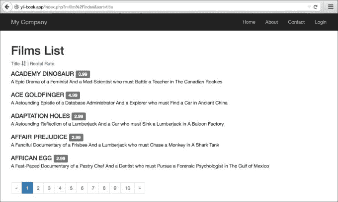

## 它是如何工作的…

首先，我们获取了总模型数，并通过将`totalCount`变量传递给我们的`Pagination`实例来初始化新的分页组件实例。然后，我们使用`$pages->pageSize`字段设置分页的页面大小。之后，我们为模型创建了一个排序器实例，指定了想要排序的模型属性，并通过调用`orderBy`并传递`$sort->orders`作为参数来应用查询的排序条件。然后，我们调用`all()`从数据库中获取记录。

到目前为止，我们有了模型列表、页面和用于链接分页的数据，以及我们用来生成排序链接的排序器。

在视图中，我们使用我们收集到的数据。首先，我们使用`Sort::link`方法生成链接。然后，我们列出模型。最后，使用*LinkPager*小部件，我们渲染分页控件。

## 参见

访问以下链接以获取有关分页和排序的更多信息：

+   [`www.yiiframework.com/doc-2.0/yii-data-pagination.html`](http://www.yiiframework.com/doc-2.0/yii-data-pagination.html)

+   [`www.yiiframework.com/doc-2.0/yii-data-sort.html`](http://www.yiiframework.com/doc-2.0/yii-data-sort.html)

+   [`www.yiiframework.com/doc-2.0/guide-output-pagination.html`](http://www.yiiframework.com/doc-2.0/guide-output-pagination.html)

+   [`www.yiiframework.com/doc-2.0/guide-output-sorting.html`](http://www.yiiframework.com/doc-2.0/guide-output-sorting.html)
