# 第三章：ActiveRecord、模型和数据库

在本章中，我们将涵盖以下主题：

+   从数据库获取数据

+   定义和使用多个 DB 连接

+   自定义 ActiveQuery 类

+   使用 AR 事件方法处理模型字段

+   自动化时间戳

+   自动设置作者

+   自动设置 slug

+   事务

+   复制和读写分离

+   实现单表继承

# 简介

在本章中，您将学习如何高效地与数据库工作，何时使用模型，何时不使用模型，如何与多个数据库工作，如何自动预处理 Active Record 字段，如何使用事务，等等。

# 从数据库获取数据

今天，大多数应用程序都使用数据库。无论是小型网站还是社交网络，至少有一部分是由数据库驱动的。

Yii 介绍了三种方法来允许您与数据库工作。具体如下：

+   Active Record

+   查询构建器

+   通过 DAO 使用 SQL

我们将使用所有这些方法从`film`、`film_actor`和`actor`表中获取数据，并在列表中显示。此外，我们还将比较执行时间和内存使用情况，以确定在哪些情况下应该使用这些方法。

## 准备工作

1.  使用官方指南中描述的 Composer 包管理器创建一个新的应用程序，官方指南链接为[`www.yiiframework.com/doc-2.0/guide-start-installation.html`](http://www.yiiframework.com/doc-2.0/guide-start-installation.html)。

1.  从[`dev.mysql.com/doc/index-other.html`](http://dev.mysql.com/doc/index-other.html)下载 Sakila 数据库。

1.  执行下载的 SQL 文件；首先执行模式，然后执行数据。

1.  在`config/main.php`中配置 DB 连接以使用 Sakila 数据库。

1.  使用 Gii 为 actor 和 film 表创建模型。

## 如何做…

1.  创建`app/controllers/DbController.php`如下：

    ```php
    <?php

    namespace app\controllers;

    use app\models\Actor;
    use Yii;
    use yii\db\Query;
    use yii\helpers\ArrayHelper;
    use yii\helpers\Html;
    use yii\web\Controller;

    /**
    * Class DbController
    * @package app\controllers
    */
    class DbController extends Controller
    {
        /**
        * Example of Active Record usage.
        *
        * @return string
        */
        public function actionAr()
        {
            $records = Actor::find()
                            ->joinWith('films')
                            ->orderBy('actor.first_name, actor.last_name, film.title')
                            ->all();

            return $this->renderRecords($records);
        }

        /**
        * Example of Query class usage.
        *
        * @return string
        */
        public function actionQuery()
        {
            $rows = (new Query())
                ->from('actor')
                ->innerJoin('film_actor', 'actor.actor_id=film_actor.actor_id')
                ->leftJoin('film', 'film.film_id=film_actor.film_id')
                ->orderBy('actor.first_name, actor.last_name, actor.actor_id, film.title')
                ->all();

            return $this->renderRows($rows);
        }

        /**
        * Example of SQL execution usage.
        *
        * @return string
        */
        public function actionSql()
        {
            $sql = 'SELECT *
                FROM actor a
                JOIN film_actor fa ON fa.actor_id = a.actor_id
                JOIN film f ON fa.film_id = f.film_id
                ORDER BY a.first_name, a.last_name, a.actor_id, f.title';

            $rows = Yii::$app->db->createCommand($sql)->queryAll();

            return $this->renderRows($rows);
        }

        /**
        * Render records for Active Record array.
        *
        * @param array $records
        *
        * @return string
        */
        protected function renderRecords(array $records = [])
        {
            if (!$records) {
                return $this->renderContent('Actor list is empty.');
            }

            $items = [];

            foreach ($records as $record) {
                $actorFilms = $record->films
                    ? Html::ol(ArrayHelper::getColumn($record->films, 'title')): null;
                $actorName = $record->first_name.' '.$record->last_name;
                    $items[] = $actorName.$actorFilms;
           }

            return $this->renderContent(Html::ol($items, [
                'encode' => false,
            ]));
        }

        /**
        * Render rows for result of query.
        *
        * @param array $rows
        *
        * @return string
        */
        protected function renderRows(array $rows = [])
        {
            if (!$rows) {
                return $this->renderContent('Actor list is empty.');
            }

            $items = [];
            $films = [];

            $actorId = null;
            $actorName = null;
            $actorFilms = null;

            $lastActorId = $rows[0]['actor_id'];

            foreach ($rows as $row) {
                $actorId = $row['actor_id'];
                $films[] = $row['title'];

                if ($actorId != $lastActorId) {
                    $actorName = $row['first_name'].' '.$row['last_name'];
                    $actorFilms = $films ? Html::ol($films) : null;

                    $items[] = $actorName.$actorFilms;
                    $films = [];
                    $lastActorId = $actorId;
                }
            }

            if ($actorId == $lastActorId) {
                $actorFilms = $films ? Html::ol($films) : null;
                $items[] = $actorName.$actorFilms;
            }

            return $this->renderContent(Html::ol($items, [
                'encode' => false,
            ]));
        }
    }
    ```

1.  在这里，我们有三个动作对应于从数据库获取数据的三个不同方法。

1.  在运行前面的`db/ar`、`db/query`和`db/sql`动作之后，您应该得到一个显示 200 名演员和他们在其中出演的 1,000 部电影的树状图，如下截图所示：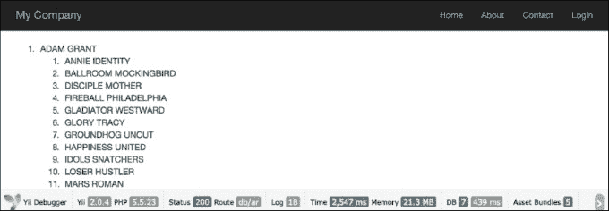

1.  在底部，有一些统计信息提供了有关内存使用和执行时间的详细信息。如果您运行此代码，绝对数字可能会有所不同，但使用的方法之间的差异应该大致相同：

    | 方法 | 内存使用（兆字节） | 执行时间（秒） |
    | --- | --- | --- |
    | Active Record | 21.4 | 2.398 |
    | 查询构建器 | 28.3 | 0.477 |
    | SQL（DAO） | 27.6 | 0.481 |

## 它是如何工作的…

`actionAr`动作方法使用 Active Record 方法获取模型实例。

我们从 Gii 生成的 `Actor` 模型开始，以获取所有演员，并指定 `joinWith => 'films'` 以使用单个查询或通过关系预加载获取相应的电影，这些关系由 Gii 从 `InnoDB` 表的外键为我们构建。然后，我们简单地遍历所有演员，并对每个演员及其每部电影进行遍历。然后，对于每个项目，我们打印其名称。

`actionQuery` 函数使用查询构建器。首先，我们使用 `\yii\db\Query` 为当前数据库连接创建查询。然后，我们使用 `from`、`joinInner` 和 `leftJoin` 逐个添加查询部分。这些方法会自动转义值、表和字段名称。`\yii\db\Query` 的 `all()` 函数返回一个原始数据库行数组。每一行也是一个数组，使用结果字段名称作为索引。我们将结果传递给 `renderRows`，它将其渲染。

使用 `actionSql`，我们做同样的事情，只是我们直接传递 SQL 而不是逐个添加其部分。值得注意的是，在使用查询字符串之前，我们应该使用 `Yii::app()->db->quoteValue` 手动转义参数值：

`renderRows` 方法渲染查询构建器。

`renderRecords` 方法渲染活动记录。

| 方法 | Active Record | 查询构建器 | SQL (DAO) |
| --- | --- | --- | --- |
| 语法 | 这将为您生成 SQL。Gii 将为您生成模型和关系。与模型一起工作，完全面向对象风格，API 非常干净。结果生成正确嵌套的模型数组。 | 清洁的 API，适合实时构建查询。结果生成原始数据数组。 | 适合复杂 SQL。手动值和关键字引用。不适合实时构建查询。结果生成原始数据数组。 |
| 性能 | 与 SQL 和查询构建器相比，内存使用量和执行时间更高。 | 正常。 | 正常。 |
| 额外功能 | 自动引用值和名称。行为。前后钩子。验证。原型选择。 | 自动引用值和名称。 | 无。 |
| 适用于 | 单个模型（模型与表单结合使用时提供巨大优势）的更新、删除和创建操作。 | 处理大量数据并在实时构建查询。 | 使用纯 SQL 完成复杂查询，并具有最大可能的性能。 |

## 更多内容...

为了了解如何在 Yii 中与数据库一起工作，请参考以下资源：

+   [`www.yiiframework.com/doc-2.0/guide-db-dao.html`](http://www.yiiframework.com/doc-2.0/guide-db-dao.html)

+   [`www.yiiframework.com/doc-2.0/guide-db-query-builder.html`](http://www.yiiframework.com/doc-2.0/guide-db-query-builder.html)

+   [`www.yiiframework.com/doc-2.0/guide-db-active-record.html`](http://www.yiiframework.com/doc-2.0/guide-db-active-record.html)

# 定义和使用多个数据库连接

在新的独立 Web 应用程序中，多数据库连接并不常用。然而，当你为现有系统构建附加应用程序时，你很可能需要另一个数据库连接。

从这个菜谱中，你将学习如何定义多个数据库连接，并使用它们与 DAO、查询构建器和活动记录模型。

## 准备工作

1.  使用 Composer 包管理器创建一个新的应用程序，如官方指南[`www.yiiframework.com/doc-2.0/guide-start-installation.html`](http://www.yiiframework.com/doc-2.0/guide-start-installation.html)中所述。

1.  创建两个名为`db1`和`db2`的 MySQL 数据库。

1.  在`db1`中创建一个名为`post`的表，如下所示：

    ```php
    DROP TABLE IF EXISTS 'post';
    CREATE TABLE IF NOT EXISTS 'post' (
        'id' INT(10) UNSIGNED NOT NULL AUTO_INCREMENT,
        'title' VARCHAR(255) NOT NULL,
        'text' TEXT NOT NULL,
         PRIMARY KEY  ('id')
    );
    ```

1.  在`db2`中创建一个名为`comment`的表，如下所示：

    ```php
    DROP TABLE IF EXISTS 'comment';
    CREATE TABLE IF NOT EXISTS 'comment' (
        'id' INT(10) UNSIGNED NOT NULL AUTO_INCREMENT,
        'text' TEXT NOT NULL,
        'post_id' INT(10) UNSIGNED NOT NULL,
         PRIMARY KEY  ('id')
    );
    ```

## 如何操作...

1.  我们将从配置数据库连接开始。打开`config/main.php`，并按照官方指南定义一个主连接：

    ```php
    'db' => [
        'connectionString' =>'mysql:host=localhost;dbname=db1',
        'username' => 'root',
        'password' => '',
        'charset' => 'utf8',
    ],
    ```

1.  复制它，将`db`组件重命名为`db2`，并相应地更改连接字符串。此外，你还需要添加类名如下：

    ```php
    'db2' => [
        'class'=>'yii\db\Connection',
        'connectionString' => 'mysql:host=localhost;dbname=db2',
        'username' => 'root',
        'password' => '',
        'charset' => 'utf8',
    ],
    ```

1.  就这样。现在你有了两个数据库连接，你可以使用它们与 DAO 和查询构建器，如下所示：

    ```php
    $rows1 = Yii::$app->db->createCommand($sql)->queryAll();
    $rows2 = Yii::$app->db2->createCommand($sql)->queryAll();
    ```

1.  现在，如果我们需要使用活动记录模型，我们首先需要使用 Gii 创建 Post 和 Comment 模型。你可以为每个模型选择一个合适的连接。在创建 Comment 模型时，将数据库连接 ID 设置为`db2`，如下所示：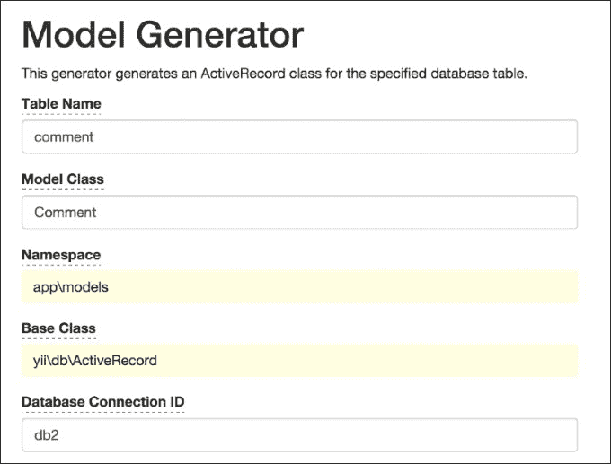

1.  现在，你可以像往常一样使用`Comment`模型，并创建`controllers/DbController.php`，如下所示：

    ```php
    <?php

    namespace app\controllers;

    use app\models\Post;
    use app\models\Comment;
    use yii\helpers\ArrayHelper;
    use yii\helpers\Html;
    use yii\web\Controller;

    /**
    * Class DbController.
    * @package app\controllers
    */
    class DbController extends Controller
    {
        public function actionIndex()
        {
            $post = new Post();
            $post->title = 'Post #'.rand(1, 1000);
            $post->text = 'text';
            $post->save();

            $posts = Post::find()->all();

            echo Html::tag('h1', 'Posts');
            echo Html::ul(ArrayHelper::getColumn($posts, 'title'));

            $comment = new Comment();
            $comment->post_id = $post->id;
            $comment->text = 'comment #'.rand(1, 1000);
            $comment->save();

            $comments = Comment::find()->all();

            echo Html::tag('h1', 'Comments');
            echo Html::ul(ArrayHelper::getColumn($comments, 'text'));
        }
    }
    ```

1.  多次运行`db/index`，你应该会看到记录被添加到两个数据库中，如下所示：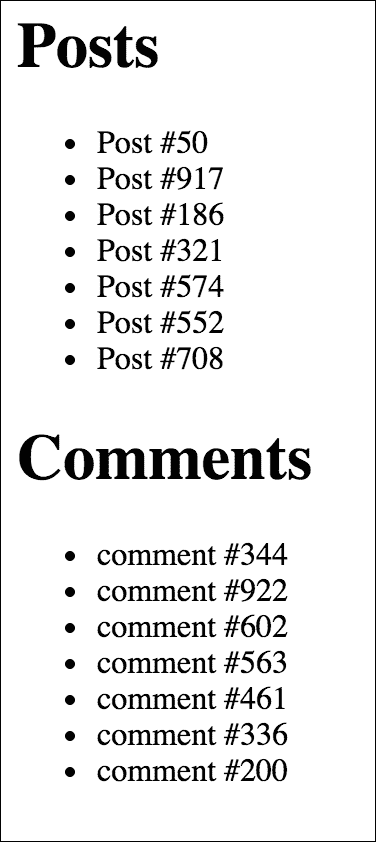

## 它是如何工作的...

在 Yii 中，你可以通过配置文件添加和配置自己的组件。对于非标准组件，如`db2`，你必须指定组件类。同样，你可以添加`db3`、`db4`或任何其他组件，例如`facebookApi`。剩余的数组键/值对分别分配给组件的公共属性。

## 还有更多...

根据使用的 RDBMS，我们可以做更多的事情来简化使用多个数据库的过程。

### 跨数据库关系

如果你使用的是 MySQL，你可以为你的模型创建跨数据库关系。为了做到这一点，你应该在`Comment`模型表名前加上数据库名，如下所示：

```php
class Comment extends \yii\db\ActiveRecord
{
    //...
    public function tableName()
    {
        return 'db2.comment';
    }
    //... 
}
```

现在，如果你在`Post`模型的关系方法中定义了评论关系，你可以使用以下代码：

```php
$posts = Post::find()->joinWith('comments')->all();
```

## 参见

对于更多信息，请参阅[`www.yiiframework.com/doc-2.0/guide-db-dao.html#creating-db-connections`](http://www.yiiframework.com/doc-2.0/guide-db-dao.html#creating-db-connections)。

# 自定义 ActiveQuery 类

默认情况下，所有 Active Record 查询都由`yii\db\ActiveQuery`支持。要在 Active Record 类中使用自定义查询类，您应该重写`yii\db\ActiveRecord::find()`方法并返回您自定义查询类的实例。

## 准备工作

1.  使用官方指南中描述的 Composer 包管理器创建一个新的应用程序，官方指南链接为[`www.yiiframework.com/doc-2.0/guide-start-installation.html`](http://www.yiiframework.com/doc-2.0/guide-start-installation.html)。

1.  按照以下步骤设置数据库连接并创建一个名为`post`的表：

    ```php
    DROP TABLE IF EXISTS 'post';
    CREATE TABLE IF NOT EXISTS 'post' (
        'id' INT(10) UNSIGNED NOT NULL AUTO_INCREMENT,
        'lang' VARCHAR(5) NOT NULL DEFAULT 'en',
        'title' VARCHAR(255) NOT NULL,
        'text' TEXT NOT NULL,
         PRIMARY KEY ('id')
    );
    INSERT INTO 'post'('id','lang','title','text')
    VALUES (1,'en_us','Yii news','Text in English'),
    (2,'de','Yii Nachrichten','Text in Deutsch');
    ```

1.  使用 Gii 生成带有已启用**生成 ActiveQuery**选项的`Post`模型，这将生成`PostQuery`类。

## 如何操作...

1.  将以下方法添加到`models/PostQuery.php`中：

    ```php
    <?php

    namespace app\models;

    /**
    * This is the ActiveQuery class for [[Post]].
    *
    * @see Post
    */
    class PostQuery extends \yii\db\ActiveQuery
    {
        /**
        * @param $lang
        *
        * @return $this
        */
        public function lang($lang)
        {
            return $this->where([ 'lang' => $lang ]);
        }
    }
    ```

1.  就这些了。现在，我们可以使用我们的模型。按照以下步骤创建`controllers/DbController.php`：

    ```php
    <?php

    namespace app\controllers;

    use app\models\Post;
    use yii\helpers\Html;
    use yii\web\Controller;

    /**
    * Class DbController.
    * @package app\controllers
    */
    class DbController extends Controller
    {
        public function actionIndex()
        {
            // Get posts written in default application language
            $posts = Post::find()->all();

            echo Html::tag('h1', 'Default language');
            foreach ($posts as $post) {
                echo Html::tag('h2', $post->title);
                echo $post->text;
            }

           // Get posts written in German
           $posts = Post::find()->lang('de')->all();

            echo Html::tag('h1', 'German');
            foreach ($posts as $post) {
                echo Html::tag('h2', $post->title);
                echo $post->text;
            }
        }
    }
    ```

1.  现在，运行`db/index`，您应该得到一个类似于以下截图的输出：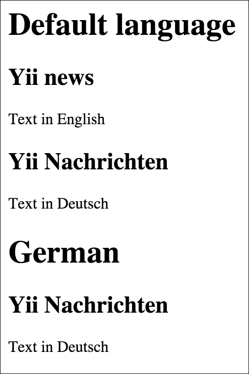

## 如何工作...

我们在`Post`模型中重写了`find`方法并扩展了 ActiveQuery 类。`lang`方法返回具有指定语言值的 ActiveQuery。为了支持链式调用，`lang`方法返回模型实例本身。

## 还有更多...

根据 Yii2 指南，在 Yii 1.1 中有一个名为“范围”的概念。在 Yii 2.0 中，范围不再直接支持，您应该使用自定义查询类和查询方法来实现相同的目标。

## 相关内容

对于更多信息，请参考以下 URL：

+   [`www.yiiframework.com/doc-2.0/guide-db-active-record.html#customizing-query-classes`](http://www.yiiframework.com/doc-2.0/guide-db-active-record.html#customizing-query-classes)

+   [`www.yiiframework.com/doc-2.0/guide-intro-upgrade-from-v1.html#active-record`](http://www.yiiframework.com/doc-2.0/guide-intro-upgrade-from-v1.html#active-record)

# 使用 AR 事件方法处理模型字段

Yii 中的 Active Record 实现非常强大，具有许多功能。其中之一是事件方法，您可以使用它来在将模型字段放入数据库或从数据库获取之前预处理模型字段，以及删除与模型相关的数据等。

在这个菜谱中，我们将链接帖子文本中的所有 URL 并列出所有现有的 Active Record 事件方法。

## 准备工作

1.  使用 Composer 包管理器创建一个新的应用程序，如官方指南中所述，官方指南链接为[`www.yiiframework.com/doc-2.0/guide-start-installation.html`](http://www.yiiframework.com/doc-2.0/guide-start-installation.html)。

1.  按照以下步骤设置数据库连接并创建一个名为`post`的表：

    ```php
    DROP TABLE IF EXISTS 'post';
    CREATE TABLE IF NOT EXISTS 'post' (
        'id' INT(10) UNSIGNED NOT NULL AUTO_INCREMENT,
        'title' VARCHAR(255) NOT NULL,
        'text' TEXT NOT NULL,
         PRIMARY KEY ('id')
    );
    ```

1.  使用 Gii 生成`post`模型。

## 如何操作...

1.  将以下方法添加到`models/Post.php`中：

    ```php
    /**
    * @param bool $insert
    *
    * @return bool
    */
    public function beforeSave($insert)
    {
        $this->text = preg_replace('~((?:https?|ftps?)://.*?)( |$)~iu',
        '<a href="\1">\1</a>\2', $this->text);

        return parent::beforeSave($insert);
    }
    ```

1.  就这些了。现在，尝试保存一个包含链接的帖子。按照以下步骤创建`controllers/TestController.php`：

    ```php
    <?php

    namespace app\controllers;

    use app\models\Post;
    use yii\helpers\Html;
    use yii\helpers\VarDumper;
    use yii\web\Controller;

    /**
    * Class TestController.
    * @package app\controllers
    */
    class TestController extends Controller
    {
        public function actionIndex()
        {
            $post = new Post();
            $post->title = 'links test';
            $post->text = 'before http://www.yiiframework.com/ after';
            $post->save();

            return $this->renderContent(Html::tag('pre', VarDumper::dumpAsString(
                $post->attributes
            )));
        }
    }
    ```

1.  就这些了。现在，运行 `test/index`。你应该得到以下结果：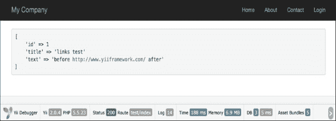

## 它是如何工作的...

`beforeSave` 方法在 `ActiveRecord` 类中实现，并在保存模型之前执行。使用正则表达式，我们替换所有看起来像 URL 的内容，并用使用此 URL 的链接替换，然后调用父实现，以确保正确地引发真实事件。为了防止保存，你可以返回 false。

## 参见

+   更多信息，请参阅[`www.yiiframework.com/doc-2.0/guide-db-active-record.html#active-record-life-cycles`](http://www.yiiframework.com/doc-2.0/guide-db-active-record.html#active-record-life-cycles)。

+   第一章中的 *使用事件* 配方，*基础*

+   *自动化时间戳* 的配方

+   *自动设置作者* 的配方

+   *自动设置缩略词* 的配方

# 自动化时间戳

例如，我们有一个简单的博客应用程序。就像任何博客一样，它有帖子、评论等。我们希望在创建/更新帖子事件期间填充时间戳。让我们假设我们的帖子模型名为 `BlogPost` 模型。

## 准备工作

1.  使用官方指南中描述的 Composer 包管理器创建一个新的应用程序，请参阅[`www.yiiframework.com/doc-2.0/guide-start-installation.html`](http://www.yiiframework.com/doc-2.0/guide-start-installation.html)。

1.  设置数据库连接并创建一个名为 `blog_post` 的表，如下所示：

    ```php
    DROP TABLE IF EXISTS 'blog_post';
    CREATE TABLE IF NOT EXISTS 'blog_post' (
        'id' INT(10) UNSIGNED NOT NULL AUTO_INCREMENT,
        'title' VARCHAR(255) NOT NULL,
        'text' TEXT NOT NULL,
        'created_date' INTEGER,
        'modified_date'INTEGER,
         PRIMARY KEY  ('id')
    );
    ```

1.  使用 Gii 为 `blog_post` 表创建一个模型。

## 如何操作...

1.  将以下方法添加到 `models/BlogPost.php`：

    ```php
    /**
    * @return array
    */
    public function behaviors()
    {
        return [
            'timestamp'=> [
                'class' => 'yii\behaviors\TimestampBehavior',
                'createdAtAttribute' => 'creation_date',
                'updatedAtAttribute' => 'modified_date'
            ]
        ];
    }
    ```

1.  创建 `controllers/TestController.php`，如下所示：

    ```php
    <?php

    namespace app\controllers;

    use app\models\BlogPost;
    use yii\helpers\Html;
    use yii\helpers\VarDumper;
    use yii\web\Controller;

    /**
    * Class TestController.
    * @package app\controllers
    */
    class TestController extends Controller
    {
        public function actionIndex()
        {
            $blogPost = new BlogPost();
            $blogPost->title = 'Gotcha!';
            $blogPost->text = 'We need some laughter to ease the tension of holiday shopping.';
            $blogPost->save();

            return $this->renderContent(Html::tag('pre',
            VarDumper::dumpAsString($blogPost->attributes)
            ));
        }
    }
    ```

1.  就这些了。现在，运行 `test/index`。你应该得到以下结果：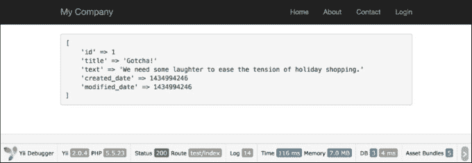

## 它是如何工作的...

默认情况下，时间戳行为会填充 `created_at`（指向模型创建时间的戳）和 `updated_at`（模型更新的时间）。命名这些字段是标准做法，但如果我们要进行更改，我们可以指定要更新的字段和模型事件。

## 还有更多...

例如，我们的字段命名为 `creation_date` 和 `modified_date`。

让我们根据这些字段配置我们的模型。此外，我们还应该将我们的行为代码添加到我们的 `Post` 模型中：

```php
<?php

namespace app\models;

use Yii;
use yii\db\BaseActiveRecord;

class Post extends \yii\db\ActiveRecord
{
    // ..
    public function behaviors()
    {
        return [
            [
                'class' => 'yii\behaviors\TimestampBehavior',
                'attributes' => [
                    BaseActiveRecord::EVENT_BEFORE_INSERT => 'creation_date',
                    BaseActiveRecord::EVENT_BEFORE_UPDATE => 'modified_date',
               ]
           ]
       ];
    }
    // ..
}
```

在这个例子中，我们通过使用特殊的 ActiveRecord 事件：`EVENT_BEFORE_INSERT` 和 `EVENT_BEFORE_UPDATE`，在创建和更新模型之前相应地指向 `creation_date` 和 `modified_date` 属性。

### 此外...

你可能想为自定义场景保存时间戳。比如说，你想更新 `last_login` 字段，例如，对于特定的控制器操作。在这种情况下，你可以使用以下方式触发特定属性的时戳更新：

```php
$model->touch('last_login');
```

注意，`touch()` 不能用于新模型。在这种情况下，您将得到 `InvalidCallException`：

```php
$model = new Post();
$model->touch('creation_date');
```

`touch()` 方法在其内部调用模型保存，因此您在调用它之后不需要保存模型。

## 参见

对于更多信息，请参阅[`www.yiiframework.com/doc-2.0/guide-concept-behaviors.html#using-timestampbehavior`](http://www.yiiframework.com/doc-2.0/guide-concept-behaviors.html#using-timestampbehavior)。

# 自动设置作者

`Blameable` 行为允许您自动更新一个或多个作者的字段。这主要用于将数据填充到 `created_by` 和 `updated_by` 字段中。类似于 Timestamp 行为，您可以轻松指定一些特殊参数和基本事件来使用此行为。

让我们回到上一节的例子。在我们的博客应用程序中，我们也有帖子。例如，假设我们的博客模型被命名为 `BlogPost`。该模型有 `author_id` 字段，它指向创建此帖子的用户，还有 `updater_id` 字段，它指向更新它的用户。我们希望在创建/更新模型事件期间自动填充这些属性。现在您可以学习如何做到这一点。

## 准备工作

1.  使用官方指南中描述的 Composer 包管理器创建一个新的应用程序，请参阅[`www.yiiframework.com/doc-2.0/guide-start-installation.html`](http://www.yiiframework.com/doc-2.0/guide-start-installation.html)。

1.  设置数据库连接并创建一个名为 `blog_post` 的表，如下所示：

    ```php
    DROP TABLE IF EXISTS 'blog_post';
    CREATE TABLE IF NOT EXISTS 'blog_post' (
        'id' INT(10) UNSIGNED NOT NULL AUTO_INCREMENT,
        'author_id' INT(10) UNSIGNED DEFAULT NULL,
        'updater_id' INT(10) UNSIGNED DEFAULT NULL,
        'title' VARCHAR(255) NOT NULL,
        'text' TEXT NOT NULL,
        PRIMARY KEY  ('id')
    );
    ```

1.  使用 Gii 为 `blost_post` 表创建 `BlogPost` 模型。

## 如何做到这一点…

1.  将以下 `behaviors` 方法添加到 `models/BlogPost.php`：

    ```php
    <?php

    namespace app\models;

    use Yii;
    use yii\db\BaseActiveRecord;

    /**
    * This is the model class for table "blog_post".
    *
    * @property integer $id
    * @property integer $author_id
    * @property integer $updater_id
    * @property string $title
    * @property string $text
    */
    class BlogPost extends \yii\db\ActiveRecord
    {
        /**
        * @return array
        */
        public function behaviors()
        {
            return [
                [
                    'class' => 'yii\behaviors\BlameableBehavior',
                    'attributes' => [
                        BaseActiveRecord::EVENT_BEFORE_INSERT => 'author_id',
                        BaseActiveRecord::EVENT_BEFORE_UPDATE => 'updater_id'
                    ]
                ]
            ];
        }
    }
    ```

1.  按照以下方式创建 `controllers/TestController.php`：

    ```php
    <?php

    namespace app\controllers;

    use app\models\BlogPost;
    use app\models\User;
    use Yii;
    use yii\helpers\Html;
    use yii\helpers\VarDumper;
    use yii\web\Controller;

    /**
    * Class TestController.
    * @package app\controllers
    */
    class TestController extends Controller
    {
        public function actionIndex()
        {
            $users = new User();
            $identity = $users->findIdentity(100);

            Yii::$app->user->setIdentity($identity);

            $blogPost = new BlogPost();
            $blogPost->title = 'Very pretty title';
            $blogPost->text = 'Success is not final, failure is not fatal...';
            $blogPost->save();

            return $this->renderContent(Html::tag('pre', VarDumper::dumpAsString(
                $blogPost->attributes
            )));
        }
    }
    ```

1.  就这样。现在，运行 `test/index`。您将得到以下结果：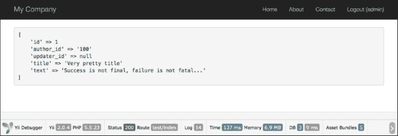

## 它是如何工作的...

默认情况下，`Blameable` 行为填充 `created_by` 和 `updated_by` 属性，但我们将进行更改，并根据自己的字段设置我们的行为。

我们还在模型中指定了模型事件和字段，因此，在模型创建期间，`author_id` 将被填充。同样，在模型更新期间，我们将填充 `updater_id`。

`Blameable` 的作用是在创建/更新模型事件期间将当前用户 ID 值插入到 `created_by` 和 `updated_by` 字段中。这是一种非常方便的做法。每次模型被创建或更新时，我们都会自动填写这些基本字段。

这对于小型项目来说效果很好，例如对于大型系统，其中多个用户是管理员，你需要跟踪谁在做什么。你也可以用于前端实现，例如，如果你有一个`blog_comment`表，你想要使用这种方法来跟踪评论的作者。此外，你可以在控制器中设置作者的字段，但行为可以帮助你避免编写不必要的额外代码。这是一个非常有效且简单的方法来实现这一点。

## 还有更多…

有时我们需要用除当前用户 ID 之外的其他 ID 填写`author_id`和`updater_id`。在这种情况下，我们可能需要按照以下方式移除我们的行为：

```php
$model->detachBehavior('blammable');
```

我们可以用这种方式移除任何我们喜欢的行为。

## 参见

如需更多信息，请参阅[`www.yiiframework.com/doc-2.0/yii-behaviors-blameablebehavior.html`](http://www.yiiframework.com/doc-2.0/yii-behaviors-blameablebehavior.html)。

# 自动设置缩略名

在网络上，缩略名是用于 URL 中标识和描述资源的简短文本。缩略名是 URL 的一部分，它使用人类可读的关键字来标识一个页面。可缩略行为是 Yii2 模型行为，允许我们生成唯一的缩略名。

在本节中，我们将指导你修改 Yii 的默认视图 URL 路由，使其对模型对象更加用户友好和搜索引擎友好。Yii 通过其可缩略行为提供了内置支持。

## 准备工作

1.  使用 Composer 包管理器创建一个新的应用程序，如官方指南中所述[`www.yiiframework.com/doc-2.0/guide-start-installation.html`](http://www.yiiframework.com/doc-2.0/guide-start-installation.html)。

1.  设置数据库连接并创建一个名为`blog_post`的表，如下所示：

    ```php
    DROP TABLE IF EXISTS 'blog_post';
    CREATE TABLE IF NOT EXISTS 'blog_post' (
        'id' INT(10) UNSIGNED NOT NULL AUTO_INCREMENT,
        'title' VARCHAR(255) NOT NULL,
        'slug' VARCHAR(255) NOT NULL,
        'text' TEXT NOT NULL,
        PRIMARY KEY ('id')
    );
    ```

1.  使用 Gii 为帖子表创建模型。

## 如何做…

1.  将以下`behaviors`方法添加到`models/BlogPost.php`中：

    ```php
    <?php

    namespace app\models;

    use Yii;
    use yii\db\BaseActiveRecord;

    class BlogPost extends \yii\db\ActiveRecord
    {
        // ..
        public function behaviors()
        {
            return [
                [
                    'class' => 'yii\behaviors\SluggableBehavior',
                    'attribute' => 'title',
                    'slugAttribute' => 'slug',
                    'immutable'=> false,
                    'ensureUnique' => true
                ]
            ];
        }
        // ..
    }
    ```

1.  按照以下方式创建`controllers/TestController.php`：

    ```php
    <?php

    namespace app\controllers;

    use app\models\BlogPost;
    use Yii;
    use yii\helpers\Html;
    use yii\helpers\VarDumper;
    use yii\web\Controller;

    /**
    * Class TestController
    * @package app\controllers
    */
    class TestController extends Controller
    {
        public function actionIndex()
        {
            $blogPostA        = new BlogPost();
            $blogPostA->title = 'Super Quote title 1';
            $blogPostA->text  = 'The price of success is hard work, dedication to the job at hand';
            $blogPostA->save();

            $blogPostB        = new BlogPost();
            $blogPostB->title = 'Super Quote title 2';
            $blogPostB->text  = 'Happiness lies in the joy of achievement...';
            $blogPostB->save();

            return $this->renderContent(
                '<pre>' .
                VarDumper::dumpAsString(
                  $blogPostA->attributes
              ).
              VarDumper::dumpAsString(
                  $blogPostB->attributes
              ) .
              '</pre>'
          );
      }
    }
    ```

1.  结果将如下所示：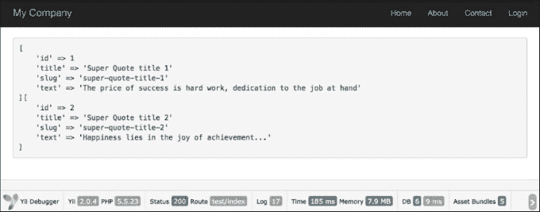

## 它是如何工作的…

+   Yii 为`SluggableBehavior`提供了一些有用的增强功能。

+   例如，一旦搜索引擎记录了一个缩略名，你可能不希望页面 URL 发生变化。

+   不可变属性告诉 Yii 在首次创建后保持缩略名不变——即使标题将被更新。

+   如果用户输入的内容重叠的消息，`ensureUnique`属性将自动为重复项添加一个唯一的后缀。这确保了每个消息都有一个唯一的 URL，即使消息是相同的。

+   如果你继续创建一个与标题完全相同的另一篇帖子，你会发现它的缩略名已增加为 hot-update-for-ios-devices-2。

### 注意

**注意**：如果你遇到了与不可变属性相关的错误，可能需要运行 Composer 更新以获取 Yii 的最新版本。

## 还有更多…

1.  使用 Gii 为模型类`app\models\Post`和控制器类`app\controllers\BlogPostController`生成 CRUD。

1.  将以下操作添加到 `controllers/BlogPostController.php` 文件中：

    ```php
    /**
    * @param $slug
    *
    * @return string
    * @throws NotFoundHttpException
    */
    public function actionSlug($slug)
    {
        $model = BlogPost::findOne(['slug'=>$slug]);

        if ($model === null) {
            throw new NotFoundHttpException('The requested page does not exist.');
        }

        return $this->render('view', [
            'model' => $model,
            ]);
    }
    ```

1.  就这样。如果你使用 slug 值为 `sluggablebehavior-test` 的 `blogpost/slug` 运行，你将得到以下结果：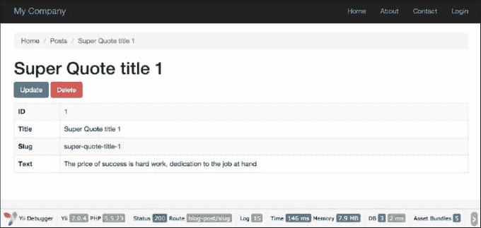

1.  建议使用创建的 `Post` 模型实例成功完成之前的 slug 调配方。

1.  为了美化 URL，请在 `config\web.php` 中添加以下 `urlManager` 组件：

    ```php
    //..
    'urlManager' => [
        'enablePrettyUrl' => true,
        'rules' => [
            'blog-post' => 'blog-post/index',
            'blog-post/index' => 'blog-post/index',
            'blog-post/create' => 'blog-post/create',
            'blog-post/view/<id:\d+>' => 'blog-post/view',
            'blog-post/update/<id:\d+>' => 'blog-post/update',
            'blog-post/delete/<id:\d+>' => 'blog-post/delete',
            'blog-post/<slug>' => 'blog-post/slug',
            'defaultRoute' => '/site/index',
        ],
    ]
    //..
    ```

1.  确保 `'blog-post/<slug>' => 'blog-post/slug'` 规则在帖子 URL 规则列表中是最后一个。

1.  现在，如果你使用 slug URL 访问页面，例如 `index.php/blog-post/super-quote-title-1/`，你将得到类似于第 3 步的结果：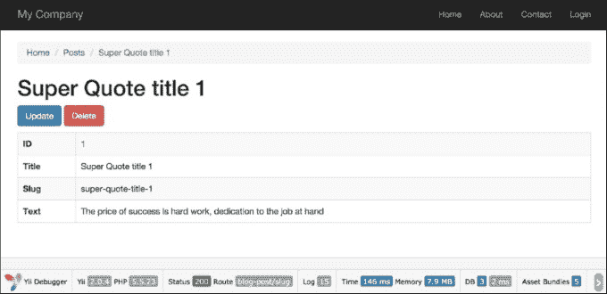

## 参见

有关更多信息，请参阅：

+   [`www.yiiframework.com/doc-2.0/yii-behaviors-sluggablebehavior.html`](http://www.yiiframework.com/doc-2.0/yii-behaviors-sluggablebehavior.html)

+   [`www.yiiframework.com/doc-2.0/guide-runtime-routing.html#url-rules`](http://www.yiiframework.com/doc-2.0/guide-runtime-routing.html#url-rules)

# 事务

在现代数据库中，事务还会做一些其他事情，例如确保你不能访问其他人半途写入的数据。然而，基本思想是相同的——事务是为了确保无论发生什么情况，你处理的数据都将处于合理的状态。它们保证不会出现从某个账户提取了钱，但没有存入另一个账户的情况。

Yii2 支持一个强大的带有 savepoints 的事务机制。

一个经典的例子是将一笔钱从一个银行账户转到另一个账户。为此，你必须首先从源账户中提取金额，然后将其存入目标账户。操作必须完全成功。如果你半途而废，钱就会丢失，这非常糟糕。例如，我们有一个收款账户和一个付款账户。我们希望从付款账户向收款账户转账。假设我们有一个账户模型。

## 准备中...

我们的账户模型将非常简单，它只包含 `id` 和 `balance` 字段。

1.  使用官方指南中描述的 Composer 包管理器创建一个新的应用程序，官方指南链接为 [`www.yiiframework.com/doc-2.0/guide-start-installation.html`](http://www.yiiframework.com/doc-2.0/guide-start-installation.html)。

1.  创建一个迁移，使用以下命令添加账户表：

    ```php
    ./yii migrate/create create_account_table
    ```

1.  此外，使用以下代码更新刚刚创建的迁移：

    ```php
    <?php

    use yii\db\Schema;
    use yii\db\Migration;

    class m150620_062034_create_account_table extends Migration
    {
        const TABLE_NAME = '{{%account}}';

        public function up()
        {
            $tableOptions = null;
            if ($this->db->driverName === 'mysql') {
                $tableOptions = 'CHARACTER SET utf8 COLLATE utf8_general_ci ENGINE=InnoDB';
           }

           $this->createTable(self::TABLE_NAME, [
               'id' => Schema::TYPE_PK,
               'balance' => ' NUMERIC(15,2) DEFAULT NULL',
           ], $tableOptions);

        }

        public function down()
        {
            $this->dropTable(self::TABLE_NAME);
        }
    }
    ```

1.  然后，使用以下命令安装迁移：

    ```php
    ./yii migrate up
    ```

1.  使用 Gii 创建账户表的模型。

1.  创建一个迁移，为我们的表添加一些带有余额的测试 `Account` 模型：

    ```php
    ./yii migrate/create add_account_records
    ```

1.  此外，使用以下代码更新刚刚创建的迁移：

    ```php
    <?php

    use yii\db\Migration;
    use app\models\Account;

    class m150620_063252_add_account_records extends Migration
    {
        public function up()
        {
            $accountFirst = new Account();
            $accountFirst->balance = 1110;
            $accountFirst->save();

            $accountSecond = new Account();
            $accountSecond->balance = 779;
            $accountSecond->save();

            $accountThird = new Account();
            $accountThird->balance = 568;
            $accountThird->save();
            return true;
        }

        public function down()
        {
            $this->truncateTable('{{%account}}');
            return false;
        }
    }
    ```

## 如何做到这一点…

1.  将以下规则添加到 `rules` 方法中，到 `models/Account.php` 文件中：

    ```php
    public function rules()
    {
        return [
            //..
            [['balance'], 'number', 'min' => 0],
            //..
        ];
    }
    ```

1.  假设我们的余额只能是正数，不能是负数。

1.  创建具有成功和错误操作的 `TestController`：

    ```php
    <?php

    namespace app\controllers;

    use app\models\Account;
    use Yii;
    use yii\db\Exception;
    use yii\helpers\Html;
    use yii\helpers\VarDumper;
    use yii\web\Controller;

    class TestController extends Controller
    {

        public function actionSuccess()
        {
            $transaction = Yii::$app->db->beginTransaction();

            try {
                $recipient = Account::findOne(1);
                $sender    = Account::findOne(2);

                $transferAmount = 177;
                $recipient->balance += $transferAmount;
                $sender->balance -= $transferAmount;

                if ($sender->save() && $recipient->save()) {
                    $transaction->commit();

                    return $this->renderContent(
                        Html::tag('h1', 'Money transfer was successfully')
                    );
                } else {
                    $transaction->rollBack();
                    throw new Exception('Money transfer failed:' .
                    VarDumper::dumpAsString($sender->getErrors()) .
                    VarDumper::dumpAsString($recipient->getErrors())
                    );
                }
            } catch ( Exception $e ) {
                $transaction->rollBack();
                throw $e;
            }
        }

        public function actionError()
        {
            $transaction = Yii::$app->db->beginTransaction();

            try {
                $recipient = Account::findOne(1);
                $sender    = Account::findOne(3);

                $transferAmount = 1000;
                $recipient->balance += $transferAmount;
                $sender->balance -= $transferAmount;

                if ($sender->save() && $recipient->save()) {
                    $transaction->commit();

                    return $this->renderContent(
                        Html::tag('h1', 'Money transfer was successfully')
                    );
                } else {
                    $transaction->rollBack();

                    throw new Exception('Money transfer failed: ' .
                    VarDumper::dumpAsString($sender->getErrors()) .
                    VarDumper::dumpAsString($recipient->getErrors())
                   );
               }

            } catch ( Exception $e ) {
                $transaction->rollBack();
                throw $e;
            }
        }
    }
    ```

1.  运行 `test/success` 并应得到以下截图所示的输出：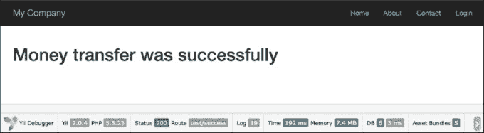

1.  在这种情况下，如果发生某些错误，事务机制将不会更新接收者和发送者的余额。

1.  运行 `test/erro`r 并应得到以下截图所示的输出：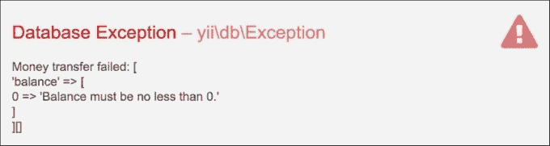

如你所记，我们向 `Account` 模型添加了一条规则，因此我们的账户余额只能是正数。在这种情况下，事务将回滚，这防止了从发送者账户中取款但未将款项存入接收者账户的情况发生。

## 另请参阅

如需更多信息，请参阅：

+   [`www.yiiframework.com/doc-2.0/guide-db-dao.html#performing-transactions`](http://www.yiiframework.com/doc-2.0/guide-db-dao.html#performing-transactions)

+   [`www.yiiframework.com/doc-2.0/guide-db-dao.html#nesting-transactions`](http://www.yiiframework.com/doc-2.0/guide-db-dao.html#nesting-transactions)

# 复制和读写分离

在这个菜谱中，我们将探讨如何进行复制和读写分离。我们将看到从服务器和主服务器如何帮助我们完成这些操作。

## 准备工作

1.  使用 Composer 包管理器创建一个新的应用程序，如官方指南[`www.yiiframework.com/doc-2.0/guide-start-installation.html`](http://www.yiiframework.com/doc-2.0/guide-start-installation.html)中所述。

1.  按照官方指南设置数据库连接并创建一个名为 `post` 的表，如下所示：

    ```php
    DROP TABLE IF EXISTS 'blog_post';
    CREATE TABLE IF NOT EXISTS 'blog_post' (
        'id' INT(10) UNSIGNED NOT NULL AUTO_INCREMENT,
        'title' VARCHAR(255) NOT NULL,
        'text' TEXT NOT NULL,
        'created_at' INTEGER,
        'modified_at'INTEGER,
         PRIMARY KEY  ('id')
    );
    ```

1.  为 `blog_post` 表生成 `BlogPost` 模型。

1.  在你的数据库服务器之间配置主从复制，例如，如文章[`www.digitalocean.com/community/tutorials/how-to-set-up-master-slave-replication-in-mysql/`](https://www.digitalocean.com/community/tutorials/how-to-set-up-master-slave-replication-in-mysql/)中所述。

1.  在 `config/main.php` 中配置 `db` 组件；以下是一个配置示例：

    ```php
    'components' =>
        // ..
        'db' => [
            'class' => 'yii\db\Connection',

            'dsn' => 'mysql:host=4.4.4.4;dbname=masterdb',
            'username' => 'master',
            'password' => 'pass',
            'charset' => 'utf8',

            'slaveConfig' => [
                'username' => 'slave',
                'password' => 'pass',
            ],

            // list of slave configurations
            'slaves' => [
                ['dsn' => 'mysql:host=5.5.5.5;dbname=slavedb']
            ]
        ],
        // ..
    ]
    ```

## 如何操作…

1.  创建 `TestController.php` 如下所示：

    ```php
    <?php

    namespace app\controllers;

    use app\models\BlogPost;
    use Yii;
    use yii\helpers\Html;
    use yii\helpers\VarDumper;
    use yii\web\Controller;

    /**
    * Class TestController
    * @package app\controllers
    */
    class TestController extends Controller
    {
        public function actionIndex(){

            $masterModel = new BlogPost();
            $masterModel->title = 'Awesome';
            $masterModel->text = 'Something is going on..';
            $masterModel->save();

            $postId = $masterModel->id;

            $replModel = BlogPost::findOne($postId);

            return $this->renderContent(
                Html::tag('h2', 'Master') .
                Html::tag('pre', VarDumper::dumpAsString(
                    $masterModel
                       ? $masterModel->attributes
                       : null
                )) .
                Html::tag('h2', 'Slave') .
                Html::tag('pre', VarDumper::dumpAsString(
                    $replModel
                        ? $replModel->attributes
                        : null

                ))
            );
        }

    }
    ```

1.  运行 `test/index` 并应得到以下截图所示的输出：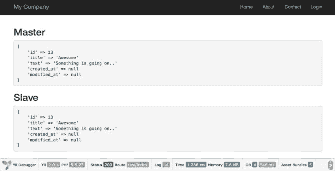

## 工作原理…

从服务器用于数据读取，而主服务器用于写入。在主服务器上保存 ActiveRecord 模型后，新记录将复制到从服务器，然后 `$replModel` 在其上查找记录。

## 还有更多…

`\yii\db\Connection` 组件支持在从库之间进行负载均衡和故障转移。当第一次执行读查询时，`\yii\db\Connection` 组件将随机选择一个从库并尝试连接到它。如果发现从库已死，它将尝试另一个。如果所有从库都不可用，它将连接到主库。通过配置服务器状态缓存，可以记住已死的服务器，这样在一段时间内就不会再次尝试连接。

## 另请参阅

如需更多信息，请参阅以下网址：

+   [`www.yiiframework.com/doc-2.0/guide-db-dao.html#replication-and-read-write-splitting`](http://www.yiiframework.com/doc-2.0/guide-db-dao.html#replication-and-read-write-splitting)

+   [`dev.mysql.com/doc/refman/5.6/en/replication.html`](http://dev.mysql.com/doc/refman/5.6/en/replication.html)

+   [`docs.mongodb.org/manual/tutorial/deploy-replica-set/`](http://docs.mongodb.org/manual/tutorial/deploy-replica-set/)

+   [`docs.mongodb.org/manual/tutorial/deploy-replica-set-for-testing/`](http://docs.mongodb.org/manual/tutorial/deploy-replica-set-for-testing/)

# 实现单表继承

关系型数据库不支持继承。如果我们需要在数据库中存储继承，我们应该通过某种方式通过代码来支持它。这段代码应该高效，因此应该尽可能少地生成 JOIN 操作。对此问题的一个常见解决方案是由 *Martin Fowler* 描述的，被称为**单表继承**。

当我们使用这种模式时，我们将整个类树的数据存储在单个表中，并使用类型字段来确定每一行的模型。

例如，我们将为以下类树实现单表继承：

Car

|- SportCar

|- FamilyCar

## 准备工作

1.  使用 Composer 包管理器创建一个新的应用程序，具体操作请参考官方指南中的[`www.yiiframework.com/doc-2.0/guide-start-installation.html`](http://www.yiiframework.com/doc-2.0/guide-start-installation.html)。

1.  创建并设置数据库。添加以下表：

    ```php
    DROP TABLE IF EXISTS 'car';
    CREATE TABLE 'car' (
        'id' int(10) UNSIGNED NOT NULL AUTO_INCREMENT,
        'name' varchar(255) NOT NULL,
        'type' varchar(100) NOT NULL,
         PRIMARY KEY ('id')
    );

    INSERT INTO 'car' ('name', 'type')
    VALUES ('Ford Focus', 'family'),
    ('Opel Astra', 'family'),
    ('Kia Ceed', 'family'),
    ('Porsche Boxster', 'sport'),
    ('Ferrari 550', 'sport');
    ```

1.  使用 Gii 为 `car` 表创建一个 `Car` 模型，并为 `Car` 模型生成 ActiveQuery。

## 如何做这件事...

1.  将以下方法和属性添加到 `models/CarQuery.php`:

    ```php
    /**
    * @var
    */
    public $type;

    /**
    * @param \yii\db\QueryBuilder $builder
    *
    * @return \yii\db\Query
    */
    public function prepare($builder)
        {
            if ($this->type !== null) {
                $this->andWhere(['type' => $this->type]);
            }
            return parent::prepare($builder);
        }
    ```

1.  按照以下方式创建 `models/SportCar.php`:

    ```php
    <?php

    namespace app\models;

    use Yii;

    /**
    * Class SportCar
    * @package app\models
    */
    class SportCar extends Car
    {
        const TYPE = 'sport';

        /**
        * @return CarQuery
        */
        public static function find()
        {
            return new CarQuery(get_called_class(), ['where' => ['type' => self::TYPE]]);
        }

        /**
        * @param bool $insert
        *
        * @return bool
        */
        public function beforeSave($insert)
        {
            $this->type = self::TYPE;
            return parent::beforeSave($insert);
        }
    }
    ```

1.  按照以下方式创建 `models/FamilyCar.php`:

    ```php
    <?php

    namespace app\models;

    use Yii;

    /**
    * Class FamilyCar
    * @package app\models
    */
    class FamilyCar extends Car
    {
        const TYPE = 'family';

        /**
        * @return CarQuery
        */
        public static function find()
        {
            return new CarQuery(get_called_class(), ['where' => ['type' => self::TYPE]]);
        }

        /**
        * @param bool $insert
        *
        * @return bool
        */
        public function beforeSave($insert)
        {
            $this->type = self::TYPE;
            return parent::beforeSave($insert);
        }
    }
    ```

1.  将以下方法添加到 `models/Car.php`:

    ```php
        /**
        * @param array $row
        *
        * @return Car|FamilyCar|SportCar
        */
        public static function instantiate($row)
        {
            switch ($row['type']) {
                case SportCar::TYPE:
                    return new SportCar();
                case FamilyCar::TYPE:
                    return new FamilyCar();
                default:
                    return new self;
            }
        }
    ```

1.  添加以下代码的 `TestController`:

    ```php
    <?php

    namespace app\controllers;

    use app\models\Car;
    use app\models\FamilyCar;
    use Yii;
    use yii\helpers\Html;
    use yii\web\Controller;

    /**
    * Class TestController
    * @package app\controllers
    */
    class TestController extends Controller
    {
        public function actionIndex()
        {
            echo Html::tag('h1', 'All cars');

            $cars = Car::find()->all();
            foreach ($cars as $car) {
                // Each car can be of class Car, SportCar or FamilyCar
                echo get_class($car).' '.$car->name."<br />";
            }

            echo Html::tag('h1', 'Family cars');

            $familyCars = FamilyCar::find()->all();
            foreach($familyCars as $car)
            {
                // Each car should be FamilyCar
                echo get_class($car).' '.$car->name."<br />";
            }
        }
    }
    ```

1.  运行 `test/index`，你应该会得到以下截图所示的输出：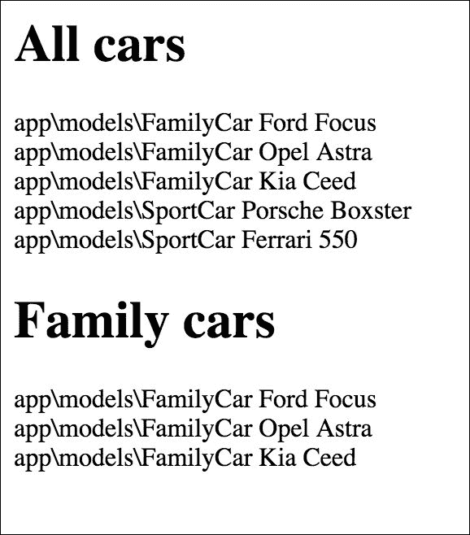

## 它是如何工作的...

基础模型 `Car` 是一个典型的 Yii AR 模型，除了它有两个附加的方法。`tableName` 方法明确声明了用于模型的表名。对于 `Car` 模型本身来说，这没有意义，但对于子模型来说，它将返回相同的汽车表，这正是我们想要的——整个类树的单个表。`instantiate` 方法由 AR 内部使用，在调用 `Car:::find()->all()` 等方法时，从原始数据创建模型实例。我们使用 `switch` 语句根据类型属性创建不同的类，如果属性值未指定或指向不存在的类，则使用相同的类。

`SportCar` 和 `FamilyCar` 模型仅简单地设置了默认的 AR 范围，因此当我们使用 `SportCar::` `model()->` 方法搜索模型时，我们只会得到 `SportCar` 模型。

## 参考信息

使用以下参考资料了解更多关于单表继承模式和 Yii Active Record 实现的信息：

+   [`martinfowler.com/eaaCatalog/singleTableInheritance.html`](http://martinfowler.com/eaaCatalog/singleTableInheritance.html)

+   [`blog.liip.ch/archive/2012/03/27/table-inheritance-with-doctrine.html`](https://blog.liip.ch/archive/2012/03/27/table-inheritance-with-doctrine.html)

+   [`www.yiiframework.com/doc/api/CActiveRecord/`](http://www.yiiframework.com/doc/api/CActiveRecord/)
