# 第四章：表单

在本章中，我们将涵盖以下主题：

+   编写自己的验证器

+   上传文件

+   添加和自定义 CaptchaWidget

+   自定义 Captcha

+   创建自定义输入小部件

+   表格输入

+   条件验证

+   具有多个模型的复杂表单

+   AJAX 依赖的下拉列表

+   AJAX 验证

+   创建自定义客户端验证

# 简介

Yii 使处理表单变得简单，其文档几乎已经完成。尽管如此，还有一些需要澄清和示例的区域。我们将在本章中描述它们。

# 编写自己的验证器

Yii 提供了一套良好的内置表单验证器，它们覆盖了大多数开发者的典型需求，并且可高度配置。然而，在某些情况下，开发者可能需要创建自定义验证器。

这个示例是一个创建独立验证器以检查单词数量的好例子。

## 准备工作

使用 Composer 包管理器创建新应用，如官方指南中所述，请参阅 [`www.yiiframework.com/doc-2.0/guide-start-installation.html`](http://www.yiiframework.com/doc-2.0/guide-start-installation.html)。

## 如何操作...

1.  在 `@app/components/WordsValidator.php` 中创建一个独立的验证器，如下所示：

    ```php
    <?php
    namespace app\components;
    use yii\validators\Validator;
    class WordsValidator extends Validator
    {
        public $size = 50;
        public function validateValue($value){
            if (str_word_count($value) > $this->size) {
                return ['The number of words must be less than {size}', ['size' => $this->size]];
            }
            return false;
        }
    }
    ```

1.  在 `@app/models/Article.php` 中创建一个 `Article` 模型，如下所示：

    ```php
    <?php
    namespace app\models;
    use app\components\WordsValidator;
    use yii\base\Model;
    class Article extends Model
    {
        public $title;
        public function rules()
        {
            return [
                ['title', 'string'],
                ['title', WordsValidator::className(), 'size' => 10],
            ];
        }
    }
    ```

1.  按照以下方式创建 `@app/controllers/ModelValidationController.php`:

    ```php
    <?php
    namespace app\controllers;
    use app\models\Article;
    use yii\helpers\Html;
    use yii\web\Controller;
    class ModelValidationController extends Controller
    {
        private function getLongTitle()
        {
            return 'There is a very long content for current article, '.'it should be less then ten words';
        }
        private function getShortTitle()
        {
            return 'There is a shot title';
        }
        private function renderContentByModel($title)
        {
            $model = new Article();
            $model->title = $title;
            if ($model->validate()) {
                $content = Html::tag('div', 'Model is valid.',[
                    'class' => 'alert alert-success',
                ]);
            } else {
                $content = Html::errorSummary($model, [
                    'class' => 'alert alert-danger',
                ]);
            }
            return $this->renderContent($content);
        }
        public function actionSuccess()
        {
            $title = $this->getShortTitle();
            return $this->renderContentByModel($title);
        }
        public function actionFailure()
        {
            $title = $this->getLongTitle();
            return $this->renderContentByModel($title);
        }
    }
    ```

1.  通过打开 `index.php?r=model-validation/success` URL 运行 `modelValidation` 控制器的 `success` 动作，你将得到以下内容：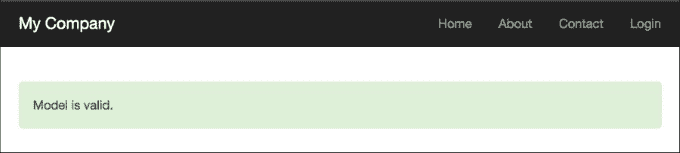

1.  通过打开 `index.php?r=model-validation/failure` URL 运行 `modelValidation` 控制器的 `failure` 动作，你将得到以下内容：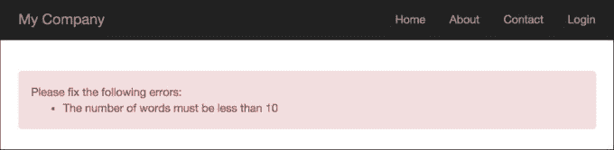

1.  按照以下方式创建 `@app/controllers/AdhocValidationController.php`:

    ```php
    <?php
    namespace app\controllers;
    use app\components\WordsValidator;
    use app\models\Article;
    use yii\helpers\Html;
    use yii\web\Controller;
    class AdhocValidationController extends Controller
    {
        private function getLongTitle()
        {
            return 'There is a very long content for current article, '.'it should be less then ten words';
        }
        private function getShortTitle()
        {
            return 'There is a shot title';
        }
        private function renderContentByTitle($title)
        {
            $validator = new WordsValidator([
                'size' => 10,
            ]);
            if ($validator->validate($title, $error)) {
                $content = Html::tag('div', 'Value is valid.',[
                    'class' => 'alert alert-success',
                ]);
            } else {
                $content = Html::tag('div', $error, [
                    'class' => 'alert alert-danger',
                ]);
            }
            return $this->renderContent($content);
        }
        public function actionSuccess()
        {
            $title = $this->getShortTitle();
            return $this->renderContentByTitle($title);
        }
        public function actionFailure()
        {
            $title = $this->getLongTitle();
            return $this->renderContentByTitle($title);
        }
    }
    ```

1.  通过打开 `index.php?r=adhoc-validation/success` URL 运行 `AdhocValidationController` 的 `success` 动作，你将得到以下内容：

1.  通过打开 `index.php?r=adhoc-validation/failure` URL 运行 `adhocValidation` 控制器的 `failure` 动作，你将得到以下内容：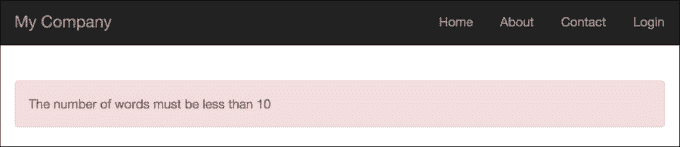

## 它是如何工作的...

首先，我们创建了一个独立的验证器，该验证器通过使用标准的 `str_word_count` PHP 函数来检查单词数量，然后演示了两个验证器使用案例：

+   在 `Article` 模型中将验证器用作验证规则

+   将验证器用作临时验证器

验证器有一个大小属性，它设置单词数量的最大值。

## 相关内容

如需更多信息，请参考以下网址：

+   [`www.yiiframework.com/doc-2.0/guide-input-validation.html`](http://www.yiiframework.com/doc-2.0/guide-input-validation.html)

+   [`www.yiiframework.com/doc-2.0/guide-tutorial-corevalidators.html`](http://www.yiiframework.com/doc-2.0/guide-tutorial-corevalidators.html)

# 上传文件

处理文件上传是 Web 应用的一个相当常见的任务。Yii 内置了一些有用的类来完成这个任务。让我们创建一个简单的表单，允许上传 ZIP 存档并将它们存储在`/uploads`。

## 准备工作

1.  使用官方指南中描述的 Composer 包管理器创建一个新的应用程序，官方指南在[`www.yiiframework.com/doc-2.0/guide-start-installation.html`](http://www.yiiframework.com/doc-2.0/guide-start-installation.html)。

1.  创建`@app/web/uploads`目录。

## 如何操作...

1.  我们将从模型开始，因此创建`@app/models/Upload.php`模型如下：

    ```php
    <?php
    namespace app\models;
    use yii\base\Model;
    use yii\web\UploadedFile;
    class UploadForm extends Model
    {
        /**
        * @var UploadedFile
        */
        public $file;
        public function rules()
        {
            return [
                ['file', 'file', 'skipOnEmpty' => false, 'extensions' => 'zip'],
            ];
        }
        public function upload()
        {
            if ($this->validate()) {
                $this->file->saveAs('uploads/' . $this->file->baseName . '.' . $this->file->extension);
               return true;
            } else {
                return false;
            }
        }
    }
    ```

1.  现在我们将转到控制器，因此创建`@app/controllers/UploadController.php`如下：

    ```php
    <?php
    namespace app\controllers;
    use Yii;
    use yii\web\Controller;
    use app\models\UploadForm;
    use yii\web\UploadedFile;
    class UploadController extends Controller
    {
        public function actionUpload()
        {
            $model = new UploadForm();
            if (Yii::$app->request->isPost) {
                $model->file = UploadedFile::getInstance($model, 'file');
                if ($model->upload()) {
                    return $this->renderContent("File {$model->file->name} is uploaded successfully");
                }
            }
            return $this->render('index', ['model' => $model]);
        }
    }
    ```

1.  最后，你可以按照以下方式查看`@app/views/upload/index.php`：

    ```php
    <?php
    use yii\widgets\ActiveForm;
    use yii\helpers\Html;
    ?>
    <?php $form = ActiveForm::begin(['options' => ['enctype' => 'multipart/form-data']]) ?>
        <?= $form->field($model, 'file')->fileInput() ?>
        <?= Html::submitButton('Upload', ['class' => 'btn-success'])?>
    <?php ActiveForm::end() ?>
    ```

1.  就这些了。现在，运行上传控制器并尝试上传 ZIP 存档和其他文件，如下面的截图所示：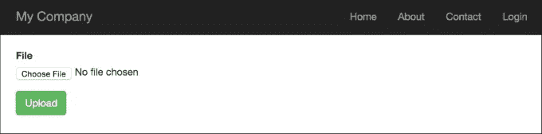

## 它是如何工作的...

我们使用的模型相当简单。我们只定义了一个字段，名为`$file`，以及一个使用`FileValidator`文件验证器的验证规则，该验证器只读取 ZIP 文件。

如果表单被提交，我们将创建一个模型实例并用`$_POST`中的数据填充它：

```php
$model->file = UploadedFile::getInstance($model, 'file');
if ($model->upload()) {
    return $this->renderContent("File {$model->file->name} is uploaded successfully");
}
```

我们然后使用`UploadedFile::getInstance`，这使我们能够访问使用`UploadedFile`实例。这个类是 PHP 在文件上传时填充的`$_FILE`数组的包装器。我们通过调用模型的`validate`方法来确保文件是 ZIP 存档，然后我们使用`UploadedFile::saveAs`来保存文件。

为了上传文件，HTML 表单必须满足以下两个重要要求：

+   方法必须设置为`POST`

+   `enctype`属性必须设置为`multipart/form-data`

重要的是要记住，你需要将`enctype`选项添加到表单中，以便文件能够正确上传。

我们可以使用`Html`辅助器或设置`htmlOptions`的`ActiveForm`来生成此 HTML。在这里，使用了 HTML：

```php
<?= Html::beginForm('', 'post', ['enctype'=>'multipart/form-data'])?>
```

最后，我们显示一个错误和一个用于模型文件属性的输入字段，并渲染一个提交按钮。

## 还有更多...

要上传多个文件，Yii2 实现了两个特殊的方法。

例如，你在视图文件中定义了模型中的`$imageFiles`，在公共文件中所有这些都将相同，只有一点不同：

```php
..
<?= $form->field($model, 'imageFiles[]')->fileInput(['multiple' => true, 'accept' => 'image/*']) ?>
..
```

要获取所有文件实例，你必须调用`UploadedFile::getInstances()`而不是`UploadedFile::getInstance()`：

```php
..
$model->imageFiles = UploadedFile::getInstances($model, 'imageFiles');
..
```

处理和保存多个文件可以通过一个简单的代码片段来完成：

```php
foreach ($this->imageFiles as $file) {
    $file->saveAs('uploads/' . $file->baseName . '.' . $file->extension);
}
```

## 参见

更多信息，请参考：

+   [`www.yiiframework.com/doc-2.0/guide-input-file-upload.html`](http://www.yiiframework.com/doc-2.0/guide-input-file-upload.html)

+   [`www.yiiframework.com/doc-2.0/guide-input-file-upload.html#uploading-multiple-files`](http://www.yiiframework.com/doc-2.0/guide-input-file-upload.html#uploading-multiple-files)

# 添加和自定义 CaptchaWidget

现在，在互联网上，如果你不添加垃圾邮件保护就留下一个表单，你将在短时间内收到大量的垃圾数据。Yii 包括一个验证码组件，使得添加此类保护变得轻而易举。唯一的问题是，没有关于如何使用它的系统指南。

在以下示例中，我们将向一个简单的表单添加验证码保护。

## 准备工作

1.  使用 Composer 包管理器创建一个新的应用程序，如官方指南中所述，[`www.yiiframework.com/doc-2.0/guide-start-installation.html`](http://www.yiiframework.com/doc-2.0/guide-start-installation.html)。

1.  创建一个表单模型，`@app/models/EmailForm.php`，如下所示：

    ```php
    <?php
    namespace app\models;
    use yii\base\Model;
    class EmailForm extends Model
    {
        public $email;
        public function rules()
        {
            return [
                ['email', 'email']
            ];
        }
    }
    ```

1.  创建一个控制器，`@app/controllers/EmailController.php`，如下所示：

    ```php
    <?php
    namespace app\controllers;
    use Yii;
    use yii\web\Controller;
    use app\models\EmailForm;
    class EmailController extends Controller
    {
        public function actionIndex(){
            $success = false;
            $model = new EmailForm();
            if ($model->load(Yii::$app->request->post()) && $model->validate()) {
                Yii::$app->session->setFlash('success', 'Success!');
            }
            return $this->render('index', [
                'model' => $model,
                'success' => $success,
            ]);
        }
    }
    ```

1.  创建一个视图，`@app/views/email/index.php`，如下所示：

    ```php
    <?php
    use yii\helpers\Html;
    use yii\captcha\Captcha;
    use yii\widgets\ActiveForm;
    ?>
    <?php if (Yii::$app->session->hasFlash('success')): ?>
        <div class="alert alert-success"><?=Yii::$app->session->getFlash('success')?></div>
    <?php else: ?>
        <?php $form = ActiveForm::begin()?>
            <div class="control-group">
                <div class="controls">
                    <?= $form->field($model, 'email')->textInput(['class' => 'form-control']); ?>
                    <?php echo Html::error($model, 'email', ['class' => 'help-block'])?>
                </div>
            </div>
            <?php if (Captcha::checkRequirements() && Yii::$app->user->isGuest): ?>
                <div class="control-group">
                    <?= $form->field($model, 'verifyCode')->widget(\yii\captcha\Captcha::classname(), [
                    'captchaAction' => 'email/captcha'
                    ]) ?>
                </div>
            <?php endif; ?>
            <div class="control-group">
                <label class="control-label" for=""></label>
                <div class="controls">
                    <?=Html::submitButton('Submit', ['class' => 'btn btn-success'])?>
                </div>
            </div>
        <?php ActiveForm::end()?>
    <?php endif;?>
    ```

1.  现在，我们有一个电子邮件提交表单，如下面的截图所示，它验证电子邮件字段。让我们添加验证码：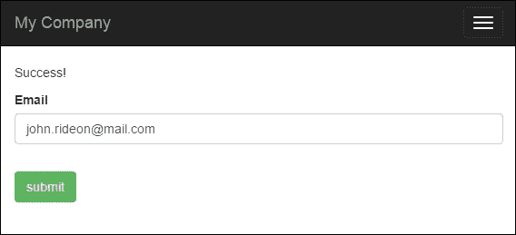

## 如何操作...

1.  首先，我们需要自定义表单模型。我们需要添加`$verifyCode`，它将保存输入的验证码，并为其添加一个验证规则：

    ```php
    <?php
    namespace app\models;
    use yii\base\Model;
    use yii\captcha\Captcha;
    class EmailForm extends Model
    {
        public $email;
        public $verifyCode;
        public function rules()
        {
            return [
                ['email', 'email'],
                ['verifyCode', 'captcha', 'skipOnEmpty' => !Captcha::checkRequirements(), 'captchaAction' => 'email/captcha']
            ];
        }
    }
    ```

1.  然后，我们需要向控制器添加一个外部操作。向其中添加以下代码：

    ```php
    public function actions()
    {
        return [
            'captcha' => [
                'class' => 'yii\captcha\CaptchaAction',
            ],
        ];
    }
    ```

1.  在视图中，我们需要显示一个额外的字段和验证码图片。以下代码将为我们完成这项工作：

    ```php
    ...
    <?php if (Captcha::checkRequirements() && Yii::$app->user->isGuest): ?>
        <div class="control-group">
            <?=Captcha::widget([
                'model' => $model,
                'attribute' => 'verifyCode',
            ]);?>
            <?php echo Html::error($model, 'verifyCode')?>
        </div>
    <?php endif; ?>
    ...
    ```

1.  同时，别忘了在视图的头部部分添加`Captcha`导入：

    ```php
    <?php
        use yii\helpers\Html;
        use yii\captcha\Captcha;
    ?>
    ….
    ```

1.  就这样。现在，你可以运行电子邮件控制器，并看到验证码的实际效果，如下面的截图所示：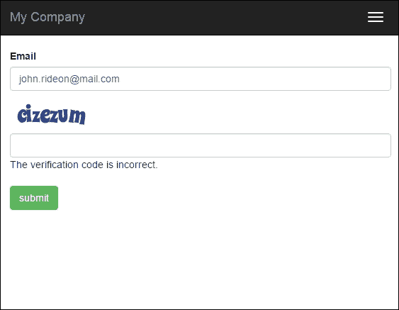

如果屏幕上没有错误，并且表单上没有`Captcha`字段，那么很可能是你没有安装和配置 GD PHP 或 Imagick 扩展。验证码需要 GD 或 Imagick，因为它生成图片。我们添加了几个`Captcha::checkRequirements()`检查，所以如果无法显示图片，应用程序将不会使用验证码，但它仍然可以工作。

## 它是如何工作的...

在视图中，我们调用验证码小部件，该小部件渲染带有指向我们添加到控制器中的验证码操作的`src`属性的`img`标签。在这个操作中，生成一个带有随机单词的图片。生成的单词是一个用户应该输入到表单中的代码。它存储在用户会话中，并向用户显示一个图片。当用户将电子邮件和验证码输入到表单中时，我们将这些值分配给表单模型，然后对其进行验证。对于验证码字段的验证，我们使用`CaptchaValidator`。它从用户会话中获取代码，并将其与输入的代码进行比较。如果它们不匹配，则模型数据被视为无效。

## 更多内容...

如果你通过使用`accessRules`控制器方法来限制对控制器操作的访问，别忘了授予每个人对这些操作的访问权限：

```php
public function behaviors()
{
    return [
        'access' => [
            'class' => AccessControl::className(),
            'rules' => [
                [
                    'actions' => ['index', 'captcha'],
                    'allow' => true,
                ]
            ],
        ],
    ];
}
```

# 自定义验证码

标准的 Yii 验证码足以保护你免受垃圾邮件的侵扰，但有时你可能想对其进行自定义，例如以下情况：

+   您面临一个能够读取图像文本的垃圾邮件机器人，您需要增加更多的安全性

+   您希望使其更有趣或更容易输入 Captcha 文本

在我们的例子中，我们将修改 Yii 的 Captcha，使其要求用户解决一个真正的简单算术谜题，而不是仅仅重复图像中的文本。

## 准备工作

作为本例的起点，我们将采用 *添加和自定义 CaptchaWidget* 菜谱的结果。或者，您也可以采用任何使用 Captcha 的表单，因为我们并没有大量修改现有代码。

## 如何实现...

我们需要自定义 `CaptchaAction`，该动作生成代码并渲染其图像表示。代码应该是一个随机数，表示应该是一个给出相同结果的算术表达式：

1.  创建一个 `@app/components/MathCaptchaAction.php` 动作，如下所示：

    ```php
    <?php
    namespace app\components;
    use \Yii;
    use yii\captcha\CaptchaAction;
    class MathCaptchaAction extends CaptchaAction
    {
        protected function renderImage($code)
        {
            return parent::renderImage($this->getText($code));
        }
        protected function generateVerifyCode()
        {
            return mt_rand((int)$this->minLength,
            (int)$this->maxLength);
        }
        protected function getText($code)
        {
            $code = (int) $code;
            $rand = mt_rand(1, $code-1);
            $op = mt_rand(0, 1);
            if ($op) {
                return $code - $rand . " + "  . $rand;
            }
            else {
                return $code + $rand . " - " . " " . $rand;
            }
        }
    }
    ```

1.  现在，在我们的控制器 `actions` 方法中，我们需要将 `CaptchaAction` 替换为我们的 Captcha 动作，如下所示：

    ```php
    public function actions()
    {
        return [
            'captcha' => [
                'class' => 'app\components\MathCaptchaAction',
                'minLength' => 1,
                'maxLength' => 10,
            ],
        ];
    }
    ```

1.  现在，运行您的表单并尝试新的 Captcha。它将显示从 1 到 10 的算术表达式，并要求输入答案，如下面的截图所示：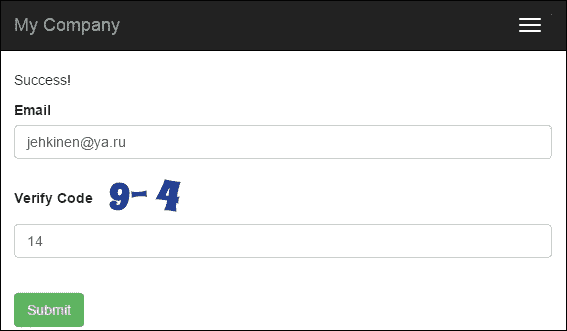

我们重写了两个 `CaptchaAction` 方法。在 `generateVerifyCode()` 方法中，我们生成一个随机数而不是文本。然后，由于我们需要渲染一个表达式而不是仅仅显示文本，我们重写了 `renderImage` 方法。这个表达式本身是在我们的自定义 `getText()` 方法中生成的。

`$minLength` 和 `$maxLenght` 属性已经在 `CaptchaAction` 中定义，所以我们不需要将它们添加到我们的 `Math` `CaptchaAction` 类中。

## 参见

如需更多信息，请参考以下内容：

+   [`www.yiiframework.com/doc-2.0/yii-captcha-captcha.html`](http://www.yiiframework.com/doc-2.0/yii-captcha-captcha.html)

+   [`www.yiiframework.com/doc-2.0/yii-captcha-captchaaction.html`](http://www.yiiframework.com/doc-2.0/yii-captcha-captchaaction.html)

+   在第二章 *路由、控制器和视图* 的 *使用独立动作* 菜谱中，*路由、控制器和视图*，请参阅

# 创建一个自定义输入小部件

Yii 拥有一套非常好的表单小部件，但就像所有现有的框架一样，Yii 并没有全部拥有它们。在本菜谱中，我们将学习如何创建自己的输入小部件。在我们的例子中，我们将创建一个范围输入小部件。

## 准备工作

使用 Composer 软件包管理器创建一个新的应用程序，如官方指南中所述，[`www.yiiframework.com/doc-2.0/guide-start-installation.html`](http://www.yiiframework.com/doc-2.0/guide-start-installation.html)。

## 如何实现...

1.  创建一个小部件文件，`@app/components/RangeInputWidget.php`，如下所示：

    ```php
    <?php
    namespace app\components;
    use yii\base\Exception;
    use yii\base\Model;
    use yii\base\Widget;
    use yii\helpers\Html;
    class RangeInputWidget extends Widget
    {
        public $model;
        public $attributeFrom;
        public $attributeTo;
        public $htmlOptions = [];
        protected function hasModel()
        {
            return $this->model instanceof Model&& $this->attributeFrom !== null&& $this->attributeTo !== null;}
        public function run()
        {
            if (!$this->hasModel()) {
                throw new Exception('Model must be set');
            }
            return Html::activeTextInput($this->model, $this->attributeFrom, $this->htmlOptions)
                .' &rarr; '
                .Html::activeTextInput($this->model, $this->attributeTo, $this->htmlOptions);
        }
    }
    ```

1.  创建一个控制器文件，`@app/controllers/RangeController.php`，如下所示：

    ```php
    <?php
    namespace app\controllers;
    use Yii;
    use yii\web\Controller;
    use app\models\RangeForm;
    class RangeController extends Controller
    {
        public function actionIndex()
        {
            $model = new RangeForm();
            if ($model->load(Yii::$app->request->post()) && $model->validate()) {
                Yii::$app->session->setFlash('rangeFormSubmitted',
                    'The form was successfully processed!'
                );
            }
            return $this->render('index', array(
                'model' => $model,
            ));
        }
    }
    ```

1.  创建一个表单文件，`@app/models/RangeForm.php`，如下所示：

    ```php
    <?php
    namespace app\models;
    use yii\base\Model;
    class RangeForm extends Model
    {
        public $from;
        public $to;
        public function rules()
        {
            return [
                [['from', 'to'], 'number', 'integerOnly' => true],
                ['from', 'compare', 'compareAttribute' => 'to', 'operator' => '<='],
            ];
        }
    }
    ```

1.  创建一个视图文件，`@app/views/range/index.php`，如下所示：

    ```php
    <?php
    use yii\helpers\Html;
    use yii\bootstrap\ActiveForm;
    use app\components\RangeInputWidget;
    ?>
    <h1>Range form</h1>
    <?php if (Yii::$app->session->hasFlash('rangeFormSubmitted')): ?>
        <div class="alert alert-success">
            <?= Yii::$app->session->getFlash('rangeFormSubmitted'); ?>
        </div>
    <?php endif?>
    <?= Html::errorSummary($model, ['class'=>'alert alert-danger'])?>
    <?php $form = ActiveForm::begin([
        'options' => [
            'class' => 'form-inline'
        ]
    ]); ?>
        <div class="form-group">
            <?= RangeInputWidget::widget([
                'model' => $model,
                'attributeFrom' => 'from',
                'attributeTo' => 'to',
                'htmlOptions' => [
                    'class' =>'form-control'
                ]
            ]) ?>
        </div>
        <?= Html::submitButton('Submit', ['class' => 'btn btn-primary', 'name' => 'contact-button']) ?>
    <?php ActiveForm::end(); ?>
    ```

1.  通过打开`index.php?r=range`运行一个`range`控制器，你将得到以下内容：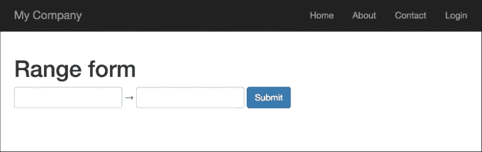

1.  在第一个文本输入字段中输入`200`，在第二个输入字段中输入`300`，你将得到以下内容：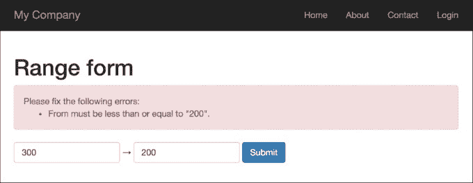

1.  如果第一个值大于第二个值，则小部件输出错误；就是这样。尝试为第一个和第二个输入分别输入正确的值`100`和`200`：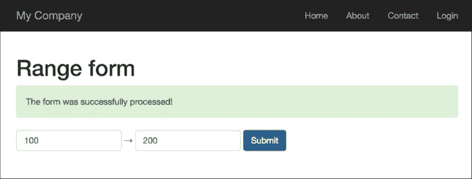

## 它是如何工作的...

我们编写了范围输入小部件，它需要四个参数：

+   `model`：如果没有设置，将抛出异常

+   `attributeFrom`：用于设置最小范围值

+   `attributeTo`：用于设置最大范围值

+   `htmlOptions`：它传递给每个输入

此小部件用于表单验证，并设置为检查第一个值是否小于或等于第二个值。

## 更多...

Yii2 框架有一个官方的 Twitter Bootstrap 扩展，它为你提供了一组 Twitter Bootstrap 小部件的 PHP 包装器。在编写你自己的小部件之前，请检查[`www.yiiframework.com/doc-2.0/extbootstrap-index.html`](http://www.yiiframework.com/doc-2.0/extbootstrap-index.html)上是否存在 Bootstrap 小部件。

## 参见

为了了解更多关于小部件的信息，您可以使用以下资源：

+   [`www.yiiframework.com/doc-2.0/yii-base-widget.html`](http://www.yiiframework.com/doc-2.0/yii-base-widget.html)

+   [`github.com/yiisoft/yii2-bootstrap/blob/master/docs/guide/usage-widgets.md`](https://github.com/yiisoft/yii2-bootstrap/blob/master/docs/guide/usage-widgets.md)

# 表格输入

在本节中，我们将向您展示如何使用模型来保存和验证相关模型。有时您可能需要在单个表单中处理同一类型的多个模型。

例如，我们有比赛和比赛的奖品。任何比赛都可能包含无限数量的奖品。因此，我们需要创建带有奖品的比赛，验证它们，显示所有错误，并将主模型（比赛模型）以及所有相关模型（奖品模型）保存到数据库中。

## 准备工作

1.  通过使用 Composer 包管理器创建新应用程序，如官方指南[`www.yiiframework.com/doc-2.0/guide-start-installation.html`](http://www.yiiframework.com/doc-2.0/guide-start-installation.html)中所述。

1.  使用以下命令为比赛和奖品表创建迁移：

    ```php
    ./yii migrate/create create_table_contest_and_prize_table
    Update just created migration's methods up() and down() by following code
    public function up()
    {
        $tableOptions = null;
        if ($this->db->driverName === 'mysql') {
            $tableOptions = 'CHARACTER SET utf8 COLLATE utf8_general_ci ENGINE=InnoDB';
        }
        $this->createTable('{{%contest}}', [
            'id' => Schema::TYPE_PK,
            'name' => Schema::TYPE_STRING . ' NOT NULL',
        ], $tableOptions);
        $this->createTable('{{%prize}}', [
            'id' => Schema::TYPE_PK,
            'name' => Schema::TYPE_STRING,
            'amount' => Schema::TYPE_INTEGER,
        ], $tableOptions);
        $this->createTable('{{%contest_prize_assn}}', [
            'contest_id' => Schema::TYPE_INTEGER,
            'prize_id' => Schema::TYPE_INTEGER,
        ], $tableOptions);
        $this-addForeignKey('fk_contest_prize_assn_contest_id', '{{%contest_prize_assn}}', 'contest_id', {{%contest}}', 'id');
        $this->addForeignKey('fk_contest_prize_assn_prize_id', '{{%contest_prize_assn}}', 'prize_id', '{{%prize}}', 'id');
    }
    public function down()
    {
        $this-dropForeignKey('fk_contest_prize_assn_contest_id', '{{%contest_prize_assn}}');
        $this->dropForeignKey('fk_contest_prize_assn_prize_id', '{{%contest_prize_assn}}');
        $this->dropTable('{{%contest_prize_assn}}');
        $this->dropTable('{{%prize}}');
        $this->dropTable('{{%contest}}');
    }
    ```

1.  然后，使用以下命令安装迁移：

    ```php
    ./yii migrate/up
    ```

1.  使用 Gii 生成比赛、奖品和`ContestPrizeAssn`模型。

## 如何操作...

1.  让我们创建`@app/controllers/ContestController.php`，并使用以下代码：

    ```php
    <?php
    namespace app\controllers;
    use app\models\Contest;
    use app\models\ContestPrizeAssn;
    use app\models\Prize;
    use Yii;
    use yii\base\Model;
    use yii\helpers\VarDumper;
    use yii\web\Controller;
    class ContestController extends Controller
    {
        public function actionCreate()
        {
            $contestName = 'Happy New Year';
            $firstPrize = new Prize();
            $firstPrize->name = 'Iphone 6s';
            $firstPrize->amount = 4;
            $secondPrize = new Prize();
            $secondPrize->name = 'Sony Playstation 4';
            $secondPrize->amount = 2;
            $contest = new Contest();
            $contest->name = $contestName;
            $prizes = [$firstPrize, $secondPrize];
            if ($contest->validate() && Model::validateMultiple($prizes)) {
                $contest->save(false);
                foreach ($prizes as $prize) {
                    $prize->save(false);
                    $contestPrizeAssn = new ContestPrizeAssn();
                    $contestPrizeAssn->prize_id = $prize->id;
                    $contestPrizeAssn->contest_id = $contest>id;
                    $contestPrizeAssn->save(false);
                }
                return $this->renderContent(
                    'All prizes have been successfully saved!'
                );
            } else {
                return $this->renderContent(
                    VarDumper::dumpAsString($contest->getErrors())
                );
            }
        }
        public function actionUpdate()
        {
            $prizes = Prize::find()->all();
            if (Model::loadMultiple($prizes, Yii::$app->request->post()) && Model::validateMultiple($prizes)) {
                foreach ($prizes as $prize) {
                    $prize->save(false);
                }
                return $this->renderContent(
                    'All prizes have been successfully saved!'
                );
            }
            return $this->render('update', ['prizes' => $prizes]);
        }
    }
    ```

1.  创建`@app/views/contest/update.php`，并在其中放置以下代码：

    ```php
    <?php
    use yii\helpers\Html;
    use yii\widgets\ActiveForm;
    $form = ActiveForm::begin();
    foreach ($prizes as $i => $prize) {
        echo $form->field($prize, "[$i]amount")->label($prize->name);
    }
    echo Html::submitButton('submit' , ['class' => 'btn btn-success']);
    ActiveForm::end();
    ```

## 它是如何工作的...

以下信息显示了如何在 Yii 中实现表格输入。

在`contest/update`动作中，我们将能够显示所有奖品及其金额，并一次性编辑它们。我们使用了两个特殊的方法：

+   `Model::loadMultiple()`：此方法使用来自最终用户的数据填充一组模型

+   `Model::validateMultiple()`：此方法接受一组模型并将它们一次性全部验证

因为我们在使用`validateMultiple()`验证了我们的模型之后，所以我们在`save()`方法中传递`false`作为参数，以避免运行两次验证。

首先，访问`/index.php?r=contest/create`页面。访问后，你会看到将验证并创建带有两个奖项的`'Happy New Year'`页面，并将奖项传递给当前的比赛模型。你应该注意，我们只有在它们有效的情况下才会将比赛模型和奖项保存到数据库中：

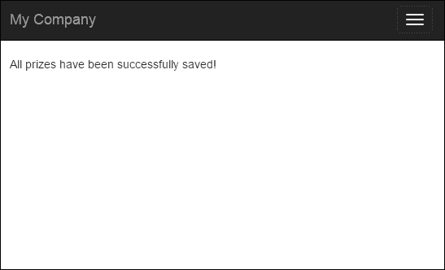

它通过以下条件提供：

```php
if ($contest->validate() && Model::validateMultiple($prizes)) { ...}
```

前往`/index.php?r=contest/update`页面，你会看到这个表单：

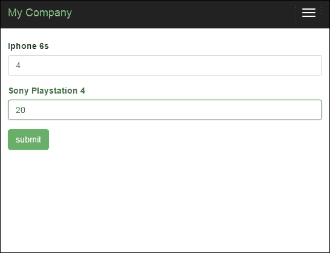

在`@app/views/contest/update.php`中为每个奖项渲染一个名称和一个金额输入。我们必须为每个输入名称添加一个索引，以便`Model::loadMultiple()`能够识别用哪些值填充哪个模型。

总之，这种方法用于在处理来自视图表单的所有属性时收集表格输入数据，并从表单中填充父模型和相关模型。

## 参见

如需更多信息，请参阅以下 URL：

[`www.yiiframework.com/doc-2.0/guide-input-tabular-input.html#collecting-tabular-input`](http://www.yiiframework.com/doc-2.0/guide-input-tabular-input.html#collecting-tabular-input)

# 条件验证

有时候在模型中启用或禁用特定的验证规则是必要的。Yii2 提供了一个机制来实现这一点。

## 准备工作

通过使用官方指南中描述的 Composer 包管理器创建一个新的应用程序，该指南的网址为[`www.yiiframework.com/doc-2.0/guide-startinstallation.html`](http://www.yiiframework.com/doc-2.0/guide-startinstallation.html)。

## 如何操作...

1.  创建一个表单文件，`@app/models/DeliveryForm.php`，如下所示：

    ```php
    <?php
    namespace app\models;
    use app\components\WordsValidator;
    use yii\base\Model;
    class DeliveryForm extends Model
    {
        const TYPE_PICKUP = 1;
        const TYPE_COURIER = 2;
        public $type;
        public $address;
        public function rules()
        {
            return [
                ['type', 'required'],
                ['type', 'in', 'range'=>[self::TYPE_PICKUP, self::TYPE_COURIER]],
                ['address', 'required', 'when' => function ($model) {
                    return $model->type == self::TYPE_COURIER;
                }, 'whenClient' => "function (attribute, value) {
                    return $('#deliveryform-type').val() == '".self::TYPE_COURIER."';
                }"]
            ];
        }
        public function typeList()
        {
            return [
                self::TYPE_PICKUP => 'Pickup',
                self::TYPE_COURIER => 'Courier delivery',
            ];
        }
    }
    ```

1.  创建一个控制器文件，`@app/controllers/ValidationController.php`，如下所示：

    ```php
    <?php
    namespace app\controllers;
    use Yii;
    use yii\web\Controller;
    use app\models\DeliveryForm;
    class ValidationController extends Controller
    {
        public function actionIndex()
        {
            $model = new DeliveryForm();
            if ($model->load(Yii::$app->request->post()) && $model->validate()) {
                Yii::$app->session->setFlash('success',
                    'The form was successfully processed!'
                );
            }
            return $this->render('index', array(
                'model' => $model,
            ));
        }
    }
    ```

1.  创建一个视图文件，`@app/views/validation/index.php`，如下所示：

    ```php
    <?php
    use yii\bootstrap\ActiveForm;
    use yii\helpers\Html;
    ?>
        <h1>Delivery form</h1>
        <?php if (Yii::$app->session->hasFlash('success')): ?>
        <div class="alert alert-success"><?= Yii::$app->session->getFlash('success'); ?></div>
        <?php endif; ?>
        <?php $form = ActiveForm::begin(); ?>
        <?= $form->field($model, 'type')->dropDownList($model->typeList(), [
            'prompt'=>'Select delivery type']
        ) ?>
        <?= $form->field($model, 'address') ?>
        <div class="form-group">
            <?= Html::submitButton('Submit', ['class' => 'btn btn-primary']) ?>
        </div>
    <?php ActiveForm::end(); ?>
    ```

1.  通过打开`index.php?r=validation` URL 来运行`validation`控制器，并为类型输入选择`courier delivery`值；然后你会得到以下结果：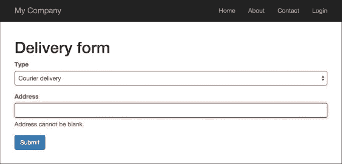

## 如何操作...

当`type`属性设置为`DeliveryForm::TYPE_COURIER`时，`DeliveryForm address`属性是必需的；否则，我们在`type`选择中选中`Courier delivery`选项。

此外，为了支持客户端条件验证，我们配置了`whenClient`属性，它接受一个表示 JavaScript 函数的字符串，其返回值决定是否应用该规则。

## 参见

如需更多信息，请参阅[`www.yiiframework.com/doc-2.0/guideinput-validation.html#conditional-validation`](http://www.yiiframework.com/doc-2.0/guideinput-validation.html#conditional-validation)

# 复杂的多模型表格

当处理一些复杂数据时，你可能需要使用多个不同的模型来收集用户输入。例如，你有一个包含用户信息（如名字、姓氏和电话号码）的订单表格；你还有一个送货地址和一些类型的产品。

你希望在一个表格中保存所有这些数据。使用 Yii 模型和支持表格，你可以轻松地做到这一点。假设用户信息将存储在用户表中，并在订单表格中，我们将保存产品信息和已订购产品的用户`user_id`。我们还有一个包含一些信息的产品表。

## 准备工作

1.  按照官方指南中的描述，使用 Composer 包管理器创建一个新的应用程序，[`www.yiiframework.com/doc-2.0/guide-start-installation.html`](http://www.yiiframework.com/doc-2.0/guide-start-installation.html)。

1.  使用以下命令为竞赛和奖品表创建迁移：

    ```php
    ./yii migrate/create create_order_tables
    ```

1.  使用以下代码更新新创建迁移的`up()`和`down()`方法：

    ```php
    <?php
    use yii\db\Schema;
    use yii\db\Migration;
    use app\models\Product;
    class m150813_161817_create_order_form_tables extends Migration
    {
        public function up()
        {
            $tableOptions = null;
            if ($this->db->driverName === 'mysql') {
                $tableOptions = 'CHARACTER SET utf8 COLLATE utf8_general_ci ENGINE=InnoDB';
            }
            $this->createTable('user', [
                'id' => Schema::TYPE_PK,
                'first_name' => Schema::TYPE_STRING . ' NOT NULL',
                'last_name' => Schema::TYPE_STRING . ' NOT NULL',
                'phone' => Schema::TYPE_STRING . ' NOT NULL',
            ], $tableOptions);
            $this->createTable('product', [
                'id' => Schema::TYPE_PK,
                'title' => Schema::TYPE_STRING . ' NOT NULL',
                'price' => Schema::TYPE_FLOAT . '(6,2) ',
            ], $tableOptions);
            $this->createTable('order', [
                'id' => Schema::TYPE_PK,
                'user_id' => Schema::TYPE_INTEGER . ' NULL',
                'address' => Schema::TYPE_STRING . ' NOT NULL',
                'product_id' => Schema::TYPE_INTEGER . ' NOT NULL',
            ], $tableOptions);
            $product1 = new Product();
            $product1->title = 'Iphone 6';
            $product1->price = 400.5;
            $product1->save();
            $product3 = new Product();
            $product3->title = 'Samsung Galaxy Note 5';
            $product3->price = 900;
            $product3->save();
            $this->addForeignKey('fk_order_product_id', 'order', 'product_id', 'product', 'id');
        }
        public function down()
        {
            $this->dropTable('order');
            $this->dropTable('user');
            $this->dropTable('product');
        }
    }
    ```

1.  然后，使用以下命令安装迁移：

    ```php
    ./yii migrate/up
    ```

1.  使用 Gii 生成用户、订单和产品模型。

## 如何操作...

1.  使用以下代码创建`@app/controllers/TestController`：

    ```php
    <?php
    namespace app\controllers;
    use app\models\Order;
    use app\models\User;
    use Yii;
    use yii\web\Controller;
    class TestController extends Controller
    {
        public function actionOrder()
        {
            $user = new User();
            $order = new Order();
            if ($user->load(Yii::$app->request->post()) && $order->load(Yii::$app->request->post())) {
            if ($user->validate() && $order->validate()) {
                $user->save(false);
                $order->user_id = $user->id;
                $order->save(false);
                $this->redirect(['/test/result', 'id' => $order->id]);
                }
            }
            return $this->render('order', ['user' => $user, 'order' => $order]);
        }
        public function actionResult($id)
        {
            $order = Order::find($id)->with('product', 'user')->one();
            return $this->renderContent(
                'Product: ' . $order->product->title . '</br>' .
                'Price: ' . $order->product->price . '</br>' .
                'Customer: ' . $order->user->first_name . ' ' . $order->user->last_name . '</br>' .
                'Address: ' . $order->address
            );
        }
    }
    ```

1.  然后创建一个视图文件，`@app/views/test/order.php`，并添加以下代码：

    ```php
    <?php
    use yii\helpers\Html;
    use yii\widgets\ActiveForm;
    use app\models\Product;
    use yii\helpers\ArrayHelper;
    /**
    * @var $user \app\models\User
    * @var $order \app\models\Order
    */
    $form = ActiveForm::begin([
        'id' => 'order-form',
        'options' => ['class' => 'form-horizontal'],
    ]) ?>
    <?= $form->field($user, 'first_name')->textInput(); ?>
    <?= $form->field($user, 'last_name')->textInput(); ?>
    <?= $form->field($user, 'phone')->textInput(); ?>
    <?= $form->field($order, 'product_id')->dropDownList(ArrayHelper::map(Product::find()->all(), 'id', 'title')); ?>
    <?= $form->field($order, 'address')->textInput(); ?>
    <?= Html::submitButton('Save', ['class' => 'btn btn-primary']) ?>
    <?php ActiveForm::end() ?>
    ```

## 如何工作...

你可以在`http://yii-book.app/index.php?r=test/order`看到这个表格。我们的表格从用户和订单模型收集信息。

让我们填写我们的表格：

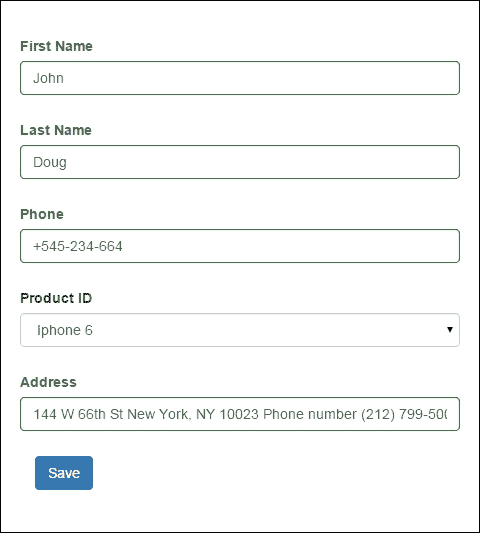

保存后，你会看到以下结果：

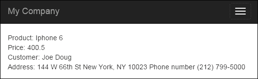

在控制器中，我们验证并存储它。当然，这个例子非常简单。在实际项目中，你可能会有多个模型，并且你可以使用这种方法来处理它们。当你想在同一个表格中创建或更新多个实例时，这种方法非常有用。

## 相关内容

对于更多信息，请参阅[`www.yiiframework.com/doc-2.0/guide-input-multiple-models.html`](http://www.yiiframework.com/doc-2.0/guide-input-multiple-models.html)

# AJAX 依赖的下拉列表

通常，你可能需要一个带有两个下拉菜单的表格，其中一个下拉菜单的值将依赖于另一个下拉菜单的值。使用 Yii 内置的 AJAX 功能，你可以创建这样的下拉菜单。

## 准备工作

1.  按照官方指南中的描述，使用 composer 创建一个新的应用程序，[`www.yiiframework.com/doc-2.0/guide-start-installation.html`](http://www.yiiframework.com/doc-2.0/guide-start-installation.html)。

1.  按照以下方式创建一个`@app/model/Product.php`模型：

    ```php
    <?php
    namespace app\models;
    use yii\db\ActiveRecord;
    class Product extends ActiveRecord
    {
        public function rules()
        {
            return [
                ['title', 'string'],
                [['title', 'category_id', 'sub_category_id'], 'required'],
                ['category_id', 'exist', 'targetAttribute' => 'id', 'targetClass' => 'app\models\Category'],
                ['sub_category_id', 'exist', 'targetAttribute' => 'id', 'targetClass' => 'app\models\Category'],
            ];
        }
        public function attributeLabels()
        {
            return [
                'category_id' => 'Category',
                'sub_category_id' => 'Sub category',
            ];
   }
    }
    ```

1.  按照以下方式创建一个`@app/models/Category.php`模型：

    ```php
    <?php
    namespace app\models;
    use yii\db\ActiveRecord;
    class Category extends ActiveRecord
    {
        public function rules()
        {
            return [
                ['title', 'string'],
            ];
        }
        /**
        * @return array
        */
        public static function getSubCategories($categoryId)
        {
            $subCategories = [];
            if ($categoryId) {
                $subCategories = self::find()
                    ->where(['category_id' => $categoryId])
                    ->asArray()
                    ->all();
            }
            return $subCategories;
        }
    }
    ```

1.  使用以下命令创建`create_category_and_product_tables`迁移：

    ```php
    ./yii migrate/create create_category_and_product_tables
    ```

1.  按照以下方式更新刚刚创建的迁移的方法和导入的类列表：

    ```php
    <?php
    use yii\db\Schema;
    use yii\db\Migration;
    class m150813_005030_create_categories extends Migration
    {
        public function up()
        {
            $tableOptions = null;
            $this->createTable('{{%product}}', [
                'id' => Schema::TYPE_PK,
                'category_id' => Schema::TYPE_INTEGER . ' NOT NULL',
                'sub_category_id' => Schema::TYPE_INTEGER . ' NOT NULL',
                'title' => Schema::TYPE_STRING . ' NOT NULL',
            ], $tableOptions);
            $this->createTable('{{%category}}', [
                'id' => Schema::TYPE_PK,
                'category_id' => Schema::TYPE_INTEGER,
                'title' => Schema::TYPE_STRING . ' NOT NULL',
            ], $tableOptions);
            $this->addForeignKey('fk_product_category_id', '{{%product}}', 'category_id', '{{%category}}', 'id');
            $this->addForeignKey('fk_product_sub_category_id', '{{%product}}', 'category_id', '{{%category}}', 'id');
            $this->batchInsert('{{%category}}', ['id', 'title'], [
                [1, 'TV, Audio/Video'],
                [2, 'Photo'],
                [3, 'Video']
            ]);
            $this->batchInsert('{{%category}}', ['category_id', 'title'], [
                [1, 'TV'],
                [1, 'Acoustic System'],
                [2, 'Cameras'],
                [2, 'Flashes and Lenses '],
                [3, 'Video Cams'],
                [3, 'Action Cams'],
                [3, 'Accessories']
            ]);
        }
        public function down()
        {
            $this->dropTable('{{%product}}');
            $this->dropTable('{{%category}}');
        }
    }
    ```

## 如何操作...

1.  按照以下方式创建控制器文件，`@app/controllers/DropdownController.php`：

    ```php
    <?php
    namespace app\controllers;
    use app\models\Product;
    use app\models\Category;
    use app\models\SubCategory;
    use Yii;
    use yii\helpers\ArrayHelper;
    use yii\helpers\Json;
    use yii\web\Controller;
    use yii\web\HttpException;
    class DropdownController extends Controller
    {
        public function actionGetSubCategories($id)
        {
            if (!Yii::$app->request->isAjax) {
                throw new HttpException(400, 'Only ajax request is allowed.');
            }
            return Json::encode(Category::getSubCategories($id));
        }
        public function actionIndex()
        {
            $model = new Product();
            if ($model->load(Yii::$app->request->post()) && $model->validate()) {
                Yii::$app->session->setFlash('success',
                'Model was successfully saved'
                );
            }
            return $this->render('index', [
                'model' => $model,
            ]);
        }
    }
    ```

1.  创建一个视图文件，`@app/views/dropdown/index.php`，如下所示：

    ```php
    <?php
    use yii\bootstrap\ActiveForm;
    use yii\helpers\Html;
    use yii\helpers\Url;
    use app\models\Category;
    use yii\helpers\ArrayHelper;
    use yii\web\View;
    $url = Url::toRoute(['dropdown/get-sub-categories']);
    $this->registerJs("
    (function(){
        var select = $('#product-sub_category_id');
        var buildOptions = function(options) {
            if (typeof options === 'object') {
                select.children('option').remove();
                $('<option />')
                    .appendTo(select)
                    .html('Select a sub category')
                $.each(options, function(index, option) {
                    $('<option />', {value:option.id})
                    .appendTo(select)
                    .html(option.title);
                });
            }
        };
        var categoryOnChange = function(category_id){
            $.ajax({
                dataType: 'json',
                url: '" . $url . "&id=' + category_id ,
                success: buildOptions
            });
        };
        window.buildOptions = buildOptions;
        window.categoryOnChange = categoryOnChange;
    })();
    ", View::POS_READY);
    ?>
    <h1>Product</h1>
    <?php if (Yii::$app->session->hasFlash('success')): ?>
        <div class="alert alert-success"><?= Yii::$app->session->getFlash('success'); ?></div>
    <?php endif; ?>
    <?php $form = ActiveForm::begin(); ?>
        <?= $form->field($model, 'title')->textInput() ?>
        <?= $form->field($model, 'category_id')->dropDownList(ArrayHelper::map(
            Category::find()->where('category_id IS NULL')->asArray()->all(),'id', 'title'), [
            'prompt' => 'Select a category',
            'onChange' => 'categoryOnChange($(this).val());',
        ]) ?>
        <?= $form->field($model, 'sub_category_id')->dropDownList(
            ArrayHelper::map(Category::getSubCategories($model->sub_category_id), 'id' ,'title'), [
            'prompt' => 'Select a sub category',
        ]) ?>
        <div class="form-group">
            <?= Html::submitButton('Submit', ['class' => 'btn btn-primary']) ?>
        </div>
    <?php ActiveForm::end(); ?>
    ```

1.  通过打开 `index.php?r=dropdown` 来运行 `dropdown` 控制器，然后为标题字段添加一个新产品 `Canon - EOS Rebel T6i DSLR` 的值：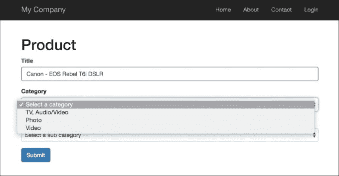

1.  如您所见，`Category` 输入有三个选项。让我们选择 **照片** 选项，然后第二个输入选择将有两个进一步选项：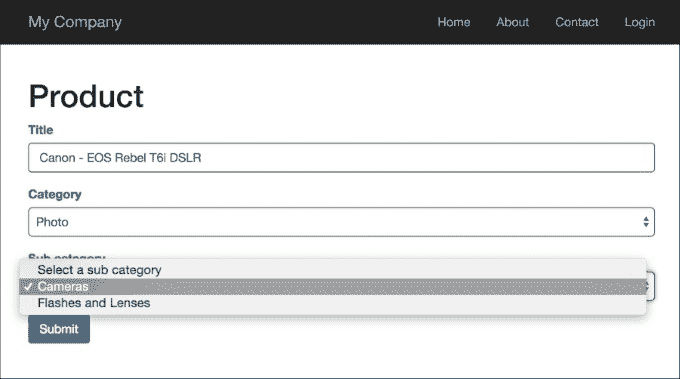

1.  就这样。如果您选择另一个类别，您将得到该类别的子类别。

## 它是如何工作的...

在这个例子中，我们有两个依赖于类别和子类别的列表，以及一个模型 `Category`。主要思想很简单：我们只是将 JQuery 的 `onChange` 事件绑定到我们表单中的 `category_id` 字段。每次用户更改此字段时，我们的应用程序都会向 `get-sub-categories` 动作发送一个 AJAX 请求。此操作返回一个以 JSON 格式编写的子类别列表，然后，在客户端，我们为子类别列表构建一个选项列表。

# AJAX 验证

一些验证只能在服务器端进行，因为只有服务器才有必要的信息。例如，为了验证公司名称或用户电子邮件是否唯一，我们必须检查服务器端的相应表。在这种情况下，您应该使用内置的 AJAX 验证。Yii2 支持 AJAX 表单验证，它本质上会将表单值发送到服务器，进行验证，并将验证错误以 JSON 格式发送回来。它会在您每次从（更改的）字段中移出标签时执行此操作。

## 准备工作

使用官方指南中描述的 Composer 软件包管理器创建一个新应用程序，[`www.yiiframework.com/doc-2.0/guide-startinstallation.html`](http://www.yiiframework.com/doc-2.0/guide-startinstallation.html)。

## 如何操作...

1.  在基本应用模板中，我们有一个简单的联系表单。您可以在 `http://yii-book.app/index.php?r=site/contact` 查看此页面。打开并修改相关的视图表单，`@app/views/site/contact.php`。要为整个表单启用 AJAX 验证，请在 `form` 配置中将 `enableAjaxValidation` 选项设置为 `true`：

    ```php
    $form = ActiveForm::begin([
        'id' => 'contact-form',
        'enableAjaxValidation' => true,
    ]);
    ```

1.  此外，您应该在服务器端添加对 AJAX 验证的处理。此代码片段仅检查当前请求是否为 AJAX，并且是否为 `POST` 请求。如果是，我们将以 JSON 格式接收错误：

    ```php
    if (Yii::$app->request->isAjax && $model->load(Yii::$app->request->post())) {
        Yii::$app->response->format = Response::FORMAT_JSON;
        return ActiveForm::validate($model);
    }
    ```

1.  让我们用以下代码修改 `SiteController` 中的 `actionContact()`：

    ```php
    public function actionContact()
    {
        $model = new ContactForm();
        if (Yii::$app->request->isAjax && $model->load(Yii::$app->request->post())) {
            Yii::$app->response->format = Response::FORMAT_JSON;
            return ActiveForm::validate($model);
        }
        if ($model->load(Yii::$app->request->post()) && $model->contact(Yii::$app->params['adminEmail'])) {
            Yii::$app->session->setFlash('contactFormSubmitted');
            return $this->refresh();
        } else {
            return $this->render('contact', [
                'model' => $model,
            ]);
        }
    }
    ```

## 它是如何工作的...

之前的代码将检查当前请求是否为 AJAX。如果是，它将通过运行验证并以 JSON 格式返回错误来响应此请求。

您可以在浏览器的调试面板中检查来自服务器的响应。尝试提交一个空表单，您将看到响应。

例如，在 Google Chrome 浏览器中，按 *F12* 并在开发工具栏中选择 **网络** 选项卡。您将看到包含错误和消息的 JSON 数组：

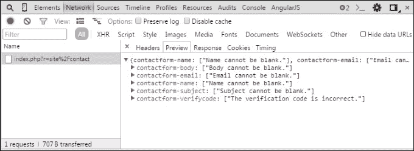

## 参见

[`www.yiiframework.com/doc-2.0/guide-input-validation.html#ajaxvalidation`](http://www.yiiframework.com/doc-2.0/guide-input-validation.html#ajaxvalidation)

# 创建自定义客户端验证

在 *编写自己的验证器* 菜谱中，我们创建了一个独立的验证器。在这个菜谱中，我们将修改一个验证器以创建额外的客户端验证，该验证器也会检查单词数量。

## 准备工作

使用 Composer 包管理器创建一个新的应用程序，如官方指南中所述，[`www.yiiframework.com/doc-2.0/guide-startinstallation.html`](http://www.yiiframework.com/doc-2.0/guide-startinstallation.html)。

## 如何做到...

1.  按照以下方式创建 `@app/components/WordsValidator.php`:

    ```php
    <?php
    namespace app\components;
    use yii\validators\Validator;
    class WordsValidator extends Validator
    {
        public $size = 50;
        public $message = 'The number of words must be less than {size}';
        public function validateValue($value)
        {
            preg_match_all('/(\w+)/i', $value, $matches);
            if (count($matches[0]) > $this->size) {
                return [$this->message, ['size' => $this->size]];
            }
        }
        public function clientValidateAttribute($model, $attribute, $view)
        {
            $message = strtr($this->message, ['{size}' => $this->size]);
            return <<<JS
            if (value.split(/\w+/gi).length > $this->size ) {
                messages.push("$message");
            }
            JS;
        }
    }
    ```

1.  按照以下方式创建 `@app/models/Article.php`:

    ```php
    <?php
    namespace app\models;
    use app\components\WordsValidator;
    use yii\base\Model;
    class Article extends Model
    {
        public $title;
        public function rules()
        {
            return [
                ['title', 'string'],
                ['title', WordsValidator::className(), 'size' => 10],
            ];
        }
    }
    ```

1.  按照以下方式创建 `@app/controllers/ValidationController.php`:

    ```php
    <?php
    namespace app\controllers;
    use app\models\Article;
    use Yii;
    use yii\web\Controller;
    class ValidationController extends Controller
    {
        public function actionIndex()
        {
            $model = new Article();
            if ($model->load(Yii::$app->request->post()) && $model->validate()) {
                Yii::$app->session->setFlash('success', 'Model is valid');
            }
            return $this->render('index', [
                'model' => $model,
            ]);
        }
    }
    ```

1.  按照以下方式创建 `@app/views/validation/index.php`:

    ```php
    <?php
    use yii\bootstrap\ActiveForm;
    use yii\helpers\Html;
    ?>
    <h1>Article form</h1>
    <?php if (Yii::$app->session->hasFlash('success')): ?>
        <div class="alert alert-success"><?= Yii::$app->session->getFlash('success'); ?></div>
    <?php endif; ?>
    <?php $form = ActiveForm::begin(); ?>
        <?= $form->field($model, 'title') ?>
        <div class="form-group">
            <?= Html::submitButton('Submit', ['class' => 'btn btn-primary']) ?>
        </div>
    <?php ActiveForm::end(); ?>
    ```

## 如何工作...

通过打开 `index.php?r=validation` 来运行验证控制器。如果你输入超过十个单词，你会看到一个错误的值示例：

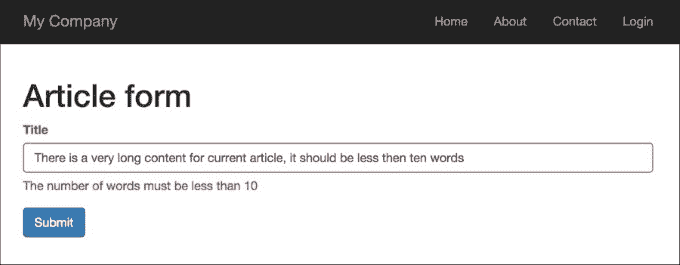

如果你输入的单词少于十个，客户端验证将成功：

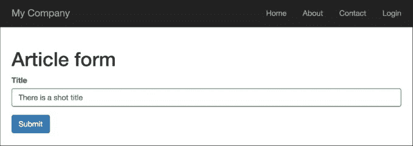

首先，我们创建了 `@app/components/WordsValidator.php`，它扩展了 `@yii\validators\Validator` 类，并将新创建的验证器类添加到 `Article` 模型的标题属性中：

```php
..
['title', WordsValidator::className(), 'size' => 10],
..
```

在我们的验证器内部，我们定义了两个特殊方法：`validateValue()` 和 `clientValidateAttribute()`。

我们的验证器类实现了 `validateValue()` 方法，以支持在数据模型上下文之外进行数据验证。第二个方法仅返回执行客户端验证所需的 JavaScript。

## 还有更多...

如果我们想隐藏验证器的实现，或者只想在服务器端控制所有验证过程，我们可以创建一个 `Deferred` 对象。

首先，修改 `WordsValidator` 验证器如下：

```php
<?php
namespace app\components;
use yii\validators\Validator;
use yii\helpers\Url;
class WordsValidator extends Validator
{
    public $size = 50;
    public $message = 'The number of words must be less than {size}';
    public function validateValue($value)
    {
        if (str_word_count($value) > $this->size) {
            return ['The number of words must be less than {size}', ['size' => $this->size]];
        }
        return false;
    }
    public function clientValidateAttribute($model, $attribute, $view)
    {
        $url = Url::toRoute(['validation/check-words']);
        return <<<JS
        deferred.push($.get("$url", {words: value}).done(function(data) {
            if (!data.result) {
                messages.push(data.error);
            }
        }));
        JS;
    }
}
```

在前面的代码中，deferred 变量是由 Yii 提供的，它是一个包含 `Deferred` 对象的数组。`$.get() jQuery` 方法创建一个 `Deferred` 对象，并将其推送到 `deferred` 数组中。

第二步，将此 `checkWords` 动作添加到 `validation` 控制器中：

```php
public function actionCheckWords()
{
    \Yii::$app->response->format = \yii\web\Response::FORMAT_JSON;
    $value = Yii::$app->getRequest()->get('words');
    $validator = new WordsValidator([
    'size' => 10,
    ]);
    $result = $validator->validate($value, $error);
    return ['result' => $result,'error' => $error
    ];
}
```

## 参见

对于更多信息，请参考以下 URL：

+   [`www.yiiframework.com/doc-2.0/guide-input-validation.html#implementing-client-side-validation`](http://www.yiiframework.com/doc-2.0/guide-input-validation.html#implementing-client-side-validation)

+   [`www.yiiframework.com/doc-2.0/guide-input-validation.html#deferred-validation`](http://www.yiiframework.com/doc-2.0/guide-input-validation.html#deferred-validation)
