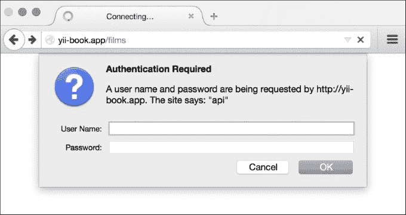

# 第六章。RESTful 网络服务

在本章中，我们将涵盖以下主题：

+   创建一个 REST 服务器

+   认证

+   速率限制

+   版本控制

+   错误处理

# 简介

本章将帮助你了解一些关于 Yii URL 路由器、控制器和视图的实用技巧。你将能够使你的控制器和视图更加灵活。

# 创建一个 REST 服务器

在下面的菜谱中，我们使用一个示例来说明你可以如何以最小的编码工作量构建和设置 RESTful API。这个菜谱将在本章的其他菜谱中重复使用。

## 准备工作

1.  使用官方指南中描述的 Composer 包管理器创建一个新的应用程序，[`www.yiiframework.com/doc-2.0/guide-start-installation.html`](http://www.yiiframework.com/doc-2.0/guide-start-installation.html)。

1.  使用以下命令创建创建文章表的迁移：

    ```php
    ./yii migrate/create create_film_table

    ```

1.  然后，更新刚刚创建的迁移方法 `up`，使用以下代码：

    ```php
    public function up()
        {
            $tableOptions = null;
            if ($this->db->driverName === 'mysql') {
                $tableOptions = 'CHARACTER SET utf8 COLLATE
                    utf8_general_ci ENGINE=InnoDB';
            }
            $this->createTable('{{%film}}', [
                'id' => $this->primaryKey(),
                'title' => $this->string(64)->notNull(),
                'release_year' => $this->integer(4)->notNull(),
            ], $tableOptions);

            $this->batchInsert('{{%film}}', ['id','title','release_year'], [
                [1, 'Interstellar', 2014],
                [2, "Harry Potter and the Philosopher's Stone",2001],
                [3, 'Back to the Future', 1985],
                [4, 'Blade Runner', 1982],
                [5, 'Dallas Buyers Club', 2013],
            ]);
        }
    ```

    使用以下代码更新 `down` 方法：

    ```php
    public function down()
    {
        $this->dropTable('film');
    }
    ```

1.  运行创建的 `create_film_table` 迁移。

1.  使用 Gii 模块生成 `Film` 模型。

1.  配置你的应用程序服务器以使用干净的 URL。如果你使用 Apache 并开启了 `mod_rewrite` 和 `AllowOverride`，那么你应该在你的 `@web` 目录下的 `.htaccess` 文件中添加以下行：

    ```php
    Options +FollowSymLinks
    IndexIgnore */*
    RewriteEngine on
    # if a directory or a file exists, use it directly
    RewriteCond %{REQUEST_FILENAME} !-f
    RewriteCond %{REQUEST_FILENAME} !-d
    # otherwise forward it to index.php
    RewriteRule . index.php
    ```

## 如何做……

1.  创建一个控制器，`@app/controller/FilmController.php`，使用以下代码：

    ```php
    <?php
        namespace app\controllers;

        use yii\rest\ActiveController;

        class FilmController extends ActiveController
        {
            public $modelClass = app\models\Film';
        }
    ```

    更新 `@app/config/web.php` 配置文件。添加以下 `urlManager` 组件的配置：

    ```php
    'urlManager' => [
        'enablePrettyUrl' => true,
        'enableStrictParsing' => true,
        'showScriptName' => false,
        'rules' => [
            ['class' => 'yii\rest\UrlRule', 'controller' => 'films'],
        ],
    ],
    ```

1.  在 `@app/config/web.php` 中重新配置请求组件：

    ```php
    'request' => [
        'cookieValidationKey' => 'mySecretKey',
        'parsers' => [
            'application/json' => 'yii\web\JsonParser',
        ],
    ]
    ```

## 它是如何工作的……

我们扩展 `\yii\rest\ActiveController` 来创建我们自己的控制器，然后对于创建的控制器，设置了 `modelClass` 属性。`\yii\rest\ActiveController` 类实现了一组通用的操作，以支持对 ActiveRecord 的 RESTful 访问。

通过上述最小限度的努力，你已经完成了创建用于访问电影数据的 RESTful API。

你创建的 API 包括：

+   `GET /films`：这按页列出所有电影

+   `HEAD /films`：这显示了电影列表的概要信息

+   `POST /films`：这创建一个新的电影

+   `GET /films/5`：这返回电影 `5` 的详细信息

+   `HEAD /films/5`：这显示了电影 `5` 的概要信息

+   `PATCH /films/5 和 PUT /films/5`：这将更新电影 `5`

+   `DELETE /films/5`：这删除电影 `5`

+   `OPTIONS /films`：这显示了 `/films` 端点的支持动词

+   `OPTIONS /films/5`：这显示了 `/films/5` 端点的支持动词

它之所以可以这样工作，是因为 `\yii\rest\ActiveController` 支持以下操作：

+   `index`：这列出模型

+   `view`：这返回模型的详细信息

+   `create`：这创建一个新的模型

+   `update`：这更新一个现有的模型

+   `delete`：这将删除一个现有的模型

+   `options`：这返回允许的 HTTP 方法

此外，还有一个 `verbs()` 方法，它定义了每个操作的允许请求方法。

为了检查我们的 RESTful API 是否正确工作，让我们发送几个请求。

让我们从`GET`请求开始。在控制台运行以下命令：

```php
curl -i -H "Accept:application/json" "http://yii-book.app/films"

```

你将得到以下输出：

```php
HTTP/1.1 200 OK
Date: Wed, 23 Sep 2015 17:46:35 GMT
Server: Apache
X-Powered-By: PHP/5.5.23
X-Pagination-Total-Count: 5
X-Pagination-Page-Count: 1
X-Pagination-Current-Page: 1
X-Pagination-Per-Page: 20
Link: <http://yii-book.app/films?page=1>; rel=self
Content-Length: 301
Content-Type: application/json; charset=UTF-8

[{"id":1,"title":"Interstellar","release_year":2014},{"id":2,"title":"Harry Potter and the Philosopher's Stone","release_year":2001},{"id":3,"title":"Back to the Future","release_year":1985},{"id":4,"title":"Blade Runner","release_year":1982},{"id":5,"title":"Dallas Buyers Club","release_year":2013}]
```

让我们发送一个`POST`请求。在控制台运行以下命令：

```php
curl -i -H "Accept:application/json" -X POST -d title="New film" -d release_year=2015 "http://yii-book.app/films"

```

你将得到以下输出：

```php
HTTP/1.1 201 Created
Date: Wed, 23 Sep 2015 17:48:06 GMT
Server: Apache
X-Powered-By: PHP/5.5.23
Location: http://yii-book.app/films/6
Content-Length: 49
Content-Type: application/json; charset=UTF-8

{"title":"New film","release_year":"2015","id":6}
```

让我们获取创建的电影。在控制台运行以下命令：

```php
curl -i -H "Accept:application/json" "http://yii-book.app/films/6"

```

你将得到以下输出：

```php
HTTP/1.1 200 OK
Date: Wed, 23 Sep 2015 17:48:36 GMT
Server: Apache
X-Powered-By: PHP/5.5.23
Content-Length: 47
Content-Type: application/json; charset=UTF-8

{"id":6,"title":"New film","release_year":2015}
```

让我们发送一个`DELETE`请求。在控制台运行以下命令：

```php
curl -i -H "Accept:application/json" -X DELETE "http://yii-book.app/films/6"

```

你将得到以下输出：

```php
HTTP/1.1 204 No Content
Date: Wed, 23 Sep 2015 17:48:55 GMT
Server: Apache
X-Powered-By: PHP/5.5.23
Content-Length: 0
Content-Type: application/json; charset=UTF-8
```

## 更多内容...

我们现在将探讨内容协商和自定义 REST URL 规则：

### 内容协商

你也可以轻松地通过内容协商行为格式化你的响应。

例如，你可以将此代码放入你的控制器中，所有数据都将以 XML 格式返回。

你应该在文档中查看完整的格式列表。

```php
use yii\web\Response;
public function behaviors()
{
    $behaviors = parent::behaviors();
    $behaviors['contentNegotiator']['formats']['application/xml']= Response::FORMAT_XML;
    return $behaviors;
}
```

在控制台运行以下命令：

```php
curl -i -H "Accept:application/xml" "http://yii-book.app/films"

```

你将得到以下输出：

```php
HTTP/1.1 200 OK
Date: Wed, 23 Sep 2015 18:02:47 GMT
Server: Apache
X-Powered-By: PHP/5.5.23
X-Pagination-Total-Count: 5
X-Pagination-Page-Count: 1
X-Pagination-Current-Page: 1
X-Pagination-Per-Page: 20
Link: <http://yii-book.app/films?page=1>; rel=self
Content-Length: 516
Content-Type: application/xml; charset=UTF-8

<?xml version="1.0" encoding="UTF-8"?>
<response>
    <item>
        <id>1</id>
        <title>Interstellar</title>
        <release_year>2014
        </release_year>
    </item>
    <item>
        <id>2</id>

<title>Harry Potter and the Philosopher's Stone</title>
        <release_year>2001
        </release_year>
    </item>
    <item>
        <id>3</id>
        <title>Back to the Future</title>
        <release_year>1985
        </release_year>
    </item>
    <item>
        <id>4</id>
        <title>Blade Runner</title>
        <release_year>1982
        </release_year>
    </item>
    <item>
        <id>5</id>
        <title>Dallas Buyers Club</title>
        <release_year>2013
        </release_year>
    </item>
</response>
```

### 自定义 REST URL 规则

你必须记住，默认情况下，控制器 ID 是以复数形式定义的。这是因为`yii\rest\UrlRule`会自动将控制器 ID 复数化。你可以通过将`yii\rest\UrlRule::$pluralize`设置为 false 来简单地禁用此功能：

```php
'urlManager' => [
    //..
    'rules' => [
        [
            'class' => 'yii\rest\UrlRule',
            'controller' => 'film'
            'pluralize' => false
        ],
    ],
    //..
]
```

如果你还想指定控制器 ID 在模式中应如何显示，你可以向数组中添加一个自定义名称作为键值对，其中数组键是控制器 ID，数组值是实际的控制器 ID。例如：

```php
'urlManager' => [
    //..
    'rules' => [
        [
            'class' => 'yii\rest\UrlRule',
            'controller' => ['super-films' => 'film']
        ],
    ],
    //..
]
```

## 参见

更多信息，请参考以下 URL：

+   [`www.yiiframework.com/doc-2.0/guide-rest-quick-start.html`](http://www.yiiframework.com/doc-2.0/guide-rest-quick-start.html)

+   [`www.yiiframework.com/doc-2.0/yii-rest-urlrule.html`](http://www.yiiframework.com/doc-2.0/yii-rest-urlrule.html)

+   [`www.yiiframework.com/doc-2.0/guide-rest-response-formatting.html`](http://www.yiiframework.com/doc-2.0/guide-rest-response-formatting.html)

+   [`budiirawan.com/setup-restful-api-yii2/`](http://budiirawan.com/setup-restful-api-yii2/)

# 认证

在这个菜谱中，将设置认证模型。

## 准备工作

从“准备工作”和“如何操作”部分的“创建 REST 服务器”菜谱中重复所有步骤。

## 如何操作...

1.  将`@app/controllers/FilmController`修改为以下内容：

    ```php
    <?php

        namespace app\controllers;

        use app\models\User;
        use Yii;
        use yii\helpers\ArrayHelper;
        use yii\rest\ActiveController;
        use yii\filters\auth\HttpBasicAuth;

        class FilmController extends ActiveController
        {
            public $modelClass = 'app\models\Film';

            public function behaviors()
            {
                return ArrayHelper::merge(parent::behaviors(),[
                    'authenticator' => [
                    'authMethods' => [
                        'basicAuth' => [
                            'class' =>HttpBasicAuth::className(),
                            'auth' => function ($username,$password) {
                                $user =User::findByUsername($username);

                                if ($user !== null && $user->validatePassword($password)){
                                    return $user;
                                }

                                return null;
                            },
                        ]
                    ]
                ]

            ]);
        }
    }
    ```

在浏览器中打开`http://yii-book.app/films`并确保我们已配置 HTTP 基本认证：



让我们尝试进行认证。在控制台运行以下命令：

```php
curl -i -H "Accept:application/json" "http://yii-book.app/films"

```

你将得到以下内容：

```php
HTTP/1.1 401 Unauthorized
Date: Thu, 24 Sep 2015 01:01:24 GMT
Server: Apache
X-Powered-By: PHP/5.5.23
Www-Authenticate: Basic realm="api"
Content-Length: 149
Content-Type: application/json; charset=UTF-8

{"name":"Unauthorized","message":"You are requesting with an invalid credential.","code":0,"status":401,"type":"yii\\web\\UnauthorizedHttpException"}
```

1.  现在尝试使用`cURL`进行`auth`操作：

    ```php
    curl -i -H "Accept:application/json" -u admin:admin "http://yii-book.app/films"

    ```

1.  你应该得到如下响应：

    ```php
    HTTP/1.1 200 OK
    Date: Thu, 24 Sep 2015 01:01:40 GMT
    Server: Apache
    X-Powered-By: PHP/5.5.23
    Set-Cookie: PHPSESSID=8b3726040bf8850ebd07209090333103; path=/; HttpOnly
    Expires: Thu, 19 Nov 1981 08:52:00 GMT
    Cache-Control: no-store, no-cache, must-revalidate, post-check=0, pre-check=0
    Pragma: no-cache
    X-Pagination-Total-Count: 5
    X-Pagination-Page-Count: 1
    X-Pagination-Current-Page: 1
    X-Pagination-Per-Page: 20
    Link: <http://yii-book.app/films?page=1>; rel=self
    Content-Length: 301
    Content-Type: application/json; charset=UTF-8
    [{"id":1,"title":"Interstellar","release_year":2014},{"id":2,"title":"Harry Potter and the Philosopher's Stone","release_year":2001},{"id":3,"title":"Back to the Future","release_year":1985},{"id":4,"title":"Blade Runner","release_year":1982},{"id":5,"title":"Dallas Buyers Club","release_year":2013}]
    ```

## 它是如何工作的...

我们还向`HttpBasicAuth`类添加了`authenticator`行为，因此我们只需使用登录名和密码即可进行认证。你可以实现官方指南中 RESTful 网络服务部分描述的任何认证方法。

## 更多内容...

发送访问令牌有不同的方法：

+   HTTP 基本认证

+   查询参数

+   OAuth

Yii 支持所有这些认证方法。

## 参见

有关更多信息，请参阅 [`www.yiiframework.com/doc-2.0/guide-rest-rate-limiting.html`](http://www.yiiframework.com/doc-2.0/guide-rest-rate-limiting.html)。

# 速率限制

为了防止滥用，你应该考虑为你的 API 添加速率限制。例如，你可能希望将每个用户的 API 使用限制在最多一分钟内的五个 API 调用。如果在指定的时间内收到来自用户的过多请求，应返回状态码 429（*请求过多*）的响应。

## 准备工作

重复 *创建 REST 服务器* 菜单中的 *准备工作* 和 *如何操作...* 部分的所有步骤。

1.  使用以下命令创建用于创建用户允许表迁移：

    ```php
     ./yii migrate/create create_user_allowance_table

    ```

1.  然后，更新刚刚创建的迁移方法 `up`，使用以下代码：

    ```php
    public function up()
        {
            $tableOptions = null;
            if ($this->db->driverName === 'mysql') {
                $tableOptions = 'CHARACTER SET utf8 COLLATEutf8_general_ci ENGINE=InnoDB';
           }
           $this->createTable('{{%user_allowance}}', [
               'user_id' => $this->primaryKey(),
               'allowed_number_requests' => $this->integer(10)->notNull(),
               'last_check_time' => $this->integer(10)->notNull()
           ], $tableOptions);
        }
    ```

1.  使用以下代码更新 `down` 方法：

    ```php
    public function down()
        {
            $this->dropTable('{{%user_allowance}}');
        }
    ```

1.  运行创建的 `create_film_table` 迁移。

1.  使用 Gii 模块生成 `UserAllowance` 模型。

## 如何操作…

首先，你必须使用以下代码更新 `@app/controllers/FilmController.php`：

```php
<?php

    namespace app\controllers;

    use yii\rest\ActiveController;
    use yii\filters\RateLimiter;
    use yii\filters\auth\QueryParamAuth;

    class FilmController extends ActiveController
    {
        public $modelClass = 'app\models\Film';

        public function behaviors()
        {
            $behaviors = parent::behaviors();

            $behaviors['authenticator'] = [
            'class' => QueryParamAuth::className(),
            ];

            $behaviors['rateLimiter'] = [
            'class' => RateLimiter::className(),
            'enableRateLimitHeaders' => true
            ];

        return $behaviors;
    }
}
```

要启用速率限制，`User` 模型类应该实现 `yii\filters\RateLimitInterface` 并需要实现三个方法：`getRateLimit()`、`loadAllowance()` 和 `saveAllowance()`。你必须使用 `RATE_LIMIT_NUMBER` 和 `RATE_LIMIT_RESET` 常量将它们添加进去：

```php
<?php

    namespace app\models;

    class User extends \yii\base\Object implements \yii\web\IdentityInterface, \yii\filters\RateLimitInterface
    {
        public $id;
        public $username;
        public $password;
        public $authKey;
        public $accessToken;

        const RATE_LIMIT_NUMBER = 5;
        const RATE_LIMIT_RESET = 60;

    //  it means that user allowed only 5 requests per one minute
        public function getRateLimit($request, $action)
        {
            return [self::RATE_LIMIT_NUMBER,self::RATE_LIMIT_RESET];
        }

        public function loadAllowance($request, $action)
        {
            $userAllowance = UserAllowance::findOne($this->id);

            return $userAllowance ?
            [$userAllowance->allowed_number_requests,$userAllowance->last_check_time] :
             $this->getRateLimit($request, $action);
        }

    public function saveAllowance($request, $action,$allowance, $timestamp)
    {
        $userAllowance = ($allowanceModel =UserAllowance::findOne($this->id)) ?$allowanceModel : new UserAllowance();
        $userAllowance->user_id = $this->id;
        $userAllowance->last_check_time = $timestamp;
        $userAllowance->allowed_number_requests =$allowance;
        $userAllowance->save();
    }

   // other User model methods
}
```

## 它是如何工作的…

一旦身份类实现了所需接口，Yii 将自动使用配置为 `[[yii\filters\RateLimiter]]` 的动作过滤器为 `[[yii\rest\Controller]]` 执行速率限制检查。我们还添加了 `'authenticator'` 行为和 `QueryParamAuth` 类。因此，我们现在可以使用通过查询参数传递的访问令牌进行身份验证。你可以在官方指南的 RESTful 网络服务部分添加任何描述的认证方法。

让我们解释我们的方法。它们很容易理解。

`getRateLimit()`：这个方法返回允许的最大请求数量和时间周期（例如，`[100, 600]` 表示在 600 秒内最多可以有 100 个 API 调用）

`loadAllowance()`：这个方法返回剩余允许的请求数量和上次检查速率限制时对应的 UNIX 时间戳

`saveAllowance()`：这个方法保存剩余允许的请求数量和当前的 UNIX 时间戳

我们将数据存储在 MySQL 数据库中。为了性能，你可能使用一个 NoSQL 数据库或另一个具有更高时间获取和加载数据的存储系统。

现在让我们尝试检查速率限制功能。在控制台中运行以下命令：

```php
curl -i "http://yii-book.app/films?access-token=100-token"

```

你将得到以下输出：

```php
HTTP/1.1 200 OK
Date: Thu, 24 Sep 2015 01:35:51 GMT
Server: Apache
X-Powered-By: PHP/5.5.23
Set-Cookie: PHPSESSID=495a928978cc732bee853b83f521eba2; path=/; HttpOnly
Expires: Thu, 19 Nov 1981 08:52:00 GMT
Cache-Control: no-store, no-cache, must-revalidate, post-check=0, pre-check=0
Pragma: no-cache
X-Rate-Limit-Limit: 5
X-Rate-Limit-Remaining: 4
X-Rate-Limit-Reset: 0
X-Pagination-Total-Count: 5
X-Pagination-Page-Count: 1
X-Pagination-Current-Page: 1
X-Pagination-Per-Page: 20
Link: <http://yii-book.app/films?access-token=100-token&page=1>; rel=self
Content-Length: 301
Content-Type: application/json; charset=UTF-8

[{"id":1,"title":"Interstellar","release_year":2014},{"id":2,"title":"Harry Potter and the Philosopher's Stone","release_year":2001},{"id":3,"title":"Back to the Future","release_year":1985},{"id":4,"title":"Blade Runner","release_year":1982},{"id":5,"title":"Dallas Buyers Club","release_year":2013}]
```

让我们了解返回的头部信息。当启用速率限制时，默认情况下，每个响应都会发送包含当前速率限制信息的以下 HTTP 头部：

**X-Rate-Limit-Limit**：这是在时间周期内允许的最大请求数量

**X-Rate-Limit-Remaining**：这是当前时间周期内剩余请求数量

**X-Rate-Limit-Reset**：这是等待以获取最大允许请求数量的秒数

因此，现在尝试超过限制，每分钟请求以下 URL 超过五次，您将看到`TooManyRequestsHttpExeption`：

```php
HTTP/1.1 429 Too Many Requests
Date: Thu, 24 Sep 2015 01:37:24 GMT
Server: Apache
X-Powered-By: PHP/5.5.23
Set-Cookie: PHPSESSID=bb630ca8a641ef92bd210c0a936e3149; path=/; HttpOnly
Expires: Thu, 19 Nov 1981 08:52:00 GMT
Cache-Control: no-store, no-cache, must-revalidate, post-check=0, pre-check=0
Pragma: no-cache
X-Rate-Limit-Limit: 5
X-Rate-Limit-Remaining: 0
X-Rate-Limit-Reset: 60
Content-Length: 131
Content-Type: application/json; charset=UTF-8
{"name":"Too Many Requests","message":"Rate limit exceeded.","code":0,"status":429,"type":"yii\\web\\TooManyRequestsHttpException"}
```

## 参见

更多信息，请参阅以下 URL：

+   [`en.wikipedia.org/wiki/Leaky_bucket`](https://en.wikipedia.org/wiki/Leaky_bucket)

+   [`www.yiiframework.com/doc-2.0/guide-rest-rate-limiting.html`](http://www.yiiframework.com/doc-2.0/guide-rest-rate-limiting.html)

+   [`www.yiiframework.com/doc-2.0/yii-filters-ratelimiter.html`](http://www.yiiframework.com/doc-2.0/yii-filters-ratelimiter.html)

# 版本控制

如果您构建未版本化的 API，那将是可怕的。让我们想象一下，您正在推出一个破坏性变更——基本上是任何与客户端开发者计划相反的变更，例如重命名或删除参数或更改响应格式——您可能会使您的许多（如果不是所有）客户的系统崩溃，导致愤怒的客户支持电话，更糟糕的是，大量流失。这就是为什么您必须保持 API 版本化的原因。在 Yii2 中，可以通过模块轻松地进行版本控制，因此版本将表示为独立的代码块。

## 准备工作

重复从“创建 REST 服务器”食谱的“准备工作”和“如何操作...”部分的所有步骤。

## 如何操作…

1.  在您的应用文件夹中创建以下结构。总共，您必须在`@app/modules`文件夹中创建包含`v1`和`v2`文件夹的文件夹。在每个模块的文件夹中，您必须创建控制器和模型文件夹：

    ```php
    app/
        modules/
            v1/
                controllers/
                    FilmController.php
                Module.php
            v2/
                controllers/
                    FilmController.php
                Module.php
    ```

1.  将导入模块添加到`@app/config/web.php`：

    ```php
    'modules' => [
       'v1' => [
           'class' => 'app\modules\v1\Module',
       ],
        'v2' => [
           'class' => 'app\modules\v2\Module'
       ]
    ],
    ```

1.  使用以下代码创建`@app/modules/v1/controllers/FilmController.php`和`@app/modules/v2/controllers/FilmController.php`：

    ```php
    <?php

        namespace app\modules\v1\controllers;

        use yii\rest\ActiveController;

        class FilmController extends ActiveController
        {
            public $modelClass = 'app\models\Film';
        }

        <?php

            namespace app\modules\v1\controllers;

            use yii\rest\ActiveController;

            class FilmController extends ActiveController
            {
                public $modelClass = 'app\models\Film';
            }
    ```

    ```php
    <?php
        namespace app\modules\v1;

        class Module extends  \yii\base\Module
        {
            public function init()
            {
                parent::init();
            }
        }

    <?php
        namespace app\modules\v2;

        class Module extends  \yii\base\Module
        {
            public function init()
            {
                parent::init();
            }
        }
    ```

使用以下代码创建`@app/modules/v1/Module.php`和`@app/modules/v2/Module.php`：

## 工作原理…

每个模块代表我们 API 的一个独立版本。

现在，您可以通过两种方式指定 API 的版本：

1.  通过 API 的 URL。您可以指定 v1 或 v2 版本。结果是`http://yii-book.app/v1/film`将返回版本 1 的电影列表，而`http://yii-book.app/v2/film`将返回版本 2 的电影列表。

1.  您还可以通过 HTTP 请求头传递版本号。像往常一样，可以通过`Accept`头完成：

    ```php
      // as a vendor content type
      Accept: application/vnd.company.myproject-v1+json
      // via a parameter
      Accept: application/json; version=v1
    ```

因此，我们现在有两个版本的 API，我们可以轻松地修改 v2 版本而不会感到头疼。我们的老客户继续使用 v1 版本，而新客户或希望升级的客户将使用 v2 版本。

## 还有更多...

更多信息，请参阅：

+   [`www.yiiframework.com/doc-2.0/guide-rest-versioning.html`](http://www.yiiframework.com/doc-2.0/guide-rest-versioning.html)

+   [`budiirawan.com/setup-restful-api-yii2/`](http://budiirawan.com/setup-restful-api-yii2/)

# 错误处理

有时你可能想要自定义默认的错误响应格式。例如，我们需要知道响应的时间戳以及响应是否成功。框架提供了一个简单的方法来实现这一点。

## 准备工作

重复从“创建 REST 服务器”菜谱中的所有步骤，这些步骤在“准备”和“如何操作…'’部分。

## 如何操作…

为了实现这个目标，你可以在`@app/config/web.php`中响应响应组件的`beforeSend`事件，如下所示：

```php
'response' => [
    'class' => 'yii\web\Response',
    'on beforeSend' => function ($event) {
        $response = $event->sender;
        if ($response->data !== null) {
            $response->data = [
            'success' => $response->isSuccessful,
            'timestamp' => time(),
            'path' => Yii::$app->request->getPathInfo(),
            'data' => $response->data,
            ];
        }
    },
],
```

## 它是如何工作的…

为了了解这段代码中发生了什么，让我们稍微玩一下。首先，在控制台中运行以下命令：

```php
curl -i "http://yii-book.app/films/1" 

```

你将得到以下输出：

```php
HTTP/1.1 200 OK
Date: Thu, 24 Sep 2015 04:24:52 GMT
Server: Apache
X-Powered-By: PHP/5.5.23
Content-Length: 115
Content-Type: application/json; charset=UTF-8

{"success":true,"timestamp":1443068692,"path":"films/1","data":{"id":1,"title":"Interstellar","release_year":2014}}
```

其次，在你的控制台中运行以下命令：

```php
curl -i "http://yii-book.app/films/1000"

```

你将得到以下结果：

```php
HTTP/1.1 404 Not Found
Date: Thu, 24 Sep 2015 04:24:26 GMT
Server: Apache
X-Powered-By: PHP/5.5.23
Content-Length: 186
Content-Type: application/json; charset=UTF-8

{"success":false,"timestamp":1443068666,"path":"films/1000","data":{"name":"Not Found","message":"Object not found: 1000","code":0,"status":404,"type":"yii\\web\\NotFoundHttpException"}}
```

我们在发送响应内容之前已经更改了它。这样，就很容易定义响应是否成功。

## 相关内容

如需更多信息，请参阅[`www.yiiframework.com/doc-2.0/guide-rest-error-handling.html`](http://www.yiiframework.com/doc-2.0/guide-rest-error-handling.html)。
