# 第七章. 官方扩展

在本章中，我们将涵盖以下主题：

+   认证客户端

+   SwiftMailer 邮件库

+   Faker 固定数据生成器

+   想象库

+   MongoDB 驱动程序

+   ElasticSearch 引擎适配器

+   Gii 代码生成器

+   Pjax jQuery 插件

+   Redis 数据库驱动程序

# 简介

Yii2 的官方仓库为一些流行的库、数据库和搜索引擎提供了适配器。在本章中，我们将向您展示如何在项目中安装和使用官方扩展。您还将学习如何编写自己的扩展并与其他开发者共享。

# 认证客户端

此扩展为 Yii 2.0 框架添加了 OpenID、OAuth 和 OAuth2 消费者。

## 准备工作

1.  使用 composer 创建一个新应用程序，如官方指南 [`www.yiiframework.com/doc-2.0/guide-start-installation.html`](http://www.yiiframework.com/doc-2.0/guide-start-installation.html) 中所述。

1.  使用以下命令安装扩展：

    ```php
    composer require yiisoft/yii2-authclient

    ```

## 如何操作…

1.  打开您的 GitHub 应用程序页面 [`github.com/settings/applications`](https://github.com/settings/applications) 并添加您自己的新应用程序：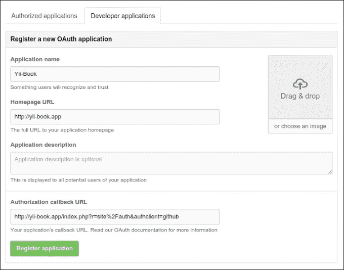

1.  获取 **客户端 ID** 和 **客户端密钥**：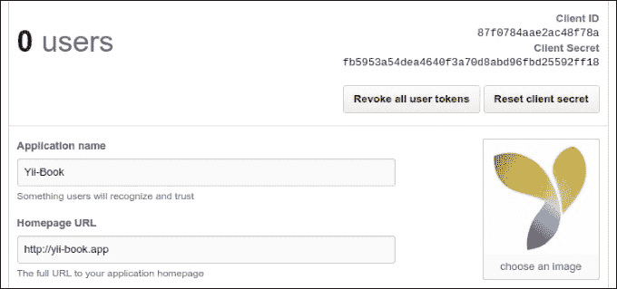

1.  配置您的 Web 配置并设置 `authClientCollection` 组件的相应选项：

    ```php
    'components' => [
        // ...
        'authClientCollection' => [
            'class' => 'yii\authclient\Collection',
            'clients' => [
                'google' => [
                    'class' =>'yii\authclient\clients\GoogleOpenId'
                ],
                'github' => [
                    'class' => 'yii\authclient\clients\GitHub',
                    'clientId' => '87f0784aae2ac48f78a',
                    'clientSecret' =>'fb5953a54dea4640f3a70d8abd96fbd25592ff18',
                 ],
                    // etc.
            ],
        ],
    ],
    ```

1.  打开您的 `SiteController` 并添加 `auth` 独立动作和成功回调方法：

    ```php
    use yii\authclient\ClientInterface;

    public function actions()
    {
        return [
            // ...
            'auth' => [
                'class' => 'yii\authclient\AuthAction',
                'successCallback' => [$this, 'onAuthSuccess'],
            ],
        ];
    }

    public function onAuthSuccess(ClientInterface $client)
    {
        $attributes = $client->getUserAttributes();
        \yii\helpers\VarDumper::dump($attributes, 10, true);
        exit;
    }
    ```

1.  打开 `views/site/login.php` 文件并插入 `AuthChoice` 小部件：

    ```php
    <div class="site-login">
        <h1><?= Html::encode($this->title) ?></h1>

        <div class="panel panel-default">
            <div class="panel-body">
                <?= yii\authclient\widgets\AuthChoice::widget(['baseAuthUrl' => ['site/auth'],
                'popupMode' => false,
                ]) ?>
            </div>
        </div>

        <p>Please fill out the following fields to login:</p>
       ...
    </div>
    ```

1.  您将看到您已配置的提供者的图标：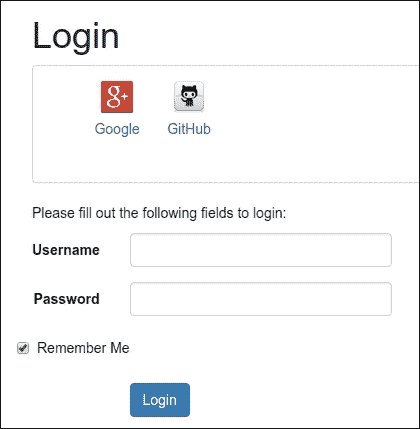

1.  尝试使用 GitHub 提供商进行授权：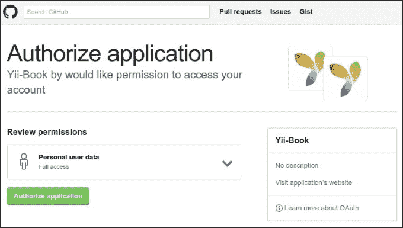

1.  如果成功，您的回调将显示授权用户属性：

    ```php
    [
        'login' => 'Name'
        'id' => 0000000
        'avatar_url' =>'https://avatars.githubusercontent.com/u/0000000?v=3'
        'gravatar_id' => ''
        'url' => 'https://api.github.com/users/Name'
        'html_url' => 'https://github.com/Name'
        ...
        'name' => 'YourName'
        'blog' =>site.com'
        'email => mail@site.com'
        ...
    ]
    ```

1.  在 `onAuthSuccess` 方法中创建自己的授权代码，例如 [`github.com/yiisoft/yii2-authclient/blob/master/docs/guide/quick-start.md`](https://github.com/yiisoft/yii2-authclient/blob/master/docs/guide/quick-start.md) 中的示例。

## 工作原理…

该扩展为您的应用程序提供 OpenID、OAuth 和 OAuth2 认证客户端。

`AuthChoice` 小部件在所选服务网站上打开一个认证页面，并存储 `auth` 动作 URL。认证后，当前服务将用户重定向回，并通过 POST 请求发送认证数据。`AuthAction` 接收请求并调用相应的回调。

您可以使用任何现有的客户端或创建自己的客户端。

## 参见

+   要获取有关扩展使用的更多信息，请参阅：

    +   [`github.com/yiisoft/yii2-authclient/tree/master/docs/guide`](https://github.com/yiisoft/yii2-authclient/tree/master/docs/guide)

    +   [`www.yiiframework.com/doc-2.0/ext-authclient-index.html`](http://www.yiiframework.com/doc-2.0/ext-authclient-index.html)

+   要了解更多关于 OpenID、OAuth 和 OAuth2 认证技术，请参阅：

    +   [`openid.net`](http://openid.net)

    +   [`oauth.net`](http://oauth.net)

# SwiftMailer 邮件库

许多 Web 应用程序出于安全原因需要通过电子邮件发送通知并确认客户端的操作。Yii2 框架为已建立的库`SwiftMailer`提供了一个包装器，`yiisoft/yii2-swiftmailer`。

## 准备工作

使用官方指南[`www.yiiframework.com/doc-2.0/guide-start-installation.html`](http://www.yiiframework.com/doc-2.0/guide-start-installation.html)中描述的方法，通过 composer 创建一个新的应用程序。

基本和高级应用程序都自带这个扩展。

## 如何做到这一点…

现在我们将尝试从我们的应用程序发送任何类型的电子邮件。

### 发送纯文本电子邮件

1.  将邮件器配置设置到`config/console.php`文件中：

    ```php
    'components' => [
        // ...
        'mailer' => [
            'class' => 'yii\swiftmailer\Mailer',
            'useFileTransport' => true,
        ],
        // ...
    ],
    ```

1.  创建一个测试控制台控制器，`MailController`，以下代码：

    ```php
    <?php

        namespace app\commands;

        use yii\console\Controller;
        use Yii;

        class MailController extends Controller
        {
            public function actionSend()
            {
                Yii::$app->mailer->compose()
                ->setTo('to@yii-book.app')
                ->setFrom(['from@yii-book.app' => Yii::$app->name])
                ->setSubject('My Test Message')
                ->setTextBody('My Text Body')
                ->send();
        }
    }
    ```

1.  运行以下控制台命令：

    ```php
    php yii mail/send

    ```

1.  检查您的`runtime/mail`目录。它应该包含您的邮件文件。

    ### 注意

    **注意**：邮件文件包含特殊电子邮件源格式的消息，与任何邮件软件兼容。您也可以将其作为纯文本打开。

1.  将`useFileTransport`参数设置为 false 或从配置中删除此字符串：

    ```php
    'mailer' => [
        'class' => 'yii\swiftmailer\Mailer',
    ],
    ```

    然后将您的真实电子邮件 ID 放入`setTo()`方法中：

    ```php
     ->setTo('my@real-email.com')
    ```

1.  再次运行控制台命令：

    ```php
    php yii mail/send

    ```

1.  检查您的`inbox`目录。

### 注意

**注意**：SwiftMailer 默认使用标准的 PHP 函数`mail()`来发送邮件。请确保您的服务器已正确配置，可以通过`mail()`函数发送邮件。

许多邮件系统拒绝没有 DKIM 和 SPF 签名（例如，由`mail()`函数发送）的邮件，或将它们放入`Spam`文件夹。

### 发送 HTML 内容

1.  确保您的应用程序包含`mail/layouts/html.php`文件，并添加`mail/layouts/text.php`文件，内容如下：

    ```php
    <?php
    /* @var $this \yii\web\View */
    /* @var $message \yii\mail\MessageInterface */
    /* @var $content string */
    ?>
    <?php $this->beginPage() ?>
    <?php $this->beginBody() ?>
    <?= $content ?>
    <?php $this->endBody() ?>
    <?php $this->endPage() ?>
    ```

1.  在`mail/message-html.php`文件中创建自己的视图：

    ```php
    <?php
    use yii\helpers\Html;

    /* @var $this yii\web\View */
    /* @var $name string */
    ?>

    <p>Hello, <?= Html::encode($name) ?>!</p>
    ```

    创建一个`mail/message-text.php`文件，内容与原文件相同，但不含 HTML 标签：

    ```php
    <?php
        use yii\helpers\Html;

    /* @var $this yii\web\View */
    /* @var $name string */
    ?>

         Hello, <?= Html::encode($name) ?>!
    ```

1.  创建一个控制台控制器，`MailController`，以下代码：

    ```php
    <?php

        namespace app\commands;

        use yii\console\Controller;
        use Yii;

        class MailController extends Controller
        {
            public function actionSendHtml()
            {
                $name = 'John';

                Yii::$app->mailer->compose('message-html',['name' => $name])
                ->setTo('to@yii-book.app')
                ->setFrom(['from@yii-book.app' => Yii::$app->name])
                ->setSubject('My Test Message')
                ->send();
            }

            public function actionSendCombine()
            {
                $name = 'John';

                Yii::$app->mailer->compose(['html' => 
                'message-html', 'text' => 'message-text'], [
                'name' => $name,
                ])
                ->setTo('to@yii-book.app')
                ->setFrom(['from@yii-book.app' 
                    => Yii::$app->name])
                ->setSubject('My Test Message')
                ->send();
            }
    }
    ```

1.  运行以下控制台命令：

    ```php
    php yii mail/send-html
    php yii mail/se
    nd-combine

    ```

### 使用 SMTP 传输

1.  将`mailer`组件的`transport`参数设置如下：

    ```php
    'mailer' => [
        'class' => 'yii\swiftmailer\Mailer',
        'transport' => [
            'class' => 'Swift_SmtpTransport',
            'host' => 'smtp.gmail.com',
            'username' => 'username@gmail.com',
            'password' => 'password',
            'port' => '587',
            'encryption' => 'tls',
        ],
    ],
    ```

1.  编写并运行以下代码：

    ```php
    Yii::$app->mailer->compose()
        ->setTo('to@yii-book.app')
        ->setFrom('username@gmail.com')
        ->setSubject('My Test Message')
        ->setTextBody('My Text Body')
        ->send();
    ```

1.  检查您的 Gmail 收件箱。

### 注意

**注意**：Gmail 会自动将`From`字段重写为默认的配置电子邮件 ID，但其他电子邮件系统并不这样做。在传输配置和`setFrom()`方法中始终使用相同的电子邮件 ID，以传递其他电子邮件系统的反垃圾邮件策略。

### 附加文件和嵌入图片

添加相应的方法来附加任何文件到您的邮件中：

```php
class MailController extends Controller
{
    public function actionSendAttach()
    {
        Yii::$app->mailer->compose()
            ->setTo('to@yii-book.app')
            ->setFrom(['from@yii-book.app' => Yii::$app->name])
            ->setSubject('My Test Message')
            ->setTextBody('My Text Body')
            ->attach(Yii::getAlias('@app/README.md'))
            ->send();
    }
}
```

或者，在您的电子邮件视图文件中使用`embed()`方法将图片粘贴到电子邮件内容中：

```php
embed($imageFile); ?>">
```

它会自动附加一个图片文件并插入其唯一标识符。

## 它是如何工作的…

包装器实现了基类`\yii\mail\MailerInterface`。它的`compose()`方法返回一个消息对象（`\yii\mail\MessageInterface`的实现）。

您可以使用 `setTextBody()` 和 `setHtmlBody()` 方法手动设置纯文本和 HTML 内容，或者将您的视图和视图参数传递给 `compose()` 方法。在这种情况下，邮件发送器会调用 `\yii\web\View::render()` 方法来渲染相应的内容。

`useFileTransport` 参数将邮件存储在文件中而不是实际发送。这对于本地开发和应用程序测试很有帮助。

## 参见

+   更多关于 `yii2-swiftmailer` 扩展的信息，请访问以下指南：

    +   [`www.yiiframework.com/doc-2.0/guide-tutorial-mailing.html`](http://www.yiiframework.com/doc-2.0/guide-tutorial-mailing.html)

    +   [`www.yiiframework.com/doc-2.0/ext-swiftmailer-index.html`](http://www.yiiframework.com/doc-2.0/ext-swiftmailer-index.html)

+   为了了解更多关于原始 `SwiftMailer` 库的信息，请参考以下网址：

    +   [`swiftmailer.org/docs/introduction.html`](http://swiftmailer.org/docs/introduction.html)

    +   [`github.com/swiftmailer/swiftmailer`](https://github.com/swiftmailer/swiftmailer)

# Faker 测试数据生成器

`fzaninotto/faker` 是一个 PHP 库，可以生成多种类型的假数据：姓名、电话、地址、随机字符串和数字等。它可以帮助您生成用于性能和逻辑测试的许多随机记录。您可以通过编写自己的格式化和生成器来扩展您支持的类型集合。

在 Yii2 应用程序骨架中，`yiisoft/yii2-faker` 包装器包含在 `composer.json` 文件的 `require-dev` 部分中，并用于测试代码（第十一章。

## 如何做到这一点…

1.  打开 `tests/codeception/templates` 目录并添加测试数据模板文件，`users.txt`：

    ```php
    <?php
    /**
     * @var $faker \Faker\Generator
     * @var $index integer
     */
        return [
            'name' => $faker->firstName,
            'phone' => $faker->phoneNumber,
            'city' => $faker->city,
            'about' => $faker->sentence(7, true),
            'password' => Yii::$app->getSecurity()
            ->generatePasswordHash('password_' . $index),
            'auth_key' => Yii::$app->getSecurity()
            ->generateRandomString(),
        ];
    ```

1.  运行测试控制台 `yii` 命令：

    ```php
    php tests/codeception/bin/yii fixture/generate users --count=2

    ```

1.  确认迁移生成。

1.  检查 `tests/codeception/fixtures` 目录是否包含新的 `users.php` 文件，并包含如下自动生成数据：

    ```php
    return [
        [
            'name' => 'Isadore',
            'phone' => '952.877.8545x190',
            'city' => 'New Marvinburgh',
            'about' => 'Ut quidem voluptatem itaque veniam voluptas dolores.',
            'password' => '$2y$13$Fi3LOl/sKlomUH.DLgqBkOB/uCLmgCoPPL1KXiW0hffnkrdkjCzAC',
            'auth_key' => '1m05hlgaAG8zfm0cyDyoRGMkbQ9W6hj1',
        ],
        [
            'name' => 'Raleigh',
            'phone' => '1-655-488-3585x699',
            'city' => 'Reedstad',
            'about' => 'Dolorem quae impedit tempore libero doloribus nobis dicta tempora facere.',
            'password' => '$2y$13$U7Qte5Y1jVLrx/pnhwdwt.1uXDegGXuNVzEQyUsb65WkBtjyjUuYm',
            'auth_key' => 'uWWJDgy5jNRk6KjqpxS5JuPv0OHearqE',
        ],
    ],
    ```

### 使用自己的数据类型

1.  使用您自定义的值生成逻辑创建自己的提供者：

    ```php
    <?php
        namespace tests\codeception\faker\providers;

        use Faker\Provider\Base;

        class UserStatus extends Base
        {
            public function userStatus()
            {
                return $this->randomElement([0, 10, 20, 30]);
            }
        }
    ```

1.  将提供者添加到 `/tests/codeception/config/config.php` 文件中的提供者列表中：

    ```php
    return [
        'controllerMap' => [
            'fixture' => [
                'class' => 'yii\faker\FixtureController',
                'fixtureDataPath' => '@tests/codeception/fixtures',
                'templatePath' => '@tests/codeception/templates',
                'namespace' => 'tests\codeception\fixtures',
                'providers' => [
                    'tests\codeception\faker\providers\UserStatus',
                ],
            ],
        ],
        // ...
    ];
    ```

1.  将 `status` 字段添加到您的测试数据模板文件中：

    ```php
    <?php
    /**
     * @var $faker \Faker\Generator
     * @var $index integer
     */
        return [
            'name' => $faker->firstName,
            'status' => $faker->userStatus,
        ];
    ```

1.  使用控制台命令重新生成测试数据：

    ```php
    php tests/codeception/bin/yii fixture/generate users --count=2

    ```

1.  检查生成的 `fixtures/users.php` 文件中的代码是否包含您的自定义值：

    ```php
    return [
        [
            'name' => 'Christelle',
            'status' => 30,
        ],
        [
            'name' => 'Theo',
            'status' => 10,
        ],
    ];
    ```

## 它是如何工作的…

`yii2-faker`扩展包含一个控制台生成器（它使用您的模板生成固定数据文件），并提供原始`Faker`对象的预置实例。您可以在控制台参数中生成所有或特定的固定数据，并可以传递自定义计数或语言。

### 注意

**注意**：如果您的测试使用这些固定数据，请小心处理现有的测试文件，因为自动生成会完全重写旧数据。

## 参见

+   关于源代码和扩展的更多信息，请参阅：

    +   [`github.com/yiisoft/yii2-faker/tree/master/docs/guide`](https://github.com/yiisoft/yii2-faker/tree/master/docs/guide)

    +   [`www.yiiframework.com/doc-2.0/ext-faker-index.html`](http://www.yiiframework.com/doc-2.0/ext-faker-index.html)

+   要了解更多关于原始库的信息，请参考：

    +   [`github.com/fzaninotto/Faker`](https://github.com/fzaninotto/Faker)

    +   第十一章，*测试*

# Imagine 库

Imagine 是一个用于图像处理的 OOP 库。它允许您使用 GD、Imagic 和 Gmagic PHP 扩展对不同的图像进行裁剪、调整大小和其他操作。Yii2-Imagine 是该库的轻量级静态包装器。

## 准备工作

1.  按照官方指南使用 composer 创建一个新应用，官方指南可在[`www.yiiframework.com/doc-2.0/guide-start-installation.html`](http://www.yiiframework.com/doc-2.0/guide-start-installation.html)找到。

1.  使用以下命令安装扩展：

    ```php
    composer require yiisoft/yii2-imagine

    ```

## 如何做到这一点…

在您的项目中，您可以使用两种方式使用此扩展：

+   作为工厂使用

+   使用内部方法

### 作为工厂使用

您可以使用原始`Imagine`库类的实例：

```php
$imagine = new Imagine\Gd\Imagine();
// or
$imagine = new Imagine\Imagick\Imagine();
// or
$imagine = new Imagine\Gmagick\Imagine();
```

然而，这取决于您系统中现有的相应 PHP 扩展。您可以使用`getImagine()`方法：

```php
$imagine = \yii\imagine\Image::getImagine();
```

### 使用内部方法

您可以使用`crop()`、`thumbnail()`、`watermark()`、`text()`和`frame()`方法进行常见的通用操作，如下所示：

```php
<?php
    use yii\imagine\Image;
    Image::crop('path/to/image.jpg', 100, 100, ManipulatorInterface::THUMBNAIL_OUTBOUND)
    ->save('path/to/destination/image.jpg', ['quality' => 90]);
```

在`\yii\imagine\BaseImage`类的源代码中查看所有支持方法的签名以获取更多详细信息。

## 它是如何工作的…

扩展准备用户数据，创建原始 Imagine 对象，并在其上调用相应的方法。所有方法都返回这个原始图像对象。您可以继续操作图像或将结果保存到您的磁盘上。

## 参见

+   关于扩展的更多信息，请参阅以下 URL：

    +   [`www.yiiframework.com/doc-2.0/ext-imagine-index.html`](http://www.yiiframework.com/doc-2.0/ext-imagine-index.html)

    +   [`github.com/yiisoft/yii2-imagine`](https://github.com/yiisoft/yii2-imagine)

+   关于原始库的信息，请参阅[`imagine.readthedocs.org/en/latest/`](http://imagine.readthedocs.org/en/latest/)

# MongoDB 驱动程序

此扩展为 Yii2 框架提供了 MongoDB 集成，并允许您通过`ActiveRecord-style`模型与 MongoDB 集合的记录一起工作。

## 准备工作

1.  使用 composer，按照官方指南 [`www.yiiframework.com/doc-2.0/guide-start-installation.html`](http://www.yiiframework.com/doc-2.0/guide-start-installation.html) 中的说明创建一个新的应用程序。

1.  使用适用于你系统的正确安装过程从 [`docs.mongodb.org/manual/installation/`](https://docs.mongodb.org/manual/installation/) 安装 MongoDB。

1.  安装 `php5-mongo` PHP 扩展。

1.  使用以下命令安装组件：

    ```php
    composer require yiisoft/yii2-mongodb

    ```

## 如何操作…

1.  首先，创建新的 MongoDB 数据库。在 `mongo-client` shell 中运行它并输入数据库名称：

    ```php
    mongo
    > use mydatabase

    ```

1.  将此连接信息添加到你的 `components` 配置部分：

    ```php
    return [
        // ...
        'components' => [
            // ...
            'mongodb' => [
                'class' => '\yii\mongodb\Connection',
                'dsn' =>
                    'mongodb://localhost:27017/mydatabase',
            ],
        ],
    ];
    ```

1.  将新的控制台控制器添加到你的控制台配置文件中：

    ```php
    return [
        // ...
        'controllerMap' => [
            'mongodb-migrate' =>
            'yii\mongodb\console\controllers\MigrateController'
        ],
    ];
    ```

1.  使用 shell 命令创建新的迁移：

    ```php
    php yii mongodb-migrate/create create_customer_collection

    ```

1.  将以下代码输入到 `up()` 和 `down()` 方法中：

    ```php
    <?php

        use yii\mongodb\Migration;

        class m160201_102003_create_customer_collection extends Migration
        {
            public function up()
            {
                $this->createCollection('customer');
            }

            public function down()
            {
                $this->dropCollection('customer');
            }
        }
    ```

1.  应用迁移：

    ```php
    php yii mongodb-migrate/up

    ```

1.  将 MongoDB 调试面板和模型生成器放入你的配置中：

    ```php
    if (YII_ENV_DEV) {
        // configuration adjustments for 'dev' environment
        $config['bootstrap'][] = 'debug';
        $config['modules']['debug'] = [
            'class' => 'yii\debug\Module',
            'panels' => [
                'mongodb' => [
                    'class' => 'yii\mongodb\debug\MongoDbPanel',
                ],
            ],
        ];

        $config['bootstrap'][] = 'gii';
        $config['modules']['gii'] = [
            'class' => 'yii\gii\Module',
            'generators' => [
                'mongoDbModel' => [
                    'class' => 'yii\mongodb\gii\model\Generator'
                ]
            ],
        ];
    }
    ```

1.  运行 Gii 生成器：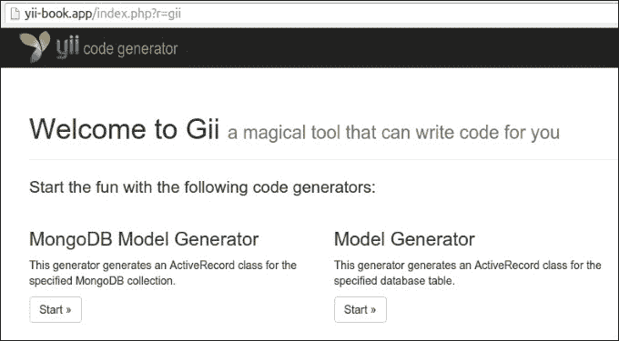

1.  启动新的 `MongoDB 模型生成器` 以为你自己的集合生成新模型：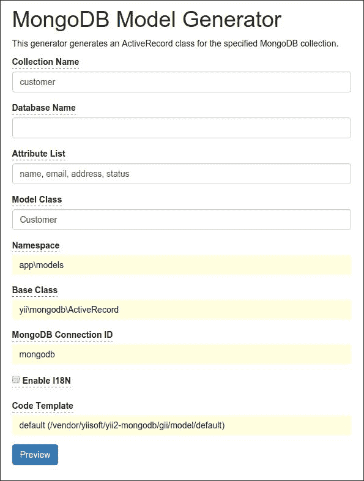

1.  点击 **预览** 和 **生成** 按钮。

1.  确认你有新的模型，`app\models\Customer`：

    ```php
    <?php

        namespace app\models;

        use Yii;
        use yii\mongodb\ActiveRecord;

    /**
    * This is the model class for collection "customer".
    *
    * @property \MongoId|string $_id
    * @property mixed $name
    * @property mixed $email
    * @property mixed $address
    * @property mixed $status
    */
        class Customer extends ActiveRecord
        {
            public static function collectionName()
            {
                return 'customer';
            }

            public function attributes()
            {
                return [
                   '_id',
                   'name',
                   'email',
                   'address',
                   'status',
                ];
            }

            public function rules()
            {
                return [
                [['name', 'email', 'address', 'status'], 'safe']
                ];
            }

            public function attributeLabels()
            {
                return [
                    '_id' => 'ID',
                    'name' => 'Name',
                    'email' => 'Email',
                    'address' => 'Address',
                    'status' => 'Status',
                ];
            }
        }
    ```

1.  再次运行 Gii 并生成 CRUD：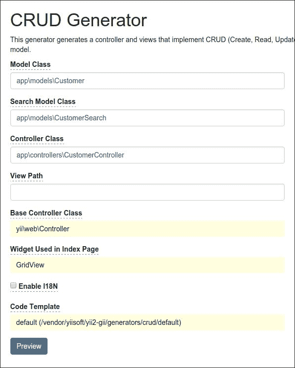

1.  确认你已经生成了 `CustomerController` 类并运行新的客户管理页面：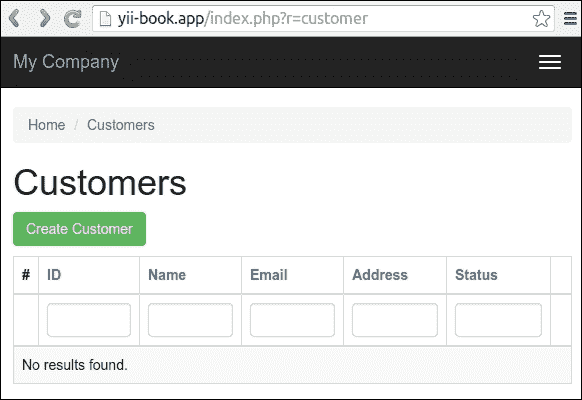

1.  你现在可以创建、更新和删除客户的资料。

1.  在页面页脚中查找 **调试** 面板：

1.  你可以看到总的 MongoDB 查询次数和总执行时间。点击计数徽章并检查查询：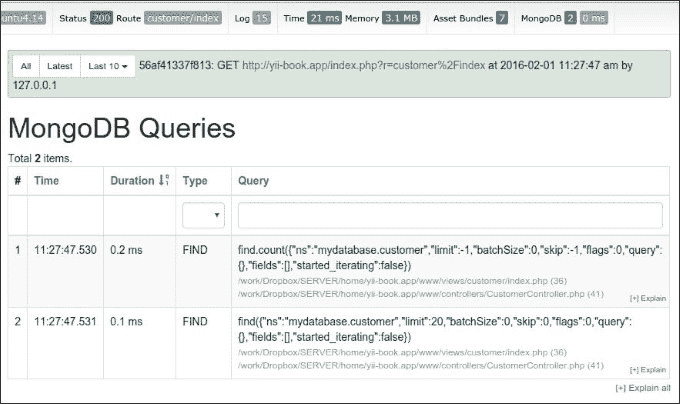

### 基本用法

你可以通过 `\yii\mongodb\Collection` 实例访问数据库和集合：

```php
$collection = Yii::$app->mongodb->getCollection('customer');$collection->insert(['name' => 'John Smith', 'status' => 1]);
```

要执行 `find` 查询，你应该使用 `\yii\mongodb\Query`:

```php
use yii\mongodb\Query;
$query = new Query;
// compose the query
$query->select(['name', 'status'])
    ->from('customer')
    ->limit(10);
// execute the query
$rows = $query->all();
```

### 注意

**注意**：MongoDB 文档 id (`"_id"` 字段) 不是标量，而是 `\MongoId` 类的实例。

你不必关心从整数或字符串 `$id` 值到 `\MongoId` 的转换，因为查询构建器会自动转换它：

```php
$query = new \yii\mongodb\Query;
$row = $query->from('item')
    ->where(['_id' => $id]) // implicit typecast to \MongoId
    ->one();
```

要获取实际的 Mongo ID 字符串，你应该将 `\MongoId` 实例转换为字符串：

$query = new Query;

```php
$row = $query->from('customer')->one();
var_dump($row['_id']); // outputs: "object(MongoId)"var_dump((string)$row['_id']);
```

## 它是如何工作的…

此扩展的 `Query`、`ActiveQuery` 和 `ActiveRecord` 类扩展了 `yii\db\QueryInterface` 和 `yii\db\BaseActiveRecord`，因此它们与内置框架的 `Query`、`ActiveQuery` 和 `ActiveRecord` 类兼容。

你可以使用 `yii\mongodb\ActiveRecord` 类为你的模型，并使用 `yii\mongodb\ActiveQuery` 构建器检索你的模型并在你的数据提供者中使用它们：

```php
use yii\data\ActiveDataProvider;
use app\models\Customer;
$provider = new ActiveDataProvider([
    'query' => Customer::find(),
    'pagination' => [
        'pageSize' => 10,
    ]
]);
```

关于如何使用 Yii 的 ActiveRecord 的一般信息，请参阅第三章 ActiveRecord, Model, and Database。

## 参见

+   关于扩展的更多信息，请参阅以下 URL：

    +   [`github.com/yiisoft/yii2-mongodb/blob/master/docs/guide/README.md`](https://github.com/yiisoft/yii2-mongodb/blob/master/docs/guide/README.md)

    +   [`www.yiiframework.com/doc-2.0/ext-mongodb-index.html`](http://www.yiiframework.com/doc-2.0/ext-mongodb-index.html)

+   关于原始库的信息，请参阅：

    +   [`docs.mongodb.org/manual/`](https://docs.mongodb.org/manual/)

+   关于 ActiveRecord 使用，请参阅 第三章，*ActiveRecord, Model, 和数据库*

# ElasticSearch 引擎适配器

此扩展是 ElasticSearch 全文搜索引擎集成到 Yii2 框架中的 ActiveRecord 类似包装器。它允许你使用任何模型数据，并使用 ActiveRecord 模式在 ElasticSearch 集合中检索和存储记录。

## 准备工作

1.  按照官方指南使用 composer 创建一个新的应用程序，如 [`www.yiiframework.com/doc-2.0/guide-start-installation.html`](http://www.yiiframework.com/doc-2.0/guide-start-installation.html) 中所述。

1.  安装位于 [`www.elastic.co/downloads/elasticsearch`](https://www.elastic.co/downloads/elasticsearch) 的 `ElasticSearch` 服务。

1.  使用以下命令安装扩展：

    ```php
    compose
    r require yiisoft/yii2-elasticsearch

    ```

## 如何做到这一点…

在你的应用程序配置中设置新的 `ElasticSearch` 连接：

```php
return [
    //....
    'components' => [
        'elasticsearch' => [
            'class' => 'yii\elasticsearch\Connection',
            'nodes' => [
                ['http_address' => '127.0.0.1:9200'],
                // configure more hosts if you have a cluster
            ],
        ],
    ]
];
```

### 使用查询类

你可以使用 `Query` 类对任何集合进行低级查询：

```php
use  \yii\elasticsearch\Query;

$query = new Query;
$query->fields('id, name')
    ->from('myindex', 'users')
    ->limit(10);

$query->search();
```

你也可以创建一个命令并直接运行它：

```php
$command = $query->create
Command();
$rows = $command->search();

```

### 使用 ActiveRecord

使用 `ActiveRecord` 是访问你的记录的常见方式。只需扩展 `yii\elasticsearch\ActiveRecord` 类并实现 `attributes()` 方法来定义你的文档属性。

例如，你可以编写 `Customer` 模型：

```php
class Buyer extends \yii\elasticsearch\ActiveRecord
{
    public function attributes()
    {
        return ['id', 'name', 'address', 'registration_date'];
    }
    public function getOrders()
    {
        return $this->hasMany(Order::className(), ['buyer_id' => 'id'])->orderBy('id');
    }
}
```

然后编写 `Order` 模型：

```php
class Order extends \yii\elasticsearch\ActiveRecord
{
    public function attributes()
    {
        return ['id', 'user_id', 'date'];
    }

    public function getBuyer()
    {
        return $this->hasOne(Customer::className(), ['id' => 'buyer_id']);
    }
}
```

你可以覆盖 `index()` 和 `type()` 来定义此记录表示的索引和类型。

以下是一个使用示例：

```php
$buyer = new Buyer();
$buyer>primaryKey = 1; // it equivalent to $customer->id = 1;
$buyer>name = 'test';
$buyer>save();

$buyer = Buyer::get(1);

$buyer = Buyer::mget([1,2,3]);

$buyer = Buyer::find()->where(['name' => 'test'])->one();
```

你可以使用查询 DSL 进行特定查询：

```php
$result = Article::find()->query(["match" => ["title" => "yii"]])->all();
        $query = Article::find()->query([
        "fuzzy_like_this" => [
            "fields" => ["title", "description"],
            "like_text" => "Some search text",
            "max_query_terms" => 12
        ]
]);
$query->all();
```

你可以为你的搜索添加分面：

```php
$query->addStatisticalFacet('click_stats', ['field' => 'visit_count']);
$query->search();
```

### 使用 ElasticSearch DebugPanel

此扩展包含一个用于 `yii2-debug` 模块的专用面板。它允许你查看所有执行的查询。你可以在配置文件中包含此面板：

```php
if (YII_ENV_DEV) {
    // configuration adjustments for 'dev' environment
    $config['bootstrap'][] = 'debug';
    $config['modules']['debug'] =  [
        'class' => 'yii\debug\Module',
        'panels' => [
            'elasticsearch' => [
                'class' => 'yii\elasticsearch\DebugPanel',
            ],
        ],
    ];

    $config['bootstrap'][] = 'gii';
    $config['modules']['gii'] = 'yii\gii\Module';
}
```

## 它是如何工作的…

此扩展提供了一个低级命令构建器和高级 `ActiveRecord` 实现来从 `ElasticSearch` 索引查询记录。

扩展的 ActiveRecord 使用与第三章 ActiveRecord, Model, and Database 中描述的数据库 `ActiveRecord` 非常相似，除了 `join()`、`groupBy()`、`having()` 和 `union()` 这些 ActiveQuery 操作符。

### 注意

**注意**：`ElasticSearch` 默认将返回的记录数限制为十个项目。如果你使用带有 `via()` 选项的关系时，请注意限制。

## 参见

+   有关扩展的更多信息，请参阅：

    +   [`github.com/yiisoft/yii2-elasticsearch/blob/master/docs/guide/README.md`](https://github.com/yiisoft/yii2-elasticsearch/blob/master/docs/guide/README.md)

    +   [`www.yiiframework.com/doc-2.0/ext-elasticsearch-index.html`](http://www.yiiframework.com/doc-2.0/ext-elasticsearch-index.html)

+   您还可以访问官方扩展站点 [`www.elastic.co/products/elasticsearch`](https://www.elastic.co/products/elasticsearch)。

+   有关 Query DSL 的更多信息，您可以访问：

    +   [`www.elastic.co/guide/en/elasticsearch/reference/current/query-dsl-match-query.html`](http://www.elastic.co/guide/en/elasticsearch/reference/current/query-dsl-match-query.html)

    +   [`www.elastic.co/guide/en/elasticsearch/reference/current/query-dsl-flt-query.html`](http://www.elastic.co/guide/en/elasticsearch/reference/current/query-dsl-flt-query.html)

+   有关 ActiveRecord 的使用，请参阅 第三章，*ActiveRecord、模型和数据库*

# Gii 代码生成器

此扩展为 Yii 2 应用程序提供了一个基于 Web 的代码生成器，称为 Gii。您可以使用 Gii 快速生成模型、表单、模块、CRUD 以及更多。

## 准备工作

1.  按照官方指南使用 composer 创建一个新的应用程序 [`www.yiiframework.com/doc-2.0/guide-start-installation.html`](http://www.yiiframework.com/doc-2.0/guide-start-installation.html)。

1.  使用 shell 命令创建一个新的迁移：

    ```php
    php yii migrate/create create_customer_table

    ```

1.  将以下代码放入 `up()` 和 `down()` 方法中：

    ```php
    use yii\db\Schema;
    use yii\db\Migration;
    class m160201_154207_create_customer_table extends Migration
    {
        public function up()
        {
            $tableOptions = null;
            if ($this->db->driverName === 'mysql') {
                $tableOptions = 
                    'CHARACTER SET utf8 COLLATE utf8_unicode_ci ENGINE=InnoDB';
           }
            $this->createTable('{{%customer}}', [
                'id' => Schema::TYPE_PK,
                'name' => Schema::TYPE_STRING . ' NOT NULL',
                'email' => Schema::TYPE_STRING . ' NOT NULL',
                'address' => Schema::TYPE_STRING,
            ], $tableOptions);
        }

        public function down()
        {
            $this->dropTable('{{%customer}}');
        }
    }
    ```

1.  应用迁移：

    ```php
    php yii migrate/up
    ```

## 如何操作…

在您的项目中，您可以使用两种方式使用此扩展：

+   使用图形用户界面

+   使用命令行界面

### 使用图形用户界面

1.  检查您的 Web 配置文件是否包含以下代码：

    ```php
    if (YII_ENV_DEV) {
        $config['bootstrap'][] = 'gii';
        $config['modules']['gii'] = [
            'class' => 'yii\gii\Module',
        ];
    }
    ```

1.  您的 `web/index.php` 文件将定义开发环境：

    ```php
    defined('YII_ENV') or define('YII_ENV', 'dev');
    ```

    之前的配置表明，在开发环境中，应用程序应包含一个名为 `gii` 的模块，该模块属于 `yii\gii\Module` 类。

    默认情况下，该模块允许从 IP 地址 `127.0.0.1` 访问。如果您在其他位置工作，请在 `allowedIPs` 属性中添加您的地址：

    ```php
    $config['modules']['gii'] = [
        'class' => 'yii\gii\Module',
        allowedIPs = ['127.0.0.1', '::1', '192.168.0.*'],
    ];
    ```

1.  前往您应用程序的 `gii` 路由：`http://localhost/index.php?r=gii`。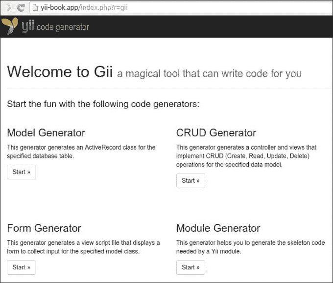

1.  点击 **模型生成器** 按钮，并在表单中输入您的表名和模型名：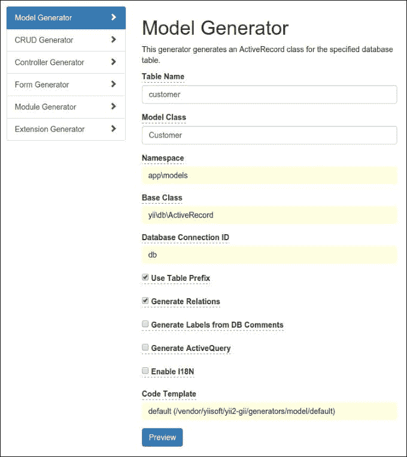

1.  点击 **预览** 按钮。您必须查看特色文件列表：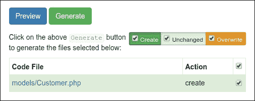

1.  如果您想重新生成现有文件，Gii 将将这些文件标记为黄色：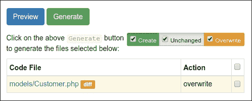

1.  在这种情况下，您可以查看现有文件和新文件之间的差异，并在需要时覆盖目标文件。

1.  在完成所有这些之后，点击 **生成** 按钮：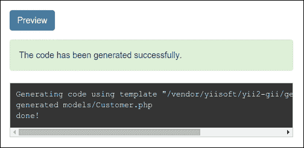

1.  检查新类 `\app\models\Customer` 是否存在。

1.  CRUD 是在大多数网站上使用数据的四个常见任务的缩写：创建、读取、更新和删除。要使用 Gii 创建 CRUD，请选择 **CRUD 生成器** 部分。指定您的模型类并输入其他字段：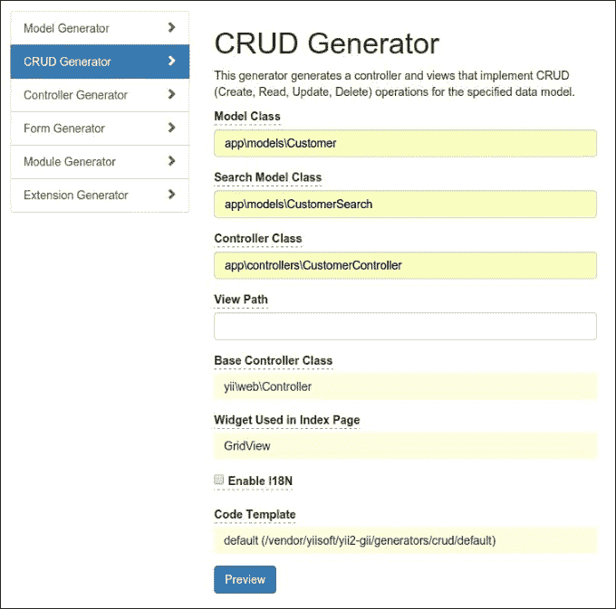

1.  生成新条目：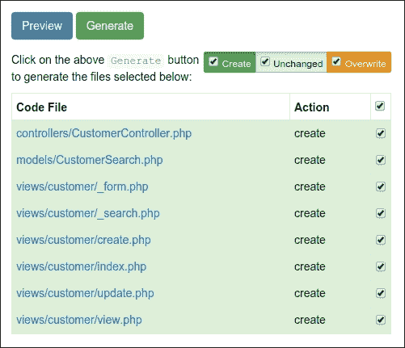

1.  之后，尝试打开新的控制器：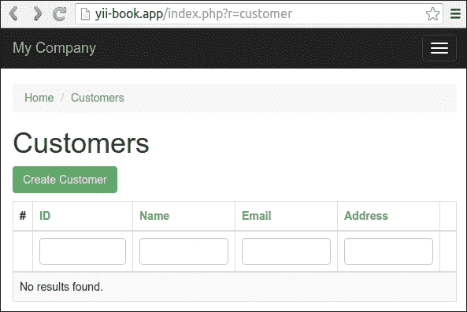

您将看到一个数据网格，显示数据库表中的客户。尝试创建一个新条目。您可以通过在列标题中输入筛选条件来对网格进行排序或筛选。

### 使用 CLI 一起工作

Gii 还提供用于代码生成的控制台控制器。

1.  检查您的控制台配置是否包含 Gii 模块设置：

    ```php
    return [
        // ...
        'modules' => [
            'gii' => 'yii\gii\Module',
        ],
        // ...
    ];
    ```

1.  运行任何 shell 命令以获取帮助：

    ```php
    php yii help gii
    php yii help gii/model

    ```

1.  输入以下命令以启动模型生成过程：

    ```php
    php yii gii/model --tableName=customer --modelClass=Customer --useTablePrefix=1

    ```

1.  检查新的类 `\app\models\Customer` 是否存在。

1.  为您的模型生成 CRUD：

    ```php
    php yii gii/crud --modelClass=app\\models\\Customer \
        --searchModelClass=app\\models\\CustomerSearch \
        --controllerClass=app\\controllers\\CustomerController
    ```

## 它是如何工作的…

Gii 允许您生成一些标准代码元素，而不是手动输入。它提供基于 Web 和控制台界面来与每个生成器一起工作。

## 参见

+   关于扩展的使用信息，请参阅：

    +   [`www.yiiframework.com/doc-2.0/guide-start-gii.html`](http://www.yiiframework.com/doc-2.0/guide-start-gii.html)

    +   [`www.yiiframework.com/doc-2.0/ext-gii-index.html`](http://www.yiiframework.com/doc-2.0/ext-gii-index.html)

    +   [`github.com/yiisoft/yii2-gii/tree/master/docs/guide`](https://github.com/yiisoft/yii2-gii/tree/master/docs/guide)

+   关于 MongoDB 集成，请参阅第八章 *扩展 Yii* 中 *创建小部件* 的配方，*扩展 Yii*。

# Pjax jQuery 插件

Pjax 是一个集成 **pjax jQuery** 插件的小部件。所有由该小部件包装的内容都将通过 AJAX 重新加载，而不会刷新当前页面。该小部件还使用 HTML5 历史 API 来更改浏览器地址栏中的当前 URL。

## 准备工作

使用官方指南中描述的方法通过 composer 创建一个新的应用程序：[`www.yiiframework.com/doc-2.0/guide-start-installation.html`](http://www.yiiframework.com/doc-2.0/guide-start-installation.html)。

## 如何做到这一点…

在以下示例中，您可以了解如何使用 `yii\grid\GridView` 小部件与 Pjax：

```php
<?php
    use yii\widgets\Pjax;
?>
<?php Pjax::begin(); ?>
    <?= GridView::widget([...]); ?>
<?php Pjax::end(); ?>
```

只需将任何代码片段包裹在 `Pjax::begin()` 和 `Pjax::end()` 调用中。

这将渲染以下 HTML 代码：

```php
<div id="w1">
    <div id="w2" class="grid-view">...</div>
</div>

<script type="text/javascript">jQuery(document).ready(function () {
    jQuery(document).pjax("#w1 a", "#w1", {...});
});</script>
```

所有带有分页和排序链接的包装内容都将通过 AJAX 重新加载。

### 指定自定义 ID

Pjax 从 AJAX 请求中获取页面内容，然后提取具有相同 ID 的自己的 DOM 元素。您可以通过不使用布局渲染内容来优化页面渲染性能，特别是对于 Pjax 请求：

```php
public function actionIndex()
{
    $dataProvider = …;

    if (Yii::$app->request->isPjax) {
        return $this->renderPartial('_items', [
            'dataProvider' => $dataProvider,
        ]);
    } else {
        return $this->render('index', [
            'dataProvider' => $dataProvider,
        ]);
    }
}
```

默认情况下，`yii\base\Widget::getId` 方法在具有递增属性的任何页面上递增标识符和部件：

```php
<nav id="w0">...</nav> // Main navigation
<ul id="w1">...</ul> // Breadcrumbs widget
<div id="w2">...</div> // Pjax widget
```

要使用 `renderPartial()` 或 `renderAjax()` 方法渲染，而不渲染布局，您的页面将只有一个编号为 `0` 的小部件：

```php
<div id="w0">...</div> // Pjax widget
```

结果，在下一个请求中，您自己的小部件将找不到其具有 `w2` 选择器的块。

然而，Pjax 将在 Ajax 响应中找到具有 `w2` 选择器的相同块。结果，在下一个请求中，您自己的小部件将找不到具有 `w2` 选择器的块。

因此，您必须手动为所有 Pjax 小部件指定一个唯一的标识符，以避免不同的冲突：

```php
<?php Pjax::begin(['id' => 'countries']) ?>
    <?= GridView::widget([...]); ?>
<?php Pjax::end() ?>
```

### 使用 ActiveForm

默认情况下，Pjax 仅与包装块中的链接一起工作。如果您想与 `ActiveForm` 小部件一起使用它，您必须使用表单的 `data-pjax` 选项：

```php
<?php
use \yii\widgets\Pjax
use \yii\widgets\ActiveForm;

<?php yii\widgets\Pjax::begin(['id' => 'my-block']) ?>
    <?php $form = ActiveForm::begin(['options' => [
        'data-pjax' => true,
    ]]); ?> 
        <?= $form->field($model, 'name') ?>
    <?php ActiveForm::end(); ?>
<?php Pjax::end(); ?>
```

它在表单提交事件上添加相应的监听器。

您还可以使用 Pjax 小部件的 `$formSelector` 选项来指定哪个表单提交可能触发 `pjax`。

### 与客户端脚本一起工作

您可以订阅容器事件：

```php
<?php $this->registerJs('
    $("#my-block").on("pjax:complete", function() {
        alert('Pjax is completed');
    });
'); ?>
```

或者，您可以使用其选择器手动重新加载容器：

```php
<?php $this->registerJs('
    $("#my-button").on("click", function() {
        $.pjax.reload({container:"#my-block"});
    });
'); ?>
```

## 它是如何工作的…

Pjax 是任何代码片段的简单包装器。它订阅片段中所有链接的点击事件，并替换整个页面，通过 Ajax 调用重新加载。我们可以为包装的表单使用 `data-pjax` 属性，并且任何表单提交都将触发 Ajax 请求。

小部件将动态加载和更新小部件的主体内容，而无需加载布局资源（JS、CSS）。

您可以配置小部件的 `$linkSelector` 以指定哪些链接应触发 Pjax，并配置 `$formSelector` 以指定哪些表单提交可能触发 Pjax。

您可以通过向此链接添加 `data-pjax="0"` 属性来禁用容器中特定链接的 Pjax。

## 参见

+   关于扩展使用方法的更多信息，请参阅：

    +   [`www.yiiframework.com/doc-2.0/yii-widgets-pjax.html`](http://www.yiiframework.com/doc-2.0/yii-widgets-pjax.html)

    +   [`github.com/yiisoft/jquery-pjax`](https://github.com/yiisoft/jquery-pjax)

+   关于客户端选项和方法的更多信息，请参阅[`github.com/yiisoft/jquery-pjax#usage`](https://github.com/yiisoft/jquery-pjax#usage)。

# Redis 数据库驱动程序

此扩展允许您在 Yii2 框架的任何项目中使用 Redis 键值存储。它包含 `Cache` 和 `Session` 存储处理程序，以及实现 ActiveRecord 模式以访问 Redis 数据库记录的扩展。

## 准备工作

1.  使用 composer 创建一个新的应用程序，具体操作请参考官方指南中的[`www.yiiframework.com/doc-2.0/guide-start-installation.html`](http://www.yiiframework.com/doc-2.0/guide-start-installation.html)。

1.  安装存储：[`redis.io`](http://redis.io)。

1.  使用以下命令安装所有迁移：

    ```php
    composer require yiisoft/yii2-redis

    ```

## 如何操作…

首先，在您的配置文件中配置 `Connection` 类：

```php
return [
    //....
    'components' => [
        'redis' => [
            'class' => 'yii\redis\Connection',
            'hostname' => 'localhost',
            'port' => 6379,
            'database' => 0,
        ],
    ]
];
```

### 直接使用

对于使用 Redis 命令的低级操作，您可以使用连接组件的`executeCommand`方法：

```php
Yii::$app->redis->executeCommand('hmset', ['test_collection', 'key1', 'val1', 'key2', 'val2']);

```

您也可以使用简化的快捷方式来代替`executeCommand`调用：

```php
Yii::$app->redi
s->hmset('test_collection', 'key1', 'val1', 'key2', 'val2')

```

### 使用 ActiveRecord

要通过`ActiveRecord`模式访问 Redis 记录，您的记录类需要从`yii\redis\ActiveRecord`基类扩展并实现`attributes()`方法：

```php
class Customer extends \yii\redis\ActiveRecord
{
    public function attributes()
    {
        return ['id', 'name', 'address', 'registration_date'];
    }
    public function getOrders()
    {
        return $this->hasMany(Order::className(), ['customer_id' => 'id']);
    }
}
```

任何模型的键可以通过`primaryKey()`方法定义，如果没有指定，默认为`id`。如果未在`primaryKey()`方法中手动指定，则主键需要放在属性列表中。

以下是一个使用示例：

```php
$customer = new Customer();
$customer->name = 'test';
$customer->save();
echo $customer->id; // id will automatically be incremented if not set explicitly
// find by query
$customer = Customer::find()->where(['name' => 'test'])->one();
```

## 它是如何工作的…

扩展提供了`Connection`组件，用于对 Redis 存储记录进行低级访问。

您还可以使用类似 ActiveRecord 的模型，并限制方法集（`where()`, `limit()`, `offset()`, 和 `indexBy()`）。其他方法不存在，因为 Redis 不支持 SQL 查询。

Redis 中没有表，因此您不能通过连接表名定义关系。您只能通过其他`hasMany`关系定义多对多关系。

关于如何使用 Yii 的 ActiveRecord 的一般信息，请参阅第三章, *ActiveRecord, 模型，和数据库*。

## 参见

+   关于扩展使用的信息，请参阅：

    +   [`github.com/yiisoft/yii2-redis/blob/master/docs/guide/README.md`](https://github.com/yiisoft/yii2-redis/blob/master/docs/guide/README.md)

    +   [`www.yiiframework.com/doc-2.0/ext-redis-index.html`](http://www.yiiframework.com/doc-2.0/ext-redis-index.html)

+   关于 Redis 键值存储的信息，请参阅：[`redis.io/documentation`](http://redis.io/documentation)

+   第三章, *ActiveRecord, 模型，和数据库*关于 ActiveRecord 的使用
