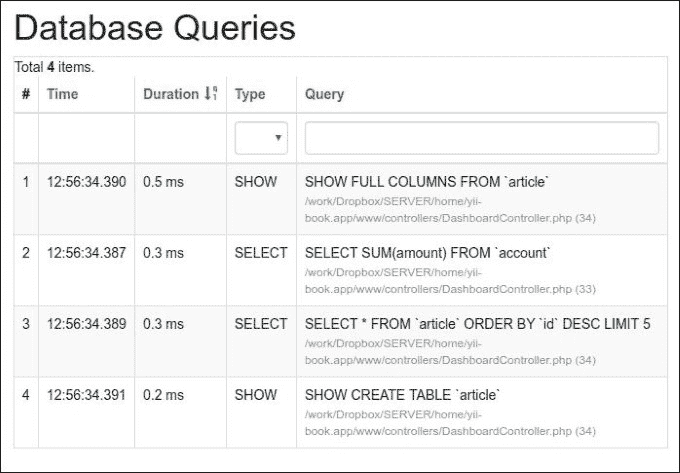

# 第九章。性能调整

在本章中，我们将涵盖以下主题：

+   遵循最佳实践

+   加快会话处理

+   使用缓存依赖和链

+   使用 Yii 分析应用程序

+   利用 HTTP 缓存

+   合并和最小化资源

+   在 HHVM 上运行 Yii2

Yii 是可用的最快框架之一。尽管如此，在开发和部署应用程序时，拥有一些额外的免费性能以及遵循应用程序自身的最佳实践是很好的。在本章中，您将了解如何配置 Yii 以获得额外的性能。此外，您还将学习一些最佳实践，以开发一个即使在非常高的负载下也能平稳运行的应用程序。

# 遵循最佳实践

在本食谱中，您将了解如何配置 Yii2 以获得最佳性能以及构建响应式应用的一些附加原则。这些原则既普遍又与 Yii 相关。因此，我们甚至在没有使用 Yii2 的情况下也能应用其中的一些。

## 准备工作

使用 Composer 包管理器创建一个新的 `yii2-app-basic` 应用程序，如官方指南中所述 [`www.yiiframework.com/doc-2.0/guidestart-installation.html`](http://www.yiiframework.com/doc-2.0/guidestart-installation.html)。

## 如何做到这一点...

1.  将您的 PHP 更新到最新稳定版本。PHP 的大版本发布可能会带来显著的性能改进。关闭调试模式并设置 `prod` 环境。这可以通过编辑 `web/index.php` 来完成，如下所示：

    ```php
    defined('YII_DEBUG') or define('YII_DEBUG', false);
    defined('YII_ENV') or define('YII_ENV', 'prod');
    ```

    ### 注意

    **注意**：在 `yii2-app-advanced` 应用程序骨架中，您可以使用 shell 命令 `php init` 并选择生产环境来加载优化的 `index.php` 和配置文件。

1.  启用 `cache` 组件：

    ```php
    'components' => [
        'cache' => [
            'class' => 'yii\caching\FileCache',
        ],
    ],
    ```

    您可以使用任何缓存存储而不是 `FileCache`。您还可以注册多个缓存应用程序组件，并使用 `Yii::$app->cache` 和 `Yii::$app->cache2` 来处理不同类型的数据：

    ```php
    'components' => [
        'cache' => [
            'class' => 'yii\caching\MemCache',
            'useMemcached' => true,
        ],
        'cache2' => [
            'class' => 'yii\caching\FileCache',
        ],
    ],
    ```

    框架默认在其自身类中使用 `cache` 组件。

1.  按如下方式启用 `db` 组件的表模式缓存：

    ```php
    return [
        // ...
        'components' => [
            // ...
            'cache' => [
                'class' => 'yii\caching\FileCache',
            ],
            'db' => [
                'class' => 'yii\db\Connection',
                'dsn' => 'mysql:host=localhost;dbname=mydatabase',
                'username' => 'root',
                'password' => '',
                'enableSchemaCache' => true,

                // Optional. Default value is 3600 seconds
                schemaCacheDuration' => 3600, 

                // Optional. Default value is 'cache'
                'schemaCache' => 'cache',
            ],
        ],
    ];
    ```

1.  在列出元素集合时，使用纯数组而不是 Active Record 对象：

    ```php
    $categoriesArray = Categories::find()->asArray()->all();
    ```

1.  在处理大量结果时，使用 `each()` 而不是 `all()` 在 `foreach` 中：

    ```php
    foreach (Post::find()->each() as $post) {
        // ...
    }
    ```

1.  由于 Composer 的自动加载器用于包含大多数第三方类文件，您应该考虑通过执行以下命令来优化它：

    ```php
    composer dump-autoload
     -o

    ```

## 它是如何工作的...

当 `YII_DEBUG` 设置为 `false` 时，Yii 关闭所有跟踪级别的日志记录并使用较少的错误处理代码。此外，当您将 `YII_ENV` 设置为 `prod` 时，您的应用程序不会加载 Yii 和调试面板模块。

将 `schemaCachingDuration` 设置为秒数，允许缓存 Yii 的 Active Record 使用的数据库模式。这对于生产服务器来说非常推荐，并且它可以显著提高 Active Record 的性能。为了使其正常工作，您需要正确配置 `cache` 组件，如下所示：

```php
'cache' => [
    'class' => 'yii\cache\FileCache',
],
```

启用缓存也会对其他 Yii 组件产生积极影响。例如，Yii 路由器或 urlManager 开始缓存路由。

当然，你可能会遇到前述设置无法帮助达到足够性能水平的情况。在大多数情况下，这意味着应用程序本身是瓶颈，或者你需要更多的硬件。

+   **服务器端性能只是大局的一部分**：服务器端性能只是影响整体性能的因素之一。通过优化客户端，如提供 CSS、图像和 JavaScript 文件，适当的缓存以及最小化 HTTP 请求的数量，即使不优化 PHP 代码，也能获得良好的视觉性能提升。

+   **无需使用 Yii 完成的事项**：有些事情最好不用 Yii 来完成。例如，为了避免额外的开销，动态图像缩放最好在单独的 PHP 脚本中完成。

+   **Active Record 与查询构建器和 SQL 的比较**：在性能关键的应用程序部分使用查询构建器或 SQL。通常，AR 在添加和编辑记录时最有用，因为它添加了一个方便的验证层，而在选择记录时则不太有用。

+   **首先检查慢查询**：如果开发者不小心忘记为经常读取的表添加索引，或者相反，或者为经常写入的表添加过多的索引，数据库可能会在瞬间成为瓶颈。同样，选择不必要的数据和不必要的连接操作也会导致这种情况。

+   **缓存或保存重处理的结果**：如果你可以避免在每次页面加载时运行重处理过程，那就更好了。例如，保存或缓存解析 Markdown 文本的结果，净化它（这是一个非常耗资源的处理过程）一次，然后使用准备好的可显示 HTML。

+   **处理过多的处理**：有时需要立即处理过多的处理。这可能包括构建复杂的报告或简单地发送电子邮件（如果你的项目负载很重）。在这种情况下，最好将其放入队列中，稍后使用 cron 或其他专用工具进行处理。

## 参见

更多关于性能调整和缓存的信息，请参考以下链接：

+   [`www.yiiframework.com/doc-2.0/guide-tutorial-performance-tuning.html`](http://www.yiiframework.com/doc-2.0/guide-tutorial-performance-tuning.html)

+   [`www.yiiframework.com/doc-2.0/guide-caching-overview.html`](http://www.yiiframework.com/doc-2.0/guide-caching-overview.html)

# 加快会话处理

在大多数情况下，PHP 的本地会话处理是不错的。至少有两个可能的原因让你想要改变会话处理的方式：

+   当使用多个服务器时，你需要为两个服务器都拥有共同的会话存储。

+   默认的 PHP 会话使用文件，因此可能的最大性能受限于磁盘 I/O。

+   默认 PHP 会话会阻塞并发会话存储。在这个菜谱中，我们将看到如何为 Yii 会话使用高效的存储。

## 准备工作

使用 Composer 包管理器创建一个新的`yii2-app-basic`应用程序，如官方指南[`www.yiiframework.com/doc-2.0/guide-start-installation.html`](http://www.yiiframework.com/doc-2.0/guide-start-installation.html)中所述，并安装 Memcache 服务器和`memcache` PHP 扩展。

## 如何做到这一点...

我们将使用 Apache `ab`工具对网站进行压力测试。它与 Apache 二进制文件一起分发，因此如果您使用 Apache，您可以在`bin`目录中找到它。

1.  运行以下命令，将您的网站替换为您实际使用的实际主机名：

    ```php
    ab -n 1000 -c 5 http://yii-book.app/index.php?r=site/contact

    ```

    这将发送 1,000 个请求，每次 5 个，并将输出以下统计信息：

    ```php
    This is ApacheBench, Version 2.3 <$Revision: 1528965 $>
    Copyright 1996 Adam Twiss, Zeus Technology Ltd, http://www.zeustech.net/
    Licensed to The Apache Software Foundation, http://www.apache.org/
    ...
    Server Software:        nginx
    Server Hostname:        yii-book.app
    Server Port:            80

    Document Path:          /index.php?r=site/contact
    Document Length:        14866 bytes
    Concurrency Level:      5
    Time taken for tests:   10.961 seconds
    Complete requests:      1000
    Failed requests:        0
    Total transferred:      15442000 bytes
    HTML transferred:       14866000 bytes
    Requests per second:    91.24 [#/sec] (mean)
    Time per request:       54.803 [ms] (mean)
    Time per request:       10.961 [ms] (mean, across all concurrent requests)
    Transfer rate:          1375.84 [Kbytes/sec] received

    Connection Times (ms)
     min  mean[+/-sd] median   max
    Connect:        0    0   0.0      0       0
    Processing:    18   55 324.9     29    4702
    Waiting:       15   41 255.1     24    4695
    Total:         18   55 324.9     29    4702

    ```

    我们对每秒请求数的指标感兴趣。这个数字意味着，如果每次有 5 个请求，网站可以每秒处理 91.24 个请求。

    ### 注意

    注意调试没有关闭，因为我们对会话处理速度的变化感兴趣。

1.  现在将以下内容添加到`/config/web.php`组件部分：

    ```php
    'session' => array(
        'class' => 'yii\web\CacheSession',
        'cache' => 'sessionCache',
    ),
    'sessionCache' => array(
        'class' => 'yii\caching\MemCache',
    ),
    ```

1.  使用相同的设置再次运行`ab`。这次，您应该得到更好的结果。在我的情况下，是每秒 139.07 个请求。这意味着作为会话处理器的`Memcache`比默认的基于文件的会话处理器性能提高了 52%。

    ### 注意

    不要依赖于这里提供的确切结果。这完全取决于软件版本、设置和使用的硬件。始终尝试在自己的部署环境中运行所有测试。

1.  通过选择合适的会话处理后端，您可以获得显著的性能提升。Yii 支持更多开箱即用的缓存后端，包括 WinCache、XCache 和与 Zend Server 一起提供的 Zend 数据缓存。此外，您可以实现自己的缓存后端以使用快速 noSQL 存储，如 Redis。

## 它是如何工作的…

默认情况下，Yii 使用原生 PHP 会话；这意味着在大多数情况下使用文件系统。文件系统无法有效地处理高并发。

在以下情况下，Memcache 或其他平台表现良好：

```php
'session' => array(
    'class' => 'yii\web\CacheSession',
    'cache' => 'sessionCache',
),
'sessionCache' => array(
    'class' => 'yii\caching\MemCache',
),
```

在前面的配置部分中，我们指导 Yii 使用`CacheSession`作为会话处理器。使用此组件，我们可以将会话处理委托给`cache`中指定的缓存组件。这次我们使用`MemCache`。

当使用 memcached 后端时，你应该考虑到，在使用这些解决方案时，如果达到最大缓存容量，应用程序用户可能会丢失会话。

### 注意

注意，当使用会话的缓存后端时，您不能依赖于会话作为临时数据存储，因为这样就没有内存来存储更多的数据在 memcached 中。在这种情况下，这将只是清除所有数据或删除其中的一部分。

如果你正在使用多个服务器，你不能使用文件存储。服务器之间无法共享会话数据。在 memcached 的情况下，这很容易，因为它可以从你想要的任意多个服务器上轻松访问。

此外，为了共享会话数据，你可以使用`DbSession`：

```php
return [
    // ...
    'components' => [
        'session' => [
            'class' => 'yii\web\DbSession',
        ],
    ],
];
```

现在，在你的数据库中创建一个新的表：

```php
CREATE TABLE session (
    id CHAR(40) NOT NULL PRIMARY KEY,
    expire INTEGER,
    data BLOB
)
```

## 更多内容…

尽快关闭会话是个好主意。如果你在当前请求中不打算在会话中存储任何内容，你甚至可以在控制器动作的非常开始时就关闭它。这样，即使使用文件作为存储，你的应用程序也应该没问题。

使用以下命令：

```php
Yii:$app->session->close();

```

## 参见

关于性能和缓存的更多信息，请参考以下 URL：

+   [`www.yiiframework.com/doc-2.0/guide-tutorial-performance-tuning.html`](http://www.yiiframework.com/doc-2.0/guide-tutorial-performance-tuning.html)

+   [`www.yiiframework.com/doc-2.0/guide-caching-overview.html`](http://www.yiiframework.com/doc-2.0/guide-caching-overview.html)

# 使用缓存依赖和链

Yii 支持许多缓存后端，但真正使 Yii 缓存灵活的是依赖和依赖链支持。有些情况下，你不能简单地缓存数据一小时，因为缓存的信息可能会随时更改。

在这个菜谱中，我们将看到如何缓存整个页面，并且在更新时仍然总是获取新鲜数据。页面将是仪表板类型的，将显示最近添加的五篇文章以及一个账户的总数。

### 注意

注意，操作一旦添加就无法编辑，但文章可以编辑。

## 准备就绪

使用 Composer 包管理器创建一个新的`yii2-app-basic`应用程序，如官方指南中所述，[`www.yiiframework.com/doc-2.0/guide-start-installation.html`](http://www.yiiframework.com/doc-2.0/guide-start-installation.html)。

1.  在`config/web.php`中按照以下方式激活缓存组件：

    ```php
    return [
        // ...
        'components' => [
            cache => ['class' => 'yii\caching\FileCache,
            ],
        ],
    ];
    ```

1.  在`config/db.php`中设置一个新的数据库并配置它。

1.  运行以下迁移：

    ```php
    <?php

    use yii\db\Schema;
    use yii\db\Migration;

    class m160308_093233_create_example_tables extends Migration
    {
        public function up()
        {
            $tableOptions = null;
            if ($this->db->driverName === 'mysql') {
                $tableOptions = 'CHARACTER SET utf8 COLLATE utf8_general_ci ENGINE=InnoDB';
            }

            $this->createTable('{{%account}}', [
                'id' => Schema::TYPE_PK,
                'amount' => Schema::TYPE_DECIMAL . '(10,2) NOT NULL',
            ], $tableOptions);

            $this->createTable('{{%article}}', [
                'id' => Schema::TYPE_PK,
                'title' => Schema::TYPE_STRING . ' NOT NULL',
                'text' => Schema::TYPE_TEXT . ' NOT NULL',
            ], $tableOptions);
        }

        public function down()
        {
            $this->dropTable('{{%article}}');
            $this->dropTable('{{%account}}');
        }
    }
    ```

1.  使用 Yii 生成账户和文章表的模型。

1.  创建`protected/controllers/DashboardController.php`如下：

    ```php
    <?php

    namespace app\controllers;

    use app\models\Account;
    use app\models\Article;
    use yii\web\Controller;

    class DashboardController extends Controller
    {
        public function actionIndex()
        {
            $total = Account::find()->sum('amount');
            $articles = Article::find()->orderBy('id DESC')->limit(5)->all();

            return $this->render('index', array(
                'total' => $total,
                'articles' => $articles,
            ));
        }

        public function actionRandomOperation()
        {
            $rec = new Account();
            $rec->amount = rand(-1000, 1000);
            $rec->save();

            echo 'OK';
        }

        public function actionRandomArticle()
        {
            $n = rand(0, 1000);

            $article = new Article();
            $article->title = "Title #".$n;
            $article->text = "Text #".$n;
            $article->save();

            echo 'OK';
        }
    }
    ```

1.  创建`views/dashboard/index.php`如下：

    ```php
    <?php
    use yii\helpers\Html;
    /* @var $this yii\web\View */
    /* @var $total int */
    /* @var $articles app\models\Article[] */
    ?>

    <h1>Total: <?= $total ?></h1>
    <h2>5 latest articles:</h2>
    <?php foreach($articles as $article): ?>
        <h3><?= Html::encode($article->title) ?></h3>
        <div><?= Html::encode($article->text) ?></div>
    <?php endforeach ?>
    ```

1.  运行`dashboard/random-operation`和`dashboard/random-article`几次。然后，运行`dashboard/index`，你应该会看到一个类似于以下截图的屏幕：

1.  点击页面底部的调试面板中的数据库查询数量：

    查看查询列表：

    

## 如何操作…

执行以下步骤：

1.  我们需要修改控制器代码如下：

    ```php
    <?php

    namespace app\controllers;

    use app\models\Account;
    use app\models\Article;
    use yii\caching\DbDependency;
    use yii\caching\TagDependency;
    use yii\web\Controller;

    class DashboardController extends Controller
    {
        public function behaviors()
        {
            return [
                'pageCache' => [
                    'class' => 'yii\filters\PageCache',
                    'only' => ['index'],
                    'duration' => 24 * 3600 * 365, // 1 year
                    'dependency' => [
                        'class' => 'yii\caching\ChainedDependency',
                        'dependencies' => [
                            new TagDependency(['tags' => 
                            ['articles']]),
                            new DbDependency(['sql' => 'SELECT MAX(id) FROM ' . Account::tableName()])
                        ]
                    ],
                ],
            ];
        }

        public function actionIndex()
        {
            $total = Account::find()->sum('amount');
            $articles = Article::find()->orderBy('id DESC')->limit(5)->all();

            return $this->render('index', array(
                'total' => $total,
                'articles' => $articles,
            ));
        }

        public function actionRandomOperation()
        {
            $rec = new Account();
            $rec->amount = rand(-1000, 1000);
            $rec->save();

            echo 'OK';
        }

        public function actionRandomArticle()
        {
            $n = rand(0, 1000);

            $article = new Article();
            $article->title = "Title #".$n;
            $article->text = "Text #".$n;
            $article->save();

            TagDependency::invalidate(\Yii::$app->cache, 'articles');

            echo 'OK';
        }
    }
    ```

1.  就这些了。现在，在加载`dashboard/index`几次之后，你将在最新的快照中只得到一个简单的查询，如图所示：

    此外，尝试运行`dashboard/random-operation`或`dashboard/random-article`，然后刷新`dashboard/index`。数据应该如下变化：

    

## 它是如何工作的…

为了在最小化代码修改的同时实现最佳性能，我们使用以下过滤器实现全页缓存：

```php
public function behaviors()
{
    return [
        'pageCache' => [
            'class' => 'yii\filters\PageCache',
            'only' => ['index'],
            'duration' => 24 * 3600 * 365, // 1 year
            'dependency' => [
                'class' => 'yii\caching\ChainedDependency',
                'dependencies' => [
                    new TagDependency(['tags' => ['articles']]),
                    new DbDependency(['sql' => 'SELECT MAX(id) FROM account'])
                ]
            ],
        ],
    ];
}
```

上述代码表示我们将全页缓存应用于`index`操作。页面将被缓存一年，如果依赖数据中的任何一个发生变化，缓存将刷新。因此，一般来说，依赖的工作方式如下：

+   第一次运行时，获取依赖中描述的新数据，保存以供将来参考，并更新缓存

+   它获取依赖中描述的新数据，获取保存的数据，然后比较两者

+   如果它们相等，它将使用缓存数据

+   如果不是，它将更新缓存，使用新鲜数据，并保存新鲜依赖数据以供将来参考

在我们的案例中，使用了两种依赖类型——标签和数据库。标签依赖通过自定义字符串标签标记数据，并检查它以决定我们是否需要使缓存失效，而数据库依赖使用 SQL 查询结果来完成同样的目的。

你现在可能有的问题是，“为什么我们在一种情况下使用数据库，而在另一种情况下使用标签？”这是一个很好的问题！

使用数据库依赖的目标是替换繁重的计算，并选择一个尽可能少获取数据的轻量查询。这种类型依赖的最好之处在于，我们不需要在现有代码中嵌入任何额外的逻辑。在我们的案例中，我们可以使用这种类型的依赖进行账户操作，但不能用于文章，因为文章内容可能会改变。因此，对于文章，我们设置了一个名为 article 的全局标签，这意味着当我们想要使整个文章缓存失效时，可以手动调用以下操作：

```php
TagDependency::invalidate(\Yii::$app->cache, 'articles');
```

## 参见

为了了解更多关于缓存和使用缓存依赖的信息，请参考[`www.yiiframework.com/doc-2.0/guide-caching-overview.html`](http://www.yiiframework.com/doc-2.0/guide-caching-overview.html)

# 使用 Yii 分析应用程序

如果应用了所有关于部署 Yii 应用程序的最佳实践，但你仍然没有得到你想要的表现，那么很可能是应用程序本身存在一些瓶颈。处理这些瓶颈的主要原则是，你永远不应该假设任何事情，并且在尝试优化代码之前，始终测试和评估代码。

在这个菜谱中，我们将尝试在 Yii2 迷你应用程序中找到瓶颈。

## 准备中

使用 Composer 包管理器创建一个新的`yii2-app-basic`应用程序，如官方指南中所述，请参阅[`www.yiiframework.com/doc-2.0/guide-start-installation.html`](http://www.yiiframework.com/doc-2.0/guide-start-installation.html)。

1.  设置你的数据库连接并应用以下迁移：

    ```php
    <?php
    use yii\db\Migration;

    class m160308_093233_create_example_tables extends Migration
    {
        public function up()
        {
            $tableOptions = null;
            if ($this->db->driverName === 'mysql') {
                $tableOptions = 'CHARACTER SET utf8 COLLATE utf8_general_ci ENGINE=InnoDB';
            }

            $this->createTable('{{%category}}', [
                'id' => $this->primaryKey(),
                'name' => $this->string()->notNull(),
            ], $tableOptions);

            $this->createTable('{{%article}}', [
                'id' => $this->primaryKey(),
                'category_id' => $this->integer()->notNull(),
                'title' => $this->string()->notNull(),
                'text' => $this->text()->notNull(),
            ], $tableOptions);

            $this->createIndex('idx-article-category_id', '{{%article}}', 'category_id');
            $this->addForeignKey('fk-article-category_id', '{{%article}}', 'category_id', '{{%category}}', 'id');
        }

        public function down()
        {
            $this->dropTable('{{%article}}');
            $this->dropTable('{{%category}}');
        }
    }
    ```

1.  使用 Yii 生成每个表的模型。

1.  输入以下控制台命令：

    ```php
    <?php
    namespace app\commands;

    use app\models\Article;
    use app\models\Category;
    use Faker\Factory;
    use yii\console\Controller;

    class DataController extends Controller
    {
        public function actionInit()
        {
            $db = \Yii::$app->db;
            $faker = Factory::create();

            $transaction = $db->beginTransaction();
            try {
                $categories = [];
                for ($id = 1; $id <= 100; $id++) {
                    $categories[] = [
                        'id' => $id,
                        'name' => $faker->name,
                    ];
                }

                $db->createCommand()->batchInsert(Category::tableName(), ['id', 'name'], $categories)->execute();

                $articles = [];
                for ($id = 1; $id <= 100; $id++) {
                    $articles[] = [
                        'id' => $id,
                        'category_id' => $faker->numberBetween(1, 100),
                        'title' => $faker->text($maxNbChars = 100),
                        'text' => $faker->text($maxNbChars = 200),
                    ];
                }

                $db->createCommand()
                ->batchInsert(Article::tableName(), ['id', 'category_id', 'title', 'text'], $articles)->execute();

                $transaction->commit();
            } catch (\Exception $e) {
                $transaction->rollBack();
                throw $e;
            }
        }
    }
    ```

    然后执行：

    ```php
    ./yii data/init

    ```

1.  添加`ArticleController`类，如下所示：

    ```php
    <?php
    namespace app\controllers;

    use Yii;
    use app\models\Article;
    use yii\data\ActiveDataProvider;
    use yii\web\Controller;

    class ArticleController extends Controller
    {
        public function actionIndex()
        {
            $query = Article::find();
            $dataProvider = new ActiveDataProvider([
                'query' => $query,
            ]);

            return $this->render('index', [
                'dataProvider' => $dataProvider,
            ]);
        }
    }
    ```

1.  添加`views/article/index.php`视图，如下所示：

    ```php
    <?php
    use yii\helpers\Html;
    use yii\widgets\ListView;

    /* @var $this yii\web\View */
    /* @var $dataProvider yii\data\ActiveDataProvider */

    $this->title = 'Articles';
    $this->params['breadcrumbs'][] = $this->title;
    ?>
    <div class="article-index">
        <h1><?= Html::encode($this->title) ?></h1>
        <?= ListView::widget([
            'dataProvider' => $dataProvider,
            'itemOptions' => ['class' => 'item'],
            'itemView' => '_item',
        ]) ?>
    /div>
    ```

    然后添加`views/article/_item.php`：

    ```php
    <?php
    use yii\helpers\Html;

    /* @var $this yii\web\View */
    /* @var $model app\models\Article */
    ?>

    <div class="panel panel-default">
        <div class="panel-heading"><?= Html::encode($model->title); ?></div>
        <div class="panel-body">
            Category: <?= Html::encode($model->category->name) ?>
        </div>
    </div>
    ```

## 如何操作…

按照以下步骤使用 Yii 对应用程序进行性能分析：

1.  打开文章页面：

1.  打开`views/article/index.php`文件，并在`ListView`小部件前后添加性能分析调用：

    ```php
    <div class="article-index">
        <h1><?= Html::encode($this->title) ?></h1>

        <?php Yii::beginProfile('articles') ?>

        <?= ListView::widget([
            'dataProvider' => $dataProvider,
            'itemOptions' => ['class' => 'item'],
            'itemView' => '_item',
        ]) ?>

        <?php Yii::endProfile('articles') ?>

    </div>
    ```

    现在刷新页面。

1.  展开页面底部的调试面板，并点击时间徽章（在我们的例子中为**73 ms**）：

    现在检查**性能分析**报告：

    

    我们可以看到，我们的文章块接近 40 毫秒。

1.  打开我们的控制器，并为文章的`category`关系添加预加载，如下所示：

    ```php
    class ArticleController extends Controller
    {
        public function actionIndex()
        {
            $query = Article::find()->with('category');

            $dataProvider = new ActiveDataProvider([
                'query' => $query,
            ]);
            return $this->render('index', [
                'dataProvider' => $dataProvider,
            ]);
        }
    }
    ```

1.  返回网站，刷新页面，并再次打开**性能分析**报告：

目前文章列表的生成接近 25 毫秒，因为应用程序通过相关模型的预加载执行了较少的 SQL 查询。

## 它是如何工作的…

你可以使用`Yii::beginProfile`和`Yii::endProfile`调用将任何源代码片段括起来：

```php
Yii::beginProfile('articles');
// ...
Yii::endProfile('articles');
```

页面执行后，你可以在调试模块的**性能分析**页面看到包含所有时长的报告。

此外，你还可以使用嵌套的性能分析调用，如下所示：

```php
Yii::beginProfile('outer');
    Yii::beginProfile('inner');
        // ...
    Yii::endProfile('inner');
Yii::endProfile('outer');
```

### 注意

**注意**：在此情况下，请注意正确地打开和关闭调用以及正确的块命名。如果你遗漏了`Yii::endProfile`调用，或者将`Yii::endProfile('inner')`和`Yii::endProfile('outer')`的顺序颠倒，性能分析将不会工作。

## 参见

+   更多关于日志的信息，请参考以下 URL：[`www.yiiframework.com/doc-2.0/guide-runtime-logging.html#performance-profiling`](http://www.yiiframework.com/doc-2.0/guide-runtime-logging.html#performance-profiling)

+   关于应用程序性能调整的信息，请参考以下 URL：[`www.yiiframework.com/doc-2.0/guide-tutorial-performance-tuning.html`](http://www.yiiframework.com/doc-2.0/guide-tutorial-performance-tuning.html)

# 利用 HTTP 缓存

除了仅服务器端缓存实现外，你还可以通过特定的 HTTP 头部使用客户端缓存。

在本食谱中，我们将基于`Last-Modified`和`ETag`头部进行全页缓存。

## 准备工作

使用 Composer 包管理器创建一个新的`yii2-app-basic`应用程序，具体方法请参阅官方指南中的[`www.yiiframework.com/doc-2.0/guide-start-installation.html`](http://www.yiiframework.com/doc-2.0/guide-start-installation.html)。

1.  按照以下方式创建和运行迁移：

    ```php
    <?php
    use yii\db\Migration;

    class m160308_093233_create_example_tables extends Migration
    {
        public function up()
        {
            $this->createTable('{{%article}}', [
                'id' => $this->primaryKey(),
                'created_at' => $this->integer()->unsigned()-
                >notNull(),
                'updated_at' => $this->integer()->unsigned()->notNull(),
                'title' => $this->string()->notNull(),
                'text' => $this->text()->notNull(),
            ]);
        }

        public function down()
        {
            $this->dropTable('{{%article}}');
        }
    }
    ```

1.  创建一个`Article`模型，如下所示：

    ```php
    <?php
    namespace app\models;

    use Yii;
    use yii\behaviors\TimestampBehavior;
    use yii\db\ActiveRecord;

    class Article extends ActiveRecord
    {
        public static function tableName()
        {
            return '{{%article}}';
        }

        public function behaviors()
        {
            return [
                TimestampBehavior::className(),
            ];
        }
    }
    ```

1.  创建一个具有以下操作的博客控制器：

    ```php
    <?php
    namespace app\controllers;

    use app\models\Article;
    use yii\web\Controller;
    use yii\web\NotFoundHttpException;
    class BlogController extends Controller
    {
        public function actionIndex()
        {
            $articles = Article::find()->orderBy(['id' => SORT_DESC])->all();
            return $this->render('index', array(
                'articles' => $articles,
            ));
        }

        public function actionView($id)
        {
            $article = $this->findModel($id);
            return $this->render('view', array(
                'article' => $article,
            ));
        }

        public function actionCreate()
        {
            $n = rand(0, 1000);
            $article = new Article();
            $article->title = 'Title #' . $n;
            $article->text = 'Text #' . $n;
            $article->save();
            echo 'OK';
        }

        public function actionUpdate($id)
        {
            $article = $this->findModel($id);
            $n = rand(0, 1000);
            $article->title = 'Title #' . $n;
            $article->text = 'Text #' . $n;
            $article->save();
            echo 'OK';
        }
        private function findModel($id)
        {
            if (($model = Article::findOne($id)) !== null) {
                return $model;
            } else {
                throw new NotFoundHttpException('The requested page does not exist.');
            }
        }
    }
    ```

1.  添加`views/blog/index.php`视图：

    ```php
    <?php
    use yii\helpers\Html;

    $this->title = 'Articles';;
    $this->params['breadcrumbs'][] = $this->title;
    ?>

    <?php foreach($articles as $article): ?>
        <h3><?= Html::a(Html::encode($article->title), ['view', 'id' => $article->id]) ?></h3>
        <div>Created <?= Yii::$app->formatter->asDatetime($article->created_at) ?></div>
        <div>Updated <?= Yii::$app->formatter->asDatetime($article->updated_at) ?></div>
    <?php endforeach ?>
    ```

1.  添加`views/blog/view.php`视图文件：

    ```php
    <?php
    use yii\helpers\Html;

    $this->title = $article->title;
    $this->params['breadcrumbs'][] = ['label' => 'Articles', 'url' => ['index']];
    $this->params['breadcrumbs'][] = $this->title;
    ?>

    <h1><?= Html::encode($article->title) ?></h1>
    <div>Created <?= Yii::$app->formatter->asDatetime($article->created_at) ?></div>
    <div>Updated <?= Yii::$app->formatter->asDatetime($article->updated_at) ?></div>
    <hr />
    <p><?= Yii::$app->formatter->asNtext($article->text) ?></p>
    ```

## 如何操作…

按照以下步骤利用 HTTP 缓存：

1.  访问以下 URL [`yii-book.app/index.php?r=blog/create`](http://yii-book.app/index.php?r=blog/create)三次以生成三篇文章。

1.  打开以下博客页面：

1.  在您的浏览器中打开开发者控制台，查看每次重新加载博客页面时的 `200 OK` 响应状态：

1.  打开 `BlogController` 并附加以下行为：

    ```php
    class BlogController extends Controller
    {
        public function behaviors()
        {
            return [
                [
                    'class' => 'yii\filters\HttpCache',
                    'only' => ['index'],
                    'lastModified' => function ($action, $params) {
                        return Article::find()->max('updated_at');
                    },
                ],
                [
                    'class' => 'yii\filters\HttpCache',
                    'only' => ['view'],
                    'etagSeed' => function ($action, $params) {
                        $article = $this->findModel(\Yii::$app->request->get('id'));
                        return serialize([$article->title, $article->text]);
                    },
                ],
            ];
        }

        // ...
    }
    ```

1.  然后，重新加载页面几次，并检查服务器返回的是 `304 Not Modified` 状态而不是 `200 OK`：

1.  使用以下 URL 打开相关页面以更新随机文章：`http://yii-book.app/index.php?r=blog/update`。

1.  更新博客页面后，检查服务器在第一次请求时返回 `200 OK`，之后返回 `304 Not Modified`，并验证您是否在页面上看到了新的更新时间：

1.  打开我们文章中的任何页面，如下所示：

验证服务器在第一次请求时返回 `200 OK`，在后续请求时返回 `304 Not Modified`。

## 它是如何工作的…

有基于时间和基于内容的方法，通过 HTTP 头部帮助您的浏览器检查缓存响应内容的可用性。

### Last-Modified

这种方法表明服务器必须返回每个文档的最后修改日期。在存储日期后，我们的浏览器可以在每个后续请求的 `If-Modified-Since` 头部中附加它。

我们必须将 `action` 过滤器附加到我们的控制器中，并指定 `lastModified` 回调如下：

```php
class BlogController extends Controller
{
    public function behaviors()
    {
        return [
            [
                'class' => 'yii\filters\HttpCache',
                'only' => ['index'],
                'lastModified' => function ($action, $params) {
                    return Article::find()->max('updated_at');
                },
            ],
           // ...
        ];
    }

    // ...
}
```

`\yii\filters\HttpCache` 类调用回调并比较返回值与 `$_SERVER['HTTP_IF_MODIFIED_SINCE']` 系统变量。如果文档尚未更改，`HttpCache` 将发送一个轻量级的 `304` 响应头，而不运行操作。

然而，如果文档已更新，缓存将被忽略，服务器将返回一个完整响应。

| 请求 | 响应 |
| --- | --- |
| 第一次请求，包含完整响应 |

|

```php
GET /index.php?r=blog HTTP 1.1
```

|

```php
HTTP/1.1 200 OK
Cache-Control: public, max-age=3600
Last-Modified: Thu, 21 Apr 2016 00:56:02 GMT

<!DOCTYPE html>
<html lang="en-US">
...
```

|

| 第二次请求，使用 `If-Modified-Since` 且响应为空 |
| --- |

|

```php
GET /index.php?r=blog HTTP 1.1
If-Modified-Since: Thu, 21 Apr 2016 00:56:02 GMT
```

|

```php
HTTP/1.1 304 Not Modified
Cache-Control: public, max-age=3600
```

|

| 第三次请求，更新帖子后包含完整响应 |
| --- |

|

```php
GET /index.php?r=blog HTTP 1.1
If-Modified-Since: Thu, 21 Apr 2016 00:56:02 GMT
```

|

```php
HTTP/1.1 200 OK
Cache-Control: public, max-age=3600
Last-Modified: Thu, 21 Apr 2016 01:12:02 GMT

<!DOCTYPE html>
<html lang="en-US">
...
```

|

作为 `Last-Modified` 头部变量的替代或补充，您可以使用 `ETag`。

### Entity Tag

在我们不在文档或页面上存储最后修改日期的情况下，我们可以使用自定义哈希，这些哈希可以在文档内容的基础上生成。

例如，我们可以使用文档的标题来对特定的标签进行哈希：

```php
class BlogController extends Controller
{
    public function behaviors()
    {
        return [
            [
                'class' => 'yii\filters\HttpCache',
                'only' => ['view'],
                'etagSeed' => function ($action, $params) {
                    $article = $this->findModel(\Yii::$app->request->get('id'));
                    return serialize([$article->title, $article->text]);
                },
            ],
        ];
    }
    // ...
}
```

`HttpCache` 过滤器将此标签附加到服务器响应的 `ETag` 头部变量。

存储了 `ETag` 后，我们的浏览器可以在每个后续请求的 `If-None-Match` 头部中附加它。

如果文档尚未更改，`HttpCache` 将发送一个轻量级的 `304` 响应头，而不运行操作。

| 请求 | 响应 |
| --- | --- |
| 第一次请求，包含完整响应 |

|

```php
GET index.php?r=blog/view&id=3 HTTP 1.1
```

|

```php
HTTP/1.1 200 OK
Cache-Control: public, max-age=3600
Etag: "VYkwdOXBzV23KhnzTTJXU"

<!DOCTYPE html>
<html lang="en-US">
...
```

|

| 第二次请求，使用 `If-None-Match` 且响应为空 |
| --- |

|

```php
GET index.php?r=blog/view&id=3 HTTP 1.1
If-None-Match: "VYkwdOXBzV23KhnzTTJXU"
```

|

```php
HTTP/1.1 304 Not Modified
Cache-Control: public, max-age=3600
Etag: "VYkwdOXBzV23KhnzTTJXU"
```

|

| 第三次请求，更新帖子后包含完整响应 |
| --- |

|

```php
GET index.php?r=blog/view&id=3 HTTP 1.1
If-None-Match: "VYkwdOXBzV23KhnzTTJXU"
```

|

```php
HTTP/1.1 200 OK
Cache-Control: public, max-age=3600Etag: "Ur4Ghd6hdYthrn82Ph44dhF"

<!DOCTYPE html>
<html lang="en-US">
...
```

|

当缓存有效时，我们的应用程序将发送`304 Not Modified` HTTP 响应头而不是页面内容，并且不会重复运行控制器和操作。

## 参考以下

+   关于 HTTP 缓存的更多信息，请参阅[`developers.google.com/web/fundamentals/performance/optimizing-content-efficiency/http-caching`](https://developers.google.com/web/fundamentals/performance/optimizing-content-efficiency/http-caching)

+   关于 Yii2 中的 HTTP 缓存，请参阅[`www.yiiframework.com/doc-2.0/guide-caching-http.html`](http://www.yiiframework.com/doc-2.0/guide-caching-http.html)

# 合并和最小化资源

如果您的网页包含许多 CSS 和/或 JavaScript 文件，页面将非常慢地打开，因为浏览器会通过分离的线程发送大量的 HTTP 请求来下载每个文件。为了减少请求和连接的数量，我们可以在生产模式下将多个 CSS/JavaScript 文件合并并压缩成一个或非常少的文件，然后在页面上包含这些压缩文件而不是原始文件。

## 准备工作

+   使用 Composer 包管理器创建一个新的`yii2-app-basic`应用程序，具体操作请参考官方指南[`www.yiiframework.com/doc-2.0/guide-start-installation.html`](http://www.yiiframework.com/doc-2.0/guide-start-installation.html)

+   从[`developers.google.com/closure/compiler/`](https://developers.google.com/closure/compiler/)下载`compiler.jar`文件

+   从[`github.com/yui/yuicompressor/releases`](https://github.com/yui/yuicompressor/releases)下载`yuicompressor.jar`文件

+   从[`www.java.com`](http://www.java.com)下载并安装**Java 运行环境**（**JRE**）

## 如何操作…

按照以下步骤合并和最小化资源：

1.  打开应用程序`index`页面的源 HTML 代码。检查它是否与以下结构相似：

    ```php
    <!DOCTYPE html>
    <html lang="en-US">
    <head>
        ...
        <title>My Yii Application</title>
        <link href="/assets/9b3b2888/css/bootstrap.css" rel="stylesheet">
        <link href="/css/site.css" rel="stylesheet">
    </head>
    <body>
        ...
        <script src="img/jquery.js"></script>
        <script src="img/yii.js"></script>
        <script src="img/bootstrap.js"></script>
    </body>
    </html>
    ```

    页面包含三个 JavaScript 文件。

1.  打开`config/console.php`文件并添加`@webroot`和`@web`别名定义：

    ```php
    <?php
    Yii::setAlias('@webroot', __DIR__ . '/../web');
    Yii::setAlias('@web', '/');
    ```

1.  打开控制台并运行以下命令：

    ```php
    yii asset/template assets.php

    ```

1.  打开生成的`assets.php`文件并按以下方式配置：

    ```php
    <?php
    return [
        'jsCompressor' => 'java -jar compiler.jar --js {from} --js_output_file {to}',
        'cssCompressor' => 'java -jar yuicompressor.jar --type css {from} -o {to}',
        'bundles' => [
            'app\assets\AppAsset',
            'yii\bootstrap\BootstrapPluginAsset',
        ],
        'targets' => [
            'all' => [
                'class' => 'yii\web\AssetBundle',
                'basePath' => '@webroot/assets',
                'baseUrl' => '@web/assets',
                'js' => 'all-{hash}.js',
                'css' => 'all-{hash}.css',
            ],
        ],
        'assetManager' => [
            'basePath' => '@webroot/assets',
            'baseUrl' => '@web/assets',
        ],
    ];
    ```

1.  运行合并命令`yii asset assets.php config/assets-prod.php`。如果成功，您必须得到具有以下配置的`config/assets-prod.php`文件：

    ```php
    <?php
    return [
        'all' => [
            'class' => 'yii\\web\\AssetBundle',
            'basePath' => '@webroot/assets',
            'baseUrl' => '@web/assets',
            'js' => [
                'all-fe792d4766bead53e7a9d851adfc6ec2.js',
            ],
            'css' => [
                'all-37cfb42649f74eb0a4bfe0d0e715c420.css',
            ],
        ],
        'yii\\web\\JqueryAsset' => [
            'sourcePath' => null,
            'js' => [],
            'css' => [],
            'depends' => [
                'all',
            ],
        ],
        'yii\\web\\YiiAsset' => [
            'sourcePath' => null,
            'js' => [],
            'css' => [],
            'depends' => [
                'yii\\web\\JqueryAsset',
                'all',
            ],
        ],
        'yii\\bootstrap\\BootstrapAsset' => [
            'sourcePath' => null,
            'js' => [],
            'css' => [],
            'depends' => [
                'all',
            ],
        ],
        'app\\assets\\AppAsset' => [
            'sourcePath' => null,
            'js' => [],
            'css' => [],
            'depends' => [
                'yii\\web\\YiiAsset',
                'yii\\bootstrap\\BootstrapAsset',
                'all',
            ],
        ],
        'yii\\bootstrap\\BootstrapPluginAsset' => [
            'sourcePath' => null,
            'js' => [],
            'css' => [],
            'depends' => [
                'yii\\web\\JqueryAsset',
                'yii\\bootstrap\\BootstrapAsset',
                'all',
            ],
        ],
    ];
    ```

1.  将`assetManager`组件的配置添加到`config/web.php`文件中：

    ```php
    'components' => [
        // ...
        'assetManager' => [
            'bundles' => YII_ENV_PROD ? require(__DIR__ . '/assets-prod.php') : [],
        ],
    ],
    ```

1.  在`web/index.php`中开启生产模式：

    ```php
    defined('YII_ENV') or define('YII_ENV', 'prod');
    ```

1.  在浏览器中重新加载页面并再次查看 HTML 代码。现在它必须包含单行以包含我们的压缩文件：

    ```php
    <!DOCTYPE html>
    <html lang="en-US">
        <head>
            ...
            <title>My Yii Application</title>
            <link href="/assets/all-37cfb42649f74eb0a4bfe0d0e715c420.css" rel="stylesheet">
        </head>
        <body>
            ...
            <script src="img/all-fe792d4766bead53e7a9d851adfc6ec2.js"></script>
        </body>
    </html>
    ```

## 它是如何工作的…

首先，我们的页面包含了一系列的文件：

```php
<link href="/assets/9b3b2888/css/bootstrap.css" rel="stylesheet">
<link href="/css/site.css" rel="stylesheet">
...
<script src="img/jquery.js"></script>
<script src="img/yii.js"></script>
<script src="img/bootstrap.js"></script>
```

接下来，我们生成了`assets.php`配置文件并指定了用于压缩的包：

```php
'bundles' => [
    'app\assets\AppAsset',
    'yii\bootstrap\BootstrapPluginAsset',
],
```

### 注意

**注意**：我们可以指定所有中间资产包，例如`yii\web\JqueryAsset`和`yii\web\YiiAsset`，但这些资产已经作为`AppAsset`和`BootstrapPluginAsset`的依赖项指定，压缩命令会自动解决所有这些依赖。

AssetManager 将所有资产发布到`web/assets`中的经典子目录，发布后运行压缩器将所有 CSS 和 JS 文件合并为`all-{hash}.js`和`all-{hash}.css`。

检查 CSS 文件是否包含其他资源，例如`bootstrap.css`文件通过相对路径：

```php
@font-face {
    font-family: 'Glyphicons Halflings';
    src: url('../fonts/glyphicons-halflings-regular.eot');
}
```

如果是这样，那么在合并文件中，我们的压缩器将所有相对路径更改为以下形式：

```php
@font-face{
    font-family: 'Glyphicons Halflings';
    src: url('9b3b2888/fonts/glyphicons-halflings-regular.eot');
}
```

处理后，我们得到包含`assetManager`组件的包配置的`assets-prod.php`文件。它定义了新的虚拟资产作为原始包的干净副本的依赖项：

```php
return [
    'all' => [
        'class' => 'yii\\web\\AssetBundle',
        'basePath' => '@webroot/assets',
        'baseUrl' => '@web/assets',
        'js' => [
            'all-fe792d4766bead53e7a9d851adfc6ec2.js',
        ],
        'css' => [
            'all-37cfb42649f74eb0a4bfe0d0e715c420.css',
        ],
    ],
    'yii\\web\\JqueryAsset' => [
        'sourcePath' => null,
        'js' => [],
        'css' => [],
        'depends' => [
            'all',
        ],
    ],
    // ...
]
```

现在我们可以将此配置引入`config/web.php`文件：

```php
'components' => [
    // ...
    'assetManager' => [
        'bundles' => require(__DIR__ . '/assets-prod.php'),
    ],
],
```

或者，我们只能为生产环境引入文件：

```php
'components' => [
    // ...
    'assetManager' => [
        'bundles' => YII_ENV_PROD ? require(__DIR__ . '/assets-prod.php') : [],
    ],
],
```

### 注意

**注意**：不要忘记在原始资源任何更新后重新生成所有压缩和合并的文件。

## 参考以下

+   更多关于资产的信息，请参考以下网址：[`www.yiiframework.com/doc-2.0/guide-structure-assets.html`](http://www.yiiframework.com/doc-2.0/guide-structure-assets.html)

+   关于 Closure Compiler，请参考以下网址：[`developers.google.com/closure/compiler/`](https://developers.google.com/closure/compiler/)

+   关于 YUI Compressor，请参考以下网址：[`github.com/yui/yuicompressor/`](https://github.com/yui/yuicompressor/)

# 在 HHVM 上运行 Yii2

**HipHop 虚拟机**（**HHVM**）是 Facebook 基于即时编译（JIT）的一个进程虚拟机。HHVM 将 PHP 代码转换为中间的**HipHop 字节码**（**HHBC**），并将 PHP 代码动态转换为机器码，这将得到优化并本地执行。

## 准备工作

使用 Composer 包管理器创建一个新的`yii2-app-basic`应用程序，如官方指南中所述，该指南可在[`www.yiiframework.com/doc-2.0/guidestart-installation.html`](http://www.yiiframework.com/doc-2.0/guidestart-installation.html)找到。

## 如何操作…

按照以下步骤在 HHVM 上运行 Yii：

1.  安装 Apache2 或 Nginx 网络服务器。

1.  按照在 Linux 或 Mac 上安装 HHVM 的指南进行操作，该指南可在[`docs.hhvm.com/hhvm/installation/introduction`](https://docs.hhvm.com/hhvm/installation/introduction)找到。例如，在 Ubuntu 上，您必须运行以下命令：

    ```php
    sudo apt-get install software-properties-common
    sudo apt-key adv --recv-keys --keyserver hkp://keyserver.ubuntu.com:80 0x5a16e7281be7a449
    sudo add-apt-repository "deb http://dl.hhvm.com/ubuntu $(lsb_release -sc) main"
    sudo apt-get update
    sudo apt-get install hhvm
    After installing, you will see the following tips in your terminal:
    ********************************************************************
    * HHVM is installed.
    *
    * Running PHP web scripts with HHVM is done by having your
    * webserver talk to HHVM over FastCGI. Install nginx or Apache,
    * and then:
    * $ sudo /usr/share/hhvm/install_fastcgi.sh
    * $ sudo /etc/init.d/hhvm restart
    * (if using nginx)  $ sudo /etc/init.d/nginx restart
    * (if using apache) $ sudo /etc/init.d/apache restart
    *
    * Detailed FastCGI directions are online at:
    * https://github.com/facebook/hhvm/wiki/FastCGI
    *
    * If you're using HHVM to run web scripts, you probably want it
    * to start at boot:
    * $ sudo update-rc.d hhvm defaults
    *
    * Running command-line scripts with HHVM requires no special setup:
    * $ hhvm whatever.php
    *
    * You can use HHVM for /usr/bin/php even if you have php-cli
    * installed:
    * $ sudo /usr/bin/update-alternatives \
    *    --install /usr/bin/php php /usr/bin/hhvm 60
    ********************************************************************

    ```

1.  尝试手动为您网站启动内置服务器：

    ```php
    cd web
    hhvm -m server -p 8080

    ```

    在您的浏览器中打开`localhost:8080`主机：

    

    目前您可以使用 HHVM 开发您的项目。

1.  如果您使用 Nginx 或 Apache2 服务器，那么 HHVM 会自动在 `/etc/nginx` 和 `/etc/apache2` 目录中创建自己的配置文件。在 Nginx 的情况下，它创建 `/etc/nginx/hhvm.conf` 模板以将配置文件包含到您的项目中。例如，让我们创建一个名为 `yii-book-hhvm.app` 的新虚拟主机：

    ```php
    server {
        listen 127.0.0.1:80;
        server_name .yii-book-hhvm.app;
        root /var/www/yii-book-hhvm.app/web;
        charset utf-8; 
        index index.php index.html index.htm;    
        include /etc/nginx/hhvm.conf;
    }
    ```

    将主机名添加到您的 `/etc/hosts` 文件中：

    ```php
    127.0.0.1	yii-book-hhvm.app

    ```

    现在重新启动 Nginx 服务器：

    ```php
    sudo service nginx restart

    ```

    最后，在浏览器中打开新主机。

    

您的服务器已成功设置。

## 它是如何工作的…

您可以在 `fastcgi` 模式下使用 HHVM 作为 PHP 进程的替代品。默认情况下，它监听 `9000` 端口。您可以在 `/etc/hhvm/server.ini` 文件中更改 `fastcgi` 进程的默认端口：

```php
hhvm.server.port = 9000

```

在 `/etc/hhvm/php.ini` 文件中配置特定的 PHP 选项。

## 参见

关于安装 HHVM 的更多信息，请参阅以下网址：

+   [`docs.hhvm.com/hhvm/installation/linux`](https://docs.hhvm.com/hhvm/installation/linux)

+   [`docs.hhvm.com/hhvm/installation/mac`](https://docs.hhvm.com/hhvm/installation/mac)

为了了解更多关于 HHVM 使用的信息，请参阅[`docs.hhvm.com/hhvm/`](https://docs.hhvm.com/hhvm/).
