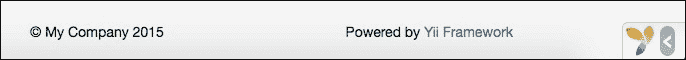
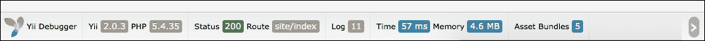
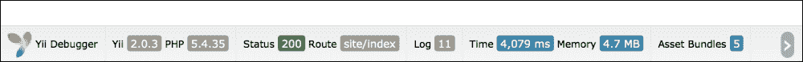
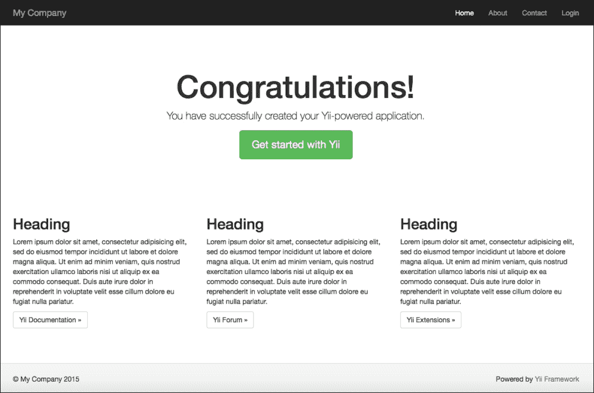

# 第一章. 从 Yii2 开始

Yii2 是对最著名的 PHP 框架之一的第一版本的完全重写。它是一个文档齐全的框架，拥有非常活跃的社区。

正式来说，我们可以找到三种类型的支持：指南，可以在[`www.yiiframework.com/doc-2.0/guide-index.html`](http://www.yiiframework.com/doc-2.0/guide-index.html)中找到，以全面导航框架主题；参考，可以在[`www.yiiframework.com/doc-2.0/index.html`](http://www.yiiframework.com/doc-2.0/index.html)中探索组成框架的所有类；最后，论坛支持在[`www.yiiframework.com/forum/`](http://www.yiiframework.com/forum/)。

在本章中，我们将介绍以下内容：

+   需求和工具

+   使用 Composer 安装 Yii2

+   应用结构

+   应用属性

    +   常见的应用组件

    +   处理应用事件

    +   Yii2 中的 MVC 模式

+   命名规范

    +   配置调试工具栏

    +   使用日志记录器

    +   示例 - 使用 Yii 基本模板和 bootstrap 模板从头开始创建 hello world

# 需求和工具

Yii2 的基本需求是一个网络服务器（本地或远程）和 PHP v.5.4（或更高版本）。建议我们能够访问存储代码的机器（本地或远程）的 shell（或命令行），因为有一些脚本在开发复杂应用程序时非常有用。我们也可以在本地开发应用程序，并在我们希望测试它时将其上传到 Web 服务器。

对于远程托管，有多种选择。我们可以使用简单的支持 PHP v.5.4 的 Web 托管服务，或者选择虚拟或专用服务器托管。记住，在使用前者的情况下，如果服务器不符合 PHP 要求，更改任何问题都可能很困难。

Yii2 有一个名为`requirements.php`的脚本，用于检查我们的托管是否符合运行 Yii2 应用程序的要求。

# 使用 Composer 安装 Yii2

Composer 是 PHP 中依赖管理的工具。Yii2 使用它来安装自身和其他供应商的模块（例如，bootstrap）。

也可以使用旧的方式安装 Yii2，即下载完整包并将其传输到主机，无论是本地还是远程，框架都将安装在那里。然而，Composer 会给我们带来许多好处，比如可以轻松更新框架并确保所有包依赖都得到满足。Composer 实际上是安装和维护项目的标准方式，所以我建议从一开始就使用它。如果你不确定如何使用 Composer，值得一提的是，大多数用户最多只需要学习两到三个命令，所以学习曲线并不陡峭。

Yii2 提供了两个可用的模板来开始：基本和高级。我们将从基本模板开始，但接下来几章我们也会看到如何使用高级模板。

因此，让我们看看如何使用 Composer 安装 Yii2。我们需要通过控制台访问文件夹，其中 web 服务器的 httpdocs 指向并运行以下命令：

```php
curl -s http://getcomposer.org/installer | php
php composer.phar global require "fxp/composer-asset-plugin:1.0.0"
php composer.phar create-project --prefer-dist yiisoft/yii2-app-basic basic

```

如果我们在 Linux 或 Mac 环境中，这些命令很有用。在 Windows 上，您需要从 Composer 的官方网站下载`Composer-Setup.exe`并运行它。

第一个命令获取[`getcomposer.org/installer`](http://getcomposer.org/installer) URL 并将其传递给 PHP 以创建`composer.phar`文件。

第二个命令安装了 Composer 资产插件，这使我们能够通过 Composer 管理 bower 和 npm 包依赖。

第三个也是最后的命令是在名为`basic`的目录中安装 Yii2。如果您愿意，可以选择不同的目录名称。

### 注意

在安装过程中，Composer 可能会要求我们提供 GitHub 登录凭证，这是正常的，因为 Composer 需要获取足够的 API 速率限制来从 GitHub 检索依赖包信息。如果您还没有 GitHub 账户，现在是创建一个新账户的好时机！

如果我们使用 Windows，我们需要从[`getcomposer.org`](https://getcomposer.org)下载它并运行。最后两个命令将是相同的。

我们已经安装了 Yii2！

要测试它，请指向`http://hostname/basic/web`，我们应该看到*我的 Yii 应用程序*页面。

# 应用程序结构

Yii2 的应用程序结构非常清晰、精确且冗余（对于高级应用程序）。

`basic`文件夹的内容应该如下：

| 文件夹名称 | 描述 |
| --- | --- |
| `assets` | 这包括在网页中引用的文件（`.js`和`.css`）以及应用程序的依赖项。 |
| `commands` | 这包括从命令行使用的控制器。 |
| `config` | 这包括从 web 使用的控制器。 |
| `mail` | 这是邮件布局仓库。 |
| `models` | 这包括整个应用程序中使用的模型。 |
| `runtime` | 这用于 Yii2 存储运行时数据作为日志。 |
| `tests` | 这包括所有测试的仓库（单元、功能、固定等）。 |
| `vendor` | 这包括由 Composer 管理的第三方模块仓库。 |
| `views` | 这包含 PHP 文件，分为文件夹，这些文件夹与控制器名称相关联，用于渲染页面模板的主要内容。它主要从控制器动作中调用以渲染显示输出。一个名为 layout 的文件夹包含页面模板的 PHP 文件。 |
| `web` | 这是网页的入口点 |

打开`web/index.php`以查看内容：

```php
<?php
// comment out the following two lines when deployed to production
defined('YII_DEBUG') or define('YII_DEBUG', true);
defined('YII_ENV') or define('YII_ENV', 'dev');

require(__DIR__ . '/../vendor/autoload.php');
require(__DIR__ . '/../vendor/yiisoft/yii2/Yii.php');

$config = require(__DIR__ . '/../config/web.php');

(new yii\web\Application($config))->run();
```

在这里，前两个常量定义非常重要。

`YII_DEBUG`定义了您是否处于调试模式。如果我们设置了它，我们将有更多的日志信息，并且会看到详细的错误调用堆栈。

`YII_ENV` 定义了我们正在工作的环境模式，默认值是 `prod`。可用的值有 `test`、`dev` 和 `prod`。这些值在配置文件中使用，例如定义不同的数据库连接（本地数据库与远程数据库不同）或其他值，始终在配置文件中。

由于我们处于项目的开始阶段，建议将 `YII_DEBUG` 设置为 `true`，以便在代码中出错时获得更详细的信息，而不是无用的空白。

下表包含了一个列表，列出了所有 Yii2 的对象：

| 对象 | 描述 |
| --- | --- |

| 模型、视图和控制器 | 这些是应用中常用的对象，可以应用 MVC 模式：

+   模型是数据表示和操作，通常来自数据库

+   视图用于向最终用户展示数据

+   控制器是处理请求并生成响应的对象

|

| 组件 | 这些是包含逻辑的对象。用户可以编写自己的组件来创建可重用的功能。例如，一个组件可以是货币转换对象，可以在我们的应用中的多个实例中使用。 |
| --- | --- |
| 应用组件 | 它们是可以在应用中的任何位置调用的单例对象。单例意味着在整个应用中只实例化一次对象（因此对象始终是相同的）。应用组件与组件之间的区别在于，前者在整个应用中只有一个实例。 |
| 小部件 | 这些是包含逻辑和渲染代码的可重用视图对象。例如，一个小部件可以是显示今天天气信息的框。 |
| 过滤器 | 这些是在控制器动作执行前后运行的对象。过滤器可以用来改变页面响应输出的格式，例如，从 HTML 到 JSON。 |
| 模块 | 这包含了一个应用中所有的对象，例如模型（Models）、视图（Views）、控制器（Controller）、组件（Components）等；我们可以把它们看作是子应用，包含可重用的部分（例如，用户管理）。 |
| 扩展 | 扩展是打包的模块，我们可以使用 Composer 轻松管理它们。 |

# 应用属性

一个 Yii2 应用可以通过多个属性进行配置。

以下表格列出了任何应用中需要配置的属性：

| 属性 | 描述 |
| --- | --- |
| `id` | 这表示一个唯一的 ID，用于区分此应用与其他应用。它主要用于程序化操作。这个属性的例子是 `basic`。 |
| `basePath` | 这指定了应用的根目录。这个路径是所有其他类型的应用对象（如模型、控制器、视图）的起点。这个属性的例子是 `dirname(__DIR__)`。 |

以下表格列出了其他常见的属性：

| 属性 | 描述 |
| --- | --- |
| `aliases` | 这表示路径定义的别名。它们使用键/值数组定义，当我们需要将路径设置为在整个应用程序中存在的常量时非常有用。我们输入一个以`@`字符为前缀的别名。此属性的示例是`'@fileupload' => 'path/to/files/uploaded'`。 |
| `bootstrap` | 此属性允许您配置在应用程序启动过程中运行的组件数组。常见用法是加载日志或配置文件组件、gii 或任何其他组件。请注意不要加载太多组件，否则您页面的响应性能可能会下降。此属性的示例是`'log'`、`'gii'`。 |
| `catchAll` | 此属性捕获每个请求，并在网站的维护模式下使用。 |
| `components` | 此属性指出可以在整个应用程序中使用的应用程序组件列表。 |
| `language` | 此属性指定用于显示内容的语言。此属性的示例是`'language' => 'en'`。 |
| `modules` | 此属性指出应用程序中可以使用的应用程序模块列表。 |
| `name` | 此属性指示您的应用程序名称。此属性的示例是`'name' => 'My App'`。 |
| `params` | 此属性指定一个参数数组，通过键/值对。这是一个全局参数的容器，例如管理员的电子邮件地址。 |
| `timeZone` | 此属性指示应用程序应使用的时间区域。此属性的示例是`'timeZone' => 'Europe/Rome'`。 |
| `charset` | 此属性指出应用程序中使用的字符集。默认值是`UTF-8`。 |
| `defaultRoute` | 此属性包含一个在请求未指定时使用的路由。根据我们使用的环境，此属性有不同的默认值。对于 Web 应用程序，此值将是`site`，以便`SiteController`可以用来处理这些请求。对于控制台应用程序，此值将是`help`，以便可以使用`yii\console\controllers\HelpController`调用其索引操作，该操作将显示帮助信息。 |

## 常见应用程序组件

以下是最常用的应用程序组件列表：

+   `request`：此组件处理所有客户端请求，并提供从服务器全局变量（如`$_SERVER`、`$_POST`、`$_GET`和`$_COOKIES`）中轻松获取参数的方法。

    默认状态下，`enableCookieValidation`设置为 true，因此您需要设置`cookieValidationKey`参数，如下例所示：

    ```php
    'request' => [
    'cookieValidationKey' => 'hPpnJs7tvs0T4N2OGAY',
    ],
    ```

+   `cache`：此组件帮助您处理缓存数据。Yii2 默认使用`FileCache`实例作为缓存，但我们也可以配置`ApcCache`、`DbCache`、`MemCache`等。

    以下是对 Yii2 的标准安装：

    ```php
    'cache' => [                     
    'class' => 'yii\caching\FileCache',
    ],
    ```

+   `user`：此组件处理应用程序中的用户身份验证。最重要的参数是 `identityClass` 参数，它定义了包含用户模型数据的类，以便有特定的登录或注销用户的应用程序方法。

    考虑以下示例：

    ```php
    'user' => [
    'identityClass' => 'app\models\User',
             'enableAutoLogin' => true,
     ],
    ```

+   `errorHandler`：此组件提供处理未捕获的错误和异常的功能。可以通过指定要运行的操作进行配置。

    考虑以下示例：

    ```php
    'errorHandler' => [
    'errorAction' => 'site/error',
    ],
    ```

+   `mailer`：此组件配置邮件发送系统的连接参数。通常，它是托管我们网站的同一台机器，因此默认值可能正确。

    考虑以下示例：

    ```php
    'mailer' => [
      'class' => 'yii\swiftmailer\Mailer',
      // send all mails to a file by default. You have to set
      // 'useFileTransport' to false and configure a transport
         // for the mailer to send real emails.
         'useFileTransport' => true,
    ],
    ```

+   `log`：此组件主要用于调试环境中的应用程序执行日志。我们可以设置调试级别和目的地。

    考虑以下示例：

    ```php
    'log' => [
               'traceLevel' => YII_DEBUG ? 3 : 0,
                'targets' => [
                    [
                        'class' => 'yii\log\FileTarget',
                        'levels' => ['error', 'warning'],
                    ],
                ],
     ],
    ```

+   `db`：此组件处理数据库连接。在我们的应用程序中可以有多个 db 配置；在这种情况下，我们可以定义更多位于 `yii\db\` 的 `Connection` 类的组件。

    考虑以下示例：

    ```php
    db => [
        'class' => 'yii\db\Connection',
        'dsn' => 'mysql:host=localhost;dbname=yii2basic',
        'username' => 'dbuser'',
        'password' => 'dbpassword',
        'charset' => 'utf8',
    ],
    ```

## 处理应用程序事件

在其生命周期中，一个应用程序可以触发许多事件。这些事件可以在应用程序配置中声明或通过程序方式声明。常见的触发器有 `beforeRequest`、`afterRequest`、`beforeAction` 和 `afterAction`，但每个对象都可以有自己的事件。

例如，事件的一个常见用途是设置 `mysql db timezone`。

要在 db 组件配置中将时区设置为 UTC，我们必须为 `afterOpen` 事件定义一个处理程序：

```php
'db' => [
  'class' => 'yii\db\Connection',
  'dsn' => 'mysql:host=localhost;dbname=mydb',
  'username' => 'dbuser',
  'password' => 'dbpassword',
  'charset' => 'utf8',

  'on afterOpen' => function($event) {
    $event->sender->createCommand("SET time_zone = '+00:00'")->execute();
       }
  ],
```

一个匿名函数，附加到 `on afterOpen` 事件处理程序，有一个 `$event` 参数，它是 `yii\base\ActionEvent` 类的实例。此类有一个 `$sender` 对象，它引用事件的发送者。在这种情况下，`$sender` 指的是数据库组件（db）的实例。当此事件是类级别事件时，此属性也可能为 null。

## Yii2 中的 MVC 模式

Yii2 是根据 **模型-视图-控制器**（**MVC**）设计模式构建的。

模型，代表逻辑，是从 `\yii\base\Model` 扩展的对象，提供了许多功能，例如属性、属性标签、大量赋值（直接为数组填充对象属性）、验证规则和数据导出。

通常，在常见应用程序中，模型将从数据库生成，扩展 `yii\db\ActiveRecord`，该类实现了 Active Record 设计模式，具有许多用于操作数据的方法。Yii2 提供了 Gii 工具，该工具用于直接从数据库的表结构生成模型类。

控制器，视图和模型之间的桥梁，是扩展自 `yii\base\Controller` 的类实例，用于处理请求和生成响应。

控制器主要包含以动作前缀开头的函数，这使得框架能够识别这些函数作为路由，可以请求。

最后，我们将查看处理向最终用户显示数据的视图，这些数据主要在页面布局中由控制器渲染。

# 命名规范

为了允许自动加载，Yii2 使用一个简单的标准来设置名称。

指向请求的模块、控制器和操作的路线采用以下格式：

`ModuleID/ControllerID/ActionID`

我们将如下详细查看每个元素：

+   ModuleID 是可选的，因此通常格式是 ControllerID/ActionID

+   必须在模块的配置属性中指定 ModuleID，名称相同

+   ControllerID 和 ActionID 应仅包含小写英文字符、数字、下划线、破折号和正斜杠

路由的一个示例是 `http://hostname/index.php?r=site/index`，其中 `site` 是 ControllerID，`index` 是 ActionID。

从 ControllerID 开始，创建控制器类名非常简单。只需将每个由破折号分隔的单词的首字母转换为大写，然后删除破折号并附加后缀 Controller。如果 ControllerID 包含斜杠，只需将规则应用于 ID 中最后一个斜杠之后的部分。这是可能的，因为控制器可以从 `app\controllers` 开始收集在子文件夹中。

以下是一些示例：

+   商店指向 `app\controllers\ShopController`

+   优先数字指向 `app\controllers\PreferredNumberController`

+   管理员/用户账户指向 `app\controllers\admin\UsersAccountController`

路由通过 `r` 参数传递到入口脚本 `basic/web/index.php`。

### 注意

默认页面 `http://hostname/basic/web/index.php` 等同于 `http://hostname/basic/web/index.php?r=site/index`。

## 配置调试工具栏

拥有一个丰富的工具集，以便在显示有关请求和响应的有用信息时使开发更容易，这是很重要的。

为了这个目的，Yii2 提供了一个显示多种信息的工具栏。

激活调试工具栏的一种常见方法是在 `config/web.php` 中设置：

```php
'bootstrap' => ['debug'],
'modules' => [
  'debug' => 'yii\debug\Module',
]
```

现在，你可以设置以下值：

+   将 `debug` 配置节点更改为 `bootstrap`

+   将 `debug` 配置节点更改为 `modules` 配置节点，使用 `yii\debug\` 下的 `Module` 类

Yii2 基本模板的默认安装已经启用了调试工具栏，正如我们可以在 `config/web.php` 配置文件的底部看到的那样。Gii 模块也已启用，但我们将稍后处理它。

```php
if (YII_ENV_DEV) {
    // configuration adjustments for 'dev' environment
    $config['bootstrap'][] = 'debug';
    $config['modules']['debug'] = 'yii\debug\Module';
    $config['bootstrap'][] = 'gii';
    $config['modules']['gii'] = 'yii\gii\Module';
}
```

此配置条目仅在 `YII_ENV_DEV` 模式下有效。因此，我们必须检查 `web/index.php YII_ENV` 变量是否具有 `dev` 值（如默认安装所示）。



调试工具栏已关闭

在这些检查之后，如果我们尝试重新加载 `basic/web/index.php` 上的网页，我们应该看到以下截图：



调试工具栏已打开

右箭头报告调试工具栏处于活动状态但已关闭。如果我们点击它，完整的工具栏将打开。现在，点击任何项目，调试面板将显示。

默认情况下，调试工具栏只能在本地主机上使用。但是，如果我们正在使用 Yii2 在远程托管环境中，我们将设置 `debug` 模块的 `allowedIPs` 属性。

```php
$config['modules']['debug'] = [
    'class' => 'yii\debug\Module',
    'allowedIPs' => [ '127.0.0.1', '::1']
];
```

在 `allowedIPs` 中只有本地主机（IPv4 和 IPv6 形式）。我们需要在这里放置我们的互联网连接和 IP 源地址，这可以通过使用互联网上的任何 `我的 IP` 服务轻松找到，例如 [`www.whatismyip.com/`](http://www.whatismyip.com/)。

如果我们的 IP 源是，例如，`1.2.3.4`，我们必须将此条目添加到 `allowedIPs` 中，这样：

```php
$config['modules']['debug'] = [
    'class' => 'yii\debug\Module',
    'allowedIPs' => [ '127.0.0.1', '::1', '1.2.3.4']
];
```

记住，如果我们没有静态 IP 的互联网连接，这个 IP 可能会改变。因此，我们需要检查 `allowedIPs` 是否包含我们的当前 IP。

您也可以使用星号 `*` 允许所有 IP 地址，这样您就不必处理动态 IP 问题。如果您这样做，您需要记住在部署之前删除星号。最后，在我们的当前配置 `config/web.php` 的底部，您将看到以下代码：

```php
if (YII_ENV_DEV) {
    // configuration adjustments for 'dev' environment
    $config['bootstrap'][] = 'debug';
    $config['modules']['debug'] = [
        'class' => 'yii\debug\Module',
            'allowedIPs' => [ '127.0.0.1', '::1', '1.2.3.4']
    ];
    $config['bootstrap'][] = 'gii';
    $config['modules']['gii'] = 'yii\gii\Module';
}
```

让我们回到 `basic/web/index.php` 网页并查看调试信息面板。

调试信息分布在菜单中：

+   **配置**：这包括已安装的 PHP 版本和配置，以及已安装的 Yii2 框架版本。

+   **请求**：这是关于刚刚发送的请求的信息，显示请求的参数、请求的头部和其他有用的数据，如响应和会话数据。

+   **日志**：这涉及 Yii2 在执行期间执行的操作。本节中还有额外的过滤器，用于选择要显示的日志类型。

+   **性能分析**：这包括关于处理过程的时间和持续时间的详细信息。

+   **数据库**：这包括关于所有数据库查询发生的详细信息；我们可以过滤查询类型以定位特定查询。

可以使用内部网格过滤器过滤所有数据，或者过滤所有、最新或选择内容面板顶部最后 10 行日志。

## 使用记录器

在 Yii2 应用程序中，调试信息是通过日志组件存储的。我们可以在开发和生产环境中使用此工具，但出于性能和安全的考虑，在生产环境中，我们应该只记录重要消息。

Yii2 基本模板的默认配置文件在 `config/web.php` 的 `components` 属性中提供日志条目：

```php
'log' => [
  'traceLevel' => YII_DEBUG ? 3 : 0,
      'targets' => [
      [
             'class' => 'yii\log\FileTarget',
             'levels' => ['error', 'warning'],
      ],
    ],
],
```

## 示例 - 使用 Yii 基本模板和 Bootstrap 模板从头开始创建“Hello world”

现在是时候使用 Yii2 编写我们的第一个项目了。

如果我们还没有安装 Yii2，我们现在将使用 Composer 来完成安装，如下所示：

1.  打开到 Web 服务器的命令提示符。

1.  前往 Web 服务器文档根目录（Linux 机器上的 `/var/www`）。

1.  启动这些命令（如 *使用 Composer 安装 Yii* 部分所述）：

    ```php
    curl -s http://getcomposer.org/installer | php
    php composer.phar global require "fxp/composer-asset-plugin:1.0.0"
    php composer.phar create-project --prefer-dist yiisoft/yii2-app-basic basic

    ```

现在，我们需要在 Web 服务器文档根的基本文件夹中安装一个全新的 Yii2。将浏览器指向`http:/hostname/basic/web`，我们应该看到 Yii2 的祝贺页面：



Hello world 页面的示例

我们将创建第一个动作，在屏幕上显示一个难忘的`hello world`。

从“应用程序属性”部分我们知道，在默认路由条目中，当请求未指定路由时，将调用`SiteController`控制器。

因此，我们进入`basic/controllers`并打开默认控制器`SiteController.php`。

在`SiteController`类定义中，我们在顶部添加了一个新方法，称为`actionHelloWorld`，没有参数。

```php
public function actionHelloWorld()
{
    echo 'hello world'
}
```

让我们保存文件，并将浏览器指向`http://hostname/basic/web/index.php?r=site/hello-world`。

你应该看到一个空白页面，上面显示`hello world`。

### 注意

使用名称路由约定时请注意。大写字母将被转换为小写字母和短横线。

这很棒，但现在我们只想在页面模板中放置`hello world`。

我们现在需要创建一个包含响应内容“hello world!”的视图。为了做到这一点，我们需要在`views/site`下创建一个名为`helloWorld.php`的文件，作为操作的名称。命名约定在这里不一定必须相同，因为视图文件不是由框架自动调用的。

此文件仅包含`hello world`文本。

我们使用以下代码更新`SiteController`：

```php
public function actionHelloWorld()
{
    return $this->render('helloWorld');
}
```

在`actionHelloWorld()`方法中，`$this`指的是`SiteController`的实例，`render()`将插入`views/helloWorld.php`文件内容到主要内容布局页面。

视图文件的扩展名`.php`是由框架自动添加的，用于查看传递给渲染方法的名称参数。

如果我们想向`actionHelloWorld()`传递一个参数，例如名称，怎么办？正式来说，我们只需要在`SiteController`中向`actionHelloWorld()`添加一个参数，如下所示：

```php
public function actionHelloWorld($nameToDisplay)
{
    return $this->render('helloWorld',
  [ 'nameToDisplay' => $nameToDisplay ]
    );
}
```

然后，在`view/site/helloWorld.php`下添加以下代码：

```php
Hello World <?php echo $nameToDisplay ?>
```

通过更新`actionHelloWorld()`，我们将作为第二个参数传递一个变量数组，这些变量将在视图中可见并使用。

当我们在动作函数中使用参数时，我们必须记住它们将是必需的，并且我们必须在传递给请求时尊重顺序。

为了避免这个义务，我们可以使用旧方法，将参数解析到函数中：

```php
public function actionHelloWorld()
{
    $nameToDisplay = Yii::$app->request->get('nameToDisplay');
    // Equivalent to
// $nameToDisplay = isset($_GET['nameToDisplay'])?$_GET['nameToDisplay']:null;

    return $this->render('helloWorld',
    [ 'nameToDisplay' => $nameToDisplay ]
    );
}
```

使用这种解决方案，我们可以决定是否将`nameToDisplay`参数传递给请求。`nameToDisplay`参数的默认值将是 null，但我们可以决定分配不同的值。

以下是一个传递`nameToDisplay`参数`Foo`的 URL 示例：

`http://hostname/basic/web/index.php?r=site/hello-world&nameToDisplay=Foo`

# 摘要

在本章中，我们探讨了 Yii2 框架的基本理解，从需求开始解释其主要特性。然后我们使用了调试和日志工具来追踪我们的代码，并能够找到错误。最后，我们基于基本模板编写了我们的第一个项目。

接下来，你将学习如何创建我们的控制器和视图，以创建与前端用户的自定义交互。
