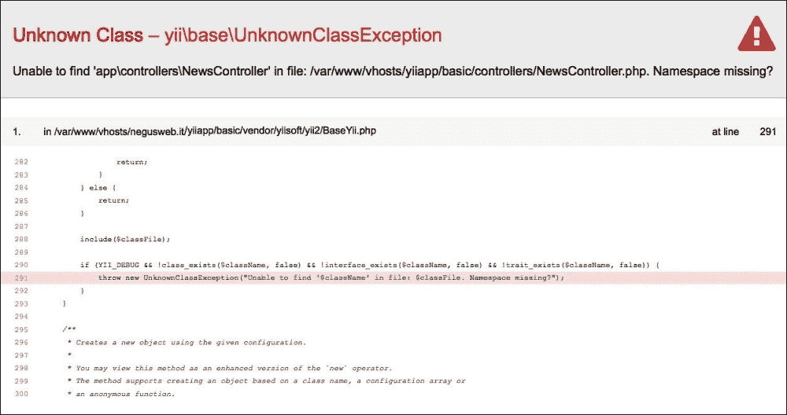
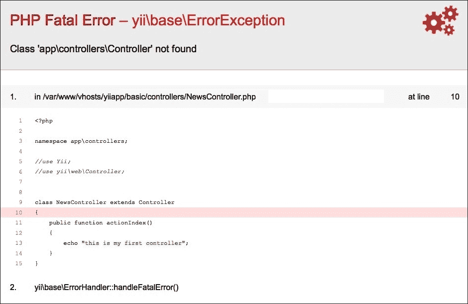
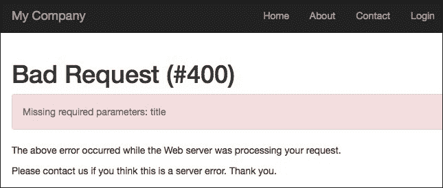
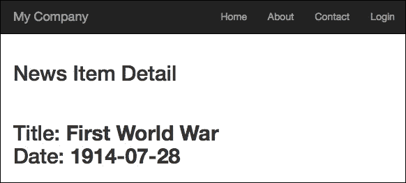
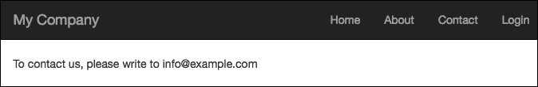
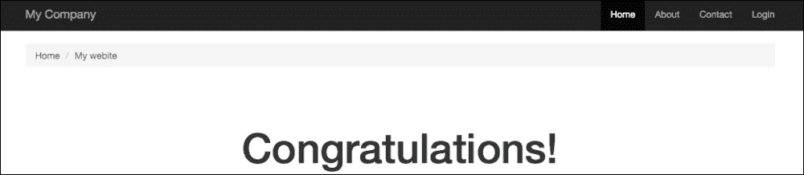
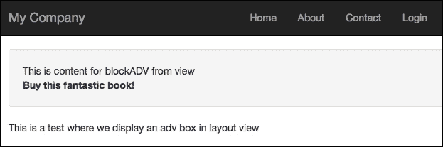

# 第二章：创建简单的新闻阅读器

本章解释了如何编写第一个控制器以显示新闻条目列表和详情，实现控制器和视图之间的交互，然后自定义视图布局。

本章，我们将介绍以下内容：

+   创建控制器和动作

+   创建一个视图来显示新闻列表

+   控制器如何将数据发送到视图

    +   示例 - 创建一个控制器来显示静态新闻条目列表和详情

+   将公共视图内容拆分为可重用的视图

    +   示例 - 在视图中渲染部分

+   创建静态页面

+   在视图和布局之间共享数据

    +   示例 - 根据 URL 参数更改布局背景

+   带有动态块的布局

    +   示例 - 添加动态框来显示广告信息

+   使用多个布局

    +   示例 - 使用不同的布局为同一视图创建响应式和非响应式布局

# 创建控制器和动作

为了处理请求，首先要做的是创建一个新的控制器。

创建文件控制器时必须记住的事项如下：

+   顶部的命名空间（在基本应用程序中通常是`app\controllers`）

+   使用类所用的`use`路径

+   控制器类必须扩展`yii\web\Controller`类

+   动作由以`action`开头且每个单词首字母大写的控制器函数处理

让我们指向`basic/controllers`并创建一个名为`NewsController.php`的文件。

然后，创建一个与文件同名的类，并从控制器扩展它；最后，创建一个名为`index`的动作来管理`news/index`的请求：

```php
<?php

// 1\. specify namespace at the top (in basic application usually app\controllers);
namespace app\controllers;

// 2\. specify 'use' path for used class;
use Yii;
use yii\web\Controller;

// 3\. controller class must extend yii\web\Controller class;
// This line is equivalent to
// class NewsController extends yii\web\Controller
class NewsController extends Controller
{
// 4\. actions are handled from controller functions whose name starts with 'action' and the first letter of each word is uppercase;
    public function actionIndex()
    {
            echo "this is my first controller";
    }
}
```

如果我们尝试将浏览器指向`http://hostname/basic/web/index.php?r=news/index`，我们将看到一个空白页面，并显示通知**这是我的第一个控制器**。

现在，让我们看看当我们忽略本章开头提到的四个注意事项时，可能会发生哪些常见错误。

命名空间定义了我们应用程序中使用的名称的层次结构组织。如果我们忘记声明命名空间，当`YII_DEBUG`在`web/index.php`中设置为 true 时，Yii2 将显示以下错误消息：



缺少的控制器命名空间

Yii2 以极好的方式报告错误，它给了我们检查是否缺少命名空间来解决问题的可能性。

然后，使用`Use`关键字来指定应用程序中类的完整路径。如果一个类具有`path/to/class/ClassName`的完整路径，我们只需在命名空间声明后立即添加`use path/to/class/ClassName`，就可以在应用程序中使用`ClassName`来引用该类。

然而，如果我们只使用`ClassName`而没有在文件顶部定义`use`声明，可能会出现以下错误：



这个错误很容易解释，但很难找到，尤其是对于初学者来说。

在这种情况下，截图显示在第 9 行已经使用了 `Controller` 名称（在 `extends` 关键字之后）。由于没有 `Controller` 类名的完整路径，Yii2 将尝试在 `app\controllers` 下查找 `Controller` 类，但没有找到。

要解决这个问题，我们必须在第 9 行将 `Controller` 替换为 `yii\web\Controller`，以及所有后续将使用 `Controller` 类名而不定义完整类路径的行，或者在该文件顶部插入 `use` 声明，我们必须使用 `yii\web\Controller`。

控制器始终是 `yii\web\Controller` 的子类，或者如果我们使用了 `use` 关键字，那么是 `Controller` 的子类。动作名称遵循前一章中描述的规则。

# 创建一个视图来显示新闻列表

现在，我们将在名为 `itemsList` 的视图中创建一个简单的新闻列表。我们将从 `NewsController` 指向此视图，因此我们必须：

+   在 `basic/views` 下创建一个 `news` 文件夹，`NewsController` 将使用该文件夹作为基本文件夹来搜索要渲染的视图（根据前一章中解释的视图名称规则）。

+   在 `basic/views/news` 下创建一个 `itemsList.php` 文件

现在，打开 `basic/views/news/itemsList.php`，创建一个包含数据列表的数组，并使用简单的项目表格显示输出：

```php
<?php
    $newsList = [
        [ 'title' => 'First World War', 'date' => '1914-07-28' ],
        [ 'title' => 'Second World War', 'date' => '1939-09-01' ],
        [ 'title' => 'First man on the moon', 'date' => '1969-07-20' ]
    ];
?>

<table>
    <tr>
        <th>Title</th>
        <th>Date</th>
    </tr>
    <?php foreach($newsList as $item) { ?>
    <tr>
        <td><?php echo $item['title'] ?></td>
        <td><?php echo $item['date'] ?></td>
    </tr>
    <?php } ?>
</table>
```

然后，我们需要创建一个名为 `actionItemsList` 的动作，它将通过 `http://hostname/basic/web/index.php?r=news/items-list` 渲染。

### 提示

**下载示例代码**

您可以从您在 [`www.packtpub.com`](http://www.packtpub.com) 的账户下载示例代码文件，以获取您购买的所有 Packt Publishing 书籍。如果您在其他地方购买了此书，您可以访问 [`www.packtpub.com/support`](http://www.packtpub.com/support) 并注册以直接将文件通过电子邮件发送给您。

### 注意

注意路由、控制器和动作的命名：

+   此动作的路由为 `news/items-list`（小写，单词由破折号分隔）；

+   控制器类名为 `NewsController`（大写，以 Controller 结尾）。

+   `NewsController` 中的动作函数名为 `actionItemsList`（函数名以 `action` 字词为前缀，路由中的破折号被移除，每个单词的首字母大写）；

需要添加到 `NewsController` 类中的函数如下：

```php
public function actionItemsList()
{
     return $this->render('itemsList');
}
```

属于 `\yii\web\Controller` 的 `render()` 方法，在布局中显示传递给第一个参数的视图内容。当框架查找视图时，它将 `.php` 扩展名附加到 `render()` 方法的第一个参数名称，并在 `basic/view/news` 中查找它。路径的最后一个成员是调用 `render()` 方法的名称。

现在，我们可以指向 `http://hostname/basic/web/index.php?r=news/items-list`，以查看我们的美丽表格！

# 控制器如何向视图发送数据

在上一段中，我们看到了如何显示内容视图。然而，视图只应该负责显示数据，而不应该进行操作。因此，任何数据操作都应该在控制器动作中完成，然后传递给视图。

控制器动作中的 `render()` 方法有一个第二个参数，它是一个数组，其键是变量的名称，值是这些变量在视图上下文中的内容。

现在，让我们将 `itemsList` 示例中的所有数据操作移到控制器中，只留下格式化输出（如 HTML）的代码。

以下是在 `actionItemsList()` 控制器中的内容：

```php
public function actionItemsList()
{
  $newsList = [
    [ 'title' => 'First World War', 'date' => '1914-07-28' ],
    [ 'title' => 'Second World War', 'date' => '1939-09-01' ],
    [ 'title' => 'First man on the moon', 'date' => '1969-07-20' ]
  ];

  return $this->render('itemsList', ['newsList' => $newsList]);
}
```

在 `views/news/itemsList.php` 中，我们只有以下代码：

```php
<?php // $newsList is from actionItemsList ?>
<table>
    <tr>
        <th>Title</th>
        <th>Date</th>
    </tr>
    <?php foreach($newsList as $item) { ?>
    <tr>
        <th><?php echo $item['title'] ?></th>
        <th><?php echo $item['date'] ?></th>
    </tr>
    <?php } ?>
</table>
```

因此，我们已经正确地分割了控制器和视图的工作。

## 示例 – 创建一个控制器，使用 bootstrap 模板显示静态新闻条目列表和详情

我们下一个目标是完成新闻阅读器，在另一页面上显示单条新闻的详细信息。

由于我们将使用相同的数据来显示列表和详情，我们将从动作中提取 `$newsList` 数据到一个函数中，以便在更多动作中重用。

在 `NewsController` 中，我们将有以下代码：

```php
public function dataItems()
{
  $newsList = [
    [ 'title' => 'First World War', 'date' => '1914-07-28' ],
    [ 'title' => 'Second World War', 'date' => '1939-09-01' ],
    [ 'title' => 'First man on the moon', 'date' => '1969-07-20' ]
  ];

  return $newsList;
}

public function actionItemsList()
{
  $newsList = $this->dataItems();

  return $this->render('itemsList', ['newsList' => $newsList]);
}
```

然后，我们将在 `NewsController` 中创建一个新的函数 `actionItemDetail`，用于处理新闻条目详情的请求。此函数将期望一个参数，允许从 `$newsList` 中过滤出正确的条目，例如标题。

以下是在 `actionItemDetail` 中的内容：

```php
public function actionItemDetail($title)
{
  $newsList = $this->dataItems();

  $item = null;
  foreach($newsList as $n)
  {
    if($title == $n['title']) $item = $n;
  }

  return $this->render('itemDetail', ['item' => $item]);
}
```

接下来，我们必须在 `views/news` 中创建一个新的视图文件，命名为 `itemDetail.php`。

以下是在 `views/news/` 目录下 `itemDetail.php` 的内容：

```php
<?php // $item is from actionItemDetail ?>

<h2>News Item Detail<h2>
<br />
Title: <b><?php echo $item['title'] ?></b>
<br />
Date: <b><?php echo $item['date'] ?></b>
```

如果我们不传递标题参数，指向 `http://hostname/basic/web/index.php?r=news/item-detail`，我们将看到以下截图：



它显示了一个错误，告诉我们标题参数缺失。

尝试将 `First%20%World%20War` 作为标题参数传递到 URL 中，如下所示 `http://hostname/basic/web/index.php?r=news/item-detail&title=First%20World%20War`；以下将是输出：



这正是我们期望的！

最后，我们希望将 `itemsList` 和 `itemDetail` 连接起来。在 `views/news/itemsList.php` 中，我们必须将标题内容更改为锚点元素，如下所示：

```php
<?php // $newsList is from actionItemsList ?>
<table>
  <tr>
    <th>Title</th>
    <th>Date</th>
  </tr>
  <?php foreach($newsList as $item) { ?>
  <tr>
    <th><a href="<?php echo Yii::$app->urlManager->createUrl(['news/item-detail' , 'title' => $item['title']]) ?>"><?php echo $item['title'] ?></a></th>
    <th><?php echo $item['date'] ?></th>
  </tr>
  <?php } ?>
</table>
```

要创建链接，有一个可用的组件 `urlManager`，它允许我们通过 `createUrl()` 方法创建链接。`createUrl()` 中的参数是一个包含路由路径和要传递给 URL 的变量的数组。要了解更多关于这个方法的信息，请参考链接 [`www.yiiframework.com/doc-2.0/yii-web-urlmanager.html#createUrl%28%29-detail`](http://www.yiiframework.com/doc-2.0/yii-web-urlmanager.html#createUrl%28%29-detail)。

在我们的例子中，我们有一个 `news/item-detail` 作为要调用的路由，以及要传递给 URL 的 `title` 参数。

### 注意

日期可以使用内置的格式化组件进行格式化。例如，要显示 d/m/Y 格式的日期，可以使用以下代码：`d/m/Y : Yii::$app->formatter->asDatetime($item['date'], "php:d/m/Y");`。

建议使用唯一的标识符在路由之间传递数据。为此，我们添加了一个名为 `id` 的第三个参数，用于唯一标识记录。

以下为 `NewsController` 的内容：

```php
public function dataItems()
{
  $newsList = [
    [ 'id' => 1, 'title' => 'First World War', 'date' => '1914-07-28' ],
    [ 'id' => 2, 'title' => 'Second World War', 'date' => '1939-09-01' ],
    [ 'id' => 3, 'title' => 'First man on the moon', 'date' => '1969-07-20' ]
  ];
  return $newsList;
}

public function actionItemsList()
{
  $newsList = $this->dataItems();
  return $this->render('itemsList', ['newsList' => $newsList]);
}
public function actionItemDetail($id)
{
  $newsList = $this->dataItems();

  $item = null;
  foreach($newsList as $n)
  {
    if($id == $n['id']) $item = $n;
  }

  return $this->render('itemDetail', ['item' => $item]);
}
```

然后，修改 `views/news/itemsList.php` 中的 `createUrl` 参数：

```php
<table>
  <tr>
    <th>Title</th>
     <th>Date</th>
  </tr>
  <?php foreach($newsList as $item) { ?>
  <tr>
    <th><a href="<?php echo Yii::$app->urlManager->createUrl(['news/item-detail' , 'id' => $item['id']]) ?>"><?php echo $item['title'] ?></a></th>
    <th><?php echo Yii::$app->formatter->asDatetime($item['date'], "php:d/m/Y"); ?></th>
  </tr>
  <?php } ?>
</table>
```

# 将通用视图内容拆分为可重用视图

有时，视图会共享相同的内容部分。在到目前为止的例子中，我们已经看到 `itemsList` 和 `itemDetail` 的通用区域可以是版权数据，它显示有关版权信息的免责声明。

为了做到这一点，我们必须将通用内容放在一个单独的视图中，并使用控制器中的 `renderPartial()` 方法来调用它 ([`www.yiiframework.com/doc-2.0/yii-base-controller.html#renderPartial%28%29-detail`](http://www.yiiframework.com/doc-2.0/yii-base-controller.html#renderPartial%28%29-detail))。它具有与 `render()` 方法相同的参数类型；`render()` 和 `renderPartial()` 方法的主要区别在于，`render()` 将视图内容写入布局，而 `renderPartial()` 只将视图内容写入输出。

## 示例 - 在视图中渲染部分内容

在这个例子中，我们为 `itemsList` 和 `itemDetail` 创建了一个关于版权数据的通用视图。

在 `views/news` 目录下创建一个名为 `_copyright.php` 的视图文件。

### 注意

通常，在 Yii2 的应用中，以下划线开头的视图名称表示通用可重用视图。

在这个文件中，只将版权文本放入 `views/news/_copyright.php`：

```php
<div>
     This is text about copyright data for news items
</div>
```

现在，我们想在 `itemsList` 和 `itemDetail` 视图中显示这个视图。

将位于 `views/news/` 目录下的 `itemsList.php` 文件中的内容修改如下：

```php
<?php echo $this->context->renderPartial('_copyright'); ?>
<table>
  <tr>
    <th>Title</th>
    <th>Date</th>
  </tr>
  <?php foreach($newsList as $item) { ?>
  <tr>
    <th><a href="<?php echo Yii::$app->urlManager->createUrl(['news/item-detail' , 'id' => $item['id']]) ?>"> <?php echo $item['title'] ?> </a></th>
    <th><?php echo Yii::$app->formatter->asDatetime($item['date'], 'php:d/m/Y'); ?></th>
  </tr>
  <?php } ?>
</table>
```

然后，将位于 `views/news/` 目录下的 `itemDetail.php` 文件中的内容修改如下：

```php
<?php // $item is from actionItemDetail ?>
<?php echo $this->context->renderPartial('_copyright'); ?>
<h2>News Item Detail<h2>
<br />
Title: <b><?php echo $item['title'] ?></b>
<br />
Date: <b><?php echo $item['date'] ?></b>
```

我们在两个视图中都把通用代码放在了文件顶部：

```php
<?php echo $this->context->renderPartial('_copyright'); ?>
```

这将渲染 `_copyright.php` 视图的内容，但不包含布局。

### 注意

注意！由于 `renderPartial()` 是 `Controller` 类的一个方法，而 `$this` 在视图文件中指向 `View` 类，为了从 `$this` 访问 `renderPartial()`，我们将使用上下文成员，它在 `View` 对象中代表 `Controller` 对象。

# 创建静态页面

所有网站都包含静态页面，其内容是静态的。

要以常规方式创建一个静态页面，我们需要：

+   在`Controller`中创建一个执行操作的函数（`action`）

+   创建静态内容的视图

将以下操作追加到`Controller`：

```php
public function actionInfo()
{
    return $this->render('info');
}
```

然后，在`views/controller/action-name.php`中创建一个视图。这个过程很简单，但太长且冗余。

Yii2 提供了一个快速替代方案，将静态页面添加到`Controller`的`actions()`方法中，如下所示：

```php
public function actions()
{
  return [
    'pages' => [
    'class' => 'yii\web\ViewAction',
    ],
  ];
}
```

通过这个简单的声明，我们可以将所有静态内容放在`views/controllerName/pages`下。

最后，我们可以通过路由`controller_name/page`指向 URL，以及通过视图文件名称（如`http://hostname/basic/web/index.php?r=controllerName/pages&view=name_of_view`）来指定`view`参数。

## 示例 - 添加一个联系页面

在我们学习了如何创建静态页面之后，现在是时候编写一个联系页面了。

让我们在`views/site/pages/contact.php`中放置一段简短的静态内容，如下所示：

```php
To contact us, please write to info@example.com
```

然后，让我们在`Controller`的`actions()`方法返回的数组中添加一个`page`属性。为了简化，我们将使用具有此默认`actions()`方法实现的`SiteController`：

```php
  public function actions()
  {
    return [
    'error' => [
       'class' => 'yii\web\ErrorAction',
    ],
    'captcha' => [
      'class' => 'yii\captcha\CaptchaAction',
      'fixedVerifyCode' => YII_ENV_TEST ? 'testme' : null,
    ],
  ];
  }
```

在最后一个属性之后，我们将追加`page`属性，以下将是结果：

```php
  public function actions()
  {
    return [
    'error' => [
      'class' => 'yii\web\ErrorAction',
    ],
    'captcha' => [
      'class' => 'yii\captcha\CaptchaAction',
      'fixedVerifyCode' => YII_ENV_TEST ? 'testme' : null,
    ],
    'pages' => [
      'class' => 'yii\web\ViewAction',
    ],
  ];
  }
```

现在，每个对`site/pages/`的请求都使用`ViewAction`类进行路由，它通过简单地渲染相对视图的静态内容来处理它。

通过点击`http://hostname/basic/web/index.php?r=site/pages&view=contact`进行测试，我们应该看到以下内容：



我们可以通过这些更改自定义路由的最后部分：

+   从`Controller`的`actions()`方法返回的数组中的属性名

+   将`ViewAction`类声明中的`viewPrefix`属性设置为我们要使用的 URL 的第一部分，以到达页面

+   更改`views/controllerName`下的子文件夹名称

例如，我们想在`SiteController`中通过 URL 的最后部分使用`static`来访问静态页面。

我们想指向`http://hostname/basic/web/index.php?r=site/static&view=contact`以显示联系视图。

这将是`SiteController`的`actions()`方法数组中的`ViewAction`节点：

```php
    'static' => [
    'class' => 'yii\web\ViewAction',
    'viewPrefix' => 'static'
    ],  
```

我们还必须更改静态页面子文件夹的名称，将其从`views/site/pages`重命名为`views/site/static`，并且我们可以指向`http://hostname/basic/web/index.php?r=site/static&view=contact`。

# 视图和布局之间的数据共享

Yii2 通过视图组件的`params`属性提供了一种标准解决方案，该属性可用于在视图之间共享数据。

### 注意

这是一个标准解决方案，因为`params`属性存在于所有视图中，并且它附加到视图组件上。

这个属性，`params`，是一个我们可以无限制使用的数组。

想象一下，我们想填充布局中的面包屑元素以跟踪导航路径。

打开主布局 `views/layouts/main.php`；你应该在声明页脚之前找到默认的面包屑实现：

```php
        <div class="container">
            <?= Breadcrumbs::widget([
                'links' => isset($this->params['breadcrumbs']) ? $this->params['breadcrumbs'] : [],
            ]) ?>
         </div>
```

我们需要在视图中填充 `params` 的面包屑属性，以便从任何视图显示到布局的定制路径。例如，我们希望在 `SiteController` 的 index 中显示面包屑。

访问 `views/site/index.php` 并在文件顶部添加以下代码：

```php
$this->params['breadcrumbs'][] = 'My website';
```

### 注意

由于我们处于视图文件中，`$this` 指的是视图组件。

访问 `http://hostname/basic/web/index.php?r=site/index` 以查看页面顶部的面包屑栏出现：



## 示例 - 根据 URL 参数更改布局背景

视图和布局之间通信的另一个例子是，例如，根据 URL 参数更改布局的背景颜色。

我们需要通过 URL 中的 `bckg` 参数更改路由 `site/index` 的背景。

因此，我们必须打开 `views/site/index.php` 并将此代码放在顶部：

```php
<?php
$backgroundColor = isset($_REQUEST['bckg'])?$_REQUEST['bckg']:'#FFFFFF';
$this->params['background_color'] = $backgroundColor;
```

如果没有传递到 `bckg` 参数，此代码将设置 `$``backgroundColor` 为 `#FFFFFF`（白色），否则它将传递一个值。

然后，设置视图组件的 `params` 属性，以便在布局中写入其内容。

打开 `views/layout/main.php`，并在 `body` 标签中，根据从视图传递的 `params['background_color']` 应用样式。

然后，让我们使用以下方式更改 `body` 标签的布局：

```php
<?php
$backgroundColor = isset($this->params['background_color'])?$this->params['background_color']:'#FFFFFF'; ?>
<body style="background-color:<?php echo $backgroundColor ?>">
```

最后，访问 `http://hostname/basic/web/index.php?r=site/index&bckg=yellow` 以获得黄色背景，或访问 `http://hostname/basic/web/index.php?r=site/index&bckg=#FF0000` 以获得红色背景。

### 注意

在此示例中，我们仅在 `views/site/index.php` 中设置 `params` 的 `background` 属性。其他视图没有设置此属性，因此如果我们没有检查布局文件中是否存在 `background_color` 属性，我们将收到框架缺少属性的错误，这意味着：

```php
$backgroundColor = isset($this->params['background_color'])?$this->params['background_color']:'#FFFFFF';
```

# 带有动态块的布局

使用 `params` 属性允许视图和布局之间的通信，对于简单情况是可取的，但还有一些更复杂的情况，我们必须共享 HTML 块。

例如，考虑布局中的广告框（通常是模板的左侧或右侧列），它可以根据显示的视图而改变。

在这种情况下，我们需要从视图传递整个 HTML 块代码到布局。

为了这个目的，这个框架提供了 Block 语句，我们可以定义整个数据块从视图发送到布局。

使用 Blocks 的意思是，在视图中定义 `Block` 语句并在另一个视图中显示它，通常是布局。

我们在视图中定义了 `Block` 语句如下：

```php
<?php $this->beginBlock('block1'); ?>
...content of block1...
$this->endBlock(); ?>
```

在这里，`beginBlock` 和 `endBlock` 定义了名为 `block1` 的语句的开始和结束。此内容被保存到具有 `block1` 属性的视图组件的 `blocks` 属性中。

我们可以通过在每一个视图（包括布局）中使用`$view>blocks[$blockID]`来访问这个块。

如果有布局视图可用，要渲染一个块，可以使用以下代码：

```php
<?php if(isset($this->blocks['block1']) { ?>
     <?php echo $this->blocks['block1'] ?>
<?php } else { ?>
    … default content if missing block1 attribute
<?php } ?>
```

显然，我们可以定义我们想要的全部块。

## 示例 - 添加一个动态框以显示广告信息

在这个例子中，我们将看到如何显示，当可用时，一个带有广告信息的框，该框显示从视图发送的数据。

首件事是向布局中添加一个显示数据的块。

在`views/layouts/main.php`中输入并更改具有容器类的`div`如下：

```php
<div class="container">
    <?= Breadcrumbs::widget([
      'links' => isset($this->params['breadcrumbs']) ? $this->params['breadcrumbs'] : [],
    ]) ?>

    <div class="well">
        This is content for blockADV from view
        <br />
        <?php if(isset($this->blocks['blockADV'])) { ?>
            <?php echo $this->blocks['blockADV']; ?>
        <?php } else { ?>
               <i>No content available</i>
        <?php } ?>    
    </div>

    <?= $content ?>
</div>
```

我们已经添加了一个带有`well`类的`div`来显示`blockADV`的内容，如果有的话。如果`blockADV`在`$this->blocks`中可用，它将显示其内容；否则，它将显示`no content available`，作为一个礼貌信息。

现在，我们将在`NewsController`中创建一个新的动作，名为`advTest`，然后创建一个全新的视图。

让我们从在`views/news/advTest.php`中创建一个包含以下内容的文件开始：

```php
<span>
This is a test where we display an adv box in layout view
</span>
<?php $this->beginBlock('blockADV'); ?>

    <b>Buy this fantastic book!</b>

<?php $this->endBlock(); ?>
```

我们可以在块中插入任何内容；在这种情况下，我们放入了文本。

### 注意

视图中定义块的位置并不重要。

然后，打开`NewsController`并添加一个新的动作`advTest`：

```php
public function actionAdvTest()
{
        return $this->render('advTest');
}
```

现在，将浏览器指向`http://hostname/basic/web/index.php?r=news/adv-test`，我们将看到以下截图：



所有其他页面在截图中只会显示`no content available`。

# 使用多个布局

在构建网站或网络应用程序的过程中，通常可能需要渲染具有不同布局的不同视图。例如，考虑本章中制作的新闻列表和详情。

布局由`Controller`的`$layout`属性管理；`main`是这个属性的默认值。

只需设置此属性以更改渲染视图内容布局的文件。

在编写`$layout`属性的值时，有一些重要的规则：

+   路径别名（例如，`@app/views/layouts/main`）。

+   绝对路径（例如，`/main`）是指布局值以斜杠开头的地方。实际的布局文件将在应用程序布局路径下查找，默认为`@app/views/layouts`。

+   相对路径（例如，`main`）是指实际的布局文件将在上下文模块的布局路径下查找，默认为模块目录下的`views/layouts`目录。

+   布尔值`false`表示不应用任何布局。

    ### 注意

    如果布局值不包含文件扩展名，它将使用默认的`.php`。

## 示例 - 使用不同的布局为同一视图创建响应式和非响应式内容布局

在这个例子中，我们将在`NewsController`中创建一个新的动作，该动作将根据 URL 中传递的值改变其布局。

首先，在`NewsController`中添加一个名为`actionResponsiveContentTest`的新动作：

```php
public function actionResponsiveContentTest()
{
  $responsive =  Yii::$app->request->get('responsive', 0);

  if($responsive)
  {
    $this->layout = 'responsive';
  }
  else
  {
    $this->layout = 'main';
  }

  return $this->render('responsiveContentTest', ['responsive' => $responsive]);
}
```

在这个操作中，我们从 URL 中获取一个响应参数，并将`$responsive`变量设置为这个值或如果没有传递则设置为 0。

然后，根据`$responsive`值将`Controller`的`$layout`属性设置为响应或不响应，并将这个变量传递给视图。

然后，在`views/news/responsiveContentTest.php`中创建一个新的视图：

```php
<?php if($responsive) { ?>
  This layout contains responsive content
<?php } else { ?>
  This layout does not contain responsive content
<?php } ?>
```

根据 `$responsive` 值显示不同的文本块。

最后，将主布局克隆到`views/layouts/responsive.php`中，复制`views/layouts/main.php`，并在新的文件`views/layouts/responsive.php`中进行更改：

```php
<div class="container"> in <div class="container-fluid" style="padding-top:60px">
```

这个更改使 div 容器变为流体（响应式），换句话说，其内容根据水平空间中可用的百分比进行缩放（而不是固定值）。

如果我们指向`http://hostname/basic/web/index.php?r=news/responsive-content-test`，我们将看到固定布局的内容。相反，如果我们传递带有值 1 的`responsive`参数，即`http://hostname/basic/web/index.php?r=news/responsive-content-test&responsive=1`，我们将看到全宽屏幕的内容。

# 摘要

在本章中，在了解 Yii2 应用的架构之后，我们创建了我们的第一个控制器和相关的视图。我们看到了静态和动态视图，我们学习了如何在布局中渲染视图，如何从控制器传递数据到视图，然后我们通过部分视图和块来查看视图的重用。

最后，我们已操纵布局，有条件地改变它们。

在下一章中，我们将以美观的格式显示 URL，这对于网站上所有**搜索引擎优化**（**SEO**）活动非常重要。然后，我们将学习如何创建自定义 URL 处理程序来管理任何所需的 URL 自定义。
