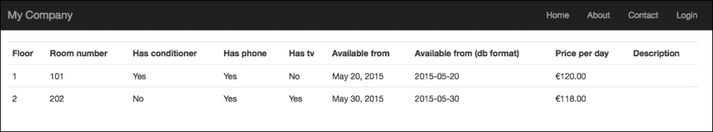
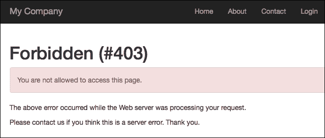
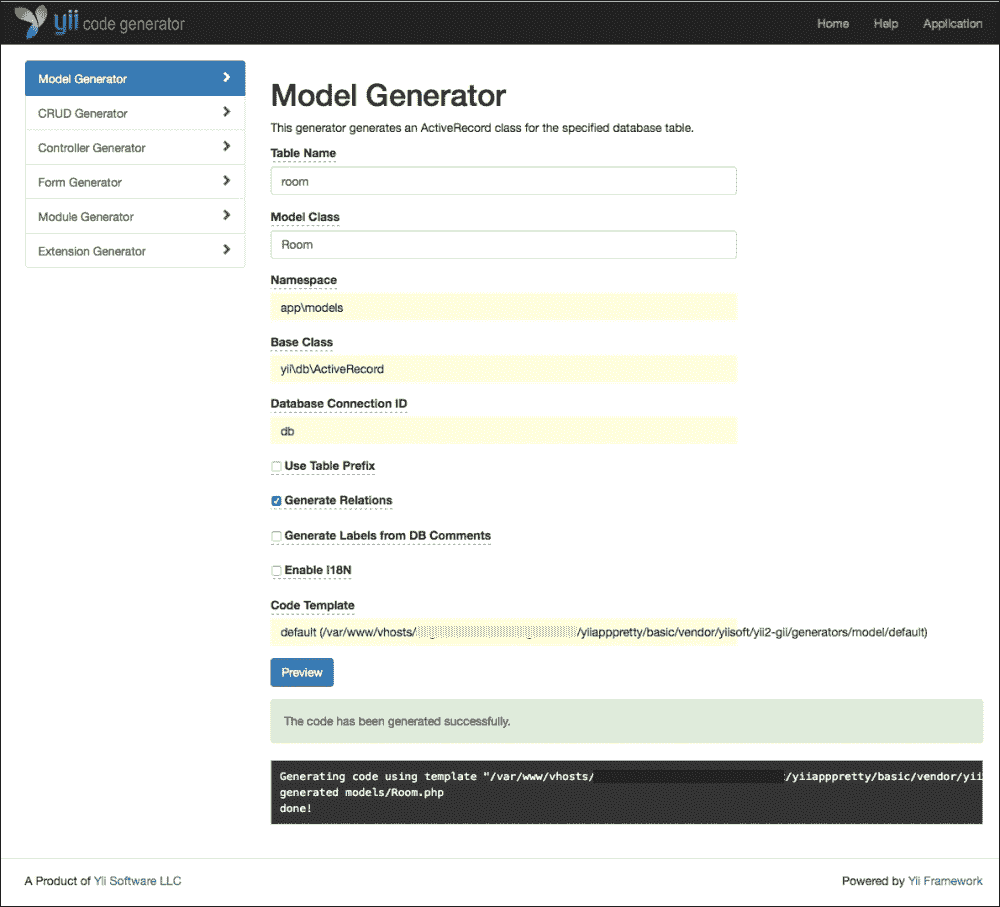
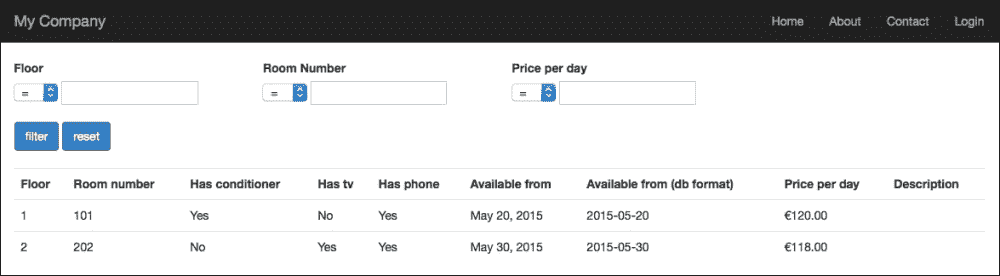
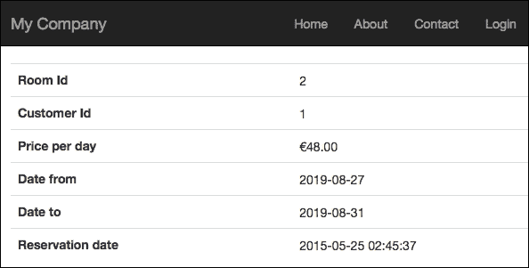
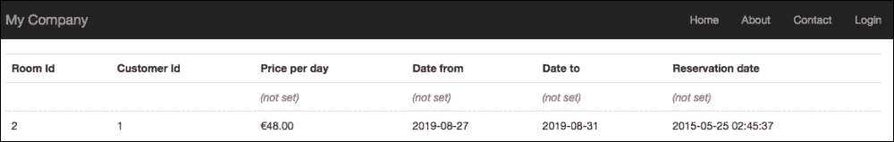
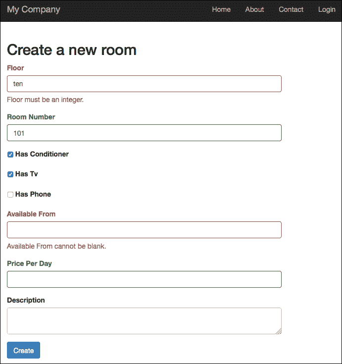
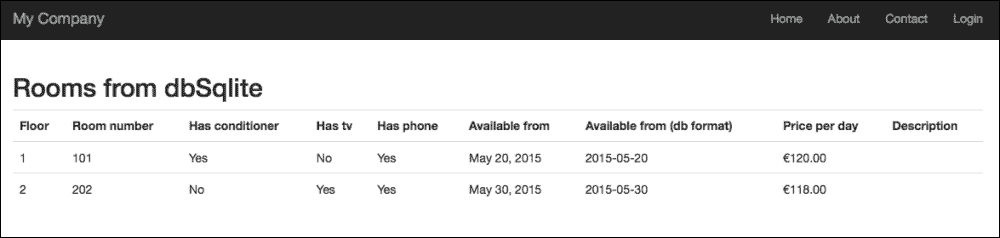

# 第五章. 开发预订系统

在本章中，你将学习如何配置和管理数据库，直接使用 SQL 或 ActiveRecord，然后你将看到如何解决常见任务，例如从表单保存单个和多个模型，以及如何创建数据聚合和过滤视图。

在本章中，我们将涵盖以下主题：

+   配置数据库连接：

    +   例如，创建房间、客户和预订表

+   例如，测试连接并执行 SQL 查询

+   使用 Gii 创建房间、客户和预订模型

+   使用 ActiveRecord 操作数据：

    +   例如，使用 ActiveRecord 查询房间列表

+   处理关系：

    +   例如，使用关系连接房间、预订和客户

+   如何从表单中保存模型：

    +   例如，从表单创建和更新房间

+   设置 GMT 时区

+   使用多个数据库连接：

    +   例如，配置第二个数据库连接以将数据导出到本地 SQLite 数据库

# 配置数据库连接

Yii2 提供了一个高级层来访问数据库，它建立在**PHP 数据对象**（**PDO**）之上。

此框架允许我们通过使用 ActiveRecord 对象来操作数据库表的内容。这封装了访问单个或多个记录的方法，以及以直观的方式过滤、连接和排序数据。

再次强调，我们可以使用纯 SQL 与数据库交互，但这意味着我们必须处理通过不同数据库（MySQL、SQL Server、Postgres、Oracle 等）传递的 SQL 语言差异，这意味着会失去 Yii2 的功能。

数据库对象连接是`yii\db\Connection`的一个实例：

```php
$db = new yii\db\Connection([
    'dsn' => 'mysql:host=localhost;dbname=my_database',
    'username' => 'my_username',
    'password' => 'my_password',
    'charset' => 'utf8',
]);
```

在本例中，我们连接到一个 MySQL 服务器，使用`mysql`连接字符串连接到数据库`my_databases`，将`my_username`设置为`username`，将`my_password`设置为`password`。此外，我们将`charset`设置为`utf8`，以确保使用标准字符集。这是一个标准的数据库连接条目。

其他常见的可用连接字符串包括：

+   MySQL 和 MariaDB: `mysql:host=localhost;dbname=mydatabase`

+   SQLite: `sqlite:/path/to/database/file`

+   PostgreSQL: `pgsql:host=localhost;port=5432;dbname=mydatabase`

+   MS SQL Server（通过`mssql`驱动程序）：`mssql:host=localhost;dbname=mydatabase`

+   Oracle: `oci:dbname=//localhost:1521/mydatabase`

### 注意

如果我们不提供直接到数据库的驱动程序，而必须使用 ODBC，我们将提供一个 ODBC 连接对象的示例如下：

```php
$db = new yii\db\Connection([
     'driverName' => 'mysql',
    'dsn' => 'odbc:Driver={MySQL};Server=localhost;Database=my_database',
    'username' => 'my_username',
    'password' => 'my_password',
    'charset' => 'utf8',
]);
```

为了方便，我们将数据库连接设置为应用程序组件，因为它将在应用程序的许多地方被使用。在`basic/config/web.php`中：

```php
return [
    // ...
    'components' => [
        // ...
        'db' => [
            'class' => 'yii\db\Connection',
            'dsn' => 'mysql:host=localhost;dbname=my_database',
            'username' => 'my_username',
            'password' => 'my_password',
            'charset' => 'utf8',
        ],
    ],
    // ...
];
```

### 注意

在基本模板中，数据库配置在一个单独的文件中，通常是`basic/config/db.php`。

如果我们打开`basic/config/web.php`，我们可以看到`db.php`文件填充了主配置的`db`属性。

## 示例 - 创建房间、客户和预订表

现在，我们需要一个 MySQL 数据库实例来工作。打开 DB 管理面板（如果提供）或使用控制台直接访问 DB，创建一个名为 `my_database` 的新数据库，关联用户名 `my_username` 和密码 `my_password`。

在这个例子中，我们将创建三个数据库表来管理房间、客户和预订数据。

房间将有以下字段：

+   `id` 作为整数

+   `floor` 作为整数

+   `room_number` 作为整数

+   `has_conditioner` 作为整数

+   `has_tv` 作为整数

+   `has_phone` 作为整数

+   `available_from` 作为日期

+   `price_per_day` 作为小数

+   `description` 作为文本

`room` 表的脚本将是：

```php
CREATE TABLE `room` (
  `id` int(11) NOT NULL PRIMARY KEY AUTO_INCREMENT,
  `floor` int(11) NOT NULL,
  `room_number` int(11) NOT NULL,
  `has_conditioner` int(1) NOT NULL,
  `has_tv` int(1) NOT NULL,
  `has_phone` int(1) NOT NULL,
  `available_from` date NOT NULL,
  `price_per_day` decimal(20,2) DEFAULT NULL,
  `description` text);
```

客户将有以下字段：

+   `id` 作为整数

+   `name` 作为字符串

+   `surname` 作为字符串

+   `phone_number` 作为字符串

`customer` 表的脚本将是

```php
CREATE TABLE `customer` (
 `id` int(11) NOT NULL PRIMARY KEY AUTO_INCREMENT,
 `name` varchar(50) NOT NULL,
 `surname` varchar(50) NOT NULL,
 `phone_number` varchar(50) DEFAULT NULL
);
```

预订将有以下字段：

+   `id` 作为整数

+   `room_id` 作为整数，它是房间表的引用

+   `customer_id` 作为整数，它是客户表的引用

+   `price_per_day` 作为小数

+   `date_from` 指定入住日期

+   `date_to` 指定退房日期

+   `reservation_date` 作为创建的时间戳

+   `days_stay` 作为整数

`reservation` 表的脚本将是：

```php
CREATE TABLE `reservation` (
 `id` int(11) NOT NULL AUTO_INCREMENT,
 `room_id` int(11) NOT NULL,
 `customer_id` int(11) NOT NULL,
 `price_per_day` decimal(20,2) NOT NULL,
 `date_from` date NOT NULL,
 `date_to` date NOT NULL,
 `reservation_date` timestamp NOT NULL DEFAULT CURRENT_TIMESTAMP,
);
```

最后，将 `basic/config/web.php` 放在 `components` 属性中：

```php
$db = new yii\db\Connection([
    'dsn' => 'mysql:host=localhost;dbname=my_database',
    'username' => 'my_username',
    'password' => 'my_password',
    'charset' => 'utf8',
]);
```

然后，我们就准备好测试到数据库的连接了。

## 示例 - 测试连接和执行 SQL 查询

现在我们来看看如何测试数据库连接。

在数据库表中放入一些房间数据：

```php
INSERT INTO `my_database`.`room` (`id`, `floor`, `room_number`, `has_conditioner`, `has_tv`, `has_phone`, `available_from`, `price_per_day`, `description`)
VALUES
(NULL, '1', '101', '1', '0', '1', '2015-05-20', '120', NULL), (NULL, '2', '202', '0', '1', '1', '2015-05-30', '118', NULL);
```

数据库查询使用 `yii\db\Command` 对象进行，该对象通过 `yii\db\Connection::createCommand()` 方法静态创建。

从命令中检索数据的最重要方法有：

+   `queryAll()`: 此方法返回查询的所有行，其中每个数组元素都是一个表示数据行的数组；如果查询没有返回数据，则响应为一个空数组

+   `queryOne()`: 此方法返回查询的第一行，即一个数组，表示数据行；如果查询没有返回数据，则响应为 false 布尔值

+   `queryScalar()`: 此方法返回查询结果第一行的第一列的值；如果没有值，则返回 false

+   `query()`: 这是返回 `yii\db\DataReader` 对象的最常见响应；如果没有值，则返回 false

现在我们将以不同的方式显示 `room` 表的内容。

我们将在 `basic/controllers/RoomsController.php` 中更新 `RoomsController`。在这个文件中，我们将添加一个索引操作来获取数据并将其传递给视图：

```php
<?php

namespace app\controllers;

use Yii;
use yii\web\Controller;

class RoomsController extends Controller
{
    public function actionIndex()
    {
        $sql = 'SELECT * FROM room ORDER BY id ASC';

        $db = Yii::$app->db;

        $rooms = $db->createCommand($sql)->queryAll();

    // same of
     // $rooms = Yii::$app->db->createCommand($sql)->queryAll();

        return $this->render('index', [ 'rooms' => $rooms ]);
    }
}
```

`actionIndex()` 的内容非常简单。定义 `$sql` 变量，包含要执行的 SQL 语句，然后将查询结果填充到 `$rooms` 数组中，最后渲染 `index` 视图，传递房间变量。

在`basic/views/rooms/index.php`的视图内容中，我们将以表格形式显示`$rooms`数组，以利用 Bootstrap CSS 的优势，并将`table`类应用到表格 HTML 标签上。

这是`basic/views/rooms/index.php`中的内容，我们也可以看到所使用的数据格式化器：

```php
<table class="table">
    <tr>
        <th>Floor</th>
        <th>Room number</th>
        <th>Has conditioner</th>
        <th>Has tv</th>
        <th>Has phone</th>
        <th>Available from</th>
        <th>Available from (db format)</th>
        <th>Price per day</th>
        <th>Description</th>
    </tr>
    <?php foreach($rooms as $item) { ?>
    <tr>
        <td><?php echo $item['floor'] ?></td>
        <td><?php echo $item['room_number'] ?></td>
        <td><?php echo Yii::$app->formatter->asBoolean($item['has_conditioner']) ?></td>
        <td><?php echo Yii::$app->formatter->asBoolean($item['has_tv']) ?></td>
        <td><?php echo ($item['has_phone'] == 1)?'Yes':'No' ?></td>
        <td><?php echo Yii::$app->formatter->asDate($item['available_from']) ?></td>
        <td><?php echo Yii::$app->formatter->asDate($item['available_from'], 'php:Y-m-d') ?></td>
        <td><?php echo Yii::$app->formatter->asCurrency($item['price_per_day'], 'EUR') ?></td>
        <td><?php echo $item['description'] ?></td>
    </tr>
    <?php } ?>
</table>
```

`floor`和`room_number`字段直接显示。

下两个字段`has_conditioner`和`has_tv`通过使用 Yii2 提供的布尔格式化器进行显示；布尔格式化器将使用在 Yii2 配置期间定义的区域设置。

下一个字段`has_phone`以与前两个字段相同的方式渲染其值；这样做的原因是为了指示如何以标准 PHP 风格产生布尔格式化器的相同输出。

然后，`available_from`字段以两种不同的方式使用日期格式化器进行渲染，直接渲染和传递要使用的格式。或者，如果没有传递参数，它将采用默认格式。

再次，`price_per_day`字段通过货币格式化器进行渲染，传递货币作为参数。如果没有传递参数，将使用默认值。最后一个字段`description`直接显示。将您的浏览器指向`http://hostname/basic/web/rooms/index`以查看以下内容：



房间列表

# 使用 Gii 创建房间、客户和预订模型

Yii2 提供了一个强大的工具来生成模型、控制器和 CRUD（创建、读取、更新和删除）操作、表单、模块和扩展：Gii。

在`basic/config/web.php`文件的底部，放置在基本标准配置中，有一段代码启用了 Gii：

```php
if (YII_ENV_DEV) {
    // configuration adjustments for 'dev' environment
    $config['bootstrap'][] = 'debug';
    $config['modules']['debug'] = 'yii\debug\Module';

    $config['bootstrap'][] = 'gii';
    $config['modules']['gii'] = 'yii\gii\Module';
}
```

确认这些行存在，否则在`web.php`文件的`return $config`语句之前将它们附加到文件底部。最后的检查在`basic/web/index.php`中。确认`YII_ENV`是`dev`，如下行：

```php
defined('YII_ENV') or define('YII_ENV', 'dev');
```

现在，我们可以将我们的浏览器指向`http://hostname/basic/web/gii`，我们应该看到这个错误页面：



禁止访问 Gii

由于 Gii 被密码锁定，此页面将显示。

我们需要向`gii`模块添加额外的配置，传递其他允许的 IP。Gii 的配置有一个名为`allowedIPs`的属性，它允许指定哪些 IP 地址可以访问 Gii 页面：

```php
 'allowedIPs' => ['127.0.0.1', '::1', '192.168.178.20']
```

在这个摘录中，Gii 将接受来自本地主机（以 IPv4 形式的 127.0.0.1 和 IPv6 形式的`::1`）以及`192.168.178.20`的访问，这应该是我们私有网络中的 IP 地址。

如果 Yii2 应用程序运行在外部托管上，我们将在此允许的 IP 列表中设置我们的公网 IP 地址。例如，如果我们的 IP 是`66.249.64.76`，此条目将被附加到现有条目（如果我们想保持其他允许的访问点）：

```php
 'allowedIPs' => ['127.0.0.1', '::1', '192.168.178.20', '66.249.64.76']
```

为了允许从任何地方访问（在开发阶段很有用），我们可以在列表中添加`*`，这意味着 Gii 页面可以从任何 IP 地址访问：

```php
'allowedIPs' => ['127.0.0.1', '::1', '192.168.178.20', '*']
```

因此，`gii]['gii'] = 'yii\gii\Module'`的内容是：

```php
    $config['modules']['gii'] = [
        'class' => 'yii\gii\Module',
        'allowedIPs' => ['127.0.0.1', '::1', '192.168.178.20', '*'] ]; configuration in basic/config/web.php will be:
if (YII_ENV_DEV) {
    // configuration adjustments for 'dev' environment
    $config['bootstrap'][] = 'debug';
    $config['modules']['debug'] = 'yii\debug\Module';

    $config['bootstrap'][] = 'gii';
    //$config'modules'
}
```

现在，我们能够从任何 IP 地址访问 Gii。

通过点击页面`http://hostname/basic/web/gii`刷新浏览器，我们最终可以看到其内容：

![使用 Gii 创建房间、客户和预订模型成功访问 Gii 现在，点击**模型生成器**的**开始**按钮；我们将有一个**模型生成器**的表单，其中**表名**是唯一需要填写的字段。当我们开始输入表名时，将显示可能的选项。完成此操作后，当我们移动到**模型类**字段时，框架将自动填充它。其他字段可以保留默认设置。在**表名**中输入`room`，然后点击**模型类**字段。此字段将填充为**Room**，这是`models`文件夹中的文件名。点击**预览**按钮将显示文件将被创建的路径以及将要应用的操作（它应该是覆盖值，因为我们是在上一章中创建的）。最后，点击**生成**按钮以完成此操作。响应消息将给我们关于此操作执行的信息。这是成功结果的形式：

Gii 模型生成器

对其他两个表：预订和客户重复此操作。

现在，我们在`basic/models`文件夹中有三个模型：`Room.php`、`Reservation.php`和`Customer.php`。

让我们解释 Gii 做了什么。打开`basic/models/Room.php`文件，我们有三个方法：

+   `tableName()`

+   `rules()`

+   `attributeLabels()`

第一种方法，`tableName()`，简单地返回此模型链接的表名：

```php
    public static function tableName()
    {
        return 'room';
    }
```

第二种方法，`rules()`，很重要，因为它包含在`validate()`方法启动时（在`save()`方法中自动启动）或大量属性赋值时需要检查的验证规则：

```php
$model->attributes = arrayWithData;
```

这是`rules()`方法的内容：

```php
    public function rules()
    {
        return [
            [['floor', 'room_number', 'has_conditioner', 'has_tv', 'has_phone', 'available_from'], 'required'],
            [['floor', 'room_number', 'has_conditioner', 'has_tv', 'has_phone'], 'integer'],
            [['available_from'], 'safe'],
            [['price_per_day'], 'number'],
            [['description'], 'string']
        ];
    }
```

第一条规则指定字段`floor`、`room_number`、`has_condition`、`has_tv`和`avaiable_from`是必填的，因为它们传递给必需的验证器。此外，它们必须是整数，如第二条规则所要求的。

### 注意

不在规则中的字段，在大量赋值时将被跳过，因为它们被认为是不可靠的（因为它们不在规则中）。因此，当一个字段没有验证规则时，它必须在'safe'验证器中有一个条目。

第四条规则指定`price_per_day`字段是一个数字，而最后一条规则说明`description`是一个字符串。

### 注意

这些规则会自动从数据库字段类型和约束中读取。

最后一个方法`attributeLabels()`指定了在显示视图（如表单、网格等）中字段的表示。

这是`attributeLabels()`的内容：

```php
    public function attributeLabels()
    {
        return [
            'id' => 'ID',
            'floor' => 'Floor',
            'room_number' => 'Room Number',
            'has_conditioner' => 'Has Conditioner',
            'has_tv' => 'Has Tv',
            'has_phone' => 'Has Phone',
            'available_from' => 'Available From',
            'price_per_day' => 'Price Per Day',
            'description' => 'Description',
        ];
    }
```

Yii2 在模型中报告数据库中存在的任何表之间的关系。我们有一个`Reservation`模型，它与`Room`和`Customer`有关联。

按照以下说明操作，使框架能够在模型中创建关系：

1.  确认数据库表使用 InnoDB 引擎（支持关系和外键）。

1.  在`Reservation`表中，为`room_id`和`customer_id`字段分别添加两个索引：

    ```php
    ALTER TABLE `reservation` ADD INDEX ( `room_id` ) ;
    ALTER TABLE `reservation` ADD INDEX ( `customer_id` ) ;
    ```

1.  在`Reservation`表中，向`room`和`customer`表添加两个约束：

    ```php
    ALTER TABLE `reservation` ADD FOREIGN KEY ( `room_id` ) REFERENCES `room` (`id`) ON DELETE RESTRICT ON UPDATE RESTRICT ;
    ALTER TABLE `reservation` ADD FOREIGN KEY ( `customer_id` ) REFERENCES `customer` (`id`) ON DELETE RESTRICT ON UPDATE RESTRICT ;
    ```

    ### 注意

    在这些约束中，我们为`DELETE`和`UPDATE`操作使用了`RESTRICT`。`RESTRICT`避免了删除引用客户或房间的预订。因此，要删除在预订中出现的客户或房间，我们首先需要删除预订。

    这种行为确保在删除房间或客户时，重要数据如预订永远不会自动（级联）删除。当你尝试对与客户或房间链接的预订执行此操作时，将显示错误消息。

    在其他上下文中，常用的关键字是`CASCADE`，它删除所有引用链接表的数据。

再次打开 Gii，导航到`http://hostname/basic/web/gii`，然后在**模型生成器**中点击**开始**按钮，并在**表名**中输入`room`。点击页面底部的**预览**按钮，这次你会看到`models/Room.php`存在，并且动作是覆盖，未标记。

点击“覆盖”旁边的复选框，然后点击**生成**按钮。这样，我们就强制覆盖了`Room`模型，以从`Room`表中获取关系数据。

现在，`basic/models/Room.php`在底部包含一个名为`getReservations`的新方法，其内容如下：

```php
    /**
     * @return \yii\db\ActiveQuery
     */
    public function getReservations()
    {
       return $this->hasMany(Reservation::className(), ['room_id' => 'id']);
    }
```

此方法返回一个 ActiveQuery 实例，用于构建要发送到数据库的查询。

### 注意

当作为属性调用时，此方法将返回与模型链接的预订列表。

你可能会遇到这种情况，即`$model`是`Room`类的一个实例，例如：`$reservationsList = $model->reservations;`

在这种情况下，将`$reservationsList`变量填充与这个`Room`模型相关的预订列表。

这并不奇怪，尽管`hasMany`方法返回一个`ActiveQuery`对象。

如果我们探索`BaseActiveRecord`的`__get()`方法（它是 ActiveRecord 的基类），处理属性要求，我们可以看到这些代码行：

```php
            $value = parent::__get($name);
            if ($value instanceof ActiveQueryInterface) {
                return $this->_related[$name] = $value->findFor($name, $this);
            } else {
                return $value;
            }
```

当`$value`内容是`ActiveQueryInterface`（由`ActiveQuery`类实现的接口）的实例时，此方法返回关联结果。

# 使用 ActiveRecord 操作数据

ActiveRecord 提供了一种方便的方式来访问和操作存储在数据库中的数据。这个类与一个数据库表相关联，并代表了这个关联表的行。它的属性是表的字段，它的方法允许我们执行数据库的常见操作，如选择、插入或更新 SQL 语句。

ActiveRecord 支持许多常见数据库，例如：

+   MySQL

+   PostgreSQL

+   SQLite

+   Oracle

+   微软 SQL Server

此外，一些 NoSQL 数据库受到支持，例如：

+   Redis

+   MongoDB

ActiveRecord 在每次实例化时都会读取表结构，并将表列作为其属性提供。对表结构的任何更改都会立即在 ActiveRecord 对象中可用。

因此，如果一个表包含字段 `id`、`floor` 和 `room_number`，并且如果 `$model` 是 `yii\db\ActiveRecord` 的一个实例，为了访问这些字段，只需输入：

```php
$id = $model->id;
$floor = $model->floor;
$room_number = $model->room_numer;
```

ActiveRecord 使用 `__get` 魔法方法处理属性请求，并捕获相应表列的内容。在上一个段落中，您看到了如何使用 Gii 从数据库表创建模型类，以扩展 `yii\db\ActiveRecord`。ActiveRecord 使用的语法简单且冗余，因此容易记住。现在让我们看看如何使用 ActiveRecord 从数据库中查询数据。

数据通过一个 `\yii\db\ActiveQuery` 对象从数据库中检索来构建查询，最后调用 `one()` 或 `all()` 方法来获取一个 ActiveRecord 对象或 ActiveRecord 对象的列表。

通过调用其静态方法 `::find()` 从 ActiveRecord 对象返回一个 ActiveQuery 对象。

如果 `Room` 是一个模型（并且是 ActiveRecord 的子类），则从以下内容返回一个 ActiveQuery：

```php
// $query is an ActiveQuery object
$query = Room::find();
```

ActiveQuery 对象提供了一些方法来构建查询，这些方法的名称类似于 SQL 表达式。

最常见的一些是：

+   使用 `where()` 来添加条件

+   使用 `orderBy()` 来应用排序

+   使用 `groupBy()` 来进行聚合

几乎所有这些方法都支持一个可以是一个字符串或数组的参数。如果是字符串，它将原样传递到 SQL 查询中；如果是数组，则键用作列名，值用作相应的值。例如，我们想要构建查询来找到一楼上的房间：

```php
$query = Room::find()->where('floor = 1');
// equivalent to
$query = Room::find()->where(['floor' => 1]);
```

对于复杂条件，`where()` 支持操作符格式，其中条件是一个数组，包含：

```php
[operator, operand1, operand2, …]
```

例如，我们想要构建一个查询来找到一楼上的房间：

```php
$query = Room::find()->where(['>=', 'floor', 1]);
// equivalent to
$query = Room::find()->where('floor >= 1';
```

可以使用 `andWhere()` 或 `orWhere()` 添加其他条件，只需使用 `and` 或 `or` 逻辑连接符。

`where()` 方法的数组参数比字符串更可取，因为我们可以轻松地将字段名与其内容分开，并将 `where()` 方法的第二个参数设置为包含参数键值对的数组。

创建查询对象后，要从 ActiveQuery 获取数据，我们将有：

+   `one()`：此方法返回一个 ActiveRecord 对象或未找到时返回 null

+   `all()`: 此方法返回 ActiveRecord 对象列表或未找到时返回空数组

因此，要获取一楼房间，我们必须编写：

```php
$query = Room::find()->where(['floor' => 1]);
$items = $query->all();
// equivalent to
$items = Room::find()->where(['floor' => 1])->all();
```

### 注意

从 ActiveRecord 获取数据有一个更简洁的语法：`findOne()`和`findAll()`方法，它们返回单个 ActiveRecord 或 ActiveRecord 列表。与前述方法唯一的不同之处在于，它们接受单个参数，可以是：

+   通过主键过滤的数字

+   一个由主键值列表组成的标量值数组，用于过滤（仅适用于`findAll()`，因为`findOne()`返回单个 ActiveRecord）

+   一个由属性值组成的键值对数组，用于过滤一组属性值

ActiveRecord 的其他常用方法包括：

+   `validate()`: 此方法用于将规则验证应用于模型的属性

+   `save()`: 此方法用于保存新模型或更新已存在的模型（如果`save()`方法应用于获取的 ActiveRecord 对象）

+   `delete()`: 此方法用于删除模型

## 示例 - 使用 ActiveRecord 查询房间列表

在此示例中，我们将使用 ActiveRecord 查询房间列表，并通过以下字段进行过滤：`floor`、`room_number`和`price_per_day`，使用操作符（`>=`、`<=`和`=`）。

数据过滤器将使用`SearchFilter`容器来封装所有过滤数据到一个数组中。

从视图开始，创建一个路径为`basic/views/rooms/indexFiltered.php`的新文件。

在此视图中，我们将搜索过滤器放在顶部，然后是一个表格来显示结果。

我们有三个过滤字段：`floor`、`room_number`和`price_per_day`，所有字段都带有操作符。数据过滤器将传递给控制器，并在控制器中执行`actionIndexFiltered`后保留所选的过滤器。

这是关于过滤表单的视图内容：

```php
<?php
use yii\helpers\Url;

$operators = [ '=', '<=', '>=' ];

$sf = $searchFilter;

?>

<form method="post" action="<?php echo Url::to(['rooms/index-filtered']) ?>">
    <input type="hidden" name="<?= Yii::$app->request->csrfParam; ?>" value="<?= Yii::$app->request->csrfToken; ?>" />

    <div class="row">
        <?php $operator = $sf['floor']['operator']; ?>
        <?php $value = $sf['floor']['value']; ?>
        <div class="col-md-3">
            <label>Floor</label>
            <br />    
            <select name="SearchFilter[floor][operator]">
                <?php foreach($operators as $op) { ?>
                    <?php $selected = ($operator == $op)?'selected':''; ?>
                    <option value="<?=$op?>" <?=$selected?>><?=$op?></option>
                <?php } ?>=
            </select>
            <input type="text" name="SearchFilter[floor][value]" value="<?=$value?>" />
        </div>

        <?php $operator = $sf['room_number']['operator']; ?>
        <?php $value = $sf['room_number']['value']; ?>
        <div class="col-md-3">
            <label>Room Number</label>
            <br />    
            <select name="SearchFilter[room_number][operator]">
                <?php foreach($operators as $op) { ?>
                    <?php $selected = ($operator == $op)?'selected':''; ?>
                    <option value="<?=$op?>" <?=$selected?>><?=$op?></option>
                <?php } ?>
            </select>
            <input type="text" name="SearchFilter[room_number][value]" value="<?=$value?>" />
        </div>

        <?php $operator = $sf['price_per_day']['operator']; ?>
        <?php $value = $sf['price_per_day']['value']; ?>
        <div class="col-md-3">
            <label>Price per day</label>
            <br />    
            <select name="SearchFilter[price_per_day][operator]">
                <?php foreach($operators as $op) { ?>
                    <?php $selected = ($operator == $op)?'selected':''; ?>
                    <option value="<?=$op?>" <?=$selected?>><?=$op?></option>
                <?php } ?>
            </select>
            <input type="text" name="SearchFilter[price_per_day][value]" value="<?=$value?>" />
        </div>    
    </div>
    <br />
    <div class="row">
        <div class="col-md-3">
            <input type="submit" value="filter" class="btn btn-primary" />
            <input type="reset" value="reset" class="btn btn-primary" />

        </div>
    </div>
</form>
```

### 注意

**请注意：**

在视图的开始处有一个关键字`use`，它解释了`Url`类的完整路径。如果我们删除它，框架将在当前命名空间（即`app/controllers`）中搜索在`<form>`标签中请求的`Url`类。

在声明`<form>`标签后，我们插入：

```php
<input type="hidden" name="<?= Yii::$app->request->csrfParam; ?>" value="<?= Yii::$app->request->csrfToken; ?>" />
```

这对于允许框架验证发送的表单数据是强制性的。

`$searchFilter`变量用作`$sf`以提供更简洁的表单。

现在更新`basic/controllers/RoomsController.php`中的`RoomsController`，并添加一个名为`actionIndexFiltered`的新操作。从`Room`创建一个 ActiveQuery 对象，并检查`$_POST`数组中的`SearchFilter`关键字是否有内容。

对于每个现有的过滤器，将使用`andWhere`方法向`$query`添加一个条件，传递一个操作符、字段名和值。为了使操作内容的形式更简洁，我们在循环中放置一个过滤字段，因为它们具有相同的冗余结构（操作符和值）：

```php
    public function actionIndexFiltered()
    {
        $query = Room::find();

        $searchFilter = [
            'floor' => ['operator' => '', 'value' => ''],
            'room_number' => ['operator' => '', 'value' => ''],
            'price_per_day' => ['operator' => '', 'value' => ''],
        ];

        if(isset($_POST['SearchFilter']))
        {
            $fieldsList = ['floor', 'room_number', 'price_per_day'];

            foreach($fieldsList as $field)
            {
                $fieldOperator = $_POST['SearchFilter'][$field]['operator'];
                $fieldValue = $_POST['SearchFilter'][$field]['value'];

                $searchFilter[$field] = ['operator' => $fieldOperator, 'value' => $fieldValue];

                if( $fieldValue != '' )
                {
                    $query->andWhere([$fieldOperator, $field, $fieldValue]);
                }
            }
        }

        $rooms = $query->all();

        return $this->render('indexFiltered', [ 'rooms' => $rooms, 'searchFilter' => $searchFilter ]);

    }
```

最后，我们需要以表格格式显示结果。因此，在视图底部添加一个表格来显示筛选房间的内容（从 `basic/views/rooms/index.php` 复制）：

```php
<table class="table">
    <tr>
        <th>Floor</th>
        <th>Room number</th>
        <th>Has conditioner</th>
        <th>Has tv</th>
        <th>Has phone</th>
        <th>Available from</th>
        <th>Available from (db format)</th>
        <th>Price per day</th>
        <th>Description</th>
    </tr>
    <?php foreach($rooms as $item) { ?>
    <tr>
        <td><?php echo $item['floor'] ?></td>
        <td><?php echo $item['room_number'] ?></td>
        <td><?php echo Yii::$app->formatter->asBoolean($item['has_conditioner']) ?></td>
        <td><?php echo Yii::$app->formatter->asBoolean($item['has_tv']) ?></td>
        <td><?php echo ($item['has_phone'] == 1)?'Yes':'No' ?></td>
        <td><?php echo Yii::$app->formatter->asDate($item['available_from']) ?></td>
        <td><?php echo Yii::$app->formatter->asDate($item['available_from'], 'php:Y-m-d') ?></td>
        <td><?php echo Yii::$app->formatter->asCurrency($item['price_per_day'], 'EUR') ?></td>
        <td><?php echo $item['description'] ?></td>
    </tr>
    <?php } ?>
</table>
```

现在将浏览器指向 `http://hostname/basic/web/rooms/index-filtered`，应该会显示：



带有筛选器的房间列表

我们可以通过更改筛选值和运算符来创建尽可能多的测试。

# 处理关系

ActiveRecord 为我们提供了处理数据库表之间关系的能力。Yii2 使用两种方法来建立当前 ActiveRecord 类与其他 ActiveRecord 类之间的关系：`hasOne` 和 `hasMany`，它们根据关系的多度返回一个 ActiveQuery。

第一个方法 `hasOne()` 返回最多一个与该关系设定的标准匹配的相关记录，而 `hasMany()` 返回与该关系设定的标准匹配的多个相关记录。

两种方法都需要第一个参数是相关 ActiveRecord 的类名，第二个参数是涉及关系的键对：第一个键相对于外键 ActiveRecord，第二个键与当前 ActiveRecord 相关。

通常，`hasOne()` 和 `hasMany()` 是从标识哪些对象（或对象）将被返回的属性中访问的。

本例中的方法是：

```php
class Room extends ActiveRecord
{
    public function getReservations()
    {
return $this->hasMany(Reservation::className(), ['room_id' => 'id']);
    }
}
```

通过调用 `$room->reservations`，框架将执行此查询：

```php
SELECT * FROM `reservation` WHERE `room_id` = id_of_room_model
```

`hasOne()` 方法的用法类似，以下是一个示例：

```php
class Reservation extends ActiveRecord
{
    public function getRoom()
    {
return $this->hasOne(Room::className(), ['id' => 'room_id']);
    }
}
```

调用 `$reservation->room`，框架将执行此查询：

```php
SELECT * FROM `room` WHERE `id` = reservation_id
```

记住，当我们调用包含 `hasOne()` 或 `hasMany()` 方法的属性时，将执行一个 SQL 查询，并且其响应将被缓存。因此，下次调用该属性时，将不会执行 SQL 查询，并且将释放最后缓存的响应。

这种获取相关数据的方法被称为 **延迟加载**，意味着数据只有在实际请求时才会被加载。

现在让我们写一个示例来显示关于一个房间的最后预订详情。如果您之前还没有这样做，请使用 Gii 创建一个预订模型类。

首先，我们需要一些数据来工作。在 `customer` 表中插入此记录：

```php
INSERT INTO `customer` (`id` ,`name` ,`surname` ,`phone_number`) VALUES ( NULL , 'James', 'Foo', '+39-12345678');
```

在 `reservation` 表中插入这些记录：

```php
INSERT INTO `reservation` (`id`, `room_id`, `customer_id`, `price_per_day`, `date_from`, `date_to`, `reservation_date`) VALUES (NULL, '2', '1', '90', '2015-04-01', '2015-05-06', NULL), (NULL, '2', '1', '48', '2019-08-27', '2019-08-31', CURRENT_TIMESTAMP);
```

打开 `basic/models/Room.php` 中的房间模型，并在文件底部添加此属性声明：

```php
    public function getLastReservation()
    {
        return $this->hasOne(
          Reservation::className(),
          ['room_id' => 'id']
          )
          ->orderBy('id');
    }
```

如前所述，`hasOne()` 和 `hasMany()` 返回一个 ActiveQuery 实例。我们可以通过添加 `orderBy()` 方法来获取第一条记录，就像我们之前所做的那样，来添加任何方法以完成关系。

在 `Rooms` 控制器中创建一个名为 `actionLastReservationByRoomId($room_id)` 的新操作，内容如下：

```php
    public function actionLastReservationByRoomId($room_id)
    {
        $room = Room::findOne($room_id);

        // equivalent to
        // SELECT * FROM reservation WHERE room_id = $room_id
        $lastReservation = $room->lastReservation;

        // next times that we will call $room->reservation, no sql query will be executed.

        return $this->render('lastReservationByRoomId', ['room' => $room, 'lastReservation' => $lastReservation]);
    }
    Finally, create the view in basic/views/rooms/lastReservationByRoomId.php with this content:<table class="table">
    <tr>
        <th>Room Id</th>
        <td><?php echo $lastReservation['room_id'] ?></td>
    </tr>
    <tr>
        <th>Customer Id</th>
        <td><?php echo $lastReservation['customer_id'] ?></td>
    </tr>
    <tr>
        <th>Price per day</th>
        <td><?php echo Yii::$app->formatter->asCurrency($lastReservation['price_per_day'], 'EUR') ?></td>
    </tr>
    <tr>
        <th>Date from</th>
        <td><?php echo Yii::$app->formatter->asDate($lastReservation['date_from'], 'php:Y-m-d') ?></td>
    </tr>
    <tr>
        <th>Date to</th>
        <td><?php echo Yii::$app->formatter->asDate($lastReservation['date_to'], 'php:Y-m-d') ?></td>
    </tr>
    <tr>
        <th>Reservation date</th>
        <td><?php echo Yii::$app->formatter->asDate($lastReservation['reservation_date'], 'php:Y-m-d H:i:s') ?></td>
    </tr>
</table>
```

将您的浏览器指向 `http://hostname/basic/web/rooms/last-reservation-by-room-id?room_id=2` 以可视化此框架：



展示 ID 为 2 的房间最后预订的可视化

只会显示数据库中插入的最后预订。

那么如何在单个表格中显示每个房间的最后预订呢？

在这里，延迟加载方法将会有性能问题，因为对于每个房间，它将执行一个单独的 SQL 查询来获取最后预订的数据。这是视图中的代码片段：

```php
for($roomsList as $room)
{
    // SELECT * FROM reservation WHERE room_id = $room->id
      $lastReservation = $room->lastReservation;
}
```

为了完成脚本的执行，它将执行与房间数量一样多的相关 SQL 查询，当房间数量增加时，这种解决方案将不再高效。

Yii2 框架提供了解决此类问题的一种数据加载类型，称为预加载。

通过 ActiveQuery 的`with()`方法应用预加载。此方法的参数可以是单个或多个字符串，或者是一个包含关系名称的单个数组以及可选的回调来定制关系。

当我们获取房间列表时，如果我们对查询应用`with()`方法，将自动执行第二个 SQL 查询，这将返回每个房间的最后预订列表。

通过这个示例，我们将得到一个房间列表以及每个房间条目的`lastReservation`关系列表。这样，当我们引用`$room->lastReservation`时，不会执行其他 SQL 查询：

```php
// SELECT * FROM `room`
// SELECT * FROM `reservation` WHERE `room_id` IN ( room_id list from previous select ) ORDER BY `id` DESC
$rooms = Room::find()
->with('lastReservation')
->all();

// no query will be executed
$lastReservation = $rooms[0]->lastReservation;
```

让我们写一个完整的示例来获取每个房间的最后预订的完整列表。在`basic/controllers/RoomsController.php`中，添加一个名为`actionLastReservationForEveryRoom()`的新操作：

```php
    public function actionLastReservationForEveryRoom()
    {
            $rooms = Room::find()
            ->with('lastReservation')
            ->all();

            return $this->render('lastReservationForEveryRoom', ['rooms' => $rooms]);
    }
```

这个操作将传递一个名为`lastReservationForEveryRoom`的房间列表给视图，以及使用预加载加载的`lastReservation`关系。

在`basic/views/rooms/lastReservationForEveryRoom.php`中创建一个名为`lastReservationForEveryRoom.php`的视图：

```php
<table class="table">
    <tr>
        <th>Room Id</th>
        <th>Customer Id</th>
        <th>Price per day</th>
        <th>Date from</th>
        <th>Date to</th>
        <th>Reservation date</th>
    </tr>
    <?php foreach($rooms as $room) { ?>
    <?php $lastReservation = $room->lastReservation; ?>
    <tr>
        <td><?php echo $lastReservation['room_id'] ?></td>
        <td><?php echo $lastReservation['customer_id'] ?></td>
        <td><?php echo Yii::$app->formatter->asCurrency($lastReservation['price_per_day'], 'EUR') ?></td>
        <td><?php echo Yii::$app->formatter->asDate($lastReservation['date_from'], 'php:Y-m-d') ?></td>
        <td><?php echo Yii::$app->formatter->asDate($lastReservation['date_to'], 'php:Y-m-d') ?></td>
        <td><?php echo Yii::$app->formatter->asDate($lastReservation['reservation_date'], 'php:Y-m-d H:i:s') ?></td>
    </tr>
    <?php } ?>
</table>
```

在这个视图中，将为每个房间显示最后预订的数据。由于第一个房间没有预订，将显示一个空行。这是结果：



每个房间的最后预订

### 注意

`with()`方法有两种变体：`joinWith()`和`innerJoinWith()`，它们将左连接或内部连接应用于主查询。

例如，这是使用`joinWith()`的示例：

```php
            $rooms = Room::find()
            ->leftJoinWith('lastReservation')
            ->all();
```

上述代码片段等同于：

```php
SELECT `room`.* FROM `room` LEFT JOIN `reservation` ON `room`.`id` = `reservation`.`room_id` ORDER BY `id` DESC

SELECT * FROM `reservation` WHERE `room_id` IN ( room_id list from previous sql respone ) ORDER BY `id` DESC
```

记住，内部连接只要两个表中的列有匹配就会选择两个表的所有行；相反，左连接返回左表（房间）的所有行，以及右表（预订）中匹配的行。当没有匹配时，右侧的结果是 NULL。

有时候，我们需要在表之间有多个级别的关联。例如，我们可能找到一个与房间相关的客户。在这种情况下，从房间开始，我们通过预订，然后从预订到客户。

这里的关系将是：

```php
room -> reservation -> customer
```

如果我们想从房间对象中找到客户对象，只需输入：

```php
$customer = $room->customer;
```

通常，我们有多层关系，但在这个情况下只有两层（预订和客户）。

Yii2 允许我们使用 `via()` 或 `viaTable()` 方法指定一个连接表。第一个 `via()` 方法基于模型中现有的关系，并支持两个参数：

+   关系名称

+   用于自定义关联关系的 PHP 回调参数

第二种方法 `viaTable()` 基于直接访问数据库中的物理表，并支持三个参数：

+   第一个参数是一个关系或表名称

+   第二个参数是与主模型关联的链接

+   第三个参数是一个 PHP 回调函数，用于自定义关联关系

## 示例 - 使用关系连接房间、预订和客户

在本例中，我们将查看如何构建一个同时显示房间、预订和客户列表的单个视图；当用户点击房间记录的 **详情** 按钮时，预订列表将使用与该房间链接的数据进行过滤。同样，当用户点击预订记录的 **详情** 按钮时，客户列表将使用与该预订链接的数据进行过滤。

如果没有传递参数（在页面首次调用时发生的情况），则房间、预订或客户列表将包含来自相应表的数据的完整记录。

在 `basic/controllers/RoomsController.php` 中开始编写 `actionIndexWithRelationships`。这是此操作的待办事项列表：

+   检查哪些详细参数已被传递（`room_id` 表示必须使用 `room_id` 过滤的数据填充预订列表，而 `reservation_id` 表示必须使用 `reservation_id` 过滤的数据填充客户列表）

+   填充三个模型：`roomSelected`、`reservationSelected` 和 `customerSelected` 以显示详细信息，并填充三个模型的三个数组：`rooms`、`reservations` 和 `customers`

这是 `actionIndexWithRelationships` 的完整内容：

```php
     public function actionIndexWithRelationships()
    {
        // 1\. Check what parameter of detail has been passed
        $room_id = Yii::$app->request->get('room_id', null);
        $reservation_id = Yii::$app->request->get('reservation_id', null);
        $customer_id = Yii::$app->request->get('customer_id', null);

        // 2\. Fill three models: roomSelected, reservationSelected and customerSelected and
        //    Fill three arrays of models: rooms, reservations and customers;
        $roomSelected = null;
        $reservationSelected = null;
        $customerSelected = null;

        if($room_id != null)
        {
            $roomSelected = Room::findOne($room_id);

            $rooms = array($roomSelected);
            $reservations = $roomSelected->reservations;
            $customers = $roomSelected->customers;
        }
        else if($reservation_id != null)
        {
            $reservationSelected = Reservation::findOne($reservation_id);

            $rooms = array($reservationSelected->room);
            $reservations = array($reservationSelected);
            $customers = array($reservationSelected->customer);
        }
        else if($customer_id != null)
        {
            $customerSelected = Customer::findOne($customer_id);

            $rooms = $customerSelected->rooms;
            $reservations = $customerSelected->reservations;
            $customers = array($customerSelected);
        }
        else
        {
            $rooms = Room::find()->all();
            $reservations = Reservation::find()->all();
            $customers = Customer::find()->all();
        }

        return $this->render('indexWithRelationships', ['roomSelected' => $roomSelected, 'reservationSelected' => $reservationSelected, 'customerSelected' => $customerSelected, 'rooms' => $rooms, 'reservations' => $reservations, 'customers' => $customers]);
    }
```

### 注意

记得在 `RoomsController` 文件顶部添加 `use` 关键字以使用 `Customer` 和 `Reservation` 类：

```php
use app\models\Reservation;
use app\models\Customer;
```

动作体的第二部分需要更多关注，因为在这个特定位置填充了选择模型和列表模型。

在 `$room_id`、`$reservation_id` 和 `$customer_id` 之间只能同时选择一个参数。当选择这三个参数之一时，将使用模型中的关系填充 `Room`、`Reservation` 和 `Customer` 模型的三个数组。为此，模型必须使用之前代码中使用的所有关系。

让我们确保模型中存在所有关系。

在`basic/models/Room.php`中的`Room`模型必须同时定义`getReservations()`和`getCustomers()`，这两个都使用`via()`方法来处理第二级关系：

```php
    public function getReservations()
    {
            return $this->hasMany(Reservation::className(), ['room_id' => 'id']);
    }
public function getCustomers()
    {
            return $this->hasMany(Customer::className(), ['id' => 'customer_id'])->via('reservations');
    }
```

在`basic/models/Reservation.php`中的`Reservation`模型必须定义`getCustomer()`和`getRoom()`，这两个都返回一个相关的单模型：

```php
    public function getRoom()
    {
            return $this->hasOne(Room::className(), ['id' => 'room_id']);
    }

    public function getCustomer()
    {
            return $this->hasOne(Customer::className(), ['id' => 'customer_id']);
    }
```

最后，在`basic/models/Customer.php`中的`Customer`模型必须定义`getReservations()`和`getRooms()`，这两个都使用`via()`方法来处理第二级关系：

```php
    public function getReservations()
    {
            return $this->hasMany(Reservation::className(), ['customer_id' => 'id']);
    }

    public function getRooms()
    {
            return $this->hasMany(Room::className(), ['id' => 'room_id'])->via('reservations');
    }
```

现在在`basic/view/rooms/indexWithRelationships.php`中编写一个视图文件。我们将使用 Bootstrap 提供的 CSS（我们将在接下来的几章中广泛研究）将 HTML 页面分成三个部分（三个表格）。

第一张表将用于房间列表，第二张表用于预订列表，最后一张表用于客户列表：

```php
<?php
use yii\helpers\Url;
?>

<a class="btn btn-danger" href="<?php echo Url::to(['index-with-relationships']) ?>">Reset</a>

<br /><br />
<div class="row">
    <div class="col-md-4">
        <legend>Rooms</legend>
        <table class="table">
            <tr>
                <th>#</th>
                <th>Floor</th>
                <th>Room number</th>
                <th>Price per day</th>
            </tr>
            <?php foreach($rooms as $room) { ?>
            <tr>
                <td><a class="btn btn-primary btn-xs" href="<?php echo Url::to(['index-with-relationships', 'room_id' => $room->id]) ?>">detail</a></td>
                <td><?php echo $room['floor'] ?></td>
                <td><?php echo $room['room_number'] ?></td>
                <td><?php echo Yii::$app->formatter->asCurrency($room['price_per_day'], 'EUR') ?></td>
            </tr>
            <?php } ?>
        </table>

        <?php if($roomSelected != null) { ?>
            <div class="alert alert-info">
                <b>You have selected Room #<?php echo $roomSelected->id ?></b>
            </div>
        <?php } else { ?>
            <i>No room selected</i>
        <?php } ?>
    </div>

    <div class="col-md-4">
        <legend>Reservations</legend>
        <table class="table">
            <tr>
                <th>#</th>
                <th>Price per day</th>
                <th>Date from</th>
                <th>Date to</th>
            </tr>
            <?php foreach($reservations as $reservation) { ?>
            <tr>
                <td><a class="btn btn-primary btn-xs" href="<?php echo Url::to(['index-with-relationships', 'reservation_id' => $reservation->id]) ?>">detail</a></td>
                <td><?php echo Yii::$app->formatter->asCurrency($reservation['price_per_day'], 'EUR') ?></td>
                <td><?php echo Yii::$app->formatter->asDate($reservation['date_from'], 'php:Y-m-d') ?></td>
                <td><?php echo Yii::$app->formatter->asDate($reservation['date_to'], 'php:Y-m-d') ?></td>
            </tr>
            <?php } ?>
        </table>

        <?php if($reservationSelected != null) { ?>
            <div class="alert alert-info">
                <b>You have selected Reservation #<?php echo $reservationSelected->id ?></b>
            </div>
        <?php } else { ?>
            <i>No reservation selected</i>
        <?php } ?>

    </div>
    <div class="col-md-4">
        <legend>Customers</legend>
        <table class="table">
            <tr>
                <th>#</th>
                <th>Name</th>
                <th>Surname</th>
                <th>Phone</th>
            </tr>
            <?php foreach($customers as $customer) { ?>
            <tr>
                <td><a class="btn btn-primary btn-xs" href="<?php echo Url::to(['index-with-relationships', 'customer_id' => $customer->id]) ?>">detail</a></td>
                <td><?php echo $customer['name'] ?></td>
                <td><?php echo $customer['surname'] ?></td>
                <td><?php echo $customer['phone_number'] ?></td>
            </tr>
            <?php } ?>
        </table>

        <?php if($customerSelected != null) { ?>
            <div class="alert alert-info">
                <b>You have selected Customer #<?php echo $customerSelected->id ?></b>
            </div>
        <?php } else { ?>
            <i>No customer selected</i>
        <?php } ?>        
    </div>   
</div>
```

通过将浏览器指向`http://hostname/basic/rooms/index-with-relationships`来测试代码。这应该是尝试过滤二楼房间的结果：


具有预订和客户之间关系的房间

# 如何从表单保存模型

现在我们来看看如何从表单保存模型，这可能是一个新的或更新的模型。

你需要遵循的步骤是：

1.  在`action`方法中，创建一个新的模型或获取现有的模型。

1.  在`action`方法中，检查`$_POST`数组中是否有数据。

1.  如果`$_POST`中有数据，将模型属性的`attributes`属性填充为`$_POST`中的数据，并调用模型的`save()`方法；如果`save()`返回 true，则将用户重定向到另一个页面（例如详情页面）。

从现在起，我们将继续使用框架提供的 widgets 和 helper 类。在这种情况下，HTML 表单将通过`yii\widget\ActiveForm`类渲染。

我们能写的最简单的表单如下：

```php
<?php
use yii\widgets\ActiveForm;

$form = ActiveForm::begin([
    'id' => 'login-form',
]) ?>
    …
    …
    …
<?php ActiveForm::end() ?>
```

此代码生成一个带有`login-form`作为`id`属性和空内容的表单 HTML 标签；默认情况下，`method`和`action`属性分别是表单生成的 post 和相同动作 URL。其他关于 AJAX 验证和客户端验证的属性可以设置，正如你将在后面看到的。

`$form`小部件是通过使用静态方法`ActiveForm::begin`创建的，传递一个包含表单 HTML 标签属性（`id`、`action`、`method`等）的数组、一个配置参数和一个名为`options`的键来指定所有我们想要传递给表单的额外选项。最后，当调用静态方法`ActiveForm::end()`时，表单将被完成。在表单的`begin()`和`end()`方法之间，我们可以插入所有需要的内容。

特别是，可以使用 ActiveField 小部件来管理表单的输入字段。与模型属性相关的 ActiveField 小部件是通过调用`$form`对象的`field()`方法创建的：

```php
$field = $form->field($model, 'attribute');
```

`field()`方法返回的对象是一个通用字段，我们可以通过简单地应用其他方法来专门化，以生成所有常见的输入字段：隐藏、文本、密码、文件等。这返回相同的 ActiveField `$field`对象，因此可以级联应用其他方法。

使用以下方式创建一个文本字段输入：

```php
$textInputField = $field->textInput();
```

或者可以简单地这样创建：

```php
$textInputField = $form->field($model, 'attribute')->textInput();
```

这个变量`$textInputField`再次是 ActiveField（与`$field`相同的对象），因此我们可以应用所有其他所需的方法来完成我们的输入字段；例如，如果我们需要在输入字段中放置提示，我们可以使用：

```php
$textInputField->hint('Enter value');
```

或者我们可以简单地使用：

```php
$textInputField = $form->field($model, 'attribute')->textInput()->hint('Enter value');
```

除了自动考虑模型类`rules()`方法中定义的属性验证规则外，框架还会额外考虑。例如，如果一个属性是必需的，我们点击它并将其传递给另一个字段而不输入任何内容，将会显示一个错误提示，提醒我们该字段是必需的。

当使用 ActiveField 小部件创建输入字段时，该输入的`id`和`name`属性将具有以下格式：`id`为`model-class-name_attribute-name`，`name`为`model-class-name[attribute-name]`。这意味着当我们将表单提交给控制器操作时，所有模型属性都将分组在一个与模型类同名的容器数组中传递。

例如，如果`$model`类是`Room`，属性是`floor`，其内容是`12`，则从`$form`对象创建一个文本字段：

```php
<?php echo $floorInputField = $form->field($model, 'floor')
->textInput()->hint('Enter value for floor');
```

这将输出以下 HTML：

```php
<input id="Room_floor" name="Room[floor]" value="12" placeholder="Enter value for floor" />
```

## 示例 - 从表单创建和更新房间

只需遵循上一段中的说明，我们将尝试从 HTML 表单创建和更新一个房间。

我们现在更新之前在`RoomsController`中创建的`actionCreate()`方法，添加一些代码来实例化一个新的模型对象，检查`$_POST`数组的内容，如果已设置，则在模型上调用`save()`：

```php
    public function actionCreate()
    {
        // 1\. Create a new Room instance;
        $model = new Room();

        // 2\. Check if $_POST['Room'] contains data;
        if(isset($_POST['Room']))
        {
            $model->attributes = $_POST['Room'];

            // Save model
            if($model->save())
            {
             // If save() success, redirect user to action view.
             return $this->redirect(['view', 'id' => $model->id]);
            }
        }

        return $this->render('create', ['model' => $model]);
    }
```

要更新`basic/views/rooms/create.php`中的视图，传递以下参数：

```php
<?php
use yii\widgets\ActiveForm;
use yii\helpers\Html;
?>

<div class="row">

    <div class="col-lg-6">

        <h2>Create a new room</h2>

        <?php $form = ActiveForm::begin(['id' => 'room-form']) ?>

        <?php echo $form->field($model, 'floor')->textInput(); ?>
        <?php echo $form->field($model, 'room_number')->textInput(); ?>
        <?php echo $form->field($model, 'has_conditioner')->checkbox(); ?>
        <?php echo $form->field($model, 'has_tv')->checkbox(); ?>
        <?php echo $form->field($model, 'has_phone')->checkbox(); ?>
        <?php echo $form->field($model, 'available_from')->textInput(); ?>
        <?php echo $form->field($model, 'price_per_day')->textInput(); ?>
        <?php echo $form->field($model, 'description')->textArea(); ?>
        <?php echo Html::submitButton('Save', ['class' => 'btn btn-primary']); ?>
        <?php ActiveForm::end() ?>
    </div>
</div>
```

默认情况下，`ActiveForm::begin()`创建一个启用了客户端验证的表单；因此，只有当所有验证规则都满足时，表单才会提交，因为`submit`按钮是使用`yii\helpers\Html`渲染的。

注意视图顶部包含`use`关键字，用于定义`Html`和`ActiveForm`类的完整路径：

```php
use yii\widgets\ActiveForm;
use yii\helpers\Html;
```

将您的浏览器指向`http://hostname/basic/rooms/create`以显示创建新房间的表单。以下截图显示了您应该显示的内容，并报告了一些特定条件：



创建新房间的表单

这张截图展示了字段的不同状态：楼层输入有一个红色边框，因为它有错误的内容类型（它必须是整数！），房间号有一个绿色边框以表示它是正确的，而**可用从**字段有一个红色边框，因为它虽然是必需的，但用户留空了。如果`$_POST`数据可用，框架提供了一个更简洁的表单来填写属性：

```php
$model->load(Yii::$app->request->post());
```

如果`$_POST[model-class]`内容可用，这将填充模型的属性，并且根据这个建议，我们可以将`actionCreate`内容更改为以下内容：

```php
    public function actionCreate()
    {
        // 1\. Create a new Room instance;
        $model = new Room();

        // 2\. Check if $_POST['Room'] contains data and save model;
        if( $model->load(Yii::$app->request->post()) && ($model->save()) )
        {
            return $this->redirect(['detail', 'id' => $model->id]);
        }

        return $this->render('create', ['model' => $model]);
    }
```

这非常简洁！同样，我们可以处理更新操作以保存对现有模型的更改。

我们可以通过将其内容放在外部来创建一个可重用的表单。在`basic/views/rooms/_form.php`中创建一个新文件（第一个下划线表示这是一个可包含在其他视图中的视图），并将`create`视图中的表单生成代码剪切并粘贴到这个新的`_form`视图中：

```php
<?php
use yii\widgets\ActiveForm;
use yii\helpers\Html;
?>
<?php $form = ActiveForm::begin(['id' => 'room-form']) ?>

<?php echo $form->field($model, 'floor')->textInput(); ?>
<?php echo $form->field($model, 'room_number')->textInput(); ?>
<?php echo $form->field($model, 'has_conditioner')->checkbox(); ?>
<?php echo $form->field($model, 'has_tv')->checkbox(); ?>
<?php echo $form->field($model, 'has_phone')->checkbox(); ?>
<?php echo $form->field($model, 'available_from')->textInput(); ?>
<?php echo $form->field($model, 'price_per_day')->textInput(); ?>
<?php echo $form->field($model, 'description')->textArea(); ?>

<?php echo Html::submitButton('Create', ['class' => 'btn btn-primary']); ?>

<?php ActiveForm::end() ?>
```

在`basic/views/rooms/create.php`文件中，而不是放置表单代码，只需在其中放置渲染`_form`视图的代码：

```php
<?php echo $this->render('_form', ['model' => $model]); ?>
```

### 注意

当我们修改`create`视图时，请记住将`$model`作为第二个参数传递以渲染`_form`视图。

我们准备好构建更新流程，以便从表单中更新房间内容。首先，在`basic/controllers/RoomsController.php`中创建一个名为`actionUpdate`的操作，传递`$id`作为参数，该参数用于标识要查找的模型的主键。

在此操作中，我们将放置一些代码来根据`id`主键获取模型，检查`$_POST`数组是否包含数据，然后保存模型：

```php
    public function actionUpdate($id)
    {
        // 1\. Create a new Room instance;
        $model = Room::findOne($id);

        // 2\. Check if $_POST['Room'] contains data and save model;
        if( ($model!=null) && $model->load(Yii::$app->request->post()) && ($model->save()) )
        {
            return $this->redirect(['detail', 'id' => $model->id]);
        }

        return $this->render('update', ['model' => $model]);
    }
```

这基本上等同于`create`操作的代码。现在，在`basic/views/rooms/update.php`中创建一个名为`update`的视图，内容如下：

```php
<div class="row">

    <div class="col-lg-6">

        <h2>Update a room</h2>
        <?php echo $this->render('_form', ['model' => $model]); ?>
    </div>

</div>
```

从数据库中检查一个现有的房间，并在您的浏览器中输入此 URL 的`id`值：`http://hostname/basic/rooms/update?id=id-found`。

例如，如果现有房间的`id`为`1`，请在您的浏览器中输入此 URL：

`http://hostname/basic/rooms/update?id=1`

这将显示一个基于模型属性内容填充的字段表单。

这个示例是完整的，因为它已经构建了`detail`视图，该视图显示了模型属性的 内容。创建一个名为`actionDetail`的操作，传递`$id`作为参数，该参数用于标识要查找的模型的主键：

```php
    public function actionDetail($id)
    {
        // 1\. Create a new Room instance;
        $model = Room::findOne($id);

        return $this->render('detail', ['model' => $model]);
    }
```

然后，在`basic/views/rooms/detail.php`中创建`detail`视图以显示模型一些属性值的某些状态：

```php
<table class="table">
    <tr>
        <th>ID</th>
        <td><?php echo $model['id'] ?></td>
    </tr>
    <tr>
        <th>Floor</th>
        <td><?php echo $model['floor'] ?></td>
    </tr>
    <tr>
        <th>Room number</th>
        <td><?php echo $model['room_number'] ?></td>
    </tr>
</table>
```

在成功创建或更新模型后，将显示包含模型一些属性内容的详细视图。

# 设置 GMT 时区

设置日期/时间管理的默认时区非常重要。

通常，当我们提到日期/时间时，不要注意正在引用哪个时区值。

例如，如果我们住在罗马，想在纽约度过我们的下一个假期，当我们从酒店收到登机日期/时间时，我们必须考虑所指的是哪个时区的时间（本地或远程）。

当我们显示可能被误解的日期/时间值时，始终建议添加时区参考。时区通过与通常为**GMT**（**格林威治标准时间**）的参考相比的正负小时数来表示。

例如，如果现在是罗马的晚上 9 点（GMT +1），在 GMT 时间将是晚上 8 点（GMT +0），在纽约是下午 3 点（GMT -5），最后在洛杉矶是中午 12 点（GMT -8）。

因此，建立共同的共享时间值是必要的。为此，建议使用 GMT 作为所有值和值操作的时参考。

我们需要在两个环境中配置时区：

+   在一个应用程序中，设置配置的`timeZone`属性；这将设置所有关于日期和时间的函数的默认时区

+   一些数据库，如 MySQL，没有内部时区管理，因此每个值都使用数据库的默认时区或从应用程序到数据库连接期间配置的时区；我们将在连接到数据库时设置默认时区

完成第一步。打开`basic/config/web.php`，并在`config`数组中添加`timeZone`属性，值为`GMT`，例如在`basePath`属性之后：

```php
    'timeZone' => 'GMT',
```

第二步是设置数据库连接的时区，如果数据库（如 MySQL）不提供它。这是通过在`on afterOpen`事件中添加此代码来全局完成的。打开`basic/config/db.php`，并将其作为数组中的最后一个属性（通常最后一个属性是`charset`）附加：

```php
'on afterOpen' => function($event) {
$event->sender->createCommand("SET time_zone = '+00:00'")->execute();
}
```

这段代码意味着一旦与数据库的连接打开，SQL 查询`SET time_zone = +00:00`将为我们将要建立的每个数据库连接执行，并且每个与 GMT (+00:00)时区相关的日期/时间字段值和函数都将被考虑。

让我们进行一个测试。创建一个新的控制器，它简单地显示当前的日期/时间和时区，在`basic/controllers/TestTimezoneController.php`中，操作名为`actionCheck()`：

```php
<?php

namespace app\controllers;

use Yii;
use yii\web\Controller;

class TestTimezoneController extends Controller
{
    public function actionCheck()
    {
        $dt = new \DateTime();
        echo 'Current date/time: '.$dt->format('Y-m-d H:i:s');
        echo '<br />';
        echo 'Current timezone: '.$dt->getTimezone()->getName();
        echo '<br />';
    }
}
```

将您的浏览器指向`http://hostname/basic/web/test-timezone/check`。这是我浏览器显示的内容：

```php
Current date/time: 2015-05-27 19:53:35
Current timezone: GMT
```

而且，当地时间（在罗马）是 21:53:35，因为那时罗马处于+02:00 GMT，由于夏令时。

如果我们在`basic/config/web.php`中的应用配置中注释掉`timeZone`属性，我们将看到浏览器中的默认服务器时区：

```php
Current date/time: 2015-05-27 21:53:35
Current timezone: Europe/Rome
```

这确认了我们已更改所有日期/时间函数的默认`timezone`属性。最后要执行的是对数据库的检查。创建一个名为`actionCheckDatabase`的新操作，以验证数据库当前（以及每个）连接的默认时区是否为 GMT：

```php
public function actionCheckDatabase()
{
        $result = \Yii::$app->db->createCommand('SELECT NOW()')->queryColumn();

        echo 'Database current date/time: '.$result[0];
}
```

将您的浏览器指向 `http://hostname/basic/web/test-timezone/check-database`。这是我的浏览器显示的内容：

```php
Database current date/time: 2015-05-27 20:12:08
```

当时的本地时间（在罗马）是 22:12:08，因为当时罗马在+02:00 GMT。

请记住，从现在起，数据库中显示的所有日期/时间信息都指的是 GMT 时区，尽管这个规范缺失（如我们在上一个数据库的当前日期/时间中看到的那样）。

### 小贴士

另一种处理数据库日期/时间列中 GMT 时区的方法是将值存储为时间戳，根据定义，它是一个整数，表示从 GMT（UTC）时区的 1970 年 1 月 1 日 00:00:00 开始经过的秒数；因此，可以立即理解该字段是带有 GMT 时区的日期/时间，但请记住，应用于它的任何数据库函数都将使用数据库的默认时区执行。

# 使用多个数据库连接

应用程序可能需要多个数据库连接，以便它们可以从不同的来源发送和获取数据。

使用其他数据库源非常简单。唯一要做的就是向主配置中添加一个新的数据库条目并使用 ActiveRecord 支持。所有对记录的操作对开发人员来说都是透明的。

这里有一些配置访问其他数据库的连接字符串（dsn）的示例：

+   MySQL 和 MariaDB: `mysql:host=localhost;dbname=mydatabase`

+   SQLite: `sqlite:/path/to/database/file`

+   PostgreSQL: `pgsql:host=localhost;port=5432;dbname=mydatabase`

+   CUBRID: `cubrid:dbname=demodb;host=localhost;port=33000`

+   MS SQL Server（通过 `sqlsrv` 驱动程序）：`sqlsrv:Server=localhost;Database=mydatabase`

+   MS SQL Server（通过 `dblib` 驱动程序）：`dblib:host=localhost;dbname=mydatabase`

+   MS SQL Server（通过 `mssql` 驱动程序）：`mssql:host=localhost;dbname=mydatabase`

+   Oracle: `oci:dbname=//localhost:1521/mydatabase`

## 示例 - 配置第二个数据库连接以将数据导出到本地 SQLite 数据库

我们现在想向 SQLite 数据库添加一个新的数据库连接。当我们使用数据库时，我们必须确保系统已安装 PDO 驱动程序，否则 PHP 无法处理它。

打开 `basic/config/web.php` 并内部的 `components` 属性，然后添加一个名为 `dbSqlite` 的新属性，具有以下属性：

```php
        'dbSqlite' => [
            'class' => 'yii\db\Connection',
            'dsn' => 'sqlite:'.dirname(__DIR__).'/../db.sqlite',
        ],
```

此条目将使用名为 `db.sqlite` 的 DB SQLite，我们可以在 `/basic/web` 文件夹下的 `dirname(__DIR__).'/../web/db.sqlite'` 路径中找到它。如果此文件不存在，它将被创建（如果 `/basic/web` 文件夹有写权限）。

### 注意

确保 `/basic/web` 文件夹可写，否则框架将无法创建 `db.sqlite` 文件。

创建一个新的控制器来处理这个新数据库中的操作。这将放在 `/basic/controllers/TestSqliteController.php`。

在这个新控制器中插入第一个名为 `actionCreateRoomTable` 的操作，这将创建与 MySQL 中的 `Room` 表相同的结构在 `dbSqlite`：

```php
<?php

namespace app\controllers;

use Yii;
use yii\web\Controller;

class TestSqliteController extends Controller
{
    public function actionCreateRoomTable()
    {
        // Create room table
        $sql = 'CREATE TABLE IF NOT EXISTS room (id int not null, floor int not null, room_number int not null, has_conditioner int not null, has_tv int not null, has_phone int not null, available_from date not null, price_per_day float, description text)';
        \Yii::$app->dbSqlite->createCommand($sql)->execute();
        echo 'Room table created in dbSqlite';
    }
}
```

### 注意

注意，在 `actionCreateRoomTable` 中，数据库实例是从：`\Yii::$app->dbSqlite` 获取的。

将您的浏览器指向 `http://hostname/basic/web/test-sqlite/create-room-table` 并在 `basic/web` 中创建一个 `db.sqlite` 文件以及其中的 `room` 表。

如前所述，如果 PDO 驱动程序正确安装，将显示一个空白页面，上面有 **Room table created in dbSqlite** 文本。

现在我们想将 MySQL 中的房间表克隆到 SQLite 中以备份数据表。我们需要将 MySQL 中的记录保存到 SQLite 中，并验证存储的数据以在表中显示。

创建一个名为 `actionBackupRoomTable()` 的新动作，执行以下步骤：

1.  创建一个 `room` 表（如果不存在）。

1.  从 `dbSqlite`（别名 truncate）中删除房间中的所有记录。

1.  使用 ActiveRecord 从 MySQL 中的房间表中加载所有记录。

1.  将 MySQL 中的每个记录插入到 SQLite 中。

1.  渲染视图以显示 SQLite 中的数据（以验证复制是否成功）。

`actionBackupRoomTable()` 动作的内容是：

```php
    use app\models\Room;

    public function actionBackupRoomTable()
    {
        // Create room table
        $sql = 'CREATE TABLE IF NOT EXISTS room (id int not null, floor int not null, room_number int not null, has_conditioner int not null, has_tv int not null, has_phone int not null, available_from date not null, price_per_day float, description text)';
        \Yii::$app->dbSqlite->createCommand($sql)->execute();

        // Truncate room table in dbSqlite
        $sql = 'DELETE FROM room';
        \Yii::$app->dbSqlite->createCommand($sql)->execute();

        // Load all records from MySQL and insert every single record in dbqlite
        $models = Room::find()->all();

        foreach($models as $m)
        {
            \Yii::$app->dbSqlite->createCommand()->insert('room', $m->attributes)->execute();            
        }

        // Load all records from dbSqlite
        $sql = 'SELECT * FROM room';
        $sqliteModels = \Yii::$app->dbSqlite->createCommand($sql)->queryAll();

        return $this->render('backupRoomTable', ['sqliteModels' => $sqliteModels]);
   }
```

最后，在 `basic/views/test-sqlite/backupRoomTable.php` 中创建一个名为 `backupRoomTable` 的视图，内容如下以显示 `dbSqlite` 中的数据：

```php
<h2>Rooms from dbSqlite</h2>

<table class="table">
    <tr>
        <th>Floor</th>
        <th>Room number</th>
        <th>Has conditioner</th>
        <th>Has tv</th>
        <th>Has phone</th>
        <th>Available from</th>
        <th>Available from (db format)</th>
        <th>Price per day</th>
        <th>Description</th>
    </tr>
    <?php foreach($sqliteModels as $item) { ?>
    <tr>
        <td><?php echo $item['floor'] ?></td>
        <td><?php echo $item['room_number'] ?></td>
        <td><?php echo Yii::$app->formatter->asBoolean($item['has_conditioner']) ?></td>
        <td><?php echo Yii::$app->formatter->asBoolean($item['has_tv']) ?></td>
        <td><?php echo ($item['has_phone'] == 1)?'Yes':'No' ?></td>
        <td><?php echo Yii::$app->formatter->asDate($item['available_from']) ?></td>
        <td><?php echo Yii::$app->formatter->asDate($item['available_from'], 'php:Y-m-d') ?></td>
        <td><?php echo Yii::$app->formatter->asCurrency($item['price_per_day'], 'EUR') ?></td>
        <td><?php echo $item['description'] ?></td>
    </tr>
    <?php } ?>
</table>
```

将您的浏览器导航到 `http://hostname/basic/web/test-sqlite/backup-room-table`，它应该显示与此类似的输出：



SQLite 数据库中的房间列表

现在，我们可以从 `http://hostname/basic/web/db.sqlite` 下载 `db.sqlite` 文件，以保留房间表的备份副本！

# 摘要

在本章中，您掌握了如何从头配置数据库连接并使用框架的 DAO 支持执行 SQL 查询。接下来，您发现了如何使用 Gii，并了解了它在从数据库表结构创建模型方面的优势。Gii 创建扩展 ActiveRecord 类的模型，通过使用它，您最终学会了如何操作数据。所有示例都附有显示数据的可视化网格，Bootstrap 的存在增强了 Yii2 的图形效果。

我们仔细分析了表关系这一常见主题，必须在模型中管理并在视图中显示。

在本章结束时，您学会了使用 ActiveRecord 操作数据后，编写了一个完整的流程，将数据从 HTML 表单保存到数据库中。最后，您学习了在日期/时间字段中设置 GMT 时区以及在同一应用程序中使用其他数据库源以备份数据库的重要性。

在下一章中，您将学习如何使用和自定义网格小部件以改进数据可视化。
