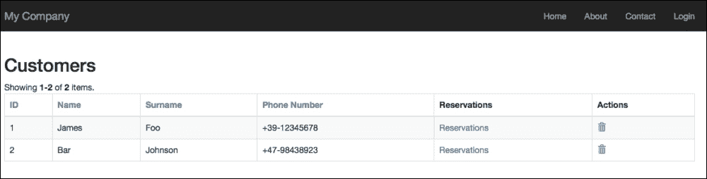
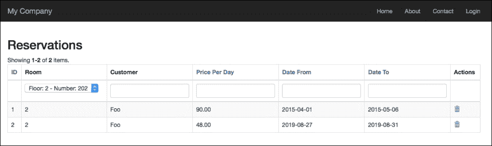
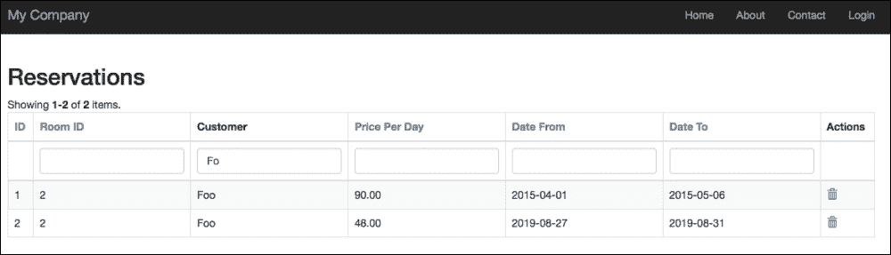

# 第六章：使用网格进行数据和关系

在本章中，我们将涵盖以下主题：

+   网格的 DataProvider

+   使用网格

+   网格中的自定义列：

    +   例如：通过点击客户网格行来显示预订列表

+   GridView 中的过滤器

+   在网格列中显示和过滤 ActiveRecord 关系数据

+   总结网格的底部行：

    +   例如：扩展 GridView 来自定义网格的底部行

+   单页上的多个网格：

    +   例如：在同一个视图中管理预订和房间网格

# 简介

在上一章中，你学习了如何从数据库中获取数据。现在，是时候使用框架提供的基本控件：GridView 了。我们将首先介绍网格期望的数据输入格式。然后，我们将分析网格的默认实现，并继续查看自定义以显示数据之间的关系。最后，你将学习扩展网格基类以在网格布局中显示所需的所有内容。

# 网格的 DataProvider

GridView 是 Yii2 提供的用于在网格布局中显示数据的控件。

此控件要求用作输入源的数据是抽象类`yii\data\BaseDataProvider`的扩展。

为了处理数据源，DataProvider 提供了一些额外的操作来处理分页和排序。

`BaseDataProvider`有一个名为`getModels()`的方法，它返回当前页面的项目列表。这意味着我们也可以使用 DataProvider 从源分页数据，并按需显示。

默认情况下，框架有三个核心类扩展了`yii\data\BaseDataProvider`：

+   `yii\data\ActiveDataProvider`

+   `yii\data\ArrayDataProvider`

+   `yii\data\SqlDataProvider`

第一个，`ActiveDataProvider`，使用 ActiveRecord 的`yii\db\Query`实例作为数据源。参数数组传递给构造函数，`yii\db\Query`对象在`query`属性中填充：

```php
// build an ActiveDataProvider with an empty query and a pagination with 35 items for page
$provider = new \yii\data\ActiveDataProvider([
    'query' => Room::find(),
    'pagination' => [
        'pageSize' => 35,
    ],
]);

// get all rooms in current page
$rooms = $provider->getModels();
```

`ActiveDataProvider`是最常用的 DataProvider，因为它直接依赖于 ActiveRecord，与数据库交互的最佳方式。

第二点，`ArrayDataProvider`使用一个可以排序或分页的项目数组作为数据源。当数据不能用 ActiveRecord 表示时，会使用这个提供者，例如，当它们来自另一个数据源时，如 JSON REST 服务或 RSS 源。

`ActiveDataProvider`的主要区别在于所有数据应立即传递给构造函数：

```php
// build an ArrayDataProvider with an empty query and a pagination with 40 items for page
$provider = new \yii\data\ArrayDataProvider([
    'allModels' => Room::find()->all(),
    'pagination' => [
        'pageSize' => 40,
    ],
]);

// get all rooms in current page
$rooms = $provider->getModels();
```

在这个片段中，我们从 ActiveRecord 中获取数据来展示`ActiveDataProvider`和`ArrayDataProvider`之间的区别。对于这个最后的提供者，所有模式都应该传递给构造函数。

因此，如果`Room`表有 10,000 条记录，使用`ActiveDataProvider`每次将加载 35 个项目，而通过`ArrayDataProvider`它们将全部从头开始加载（存在大的性能问题）。

最后一个，`SqlDataProvider`，使用 SQL 查询作为数据源。如果我们使用此提供程序创建分页，我们需要将`totalCount`属性传递给构造函数，以通知 DataProvider SQL 查询应返回多少条记录：

```php
// return total items count for this sql query
$itemsCount = \Yii::$app->db->createCommand('SELECT COUNT(*) FROM room')->queryScalar();

// build a SqlDataProvider with a pagination with 10 items for page

$dataProvider = new \yii\data\SqlDataProvider([
    'sql' => 'SELECT * FROM room',
    'totalCount' => $itemsCount,
    'pagination' => [
            'pageSize' => 10,
    ],
]);

// get the user records in the current page
$models = $dataProvider->getModels();
```

# 使用网格

现在我们知道了如何获取要传递给 GridView 的数据输入源，让我们看看如何实现它。GridView 的最小实现需要将两个属性传递给构造函数的数组：`dataProvider`和`columns`。第一个参数`dataProvider`是我们想要用来操作数据的。

第二个参数，`columns`，表示要显示的表格列，例如：

```php
<?= \yii\grid\GridView::widget([
    'dataProvider' => $dataProvider,
    'columns' => [
      'id',
      'floor',
      'room_number',
       'available_from:datetime',
       'price_per_day:currency',
    ],
]) ?>
```

此代码将显示一个表格，其中包含从`$dataProvider`获取的数据和五列：`id`、`floor`、`room_number`、`available_from`和`price_per_day`；最后两列首先使用`datetime`格式化，然后使用`currency`格式化。冒号用于指定应用于列数据的格式化程序。

### 注意

表的样式可以通过许多属性进行自定义，并且默认情况下，表格布局使用 Bootstrap 渲染。

网格表中的列可以使用字符串进行标识，但通常它们是根据`yii\grid\Column`类进行配置的。

# 网格中的自定义列

如前一段所述，GridView 小部件的`columns`属性主要填充字符串。

当我们需要应用特定格式，如货币或日期/时间时，我们可以将此规范附加到列名后跟一个冒号和用于格式化的类型，如`currency`或`datetime`。

但 GridView 列的最一般形式是`yii\grid\Column`类的一个对象，该类由`yii\grid\DataColumn`类派生。

通过`yii\grid\Column`类扩展的 GridView 列使用具有以下键的数组进行渲染：

```php
        [
// can be omitted, as it is the default
'class' => 'yii\grid\DataColumn',

        'attribute',    // name of model attribute
        'format',         // format use to display data
        'header',        // header of column
        'footer',        // footer of column
        'visible',        // flag to set visibility
        'content'         // callback to print data
        ],
```

还有其他参数，但这些都是最常用的。

## 示例 - 通过单击客户网格行显示预订列表

现在我们准备创建一个包含每行链接预订列表的客户网格。首先，确保客户和预订表的结构和数据如下：

```php
--
-- Structure of Table `customer`
--

CREATE TABLE IF NOT EXISTS `customer` (
  `id` int(11) NOT NULL PRIMARY KEY AUTO_INCREMENT,
  `name` varchar(50) NOT NULL,
  `surname` varchar(50) NOT NULL,
  `phone_number` varchar(50) DEFAULT NULL,
  PRIMARY KEY (`id`)
);

--
-- Data Dump of Table `customer`
--

INSERT INTO `customer` (`id`, `name`, `surname`, `phone_number`) VALUES
(1, 'James', 'Foo', '+39-12345678'),
(2, 'Bar', 'Johnson', '+47-98438923');

--
-- Structure of Table `reservation`
--

CREATE TABLE IF NOT EXISTS `reservation` (
  `id` int(11) NOT NULL PRIMARY KEY AUTO_INCREMENT,
  `room_id` int(11) NOT NULL,
  `customer_id` int(11) NOT NULL,
  `price_per_day` decimal(20,2) NOT NULL,
  `date_from` date NOT NULL,
  `date_to` date NOT NULL,
  `reservation_date` timestamp NOT NULL DEFAULT CURRENT_TIMESTAMP,
  PRIMARY KEY (`id`),
  KEY `room_id` (`room_id`),
  KEY `customer_id` (`customer_id`)
);

--
-- Data Dump of table `reservation`
--

INSERT INTO `reservation` (`id`, `room_id`, `customer_id`, `price_per_day`, `date_from`, `date_to`, `reservation_date`) VALUES
(1, 2, 1, 90.00, '2015-04-01', '2015-05-06', '2015-05-24 22:45:37'),
(2, 2, 1, 48.00, '2019-08-27', '2019-08-31', '2015-05-24 22:45:37'),
(3, 1, 2, 105.00, '2015-09-24', '2015-10-06', '2015-06-03 00:21:14');
```

在`basic/controllers/CustomersController.php`中创建一个名为`CustomersController`的新控制器，并带有`actionGrid`操作来在网格视图中显示列表：

```php
<?php

namespace app\controllers;

use Yii;
use yii\web\Controller;
use app\models\Customer;
use yii\data\ActiveDataProvider;

class CustomersController extends Controller
{
    public function actionGrid()
    {
        $query = Customer::find();

        $dataProvider = new ActiveDataProvider([
            'query' => $query,
            'pagination' => [
                'pageSize' => 10,
            ],
        ]);

        return $this->render('grid', [ 'dataProvider' => $dataProvider ]);

    }
}
```

此操作`actionGrid`简单地创建一个包含所有客户（未过滤）数据的提供程序，并带有每页显示十个项目的分页。最后，渲染网格视图。

这是`basic/views/customers/grid.php`中网格视图的内容：

```php
<?php
use yii\grid\GridView;
use yii\helpers\Html;
?>

<h2>Customers</h2>

<?= GridView::widget([
    'dataProvider' => $dataProvider,
    'columns' => [
        'id',
        'name',
        'surname',
        'phone_number',

        [
            'header' => 'Reservations',
            'content' => function ($model, $key, $index, $column) {
                return Html::a('Reservations', ['reservations/grid', 'Reservation[customer_id]' => $model->id]);
            }
        ],

        [
            'class' => 'yii\grid\ActionColumn',
            'template' => '{delete}',
            'header' => 'Actions',
        ],        
    ],
]) ?>
```

最后两列需要特别说明。

倒数第二项“预订”显示一个链接，让您访问所有客户预订的列表。我们将“预订”作为标题，并在`content`属性中填充从回调函数传递的动态数据，该函数返回指向`reservations/index`路由的 HTML 链接，并带有指示所选`customer_id`的参数。

最后一个标题为“操作”的列显示了带有单个操作“删除”的 ActionColumn，用于删除所选记录。

将您的浏览器指向`http://hostname/basic/customers/grid`，您应该看到以下输出：



使用 GridView 小部件的“客户”网格

### 注意

GridView 中使用的语言在`basic/config/web.php`中通过`language`属性进行配置。此属性对每个核心小部件具有全局影响。

我们可以通过在“预订”链接附近放置一个计数器来完成此示例，以指示每个客户的预订数量。

为此，我们需要在`basic/models/Customer.php`中的客户模型中添加一个名为`getReservationsCount`的新关系，它返回与客户关联的预订数量：

```php
    public function getReservationsCount()
    {
      return $this->hasMany(\app\models\Reservation::className(), ['customer_id' => 'id'])->count();
    }
```

现在我们可以通过以下方式修改倒数第二列：

```php
        [
            'header' => 'Reservations',
            'content' => function ($model, $key, $index, $column) {
                $title = sprintf('Reservations (%d)', $model->reservationsCount);
                return Html::a($title, ['reservations/grid', 'Reservation[customer_id]' => $model->id]);
            }
        ],
```

如果我们现在刷新浏览器，我们将在“预订”锚链接附近看到该客户的正确预订数量。

此示例表示用户点击“预订”链接时显示的完整预订列表。

在`basic/controllers/ReservationsController.php`中创建名为`ReservationsController`的新文件，包含一个名为`grid`的操作和以下内容：

```php
<?php

namespace app\controllers;

use Yii;
use yii\web\Controller;
use app\models\Reservation;
use yii\data\ActiveDataProvider;

class ReservationsController extends Controller
{
    public function actionGrid()
    {
        $query = Reservation::find();

        if(isset($_GET['Reservation']))
        {
            $query->andFilterWhere([
                'customer_id' => isset($_GET['Reservation']['customer_id'])?$_GET['Reservation']['customer_id']:null,
            ]);
        }

        $dataProvider = new ActiveDataProvider([
            'query' => $query,
            'pagination' => [
                'pageSize' => 10,
            ],
        ]);

        return $this->render('grid', [ 'dataProvider' => $dataProvider ]);

    }
}
```

在此控制器中，我们应用了一个`andFilterWhere`条件来查询`$_GET['Reservation']`是否已设置。如果条件不为空，`andFilterWhere()`方法将应用作为参数传递的筛选器。因此，如果`$_GET['Reservation']['customer_id']`未设置，`andFilterWhere()`条件参数将具有空值，并且不会附加到任何其他查询条件。

# GridView 中的筛选器

GridView 的核心特性是能够通过在标题行下方添加一个额外的行来简化筛选行。

筛选器主要是文本输入框，但通常可以是任何类型的控件，我们可以根据需要自定义它们。

可以通过填写 GridView 小部件属性`filterModel`为模型类的一个实例来激活筛选器，自动在标题下方创建一个新行，包含可用的文本输入框。

筛选文本输入框的名称属性填充了模型类名，包括字段名。这样，我们将向控制器传递数据，包括在单个数组中的所有内容；一个可以轻松用于填充搜索模型的变量。

### 注意

只有对于属于`ActiveDataProvider`的`rules()`方法中至少一个规则的属性，才会创建自动文本输入过滤器；否则，属性属于`safe`验证器就足够了。

让我们用一个预订网格的例子来创建一个示例。

我们将填写`filterModel`属性以应用 GridView 的过滤器，例如：

```php
<?= \yii\grid\GridView::widget([
    ...
    'filterModel' => $searchModel,
    ...        
?>
```

在这里，`$searchModel`是我们将从`ReservationsController`的网格操作传递到视图的`Reservation`模型类的实例。

现在让我们在`basic/controllers/ReservationsController.php`中的`ReservationsController`创建`actionGrid()`：

```php
    <?php

public function actionGrid()
    {
        $query = \app\models\Reservation::find();

        $searchModel = new \app\models\Reservation();
        if(isset($_GET['Reservation']))
        {
            $searchModel->load( \Yii::$app->request->get() );

            $query->andFilterWhere([
                'id' => $searchModel->id,
                'customer_id' => $searchModel->customer_id,
                'room_id' => $searchModel->room_id,
                'price_per_day' => $searchModel->price_per_day,
            ]);
        }

        $dataProvider = new \yii\data\ActiveDataProvider([
            'query' => $query,
            'pagination' => [
                'pageSize' => 10,
            ],
        ]);

        return $this->render('grid', [ 'dataProvider' => $dataProvider, 'searchModel' => $searchModel ]);

    }
```

`$searchModel`实例在以下行中填充了`$_GET['Reservation']`的内容：

```php
            $searchModel->load( Yii::$app->request->get() );
```

然后，`$query`将更新为非空属性的内容。

### 注意

记住 ActiveRecord 的`load()`方法将从模型类名中包含的数组中获取值，并将其作为键应用于传递给第一个函数参数的数组。

浏览到`http://hostname/basic/reservations/grid`并在**房间 ID**列过滤器（第二列）中输入`2`。这应该是输出：


在 GridView 小部件中使用过滤器

我们还可以选择自定义渲染过滤器的方式。想象一下，将**房间 ID**列过滤器作为一个下拉列表而不是输入文本框。

我们只需要填写**房间 ID**的`filter`属性为`dropDownList`。建议使用`Html`辅助类通过`activeDropDownList()`方法渲染`dropDownList`。`active`前缀代表 ActiveRecord。此`dropDownList()`方法需要三个参数：模型类、模型类的属性，以及最后是一个键值数组，其中`key`是`<option>`标签的值属性，`value`是`<option>`标签的文本。

我们将使用`yii\helpers\ArrayHelper`创建键值数组，其中键是模型的`id`属性，值是回调函数的返回值。

这就是`basic/views/reservations/grid.php`中的文件如何更改：

```php
<?php
$roomsFilterData = yii\helpers\ArrayHelper::map( app\models\Room::find()->all(), 'id', function($model, $defaultValue) {
    return sprintf('Floor: %d - Number: %d', $model->floor, $model->room_number);
});
?>

<?= \yii\grid\GridView::widget([
    'dataProvider' => $dataProvider,
    'filterModel' => $searchModel,
    'columns' => [
        'id',

        [
            'header' => 'Room',
            'filter' => \Html::activeDropDownList($searchModel, 'room_id', $roomsFilterData, ['prompt' => '--- all']),
            'content' => function($model) {
                return $model->room->floor;
            }
        ],
```

这是预期的输出：



带下拉列表过滤器的 GridView

# 在网格列中显示和过滤 ActiveRecord 关系数据

让我们现在关注 GridView 中的关系数据，这是一个常见的话题，可以很容易地自行解决。

考虑到预订网格有两个关系字段：`room_id`和`customer_id`，分别引用房间和客户表。如果我们想立即显示客户的姓氏或房间号怎么办？

到目前为止，我们的目标是显示关系数据，例如，在 GridView 中显示客户的姓氏而不是`customer_id`。引用相关数据的字段用`relation`属性表示。

在预订网格视图中，`customer`是获取相关客户的关系，而`surname`是要保留的字段。

因此，要显示客户的姓氏，只需在预订网格视图中插入此列（作为字符串）即可：

```php
    'customer.surname'
```

这相当于：

```php
    [
        'attribute' => 'customer.surname'
    ]
```

将显示一个名为`surname`的列。如果我们想将列名改为`Customer`，我们使用这个：

```php
    [
        'header' => 'Customer',
        'attribute' => 'customer.surname'
    ]
```

### 注意

我们可以使用自定义属性来获取数据，例如，使用`getnameAndSurname`来获取特定客户的个人详细信息。

在`Customer`模型中插入一个新属性：

```php
public function getNameAndSurname() {
     return $this->name.' '.$this->surname;
}
```

然后，这将是在 GridView 中的列：

```php
     [
        'header' => 'Customer',
        'attribute' => 'customer.nameAndSurname'
    ]
```

我们现在想过滤`Customer`列。由于`customer.surname`属性不在`Reservation`模型的`rules()`方法中，我们需要扩展此类来处理额外属性。

所以，在`basic/models/ReservationSearch.php`中创建一个名为`ReservationSearch`的新类，内容如下：

```php
<?php

class ReservationSearch extends app\models\Reservation
{
    public function attributes()
    {
        // add related fields to searchable attributes
        return array_merge(parent::attributes(), ['customer.surname']);
    }

    public function rules()
    {
        // add related rules to searchable attributes
        return array_merge(parent::rules(),[ ['customer.surname', 'safe'] ]);
    }    

}
```

此扩展仅添加了一个新属性和附加到该属性的新规则。该属性的名称是`customer.surname`。

我们现在必须更改`ReservationsController`中的`actionGrid()`操作，以便与允许根据客户姓氏进行过滤的`customer`表建立连接。

这是`basic/controllers/ReservationsController.php`中`ReservationsController`的`actionGrid()`方法的内容：

```php
    public function actionGrid()
    {
        $query = \app\models\Reservation::find();

        $searchModel = new \app\models\ReservationSearch();
        if(isset($_GET['ReservationSearch']))
        {
            $searchModel->load( \Yii::$app->request->get() );

            $query->joinWith(['customer']);
            $query->andFilterWhere(
                ['LIKE', 'customer.surname', $searchModel->getAttribute('customer.surname')]
            );

            $query->andFilterWhere([
                'id' => $searchModel->id,
                'customer_id' => $searchModel->customer_id,
                'room_id' => $searchModel->room_id,
                'price_per_day' => $searchModel->price_per_day,

            ]);
        }

        $dataProvider = new \yii\data\ActiveDataProvider([
            'query' => $query,
            'pagination' => [
                'pageSize' => 10,
            ],
        ]);

        return $this->render('grid', [ 'dataProvider' => $dataProvider, 'searchModel' => $searchModel ]);

    }
```

### 注意

请注意确保`$searchModel`是从`ReservationSearch`类实例化的，以及用于获取数据的`$_GET`参数也是从`ReservationSearch`而不是`Reservation`（因为它已更改类）实例化的。

在`actionGrid()`中使用这些代码行来过滤客户姓氏的操作：

```php
            $query->joinWith(['customer']);
            $query->andFilterWhere(
                ['LIKE', 'customer.surname', $searchModel->getAttribute('customer.surname')]
            );
```

我们进行连接，如果`customer.surname`属性不为空，则将有一个新的过滤器。浏览到`http://hostname/basic/reservations/grid`并在**Customer**列过滤器中输入`Fo`。你应该看到这个：



使用关系数据过滤

# 网格中的汇总页脚行

GridView 的一个特点是它显示汇总或统计数据，通常作为底部行或第一行，以便立即获取数据（而不是滚动到页面底部的网格底部）。

GridView 小部件的列有一个名为`footer`的属性，用于标识当前分页的最后一行。在此属性中填入的值将被放置在网格的最后一行。

默认情况下，显示页脚是禁用的；要启用页脚，只需将 GridView 的`showFooter`属性设置为`true`。然后，我们需要在要显示的列的`footer`属性中插入数据。

例如，我们想显示房间每天的平均价格。

在`basic/views/reservations/grid.php`网格视图中顶部添加此代码以计算每天的平均价格：

```php
<?php
use yii\grid\GridView;
use yii\helpers\Html;
?>

<h2>Reservations</h2>

<?php 
$sumOfPricesPerDay = 0;
$averagePricePerDay = 0;

if(count($dataProvider->getModels()) > 0)
{
    foreach($dataProvider->getModels() as $m) $sumOfPricesPerDay += $m->price_per_day;
    $averagePricePerDay = $sumOfPricesPerDay / sizeof($dataProvider->getModels());
}  
?>

<?php 
$roomsFilterData = yii\helpers\ArrayHelper::map( app\models\Room::find()->all(), 'id', function($model, $defaultValue) {
    return sprintf('Floor: %d - Number: %d', $model->floor, $model->room_number);
});
?>

<?= app\components\GridViewReservation::widget([
    'dataProvider' => $dataProvider,
    'filterModel' => $searchModel,
    'showFooter' => true,
    'columns' => [
        'id',

        [
            'header' => 'Room',
            'filter' => Html::activeDropDownList($searchModel, 'room_id', $roomsFilterData, ['prompt' => '--- all']),
            'content' => function($model) {
                return $model->room->floor;
            }
        ],

        [
            'header' => 'Customer',
            'attribute' => 'customer.surname',
        ],

        [
            'attribute' => 'price_per_day',
            'footer' => Yii::$app->formatter->asCurrency($resultQueryAveragePricePerDay, 'EUR')
        ],

        'date_from',
        'date_to',

        [
            'class' => 'yii\grid\ActionColumn',
            'template' => '{delete}',
            'header' => 'Actions',
        ],        
    ],
]) ?>
```

小心！在这个例子中，`count`是使用当前分页的模型进行的。如果网格由更多页面组成，它将只显示当前页的平均值！

此计数可以考虑到所有记录（包括过滤后的记录），计算基于当前分页的模型以及查询的结果。在 `ReservationsController` 的 `actionGrid()` 中添加平均计数：

```php
    public function actionGrid()
    {
        $query = \app\models\Reservation::find();

        $searchModel = new \app\models\ReservationSearch();
        if(isset($_GET['ReservationSearch']))
        {
            $searchModel->load( \Yii::$app->request->get() );

            $query->joinWith(['customer']);
            $query->andFilterWhere(
                ['LIKE', 'customer.surname', $searchModel->getAttribute('customer.surname')]
            );

            $query->andFilterWhere([
                'id' => $searchModel->id,
                'customer_id' => $searchModel->customer_id,
                'room_id' => $searchModel->room_id,
                'price_per_day' => $searchModel->price_per_day,

            ]);

        }
        $resultQueryAveragePricePerDay = $query->average('price_per_day');

        $dataProvider = new \yii\data\ActiveDataProvider([
            'query' => $query,
            'pagination' => [
                'pageSize' => 10,
            ],
        ]);

        return $this->render('grid', [ 'dataProvider' => $dataProvider, 'searchModel' => $searchModel, 'resultQueryAveragePricePerDay' => $resultQueryAveragePricePerDay ]);

    }
```

平均值是从 `$query` 对象的 `average()` 方法计算得出的（因此如果已填写，将考虑过滤器）并传递到视图中，因此视图顶部的计算代码不再需要，因为我们已经正确地将其移动到控制器操作中。

然后更改 `price_per_day` 列的 `footer` 内容：

```php
        [
            'attribute' => 'price_per_day',
            'footer' => sprintf('Average: %0.2f', $resultQueryAveragePricePerDay)
        ],
```

现在，平均计数将独立于分页。

## 示例 - 扩展 GridView 以自定义网格的页脚行

在高度定制的 GridView 中，需要显示默认情况下未处理的 GridView 中的数据位置，或者需要应用特定的更改（例如合并列）。

在这两种情况下，当无法使用 GridView 的属性创建所需的输出时，将需要子类化 GridView 小部件。

GridView 小部件有特定的方法来渲染其不同部分：`renderTableBody()`、`renderTableFooter()`、`renderTableHeader()`、`renderTableRow()` 等等。

考虑之前的示例。现在，我们还想收集页脚中的前三个列以显示 `Average` 标签，`price_per_day` 列中的唯一值，以及最后的四个列留空。

在 `basic/components/GridViewReservation.php` 中创建一个新的组件，该组件扩展了 `yii\grid\GridView` 小部件，并包含以下内容：

```php
<?php

namespace app\components;

use Yii;
use yii\web\Controller;
use yii\grid\GridView;

class GridViewReservation extends GridView
{
    public function renderTableFooter()
    {
        // Search column for 'price_per_day'
        $columnPricePerDay = null;
        foreach($this->columns as $column)
        {
            if(get_class($column) == 'yii\grid\DataColumn')
            {
                if($column->attribute == 'price_per_day') $columnPricePerDay = $column;
            }
        }

        $html = '<tfoot><tr>';
        $html .= '<td colspan="3"><b>Average:</b></td>';
        $html .= $columnPricePerDay->renderFooterCell();
        $html .= '<td colspan="4"><i>this space is intentionally empty</i></td>';
        $html .= '</tr></tfoot>';

        return $html;
    }
}
```

此组件仅扩展 `yii\grid\GridView` 并重写 `renderTableFooter()` 方法以进行所需的定制（主要是合并单元格）。此代码中的唯一逻辑是找到 `price_per_day` 列，遍历由 `$this->columns` 给出的列数组，其中 `$this` 指的是 GridView 对象。

# 单页上的多个网格

每个 Yii2 小部件都封装了如此多的内容，因此使用多个 GridView 小部件只是一个简单的活动，只需要进行少量更改。

实际上，唯一不能通过 DataProvider 模型类自定义的参数是 `pageParam` 和 `sortParam`，它们分别定义了当前页码索引和用于排序网格的参数。

假设，例如，我们有两个填充了两个不同数据提供者的 GridView，`$firstDataProvider` 和 `$secondDataProvider`。

在控制器中，我们将设置每个 DataProvider 的 `pageParam` 和 `sortParam` 参数：

```php
$firstDataProvider->pagination->pageParam = 'first-dp-page';
$firstDataProvider->sort->sortParam = 'first-dp-sort';

$secondDataProvider->pagination->pageParam = 'second-dp-page';
$secondDataProvider->sort->sortParam = 'second-dp-sort';
```

如果我们在更改页面或排序列时遗漏了这些定义，此操作也将影响同一页面上的其他 GridView，因为我们没有区分两个网格视图参数。

## 示例：在同一视图中管理预订和房间网格

此示例的目的是在完全独立于彼此的情况下在同一页面上显示预订和房间网格。

在 `basic/controllers/ReservationsController.php` 中的 `ReservationsController`，创建一个名为 `actionMultipleGrid()` 的新操作，其内容如下：

```php
    public function actionMultipleGrid()
    {
        /**
         * Reservations
         */
        $reservationsQuery = \app\models\Reservation::find();
        $reservationsSearchModel = new \app\models\ReservationSearch();

        if(isset($_GET['ReservationSearch']))
        {
            $reservationsSearchModel->load( \Yii::$app->request->get() );

            $reservationsQuery->joinWith(['customer']);
            $reservationsQuery->andFilterWhere(
                ['LIKE', 'customer.surname', $reservationsSearchModel->getAttribute('customer.surname')]
            );

            $reservationsQuery->andFilterWhere([
                'id' => $reservationsSearchModel->id,
                'customer_id' => $reservationsSearchModel->customer_id,
                'room_id' => $reservationsSearchModel->room_id,
                'price_per_day' => $reservationsSearchModel->price_per_day,

            ]);
        }

        $reservationsDataProvider = new \yii\data\ActiveDataProvider([
            'query' => $reservationsQuery,
            'sort' => [
                'sortParam' => 'reservations-sort-param',
            ],
            'pagination' => [
                'pageSize' => 10,
                'pageParam' => 'reservations-page-param'
            ],
        ]);        

        /**
         * Rooms
         */
        $roomsQuery = \app\models\Room::find();
        $roomsSearchModel = new \app\models\Room();

        if(isset($_GET['Room']))
        {
            $roomsSearchModel->load( \Yii::$app->request->get() );

            $roomsQuery->andFilterWhere([
                'id' => $roomsSearchModel->id,
                'floor' => $roomsSearchModel->floor,
                'room_number' => $roomsSearchModel->room_number,
                'has_conditioner' => $roomsSearchModel->has_conditioner,
                'has_phone' => $roomsSearchModel->has_conditioner,
                'has_tv' => $roomsSearchModel->has_conditioner,
                'available_from' => $roomsSearchModel->has_conditioner,

            ]);
        }

        $roomsDataProvider = new \yii\data\ActiveDataProvider([
            'query' => $roomsQuery,
            'sort' => [
                'sortParam' => 'rooms-sort-param',
            ],
            'pagination' => [
                'pageSize' => 10,
                'pageParam' => 'rooms-page-param'
            ],
        ]);        

        return $this->render('multipleGrid', [
            'reservationsDataProvider' => $reservationsDataProvider, 'reservationsSearchModel' => $reservationsSearchModel,
            'roomsDataProvider' => $roomsDataProvider, 'roomsSearchModel' => $roomsSearchModel,
        ]);

    }
```

我们已经将预订声明从房间声明中分离出来，以便清楚地区分它们。请注意，确保你为 DataProvider 的任何一个都定义了 `sortparam` 和 `pageparam`。

现在我们创建一个新的视图在 `basic/views/reservations/multipleGrid.php`：

```php
<?php
use yii\grid\GridView;
use yii\helpers\Html;
?>

<h2>Reservations</h2>
<?= GridView::widget([
    'dataProvider' => $reservationsDataProvider,
    'filterModel' => $reservationsSearchModel,
    'columns' => [
        'id',
        'room_id',
        'attribute' => 'customer.surname',
        'price_per_day',
        'date_from',
        'date_to'
    ],
]) ?>

<h2>Rooms</h2>
<?= GridView::widget([
    'dataProvider' => $roomsDataProvider,
    'filterModel' => $roomsSearchModel,
    'columns' => [
        'id',
        'floor',
        'room_number',        
        'has_conditioner:boolean',
        'has_phone:boolean',
        'has_tv:boolean',
        'available_from',
    ],
]) ?>
```

这两个网格是完全独立的，我们现在可以排序或更改页面，而不会干扰其他网格。

# 摘要

在本章中，我们介绍了用于显示数据（直接或关联）的 GridView 小部件。在讨论 GridView 时，一个基本话题是 DataProvider，它是一种向 GridView 提供数据的方式。你学习了如何根据可用的来源从 ActiveRecord、数组或 SQL 中获取 DataProvider。

在 GridView 的第一次简单实现之后，你理解了列的定制，并使用模型类的扩展来添加新属性以添加额外功能，从而显示了来自其他表的关系数据。接下来，我们说明了如何通过筛选数据来选择特定的行。

在本章结束之前，你看到了如何通过子类化核心小部件 `yii\grid\GridView` 来在 GridView 中显示、总结和定制页脚以及更多内容。最后，最后一个话题是使用同一页面上的多个网格，特别关注需要发生的少量更改，以避免它们相互干扰。

在下一章中，你将学习如何使用 CSS、JavaScript、小部件以及框架直接提供的工具（如 Gii）来定制用户界面。
