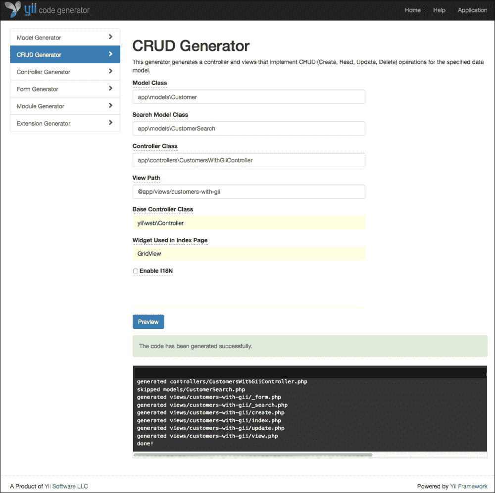
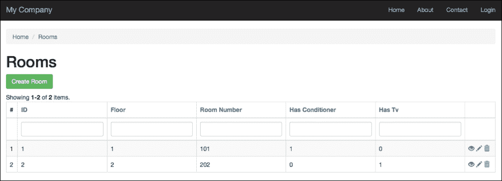
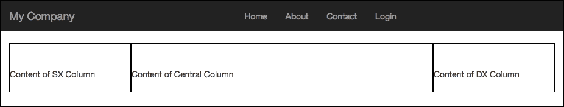
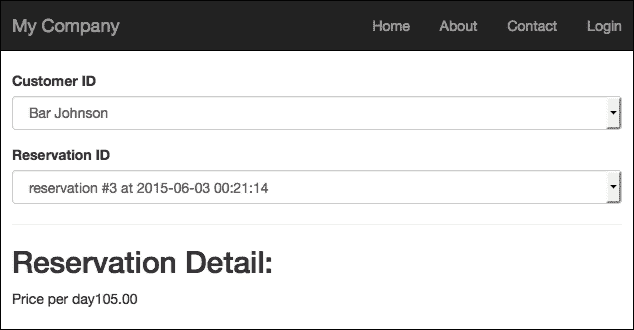
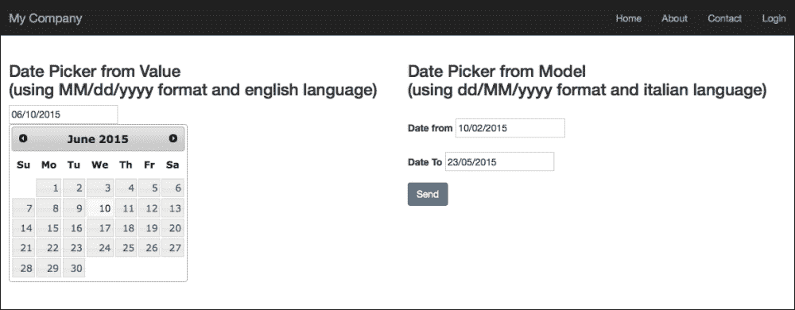
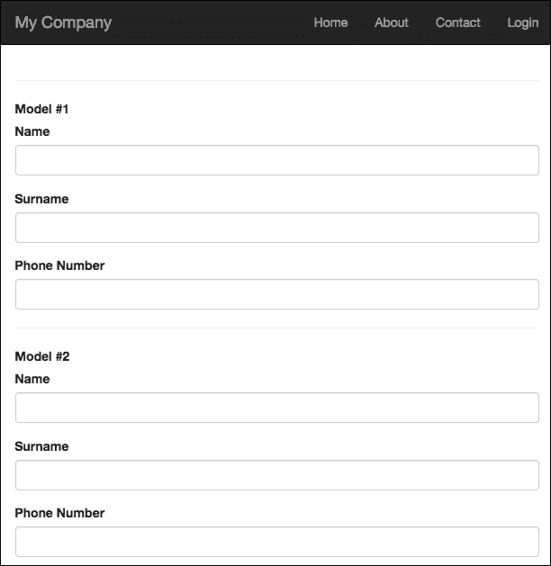
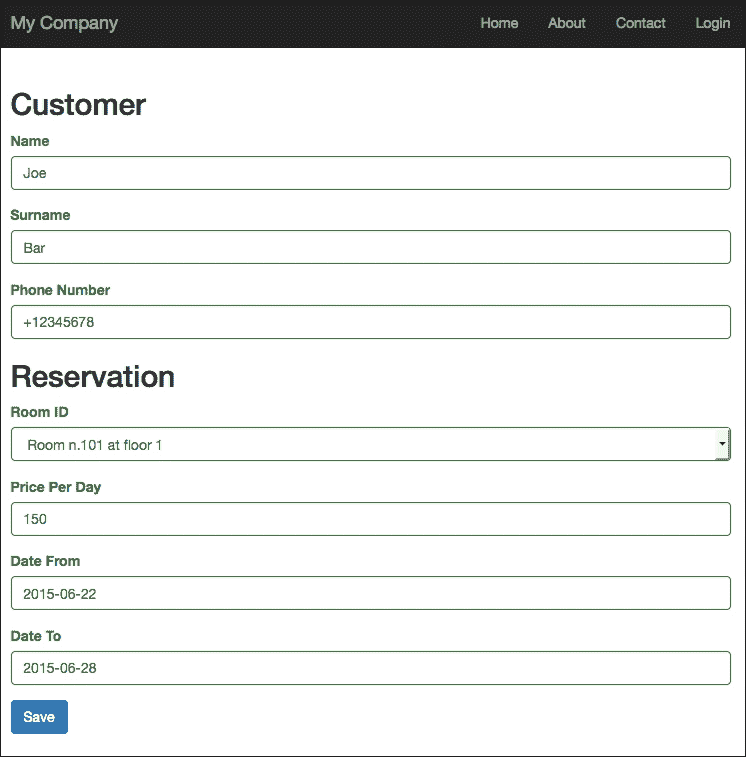

# 第七章。用户界面工作

在本章中，你将发现 Gii 作为工具是多么强大。它提供了对 CRUD 操作的支持，以及创建控制器及其相应的视图。

在本章中，我们将介绍与用户界面相关的以下主题：

+   使用 Gii 生成创建、读取、更新和删除 (CRUD) 操作：

    +   例如 - 使用 CRUD 通过 Gii 管理房间、预订和客户

+   自定义 JavaScript 和 CSS：

    +   例如 - 使用 JavaScript 和 CSS 显示广告列，如果空间不足则消失

+   使用 AJAX：

    +   例如：从客户下拉列表加载的预订详情

+   使用 Bootstrap 小部件：

    +   例如 - 使用日期选择器

+   在同一视图中查看多个模型：

    +   例如 - 同时保存多个客户

+   在同一视图中保存链接的模型：

    +   例如 - 在同一视图中创建客户和预订

现在是时候学习 Yii2 支持的以自定义网页的 JavaScript 和 CSS 部分了。JavaScript 的一个常见用途是处理 AJAX 调用，即从 jQuery 和 Bootstrap 中管理小部件和复合控件（如依赖性下拉列表）。

最后，我们将使用 jQuery 动态从同一类中创建更多模型，这些模型将被传递到控制器以进行验证和保存。

# 使用 Gii 生成 CRUD

我们在第五章中介绍了 Gii，*开发预订系统*，用于生成模型。现在我们想使用 Gii 来创建带有控制器和视图的 CRUD 操作。

在浏览器中输入 `http://hostname/basic/web/gii` 返回 Gii 欢迎页面。点击 **CRUD** 部分的 **开始** 按钮。我们必须填写四个字段：

+   **模型类**: 这是与 CRUD 将要构建的表关联的 ActiveRecord 类；这个类应该使用完全限定的命名空间路径提供，例如：`app\models\ModelClass`。

+   **搜索模型类**: 这是将要生成的搜索模型类的名称，并从模型类扩展；这个类将提供在搜索记录时使用的有用方法和扩展。这应该使用完全限定的命名空间路径提供，例如：`app\models\ModelClassSearch`。

+   **控制器类**: 这是将要生成的控制器类的名称；这个类应该使用完全限定的命名空间路径和 CamelCase 格式提供名称，名称以大写字母开头，例如：`app\controller\MyCustomController`。

+   **视图路径**: 这是控制器操作生成的视图将被存储的目录。我们可以使用路径，别名 `@app/views`，来表示视图文件的基准路径，例如：`@app/views/myCustom` 表示 `MyCustomController` 视图的基准路径，默认填充为 `@app/views/controller-id`。

然后，我们可以自定义`BaseControllerClass`，这是在索引页面中使用的小部件，以启用 I18N 状态和代码模板，但保留默认值是完全可以的。

### 注意

如果我们检查**启用 I18N**，那么我们必须注意每个属性标签的翻译，这将在后面的章节中介绍。

## 示例 - 使用 Gii 通过 CRUD 管理房间、预订和客户

在本例中，我们将创建完整的 CRUD 操作来管理房间、预订和客户。

在前面的章节中，我们处理了 Gii CRUD 操作以创建表单。现在，我们必须为所有三个模型（房间、预订和客户模型类）重复这些说明。为了区分 Gii 创建的文件和前面章节中手动创建的文件，我们将 Gii 后缀添加到控制器类的名称中。

浏览到 Gii 欢迎页面`http://hostname/basic/web/gii`，在**CRUD**部分点击**开始**按钮，并使用以下值填写字段以创建`Room`模型类的 CRUD 操作：

+   **模型类**: `app\models\Room`

+   **搜索模型类**: `app\models\RoomSearch`

+   **控制器类**: `app\controllers\RoomsWithGiiController`

+   **视图路径**: `@app/views/rooms-with-gii`

然后，为`Reservation`模型类重复此操作：

+   **模型类**: `app\models\Reservation`

+   **搜索模型类**: `app\models\ReservationSearch`

+   **控制器类**: `app\controllers\ReservationsWithGiiController`

+   **视图路径**: `@app/views/reservations-with-gii`

最后，为`Customer`模型类重复它们：

+   **模型类**: `app\models\Customer`

+   **搜索模型类**: `app\models\CustomerSearch`

+   **控制器类**: `app\controllers\CustomersWithGiiController`

+   **视图路径**: `@app/views/customers-with-gii`

    ### 注意

    确保视图路径中有斜杠(`/`)而不是反斜杠(`\`)，因为在模型类、搜索模型类和控制器类中的命名空间路径中不应使用反斜杠。

以下截图显示了填写以生成`Room`模型类的 CRUD 操作的字段：



Gii 的 CRUD 生成器

在导航文件夹结构时，你会看到 Gii 在`basic/controllers`中创建了三个新的文件，分别命名为`RoomsWithGiiController.php`、`ReservationsWithGiiController.php`和`CustomersWithGiiController.php`。

每个这些文件都包含五个操作：

+   `actionCreate()`: 此操作用于创建新的模型对象

+   `actionView()`: 此操作用于查看模型对象的详细信息

+   `actionUpdate()`: 此操作用于更新现有的模型对象

+   `actionDelete()`: 此操作用于删除现有的模型对象

+   `actionIndex()`: 此操作用于使用网格布局显示模型对象的列表

打开 `basic/models` 文件夹，你会找到三个新的文件：`RoomSearch.php`、`ReservationSearch.php`（该文件应该已经存在）和 `CustomerSearch.php`。

这些文件基本上都包含一个 `search()` 方法，该方法返回 ActiveDataProvider，用于在 GridView 中显示数据，并传递一些过滤条件。

最后，打开 `basic/views` 文件夹，你会找到三个新的文件夹：`roomsWithGii`、`reservationsWithGii` 和 `customersWithGii`；每个文件夹都包含六个文件：

+   `_form.php`

+   `_search.php`

+   `create.php`

+   `index.php`

+   `update.php`

+   `view.php`

以下划线开头的视图文件在 Yii2 中默认被视为子视图，或者说是由其他视图调用的视图。

前两个文件以下划线开头；实际上，如果我们打开 `create.php` 和 `update.php`，我们会注意到，在这些文件的末尾，使用 `_form.php` 视图调用了 `render()` 方法。创建和更新视图将使用相同的 `_form` 视图来显示编辑字段表单。

最后四个文件，`create.php`、`index.php`、`update.php` 和 `view.php` 是指向控制器中相同操作的视图。默认情况下，它们每个页面都有一个面包屑和标题。

进行一些测试，例如浏览到 `http://hostname/basic/web/rooms-with-gii/index` 或 `http://hostname/basic/web/rooms-with-gii/index`，以查看 Gii 制作的出色作品。

这是 RoomsWithGiiController 的索引动作结果：



RoomsWithGiiController 索引动作的输出

# 自定义 JavaScript 和 CSS

如前所述，在本章中，你将了解如何使用前端交互。使用 JavaScript 和 CSS 是自定义前端输出的基础。

与 Yii1 不同，在 Yii1 中，调用 JavaScript 和 CSS 脚本和文件是通过使用 `Yii::app()` 单例完成的，在新框架版本 Yii2 中，这项任务现在是 `yii\web\View` 类的一部分。

调用 JavaScript 或 CSS 有两种方式：要么直接传递要执行的代码，要么传递文件路径。

### 备注

当直接传递要执行的代码时，我们将使用 PHP 提供的 Heredoc 语法来避免处理字符串转义。

`registerJs()` 函数允许我们使用三个参数执行 JavaScript 代码：

+   第一个参数是要注册的 JavaScript 代码块

+   第二个参数是 JavaScript 标签应插入的位置（头部、身体部分的开始、身体部分的结束、在 jQuery `load()` 方法内或 jQuery `document.ready()` 方法内，默认为后者）

+   第三个和最后一个参数是一个键，用于标识 JavaScript 代码块（如果没有提供，则使用第一个参数的内容作为键）

另一方面，`registerJsFile()` 函数允许我们使用三个参数执行一个 JavaScript 文件：

+   第一个参数是 JavaScript 文件的路径文件。

+   第二个参数是脚本标签的 HTML 属性，特别关注 depends 和 position 值，它们不被视为标签属性。

+   第三个参数是一个标识 JavaScript 代码块的关键字（如果没有提供，则将使用第一个参数的内容作为关键字）。

CSS，类似于 JavaScript，可以通过代码执行或通过传递路径文件执行。

`registerCss()`函数允许我们使用三个参数来执行 CSS 代码：

+   第一个是需要注册的 CSS 代码块。

+   第二个是`style`标签的 HTML 属性。

+   第三个和最后一个参数是一个标识 JavaScript 代码块的关键字（如果没有提供，则将使用第一个参数的内容作为关键字）。

`registerCssFile()`函数允许我们使用三个参数来执行 CSS 文件：

+   第一个是 CSS 文件的路径文件。

+   第二个参数是链接标签的 HTML 属性，特别关注 depends 值，它不被视为标签属性。

+   第三个参数是一个标识 JavaScript 代码块的关键字（如果没有提供，则将使用第一个参数的内容作为关键字）。

通常，JavaScript 或 CSS 文件发布在`basic/web`文件夹中，该文件夹无限制可访问。

因此，当我们必须使用自定义 JavaScript 或 CSS 文件时，建议将它们放在`basic/web`文件夹的子文件夹中，可以命名为`css`或`js`。

### 注意

默认情况下，CSS 文件文件夹`basic/web/css`应该已经存在。但我们仍然需要为 JavaScript 文件创建`basic/web/js`。

在某些情况下，我们可能需要为所有 Web 应用程序页面添加新的 CSS 或 JavaScript 文件。将这些条目放在`AppAsset.php`文件中最合适，该文件位于`basic/assets/AppAsset.php`。在其中，我们可以添加 Web 应用程序所需的 CSS 和 JavaScript 条目，如果需要，甚至可以使用依赖项。

## 示例 - 使用 JavaScript 和 CSS 显示广告列，如果空间不足则消失。

如果需要同时使用 JavaScript 和 CSS 自定义，则此示例是合适的。

想象一下构建为三个垂直列的布局，这是博客系统的典型布局。左侧一列宽 200 像素（通常用于广告），中间一列宽 1000 像素（通常用于内容），右侧一列宽 200 像素（通常再次用于广告）。

如果浏览器宽度至少为 1,400 像素，我们希望显示所有三列（内容和两个广告列）。

如果没有足够的空间来显示所有列，并且浏览器的宽度大小在 1,200 到 1,400 像素之间，则只显示左侧和中间列（只有一个广告列和一个内容列。最后，如果浏览器的宽度大小小于 1,200 像素，则只显示包含内容的中间列）。

此外，我们的目标是确保这些列始终在浏览器中居中。

在 `basic/controllers/ThreeColumnsController.php` 中创建一个新的控制器类，以处理渲染视图文件的动作：

```php
<?php
namespace app\controllers;

use Yii;
use yii\web\Controller;

class ThreeColumnsController extends Controller
{
    public function actionIndex()
    {
        return $this->render('index.php');
    }
}
```

此外，在 `basic/views/three-columns` 中创建一个新的 `view` 文件夹，并在其中插入 `index.php` 文件以存储视图内容。

基本上，这是构建三列布局所需的内容：

```php
<div id="layout">
    <div id="colSx" class="column">
            Content of SX Column
    </div>
    <div id="colCenter" class="column">
            Content of Central Column
    </div>
    <div id="colDx" class="column">
            Content of DX Column
    </div>
</div>
```

CSS 类 `column` 将仅用于通过围绕它们添加黑色边框来增强单元格的可见性。

在这一点上，我们将使用 `registerCss()` 方法在视图文件顶部居中布局并固定列的宽度：

```php
<?php

$this->registerCss( <<< EOT_CSS

    .column
    {
            border:1px solid black;
    }

    #layout
    {
        position:relative;
        margin:0pt auto;
        width:1400px;
    }

    #colSx
    {
        width:200px;
        float:left;
    }

    #colCenter
    {
        width:1000px;
        float:left;
    }

    #colDx
    {
        width:200px;
        float:left;
    }

EOT_CSS
);

?>
```

将您的浏览器指向 `http://hostname/basic/web/three-columns/index`，您将看到以下内容：



内容宽度分为三列

我们必须通过 JavaScript 处理浏览器调整大小事件，以使用本章开头定义的维度规则来管理列的可视化。

我们将使用 `registerJs()` 方法，仅传递要执行的代码：

```php
<?php
$this->registerJs( <<< EOT_JS

    function resizeLayout()
    {
        var windowWidth = $(window).width();

        if(windowWidth > 1400)
        {
            $('#colSx').css('display', 'block');
            $('#colCenter').css('display', 'block');
            $('#colDx').css('display', 'block');
            $('#layout').css('width', 1400);
        }
        else if((windowWidth>1200)&&(windowWidth<=1400))
        {
            $('#colSx').css('display', 'block');
            $('#colCenter').css('display', 'block');
            $('#colDx').css('display', 'none');
            $('#layout').css('width', 1200);
        }
        else if(windowWidth<1200)
        {
            $('#colSx').css('display', 'none');
            $('#colCenter').css('display', 'block');
            $('#colDx').css('display', 'none');
            $('#layout').css('width', 1000);
        }

    }

    $(window).resize(function() {
            resizeLayout();
    });

    $(function() {
            resizeLayout();
    });

EOT_JS
);
?>
```

刷新您的浏览器到 `http://hostname/basic/web/three-columns/index` 并调整到所需的宽度，列的可视化应根据特定宽度中的可用空间而变化。

# 使用 AJAX

Yii2 为某些小部件提供了适当的属性以进行 AJAX 调用；然而，有时在这些属性中编写 JavaScript 代码会使代码难以阅读，尤其是当我们处理复杂代码时。

因此，为了进行 AJAX 调用，我们将使用由 `registerJs()` 执行的外部 JavaScript 代码。

这是使用 `GET` 或 `POST` 方法的 AJAX 类模板：

```php
<?php
$this->registerJs( <<< EOT_JS

     // using GET method
$.get({
  url: url,
  data: data,
  success: success,
  dataType: dataType
});

     // using POST method
$.post({
  url: url,
  data: data,
  success: success,
  dataType: dataType
});

EOT_JS
);
?>
```

AJAX 调用通常是用户界面事件（如按钮点击、链接等）的效果。因此，大多数情况下，AJAX 调用直接与 jQuery 在 HTML 元素（锚点、按钮等）上的 `.on()` 事件相关联。因此，记住 Yii2 如何渲染输入字段的 `name` 和 `id` 属性非常重要。

当我们调用 `Html::activeTextInput($model, $attribute)` 或以相同方式使用 `<?= $form->field($model, $attribute)->textInput() ?>`。

输入文本字段的 `name` 和 `id` 属性将被渲染如下：

+   `id` : 模型类名通过小写属性名与短横线分隔；例如，如果模型类名是 `Room` 且属性是 `floor`，则 `id` 属性将是 `room-floor`

+   `name`：包含属性名的模型类名，例如，如果模型类名是 `Reservation` 且属性是 `price_per_day`，则 `name` 属性将是 `Reservation[price_per_day]`；因此，`Reservation` 模型拥有的每个字段都将包含在一个单独的数组中

## 示例 – 从客户的下拉列表中加载的预订详情

在这个例子中，有两个下拉列表和一个详细框。这两个下拉列表分别对应客户和预订；当用户点击客户列表项时，根据他们的选择，预订的下拉列表将被填写。

最后，当用户点击预订列表项时，一个包含所选预订数据的详细框将被填写。

在`basic/controllers/ReservationsController.php`中创建一个新的操作，命名为`actionDetailDependentDropdown()`：

```php
    public function actionDetailDependentDropdown()
    {
        $showDetail = false;

        $model = new Reservation();

        if(isset($_POST['Reservation']))
        {
          $model->load( Yii::$app->request->post() );

          if(isset($_POST['Reservation']['id'])&&($_POST['Reservation']['id']!=null))
            {
               $model = Reservation::findOne($_POST['Reservation']['id']);
               $showDetail = true;
            }
        }

        return $this->render('detailDependentDropdown', [ 'model' => $model, 'showDetail' => $showDetail ]);
    }
```

在这个操作中，我们将根据`Reservation`模型数据从表单中获取`customer_id`和`id`参数，如果它们被填写，这些数据将被用来搜索正确的预订模型并将其传递给视图。

有一个名为`$showDetail`的标志，如果接收到模型的`id`属性，它将显示预订详情内容。

在`ReservationsController`中，还有一个在用户更改下拉列表中的客户选择时将通过 AJAX 调用的操作：

```php
    public function actionAjaxDropDownListByCustomerId($customer_id)
    {
        $output = '';

        $items = Reservation::findAll(['customer_id' => $customer_id]);
        foreach($items as $item)
        {
            $content = sprintf('reservation #%s at %s', $item->id, date('Y-m-d H:i:s', strtotime($item->reservation_date)));
            $output .= \yii\helpers\Html::tag('option', $content, ['value' => $item->id]);
        }

        return $output;
    }
```

这个操作将返回填充有按客户 ID 过滤的预订数据的`<option>` HTML 标签。

现在让我们看看`basic/views/reservations/detailDependentDropdown.php`中的视图：

```php
<?php
use yii\helpers\Html;
use yii\widgets\ActiveForm;
use yii\helpers\ArrayHelper;
use yii\helpers\Url;
use app\models\Customer;
use app\models\Reservation;

$urlReservationsByCustomer = Url::to(['reservations/ajax-drop-down-list-by-customer-id']);
$this->registerJs( <<< EOT_JS

    $(document).on('change', '#reservation-customer_id', function(ev) {

        $('#detail').hide(); 

        var customerId = $(this).val();    

        $.get(
            '{$urlReservationsByCustomer}',
            { 'customer_id' : customerId },
            function(data) {
                data = '<option value="">--- choose</option>'+data;
                $('#reservation-id').html(data);
            }
        )
        ev.preventDefault();
    });

    $(document).on('change', '#reservation-id', function(ev) {
        $(this).parents('form').submit();
        ev.preventDefault();
    });

EOT_JS
);

?>

<div class="customer-form">
    <?php $form = ActiveForm::begin(['enableAjaxValidation' => false, 'enableClientValidation' => false, 'options' => ['data-pjax' => '']]); ?>

    <?php $customers = Customer::find()->all(); ?>
    <?= $form->field($model, 'customer_id')->dropDownList(ArrayHelper::map( $customers, 'id', 'nameAndSurname'), [ 'prompt' => '--- choose' ]) ?>

    <?php $reservations = Reservation::findAll(['customer_id' => $model->customer_id]); ?>
    <?= $form->field($model, 'id')->label('Reservation ID')->dropDownList(ArrayHelper::map( $reservations, 'id', function($temp, $defaultValue) {
      $content = sprintf('reservation #%s at %s', $temp->id, date('Y-m-d H:i:s', strtotime($temp->reservation_date)));
        return $content;
    }), [ 'prompt' => '--- choose' ]); ?>

    <div id="detail">
    <?php if($showDetail) { ?>
        <hr />
        <h2>Reservation Detail:</h2>
        <table>
            <tr>
                <td>Price per day</td>
                <td><?php echo $model->price_per_day ?></td>
            </tr>
        </table>
    <?php } ?>
    </div>

    <?php ActiveForm::end(); ?>

</div>
```

在视图的顶部，有处理客户和预订下拉列表变化的处理程序。

如果客户下拉列表发生变化，`detail` div 将被隐藏，一个 AJAX 调用将获取所有按`customer_id`过滤的预订，并将结果作为内容传递给预订下拉列表。如果预订下拉列表发生变化，将提交一个表单。

在表单声明中，我们首先找到客户下拉列表，然后是预订列表，它使用闭包从`ArrayHelper::map()`方法获取值。我们可以在`Reservation`模型中添加一个新属性，通过创建一个以`get`前缀开始的函数来实现，例如`getDescription()`，并在其中放入闭包的内容，或者更确切地说：

```php
public function getDescription()
{
$content = sprintf('reservation #%s at %s', $this>id, date('Y-m-d H:i:s', strtotime($this>reservation_date)));
            return $content;
}
```

或者我们可以使用简短语法从`ArrayHelper::map()`获取数据，如下所示：

```php
    <?= $form->field($model, 'id')->dropDownList(ArrayHelper::map( $reservations, 'id', 'description'), [ 'prompt' => '--- choose' ]); ?>
```

最后，如果`$showDetail`被标记，将显示一个简单的详细框，其中只包含预订的每日价格。

将您的浏览器指向`http://hostname/basic/web/reservations/detail-dependent-dropdown`：



从客户下拉列表动态加载的预订详情

# 使用 Bootstrap 小部件

Yii2 支持 Bootstrap 作为核心功能。Bootstrap 框架的 CSS 和 JavaScript 文件默认注入到所有页面中，我们甚至可以使用这个功能来仅应用 CSS 类或调用 Bootstrap 提供的自己的 JavaScript 函数。

然而，Yii2 将 Bootstrap 作为小部件嵌入，我们可以像访问任何其他小部件一样访问这个框架的功能。

最常用的有：

| 类名 | 描述 |
| --- | --- |
| `yii\bootstrap\Alert` | 这个类用于渲染一个 Bootstrap 提示组件 |
| `yii\bootstrap\Button` | 这个类用于渲染一个 Bootstrap 按钮 |
| `yii\bootstrap\Dropdown` | 这个类用于渲染一个 Bootstrap 下拉菜单组件 |
| `yii\bootstrap\Nav` | 这个类用于渲染一个 `nav` HTML 组件 |
| `yii\bootstrap\NavBar` | 这个类用于渲染一个 `navbar` HTML 组件 |

例如，`yii\bootstrap\Nav` 和 `yii\bootstrap\NavBar` 被用于默认的主模板中。

这是从主布局视图（在 `basic/views/layouts/main.php`）的摘录：

```php
        <?php
            NavBar::begin([
                'brandLabel' => 'My Company',
                'brandUrl' => Yii::$app->homeUrl,
                'options' => [
                    'class' => 'navbar-inverse navbar-fixed-top',
                ],
            ]);
            echo Nav::widget([
                'options' => ['class' => 'navbar-nav navbar-right'],
                'items' => [
                    ['label' => 'Home', 'url' => ['/site/index']],
                    ['label' => 'About', 'url' => ['/site/about']],
                    ['label' => 'Contact', 'url' => ['/site/contact']],
                    Yii::$app->user->isGuest ?
                        ['label' => 'Login', 'url' => ['/site/login']] :
                        ['label' => 'Logout (' . Yii::$app->user->identity->username . ')',
                            'url' => ['/site/logout'],
                            'linkOptions' => ['data-method' => 'post']],
                ],
            ]);
            NavBar::end();
        ?>
```

## 示例：使用日期选择器

Yii2 通过 JUI 扩展（`yii2-jui`）本身也支持许多 jQuery UI 组件。

如果我们在 `vendor` 文件夹中没有 `yii2-jui` 扩展，我们可以使用以下命令从 Composer 获取它：

```php
php composer.phar require --prefer-dist yiisoft/yii2-jui

```

在本例中，我们将讨论两个最常用的组件：`datepicker` 和 `autocomplete`。首先让我们看看 `datepicker` 组件。这个组件可以使用模型属性或通过填写值属性来初始化。以下是一个使用模型实例及其属性之一制作的示例：

```php
echo DatePicker::widget([
    'model' => $model,
    'attribute' => 'from_date',
    //'language' => 'it',
    //'dateFormat' => 'yyyy-MM-dd',
]);
```

以下是值属性使用的一个示例：

```php
echo DatePicker::widget([
    'name'  => 'from_date',
    'value'  => $value,
    //'language' => 'it',
    //'dateFormat' => 'yyyy-MM-dd',
]);
```

现在在 `basic/controllers/JuiWidgetsController.php` 中创建一个名为 `JuiWidgetsController` 的新控制器：

```php
<?php

namespace app\controllers;

use Yii;
use yii\web\Controller;
use app\models\Reservation;

class JuiWidgetsController extends Controller
{
    public function actionDatePicker()
    {
        $reservationUpdated = false;

        $reservation = Reservation::findOne(1);

        if(isset($_POST['Reservation']))
        {
            $reservation->load( Yii::$app->request->post() );

            $reservation->date_from = Yii::$app->formatter->asDate(  date_create_from_format('d/m/Y', $reservation->date_from), 'php:Y-m-d' );
            $reservation->date_to = Yii::$app->formatter->asDate(  date_create_from_format('d/m/Y', $reservation->date_to), 'php:Y-m-d' );

            $reservationUpdated = $reservation->save();
        }

        return $this->render('datePicker', ['reservation' => $reservation, 'reservationUpdated' => $reservationUpdated]);
    }
}
```

在这个操作中，我们定义了 `$reservation` 模型，从具有 `id` 1 的预订数据库表中选取。

当数据通过 POST 发送时，`date_from` 和 `date_to` 字段将从 d/m/y 格式转换为 y-m-d 格式，以便数据库能够保存数据。然后通过 `save()` 方法更新模型对象。使用 Bootstrap 小部件，在更新模型后，视图中将显示一个提示框。

在 `basic/views/jui-widgets/datePicker.php` 中创建 `datePicker` 视图：

```php
<?php

use yii\helpers\Html;
use yii\widgets\ActiveForm;
use yii\jui\DatePicker;

?>

<div class="row">
    <div class="col-lg-6">
        <h3>Date Picker from Value<br />(using MM/dd/yyyy format and English language)</h3>
        <?php
            $value = date('Y-m-d');

        echo DatePicker::widget([
            'name'  => 'from_date',
            'value'  => $value,
            'language' => 'en',
            'dateFormat' => 'MM/dd/yyyy',
        ]);
        ?>
    </div>
    <div class="col-lg-6">

        <?php if($reservationUpdated) { ?>
            <?php
            echo yii\bootstrap\Alert::widget([
                'options' => [
                    'class' => 'alert-success',
                ],
                'body' => 'Reservation successfully updated',
            ]);   
            ?>         
        <?php } ?>

        <?php $form = ActiveForm::begin(); ?>

        <h3>Date Picker from Model<br />(using dd/MM/yyyy format and italian language)</h3>

        <br />

        <label>Date from</label>
        <?php
        // First implementation of DatePicker Widget
        echo DatePicker::widget([
            'model'  => $reservation,
            'attribute' => 'date_from',
            'language' => 'it',
            'dateFormat' => 'dd/MM/yyyy',
        ]);
        ?>

        <br />
        <br />

        <?php
        // Second implementation of DatePicker Widget
        echo $form->field($reservation, 'date_to')->widget(\yii\jui\DatePicker::classname(), [
                'language' => 'it',
                'dateFormat' => 'dd/MM/yyyy',
        ]) ?>        

        <?php     
            echo Html::submitButton('Send', ['class' => 'btn btn-primary'])
        ?>

        <?php $form = ActiveForm::end(); ?>

    </div>
</div>
```

视图分为两列，左列和右列。左列简单地显示一个从值（固定为当前日期）中获取的 `DataPicker` 示例。右列显示一个提示框，如果 `$reservation` 模型已被更新，以及接下来的两种组件声明；第一个没有使用 `$form`，第二个使用 `$form`，两者输出相同的 HTML 代码。

在任何情况下，`DatePicker` 日期输出格式都通过 `dateFormat` 属性设置为 dd/MM/yyyy，语言通过 `language` 属性设置为意大利语。

将您的浏览器指向 `http://hostname/basic/web/jui-widgets/date-picker` 以查看以下输出：



使用日期选择器

# 同一个视图中存在多个模型

通常，我们可以在单个视图中找到许多相同或不同类的模型。首先，请记住，Yii2 将所有视图的表单属性封装在同一个容器中，该容器的名称与模型类名相同。因此，当控制器接收数据时，这些数据都将组织在 `$_POST` 数组的同一个键中，键名与模型类名相同。

如果模型类名是 `Customer`，则每个表单输入名称属性将为 `Customer[attributeA_of_model]`。这是通过以下方式构建的：`$form->field($model, 'attributeA_of_model')->textInput()`。

在同一类多个模型的情况下，容器将再次命名为模型类名，但每个模型的每个属性都将插入到一个数组中，例如：

```php
Customer[0][attributeA_of_model_0]
Customer[0][attributeB_of_model_0]
…
…
…
Customer[n][attributeA_of_model_n]
Customer[n][attributeB_of_model_n]
```

这些是用以下方式构建的：

```php
$form->field($model, '[0]attributeA_of_model')->textInput();
$form->field($model, '[0]attributeB_of_model')->textInput();
…
…
…
$form->field($model, '[n]attributeA_of_model')->textInput();
$form->field($model, '[n]attributeB_of_model')->textInput();
```

### 注意

注意，数组键信息被插入到属性名中！

因此，当数据传递给控制器时，`$_POST['Customer']` 将是一个由 `Customer` 模型组成的数组，并且这个数组的每个键，例如，`$_POST['Customer'][0]` 是 `Customer` 类的一个模型。

## 示例 – 同时保存多个客户

现在让我们看看如何一次性保存三个客户。我们将创建三个容器，每个容器对应一个模型类，将包含一些 `Customer` 模型的字段。

在 `basic/views/customers/createMultipleModels.php` 中创建一个视图，其中包含一个输入字段块，该块为控制器传递的每个模型重复：

```php
<?php

use yii\helpers\Html;
use yii\widgets\ActiveForm;

/* @var $this yii\web\View */
/* @var $model app\models\Room */
/* @var $form yii\widgets\ActiveForm */
?>

<div class="room-form">

    <?php $form = ActiveForm::begin(); ?>

    <div class="model">

      <?php for($k=0;$k<sizeof($models);$k++) { ?>
          <?php $model = $models[$k]; ?>
          <hr />
          <label>Model #<?php echo $k+1 ?></label>
          <?= $form->field($model, "[$k]name")->textInput() ?>
          <?= $form->field($model, "[$k]surname")->textInput() ?>
          <?= $form->field($model, "[$k]phone_number")->textInput() ?>
      <?php } ?>

    </div>

<hr />

    <div class="form-group">
      <?= Html::submitButton('Save', ['class' => 'btn btn-primary']) ?>
    </div>

    <?php ActiveForm::end(); ?>

</div>
```

对于每个模型，所有字段都将具有 `Customer` 类相同的验证规则，并且每个模型对象都将单独进行验证。

接下来在 `basic/controllers/CustomersController.php` 中的客户控制器中创建一个新的操作，命名为 `actionCreateMultipleModels`。如果设置了 `$_POST['Customer']` 内容，并且它们都经过验证并最终重定向到网格操作，它们将一起保存；否则，它将创建三个 `Customer` 类的模型：

```php
    public function actionCreateMultipleModels()
    {
        $models = [];

        if(isset($_POST['Customer']))
        {
             $validateOK = true;

            foreach($_POST['Customer'] as $postObj)
            {
                $model = new Customer();
                $model->attributes = $postObj;
                $models[] = $model;

                $validateOK = ($validateOK && ($model->validate()));               
            }

            // All models are validated and will be saved
            if($validateOK)
            {
                foreach($models as $model)
                {
                    $model->save();
                }

                // Redirect to grid after save
                return $this->redirect(['grid']);
            }
        }
        else
        {
            for($k=0;$k<3;$k++)
            {
                $models[] = new Customer();
            }    
        }

        return $this->render('createMultipleModels', ['models' => $models]);
    }
```

在控制器中创建模型可能很有用，因为在这里配置了大量模型和其他验证检查。

浏览到 `http://hostname/basic/web/customers/create-multiple-models` 以查看完整的页面：



在同一视图中保存多个模型

# 在同一视图中保存链接模型

在同一视图中保存不同类型的模型可能很方便。这种方法允许我们节省时间，并从每个单独的细节导航到最后一个合并所有数据的项。处理相互链接的不同类型的模型与之前看到的方法没有太大区别。唯一需要注意的点是在模型之间的链接（外键），我们必须确保它是有效的。

因此，控制器操作将接收封装在模型类名容器中的 `$_POST` 数据；如果我们考虑客户和预订模型，例如，`$_POST` 变量中将有两个数组，`$_POST['Customer']` 和 `$_POST['Reservation']`，包含有关客户和预订模型的所有字段。

然后必须一起保存所有数据。在保存数据时使用数据库事务是明智的，因为只有当所有数据都已保存时，操作才能被认为是完成的。

在 Yii2 中使用数据库事务非常简单！数据库事务从在数据库连接对象上调用`beginTransaction()`开始，并在通过`beginTransaction()`创建的数据库事务对象上调用`commit()`或`rollback()`方法时结束。

要开始一个事务：

```php
$dbTransaction = Yii::$app->db->beginTransaction();
```

提交一个事务，以保存所有数据库活动：

```php
$dbTransaction->commit();
```

回滚一个事务，以清除所有数据库活动：

```php
$dbTransaction->rollback();
```

因此，如果客户已保存而预订未保存（任何可能的原因），我们的数据将是部分和不完整的。使用数据库事务，我们将避免这种危险。

## 示例 – 在同一视图中创建客户和预订

现在，我们希望在同一个视图中一次性创建客户和预订模型。这样，我们将在视图中有一个包含客户模型字段的框和一个包含预订模型字段的框。

在`basic/views/reservations/createCustomerAndReservation.php`中创建一个视图，包含客户和预订模型中的字段：

```php
<?php

use yii\helpers\Html;
use yii\widgets\ActiveForm;
use yii\helpers\ArrayHelper;
use \app\models\Room;
?>

<div class="room-form">

    <?php $form = ActiveForm::begin(); ?>

    <div class="model">

      <?php echo $form->errorSummary([$customer, $reservation]); ?>

      <h2>Customer</h2>        
      <?= $form->field($customer, "name")->textInput() ?>
      <?= $form->field($customer, "surname")->textInput() ?>
      <?= $form->field($customer, "phone_number")->textInput() ?>

      <h2>Reservation</h2>        
      <?= $form->field($reservation, "room_id")->dropDownList(ArrayHelper::map(Room::find()->all(), 'id', function($room, $defaultValue) {
          return sprintf('Room n.%d at floor %d', $room->room_number, $room->floor);
      })); ?>
      <?= $form->field($reservation, "price_per_day")->textInput() ?>
      <?= $form->field($reservation, "date_from")->textInput() ?>
      <?= $form->field($reservation, "date_to")->textInput() ?>

    </div>

    <div class="form-group">
        <?= Html::submitButton('Save customer and room', ['class' => 'btn btn-primary']) ?>
    </div>

    <?php ActiveForm::end(); ?>

</div>
```

我们在表单中创建了两个区块，用于填写客户和预订的字段。

现在，在`basic/controllers/ReservationsController.php`中的`ReservationsController`中创建一个名为`actionCreateCustomerAndReservation`的新操作：

```php
    public function actionCreateCustomerAndReservation()
    {
        $customer = new \app\models\Customer();
        $reservation = new \app\models\Reservation();

        // It is useful to set fake customer_id to reservation model to avoid validation error (because customer_id is mandatory)
        $reservation->customer_id = 0;

        if(
            $customer->load(Yii::$app->request->post())
            &&
            $reservation->load(Yii::$app->request->post())
            &&
            $customer->validate()
            &&
            $reservation->validate()
        )
        {

            $dbTrans = Yii::$app->db->beginTransaction();

            $customerSaved = $customer->save();

            if($customerSaved)
            {
                $reservation->customer_id = $customer->id;
                $reservationSaved = $reservation->save();

                if($reservationSaved)
                {
                    $dbTrans->commit();
                }
                else {
                    $dbTrans->rollback();
                }                
            }
            else {
                $dbTrans->rollback();
            }
        }

        return $this->render('createCustomerAndReservation', [ 'customer' => $customer, 'reservation' => $reservation ]);
    }
```

确保你注意以下两点：

+   `$reservation->customer_id = 0`：使用此代码，我们避免了当`$reservation`验证时出现的与`customer_id`要求相关的验证错误

+   只有当客户模型和预订模型的保存操作完成时，数据库事务才会提交

浏览到`http://hostname/basic/web/reservations/create-customer-and-reservation`以查看完整页面：



同时创建客户和预订

# 摘要

在本章中，我们讨论了用户界面以及 Yii 如何通过其核心功能帮助我们。Yii 提供的第一项重要工具是 Gii，它简化了 CRUD 操作和视图的创建，例如，我们使用 Gii 来管理房间、预订和客户。

接下来，我们看到了如何在布局和视图中嵌入 JavaScript 和 CSS，使用文件内容或内联块。这应用于一个示例，展示了如何根据浏览器的可用宽度更改显示的列数；这通常是网站或显示广告列的 Web 应用的典型任务。

再次谈到 JavaScript，你学习了如何实现直接的 AJAX 调用，以一个示例为例，其中预订详情是从客户的下拉列表中动态加载的。

接下来，我们探讨了 Yii 的核心用户界面库，它是基于 Bootstrap 构建的，我们展示了如何原生地使用主要的 Bootstrap 小部件，以及 DatePicker（可能是最常用的 jQuery UI 小部件）。

最后，我们讨论了同一类和不同类别的多种模型。我们探讨了这两个主题的两个示例：第一个是同时保存多个客户，第二个是在同一视图中创建客户和预订。

在下一章中，我们将解释如何设置登录认证和授权，并从头开始实现这些目标。
