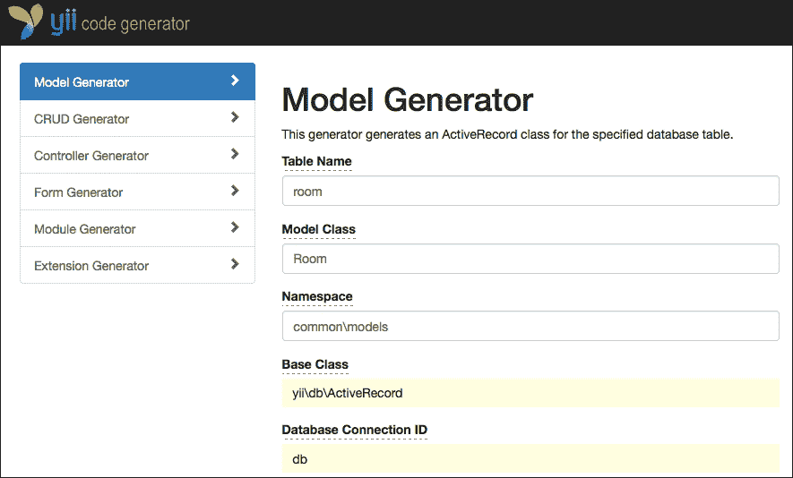
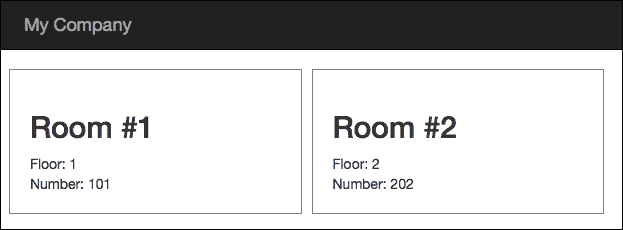

# 第九章. 前端向所有人显示房间

本章将涵盖使用模板在同一上下文中拥有多个应用的主题。

Yii 确实允许你拥有一个高级安装，能够包含多个 Yii 应用实例。因此，项目中的每个文件夹实际上都是一个全新的 Yii 应用。

我们将看到如何安装和配置项目，在它们之间共享数据，并最终自定义 URL 以使其对搜索引擎友好。

在本章中，我们将涵盖以下主题：

+   使用高级模板来分割前端和后端

+   使用 init 配置应用

    +   示例 - 创建面向公开访问的前端

+   在应用之间共享 ActiveRecord 模型

    +   示例 - 在前端网站上显示可用房间

+   在高级模板中自定义 URL

    +   示例 - 在同一域名中使用高级模板

+   如何在共享托管中使用高级模板

# 使用高级模板来分割前端和后端

到目前为止，我们看到了只有单一入口点的简单应用。然而，单一入口点对于更通用的应用来说是不够的。实际上，在高级网络应用中，我们不仅仅有一个入口点，通常有三个：前端、后端以及用作每个入口点共享区域的公共区域。

前端入口点是一个公开访问，对所有用户无限制。

另一方面，后端入口点是仅对具有管理内容管理角色的认证用户开放的受限访问。

最后，公共入口点用于在入口点之间共享数据。

想象一个预订系统，其中前端是显示房间可用性和价格的网站，而后端是管理员区域，操作员可以在此管理房间。

同样，前端和后端的另一个例子可能是一个包含公开可见新闻的前端区域和记者可以插入新闻的后端区域的报纸网站。

现在我们已经了解了前端和后端之间的区别以及它们的目的，我们将创建一个高级 Yii 应用。

安装 Yii 应用高级模板的步骤与安装基本模板的步骤类似。

### 注意

在这一点上，强烈建议拥有对主机的控制台访问权限，我们可以在此放置文件。

在网络托管中定位网站文档根目录。从它开始，我们将启动命令，在名为 `yiiadv` 的新子文件夹中创建高级应用，其中 `yiiadv` 代表使用高级模板的 Yii 安装。

我们将使用 Composer 安装 Yii 高级模板，因为这是最推荐的方式。如果我们还没有将 Composer 作为全局应用安装，现在我们可以在 `yiiadv` 文件夹中安装它。

以下是从文档根目录开始安装 Yii 高级模板的说明：

```php
$ curl -sS https://getcomposer.org/installer | php
$ php composer.phar global require "fxp/composer-asset-plugin:~1.0.0"
$ php composer.phar create-project --prefer-dist yiisoft/yii2-app-advanced yiiadv

```

通过打开`yiiadv`子文件夹，我们可以看到除了基本模板之外的一些新文件夹，如下所示：

+   `backend`：这个文件夹是项目后端应用的入口点

+   `common`：这个文件夹是包含项目其他应用通用数据的应用的入口点

+   `console`：这个文件夹是项目控制台应用的入口点

+   `frontend`：这个文件夹是项目前端应用的入口点

这种结构是开发 Web 应用的经验结果。后端和前端入口点已经被讨论过；通用入口点是一个放置所有其他应用共享数据（通用模型、组件等）的区域。

### 备注

项目中的每个应用（后端、前端、common 和控制台）在 Web 应用中被视为一个单独的命名空间。因此，当我们提到前端中的`RoomsController`时，完整的类命名空间将是`frontend/controllers/RoomsController`。

这个安装仍然是原始的，需要使用`init`命令进行初始化。然而，如果我们尝试打开这些应用中的任何一个，我们可以识别出相同的基模板结构，包括`assets`、`config`、`controllers`、`models`、`runtime`、`views`和`web`子文件夹。因此，一个基本的模板应用可以被认为是高级模板中唯一的独特应用。

最后，在高级模板属性中，每个应用的起始点始终在`web/index.php`。例如，对于前端应用，起始点是`frontend/web/index.php`。

# 使用 init 配置应用

除了有多种配置之外，在高级应用中我们还可以有多个入口点。

在高级 Web 应用中，实际上在开发阶段我们也有不同的方法。我们通常有两个环境：开发和生产。在第一个环境中，我们使用假用户、数据等进行测试，而在第二个环境中，我们必须确保项目的正常运行。

因此，我们将根据我们将工作的环境拥有不同的配置文件和参数集。

实际上，我们可能希望使用开发数据库而不是生产数据库来测试应用，或者只在特定环境中可用的特定参数。

事实上，`init`命令提供了这种能力，可以为不同的环境切换不同的配置和参数。基本上，有两个环境：开发和生产。

### 备注

需要进行一次初始化以确保项目能够运行。

`init`命令可以在交互模式和静默模式下启动。

在交互模式下，从`yiiadv`文件夹开始：

```php
$ php init

```

在非交互式（静默）模式下：

```php
$ php init --env=Development --overwrite=All

```

在这两种模式中，如果我们想覆盖所有当前的配置文件，我们只需要指定目标环境。

此命令将简单地复制所选环境（根据所选环境的类型）在相应应用文件夹中的内容，从根目录开始具有相同的名称。

例如，打开`environments/dev/backend`文件夹。我们将看到两个文件夹：`config`和`web`，包含前两个配置文件以及其他文件`index.php`和`index-test.php`。这些文件将从项目根目录开始覆盖`backend`文件夹中的相应文件。

因此，如果我们使用`init`参数启动前面的命令，`environments/dev`（`backend`、`common`、`console`和`frontend`文件夹）中的文件夹内容将被复制到项目根目录开始的`backend`、`common`、`console`和`frontend`文件夹中。

此外，使用此命令，还可以完成其他操作，例如使某些文件夹可写或将特定值应用于配置属性。然而，`init`命令主要用于切换不同的配置和`index.php`文件。

从项目的任何应用（后端、前端、通用和控制台）开始，配置值和参数是从任何应用的`index.php`文件顶部（后端、前端、通用或控制台）读取的，读取顺序如下：

+   `common/config/main.php`

+   `common/config/main-local.php`

+   `config/main.php`

+   `config/main-local.php`

这意味着`config`参数最初是从`common/config/main.php`读取的，然后是从`common/config/main-local.php`读取的，接着是从`application config/main.php`读取的，最后是从`application config/main-local.php`读取的。在读取其他配置文件的过程中，同名属性将被覆盖。

因此，如果相同的配置属性在所有四个配置文件中都有声明，其值将与`config/main-local.php`相同，这是最后被读取的配置文件。

由于我们本地有最后一次机会通过`-local`版本的文件应用对特定配置属性的差异，因此环境子文件夹的内容将仅关于特定文件的`-local`版本。例如，如果我们打开`environments/dev/backend/config path`，我们将看到只有`main-local.php`和`params-local.php`，实际上这是`index.php`将按顺序读取的最后两个文件名。

因此，如果我们更改`environments/dev/backend/config/main-local.php`中的数据库连接参数，然后使用`dev`目标环境应用`init`，此文件将覆盖`backend/config/main-local.php`。这是`backend/web/index.php`在其引导过程中最后读取的配置文件（如果我们浏览`/backend/web/index.php`）。

现在我们已经在 `dev` 环境中执行了 `init` 命令，我们可以将浏览器指向 `http://hostname/yiiadv/frontend/web`，并且我们应该看到基本模板相同的祝贺页面。

同样，后端入口点也是可用的，指向 `http://hostname/yiiadv/backend/web`，默认情况下会显示登录表单（这是因为这是一个受限区域）。

### 注意

如果我们想在项目中添加一个新的应用程序，只需将前端或后端文件夹的内容复制到项目中的另一个新文件夹中即可。

## 示例 - 创建公共访问的前端

正如我们所看到的，前端应用程序是一个指向 `http://hostname/yiiadv/frontend/web` 的可访问浏览器。

然而，在前端访问中首先要设置的是 URL 友好性定制；这是因为我们的公共网站在搜索引擎中的良好定位非常重要。

正如我们在基本模板中所做的那样，我们也可以在高级模板中渲染漂亮的 URL，遵循以下两个步骤：

1.  在 `yiiadv/frontend/web` 中创建 `.htaccess` 文件。

1.  在 `yiiadv/frontend/config/main.php` 中添加 `urlManager` 组件。

在步骤 1 中，只需在 `yiiadv/frontend/web/.htaccess` 中创建一个包含以下内容的文件即可：

```php
RewriteEngine on

# If a directory or a file exists, use it directly
RewriteCond %{REQUEST_FILENAME} !-f
RewriteCond %{REQUEST_FILENAME} !-d
# Otherwise forward it to index.php
RewriteRule . index.php
```

此代码将使网络服务器 URL 重写工作，将所有请求重写到 `yiiadv/frontend/web/index.php` 文件。

而，在步骤 2 中，我们必须在 `yiiadv/frontend/config/main.php` 中添加 `urlManager` 属性：

```php
         'urlManager' => [
            'enablePrettyUrl' => true,
            'showScriptName' => false,
        ],
```

现在，我们可以刷新网络浏览器到 `http://hostname/yiiadv/frontend/web` 并导航到顶部的 URL 链接，我们可以看到，例如，该 URL 是漂亮的格式。

我们可以将 `frontend` 文件夹视为一个 Yii 独立应用程序，并且我们可以创建控制器、视图、模型等。

# 在应用程序之间共享 ActiveRecord 模型

虽然主 Yii 项目中的每个文件夹都可以被视为一个 Yii 独立应用程序，拥有自己的控制器、模型、视图等，但传统上认为所有共享数据都位于 `common` 文件夹中。

因此，每个可以用于其他 Yii 应用程序共享模型（如 `User`、`Room`、`Reservation` 和 `Customer`）都应该插入到 `common/models` 下的 `common\models` 命名空间中。

从我的观点来看，当一个应用程序需要使用 `common/models` 中的 ActiveRecord 时，我更倾向于指向其命名空间中的扩展版本，这样我们就有机会再次为该应用程序的模型添加自定义方法或属性。

例如，考虑我们在 `common/models` 中的 `Room` 模型：

```php
<?php
namespace common\models;
class Room extends ActiveRecord
{
….
….
}
```

在后端应用程序中，我们将从公共命名空间创建 `Room` 类的空扩展：

```php
<?php
namespace backend\models;
class Room extends \common\models\Room
{
}
```

这样，我们就有可能根据需要向特定应用程序（命名空间）添加自定义方法或属性。

因此，当后端命名空间中的每个控制器、视图或模型需要引用 `Room` ActiveRecord 时，都将指向 `\backend\models\Room`。

## 示例 – 在前端网站上显示可用房间

这个示例将强调在开发阶段基本应用和高级应用之间存在的少数差异。

首先要检查数据库配置是否正确，因为我们刚刚初始化了一个高级应用。

### 注意

生成服务器上的数据库配置可以在 `common/config/main.php` 中找到，而开发服务器上的数据库配置位于 `common/config/main-local.php`，它会覆盖 `common/config/main.php` 中的配置。

打开 `common/config/main.php` 并将 `db` 属性添加到配置数组中：

```php
        'db' => [
            'class' => 'yii\db\Connection',
            'dsn' => 'mysql:host=localhost;dbname=yii_db',
            'username' => 'my_username',
            'password' => 'my_password',
            'charset' => 'utf8',   
        ],
```

根据我们的配置参数更改数据库属性（`host`、`username` 和 `password`）。

### 注意

记得注释掉 `common/config/main-local.php` 中的数据库配置，以避免覆盖配置。

这样，我们将能够完全访问之前创建的数据库和表，以及房间数据。

现在，我们准备好创建：

1.  `Room` 模型。

1.  `Rooms` 控制器。

1.  `Rooms` 控制器的索引动作视图。

第一步需要使用 Gii。默认情况下，Gii 在前端应用程序中启用基本配置（仅从本地主机）。

我们将覆盖此配置，以便从任何地方使用 Gii。因此，在前端本地配置（`frontend/config/main-local.php`）中，以下行：

```php
    $config['bootstrap'][] = 'gii';
    $config['modules']['gii'] = 'yii\gii\Module';
```

将它们替换为以下内容：

```php
    $config['bootstrap'][] = 'gii';
    $config['modules']['gii'] = [
            'class' => 'yii\gii\Module',
            'allowedIPs' => ['*']
    ];    
```

现在，我们终于可以从任何地方访问 Gii。使用浏览器，访问 `http://hostname/yiiadv/frontend/web/gii`；应该会显示一个欢迎页面。

前往 **模型生成器** 并在第一个字段 `表名` 中填写 `room`，这是我们正在创建的模型的名称，就像我们在前面的章节中所做的那样。

由于我们正在使用高级模板，模型文件（如 Gii 创建的其他对象）将创建在 `frontend` 命名空间中，或者更确切地说，在 `frontend/models` 中。

因此，有必要更改 **模型生成器** 的第一个字段 **命名空间**，从 `app/models` 切换到 `common/models`，这是公共数据共享区域：



高级模板中的 Gii 模型生成器

在 `common/models` 中，应该有一个包含 `Room` 表模型的 `Room.php` 文件。

第二步是创建控制器以及用于显示房间列表的控制器动作。

让我们在 `frontend/controllers/RoomsController.php` 下创建控制器，内容如下：

```php
<?php
namespace frontend\controllers;

use Yii;
use yii\web\Controller;
use yii\data\ActiveDataProvider;
use common\models\Room;

class RoomsController extends Controller
{
    public function actionIndex()
    {
        $dataProvider = new ActiveDataProvider([
            'query' => Room::find(),
            'pagination' => [
                'pageSize' => 20,
            ],
        ]);

        return $this->render('index', [
            'dataProvider' => $dataProvider,
        ]);
    }
}
```

确保顶部的命名空间声明是 `frontend\controllers`，因为每个网络项目中的应用程序都有自己的命名空间（在这种情况下，`frontend`）。

### 注意

我们永远不应该直接继承 `yii\web\Controller`，相反，我们应该为每个应用程序创建一个自定义控制器，例如，`frontend\controllers\BaseController`，然后从我们将创建的每个控制器中继承它。

最后，第三步是在 `frontend/views/rooms/index.php` 中创建索引操作的视图内容：

```php
<div class="row">
<?php foreach($dataProvider->getModels() as $model) { ?>
    <div class="col-md-3" style="border:1px solid gray; margin-right:10px; padding:20px;">
        <h2>Room #<?= $model->id ?></h2>
        Floor: <?= $model->floor ?>
        <br />
        Number: <?= $model->room_number; ?>
    </div>
<?php } ?>
</div>
```

这将产生以下输出，其中包含数据库中的可用数据：



前端房间可用性

# 在高级模板中自定义 URL

当在同一个项目中处理多个应用程序时，你可能需要从一个应用程序访问另一个应用程序，例如，从后端到前端链接。这是因为我们希望在插入后端数据后在前端显示公共页面渲染。

`urlManager` 属性通过引用定义它的应用程序进行自定义。然而，我们可以添加特定的属性来引用相应的应用程序。

因此，在 `common/config/main.php` 中，我们可以添加这两个属性：

```php
        'urlManagerFrontend' => [
            'class' => 'yii\web\urlManager',
            'baseUrl' => '/yiiadv/frontend/web',
            'enablePrettyUrl' => true,
            'showScriptName' => false,
        ],      

        'urlManagerBackend' => [
            'class' => 'yii\web\urlManager',
            'baseUrl' => '/yiiadv/backend/web',
            'enablePrettyUrl' => true,
            'showScriptName' => false,
        ],
```

例如，我们可以从任何地方获取前端 URL。只需编写此代码 `echo Yii::$app->urlManagerFrontend->createUrl(...)` 就可以从前端创建一个 URL。

### 注意

在每个具有 `urlManager` 配置中 `enablePrettyUrl` 属性的应用程序的 `web` 文件夹中放置 `.htaccess` 文件是必要的。

Yii 还提供了方便的应用程序路径别名，除了基本模板的默认别名之外：

+   `@common`: 这是公共目录

+   `@frontend`: 这是前端 Web 应用程序目录

+   `@backend`: 这是后端 Web 应用程序目录

+   `@console`: 这是控制台目录

## 示例 - 在同一域名中使用高级模板

我们已经看到，高级模板在同一个 Web 应用程序中创建了比我们可以通过 `/frontend` 或 `/backend` 或任何其他应用程序名称前缀在 URL 中访问到的更多应用程序。然而，对于前端来说，所有 URL 都包含 `/frontend` 前缀并不建议。

我们希望前端有这种 URL 格式：`http://hostname/yiiadv/`；而后端有这种格式：`http://hostname/yiiadv/admin`（我们可以选择我们想要的名称）。

所有请求都必须在 `/yiiadv` 文件夹级别上进行管理。因此，我们将在 `/yiiadv` 文件夹中添加一个 `.htaccess` 文件，它将转发到正确的路由。

这里是一个必须执行的操作列表：

1.  在 `/yiiadv` 中配置 `.htaccess` 以处理所有请求。

1.  配置后端应用程序以自定义其 `baseUrl`。

1.  配置前端应用程序以自定义其 `baseUrl`。

显然，步骤 2 和 3 必须为任何其他应用程序重复，对于这些应用程序，我们想要操作基本 URL。

对于步骤 1，让我们在 `/yiiadv` 文件夹中放置以下内容的 `.htaccess` 文件：

```php
RewriteEngine on
# For Backend
RewriteCond %{REQUEST_FILENAME} !-f
RewriteCond %{REQUEST_FILENAME} !-d
RewriteCond %{REQUEST_URI} ^/yiiadv/admin
RewriteRule ^admin(/.+)?$ /yiiadv/backend/web/$1 [L,PT]
# For Frontend
RewriteCond %{REQUEST_URI} !index.php
RewriteCond %{REQUEST_FILENAME} !-f
RewriteRule ^(.*)$ /yiiadv/frontend/web/$1
```

因此，在`.htaccess`的`Backend`块中，我们捕获了`/yiiadv/admin`的请求并将它们重定向到`yiiadv/backend/web/`基本 URL。

对于第 2 步，当我们在后端配置中也进行这些更改时，后端请求捕获完成，我们在`backend/config/main.php`中添加了`request`属性：

```php
        'request' => [
            // !!! insert a secret key in the following (if it is empty) - this is required by cookie validation
            'cookieValidationKey' => '2OofX7Q9e-EQLSK5BEk70_07fUXkka8y',
            'baseUrl' => '/yiiadv/admin',     
        ],
```

现在，将浏览器指向`http://hostname/yiiadv/admin`，如果我们一切操作正确，我们最终应该能够看到登录页面。

### 注意

确保在`backend/config/main-local.php`配置数组中有一个`request`属性；我们需要注释掉它，否则它将覆盖我们刚刚更改的`backend/config/main.php`文件中的`request`。

最后，就像我们对后端请求所做的那样，在第 3 步中，我们需要在配置文件`frontend/config/main.php`下更改前端请求的`request`属性：

```php
        'request' => [
            // !!! insert a secret key in the following (if it is empty) - this is required by cookie validation
            'cookieValidationKey' => 'ear8GcRjBGXQgKVwfEpbApyj7Fb0UKXk',
            'baseUrl' => '/yiiadv',     
        ],
```

现在，将浏览器指向`http://hostname/yiiadv`，如果我们一切操作正确，我们应该看到前端的成功页面。

作为本例的最后一部分，如果我们想将前端指向`http://hostname` URL，后端指向`http://hostname/admin` URL，我们必须在文档根目录中放置一个包含以下内容的`.htaccess`文件：

```php
RewriteEngine on
# For Backend
RewriteCond %{REQUEST_FILENAME} !-f
RewriteCond %{REQUEST_FILENAME} !-d
RewriteCond %{REQUEST_URI} ^/admin
RewriteRule ^admin(/.+)?$ /yiiadv/backend/web/$1 [L,PT]
# For Frontend
RewriteCond %{REQUEST_URI} !index.php
RewriteCond %{REQUEST_FILENAME} !-f
RewriteRule ^(.*)$ /yiiadv/frontend/web/$1
```

然后，我们必须在`frontend/config/main.php`中更改前端配置的`request`属性：

```php
        'request' => [
            // !!! insert a secret key in the following (if it is empty) - this is required by cookie validation
            'cookieValidationKey' => 'ear8GcRjBGXQgKVwfEpbApyj7Fb0UKXk',
            'baseUrl' => '',     
        ],
```

最后，更改`backend/config/main.php`中后端配置的`request`属性：

```php
        'request' => [
            // !!! insert a secret key in the following (if it is empty) - this is required by cookie validation
            'cookieValidationKey' => '2OofX7Q9e-EQLSK5BEk70_07fUXkka8y',
            'baseUrl' => '/admin',     
        ],
```

这样，现在前端可以通过将浏览器指向`http://hostname`来访问，后端可以通过将浏览器指向`http://hostname/admin`来访问。

# 如何在共享托管中使用高级模板

在我看来，几乎所有的应用程序都应该使用高级模板，因为它从一开始就提供了正确的项目结构，以便立即处理每个 Web 项目中出现的 frontend 和 backend。

然而，我们也看到高级模板需要控制台访问来执行安装和初始化命令。因此，如果我们有一个没有这种能力的远程托管，使用高级模板安装和 Yii 可能会很困难。

如果我们无法将控制台功能添加到远程托管，我们有两种可能性：

+   在我们可以安装我们想要和需要的东西的本地环境中创建项目；只需在本地安装一个 WAMP 或 LAMP 发行版（基于托管机的操作系统），然后启动 composer 命令安装 Yii

+   启动`init`命令以初始化项目（它可以在生产模式下从开始初始化，这样就不需要其他更改）

因此，项目已准备好上传到远程托管。请记住，项目环境处于生产模式，但以这种方式，如果我们想从开发模式切换到生产模式，我们不需要手动更改配置。

# 摘要

在本章中，我们学习了如何使用 Yii 来构建一个基于前端和后端应用的现代网络项目。我们发现了基本模板和高级模板之间的差异，并安装了我们的第一个基于高级模板的高级项目。

然后，我们使用了 `init` 命令来自定义开发或生产环境，以便使应用程序运行。然后，我们编写了一个示例，用于在前端房间列表中显示，类似于我们在之前的基本模板中所做的。

最后，我们自定义了 URL，使其在高级模板中看起来也很美观，以便在无需 URL 应用前缀的情况下引用前端和后端。我们还学习了如何在没有控制台访问权限的共享托管环境中使用高级模板。

在下一章中，我们将解释如何编写一个多语言应用程序，适应并渲染不同语言的应用程序，而无需更改源代码。
