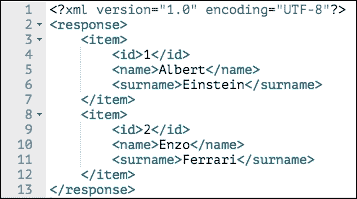
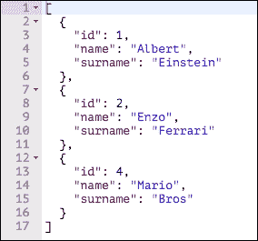
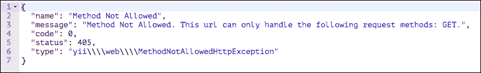
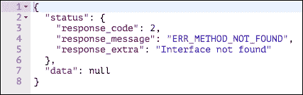
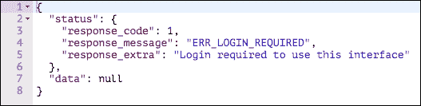
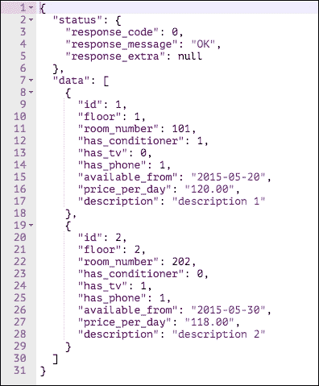
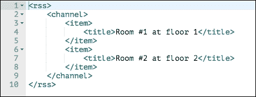

# 第十一章：创建用于移动应用程序的 API

在本章中，你将学习如何使用 Yii 2 的新集成管理创建 RESTful Web 服务。

你将学习如何创建一个新的应用程序来管理`api`环境，以及如何使用框架提供的默认基类创建控制器。

然后，我们将介绍认证方法，并教你如何自定义响应输出格式。我们还将讨论：

+   在高级模板中配置 REST 应用程序

+   创建控制器：

    +   例如：创建一个控制器来管理房间

+   认证：

    +   例如：使用认证来获取客户列表

+   新的控制器操作：

    +   例如：获取预订的房间列表

+   自定义认证和响应

    +   例如：接收数据中的状态响应节点

+   其他形式的导出 – RSS：

    +   例如：创建包含可用房间列表的 RSS

# 在高级模板中配置 REST 应用程序

在使用高级模板之前，建议配置 RESTful Web 服务，因为，正如你在前面的章节中看到的，这种配置允许你轻松地在同一项目中添加新的应用程序。

Yii 提供了许多内置功能来创建 RESTful Web 服务，它减少了实现所需的代码，并且总是以模型、控制器和动作的结构化方式实现。

它的主要功能包括：

+   在`yii\rest\ActiveController`中的默认操作（`index`、`view`、`create`、`update`、`delete`和`options`），这是建议覆盖的基本控制器

+   可从输入中选择响应格式

+   自定义认证和授权

+   缓存和速率限制

Yii 在创建 RESTful Web 服务方面应用了成熟的知识，例如如何在响应输出中呈现元数据。因此，我们尽可能遵循框架指南是明智的；这样，我们将编写易于管理的 REST API。

使用高级模板的第一件事是在同一项目中创建一个新的应用程序，例如将其重命名为`api`。Yii 没有内置创建新应用程序的功能，但只需几个步骤就可以完成这项任务。

从我们项目的根目录开始，我们将创建，以及其他应用程序（`common`、`backend`、`frontend`和`console`），一个名为`api`的新文件夹，以下命令：

```php
$ mkdir api

```

现在，进入`api`并创建这五个子文件夹：

```php
$ mkdir config
$ mkdir web
$ mkdir controllers
$ mkdir runtime

```

我们必须只为前两个文件夹创建文件，其他文件夹暂时保持为空。

### 注意

另一个可能的解决方案是从其他应用程序（如`frontend`或`backend`）复制完整内容到新的应用程序目标文件夹，然后清除无用的内容。

在`config`文件夹中，我们必须创建两个文件：`main.php`和`params.php`。第二个文件`params.php`将暂时为空，因为我们还没有任何参数要存储在其中，例如：

```php
<?php
return [
];
```

`api/config/main.php`的内容将变为：

```php
<?php
$params = array_merge(
    require(__DIR__ . '/../../common/config/params.php'),
    require(__DIR__ . '/../../common/config/params-local.php'),
    require(__DIR__ . '/params.php')
);

return [
    'id' => 'app-api',
    'basePath' => dirname(__DIR__),
    'controllerNamespace' => 'api\controllers',
    'bootstrap' => ['log'],
    'modules' => [],

    'components' => [

        'urlManager' => [
            'enablePrettyUrl' => true,
            'showScriptName' => false,
        ],        

        'user' => [
            'identityClass' => '\common\models\User',
            'enableSession' => false,
            'loginUrl' => null
        ],

        'log' => [
            'traceLevel' => YII_DEBUG ? 3 : 0,
            'targets' => [
                [
                    'class' => 'yii\log\FileTarget',
                    'levels' => ['error', 'warning'],
                ],
            ],
        ],

    ],
    'params' => $params,
];
```

然后，我们在 `web` 文件夹中创建一个 `index.php` 文件，内容如下：

```php
<?php
defined('YII_DEBUG') or define('YII_DEBUG', true);
defined('YII_ENV') or define('YII_ENV', 'dev');

require(__DIR__ . '/../../vendor/autoload.php');
require(__DIR__ . '/../../vendor/yiisoft/yii2/Yii.php');
require(__DIR__ . '/../../common/config/bootstrap.php');

$config = yii\helpers\ArrayHelper::merge(
    require(__DIR__ . '/../../common/config/main.php'),
    require(__DIR__ . '/../../common/config/main-local.php'),
    require(__DIR__ . '/../config/main.php')
);

$application = new yii\web\Application($config);
$application->run();
```

仍然在 `web` 文件夹中，我们将创建 `.htaccess` 文件来处理漂亮的 URL：

```php
RewriteEngine on

# If a directory or a file exists, use it directly
RewriteCond %{REQUEST_FILENAME} !-f
RewriteCond %{REQUEST_FILENAME} !-d
# Otherwise forward it to index.php
RewriteRule . index.php
```

最后，我们必须在 `common/config/bootstrap` 中添加一个关于 `api` 应用程序的新别名：

```php
Yii::setAlias('api', dirname(dirname(__DIR__)) . '/api');
```

我们的工作完成了，因为我们最终从头开始创建了一个全新的应用程序。

### 注意

请确保将 `runtime` 文件夹设置为可写，因为框架将在此处写入运行时数据，例如日志文件。

# 创建控制器

当我们创建新的 RESTful 网络服务控制器时，Yii 提供了两个基类：`\yii\rest\Controller` 和 `\yii\rest\ActiveController`，我们可以扩展它们。

这两个类都包含以下有用的公共特性，按执行顺序排列：

1.  根据请求所需输出的响应（内容协商器）。

1.  HTTP 方法验证。

1.  认证。

1.  速率限制。

第二类 `\yii\rest\ActiveController` 通过 ActiveRecord 添加更多功能，例如处理用户授权和一组已存在的操作：`index`、`view`、`create`、`update`、`delete` 和 `options`。

我们将看到 Yii 通过正文和 HTTP 头提供了所有必要的详细信息来获取响应状态和内容。

让我们创建一个控制器来扩展 `\yii\rest\Controller` 或者更确切地说，不使用 ActiveRecord。在 `api/controllers/TestRestController.php` 中创建一个新的控制器：

```php
<?php
namespace api\controllers;

use yii\rest\Controller;

class TestRestController extends Controller
{
    private function dataList()
    {
        return [
            [ 'id' => 1, 'name' => 'Albert', 'surname' => 'Einstein' ],
            [ 'id' => 2, 'name' => 'Enzo', 'surname' => 'Ferrari' ],
            [ 'id' => 4, 'name' => 'Mario', 'surname' => 'Bros' ]
        ];
    }

    public function actionIndex()
    {
            return $this->dataList();
    }
}
```

在前面的代码中，我们有一个 `dataList` 方法，它返回一个对象数组，还有一个 `actionIndex` 方法，它为 `TestRestController` 提供 `index` 动作并返回该列表。

### 注意

许多示例可以使用网络浏览器执行（通过使用 GET 动词请求）。然而，通常我们需要一个特定的工具来测试 RESTful 网络服务，例如 `Postman`，它是 Chrome 浏览器的一个优秀扩展，或者对于高级用户来说，可以使用 `curl` 命令。

`\yii\rest\Controller` 的第一个特性是根据请求动态安排响应输出格式，这被称为 **内容协商**。

的确，我们可以尝试在我们的浏览器中通过 `http://hostname/yiiadv/api/web/test-rest/index` 启动此请求，或者通过使用 GET 动词和将 `Accept` HTTP 头设置为 `application/xml` 的特定工具，或者使用 `curl`，如下所示：

```php
$ curl -H "Accept: application/xml" http://hostname/yiiadv/api/web/test-rest/index
<?xml version="1.0" encoding="UTF-8"?>
<response><item><id>1</id><name>Albert</name><surname>Einstein</surname></item><item><id>2</id><name>Enzo</name><surname>Ferrari</surname></item><item><id>4</id><name>Mario</name><surname>Bros</surname></item></response>

```

在这些情况下，我们将根据 XML 数据获得响应：



XML 数据响应到 test-rest/index

然而，如果我们将 `Accept` 头更改为 `application/json`，我们将根据 JSON 数据获得响应：

```php
$ curl -H "Accept: application/json" http://hostname/yiiadv/api/web/test-rest/index

[{"id":1,"name":"Albert","surname":"Einstein"},{"id":2,"name":"Enzo","surname":"Ferrari"},{"id":4,"name":"Mario","surname":"Bros"}]

```

在这些情况下，我们将根据 JSON 数据获得响应：



JSON 数据响应到 test-rest/index

根据客户端发送的 `Accept` 头，相同的数据将以不同的方式呈现。

第二个特性，HTTP 方法验证，允许您指定资源可用的动词。动词在`behaviors()`方法中定义，必须扩展以修改此设置：

```php
    public function behaviors()
    {
        $behaviors = parent::behaviors();
        $behaviors['verbs'] = [
                'class' => \yii\filters\VerbFilter::className(),
                'actions' => [
                    'index'  => ['get'],
                ],
        ];
        return $behaviors;
    }
```

在这种情况下，我们只将 GET 动词设置为`index`操作，因为`behaviors['verbs']`的`actions`属性的键是操作，值是一个包含支持的 HTTP 方法的数组。

如果我们使用 GET 动词（作为浏览器请求）启动`http://hostname/yiiadv/api/web/test-rest/index`，我们将继续显示结果。然而，如果我们将 HTTP 方法更改为 POST 动词，例如，我们将得到异常错误：



使用错误的动词引发的异常错误

这是因为只有 GET 动词支持`index`操作。

在下一节中，我们将解释第三个和第四个特性，即身份验证和速率限制。

## 示例 - 创建一个用于管理房间的控制器

在这个例子中，我们将应用上一章中处理的概念，在这种情况下，使用`\yii\rest\ActiveController`作为基类而不是`\yii\rest\Controller`，因为我们打算使用 ActiveRecord 类来操作数据。

在`api/controllers/RoomsController.php`中创建一个新的控制器：

```php
<?php
namespace api\controllers;

use yii\rest\ActiveController;

class RoomsController extends ActiveController
{
    public $modelClass = 'common\models\Room';
}
```

此控制器隐式包含以下操作：

+   `actionIndex`返回模型列表，只能通过 GET 和 HEAD HTTP 方法访问

+   `actionView`返回关于模型的详细信息，通过传递`id`参数，只能通过 GET 和 HEAD HTTP 方法访问

+   `actionCreate`用于创建新模型，只能通过 POST HTTP 方法访问

+   `actionUpdate`用于更新现有模型，只能通过 PUT 和 PATCH HTTP 方法访问

+   `actionDelete`用于删除现有模型，只能通过 DELETE HTTP 方法访问

+   返回允许的 HTTP 方法的`actionOptions`

现在，让我们尝试启动所有这些方法。

使用 GET 方法在`http://hostname/yiiadv/api/web/rooms`上启动`actionIndex`：

```php
[
{
    "id": 1,
    "floor": 1,
    "room_number": 101,
    "has_conditioner": 1,
    "has_tv": 0,
    "has_phone": 1,
    "available_from": "2015-05-20",
    "price_per_day": "120.00",
    "description": "description 1"

},

    {
        "id": 2,
        "floor": 2,
        "room_number": 202,
        "has_conditioner": 0,
        "has_tv": 1,
        "has_phone": 1,
        "available_from": "2015-05-30",
        "price_per_day": "118.00",
        "description": "description 2"
    }
]
```

我们将以 JSON 对象的数组形式以及 HTTP 头部、成功状态码和分页详情获取数据库中的所有记录：

```php
X-Pagination-Current-Page: 1
X-Pagination-Page-Count: 1
X-Pagination-Per-Page: 20
X-Pagination-Total-Count: 2
```

如果我们使用 HEAD HTTP 方法启动相同的 URL，我们只会得到没有主体的 HTTP 头部响应，因此我们只会得到分页信息。

最后，如果我们使用不支持 HTTP 方法（例如 PUT 方法）启动相同的 URL，我们将得到两个重要的 HTTP 头部：

+   将`状态码`头设置为`405 方法不允许`

+   将`Allow`头设置为`GET, HEAD`

`状态码`头表明不支持该方法，而`Allow`头返回对该操作支持的 HTTP 方法列表。

现在，使用 GET 方法在`http://hostname/yiiadv/api/web/rooms/view?id=1`上启动`actionView`：

```php
{
  "id": 1,
  "floor": 1,
  "room_number": 101,
  "has_conditioner": 1,
  "has_tv": 0,
  "has_phone": 1,
  "available_from": "2015-05-20",
  "price_per_day": "120.00",
  "description": "description 1"
}
```

如果我们尝试使用 GET 方法启动一个不存在的 ID，例如`http://hostname/yiiadv/api/web/rooms/view?id=100`，我们将得到以下响应体：

```php
{
  "name": "Not Found",
  "message": "Object not found: 100",
  "code": 0,
  "status": 404,
  "type": "yii\\\\web\\\\NotFoundHttpException"
}
```

HTTP `状态码` 标头将被设置为 `404 Not Found` 以指定请求的项目（`id=100`）不存在。仅使用 HEAD HTTP 方法，我们将从设置为 `404` 的 HTTP `状态码` 获取信息。`Create` 和 `Update` 动作要求客户端发送要创建或更新的对象的正文内容。

默认情况下，Yii 只识别 `application/x-www-form-urlencoded` 和 `multipart/form-data` 输入格式。为了启用 JSON 输入格式，我们需要在 `api/config/main.php` 文件中配置请求应用程序组件的 `parsers` 属性：

```php
'request' => [
    'parsers' => [
        'application/json' => 'yii\web\JsonParser',
    ]
]
```

在配置 JSON 输入解析器后，我们可以使用 POST HTTP 方法调用 `http://hostname/yiiadv/api/web/rooms/create` 来创建一个新的房间，并传递例如以下 JSON：

```php
    {
        "floor": 99,
        "room_number": 999,
        "has_conditioner": 1,
        "has_tv": 1,
        "has_phone": 1,
        "available_from": "2015-12-30",
        "price_per_day": "48.00",
        "description": "description room 999"
    }
```

如果没有发生错误，我们将得到：

```php
201 Created as HTTP Header Status Code
Object just created as body content

```

如果缺少一些必需的字段并且存在验证错误，我们将得到：

```php
422 Data Validation Failed
An array of field-message to indicate which validation errors occurred

```

对于更新操作，也需要做同样的事情，在这种情况下，然而，我们将调用 `http://hostname/yiiadv/api/web/rooms/update` 并使用 PUT 或 PATCH HTTP 方法传递 `id` URL 参数。在这种情况下，只有 HTTP 标头状态码 `200 OK` 才是成功的响应，并且更新对象将作为正文内容返回。

最后，通过调用 `http://hostname/yiiadv/api/web/rooms/delete` 并传递 `id` URL 参数，使用 DELETE HTTP 方法来使用 `actionDelete`。成功的执行将返回 `204 No Content` 作为 HTTP 状态码；否则，它将是 `404 Not Found`。

# 认证

有三种认证方式：

+   **HTTP 基本认证** (`HttpBasicAuth` 类): 此方法使用 WWW-Authenticate HTTP 标头为每个请求发送用户名和密码

+   **查询参数** (`QueryParamAuth` 类): 此方法使用作为 API URL 查询参数传递的访问令牌

+   **OAuth 2** (`HttpBearerAuth` 类): 此方法使用由消费者从授权服务器获取的访问令牌，并通过 HTTP 承载令牌发送到 API 服务器

Yii 支持所有提到的方法，但我们也可以轻松地创建一个新的方法。

要启用认证，请按照以下步骤操作：

1.  在配置中配置用户应用程序组件，将 `enableSession` 设置为 `false` 以确保用户认证状态在请求之间不持久化使用会话。接下来，将 `loginUrl` 设置为 `null` 以显示 HTTP 403 错误而不是将其重定向到登录页面。

1.  指定我们想要使用的认证方法，在 API 控制器类中配置 `authenticator` 行为。

1.  在用户身份类中实现 `yii\web\IdentityInterface::findIdentityByAccessToken()`。

    ### 注意

    第一步确保 REST 请求确实是无状态的，但如果您需要持久化或存储会话数据，则可以跳过此步骤。

第一步可以在 `api/config/main.php` 中配置：

```php
    'components' => [
            ...
        'user' => [
            'identityClass' => 'common\models\User',
            'enableSession' => false,
            'loginUrl' => null
        ],
];
```

第二步要求我们扩展 `behaviors()` 控制器方法，指定一个单独的认证器：

```php
public function behaviors()
{
    $behaviors = parent::behaviors();
    $behaviors['authenticator'] = [
        'class' => yii\filters\auth\HttpBasicAuth::className(),
    ];
    return $behaviors;
}
```

或者我们可以通过指定多个认证器来完成这个操作：

```php
public function behaviors()
{
    $behaviors = parent::behaviors();
    $behaviors['authenticator'] = [
        'class' => yii\filters\auth\CompositeAuth::className(),
        'authMethods' => [
            yii\filters\auth\HttpBasicAuth::className(),
            yii\filters\auth\HttpBearerAuth::className(),
            yii\filters\auth\QueryParamAuth::className(),
        ],
    ];
    return $behaviors;
}
```

最后，步骤 3 需要实现配置文件中指定的 `identityClass` 的 `findIdentityByAccessToken()`。

在一个简单场景中，访问令牌可以存储在 `User` 表的列中，然后检索：

```php
    public static function findIdentityByAccessToken($token, $type = null)
    {
        return static::findOne(['access_token' => $token]);
    }
```

在配置的末尾，每个请求都会尝试在相同控制器的 `beforeAction()` 方法中认证用户。

现在，让我们看看第一种认证方法，`HTTPBasicAuth`。此方法要求我们将 `auth` 属性设置为可调用的 PHP 函数；如果没有设置，则将使用用户名作为传递给 `\yii\web\User::loginByAccessToken()` 方法的访问令牌。

`HttpBasicAuth` 认证的基本实现是：

```php
public function behaviors()
{
    $behaviors = parent::behaviors();
    $behaviors['authenticator'] = [
            'class' => yii\filters\auth\HttpBasicAuth::className(),
           'auth' => function($username, $password) {
            // return null or identity interface
    // For example search by username and password
    return \common\models\User::findOne(['username' => $username, 'password' => $password);
           }

           /*
           'auth' => [$this, 'httpBasicAuthHandler'],
           */
    ];
    return $behaviors;
}

public function httpBasicAuthHandler($username, $password)
{
    // For example search by username and password
    return \common\models\User::findOne(['username' => $username, 'password' => $password]);
}
```

存储在 `auth` 属性中的可调用 PHP 函数可以表示为一个内联函数，或者作为一个数组，其中第一个值是对象，第二个是要调用的函数名，通过传递 `$username` 和 `$password` 参数。

检查 PHP 通过 `phpinfo()` 的运行情况。如果您显示 CGI/FCGI，那么您需要在 `.htaccess` 中添加 `SetEnvIf Authorization .+ HTTP_AUTHORIZATION=$0` 以使用 HTTP Auth 从 PHP。

第二种认证方法是查询参数，通过使用 `QueryParamAuth` 类。使用此方法，必须将名为 `access-token` 的查询参数传递到 URL。然后，它将调用 `\yii\web\user::loginByAccessToken()` 方法，将 `access-token` 作为第一个参数传递。此函数将返回 `IdentityInterface` 或 `null`。

可以使用 `tokenParam` 在认证声明中更改 URL 参数的名称：

```php
public function behaviors()
{
    $behaviors = parent::behaviors();
    $behaviors['authenticator'] = [
            'class' => yii\filters\auth\QueryParamAuth::className(),
           'tokenParam' => 'myAccessToken'
    ];
    return $behaviors;
}
```

使用此配置，URL 必须是 `http://hostname/url?myAccessToken=...`

最后一种认证方法是 OAuth 2，它需要一个授权服务器，从该服务器我们将获取用于传递给 REST API 服务器的载体令牌，这与 `QueryParamAuth` 类似。

## 示例 - 使用认证获取客户列表

在这个例子中，我们将同时使用两种方法进行认证：`HTTPBasicAuth` 和 `QueryParamAuth`。当使用 `QueryParamAuth` 并带有访问令牌时，我们首先调用一个公开可访问的操作来获取用户将传递给所有其他操作的访问令牌作为查询 URL 参数。

我们将首先从 `Customer` 数据库表创建一个新的模型，并将其放入 `common/models` 文件夹中。然后，我们将使用 `foo` 作为用户名，`$2a$12$xzGZB29iqBHva4sEYbJeT.pq9g1/VdjoD0S67ciDB30EWSCE18sW6` 作为密码（这相当于散列后的文本）在 `User` 数据库表中创建一个新的用户。

在 `api/controllers/CustomersController.php` 中创建一个新的控制器，该控制器只扩展 `behaviors()` 方法以实现 `HTTPBasicAuth` 和 `QueryParamAuth`：

```php
<?php
namespace api\controllers;

use yii\rest\ActiveController;
use yii\filters\auth\CompositeAuth;
use yii\filters\auth\HttpBasicAuth;
use yii\filters\auth\QueryParamAuth;

class CustomersController extends ActiveController
{
  public $modelClass = 'common\models\Customer';

  public function behaviors()
  {
    $behaviors = parent::behaviors();

    $behaviors['authenticator'] = [
      'class' => CompositeAuth::className(),
      'authMethods' => [
        [
          'class' => HttpBasicAuth::className(),
          'auth' => function($username, $password)
          {
            $out = null;
            $user = \common\models\User::findByUsername($username);
            if($user!=null)
            {
              if($user->validatePassword($password)) $out = $user;
            }
            return $out;
          }
        ],
        [
           'class' => QueryParamAuth::className(),
        ]
      ]
    ];

   return $behaviors;
  }
}
```

在`HTTPBasicAuth`中，我们通过检查`$username`并在配置数组中实现`auth`属性来验证密码。如果用户名和密码匹配，它将返回找到的用户或否则返回 null。

相反，`QueryParamAuth`不需要除类以外的任何属性，因为我们将以`access-token`作为查询参数名称。尽管如此，为了完成这个任务，我们需要一个操作，该操作在传递用户名和密码后返回相关用户的访问令牌。

为了这个目的，我们将添加`actionAccessTokenByUser()`方法，该方法查找带有`$username`和`$password`参数的用户。如果用户已经存在，其`access_token`属性将使用随机字符串更新，因此每次调用此操作时，`access_token`都会更改，上一个将被取消：

```php
    public function actionAccessTokenByUser($username, $passwordHash)
    {
        $accessToken = null;

        $user = \common\models\User::findOne(['username' => $username, 'password_hash' => $passwordHash]);
        if($user!=null)
        {
            $user->access_token = Yii::$app->security->generateRandomString();
            $user->save();
            $accessToken = $user->access_token;
        }        
        return [ 'access-token' => $accessToken ];
    }
```

最后，为了测试`HTTPBasicAuth`，我们需要通过调用`http://hostname/yiiadv/api/web/customers/index` URL 来传递 WWW-Authentication 头。

如果我们想使用`QueryParamAuth`，我们需要：

+   通过传递用户名和散列密码从`http://hostname/yiiadv/api/web/customers/access-token-by-user`获取`access-token`

+   通过传递从上一个请求中接收到的访问令牌属性值，调用`http://hostname/yiiadv/api/web/customers/index?access-token`

`QueryParamAuth`调用`IdentityInterfaces`（用户模式）的`findIdentityByAccessToken()`函数。因此，请检查该方法是否已实现，如果没有，按照以下方式实现它：

```php
public static function findIdentityByAccessToken($token, $type = null)
    {
    return User::findOne(['access_token' => $token]);
    }
```

注意，这种使用访问令牌的方式允许同时只使用相同的凭据使用 REST API。这是因为每次调用`access-token-by-user`时，都会创建一个新的`access-token`。因此，应该创建用户和`access-token`之间的一对多关系，以便为多个客户端提供使用相同的用户名/密码凭据的访问。

# 新的控制器操作

向 REST API 控制器添加新操作非常简单。我们只需要记住在 Web 控制器中的三个区别：

+   新操作的动词设置

+   验证新操作的设置

+   新操作的输出

前两个步骤在控制器的`behaviors()`方法中配置：

```php
    public function behaviors()
    {
        $behaviors = parent::behaviors();
        $behaviors['verbs'] = [
                'class' => \yii\filters\VerbFilter::className(),
                'actions' => [
                    'myCustomAction'  => ['get', 'head'],
                ],
        ];

        $behaviors['authenticator'] = [
        'except' => 'myCustomAction',
            'class' => HttpBasicAuth::className(),
        ];

        return $behaviors;
    }

public function actionMyCustomAction()
{
    …
    …

}
```

在`behaviors()`方法的第一个部分，我们只会将`get`和`head` HTTP 方法设置为调用`myCustomAction`操作。如果我们尝试使用其他 HTTP 方法调用此操作，我们将得到一个不支持异常。

在`behaviors()`方法的最后部分，我们将设置`myCustomAction`没有认证，因为它在`except`属性中。

新操作的第三个区别，输出，表明我们有不同的方式来返回数据。我们可以使用：

+   从头开始创建单个对象的关键值对数组

+   ActiveRecord 实例用于创建单个对象

+   ActiveRecord 数组用于创建对象列表

+   数据提供者

在最后这种情况中，框架将自动输出分页信息和链接到其他页面（如果有的话）。

## 示例 - 获取预订的房间列表

在这个例子中，我们需要在 `common/models` 文件夹中使用 Gii 创建一个 `Reservation` 模型。

然后，我们在 `api/controllers/ReservationsController.php` 中创建一个新的控制器：

```php
<?php
namespace api\controllers;

use Yii;
use yii\rest\ActiveController;
use yii\filters\auth\CompositeAuth;
use yii\filters\auth\HttpBasicAuth;
use yii\filters\auth\QueryParamAuth;

class ReservationsController extends ActiveController
{
    public $modelClass = 'common\models\Reservation';

    public function actionIndexWithRooms()
    {
        $reservations = \common\models\Reservation::find()->all();

        $outData = [];
        foreach($reservations as $r)
        {
            $outData[] = array_merge($r->attributes, ['room' => $r->room->attributes]);
        }
        return $outData;        
    }

}
```

现在，让我们调用 `http://hostname/yiiadv/api/web/reservations/index-with-rooms`，我们将显示一个预订列表，其中每个预订的 `room` 属性都与相关的房间对象内容一起展开。

### 注意

请注意确保 `room` 关系已在 `Reservation` 模型中存在。如果没有，我们必须将此关系添加到 `Reservation` 模型中：

```php
    public function getRoom()
    {
        return $this->hasOne(Room::className(), ['id' => 'room_id']);
    }
```

然而，这个解决方案效率不高，因为我们总是获取所有行，如果行数太多，这可能会对我们来说成本过高。为了解决这个问题，我们可以使用从找到的一组数据创建的数据提供程序，或者更好的是，使用 Yii 自动提供的更简单的解决方案。

事实上，Yii 提供了一些简单的方法来显示关系和过滤返回字段。例如，可能有一些我们不希望显示的字段，如密码、私人数据等。

模型有这些方法：

+   `fields()`: 默认情况下，扩展 `yii\base\Model::fields()` 的类返回所有模型属性作为字段，而扩展 `yii\db\ActiveRecord::fields()` 的类仅返回已从数据库中填充的属性

+   `extraFields()`: 默认情况下，扩展 `yii\base\Model::extraFields()` 的类返回空值，而扩展 `yii\db\ActiveRecord::extraFields()` 的类返回已从数据库中填充的关系的名称

第一种方法，`fields()`，是一个键值数组，其中键是返回字段的名称。如果返回的内容与键具有相同的名称，则值可以为空；也可以是一个表示从哪个属性获取返回值的字符串，或者是一个可调用的 PHP 函数来操作返回值。

第二种方法，`extraFields()`，是一个字符串数组，其值是在模型类中定义的关系。

最后，为了动态过滤请求的字段，我们将 `fields` 参数附加到请求的 URL 上，并将 `expand` 参数用于从模型获取关系列表。

因此，如果我们调用 `http://hostname/yiiadv/api/web/reservations/index?expand=room`，我们将得到相同的结果，但我们还将拥有仅对该页面必要的分页和加载的模型。

然而，对我们来说，分发不带特殊参数的 URL 会更方便，例如 `expand` 和 `fields`，例如，为了避免使用这些 API 的开发者之间的混淆。

我们可以使用 `actionIndexWithRooms` 作为 `actionIndex` 的包装器，并以此方式包含展开参数：

```php
    public function actionIndexWithRooms()
    {
            $_GET['expand'] = 'room';
            return $this->runAction('index');
    }
```

使用这个解决方案，`http://hostname/yiiadv/api/web/reservations/index-with-rooms` URL 只是 `http://hostname/yiiadv/api/web/reservations/index?expand=room` 的包装器，但这阻止了开发者记住需要传递哪些参数到 URL 以获取响应中的必要节点。

# 自定义身份验证和响应

Yii 允许我们快速为我们的应用程序创建自定义的身份验证方法。这很有用，因为在某些情况下，之前提到的身份验证方法是不够的。

通过扩展 `yii\filters\auth\AuthMethod` 类来创建自定义身份验证模型，该类实现了 `yii\filters\auth\AuthInterface`，需要重写 `authenticate` (`$user`, `$request`, 和 `$response`) 方法：

```php
<?php

namespace api\components;

use yii\filters\auth\AuthMethod;
use Yii;

class CustomAuthMethod extends AuthMethod {

    public function authenticate($user, $request, $response) {
    …
    …
    …
}
…
…
…
}
```

尽管 REST API 应该是无状态的，或者说不应该保存会话数据，但在会话期间跨请求存储一些信息或首选项可能是必要的。

因此，如果我们需要支持会话，我们可以通过在 `beforeAction()` 事件中调用的 `authenticate()` 方法来启动会话。想法是使用 `QueryParamAuth`，使用 `access-token` 作为会话 ID 来标识当前会话。

为了这个目的，我们将在 `api\components` 中创建一个新的文件夹来存储自定义的 `SessionAuth` 方法。

这是 `api/components/SessionAuth.php` 文件的内容，其中查询 URL 参数被命名为 `sid`：

```php
<?php

namespace api\components;

use yii\filters\auth\AuthMethod;
use Yii;

class SessionAuth extends AuthMethod {
  public $tokenParam = 'sid';

  public function authenticate($user, $request, $response) {
    $accessToken = $request->get($this->tokenParam);

    if (is_string($accessToken)) {

       Yii::$app->session->id = $accessToken;

       $identity = isset(Yii::$app->session['loggedUser'])?Yii::$app->session['loggedUser']:null;

          if ($identity !== null) {
             return $identity;
          }
    }
    if ($accessToken !== null) {
        $this -> handleFailure($response);
    }
    return null;
  }

}
```

同时，创建一个用于启动会话的操作也是必要的；否则，用户将不会被存储在会话中。

因此，在 `api/controllers/UsersController.php` 中创建一个新的控制器 `UsersController` 来处理登录：

```php
<?php
namespace api\controllers;

use Yii;
use yii\rest\ActiveController;
use yii\filters\auth\CompositeAuth;
use yii\filters\auth\HttpBasicAuth;
use yii\filters\auth\QueryParamAuth;
use api\components\SessionAuth;
use common\models\User;

class UsersController extends ActiveController
{
    public $modelClass = 'common\models\User';

    public function behaviors()
    {
        $behaviors = parent::behaviors();

        $behaviors['authenticator'] = [
                'except' => ['login'],
                'class' => SessionAuth::className(),
        ];

        return $behaviors;
    }    

    public function actionLogin($username, $passwordHash)
    {
        $dataOut = null;

        $user = User::findOne(['username' => $username, 'password_hash' => $passwordHash]);
        if($user != null)
        {
            $session = Yii::$app->session;
            $session->open();

            $session['loggedUser'] = $user;

            $sid = $session->id;

            $dataOut = ['sid' => $sid];        
        }

        return $dataOut;
    }
}
```

如前所述，在 `behaviors()` 方法中，除了 `login` 之外，这个控制器的所有操作都将对 `SessionAuth` 组件进行身份验证，该组件主要检查用户是否成功执行了登录操作。

我们现在调用 `http://hostname/yiiadv/api/web/users/login?username=&passwordHash=` 并填写 `username` 和 `passwordHash` 字段。它返回会话 ID 以访问会话数据。此外，会话中的 `loggedUser` 属性会填充用户模型数据。

现在，我们可以像典型的 Web 应用程序一样在请求之间存储共享信息。

现在，让我们看看如何在 RESTful Web 服务中自定义响应。首先，当我们需要添加额外的信息时，例如在客户端显示的显式错误消息或操作状态码，这个操作可能是必要的。

自定义响应必须扩展 `\yii\web\Response` 并重写 `send()` 方法，如下所示：

```php
<?php
namespace api\components;

use yii\rest\ActiveController;
use Yii;
use yii\web\Response;

class ApiResponse extends \yii\web\Response
{

    public function send()
    {
      ..
  ..
  ..
  }
}
```

这个 `send()` 方法操作对象属性中存储的数据，主要在 `$this->data` 变量中。

这种定制，我们将在下一个示例中详细看到，是不完整的，因为 `send()` 方法应该实现从 `\yii\web\Response` 版本所做的所有数据操作。我们必须记住，Yii 根据客户端传递的 `Accept` HTTP 头返回数据，以及许多其他便利的功能。

可以通过在从 `send()` 函数返回之前调用 `parent::send()` 来简单地保持这种行为，如下所示：

```php
    public function send()
    {
        ..
  ..
        parent::send();
 }
```

因为，如前所述，`send()` 使用 `$this->data` 变量作为发送数据的容器。

## 示例 - 数据接收中的状态响应节点

现在，让我们将前一章中看到的概念应用于向响应中添加额外数据。当我们需要向客户端返回有关操作状态和额外数据（如详细错误消息）的信息时，这种做法很有用。

本例的目的是返回包含两个属性的响应：

+   包含三个属性的 `status` 属性：`response_code`，表示操作状态的整数值；`response_message`，表示 `response_code` 的字符串值；以及 `response_extra`，表示自定义文本字符串。

+   包含预期输出数据的 `data` 属性

我们将使用一个包含所有整数代码及其文本表示的类作为响应代码，因为整数值将用于填充 `response_code` 属性，而字符串表示将用于填充 `response_message` 属性。

在 `api/components/ApiResponseCode.php` 中创建一个新的类文件，内容如下：

```php
<?php
namespace api\components;

class ApiResponseCode
{
    const ERR_OK = 0;
    const ERR_LOGIN_REQUIRED = 1;
    const ERR_METHOD_NOT_FOUND = 2;
    const ERR_NOT_FOUND = 3;
    const ERR_NOT_SAVED = 4;
    const ERR_DUPLICATE = 5;
    const ERR_INPUT_DATA_FORMAT = 6;

    public static function responsesExtras()
    {
        return [
            ApiResponseCode::ERR_OK => '',
            ApiResponseCode::ERR_LOGIN_REQUIRED => 'Login required to use this interface',
            ApiResponseCode::ERR_METHOD_NOT_FOUND => 'Interface not found',
            ApiResponseCode::ERR_NOT_FOUND => 'Record not found',
            ApiResponseCode::ERR_NOT_SAVED => 'Error in saving',
            ApiResponseCode::ERR_DUPLICATE => 'Duplicated record',
            ApiResponseCode::ERR_INPUT_DATA_FORMAT => 'Input data format incompatible',
        ];        
    }

    public static function responseExtraFromCode($rc)
    {
        $al = ApiResponseCode::responsesExtras();
        return (isset($al[$rc]))?$al[$rc]:null;
    }     

    public static function responseMessages()
    {
        return [
            ApiResponseCode::ERR_OK => 'OK',
            ApiResponseCode::ERR_LOGIN_REQUIRED => 'ERR_LOGIN_REQUIRED',
            ApiResponseCode::ERR_METHOD_NOT_FOUND => 'ERR_METHOD_NOT_FOUND',
            ApiResponseCode::ERR_NOT_FOUND => 'ERR_NOT_FOUND',
            ApiResponseCode::ERR_NOT_SAVED => 'ERR_NOT_SAVED',
            ApiResponseCode::ERR_DUPLICATE => 'ERR_DUPLICATED',
            ApiResponseCode::ERR_INPUT_DATA_FORMAT => 'ERR_INPUT_DATA_FORMAT',
        ];        
    }

    public static function responseMessageFromCode($rc)
    {
        $al = ApiResponseCode::responseMessages();
        return (isset($al[$rc]))?$al[$rc]:null;
    }            
}
```

在此组件中，我们定义了一个表示所有可以发送给客户端的响应代码的常量列表。对于每个响应代码，`responseMessage()` 静态方法将返回一个相对文本表示。然后，`responseExtras()` 方法还将返回一个额外的文本消息数组，如果没有传递特定的文本 `extra`，它将填充 `response_extra` 属性。

最后，我们必须在 `api/components/ApiResponse.php` 中编写一个扩展 `\yii\web\Response` 的组件，命名为 `ApiResponse`。在这个组件中，我们将定义三个自定义属性：`statusResponseCode`、`statusResponseMessage` 和 `statusResponseExtra`，我们将用 `status` 属性中的内容来填充它们。

这样，我们将有一个基于 `$code` 参数的便利方法 `fillStatusResponse()`，它将自动填充 `statusResponseExtra` 和 `statusResponseMessage` 属性。

此组件的核心是重写的 `send()` 方法，它将默认返回 `status`，其中包含 `ERR_OK` 作为响应消息和 `0` 作为响应代码，如果没有客户端错误（如认证、未找到等）。除非开发者更改 `statusResponseCode`、`statusResponseExtra` 和 `statusResponseMessage` 的值，或者手动或自动调用其属性 `fillStatusResponse()`，否则情况如此。

否则，如果存在一些客户端错误，我们将支持 `未认证` 和 `未找到` 错误。

这是 `api/components/ApiResponse.php` 文件的内容：

```php
<?php
namespace api\components;

use Yii;
use yii\web\Response;

class ApiResponse extends Response
{
    public $statusResponseCode;
    public $statusResponseMessage;
    public $statusResponseExtra;

    /**
     * Set response code and extra from code.
     *
     * Response extra will be filled based on $extraData value
     * If $extraData is null, response extra will be value from ApiResponseCode::responseExtraFromCode($code)
     * If $extraData is string, response extra will be filled with this value
     */
    public function fillStatusResponse($code, $extraData=null)
    {
        $responseExtra = ApiResponseCode::responseExtraFromCode($code);
        $responseMessage = ApiResponseCode::responseMessageFromCode($code);

        if($extraData == null)
        {
            $statusResponseExtra = $responseExtra;
        }
        else
        {
            $statusResponseExtra = $extraData;
        }

        $this->statusResponseCode = $code;
        $this->statusResponseMessage = $responseMessage;
        $this->statusResponseExtra = $statusResponseExtra;
    }

    /**
     * Override send() method.
     *
     * $this->data member contains data released to client.
     */
    public function send()
    {
        $responseMessage = ApiResponseCode::responseMessageFromCode($this->statusResponseCode);

        if($this->isClientError)
        {
           $dataOut = $this->data;

           if($this->statusCode == 401) {   // Not authorized
             $dataOut = null;

             $this->fillStatusResponse(ApiResponseCode::ERR_LOGIN_REQUIRED);
            }
            else if($this->statusCode == 404) {  // Non found
                $dataOut = null;

                $this->fillStatusResponse(ApiResponseCode::ERR_METHOD_NOT_FOUND);
            }            

            $this->data = ['status' => ['response_code' => $this->statusResponseCode, 'response_message' => $this->statusResponseMessage, 'response_extra' => $this->statusResponseExtra ], 'data' => $dataOut ];

        }
        else
        {
            $this->data = ['status' => ['response_code' => $this->statusResponseCode, 'response_message' => $responseMessage, 'response_extra' => $this->statusResponseExtra ], 'data' => $this->data ];
        }

        parent::send();
    }

    public function init()
    {
        parent::init();

        $this->statusResponseCode = ApiResponseCode::ERR_OK;
    }

}
```

最后，我们必须通过添加 `response` 属性作为组件来更改配置文件 `api/config/main.php`，以指示使用自定义响应类：

```php
        'response' => [

            'format' => yii\web\Response::FORMAT_JSON,
            'charset' => 'UTF-8',
            'class' => '\api\components\ApiResponse',

        ],
```

让我们尝试一下。尝试调用不存在的 URL `http://hostname/yiiadv/api/web/reservations/index-inexistent`。

这将是输出，正确地返回空数据和带有错误说明的状态：



调用不存在的 URL 后的错误响应

然后，尝试调用需要认证的 URL：`http://hostname/yiiadv/api/web/customers/index`，这已经在之前的段落中实现了。

这将是输出，正确地返回空数据和带有错误说明的状态：



调用带认证的 URL 时的错误响应

最后，我们尝试调用返回数据的 URL：`http://hostname/yiiadv/api/web/rooms/index`，这已经在之前的段落中实现了。

这将是输出，正确地返回填充的数据和成功状态：



成功输出的响应

# 其他形式的导出 – RSS

Yii 允许我们创建自定义格式响应以输出数据。响应格式可以根据客户端发送的 `Accept` HTTP 头部值进行更改，或者通过程序化方式完成。当 Yii 收到请求时，它会根据 `Accept` HTTP 头部值搜索可用的响应格式化程序，并最终调用找到的响应格式化程序的 `format` (`$response`) 方法。

因此，创建自定义响应有三个步骤：

1.  实现 `yii\web\ResponseFormatterInterface` 接口。

1.  在配置文件中添加新的自定义格式化响应属性。

1.  扩展控制器的 `behaviors()` 方法以处理特定的 `Accept` HTTP 头部值。

第一步要求我们实现 `yii\web\ResponseFormatterInterface` 接口并扩展其方法 `format` (`$response`)。要格式化的数据存储在 `$response->data` 属性中，客户端的响应必须在 `$response->content` 属性中填写：

```php
<?php
namespace api\components;

use yii\web\ResponseFormatterInterface;

class RssResponseFormatter implements ResponseFormatterInterface
{
    public function format($response)
    {
        $response->getHeaders()->set('Content-Type', 'application/rss+xml; charset=UTF-8');
        if ($response->data !== null) {
            $response->content = "<rss></rss>";
        }
    }
}
```

第二步要求我们添加对自定义响应格式化程序的引用。为此，我们将使用 `response` 的 `formatters` 属性，它是一个数组，键是格式名称，数组值是创建格式化对象对应的配置：

```php
         'response' => [
            'formatters' => [

                'rss' => [
                    'format' => 'raw',
                    'charset' => 'UTF-8',
                    'class' => '\api\components\RssResponseFormatter',
                ],                

            ]

        ],             
```

第三步要求我们扩展控制器的 `behaviors()` 方法，以便处理特定的 `Accept` HTTP 头部值，并根据 `Accept` HTTP 头部值指示框架使用哪个响应格式化程序，例如：

```php
    public function behaviors()
    {
        $behaviors = parent::behaviors();
        $behaviors['contentNegotiator']['formats']['application/rss+xml'] = 'rss';
        return $behaviors;
    }    
```

当客户端发送一个将 `Accept` HTTP 头设置为 `application/rss+xml` 的请求时，这个控制器将使用 `rss` 格式化器（从配置文件中读取）来准备响应。如果我们指定一个配置文件中不存在的格式化器，我们将得到 `InvalidConfigException`。

## 示例 - 使用可用房间列表创建 RSS

现在，让我们看看如何为可用房间创建 RSS 响应格式化器。

首先，我们必须在 `api/components/RssResponseFormatter.php` 中创建完整的响应格式化器组件：

```php
<?php
namespace api\components;

use yii\web\ResponseFormatterInterface;

class RssResponseFormatter implements ResponseFormatterInterface
{
    public function format($response)
    {
        $response->getHeaders()->set('Content-Type', 'application/rss+xml; charset=UTF-8');
        if ($response->data !== null) {
            $rssOut = '<?xml version="1.0" encoding="UTF-8"?>';
            $rssOut .= '<rss>';
            $rssOut .= '<channel>';
            foreach($response->data as $d)
            {
                $rssOut .= '<item>';    
                $rssOut .= sprintf('<title>Room #%d at floor %d</title>', $d['id'], $d['floor']);
                $rssOut .= '</item>';
            }
            $rssOut .= '</channel>';
            $rssOut .= '</rss>';

            $response->content = $rssOut;;
        }
    }
}
```

RSS 响应格式化器必须实现 `format` (`$response`) 方法以正确实现 `yii\web\ResponseFormatterInterface`。当 `format` (`$response`) 方法被调用时，它将设置 `Content-Type` HTTP 头为 `application/rss+xml`，使用从 `$response->data` 属性准备好的数据，并填充 `$response->content` 属性，这是客户端接收到的最终内容。

然后，我们必须更改 `api/config/main.php` 文件，以添加具有对新响应格式化器支持的 `response` 属性：

```php
        'response' => [
            'formatters' => [

                'rss' => [
                    'format' => 'raw',
                    'charset' => 'UTF-8',
                    'class' => '\api\components\RssResponseFormatter',
                ],                

            ]
        ],
```

`formatter` 属性是一个响应格式化器的数组，其中键是格式名称，值是创建格式化对象对应的配置。

在这个例子中，我们配置了一个名为 `rss` 的新格式化器，它代表 `\api\components\RssResponseFormatter` 组件。

最后，我们必须在控制器中配置 `behaviors()` 方法来处理具有 `application/rss+xml` 值的 `Accept` HTTP 头。

打开 `api/controllers/RoomsController.php` 文件，并将扩展添加到 `behaviors()` 方法中：

```php
    public function behaviors()
    {
        $behaviors = parent::behaviors();
        $behaviors['contentNegotiator']['formats']['application/rss+xml'] = 'rss';
        return $behaviors;
    }    
```

从从 `parent::behaviors()` 继承的 `$behaviors` 基础配置开始，`contentNegotiator` 属性包含对 `Accept` HTTP 头值 `formats` 的引用。数组键是支持的 `Accept` HTTP 头值，值是对应的响应格式化器。

如果我们尝试执行以下请求：

```php
GET /yiiadv/api/web/rooms/index HTTP/1.1
Host: hostname
Accept: application/rss+xml
```

我们应该显示以下响应：



RSS 响应输出

我们还可以以编程方式使用响应格式化器。只需在配置文件中将 `Yii::$app->response` 应用程序组件的格式设置为配置的响应格式化器即可。

例如，我们可以在 `RoomsController` 中添加一个名为 `actionIndexRss` 的新操作，它将使用以下方式通过 `RssResponseFormatter` 输出数据：

```php
    public function actionIndexRss()
    {
        \Yii::$app->response->format = 'rss';

        $provider = new \yii\data\ActiveDataProvider([
            'query' => \common\models\Room::find(),
            'pagination' => [
                'pageSize' => 20,
            ],
        ]);

        return $provider;
    }
```

# 摘要

在本章中，我们通过使用 Yii 提供的强大工具创建了 `api`，以便在移动应用中使用。我们采用了创建新应用程序的方法来分发 RESTful 网络服务，而不是混合网络和 `api` 控制器。为此，在章节开头，我们使用高级模板配置了一个新的 REST 应用程序。

在配置好 RESTful 网络服务环境之后，我们发现 Yii 默认提供了两种`api`控制器，然后我们创建了带有自定义数据和来自 ActiveRecord 的数据的控制器。

接着，我们了解了框架提供的 RESTful 网络服务的默认认证方法，并学习了如何使用它们。

最后，我们关注了如何自定义响应输出格式，以创建可用数据的 RSS 版本为例。

在下一章中，你将学习如何编写控制台应用程序，并了解网络应用程序和控制台应用程序之间的区别。
