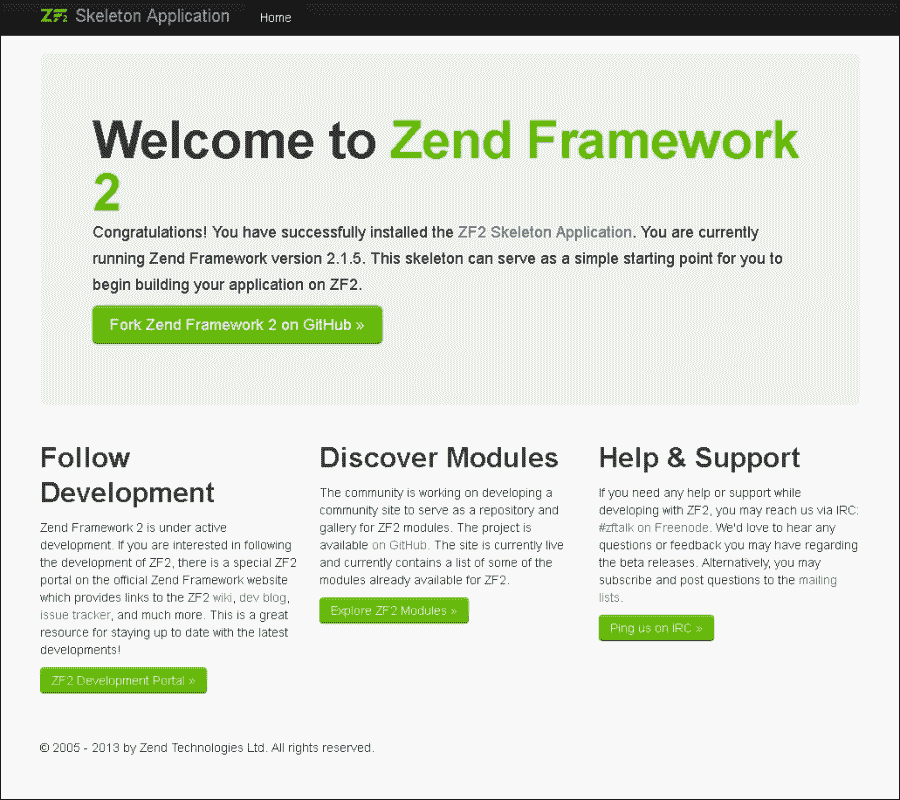

# 第一章。Zend Framework 2 基础知识

本章我们将涵盖：

+   设置 Zend Framework 2 项目

+   处理程序

+   理解依赖注入

+   利用配置来获得好处

+   事件管理器和 Bootstrap 类

# 简介

在本章中，我们将从头开始介绍一个基本的 Zend Framework 2 应用程序，从下载、设置到运行。如果您不熟悉 Zend Framework 2 的工作原理以及最佳安装方式，可以使用本章作为参考。在章节的后续部分，我们将通过查看**依赖注入**（**DI**）以及它如何帮助我们更高效地编码来对框架进行更深入的了解。最后，我们将更详细地介绍配置选项、`EventManager`和`ModuleManager`。

# 设置 Zend Framework 2 项目

没有什么比在我们的最爱框架中设置一个新的项目更令人兴奋的了。每次我们开始一个新的项目，我们都是从一张白纸开始。

## 准备工作

在您设置新的 Zend Framework 2 应用程序之前，您需要确保您已准备好以下项目：

+   一个运行 PHP 版本 5.3.3 或更高版本的 Apache 网络服务器，您可以通过网络浏览器访问它

+   Git

如果您没有准备好上述所有项目，您最好在继续阅读本章内容之前，阅读本食谱中提到的*也见*部分（我们本章中解释的每个主题都称为食谱）。

我们假设将在基于 Linux 的平台和 Apache 2 网络服务器上使用 Zend Framework 2；这意味着命令可能不会在 Windows 平台上直接工作。然而，Windows 用户可以通过在虚拟机上安装 Linux 来设置虚拟机，以充分利用本书。

要在 Windows 上安装虚拟机，我们可以使用一个名为 Oracle VM VirtualBox 的应用程序，它是免费提供的。我们可以访问[www.virtualbox.org](http://www.virtualbox.org)下载并安装 VirtualBox 的最新版本，我们还可以访问 VirtualBoxes ([`virtualboxes.org/images/ubuntu`](http://virtualboxes.org/images/ubuntu))并从那里下载一个预配置的虚拟机。

在 VirtualBoxes 网站上，我们只需点击列表中最新的 Ubuntu（Linux 的一个发行版）链接，请注意那里显示的用户名和密码，因为我们稍后会需要它们来登录。一旦下载了镜像，就可以按照 VirtualBoxes 网站上可找到的文档说明将其准备好（[`virtualboxes.org/doc/register-and-load-a-downloaded-image`](http://virtualboxes.org/doc/register-and-load-a-downloaded-image)）。

假设图像已导入，我们可以轻松启动虚拟机并输入与下载的虚拟机一起提供的用户名和密码。

登录到虚拟机后，我们需要确保 Git 已安装，这可以通过输入以下命令轻松完成（请注意，美元符号是命令提示符，而不是我们需要输入的命令）：

```php
$ sudo apt-get install git

```

如果 Git 未安装，系统将提示您安装 Git，这可以通过按*Y*键，然后按*Enter*键来完成；另一方面，如果 Git 已经安装，则不会进行任何操作，并告诉您它已经安装。

## 如何做到这一点…

首先，我们需要 Zend Framework 2 骨架，这样我们就可以轻松地创建一个新项目。骨架是一个模板结构，可以用来开始使用应用程序进行开发，在这种情况下，它为我们创建了一个在 Zend Framework 中开发的模板。幸运的是，这样做相对简单，几乎从不引起任何问题，当它发生时，通常与 Git 无法检索代码有关。当 Git 无法检索骨架时，请确保命令中没有拼写错误，并且 Git 有外部访问权限（我们可以通过输入`ping Github.com`并查看是否收到响应来测试这一点）。

我们将要使用的方法称为**克隆**，通过名为 Git 的版本控制系统。克隆源代码将确保我们总是获取开发者（在这种情况下是 Zend 本身）已上传的最新版本。

### 克隆骨架

我们可以通过以下命令克隆骨架——实际上，在 GitHub 上几乎可以克隆任何东西：

```php
$ git clone git://github.com/zendframework/
 ZendSkeletonApplication.git

```

### 移动骨架

完成后，我们可以进入新创建的名为`ZendSkeletonApplication`的文件夹，并将里面的所有内容复制粘贴到我们的 Web 服务器文档根目录。在 Linux 系统中，这通常是`/var/www`（当我们使用 Zend Server 时也是如此，如附录中所述，*设置基本要素*）。我们可以通过输入以下命令来完成此操作：

```php
$ cd ZendSkeletonApplication
$ mv ./* /var/www –f
$ cd /var/www

```

### 初始化 Composer

在所有内容复制完毕后，我们将通过输入以下命令来初始化项目：

```php
$ php composer.phar install

```

现在，PHP 的**命令行界面**（**CLI**）执行`composer.phar`，在这个例子中，它将下载并安装 Zend Framework 2 库，并为我们设置一个简单项目，以便我们能够工作。

此命令可能需要很长时间才能成功执行，因为 Composer 需要在告诉您 Zend Framework 2 已准备好使用之前完成很多事情，我们在这里不会深入讨论 Composer 的工作原理，因为它已经在附录中讨论过，*设置基本要素*。

一旦完成此命令，我们需要确保我们的 Web 服务器文档根已更改以匹配骨架布局。通常的做法是，Zend Framework 2 使用`public`文件夹作为应用程序的主要着陆点。Zend Framework 2 骨架的结构允许我们将用户绑定到`public`文件夹，同时所有逻辑都安全地位于公共区域之外。

从本质上讲，这意味着我们需要首先使用`public`文件夹`root`或`jail`Web 服务器，然后我们才能真正看到我们刚刚安装的内容。我们想要`root`或`jail`Web 服务器，因为我们不希望外部世界过度滥用我们的 Web 服务器，而`root`或`jail`确保 Web 服务器本身无法访问除其被`jail`的文件夹之外的其他任何文件夹，从而使我们的服务器更加安全。

在我个人的情况下，这意味着更改 Apache 2 配置。在大多数基于 Linux 的系统上，它将是 Apache Web 服务器为我们提供 Web 请求。

最简单的事情就是找到您的 Web 服务器配置（通常位于`/etc/apache2`），并将 DocumentRoot 追加为`/public`。对我来说，这将更改文档根从`/var/www`到`/var/www/public`。

### 小贴士

如果您使用 Apache，您需要检查`AllowOverride`设置是否设置正确，这可以在与文档根相同的部分找到，并应反映以下内容：

```php
AllowOverride FileInfo

```

最后，我们需要重新启动 Apache Web 服务器，如果您以 root 用户登录，可以通过以下命令完成，或者通过在命令前添加`sudo`来调用它，这告诉服务器我们想要以超级用户身份执行它。

```php
$ apache2ctl restart

```

现在，我们能够检查我们的浏览器并查看我们实际上做了什么。我们现在只需使用 Web 浏览器输入 URL 访问创建的项目，在我的情况下，这将如下所示：

```php
http://localhost/

```

这将导致以下屏幕：



恭喜，您现在已设置了一个基本的 Zend Framework 2 应用程序。

## 它是如何工作的…

在基本 Zend Framework 2 骨架工作正常后，安装 ZFTool 是完美的时机。ZFTool 是一个实用模块，当我们需要列出项目中的当前模块、添加新模块或设置新项目时，它非常有用。它还包含一个极其有用的类映射生成器，我们可以在 Zend Framework 2 的某些更高级区域中使用它。

我们可以通过以下命令安装此实用程序：

```php
$ cd /var/www
$ mkdir -p vendor/zftool
$ cd vendor/zftool
$ wget https://packages.zendframework.com/zftool.phar

```

虽然我们已通过 composer 设置了 Zend Framework 2 骨架，但向您展示如何轻松通过 ZFTool 设置新项目可能很有趣。

```php
$ cd /var/www
$ php vendor/zftool/zftool.phar create project new-project

```

上述命令将在`/var/www/new-project`文件夹中创建一个新的 Zend Framework 2 骨架项目。这反过来意味着我们新项目的文档根应设置为`/var/www/new-project/public`。

要完成新项目中 Zend Framework 2 应用程序，我们只需进入新项目目录并执行以下命令：

```php
$ cd new-project
$ php composer.phar install

```

ZFTool 的另一个实用命令是在我们的项目中创建和显示模块。ZFTool 可以轻松显示我们当前使用的模块列表（对于大型应用程序，我们往往容易失去对模块的视线），以及为我们应用程序创建新骨架模块的能力。要查看我们应用程序中当前使用的模块列表，我们可以使用以下命令：

```php
$ php ../vendor/zftool/zftool.phar modules

```

要在基于`/var/www/new-project`目录的项目中创建一个名为`wow-module`的新模块，我们可以使用以下命令：

```php
$ php ../vendor/zftool/zftool.phar create module wow-module
 /var/www/new-project

```

提供应用程序的路径是可选的，但如果我们在同一台机器上使用多个项目，最好确保我们有正确的项目路径。

现在是最后一条，也可能是 ZFTool 中最有用的一条命令，即类映射生成器。类映射文件是一个包含项目所有类及其相应路径的文件，这使得 PHP 自动加载器加载类文件变得更容易。通常类文件位于我们知道的路径中，这会导致自动加载器实际上需要搜索文件，从而产生小的延迟。然而，使用类映射文件，情况并非如此，因为自动加载器可以立即找到所需的文件。

类映射在 Zend Framework 2 中是一个大问题，因为不良的类映射可以使一个良好的应用程序运行得非常慢，而且为了完全公平，Zend Framework 2 可以使用它所能获得的所有速度。

类映射生成器的作用是创建一个包含所有可自动加载的类和路径的文件。这样我们就不必担心类的位置。

要生成新的类映射文件，我们可以使用以下命令：

```php
$ php zftool.phar classmap generate <directory> <file> -w

```

命令要求我们提供两个不同的参数：

+   `<directory`>：需要索引类的目录。例如，这可以是添加到`vendor`目录的新库。

+   `<file>`：这是 ZFTool 需要生成的类映射文件。我们的 Zend Framework 2 自动加载器需要拾取此文件，因此我们需要确保 ZFTool 可以找到该文件。如果您没有指定文件，它将在当前工作目录中创建一个名为`autoload_classmap.php`的文件。

大多数情况下，如果您想追加而不是覆盖类映射文件，这是必要的，如果您想追加，只需将`-w`改为`-a`。

类映射文件的示例是`vendor/composer`目录中的`autoload_namespaces.php`文件，它看起来有点像这样：

```php
<?php
return array(
  // Every class beginning with namespace Zend\ will be 
  // searched in this specific directory
  'Zend\\' => array(
    __DIR__ . '/../zendframework/zendframework/library'
  ),
  'ZendTest\\' => array(
    __DIR__ . '/../zendframework/zendframework/tests'
  ),
);
```

### 小贴士

**下载示例代码**

您可以从[`www.packtpub.com`](http://www.packtpub.com)的账户下载您购买的所有 Packt 书籍的示例代码文件。如果您在其他地方购买了这本书，您可以访问[`www.packtpub.com/support`](http://www.packtpub.com/support)并注册，以便将文件直接通过电子邮件发送给您。

## 还有更多...

安装 ZFTool 也有其他方法，其中一些与使用 composer 一样简单，所以我们将介绍两种其他安装 ZFTool 的方法。这样我们就能获得最广泛的可选方案。

安装 ZFTool 的另一种方法是利用 git，从而从仓库本身克隆源代码。然而，这会获取当前的 master 版本，可能会有些 bug。

```php
$ cd vendor
$ git clone https://github.com/zendframework/ZFTool.git
$ cd ZFTool
$ php ./zf.php

```

现在我们有了`zf.php`文件，可以像使用`zftool.phar`一样使用它。现在我们已经涵盖了安装 ZFTool 的所有不同选项。

## 参见

+   附录中的*确保你拥有所有需要的东西*配方，*设置基本要素*

+   附录中的*下载 Zend Framework 2 及其文档*配方，*设置基本要素*

+   附录中的*作曲家及其在 Zend Framework 2 中的用途*配方，*设置基本要素*

+   Apache 网络服务器 [`apache.org/`](http://apache.org/)

+   PHP 网站 [`php.net`](http://php.net)

# 处理例程

一个重要方面（如果不是最重要的方面）是 Zend Framework 2 中的路由。在其最基本的形式中，路由告诉框架用户应该如何从页面 A 到达页面 B，以及到达那个目的地需要做什么。这就是为什么我们通常认为这是如果你是初学者的话，理解的最重要部分。

## 如何做到这一点...

要定义一个路由，我们只需进入一个配置文件，并将路由配置添加到那里。

### 设置路由

让我们看看我们的简单（`Segment`）配置如下（文件：`/module/Application/config/module.config.php`）：

```php
return array(
  // Here we define our route configuration
  'routes' => array( 

    // We give this route the name 'website'
    'website' => array( 

      // The route type is of the class:
      // Zend\Mvc\Router\Http\Segment
      'type' => 'segment', 

        // Lets set the options for this route
        'options' => array( 

          /*
            The route that we want to match is /website
            where we can optionally add a controller name
            and an action name. For example:
              /website/index/index
          */ 
          'route' => '/website[/:controller[/:action]]',

          /*
            We don't want to accept everything, but this
            regex makes sure we only accept alpha-
            numeric characters and a dash and underscore.

            In our instance we want to check this for the
            action and the controller.
          */
          'constraints' => array( 
            'controller' => '[a-zA-Z][a-zA-Z0-9_-]*',
            'action' => '[a-zA-Z][a-zA-Z0-9_-]*'
          ),

          /*
           We want to make sure that if the user only 
           types /website in the URL bar it will actually
           go somewhere. We defined that here.
          */
          'defaults' => array( 
            'controller' => 'Website\Controller\Index', 
            'action' => 'index'
          ),
        ),
      ),
    ),
  ),
);
```

使用这个基本配置，我们可以轻松地在我们的应用程序中定义路由，在这个例子中，我们已经配置了一个响应`/website` URL 的路由。当我们访问`/website` URL 时，我们默认会被路由到`Website\Controller\Index::indexAction`。如果我们使用路由`/website/another/route`，我们会被路由到`Website\Controller\Another::routeAction`，因为我们已经定义了控制器和动作可以解析在后面。如果我们省略路由路径并输入`/website/another`，我们会重定向到`Website\Controller\Another::indexAction`，因为这是框架默认使用的。

上述示例只有一个真正的主要缺点，那就是当我们决定在配置中使用匿名函数来创建更多动态路由时，我们无法缓存路由，因为闭包不能被缓存序列化。

然而，还有一种声明路由的方法，那就是在代码中。在代码中创建路由功能的需求（显然每个人都有自己的原因和需求）可能是因为我们想在稍后的阶段缓存配置（例如，因为我们不能缓存匿名函数）或者当我们想从数据库中动态加载路由时。

让我们看看`/module/Application/Module.php`的例子：

```php
<?php

// We are working in the Application module
namespace Application;

// Our main imports that we want to use
use Zend\Mvc\ModuleRouteListener;
use Zend\Mvc\MvcEvent;

// Define our module class, this is always 'Module', but 
// needs to be specifically created by the developer.
class Module
{
  public function onBootstrap(MvcEvent $e)
  {
    // First we want to get the ServiceManager
    $sm = $e->getApplication()->getServiceManager();

    /*
      Say our logged in user is 'gdog' and we want
      him to be able to go to /gdog to see his profile.
    */
    $user = 'gdog';

    // Now get the router
    $router = $sm->get('router');

    // Lets add a route called 'member' to our router
    $router->addRoute('member', array(

      /*
        We want to make /$user the main end point, with 
        an optional controller and action.
      */
     'route' => '/'. $user. '[/:controller[/:action]]',

      /*
        We want a default end point (if no controller
        and action is given) to go to the index action
        of the index controller.
      */
      'defaults' => array( 
        'controller' => 'Member\Controller\Index', 
        'action' => 'index' 
      ), 

      /*
        We only want to allow alphanumeric characters
        with an exception to the dash and underscore.
      */
      'constraints' => array( 
          'controller' => '[a-zA-Z][a-zA-Z0-9_-]*', 
          'action' => '[a-zA-Z][a-zA-Z0-9_-]*' 
      ), 
    ));
  }
}
```

自然地，有更多添加路由的方法，但前述代码中提到的添加路由的方法展示了动态添加路由的巧妙方式。我们在那里创建的是，每当 Gdog 去他的个人资料时，他可以简单地输入`http://example.ext/gdog`并最终到达他的个人资料页面。

更令人惊奇的是，如果我们的朋友 Gdog 想看看他的朋友，他只需输入例如`http://example.ext/gdog/my/friends`，这将解析到`Member`模块，然后转到`My`控制器，最后执行`Friends`操作。

### 使用 SimpleRouteStack

这个路由栈——正如其名所示——是最简单的路由器之一，基本上是一个包含路由的列表，这些路由被解析以查看哪个路由匹配。默认情况下，这种类型的路由器在 Zend Framework 2 中不被使用。一般规则是，如果我们想添加一个具有高优先级的路由，我们给它一个高的索引号，例如 100 或 200。如果我们想给路由一个非常低的优先级，我们会给它一个索引号，例如 5 或 10。

当我们有非常具体的路由（通常具有高优先级）和不太具体的路由（低优先级）时，给路由分配优先级很有用。如果我们，例如，想让`/website/url`重定向到一个完全不同的模块、控制器和操作，但不影响其他网站路由，我们需要给`/website/url`路由一个更高的优先级，这样当它被找到时，它就不会搜索低优先级的路由。

如果我们不小心颠倒了优先级，我们会发现我们的`/website/url`总是重定向到包含所有`/website`路由的路由。

`SimpleRouteStack`使用`Zend\Mvc\Router\PriorityList`类来管理其路由优先级。

在我们想要开始创建应用程序之前，我们需要考虑路由，因为当应用程序增长时，如果我们没有事先考虑“如何路由”，我们可能会遇到路由问题。因此，在我们编码路由之前“绘制”应用程序的“网站地图”是明智的，以确保我们有正确的路由列表，并且没有创建任何冲突的路由。

`SimpleRouteStack`类定义了一些对我们非常有用的方法：

+   `getRoute($name)` / `getRoutes($name)`: 这将检索当前路由——如果提供了名称——或者检索我们定义在`SimpleRouteStack`中的路由。如果我们不确定我们定义了哪些路由，这是一个首先检查的好地方。

`addRoute($name, $route, $priority)` / `addRoutes($routes)`: 我们可以通过简单地将它添加到这个方法中来使用它来添加一个新的路由或一组路由到我们的路由类型。一个路由需要一个 `name`、`route`（可以是字符串或 `RouteInterface` 的实例）以及如果我们想要一个优先级，我们可以将其作为第三个参数提供。

`hasRoute($name)`: 如果我们想要检查是否存在特定的路由，我们可以通过其 `name` 来搜索，并找出它是否存在。

+   `removeRoute($name)`: 当我们厌倦了一个路由时，我们可以简单地给出它的名字，并将其从列表中删除。如果我们想要例如在用户登录后重定向到 /user 而不是 /login，这可能会特别有用。

+   `SimpleRouteStack`: 没有多个具有相同优先级的路由的功能。如果已经定义了一个具有优先级的路由，它将优先考虑最后添加的路由作为具有最高优先级的路由。

### 使用 TreeRouteStack

路由器不仅限于使用 URI 路径来确定如何路由请求。它们还可以使用其他信息，如查询参数、头部、方法或主机名来找到匹配项。

## 它是如何工作的...

在 Zend Framework 2 中，我们通常会使用基于请求 URI 的路由，其中包含应查询的路径段。路由是通过路由器匹配的，路由器利用 `RouteStack` 来找到与路由器查询相匹配的路由。我们使用 `RouteStack` 是因为我们想要一种管理不同路由的合理方式。在 Zend Framework 2 中提供了大量的路由类型，但只有两种无味的路由器，即 `SimpleRouteStack` 和 `TreeRouteStack`。

当我们定义一个路由器时，我们需要确保我们理解它是如何工作的。虽然创建不同路径的列表足够简单，但记住，Zend Framework 2 的路由器通常使用 **后进先出**（**LIFO**）的概念，这意味着经常使用的路由会被最后注册，而较少使用的路由会在路由器堆栈中较早注册。

## 更多内容...

除了两种标准路由类型之外，Zend Framework 2 还提供了一系列更专门针对互联网导航或甚至通过控制台的路由类型。

### 命名空间 – Zend\Mvc\Router\Http

一套出色的 HTTP 路由器可以在 `Zend\Mvc\Router\Http` 命名空间中找到，我们将快速浏览一下这个命名空间中存在的不同类。

#### 主机名类解释

`Zend\Mvc\Router\Http\Hostname` 命名空间将尝试将其路由与配置中定义的主机名匹配。例如，如果我们定义的路由是 `something.example.ext`，我们的路由器将基于完整的 URL 做出路由决策。但是，如果我们在这个相同路由的开始处添加一个单冒号，例如：`:something.example.ext`，那么路由器将基于 `something` 变量进行路由，这个变量可以是 `aardvark.example.ext` 到 `zyxt.example.ext` 之间的任何内容。

#### `Literal` 类的解释

`Zend\Mvc\Router\Http\Literal` 类将直接匹配我们给出的路径。例如，如果我们把一个路由放在那里，比如 `/grouphug`，那么这个路由将只解析到那个 URL，而不会是其他任何东西。

### 解释的方法

当我们想要匹配 HTTP 方法而不是段或路径时，使用 `Zend\Mvc\Router\Http\Method` 类。例如，可以是 `POST`、`DELETE` 等等。在 Zend Framework 2 中，这个方法也被称为 `verb`，这意味着在添加路由时，它请求一个 `verb` 参数而不是 `route` 参数，这是一种创建 RESTful API 的绝佳方式。

### `Part` 类的解释

`Zend\Mvc\Router\Http\Part` 类用于描述我们的路由配置中的 `child_routes`。这意味着——尽管它从未被直接使用——我们可以定义 `/user/profile` 被重定向到使用 `UserController`，并执行 `profile` 动作。

让我们考虑以下配置：

```php
return array(
  // We begin our router configuration
  'router' => array(

    // Define our routes 
    'routes' => array(

      // We are defining a route named 'Example'
      'Example' => array(
        'type' => 'Literal',
        'options' => array(

           /*
            This route will resolve to /recipe 
            which will resolve to the Example 
            module's IndexController and execute 
            the IndexAction.
           */
           'route' => 'recipe',
           'defaults' => array(
             '__NAMESPACE__' => 'Example\Controller',
             'controller' => 'Index',
           ),
         ),

         'may_terminate' => true,

          /*
            Here we begin to define our Part route, 
            which always begins with the 
            'child_routes' configuration.
          */
          'child_routes' => array(
            'client' => array(
              'type' => 'Literal',
              'options' => array(

              /*
                This child route (or Part) 
                will resolve to /recipe/foo       
                and will call the fooAction in  
                the IndexController.
              */
              'route' => '/foo',
              'defaults' => array(
               'action' => 'fooAction'
              ),
            ),
          ),
        ),
      ),
    ),
  ),
);
```

### 正则表达式解释

当我们需要匹配 HTTP 方法而不是段或路径时，使用 `Zend\Mvc\Router\Http\Regex` 类。例如，可以是 `POST`、`DELETE` 等等。在 Zend Framework 2 中，这个方法也被称为 `verb`，这意味着在添加路由时，它请求一个 `verb` 参数而不是 `route` 参数，这是一种创建 RESTful API 的绝佳方式。

让我们考虑以下示例：

```php
// We begin our router configuration
'router' => array(

  // Define our routes 
  'routes' => array(

    // We are defining a route named 'Archive'
    'Archive' => array(
      'type' => 'Literal',
      'options' => array(

        /*
          This route will resolve to /archive 
          which will resolve to the Archive 
          module's IndexController and execute 
          the IndexAction.
        */
        'regex' => '/archive/(?<id>[a-zA-Z0-9_-
  ]+)(\.(?<format>(html|xml)))?',
        'defaults' => array(
            '__NAMESPACE__' => 'Archive\Controller',
            'controller' => 'Index',
            'action' => 'indexAction',
            'format' => 'html',
        ), 
        'spec' => '/archive/%id%.%format%',
      ),
    ),
  ),
),
```

在前面的示例中，重要的是要注意 `/archive/%id%.%format%` 告诉我们，在我们的 `indexAction` 方法中我们将接收两个参数，即 `id` 和 `format`。

### `Scheme` 类的解释

`Zend\Mvc\Router\Http\Scheme` 类始终使用 `defaults` 参数，并且只接受另一个参数，该参数称为 `scheme`，并且只能包含以下选项之一，即 `http`、`https` 和 `mailto`。

### `Segment` 类的解释

`Zend\Mvc\Router\Http\Segment` 类可能是我们最常用的路由器之一，因为我们可以通过使用例如 `/:controller/:action` 这样的方式动态定义任何模块的路由和控制器，这种路由方式通过冒号分隔很容易识别。我们可以通过仅配置使用字母数字字符或其他我们希望使用的定义来为段定义任何 `constraints`。

在 *如何做...* 部分的第一个示例中给出了 `Segment` 的一个示例。

# 理解依赖注入

当我们谈论依赖注入，简称 DI 时，我们谈论的是在需要时，例如在初始化时向对象或方法中注入数据，这些对象或方法在用后要么修改要么销毁对象。DI 可能是 Zend Framework 2 中最复杂的功能之一。不幸的是，由于 DI 在调试和性能上的过度复杂性以及服务定位器（在第六章中解释，*模块、模型和服务*），DI 可能不是最好的工具。然而，尽管它不是最好的工具，我们仍然必须努力去学习它，因为一旦掌握，它可能证明是一个非常强大的工具，可以创建非常易于维护的代码。

如果我们遇到需要我们在类中输入大量参数的情况，因为代码中更深层的对象依赖于它们，这可能是我们在甚至最专业环境中能找到的最令人烦恼且难以维护的代码片段。我们需要主要考虑在应用程序中多次使用且总是需要重新实例化的对象。

## 如何实现...

让我们看看以下示例，并假设`FirstClass`是我们将在代码中进一步需要的唯一类：

```php
namespace OneNamespace
{
  class FirstClass 
  {
    private $secondClass;
    public function __construct(SecondClass $secondClass)
    {
      $this->secondClass = $secondClass;  
    } 
  }

  class SecondClass 
  {
    private $thirdClass;
    private $vehicle;
    public function __construct(ThirdClass $thirdClass, $vehicle)
    {
      $this->thirdClass = $thirdClass;
      $this->vehicle = $vehicle;
    }
  }
}

namespace AnotherNamespace 
{
  class ThirdClass 
  {
    private $first_name;
    private $last_name;

    public function __construct($first_name, $last_name)
    {
      $this->first_name = $first_name;
      $this->last_name = $last_name;
    }
  }
}

// Let us now create the example through the classic 
// method.
$thirdClass = new AnotherNamespace\ThirdClass("John", "Doe");
$secondClass = new OneNamespace\SecondClass($thirdClass, 
  'Motorcycle');
$firstClass = new OneNamespace\FirstClass($secondClass);
```

上述两个例子都给出了仅用于实例化另一个类或/和在阅读代码时增加复杂性的变量。尽管它们都是正确的，但在这个情况下，使用 DI 可以使这两个类的配置变得更加容易。

### 在调用时间初始化 DI

让我们看看这个 DI 示例，考虑到我们拥有与前面示例相同的类：

```php
namespace OneNamespace
{
  class FirstClass 
  {
    [..] 
  }

  class SecondClass 
  {
    [..]  
  }
}

namespace AnotherNamespace 
{
  class ThirdClass 
  {
    [..]
  }
}

// Instead of configuring all the classes, we will now 
// simply configure the Di, and only instantiate the 
// class that we want to use.
$di = new \Zend\Di\Di();
$lister = $di->get(
    'OneNamespace\FirstClass',
    array(
        'first_name' => 'Jane',
        'last_name' => 'Doe',
        'vehicle' => 'Car',
    )
);
```

在前面的例子中，我们只是告诉 DI，`AnotherNamespace\ThirdClass`在其`__construct`方法中有两个参数。然后 DI 将利用`Reflection`来找出那里有哪些参数，然后将为任何在其构造函数中具有`first_name`、`vehicle`或`last_name`参数的类提供该参数。

当然，我们在这里会看到一个潜在的缺陷，因为你可能需要利用多个实例化，可以假设在某个时刻会使用到相同的参数名称。在我们的例子中，如果另一个类也有一个`$first_name`参数但需要不同的输入，那么这将会引起问题，因为 DI 将简单地给出列表中的那个。

### 小贴士

如果我们使用依赖注入（DI）来实例化我们的类，并且我们只需要构造函数来设置变量，那么我们可以很容易地完全移除构造函数，因为 DI 不会使用构造函数来初始化变量。相反，DI 将只设置值的属性。

关于这一点的一个好处是，这种错误只会在我们使用 DI 在调用时间级别时发生，而不会在全局配置级别上，正如我们现在将要看到的。这就是为什么不建议在调用时间级别上使用 DI。

### 通过配置对象初始化 DI

我们还可以通过使用配置对象来创建更具体（或更准确）的对象初始化，并确保具有相同属性名的类不会发生冲突。

这个想法是，我们首先创建一个配置对象（或数组），它定义了哪些类需要设置哪些属性，然后使用它来初始化 DI，DI 反过来找出何时需要启动什么。

看看下面的例子，它展示了我们刚才解释的 exactly 东西：

```php
<?php
// We are assuming that we are using the same classes as 
// in the previously shown examples.
namespace OneNamespace 
{
  class FirstClass 
  {
    [..] 
  }

  class SecondClass 
  {
    [..]  
  }
}

namespace AnotherNamespace 
{
  class ThirdClass 
  {
    [..]
  }
}

// After defining our classes we now begin to create our 
// configuration array which we will use to initialize 
// the DI.
$configuration = array(

  // We want to use this specific configuration at 
  // initialization of our class.
  'instance' => array(

    // We specify the class name to use here
    'SecondClass' => array(

      // We want to use this as a parameter
      'parameters' => array(

        // The property name to fill is vehicle.
        'vehicle' => 'Airplane'
      ),
    ),

    'FirstClass' => array(
      // Again we want to use this as a parameter
      'parameters' => array(

        // The property name to fill is first name and 
        //last name.
        'first_name' => 'Neil',
        'last_name' => 'deGrasse Tyson',
      ),
    ),
  ),
);

// We want to instantiate the Di\Configuration now.
use \Zend\Di\Configuration; 

$diConfiguration = new Configuration($configuration);

// Now instantiate the Di itself, with the configuration 
// attached.
$di = new \Zend\Di\Di($configuration);

// And to get the object we want to use, we just do the 
//same as before.
$firstClass = $di->get('OneNamespace\FirstClass');
```

为了让一切更加完美，我们只需将 DI 的`Zend\Di\Configuration`放在我们模块的引导程序中，这样我们就可以在整个命名空间中轻松使用它。这样我们就可以简单地将 DI 的配置放在我们的`module.config.php`中，让框架来处理它。

## 它是如何工作的…

DI 或依赖注入器是 Zend Framework 2 的一个重要特性，但大多数时候都被忽视了。DI 通过自动查找我们应用中需要的类，使我们的生活变得更加容易。

然而，尽管它很复杂，但也有一些特性我们应该小心。

### DI 只提供一个对象的实例

这意味着每次`get()`调用都会导致相同的实例化重复进行。如果我们想要一个新的实例，我们需要调用`newInstance()`，因为 DI 实现了单例模式，这意味着每次我们调用`get()`方法时，所有数据都会持续存在，除非我们强制创建 DI 的新实例。

### 定义所有属性或使用完全合格（FQ）设置器参数

当我们的类具有比我们定义的更多的属性时，我们会发现 DI 将使用类中每个其他属性的最后一个值。当然，这是我们不希望的，如果我们自己编写了类，我们应该考虑重构配置和/或类。

然而，当没有其他方法可以定义正确的属性时，我们只能通过使用**完全合格**（**FQ**）设置器参数来定义。

在我们的配置中，我们可以定义一个非常具体的属性名，例如，`class::method:paramPos`。如果我们以之前提到的`ThirdClass`为例，那么这将分别是`ThirdClass::setFirstName:0`和`ThirdClass::setLastName:0`。

## 还有更多…

在 Zend Framework 2 中，我们还可以学习更多关于 DI 的知识。以下列表提供了一个非常简短且紧凑的描述，介绍了其他有趣的 DI 组件：

+   `RuntimeDefinition`（默认）、`CompilerDefinition`和`ClassDefinition`：这些定义用于确定如何配置我们的对象。尽管默认的一个通常可以完成工作，但看看其他两个定义做了什么是有好处的，因为它们都有其优缺点。

+   `InstanceManager`：用于定义配置，特别是`Aliases`、`Parameters`和`Preferences`。

# 利用配置的优势

配置在 Zend Framework 2 的工作中起着至关重要的作用，因此了解它是如何工作的至关重要。

## 如何做到这一点...

遍历以下部分，以利用配置：

### 创建全局配置

当开始使用 Zend Framework 2 编码时，对于不同的配置文件的作用存在一些误解。默认情况下，我们有多个配置文件，而且可能并不总是简单易懂地知道东西应该放在哪里。这就是为什么我们喜欢应用一个简单的规则：

### 注意

配置是否需要在所有模块中都是必要的？如果是，请将您的配置放在`config/application.config.php`文件中。如果不是，请将配置放在属于该模块的`config/global.php`文件中。

我们通常放在`global.php`文件中的配置，例如，可以是缓存方法和配置、数据库配置。通常我们希望放置与环境相关的项目，但没有任何安全敏感的信息。

让我们看看`global.php`的一个糟糕的例子：

```php
<?php
return array(

  // We want to create a new database connection
  'db' => array(

    // The driver we want to use is the Pdo, our  
    // favorite
    'driver' => 'Pdo',

    // This is our connection url, defining a MySQL 
    // connection, with database 'somename' which is 
    // available on the localhost server.
    'dsn' => 'mysql:dbname=somename;host=localhost',

    // This is exactly what we should NOT do in this  
    // file, shame on you developer!
    'username' => 'terribleuser',
    'password' => 'evenworsepassword',
  ),

  // We need a database adapter defined as well, 
  // otherwise we can't use it at all.
  'service_manager' => array(
    'factories' => array(
      'Zend\Db\Adapter\Adapter' => 
  'Zend\Db\Adapter\AdapterServiceFactory',
    ),
  ),
);
```

在`global.php`文件中放置用户名和密码是非常糟糕的做法。`global.php`文件应该放入我们的版本控制中，因此应该只包含全局运行应用程序所需的配置项，而不是与特定环境相关的特定信息，例如数据库用户名和密码。

### 创建仅适用于本地机器的配置

在 Zend Framework 2 中，超多配置文件的好处之一是您可以使用本地配置覆盖全局配置。这在开发过程中非常有用，当您发现自己处于配置与生产环境略有不同的情况时。

假设我们有一个如下的`/config/autoload/global.php`配置文件：

```php
<?php
return array(

  // We want to create a new database connection
  'db' => array(

    // The driver we want to use is the Pdo, our  
    // favorite
    'driver' => 'Pdo',

    // This is our connection url, defining a MySQL 
    // connection, with database 'somename' which is 
    // available on the localhost server.
    'dsn' => 'mysql:dbname=somename;host=localhost',
  ),

  // We need a database adapter defined as well, 
  // otherwise we can't use it at all.
  'service_manager' => array(
    'factories' => array(
      'Zend\Db\Adapter\Adapter' => 
  'Zend\Db\Adapter\AdapterServiceFactory',
    ),
  ),
);
```

正如前一个例子所示，我们创建了一个很好的简单的 MySQL 数据库连接到我们位于本地的`somename`数据库。但作为优秀的开发者，我们并没有在这里定义用户名和密码。这就是`/config/autoload/local.php`文件的作用所在。

让我们看看我们的`local.php`可能的样子：

```php
<?php
return array(
  'db' => array(
    'username' => 'awesomeuser',
    'password' => 'terriblepassword',
  ),
);
```

如果我们使用版本控制系统（请说“是”），我们不应该提交此文件，这不仅出于安全原因，而且因为这是一个本地配置文件，在实时系统中可能并不必要，因为我们会在该环境中创建一个新的具有正确细节的文件。

### 编辑您的 application.config.php 文件

如果我们查看我们的默认`config/application.config.php`文件，我们只设置了少量属性，但有很多内联注释，当我们不再记得某个属性的准确名称或描述时，这些注释非常有用。

在我们开发应用程序时，我们将更改最多的主要配置是`modules`属性。这个特定的属性是一个简单的数组，包含我们在应用程序中（并希望使用）的不同模块命名空间。默认情况下，它看起来有点像这样：

```php
<?php 

return array(
  // This should be an array of module namespaces used 
  // in the application.
  'modules' => array(
    'Application',
  ),
[..]
```

当我们添加或删除模块时，此行也需要修改，甚至可以在开始新模块或删除模块之前修改此文件。原因很简单，当我们忘记在删除模块时修改此文件，访问应用程序时会在浏览器中生成`500 – 应用程序错误`。而且因为此配置文件在实例化早期就被读取，有时对于开发者来说很难确定为什么应用程序突然无法加载。

## 它是如何工作的…

如果我们查看`public`文件夹中的`index.php`文件，我们可以看到我们将初始配置文件通过以下行解析到 Zend Framework MVC 应用程序中：`require 'config/application.config.php'`。然后加载主配置文件，它反过来定义了所有我们的属性。

`application.config.php`文件中的一个巧妙属性是`config_glob_paths`属性。任何额外的配置文件默认情况下都会通过在`config/autoload`文件夹中查找文件来读取，使用一个非常具体的文件模式，即`*global.php`和`*local.php`。定义的顺序也非常重要。

当我们说`*global.php`时，我们可以从`somemodule.global.php`到`menu.global.php`，甚至只是`global.php`来定义任何内容，因为文件模式（也称为`GLOB_BRACE`）会搜索任何匹配的内容。对于`*local.php`也是如此。

如前所述，定义的顺序非常重要，因为我们希望全局配置在本地配置之前加载，否则覆盖全局配置就没有意义了，对吧？

## 还有更多…

总结配置文件：

+   `config/application.config.php`: 可以在此处添加和删除模块，并且非常底层的配置也在这里进行。

+   `config/autoload/some-module.global.php`: 用于覆盖模块配置的默认值。请确保不要在此处放置敏感信息，但主机名和数据库名称应该放在这里。

+   `config/autoload/some-module.local.php`: 您可以在此处放置您的用户名和密码以及其他非常特定于您本地环境的配置项。

+   `module/SomeModule/config/module.config.php`: 模块特定配置在此处进行，请仅使用默认值，并确保不要在此处输入过于具体的内容。

# 事件管理器和引导类

我们将展示 Zend Framework 2 最漂亮的功能之一：事件管理器。

## 如何操作…

`EventManager`和`Bootstrap`类是我们应用程序的重要组成部分，这个配方主要介绍如何使用这两个工具：

### 使用引导

在我们的情况下，引导是模块的开始，每当请求一个模块时，它将使用位于 `Module.php` 文件中的 `onBootstrap()` 方法。虽然这个方法不是必需的，但我们通常希望在模块中包含这个方法，因为它是一个确保在进一步处理客户端请求之前某些实例已经存在或配置好的简单方法。

### 开始一个会话

会话是保存用户临时信息的绝佳方式。想想保存已登录用户的信息，或者他们在页面上浏览的历史记录。一旦我们开始创建应用程序，我们会发现自己会在会话中保存很多东西。

我们需要做的第一件事是修改 `/module/Application/config/module.config.php` 文件，并向其中添加一个名为 `session` 的新部分。假设我们有一个完全空的模块配置：

```php
<?php
return array(
  'service_manager' => array(
     // These are the factories needed by the Service 
     // Locator to load in the session manager
    'factories' => array(
      'Zend\Session\Config\ConfigInterface' => 
  'Zend\Session\Service\SessionConfigFactory',
      'Zend\Session\Storage\StorageInterface' => 
  'Zend\Session\Service\SessionStorageFactory',
      'Zend\Session\ManagerInterface' => 
  'Zend\Session\Service\SessionManagerFactory',
    ),
    'abstract_factories' => array(
  'Zend\Session\Service\ContainerAbstractFactory',
    ),
  ),
  'session_config' => array(
    // How long can the session be idle for in seconds 
    // before it is being invalidated
    'remember_me_seconds' => 3600,

    // What is the name of the session (can be anything)
    'name' => 'some_name',
  ),
  // What kind of session storage do we want to use, 
  // only SessionArrayStorage is available at the minute
  'session_storage' => array(
    'type' => 'SessionArrayStorage',
    'options' => array(), 
  ),
  // These are session containers we can use to store 
  // our information in
  'session_containers' => array(
    'ContainerOne',
    'ContainerTwo',
  ),
);
```

就这样。会话现在可以在我们的控制器和模型中使用。我们现在创建了两个会话容器，我们可以使用它们来存储我们的信息。我们可以通过以下方式在任何有服务定位器可用的控制器或模型中访问这些容器（文件：`/module/Application/src/Application/Controller/IndexController.php`）：

```php
<?php

namespace Application;

use Zend\Mvc\Controller\AbstractActionController;

class IndexController extends AbstractController
{
  public function indexAction()
  {
    // Every session container we define receives a 
    // SessionContainer\ prefix before the name
    $containerOne = $this->getServiceLocator()
  ->get('SessionContainer\ContainerOne');
  }
}
```

#### 使用 EventManager 类

`EventManager` 类可能是框架中最好的特性之一。当正确使用时，它可以使我们的代码更加动态和易于维护，而不会产生乱麻般的代码。

它所做的事情相对简单，例如；一个类可能有一个名为 `MethodA` 的方法。这个 `MethodA` 有一个监听器列表，它们对这个类的结果感兴趣。当 `MethodA` 执行时，它只是运行其正常程序，完成后就通知 `EventManager` 发生了一个特定的事件。现在 `EventManager` 将触发所有感兴趣的相关方，而这些相关方将依次执行它们的代码。

明白了？如果你不明白，不要担心，因为这个示例代码可能会澄清一些问题（文件：`/module/Application/src/Application/Model/SwagMachine.php`）：

```php
<?php
// Don't forget to add the namespace
namespace Application\Model;

// We shouldn't forget to add these!
use Zend\EventManager\EventManager;

class SwagMachine
{
  // This will hold our EventManager
  private $em;

  public function getEventManager() 
  {
    // If there is no EventManager, make one!
    if (!$this->em) {
      $this->em = new EventManager(__CLASS__);
    }

    // Return the EventManager.
    return $this->em;
  }

  public function findSwag($id)
  {
    // Trigger our findSwag.begin event 
    // and push our $id variable with it.
    $response = $this->getEventManager()
                     ->trigger(
           'findSwag.begin', 
           $this,
           array(
             'id' => $id
           )
    );

    // Make our last response, the final 
    // ID if there is a response.
    if ($response->count() > 0)
      $id = $response->last();

    // ********************************
    // In the meantime important code 
    // is happening...
    // ********************************

    // ...And that ends up with the 
    // folowing return value:
    $returnValue = 'Original Value ('. $id. ')';

    // Now let's trigger our last 
    // event called findSwag.end and 
    // give the returnValue as a 
    // parameter.
    $this->getEventManager()
         ->trigger(
           'findSwag.end', 
           $this, 
           array(
             'returnValue' => $returnValue
           )
    );

    // Now return our value.
    return $returnValue;
  }
}
```

正如我们所看到的，我们创建了一个带有两个事件触发器的小类，分别是 `findSwag.begin` 和 `findSwag.end`，分别位于方法的开始和结束处。`findSwag.begin` 事件可能会修改 `$id`，而 `findSwag.end` 事件仅解析 `returnValue` 对象，无法修改其值。

现在我们来看看实现触发器的代码（文件：`/module/Application/src/Application/Controller/IndexController.php`）：

```php
<?php

namespace Application\Controller;

use Zend\Mvc\Controller\AbstractActionController;

class IndexController extends AbstractActionController
{
  public function indexAction() 
  {
    // Get our SwagMachine
    $machine = new SwagMachine();

    // Let's attach our first callback, 
    // which potentially will increase 
    // the $id with 10, which would 
    // make it result in 30!
    $machine->getEventManager()
            ->attach(
        'findSwag.begin',
        function(Event $e) 
        {
          // Get the ID from our findSwag() 
          // method, and add it up with 12.
          return $e->getParam('id') + 10;
        },
        200
    );

    // Now attach our second callback, 
    // which potentially will increase 
    // the value of $id to 60! We give 
    // this a *higher* priority then 
    // the previous attached event 
    // trigger.
    $machine->getEventManager()
            ->attach(
        'findSwag.begin',
        function(Event $e) 
        {
        // Get the ID from our findSwag() 
        // method, and add it up with 15.
        return $e->getParam('id') + 40;
      },
      100
    );

    // Now create a trigger callback 
    // for the end event called findSwag.end, 
    // which has no specific priority, 
    // and will just output to the screen.
    $machine->getEventManager()
            ->attach(
        'findSwag.end',
        function(Event $e) 
        {
          echo 'We are returning: '
             . $e->getParam('returnValue');
        }
    );

    // Now after defining the triggers, 
    // simply try and find our 'Swag'.      
    echo $machine->findSwag(20);
  }
}
```

正如我们所看到的，将触发器附加到事件上非常简单。如果事件得到适当的文档说明，当我们需要修改传入方法（如我们用 `findSwag.begin` 所做的那样）的参数或只是将结果输出到日志（如 `findSwag.end`）时，它们会很有用。

当我们查看屏幕上的内容时，它应该是这样的：

```php
We are returning: Original Value (60)
Original Value (60)

```

结果是，最上面一行是来自`findSwag.end`触发器的输出，而值`60`来自最高优先级的触发器，即优先级为`100`的触发器（因为那被认为比`200`的优先级更高）。

#### 更改视图输出

有时候，我们需要不同的视图输出，例如当我们需要构建自己的 REST 服务或 SOAP 服务时。虽然这可以通过控制器插件更简单地安排，但它是一个如何连接到`dispatch`事件并查看那里的示例。

不再赘述，让我们看一下以下代码片段：

```php
Module.php:
namespace Application;

// We are going to use events, and because we use a MVC, 
// we need to use the MvcEvent.
use Zend\Mvc\MvcEvent;

class Module
{
  public function onBootstrap(MvcEvent $e)
  {
    // Get our SharedEventManager from the MvcEvent $e 
    // that we got from the method
    $sharedEvents = $e->getApplication()
                      ->getEventManager()
                      ->getSharedManager();

    // Also retrieve the ServiceManager of the 
    // application.
    $sm = $e->getApplication()->getServiceManager();

    // Let's propose a new ViewStrategy to our 
    // EventManager.
    $sharedEvents->attach(

        // We are attaching the event to this namespace 
        // only.
        __NAMESPACE__, 

        // We want to attach to this very specific 
        // event, the Dispatch event of our controller.
        MvcEvent::EVENT_DISPATCH, 

        // The callback function of the event, used when 
        // the event we attached to happens. In our 
        // callback we also want our local variable $sm 
        // to be available for use.
        function($e) use ($sm) 
        {
          // Get our alternate view strategy from the 
          // ServiceManager and attach the EventManager     
          // to the strategy.
          $strategy = $sm->get('ViewJsonStrategy');
          $view = $sm->get('ViewManager')->getView();
          $strategy->attach($view->getEventManager());
        }, 

        // We want to give this a priority, so this will 
        // get more priority.
        100
    );
}
```

如我们所见，将回调函数附加到`EventManager`对象相对简单。在这个例子中，我们使用`McvEvent::EVENT_DISPATCH`作为我们想要连接的事件。所以基本上发生的事情是，每当控制器执行`onDispatch()`方法时，这个事件也会被触发。这意味着通过事件，我们可以修改方法的输出结果，而实际上并不需要修改代码。

## 它是如何工作的...

`EventManager`类通过几种不同的方法工作，即观察者模式、面向方面编程技术（或 AOP）和事件驱动架构。

### 观察者模式解释

简单来说，观察者模式意味着存在几个感兴趣的参与者，称为监听器，它们希望知道当应用程序触发某个事件时。当特定事件被触发时，监听器将收到通知，以便它们可以采取必要的行动。

### 面向方面编程（AOP）解释

如果我们要解释 AOP 是什么，我们可以简单地说，它代表编写只包含功能且尽可能与代码其他部分隔离的干净代码。

#### 事件驱动架构解释

事件驱动架构的好处是，我们不必创建大量需要检查每个条件的代码，我们可以轻松地将自己连接到不同的事件，本质上这将创建一个更响应的应用程序。

## 还有更多...

`EventManager`对象通过`PriorityQueue`进行查询，这告诉我们，重要的事件通常会得到更低的值，而不重要的事件会得到更高的值。例如，最高优先级可能得到优先级`-1000`，而相当低的优先级可能得到 40。然后`EventManager`类通过**FIFO**（**先进先出**）的概念获取队列，这意味着优先级越高，数字越低。
