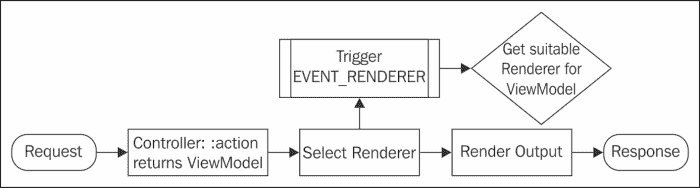

# 第四章：使用视图

在本章中，我们将涵盖：

+   与视图一起工作

+   使用视图助手

+   创建全局布局模板

+   创建可重用的视图

+   使用视图策略/渲染器

+   使用上下文切换以实现不同的输出

+   编写自定义视图策略/渲染器

# 简介

在本章中，我们将讨论使用视图，这是我们之前在几个地方简要提到过的。视图是为了开发者的利益而创建的，以严格区分前端和后端的一切。这样，后端开发者可以专注于控制器和模型，而前端开发者可以在视图中工作。视图的另一个巨大好处是视图决定了数据是如何输出的，所以在大多数情况下这将是 HTML，在其他情况下可能是 JSON 等等。

我们将在本章的最后一个小节中向您展示如何进行自定义，这样我们就可以完全理解一切是如何工作的。

# 与视图一起工作

视图可以被认为非常重要，因为它实际上渲染了输出到用户浏览器的内容。因此，我们可以假设了解视图的工作原理在创建 Web 应用程序时非常有用。

## 准备工作

对于这个配方来说，如果我们已经设置了 Zend Framework 2 骨架并准备好工作，那就很有好处。我们将做一些基本的事情来帮助你开始，所以不需要额外的扩展。

## 如何做到这一点...

我们将通过使用默认的视图策略`PhpRenderer`来输出内容到浏览器。

### 配置视图管理器

我们对`/module/Application/config/module.config.php`文件进行以下修改：

```php
<?php
return array(
  'view_manager' =>array(
    // We want to show the user if the page is not found
    'display_not_found_reason' => true,

    // We want to display exceptions when the occur
    'display_exceptions' => true,

    // This defines the doctype we want to use in our 
    // output
    'doctype' => 'HTML5',

    // Here we define the error templates
    'not_found_template' => 'error/404',
    'exception_template' => 'error/index',

    // Create out template mapping 
    'template_map' =>array(

      // This is where the global layout resides
      'layout/layout' => __DIR__ . '/../view/layout/layout.phtml',

      // This defines where we can find the templates 
      // for the error messages
      'error/404' => __DIR__ . '/../view/error/404.phtml',
      'error/index' => __DIR__ . '/../view/error/index.phtml',
    ),

    // The template path stack tells our view manager 
    // where our templates are stored
    'template_path_stack' =>array(__DIR__ . '/../view',
    ),
  ),
);
```

### 在 ViewModel 实例中设置变量

现在我们已经设置了视图管理器；我们可以去我们的控制器，并在我们的控制器导入部分添加以下内容。

```php
use Zend\View\Model\ViewModel;
```

现在我们可以使用`ViewModel`实例来为我们的动作控制器中的`PhpRenderer`服务。让我们现在就来做这件事：

```php
public function someAction()
{
  $view = new ViewModel();

  // One way of setting a variable in the view 
  $view->setVariable('example', 'Output this to user');

  return $view;
}
```

就这么简单；在我们定义完所有想要的东西之后，简单地返回`ViewModel`实例。

### 标记模板文件

现在是我们完成之前最后一步的时候了，那就是创建一个需要渲染的模板文件。我们可以通过首先在`view/index`文件夹中创建一个文件（例如）来做到这一点，命名为`some.phtml`（正如我们之前的例子中所叫的那样）。

现在，我们将只做一件简单的事情，那就是输出我们在`ViewModel`实例中刚刚声明的变量。

```php
<h1><?php echo $this->example ?></h1>
```

就这样。我们现在已经在动作中输出了我们在`ViewModel`实例中声明的变量示例。还有其他方法可以将变量设置到视图中，例如通过将变量声明为`ViewModel`构造函数的第一个参数。

```php
$view = new ViewModel(array(
  'variable_one' => 'Some Variable',
  'variable_two' => 'Some other Variable',
));
```

或者，如果我们想同时设置多个变量，但不是在构造函数执行时间，我们也可以执行以下操作：

```php
// First we have the view instantiated
$view = new ViewModel();

// And now we assign a lot of variables at the same time
$view->setVariables(array(
  'variable_one' => 'Some Variable',
  'variable_two' => 'Some other Variable',
));
```

现在，既然我们是输出变量到视图的专家，我认为是时候来点蛋糕了！

## 它是如何工作的…

视图在向用户返回请求的输出之前会使用几种不同的方法。

### 配置

如果我们要使用 Zend Framework 2 的骨架应用程序，那么默认情况下这已经设置好了，但让我们假设我们还没有进行任何配置，我们正在盲目地工作。我们首先想要做的是确保通过**依赖注入**（**DI**）设置了 `ViewManager`。我们可以通过在 `config` 文件夹中打开名为 `module.config.php` 的模块配置文件（假设我们使用的是标准布局）并在那里添加 `ViewManager` 配置来实现这一点。

在我们继续之前，还有一点需要注意，那就是 `template_path_stack` 通过在数组中定义的基本目录中搜索模板来工作。然后它将在这些目录中进一步搜索使用我们描述的格式的模板。

例如，在我们的情况下，带有 `aboutAction` 的 `IndexController` 默认解析为 `view/index/about.phtml` 路径。

### `ViewModel` 实例

`ViewModel` 实例通常只在控制器中使用，基本上是一个容器，它包含所有需要输出给用户的信息。尽管 `ViewModel` 实例在技术上可以在任何地方使用，但这并不是一个好的实践，因为控制器的主要责任是处理模型和视图。如果我们改变控制器本质，应用程序将变得难以维护。

`ViewModel` 实例本身没有其他目的，只是跟踪我们想要输出给用户的所有变量，以及其他选项，比如我们想要使用的模板，以及我们是否想要渲染主布局。

接下来发生的事情是，`ViewModel` 实例将被 `ViewStrategy` 和 `ViewRenderer` 拿来用于输出。

几乎每个 `ViewStrategy` 都有其自己类型的 `ViewModel`，专为该特定目的设计。这样我们就可以轻松地使用另一个 `ViewModel` 实例，并为用户创建不同类型的输出。

### `ViewStrategy` 类

`ViewStrategy` 类用于确定我们将如何以及是否向用户输出内容。其工作方式通常是，首先 `ViewStrategy` 确定它接收到的 `ViewModel` 实例是否与它们期望的模型兼容。它是通过将一个 `ViewEvent`附加到 `EVENT_RENDERER` 事件上实现的，该事件将在框架搜索合适的渲染器时触发。

在那个时刻，`ViewStrategy` 会检查模型是否兼容，如果是，它将返回一个合适的 `ViewRenderer`，如果不是，它将返回 null。然后框架完成其工作并渲染输出（更多关于这一点在 The ViewRenderer helper 部分）之后，它将触发另一个名为 `EVENT_RESPONSE` 的 `ViewEvent`。

这个事件基本上是`ViewStrategy`类在输出发送给用户之前可以做的最后一个端点。在这个`ViewEvent`中，`ViewStrategy`类如果需要的话可以对响应进行最后的修改。我们应该考虑内容类型、额外头信息或是一些其他最后一刻的事情。

下面的简化版过程如下所示：



### 视图渲染器辅助器

渲染器在`ViewStrategy`类之前提到的两个事件之间使用，它确实像你预期的那样工作；它渲染输出。它从`ViewModel`实例中获取数据，并根据这些数据渲染输出。它通常需要一个视图脚本，例如`PhpRenderer`使用的 PHTML 文件，但有时它根本不需要任何脚本，并且可以完全自行渲染输出（例如，考虑以 JSON 格式输出）。我们将在本章后面介绍如何使用不同的 ViewStrategy 和 ViewRenderer。

```php
Using view helpers
```

我们在 View 中添加的复杂性越多，就越难以正确维护它。这就是为什么我们将逻辑提取出来，并将其放置在视图脚本之外的 View 中，并将它们放在所谓的视图辅助器中。

## 准备工作

对于这个配方，建议使用 Zend Framework 2 骨架应用程序。我们不会需要任何非同寻常的扩展来使用这个配方。

## 如何做到这一点...

在 Zend Framework 2 中，有一系列默认的视图辅助器与框架一起提供。让我们看看其中的一些，看看它们的作用以及如何使用它们。

### BasePath 视图辅助器

`BasePath`视图辅助器是一个非常容易使用的视图辅助器，例如：

```php
<!-- 
  The following will prepend the URL with the base path
  which can be /website/public/js/script.js e or /js/script.js.
  The path is something for the basePath to decide.
-->
<script src="img/script.js'); ?>">
</script>
```

### Doctype 视图辅助器

我们对`/module/Application/config/module.config.php`文件进行了以下修改：

```php
<?php
// This is just a snippet of the code that needs to be
// there for doctype to be defined.
return array(
  'view_manager' => array(
    'doctype' => 'HTML5',
  ),
);
```

然后在视图脚本中，我们可以执行以下操作来输出格式良好的`doctype`辅助器：

```php
<?php echo $this->doctype(); ?>
```

### URL 视图辅助器

如果我们想要为特定的路由生成 URL，URL 视图辅助器非常方便使用，例如：

```php
<a href="<?php echo $this->url(
    // This is the name we gave the route in our 
    //configuration file
    'route-name', 

    // Give the parameters for the URL, such as the 
    // controller, action or any parameters that should    
    // be added to the URL
    array(
      'controller' => 'someController',
      'action' => 'anotherAction', 
      'id' => 1234,
    )); ?>">Go to this page!</a>
```

### 部分视图辅助器

首先，确保我们实际上有一个模板（`/view/application/index/partial/partial.phtml`）被用作部分内容。

```php
<div><?php echo $this->partial_variable; ?></div>
```

然后，我们可以进入我们的正常布局，并使用`Partial`视图辅助器添加我们的额外模板（`/view/application/index/index.phtml`）：

```php
<div>Some Content.</div>

<div>
  <?php echo $this->partial(
    './partial/partial.phtml', 
    array(
      'partial_variable' => 'Partial content!',
    )
  ); ?>
</div>
```

## 它是如何工作的...

一旦我们进入严肃的开发，视图辅助器是不可或缺的。它们通过尽可能地将逻辑与 HTML 分离来确保我们的代码不会变成意大利面（例如）。视图辅助器仅在视图脚本中工作（如果当前视图策略支持的话，但让我们假设它支持），所以下面给出的所有示例都只与视图目录中的`.phtml`文件相关。

如果我们有一个视图辅助器，我们通常可以立即在视图中通过调用它们来使用：

```php
$this->someViewHelper('some-parameter');
```

这之所以有效，是因为在首先实例化视图助手之前，`someViewHelper` 类已经定义了一个 `__invoke()` 方法。这意味着可以在不需要先实例化的情况下调用它。

然而，有时我们有一些视图助手不能通过之前显示的调用方式使用；实际上，它们需要首先被构建。这可以通过执行以下操作来完成：

```php
$helper = $this->someViewHelper();
$helper->someMethod('some-parameter');
```

一个视图助手也可以有多个公共方法可用，这通常用于将功能分组在一起。例如，一个（在 Zend Framework 2 中不存在的）名为 `Person` 的视图助手可能有 `getAddress($person)` 和 `getName($person)` 作为公共方法，然后可以通过以下方式使用 invoke 来调用：

```php
echo $this->person()->getAddress($person);
echo $this->person()->getName($person);
```

### Zend\View\Helper\AbstractHelper

技术上 `Zend\View\Helper\AbstractHelper` 不是一个视图助手，但我们仍然提到它，因为这是我们想要扩展以创建自己的视图助手的类。它实现了一些对于视图助手类正确工作所必需的方法。

### `BasePath` 视图助手的解释

如果我们使用自定义结构来构建应用程序，并且公共文件夹不在网站文件夹的底部，即 `/website/public`，那么 `BasePath` 视图助手可以非常有帮助。然后我们可以使用 `BasePath` 来让它决定我们的位置。`BasePath` 视图助手通常用于更频繁地处理静态资源，例如图像、样式表和脚本，这对于确保应用程序在更改或根 URL 下保持稳健性非常有用。

### `Doctype` 视图助手的解释

`Doctype` 是一个非常有用的视图助手，因为我们往往会忘记那些 `Doctype` 助手是如何构建的。与其在互联网上查找如何再次声明它们，我们现在可以只使用这个小巧的宝石。

您可以随时指定 `Doctype` 助手，但最好在视图管理器的配置中这样做，以确保应用程序的其他部分也知道我们正在使用哪个 `Doctype`（有时它们可能只想输出不同的事物）。

我们可以使用的有效 `Doctype` 视图助手有：

+   XHTML11

+   XHTML1_STRICT

+   XHTML1_TRANSITIONAL

+   XHTML1_FRAMESET

+   XHTML1_RDFA

+   XHTML1_RDFA11

+   XHTML_BASIC1

+   XHTML5

+   HTML4_STRICT

+   HTML4_LOOSE

+   HTML4_FRAMESET

+   HTML5

设置 `Doctype` 助手对于其他视图助手是至关重要的，因为它们（例如在表单元素的情况下）基于所选类型做出渲染决策。例如，一个 `HTML4_* doctype` 可能会将输入字段渲染为 `<input type="text"></input>`，而 `XHTML1_STRICT` 会将其渲染为 `<input type="text" />`。如果我们想使用 W3C 的验证服务，`Doctype` 助手不仅仅是至关重要的。

### URL 视图助手的解释

URL 视图助手是个小巧实用的工具，它会根据我们在配置中定义的命名路由构建 URL。这意味着如果我们想构建一个正确格式的 URL，可以使用这个视图助手来帮我们构建。

### 解释部分视图助手

`Partial`视图助手在我们想要将布局分成不同的部分时特别有用，如果我们想确保我们的模板可维护并且可以在多个地方重用，这总是很有用的。

我们存储部分视图的目录不是严格规定的，但建议将它们放置在一个我们可以随时找到它们的位置。

## 还有更多…

我们只讨论了四个默认在 Zend Framework 2 中的视图助手，然而框架中默认还有大量的视图助手同样有用。我个人会建议也浏览一下那些，并稍微了解一下它们，因为即使你永远不会使用它们，它们中的大多数也非常有趣。特别是`Cycle`、`Gravatar`、`HeadStyle`和`HeadTitle`视图助手，在我们构建 HTML 页面设置时可能会很有用。

视图助手的完整列表始终可在官方 Zend Framework 2 文档中找到。

# 创建全局布局模板

视图脚本可以非常动态，但大多数时候我们需要一个全局模板，我们希望将其包裹在来自我们的`Action`视图脚本输出的内容周围。这个配方将详细解释如何做到这一点，并告诉我们它是如何工作的。

## 准备工作

对于这个配方，需要一个工作的 Zend Framework 2 骨架应用程序，因为我们将创建和编辑一些文件，这些文件在其中使用。

## 如何做到这一点…

以下是我们如何着手实现这一目标的：

### 创建主布局文件

现在让我们创建主文件`/module/Application/view/layout/layout.phtml`，我们用它来创建我们的布局：

```php
<!-- first of all we want to output the doctype -->
<?php echo $this->doctype(); ?>

<!-- now we add the HTML tag -->
<html>

<!-- enter our head tag -->
<head>
  <!-- we want to output in UTF-8 -->
  <meta charset="utf-8">

  <!-- let's use the headTitle View Helper to output our 
       website title -->
  <?php echo $this->headTitle('Awesome website!') ?>

  <!-- make sure mobile browsers get the best of it with 
       the use of the headMeta View Helper, and setting 
       the viewport -->
  <?php echo $this->headMeta()->appendName(
    'viewport', 
    'width=device-width, initial-scale=1.0'
  ) ?>

  <!-- add a favicon.ico file reference for older 
       versions of Internet Explorer, as that doesn't 
       pick it up by itself -->
  <?php echo $this->headLink(array(
    'rel' => 'shortcut icon', 
    'type' => 'image/vnd.microsoft.icon', 

    // Use the basePath to find our public folder
    'href' => $this->basePath('/images/favicon.ico')
  )) ?>

  <!-- add a style sheet to our template -->
  <?php echo $this->headStyle()->appendStyle(
    $this->basePath('/style.css')
  ); ?>

  <!-- now add a javascript that we need as well, which 
       is only used by Internet Explorer version less 
       than 9 -->
  <?php echo $this->headScript()->prependFile(
    $this->basePath('/script.js'),

    // Non HTML5 browsers need a type set for script 
    // tags
    'text/javascript',

    // Add the extra script conditions
    array(
      'conditional' => 'lt IE 9',
    )
  ); ?>
</head>
```

我们现在已经成功设置了 head 标签，并使用了大量的视图助手来使我们在添加与 head 相关的标签时生活变得更加轻松。

现在让我们设置一个简单的代码主体，看看我们能在那里做什么：

```php
<!-- let's continue with our body tag now -->
<body>
  <!-- output our main content from our actions -->
  <?php echo $this->content ?>

  <!-- render any inline scripts that we have -->
  <?php echo $this->inlineScript(); ?>
</body>

<!-- we are done here -->
</html>
```

好了，就是这样，一旦我们输出了`content`变量，它基本上就会渲染从控制器/操作输出生成的内容。

### 创建错误模板

错误文件很容易创建，因为它们只需要几样东西。让我们首先创建`/module/Application/view/error/404.phtml`文件，因为它相当直接。

```php
<h1>404: Page not found!</h1>

<p>
  <!-- show the message of the 404 error, generated by 
       the framework -->
  <?php echo $this->message; ?>
</p>

<!-- there is usually also a separate reason attached, 
     which (if exists) we want to show as well -->
<?php
  if (isset($this->reason) && $this->reason) {
    switch ($this->reason) {
      case 'error-controller-cannot-dispatch':
        $reason = 'Could not get dispatch controller.';
        break;
      case 'error-controller-invalid':
        $reason = 'Undispatchablecontroller.';
        break;
      case 'error-controller-not-found':
        $reason = 'Controller could not be found.';
        break;
      case 'error-router-no-match':
        $reason = 'URL could not be matched by router.';
        break;
      default:
        $reason = 'Unknown';
        break;
    }

    // Now show the reason to the user
    echo $reason;
  }
```

我们可以使用更多的变量来向用户显示在路由中出了什么问题，我们也可以查看，例如，他们请求了什么，但通常这些更多是用于开发而不是用于生产服务器，因为我们不想暴露太多数据。

现在让我们创建一个文件（`/module/Application/view/error/index.phtml`），当出现异常时，它将被显示出来，这是开发者最喜欢的事情之一（显然不是）。

```php
<h1>An error occurred!</h1>

<p>
  <!-- show the error message, that is the least we can 
       do -->
  <?php echo $this->message; ?>
</p>

<!-- now show the exception, if we have turned this on 
     in the configuration -->
<?php
  if (isset($this->display_exceptions) && $this->display_exceptions) :
    // Now let's see if we have an exception, and if it 
    // is the right instance as well
    if(isset($this->exception) && $this->exception instanceof Exception) :
?>

<!-- Yup, it is an exception all right -->
<div>
  Exception:

  <!--Show which class threw the exception -->
  <?php echo get_class($this->exception); ?>
</div>

<!-- Show the message thrown -->
<h2>Exception message:</h2>
<div><?php echo $this->exception->getMessage() ?></div>

<!-- And the *beautiful* stack trace as well -->
<h2>Stack trace:</h2>

<div>
  <?php echo $this->exception->getTraceAsString() ?>
</div>

<?phpendif; ?><?phpendif; ?>
```

## 它是如何工作的…

`AbstractActionController`在错误发生时显示错误，并选择正确的模板（在`view_manager`配置中定义）用于错误消息。我们唯一要做的就是确保模板存在。

如果我们要使用 Zend Framework 2 的 MVC 模型并且预期会反复使用相同的布局，那么全局布局是一个很好的主意，这在大多数情况下都会发生。

创建一个全局布局将真正使我们的生活变得更简单，因为这是一种使我们的代码更易于维护的方法，作为一个程序员，这是你工具箱中最重要工具之一。

首先，我们需要确保`view_manager`已经被正确定义，这在*使用视图*菜谱中已经描述过，所以我们假设在这个点上我们使用的是相同的配置。

我们使用了`inlineScript`视图助手来确保内容也可以输出不是 head 标签部分的脚本，但仍然应该用于输出。

我们希望使用`inlineScript`来定义任何脚本，而不是将它们添加到模板文件中，因为我们希望尽可能地将 JavaScript 与正常的 HTML 内容分开（我们还想尽可能使内联脚本可重用，从维护的角度来看，这看起来更好）。

错误模板示例是一个非常基本的错误文档，当发生异常时显示。我们还可以做更多的事情，例如，如果有更多的异常，我们可以通过`$this->exception->getPrevious()`来获取它们，然后作为数组解析它们。

# 创建可重用视图

在这个动态应用程序的时代，我们有可以多次使用的部件或内容。我们不想一次性获取所有内容，而是希望能够动态地加载新的对象，或者至少不需要做很多工作就能让功能正常工作。

## 准备工作

对于这个菜谱，我们需要的只是一个工作的 Zend Framework 2 骨架应用程序。

## 如何操作…

在这个菜谱中，我们将讨论如何创建可重用模板以及最佳的使用方法。

### 使用 Action 视图助手获取可重用内容

`Action`视图助手是调用我们代码中的不同动作以检索应用程序其他部分的一个很好的方法：

```php
<div class="left">Some content on the left!</div>

<div class="right">
  <?php
    echo $this->action(
      // The action to call
      'sidebar',

      // The controller to call
      'templates',

      // The module to call
      'application',

      // Parameters to parse along
      array('show' => true)
    );
  ?>
</div>
```

### 将子对象定义为 ViewModel 实例

首先，我们应该创建一个简单的视图脚本（`/module/Application/view/application/template/sidebar.tpl`）来输出：

```php
Hello from the sidebar!
```

之后，我们需要在控制器中（`/module/Application/src/Application/Controller/IndexController.php`）。

```php
public function indexAction() 
{
  // Instantiate our main view model
  $view = new ViewModel();

  // Now let's instantiate our child model
  $child = new ViewModel();

  // For the child we want to render a different 
  // template, namely our sidebar.tpl
  $child->setTemplate('template/sidebar.tpl');

  // Now add the child to our main view model
  $view->addChild($child, 'childModel');

  // Return our view model
  return $view;
}
```

现在我们已经设置了控制器，我们希望在视图脚本中也输出子对象。我们将使用与第一种方法相似的 HTML 布局，这样我们就可以发现它们之间的差异。

```php
<div class="left">Some content on the left!</div>

<div class="right">
  <?php echo $this->childModel; ?>
</div>
```

## 它是如何工作的…

当我们在开发 Web 应用程序时，我们会发现自己需要重复使用之前已经制作的内容，比如表单的构建或我们想在多个页面上使用的侧边栏布局。

在那种情况下，我们可以做两件事：

+   使用 Action 视图助手获取可重用内容

+   将子对象定义为`ViewModel`实例

这两种方法都可以在不同的场景中使用，让我们来探讨这两种选项。

### 动作视图助手的解释

我们主要想使用这个（如果可重用内容在当前模块之外），例如，如果内容是由提供页面小部件的模块创建的，那么它可以在应用的任何地方使用。如果我们想在模块内部使用内容，我们最好使用第二个选项，因为它比第一个选项轻量级，因为它不需要经历整个路由和分发过程。

这个视图助手所做的就是在视图脚本内部调用一个动作，并将该动作调用的结果发送到当前视图脚本。

如果我们看看第一个例子，它会在当前视图脚本内部调用动作并渲染输出。与使用部分视图脚本相比，区别在于这个过程会经历整个路由和分发过程，而部分视图只是简单地显示渲染后的输出。如果我们，例如，需要从数据库中获取记录，部分视图就不够用了。

### 定义 ViewModel 实例的子项解释

这种渲染可重用内容的方法主要用于（当可重用内容在当前模块内部时），例如，当我们想使用一个特定的概述表，它需要比视图助手能提供的更多智能时。我们渲染的内容不需要我们在不同的模块中捣鼓，我们更愿意远离在控制器内部依赖其他模块。我们通常希望尽可能保持模块的独立性，这样我们才能运行应用，即使其他模块中有一个不可用。

现在我们看看*如何工作*中展示的例子，我们可以看到在这个方法中比视图助手类有更多的工作要做，但区别在于视图助手类需要在后台做更多的工作来使一切工作。

### 优缺点

当我们说我们主要应该在当前模块之外使用`Action`视图助手时，有些人可能会不同意，可能也有很好的理由。反对意见之一是，对于开发者（或大多数情况下的设计师）来说，从不同位置获取内容更简单，而不必受限于在控制器中添加作为`ViewModel`子项。然而，视图助手类确实需要框架首先找到动作、控制器和模块，然后渲染它们，最后输出它们。

虽然设置起来更简单，但如果我们没有充分的理由使用这个选项，它会对网络应用造成更大的压力。有时，编写更多的代码并利用应用速度的优势，然后变得懒惰，让应用降低速度，可能更好。

当然，每件事都有其利弊，所以我们应该首先考虑情况，以确保我们得到尽可能可维护和可重用的代码。

# 使用视图策略/渲染器

通常，我们将使用视图来输出 HTML，但有时我们想要以更多样化的方式输出，例如 JSON 或 XML。这个配方将为我们提供足够的信息来轻松完成这项任务。

## 准备工作

我们只需要使用 Zend Framework 2 的骨架应用来开始这个配方。不需要任何特别的东西。

## 如何做到这一点...

在应用程序中使用不同的视图策略和渲染器是一种常见的做法。在这个配方中，我们将解释如何做到这一点。

### 添加视图策略

我们可以通过简单地追加模块配置文件中的 `view_manager` 配置来轻松地为我们的应用程序添加视图策略（`/module/Restful/config/module.config.php`），如下所示：

```php
<?php

return array(
  'view_manager' =>array(
    'strategies' => array(
      // This could also be ViewFeedStrategy if we want 
      // to output as a feed
      'ViewJsonStrategy',
    ),
  ),
);
```

### JSON 策略

如果我们从 JSON 策略中收到输出，它可能看起来非常像以下内容：

```php
{
  "hello": "My name is",
  "first": "Terrible Richard",
  "address: {
    "street": "12 Coronation Street",
    "postcode": "SE1 2PE",
    "city": "London"
  }
}
```

### 源数据策略

使用源数据策略与其他策略非常相似，正如以下示例所示：

```php
// Assume we have a controller set up wrapped around 
// this
public function indexAction()
{
  // Start a new feed
  $feed = new \Zend\Feed\Writer\Feed();

  // Set the feed name/title
  $feed->setTitle('My Awesome Feed!');

  // Set the link to where the feed can be found, and 
  // the format of the feed
  $feed->setFeedLink(
    'http://winter.example.com/rss', 
    'atom'
  );

  // Who is the author of our feed
  $feed->addAuthor(array(
     'name' => 'N. Stark',
     'email' => 'ned@winter.example.com',
     'uri' => 'http://winter.example.com',
  ));

  // Add some description to the feed
  $feed->setDescription('Loremipsum..');
  $feed->setLink('http://winter.example.com');
  $feed->setDateModified(time());
```

我们现在已经设置了主数据，这些数据将用于生成我们的源数据。现在让我们添加一些示例数据到输出中：

```php
$data = array(
  array(
    'title' => 'Post 1', 
    'link' => 'http://winter.example.com/post/1',
    'description' => 'Loremipsum..',
    'date_created' => strtotime('2001-01-01 12:03:23'),
    'date_modified' => strtotime('2001-02-12 11:05:24'),
  ),

  // More entries here
);
```

现在，我们需要解析数据（我知道，这有点奇怪，因为我们刚刚声明了它，但在现实中这种情况永远不会发生），并将它们作为条目放入源数据中：

```php
foreach ($data as $row) {
  $feed->addEntry(
    $feed->createEntry()
         ->setTitle($row['title'])
         ->setLink($row['link'])
         ->setDescription($row['description'])
         ->setDateModified($row['date_modified'])
         ->setDateCreated($row['date_created'])
  );
}
```

现在剩下的工作就是将源数据导出为特定的格式，并将其添加到实际的 `FeedModel` 类中。

```php
// Export our feed to RSS style
$feed->export('rss');

// Instantiate a new feed model
$feedModel = new FeedModel();

// Set the created feed in the feed model
$feedModel->setFeed($feed); 

// Action done, return the feed model
return $feedModel;
```

## 它是如何工作的...

### 视图策略类

在 Zend Framework 2 框架应用的骨架中使用的默认视图策略是 `PhpRenderer` 类，它所做的只是在一个定义的位置搜索 `.phtml` 文件；默认情况下，这将是 `/module/ModuleName/view`。`PhpRenderer` 类能够解析视图脚本中的 PHP 代码，这使得它对于执行一些最后的脚本操作非常方便（但也非常熟悉），例如解析记录以创建表格或显示用户名等。

### 注意

虽然在 `PhpRenderer` 类中允许使用 PHP，但应该指出，开发者应该小心不要在视图脚本中放置业务逻辑。逻辑应该放在模型或至少控制器中，因为它们从未打算驻留在视图脚本中。

这个策略将在没有其他策略可用时始终被使用。

### 默认视图策略

在 Zend Framework 2 中，现成可用的视图策略数量很少，它们是：

+   PHP 策略（默认）

+   JSON 策略

+   源数据策略

### JSON 策略的解释

JSON 对象是 JavaScript 对象表示法的简称，它是一种基于文本、可读的输出格式，主要在全世界现代网络服务中使用。它是从 JavaScript 语言派生出来的，因此，它具有很多类似的特点。

这可能是一个很好的例子，因为我们已经在输出中添加了新行，而实际的 JSON 策略永远不会包含这些。但是，嘿，如果只是服务器之间的通信，我们为什么要关心呢？

JSON 策略不需要模板或视图脚本，因为它基本上解析视图模型中使用的变量，简单！

### Feed 策略解释

Feed 策略输出一个 XML 新闻源，可以被用户订阅，例如，作为 RSS 或 RSS2 格式的源。不过，使用 Feed 策略的视图模型会有点不同，因为直接在视图模型中设置变量可能是一个棘手的问题。相反，你可以使用一个 `Zend\Feed\Writer\Feed` 对象来确定源布局，然后通过将对象作为参数传递给 `setFeed` 方法来将其传递给 `FeedModel`。

### 更多关于视图策略

Zend Framework 2 的优点在于，更改输出并不是特别困难，因为它自带了一种称为视图策略的技术，实际上就是视图渲染器。

视图策略是一个类，它识别一个模型并返回一个视图渲染器，该渲染器随后渲染内容的输出。视图策略将确定使用哪个渲染器以及如何使用它。

大多数时候，视图策略都会附带自己的视图模型，这是为了确保我们想要输出的内容与渲染器兼容。视图策略在接收到模型后，将确定是否可以或不能渲染某个模型。

例如，框架中的 JSON 渲染器只渲染 `JsonModel` 类型的模型，当接收到 `ViewModel` 时，它将不执行任何操作，因为它在技术上与渲染器不兼容。

有时候我们只需要以不同的方式输出内容。如果我们谈论 REST 服务、RSS 源或自定义内容，我们总是应该能够在不做太多工作的情况下在不同的输出格式之间切换。

# 使用上下文切换实现不同的输出

我们不仅想要能够通过不同的视图策略输出内容，有时还希望按需这样做，这样我们就可以通过简单地更改请求中的头部来切换输出，例如，从 HTML 切换到 JSON。

## 准备工作

在某些情况下（例如，在 REST 服务器中），根据用户的要求切换内容的响应输出是必要的。用户可以添加一个 `Accept` 头部来让服务器知道它接受哪些输出格式，例如 `application/json` 和 `text/html`。

我们将要创建一个简单的网站，默认情况下输出 `text/html` 格式（这是正常的），但每当我们的头部有 `Accept: */json` 时，它也会输出 JSON 字符串。

## 如何实现...

有时候我们不仅想要满足查看我们网站的用户，还想要满足许多不同的受众，例如，源阅读器或其他应用程序。因此，我们将讨论如何在配方中切换上下文。

### 定义多个策略以输出

首先，我们想要确保我们有了 JSON 视图策略就绪，这样我们就可以轻松地在视图之间切换。我们可以通过在 `/module/Restful/config/module.config.php` 中添加 `ViewJsonStrategy` 来实现，如下所示：

```php
<?php

return array(
  // Add the JSON strategy to the view manager for our 
  // output
  'view_manager' =>array(
    'strategies' => array(
      'ViewJsonStrategy',
    ),
  ),
);
```

### 根据 Accept 头确定视图模型

在控制器中，有一个叫做 `AcceptableViewModelSelector` 的小巧控制器插件，它可以用来返回基于 `Accept` 头部的视图模型。

为了让事情更清晰，我们首先想要定义我们希望在输出中支持哪种类型的模型。让我们在我们的控制器中创建一个属性来调节我们支持哪些视图模型：

```php
<?php

namespace Restful\Controller;

use Zend\Mvc\Controller\AbstractActionController;

class IndexController extends AbstractActionController
{
  protected $acceptCriteria = array(
    'Zend\View\Model\ViewModel' =>array(
      'text/html',
    ),
    'Zend\View\Model\JsonModel' =>array(
      'application/json',
      'text/json',
    ),
  );
}
```

如我们所见，我们将按照优先级支持两种模型。首先，我们希望默认视图模型使用正常的 `PhpRenderer` 类，这样用户将看到正常的 HTML 输出。其次，我们希望任何 `application/json` 或 `text/json` 都由我们的 `JsonRenderer` 类渲染。

现在让我们创建一个简单的 `indexAction` 方法，并利用视图模型的选择能力：

```php
public function indexAction()
{
  // Get the right view model that goes with the Accept-
  // header
  $viewModel = $this->acceptableViewModelSelector(
    $this->acceptCriteria
  );

  // Set the variables in the given view model
  $viewModel->setVariables(array('output' => array(
    'one' => 'Row, row, row your boat,',
    'two' => 'gently down the stream.',
    'three' => 'Merrily, merrily, merrily, merrily,',
    'four' => 'life is but a dream.',
  )));

  // output the view model
  return $viewModel;
}
```

就是这样，朋友们！这已经是最简单的方法了，因为 `AcceptableViewModelSelector` 为我们做了所有的工作，我们唯一需要做的就是确保模型中声明了一切。

当我们现在为正常的 `PhpRenderer` 类添加视图脚本，以便它能够良好地渲染我们的正常 `text/html` 输出时，我们可以肯定一切都已经完成。请确保这个视图脚本（`/module/Restful/view/restful/index/index.phtml`）位于我们的新 `Restful` 模块中。

```php
<table>
  <tr>
    <!-- output our variables -->
    <?php foreach ($this->output as $col) : ?>
    <td><?php echo $col ?></td>
    <?php endforeach; ?>
  </tr>
</table>
```

对于具有 `Accept: application/json` 头部的用户，输出将如下所示，为此我们不需要视图脚本，因为渲染器会立即输出这个。

```php
{"output":{"one":"Row, row, row your boat,","two":"gently down the stream.","three":"Merrily, merrily, merrily, merrily,","four":"life is but a dream."}}
```

默认的 `PhpRenderer` 输出将如下所示：

```php
<table>
  <tr>
    <!-- output our variables -->
    <td>Row, row, row your boat,</td>
    <td>gently down the stream. </td>
    <td>Merrily, merrily, merrily, merrily, </td>
    <td>life is but a dream.</td>
  </tr>
</table>
```

## 它是如何工作的...

`AcceptableViewModelSelector` 通过查看请求中发送的头部来决定使用哪个视图模型。它通过查看我们解析到其中的 `array` 和查看我们定义并支持的不同 `Accept` 头部来决定模型。

接下来，它将取那个特定 `array` 项的键，那将是将被实例化的视图模型。

## 还有更多...

为了测试不同的头部，我喜欢使用安装了 Header Tool 插件的 Mozilla Firefox 浏览器（[`addons.mozilla.org/en-us/firefox/addon/header-tool`](https://addons.mozilla.org/en-us/firefox/addon/header-tool)），或者类似的 Chrome 扩展，或者如果我们特别勇敢，可以直接使用命令行 cURL。在那里，你可以输入你想要发送的头部，并打开或关闭它。然而，发送头部的方式也有不同。这取决于你更喜欢如何做事。

# 编写自定义视图策略/渲染器

在编码中，没有什么比开发自己的自定义功能并与框架集成更令人兴奋的了。在这个菜谱中，我们将讨论如何创建自己的 XML 视图策略。我们将向您展示如何简单地创建新策略的基础，而不会太麻烦。

## 如何做到这一点...

有时候，默认的策略和渲染器提供的并不足以满足特定情况，所以让我们讨论一下如何创建我们自己的视图策略/渲染器。

### 创建 XmlOutput 渲染器

让我们先看看我们的渲染器会是什么样子，因为这可能是我们编写的最懒惰的类之一。我们将在这个新类中完成这个任务，该类位于 `/module/XmlOutput/src/XmlOutput/View/Renderer/XmlRenderer.php`。

```php
<?php

namespace XmlOutput\View\Renderer;

use Zend\View\Renderer\PhpRenderer;

/**
 * This is the XML Renderer, which is as you can see 
 * empty as we don't really need
 * to do anything to get this one going, the PhpRenderer
 * basically does everything
 * we need. 
 */
class XmlRenderer extends PhpRenderer {}
```

这个模型的代码非常简单，因为我们实际上不需要编写很多代码就能让它工作，我们将在 `/module/XmlOutput/src/XmlOutput/View/Model/XmlModel.php` 文件中完成这个任务。

```php
<?php

namespace XmlOutput\View\Model;

use Zend\View\Model\ViewModel;

/**
* This is the XML View Model
*/
class XmlModel extends ViewModel
{

  /**
   * XML probably won't need to be captured into a
   * a parent container by default.
   *
   * @var string
   */
  protected $captureTo = null;

  /**
   * XML is usually terminal
   *
   * @var bool
   */
  protected $terminate = true;

  /**
   * UTF-8 Default Encoding
   * @var string
   */
  protected $encoding = 'utf-8';

  /**
   * Content Type Header
   * @var string
   */
  protected $contentType = 'application/xml';

  /**
   * Set the encoding
   *
   * @param string $encoding
   * @return XmlModel
   */
  public function setEncoding($encoding) 
  {
    $this->encoding = $encoding;
    return $this;
  }

  /**
   * Get the encoding
   *
   * @return string
   */
  public function getEncoding()
  {
    return $this->encoding;
  }
```

在前面的代码片段中，我们有一个简单的编码获取器和设置器，它通常将是 UTF-8，因为它也被声明为属性的默认值。

```php
  /**
   * Set the content type
   *
   * @param string $contentType
   * @return XmlModel
   */
  public function setContentType($contentType) 
  {
    $this->encoding = $contentType;
    return $this;
  }

  /**
   * Get the content type
   *
   * @return string
   */
  public function getContentType() 
  {
    return $this->contentType;
  }	
}
```

现在我们需要创建更令人兴奋的部分，即 `XmlStrategy`（位于 `/module/XmlOutput/src/XmlOutput/View/Strategy/XmlStrategy.php`），这是实际告诉框架如何、什么以及如何通过处理两个视图事件（这是必需的）来渲染内容的部分。

```php
<?php

namespace XmlOutput\View\Strategy;

use XmlOutput\View\Model\XmlModel;
use XmlOutput\View\Renderer\XmlRenderer;
use Zend\EventManager\EventManagerInterface;
use Zend\EventManager\ListenerAggregateInterface;
use Zend\View\ViewEvent;

/**
 * This is the XML View Strategy
 */
class XmlStrategy implements ListenerAggregateInterface
{
  /**
   * @var \Zend\Stdlib\CallbackHandler[]
   */
  protected $listeners = array();

  /**
   * @var XmlRenderer
   */
  protected $renderer;
```

再次定义了我们需要的所有属性。第一个 `$listeners` 将包含一个 `CallbackHandler` 数组，我们将使用它将事件附加和分离到 `EventManager` 实例。

第二个成员变量 `$renderer` 将存储我们刚刚创建的 `XmlRenderer`。

```php
  /**
   * Constructor
   *
   * @param XmlRenderer $renderer
   */
  public function __construct(XmlRenderer $renderer) 
  {
    $this->renderer = $renderer;
  }
```

现在我们已经定义了简单的构造函数，它基本上将给定的 `XmlRenderer` 类分配给我们的本地属性以进行安全存储，这是渲染策略的典型行为。接下来，我们将继续实现事件处理器。

```php
  /**
   * Make sure we only use our renderer when we are also 
   * using our XmlModel.
   *
   * @param ViewEvent $e
   * @return null|XmlRenderer
   */
  public function selectRenderer(ViewEvent $e) 
  {
    if (!$e->getModel() instanceof XmlModel) {
      // This is not our type of model, can't do 
      // anything
      return;
    }

    return $this->renderer;
  }

  /**
   * We can inject the response now with the XML content 
   * and the appropriate Content-Type header
   *
   * @param ViewEvent $e
   * @return void
   */
  public function injectResponse(ViewEvent $e) 
  {
    if ($e->getRenderer() !== $this->renderer) {
      // The renderer we got is not ours, returning
      return;
    }

    $result = $e->getResult();

    if (is_string($result)) {
      // String is empty, we cannot output anything
      return;
    }

    $model = $e->getModel();
    $response = $e->getResponse();
    $response->setContent($result);
    $headers = $response->getHeaders();
    $charset = '; charset='. $model->getEncoding(). ';';

    $headers->addHeaderLine(
      'content-type', 'application/xml'. $charset
    );
  }
```

对于这个策略，我们需要做的最后一件事是附加和分离我们的事件。在这种情况下的事件方法是 `selectRenderer` 和 `injectResponse`，它们将在代码的不同点被触发。第一个将在事件 `ViewEvent::EVENT_RENDERER` 发生时被触发，第二个将在 `ViewEvent::EVENT_RESPONSE` 上被触发。一旦框架使用完它所需的一切，它将调用 `detach` 方法，然后我们需要确保所有的事件都将被分离。

```php
  /**
   * Let's attach the aggregate to the specified event 
   * manager
   *
   * @param EventManagerInterface $events
   * @param int $priority
   * @return void
   */
  public function attach(EventManagerInterface $events, $priority = 1) 
  {
    $this->listeners[] = $events->attach(
          ViewEvent::EVENT_RENDERER, 
          array($this, 'selectRenderer'), 
          $priority
    );

    $this->listeners[] = $events->attach(
          ViewEvent::EVENT_RESPONSE, 
          array($this, 'injectResponse'),
          $priority
    );
  }

  /**
   * We can detach the aggregate listeners from the 
   * specified event manager
   *
   * @param EventManagerInterface $events
   * @return void
   */
  public function detach(EventManagerInterface $events) 
  {
    foreach($this->listeners as $index => $listener) {
      if ($events->detach($listener)) {
        unset($this->listeners[$index]);
      }
    }
  }
}
```

接下来是之前我们没有使用过的东西，那就是 `ViewXmlStrategyFactory` 类。工厂基本上实例化了 `XmlStrategy` 类（在这种情况下）并确保一切都被正确实例化。我们将在以下位置创建我们的新文件：`/module/XmlOutput/src/XmlOutput/Service/ViewXmlStrategyFactory.php`

```php
<?php

namespace XmlOutput\Service;

use Zend\ServiceManager\FactoryInterface;
use Zend\ServiceManager\ServiceLocatorInterface;
use XmlOutput\View\Strategy\XmlStrategy;

/**
 * Creates the service for the Xml Strategy.
 */
class ViewXmlStrategyFactory implements FactoryInterface
{
  /**
   * Creates and returns the XML view strategy
   *
   * @param ServiceLocatorInterface $serviceLocator
   * @return XmlStrategy
   */
  public function createService(ServiceLocatorInterface $serviceLocator) 
  {
    return new XmlStrategy($serviceLocator->get('ViewXmlRenderer'));
  }
}
```

就这样，正如我们所看到的，这并不复杂，只是在类中定义了`createService`方法。在这个方法中，我们唯一做的事情是获取`ViewXmlRenderer`参数，并确保`XmlStrategy`类使用该渲染器作为参数被构造。

现在，让我们看看`ViewXmlRendererFactory`（位于`/module/XmlOutput/src/XmlOutput/Service/ViewXmlRendererFactory.php`），它也是一个工厂，但现在是为渲染器。

```php
<?php

namespace XmlOutput\Service;

use XmlOutput\View\Renderer\XmlRenderer;
use Zend\ServiceManager\FactoryInterface;
use Zend\ServiceManager\ServiceLocatorInterface;

/**
 * Creates the service for the Xml Renderer.
 */
class ViewXmlRendererFactory implements FactoryInterface
{
  /**
   * Creates and returns the XML view renderer
   *
   * @param ServiceLocatorInterface $serviceLocator
   * @return XmlRenderer
   */
  public function createService(ServiceLocatorInterface $serviceLocator) 
  {
    $renderer = new XmlRenderer();

    // Set the View resolvers and helper managers.
    $renderer->setResolver(
      $serviceLocator->get('ViewResolver')
    );

    $renderer->setHelperPluginManager(
      $serviceLocator->get('ViewHelperManager')
    );

    return $renderer;
  }
}
```

虽然这个`createService`方法比之前的要复杂一些，但它仍然是一个非常轻量级的方法。这里真正发生的事情只是实例化了`XmlRenderer`类，并确保`ViewResolver`和`ViewHelperManager`被设置。

现在我们已经设置了基本功能，让我们将其全部整合起来，以便我们可以开始使用它！

首先，我们需要创建`/module/XmlOutput/config/module.config.php`文件，以确保我们的服务被正确实例化，并且我们的视图管理器知道我们提供的新策略。

```php
<?php
  return array(
    // Set our factories, so our service manager can find 
    // them
    'service_manager' =>array(
      'factories' => array( 
        'ViewXmlStrategy' => 'XmlOutput\Service\ViewXmlStrategyFactory', 
        'ViewXmlRenderer' => 'XmlOutput\Service\ViewXmlRendererFactory'
    ), 
  ), 

  // Add our strategy to the view manager for our output
  'view_manager' =>array(
    'strategies' => array(
      'ViewXmlStrategy',
    ),
  ),
);
```

这相当简单，因为我们只需告诉`serviceManager`一切的位置，它就会立即工作。

在我们的新`XmlOutput`模块中，我们需要创建的最后一件事情是`Module.php`文件，这基本上与 Application 模块中提供的默认`Module.php`相同。我们可以简单地复制那个文件，更改文件中的命名空间，然后就可以完成。该文件应位于`/module/XmlOutput/Module.php`。

```php
<?php

namespace XmlOutput;

use Zend\Mvc\ModuleRouteListener;
use Zend\Mvc\MvcEvent;

class Module
{
  public function onBootstrap(MvcEvent $e)
  {
    $eventManager= $e->getApplication()->getEventManager();

    $moduleRouteListener = new ModuleRouteListener();
    $moduleRouteListener->attach($eventManager);
  }

  public function getConfig()
  {
       return include __DIR__. '/config/module.config.php';
  }

  public function getAutoloaderConfig()
  {
    return array(
      'Zend\Loader\StandardAutoloader' =>array(
        'namespaces' => array(
          __NAMESPACE__ => __DIR__ . '/src/' .__NAMESPACE__,
        ),
      ),
    );
  }
}
```

现在需要将我们的新模块添加到`/config/application.config.php`文件中，这样框架就会尝试实例化该模块。我们只需将`XmlOutput`添加到模块数组中，然后就可以完成，那里不需要做任何其他更改。

```php
return array(
  // This should be an array of module namespaces used 
  // in the application.
  'modules' => array(
    'Application',

    // Add our module to this array
    'XmlOutput',
  ),

  // After this comes the rest of the file, but that is 
  // irrelevant at the moment.
);
```

一切都已准备就绪并设置好，现在是时候真正开始行动，将内容输出为 XML。首先，我们将在`IndexController`的`indexAction`（位于`/module/Application/src/Application/Controller/IndexController.php`）中使用`XmlModel`。我们只需将一些变量分配给`XmlModel`并立即返回，现在不需要任何花哨的东西。

```php
<?php

namespace Application\Controller;

use Zend\Mvc\Controller\AbstractActionController;
use XmlOutput\View\Model\XmlModel;

class IndexController extends AbstractActionController
{
  public function indexAction()
  {
    return new XmlModel(array(
      "some_variable" => "Awesome!",
      "why_not_another_one" => "While we are here?"
    ));
  }
}
```

一旦我们完成了这些，我们就可以构建我们的视图脚本（位于`/module/Application/view/application/index/index.phtml`），并添加必要的 XML。

```php
<nodes>
  <variable_1><?php
    echo $this->some_variable;
  ?></variable_1>
  <variable_2><?php
    echo $this->why_not_another_one; 
  ?></variable_2>
</nodes>
```

就这样！一旦运行，我们现在可以看到我们的 HTTP 头设置为`application/xml`，输出的是我们刚刚放入的 XML。显然，这并不复杂，但它展示了创建我们自己的视图策略是多么容易。

## 它是如何工作的...

由于我们将我们的工厂添加到了`ServiceManager`中，我们可以很容易地通过它们的别名`ViewXmlStrategy`和`ViewXmlRenderer`来使用它们。并且因为我们已经告诉`ViewManager`我们的新策略`ViewXmlStrategy`存在，我们可以开始行动。

由于我们将在控制器中使用`XmlModel`，框架将遍历所有视图策略以确定要使用的正确策略。一旦它找到了所需的策略，它将触发`EVENT_RENDERER`和`EVENT_RESPONSE`事件，这些事件反过来将触发我们的策略方法。这些方法将确定内容的输出。

我们的渲染器确保内容被正确渲染。在我们的例子中，我们采取了偷懒的方式，让`PhpRenderer`基本上完成所有工作，但这可能因渲染器而异。

我们正在创建这个新的视图策略作为一个独立的模块，具有独立的命名空间，这样我们就可以轻松地将它转移到另一个应用程序中。当然，当我们将功能组件分开时，这也带来了更高的可维护性。

当我们完成时，我们可以很容易地根据需要进一步扩展类，但现在是保持基本。

在我们可以至少拥有自定义视图策略的最基本形式之前，需要创建五个文件；这些文件需要以下形式：

+   渲染器

+   模型

+   策略

+   策略工厂

+   渲染器工厂

前三个我们已经知道了，因为我们已经在本章中讨论过，但最后两个工厂的却是新的。

### XmlRenderer 和 XmlModel

因为我们只想将 XML 作为字符串输出，所以我们将使用`PhpRenderer`，因为它确实做了我们想要它做的确切的事情。

接下来是编码模型。如前所述，该模型将在控制器中使用以存储变量，然后我们可以在视图中使用这些变量。我们将创建 XmlModel，以便当我们在这个控制器中使用这个模型时，我们的框架知道我们想要使用我们的`XmlStrategy`输出。

如我们所见，我们在`XmlModel`中把所有属性都设置为受保护的，因为这些属性在我们试图扩展的类（`ViewModel`）中也是受保护的。在扩展属性时，有必要给它相同的访问级别或更低的级别。在这种情况下，它是受保护的，这意味着较低的选项是公共的。然而，私有会导致如下所示的致命错误：

```php
PHP Fatal error:  Access level to XmlOutput\View\Model\XmlModel::$captureTo must be protected (as in class Zend\View\Model\ViewModel) or weaker in /var/www/module/XmlOutput/src/XmlOutput/View/Model/XmlModel.php on line 0
```

在`XmlModel`中我们需要做的最后一件事是为内容类型创建 getter 和 setter，在我们的例子中这将变成`application/xml`，因为我们想要输出 XML，而不是纯文本。

### XmlStrategy

在`selectRenderer`中，我们想要确保我们拥有的模型也是我们期望的模型。如果不是这样，我们无法返回一个渲染器，这意味着框架需要寻找另一种类型的渲染器。例如，使用`ViewModel`实例会导致`selectRenderer`返回 null，这将告诉框架寻找另一种合适的策略。在这种情况下，可能是`PhpStrategy`，在这种情况下，它将接受`ViewModel`作为有效的模型，这就是视图策略如何与框架通信，告诉它是否可以使用该模型。

`injectResponse` 是一个方法，它将准备输出内容，并确保内容类型已设置在头部。作为参数提供的 `ViewEvent` 包含我们所需的所有收集到的信息，例如 `XmlModel`，以及其响应。接下来的代码将把刚刚创建的最后两个方法结合起来，并将它们用作相应 `ViewEvent::EVENT_RENDERER` 和 `ViewEvent::EVENT_RESPONSE` 事件的处理器。

## 还有更多...

我们之前提到我们对渲染器有点懒，基本上是把所有的工作都推给了 `PhpRenderer`，它反过来又基本上渲染了包含 XML 的视图脚本。自然地，人们会希望有一个使视图脚本变得过时的渲染器，它只需从 `XmlModel` 中的数组创建 XML。

所以是的，还有很多可以说的，但如果我们开始探索渲染内容的不同方式，真正的乐趣就开始了。
