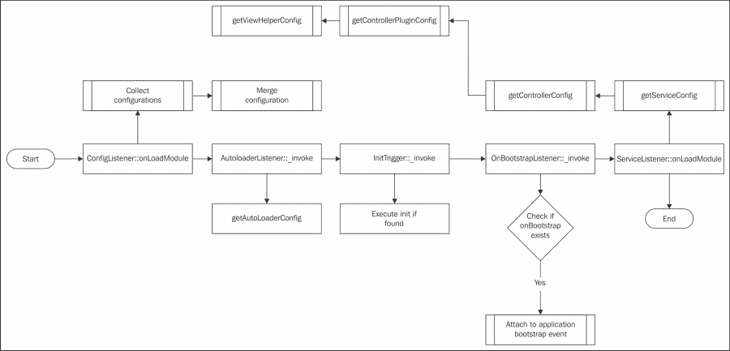

# 第六章 模块、模型和服务

在本章中，我们将涵盖：

+   创建一个新的模块

+   将模块作为小部件使用

+   一个模型和一个 Hydrator

+   基本服务

# 简介

本章全部关于充分利用我们的模块、模型和服务及其配置。由于 Zend Framework 2 是一个模块化框架，模块显然是其中最重要的功能之一。我们将讨论如何自定义模块的配置以及如何与模型和服务一起工作。

# 创建一个新的模块

Zend Framework 2 库的核心是模块化的，一切都是基于模块化系统。这就是为什么我们将在本食谱中详细解释这一点，以便我们可以以最佳方式使用它。

## 准备工作

我们将使用 Zend Framework 骨干应用程序来创建新模块。提醒一下，Zend Framework 2 骨干应用程序可以在 [`github.com/zendframework/ZendSkeletonApplication`](https://github.com/zendframework/ZendSkeletonApplication) 找到。

## 如何做…

创建一个新的模块就像开始一幅新的画作一样，创建新的功能既令人兴奋又有趣，但总有规则需要我们遵守。在本食谱中，我们将讨论设置新模块的规则。

### 创建 Module.php

我们可以开始于一个简单的类文件（即 `/module/Sample/Module.php`），在正确的命名空间（`Sample`）中没有任何内容，这是模块的唯一要求。

```php
<?php

  namespace Sample;

  class Module {}
```

我们可以将以下方法添加到我们的`Module`类中：

```php
  public function getConfig()
  {
    return include __DIR__ . '/config/module.config.php';
  }
```

现在让我们创建一个`/module/Sample/config/module.config.php`文件，现在它将返回一个空数组，因为我们目前实际上没有要配置的内容。

```php
<?php

return array();
```

要连接到引导事件，模块只需在我们的`Module.php`文件中有一个`onBootstrap`方法，它为我们完成所有引导工作，或者我们可以定义在引导被调用时执行的引导事件（我个人最喜欢的）。

让我们看看两种方法，从`onBootstrap`方法开始：

```php
public function onBootstrap(MvcEvent $e)
{
  // Let's do something on the bootstrap!
}
```

如我们所见，一个简单的方法就足以创建引导，一旦应用程序的引导事件被触发，它就会引导模块。

### 附加到 loadModules.postevent

以下示例使用了 `/module/Application/Module.php` 文件：

```php
<?php 

namespace Application;

// Use the following classes
use Zend\ModuleManager\ModuleManager;
use Zend\ModuleManager\ModuleEvent;

class Module
{
  public function init(ModuleManager $moduleManager)
  {
    // We can get the event manager from our module manager
    $eventManager = $moduleManager->getEventManager();

    // Now we will attach ourselves to the event manager's event
    $eventManager->attach(
      ModuleEvent::EVENT_LOAD_MODULES_POST,
      function(ModuleEvent $event)
      {
        // Do something with our event, for example print the name  
        // of the module to the screen.
        echo '<pre>'. $event->moduleName. '</pre>';
      },
      // Make sure the rest of the triggers all have been 
      // triggered already
      -1000
    );

  }
}
```

### 实现 getAutoloaderConfig

以下示例是`Module.php`中的`Module`类的一部分：

```php
public function getAutoloaderConfig()
{
  return array( 
    'Zend\Loader\StandardAutoloader' => array(
      'namespaces' => array(
        __NAMESPACE__ => __DIR__. '/src/'. __NAMESPACE__
      ),
    ),
  );
}
```

让我们考虑以下更新的代码片段：

```php
public function getAutoloaderConfig()
{
  return array(
    'Zend\Loader\ClassMapAutoloader' => array(
      __DIR__. '/autoload_classmap.php',
    ),
    'Zend\Loader\StandardAutoloader' => array(
      'namespaces' => array(
        __NAMESPACE__ => __DIR__. '/src/'. __NAMESPACE__
      ),
    ),
  );
}
```

一个类映射文件的示例（文件 `/module/Application/autoload_classmap.php`）如下：

```php
<?php
return array(
  'Sample\Model\Test' => __DIR__. '/src/Sample/Model/Test.php', 
  'Sample\Model\Test2' => __DIR__. '/src/Sample/Model/Test2.php',
);
```

### 实现 getControllerConfig、getControllerPluginConfig 和 getViewHelperConfig

看看以下`getViewHelperConfig`的实现（在`/module/Application/Module.php`文件中）：

```php
<?php

namespace Application;

// We need this for the view helper config to be picked up
use Zend\ModuleManager\Feature\ViewHelperProviderInterface;

class ModuleViewHelperProviderInterface
{
  public function getViewHelperConfig()   
  {
    // See if the class exists first, to show off that we can use 
    return array(
      'invokables' => array(
          // This is a non existing view helper, but is just to 
          // show off how to use it.
          // Note: You cannot use a closure as an invokable.
          'exampleHelp' => 'Application\View\Helper\Example',
       )
    );
  }
}
```

## 它是如何工作的…

模块在`application.config.php`文件中引入后，由框架实例化。将模块的名称添加到文件中，框架将寻找名为模块的目录中的`Module.php`文件。`Module.php`文件包含一系列方法，这些方法将在框架在特定时间调用，例如加载配置或运行模块的引导。

在我们的示例中，我们将创建一个名为`Sample`的模块，它将有一个简单的控制器和一个输出一些文本的操作。

为了确保 Zend Framework 2 的`ModuleManager`能够识别我们的新模块，我们需要了解`ModuleManager`是如何工作的。`ModuleManager`执行的操作有三个：

+   它收集已启用的模块

+   如果需要，它初始化模块

+   它从所有模块收集配置

虽然我们可以使用`ZFTool`自动创建一个全新的模块，但我们仍然建议我们了解如何在没有它的情况下创建和构建模块。现在，我们将开始创建一个确保`ModuleManager`满意的模块。

### 创建一个新的模块目录

当创建一个新模块时，我们将尽可能地遵循推荐的方式，以便我们能够清楚地了解它是如何工作的。首先，在模块目录中创建一个名为`Sample`的新目录。这个目录将成为我们与 Sample 模块命名空间相关的代码的主要目录，这样我们就可以将所有相关的代码都包含在这个目录中。

### 创建`Module.php`

每个模块最重要的文件是`Module.php`文件，它不仅是必需的，而且还向框架提供了有关诸如代码位置和配置等重要信息的重要信息。

虽然它实际上不会在模块中初始化任何内容，但拥有一个模块的基本要求。请注意，由于`Module.php`中缺少代码，我们的应用程序无法访问模块内部的任何代码。

我们首先想确保框架能够读取我们模块的配置。这可以通过在`Module.php`中定义一个`getConfig`方法来实现，该方法需要一个数组作为返回值。

因为懒惰也是一种技能，我们只需将完整的`module.config.php`文件返回给`ModuleManager`。我们不必这样做，我们也可以返回一个包含配置的数组，但为了便于维护，最好将实际的配置与代码分开。这样我们就不必编辑代码来编辑配置。

现在我们知道我们的`ModuleManager`将加载我们的配置，是时候回顾模块的引导过程了，这在配置加载后有时是必要的。这可以通过在`Module.php`中使用`onBootstrap`方法或附加到`ModuleManager`事件来实现。

### 可选地处理 ModuleManager 事件

确保额外的代码片段将被执行的另一种方式是将它们附加到四个其他战略事件之一，即：`loadModules`、`loadModules.resolve`、`loadModule` 和 `loadModules.post`。

为了更好地解释它们，让我们简要地了解一下所有这些。

### 理解 loadModules 事件

当框架加载模块时，将触发 `loadModules` 事件，因此对于初始化模块，此事件几乎毫无用处，因为它永远不会在 `Module.php` 文件中调用（此时事件已经过去）。

在这一点上，框架仍在加载模块，我们的模块还没有发生任何事情。这就是为什么这个事件主要在框架的内部使用，而不是在我们的开发侧使用。然而，由于这个事件在整个加载模块的过程中都是活跃的，当所有其他事件都完成后，它也会做一些额外的事情。

此事件默认触发以下功能：

+   `Zend\Loader\ModuleAutoloader::register`：确保 `Module` 类可以被找到并启动（它还没有启动，只是检查）。

+   `Zend\ModuleManager\Listener\ConfigListener` `::onLoadModulesPre` `::onLoadModulesPost`：当所有模块都已加载时，此功能会将配置文件与通过应用程序配置中定义的 `glob()` 找到的本地配置文件合并，但仅当配置未内部缓存时（默认情况下不是这种情况）。

+   `Zend\ModuleManager\Listener\LocatorRegistration::onLoadModulesPost`：如果 `Module` 类实现了 `LocatorRegisteredInterface` 接口，则此操作会将模块的服务附加到 `ServiceManager`，并将 `Module` 类立即添加到 DI 中。这是在所有模块都已加载时完成的。

### loadModules.resolve 事件

另一个内部事件，模块无法使用的事件是此事件，它为我们在 `application.config.php` 中定义的每个模块触发。实际上，此事件将尝试在我们的模块的 `Module.php` 文件中找到 `Module` 类，所以虽然对我们模块（目前）没有用，但它已经接近了！

此事件默认触发以下功能：

+   `Zend\ModuleManager\Listener\ModuleResolverListener::__invoke`：启动 `Module` 类。

### loadModule 事件

现在，`Module` 类的对象已经创建；`loadModule` 事件将通过其他监听器传递它。

此事件默认触发以下功能：

+   `Zend\ModuleManager\Listener\ConfigListener::onLoadModule`：通过获取所有 Module 类的 getConfig() 来合并配置。

+   `Zend\ModuleManager\Listener\AutoloaderListener::__invoke`：如果可用，此操作会在 `Module` 类中调用 `getAutoloaderConfig`，以便我们可以为新模块启动自动加载。

+   `Zend\ModuleManager\Listener\InitTrigger::__invoke`：如果可用，此方法会调用`Module`类中的 init 方法。

+   `Zend\ModuleManager\Listener\OnBootstrapListener::__invoke`：这会将`Module`类的`onBootstrap`方法附加到应用程序的引导事件，因此它将在那时运行。

+   `Zend\ModuleManager\Listener\ServiceListener::onLoadModule`：如果存在，此方法会调用`Module`类中的以下方法（我们将在本食谱的稍后部分更详细地讨论这些方法）：

    +   `getServiceConfig`：从模块类获取`ServiceManager`配置。

    +   `getControllerConfig`：从`Module`类获取控制器配置。

    +   `getControllerPluginConfig`：从`Module`类获取控制器插件配置。

    +   `getViewHelperConfig`：从`Module`类获取视图助手配置。

显示模块加载简化版本的流程图如下：



### loadModules.post

当模块成功加载并且需要完成最后一些工作以完成整个过程时，会触发`loadModules.post`事件。

此事件默认触发`Zend\ModuleManager\Listener\ServiceListener::onLoadModulesPost`功能，并指示`ServiceManager`根据需要创建更多服务。

### 附加到 loadModules.post 事件

`loadModules.post`事件是我们可以在应用程序中附加处理程序的第一个事件，因为在此事件之前的事件只能由 Zend Framework 2 的内部监听器使用。这意味着没有很好的方法可以挂钩到这些事件，而不需要对我们自己的框架进行扩展。

然而，`loadModules.post`事件仍然可能很有用，例如，确保我们的模块被正确加载，或者用于其他与模块配置相关的事情。将我们自身附加到这个事件的最佳方式是通过尽可能高地使用`EventManager`。在这种情况下，这将是模块的`init()`方法，因为该方法在`loadModule`事件期间被调用，并且是第一个包含`EventManager`的方法。

### 更具体的非配置文件模块配置

有时我们选择不始终使用`module.config.php`文件，并需要更动态的实例化，例如，服务或配置。幸运的是，Zend Framework 2 完全支持任何动态配置功能。如前所述，我们可以向我们的`Module`类添加五个额外的方法，这些方法在模块实例化期间被拾取，分别是`getAutoloaderConfig`、`getServiceConfig`、`getControllerConfig`、`getControllerPluginConfig`和`getViewHelperConfiguration`。

### getAutoloaderConfig 方法

`getAutoloaderConfig`方法将加载我们模块的自动加载器配置，并期望一个与`AutoloaderFactory`兼容的数组。在 Zend Framework 2 中，通常有两种接受的方式来自动加载。第一种是使用`StandardAutoloader`，它需要一个要加载的命名空间和一个要递归的目录。第二种是使用`ClassMapAutoloader`，它基本上是一个包含每个完整域名和类名及其对特定文件的引用的数组的文件。

它们在示例中都显示出来了，所以请查看它们以了解差异。

在第一个例子中，我们使用`StandardAutoloader`是因为我们只想让我们的框架通过`[当前目录]/src/Sample`目录中的目录结构加载命名空间`__NAMESPACE__`（对于我们的模块来说是`Sample`）中的所有类。这意味着完全在`Sample\Model\Test`中调用的类将在`/src/Sample/Model/Test.php`中搜索。虽然这在开发环境中非常方便，但在生产环境中并不方便，因为大型应用程序会对搜索我们需要的类名造成很大压力。在这种情况下，我们可以使用这个`StandardAutoloader`，但除此之外（具有更高的优先级），我们还将使用一个`ClassMapAutoloader`，它加载一个静态文件，其中包含所有类名映射到特定目录。

这告诉 PHP，当我们搜索类`Sample\Model\Test`时，它可以在`/src/Sample/Model/Test.php`（或者实际上任何地方，因为我们直接将 PHP 指向我们的文件）中找到。这两个自动加载器都是 PSR-0，其中 PSR 代表 PHP 标准建议的兼容性。

在第二个例子中，我们可以看到我们优先考虑了我们的`autoload_classmap.php`文件，而不是`StandardAutoloader`，这意味着它将首先在我们的类映射文件中查找，然后再尝试自己查找。

要使框架使用`getAutoloaderConfig`方法，我们必须确保我们的`Module`类实现了`Zend\ModuleManager\Feature\AutoloaderProviderInterface`类，并且它包含单个公共方法`getAutoloaderConfig()`，否则它将不会尝试执行它。记住，仅仅实现该方法是不够的，因为它会具体检查我们是否实现了接口。

### `getControllerConfig`、`getControllerPluginConfig`和`getViewHelperConfig`方法

我们可以通过`get***Config`方法，而不是通过`module.config.php`或作为覆盖来加载控制器配置。我们可以像`getServiceConfig`方法一样创建该方法，因为返回的对象可以是`Zend\ServiceManager\Config`的实例，或者是一个包含配置的简单数组，就像在`module.config.php`中一样。

如果我们想使用这些方法，我们不应该忘记用相应的接口实现我们的类：

`对于 getControllerConfig 方法，我们需要实现 Zend\ModuleManager\Feature\ControllerProviderInterface 接口。`

`对于 getControllerPluginConfig 方法，我们需要实现 Zend\ModuleManager\Feature\ControllerPluginProviderInterface 接口。`

`最后，对于 getViewHelperConfig 方法，我们需要实现 Zend\ModuleManager\Feature\ViewHelperProviderInterface 接口。`

# 将模块作为小部件使用

将模块作为小部件使用是一个很好的方法，可以在我们应用程序的不同位置使用模块。这就是为什么这个配方将解释我们如何以最佳方式完成这项工作。

## 准备工作

需要一个可工作的 Zend Framework 2 骨架应用程序才能充分利用这个配方。

## 如何做到这一点…

小部件，听起来就很好！我们将在这个配方中解释它们的作用以及如何使用它们。

### 创建 Comment/Controller/Index

我们将创建一个小控制器，它将返回一些示例评论，这些评论是静态的，仅用于示例。首先，我们应该确保我们有一个`Comment`模块，因此我们创建以下目录和文件：

```php
module/
   Comment/
      config/
         module.config.php
      src/
         Comment/
            Controller/
               IndexController.php
      view/
         comment/
            index/
               index.phtml
      Module.php
```

一旦我们建立了结构，我们就在`/module/Comment/Module.php`中尽可能简单地放置代码以初始化模块，如下所示：

```php
<?php

namespace Comment;

class Module
{
  // Get our module configuration
  public function getConfig()
  {
    return include __DIR__ 
         . '/config/module.config.php';
  }

  // Initialize our autoloader to load in our sources
  public function getAutoloaderConfig()
  {
    return array(
      'Zend\Loader\StandardAutoloader' => array(
        'namespaces' => array(
          __NAMESPACE__ => __DIR__. '/src/'
                         . __NAMESPACE__,
        ),
      ),
    );
  }
}
```

如我们所见，这是一个最基本的`Module`类，因为我们不需要比这更高级的。现在让我们快速在`/module/Comment/config`目录中创建我们的`module.config.php`配置文件：

```php
<?php

return array(
  // Set up a quick route to our comment output
  'router' => array(
    'routes' => array(
      'comment' => array(
        'type' => 'Zend\Mvc\Router\Http\Literal',
        'options' => array(
          'route'    => '/comment',
          'defaults' => array(
            'controller' => 'Comment\Controller\Index',
            'action'     => 'index',
          ),
        ),
      ),
    ),
  ),

  // Make sure the controllers are invokable by us
  'controllers' => array(
    'invokables' => array(
      'Comment\Controller\Index' =>
                    'Comment\Controller\IndexController'
    ),
  ),

  // Set the path to our view templates
  'view_manager' => array(
    'template_path_stack' => array(
       __DIR__ . '/../view',
    ),
  ),
);
```

现在我们已经使用一个响应`/`路径并映射到`Comment\Controller\IndexController::indexAction`的快速配置设置好了，我们可以继续处理实际的控制器（位于文件`/module/Comment/src/Comment/Controller/IndexController.php`）：

```php
<?php

namespace Comment\Controller;

use Zend\Mvc\Controller\AbstractActionController;
use Zend\View\Model\ViewModel;

class IndexController extends AbstractActionController
{
  // This is the action that will be called whenever we 
  // browse to /comment
  public function indexAction()
  {
    // Initialize our view model
    $view = new ViewModel();
    $comments = array();

    // Create some static comments and put them in our 
    // comments array
    for ($i = 0; $i < 10; $i++) {
      $comments[] = array(
          'name' => 'John Doe ('. $i. '),
          'comment' => 'Lorem ipsum dolor sit amet...'
      );
    }

    // Return our view with the comments and make sure 
    // the renderer doesn't output our layout 
    // (setTerminal(true) does that)
    return $view->setVariable('comments', $comments)
                ->setTerminal(true);
  }
}
```

在创建我们的控制器之后，我们还需要创建的是视图脚本（位于文件`/module/Comment/view/comment/index/index.phtml`），以便实际以 HTML 表格的形式输出数据：

```php
<?php /* loop through the comments to display them */ ?>
<?php foreach ($this->comments as $comment) : ?>
  <tr>
    <td>
      <?php echo $comment['name'] ?>:
    </td>
    <td>
      <?php echo $comment['comment'] ?>
    </td>
  </tr>
<?php endforeach; ?>
```

现在我们已经完全设置了我们的模块，我们可以继续并以小部件的形式显示评论。

### 使用视图助手来静态显示评论

首先，我们想要创建视图助手本身，让我们在`Comment`模块（文件是`/module/Comment/src/Comment/View/Helper/Comments.php`）中这样做，因为数据无论如何都是从那里来的：

```php
<?php

namespace Comment\View\Helper;

use Zend\View\Helper\AbstractHelper;
use Comment\Controller\IndexController;

class Comments extends AbstractHelper
{
  public function __invoke()
  {
    // Instantiate the controller with the comments
    $controller = new IndexController();

    // Execute our indexAction to retrieve the 
    // ViewModel, and then add the template of that 
    // ViewModel so it renders fine
    $model = $controller->indexAction()->setTemplate(
              'comment/index/index'
    );

    // Now return our rendered view
    return $this->getView()
               ->render($model);
  }
}
```

现在我们需要做的只是在我们能够将其用于视图之前，将这个视图助手添加到我们的模块配置（文件是`/module/Comment/config/module.config.php`）中：

```php
  // Add our custom view helper to the configuration
  'view_helpers' => array(
    'invokables' => array(
      'comments' => 'Comment\View\Helper\Comments',
    ),
  ),
```

显然，我们在这里省略了其余的配置，因为我们不想重复自己。现在剩下的就是实际上在代码中使用新的视图助手。我们可以在视图脚本中添加以下代码行：

```php
<?php echo $this->comments() ?>
```

### 使用转发来静态渲染评论

让我们看看`CommentController`（文件是`/module/Application/src/Application/Controller/CommentController.php`）中`forward()`操作的代码片段：

```php
public function forwardAction()
{
  $view = new ViewModel();

  // Get the comments from the index action 
  $comments = $this->forward()
                   ->dispatch(
    // Which controller do we want to invoke
    'Comment\Controller\Index', 

    // Any specific options we want to give it
    array('action' => 'index')
  );

  // If we keep this on true it will return an 
  // exception, so let us not do that
  $comments->setTerminal(false);

  // Return the view model with the comments as child
  return $view->addChild($comments, 'comments');
}
```

这获取了特定控制器（我们的 `Comment\Controller\Index::indexAction`）中动作的已分发状态，并将其作为 `$comments` 返回给我们，这是一个 `ViewModel` 实例。我们将它作为子实例添加到当前的 `ViewModel` 实例中，然后我们可以在视图脚本中使用以下代码片段简单地输出它：

```php
<?php echo $this->comments ?>
```

这与输出一个正常变量相同，尽管这给人一种干净解决方案的感觉，但 `forward()` 方法在压力下是出了名的糟糕。

### 通过 AJAX 获取评论

让我们看看我们的视图脚本在 JavaScript 中的样子：

```php
<!-- our comments will load in here -->
<table class="comments"></table>

<!-- first we want to make sure that we load in the jQuery script that comes with the Zend Framework 2 skeleton application -->
<script src="img/jquery.min.js') ?>"></script>

<!-- this is the JavaScript bit -->
<script>
  // This means jQuery will execute this code whenever 
  // the document is done loading
  $(document).ready(function() {
    // We want to do a GET request in the background
    $.get(
      // We want to get this URL
      '/comment', 

      // This function will be executed when the 
      // data comes back from the server
      function(data) {
        // Put our data (the comments) in our 
        // comments table
       $('table.comments').html(data);
      }
    );
  });
</script>
```

## 它是如何工作的…

这是这种情况：我们有一个页面，其中包含一个用户应该能够评论的小故事。然而，评论部分在代码的几个其他位置也被使用，因此应该是可重用的。但是有一个前提，评论部分在布局上不会改变，它总是需要以相同的方式显示。

我们将要创建三个不同但有效的模块实现，该模块被用作小部件。前两个将给整个系统带来更多的静态感，而第三个将使用 JavaScript（确切地说，是 jQuery）来加载评论。我们还将讨论一个理论上的第四种解决方案，这应该被考虑。

但首先，我们将设置一个小环境，我们将在获取评论的示例中使用它。

我们将设置 `Application/Controller/Comment` 控制器，该控制器将定义 `helperAction`、`forwardAction` 和 `ajaxAction` 方法。然后我们将使用这个控制器和动作在 `Comment/Controller/Index` 控制器和 `indexAction` 方法中显示评论。

### 使用视图助手静态显示评论

在静态方式显示评论的最佳选项是创建一个特定于此小部件的视图助手。我们将要做的是创建一个小视图助手，它将渲染我们的评论并将它们返回到我们的视图。这样我们就可以在我们的视图中到处使用它，而无需像 `forward()` 或 AJAX 方法那样造成很多麻烦。

正如我们在示例中所见，我们实例化控制器并手动检索动作的输出，然后手动渲染并返回给视图。这样做并不总是这么简单，但它接近现实。

### 使用 forward() 方法静态渲染评论

另一个不太好的想法但也值得提及的是，通过 `forward()` 方法获取评论，这种方法虽然脆弱，但至少它不像 AJAX 功能那样需要经过整个 MVC 初始化。

### 通过 AJAX 获取评论

最后但同样重要的是，当我们想要更加创新，或者我们的环境需要异步 AJAX 实现时，我们也有一个更技术性的非 PHP 解决方案。这种方法的想法是，我们简单地通过 JavaScript（具体来说是 jQuery 库）从 URL 中检索我们的评论。

这只需要我们在视图脚本中输入一点客户端 JavaScript 代码来使其工作，这很好，因为我们不需要在代码中做太多调整。然而，它有一个很大的缺点，那就是我们又将经历整个 MVC 流程来从数据库接收评论。另一方面，它将加快我们主要动作的响应时间，因为它不需要静态地加载评论。另一个缺点是，访问网站的访客需要启用 JavaScript 的浏览器才能看到评论，但我们假设现在每个人都有这样的浏览器。

如我们从示例中看到的那样，这是一个检索评论相当简单的方法，但它附带有之前提到的缺点。然而，有时从其他地方获取数据在性能上可能是最佳选择。这完全归因于应用程序的架构。

### 关于小部件化

将模块小部件化并不是框架绝对原生支持的功能，但正如上文所述，我们可以通过尽可能多地使用（而不是滥用）框架来轻松实现这一点。

尤其是自行实例化控制器和执行动作是处理应用程序其他部分数据的一种极好方法。然而，我们必须小心，模块本身应该是独立的（或者至少尽可能独立），我们不应该过分依赖它们的存在。

但公平地说，完美的状况永远不会出现，我们有时只需要做一些妥协。在我们的情况下，这可能是依赖于可能不存在的模块。

# 模型和水化器

模型是向我们的应用程序提供功能的一种极好方式，并且它们将控制器保持得非常干净，远离任何关键逻辑。水化器也非常适合在模型之间传输属性和值，这就是为什么我们要进一步探讨它，以便充分利用它。

## 准备工作

为了充分利用这个菜谱中的示例，需要一个可工作的 Zend Framework 2 框架骨架应用程序。

## 如何操作…

在这个菜谱中，我们将设置一个模型和一种将数据从模型中填充到模型以及从模型中提取数据的方法，以便我们能够轻松访问我们的数据。

### 访问模型

我们可以通过在文档顶部简单地添加一个 use 语句在任何地方访问模型：

```php
use Application\Model\SampleModel;

$object = new SampleModel();
```

或者通过使用包括命名空间在内的类的完全限定名称，如下所示：

```php
$object = new \Application\Model\SampleModel();
```

如果已经存在一个名为 `SampleModel` 的类，但来自不同的命名空间，或者如果我们只想给它一个更易识别的名字，我们也可以使用别名（但这不是模型特有的，我们可以在任何命名空间类中使用它），如下所示：

```php
use Application\Model\SampleModel as NewModel;

$object = new NewModel();
```

### 创建水化器

现在的首要任务是设置一个非常简单的模型（文件位于 `/module/Application/src/Application/Model/SampleModel.php`），我们将使用它来进行数据填充，如下所示：

```php
<?php

namespace Application\Model;

class SampleModel 
{
  private $engine;
  private $primary;
  private $text;

  public function getEngine() {
    return $this->engine;
  }

  public function setEngine($engines) {
    $this->engine = $engines;
  }

  public function getPrimary() {
    return $this->primary;
  }

  public function setPrimary($primary) {
    $this->primary = $primary;
  }

  public function getText() {
    return $this->text;
  }
  public function setText($text) {
    $this->text = $text;
  }
}
```

这个极其基础的模型除了几个属性及其 getter 和 setter 之外，没有其他东西，简单，但它将适用于我们试图实现的目标。在接下来的示例中，我们将为我们的虚拟数据库表创建一个`Hydrator`，然后我们将使用表中的数据水化我们的`SampleModel`（文件位于`/module/Application/src/Application/Model/Hydrator/SampleModelHydrator.php`）：

```php
<?php

// Don't forget to namespace our class
namespace Application\Model\Hydrator;

// We extend from this class
use Zend\Stdlib\Hydrator\AbstractHydrator;

class SampleModelHydrator extends AbstractHydrator
{
  private $mapping = array(
    'id' => 'primary',
    'value' => 'engine',
    'description' => 'text',
  );

  // Extracts the hydrated model   
  public function extract($object) {}

  // Hydrates our values to our model
  public function hydrate(array $data, $object) {}
}
```

我们现在已经设置了 hydrator 的基本类，现在实现的方法只是由于`AbstractHydrator`类我们需要拥有的定义。接下来我们想要做的是在其中有代码来真正使其工作。我们将进一步实现的是`hydrate()`方法，这将使我们的`SampleModel`变得可水化：

```php
public function hydrate(array $data, $object) 
{
  // If we are not receiving an object, throw an 
  // exception
  if (is_object($object) === false) {
    throw new \Exception(
      "We expect object to be an actual object!"
    );
  }

  // Loop through the properties and values 
  foreach ($data as $property=>$value) {
    // Check if the property exists in our mapping
    if (array_key_exists($property, $this->mapping)) {
      // Build the setter method from our property
      $setter = 'set'. ucfirst(
         $this->mapping[$property]
      );

    // Set the value of the property
    $object->$setter($value);
    }
  }

  // Now return our hydrated object
  return $object;
}
```

现在，让我们使用`extract()`方法，它从我们的`SampleModel`中提取值，并将它们放回一个数组中，这个数组也是我们最初用于水化对象的方式：

```php
public function extract($object) 
{
  // If we are not receiving an object, throw an 
  // exception
  if (is_object($object) === false) {
    throw new \Exception(
         "We expect object to be an actual object!"
      );
  }

  $return = array();

  foreach ($this->mapping as $key=>$map) {
    // Build the getter method from our property
    $getter = 'get'. ucfirst($map);

    // Get the property value from the object
    $return[$key] = $object->$getter();
  }

  return $return;
}
```

那就是如何再次从水化对象中提取值。

### 创建水化策略

如果我们稍微改变`SampleModel`（文件位于`/module/Application/src/Application/Model/SampleModel.php`）中的主属性设置器，使其反映在以下代码片段中：

```php
public function setPrimary($primary) 
{
  // Throw an exception if there is no valid integer.
  if (!is_int($primary)) {
    throw new \Exception(
       "Primary ({$primary}) should be an integer!"
    );
  }

  $this->primary = $primary;
}
```

让我们先创建我们的策略（文件位于`/module/Application/src/Application/Model/Hydrator/Strategy/SampleHydratorStrategy.php`）：

```php
<?php

namespace Application\Model\Hydrator\Strategy;

// We need to implement this interface to make it 
// eligible to be a strategy
use Zend\Stdlib\Hydrator\Strategy\StrategyInterface;

class SampleHydratorStrategy implements StrategyInterface
{

  // This method is called every time an object is 
  // extracted
  public function extract($value) 
  {
    // Check if the value is an integer
    if (is_int($value) === true) { 
      return (int)$value;
    } else {
      // No integer, just randomly return an integer
      return rand(0, 10000);
    }
  }

  // This method is called just before the property of 
  // the object is hydrated
  public function hydrate($value) 
  {
    // Check if it is a valid integer
    if (is_int($value) === true) {
      return (int)$value;
    } else {
      // No integer, random integer is returned
      return rand(0, 10000);
    }
  }
}
```

现在，我们需要在我们的`Hydrator`类中更改两个东西，以便它也支持水化策略（文件位于`/module/Application/src/Application/Model/Hydrator/SampleModelHydrator.php`）：

```php
public function extract($object)
{
  [.. current code in between ..]

  $return[$key] = $this->extractValue(
      $key, $object->$getter()
  );

  [.. rest of the code ..] 
}

public function hydrate(array $data, $object)
{
  [.. current code in between ..]

  $object->$setter($this->hydrateValue(
      $this->mapping[$property], $value)
  );

  [.. rest of the code ..]
}
```

正如我们所见，我们只需更改之前显示的代码行，以确保它将使用我们的`Hydrator`中的水化策略。

在下一个示例中，我们将使用`Hydrator`将我们的`SampleModel`水化到我们的控制器中（文件位于`/module/Application/src/Application/Controller/IndexController.php`）：

```php
<?php

namespace Application\Controller;

use Application\Model\SampleModel;
use Application\Model\Hydrator\SampleModelHydrator;
use Application\Model\Hydrator\Strategy\SampleHydratorStrategy;
use Zend\Mvc\Controller\AbstractActionController;

class IndexController extends AbstractActionController
{
  public function indexAction()
  {
    // First initialize our model
    $model = new \Application\Model\SampleModel();

    // Now create a sample array of data to hydrate
    $data = array(
      'id' => 'Some Id',
      'value' => 'Some Awesome Value',
      'description' => 'Pecunia non olet',
    );
    // Now create our Hydrator
    $hydrator = new SampleModelHydrator();

    // Now add our strategy to it to check when the primary 
    // value is set (if we put id, it would be when the 
    // value would be retrieved)
    $hydrator->addStrategy(
        "primary", 
        new SampleHydratorStrategy()
    );

    // Now hydrate our model
    $newObject = $hydrator->hydrate($data, $model);

    // And if necessary extract the values again
    $extract = $hydrator->extract($newObject); 

    // Now output it to the browser
    echo "<pre>". print_r($extract, true). "</pre>";
  }
}
```

如果我们知道比较提取值与原始值，我们可以看到 ID 现在已更改为随机数，这告诉我们水化策略已经完成了其工作。

## 它是如何工作的…

### 考虑模型的目的

根据定义，模型应该只包含与应用程序一个非常具体的部分相关的功能。这意味着如果我们开始编写模型，我们应该注意这个要求，并使我们的模型轻量级且针对单一目的。

有很多小块代码的想法是我们可以更容易地维护它们，我们只加载我们想要使用的。而不是加载一个包含所有所需功能的 40k 行长的模型，我们希望将它们拆分成小型功能类，这些类只做它们名字所表示的事情。

### 考虑模型的位置

模型的位置特别重要，因为我们仍然希望能够在我们的代码中找到它。我们应该给它一个与其功能相似的名字，并且它应该尽可能具体。

如果我们需要命名一个模型，我们还需要将其放置在一个有意义的地点，这样当我们寻找某些功能时，我们只需在最有意义的位置搜索即可找到它。

例如，让我们看看以下命名空间和类名：

```php
Api\Model\Db\User\Information
```

如果我们搜索一个检索用户信息的方法，那么这个类将是开始搜索的好方法。

### 考虑模型的方法

模型的方法显然是模型最重要的部分，它也是通常被高度忽视的部分。例如，开发者有时在定义方法时使用错误的可见性，这导致其他开发者错误地使用它们，因为他们认为可以（或不能）使用特定方法，因为其可见性。

有时方法命名不正确或可见性设置错误，结果我们不得不重构代码。所有这些都可以通过事先考虑来避免。

### 小贴士

也很明智地为你的方法命名正确，正确放置可见性，并在我们的应用程序中使用严格的命名约定。

方法名应该通过`camelCase`命名，并且只有受保护和私有方法可以以下划线开头。

### 单元测试模型

测试你的模型是确保方法输出始终与预期输出匹配的绝佳方式。一个更伟大的（个人）开发模型的方式是进行 TDD（测试驱动开发），这样你就有了一个客观的测试，而不是主观的测试，如果你在编写方法之后编写测试。我们将在第九章捕捉错误中更多地讨论单元测试和 TDD。

### 记录你的类

通常，在类被忽视和/或未维护的同时，它应该是你日常工作中存在的东西。即使我们是这个项目唯一的开发者，并且我们知道十年后我们仍然是唯一的开发者，这仍然是一个很好的方式，让未来的我们知道我们为什么创建那个方法，它做什么，以及我们可以期望它返回什么。

PHP DocBlock，简称 PHPDoc，是我们以注释格式记录代码的正式标准。首先，docblocks 可以通过以下语法来识别：

```php
/**
 * This is used to describe the method, file or class.
 *
 * @param string $parameterOne Some description here.
 * @result Boolean
 * @throws Some\Exception
 * @author J. Callaars <bcallaars@gmail.com>
 */
public function someMethod($parameterOne);
```

如我们所见，普通注释块与文档块之间的区别在于开头使用的两个星号。之后的第一行应始终描述当前的方法、类或文件（无论上下文如何）。随后的行包含标签，这些标签用于定义文档块的一些属性。例如，`@param` 标签用于定义方法参数，这些参数具有定义的类型和其后参数的名称。`@result` 表达了方法调用的返回值，而 `@throws` 告诉我们在这个方法中可能会抛出异常。最后但同样重要的是，`@author` 告诉我们谁最初创建了该方法/文件/类。

显然，还有许多其他标签可以使用，其中大多数可以在 [`en.wikipedia.org/wiki/PHPDoc`](http://en.wikipedia.org/wiki/PHPDoc) 找到。

我们建议使用 `phpDocumenter` 语法作为创建方法和类文档的标准，因为它是一个行业标准，并为我们提供了轻松生成技术文档的选项。

### 创建填充器

填充器是那些可以用来使用给定的值填充特定类的类。

这在从数据库表检索数据并将其映射到另一个模型时特别有用，其中模型不需要知道表和 `TableGateway` 如何将它们映射到模型。在这种情况下，`Hydrator` 作为模型和数据访问层之间的中介是完美的。

`mapping` 属性定义了接收到的数组（我们用它来填充）与对象侧属性之间的映射。例如，如果我们的数组包含一个键 ID，我们将在对象中设置 primary 属性。显然，这是 `hydrate` 方法可能的最基本形式，因为它只是检查我们是否有一个有效的对象，然后检查我们是否具有想要设置的属性名称，如果存在则设置它。

### 创建填充器策略

现在我们有一个简单的填充器，我们可能想看看 Zend 框架中的另一件新奇的部件：填充器策略。简单地说，填充器策略是将正在解析的值转换成 `Hydrator` 的过程。

我们现在已更改填充器的首要设置器，以便当它接收到除整数之外的其他内容时，将抛出异常。

但我们的 `Hydrator` 不熟悉模型中的属性，这反过来意味着当使用不兼容的值时，将抛出异常。为了克服这个问题（以及许多其他问题），我们可以使用填充器策略，它将在值传递到模型之前有最后的机会设置值。

现在的计划是我们将创建一个 hydrator 策略，该策略将检查我们的主要属性并确保它返回一个整数。正如我们稍后可以看到的，我们基本上创建了一个`extract`和一个`hydrate`方法，这些方法将检查是否存在整数值，如果不存在，则返回一个随机整数。这样我们就可以确保进入我们模型的所有值至少是我们期望的类型。

### 关于模型

模型只是普通的类，与任何其他类没有区别。然而，模型背后的原则是所有业务关键逻辑都定义在其中。MVC 倾向于拥有瘦控制器（这意味着没有或几乎没有逻辑）和胖模型。

另一方面，hydrator 是用于模型之间的类，例如，在从一个模型到另一个模型或从`TableGateway`到模型以及相反的数据交换时使用。显然，我们编写的每个模型都不需要`Hydrator`，但随着应用程序的增长，我们喜欢在不改变现有功能的情况下实现新功能，而`Hydrator`可以作为关键因素，因为它们可以作为对象之间的代理。

## 还有更多…

还有更多关于 hydrator 的内容要写，特别是与 Zend Framework 2 一起提供的不同类型的默认 hydrator。如果我们想了解更多关于这方面的信息，我们应该查看`Zend\Stdlib\Hydrator\ArraySerializable`、`Zend\Stdlib\Hydrator\ClassMethods`和`Zend\Stdlib\Hydrator\ObjectProperty` hydrator 的文档。

# 基本服务

Zend Framework 2 最大的特性之一是`ServiceManager`，其在我们应用程序的初始引导阶段就可以看到它的影响。我们不需要理由来解释为什么这个菜谱会在这个主题上深入探讨，对吧？

## 准备工作

再次强调，为了充分利用这个菜谱中的示例，应该有一个 Zend Framework 2 骨架应用程序正在运行。

在我们继续之前，让我们弄清楚服务和模型之间的区别。尽管服务的定义有时是一个判断性的选择，但可以安全地假设服务是一个位于控制器和模型之间的类，它隐藏了控制器中所有糟糕的逻辑，例如检查身份验证或调用模型中的方法。另一个不同之处在于，我们案例中的服务将由`ServiceManager`管理，因此可以从我们的应用程序中的任何控制器（和其他服务）中调用。

## 如何做…

服务是确保我们的功能可以在应用程序的几乎任何地方访问的绝佳方式，在这个菜谱中，我们将展示如何做到这一点！

### 创建服务

我们将在`/module/Application/src/Application/Service/Example.php`文件中创建我们的服务：

```php
<?php

namespace Application\Service;

use Zend\ServiceManager\ServiceLocatorAwareInterface,
    Zend\ServiceManager\ServiceLocatorInterface;

class Example implements ServiceLocatorAwareInterface 
{
  protected $serviceLocator;

  // This is set by our initialization so we don't 
  // actually have to do this ourselves probably
  public function setServiceLocator(ServiceLocatorInterface $serviceLocator) 
  {
    $this->serviceLocator = $serviceLocator;
  }

  // Retrieve the service locator, handy if we want to 
  // read some configuration
  public function getServiceLocator() 
  {
    return $this->serviceLocator;
  }

  // Let's create a simple string to rot13 encoder as an 
  // example
  public function encodeMyString($string)
  {
    return str_rot13($string);
  }
}
```

现在唯一剩下的事情是将此服务添加到模块配置（文件是`/module/Application/config/module.config.php`）中，这样它也可以被应用程序的其余部分访问：

```php
<?php 
return array(
  'service_manager' => array(
    'invokables' => array(
      // We are going to call our service through the 
      // ExampleService name
      'ExampleService' => 'Application\Service\Example',
    ),
  ),
);
```

当然，这又是一个片段，用来展示需要添加到配置中的内容。现在，我们可以通过执行以下操作轻松地在控制器中检索服务，例如：

```php
// This is an example from within a controller and 
// returns a rot13 encoded string
echo $this->getServiceLocator()
          ->get('ExampleService')
          ->encodeMyString("Service? Easily created!");
```

### 在控制器中获取服务

这个例子表明，从控制器中检索服务非常简单。在服务内部，我们也可以通过执行以下操作轻松地获取我们的主要应用程序配置：

```php
// This is executed from within a service class and will 
// return the configuration of the application
$config = $this->getServiceLocator()->get('config');
```

## 它是如何工作的...

我们创建了一个非常基本的服务并将其添加到我们的 `Application` 模块的配置中。其背后的想法是，我们可以展示创建服务、激活它以及在应用程序中使用它的简单性。我们将创建一个将由 `ServiceManager` 管理的服务，它所做的只是对字符串进行 rot13 编码。

要创建一个服务，我们只需要在我们的类中实现 `Zend\ServiceManager\ServiceLocatorAwareInterface`，它预定义了两个方法，即 `getServiceLocator` 和 `setServiceLocator`。`setServiceLocator` 在实例化期间被调用，大多数时候（至少在我们将服务添加到配置中时）我们不需要手动执行此操作。

然而，`getServiceLocator` 是一个我们可以用来获取 `ServiceLocator` 的方法，从它我们可以获取其他服务或可能是应用程序本身的配置等有用的东西。

服务是在模块加载时实例化的，如果它们在模块配置中，或者只是在应用程序的某个地方。然而，当我们实例化服务时，我们知道我们总是可以通过 `ServiceLocator` 的相同简单 `get()` 方法在任何其他地方获取它，一旦它被实例化。
