# 第一章. 开始使用 Zend Framework 2.0

*在本章中，我们将设置并配置我们的开发环境，以便开始使用 Zend Framework 2.0 进行开发。我们将设置一个 PHP 应用程序服务器，安装 MySQL，并创建一个开发数据库，该数据库将在后续章节中用于我们的 Zend Framework 学习练习。那么，让我们开始吧。*

# Zend Framework 2.0

Zend Framework 最后一个主要版本，即 2007 年发布的 1.0 版；在过去的五年里，Zend Framework 经历了许多变化，成为了一个成功的基于 PHP 的框架。但仅仅更新框架，Zend Framework 仍然保留了一些在 Zend Framework 1.0 中固有的问题。

Zend Framework 2.0 是通过从核心重构框架来尝试使 Zend Framework 更好的一个尝试。以下列出了 Zend Framework 2.0 相较于其前版本的几个关键特性：

+   PHP 5.3 特性，如命名空间和闭包

+   模块化应用程序架构

+   事件管理器

+   依赖注入（DI）

在接下来的章节中，我们将了解如何实现 Zend Framework 2.0 的新特性。

在本章中，我们将介绍 Zend Framework 2.0 的一些先决条件的安装和配置。ZF2 可以安装在大多数支持 PHP 5.3.3 或更高版本的 PHP 启用 Web 服务器上。

我们已经使用 Zend Server Community Edition 作为我们的默认 Web 服务器；然而，任何支持 PHP 5.3.3 的其他 PHP 栈也可以使用。或者，你也可以分别下载 Apache 和 PHP，然后在 Apache 上安装 PHP。

### 注意

为了简化安装过程，我在本书中主要使用 Linux 作为主要开发环境。本书中使用的所有工具都适用于 Windows，并且可以用来执行相同的活动。

# Zend Server Community Edition (CE) 简介

Zend Server Community Edition 是流行的 Zend Server 栈的免费版本。Zend Server 栈提供了一个预集成的 PHP 应用程序栈，可以在开发、测试和生产中使用。这使得应用程序开发团队能够在整个开发阶段保持一致的环境。

Zend Server CE 还提供了诸如 Zend Optimizer+ 用于 PHP 字节码缓存和 Zend Guard 用于编码文件等功能。

## Zend Server CE – 系统要求

Zend Server 为 Windows、Mac OS X 和与大多数 Linux 发行版兼容的通用安装包提供了安装程序。

关于安装要求的更多详细信息可以在 [`www.zend.com/en/products/server/system-requirements`](http://www.zend.com/en/products/server/system-requirements) 找到。

# 行动时间 - 安装 Zend Server CE

我们接下来的步骤将是下载和安装 Zend Server CE；我正在运行 Ubuntu 12.04 精确斑马。其他操作系统的安装程序可能不同；您始终可以参考 Zend Server 网站上的安装说明。以下安装 Zend Server CE 的步骤：

1.  访问 Zend Server 社区版网站([`www.zend.com/en/community/zend-server-ce`](http://www.zend.com/en/community/zend-server-ce))并下载适用于您操作系统的最新版本的 Zend Server。在这种情况下，我们将下载 Linux 安装程序。

1.  一旦下载了安装程序，请将其内容提取到临时位置：

    ```php
    $ tar -zxvf ZendServer-5.6.0-RepositoryInstaller-linux.tar.gz

    ```

1.  提取后，需要以管理员权限启动安装程序：

    ```php
    $ cd ZendServer-RepositoryInstaller-linux/
    $ sudo ./install_zs.sh 5.3 ce

    ```

    ### 注意

    我们向安装程序传递了两个参数。第一个是需要安装的 PHP 版本；在这种情况下是`5.3`。第二个参数标识需要安装的 Zend Server 版本；在这种情况下是`ce`，代表社区版。

1.  在安装过程中，安装程序将要求您下载各种包：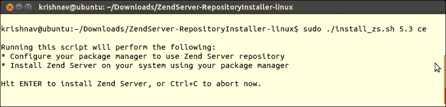

1.  Zend Server 默认将安装到`/usr/local/zend`；默认文档根目录将指向`/var/www`。您可以使用以下文件对 Zend Server 实例进行配置更改：

    +   Apache 主配置文件位于`/etc/apache2/apache2.conf`

    +   PHP 配置由`/var/local/zend/etc/php.ini`控制

    以下截图显示了 Zend Server 的安装位置：

    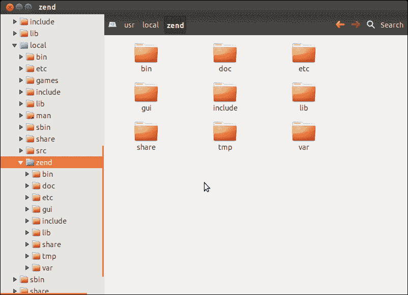

1.  安装完成后，您应该能够在您的网页浏览器中打开`http://localhost`。这应该会带您到一个类似于以下截图的测试页面：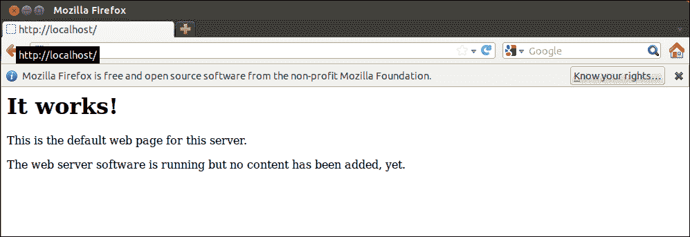

### 提示

要重启 Zend Server，请使用`$ sudo service zend-server restart`命令。

## *发生了什么？*

Zend Server CE 已安装并准备好使用。现在我们有一个运行中的 Web 服务器和兼容的 PHP 版本——这满足了运行 Zend Framework 2.0 的核心要求。

## 尝试一下英雄

我们将使用 Git 从 GitHub 检出 Zend Framework；Zend Framework 2.0 发生的主要变化之一是源代码控制已从 SVN 更改为 Git。

您接下来的任务将是安装 Git。在设置我们的 Zend Framework 项目时，我们将使用 Git。

### 提示

Git 二进制文件可以从[`www.git-scm.com/`](http://www.git-scm.com/)下载，或者从您的操作系统的仓库中安装。

Git 的安装说明可以在以下链接找到：

[`git-scm.com/book/en/Getting-Started-Installing-Git`](http://git-scm.com/book/en/Getting-Started-Installing-Git)

## 配置 Zend Server CE

我们的下一步将是设置 Zend Server CE 并进行一些配置更改，这将使我们能够运行其他 PHP 应用程序。

### Zend Server CE – 管理界面

Zend Server CE 的管理界面是一个基于 Web 的用户界面，它提供了以下功能：

+   管理 PHP 扩展

+   配置 PHP 指令

+   管理 Zend Server 组件

+   监控 PHP 状态、扩展状态和应用/服务器日志

在我们的下一个任务中，我们将通过使用其管理界面来对 Zend Server 进行配置更改。

# 行动时间 - 配置 Zend Server CE

安装完成后，需要配置 Zend Server。以下是为配置 Zend Server CE 的步骤：

1.  在您的默认浏览器中打开 Zend Server 的管理控制台（`http://localhost:10081/`）。

    ### 小贴士

    Zend Server UI 控制台在端口 10081 上运行，而 Web 服务器在端口 80 上运行。这就是为什么我们需要在访问 UI 控制台的 URL 中隐式指定端口号。

1.  当第一次打开 Zend Server 管理界面时，您将看到一个配置向导。请查看并接受 Zend 的**最终用户许可协议**页面的条款和条件：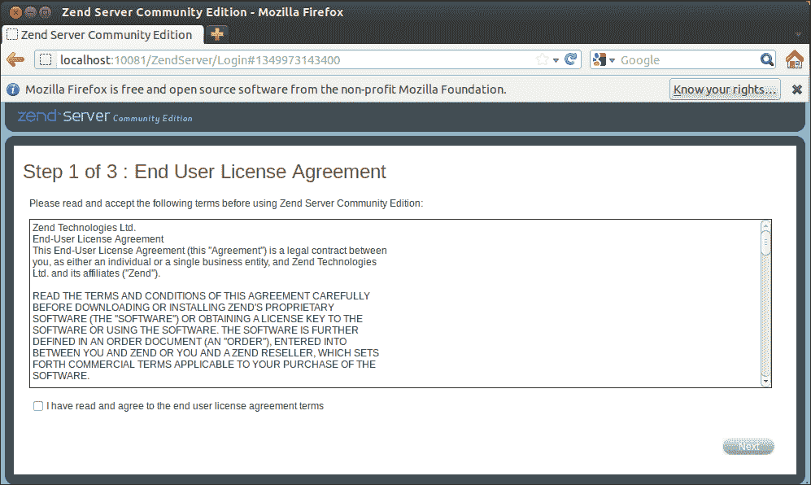

1.  如下截图所示，您将被要求为 Zend Server 安装设置密码：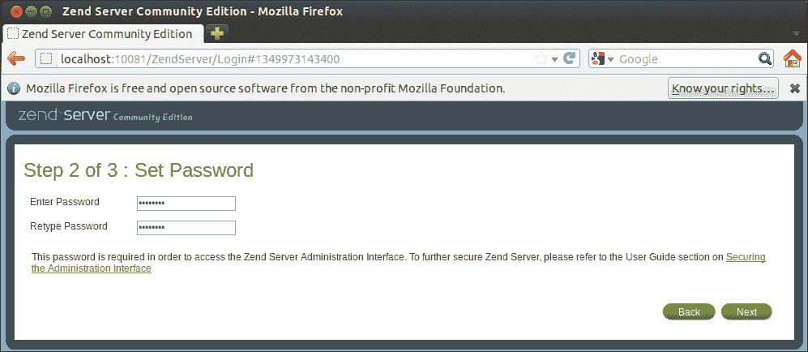

1.  在完成初始配置向导后，您将被重定向到 Zend Server 管理界面的主页。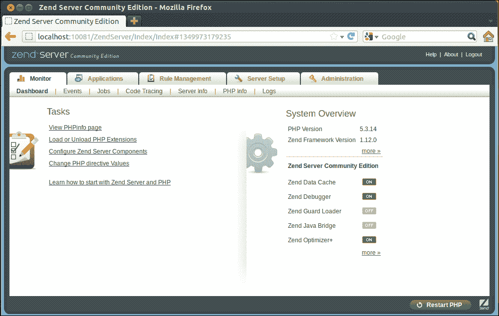

1.  我们需要设置会话保存路径。为了做到这一点，请执行以下步骤：

    1.  在**服务器设置**中导航到**指令**。

    1.  搜索`session.save_path`。

    1.  将值设置为`/tmp`。

    1.  点击**保存更改**然后**重启 PHP**。

    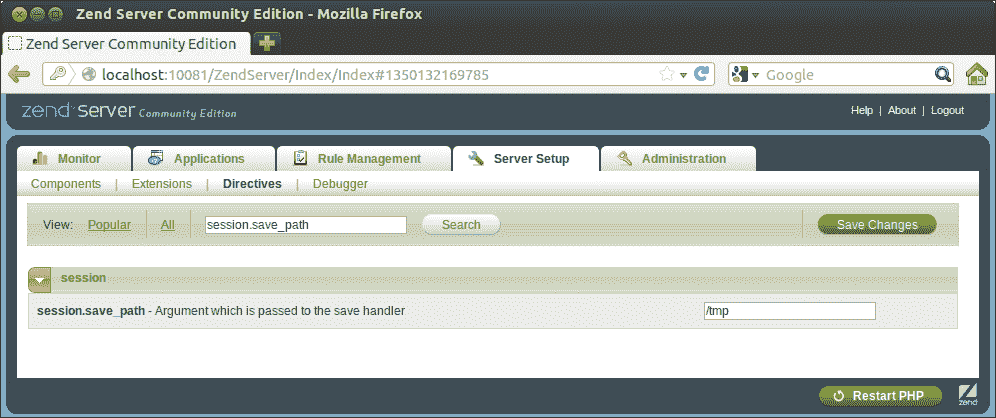

## *发生了什么？*

我们已成功使用 Zend Server 的管理界面修改了服务器配置，并且已重新启动在 Zend Server 上运行的 PHP 实例。

# MySQL

MySQL 无需介绍——它是全球最广泛使用的开源数据库应用程序。它是免费的，并且可在互联网上提供给希望使用 MySQL 数据库开发网站和应用程序的个人和企业。

Zend Framework 2.0 支持 MySQL，以及 SQLite、PostgreSQL 和 Microsoft SQL Server。

我们的下一次练习将在我们的开发机上安装 MySQL。MySQL 可以从所有 Linux 仓库下载。Windows 和 Mac 用户必须从 MySQL 网站下载安装程序（[`dev.mysql.com/downloads/`](http://dev.mysql.com/downloads/))。

### 小贴士

Windows 和 Mac 用户如果选择将 MySQL 服务器作为 Zend Server CE 安装的一部分进行安装，则可以跳过本节。Zend Server 安装程序允许 Windows 和 Mac 用户在安装过程中下载和安装 MySQL 服务器。

# 创建数据库的操作时间 – 安装 MySQL

需要按照以下步骤安装和配置 MySQL 服务器和客户端；在本书中，我们将使用 MySQL 作为我们的主要数据库：

1.  在标准的 Ubuntu 安装中，您可以在 shell 提示符中执行以下命令来安装 MySQL：

    ```php
    $ sudo apt-get install mysql-server mysql-client

    ```

1.  安装完成后，MySQL 服务器将自动启动。要检查 MySQL 服务器是否正在运行，请运行以下命令：

    ```php
    $ sudo netstat -tap | grep mysql

    ```

1.  命令应该给出类似于以下输出的结果；这意味着 MySQL 守护进程正在运行：

    ```php
    tcp     0      0 localhost:mysql     *:*     LISTEN      923/mysqld

    ```

1.  如果由于某种原因 MySQL 服务器没有运行，您可以通过运行 `restart` 命令来启动服务器：

    ```php
    $ sudo service mysql restart

    ```

## *刚才发生了什么？*

我们刚刚安装了 MySQL；我们也准备好了 LAMP 堆栈。我们的下一步将是创建 MySQL 服务器中的数据库。

### 注意

由于我们使用的是 Zend Server，因此我们不需要安装 `php5-mysql` 软件包。如果您使用的是默认未启用 MySQL 支持的堆栈，您将必须手动安装必要的软件包。

## 尝试一下英雄

经过本节学习后，请随意尝试下一节的任务。

### phpMyAdmin

phpMyAdmin 是一个用 PHP 编写的免费开源的基于 Web 的数据库管理工具。phpMyAdmin 提供了一个基于 Web 的用户界面来管理 MySQL 数据库服务器；添加/删除/管理数据库、用户、权限等。在本书中，我们将使用 phpMyAdmin 作为数据库管理界面来管理我们的数据库（们）。

现在我们已经安装了 Apache、PHP 和 MySQL，我们的下一步将是创建 MySQL 服务器中的一个空白数据库。

要完成此操作，我们需要在 Zend Server 中安装和配置 phpMyAdmin。

### 提示

您可以从 [`www.phpmyadmin.net/`](http://www.phpmyadmin.net/) 下载 phpMyAdmin，或者从您的操作系统的软件仓库中安装。

phpMyAdmin 的安装说明可以在以下链接中找到：

[`docs.phpmyadmin.net/en/latest/setup.html`](http://docs.phpmyadmin.net/en/latest/setup.html)

在我们的下一个任务中，我们将创建一个 MySQL 数据库，在 MySQL 服务器中创建用户，并授予他们连接到数据库和执行数据库操作的访问权限。

# 创建数据库的操作时间

要创建一个新的数据库，请在您的网络浏览器中打开一个 phpMyAdmin 实例，并按照此处描述的步骤进行操作：

1.  通过访问 `http://localhost/phpmyadmin` 在您的网络浏览器中打开 phpMyAdmin：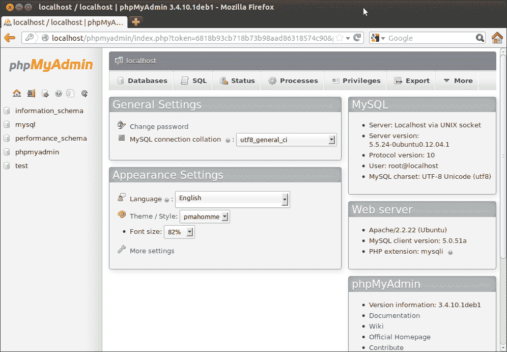

1.  选择 **数据库**，在 **创建新数据库** 中输入新数据库的名称为 `zf_app`，然后点击 **创建**：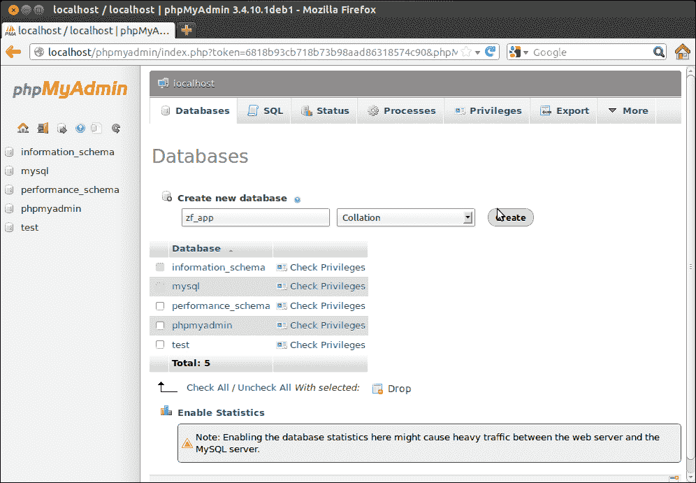

1.  在创建数据库后，为该数据库创建一个数据库用户；这可以通过从**权限**中选择**添加新用户**来完成。请提供以下详细信息：

    | 用户字段 | 值 |
    | --- | --- |
    | **用户名** | `zf_user` |
    | **主机** | `localhost` |
    | **密码** | `zf_pass` |

    完成此操作后，您将看到以下屏幕：

    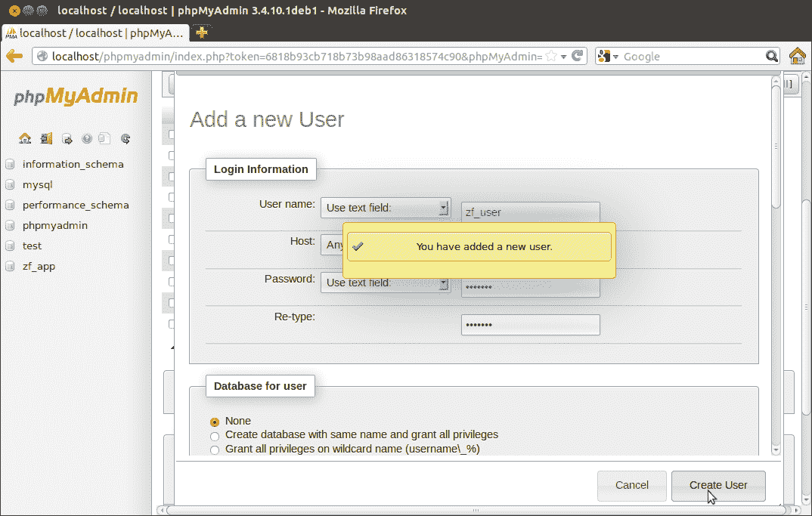

1.  用户创建后，转到**权限**部分，并为 `zf_user` 选择**编辑权限**。

1.  在**特定数据库权限**部分，选择 `zf_app` 数据库。

1.  您将被重定向到 `zf_app` 数据库的 `zf_user` 用户权限部分。选择**全选**并点击**前往**。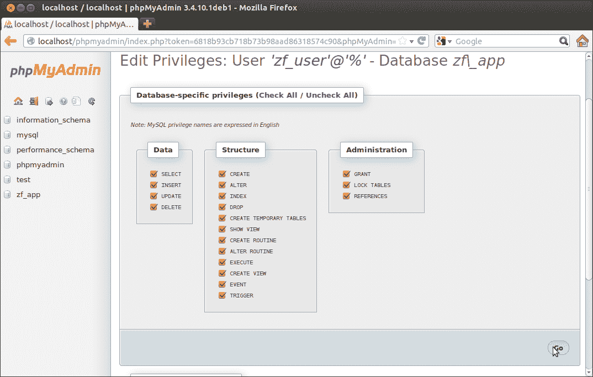

现在，您可以通过退出 phpMyAdmin 并使用 `zf_user` 的用户凭据重新登录来测试数据库。您现在应该只能看到 `zf_app` 数据库。

## *刚才发生了什么？*

我们刚刚在 MySQL 中创建了我们的第一个数据库。我们还在数据库中创建了一个用户，并将该用户映射到具有管理权限的数据库；现在我们可以使用这些凭据在我们下一章将要构建的应用程序中。

## 尝试一下

现在您已经启动并运行了 PHP 网络服务器，并且也拥有了一个 MySQL 数据库，创建一个简单的名为 `Students` 的表，并使用 phpMyAdmin 向表中添加一些记录。

您的任务是创建一个简单的 PHP 网页，该网页将在页面上显示 `Students` 表中的所有记录。

## 速问速答 – Zend Framework 2.0

Q1\. 运行 Zend Framework 2.0 所需的最小 PHP 版本是什么？

1.  PHP 4.3 及以上版本

1.  PHP 5.2.0 及以上版本

1.  PHP 5.3.3 及以上版本

1.  PHP 5.4.7 及以上版本

Q2\. 在新的 Zend Server 安装中，`php.ini` 的默认位置是什么？

1.  `/home/<user>/etc/php/php.inc`

1.  `/etc/php/php.ini`

1.  `/var/www/php.ini`

1.  `/usr/local/zend/etc/php.ini`

# 摘要

在本章中，我们学习了 Zend Server 的 PHP 应用程序堆栈的设置和配置。我们继续安装 MySQL 服务器并创建了我们的第一个数据库。在您的练习中，您学习了 Git 和 phpMyAdmin 的安装。

在下一章中，我们将学习关于 Zend Framework 项目结构和核心 MVC 组件，如视图和控制器。
