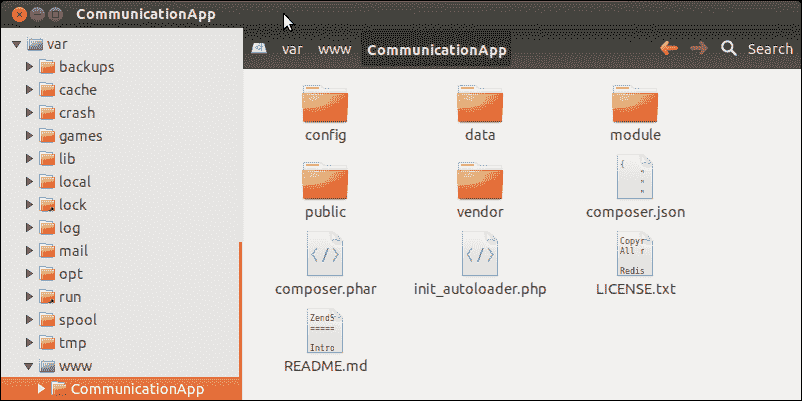

# 第二章 构建您的第一个 Zend Framework 应用程序

*在本章中，我们将创建我们的第一个 Zend Framework 2.0 项目；我们将通过创建模块、控制器和视图来回顾构建 ZF2 MVC 应用程序的一些关键方面。我们将在 Zend Framework 中创建自己的自定义模块，该模块将在本书的后续章节中得到进一步扩展。*

# 先决条件

在您开始设置第一个 ZF2 项目之前，请确保您已在您的开发环境中安装并配置了以下软件：

+   PHP 命令行界面

+   **Git**：Git 用于从各种 [github.com](http://github.com) 仓库检出源代码

+   **Composer**：Composer 是用于管理 PHP 依赖的依赖管理工具

### 提示

以下命令将有助于安装设置 ZF2 项目所需的工具：

+   要安装 PHP 命令行界面：

    **$ sudo apt-get install php5-cli**

+   要安装 Git：

    **$ sudo apt-get install git**

+   要安装 Composer：

    **$ curl -s https://getcomposer.org/installer | php**

# ZendSkeletonApplication

`ZendSkeletonApplication` 为开发者提供了一个示例骨架应用程序，可以作为开始使用 Zend Framework 2.0 的起点。骨架应用程序使用了 ZF2 MVC，包括一个新的模块系统。

`ZendSkeletonApplication` 可从 GitHub 下载 ([`github.com/zendframework/ZendSkeletonApplication`](https://github.com/zendframework/ZendSkeletonApplication))。

# 行动时间 – 创建 Zend Framework 项目

要设置新的 Zend Framework 项目，我们需要下载最新版本的 `ZendSkeletonApplication` 并设置一个虚拟主机以指向新创建的 Zend Framework 项目。步骤如下：

1.  导航到您想要设置新 Zend Framework 项目的文件夹位置：

    ```php
    $ cd /var/www/

    ```

1.  从 GitHub 克隆 `ZendSkeletonApplication` 应用程序：

    ```php
    $ git clone git://github.com/zendframework/ZendSkeletonApplication.git CommunicationApp

    ```

    

    ### 提示

    在某些 Linux 配置中，当前用户可能没有写入 `/var/www` 的必要权限。在这种情况下，您可以使用任何可写文件夹并对虚拟主机配置进行必要的更改。

1.  使用 Composer 安装依赖项：

    ```php
    $ cd CommunicationApp/
    $ php composer.phar self-update
    $ php composer.phar install

    ```

    以下截图显示了 Composer 下载和安装必要依赖项的过程：

    

1.  在添加虚拟主机条目之前，我们需要在我们的 `hosts` 文件中设置一个主机名条目，以便系统在每次使用新主机名时指向本地计算机。在 Linux 中，这可以通过向 `/etc/hosts` 文件添加条目来完成：

    ```php
    $ sudo vim /etc/hosts

    ```

    ### 提示

    在 Windows 中，此文件可以在 `%SystemRoot%\system32\drivers\etc\hosts` 中访问。

1.  将以下行添加到 `hosts` 文件中：

    ```php
    127.0.0.1    comm-app.local

    ```

    最终的 `hosts` 文件应如下所示：

    

1.  我们下一步将是在我们的 web 服务器上添加一个虚拟主机条目；这可以通过创建一个新的虚拟主机配置文件来完成：

    ```php
    $ sudo vim /usr/local/zend/etc/sites.d/vhost_comm-app-80.conf

    ```

    ### 小贴士

    这个新的虚拟主机文件名可能因您使用的 web 服务器而异；请查阅您的 web 服务器文档以设置新的虚拟主机。

    例如，如果您在 Linux 上运行 Apache2，您需要在 `/etc/apache2/sites-available` 中创建新的虚拟主机文件，并使用命令 `a2ensite comm-app.local` 启用该站点。

1.  将以下配置添加到虚拟主机文件中：

    ```php
    <VirtualHost *:80>
      ServerName comm-app.local
      DocumentRoot /var/www/CommunicationApp/public
      SetEnv APPLICATION_ENV "development"
      <Directory /var/www/CommunicationApp/public>
        DirectoryIndex index.php
        AllowOverride All
        Order allow,deny
        Allow from all
      </Directory>
    </VirtualHost>
    ```

    ### 小贴士

    如果您使用不同的路径来检出 `ZendSkeletonApplication` 项目，请确保您在 `DocumentRoot` 和 `Directory` 指令中都包含该路径。

1.  在配置虚拟主机文件后，需要重新启动 web 服务器：

    ```php
    $ sudo service zend-server restart

    ```

1.  安装完成后，您应该能够在您的网页浏览器中打开 `http://comm-app.local`。这应该会带您到以下测试页面：

    ### 小贴士

    **测试重写规则**

    在某些情况下，`mod_rewrite` 可能默认没有在您的 web 服务器上启用；为了检查 URL 重定向是否正常工作，尝试导航到一个无效的 URL，例如 `http://comm-app.local/12345`；如果您得到一个 Apache 404 页面，那么 `.htaccess` 重写规则没有正常工作；它们需要被修复，否则如果您得到如下所示的页面，您可以确信 URL 正常工作。

    

## *发生了什么？*

我们已经通过从 GitHub 检出 `ZendSkeletonApplication` 并使用 Composer 下载必要的依赖项（包括 Zend Framework 2.0）成功创建了一个新的 ZF2 项目。我们还创建了一个指向项目 `public` 文件夹的虚拟主机配置，并在网页浏览器中测试了该项目。

### 小贴士

**下载示例代码**

您可以从您在 [`www.packtpub.com`](http://www.packtpub.com) 的账户下载您购买的所有 Packt 书籍的示例代码文件。如果您在其他地方购买了这本书，您可以访问 [`www.packtpub.com/support`](http://www.packtpub.com/support) 并注册以将文件直接通过电子邮件发送给您。

### 小贴士

**其他安装选项**

我们已经看到了安装 `ZendSkeletonApplication` 的一种方法；还有其他的方法可以做到这一点。

您可以使用 Composer 直接下载骨架应用程序，并使用以下命令创建项目：

```php
$ php composer.phar create-project --repository-url="http://packages.zendframework.com" zendframework/skeleton-application path/to/install

```

您还可以使用递归 Git 克隆来创建相同的项目：

```php
$ git clone git://github.com/zendframework/ZendSkeletonApplication.git --recursive

```

参考：

[`framework.zend.com/downloads/skeleton-app`](http://framework.zend.com/downloads/skeleton-app)

# Zend Framework 2.0 – 模块

在 Zend Framework 中，一个模块可以被定义为一种可移植和可重用的软件单元，它可以与其他模块相互连接，构建更大、更复杂的应用程序。

模块在 Zend Framework 中并不新鲜，但使用 ZF2，模块在 Zend Framework 中的使用方式进行了全面革新。在 ZF2 中，模块可以在各种系统间共享，并且可以相对容易地进行重新打包和分发。即将到来的 ZF2 的另一个重大变化是，主应用程序现在也被转换成了一个模块；即应用程序模块。

以下列出了 Zend Framework 2.0 模块的一些关键优势：

+   自包含、便携、可重用

+   依赖管理

+   轻量级且快速

+   Phar 打包和 Pyrus 分发的支持

## Zend Framework 2.0 – 项目文件夹结构

ZF2 项目的文件夹布局如下所示：


| 文件夹名称 | 描述 |
| --- | --- |
| `config` | 用于管理应用程序配置。 |
| `data` | 用作存储应用程序数据的临时存储位置，包括缓存文件、会话文件、日志和索引。 |
| `module` | 用于管理所有应用程序代码。 |
| `module/Application` | 这是与`ZendSkeletonApplication`一起提供的默认应用程序模块。 |
| `public` | 作为应用程序的入口点；网站的文档根目录指向此处。所有网络资源，包括 CSS 文件、图像和 JavaScript，都存储在此处。 |
| `vendor` | 用于管理应用程序使用的通用库。Zend Framework 也安装在此文件夹中。 |
| `vendor/zendframework` | Zend Framework 2.0 安装在此处。 |

# 操作时间 – 创建模块

我们接下来的活动将是关于在 Zend Framework 2.0 中创建一个新的`Users`模块。`Users`模块将用于管理用户，包括用户注册、认证等。我们将利用 Zend 提供的`ZendSkeletonModule`，如下所示：

1.  导航到应用程序的`module`文件夹：

    ```php
    $ cd /var/www/CommunicationApp/
    $ cd module/

    ```

1.  将`ZendSkeletonModule`克隆到所需的模块名称中，在本例中是`Users`：

    ```php
    $ git clone git://github.com/zendframework/ZendSkeletonModule.git Users

    ```

1.  检查出完成后，文件夹结构应如下截图所示：

1.  编辑`Module.php`；此文件位于模块下的`Users`文件夹中（`CommunicationApp/module/Users/module.php`），并将命名空间更改为`Users`。将`namespace ZendSkeletonModule;`替换为`namespace Users;`。

1.  以下文件夹可以删除，因为我们不会在我们的项目中使用它们：

    `* Users/src/ZendSkeletonModule`

    `* Users/view/zend-skeleton-module`

## *发生了什么？*

我们已经为 Zend Framework 安装了一个骨架模块；这只是一个空模块，我们需要通过创建自定义控制器和视图来扩展它。在我们的下一个活动中，我们将专注于为该模块创建新的控制器和视图。

### 小贴士

**使用 ZFTool 创建模块**

`ZFTool` 是一个用于管理 Zend Framework 应用程序/项目的实用工具，也可以用于创建新模块；为了做到这一点，您需要安装 `ZFTool` 并使用 `create module` 命令通过 `ZFTool` 创建模块：

```php
$ php composer.phar require zendframework/zftool:dev-master
$ cd vendor/zendframework/zftool/
$ php zf.php create module Users2 /var/www/CommunicationApp

```

在以下链接中了解更多关于 ZFTool 的信息：

[`framework.zend.com/manual/2.0/en/modules/zendtool.introduction.html`](http://framework.zend.com/manual/2.0/en/modules/zendtool.introduction.html)

# MVC 层

任何 MVC 框架的基本目标都是使 MVC 的三层（模型、视图和控制器）更容易分离。在我们深入了解创建模块的细节之前，让我们快速了解一下这三个层在 MVC 框架中的工作方式：

+   **模型**：模型是数据的表示；模型还持有各种应用程序事务的业务逻辑。

+   **视图**：视图包含用于在网页浏览器中显示各种用户界面元素的显示逻辑。

+   **控制器**：控制器控制任何 MVC 应用程序中的应用程序逻辑；所有操作和事件都在控制器层处理。控制器层通过控制模型状态和表示视图的变化，充当模型和视图之间的通信接口。控制器还提供了访问应用程序的入口点。

+   在新的 ZF2 MVC 结构中，所有模型、视图和控制器都按模块分组。每个模块都将有自己的模型、视图和控制器集合，并且将与其他模块共享一些组件。

# Zend Framework 模块 – 文件夹结构

Zend Framework 2.0 模块的文件夹结构有三个关键组件——配置、模块逻辑和视图。以下表格描述了模块中内容的组织方式：

| 文件夹名称 | 描述 |
| --- | --- |
| `config` | 用于管理模块配置 |
| `src` | 包含所有模块源代码，包括所有控制器和模型 |
| `view` | 用于存储模块中使用的所有视图 |

# 行动时间 – 创建控制器和视图

现在我们已经创建了模块，我们的下一步就是定义我们自己的控制器和视图。在本节中，我们将创建两个简单的视图，并编写一个控制器在它们之间切换：

1.  导航到模块位置：

    ```php
    $ cd /var/www/CommunicationApp/module/Users

    ```

1.  创建控制器文件夹：

    ```php
    $ mkdir -p src/Users/Controller/

    ```

1.  创建一个新的 `IndexController` 文件，`< ModuleName >/src/<ModuleName>/Controller/`：

    ```php
    $ cd src/Users/Controller/
    $ vim IndexController.php

    ```

1.  将以下代码添加到 `IndexController` 文件中：

    ```php
    <?php
    namespace Users\Controller;
    use Zend\Mvc\Controller\AbstractActionController;
    use Zend\View\Model\ViewModel;
    class IndexController extends AbstractActionController
    {
        public function indexAction()
        {
            $view = new ViewModel();
            return $view;
        }
        public function registerAction()
        {
            $view = new ViewModel();
            $view->setTemplate('users/index/new-user');
            return $view;
        }
        public function loginAction()
        {
            $view = new ViewModel();
            $view->setTemplate('users/index/login');
            return $view;
        }
    }
    ```

1.  上述代码将执行以下操作；如果用户访问主页，用户将看到默认视图；如果用户通过操作 `register` 到达，用户将看到 `new-user` 模板；如果用户通过设置操作为 `login` 到达，则渲染 `login` 模板。

1.  现在我们已经创建了控制器，我们将必须为每个控制器操作创建必要的视图。

1.  创建视图文件夹：

    ```php
    $ cd /var/www/CommunicationApp/module/Users
    $ mkdir -p view/users/index/

    ```

1.  导航到视图文件夹，`<Module>/view/<module-name>/index`：

    ```php
    $ cd view/users/index/

    ```

1.  创建以下视图文件：

    +   `index`

    +   `login`

    +   `new-user`

    1.  为了创建`view/users/index/index.phtml`文件，使用以下代码：

        ```php
        <h1>Welcome to Users Module</h1>
        <a href="/users/index/login">Login</a> | <a href="/users/index/register">New User Registration</a>
        ```

    1.  为了创建`view/users/index/login.phtml`文件，使用以下代码：

        ```php
        <h2> Login </h2>
        <p> This page will hold the content for the login form </p>
        <a href="/users"><< Back to Home</a>
        ```

    1.  为了创建`view/users/index/new-user.phtml`文件，使用以下代码：

        ```php
        <h2> New User Registration </h2>
        <p> This page will hold the content for the registration form </p>
        <a href="/users"><< Back to Home</a>
        ```

## *发生了什么？*

我们现在为我们的新 Zend Framework 模块创建了一个新的控制器和视图；该模块目前还没有达到可以测试的状态。为了使模块完全功能化，我们需要对模块的配置进行更改，并在应用程序的配置中启用该模块。

# Zend Framework 模块 – 配置

Zend Framework 2.0 模块配置分散在一系列文件中，这些文件可以在骨架模块中找到。以下是一些配置文件的描述：

+   `Module.php`：Zend Framework 2 模块管理器在模块的根目录中查找`Module.php`文件。模块管理器使用`Module.php`文件来配置模块，并调用`getAutoloaderConfig()`和`getConfig()`方法。

+   `autoload_classmap.php`：骨架模块中的`getAutoloaderConfig()`方法加载`autoload_classmap.php`以包含除使用标准自动加载格式加载的类之外的所有自定义覆盖。可以向`autoload_classmap.php`文件中添加或删除条目以管理这些自定义覆盖。

+   `config/module.config.php`：`getConfig()`方法加载`config/module.config.php`；此文件用于配置各种模块配置选项，包括路由、控制器、布局以及各种其他配置。

# 行动时间 – 修改模块配置

在本节中，我们将对`Users`模块进行配置更改，使其能够使用以下步骤与新建的控制器和视图一起工作：

1.  **自动加载配置** – 由`ZendSkeletonModule`提供的默认自动加载配置需要被禁用；这可以通过编辑`autoload_classmap.php`并替换为以下内容来完成：

    ```php
    <?php
    return array();
    ```

1.  **模块配置** – 模块配置文件位于`config/module.config.php`中；此文件需要更新以反映已创建的新控制器和视图，如下所示：

    +   **控制器** – 默认控制器映射指向`ZendSkeletonModule`；这需要替换为以下片段中显示的映射：

        ```php
            'controllers' => array(
                'invokables' => array(
         'Users\Controller\Index' => 'Users\Controller\IndexController',
                ),
            ),
        ```

    +   **视图** – 模块的视图需要映射到适当的视图位置。确保视图使用由连字符分隔的小写名称（例如，`ZendSkeleton`将被称为 zend-skeleton）：

        ```php
            'view_manager' => array(
                'template_path_stack' => array(
         'users' => __DIR__ . '/../view',
                ),
            ),
        ```

    +   **路由** – 最后一个模块配置是定义一个从浏览器访问此模块的路由；在这种情况下，我们定义的路由为`/users`，它将指向`Users`模块的`Index`控制器的`index`操作：

        ```php
            'router' => array(
                'routes' => array(
         'users' => array(
                        'type'    => 'Literal',
                        'options' => array(
         'route'    => '/users',
                            'defaults' => array(
         '__NAMESPACE__' => 'Users\Controller',
         'controller'    => 'Index',
         'action'        => 'index',
                            ),
                        ),
        ```

1.  在上一节中详细说明的所有配置更改完成后，最终的配置文件 `config/module.config.php` 应该看起来像以下这样：

    ```php
    <?php
    return array(
        'controllers' => array(
            'invokables' => array(
                'Users\Controller\Index' => 'Users\Controller\IndexController',
            ),
        ),
        'router' => array(
            'routes' => array(
                'users' => array(
                    'type'    => 'Literal',
                    'options' => array(
                        // Change this to something specific to your module
                        'route'    => '/users',
                        'defaults' => array(
                            // Change this value to reflect the namespace in which
                            // the controllers for your module are found
                            '__NAMESPACE__' => 'Users\Controller',
                            'controller'    => 'Index',
                            'action'        => 'index',
                        ),
                    ),
                    'may_terminate' => true,
                    'child_routes' => array(
                        // This route is a sane default when developing a module;
                        // as you solidify the routes for your module, however,
                        // you may want to remove it and replace it with more
                        // specific routes.
                        'default' => array(
                            'type'    => 'Segment',
                            'options' => array(
                                'route'    => '/[:controller[/:action]]',
                                'constraints' => array(
                                    'controller' => '[a-zA-Z][a-zA-Z0-9_-]*',
                                    'action'     => '[a-zA-Z][a-zA-Z0-9_-]*',
                                ),
                                'defaults' => array(
                                ),
                            ),
                        ),
                    ),
                ),
            ),
        ),
        'view_manager' => array(
            'template_path_stack' => array(
                'users' => __DIR__ . '/../view',
            ),
        ),
    );
    ```

1.  **应用程序配置** – 在应用程序配置中启用模块，这可以通过修改应用程序的 `config/application.config.php` 文件，并将 `Users` 添加到已启用模块列表中来实现：

    ```php
        'modules' => array(
            'Application',
            'Users',
        ),
    ```

1.  要在网页浏览器中测试模块，请在您的网页浏览器中打开 `http://comm-app.local/users/`；您应该能够在模块内进行导航。

模块主页如下所示：


注册页面如下所示：


## *发生了什么？*

我们已修改 `ZendSkeletonModule` 的配置，使其与新创建的 `Users` 模块的控制器和视图一起工作。现在我们使用新的 ZF 模块系统拥有了一个完全功能性的模块并正在运行。

## 尝试一下英雄

现在我们有了创建和配置自己模块的知识，您的下一个任务将是设置一个新的 `CurrentTime` 模块。此模块的要求是按照以下格式渲染当前时间和日期：

**时间：14:00:00 GMT 日期：2012 年 10 月 12 日**

## 快速测验 – Zend Framework 2.0

Q1. `ZendSkeletonApplication` 在 PHP 中管理依赖关系所使用的工具是什么？

1.  Git

1.  编曲家

1.  PHP 命令行界面

1.  Pyrus

Q2. 模块配置文件的文件名是什么？

1.  `<App>/module/<Module>/config.inc`

1.  `<App>/<Module>/config/config.php`

1.  `<App>/module/<Module>/module.config.php`

1.  `<App>/module/<Module>/config/module.config.php`

# 摘要

我们现在已经学习了如何使用 Zend 的骨架应用程序和模块来设置新的 Zend Framework 项目。在接下来的章节中，我们将专注于进一步开发此模块并将其扩展为一个完整的应用程序。
