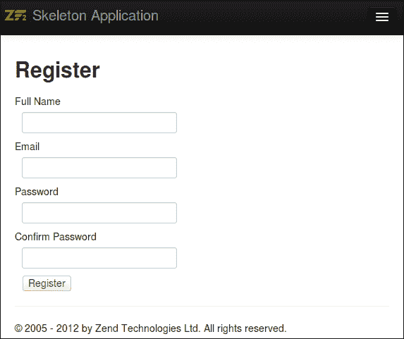
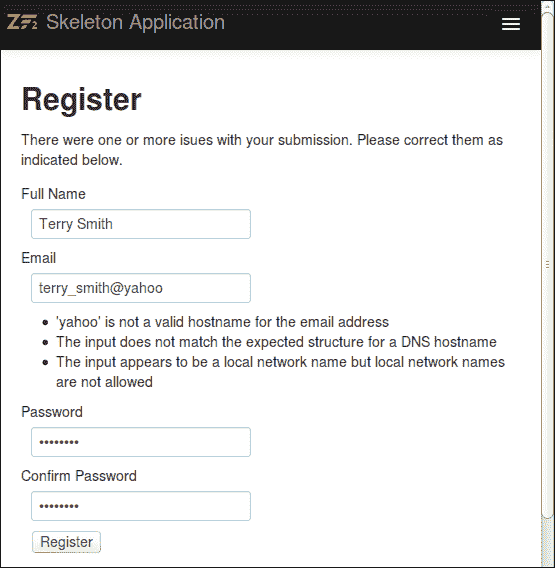
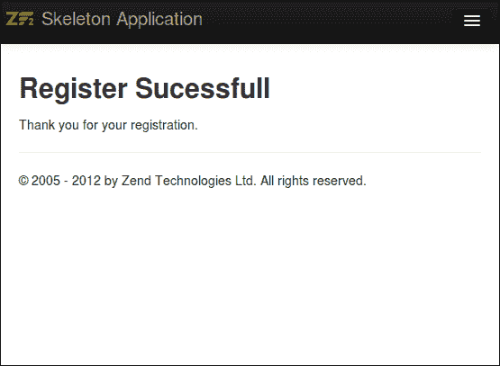
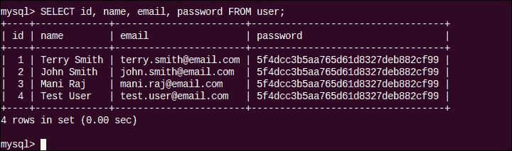
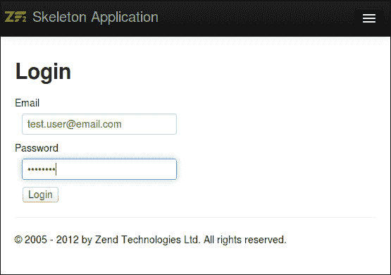
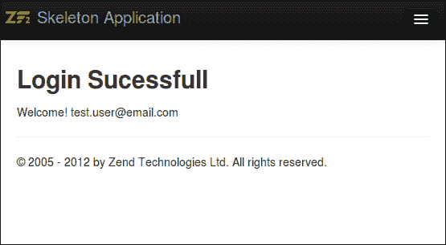

# 第三章 创建通信应用

*在前一章中，我们介绍了在新的 Zend Framework 模块中创建控制器和视图。在本章中，我们将创建我们的第一个注册表单，并使用 Zend Framework 组件为注册用户设置登录和身份验证。*

我们将在本章中关注的一些关键组件如下列出：

+   `Zend\Form`

+   `Zend\InputFilter`

+   `Zend\Validator`

+   模型和 `Zend\Db`

# Zend\Form

表单通常是通过创建表单的 HTML 页面、为各种表单事件编写单独的验证和过滤，以及最后为表单操作编写控制器和动作来构建的。使用 Zend Framework，`Zend\Form` 组件在一个组件中提供了之前所述的所有功能。

`Zend\Form` 允许开发者在应用程序中以编程方式创建和处理表单。`Zend\Form` 支持表单渲染、表单处理、输入过滤和验证以及表单配置。在下一个任务中，我们将设置我们的第一个 ZF2 表单。

# 行动时间 - 创建注册表单

要创建我们的第一个注册表单，我们将创建一个新的控制器来显示注册表单；我们还将创建新的表单和视图。我们需要对 `Users` 模块进行以下更改：

1.  **表单** – 我们还需要在 `src/Users/Form/RegisterForm.php` 下创建一个注册表单：

    1.  `RegisterForm` 类扩展了 `Zend\Form\Form`；表单的配置添加到构造函数中：

        ```php
        <?php
        // filename : module/Users/src/Users/Form/RegisterForm.php
        namespace Users\Form;
        use Zend\Form\Form;
        class RegisterForm extends Form
        {
            public function __construct($name = null)
            {
                parent::__construct('Register');
                $this->setAttribute('method', 'post');
                $this->setAttribute('enctype','multipart/form-data');
        ```

    1.  所有字段都是通过在表单构造函数上使用 `$this->add()` 方法添加到表单中的：

        ```php
                $this->add(array(
                    'name' => 'name',
                    'attributes' => array(
                        'type'  => 'text',
                    ),
                    'options' => array(
                        'label' => 'Full Name',
                    ),
                ));
        ```

    1.  在声明表单字段时，可以添加额外的验证器/过滤器到字段。在这种情况下，我们对 `EmailAddress` 字段添加了特殊的验证：

        ```php
                $this->add(array(
                    'name' => 'email',
                    'attributes' => array(
                        'type'  => 'email',
                    ),
                    'options' => array(
                        'label' => 'Email',
                    ),
                    'attributes' => array( 
                        'required' => 'required' 
                    ), 
                    'filters' => array( 
                        array('name' => 'StringTrim'), 
                    ), 
                    'validators' => array( 
                        array( 
                            'name' => 'EmailAddress', 
                            'options' => array( 
                                'messages' => array( 
                                    \Zend\Validator\EmailAddress::INVALID_FORMAT => 'Email address format is invalid' 
                                ) 
                            ) 
                        ) 
                    ) 
                ));
        ```

    1.  使用相同的方法添加 `password`、`confirm_password` 和 `submit` 字段；`password` 和 `confirm_password` 将是 `password` 类型，而 `submit` 将是 `button` 类型。

1.  **视图** – 为了支持注册过程，以下视图需要被创建：

    1.  **注册页面**：注册页面的视图是在 `src/view/users/register/index.phtml` 中创建的。

    1.  视图由三个主要部分组成——显示错误信息的部分、用于生成表单标签的视图逻辑，以及用于生成实际表单元素的视图辅助器。以下逻辑用于显示错误信息：

        ```php
        <section class="register">
        <h2>Register</h2>
        <?php if ($this->error): ?>
        <p class="error">
            There were one or more issues with your submission. Please correct them as 
            indicated below.
        </p>
        <?php endif ?>
        ```

    1.  以下代码块用于使用分配给控制器中视图的 `form` 对象生成 `<form>` HTML 标签：

        ```php
        <?php 
        $form = $this->form;
        $form->prepare();
        $form->setAttribute('action', $this->url(NULL, array('controller'=>'Register', 'action' => 'process')));
        $form->setAttribute('method', 'post');
        echo $this->form()->openTag($form);
        ?>
        ```

    1.  以下部分用于为 **姓名**、**电子邮件**、**密码**、**确认密码** 和 **提交** 字段生成单个表单元素：

        ```php
        <dl class="zend_form">
        <dt><?php echo $this->formLabel($form->get('name')); ?></dt>
        <dd><?php 
            echo $this->formElement($form->get('name'));
            echo $this->formElementErrors($form->get('name'));
        ?></dd>
        <dt><?php echo $this->formLabel($form->get('email')); ?></dt>
        <dd><?php 
            echo $this->formElement($form->get('email'));
            echo $this->formElementErrors($form->get('email'));
        ?></dd>
        <dt><?php echo $this->formLabel($form->get('password')); ?></dt>
        <dd><?php 
            echo $this->formElement($form->get('password'));
            echo $this->formElementErrors($form->get('password'));
        ?></dd>
        <dt><?php echo $this->formLabel($form->get('confirm_password')); ?></dt>
        <dd><?php 
            echo $this->formElement($form->get('confirm_password'));
            echo $this->formElementErrors($form->get('confirm_password'));
        ?></dd>
        <dd><?php 
            echo $this->formElement($form->get('submit'));
            echo $this->formElementErrors($form->get('submit'));
        ?></dd>
        </dl>
        ```

    1.  最后需要关闭 `form` HTML 标签：

        ```php
        <?php echo $this->form()->closeTag() ?>
        </section>
        ```

    1.  **确认页面**：确认页面的视图相当简单，视图是在 `src/view/users/register/confirm.phtml` 中创建的。

        ```php
        <section class="register-confirm">
        <h2>Register Sucessfull</h2>
        <p> Thank you for your registration. </p>
        </section>
        ```

1.  **控制器** – 现在我们已经有了表单和视图，我们的下一步将是放置一个控制器，这将帮助我们访问此表单。我们将创建一个新的`RegisterController`类，并在其 index 操作中加载新创建的表单。新控制器将在`src/Users/Controller/RegisterController.php`文件中创建：

    ```php
    <?php
    namespace Users\Controller;
    use Zend\Mvc\Controller\AbstractActionController;
    use Zend\View\Model\ViewModel;
    use Users\Form\RegisterForm;
    class RegisterController extends AbstractActionController
    {

        public function indexAction()
        {
                    $form = new RegisterForm();
                    $viewModel  = new ViewModel(array('form' => $form)); 
                    return $viewModel; 
        }
        public function confirmAction()
        {
                    $viewModel  = new ViewModel(); 
                    return $viewModel; 
        }
    }
    ```

1.  **配置** – 现在我们已经创建了显示表单所需的所有组件，我们需要将我们的控制器添加到模块配置中的`invokables`列表（`config/module.config.php`）：

    ```php
    'controllers' => array(
      'invokables' => array(
        'Users\Controller\Index' => 'Users\Controller\IndexController',
        'Users\Controller\Register' => 'Users\Controller\RegisterController',
      ),
    ```

1.  为了测试注册表单的显示，请打开任何网页浏览器并尝试访问以下 URL：

    `http://comm-app.local/users/register`

    注册表单应该看起来像以下这样：

    

## *发生了什么事？*

到目前为止，我们已经创建了一个可以用于显示在注册过程中使用的所有必要字段的表单。让我们尝试了解表单是如何被渲染的。当我们调用`http://comm-app.local/users/register`页面时，控制器会创建`RegisterForm`类的新实例，并在网页浏览器中显示它。我们使用构造函数向`RegisterForm`类添加了以下字段：

+   **姓名**

+   **电子邮件**

+   **密码**

+   **确认密码**

+   **提交**按钮

这些字段被添加到新创建的`Form`对象中。`ViewModel`模式渲染表单，并将`form`对象传递给视图进行渲染，每个字段都按照视图中的逻辑使用`FormElement`视图助手进行渲染。

### 小贴士

`FormElement`作为一个魔法助手，根据传递给它的`Zend\Form\Element`标签的类型渲染任何表单字段。有用于渲染特定表单字段的单独助手。可以从 ZF 文档中获取完整的表单视图助手列表，该文档位于[`framework.zend.com/manual/2.0/en/modules/zend.form.view.helpers.html`](http://framework.zend.com/manual/2.0/en/modules/zend.form.view.helpers.html)。

## 尝试一下英雄

在我们进入下一节之前，请以我们创建注册表单相同的方式创建一个登录表单。该表单将包含以下字段：

+   **电子邮件**

+   **密码**

+   **提交**按钮

我们将在本章的末尾使用此登录表单进行身份验证。

# 表单验证

如果你仔细查看表单代码，你会注意到我们为**电子邮件地址**字段添加了一些验证，如下面的代码片段所示：

```php
            'attributes' => array( 
                'required' => 'required' 
            ), 
            'filters' => array( 
                array('name' => 'StringTrim'), 
            ), 
            'validators' => array( 
                array( 
                    'name' => 'EmailAddress', 
                    'options' => array( 
                        'messages' => array( 
                            \Zend\Validator\EmailAddress::INVALID_FORMAT => 'Email address format is invalid' 
                        )
```

因此，我们添加了以下内容：

+   一个属性使字段成为`必填`字段

+   一个用于修剪传入字符串的过滤器

+   一个验证器用于验证电子邮件地址是否为有效格式

通过介绍 Zend Framework 的 InputFilter，我们可以验证整个表单，而不是将验证附加到每个表单字段。这使得代码更加简洁，并且提高了 Zend Forms 的可扩展性。因此，我们可以有效地在网站的多个部分使用相同的表单，每个部分都有自己的验证规则集，这些规则集不依赖于表单的验证。在我们下一节中，我们将为注册表单设置一个新的验证器。

## Zend\InputFilter

可以通过使用`Zend\InputFilter`来执行表单和各种其他输入的验证。该组件允许过滤和验证通用输入数据集。对于特定的表单元素，您可以在特定元素上应用验证和过滤，但如果我们需要过滤像`$_GET`请求或`$_POST`请求这样的输入集，可以使用`InputFilter`类来实现。

在我们的下一个任务中，我们将向注册表单添加`InputFilter`类。

# 执行时间 – 向注册表单添加验证

要向现有表单添加`InputFilter`类，我们需要创建一个新的`InputFilter`类，并在表单提交时使用它进行验证，如下面的步骤所示：

1.  在`src/Users/Form/RegisterFilter.php`中创建一个新的`InputFilter`类。`RegisterFilter`类将扩展`Zend\InputFilter\InputFilter`类，并在其构造函数中添加所有必要的验证器：

    ```php
    <?php
    namespace Users\Form;
    use Zend\InputFilter\InputFilter;

    class RegisterFilter extends InputFilter
    {
        public function __construct()
        {
    ```

1.  使用`$this->add()`方法，我们可以向注册表单添加各种过滤器选项：

    1.  对于**电子邮件地址**字段，我们将添加一个验证器以检查输入的值是否为有效的电子邮件地址：

        ```php
                $this->add(array(
                    'name'       => 'email',
                    'required'   => true,
                    'validators' => array(
                        array(
                            'name'    => 'EmailAddress',
                            'options' => array(
                                'domain' => true,
                            ),
                        ),
                    ),
                ));
        ```

    1.  对于**名称**字段，我们将添加一个验证器以限制其大小在`2`到`140`个字符之间，并且还会添加一个过滤器以去除 HTML 标签：

        ```php
                $this->add(array(
                    'name'       => 'name',
                    'required'   => true,
                    'filters'    => array(
                        array(
                            'name'    => 'StripTags',
                        ),
                    ),
                    'validators' => array(
                        array(
                            'name'    => 'StringLength',
                            'options' => array(
                                'encoding' => 'UTF-8',
                                'min'      => 2,
                                'max'      => 140,
                            ),
                        ),
                    ),
                ));
        ```

    1.  对于**密码**和**确认密码**字段，我们不会添加任何验证器，但将它们设置为必填项：

        ```php
        'password'        ));
                $this->add(array(
                    'name'       => 'confirm_password',
                    'required'   => true,
                ));
        ```

1.  这个`InputFilter`类尚未映射到`RegisterForm`类；我们将在表单提交时执行验证。我们需要修改`RegisterController`类以启用`processAction`方法并在提交时验证表单。

1.  修改`RegisterController`类以启用`processAction`方法：

    ```php
    public function processAction()
    {
      if (!$this->request->isPost()) {
        return $this->redirect()->toRoute(NULL , 
          array( 'controller' => 'register', 
                'action' =>  'index' 
          ));
      }
      $post = $this->request->getPost();
      $form = new RegisterForm();
      $inputFilter = new RegisterFilter();
      $form->setInputFilter($inputFilter);
      $form->setData($post);
      if (!$form->isValid()) {
        $model = new ViewModel(array(
          'error' => true,
          'form'  => $form,
        ));
        $model->setTemplate('users/register/index');
        return $model;
      }
      return $this->redirect()->toRoute(NULL , array( 
        'controller' => 'register', 
        'action' =>  'confirm' 
      ));
    }
    ```

1.  现在，在您的网络浏览器中打开注册页面并测试验证：

## *发生了什么？*

我们现在已经在注册表单上启用了验证。在`RegisterController`类的`processAction()`函数中，您将看到创建了一个新的`RegisterFrom`类实例，并使用`$form->setInputFilter()`方法应用了`RegisterFilter`。将数据作为输入添加到表单中，并通过使用`isValid()`方法执行验证。错误信息使用`FormElementErrors`视图助手在表单中渲染。

我们需要确保在向`InputFilter`类添加验证时，`InputFilter`中的名称正确映射到表单中的名称。

## 尝试一下英雄

你刚刚学习了如何使用上一个任务添加自定义的`InputFilter`类到 Zend 表单；在你继续到下一节之前，为你在上一个练习中构建的`Login`表单设置一个验证`InputFilter`。

# 模型和数据库访问

模型提供了 MVC 应用程序中数据的表示。Zend Framework 没有提供`Zend\Model`组件，因此开发人员必须决定模型的实现部分。模型本身不能与数据库通信，以检索或处理数据，因此它们通常连接到映射对象或使用 ORM 连接到数据库。在这个例子中，我们将使用`TableGateway`模式将数据存储在数据库中。

### 注意

`TableGateway`是内置的 Zend Framework 2 DB 模式，它作为数据库表的网关，可以访问所有表行以执行各种 SQL 操作，包括`select`、`insert`、`update`和`delete`。

## TableGateway

`TableGateway`模式用于创建一个表示数据库中表的对象；在这个例子中，我们需要一个`TableGateway`对象来表示`User`表。

### 提示

如果模型使用`TableGateway`进行数据库存储，则需要在模型中声明`exchangeArray()`方法。

# 行动时间 - 创建模型和保存表单

在这个任务中，我们将创建一个新的用户模型，在 MySQL 数据库中创建一个表来保存注册数据，使用`TableGateway`将注册数据存储到表中。最后，我们将我们的注册表单连接到`UserTable`，以便新的注册信息存储在数据库中。执行以下步骤来完成此操作：

1.  需要创建一个新的表来在 MySQL 数据库中存储注册信息：

    ```php
    CREATE TABLE user (
      id INTEGER UNSIGNED NOT NULL AUTO_INCREMENT,
      name TEXT NOT NULL,
      email VARCHAR(255) NOT NULL,
      password TEXT NOT NULL,
      PRIMARY KEY (id),
      UNIQUE INDEX idx_email(email)
    );
    ```

1.  需要修改应用程序的全局配置以添加数据库连接的引用，如下面的代码片段所示。这可以在`<Application_Home>/config/autoload/global.php`中找到。

    ```php
    return array(
        'db' => array(
            'driver'         => 'Pdo',
            'dsn'            => 'mysql:dbname=test;host=localhost',
            'username'         => 'db_user',
            'password'         => '',
            'driver_options' => array(
                PDO::MYSQL_ATTR_INIT_COMMAND => 'SET NAMES \'UTF8\''
            ),
        ),
        'service_manager' => array(
            'factories' => array(
                'Zend\Db\Adapter\Adapter'
                        => 'Zend\Db\Adapter\AdapterServiceFactory',
            ),
        ),
    );
    ```

1.  为`User`类创建一个新的模型。这需要在`src/Users/Model/User.php`下创建。

    ```php
    <?php
    namespace Users\Model;
    class User
    {
      public $id;
      public $name;
      public $email;
      public $password;
    }
    ```

1.  `User`模型将定义`setPassword()`和`exchangeArray()`方法：

    1.  实现一个`setPassword()`方法，该方法将为`UserTable`实体分配一个 MD5 版本的密码以进行存储：

        ```php
          public function setPassword($clear_password)
          {
            $this->password = md5($clear_password);
          }
        ```

    1.  实现一个`exchangeArray()`方法；该方法在将`User`实体映射到`UserTable`实体时使用：

        ```php
          function exchangeArray($data)
          {
            $this->name = (isset($data['name'])) ? $data['name'] : null;
            $this->email = (isset($data['email'])) ? $data['email'] : null;
            if (isset($data["password"]))
            {
              $this->setPassword($data["password"]);
            }
          }
        ```

1.  为`User`创建一个新的表引用。这需要在`src/Users/Model/UserTable.php`下创建：

    ```php
    <?php
    namespace Users\Model;
    use Zend\Db\Adapter\Adapter;
    use Zend\Db\ResultSet\ResultSet;
    use Zend\Db\TableGateway\TableGateway;
    class UserTable
    {
      protected $tableGateway;
      public function __construct(TableGateway $tableGateway)
      {
        $this->tableGateway = $tableGateway;
      }
      public function saveUser(User $user)
      {
        $data = array(
          'email' => $user->email,
          'name'  => $user->name,
          'password'  => $user->password,
        );
        $id = (int)$user->id;
        if ($id == 0) {
          $this->tableGateway->insert($data);
        } else {
          if ($this->getUser($id)) {
            $this->tableGateway->update($data, array('id' => $id));
          } else {
            throw new \Exception('User ID does not exist');
          }
        }
      }
      public function getUser($id)
      {
        $id  = (int) $id;
        $rowset = $this->tableGateway->select(array('id' => $id));
        $row = $rowset->current();
        if (!$row) {
          throw new \Exception("Could not find row $id");
        }
        return $row;
      }
    }
    ```

1.  现在我们可以使用`UserTable`将新的注册信息保存到数据库中。为了保存注册信息，我们需要对`RegisterController`类进行修改。首先，我们将创建一个用于保存用户注册的新函数：

    ```php
    protected function createUser(array $data)
    {
      $sm = $this->getServiceLocator();
      $dbAdapter = $sm->get('Zend\Db\Adapter\Adapter');
      $resultSetPrototype = new \Zend\Db\ResultSet\ResultSet();
      $resultSetPrototype->setArrayObjectPrototype(new \Users\Model\User);
      $tableGateway = new \Zend\Db\TableGateway\TableGateway('user', $dbAdapter, null, $resultSetPrototype);

      $user = new User();
      $user->exchangeArray($data);
      $userTable = new UserTable($tableGateway);
      $userTable->saveUser($user);
      return true;
    }
    ```

    ### 注意

    `TableGateway`构造函数接受以下参数，并生成一个`TableGateway`对象作为响应：

    +   **$table**：用于提供 `TableGateway` 对象的表名。

    +   **Adapter $adapter**：用于提供数据库适配器名称。

    +   **$features**（可选）：TableGateway 功能 API 允许在不扩展基类的情况下扩展 `TableGateway` 功能。功能可以在此处指定。

    +   **ResultSet $resultSetPrototype**（可选）：用于提供 `ResultSet` 类型。

    +   **Sql $sql**（可选）：用于提供任何额外的 SQL 条件；确保 SQL 对象绑定到与 `$table` 相同的表。

    +   更多信息请参阅：[`framework.zend.com/manual/2.0/en/modules/zend.db.table-gateway.html#zend-db-tablegateway`](http://framework.zend.com/manual/2.0/en/modules/zend.db.table-gateway.html#zend-db-tablegateway)

1.  接下来，我们需要确保在重定向到确认页面之前，`processAction()` 方法调用此函数：

    ```php
    // Create user
    $this->createUser($form->getData());
    ```

1.  在您最喜欢的浏览器中打开注册页面，并使用 MySQL 数据库检查注册信息是否已正确存储在数据库中。注册确认页面应如下截图所示：

您可以检查 MySQL 数据库以查看记录是否已正确插入：



## *发生了什么？*

我们已经修改了表单以将新的用户注册保存到数据库中；我们的下一步将是根据数据库中存储的信息设置认证。

## Zend\Authentication

`Zend\Authentication` 是由 Zend Framework 提供的一个认证组件，它可以用于多种认证机制，包括数据库表、HTTP 认证和 LDAP 认证。该组件还允许您将会话信息存储到多种存储中。

在这个示例中，我们将使用 `Zend\Authentication` 组件来验证登录表单中提交的用户凭据。

# 执行动作 – 用户认证

在这个任务中，我们将使用以下步骤使用 `Zend\Authentication` 组件对登录表单进行认证：

1.  在登录控制器 `src/Users/Controller/LoginController.php` 中添加一个函数以返回认证服务：

    ```php
    // References
    use Zend\Authentication\AuthenticationService;
    use Zend\Authentication\Adapter\DbTable as DbTableAuthAdapter;
    // Class definition
    public function getAuthService()
    {
      if (! $this->authservice) {
        $dbAdapter = $this->getServiceLocator()->get('Zend\Db\Adapter\Adapter');
        $dbTableAuthAdapter = new DbTableAuthAdapter($dbAdapter, 'user','email','password', 'MD5(?)');
        $authService = new AuthenticationService();
        $authService->setAdapter($dbTableAuthAdapter);
        $this->authservice = $authService;
      }
      return $this->authservice;
    }
    ```

1.  在 `LoginController` 的 `processAction()` 方法中，检查表单提交是否有效，并使用 `AuthService` 方法通过 `authenticate` 方法验证凭据：

    ```php
    public function processAction()
    //
    $this->getAuthService()->getAdapter()
                                  ->setIdentity($this->request->getPost('email'))
                                  ->setCredential($this->request->getPost('password'));
    $result = $this->getAuthService()->authenticate();
    if ($result->isValid()) {
      $this->getAuthService()->getStorage()->write($this->request->getPost('email'));
      return $this->redirect()->toRoute(NULL , array( 
                                          'controller' => 'login', 
                                          'action' =>  'confirm' 
                                          ));			
    }
    ```

1.  `ConfirmAction` 函数将渲染已登录用户的欢迎屏幕：

    ```php
        public function confirmAction()
        {
      $user_email = $this->getAuthService()->getStorage()->read();
      $viewModel  = new ViewModel(array(
                'user_email' => $user_email 
            )); 
      return $viewModel; 
        }
    ```

1.  在 `/view/users/login/confirm.phtml` 下创建的用户主页视图如下：

    ```php
    <section class="login-confirm">
    <h2>Login Successful</h2>	
    <p> Welcome!  <?php echo $this->user_email; ?> </p>
    </section>
    ```

1.  在您的浏览器中打开登录页面，并尝试使用您在注册时使用的凭据进行登录。登录表单应如下所示：

登录成功后，您将被重定向到以下所示的登录成功页面。



## *刚才发生了什么？*

我们为`user`表创建了一个新的数据库表认证适配器，用于验证`email`和`password`字段。通过使用认证适配器，我们已经能够为注册用户执行认证。

## 快速测验 - Zend Framework 2.0

Q1. 应该修改哪个文件来存储应用程序范围内的数据库凭证？

1.  `<App>/module/<Module>/config.inc`

1.  `<App>/config/autoload/global.php`

1.  `<App>/module/<Module>/module.config.php`

1.  `<App>/module/<Module>/module.config.php`

Q2. 将输入过滤器分配给表单的正确方法是什么？

1.  `$form->setInputFilter($inputFilter)`

1.  `$form->useInputFilter($inputFilter)`

1.  `$form->assignInputFilter($inputFilter)`

1.  `$form->mapInputFilter($inputFilter)`

# 摘要

在本章中，我们学习了创建表单、进行基本验证、将表单数据存储到数据库、使用模型以及与数据库进行认证。在下一章中，我们将学习高级数据库操作，这些操作将基于本章所介绍的`TableGateway`模式。
