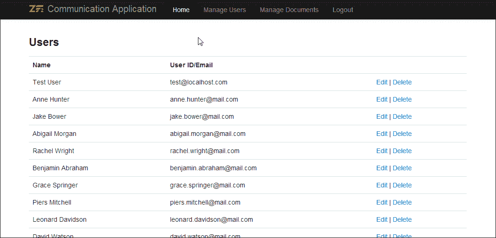
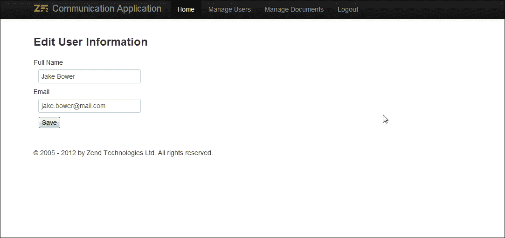
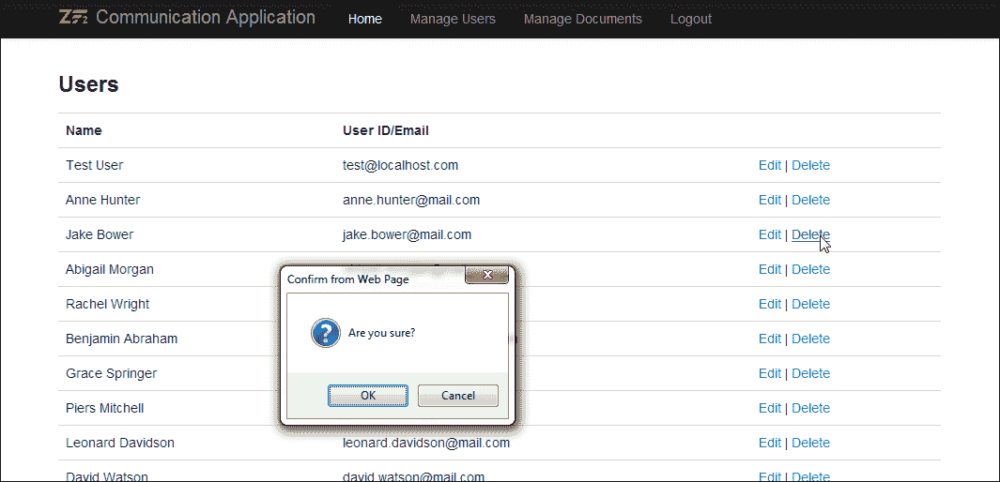
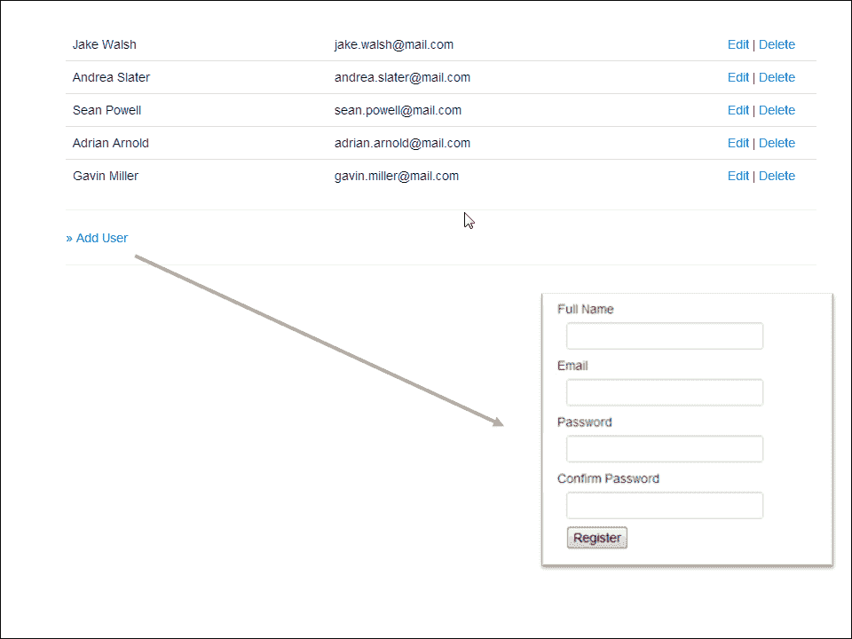
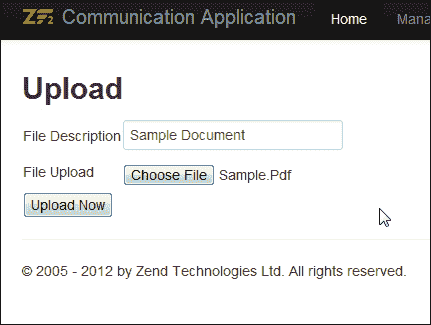
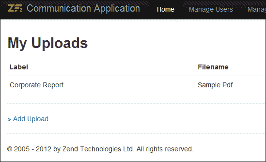
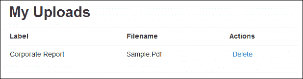
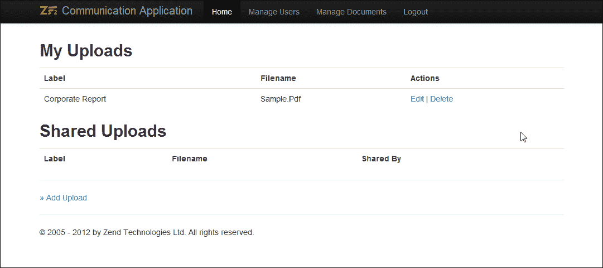
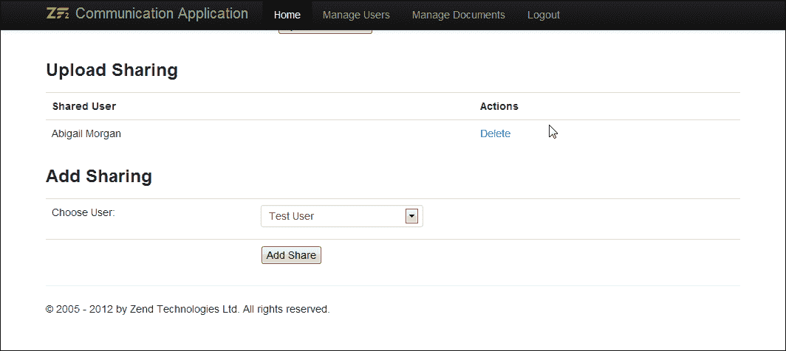
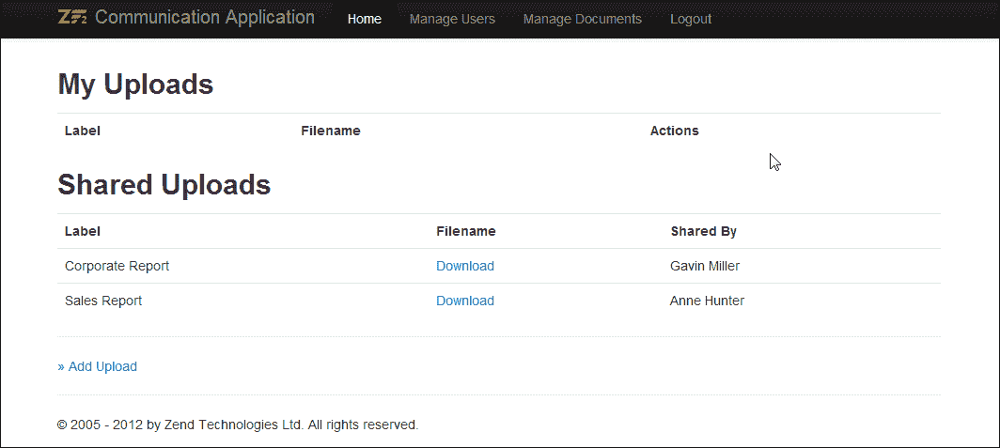

# 第四章 数据管理和文档共享

*在上一章准备好编写自己的基本模型之后，你现在可以学习如何在本章中充分利用 Zend Framework 的数据和文件管理概念。*

在本章中，我们将涵盖以下关键主题：

+   Zend Framework 2 ServiceManager

+   `TableGateway` 模式

+   使用 Zend Framework 进行文件上传和文件共享

# Zend Framework 2 ServiceManager

ZF2 ServiceManager 实现了服务定位器设计模式。服务定位器是一个用于检索其他对象的服务/对象定位器。

ServiceManager 配置分为六个主要类别；你的应用程序/模块配置将属于以下表中列出的一个或多个类别：

| 配置类型 | 描述 |
| --- | --- |
| abstract_factories | 用于定义抽象类的数组。 |
| aliases | 用于定义别名名称/目标名称对的关联数组。 |
| factories | 用于定义服务名称/工厂类名称对的数组。在此定义的工厂类应实现 Zend/ServiceManager/FactoryInterface 或可调用类。 |
| invokables | 用于定义服务名称/类名称对的数组。列出的类可以直接实例化，无需任何构造函数参数。 |
| services | 用于定义服务名称/对象对的数组。服务基本上是一个类的实例。服务可以用来注册已经初始化的类。 |
| shared | 用于定义服务名称/布尔值对的数组，指示服务是否应该共享。所有服务默认都是共享的；此 ServiceManager 选项可用于在特定服务上禁用共享。 |

ServiceManager 配置可以存储在应用程序配置或模块配置中；这可以根据需要、应用程序或模块来选择。通常，跨应用程序静态的配置存储在应用程序级配置中；所有其他信息存储在模块级别。

ServiceManager 的配置按以下顺序合并：

1.  使用 `Module` 类的 `getServiceConfig()` 方法提供的模块配置。这将按照模块处理的顺序进行处理：

    ```php
        public function getServiceConfig()
        {
            return array(
                'abstract_factories' => array(),
                'aliases' => array(),
                'factories' => array(),
                'invokables' => array(),
                'services' => array(),
                'shared' => array(),
            );
        }
    ```

1.  模块配置存在于 `service_manager` 键中；同样，这也是按照模块处理的顺序进行处理。

1.  应用程序配置存在于 `config/autoload/` 目录中的各种配置文件中，按照它们处理的顺序：

    ```php
    <?php
    return array(
        'service_manager' => array(
            'abstract_factories' => array(),
            'aliases' => array(),
            'factories' => array(),
            'invokables' => array(),
            'services' => array(),
            'shared' => array(),
        ),
    );
    ```

# 动手实践时间 - 将现有代码迁移到 ServiceManager

我们的下一步将是将现有代码块迁移到使用 ServiceManager。以下是一些可以移动到 ServiceManager 中的关键工厂：

+   数据库连接

+   模型和表网关

+   表单和过滤器

+   身份验证服务

如果你审查现有的代码，你将能够弄清楚所有数据库连接都已经使用 Zend Framework 2 ServiceManager 模型来存储凭证。我们将进一步一步，将剩余的工厂使用以下步骤移动到 ServiceManager：

1.  修改`Module.php`文件并添加一个新函数以加载 ServiceManager 配置：

    ```php
    public function getServiceConfig()
    {
      return array(
        'abstract_factories' => array(),
        'aliases' => array(),
        'factories' => array(

          // DB
          'UserTable' =>  function($sm) {
            $tableGateway = $sm->get('UserTableGateway');
            $table = new UserTable($tableGateway);
            return $table;
          },
          'UserTableGateway' => function ($sm) {
            $dbAdapter = $sm->get('Zend\Db\Adapter\Adapter');
            $resultSetPrototype = new ResultSet();
            $resultSetPrototype->setArrayObjectPrototype(new User());
            return new TableGateway('user', $dbAdapter, null, $resultSetPrototype);
          },

          // FORMS
          'LoginForm' => function ($sm) {
            $form = new \Users\Form\LoginForm();
            $form->setInputFilter($sm->get('LoginFilter'));
            return $form;
          },
          'RegisterForm' => function ($sm) {
            $form = new \Users\Form\RegisterForm();
            $form->setInputFilter($sm->get('RegisterFilter'));
            return $form;
          },

          // FILTERS
          'LoginFilter' => function ($sm) {
            return new \Users\Form\LoginFilter();
          },
          'RegisterFilter' => function ($sm) {
            return new \Users\Form\RegisterFilter();
          },
        ),
        'invokables' => array(),
        'services' => array(),
        'shared' => array(),
      );
    }
    ```

1.  确保`Module.php`文件包含所有必要的命名空间：

    ```php
    use Users\Model\User;
    use Users\Model\UserTable;

    use Zend\Db\ResultSet\ResultSet;
    use Zend\Db\TableGateway\TableGateway;
    ```

    ### 小贴士

    **使用命名空间**

    可以通过使用 PHP 5.3 的`namespace`和`use`关键字来利用命名空间。所有 ZF2 类都有一个命名空间，它与包含该类的文件夹结构直接匹配；该文件夹中存储的所有类都直接由它们的命名空间确定。

    默认情况下，`use`关键字为命名空间的最后一个部分创建一个别名，这可以通过在关键字上使用`as`选项来更改。例如，请参阅以下代码：

    ```php
    use Zend\Form\Element as Element;
    use Zend\Form\Element; // same as previous line
    ```

1.  对控制器进行必要的修改以从 ServiceManager 获取实例：

    ```php
    // to get Login Form
    $form = $this->getServiceLocator()->get('LoginForm');

    // to get User Table
    $userTable = $this->getServiceLocator()->get('UserTable');
    ```

1.  为了检查更改是否按预期工作，尝试使用新凭证进行注册和登录。

## *刚才发生了什么？*

我们已经将代码迁移到使用 Zend 的 ServiceManager 框架。ServiceManager 在代码更简洁、高度有效的重构能力和核心应用程序组件的集中注册方面提供了巨大的好处。

## 来试试吧，英雄

现在你已经理解了 Zend ServiceManager 的功能，这里有一个简单的任务给你。登录控制器（`CommunicationApp/module/Users/src/Users/Controller/LoginController.php`）使用`getAuthService()`进行身份验证服务。修改该函数，以便从 ServiceManger 获取身份验证服务。

# 数据库操作

在上一章中，我们学习了如何实现基本的数据库操作，即`table insert`。在本节中，你将学习所有构建简单**CRUD**（**创建、读取、更新和删除**）接口所需的基本数据库操作。

## 更多关于 TableGateway 的信息

`TableGateway`类扩展了`AbstractTableGateway`，该类实现了`TableGatewayInterface`。`TableGatewayInterface`的接口定义在以下代码片段中；所有基本表操作都在接口中定义：

```php
interface Zend\Db\TableGateway\TableGatewayInterface
{
    public function getTable();
    public function select($where = null);
    public function insert($set);
    public function update($set, $where = null);
    public function delete($where);
}
```

`TableGateway`类提供了一系列方法来执行基本数据库操作；以下部分解释了一些最常用的方法：

+   `getTable()`: 返回一个包含与`TableGateway`对象映射的表名的字符串。例如，请参阅以下代码：

    ```php
    $myTableName = $myTableGateway->getTable();
    ```

+   `select($where = null)`: 用于根据`$where`中指定的条件选择一组行；它可以是基于`Zend\Db\Sql\Where`的`where`条件，或者是一组条件的数组。例如，请参阅以下代码：

    ```php
    $rowset = $myTableGateway->select( array('id' => 2));
    ```

+   `insert($set)`: 用于将`$set`中定义的数据作为新记录插入到表中。例如，请参阅以下代码：

    ```php
    $myTableGateway->insert( array('id' => 2, 'name'=>'Ravi'));
    ```

+   `update($set, $where = null)`: 用于根据`$where`中指定的标准更新一组行；它可以是基于`Zend\Db\Sql\Where`的`where`条件或一组标准。`$set`包含将更新与`$where`匹配的所有记录的数据。例如，请参阅以下代码：

    ```php
    $rowset = $myTableGateway->update(array('name' => 'Jerry') , array('id' => 2));
    ```

+   `delete($where)`: 用于根据`$where`中指定的标准删除一组行；它可以是基于`Zend\Db\Sql\Where`的`where`条件或一组标准。例如，请参阅以下代码：

    ```php
    $myTableGateway->delete( array('id' => 2));
    ```

+   `getLastInsertValue()`: 返回表的主键的最后一个`insert`值。返回类型是整数。例如，请参阅以下代码：

    ```php
    $myTableGateway->insert( array('name'=>'Ravi'));
    $insertId = $myTableGateway-> getLastInsertValue ();
    ```

# 行动时间——实现管理用户的后台 UI

在这个任务中，我们将创建一个用于管理我们应用程序中用户的行政用户界面。以下操作将包括列出所有用户、编辑现有用户、删除用户和添加用户：

1.  使用以下代码修改`CommunicationApp/module/Users/src/Users/Model/UserTable.php`。添加以下函数：

    +   `fetchAll()`

    +   `getUser($id)`

    +   `getUserByEmail($userEmail)`

    +   `deleteUser($id)`

        ```php
        public function fetchAll()
        {
          $resultSet = $this->tableGateway->select();
          return $resultSet;
        }

        public function getUser($id)
        {
          $id  = (int) $id;
          $rowset = $this->tableGateway->select(array('id' => $id));
          $row = $rowset->current();
          if (!$row) {
            throw new \Exception("Could not find row $id");
          }
          return $row;
        }

        public function getUserByEmail($userEmail)
        {
          $rowset = $this->tableGateway->select(array('email' => $userEmail));
          $row = $rowset->current();
          if (!$row) {
            throw new \Exception("Could not find row $ userEmail");
          }
          return $row;
        }

        public function deleteUser($id)
        {
          $this->tableGateway->delete(array('id' => $id));
        }
        ```

1.  在`CommunicationApp/module/Users/src/Users/Controller/UserManagerController.php`下创建一个新的用户管理控制器。

1.  `UserManagerController`控制器将具有以下动作：

    +   `indexAction()`: 此动作用于渲染系统中所有可用的用户，我们还将渲染添加/编辑和删除链接，如下面的代码所示：

        ```php
        $userTable = $this->getServiceLocator()
                                      ->get('UserTable');
        $viewModel  = new ViewModel(array(
                         'users' => $userTable->fetchAll())); 
        return $viewModel;
        ```

    +   `editAction()`: 此动作用于渲染`edit`表单以修改与用户相关的信息：

        ```php
        $userTable = $this->getServiceLocator()
                                      ->get('UserTable');
        $user = $userTable->getUser(
                               $this->params()->fromRoute('id')); 
        $form = $this->getServiceLocator()
                                 ->get('UserEditForm');
        $form->bind($user);
        $viewModel  = new ViewModel(array(
                   'form' => $form, 
                   'user_id' => $this->params()->fromRoute('id')
                  ));
        return $viewModel;
        ```

        ### 提示

        **绑定方法**

        在`Form`函数中使用的`bind`方法允许将模型映射到表单。该函数双向工作——它使用模型中的数据更新视图中的表单，如果表单验证通过，它还会使用表单提交数据更新模型，即`$form->isValid()`。

        更多信息请见：

        [`framework.zend.com/manual/2.2/en/modules/zend.form.quick-start.html#binding-an-object`](http://framework.zend.com/manual/2.2/en/modules/zend.form.quick-start.html#binding-an-object)

    +   `processAction()`: 当用户`edit`表单提交时使用`processAction`动作；`processAction`保存更新后的记录并返回到`indexAction`：

        ```php
        // Get User ID from POST
        $post = $this->request->getPost();
        $userTable = $this->getServiceLocator()
                                      ->get('UserTable');       
        // Load User entity
        $user = $userTable->getUser($post->id);

        // Bind User entity to Form
        $form = $this->getServiceLocator()
                                 ->get('UserEditForm');
        $form->bind($user);	
        $form->setData($post);

        // Save user
        $this->getServiceLocator()
                         ->get('UserTable')->saveUser($user);
        ```

    +   `deleteAction()`: 此动作用于删除用户记录：

        ```php
        $this->getServiceLocator()->get('UserTable')
                ->deleteUser($this->params()
                ->fromRoute('id'));
        ```

1.  创建必要的视图并修改模块的`config/module.config.php`文件以指定一个唯一的子路由来访问此控制器：

    ```php
    'user-manager' => array(
      'type'    => 'Segment',
      'options' => array(
        'route'    => '/user-manager[/:action[/:id]]',
        'constraints' => array(
          'action'     => '[a-zA-Z][a-zA-Z0-9_-]*',
          'id'     => '[a-zA-Z0-9_-]*',
        ),
        'defaults' => array(
          'controller' => 'Users\Controller\UserManager',
          'action'     => 'index',
        ),
      ),
    ),
    ```

1.  最后，将新的控制器添加到`invokables`数组中：

    ```php
    'Users\Controller\UserManager' => 'Users\Controller\UserManagerController',
    ```

1.  现在，打开您的网络浏览器并访问控制器，登录到您的应用程序，并打开`http://comm.-app.local/users/user-manager`。您应该能看到一个类似于以下截图的页面：

**编辑用户**链接应将您重定向到一个类似于以下截图中的用户编辑表单：



**删除用户**链接可以用来从用户列表中删除用户：



## *刚才发生了什么？*

我们现在为我们的通信应用创建了一个管理用户界面，用于添加、修改和从应用中删除用户。我们已经利用了`TableGateway`模型的所有核心功能，并为在表访问对象上执行 CRUD 操作创建了函数。

在接下来的时间里，我们将利用`TableGateway`的一些更高级的应用。

## 尝试一下英雄

在我们进入下一节之前，这里有一个小任务供您练习。本节的任务是为创建一个新的`添加用户`表单。请参考以下截图：



此表单将与我们在上一章中创建的`注册表单`类似。一旦表单提交，用户将被带回到用户列表页面。必须在用户列表页面中添加到该表单的链接。

# 文档管理

在本节中，我们将创建一个新的文档管理界面。文档管理界面将允许用户上传文档、管理上传，并将上传的文档与其他用户共享。用户界面还将允许用户管理共享，并添加/删除共享。

在本节中，我们将专注于为用户提供创建文件上传和管理这些上传的选项。我们将使用文件系统来存储上传的文件，并且上传文件的相对路径将存储在数据库中，与上传文件的用户相对应。

在文件上传中使用的某些重要的 Zend 框架组件包括：

+   文件上传表单元素（`Zend\Form\Element\File`）：`File`上传元素用于上传表单中显示文件输入框。此元素相当于 HTML 中用于允许用户上传文件的`<input type='file'../>`样式元素。可以通过在表定义中设置`'type' => 'file'`来渲染文件输入元素。

+   文件传输适配器（`Zend\File\Transfer\Adapter\Http`）：文件传输适配器在表单提交时处理文件上传。文件传输适配器中的`setDestination()`方法允许用户设置目的地并在该目的地接收文件。`receive()`方法用于启动传输。

# 创建文件上传表单 - 行动时间

在这个任务中，我们将创建一个新的文档上传表单；文件上传将存储在文件系统中，有关文件上传的信息将存储在名为`uploads`的数据库表中。文件上传存储在模块配置中定义的文件夹位置。执行以下步骤来完成此操作：

1.  我们的第一步将是定义一个文件可以上传的位置，在模块的配置文件中（`config/module.config.php`）：

    ```php
    <?php
    return array(
      // Other configurations
      // ..
      // ..
      // MODULE CONFIGURATIONS
      'module_config' => array(
        'upload_location' => __DIR__ . '/../data/uploads',
      ),
    );
    ```

1.  接下来，我们需要创建一个表来存储上传信息：

    ```php
    CREATE TABLE IF NOT EXISTS uploads (
      id INT NOT NULL AUTO_INCREMENT PRIMARY KEY ,
      filename VARCHAR( 255 ) NOT NULL ,
      label VARCHAR( 255 ) NOT NULL ,
      user_id INT NOT NULL,
      UNIQUE KEY (filename)
    );
    ```

1.  创建`Upload`和`UploadTable`类，用于与`uploads`表交互。添加默认方法，如`saveUpload()`、`fetchAll()`、`getUpload()`和`deleteUpload()`。还添加了一个获取特定用户上传的方法`getUploadsByUserId($userId)`：

    ```php
    public function getUploadsByUserId($userId)
    {
      $userId  = (int) $userId;
      $rowset = $this->tableGateway->select(
            array('user_id' => $userId));
      return $rowset;
    }
    ```

1.  创建一个用于管理文件上传的`UploadManagerController`控制器。添加`indexAction()`以显示用户完成的上传列表：

    ```php
    $uploadTable = $this->getServiceLocator()
                                 ->get('UploadTable');
    $userTable = $this->getServiceLocator()
                                 ->get('UserTable');
    // Get User Info from Session
    $userEmail = $this->getAuthService()
                                 ->getStorage()->read();
    $user = $userTable->getUserByEmail($userEmail);

    $viewModel  = new ViewModel( array(
    'myUploads' => $uploadTable->getUploadsByUserId($user->id),
    ));
    return $viewModel;
    ```

1.  创建一个上传表单，其中包含一个文件输入，如下代码片段所示：

    ```php
    $this->add(array(
      'name' => 'fileupload',
      'attributes' => array(
        'type'  => 'file',
      ),
      'options' => array(
        'label' => 'File Upload',
      ),
    ));
    ```

    

    上传表单

1.  创建文件上传表单和`index`动作的视图。现在我们拥有了处理文件上传的所有必要元素。我们需要读取文件上传路径的配置，并使用 Zend HTTP 文件传输适配器在配置位置接收文件。服务定位器上的`get('config')`方法用于检索配置。以下代码用于从配置中读取文件上传位置：

    ```php
    public function getFileUploadLocation()
    {
      // Fetch Configuration from Module Config
      $config  = $this->getServiceLocator()->get('config');
      return $config['module_config']['upload_location'];
    }
    ```

1.  最后一步是处理文件上传过程。一旦表单成功提交，需要发生两个动作：

    1.  上传的文件必须移动到文件上传位置。

    1.  需要在`'uploads'`表中添加一个条目来描述上传，使用以下代码：

        ```php
        $uploadFile = $this->params()->fromFiles('fileupload');
        $form->setData($request->getPost());

        if ($form->isValid()) {
          // Fetch Configuration from Module Config
          $uploadPath    = $this->getFileUploadLocation();

          // Save Uploaded file    	
          $adapter = new \Zend\File\Transfer\Adapter\Http();
          $adapter->setDestination($uploadPath);
          if ($adapter->receive($uploadFile['name'])) {
            // File upload sucessfull
            $exchange_data = array();
            $exchange_data['label'] = $request->getPost()->get('label');
            $exchange_data['filename'] = $uploadFile['name'];
            $exchange_data['user_id'] = $user->id;

            $upload->exchangeArray($exchange_data);
            $uploadTable = $this->getServiceLocator()->get('UploadTable');
            $uploadTable->saveUpload($upload);

            return $this->redirect()
                    ->toRoute('users/upload-manager' , 
                          array('action' =>  'index'
                      ));
          }
        }
        ```

1.  为`UploadManager`控制器添加一个子路由（上传管理器），并将控制器添加到`invokables`列表中。

1.  打开网页并测试上传表单。

最终的表单将看起来如下截图所示：



## *刚才发生了什么？*

现在我们已经创建了一个文件上传流程，允许用户将文件上传到应用程序中并查看已上传的文件。我们使用了 Zend 框架的文件上传处理组件来处理文件上传。在下一节中，我们将设置一个文件共享机制，以便文档可以与不同的用户共享。在我们继续实现文件共享之前，请完成以下任务。

## 英雄行动

您的下一个任务是将**删除**选项添加到上传中，允许用户删除上传的文件，如下截图所示。同时，确保在触发删除动作时从文件系统中删除文件。



# 管理文件共享

现在我们已经拥有了一个完全功能的文档管理部分，我们的下一个任务是将这个文档管理系统扩展以支持与其他用户的文件共享。实现文件共享机制最重要的部分是存储上传共享的信息；我们通过将文档与`upload_sharing`表中的用户 ID 链接来实现这一点。

# 行动时间 – 实现文件共享系统

为了实现文件共享，我们需要创建一个新的表`upload_sharing`，并将所有共享相关信息存储在该表中。以下步骤将解释如何在我们的应用程序中实现这一点：

1.  创建一个名为`upload_sharing`的新表；此表将保存关于与用户共享的上传的关系：

    ```php
    CREATE TABLE IF NOT EXISTS uploads_sharing (
      id INT NOT NULL AUTO_INCREMENT PRIMARY KEY ,
      upload_id INT NOT NULL ,
      user_id INT NOT NULL,
      UNIQUE KEY (upload_id, user_id)
    );
    ```

1.  在模块定义`Module.php`中，为`uploads_sharing`表添加一个简单的`TableGateway`对象：

    ```php
    'UploadSharingTableGateway' => function ($sm) {
      $dbAdapter = $sm->get('Zend\Db\Adapter\Adapter');
      return new TableGateway('uploads_sharing', $dbAdapter);
    },
    ```

1.  修改`UploadTable`类的构造函数，使其接受一个额外的上传共享`TableGateway`对象参数：

    ```php
    public function __construct(TableGateway $tableGateway, 
                    TableGateway $uploadSharingTableGateway)
    {
        $this->tableGateway = $tableGateway;
        $this->uploadSharingTableGateway = $uploadSharingTableGateway;
    }
    ```

1.  修改模块配置（`Module.php`）以支持`UploadTable`工厂的`UploadSharingTableGateway`：

    ```php
    'UploadTable' =>  function($sm) {
      $tableGateway = $sm->get('UploadTableGateway');
      $uploadSharingTableGateway = $sm->get('UploadSharingTableGateway');
      $table = new UploadTable($tableGateway, $uploadSharingTableGateway);
      return $table;
    },
    ```

1.  修改`UploadTable`类以支持以下文件共享功能：

    +   `addSharing()`: 为给定上传添加新的共享权限给用户

    +   `removeSharing()`: 删除特定上传/用户组合的共享权限

    +   `getSharedUsers()`: 获取共享上传的用户列表

    +   `getSharedUploadsForUserId()`: 获取为该用户共享的上传列表

    这可以通过以下代码实现：

    ```php
    public function addSharing($uploadId, $userId)
    {
      $data = array(
        'upload_id' => (int)$uploadId,
        'user_id'  => (int)$userId,
      );
      $this->uploadSharingTableGateway->insert($data);
    }

    public function removeSharing($uploadId, $userId)
    {
      $data = array(
        'upload_id' => (int)$uploadId,
        'user_id'  => (int)$userId,
      );
      $this->uploadSharingTableGateway->delete($data);
    }

    public function getSharedUsers($uploadId)
    {
      $uploadId  = (int) $uploadId;
      $rowset = $this->uploadSharingTableGateway->select(
                          array('upload_id' => $uploadId));
      return $rowset;
    }    

    public function getSharedUploadsForUserId($userId)
    {
      $userId  = (int) $userId;

      $rowset = $this->uploadSharingTableGateway->select(
      function (Select $select) use ($userId){
        $select->columns(array()) 
          ->where(array('uploads_sharing.user_id'=>$userId))
          ->join('uploads', 'uploads_sharing.upload_id = uploads.id');
      });

      return $rowset;
    }
    ```

    **管理文档**部分列出了特定用户的全部上传，同时也列出了与其他用户共享的上传：

    

1.  修改编辑上传表单以显示共享上传的用户列表；这可以通过将上传 ID 传递给`UploadTable`对象的`getSharedUsers()`方法来实现。

1.  在编辑上传表单中添加一个新部分，允许添加新的共享；这是通过在下拉列表中显示系统中的所有用户列表来实现的。当用户点击**添加共享**时，`upload_sharing`表中将添加一条新记录：

    ```php
    $userTable = $this->getServiceLocator()
                  ->get('UserTable');
    $uploadTable = $this->getServiceLocator()
                  ->get('UploadTable');
    $form = $this->getServiceLocator()->get('UploadForm');
    $request = $this->getRequest();
    if ($request->isPost()) {
      $userId = $request->getPost()->get('user_id');
      $uploadId = $request->getPost()->get('upload_id');
      $uploadTable->addSharing($uploadId, $userId);
    }
    ```

    以下截图显示了带有下拉列表以添加共享的**上传共享**页面：

    

1.  文件共享实现的最后部分是允许用户下载共享文件。这由我们文件共享应用程序中定义的`fileDownloadAction()`函数提供：

    ```php
    public function fileDownloadAction()
    {  
      $uploadId = $this->params()->fromRoute('id');
      $uploadTable = $this->getServiceLocator()->get('UploadTable');
      $upload = $uploadTable->getUpload($uploadId);

      // Fetch Configuration from Module Config
      $uploadPath    = $this->getFileUploadLocation();
      $file = file_get_contents($uploadPath ."/" . $upload->filename);

      // Directly return the Response 
      $response = $this->getEvent()->getResponse();
      $response->getHeaders()->addHeaders(array(
        'Content-Type' => 'application/octet-stream',
        'Content-Disposition' => 'attachment;filename="' .$upload->filename . '"',

      ));
      $response->setContent($file);

      return $response;      
    }
    ```

    ### 提示

    **文件下载**

    为了实现文件下载，我们需要禁用布局。这可以通过直接为特定操作提供 HTTP 响应对象作为输出来实现，如前代码所示。这也可以通过`setTerminal()`来实现，如下代码所示：

    ```php
       $result = new ViewModel();
       $result->setTerminal(true);
       return $result;
    ```

    **大文件下载**

    `file_get_contents()`方法能够处理小文件上传，在处理大文件时会消耗大量内存。为了提高性能，你可以创建一个流 HTTP 响应对象`Zend\Http\Response\Stream()`，然后流式传输文件下载。

1.  现在我们已经建立了一个完全功能的文件共享系统。测试文件共享系统；首先与不同用户共享文件，然后以不同用户身份登录和登出。

最终表单应如下截图所示：



## *发生了什么？*

你创建了一个可以存储用户和上传关系的表；你修改了 `UploadTable` 类以支持额外的共享功能。你创建了控制器和视图以启用文件共享，并最终提供了用户使用文件下载脚本来下载共享文件的能力。至此，你已经成功实现了文件共享系统，用户现在可以在系统中上传、编辑和共享文档。

## 快速问答 - 数据管理和文档共享

Q1. 在 `TableGateway` 中，哪个函数用于确定最后插入的记录 ID？

1.  `getLastId()`

1.  `getLastInsertId()`

1.  `get('last_insert_id')`

1.  `getLastInsertValue()`

Q2. 哪个方法可以用来在视图模型中禁用布局？

1.  `$viewModel->setNoLayouts(true)`

1.  `$ viewModel->Layouts(false)`

1.  `$viewModel->setTerminal(true)`

1.  `$viewModel->setLayouts(false)`

# 摘要

在本章中，我们讨论了数据和管理文件的相关主题。首先，我们详细说明了 `TableGateway` 数据库模式的用法。然后，我们通过利用 Zend 框架的文件传输组件实现了简单的文件上传服务。最后，我们通过利用 Zend 框架的文件传输组件和 `TableGateway` 模式实现了简单的文件共享服务。在下一章中，我们将专注于前端开发，特别是 JavaScript 和 AJAX 调用。
