# 第九章 HTML5 支持

*HTML5 是 HTML 规范的最新版本；最终草案可能不会很快完成，但大多数浏览器都支持最新工作草案中指定的大多数功能。*

以下列出了 HTML5 的一些最重要的特性：

+   音频和视频标签

+   CSS3 支持

+   支持使用 SVG 和 CSS3 2D 和 3D 绘制图形

+   本地存储、Web/JS 工作线程和地理位置

+   HTML5 表单元素

对于本书的范围，我们将更关注新的表单元素。HTML5 引入了许多新的表单元素。在 HTML 的早期版本中，Web 开发者只能使用早期 HTML 规范中提供的标准输入类型。现在，随着 HTML5 规范的推出，我们有了针对不同用户输入的不同元素。

新增的输入元素列表如下：

+   `datetime`

+   `datetime-local`

+   `time`

+   `date`

+   `week`

+   `month`

+   `email`

+   `url`

+   `number`

+   `range`

+   `color`

+   `tel`

+   `search`

### 小贴士

**HTML5 规范**

有关进一步阅读，请参阅 W3C 网站上的 HTML5.0 规范：[`www.w3.org/TR/html5/.`](http://www.w3.org/TR/html5/.)

以下链接指向 `<input>` 元素的规范：

[`www.w3.org/TR/html5/forms.html#the-input-element`](http://www.w3.org/TR/html5/forms.html#the-input-element)

在本章中，我们将了解这些输入元素的使用方法。

# HTML5 输入元素

Zend Framework 2.0 现在支持所有新指定的 HTML5 输入类型；这些输入类型在 `Zend\Form\Element` 下可用，就像其他输入类型一样。以下表格描述了每个元素及其类名：

| 输入类型 | 描述 |
| --- | --- |
| `datetime` |

+   元素：`Zend\Form\Element\DateTime`

+   用于渲染 **日期/时间元素** 输入字段，时区设置为 `UTC`

+   HTML 标签：`<input type="datetime" name="element-date-time">`

+   以下截图显示了在 Opera 12.0 中渲染的 `datetime` 元素：

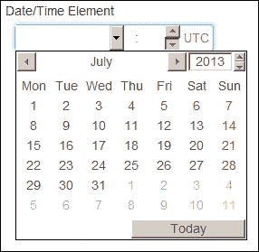 |

| `datetime-local` |
| --- |

+   元素：`Zend\Form\Element\DateTimeLocal`

+   用于渲染客户端浏览器时区的 **日期/时间本地元素** 输入字段

+   HTML 标签：`<input type="datetime-local" name="element-date-time-local">`

+   以下截图显示了在 Opera 12.0 中渲染的 `datetime-local` 元素：

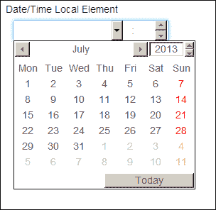 |

| `time` |
| --- |

+   元素：`Zend\Form\Element\Time`

+   用于渲染 **时间元素** 字段

+   HTML 标签：`<input type="time" name="element-time">`

+   以下截图显示了在 Opera 12.0 中渲染的时间元素：

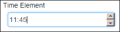 |

| `date` |
| --- |

+   元素：`Zend\Form\Element\Date`

+   用于渲染 **日期元素** 字段

+   HTML 标签：`<input type="date" name="element-date">`

+   以下截图显示了在 Opera 12.0 中渲染的 `date` 元素：

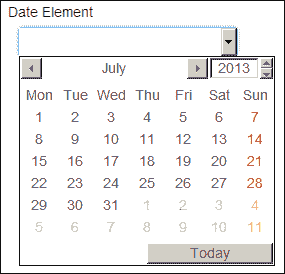 |

| `week` |
| --- |

+   元素: `Zend\Form\Element\Week`

+   用于渲染 **周元素** 字段

+   HTML 标签: `<input type="week" name="element-week">`

+   在 Opera 12.0 中渲染的 `week` 元素如下截图所示：

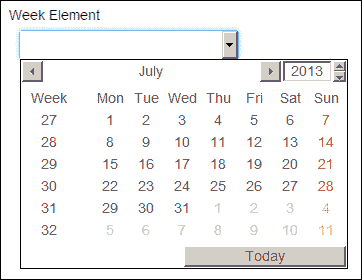 |

| `month` |
| --- |

+   元素: `Zend\Form\Element\Month`

+   用于渲染 **月份元素** 字段

+   HTML 标签: `<input type="month" name="element-month">`

+   在 Opera 12.0 中渲染的 `month` 元素如下截图所示：

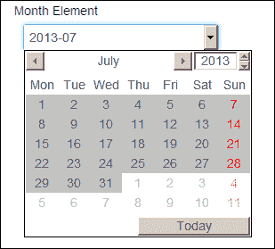 |

| `email` |
| --- |

+   元素: `Zend\Form\Element\Email`

+   用于渲染 **电子邮件** 输入字段

+   HTML 标签: `<input type="email" name="element-email">`

|

| `url` |
| --- |

+   元素: `Zend\Form\Element\Url`

+   用于渲染 **URL** 输入字段

+   HTML 标签: `<input type="url" name="element-url">`

|

| `number` |
| --- |

+   元素: `Zend\Form\Element\Number`

+   用于渲染 **数字元素** 输入字段

+   HTML 标签: `<input type="number" name="element-number">`

+   在 Opera 12.0 中渲染的 `number` 元素如下截图所示：

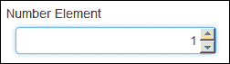 |

| `range` |
| --- |

+   元素: `Zend\Form\Element\Range`

+   用于使用滑动控件渲染 **范围元素** 输入字段

+   HTML 标签: `<input type="range" name="element-range">`

+   在 Opera 12.0 中渲染的 `range` 元素如下截图所示：

 |

| `color` |
| --- |

+   元素: `Zend\Form\Element\Color`

+   用于使用颜色选择器渲染 **颜色元素** 输入字段

+   HTML 标签: `<input type="color" name="element-color">`

+   在 Opera 12.0 中渲染的 `color` 元素如下截图所示：

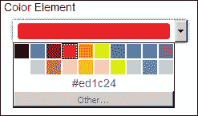 |

# 行动时间 - HTML5 输入元素

在本例中，我们将创建一个测试 HTML5 表单，用于渲染各种类型的 HTML5 输入元素：

1.  创建一个用于渲染表单元素 `formAction()` 的测试操作；它可以在新的控制器 `Html5TestController - 模块/Users/src/Users/Controller/Html5TestController.php` 下创建。

1.  添加对 `Zend\Form\Form` 和 `Zend\Form\Element` 的引用：

    ```php
    use Zend\Form\Element;
    use Zend\Form\Form;
    ```

1.  将各种 HTML5 表单元素添加到表单中：

    ```php
    $form  = new Form();

    // Date/Time Element 
    $dateTime = new Element\DateTime('element-date-time');
    $dateTime
    ->setLabel('Date/Time Element')
    ->setAttributes(array(
      'min'  => '2000-01-01T00:00:00Z',
      'max'  => '2020-01-01T00:00:00Z',
      'step' => '1', 
    ));
    $form->add($dateTime);

    // Date/Time Local Element 
    $dateTime = new Element\DateTimeLocal('element-date-time-local');
    $dateTime
    ->setLabel('Date/Time Local Element')
    ->setAttributes(array(
      'min'  => '2000-01-01T00:00:00Z',
      'max'  => '2020-01-01T00:00:00Z',
      'step' => '1',
    ));
    $form->add($dateTime);

    // Time Element 
    $time = new Element\Time('element-time');
    $time->setLabel('Time Element');
    $form->add($time);

    // Date Element 
    $date = new Element\Date('element-date');
    $date
    ->setLabel('Date Element')
    ->setAttributes(array(
      'min'  => '2000-01-01',
      'max'  => '2020-01-01',
      'step' => '1',
    ));
    $form->add($date);

    // Week Element 
    $week = new Element\Week('element-week');
    $week->setLabel('Week Element');
    $form->add($week);

    // Month Element 
    $month = new Element\Month('element-month');
    $month->setLabel('Month Element');
    $form->add($month);

    // Email Element 
    $email = new Element\Email('element-email');
    $email->setLabel('Email Element');
    $form->add($email);

    // URL Element 
    $url = new Element\Url('element-url');
    $url->setLabel('URL Element');
    $form->add($url);

    // Number Element 
    $number = new Element\Number('element-number');
    $number->setLabel('Number Element');
    $form->add($number);

    // Range Element 
    $range = new Element\Range('element-range');
    $range->setLabel('Range Element');
    $form->add($range);

    // Color Element 
    $color = new Element\Color('element-color');
    $color->setLabel('Color Element');
    $form->add($color);
    ```

## *发生了什么？*

我们已经创建了一个仅使用由 Zend Framework 2.0 支持的 HTML5 元素组成的简单表单。当前形状的表单可以通过创建必要的视图来渲染。我们的下一个任务将是使用 HTML5 辅助器构建此表单的视图，并渲染添加到表单中的所有表单元素。

# HTML5 视图辅助器

Zend 框架提供了用于渲染上一节中描述的所有表单元素的视图辅助器。`formElement()` 视图辅助器可以用来根据输入类型动态渲染任何类型的输入，但这并不是建议的做法。

以下表格列出了可用于 HTML5 输入元素的标准化 HTML5 辅助器列表：

| 输入类型 | 辅助 | 辅助函数 |
| --- | --- | --- |
| `datetime` | `Zend\Form\View\Helper\FormDateTime` | `formDateTime()` |
| `datetime-local` | `Zend\Form\View\Helper\FormDateTimeLocal` | `formDateTimeLocal()` |
| `time` | `Zend\Form\View\Helper\FormTime` | `formTime()` |
| `date` | `Zend\Form\View\Helper\FormDate` | `formDate()` |
| `week` | `Zend\Form\View\Helper\FormWeek` | `formWeek()` |
| `month` | `Zend\Form\View\Helper\FormMonth` | `formMonth()` |
| `email` | `Zend\Form\View\Helper\FormEmail` | `formEmail()` |
| `url` | `Zend\Form\View\Helper\FormUrl` | `formUrl()` |
| `number` | `Zend\Form\View\Helper\FormNumber` | `formNumber()` |
| `range` | `Zend\Form\View\Helper\FormRange` | `formRange()` |
| `color` | `Zend\Form\View\Helper\FormColor` | `formColor()` |

除了标准的视图辅助工具列表之外，Zend 框架还提供了 `tel` 和 `search` 输入类型的辅助工具；这些输入类型是文本输入的扩展，但某些浏览器（尤其是移动浏览器）在这两个元素中支持样式化的输入选项。

以下表格列出了可用于 HTML5 输入元素的附加 HTML5 辅助工具列表：

| 输入类型 | 辅助工具 | 辅助函数 |
| --- | --- | --- |
| `tel` | `Zend\Form\View\Helper\FormTel` | `formTel()` |
| `search` | `Zend\Form\View\Helper\FormSearch` | `formSearch()` |

# 时间行动 – HTML5 视图辅助工具

在本任务中，我们将渲染在前一个任务中创建的所有表单元素。我们将使用 ZF 的 HTML5 视图辅助工具来渲染这些元素。执行以下步骤：

1.  创建一个简单的视图，用于渲染表单。

1.  使用以下代码利用视图辅助工具渲染各种表单元素：

    ```php
    $this->formDateTime($form->get('element-date-time'));
    $this->formDateTimeLocal($form->get('element-date-time-local'));
    $this->formTime($form->get('element-time'));
    $this->formDate($form->get('element-date'));
    $this->formWeek($form->get('element-week'));
    $this->formMonth($form->get('element-month'));
    $this->formEmail($form->get('element-email'));
    $this->formUrl($form->get('element-url'));
    $this->formNumber($form->get('element-number'));
    $this->formRange($form->get('element-range'));
    $this->formColor($form->get('element-color'));
    ```

1.  在 Opera 12 等 HTML5 兼容的浏览器中测试表单。您应该能够看到以下截图所示的表单：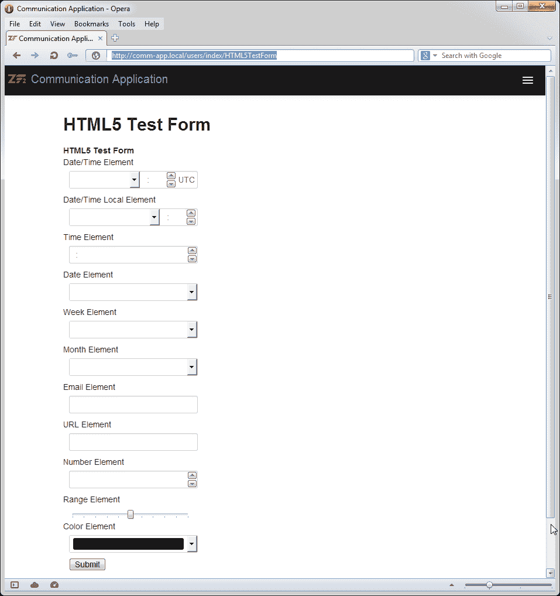

1.  现在，在 IE 9 等 HTML5 不兼容的浏览器中测试相同的表单。您应该能够看到以下截图所示的表单。您可以看到，不支持的输入元素被文本框替换了：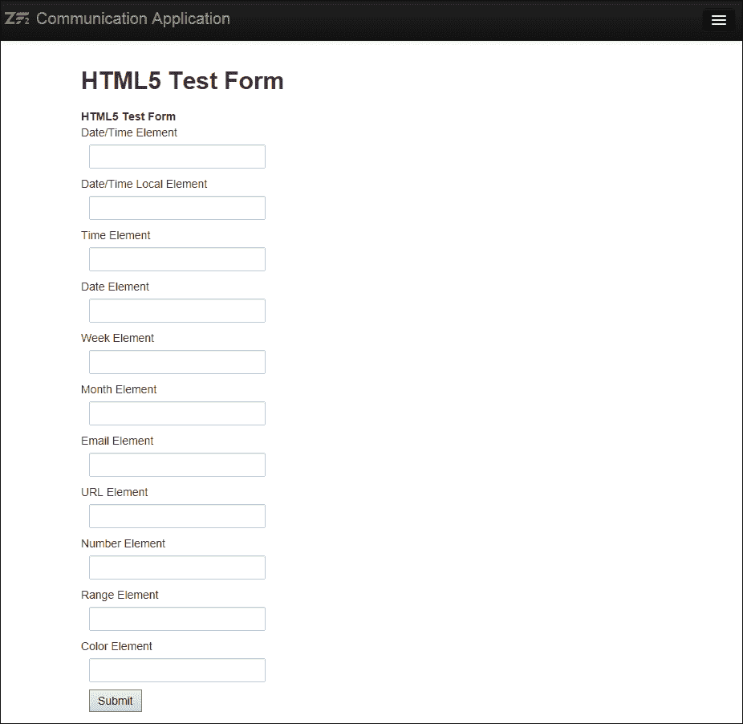

## *发生了什么？*

我们已经使用 ZF2 表单元素创建了我们的第一个 HTML5 表单。到目前为止，Opera 12 提供了最好的 HTML5 支持；其他浏览器如 Chrome 和 Safari 在支持方面也相当不错。因此，如果您正在测试您的 HTML5 表单，请确保您在兼容的浏览器中测试，例如 Opera 12。

### 注意

**HTML5 浏览器兼容性**

各浏览器对 HTML5 规范的支持不一致；在合规性方面，Opera 和 Chrome 似乎提供了最好的支持，但它们都不完全符合规范。随着每个新浏览器版本的发布，都会增加对这些特性的支持。互联网上有许多资源可以帮助您检查您的浏览器与 HTML5 的兼容性。

[`html5test.com/`](http://html5test.com/) 是一个基于浏览器对 HTML5 支持情况进行排名和比较的门户网站。

[`caniuse.com/`](http://caniuse.com/) 也是一个很棒的网站，用户可以检查他们是否可以在特定的浏览器上使用特定的 HTML5 功能。

## 尝试一下英雄

在你继续使用高级 HTML5 属性之前，这里有一个简单的任务给你。现在你已经使用所有标准 HTML5 元素创建了一个表单，尝试通过使用视图助手来渲染`tel`和`search`类型的输入来扩展这个表单。

# HTML5 属性

你可能已经注意到，在章节的开头我们使用了新的属性，如`min`、`max`和`step`。这些是在 HTML5 规范中定义的新属性，允许开发者对输入元素进行额外的配置。以下列表中讨论了一些重要的属性：

+   `max`: 适用于**数字**、**范围**和**日期**字段；允许指定输入的最大值。

+   `min`: 适用于**数字**、**范围**和**日期**字段；允许指定输入的最小值。

+   `step`: 适用于**数字**、**范围**和**日期**字段；允许指定输入的增量值。

+   `list`: 适用于各种文本框样式输入。允许开发者将字段映射到数据列表，从而允许最终用户从列表中选择。

+   `placeholder`: 适用于各种文本框样式输入。允许开发者显示占位文本，直到元素获得焦点。

+   `pattern`: 适用于各种文本框样式输入。允许开发者验证用户输入是否与正则表达式匹配，并抛出验证错误。

+   `required`: 防止用户在必填字段中提交空值。

+   `multiple`: 适用于文件输入；允许从单个文件控件上传多个文件。

## 多文件上传

为了实现多文件上传，你需要将文件输入元素的`multiple`属性设置为`TRUE`。如果浏览器支持多文件上传，则用户将被允许选择多个文件，否则控件将限制为仅选择一个文件。

# 行动时间 – HTML5 多文件上传

执行以下步骤进行 HTML5 多文件上传：

1.  创建一个新的`ImageUpload`表单；确保将`File`元素的`multiple`属性设置为`TRUE`：

    ```php
    <?php
    // filename : module/Users/src/Users/Form/MultiImageUploadForm.php
    namespace Users\Form;

    use Zend\Form\Form;
    use Zend\Form\Element;
    use Zend\InputFilter;

    class MultiImageUploadForm extends Form
    {
        public function __construct($name = null, $options = array())
        {
            parent::__construct($name, $options);
            $this->addElements();
            $this->addInputFilter();
        }

        public function addElements() 
        {
          $imageupload = new Element\File('imageupload');
          $imageupload->setLabel('Image Upload')
            ->setAttribute('id', 'imageupload')
     ->setAttribute('multiple', true); 
     //Enables multiple file uploads
          $this->add($imageupload);

          $submit = new Element\Submit('submit');
          $submit->setValue('Upload Now');
          $this->add($submit);
        }

        public function addInputFilter()
        {
          $inputFilter = new InputFilter\InputFilter();
          // File Input
          $fileInput = new InputFilter\FileInput('imageupload');
          $fileInput->setRequired(true);
     $fileInput->getFilterChain()->attachByName(
     'filerenameupload',
     array(
     'target' => './data/images/temp.jpg',
     'randomize' => true
     )
     );
          $inputFilter->add($fileInput);
          $this->setInputFilter($inputFilter);
        }
    }
    ```

    ### 小贴士

    **Zend\Filter\File\RenameUpload**

    `RenameUpload`过滤器用于重命名并移动上传的文件到`target`中指定的新路径。要了解更多信息，请参阅框架文档[`framework.zend.com/manual/2.2/en/modules/zend.filter.file.rename-upload.html.`](http://framework.zend.com/manual/2.2/en/modules/zend.filter.file.rename-upload.html.)

1.  设置一个动作来处理文件上传，并将用户重定向到上传确认页面：

    ```php
    public function multiUploadAction()
    {
      // prepare form
      $form = $this->getServiceLocator()->get('MultiImageUploadForm');
      $request = $this->getRequest();
      if ($request->isPost()) {
        $post = array_merge_recursive(
          $request->getPost()->toArray(),
          $request->getFiles()->toArray()
        );
            $form->setData($post);
        if ($form->isValid()) {
          $data = $form->getData();
          // Form is valid, save the form!
          return $this->redirect()->toRoute('users/html5-test', array('action' => 'processMultiUpload'));
        }
      }
      $viewModel  = new ViewModel(array('form' => $form));
      return $viewModel;
    }
    ```

1.  现在测试您的浏览器中支持 HTML5 多文件上传的表单，例如 Opera 12。您将看到文件选择器界面允许选择多个文件，如下面的截图所示：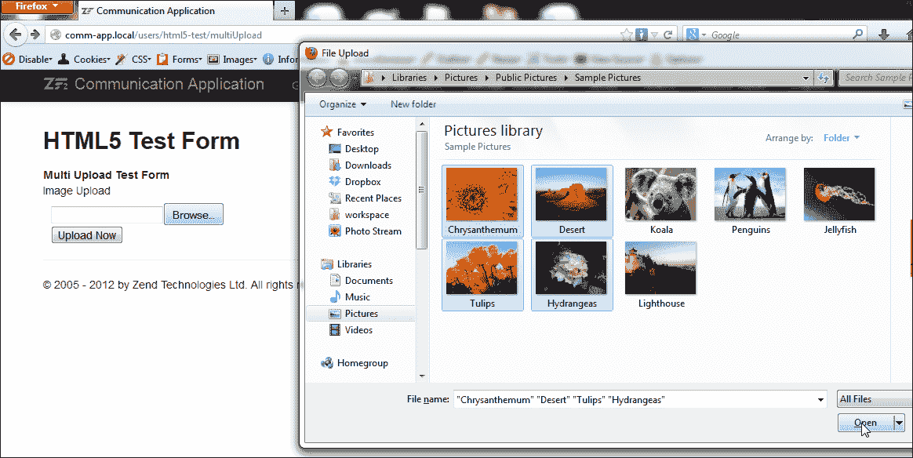

1.  在您选择 **立即上传** 并完成上传过程后，您将看到如下所示的确认页面：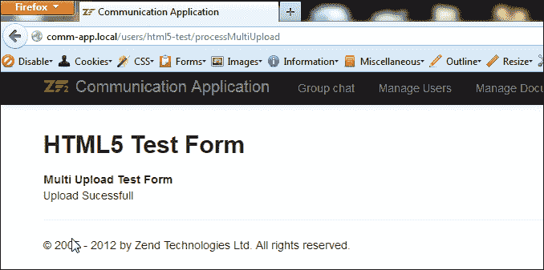

1.  您可以通过导航到 `data/images` 目录并查找上传的文件来验证文件是否已成功上传且过滤器已应用。您可以看到所有文件都以 `temp` 开头，并在文件名中有一个 `_<随机数字>` 后缀：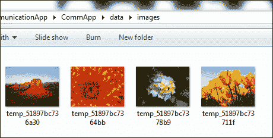

### 小贴士

**具有多个文件上传的过滤器**

在应用具有多个文件上传的过滤器时，过滤器将应用于所有成功上传的文件，并使用相同的过滤器选项设置。

## *刚才发生了什么？*

我们现在已经使用 HTML5 属性和 Zend 表单元素创建了一个 HTML5 多文件上传表单。我们还应用了一个过滤器来重命名上传的文件，并看到了过滤器在多文件上传中的工作方式。

## 快速问答 – HTML5 支持

Q1. 以下哪种方法是新支持的 HTML5 输入类型？

1.  `文本`

1.  `单选按钮`

1.  `复选框`

1.  `数字`

以下哪些输入类型在 ZF 2.1 中没有定义 `Form` 元素？

1.  `电话号码`

1.  `日期`

1.  `颜色`

1.  `搜索`

# 摘要

HTML5 是一种非常强大且健壮的 HTML 规范，目前大多数浏览器仍在部分支持。随着市场上浏览器新版本的推出，您将看到对这一规范的更多增强支持。在我们下一章中，我们将使用 ZF2 来构建移动网络应用。
