# 第十章.构建移动应用程序

*移动应用程序开发中的一个主要挑战是在构建移动应用程序时需要针对多样化的平台。例如，PhoneGap 和 Titanium 等平台使开发者能够构建跨平台移动应用程序，但这一模式的缺点是需要管理不同平台上的多个项目，包括移动和 Web 服务。随着 Zend Studio 10 的发布，Zend 试图通过提供一个基于 PhoneGap 的开发平台来填补这一空白，该平台支持在基于云的环境中构建端到端移动应用程序。*

随着 Zend Studio 10 的发布，Zend 现在提供了一个使用 Zend Framework 2 的极其简化的移动应用程序开发平台，称为**云连接移动工具**。在本章中，我们将学习如何使用 Zend Studio 构建云连接移动应用程序的基础知识。以下是一些关键的学习领域：

+   构建您的第一个**云连接移动**（**CCM**）应用程序

+   作为原生应用程序进行测试

+   实现简单的搜索界面

# 云连接移动应用程序

Zend Studio 现在提供了一个 CCM 工具，使开发者能够使用云平台构建原生移动应用程序。CCM 支持使用 Zend Framework 2 和 Zend Server Gateway 在云上开发基于 RPC 或 REST 的 Web 服务。

CCM 还通过集成各种移动 SDK（Android SDK/ADT for Android、Xcode for iOS 和 Windows Phone SDK for Windows Phone）提供了开发原生移动应用程序的支持。这使得开发者能够在原生环境/设备上构建和测试应用程序。

CCM 工具还提供了一个简单易用的移动 GUI 编辑器，它帮助开发者轻松地为他们的移动应用程序构建出色的用户界面。

## Zend Studio 10

在构建您的移动应用程序的第一步，请确保您已在您的开发机器上安装了 Zend Studio 10。Zend Studio 10 提供了构建云连接移动应用程序的集成支持，并允许开发者将他们的移动应用程序部署到云上。

您可以从 Zend 在线商店购买 Zend Studio 10；同时还有一个 30 天的免费试用期。有关更多信息，请访问[`www.zend.com/en/products/studio/`](http://www.zend.com/en/products/studio/)。

## phpCloud

Zend 开发者云是一个基于云的 PHP 开发环境，它使开发者能够在云上构建和部署应用程序，无需经历设置 PHP 开发环境、配置和维护环境的麻烦。

此环境已安装 Zend Framework 2 和大量 PHP 扩展；开发者可以使用各种开发工具，如 Zend Studio、Eclipse PDT 和 CLI，在开发者云上构建和部署他们的应用程序。Zend 开发者云还提供了将应用程序推送到其他外部云服务（如 Amazon 和 IBM SmartCloud）的功能。

Zend 开发者云目前处于免费开发者测试版。有关 Zend 开发者云的更多信息，请参阅他们的网站：[`www.phpcloud.com/`](http://www.phpcloud.com/)。

# 操作时间 – 配置您的 phpCloud 账户

在此任务中，我们将按照以下步骤设置我们的 phpCloud 账户并在 Zend Studio 10 中配置云环境：

1.  访问 [`my.phpcloud.com/user/login`](https://my.phpcloud.com/user/login)，注册新账户并登录到您的 phpCloud 账户。

1.  登录后，您将被要求创建一个容器。您可以指定一个容器名称，该名称将成为容器 URL 的一部分；您还可以选择生成 SSH 密钥对或使用您自己的 SSH 密钥；在这种情况下，我们将生成一个新的 SSH 密钥对。以下截图描述了容器创建界面：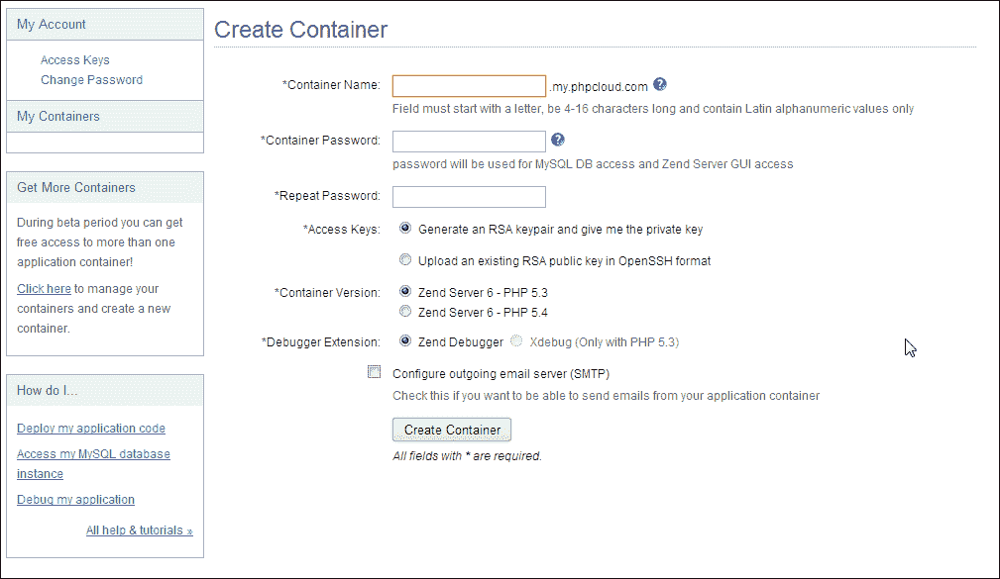

1.  现在下载 SSH 密钥；我们将使用这些密钥在 Zend Studio 中设置部署目标：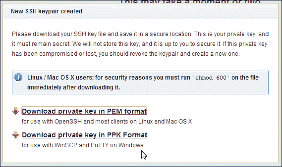

1.  在 Zend Studio 中，导航到 **窗口** | **显示视图** | **目标**：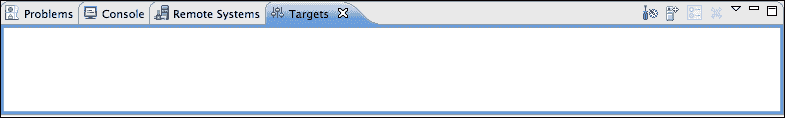

1.  点击 **添加目标** 图标，并选择如图所示的 **phpcloud**：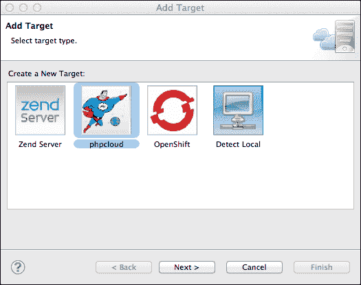

1.  在 **phpcloud 目标详情** 页面上，您将被要求提供以下详细信息：

    +   **用户名**：用于指定您的 Zend 开发者云用户名

    +   **密码**：用于指定您的 Zend 开发者云密码

    +   **SSH 私钥**：用于指向在 phpcloud 容器创建界面中刚刚生成的 SSH 密钥

    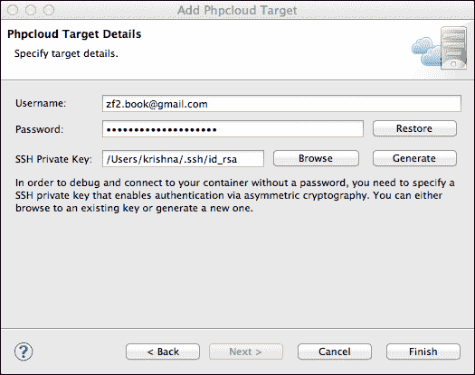

1.  点击 **完成** 后，您将看到新目标已添加到目标列表中：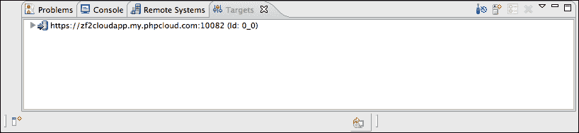

## *刚才发生了什么？*

我们已成功使用 Zend 的云连接移动应用项目创建了我们的第一个移动应用程序。在接下来的章节中，我们将了解如何使用 Zend Framework 2 扩展这些网络服务，将更多功能集成到移动应用程序中。

## PhoneGap 和 Zend Studio

PhoneGap 是一个移动应用程序开发框架，允许开发者使用 HTML、CSS 和 JavaScript 构建移动应用程序。PhoneGap 框架用于将这些应用程序转换为原生移动应用程序，无需在原生语言（如 Objective-C）中重写应用程序。

Zend Studio 10 现在将 PhoneGap 集成到 Zend Studio IDE 中；这使得开发者能够轻松构建和测试移动应用程序，而无需依赖外部库。

关于使用 Zend Studio 10 构建云连接移动应用程序的更多信息，请参阅以下文档页面：

[`files.zend.com/help/Zend-Studio-10/zend-studio.htm#cloud_connect_mobile.htm`](http://files.zend.com/help/Zend-Studio-10/zend-studio.htm#cloud_connect_mobile.htm)

# 动手实践 – 构建您的第一个云连接移动应用程序

执行以下步骤以构建您的第一个云连接移动应用程序：

1.  从**新建**菜单中选择**云连接移动项目**选项：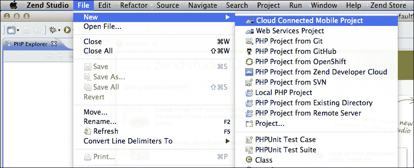

1.  在**项目**向导中，您将被要求提供以下详细信息：

    +   **移动项目名称**：客户端移动应用程序项目的名称

    +   **网络服务项目名称**：移动应用程序的网络服务项目名称

    +   **网络服务项目部署目标**：移动应用程序的部署目标（您可以选择之前创建的 phpcloud 目标）

        ### 提示

        Zend Studio 10 支持各种部署选项；它可以自动检测本地 Zend Server 安装或将应用程序部署到以下目标之一——本地 Zend Server、远程 Zend Server、Zend Developer Cloud（phpCloud）或 OpenShift Cloud。

    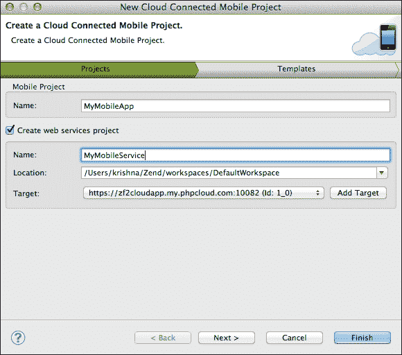

1.  在模板选择页面，选择**简单服务**，因为它将创建一个包含客户端/服务器端示例的简单项目，如下面的截图所示：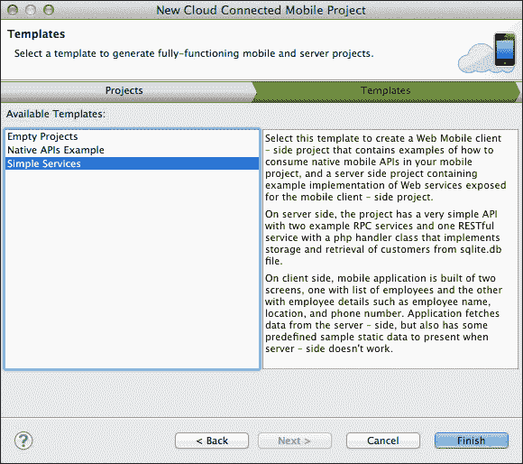

1.  点击**完成**将创建移动和 Web 服务项目。移动项目中的用户界面设计师使我们能够轻松地更改移动界面，如下面的截图所示：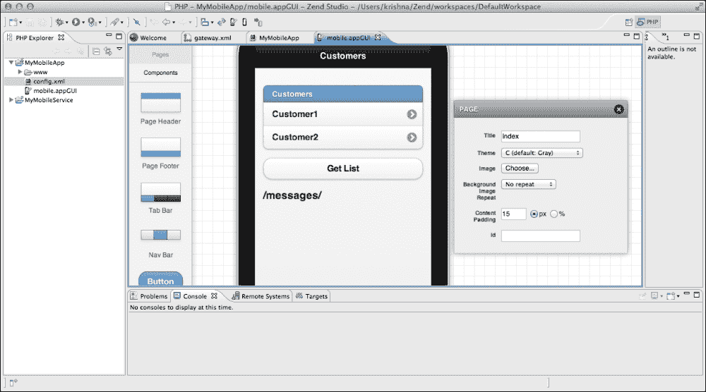

1.  现在从 Zend Studio IDE 运行项目；它应该启动一个 Zend 模拟器界面，如下面的截图所示：

    ### 提示

    **获取列表**按钮应通过 RPC 调用从网络服务项目返回客户列表。如果请求没有返回响应并抛出错误，例如**Ajax 错误。错误：访问被拒绝。尝试静态数据**，则检查`MobileApplication/www/js/my.js`中的`gatewayURL`变量。

    确保它指向正确的部署 URL，如下所示：

    `var gatewayURL = 'http://zf2cloudapp.my.phpcloud.com/MobileService';`

    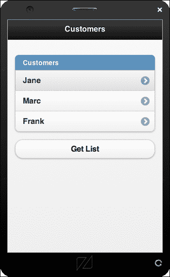

## *发生了什么？*

我们已成功使用 Zend 的云连接移动应用程序项目创建了我们的第一个移动应用程序。在随后的章节中，我们将了解如何使用 Zend Framework 2 扩展这些网络服务，以在移动应用程序中构建更多功能。

# 原生应用程序与移动网络应用程序的比较

原生移动应用程序相较于移动网络应用程序提供了巨大的优势。原生网络应用程序从设备内存中运行，因此几乎不需要网络交互；这些应用程序通常加载和运行得更快。原生移动应用程序的另一个关键优势是它们可以访问设备的原生功能，如相机、设备信息和加速度计；这使原生应用程序相较于移动网络应用程序具有额外的优势。

# 行动时间 – 作为原生应用程序进行测试

在此任务中，我们将使用 Zend Studio 的**原生应用程序**部分创建原生 iOS 应用程序。在您开始之前，请确保您的 Mac 上已安装 Xcode IDE。执行以下步骤：

### 小贴士

对于 Android 应用程序，您需要安装**Android 开发工具**（**ADT**）；这可以直接从 Zend Studio 安装。

对于 Windows Phone 应用程序，需要安装 Windows Phone SDK。

1.  现在，从我们的移动应用程序项目中选择**创建 iOS 应用程序**：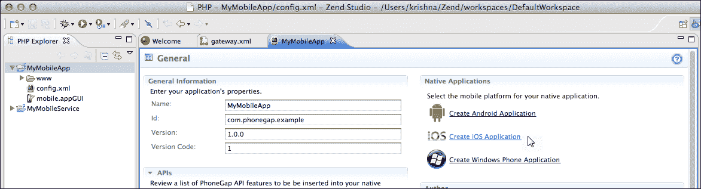

1.  您将被要求提供项目详细信息；请指定**公司名称**和**包标识符**的值。**包标识符**的值是指用于识别应用程序的唯一名称；这通常以`com.my-company-name.my-application-name`的格式提供。当您在苹果商店注册应用程序时，请确保包标识符与苹果提供的匹配。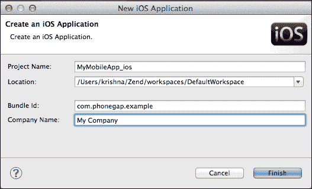

1.  现在您可以在工作区中看到新创建的 iOS 项目，如下截图所示：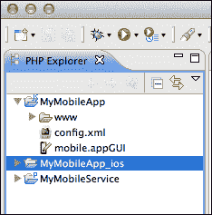

    ### 小贴士

    Zend Studio 允许创建多个相互依赖的移动应用程序项目。如果您需要对客户端代码进行任何更改，可以在父移动项目中做出更改，这将自动更新所有依赖的客户端项目。

    关于创建原生应用程序的更多信息，请参阅以下链接中的 Zend Studio 文档：

    [`files.zend.com/help/Zend-Studio-10/zend-studio.htm#creating_native_applications.htm`](http://files.zend.com/help/Zend-Studio-10/zend-studio.htm#creating_native_applications.htm)

1.  如果运行项目，应用程序将启动 iOS 模拟器并启动如图所示的移动应用程序：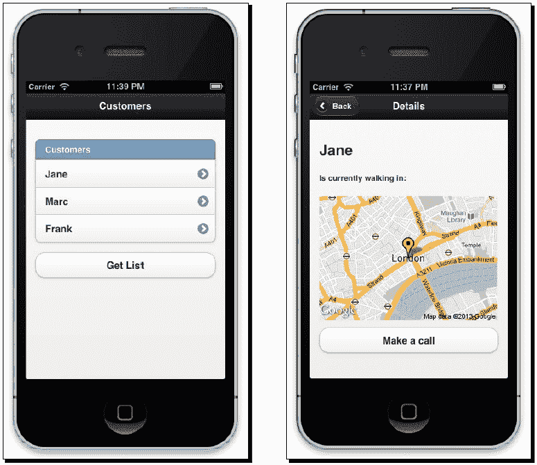

## *发生了什么？*

我们已使用 Zend Studio 对原生应用程序的支持创建了一个新的原生 iOS 应用程序；在我们的下一节中，我们将使用 Zend Framework 2 为此应用程序提供网络服务。

## 尝试一下英雄

现在您已经创建了一个 iOS 原生应用程序，尝试使用 Zend Studio 创建相同应用程序的 Android 版本。为此，您需要在您的 Zend Studio 安装上安装 Android 开发工具。

# Zend Server Gateway

Zend Server Gateway 是基于 Zend Framework 2 的轻量级网络服务网关，它允许将网络服务路由映射到各种网络服务的控制器/操作。Zend Server Gateway 负责 CCM 项目中使用的 RPC 和 RESTful API 的认证、验证、过滤和路由。

路由配置映射到`config/gateway.xml`；路由和配置可以使用在 Zend Studio 中提供的网关编辑器界面进行管理。

# 行动时间 – 创建移动搜索界面

在本任务中，我们将通过以下步骤创建一个简单的搜索界面，用于通过名称搜索现有客户记录：

1.  我们需要在`CustomerRepository`模型中创建一个搜索函数（`MyMobileService\src\MyCompany\Model\CustomerRepository.php`）：

    ```php
        public function getSearch($query)
        {
          $where = new \Zend\Db\Sql\Where();
          $where->like('name', "%$query%");
          return $this->customerTable->select($where)->toArray();
        }
    ```

1.  在`RpcController`（`MyMobileService\src\MyCompany\Controller\RpcController.php`）中添加一个新操作；这将处理网络服务请求：

    ```php
        public function getSearchCustomersAction ($query)
        {
          $cr = new CustomerRepository();
          return $cr->getSearch($query);
        }
    ```

1.  在网关编辑器中，创建一个新的 RPC 服务；设置以下选项：

    +   **URL**: `/search`

    +   **方法**: `GET`

    +   **请求参数（添加）**: **名称** – `query`; **来源** – `路由`

    +   **处理方法**: `MyCompany\Controller\RpcController::getSearchCustomersAction`

1.  您可以通过右键单击服务并选择**测试服务**来测试 RPC 服务。在右侧，您将看到一个提供测试输入并验证服务响应的界面：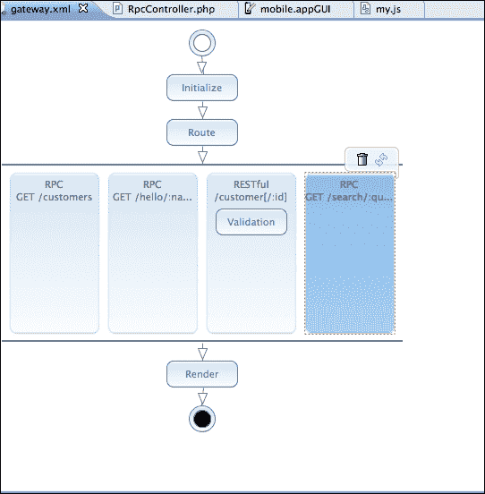

1.  在移动 GUI 编辑器中，创建一个新的页面`searchCustomers`，并添加以下元素：

    +   **文本框**: `custsearchinput`

    +   **按钮**: `searchbutton`

    +   **列表视图**: `custlistview`

1.  在“搜索”按钮的“绑定”部分，将按钮绑定到`GET /search:query()`网络服务。将`custsearchinput`文本框映射到“数据”部分的`query`路由参数。此操作将搜索文本绑定到`query`路由参数。请注意，`query`路由参数已经映射到`getSearchCsutomerAction`。

1.  修改`MyMobileApp/www/js/my.js`中的`onGetSearchquery` JavaScript 方法以处理 RPC 响应：

    ```php
    function onGetSearchquery(response) {
      // TODO Custom logic to handle server response
      customers = response;

      var newCustomers = '';
      $.each(customers, function(index, item) {
        newCustomers += '<li data-theme="">' 
            + '<a href="#page2?empId=' + index
           + '" data-transition="none">' + item.name + '</a>' + '</li>';
      });

      $('#custlistview li[role!=heading]').remove();
      $('#custlistview').append(newCustomers).listview('refresh');
    }
    ```

1.  确保使用按钮从`index`页面链接到`Search`页面。

1.  现在以原生模式运行项目；您将能够看到搜索页面，就像以下屏幕截图所示：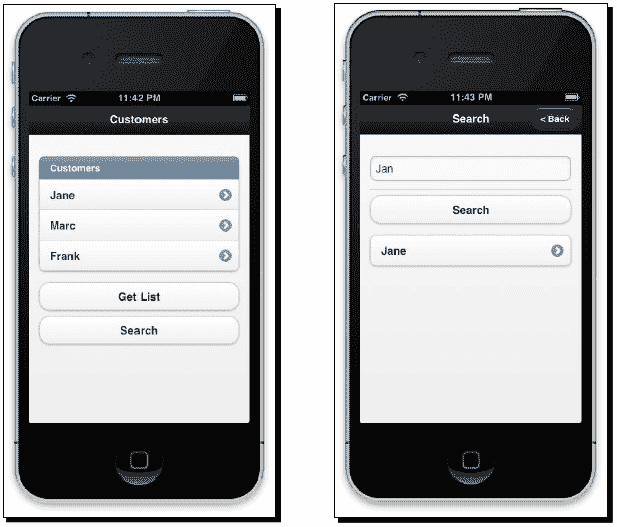

## *发生了什么？*

我们现在为现有的云连接移动应用程序创建了新的网络服务，并在原生模拟器中测试了移动应用程序。使用 Zend Studio 10，您可以看到构建由云上运行的网络服务支持的移动应用程序的简单性。

## 快速问答 – 构建移动应用程序

Q1. 以下哪些平台在 Zend Studio 10 中支持原生移动应用程序开发？

1.  Android

1.  Firefox OS

1.  MeeGo

1.  Brew

Q2. 以下哪些网络服务不支持 Zend Server Gateway 构建云连接的移动应用程序？

1.  RPC

1.  SOAP

1.  REST

# 摘要

云连接的移动应用程序是 Zend 朝着使 PHP 开发者能够使用云平台构建和支持移动应用程序迈出的重要一步。通过 CCM，Zend 提供了一个极其强大且易于使用的平台来构建这些应用程序。

完成本章后，您已经到达了本书的结尾。您通过本书学习了 Zend Framework 在各个不同应用中的大量内容，并完成了一系列任务。本书向您展示了使用 Zend Framework 2 开发应用程序的基本构建块；在 Zend Framework 中还有更多东西要学习，其中大部分都在 Zend Framework 文档中以极其详细的方式进行了解释([`framework.zend.com/manual/2.2/en/index.html`](http://framework.zend.com/manual/2.2/en/index.html))。

感谢您阅读本书。请随时就您阅读本书的感受提供反馈。
